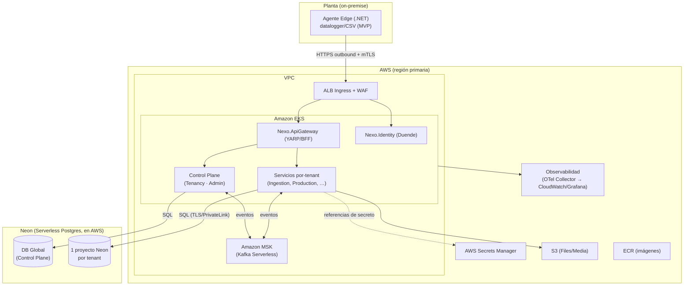

# 00 · Baseline Técnico — Nexo (MVP)

> **Documento:** `design/00-tech-baseline.md` · **Estado:** Borrador v0.1 · **Actualizado:** 2026-07-11
> **Roles:** Software Architect · Tech Lead
> **Relacionados:** [README](./README.md) · [01-multi-tenancy-connection.md](./01-multi-tenancy-connection.md) · [02-event-model.md](./02-event-model.md) · [../specs/specs/architecture.md](../specs/specs/architecture.md)

## Resumen ejecutivo

Este documento es el **ancla técnica** de Nexo. Fija el stack, las convenciones de código, la topología en
AWS, los patrones de comunicación y los aspectos transversales (identidad, secretos, observabilidad, CI/CD)
que **todos los demás documentos de diseño deben respetar**. Traduce las decisiones funcionales de
[`specs/`](../specs/README.md) a un diseño técnico concreto para el **MVP**, sin romper el camino hacia la
escala Enterprise (miles de tenants, millones de eventos/día).

Las decisiones aquí registradas están cerradas (ver §9, ADRs). Los puntos aún abiertos están en §10.

---

## 1. Stack y decisiones fundamentales

| Dimensión | Decisión | ADR |
|---|---|---|
| Lenguaje/runtime | **.NET 8 (C#)**, LTS | ADR-T1 |
| Estilo de servicio | Microservicios, **Clean Architecture** por servicio | ADR-T2 |
| Base de datos | **PostgreSQL en Neon** (serverless), **un proyecto Neon por tenant** | ADR-T3 |
| Persistencia | **EF Core + Npgsql**; migraciones EF versionadas | ADR-T3 |
| Mensajería async | **Amazon MSK (Kafka Serverless)** detrás de **MassTransit** | ADR-T4 |
| APIs | **REST/OpenAPI** en el borde · **gRPC** interno sync · **eventos** async | ADR-T5 |
| Identidad | **Duende IdentityServer** (OIDC/OAuth2, federación por tenant, MFA) | ADR-T6 |
| Nube | **AWS** (EKS, MSK, S3, Secrets Manager, ECR) | ADR-T7 |
| Repositorio | **Monorepo** (una solución .NET + paquetes compartidos) | ADR-T8 |
| Observabilidad | **OpenTelemetry** (trazas/métricas/logs), correlación por `tenant_id` | ADR-T9 |

---

## 2. Estructura del monorepo (.NET)

Un único repositorio con una solución .NET, servicios independientes desplegables y paquetes compartidos
(`BuildingBlocks`). Cada servicio es su propio *bounded context* y su propio contenedor.

```text
/nexo
├── nexo.sln
├── src/
│   ├── BuildingBlocks/                 # Paquetes compartidos (NuGet internos)
│   │   ├── Nexo.BuildingBlocks.Domain          # Entity, AggregateRoot, ValueObject, DomainEvent, Result
│   │   ├── Nexo.BuildingBlocks.Application      # CQRS (MediatR), behaviors, validación
│   │   ├── Nexo.BuildingBlocks.Messaging        # Abstracción de eventos (MassTransit), Outbox
│   │   ├── Nexo.BuildingBlocks.MultiTenancy     # Resolución de tenant, ITenantContext, connection factory
│   │   ├── Nexo.BuildingBlocks.Observability    # OpenTelemetry, logging, correlación
│   │   └── Nexo.BuildingBlocks.Web              # Middlewares, manejo de errores, auth handlers
│   ├── ControlPlane/                   # Servicios del plano global (DB global)
│   │   ├── Nexo.Tenancy                         # Provisioning, Tenant Connection Registry
│   │   ├── Nexo.Admin                           # Licencias, feature flags, facturación
│   │   └── Nexo.Identity                        # Host de Duende IdentityServer
│   ├── Services/                       # Servicios por-tenant (DB del tenant)
│   │   ├── Nexo.Ingestion
│   │   ├── Nexo.Devices
│   │   ├── Nexo.Production
│   │   ├── Nexo.Quality
│   │   ├── Nexo.Scrap
│   │   ├── Nexo.Downtime
│   │   ├── Nexo.Traceability
│   │   ├── Nexo.Connectors            # Conector Odoo (ACL)
│   │   ├── Nexo.Dashboards            # Read models / CQRS de lectura
│   │   └── Nexo.Notifications
│   └── Gateways/
│       └── Nexo.ApiGateway            # BFF / reverse proxy (YARP) para el frontend
├── edge/                              # Agente Edge (.NET, se empaqueta aparte) — ver 05
├── deploy/                            # Helm charts / manifests EKS, IaC (Terraform)
└── tests/                             # Unit + integration (Testcontainers) + contract tests
```

### 2.1 Estructura interna de cada servicio (Clean Architecture)

```text
Nexo.Production/
├── Api/              # ASP.NET Core: endpoints REST (OpenAPI), gRPC, consumers de eventos, DI
├── Application/      # Casos de uso (MediatR handlers), comandos/queries, validadores, puertos
├── Domain/           # Agregados, entidades, value objects, eventos de dominio, invariantes
└── Infrastructure/   # EF Core (DbContext del tenant), repos, publicación de eventos, gRPC clients
```

- **CQRS con MediatR**: comandos y queries separados; *pipeline behaviors* para validación (FluentValidation), logging, transacciones y `tenant scope`.
- **Dominio puro**: sin dependencias de infraestructura; emite **eventos de dominio**; los invariantes viven en los agregados.
- **Mapeo**: Mapster (DTO ↔ dominio). **Resiliencia**: Polly (reintentos, circuit breaker) en clientes salientes.
- **Validación de entrada**: FluentValidation en la capa Application.

---

## 3. Topología en AWS



**Mapeo de servicios gestionados:**

| Necesidad | AWS / Servicio | Nota |
|---|---|---|
| Orquestación | **Amazon EKS** (Kubernetes) | Diseño portable; Helm por servicio |
| Mensajería | **Amazon MSK Serverless** (Kafka) | Auth IAM, dentro de la VPC |
| Base de datos | **Neon** (Postgres serverless, corre en AWS) | Conexión vía TLS público o **PrivateLink** en prod; proyecto por tenant |
| Secretos | **AWS Secrets Manager** | Cadenas de conexión Neon y credenciales ERP/canales (solo referencias en el Registry) |
| Archivos/evidencias | **Amazon S3** | Prefijo/bucket por tenant (aislamiento) |
| Imágenes | **Amazon ECR** | Build en CI |
| CDN/borde web | **CloudFront** | Frontend estático + caché |
| Observabilidad | **OTel Collector** → CloudWatch/Grafana | Trazas/métricas/logs correlacionados |

> **Nota Neon + AWS:** Neon es Postgres serverless que corre sobre AWS; se integra en la misma región y admite
> **AWS PrivateLink** para tráfico privado. El *scale-to-zero* por proyecto hace económico tener **un proyecto por
> tenant** aunque la mayoría esté ociosa.

---

## 4. Comunicación entre servicios

| Tipo | Cuándo | Tecnología |
|---|---|---|
| **REST / OpenAPI** | Borde: frontend, integraciones externas, webhooks | ASP.NET Core Minimal APIs + Swashbuckle (OpenAPI) |
| **gRPC** | Llamadas internas **sync** de baja latencia (p. ej. Ingestion→Devices para resolver contexto) | gRPC + contratos `.proto` versionados |
| **Eventos (async)** | Columna vertebral: propagación de hechos entre dominios (CQRS, integraciones) | **MassTransit** sobre **MSK/Kafka** |

- **Borde unificado** por `Nexo.ApiGateway` (YARP): enrutamiento, agregación BFF para dashboards, *rate limiting*, terminación de auth.
- **Versionado**: REST por URL (`/v1`), gRPC por paquete `.proto`, eventos por versión en el envelope (ver [02-event-model.md](./02-event-model.md)).
- **Contrato de evento canónico**: envelope común (`event_id`, `tenant_id`, `type`, `occurred_at`, `payload`, `dedup_key`, `origin_metadata`) — detalle en [02](./02-event-model.md).

### 4.1 Fiabilidad de mensajería
- **Transactional Outbox** (tabla `outbox` en la DB del tenant) para publicar eventos de forma atómica con el cambio de estado.
- **Idempotencia** en consumidores vía `dedup_key`/`event_id` (tabla `inbox`/`processed_events`).
- **Orden** por clave de partición = `tenant_id` (+ `aggregate_id` cuando importa el orden intra-agregado).
- **Reproceso**: retención en MSK + posibilidad de re-consumir desde offset (útil para reconstruir read models).

---

## 5. Multi-tenancy (resumen técnico)

- **Aislamiento por proyecto Neon por tenant** (cómputo + datos aislados). La **DB Global (Control Plane)** es un proyecto Neon aparte.
- **Resolución de tenant** por request: host/subdominio o claim `tenant_id` del JWT → **Tenant Connection Registry** (en Control Plane) → **cadena de conexión** (referencia en Secrets Manager) → `DbContext` del tenant.
- `ITenantContext` (scoped) transporta `tenant_id` por todo el pipeline (MediatR, EF, mensajería, logs).
- **Migraciones** versionadas (EF Core), aplicadas **por cohortes con feature flags**, objetivo zero-downtime, estado por tenant.
- Diseño detallado y el **connection schema** en [01-multi-tenancy-connection.md](./01-multi-tenancy-connection.md).

---

## 6. Identidad y acceso (Duende IdentityServer)

- **`Nexo.Identity`** hostea **Duende IdentityServer** (OIDC/OAuth2). Emite **JWT** con claims `sub`, `tenant_id`, `roles`, `scopes`.
- **Multi-tenant**: federación por tenant (OIDC/SAML externo) + cuentas locales (pymes); resolución de tenant por dominio/realm lógico.
- **MFA obligatoria** para roles con escritura sensible/administración y todos los roles globales; operario en kiosco con **PIN/badge/NFC** + dispositivo confiable; step-up para acciones críticas.
- **AuthZ**: RBAC con *scoping* por planta/línea (claims + políticas ASP.NET Core); validación de `scopes` por endpoint. Detalle en [07-security.md](./07-security.md).

---

## 7. Aspectos transversales

| Aspecto | Decisión |
|---|---|
| **Config** | `appsettings` + variables de entorno + Secrets Manager (nada de secretos en repo) |
| **Secretos** | AWS Secrets Manager; el Connection Registry guarda **solo referencias**; rotación programada |
| **Logging** | Serilog estructurado → OTel; **siempre** con `tenant_id` y `correlation_id` |
| **Trazas/métricas** | OpenTelemetry (auto-instrumentación ASP.NET/EF/Kafka) → Collector |
| **Health** | `/health/live` y `/health/ready` por servicio; sonda de conectividad a Neon/MSK |
| **Resiliencia** | Polly (retry, timeout, circuit breaker) en clientes salientes y consumers |
| **Errores** | `ProblemDetails` (RFC 7807) en REST; códigos de error de dominio estables |
| **Tests** | xUnit + FluentAssertions; integración con **Testcontainers** (Postgres/Kafka); contract tests de eventos |
| **CI/CD** | GitHub Actions → build/test → imagen a **ECR** → deploy a **EKS** (Helm); migraciones como job por cohorte |

---

## 8. Entornos

| Entorno | Cómputo | Datos |
|---|---|---|
| **dev** | EKS dev / local (Docker Compose) | Neon **branch** efímero por feature (branching de Neon) |
| **staging** | EKS staging | Proyecto(s) Neon de staging con tenants de prueba |
| **prod** | EKS prod (multi-AZ) | Proyecto Neon por tenant + DB Global; PrivateLink |

> El **branching de Neon** permite clonar datos de forma instantánea para entornos de prueba/preview sin copiar TB.

---

## 9. Registro de decisiones (ADRs)

| ADR | Decisión | Motivo | Consecuencia |
|---|---|---|---|
| ADR-T1 | .NET 8 (C#) | Stack elegido; LTS, rendimiento, ecosistema | Equipo .NET; drivers industriales (S7/OPC UA) a evaluar en V1 |
| ADR-T2 | Clean Architecture + CQRS (MediatR) | Aísla dominio, testeable, escala en equipo | Más *boilerplate* inicial |
| ADR-T3 | Postgres/Neon, proyecto por tenant, EF Core | Aislamiento fuerte + scale-to-zero + provisioning por API | Muchos proyectos Neon a gestionar; sin TimescaleDB (ver §10) |
| ADR-T4 | MSK/Kafka Serverless tras MassTransit | Objetivo de escala (orden/retención/reproceso), abstracción para no acoplar | Costo/ops de MSK; alternativa AWS-native descartada por reproceso |
| ADR-T5 | REST/OpenAPI + gRPC interno + eventos | Contratos claros por caso; async como columna vertebral | Tres estilos a gobernar |
| ADR-T6 | Duende IdentityServer | Nativo .NET, control total, federación por tenant y MFA | Licencia comercial al crecer (Community gratis al inicio) |
| ADR-T7 | AWS (EKS, MSK, S3, Secrets Manager) | Nube elegida; managed maduro | Acoplamiento gestionado tras abstracciones portables |
| ADR-T8 | Monorepo (.NET) | Refactors atómicos, tooling único, equipo chico | Requiere disciplina de límites entre servicios |
| ADR-T9 | OpenTelemetry | Estándar, portable, correlación por tenant | Tuning de muestreo a escala |

---

## 10. Decisiones técnicas pendientes (a resolver a medida que avanzamos)

| # | Pregunta | Contexto | Default provisional |
|---|---|---|---|
| DT-01 | **Store de series de tiempo** para lecturas de alto volumen (V1) | Neon **no** soporta TimescaleDB | MVP: tablas Postgres **particionadas por tiempo** en la DB del tenant. V1: evaluar Timestream/ClickHouse/Influx u offload a S3+Athena |
| DT-02 | **Serialización de eventos** y schema registry | Kafka/MSK | JSON + **JSON Schema** en un registry; evaluar Avro/Protobuf si el volumen lo exige |
| DT-03 | **API Gateway**: YARP en EKS vs. AWS API Gateway | Borde REST | YARP/BFF en EKS (control y BFF de dashboards); reevaluar para exposición pública |
| DT-04 | **Límites de proyectos Neon** por cuenta/organización a miles de tenants | Escala del modelo proyecto-por-tenant | Confirmar cuotas/plan enterprise Neon; estrategia de *sharding* por organización Neon |
| DT-05 | **Frontend / app de tablet** (offline-first) | .NET elegido en backend | A definir al diseñar la UI (Blazor vs. React PWA vs. .NET MAUI) — ver cuando lleguemos a la capa de presentación |
| DT-06 | **Runtime del Agente Edge** | Debe correr en PC industrial/Raspberry | .NET (compartir lenguaje); confirmar footprint en hardware objetivo — ver [05-edge-agent.md](./05-edge-agent.md) |

> Estas preguntas se responden **a medida que el diseño las necesita**. Al resolverse, se promueven a ADR.
