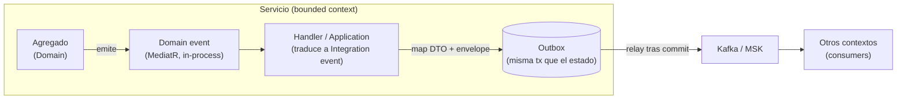
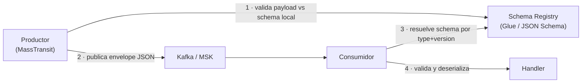
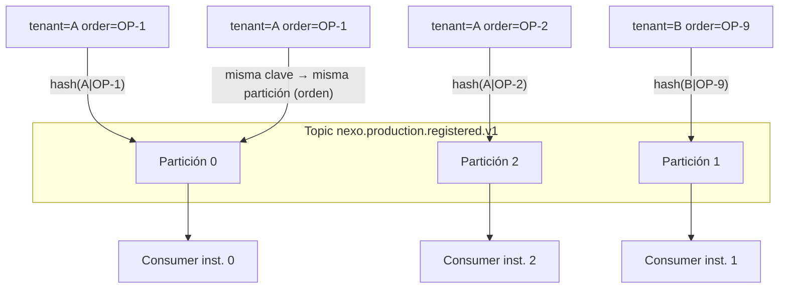
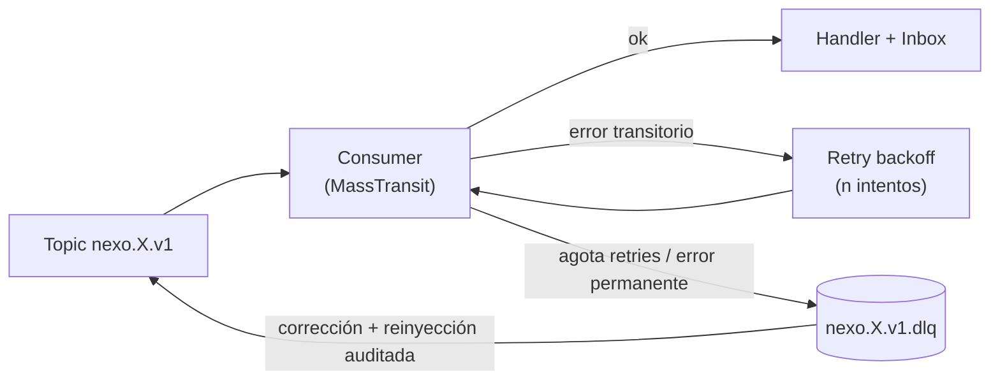
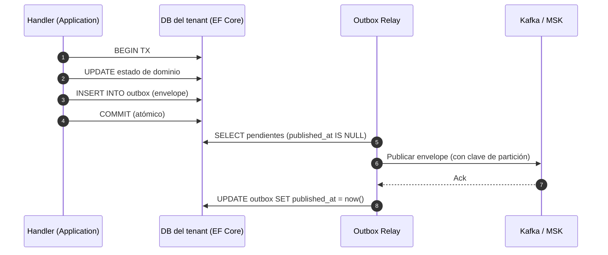

# 02 · Modelo de Eventos — Nexo (MVP)

> **Documento:** `design/02-event-model.md` · **Estado:** Borrador v0.1 · **Actualizado:** 2026-07-11
> **Roles:** Software Architect · Tech Lead
> **Relacionados:** [00-tech-baseline.md](./00-tech-baseline.md) · [01-multi-tenancy-connection.md](./01-multi-tenancy-connection.md) · [03-data-schema.md](./03-data-schema.md) · [04-service-contracts.md](./04-service-contracts.md) · [05-edge-agent.md](./05-edge-agent.md) · [06-odoo-connector.md](./06-odoo-connector.md) · [../specs/specs/data-ingestion.md](../specs/specs/data-ingestion.md) · [../specs/specs/traceability.md](../specs/specs/traceability.md) · [../specs/specs/architecture.md](../specs/specs/architecture.md) · [../specs/specs/integrations.md](../specs/specs/integrations.md)

## Resumen ejecutivo

Este documento define el **contrato de eventos** de Nexo: la unidad normalizada que atraviesa toda la plataforma
desde la captura en planta hasta la sincronización con el ERP. Es la materialización técnica del **Evento canónico**
descrito en [`data-ingestion.md`](../specs/specs/data-ingestion.md) §3 y [`architecture.md`](../specs/specs/architecture.md) §4.4,
y el sustrato del **Event Store inmutable** de [`traceability.md`](../specs/specs/traceability.md).

Respeta el [baseline técnico](./00-tech-baseline.md) sin excepciones:

- **Backbone:** Amazon **MSK (Kafka Serverless)** detrás de **MassTransit** (ADR-T4), auth **IAM/SASL** dentro de la VPC.
- **Serialización:** **JSON + JSON Schema** en un **schema registry** (DT-02); Avro/Protobuf se reevalúan si el volumen lo exige.
- **Particionamiento:** clave por **`tenant_id`** (+ `aggregate_id` cuando el orden intra-agregado importa).
- **Fiabilidad:** **Transactional Outbox** e **Inbox/idempotencia** (`processed_events`), garantías **at-least-once**.
- **Runtime:** **.NET 8**, un `DbContext` por tenant, correlación por `tenant_id` y `correlation_id` (ADR-T9).

El alcance de este documento es **diseño**: fija el envelope, su JSON Schema, la taxonomía de topics, los patrones de
fiabilidad (con DDL ilustrativo), el catálogo de eventos del MVP y el enfoque de configuración de MassTransit sobre Kafka.
**No** implementa la aplicación. Las decisiones abiertas se registran en §8 y se promueven a ADR de [00](./00-tech-baseline.md)
al cerrarse.

---

## 1. Envelope del Evento canónico

Todo evento de Nexo —sin importar su origen (`device` / `manual` / `api` / `file`) ni su dominio— viaja dentro de un
**envelope común**. El envelope separa **metadatos de transporte y trazabilidad** (estables, conocidos por toda la
plataforma) del **`payload`** (específico del `type`, gobernado por su propio JSON Schema). Esta separación permite que
Ingestion, el broker, Traceability y los conectores operen sobre el envelope sin conocer el detalle de cada dominio.

### 1.1 Campos del envelope

| Campo | Tipo | Req. | Descripción | Notas de diseño |
|---|---|:--:|---|---|
| `event_id` | `string` (UUID) | ✔ | Identidad única e inmutable del evento. | **UUIDv7** (ordenable en el tiempo); base de idempotencia junto con `dedup_key`. |
| `tenant_id` | `string` (UUID) | ✔ | Empresa dueña del evento. | Resuelto en la admisión (host/subdominio o claim JWT); **nunca** lo define el payload ([data-ingestion.md](../specs/specs/data-ingestion.md) §3). Clave de partición por defecto. |
| `type` | `string` | ✔ | Tipo canónico del evento: `nexo.<domain>.<event>`. | p. ej. `nexo.production.registered`. El segmento `<domain>` es la **categoría** que las specs llaman `type` (production/scrap/quality/downtime/reading/machine_event/custom) + dominios de plataforma (tenant/device/integration). Ver §1.4. |
| `occurred_at` | `string` (date-time) | ✔ | **Tiempo de origen**: cuándo ocurrió el hecho en planta. | RFC 3339 / ISO-8601 UTC. Preferente para negocio; puede venir del PLC/OPC UA o sellarse en el agente ([data-ingestion.md](../specs/specs/data-ingestion.md) §8). |
| `ingested_at` | `string` (date-time) | ✔ | **Tiempo de ingesta**: cuándo la nube admitió y persistió el evento. | Diagnóstico de latencia (`ingested_at − occurred_at`) y detección de tardíos. |
| `source` | `enum` | ✔ | Procedencia: `device` \| `manual` \| `api` \| `file`. | Determina qué metadatos de origen acompañan ([traceability.md](../specs/specs/traceability.md) §3.1). |
| `device_id` | `string` | — | Dispositivo emisor (si aplica). | Del mapeo de tagging ([devices.md](../specs/specs/devices.md)); requerido cuando `source=device`. |
| `context` | `object` | — | Contexto físico: `site` / `line` / `asset`. | Planta → línea → máquina. Se completa por el contexto del dispositivo/operario. |
| `operator_id` | `string` | — | Operario asociado. | Requerido cuando `source=manual`. |
| `shift` | `string` | — | Turno resuelto por contexto temporal/planta. | Crítico para KPIs por turno ([production.md](../specs/specs/production.md) §7.3). |
| `payload` | `object` | ✔ | Contenido normalizado del hecho, según `type`. | Gobernado por el JSON Schema específico del `type`+`schema_version` (§3). Unidades/escalas/códigos **ya convertidos**. |
| `dedup_key` | `string` | ✔ | Clave determinística de deduplicación/idempotencia. | Derivada de atributos invariantes del hecho, **no** del momento de envío ([data-ingestion.md](../specs/specs/data-ingestion.md) §5.2). |
| `origin_metadata` | `object` | — (recom.) | Linaje técnico: protocolo, firmware, calidad del dato, agente, offset de reloj, ref. al crudo. | Sustento de la evidencia de origen y del diagnóstico ([traceability.md](../specs/specs/traceability.md) §4.2). |
| `schema_version` | `integer` | ✔ | Versión **mayor** del contrato del `payload`/envelope. | Igual al `vN` del topic. Cambios aditivos no la incrementan; cambios rompientes sí (§3). |
| `correlation_id` | `string` (UUID) | ✔ | Hilo que une eventos de una misma operación/flujo. | Se propaga por toda la cadena (Gateway→Ingestion→broker→dominios→ERP) y a logs/trazas OTel. |
| `causation_id` | `string` (UUID) | — | `event_id` del evento que causó éste. | Habilita reconstruir árboles de causalidad; opcional pero recomendado en reacciones. |
| `sequence` | `integer` | — | Posición monótona por partición asignada por el Event Store. | Orden lógico de ingesta, complementario a los timestamps ([traceability.md](../specs/specs/traceability.md) §4.1). |

> **Tres tiempos.** `occurred_at` (origen) e `ingested_at` (ingesta) van en el envelope; el **tiempo de captura del
> agente** se conserva en `origin_metadata.captured_at`. Los tres, juntos, permiten diagnosticar latencia, ordenar
> por tiempo de origen y tratar *late arrivals* ([data-ingestion.md](../specs/specs/data-ingestion.md) §8).

> **Aislamiento por tenant.** El envelope siempre lleva `tenant_id`, pero el aislamiento **físico** lo garantiza la
> DB-per-tenant y el particionamiento del topic ([01-multi-tenancy-connection.md](./01-multi-tenancy-connection.md)).
> El `tenant_id` del envelope es el mecanismo de **enrutamiento y correlación**, no el control de acceso.

### 1.2 JSON Schema del envelope (Draft 2020-12)

```json
{
  "$schema": "https://json-schema.org/draft/2020-12/schema",
  "$id": "https://schemas.nexo.io/events/envelope/v1.json",
  "title": "NexoCanonicalEventEnvelope",
  "type": "object",
  "additionalProperties": false,
  "required": [
    "event_id", "tenant_id", "type", "occurred_at", "ingested_at",
    "source", "payload", "dedup_key", "schema_version", "correlation_id"
  ],
  "properties": {
    "event_id":       { "type": "string", "format": "uuid",
                        "description": "UUIDv7 único e inmutable del evento" },
    "tenant_id":      { "type": "string", "format": "uuid" },
    "type":           { "type": "string",
                        "pattern": "^nexo\\.[a-z0-9_]+\\.[a-z0-9_]+$",
                        "description": "nexo.<domain>.<event>" },
    "occurred_at":    { "type": "string", "format": "date-time" },
    "ingested_at":    { "type": "string", "format": "date-time" },
    "source":         { "type": "string", "enum": ["device", "manual", "api", "file"] },
    "device_id":      { "type": "string" },
    "context": {
      "type": "object",
      "additionalProperties": false,
      "properties": {
        "site":  { "type": "string" },
        "line":  { "type": "string" },
        "asset": { "type": "string" }
      }
    },
    "operator_id":    { "type": "string" },
    "shift":          { "type": "string" },
    "payload":        { "type": "object",
                        "description": "Contenido según type; validado por el schema específico" },
    "dedup_key":      { "type": "string", "minLength": 1, "maxLength": 512 },
    "origin_metadata": {
      "type": "object",
      "additionalProperties": true,
      "properties": {
        "protocol":     { "type": "string",
                          "enum": ["manual", "file", "http", "s7", "opcua", "modbus", "mqtt"] },
        "firmware":     { "type": "string" },
        "agent_id":     { "type": "string" },
        "captured_at":  { "type": "string", "format": "date-time",
                          "description": "Tiempo de captura del agente (3er reloj)" },
        "clock_offset_ms": { "type": "integer",
                          "description": "Offset de reloj del edge respecto de la nube" },
        "data_quality": { "type": "string",
                          "enum": ["good", "suspect", "substituted", "interpolated", "out_of_range"] },
        "raw_ref":      { "type": "string",
                          "description": "Referencia a la evidencia cruda (Files/Media o Event Store)" }
      }
    },
    "schema_version": { "type": "integer", "minimum": 1 },
    "correlation_id": { "type": "string", "format": "uuid" },
    "causation_id":   { "type": "string", "format": "uuid" },
    "sequence":       { "type": "integer", "minimum": 0 }
  },
  "allOf": [
    {
      "if":   { "properties": { "source": { "const": "device" } } },
      "then": { "required": ["device_id"] }
    },
    {
      "if":   { "properties": { "source": { "const": "manual" } } },
      "then": { "required": ["operator_id"] }
    }
  ]
}
```

> El `payload` se valida en **dos pasos**: (1) contra este envelope (`payload` es `object`), y (2) contra el JSON Schema
> específico de `type`+`schema_version` resuelto en el registry (§3). Se evita un único mega-schema para no acoplar el
> envelope a cada dominio.

### 1.3 Ejemplo — `nexo.production.registered` (v1)

```json
{
  "event_id": "018f7c2a-9b3e-7a41-8c1d-2f5e6a7b8c90",
  "tenant_id": "9c3b1e77-2d4a-4b8f-9e1a-6f0c2d3b4a55",
  "type": "nexo.production.registered",
  "occurred_at": "2026-07-11T14:03:12.480Z",
  "ingested_at": "2026-07-11T14:03:18.902Z",
  "source": "device",
  "device_id": "plc-l3-contador-01",
  "context": { "site": "PLANTA-CBA", "line": "L3", "asset": "EXTRUSORA-07" },
  "shift": "TARDE",
  "payload": {
    "order_id": "OP-2026-000482",
    "run_id": "RUN-77af12",
    "product_sku": "PT-500-XL",
    "uom": "uds",
    "good_qty": 37,
    "nonconforming_qty": 1,
    "counter_start": 1450,
    "counter_end": 1488,
    "counter_rollover": false
  },
  "dedup_key": "plc-l3-contador-01|counter|1450-1488|2026-07-11T14:03:12Z",
  "origin_metadata": {
    "protocol": "file",
    "agent_id": "edge-cba-01",
    "captured_at": "2026-07-11T14:03:12.500Z",
    "clock_offset_ms": 20,
    "data_quality": "good"
  },
  "schema_version": 1,
  "correlation_id": "018f7c2a-9b3e-7a41-8c1d-2f5e6a7b8c00"
}
```

### 1.4 Nomenclatura de `type` (reconciliación con las specs)

Las specs usan la forma corta `type=production | scrap | quality | downtime | reading | machine_event | custom`
para el **enrutamiento primario**. En el diseño, ese valor es el **segmento `<domain>`** de un identificador
más específico, para poder distinguir eventos dentro del mismo dominio (p. ej. `nexo.downtime.started` vs `nexo.downtime.ended`).

| Concepto | Forma | Ejemplo |
|---|---|---|
| **Categoría** (specs `type=`) | `<domain>` | `production` |
| **Tipo canónico** (envelope `type`) | `nexo.<domain>.<event>` | `nexo.production.registered` |
| **Topic** (broker) | `nexo.<domain>.<event>.v<major>` | `nexo.production.registered.v1` |
| **Contrato C#** (MassTransit) | `PascalCase` | `ProductionRegistered` |

---

## 2. Domain events vs Integration events

Nexo distingue **eventos de dominio** (internos a un *bounded context*) de **eventos de integración** (contratos públicos
que cruzan el backbone). La confusión entre ambos es una fuente clásica de acoplamiento; el baseline (Clean Architecture,
ADR-T2) exige separarlos.

| Aspecto | **Domain event** | **Integration event** |
|---|---|---|
| Propósito | Expresar un hecho dentro del agregado; disparar invariantes/side-effects locales | Notificar a otros contextos un hecho relevante y estable |
| Alcance | Dentro del servicio (proceso) | Entre servicios (backbone Kafka/MSK) |
| Transporte | **MediatR** (in-process), sin salir del `DbContext` | **MassTransit → Kafka**, vía **Outbox** |
| Acoplamiento | Al modelo de dominio (puede cambiar seguido) | Contrato versionado y gobernado (cambia con cuidado) |
| Forma | Objeto de dominio rico (VOs, entidades) | **DTO plano** serializable (JSON), envelope canónico |
| Estabilidad | Interna; refactorizable libremente | Pública; sujeta a compatibilidad (§3) |
| Ejemplo | `RunClosedDomainEvent` (recalcula acumulados) | `nexo.production.run_closed.v1` (dispara push a Odoo) |

**Flujo típico** (Clean Architecture + Outbox):



### 2.1 Convención de nombres

- **Domain events:** PascalCase con sufijo `DomainEvent` y **verbo en pasado**: `ProductionRegisteredDomainEvent`,
  `DowntimeStartedDomainEvent`. Viven en `Nexo.<Servicio>.Domain`.
- **Integration events (contrato C#):** PascalCase, **verbo en pasado**, sin sufijo: `ProductionRegistered`,
  `DowntimeStarted`, `OdooSyncCompleted`. Viven en un paquete de contratos compartido (`Nexo.Contracts.<Domain>`),
  para que productor y consumidores compartan el tipo.
- **Tipo canónico (wire):** `nexo.<domain>.<event>` en `snake_case`: `nexo.production.registered`.
- **Comandos** (no eventos): imperativo presente: `PushProductionToOdoo`, `ProvisionTenant`. Se envían punto-a-punto, no se
  publican como hechos.

> **Regla:** un evento de integración es un **hecho ya ocurrido** (inmutable), nunca una orden. Si el emisor "quiere que
> alguien haga algo" es un **comando**, no un evento. `OdooSyncRequested` es la excepción aparente: se modela como
> **evento** porque representa el hecho "se necesita sincronizar" que el orquestador del conector consume de forma
> desacoplada (coreografía), no como RPC directo.

---

## 3. Serialización y compatibilidad

### 3.1 Formato y registry

- **Formato:** **JSON UTF-8** (DT-02). Legible, tooling universal, bajo costo de gobierno en el MVP. Se paga overhead de
  tamaño/CPU frente a binarios; aceptable para el volumen del MVP y mitigable con compresión del topic (`zstd`).
- **Schema registry:** cada `type`+`vN` tiene un **JSON Schema** publicado y versionado. Default: **AWS Glue Schema
  Registry** (nativo AWS/MSK, soporta JSON Schema y validación en el cliente MassTransit); alternativa compatible:
  registry estilo Confluent. La resolución es `type` → schema; el `schema_version` del envelope selecciona la versión.
- **Ubicación de los schemas:** versionados en el monorepo (`/contracts/events/**.json`) y publicados al registry en CI;
  el envelope referencia por `type`+`schema_version`, no por URL embebida (evita acoplar el evento al hosting del schema).



### 3.2 Estrategia de versionado

Dos ejes, deliberadamente simples para el MVP:

1. **`schema_version` (entero = versión mayor)**: nombra el topic (`.vN`). Solo se incrementa ante un **cambio rompiente**.
2. **Evolución aditiva dentro de una versión**: agregar campos **opcionales** con default no incrementa `schema_version`
   ni crea topic nuevo. Los consumidores viejos los ignoran; los nuevos los aprovechan.

### 3.3 Compatibilidad

Se adopta compatibilidad **BACKWARD_TRANSITIVE** como política por defecto del registry: un consumidor nuevo puede leer
**todo** el histórico del topic. Es la política correcta para un sistema con **reproceso/replay** y **Event Store de
retención larga** ([traceability.md](../specs/specs/traceability.md)): reconstruir un read model relee eventos antiguos.

| Cambio | ¿Compatible? | Acción |
|---|---|---|
| Agregar campo **opcional** (con default) | ✅ Sí | Aditivo; misma `vN`; sin migración |
| Ampliar un `enum` (nuevo valor) | ⚠️ Depende | Aditivo si los consumidores toleran valores desconocidos; documentar |
| Renombrar/eliminar campo | ❌ No | Rompiente; nuevo topic `v(N+1)` + período de doble publicación |
| Cambiar tipo/semántica de un campo | ❌ No | Rompiente; nuevo topic `v(N+1)` |
| Volver **requerido** un campo antes opcional | ❌ No | Rompiente; nuevo topic `v(N+1)` |

### 3.4 Migración de una versión rompiente (`vN` → `v(N+1)`)

1. Publicar el schema `v(N+1)` en el registry.
2. **Doble publicación**: los productores emiten en `nexo.<domain>.<event>.vN` **y** `.v(N+1)` durante una ventana.
3. Migrar consumidores a `.v(N+1)` de forma independiente (despliegue por servicio).
4. Cuando todos consumen `.v(N+1)` y la retención de `.vN` venció, **retirar** `.vN`.
5. Para reproceso histórico se conserva el schema `vN` en el registry aunque el topic se retire.

> **Inmutabilidad.** Un evento ya ingerido **no** se re-serializa a una versión nueva. La migración es de **contrato de
> productor**, no de los eventos históricos, que permanecen en su `vN` original ([data-ingestion.md](../specs/specs/data-ingestion.md) §3).

---

## 4. Taxonomía de topics en Kafka/MSK

### 4.1 Nomenclatura

```
nexo.<domain>.<event>.v<major>
└┬─┘ └──┬──┘ └──┬──┘ └──┬──┘
 │      │       │       └─ versión mayor del contrato (= schema_version)
 │      │       └───────── evento en snake_case (pasado): registered, started, ended...
 │      └───────────────── bounded context / categoría: production, scrap, quality,
 │                          downtime, reading, machine_event, device, tenant, integration, custom
 └──────────────────────── raíz del namespace de la plataforma
```

Ejemplos: `nexo.production.registered.v1`, `nexo.downtime.started.v1`, `nexo.reading.ingested.v1`,
`nexo.integration.odoo_sync_completed.v1`.

**Topic por tipo de evento** (fine-grained), no un topic gigante por dominio. Ventajas: retención y particiones
por evento (readings ≠ órdenes), ACLs finas, consumidores que se suscriben solo a lo que necesitan, y evolución de
esquema aislada. El costo (más topics) es asumible en MSK Serverless.

### 4.2 Particionamiento

- **Clave por defecto:** `tenant_id`. Garantiza (a) aislamiento de orden y throughput por tenant y (b) que un tenant
  ruidoso no descoordine el orden de otro. Alineado con [00](./00-tech-baseline.md) §4.1.
- **Clave compuesta `tenant_id|aggregate_id`** cuando **importa el orden intra-agregado**: contador por dispositivo,
  ciclo de una orden, secuencia de una parada por máquina. Kafka preserva orden **dentro de la partición**; la clave
  define qué eventos quedan co-ordenados.

| Evento | Clave de partición | Por qué |
|---|---|---|
| `nexo.reading.ingested.v1` | `tenant_id \| device_id` | El delta de contador depende del orden por dispositivo |
| `nexo.production.registered.v1` | `tenant_id \| order_id` | Acumulados por orden en secuencia |
| `nexo.production.run_closed.v1` | `tenant_id \| order_id` | Cierre después de todos los registros de la corrida |
| `nexo.downtime.started.v1` / `ended.v1` | `tenant_id \| asset_id` | Inicio/fin ordenados por máquina |
| `nexo.device.status_changed.v1` | `tenant_id \| device_id` | Transiciones de estado ordenadas |
| `nexo.tenant.provisioned.v1` | `tenant_id` | Evento de plataforma (topic global) |

> **Orden global.** Kafka **no** garantiza orden entre particiones. Los dominios que necesiten línea de tiempo global
> reordenan por `occurred_at` dentro de ventanas de tolerancia ([data-ingestion.md](../specs/specs/data-ingestion.md) §8).



### 4.3 Consumer groups

- **Un consumer group por servicio consumidor**: `nexo.<servicio>` (p. ej. `nexo.traceability`, `nexo.dashboards`,
  `nexo.connectors`). Cada servicio recibe **su propia copia** del stream (pub/sub) y avanza offsets de forma
  independiente.
- El **paralelismo** de un servicio se logra con **más instancias** en el mismo group (hasta N = nº de particiones).
- **Rebalanceo** gestionado por MassTransit/consumer Kafka; los handlers deben ser **idempotentes** (§5) porque un
  rebalanceo puede re-entregar el último batch no confirmado.

### 4.4 Retención y reproceso

| Clase de topic | Retención en Kafka (MVP) | Fuente de verdad de largo plazo |
|---|---|---|
| Eventos de dominio (`production`, `scrap`, `quality`, `downtime`) | 30 días | **Event Store** por tenant (inmutable, retención larga) — [traceability.md](../specs/specs/traceability.md) |
| `reading.ingested` (alta frecuencia) | 7 días | **Time-series** del tenant (append-only, downsampling) — [scalability.md](../specs/specs/scalability.md) §5 |
| Eventos de plataforma (`tenant`, `device`, `integration`) | 30 días | Control Plane DB / Audit |

- **Reproceso / replay:** re-consumir desde un offset o timestamp reconstruye read models (CQRS) sin violar
  inmutabilidad ([data-ingestion.md](../specs/specs/data-ingestion.md) §9). Para reprocesos que exceden la retención de
  Kafka, la fuente es el **Event Store** (relee y re-publica a un topic de reproceso dedicado).
- **Compactación:** los topics de eventos de negocio son *append/log* (no compactados) para preservar el historial. Solo
  se consideraría compactación en topics de **estado/snapshot** (fuera del MVP).
- La retención concreta por plan comercial es una **decisión abierta** (ver [scalability.md](../specs/specs/scalability.md) PA-3 y §8).

### 4.5 Dead-Letter Queue (DLQ)

- **DLQ por topic**: `nexo.<domain>.<event>.v<major>.dlq`. A ella van los mensajes que agotan reintentos o son
  no-procesables (envelope inválido, schema desconocido, error permanente de negocio).
- El mensaje en DLQ conserva el **envelope original** + headers de diagnóstico (`x-exception`, `x-original-topic`,
  `x-attempts`, `x-consumer`). MassTransit adjunta metadatos de fallo automáticamente.
- **Cuarentena de ingesta** (eventos inválidos/duplicados/no contextualizados de [data-ingestion.md](../specs/specs/data-ingestion.md) §4)
  se modela como DLQ del pipeline de admisión, con reinyección tras corrección.
- **Reproceso de DLQ:** operación auditada (quién, qué rango, con qué versión de lógica) — [data-ingestion.md](../specs/specs/data-ingestion.md) §9.



---

## 5. Fiabilidad

Garantía extremo a extremo: **at-least-once + idempotencia**. Nunca se pierde un evento (outbox), y los duplicados por
reintentos/reentregas no cambian el estado (inbox). Alineado con [data-ingestion.md](../specs/specs/data-ingestion.md) §5
y [architecture.md](../specs/specs/architecture.md) §4.3.

### 5.1 Transactional Outbox

**Problema:** publicar al broker y persistir el cambio de estado son dos sistemas distintos; si uno falla queda
inconsistencia (evento sin estado, o estado sin evento). **Solución:** escribir el evento en una tabla `outbox` **en la
misma transacción** que el cambio de estado; un *relay* lo publica luego y marca `published_at`.



**DDL — tabla `outbox`** (en la DB del tenant):

```sql
CREATE TABLE outbox (
    id              BIGINT      GENERATED ALWAYS AS IDENTITY PRIMARY KEY,
    event_id        UUID        NOT NULL UNIQUE,          -- = envelope.event_id (idempotencia de publicación)
    tenant_id       UUID        NOT NULL,
    aggregate_type  TEXT        NOT NULL,                 -- p. ej. 'ProductionOrder'
    aggregate_id    TEXT        NOT NULL,                 -- p. ej. 'OP-2026-000482'
    type            TEXT        NOT NULL,                 -- 'nexo.production.registered'
    schema_version  INT         NOT NULL DEFAULT 1,
    topic           TEXT        NOT NULL,                 -- 'nexo.production.registered.v1'
    partition_key   TEXT        NOT NULL,                 -- 'tenant|order_id'
    envelope        JSONB       NOT NULL,                 -- envelope canónico completo
    headers         JSONB       NOT NULL DEFAULT '{}'::jsonb,
    correlation_id  UUID,
    occurred_at     TIMESTAMPTZ NOT NULL,
    created_at      TIMESTAMPTZ NOT NULL DEFAULT now(),
    published_at    TIMESTAMPTZ,                          -- NULL = pendiente
    attempts        INT         NOT NULL DEFAULT 0,
    next_attempt_at TIMESTAMPTZ NOT NULL DEFAULT now(),
    last_error      TEXT
);

-- Índice parcial: el relay solo barre lo no publicado y vencido
CREATE INDEX ix_outbox_pending
    ON outbox (next_attempt_at)
    WHERE published_at IS NULL;

-- Purga de publicados (housekeeping por antigüedad; el historial vive en el Event Store)
CREATE INDEX ix_outbox_published_at ON outbox (published_at)
    WHERE published_at IS NOT NULL;
```

> **MassTransit built-in.** MassTransit ofrece un **EF Core Transactional Outbox** (`AddEntityFrameworkOutbox`) con tablas
> `OutboxMessage` / `OutboxState` / `InboxState`. El default del MVP es **usar esa implementación** (menos código a
> mantener); la DDL de arriba documenta el **modelo conceptual** y sirve si se necesita un outbox propio (p. ej. para
> incluir `partition_key`/`topic` explícitos). Decisión en §8 (DT-EV-02).

### 5.2 Inbox / Idempotencia (`processed_events`)

Cada consumidor registra qué eventos ya aplicó. Antes de procesar, consulta; si el evento ya está, lo **descarta
silenciosamente** (idempotencia). El registro y el cambio de estado del handler ocurren en la **misma transacción**.

**DDL — tabla `processed_events`** (en la DB del tenant, por servicio consumidor):

```sql
CREATE TABLE processed_events (
    consumer       TEXT        NOT NULL,           -- 'nexo.traceability' (group/servicio lógico)
    event_id       UUID        NOT NULL,           -- = envelope.event_id
    dedup_key      TEXT        NOT NULL,           -- = envelope.dedup_key
    tenant_id      UUID        NOT NULL,
    type           TEXT        NOT NULL,
    processed_at   TIMESTAMPTZ NOT NULL DEFAULT now(),
    result         TEXT        NOT NULL DEFAULT 'ok',   -- 'ok' | 'skipped' | 'compensated'
    PRIMARY KEY (consumer, event_id)
);

-- Idempotencia también por dedup_key (cubre reingestas con distinto event_id pero mismo hecho)
CREATE INDEX ix_processed_dedup ON processed_events (consumer, tenant_id, dedup_key);
```

> **`event_id` vs `dedup_key`.** `event_id` es la identidad **técnica** (una publicación). `dedup_key` es la identidad
> **del hecho** (determinística, estable entre reintentos edge→nube, [data-ingestion.md](../specs/specs/data-ingestion.md) §5.2).
> El inbox chequea **ambos**: `event_id` neutraliza reentregas del broker; `dedup_key` neutraliza reingestas del mismo
> hecho con distinto `event_id` (p. ej. un lote reenviado por el agente tras un corte).

### 5.3 Garantías, orden, reintentos y backoff

| Aspecto | Diseño |
|---|---|
| **Entrega** | At-least-once (outbox garantiza publicación; el broker puede re-entregar) |
| **Idempotencia** | Inbox `processed_events` por consumidor; handlers idempotentes por diseño |
| **Orden** | Por partición (clave `tenant_id[\|aggregate_id]`); reordenamiento por `occurred_at` en ventanas donde haga falta |
| **Reintentos** | **Backoff exponencial + jitter** en el consumidor: p. ej. 5 intentos, base 1s, tope 5 min (`MessageRetry`) |
| **Backoff de publicación** | El relay reintenta con `next_attempt_at` creciente; `attempts`/`last_error` para diagnóstico |
| **Errores permanentes** | A **DLQ** tras agotar reintentos; alerta a Observability |
| **Envenenamiento** | Un mensaje "poison" no bloquea la partición: se envía a DLQ y se avanza el offset |
| **Exactly-once (aparente)** | No se busca EOS de Kafka; se logra el **efecto** exactly-once vía at-least-once + idempotencia |

---

## 6. Catálogo canónico de eventos (MVP)

Esta tabla es la **única fuente de verdad** de los nombres de evento del MVP: todo otro documento (en especial
[04-service-contracts.md](./04-service-contracts.md)) **referencia** estos mismos nombres, no los redefine. **`type (wire)`**
= valor del envelope `type` (`nexo.<domain>.<event>`, minúscula, `snake_case`, verbo en pasado); **`topic`** = el topic
Kafka/MSK (`type` + `.v<major>`); **Evento (contrato C#)** = clase de integración PascalCase mapeada 1:1 al `type`. Todos
viajan en el envelope de §1.

| Evento (contrato C#) | type (wire) | topic | Productor | Consumidores | Clave de partición | Payload resumido |
|---|---|---|---|---|---|---|
| **TenantProvisioned** | `nexo.tenant.provisioned` | `nexo.tenant.provisioned.v1` | Tenant Provisioning (CP) | Observability, Admin, (bootstrap de servicios del tenant) | `tenant_id` | `tenant_id`, `plan`, `db_ref`, `region`, `provisioned_at`, `admin_user_ref` |
| **ReadingIngested** | `nexo.reading.ingested` | `nexo.reading.ingested.v1` | Ingestion | Devices, Rules Engine, Dashboards (agg), Traceability (muestreado) | `tenant_id\|device_id` | `device_id`, `tag`, `value`, `uom`, `quality`, `occurred_at` |
| **ProductionRegistered** | `nexo.production.registered` | `nexo.production.registered.v1` | Production | Traceability, Dashboards, Rules Engine, Connectors (agrega) | `tenant_id\|order_id` | `order_id`, `run_id`, `product_sku`, `good_qty`, `nonconforming_qty`, `uom` |
| **RunClosed** | `nexo.production.run_closed` | `nexo.production.run_closed.v1` | Production | **Connectors (dispara push Odoo)**, Dashboards, Traceability | `tenant_id\|order_id` | `run_id`, `order_id`, `totals{good,nonconforming,scrap}`, `operative_time`, `closed_by` |
| **ScrapRegistered** | `nexo.scrap.registered` | `nexo.scrap.registered.v1` | Scrap | Production (ajusta total), Traceability, Dashboards, Connectors | `tenant_id\|order_id` | `order_id`, `product_sku`, `qty`, `reason_code`, `cost?`, `lot?` |
| **QualityInspected** | `nexo.quality.inspection_completed` | `nexo.quality.inspection_completed.v1` | Quality | Traceability, Dashboards, Production (reclasifica) | `tenant_id\|order_id` | `inspection_id`, `order_id`, `result{pass\|fail}`, `measurements[]`, `defects[]` |
| **QualityDispositionSet** | `nexo.quality.disposition_set` | `nexo.quality.disposition_set.v1` | Quality | Production (buenas/no conformes), Scrap (si rechazo) | `tenant_id\|order_id` | `subject{lot\|serial}`, `disposition{rework\|use_as_is\|scrap}`, `by` |
| **DowntimeStarted** | `nexo.downtime.started` | `nexo.downtime.started.v1` | Downtime | Rules Engine, Notifications, Dashboards, Production (pausa) | `tenant_id\|asset_id` | `asset_id`, `started_at`, `reason_code?`, `planned` |
| **DowntimeEnded** | `nexo.downtime.ended` | `nexo.downtime.ended.v1` | Downtime | Dashboards, Traceability, Reports | `tenant_id\|asset_id` | `asset_id`, `ended_at`, `duration_s`, `reason_code` |
| **DeviceStatusChanged** | `nexo.device.status_changed` | `nexo.device.status_changed.v1` | Devices (desde presencia del edge) | Observability, Dashboards, Rules Engine, Notifications | `tenant_id\|device_id` | `device_id`, `status{online\|offline\|degraded}`, `last_seen`, `agent_id` |
| **OdooSyncRequested** | `nexo.integration.odoo_sync_requested` | `nexo.integration.odoo_sync_requested.v1` | Connectors (orquestador) | Connectors · Adapter Odoo | `tenant_id\|job_id` | `job_id`, `entity{mo\|scrap\|quality}`, `nexo_ref`, `dedup_key` |
| **OdooSyncCompleted** | `nexo.integration.odoo_sync_completed` | `nexo.integration.odoo_sync_completed.v1` | Connectors · Adapter Odoo | Production/Scrap/Quality (estado sync), Traceability, Observability | `tenant_id\|job_id` | `job_id`, `result{ok\|failed}`, `external_ref?`, `error?` |

**Notas de catálogo:**

- **`RunClosed` → push a Odoo agregado (INT-01).** El reporte de producción a Odoo se agrega **por cierre de corrida**,
  no por cada `ProductionRegistered`; por eso `RunClosed` es el disparador de `OdooSyncRequested`
  ([integrations.md](../specs/specs/integrations.md) §4, [production.md](../specs/specs/production.md) §3).
- **`ReadingIngested`** de alta frecuencia se persiste en **time-series** y solo genera evento de dominio según la config
  de la señal ([data-ingestion.md](../specs/specs/data-ingestion.md) §6); Traceability consume una **muestra/resumen**,
  no el 100% (decisión abierta [traceability.md](../specs/specs/traceability.md) PA-1).
- **Traceability** consume **prácticamente todos** los eventos para el historial inmutable y la genealogía
  ([traceability.md](../specs/specs/traceability.md) §5–6).
- **`machine_event`** (arranque/paro de máquina) existe como categoría; en el MVP se materializa vía `DowntimeStarted/Ended`
  y `DeviceStatusChanged` según semántica ([downtime.md](../specs/specs/downtime.md), [devices.md](../specs/specs/devices.md)).
- **Correcciones** (nunca edición destructiva): eventos compensatorios/de anexo con `causation_id` al `event_id` original,
  p. ej. `nexo.production.adjustment_recorded.v1` ([traceability.md](../specs/specs/traceability.md) §4.1, [production.md](../specs/specs/production.md) CB11).

### 6.1 Contratos .NET ilustrativos

```csharp
// Nexo.Contracts — envelope compartido (metadatos de transporte/trazabilidad)
public sealed record EventEnvelope<TPayload>(
    Guid            EventId,        // UUIDv7
    Guid            TenantId,
    string          Type,           // "nexo.production.registered"
    DateTimeOffset  OccurredAt,
    DateTimeOffset  IngestedAt,
    string          Source,         // device | manual | api | file
    TPayload        Payload,
    string          DedupKey,
    int             SchemaVersion,
    Guid            CorrelationId,
    string?         DeviceId       = null,
    EventContext?   Context        = null,   // site / line / asset
    string?         OperatorId     = null,
    string?         Shift          = null,
    OriginMetadata? OriginMetadata = null,
    Guid?           CausationId    = null);

public sealed record EventContext(string? Site, string? Line, string? Asset);

// Nexo.Contracts.Production — payload del evento de integración
public sealed record ProductionRegistered(
    string OrderId,
    string RunId,
    string ProductSku,
    string Uom,
    int    GoodQty,
    int    NonconformingQty,
    long?  CounterStart = null,
    long?  CounterEnd   = null,
    bool   CounterRollover = false);
```

> **gRPC/`.proto`:** los eventos usan **JSON** (no Protobuf). El `.proto` se reserva para el **sync interno**
> (Ingestion→Devices para resolver contexto, ADR-T5). No se define aquí porque no es parte del contrato de eventos.

---

## 7. MassTransit sobre Kafka (enfoque de configuración)

Configuración **ilustrativa** (no implementación) del *Kafka Rider* de MassTransit sobre MSK. Muestra: outbox EF Core,
producers, topic endpoints, clave de partición desde `tenant_id`, reintentos con backoff y auth IAM.

```csharp
services.AddMassTransit(x =>
{
    x.SetKebabCaseEndpointNameFormatter();

    // (1) Transactional Outbox sobre EF Core, en la DB del tenant
    x.AddEntityFrameworkOutbox<TenantDbContext>(o =>
    {
        o.UsePostgres();
        o.UseBusOutbox();                       // publica al bus tras el commit de la tx
        o.QueryDelay = TimeSpan.FromSeconds(1); // barrido del relay
    });

    // (2) Consumidores (idempotentes vía inbox)
    x.AddConsumer<ProductionRegisteredConsumer>(c =>
        c.UseMessageRetry(r => r.Exponential(
            retryLimit:   5,
            minInterval:  TimeSpan.FromSeconds(1),
            maxInterval:  TimeSpan.FromMinutes(5),
            intervalDelta:TimeSpan.FromSeconds(2))));

    // Bus de control en memoria (el transporte de eventos es el Rider de Kafka)
    x.UsingInMemory((ctx, cfg) => cfg.ConfigureEndpoints(ctx));

    // (3) Kafka Rider (MSK)
    x.AddRider(rider =>
    {
        // Productores: contrato .NET -> topic versionado
        rider.AddProducer<ProductionRegistered>("nexo.production.registered.v1");
        rider.AddProducer<RunClosed>("nexo.production.run_closed.v1");

        rider.AddConsumer<ProductionRegisteredConsumer>();

        rider.UsingKafka((context, k) =>
        {
            // Auth IAM/SASL contra MSK, dentro de la VPC (00-tech-baseline §3)
            k.Host("b-1.msk.<cluster>.kafka.<region>.amazonaws.com:9098", h =>
            {
                h.UseSasl(s =>
                {
                    s.Mechanism = SaslMechanism.OAuthBearer;  // aws-msk-iam-sasl-signer
                    s.SecurityProtocol = SecurityProtocol.SaslSsl;
                });
            });

            // Endpoint de consumo: topic + consumer group por servicio
            k.TopicEndpoint<ProductionRegistered>(
                topic: "nexo.production.registered.v1",
                groupId: "nexo.production",
                e =>
                {
                    e.AutoOffsetReset      = AutoOffsetReset.Earliest;
                    e.CreateIfMissing(t => { t.NumPartitions = 12; t.ReplicationFactor = 3; });
                    e.ConcurrentMessageLimit = 8;
                    e.ConfigureConsumer<ProductionRegisteredConsumer>(context);
                });
        });
    });
});
```

**Clave de partición (`tenant_id[|aggregate_id]`)** al producir:

```csharp
// El productor fija la Kafka key = clave de partición del §4.2
await _producer.Produce(
    key: $"{tenantId}|{orderId}",           // co-ordena por orden dentro del tenant
    message: new ProductionRegistered(/* ... */),
    pipe: Pipe.Execute<KafkaSendContext>(ctx =>
    {
        ctx.Headers.Set("nexo-correlation-id", correlationId.ToString());
        ctx.Headers.Set("nexo-schema-version", "1");
    }),
    cancellationToken);
```

**Consumidor idempotente** (usa el inbox de §5.2):

```csharp
public sealed class ProductionRegisteredConsumer(
    IProcessedEventStore inbox,           // processed_events
    IProductionProjector projector)
    : IConsumer<ProductionRegistered>
{
    public async Task Consume(ConsumeContext<ProductionRegistered> ctx)
    {
        var eventId = ctx.MessageId ?? throw new InvalidOperationException("MessageId requerido");

        // Idempotencia: si ya se procesó, se descarta silenciosamente
        if (await inbox.AlreadyProcessed("nexo.production", eventId, ctx.CancellationToken))
            return;

        // Mismo scope transaccional: proyección + marca en inbox
        await projector.Apply(ctx.Message, ctx.CancellationToken);
        await inbox.MarkProcessed("nexo.production", eventId, ctx.CancellationToken);
    }
}
```

**Puntos de gobierno:**

- **Un `AddRider`/host por cluster MSK**; los servicios comparten convención de topics y groups.
- **`tenant_id` scoped**: el `ITenantContext` ([00](./00-tech-baseline.md) §5) se resuelve al consumir (del envelope) y
  fija el `DbContext` correcto antes de proyectar.
- **Validación de schema** como *filter* del pipeline (producer y consumer) contra el registry (§3).
- **OTel**: MassTransit propaga `correlation_id`/trace context a las trazas Kafka (ADR-T9).
- **`CreateIfMissing`** solo en dev/staging; en prod los topics se crean por **IaC** (Terraform) con particiones/retención
  gobernadas ([08-observability-ops.md](./08-observability-ops.md)).

---

## 8. Decisiones pendientes

| # | Pregunta | Contexto | Default provisional |
|---|---|---|---|
| **DT-EV-01** | Formato de serialización a escala | JSON encarece tamaño/CPU a millones de eventos/día (DT-02) | **JSON + JSON Schema** en MVP; reevaluar **Avro/Protobuf** en topics de `reading` de alto volumen en V1 |
| **DT-EV-02** | Outbox: MassTransit built-in vs. tabla propia | La DDL de §5.1 vs. `AddEntityFrameworkOutbox` | **MassTransit built-in** en MVP; outbox propio solo si se necesita `partition_key`/`topic` explícitos o multi-topic por evento |
| **DT-EV-03** | Schema registry concreto | AWS Glue vs. Confluent-compatible vs. propio | **AWS Glue Schema Registry** (nativo MSK/JSON Schema); confirmar límites y tooling .NET |
| **DT-EV-04** | Retención por clase de topic y por plan | Kafka (hot) vs. Event Store/time-series (largo plazo) | 30 d dominio / 7 d readings en MVP; retención comercial por plan a definir con [scalability.md](../specs/specs/scalability.md) PA-3 |
| **DT-EV-05** | Ventana y almacén de deduplicación | Balance memoria vs. cobertura de reenvíos tardíos | Inbox `processed_events` con purga por ventana; casos críticos contra Event Store ([data-ingestion.md](../specs/specs/data-ingestion.md) PA-4) |
| **DT-EV-06** | Nivel de encadenamiento criptográfico del evento | `sequence`/hash-chain por partición vs. sellado externo (RFC-3161) | Hash-chain por partición en Event Store; detalle en [07-security.md](./07-security.md) ([traceability.md](../specs/specs/traceability.md) PA-3) |
| **DT-EV-07** | Granularidad de `machine_event` en el envelope | ¿Categoría propia o subsumida en downtime/device? | Subsumida en `downtime.*` / `device.status_changed` en MVP; promover a categoría propia si V1 lo exige |
| **DT-EV-08** | Muestreo de `reading` hacia Traceability | 100% del crudo vs. muestra/resumen (costo vs. trazabilidad) | Muestra/resumen configurable por tag ([traceability.md](../specs/specs/traceability.md) PA-1) |

> Estas preguntas se resuelven **a medida que el diseño las necesita**. Al cerrarse, se promueven a **ADR** en
> [00-tech-baseline.md](./00-tech-baseline.md) §9.

---

## 9. Referencias cruzadas

- Stack, comunicación y fiabilidad de mensajería (base): [00-tech-baseline.md](./00-tech-baseline.md) §4
- Connection schema y resolución de tenant: [01-multi-tenancy-connection.md](./01-multi-tenancy-connection.md)
- Esquema lógico por tenant (incluye `outbox`/`processed_events`): [03-data-schema.md](./03-data-schema.md)
- Contratos por servicio (REST/gRPC/eventos): [04-service-contracts.md](./04-service-contracts.md)
- Agente Edge (dedup_key, store-and-forward): [05-edge-agent.md](./05-edge-agent.md)
- Conector Odoo (sync jobs, ACL, push por cierre de corrida): [06-odoo-connector.md](./06-odoo-connector.md)
- Pipeline de ingesta, validación, orden y reproceso: [../specs/specs/data-ingestion.md](../specs/specs/data-ingestion.md)
- Event Store inmutable, genealogía y cadena de trazabilidad: [../specs/specs/traceability.md](../specs/specs/traceability.md)
- Arquitectura, evento canónico y backbone: [../specs/specs/architecture.md](../specs/specs/architecture.md)
- Integraciones y patrones de sync/idempotencia: [../specs/specs/integrations.md](../specs/specs/integrations.md)
- Escala, particionamiento, time-series y retención: [../specs/specs/scalability.md](../specs/specs/scalability.md)
