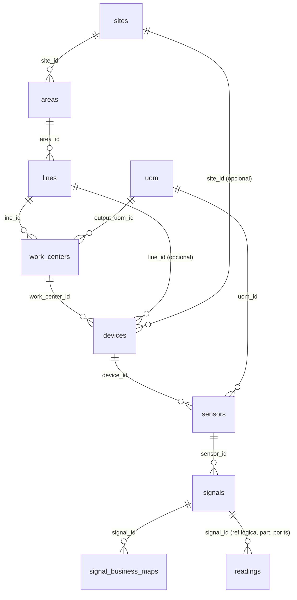
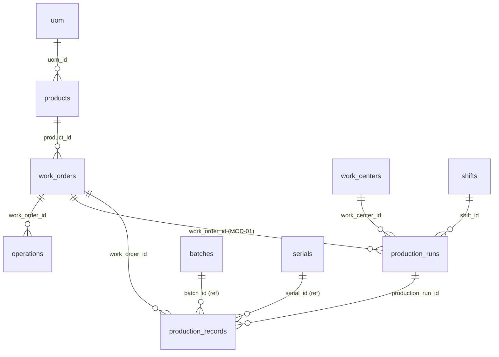
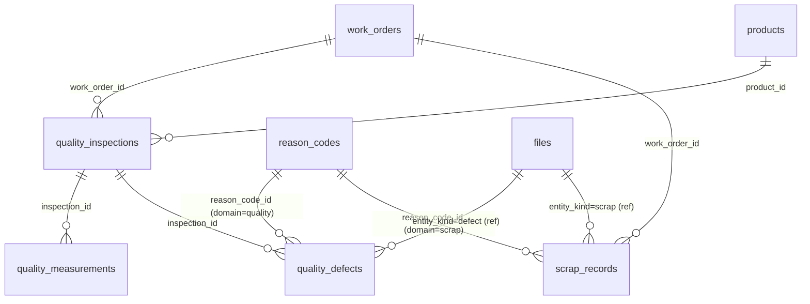
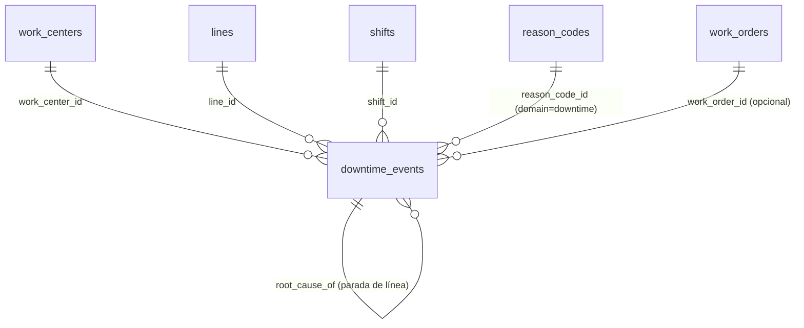
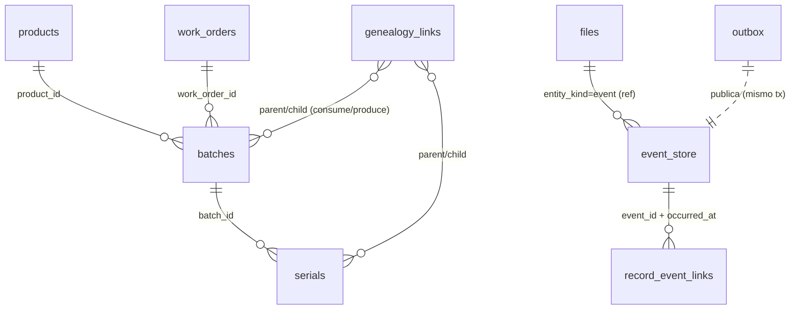
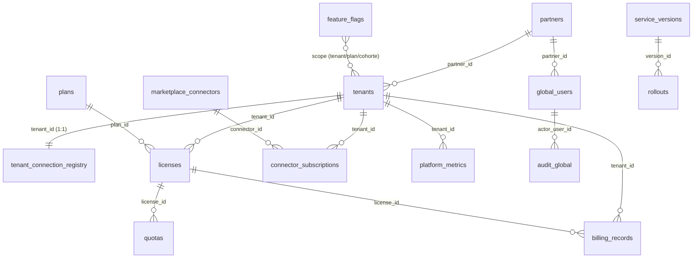

# 03 · Esquema de Datos — Nexo (MVP)

> **Documento:** `design/03-data-schema.md` · **Estado:** Borrador v0.1 · **Actualizado:** 2026-07-11
> **Roles:** Software Architect · Tech Lead
> **Relacionados:** [00-tech-baseline.md](./00-tech-baseline.md) · [01-multi-tenancy-connection.md](./01-multi-tenancy-connection.md) · [02-event-model.md](./02-event-model.md) · [04-service-contracts.md](./04-service-contracts.md) · [07-security.md](./07-security.md) · [08-observability-ops.md](./08-observability-ops.md)
> **Base funcional:** [../specs/specs/data-model.md](../specs/specs/data-model.md) · [../specs/specs/control-plane.md](../specs/specs/control-plane.md) · [../specs/specs/multi-tenancy.md](../specs/specs/multi-tenancy.md) · [Tablero de decisiones](../specs/open-questions-board.md)

## Resumen ejecutivo

Este documento es el **esquema lógico (DDL de diseño)** de Nexo: la traducción física a **PostgreSQL (Neon)** del
modelo de datos conceptual definido en [`data-model.md`](../specs/specs/data-model.md). **No** redefine los conceptos de
negocio (eso ya existe); define **tipos, claves, integridad referencial, índices, particionado por tiempo, columnas de
auditoría y soft-delete** con los que se materializan esas entidades canónicas.

Respeta el baseline técnico ([00](./00-tech-baseline.md)): **PostgreSQL/Neon con un proyecto Neon por tenant + una DB
Global (Control Plane)**, persistencia con **EF Core + Npgsql**, y el principio **no negociable** de aislamiento por
tenant ([multi-tenancy.md](../specs/specs/multi-tenancy.md)). En consecuencia se describen **dos esquemas físicos
distintos**:

1. **DB del Tenant** (una por cliente): todo el dato operativo — jerarquía física, dispositivos, órdenes, corridas,
   registros, calidad, scrap, paradas, trazabilidad (event store append-only + lecturas time-series), integración,
   outbox/inbox, archivos y auditoría del tenant.
2. **DB Global (Control Plane)** (única, del proveedor): metadatos del ecosistema — tenants, planes, licencias, quotas,
   feature flags, usuarios globales, partners, **Tenant Connection Registry**, marketplace, versiones/rollouts,
   facturación, métricas y auditoría global.

**Decisiones de diseño transversales asumidas (ver §1):** claves primarias **UUIDv7** (`uuid`, ordenables por tiempo),
timestamps **`timestamptz` en UTC**, **snake_case**, columnas de auditoría (`created_at/by`, `updated_at/by`),
**soft-delete** por `deleted_at/by`, organización por **schema-por-bounded-context** dentro de la DB del tenant,
`jsonb` para payloads canónicos y **particionado nativo por RANGE de tiempo** para `readings` y `event_store` (nota
**DT-01**: en el MVP no hay TimescaleDB en Neon, se usa particionado Postgres).

Refinamientos propuestos que este documento materializa y que **dependen de decisiones abiertas del tablero**:

- **`production_runs` (Corrida)** como entidad de primer nivel — depende de **MOD-01** (recomendación (a): formalizarla).
- **`reason_codes` con `domains` transversal** `{quality, scrap, downtime}` — alineado con **MOD-03** (rec. (a)).
- **`event_store` append-only + `batches`/`serials` desde el MVP** — alineado con **MOD-04** (rec. (a), base sin backfill).
- **Jerarquía física en un schema `config`** propio del tenant — alineado con **MOD-09** (rec. (a)).

> **Nota de implementación EF Core.** El DDL aquí es el **objetivo**. Las migraciones EF Core lo generan, pero las
> características que EF no modela nativamente (particionado, BRIN, índices parciales, columnas generadas, triggers,
> tipos `enum` nativos, funciones) se emiten con `migrationBuilder.Sql(...)`. Ver [01](./01-multi-tenancy-connection.md)
> para el ciclo de migraciones por cohortes.

---

## 1. Convenciones transversales

> Se presentan **primero** porque todo el DDL de §2 y §3 las asume. Corresponden al punto 3 del alcance.

### 1.1 Claves primarias — UUIDv7

| Decisión | Detalle |
|---|---|
| **Tipo** | `uuid` (16 bytes) en toda PK y FK. |
| **Generación** | **UUIDv7** (RFC 9562): 48 bits de timestamp Unix ms + aleatorio. **Ordenable por tiempo** → buena localidad de índice B-tree y menor fragmentación que UUIDv4. |
| **Dónde se genera** | En la **aplicación** (.NET, value generator del `DbContext`) para no depender de la versión de Postgres. En Neon (PG 15–17) no existe `uuidv7()` nativo (llega en PG 18); se provee además la función SQL `nexo.uuid_generate_v7()` como *fallback* para seeds/scripts. |
| **Nombre** | La PK se llama siempre `id`. |

```sql
-- Fallback SQL para UUIDv7 (seeds/DDL); en runtime lo genera EF Core.
create or replace function nexo.uuid_generate_v7()
returns uuid
language plpgsql
parallel safe
as $$
declare
    unix_ts_ms bytea;
    uuid_bytes bytea;
begin
    unix_ts_ms := int8send((extract(epoch from clock_timestamp()) * 1000)::bigint);
    -- 6 bytes de timestamp + 10 bytes aleatorios; se fijan version (7) y variant (RFC 4122)
    uuid_bytes := substring(unix_ts_ms from 3 for 6) || gen_random_bytes(10);
    uuid_bytes := set_byte(uuid_bytes, 6, (b'0111' || get_byte(uuid_bytes, 6)::bit(4))::bit(8)::int);
    uuid_bytes := set_byte(uuid_bytes, 8, (b'10'   || get_byte(uuid_bytes, 8)::bit(6))::bit(8)::int);
    return encode(uuid_bytes, 'hex')::uuid;
end
$$;
```

### 1.2 Timestamps y husos horarios

- **Todo** timestamp es `timestamptz` y se persiste en **UTC**. La zona local (planta/tenant) es un dato de
  presentación (`sites.timezone`), nunca de almacenamiento.
- Se distingue **tiempo de ocurrencia** (`occurred_at`, sellado en el edge, cercano a la fuente) de **tiempo de ingesta**
  (`ingested_at`/`created_at`, en la nube). La diferencia es un dato trazable (ver [traceability.md](../specs/specs/traceability.md) §3.2).
- Default de columnas de sistema: `now()` (equivale a `current_timestamp`, en UTC dado que las instancias corren en UTC).

### 1.3 Columnas de auditoría (patrón estándar)

Toda tabla de **master data y transaccional** incluye el bloque de auditoría. Los IDs de usuario son **referencias
lógicas** a la identidad global (ver §1.9); **no** llevan FK cross-DB.

```sql
-- Bloque de auditoría estándar (se repite en cada tabla; se omite en las hojas time-series/append-only)
    created_at   timestamptz  not null default now(),
    created_by   uuid         null,               -- ref. lógica a global.global_users / operator
    updated_at   timestamptz  not null default now(),
    updated_by   uuid         null,
    row_version  xid          not null default (xmin)::text::xid,  -- token de concurrencia optimista (EF Core)
```

- **Concurrencia optimista:** se usa la **columna de sistema `xmin`** mapeada en EF Core como token de concurrencia
  (`IsRowVersion()` sobre `xmin`), evitando una columna extra. Alternativa documentada: `concurrency_token uuid` regenerado
  en cada `UPDATE`.
- **`updated_at`:** lo setea la aplicación en `SaveChanges`. Como guardarraíl de defensa, se puede instalar un trigger
  `set_updated_at()` (opcional; ver §1.10).

### 1.4 Soft-delete

- Borrado lógico con `deleted_at timestamptz null` + `deleted_by uuid null`. `deleted_at IS NULL` ⇒ fila vigente.
- **Filtro global** por defecto en EF Core (`HasQueryFilter(e => e.DeletedAt == null)`).
- **Unicidad** de claves de negocio con **índice parcial** que solo aplica a filas vigentes:
  `create unique index ux_... on t (code) where deleted_at is null;`
- **Nunca** se hace soft-delete sobre tablas **append-only** (`event_store`, `readings`, `audit_log`, `outbox`,
  `processed_events`): su historia es inmutable por diseño.

### 1.5 Naming

| Objeto | Convención | Ejemplo |
|---|---|---|
| Schema | snake_case por bounded context | `production`, `devices`, `trace` |
| Tabla | snake_case, **plural** | `work_orders`, `scrap_records` |
| Columna | snake_case, **singular** | `planned_qty`, `occurred_at` |
| PK | `id` | `id uuid` |
| FK | `<entidad_singular>_id` | `work_order_id`, `reason_code_id` |
| Índice | `ix_<tabla>_<cols>` | `ix_downtime_events_asset_id` |
| Único | `ux_<tabla>_<cols>` | `ux_products_sku` |
| FK constraint | `fk_<tabla>_<tabla_ref>` | `fk_lines_areas` |
| Check | `ck_<tabla>_<regla>` | `ck_downtime_events_duration` |
| Partición | `<tabla>_p<periodo>` | `readings_p2026_07` |
| Enum nativo | `<dominio>_enum` | `event_source_enum` |

### 1.6 Dominios de valores (enums)

Se combinan dos estrategias según la naturaleza del dominio:

| Estrategia | Cuándo | Ejemplo |
|---|---|---|
| **`enum` nativo Postgres** | Dominio **canónico, cerrado y muy estable** de la plataforma | `event_source_enum`, `event_type_enum`, `data_quality_enum` |
| **`text` + `CHECK`** | Estados de ciclo de vida y clasificaciones que evolucionan por servicio (fácil de versionar sin `ALTER TYPE`) | `work_orders.status`, `downtime_events.status` |
| **Tabla catálogo** | Dominio **extensible por el tenant** (seed + alta por Admin) | `reason_codes`, `uom` |

EF Core mapea los `enum`/status con `HasConversion<string>()` (persistidos como texto legible).

```sql
create type nexo.event_source_enum   as enum ('device','manual','api','file');
create type nexo.event_type_enum     as enum ('production','scrap','quality','downtime','reading','machine_event','custom');
create type nexo.data_quality_enum   as enum ('good','uncertain','substituted','interpolated','bad');
create type nexo.sync_status_enum     as enum ('pending','in_progress','completed','failed','retrying','not_applicable');
```

### 1.7 Tipos numéricos y monetarios

- **Cantidades productivas** (piezas, kg, l): `numeric(18,4)` (evita error de flotante en acumulados/conversión UoM).
- **Costos/importes:** `numeric(18,4)` + columna `currency char(3)` (ISO 4217) cuando aplique.
- **Lecturas analógicas crudas:** `double precision` (`value_num`) — precisión física, alto volumen; la conversión a
  unidad de negocio la aplica el mapeo tag→señal (ver **MOD-05**).
- **Contadores/secuencias lógicas:** `bigint`.

### 1.8 Payloads y datos semiestructurados

- `jsonb` para: `event_store.payload`, `event_store.origin_metadata`, `outbox.payload`, mapeos de conector, snapshots de
  auditoría (`before`/`after`). Índices **GIN** solo donde hay consulta por contenido; el resto sin índice para no encarecer
  la escritura.

### 1.9 Referencias cross-boundary (sin FK física)

- La **identidad** de usuario/operario vive en el **Control Plane** (Duende/Identity, ver [TEN-07] y §3). En la DB del
  tenant, `operators.user_id`, `*.created_by`, `*.operator_id` son `uuid` **sin FK** (bases físicamente separadas). La
  integridad se valida en la capa de aplicación.
- Igual criterio para `readings.signal_id` y `event_store` (ver §1.11): en tablas de altísimo volumen **no** se declara
  FK, para no penalizar el `INSERT`; la coherencia se garantiza en Ingestion.

### 1.10 Trigger opcional de `updated_at` (guardarraíl)

```sql
create or replace function nexo.set_updated_at() returns trigger language plpgsql as $$
begin new.updated_at := now(); return new; end $$;
-- Se aplica por tabla: create trigger tg_set_updated_at before update on <tabla>
--   for each row execute function nexo.set_updated_at();
```

### 1.11 Estrategia de índices y de particionado por tiempo

**Índices (regla general):**

- **B-tree** en toda FK (Postgres no los crea solo) y en columnas de filtro frecuente (`status`, `occurred_at`, códigos).
- **Índices parciales** `where deleted_at is null` para unicidad de negocio y para las consultas del *hot path*.
- **Índices compuestos** siguiendo el patrón de consulta dominante (p. ej. `(asset_id, occurred_at desc)` para timelines).
- **GIN** en `jsonb` solo cuando se consulta por payload.
- **BRIN** en las tablas append-only/time-series ordenadas por tiempo (`readings`, `event_store`): índice diminuto y
  eficiente para *range scans* temporales sobre datos naturalmente ordenados por `occurred_at` (UUIDv7 + inserción cronológica).

**Particionado por tiempo (DT-01):** `readings` y `event_store` se declaran `PARTITION BY RANGE` sobre la marca temporal,
con **particiones mensuales** (revisable a semanal/diario por volumen del tenant).

| Aspecto | Decisión de diseño |
|---|---|
| Clave de partición | `occurred_at` (`timestamptz`) |
| Granularidad MVP | **Mensual** por tenant; ajustable por telemetría real |
| Creación de particiones | Automatizada: `pg_partman` **o** job propio de `Tenant Provisioning` (pre-crea N meses por adelantado) — ver Decisiones pendientes |
| PK de tabla particionada | Debe **incluir la clave de partición**: `primary key (occurred_at, id)` |
| Unicidad de negocio | Igual regla: `unique (occurred_at, dedup_key)` (dedup dentro de ventana; cross-partición ver §2.7) |
| Índice temporal | **BRIN** sobre `occurred_at`; B-tree solo en columnas de acceso puntual |
| Retención / archivado | `DETACH PARTITION` de meses fríos → offload a **S3 (Parquet) + Athena** en V1 (DT-01); política por plan (ver [scalability.md](../specs/specs/scalability.md)) |
| Aislamiento | El particionado es **intra-tenant**; el aislamiento entre tenants ya lo da la DB-per-tenant |

### 1.12 Organización en schemas (DB del tenant)

En lugar de un único `public`, la DB del tenant se organiza en **schemas por bounded context** (facilita migraciones por
`DbContext` y permisos por servicio). Los FK cross-schema son válidos (misma DB física).

| Schema | Contenido | Servicio dueño |
|---|---|---|
| `config` | sites, areas, lines, work_centers, shifts, uom, reason_codes, operators, roles, role_assignments, scope_assignments | Configuración/Admin del tenant (**MOD-09**) |
| `devices` | devices, sensors, signals, signal_business_maps, readings | Devices / Ingestion |
| `production` | products, work_orders, operations, production_runs, production_records | Production |
| `quality` | quality_inspections, quality_measurements, quality_defects | Quality |
| `scrap` | scrap_records | Scrap |
| `downtime` | downtime_events | Downtime |
| `trace` | event_store, batches, serials, genealogy_links | Traceability / Event Store |
| `integration` | connectors, sync_jobs | Connectors / Integrations |
| `rules` | rules, alerts, notifications_log | Rules Engine / Notifications |
| `platform` | outbox, processed_events, files, audit_log | Cross-cutting (BuildingBlocks) |

---

## 2. Esquema de la DB del TENANT (MVP)

> Una DB por cliente. Todo lo que sigue vive en la **DB del tenant**. No hay columna `tenant_id` discriminadora en el
> *hot path* (el aislamiento es físico); sí se conserva `tenant_id` en el `event_store` por conveniencia de trazabilidad/
> reproceso, coherente con el envelope canónico ([02](./02-event-model.md)).

### 2.1 Jerarquía física — `config`

```sql
-- Planta (Site)
create table config.sites (
    id           uuid primary key default nexo.uuid_generate_v7(),
    code         text        not null,
    name         text        not null,
    address      text        null,
    timezone     text        not null default 'America/Argentina/Buenos_Aires',
    geo_lat      numeric(9,6) null,
    geo_lng      numeric(9,6) null,
    status       text        not null default 'active',   -- active | inactive
    created_at   timestamptz not null default now(),
    created_by   uuid null,
    updated_at   timestamptz not null default now(),
    updated_by   uuid null,
    deleted_at   timestamptz null,
    deleted_by   uuid null,
    constraint ck_sites_status check (status in ('active','inactive'))
);
create unique index ux_sites_code on config.sites (code) where deleted_at is null;

-- Sector / Área
create table config.areas (
    id           uuid primary key default nexo.uuid_generate_v7(),
    site_id      uuid        not null,
    code         text        not null,
    name         text        not null,
    status       text        not null default 'active',
    created_at   timestamptz not null default now(), created_by uuid null,
    updated_at   timestamptz not null default now(), updated_by uuid null,
    deleted_at   timestamptz null, deleted_by uuid null,
    constraint fk_areas_sites foreign key (site_id) references config.sites (id),
    constraint ck_areas_status check (status in ('active','inactive'))
);
create index ix_areas_site_id on config.areas (site_id);
create unique index ux_areas_site_code on config.areas (site_id, code) where deleted_at is null;

-- Línea (Line)
create table config.lines (
    id             uuid primary key default nexo.uuid_generate_v7(),
    area_id        uuid        not null,
    code           text        not null,
    name           text        not null,
    nominal_speed  numeric(18,4) null,       -- capacidad/velocidad nominal referencial
    speed_uom_id   uuid        null,
    status         text        not null default 'active',
    created_at     timestamptz not null default now(), created_by uuid null,
    updated_at     timestamptz not null default now(), updated_by uuid null,
    deleted_at     timestamptz null, deleted_by uuid null,
    constraint fk_lines_areas foreign key (area_id) references config.areas (id),
    constraint ck_lines_status check (status in ('active','inactive'))
);
create index ix_lines_area_id on config.lines (area_id);
create unique index ux_lines_area_code on config.lines (area_id, code) where deleted_at is null;

-- Máquina / Centro de trabajo (Work Center / Asset)
create table config.work_centers (
    id                uuid primary key default nexo.uuid_generate_v7(),
    line_id           uuid        not null,
    code              text        not null,
    name              text        not null,
    asset_type        text        null,               -- categoría de activo (para MTBF/MTTR)
    ideal_cycle_time  numeric(18,6) null,              -- tiempo de ciclo ideal (seg/pieza) — override MOD-06
    output_uom_id     uuid        null,                -- unidad de medida productiva
    asset_tag         text        null,                -- identificación física del activo
    op_state          text        not null default 'stopped', -- running | stopped | maintenance
    status            text        not null default 'active',
    created_at        timestamptz not null default now(), created_by uuid null,
    updated_at        timestamptz not null default now(), updated_by uuid null,
    deleted_at        timestamptz null, deleted_by uuid null,
    constraint fk_work_centers_lines foreign key (line_id) references config.lines (id),
    constraint fk_work_centers_uom  foreign key (output_uom_id) references config.uom (id),
    constraint ck_work_centers_opstate check (op_state in ('running','stopped','maintenance')),
    constraint ck_work_centers_status  check (status in ('active','inactive'))
);
create index ix_work_centers_line_id on config.work_centers (line_id);
create unique index ux_work_centers_code on config.work_centers (code) where deleted_at is null;
```

### 2.2 Catálogos del tenant — `config`

```sql
-- Unidad de medida (UoM) — sincronizable con Odoo (MOD-05)
create table config.uom (
    id             uuid primary key default nexo.uuid_generate_v7(),
    code           text        not null,               -- 'unit','kg','l',...
    name           text        not null,
    category       text        null,                   -- masa, volumen, unidad...
    factor_to_base numeric(18,8) not null default 1,   -- factor de conversión versionado
    external_ref   text        null,                   -- id en Odoo
    status         text        not null default 'active',
    created_at     timestamptz not null default now(), created_by uuid null,
    updated_at     timestamptz not null default now(), updated_by uuid null,
    deleted_at     timestamptz null, deleted_by uuid null
);
create unique index ux_uom_code on config.uom (code) where deleted_at is null;

-- Motivo (Reason Code) — catálogo ÚNICO transversal con dominios aplicables (MOD-03)
create table config.reason_codes (
    id           uuid primary key default nexo.uuid_generate_v7(),
    code         text        not null,
    name         text        not null,
    domains      text[]      not null,                 -- {'quality','scrap','downtime'} (MOD-03)
    category     text        null,                     -- familia de causa (agrupador)
    parent_id    uuid        null,                     -- jerarquía de motivos
    is_planned   boolean     not null default false,   -- p. ej. parada programada
    is_imputable boolean     not null default true,    -- imputable a Disponibilidad/costo
    status       text        not null default 'active',
    created_at   timestamptz not null default now(), created_by uuid null,
    updated_at   timestamptz not null default now(), updated_by uuid null,
    deleted_at   timestamptz null, deleted_by uuid null,
    constraint fk_reason_codes_parent foreign key (parent_id) references config.reason_codes (id),
    constraint ck_reason_codes_domains check (domains <@ array['quality','scrap','downtime']::text[] and cardinality(domains) > 0)
);
create unique index ux_reason_codes_code on config.reason_codes (code) where deleted_at is null;
create index ix_reason_codes_domains on config.reason_codes using gin (domains);

-- Turno (Shift)
create table config.shifts (
    id           uuid primary key default nexo.uuid_generate_v7(),
    site_id      uuid        not null,
    line_id      uuid        null,                      -- opcional: turno por línea
    code         text        not null,
    name         text        not null,                  -- Mañana/Tarde/Noche
    start_time   time        not null,
    end_time     time        not null,                  -- puede cruzar medianoche (end < start)
    weekdays     smallint[]  not null default '{1,2,3,4,5}', -- 1=lun ... 7=dom
    status       text        not null default 'active',
    created_at   timestamptz not null default now(), created_by uuid null,
    updated_at   timestamptz not null default now(), updated_by uuid null,
    deleted_at   timestamptz null, deleted_by uuid null,
    constraint fk_shifts_sites foreign key (site_id) references config.sites (id),
    constraint fk_shifts_lines foreign key (line_id) references config.lines (id)
);
create index ix_shifts_site_id on config.shifts (site_id);
```

### 2.3 Acceso operativo (perfil + scoping) — `config`

> Frontera **TEN-07**: identidad global y credenciales viven en el Control Plane; **asignaciones de rol y scoping** por
> tenant viven aquí. `user_id` es referencia lógica (§1.9).

```sql
-- Operario (subtipo de Usuario) — perfil operativo por tenant
create table config.operators (
    id            uuid primary key default nexo.uuid_generate_v7(),
    user_id       uuid        not null,               -- ref. lógica a global.global_users (identidad)
    employee_no   text        null,                   -- legajo / id de planta
    fast_auth_kind text       null,                   -- pin | badge | nfc
    fast_auth_hash text       null,                   -- hash del PIN/credencial (nunca en claro)
    default_shift_id uuid     null,
    status        text        not null default 'active',
    created_at    timestamptz not null default now(), created_by uuid null,
    updated_at    timestamptz not null default now(), updated_by uuid null,
    deleted_at    timestamptz null, deleted_by uuid null,
    constraint fk_operators_shift foreign key (default_shift_id) references config.shifts (id)
);
create unique index ux_operators_user on config.operators (user_id) where deleted_at is null;
create unique index ux_operators_employee_no on config.operators (employee_no) where deleted_at is null and employee_no is not null;

-- Roles (asignación por tenant; el rol canónico puede venir del seed)
create table config.roles (
    id          uuid primary key default nexo.uuid_generate_v7(),
    code        text not null,                        -- operator | supervisor | quality | ...
    name        text not null,
    is_system   boolean not null default false,
    created_at  timestamptz not null default now(), created_by uuid null,
    updated_at  timestamptz not null default now(), updated_by uuid null,
    deleted_at  timestamptz null, deleted_by uuid null
);
create unique index ux_roles_code on config.roles (code) where deleted_at is null;

create table config.role_assignments (
    id          uuid primary key default nexo.uuid_generate_v7(),
    user_id     uuid not null,                        -- ref. lógica a identidad global
    role_id     uuid not null,
    created_at  timestamptz not null default now(), created_by uuid null,
    constraint fk_role_assignments_role foreign key (role_id) references config.roles (id)
);
create unique index ux_role_assignments on config.role_assignments (user_id, role_id);

-- Scoping por planta/línea (RBAC + ABAC)
create table config.scope_assignments (
    id          uuid not null default nexo.uuid_generate_v7(),
    user_id     uuid not null,
    scope_kind  text not null,                        -- site | line
    scope_id    uuid not null,                        -- site_id o line_id
    created_at  timestamptz not null default now(), created_by uuid null,
    constraint pk_scope_assignments primary key (id),
    constraint ck_scope_kind check (scope_kind in ('site','line'))
);
create unique index ux_scope_assignments on config.scope_assignments (user_id, scope_kind, scope_id);
```

### 2.4 Dispositivos, sensores y señales — `devices`

```sql
create table devices.devices (
    id                uuid primary key default nexo.uuid_generate_v7(),
    code              text not null,
    name              text not null,
    device_type       text not null,                  -- plc | sensor | gateway | mcu | sbc | camera | datalogger | scale | other
    vendor_model      text null,
    protocol          text null,                       -- s7 | opcua | modbus | mqtt | http | file
    firmware_version  text null,
    connectivity_mode text not null default 'edge',    -- edge | direct
    -- ubicación jerárquica (un dispositivo cuelga de asset/line/site)
    work_center_id    uuid null,
    line_id           uuid null,
    site_id           uuid null,
    edge_agent_id     uuid null,                        -- agente edge que lo lee
    criticality       text not null default 'medium',   -- low | medium | high
    lifecycle_state   text not null default 'registered', -- registered|provisioned|linked|testing|active|degraded|maintenance|retired
    health_state      text not null default 'unknown',   -- online|offline|degraded|unknown|maintenance
    last_seen_at      timestamptz null,
    created_at   timestamptz not null default now(), created_by uuid null,
    updated_at   timestamptz not null default now(), updated_by uuid null,
    deleted_at   timestamptz null, deleted_by uuid null,
    constraint fk_devices_work_center foreign key (work_center_id) references config.work_centers (id),
    constraint fk_devices_line        foreign key (line_id) references config.lines (id),
    constraint fk_devices_site        foreign key (site_id) references config.sites (id),
    constraint ck_devices_criticality check (criticality in ('low','medium','high'))
);
create unique index ux_devices_code on devices.devices (code) where deleted_at is null;
create index ix_devices_work_center on devices.devices (work_center_id);
create index ix_devices_health on devices.devices (health_state);

create table devices.sensors (
    id            uuid primary key default nexo.uuid_generate_v7(),
    device_id     uuid not null,
    code          text not null,
    name          text not null,
    measure_type  text null,                            -- temperatura, peso, conteo...
    uom_id        uuid null,
    channel       text null,
    valid_min     double precision null,
    valid_max     double precision null,
    status        text not null default 'active',
    created_at   timestamptz not null default now(), created_by uuid null,
    updated_at   timestamptz not null default now(), updated_by uuid null,
    deleted_at   timestamptz null, deleted_by uuid null,
    constraint fk_sensors_device foreign key (device_id) references devices.devices (id),
    constraint fk_sensors_uom    foreign key (uom_id) references config.uom (id)
);
create index ix_sensors_device_id on devices.sensors (device_id);

-- Señal / Tag técnica
create table devices.signals (
    id                uuid primary key default nexo.uuid_generate_v7(),
    sensor_id         uuid not null,
    device_id         uuid not null,                    -- denormalizado para resolver contexto rápido
    tag_name          text not null,
    protocol_address  text null,                        -- 'DB10.DBW4', 'ns=2;i=1007', '40001', 'planta/l3/contador'
    logical_type      text not null,                    -- numeric | boolean | state | counter | text
    uom_id            uuid null,
    sample_mode       text null,                        -- poll | on_change | on_event
    sample_rate_ms    integer null,
    thresholds        jsonb null,                       -- umbrales de referencia
    status            text not null default 'active',
    created_at   timestamptz not null default now(), created_by uuid null,
    updated_at   timestamptz not null default now(), updated_by uuid null,
    deleted_at   timestamptz null, deleted_by uuid null,
    constraint fk_signals_sensor foreign key (sensor_id) references devices.sensors (id),
    constraint fk_signals_device foreign key (device_id) references devices.devices (id),
    constraint fk_signals_uom    foreign key (uom_id) references config.uom (id)
);
create index ix_signals_sensor_id on devices.signals (sensor_id);
create index ix_signals_device_id on devices.signals (device_id);

-- Mapeo tag técnico → señal de negocio (versionado; determina el tipo de Evento)
create table devices.signal_business_maps (
    id                uuid primary key default nexo.uuid_generate_v7(),
    signal_id         uuid not null,
    business_name     text not null,                    -- "Piezas OK — L3"
    semantics         text null,                        -- contador acumulativo, estado, medida...
    business_uom_id   uuid null,
    transform         jsonb null,                       -- escala/offset, decodificación de bits, debounce
    emits_event_type  nexo.event_type_enum null,        -- qué tipo de Evento produce
    dedup_key_recipe  text null,                        -- cómo compone el dedup_key
    version           integer not null default 1,       -- MOD-12: se preserva la interpretación vigente
    effective_from    timestamptz not null default now(),
    effective_to      timestamptz null,
    created_at   timestamptz not null default now(), created_by uuid null,
    updated_at   timestamptz not null default now(), updated_by uuid null
);
create index ix_signal_maps_signal on devices.signal_business_maps (signal_id);
```

### 2.5 Producto y trabajo — `production`

```sql
create table production.products (
    id              uuid primary key default nexo.uuid_generate_v7(),
    sku             text not null,
    name            text not null,
    uom_id          uuid null,
    family          text null,
    ideal_cycle_time numeric(18,6) null,               -- maestro (Odoo); override en work_center (MOD-06)
    quality_specs   jsonb null,                         -- especificaciones de referencia
    external_ref    text null,                          -- product.product de Odoo
    status          text not null default 'active',
    created_at   timestamptz not null default now(), created_by uuid null,
    updated_at   timestamptz not null default now(), updated_by uuid null,
    deleted_at   timestamptz null, deleted_by uuid null,
    constraint fk_products_uom foreign key (uom_id) references config.uom (id)
);
create unique index ux_products_sku on production.products (sku) where deleted_at is null;
create unique index ux_products_external_ref on production.products (external_ref) where deleted_at is null and external_ref is not null;

create table production.work_orders (
    id               uuid primary key default nexo.uuid_generate_v7(),
    code             text not null,                     -- número de orden
    product_id       uuid not null,
    line_id          uuid null,
    work_center_id   uuid null,
    planned_qty      numeric(18,4) not null,
    uom_id           uuid null,
    planned_date     timestamptz null,
    actual_start_at  timestamptz null,
    actual_end_at    timestamptz null,
    status           text not null default 'planned',   -- planned|released|in_progress|paused|completed|closed|synced
    priority         integer not null default 0,
    external_ref     text null,                          -- mrp.production (MO) de Odoo
    sync_status      nexo.sync_status_enum not null default 'pending',
    created_at   timestamptz not null default now(), created_by uuid null,
    updated_at   timestamptz not null default now(), updated_by uuid null,
    deleted_at   timestamptz null, deleted_by uuid null,
    constraint fk_work_orders_product foreign key (product_id) references production.products (id),
    constraint fk_work_orders_line    foreign key (line_id) references config.lines (id),
    constraint fk_work_orders_wc      foreign key (work_center_id) references config.work_centers (id),
    constraint ck_work_orders_status check (status in ('planned','released','in_progress','paused','completed','closed','synced'))
);
create unique index ux_work_orders_code on production.work_orders (code) where deleted_at is null;
create unique index ux_work_orders_external_ref on production.work_orders (external_ref) where deleted_at is null and external_ref is not null;
create index ix_work_orders_status on production.work_orders (status) where deleted_at is null;
create index ix_work_orders_product on production.work_orders (product_id);

-- Operación / Ruta (hoja de ruta) — opcional en MVP
create table production.operations (
    id             uuid primary key default nexo.uuid_generate_v7(),
    product_id     uuid null,
    work_order_id  uuid null,
    seq            integer not null,
    name           text not null,
    work_center_id uuid null,                            -- centro sugerido
    standard_time  numeric(18,6) null,
    params         jsonb null,
    created_at   timestamptz not null default now(), created_by uuid null,
    updated_at   timestamptz not null default now(), updated_by uuid null,
    deleted_at   timestamptz null, deleted_by uuid null,
    constraint fk_operations_product foreign key (product_id) references production.products (id),
    constraint fk_operations_wo      foreign key (work_order_id) references production.work_orders (id),
    constraint fk_operations_wc      foreign key (work_center_id) references config.work_centers (id)
);
create index ix_operations_wo on production.operations (work_order_id);

-- Corrida de producción (Production Run) — REFINAMIENTO PROPUESTO (depende de MOD-01)
-- Período de ejecución de una orden en una máquina/turno. Una orden puede tener varias corridas.
create table production.production_runs (
    id               uuid primary key default nexo.uuid_generate_v7(),
    work_order_id    uuid not null,
    work_center_id   uuid not null,
    shift_id         uuid null,
    operator_id      uuid null,                          -- ref. lógica a operator/identidad
    operation_id     uuid null,
    started_at       timestamptz not null,
    ended_at         timestamptz null,
    status           text not null default 'running',    -- running | paused | closed
    good_qty         numeric(18,4) not null default 0,   -- acumulado (proyección de registros)
    reject_qty       numeric(18,4) not null default 0,
    created_at   timestamptz not null default now(), created_by uuid null,
    updated_at   timestamptz not null default now(), updated_by uuid null,
    deleted_at   timestamptz null, deleted_by uuid null,
    constraint fk_runs_wo foreign key (work_order_id) references production.work_orders (id),
    constraint fk_runs_wc foreign key (work_center_id) references config.work_centers (id),
    constraint fk_runs_shift foreign key (shift_id) references config.shifts (id),
    constraint ck_runs_status check (status in ('running','paused','closed')),
    constraint ck_runs_time check (ended_at is null or ended_at >= started_at)
);
create index ix_runs_wo on production.production_runs (work_order_id);
create index ix_runs_wc_time on production.production_runs (work_center_id, started_at desc);

-- Registro de producción (Production Record) — incremento de cantidad DENTRO de una corrida
create table production.production_records (
    id               uuid primary key default nexo.uuid_generate_v7(),
    production_run_id uuid null,                          -- FK a corrida (MOD-01); null si se difiere el refinamiento
    work_order_id    uuid not null,
    work_center_id   uuid null,
    shift_id         uuid null,
    operator_id      uuid null,
    good_qty         numeric(18,4) not null default 0,
    reject_qty       numeric(18,4) not null default 0,
    uom_id           uuid null,
    batch_id         uuid null,
    serial_id        uuid null,
    source           nexo.event_source_enum not null default 'manual',
    recorded_at      timestamptz not null default now(),
    sync_status      nexo.sync_status_enum not null default 'pending',
    is_adjustment    boolean not null default false,      -- evento de ajuste (MOD-02/MOD-11), nunca borra el auto
    created_at   timestamptz not null default now(), created_by uuid null,
    updated_at   timestamptz not null default now(), updated_by uuid null,
    deleted_at   timestamptz null, deleted_by uuid null,
    constraint fk_prod_records_run foreign key (production_run_id) references production.production_runs (id),
    constraint fk_prod_records_wo  foreign key (work_order_id) references production.work_orders (id),
    constraint fk_prod_records_wc  foreign key (work_center_id) references config.work_centers (id)
);
create index ix_prod_records_wo on production.production_records (work_order_id);
create index ix_prod_records_run on production.production_records (production_run_id);
create index ix_prod_records_time on production.production_records (recorded_at desc);
```

> **`production_records → event_store`:** la relación registro↔evento(s) que exige la trazabilidad se materializa vía
> `trace.record_event_links` (§2.9), no como FK directa (un registro consolida N eventos).

### 2.6 Calidad y scrap — `quality`, `scrap`

```sql
create table quality.quality_inspections (
    id              uuid primary key default nexo.uuid_generate_v7(),
    work_order_id   uuid null,
    product_id      uuid null,
    work_center_id  uuid null,
    operator_id     uuid null,
    shift_id        uuid null,
    batch_id        uuid null,
    serial_id       uuid null,
    inspection_type text not null default 'attributes',  -- variables | attributes
    result          text null,                            -- conforming | non_conforming | conditional
    disposition     text null,                            -- accept | rework | reject | concession | quarantine
    source          nexo.event_source_enum not null default 'manual',
    inspected_at    timestamptz not null default now(),
    created_at   timestamptz not null default now(), created_by uuid null,
    updated_at   timestamptz not null default now(), updated_by uuid null,
    deleted_at   timestamptz null, deleted_by uuid null,
    constraint fk_qi_wo foreign key (work_order_id) references production.work_orders (id),
    constraint fk_qi_product foreign key (product_id) references production.products (id),
    constraint ck_qi_result check (result is null or result in ('conforming','non_conforming','conditional')),
    constraint ck_qi_disposition check (disposition is null or disposition in ('accept','rework','reject','concession','quarantine'))
);
create index ix_qi_wo on quality.quality_inspections (work_order_id);
create index ix_qi_time on quality.quality_inspections (inspected_at desc);

-- Mediciones por variables (una inspección tiene N características medidas)
create table quality.quality_measurements (
    id             uuid primary key default nexo.uuid_generate_v7(),
    inspection_id  uuid not null,
    characteristic text not null,
    measured_value double precision null,
    lsl            double precision null,                -- límite inferior
    usl            double precision null,                -- límite superior
    uom_id         uuid null,
    passed         boolean null,
    created_at   timestamptz not null default now(), created_by uuid null,
    constraint fk_qm_inspection foreign key (inspection_id) references quality.quality_inspections (id) on delete cascade
);
create index ix_qm_inspection on quality.quality_measurements (inspection_id);

create table quality.quality_defects (
    id             uuid primary key default nexo.uuid_generate_v7(),
    inspection_id  uuid not null,
    reason_code_id uuid null,                             -- tipo/código de defecto (domain='quality')
    severity       text null,                             -- minor | major | critical
    affected_qty   numeric(18,4) null,
    batch_id       uuid null,
    serial_id      uuid null,
    description    text null,
    created_at   timestamptz not null default now(), created_by uuid null,
    updated_at   timestamptz not null default now(), updated_by uuid null,
    deleted_at   timestamptz null, deleted_by uuid null,
    constraint fk_qd_inspection foreign key (inspection_id) references quality.quality_inspections (id),
    constraint fk_qd_reason foreign key (reason_code_id) references config.reason_codes (id)
);
create index ix_qd_inspection on quality.quality_defects (inspection_id);
create index ix_qd_reason on quality.quality_defects (reason_code_id);

create table scrap.scrap_records (
    id              uuid primary key default nexo.uuid_generate_v7(),
    work_order_id   uuid null,
    work_center_id  uuid null,
    shift_id        uuid null,
    operator_id     uuid null,
    reason_code_id  uuid not null,                        -- motivo (domain='scrap')
    qty             numeric(18,4) not null,
    uom_id          uuid null,
    classification  text not null default 'waste',        -- reworkable | waste
    cost_amount     numeric(18,4) null,                   -- costo estándar (MOD-08)
    currency        char(3) null,
    batch_id        uuid null,
    serial_id       uuid null,
    source          nexo.event_source_enum not null default 'manual',
    recorded_at     timestamptz not null default now(),
    sync_status     nexo.sync_status_enum not null default 'pending', -- push a stock.scrap
    created_at   timestamptz not null default now(), created_by uuid null,
    updated_at   timestamptz not null default now(), updated_by uuid null,
    deleted_at   timestamptz null, deleted_by uuid null,
    constraint fk_scrap_wo foreign key (work_order_id) references production.work_orders (id),
    constraint fk_scrap_wc foreign key (work_center_id) references config.work_centers (id),
    constraint fk_scrap_reason foreign key (reason_code_id) references config.reason_codes (id),
    constraint ck_scrap_classification check (classification in ('reworkable','waste')),
    constraint ck_scrap_qty check (qty > 0)
);
create index ix_scrap_wo on scrap.scrap_records (work_order_id);
create index ix_scrap_reason on scrap.scrap_records (reason_code_id);
create index ix_scrap_time on scrap.scrap_records (recorded_at desc);
```

### 2.7 Paradas — `downtime`

```sql
create table downtime.downtime_events (
    id              uuid primary key default nexo.uuid_generate_v7(),
    work_center_id  uuid not null,
    line_id         uuid null,
    shift_id        uuid null,
    work_order_id   uuid null,
    reason_code_id  uuid null,                            -- motivo (domain='downtime'); null hasta justificar
    started_at      timestamptz not null,
    ended_at        timestamptz null,
    duration_sec    integer generated always as
                    (case when ended_at is null then null
                          else extract(epoch from (ended_at - started_at))::int end) stored,
    planning_kind   text null,                             -- planned | unplanned
    nature          text null,                             -- failure | changeover | no_material | ...
    status          text not null default 'detected',      -- detected|open|in_attention|closed|pending_justification|justified|confirmed|unjustified|discarded
    attention_started_at timestamptz null,                 -- arranque de MTTR
    origin          nexo.event_source_enum not null default 'device',
    root_cause_of   uuid null,                             -- parada de línea propaga a máquinas (MOD-07)
    comment         text null,
    classified_by   uuid null,
    created_at   timestamptz not null default now(), created_by uuid null,
    updated_at   timestamptz not null default now(), updated_by uuid null,
    deleted_at   timestamptz null, deleted_by uuid null,
    constraint fk_dt_wc foreign key (work_center_id) references config.work_centers (id),
    constraint fk_dt_reason foreign key (reason_code_id) references config.reason_codes (id),
    constraint fk_dt_root foreign key (root_cause_of) references downtime.downtime_events (id),
    constraint ck_dt_status check (status in ('detected','open','in_attention','closed','pending_justification','justified','confirmed','unjustified','discarded')),
    constraint ck_dt_time check (ended_at is null or ended_at >= started_at)
);
create index ix_dt_wc_time on downtime.downtime_events (work_center_id, started_at desc);
create index ix_dt_status on downtime.downtime_events (status);
create index ix_dt_reason on downtime.downtime_events (reason_code_id);
-- Regla V2 (no solapamiento por máquina): se valida en la app; opcionalmente con exclusion constraint + btree_gist:
-- constraint ex_dt_no_overlap exclude using gist (work_center_id with =, tstzrange(started_at, coalesce(ended_at,'infinity')) with &&)
```

### 2.8 Trazabilidad: lotes, series y genealogía — `trace`

```sql
create table trace.batches (
    id            uuid primary key default nexo.uuid_generate_v7(),
    code          text not null,
    product_id    uuid null,
    work_order_id uuid null,
    qty           numeric(18,4) null,
    uom_id        uuid null,
    manufactured_from timestamptz null,
    manufactured_to   timestamptz null,
    status        text not null default 'released',        -- released | quarantine | blocked
    external_ref  text null,                                -- lote en Odoo
    created_at   timestamptz not null default now(), created_by uuid null,
    updated_at   timestamptz not null default now(), updated_by uuid null,
    deleted_at   timestamptz null, deleted_by uuid null,
    constraint fk_batches_product foreign key (product_id) references production.products (id),
    constraint fk_batches_wo foreign key (work_order_id) references production.work_orders (id)
);
create unique index ux_batches_code on trace.batches (code) where deleted_at is null;

create table trace.serials (
    id           uuid primary key default nexo.uuid_generate_v7(),
    serial_no    text not null,
    batch_id     uuid null,
    product_id   uuid null,
    work_order_id uuid null,
    status       text not null default 'active',
    created_at   timestamptz not null default now(), created_by uuid null,
    updated_at   timestamptz not null default now(), updated_by uuid null,
    deleted_at   timestamptz null, deleted_by uuid null,
    constraint fk_serials_batch foreign key (batch_id) references trace.batches (id),
    constraint fk_serials_product foreign key (product_id) references production.products (id)
);
create unique index ux_serials_no on trace.serials (serial_no) where deleted_at is null;
create index ix_serials_batch on trace.serials (batch_id);

-- Grafo de genealogía consume/produce (MOD-14: soporta lote mixto/prorrateo)
create table trace.genealogy_links (
    id            uuid primary key default nexo.uuid_generate_v7(),
    relation      text not null,                           -- consumes | produces
    parent_kind   text not null,                           -- batch | serial | work_order
    parent_id     uuid not null,
    child_kind    text not null,                           -- batch | serial | work_order
    child_id      uuid not null,
    proportion    numeric(9,6) null,                       -- prorrateo en mezclas
    created_at    timestamptz not null default now(), created_by uuid null,
    constraint ck_gen_relation check (relation in ('consumes','produces'))
);
create index ix_gen_parent on trace.genealogy_links (parent_kind, parent_id);
create index ix_gen_child  on trace.genealogy_links (child_kind, child_id);
```

### 2.9 Event Store (append-only, particionado por tiempo) — `trace`

```sql
-- Tabla particionada por RANGE(occurred_at). Append-only, inmutable (MOD-04). Sin soft-delete.
create table trace.event_store (
    id             uuid        not null,                   -- event_id (UUIDv7)
    tenant_id      uuid        not null,                   -- redundante intra-DB, útil para reproceso/envelope
    seq_no         bigint      not null,                   -- posición monótona lógica (nextval)
    occurred_at    timestamptz not null,                   -- tiempo de ocurrencia (clave de partición)
    ingested_at    timestamptz not null default now(),     -- tiempo de ingesta
    source         nexo.event_source_enum not null,
    type           nexo.event_type_enum   not null,
    device_id      uuid        null,
    site_id        uuid        null,
    line_id        uuid        null,
    work_center_id uuid        null,
    operator_id    uuid        null,
    shift_id       uuid        null,
    batch_id       uuid        null,
    serial_id      uuid        null,
    payload        jsonb       not null,                    -- payload normalizado canónico
    origin_metadata jsonb      null,                        -- protocolo, firmware, data_quality
    data_quality   nexo.data_quality_enum null,
    dedup_key      text        not null,                    -- idempotencia (store-and-forward)
    prev_hash      bytea       null,                        -- encadenamiento verificable (hash-chain)
    event_hash     bytea       null,
    correlation_id uuid        null,
    constraint pk_event_store primary key (occurred_at, id)  -- la PK incluye la clave de partición
) partition by range (occurred_at);

create sequence trace.event_store_seq;

-- BRIN sobre el tiempo (append-only ⇒ orden físico ~ orden temporal)
create index ix_event_store_occurred_brin on trace.event_store using brin (occurred_at);
-- Accesos puntuales frecuentes
create index ix_event_store_type on trace.event_store (type, occurred_at);
create index ix_event_store_wc   on trace.event_store (work_center_id, occurred_at);
create index ix_event_store_batch on trace.event_store (batch_id) where batch_id is not null;
-- Idempotencia: única dentro de la ventana de partición (dedup cross-partición: ver nota)
create unique index ux_event_store_dedup on trace.event_store (occurred_at, dedup_key);

-- Ejemplo de partición mensual (las crea Tenant Provisioning / pg_partman por adelantado)
create table trace.event_store_p2026_07 partition of trace.event_store
    for values from ('2026-07-01') to ('2026-08-01');
create table trace.event_store_p2026_08 partition of trace.event_store
    for values from ('2026-08-01') to ('2026-09-01');

-- Vínculo registro de negocio ↔ evento(s) origen (la relación N:M que exige la trazabilidad)
create table trace.record_event_links (
    id           uuid primary key default nexo.uuid_generate_v7(),
    record_kind  text not null,                            -- production | scrap | quality | downtime
    record_id    uuid not null,
    event_id     uuid not null,
    event_occurred_at timestamptz not null,                -- necesario para navegar la partición
    created_at   timestamptz not null default now(),
    constraint ck_rel_kind check (record_kind in ('production','scrap','quality','downtime'))
);
create index ix_rel_record on trace.record_event_links (record_kind, record_id);
create index ix_rel_event  on trace.record_event_links (event_id);
```

> **Nota — dedup e idempotencia cross-partición.** El índice único incluye `occurred_at` (obligatorio en tablas
> particionadas), por lo que garantiza dedup **dentro de la ventana** de cada partición. Para la ventana de reintento del
> store-and-forward esto es suficiente en el MVP. Si se requiere dedup global se complementa con la tabla `platform.processed_events`
> (inbox) o un índice de dedup no particionado mantenido por Ingestion. Ver [02-event-model.md](./02-event-model.md).

### 2.10 Lecturas time-series (particionado por tiempo) — `devices`

```sql
-- Alta cadencia. Particionada por RANGE(ts). Append-only, sin FK (§1.9), sin auditoría.
create table devices.readings (
    id          uuid        not null default nexo.uuid_generate_v7(),
    signal_id   uuid        not null,                       -- ref. lógica (sin FK por volumen)
    device_id   uuid        not null,
    ts          timestamptz not null,                       -- tiempo de muestra (clave de partición)
    ingested_at timestamptz not null default now(),
    value_num   double precision null,
    value_bool  boolean     null,
    value_text  text        null,
    quality     nexo.data_quality_enum not null default 'good',
    constraint pk_readings primary key (ts, id)
) partition by range (ts);

create index ix_readings_ts_brin on devices.readings using brin (ts);
create index ix_readings_signal on devices.readings (signal_id, ts desc);

create table devices.readings_p2026_07 partition of devices.readings
    for values from ('2026-07-01') to ('2026-08-01');
```

> **MOD-10:** no toda lectura se materializa como Evento. Las `reading` de altísima frecuencia viven aquí (time-series);
> se emiten Eventos de dominio al `event_store` **solo cuando la señal lo requiere** (config del mapeo tag→señal).

### 2.11 Integración (config + jobs) — `integration`

```sql
create table integration.connectors (
    id              uuid primary key default nexo.uuid_generate_v7(),
    kind            text not null,                          -- odoo | sap | ...
    marketplace_ref uuid null,                              -- ref. lógica a global.marketplace_connectors
    direction       text not null default 'bidirectional', -- inbound | outbound | bidirectional
    secret_ref      text null,                              -- referencia a Secrets Manager (nunca credencial en claro)
    mappings        jsonb null,                             -- Producto↔product, Orden↔MO...
    status          text not null default 'active',         -- active | error | disabled
    created_at   timestamptz not null default now(), created_by uuid null,
    updated_at   timestamptz not null default now(), updated_by uuid null,
    deleted_at   timestamptz null, deleted_by uuid null
);

create table integration.sync_jobs (
    id             uuid primary key default nexo.uuid_generate_v7(),
    connector_id   uuid not null,
    entity_kind    text not null,                           -- production_record | work_order | scrap ...
    entity_id      uuid null,
    direction      text not null,
    status         nexo.sync_status_enum not null default 'pending',
    attempts       integer not null default 0,
    external_ref   text null,                               -- id devuelto por el ERP
    error_detail   text null,
    scheduled_at   timestamptz null,
    completed_at   timestamptz null,
    created_at   timestamptz not null default now(), created_by uuid null,
    updated_at   timestamptz not null default now(), updated_by uuid null,
    constraint fk_sync_jobs_connector foreign key (connector_id) references integration.connectors (id)
);
create index ix_sync_jobs_status on integration.sync_jobs (status, scheduled_at);
create index ix_sync_jobs_entity on integration.sync_jobs (entity_kind, entity_id);
```

### 2.12 Automatización y notificación — `rules`

```sql
create table rules.rules (
    id          uuid primary key default nexo.uuid_generate_v7(),
    name        text not null,
    trigger     jsonb not null,                             -- tipo de evento/umbral/ventana
    conditions  jsonb null,
    actions     jsonb not null,                             -- alerta/notificar/bloquear...
    scope_kind  text null,                                  -- site | line | work_center
    scope_id    uuid null,
    priority    integer not null default 0,
    status      text not null default 'active',
    created_at   timestamptz not null default now(), created_by uuid null,
    updated_at   timestamptz not null default now(), updated_by uuid null,
    deleted_at   timestamptz null, deleted_by uuid null
);

create table rules.alerts (
    id          uuid primary key default nexo.uuid_generate_v7(),
    rule_id     uuid null,
    severity    text not null default 'info',               -- info | warning | critical
    status      text not null default 'open',               -- open | acknowledged | resolved
    context     jsonb null,                                 -- máquina/línea/orden
    triggered_at timestamptz not null default now(),
    created_at   timestamptz not null default now(), created_by uuid null,
    updated_at   timestamptz not null default now(), updated_by uuid null,
    constraint fk_alerts_rule foreign key (rule_id) references rules.rules (id)
);
create index ix_alerts_status on rules.alerts (status, triggered_at desc);

create table rules.notifications_log (
    id           uuid primary key default nexo.uuid_generate_v7(),
    alert_id     uuid null,
    channel      text not null,                              -- email | push | sms | webhook
    recipient    uuid null,                                  -- ref. lógica a usuario
    status       text not null default 'pending',            -- pending | sent | failed | escalated
    attempts     integer not null default 0,
    sent_at      timestamptz null,
    created_at   timestamptz not null default now(),
    constraint fk_notif_alert foreign key (alert_id) references rules.alerts (id)
);
create index ix_notif_status on rules.notifications_log (status);
```

### 2.13 Cross-cutting: outbox, inbox, files, auditoría — `platform`

```sql
-- Transactional Outbox (publica eventos atómicamente con el cambio de estado)
create table platform.outbox (
    id             uuid primary key default nexo.uuid_generate_v7(),
    aggregate_type text not null,
    aggregate_id   uuid null,
    event_type     text not null,
    payload        jsonb not null,
    dedup_key      text null,
    occurred_at    timestamptz not null default now(),
    status         text not null default 'pending',          -- pending | published | failed
    attempts       integer not null default 0,
    published_at   timestamptz null
);
create index ix_outbox_unpublished on platform.outbox (occurred_at) where status = 'pending';

-- Inbox / processed_events (idempotencia de consumidores)
create table platform.processed_events (
    message_id   text not null,                              -- dedup_key/event_id del envelope
    consumer     text not null,
    processed_at timestamptz not null default now(),
    constraint pk_processed_events primary key (message_id, consumer)
);

-- Archivos / Media (referencias a S3; el objeto vive en storage aislado por tenant)
create table platform.files (
    id            uuid primary key default nexo.uuid_generate_v7(),
    entity_kind   text null,                                 -- inspection | defect | scrap | event
    entity_id     uuid null,
    kind          text null,                                 -- image | document | dataset
    s3_bucket     text not null,
    s3_key        text not null,
    content_type  text null,
    size_bytes    bigint null,
    checksum      text null,
    metadata      jsonb null,
    created_at   timestamptz not null default now(), created_by uuid null,
    deleted_at   timestamptz null, deleted_by uuid null
);
create index ix_files_entity on platform.files (entity_kind, entity_id);
create unique index ux_files_s3 on platform.files (s3_bucket, s3_key) where deleted_at is null;

-- Auditoría del tenant (acciones de usuario; append-only)
create table platform.audit_log (
    id             uuid primary key default nexo.uuid_generate_v7(),
    actor_user_id  uuid null,                                 -- ref. lógica a identidad global
    action         text not null,                             -- create | update | close | export | login ...
    entity_kind    text null,
    entity_id      uuid null,
    before         jsonb null,
    after          jsonb null,
    ip_address     inet null,
    correlation_id uuid null,
    occurred_at    timestamptz not null default now()
);
create index ix_audit_entity on platform.audit_log (entity_kind, entity_id);
create index ix_audit_actor on platform.audit_log (actor_user_id, occurred_at desc);
```

---

## 3. Esquema de la DB GLOBAL (Control Plane)

> Única DB compartida del proveedor. **Solo metadatos del ecosistema**; nunca dato operativo del cliente
> ([multi-tenancy.md](../specs/specs/multi-tenancy.md) §4). Schema único `global`. Aquí sí las tablas llevan `tenant_id`
> como FK (es su razón de ser). Rige RLS reforzada y MFA obligatoria ([control-plane.md](../specs/specs/control-plane.md),
> [07-security.md](./07-security.md)).

```sql
-- Tenants (ficha comercial + estado del ciclo de vida)
create table global.tenants (
    id            uuid primary key default nexo.uuid_generate_v7(),
    slug          text not null,                             -- subdominio (empresa.nexo.app)
    legal_name    text not null,
    commercial_id text null,                                 -- CUIT/tax id
    partner_id    uuid null,
    lifecycle_state text not null default 'provisioning',    -- provisioning|failed|active|suspended|soft_deleted|purged
    contact       jsonb null,
    default_timezone text null,
    created_at   timestamptz not null default now(), created_by uuid null,
    updated_at   timestamptz not null default now(), updated_by uuid null,
    deleted_at   timestamptz null, deleted_by uuid null,
    constraint ck_tenants_state check (lifecycle_state in ('provisioning','failed','active','suspended','soft_deleted','purged'))
);
create unique index ux_tenants_slug on global.tenants (slug) where deleted_at is null;

-- Planes
create table global.plans (
    id          uuid primary key default nexo.uuid_generate_v7(),
    code        text not null,                               -- starter | pro | enterprise
    name        text not null,
    features    jsonb null,                                  -- módulos por capa (Captura → MES V1 → IA)
    limits      jsonb null,                                  -- topes de referencia
    ref_price   numeric(18,4) null,
    currency    char(3) null,
    status      text not null default 'active',
    created_at   timestamptz not null default now(), created_by uuid null,
    updated_at   timestamptz not null default now(), updated_by uuid null
);
create unique index ux_plans_code on global.plans (code);

-- Licencias (instancia de un plan para un tenant)
create table global.licenses (
    id           uuid primary key default nexo.uuid_generate_v7(),
    tenant_id    uuid not null,
    plan_id      uuid not null,
    valid_from   timestamptz not null,
    valid_until  timestamptz null,
    status       text not null default 'active',             -- active | expired | suspended
    enabled_modules jsonb null,
    created_at   timestamptz not null default now(), created_by uuid null,
    updated_at   timestamptz not null default now(), updated_by uuid null,
    constraint fk_licenses_tenant foreign key (tenant_id) references global.tenants (id),
    constraint fk_licenses_plan   foreign key (plan_id) references global.plans (id)
);
create index ix_licenses_tenant on global.licenses (tenant_id);

-- Límites / Quotas efectivos (derivados de la licencia; enforcement COM-01)
create table global.quotas (
    id          uuid primary key default nexo.uuid_generate_v7(),
    license_id  uuid not null,
    metric      text not null,                               -- users | devices | sites | events_per_day | storage_gb
    limit_value bigint not null,
    created_at   timestamptz not null default now(),
    constraint fk_quotas_license foreign key (license_id) references global.licenses (id)
);
create unique index ux_quotas_license_metric on global.quotas (license_id, metric);

-- Feature Flags (por plan/tenant/cohorte/entorno)
create table global.feature_flags (
    id          uuid primary key default nexo.uuid_generate_v7(),
    key         text not null,
    scope_kind  text not null default 'global',              -- global | plan | tenant | cohort | environment
    scope_id    uuid null,
    enabled     boolean not null default false,
    rules       jsonb null,                                  -- reglas de exposición
    created_at   timestamptz not null default now(), created_by uuid null,
    updated_at   timestamptz not null default now(), updated_by uuid null
);
create unique index ux_feature_flags on global.feature_flags (key, scope_kind, coalesce(scope_id, '00000000-0000-0000-0000-000000000000'));

-- Usuarios globales del proveedor
create table global.global_users (
    id           uuid primary key default nexo.uuid_generate_v7(),
    email        text not null,
    display_name text null,
    global_role  text not null,                              -- super_admin | support | implementer | partner
    mfa_enabled  boolean not null default true,              -- obligatoria (control-plane §4)
    auth_ref     text null,                                  -- ref. a Duende IdentityServer
    partner_id   uuid null,
    status       text not null default 'active',
    created_at   timestamptz not null default now(), created_by uuid null,
    updated_at   timestamptz not null default now(), updated_by uuid null,
    deleted_at   timestamptz null, deleted_by uuid null,
    constraint ck_global_users_role check (global_role in ('super_admin','support','implementer','partner'))
);
create unique index ux_global_users_email on global.global_users (email) where deleted_at is null;

-- Partners
create table global.partners (
    id          uuid primary key default nexo.uuid_generate_v7(),
    name        text not null,
    partner_type text null,
    status      text not null default 'active',
    created_at   timestamptz not null default now(), created_by uuid null,
    updated_at   timestamptz not null default now(), updated_by uuid null,
    deleted_at   timestamptz null, deleted_by uuid null
);

-- Tenant Connection Registry (coherente con 01-multi-tenancy-connection.md)
create table global.tenant_connection_registry (
    id              uuid primary key default nexo.uuid_generate_v7(),
    tenant_id       uuid not null,
    neon_project_id text not null,                           -- proyecto Neon del tenant
    db_host         text not null,
    db_name         text not null,
    region          text null,
    cluster         text null,                               -- densidad/instancia (multi-tenancy §8.4)
    secret_ref      text not null,                           -- referencia a AWS Secrets Manager (NUNCA credencial en claro)
    schema_version  text null,                               -- versión de migración aplicada (observabilidad)
    status          text not null default 'active',
    created_at   timestamptz not null default now(), created_by uuid null,
    updated_at   timestamptz not null default now(), updated_by uuid null,
    constraint fk_registry_tenant foreign key (tenant_id) references global.tenants (id)
);
create unique index ux_registry_tenant on global.tenant_connection_registry (tenant_id);

-- Marketplace de conectores (catálogo)
create table global.marketplace_connectors (
    id            uuid primary key default nexo.uuid_generate_v7(),
    code          text not null,
    name          text not null,
    provider      text null,
    category      text null,                                 -- erp | plc | protocol | datalogger | sensor | ai | report
    version       text null,
    is_official   boolean not null default true,
    compatibility jsonb null,                                -- versiones de plataforma/esquema soportadas
    publish_status text not null default 'published',        -- draft | published | deprecated
    created_at   timestamptz not null default now(), created_by uuid null,
    updated_at   timestamptz not null default now(), updated_by uuid null
);
create unique index ux_marketplace_code_ver on global.marketplace_connectors (code, version);

-- Suscripción de un tenant a un conector del marketplace
create table global.connector_subscriptions (
    id           uuid primary key default nexo.uuid_generate_v7(),
    tenant_id    uuid not null,
    connector_id uuid not null,
    status       text not null default 'enabled',
    created_at   timestamptz not null default now(), created_by uuid null,
    constraint fk_consub_tenant foreign key (tenant_id) references global.tenants (id),
    constraint fk_consub_connector foreign key (connector_id) references global.marketplace_connectors (id)
);
create unique index ux_consub on global.connector_subscriptions (tenant_id, connector_id);

-- Versiones de servicio / esquema
create table global.service_versions (
    id           uuid primary key default nexo.uuid_generate_v7(),
    service_name text not null,
    version      text not null,
    kind         text not null default 'service',            -- service | tenant_schema | connector
    released_at  timestamptz null,
    compatibility jsonb null,
    created_at   timestamptz not null default now(), created_by uuid null
);
create unique index ux_service_versions on global.service_versions (service_name, version);

-- Despliegue progresivo por cohortes (rollouts)
create table global.rollouts (
    id            uuid primary key default nexo.uuid_generate_v7(),
    version_id    uuid not null,
    cohort        text not null,                             -- c0_internal | c1_early | c2_general | all
    status        text not null default 'pending',           -- pending | in_progress | completed | rolled_back
    started_at    timestamptz null,
    completed_at  timestamptz null,
    created_at   timestamptz not null default now(), created_by uuid null,
    constraint fk_rollouts_version foreign key (version_id) references global.service_versions (id)
);

-- Facturación (consumo/cargos por ciclo)
create table global.billing_records (
    id            uuid primary key default nexo.uuid_generate_v7(),
    tenant_id     uuid not null,
    license_id    uuid null,
    period_start  date not null,
    period_end    date not null,
    line_items    jsonb null,                                -- usuarios/dispositivos/plantas/eventos/storage/conectores
    amount        numeric(18,4) null,
    currency      char(3) null,
    status        text not null default 'draft',             -- draft | issued | paid | overdue
    created_at   timestamptz not null default now(), created_by uuid null,
    updated_at   timestamptz not null default now(), updated_by uuid null,
    constraint fk_billing_tenant foreign key (tenant_id) references global.tenants (id),
    constraint fk_billing_license foreign key (license_id) references global.licenses (id)
);
create index ix_billing_tenant_period on global.billing_records (tenant_id, period_start);

-- Métricas de plataforma (agregadas, segmentadas por tenant; OPS-01)
create table global.platform_metrics (
    id          uuid not null default nexo.uuid_generate_v7(),
    tenant_id   uuid null,
    metric      text not null,                               -- events_per_day | active_devices | sync_backlog ...
    value       double precision not null,
    captured_at timestamptz not null default now(),
    constraint pk_platform_metrics primary key (captured_at, id)
) partition by range (captured_at);
create index ix_platform_metrics_tenant on global.platform_metrics (tenant_id, metric, captured_at desc);

-- Auditoría global (acciones del proveedor sobre tenants; append-only)
create table global.audit_global (
    id            uuid primary key default nexo.uuid_generate_v7(),
    actor_user_id uuid null,                                 -- global_users
    action        text not null,                             -- provision | suspend | reactivate | license_change | break_glass ...
    tenant_id     uuid null,
    target_kind   text null,
    target_id     uuid null,
    detail        jsonb null,
    occurred_at   timestamptz not null default now(),
    constraint fk_audit_global_actor foreign key (actor_user_id) references global.global_users (id)
);
create index ix_audit_global_tenant on global.audit_global (tenant_id, occurred_at desc);

-- Configuración global (parámetros de plataforma)
create table global.global_config (
    key         text primary key,
    value       jsonb not null,
    updated_at  timestamptz not null default now(), updated_by uuid null
);
```

---

## 4. Mapeo entidad → servicio / bounded context

Consolidado con [`data-model.md`](../specs/specs/data-model.md) §6–§7. **Ubicación** = qué DB física; **Dueño** = qué
bounded context la gobierna (los demás la referencian).

| Tabla (schema.tabla) | Bounded context dueño | Ubicación (DB) |
|---|---|---|
| `config.sites` / `areas` / `lines` / `work_centers` | Config/Admin del tenant (**MOD-09**) | Tenant |
| `config.uom` / `reason_codes` / `shifts` | Config/Admin del tenant (seed + extensible) | Tenant |
| `config.operators` / `roles` / `role_assignments` / `scope_assignments` | Identity & Access (porción por tenant, **TEN-07**) | Tenant |
| `devices.devices` / `sensors` / `signals` / `signal_business_maps` | Devices | Tenant |
| `devices.readings` | Devices / Ingestion (time-series) | Tenant |
| `production.products` / `work_orders` / `operations` | Production (maestros vía Connectors/Odoo) | Tenant |
| `production.production_runs` / `production_records` | Production | Tenant |
| `quality.quality_inspections` / `quality_measurements` / `quality_defects` | Quality | Tenant |
| `scrap.scrap_records` | Scrap | Tenant |
| `downtime.downtime_events` | Downtime (Paradas) | Tenant |
| `trace.event_store` / `record_event_links` | Traceability / Event Store (normaliza Ingestion) | Tenant |
| `trace.batches` / `serials` / `genealogy_links` | Traceability / Event Store | Tenant |
| `integration.connectors` / `sync_jobs` | Connectors / Integrations (config por tenant) | Tenant |
| `rules.rules` / `alerts` / `notifications_log` | Rules Engine / Notifications | Tenant |
| `platform.outbox` / `processed_events` | Messaging (BuildingBlocks) | Tenant |
| `platform.files` | Files / Media (metadatos; objeto en S3) | Tenant |
| `platform.audit_log` | Audit (por tenant) | Tenant |
| `global.tenants` / `tenant_connection_registry` | Tenant Provisioning | **Global** |
| `global.plans` / `licenses` / `quotas` / `feature_flags` / `billing_records` | Administration & Licensing | **Global** |
| `global.global_users` / `partners` | Identity & Access / Admin & Licensing | **Global** |
| `global.marketplace_connectors` / `connector_subscriptions` | Marketplace | **Global** |
| `global.service_versions` / `rollouts` | Observability / Admin & Licensing | **Global** |
| `global.platform_metrics` | Observability | **Global** |
| `global.audit_global` | Audit (global) | **Global** |
| `global.global_config` | Administration & Licensing | **Global** |

**Entidades de doble residencia** (metadato en Global, operación en Tenant): **Tenant/Empresa**
(`global.tenants` ↔ config operativa del tenant), **Usuario** (`global.global_users` ↔ `config.operators`/asignaciones),
**Conector** (`global.marketplace_connectors` ↔ `integration.connectors`), **Auditoría**
(`global.audit_global` ↔ `platform.audit_log`). No viola el aislamiento: la parte en Global es metadato/config.

---

## 5. Diagramas erDiagram (Mermaid) por área

> Diagramas del **esquema físico** (tablas y FK). Las relaciones cross-boundary sin FK (referencias lógicas) se anotan
> con línea punteada conceptual en el texto, no como FK.

### 5.1 Activos: jerarquía física + dispositivos (tenant)



### 5.2 Producción: órdenes, corridas y registros (tenant)



### 5.3 Calidad y scrap (tenant)



### 5.4 Paradas (tenant)



### 5.5 Trazabilidad: event store, genealogía y evidencia (tenant)



### 5.6 Control Plane (DB Global)



---

## Decisiones pendientes

> Estas dependen de preguntas del [tablero](../specs/open-questions-board.md) o son puramente técnicas del esquema
> físico. Al cerrarse se promueven a ADR en [00-tech-baseline.md](./00-tech-baseline.md).

| # | Decisión | Contexto | Default provisional |
|---|---|---|---|
| **DS-01** | **Formalizar `production_runs`** como entidad de primer nivel | Depende de **MOD-01** (rec. (a)). El DDL ya la incluye con `production_records.production_run_id` **nullable** para poder diferir. | Adoptar (a): Corrida de primer nivel; `production_run_id` pasa a `not null` al confirmarse. |
| **DS-02** | **Generación de UUIDv7**: app (.NET) vs. DB (función/PG18) | Neon aún en PG 15–17 (sin `uuidv7()` nativo). | Generar en app; función SQL `nexo.uuid_generate_v7()` solo para seeds/scripts. Reevaluar al llegar PG 18. |
| **DS-03** | **Estrategia de enums**: `enum` nativo vs `text`+`CHECK` vs catálogo | `ALTER TYPE` de enums nativos es rígido; `CHECK` es flexible. | Nativo solo para dominios canónicos estables (source/type/quality/sync); `text`+`CHECK` para estados de ciclo de vida. |
| **DS-04** | **Automatización de particiones** para `readings`/`event_store` | Crear/rotar particiones mensuales por tenant a escala. | `pg_partman` si Neon lo permite; si no, job propio de `Tenant Provisioning` que pre-crea N meses. Confirmar extensiones disponibles en Neon (DT-01). |
| **DS-05** | **Granularidad de partición** (mensual vs semanal/diaria) | Depende del volumen real por tenant (millones de eventos/día en grandes). | Mensual en MVP; ajustar por telemetría (OPS-01) y por plan. |
| **DS-06** | **Dedup/idempotencia cross-partición** del event store | El único incluye `occurred_at`; dedup global no es directo. | Dedup por ventana de partición + `platform.processed_events`. Evaluar índice de dedup no particionado si aparecen duplicados fuera de ventana (**DT-02**). |
| **DS-07** | **FK en tablas de alto volumen** (`readings`, `event_store`) | FK penaliza el `INSERT` masivo. | Sin FK (ref. lógica); integridad en Ingestion. Reevaluar si el costo de datos huérfanos lo justifica. |
| **DS-08** | **Nivel de hash-chain** en `event_store` (`prev_hash`/`event_hash`) | Integridad/no repudio; ¿anclaje externo RFC-3161? | Hash-chain por partición en MVP; sellado externo por industria/plan en V1 — definir con [07-security.md](./07-security.md). |
| **DS-09** | **RLS como defensa en profundidad** dentro de la DB del tenant | El aislamiento ya es físico (DB-per-tenant); RLS extra por planta/línea (scoping). | Evaluar RLS por `scope` para reforzar ABAC en lectura; en la DB Global, RLS por rol global. |
| **DS-10** | **Retención y archivado en frío** de particiones | Costo a millones de eventos/día ([scalability.md](../specs/specs/scalability.md)). | `DETACH` + offload a S3 (Parquet) + Athena en V1; política por plan/licencia. |
| **DS-11** | **Conversión de UoM** (`uom.factor_to_base`) y su versionado | **MOD-05**: peso↔unidades en Rendimiento/scrap; cuarentena si falta factor. | Factor en catálogo Producto/UoM, versionado; aplicar al normalizar (mapeo tag→señal). |
| **DS-12** | **Extensibilidad por tenant** (campos personalizados) | **MOD-15**: modelo canónico cerrado en MVP. | MVP cerrado; en V2, columna `custom_attrs jsonb` acotada en `work_orders`/`products`/`quality_inspections` sin contaminar KPIs. |
| **DS-13** | **`operators`/roles: frontera exacta con Identity** | **TEN-07** (rec. (a)) aún marcada abierta. | Identidad/credenciales en Global; perfil operativo, asignaciones y scoping en Tenant (como está modelado). |

---

> **Próximo documento:** [04-service-contracts.md](./04-service-contracts.md) — contratos REST/OpenAPI, gRPC y eventos por
> servicio, que consumen y producen las entidades definidas aquí.
</content>
</invoke>
