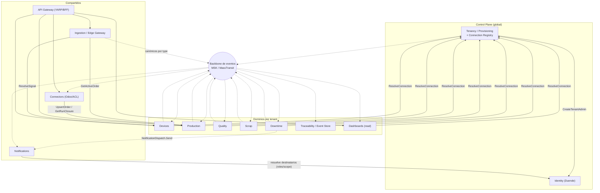

# 04 · Contratos de Servicio — Nexo (MVP)

> **Documento:** `design/04-service-contracts.md` · **Estado:** Borrador v0.1 · **Actualizado:** 2026-07-11
> **Roles:** Software Architect · Tech Lead
> **Relacionados:** [00-tech-baseline.md](./00-tech-baseline.md) · [01-multi-tenancy-connection.md](./01-multi-tenancy-connection.md) · [02-event-model.md](./02-event-model.md) · [03-data-schema.md](./03-data-schema.md) · [05-edge-agent.md](./05-edge-agent.md) · [06-odoo-connector.md](./06-odoo-connector.md) · [07-security.md](./07-security.md)
> **Base funcional:** [../specs/specs/architecture.md](../specs/specs/architecture.md) · [../specs/specs/modules.md](../specs/specs/modules.md) · [../specs/specs/production.md](../specs/specs/production.md)

## Resumen ejecutivo

Este documento define los **contratos de interfaz** de cada servicio del MVP de Nexo, respetando los tres estilos de
comunicación fijados en el baseline ([00-tech-baseline.md](./00-tech-baseline.md), §4): **REST/OpenAPI en el borde**
(frontend, agente edge, integraciones externas), **gRPC para las llamadas internas síncronas** de baja latencia, y
**eventos asíncronos** sobre MassTransit/MSK como columna vertebral de la integración entre dominios (envelope canónico
en [02-event-model.md](./02-event-model.md)).

Alcance: **diseño de contratos**, no implementación. Para cada servicio del MVP se especifica su **responsabilidad**,
un **bosquejo OpenAPI** (YAML resumido) de sus endpoints clave, los **fragmentos `.proto`** de su superficie gRPC
interna cuando aplica, y las **listas de eventos publicados/consumidos**. Se cierra con el **mapa de dependencias**
entre servicios (qué llama a qué por gRPC y qué escucha qué por eventos) y el **flujo end-to-end** del caso estrella del
MVP —carga de producción manual → evento → read model del dashboard → push a Odoo— más las **decisiones pendientes**.

Todos los contratos asumen los invariantes del baseline: **multi-tenant DB-per-tenant** con `tenant_id` resuelto del
JWT (nunca del payload; ver [01-multi-tenancy-connection.md](./01-multi-tenancy-connection.md) y
[../specs/specs/multi-tenancy.md](../specs/specs/multi-tenancy.md)), **Clean Architecture** por servicio, **Duende
IdentityServer** para AuthN/AuthZ (scopes + roles), y **Outbox/Inbox** para publicación/consumo consistente de eventos.

---

## 1. Convenciones de API

Reglas transversales que **todos** los servicios respetan. Un endpoint que se desvíe debe documentar la excepción.

### 1.1 Versionado

| Estilo | Regla |
|---|---|
| **REST** | Versión en la URL: `/v1/...`. El breaking change sube a `/v2`; los cambios compatibles (agregar campos opcionales, nuevos endpoints) no cambian la versión. Todos los servicios exponen bajo el prefijo del servicio en el Gateway (p. ej. `/production/v1/...`). |
| **gRPC** | Versión en el **paquete** `.proto`: `nexo.production.v1`. Un cambio incompatible crea `v2`; se mantienen ambos durante la ventana de migración. |
| **Eventos** | Versión en el **envelope** (`schema_version`) y sufijo en el `type` (`production.registered.v1`). Compatibilidad hacia atrás gobernada por el schema registry (ver [02-event-model.md](./02-event-model.md)). |

### 1.2 Paginación, filtros y ordenamiento

- **Paginación por cursor** (opaco, estable ante inserciones) como estándar para colecciones grandes/append-only:
  `GET /v1/recursos?limit=50&cursor=<opaco>`. Respuesta:

  ```json
  { "data": [ ... ], "page": { "next_cursor": "eyJ...", "has_more": true, "limit": 50 } }
  ```
- **Paginación por offset** (`?page=1&page_size=50`, con `X-Total-Count`) admitida solo en listados acotados de
  configuración (catálogos, usuarios). `limit`/`page_size` máximo **200**, default **50**.
- **Filtros:** query params tipados (`?status=EnEjecucion&line_id=...&from=2026-07-01T00:00:00Z&to=...`). Rangos con
  `from`/`to` en **ISO-8601 UTC**. Filtros repetibles con coma (`?status=EnEjecucion,Pausada`).
- **Ordenamiento:** `?sort=-occurred_at,created_at` (prefijo `-` = descendente).

### 1.3 Errores — ProblemDetails (RFC 7807)

Toda respuesta de error usa `application/problem+json`. `type` apunta a un catálogo estable de problemas de Nexo; `code`
es un **código de error de dominio estable** (no cambia entre versiones); `errors` detalla validaciones de campo.

```json
{
  "type": "https://problems.nexo.app/production/order-not-in-execution",
  "title": "La orden no está En ejecución",
  "status": 409,
  "code": "PRODUCTION.ORDER_NOT_IN_EXECUTION",
  "detail": "No se puede registrar producción contra una orden en estado 'Pausada'.",
  "instance": "/production/v1/orders/9f1c.../production-records",
  "trace_id": "00-4bf92f3577b34da6a3ce929d0e0e4736-00f067aa0ba902b7-01",
  "tenant_id": "acme",
  "errors": { "quantity_good": ["debe ser >= 0"] }
}
```

| HTTP | Uso canónico |
|---|---|
| `400` | Sintaxis/tipos inválidos (validación estructural). |
| `401` | Token ausente/expirado/ inválido. |
| `403` | Autenticado pero sin **scope**/rol o fuera de **scoping** de planta/línea (403 de negocio, V8 de producción). |
| `404` | Recurso inexistente **en el tenant resuelto**. |
| `409` | Conflicto de estado o de **Idempotency-Key** reutilizada con payload distinto. |
| `422` | Regla de negocio/validación semántica (V2–V7 de [../specs/specs/production.md](../specs/specs/production.md)). |
| `429` | Rate limit / throttling por tenant. |
| `503` | Dependencia no disponible (Neon/MSK) — con `Retry-After`. |

### 1.4 Autenticación y autorización (Duende)

- **Bearer JWT** emitido por `Nexo.Identity` (Duende). Claims mínimos: `sub`, `tenant_id`, `roles[]`, `scope`
  (ver [00-tech-baseline.md](./00-tech-baseline.md) §6 y [07-security.md](./07-security.md)).
- El **Gateway** valida firma (JWKS), expiración y coherencia `host`↔`tenant_id`; propaga el contexto aguas abajo.
  Cada servicio revalida el token y aplica **políticas de scope por endpoint** (ASP.NET Core Authorization).
- **`tenant_id` SIEMPRE del token**, nunca de la URL/payload. El scoping por planta/línea (RBAC + ABAC) se resuelve con
  claims/consultas de política (ver [../specs/specs/users-permissions.md](../specs/specs/users-permissions.md)).

**Convención de scopes** — `nexo.<dominio>.<acción>` con `acción ∈ {read, write, admin}`:

| Scope | Otorga |
|---|---|
| `nexo.production.read` / `.write` | Leer / registrar-modificar producción (órdenes, corridas, registros). |
| `nexo.quality.read` / `.write` | Calidad (inspecciones, disposición). |
| `nexo.scrap.read` / `.write` | Scrap. |
| `nexo.downtime.read` / `.write` | Paradas. |
| `nexo.devices.read` / `.admin` | Inventario/salud vs. alta/mapeos/OTA. |
| `nexo.ingestion.write` | **Cuenta de servicio del Agente Edge**: enviar lotes de eventos/lecturas y subir CSV. |
| `nexo.traceability.read` | Consultar event store/genealogía. |
| `nexo.connectors.read` / `.admin` | Ver estado vs. configurar conectores/mapeos/reintentos. |
| `nexo.dashboards.read` | Consultar read models/KPIs. |
| `nexo.notifications.read` / `.write` | Bandeja/preferencias vs. envío (servicios internos). |
| `nexo.tenancy.admin` · `nexo.cp.admin` | **Roles globales** del Control Plane (Super Admin, Implementador, Soporte). |

> Los scopes acotan la **capacidad**; el **alcance** (planta/línea) y las condiciones **ABAC** (ventana de edición,
> propiedad, turno, estado) se validan además en la capa Application de cada servicio.

### 1.5 Idempotencia en escrituras

- Toda escritura no idempotente por naturaleza (`POST` que crea) acepta el header **`Idempotency-Key`** (UUID por
  intento lógico de negocio). El servicio persiste `(tenant_id, idempotency_key) → resultado` durante una ventana
  configurable (≥ 24 h). Reintento con la **misma** clave y **mismo** payload ⇒ misma respuesta (200/201 original);
  con payload **distinto** ⇒ `409 IDEMPOTENCY_KEY_REUSE`.
- **Ingesta de eventos:** además del header, cada evento porta su **`dedup_key`** determinística (edge offline-first,
  store-and-forward). La deduplicación de extremo a extremo se apoya en `dedup_key`/`event_id`
  (ver [02-event-model.md](./02-event-model.md) y [../specs/specs/data-ingestion.md](../specs/specs/data-ingestion.md) §5).
- **Consumidores de eventos:** idempotentes vía tabla `inbox`/`processed_events` (`event_id`).

### 1.6 Correlación y observabilidad

- Propagación **W3C Trace Context**: header `traceparent` (y `tracestate`) end-to-end (Gateway → Ingestion → broker →
  dominios). Se acepta `X-Correlation-Id` del cliente; si falta, el Gateway lo genera.
- El `correlation_id`/`trace_id` y el `tenant_id` viajan en **todos** los logs (Serilog→OTel) y en el `origin_metadata`
  de los eventos, para diagnóstico por tenant (ver [00-tech-baseline.md](./00-tech-baseline.md) §7 y §8.2 de arquitectura).
- **Health:** cada servicio expone `GET /health/live` y `GET /health/ready` (sin auth, no versionados).

### 1.7 Convenciones gRPC internas

- Solo tráfico **service-to-service** dentro del clúster; **nunca** expuesto por el Gateway. Canal **mTLS**
  (ver [07-security.md](./07-security.md)).
- Contexto de tenant y correlación por **metadata**: `x-tenant-id`, `x-correlation-id`, `authorization` (token de
  servicio). El servidor revalida `x-tenant-id` contra el token.
- **Deadlines** obligatorios en el cliente + Polly (timeout, retry con backoff, circuit breaker). Errores mapeados a
  `google.rpc.Status` con el mismo `code` de dominio que REST.

### 1.8 Convención de eventos (resumen; detalle en 02)

Envelope canónico (campos clave, ver [02-event-model.md](./02-event-model.md)):

```jsonc
{
  "event_id": "uuid",            // idempotencia
  "tenant_id": "acme",           // determina DB y partición
  "type": "production.registered.v1",
  "occurred_at": "2026-07-11T13:20:05Z",
  "source": "manual|device|api|file",
  "payload": { /* según type */ },
  "dedup_key": "det-hash",
  "origin_metadata": { "correlation_id": "...", "site":"S1","line":"L3","device_id":"...","data_quality":"good" }
}
```

- **Transporte:** MassTransit sobre MSK/Kafka. **Clave de partición = `tenant_id`** (+ `aggregate_id` donde importa el
  orden intra-agregado). Canales lógicos por familia de `type` (`evt.ingest.*`, `evt.production`, `evt.quality`,
  `evt.scrap`, `evt.downtime`, `evt.machine`, `evt.reading`). **Dead-letter** por canal.
- **Dos capas de eventos:** (a) **canónicos normalizados** que publica Ingestion (routing por `type`: `production`,
  `scrap`, `quality`, `downtime`, `reading`, `machine_event`, `custom`); (b) **eventos de dominio/negocio** que publican
  los dominios (`production.registered`, `quality.disposition`, …). Traceability consume prácticamente todo.

---

## 2. Servicios del MVP

Cada subsección: **responsabilidad** · **REST (OpenAPI resumido)** · **gRPC interno (.proto)** si aplica · **eventos
publicados/consumidos**. La clasificación tenant/compartido/global sigue
[../specs/specs/architecture.md](../specs/specs/architecture.md) §3 y [../specs/specs/multi-tenancy.md](../specs/specs/multi-tenancy.md) §7.

---

### 2.1 Tenancy / Provisioning — `Nexo.Tenancy` (Control Plane)

**Responsabilidad:** alta y ciclo de vida de tenants (flujo de 7 pasos), creación de la DB Neon del tenant, migraciones,
seed, y **Tenant Connection Registry** (ubicación de DB + referencia al secreto). Es el corazón de la resolución de
tenant; **no** almacena dato operativo (ver [../specs/specs/control-plane.md](../specs/specs/control-plane.md) y
[01-multi-tenancy-connection.md](./01-multi-tenancy-connection.md)).

#### REST (OpenAPI resumido)

```yaml
openapi: 3.1.0
info: { title: Nexo Tenancy / Provisioning API, version: "1.0" }
servers: [{ url: https://api.nexo.app/tenancy/v1 }]
security: [{ bearer: [] }]
paths:
  /tenants:
    post:
      summary: Alta de tenant (dispara los 7 pasos de aprovisionamiento, async)
      security: [{ bearer: [ nexo.tenancy.admin ] }]
      parameters:
        - { name: Idempotency-Key, in: header, required: true, schema: { type: string, format: uuid } }
      requestBody:
        required: true
        content:
          application/json:
            schema:
              type: object
              required: [legal_name, plan_code, region, admin_email]
              properties:
                legal_name: { type: string }
                subdomain:  { type: string, description: "empresa → empresa.nexo.app" }
                plan_code:  { type: string, enum: [starter, pro, enterprise] }
                region:     { type: string, example: sa-east-1 }
                admin_email:{ type: string, format: email }
      responses:
        "202": { description: Aprovisionamiento encolado, devuelve tenant en estado 'Aprovisionando' }
        "409": { description: Subdominio en uso, $ref: '#/components/responses/Problem' }
    get:
      summary: Listar tenants (filtros por estado/plan/partner)
      security: [{ bearer: [ nexo.tenancy.admin ] }]
      parameters:
        - { name: status, in: query, schema: { type: string, enum: [Aprovisionando,Activo,Suspendido,BajaLogica] } }
        - { name: limit,  in: query, schema: { type: integer, maximum: 200, default: 50 } }
        - { name: cursor, in: query, schema: { type: string } }
      responses: { "200": { description: Página de tenants } }
  /tenants/{tenantId}:
    get:
      summary: Estado y salud del tenant (ciclo de vida, versión de esquema, último backup)
      security: [{ bearer: [ nexo.tenancy.admin ] }]
      responses: { "200": { description: Tenant }, "404": { $ref: '#/components/responses/Problem' } }
  /tenants/{tenantId}:suspend:
    post:
      summary: Suspender tenant (impago/incidente); preserva datos
      security: [{ bearer: [ nexo.tenancy.admin ] }]
      responses: { "200": { description: Tenant suspendido } }
  /tenants/{tenantId}/provisioning-status:
    get:
      summary: Progreso del aprovisionamiento (paso 1..7)
      security: [{ bearer: [ nexo.tenancy.admin ] }]
      responses: { "200": { description: Estado por paso } }
components:
  securitySchemes:
    bearer: { type: http, scheme: bearer, bearerFormat: JWT }
  responses:
    Problem:
      description: Error RFC7807
      content: { application/problem+json: { schema: { type: object } } }
```

#### gRPC interno (.proto)

`ResolveConnection` es la operación **más llamada de la plataforma**: todo servicio por-tenant la usa (con caché) para
obtener la conexión a la DB del tenant antes de tocar dato.

```proto
syntax = "proto3";
package nexo.tenancy.v1;

// Consumido por TODOS los servicios por-tenant para resolver la DB del tenant.
service TenantConnectionRegistry {
  rpc ResolveConnection (ResolveConnectionRequest) returns (ResolveConnectionReply);
}
message ResolveConnectionRequest { string tenant_id = 1; }
message ResolveConnectionReply {
  string tenant_id       = 1;
  string db_host         = 2;   // proyecto/endpoint Neon del tenant
  string secret_ref      = 3;   // referencia en AWS Secrets Manager (NUNCA la credencial en claro)
  string schema_version  = 4;   // versión de migración aplicada
  string status          = 5;   // Activo | Suspendido | ...
}

// Orquestación del alta (llamado por Administration/Control Plane).
service TenantProvisioning {
  rpc StartProvisioning (StartProvisioningRequest) returns (ProvisioningHandle);
  rpc GetProvisioningStatus (ProvisioningHandle) returns (ProvisioningStatus);
}
message StartProvisioningRequest { string tenant_id = 1; string plan_code = 2; string region = 3; string admin_email = 4; }
message ProvisioningHandle { string tenant_id = 1; string operation_id = 2; }
message ProvisioningStatus { string tenant_id = 1; int32 step = 2; string state = 3; string message = 4; }
```

#### Eventos

| Dirección | Evento | Consumidores / Notas |
|---|---|---|
| **Publica** | `tenant.provisioning.started.v1` | Observability, Audit global |
| **Publica** | `tenant.provisioned.v1` (activo) | Notifications (bienvenida), Identity, Connectors (seed de config), Observability |
| **Publica** | `tenant.state_changed.v1` (suspendido/baja) | Notifications, todos los servicios (cache-invalidate del Registry) |
| **Consume** | — | (orquesta vía gRPC a Identity/Neon; el seed lo dispara internamente) |

---

### 2.2 Identity — `Nexo.Identity` (Duende IdentityServer, Control Plane)

**Responsabilidad:** OIDC/OAuth2, emisión/validación de **JWT** con claim `tenant_id`, federación por tenant (OIDC/SAML)
+ cuentas locales, MFA/step-up, **introspection** y rotación de claves. Provee la identidad que todo el resto valida.

#### REST (OpenAPI resumido) — endpoints OAuth2/OIDC estándar

```yaml
openapi: 3.1.0
info: { title: Nexo Identity (Duende), version: "1.0" }
servers: [{ url: https://id.nexo.app }]
paths:
  /.well-known/openid-configuration:
    get: { summary: Discovery document, responses: { "200": { description: OIDC metadata } } }
  /.well-known/jwks.json:
    get: { summary: JWKS (claves públicas para validar JWT), responses: { "200": { description: JWKS } } }
  /connect/token:
    post:
      summary: Emisión de token (authorization_code+PKCE, client_credentials para edge/servicios, refresh)
      requestBody:
        content:
          application/x-www-form-urlencoded:
            schema:
              type: object
              properties:
                grant_type:    { type: string, enum: [authorization_code, client_credentials, refresh_token] }
                scope:         { type: string, example: "openid profile nexo.production.write" }
                client_id:     { type: string }
                acr_values:    { type: string, description: "mfa / step-up para acciones críticas" }
      responses:
        "200": { description: "access_token (JWT con tenant_id, roles, scope), id_token, refresh_token" }
        "400": { description: invalid_grant / invalid_scope }
  /connect/introspect:
    post:
      summary: Introspección de token (RFC 7662) — uso interno de servicios/Gateway
      security: [{ basicClient: [] }]
      responses: { "200": { description: "{ active, sub, tenant_id, scope, exp }" } }
  /connect/userinfo:
    get:
      summary: Claims del usuario autenticado
      security: [{ bearer: [] }]
      responses: { "200": { description: UserInfo } }
components:
  securitySchemes:
    bearer:      { type: http, scheme: bearer, bearerFormat: JWT }
    basicClient: { type: http, scheme: basic }
```

> **Nota:** la validación de tokens por los servicios es **local vía JWKS** (sin llamada por request); la
> **introspection** se reserva para tokens de referencia o revocación. Gestión de usuarios operativos por tenant vive en
> la porción por-tenant de Identity & Access (ver [../specs/specs/users-permissions.md](../specs/specs/users-permissions.md)).

#### gRPC interno (.proto)

```proto
syntax = "proto3";
package nexo.identity.v1;

// Llamado por Tenant Provisioning (paso 5: crear admin inicial del tenant).
service IdentityProvisioning {
  rpc CreateTenantAdmin (CreateTenantAdminRequest) returns (CreateTenantAdminReply);
}
message CreateTenantAdminRequest { string tenant_id = 1; string email = 2; string display_name = 3; }
message CreateTenantAdminReply   { string user_id = 1; string invite_token = 2; }
```

#### Eventos

| Dirección | Evento | Consumidores / Notas |
|---|---|---|
| **Publica** | `identity.user.created.v1`, `identity.role_binding.changed.v1` | Audit, Notifications |
| **Publica** | `identity.login.suspicious.v1` | Rules Engine, Notifications (severidad seguridad) |
| **Consume** | `tenant.provisioned.v1` | Habilita realm/login del tenant |

---

### 2.3 Ingestion / Edge Gateway — `Nexo.Ingestion` (compartido, procesa por tenant)

**Responsabilidad:** recepción de los envíos **outbound** del Agente Edge (lotes de eventos/lecturas) y **carga CSV/Excel**,
**normalización al Evento canónico**, validación en capas, **deduplicación** y **enrutamiento por `type`** al broker.
No habla con el ERP ni persiste estado de dominio (ver [../specs/specs/data-ingestion.md](../specs/specs/data-ingestion.md)).
En el MVP los adapters activos son **manual/tablet** y **datalogger vía archivo** (S7/OPC UA/Modbus/MQTT llegan en V1).

#### REST (OpenAPI resumido) — borde edge/carga

```yaml
openapi: 3.1.0
info: { title: Nexo Ingestion API, version: "1.0" }
servers: [{ url: https://api.nexo.app/ingestion/v1 }]
security: [{ bearer: [] }]
paths:
  /events:batch:
    post:
      summary: Ingesta de un lote de eventos/lecturas desde el Agente Edge o la tablet (offline-first)
      security: [{ bearer: [ nexo.ingestion.write ] }]
      parameters:
        - { name: Idempotency-Key, in: header, required: true, schema: { type: string, format: uuid } }
      requestBody:
        required: true
        content:
          application/json:
            schema:
              type: object
              required: [items]
              properties:
                items:
                  type: array
                  maxItems: 1000
                  items:
                    type: object
                    required: [dedup_key, source, type, occurred_at, payload]
                    properties:
                      dedup_key:   { type: string }
                      source:      { type: string, enum: [manual, device, api, file] }
                      type:        { type: string, enum: [production, scrap, quality, downtime, reading, machine_event, custom] }
                      occurred_at: { type: string, format: date-time }
                      device_id:   { type: string, nullable: true }
                      tag_id:      { type: string, nullable: true }
                      operator_id: { type: string, nullable: true }
                      payload:     { type: object }
      responses:
        "202":
          description: Aceptado; devuelve resultado por ítem (aceptado/duplicado/cuarentena)
          content:
            application/json:
              schema:
                type: object
                properties:
                  accepted:   { type: integer }
                  duplicated: { type: integer }
                  quarantined:{ type: integer }
                  results:    { type: array, items: { type: object, properties: { dedup_key: {type: string}, status: {type: string} } } }
        "207": { description: Multi-status (mezcla de aceptados/cuarentena) }
        "422": { description: Lote inválido, $ref: '#/components/responses/Problem' }
  /imports:csv:
    post:
      summary: Carga de archivo CSV/Excel (datalogger/carga manual masiva) → parseo + mapeo de columnas
      security: [{ bearer: [ nexo.ingestion.write ] }]
      parameters:
        - { name: Idempotency-Key, in: header, required: true, schema: { type: string, format: uuid } }
        - { name: mapping_id, in: query, required: true, schema: { type: string }, description: "perfil de mapeo columna→campo" }
      requestBody:
        content: { multipart/form-data: { schema: { type: object, properties: { file: { type: string, format: binary } } } } }
      responses:
        "202": { description: Import job creado }
  /imports/{jobId}:
    get:
      summary: Estado de un import (filas OK / en cuarentena / errores)
      security: [{ bearer: [ nexo.ingestion.read ] }]
      responses: { "200": { description: Import job status } }
  /quarantine:
    get:
      summary: Eventos en cuarentena (dead-letter) para revisión/reinyección
      security: [{ bearer: [ nexo.ingestion.read ] }]
      responses: { "200": { description: Página de eventos en cuarentena } }
components:
  securitySchemes: { bearer: { type: http, scheme: bearer, bearerFormat: JWT } }
  responses:
    Problem: { description: Error RFC7807, content: { application/problem+json: { schema: { type: object } } } }
```

#### gRPC interno — Ingestion es **cliente** de Devices

Para normalizar, Ingestion resuelve el contexto de la señal/tag (device→site/line/asset + mapeo señal de negocio)
llamando a `Nexo.Devices` (patrón del baseline §4). No expone servidor gRPC propio en el MVP (el ingreso es REST).

#### Eventos

| Dirección | Evento (`type`) | Consumidores / Notas |
|---|---|---|
| **Publica** | Canónico `production` | Production (+ Traceability, Dashboards, Rules) |
| **Publica** | Canónico `scrap` | Scrap (+ Traceability, Dashboards, Rules) |
| **Publica** | Canónico `quality` / `quality.measured` | Quality (+ Traceability, Dashboards) |
| **Publica** | Canónico `downtime` / `machine_event` | Downtime/Devices (+ Production para pausar corrida, Rules) |
| **Publica** | Canónico `reading` | Time-series / Devices (+ Rules; agregaciones a Dashboards) |
| **Publica** | `ingestion.quarantined.v1` | Observability/Notifications (evento inválido/no contextualizado) |
| **Consume** | — | (recibe de edge/CSV por REST; resuelve contexto por gRPC a Devices) |

---

### 2.4 Devices — `Nexo.Devices` (por tenant)

**Responsabilidad:** catálogo de dispositivos/sensores/**señales-tags**, salud/estado de conexión, **mapeo tag→señal de
negocio** (fuente de verdad que Ingestion consume), firmware/OTA. Provee el **contexto físico** que enriquece cada evento
(ver [../specs/specs/devices.md](../specs/specs/devices.md)).

#### REST (OpenAPI resumido)

```yaml
openapi: 3.1.0
info: { title: Nexo Devices API, version: "1.0" }
servers: [{ url: https://api.nexo.app/devices/v1 }]
security: [{ bearer: [] }]
paths:
  /devices:
    get:
      summary: Inventario de dispositivos (filtros por línea/estado/protocolo)
      security: [{ bearer: [ nexo.devices.read ] }]
      parameters:
        - { name: line_id, in: query, schema: { type: string } }
        - { name: status,  in: query, schema: { type: string, enum: [Activo,Degradado,Retirado,EnPrueba] } }
      responses: { "200": { description: Página de dispositivos } }
    post:
      summary: Alta de dispositivo (onboarding paso 1)
      security: [{ bearer: [ nexo.devices.admin ] }]
      parameters: [{ name: Idempotency-Key, in: header, required: true, schema: { type: string, format: uuid } }]
      responses: { "201": { description: Dispositivo creado } }
  /devices/{deviceId}/health:
    get:
      summary: Salud y estado de conexión (online/offline, última comunicación, calidad de dato)
      security: [{ bearer: [ nexo.devices.read ] }]
      responses: { "200": { description: DeviceHealth } }
  /devices/{deviceId}/signals:
    post:
      summary: Declarar señal/tag técnica + mapeo a señal de negocio
      security: [{ bearer: [ nexo.devices.admin ] }]
      responses: { "201": { description: Señal creada } }
  /signal-mappings:
    get:
      summary: Catálogo de mapeos tag→señal de negocio (usado por Ingestion)
      security: [{ bearer: [ nexo.devices.read ] }]
      responses: { "200": { description: Página de mapeos } }
components:
  securitySchemes: { bearer: { type: http, scheme: bearer, bearerFormat: JWT } }
```

#### gRPC interno (.proto) — servidor consumido por Ingestion (y Production)

```proto
syntax = "proto3";
package nexo.devices.v1;

service DeviceContext {
  // Ingestion: resolver contexto de una lectura antes de normalizar.
  rpc ResolveSignal (ResolveSignalRequest) returns (ResolveSignalReply);
  // Production/otros: contexto físico de un asset.
  rpc GetAssetContext (GetAssetContextRequest) returns (AssetContext);
}
message ResolveSignalRequest { string tenant_id = 1; string device_id = 2; string tag_id = 3; }
message ResolveSignalReply {
  string business_signal = 1;   // "Piezas producidas OK — L3"
  string signal_kind     = 2;   // contador_acumulativo | estado | analogica | evento
  string unit            = 3;
  string site = 4; string line = 5; string asset = 6;
  string event_type      = 7;   // production | reading | machine_event ...
  string data_quality    = 8;   // good | suspect | ...
}
message GetAssetContextRequest { string tenant_id = 1; string asset_id = 2; }
message AssetContext { string site = 1; string line = 2; string asset = 3; string work_center = 4; }
```

#### Eventos

| Dirección | Evento | Consumidores / Notas |
|---|---|---|
| **Publica** | `device.state_changed.v1` (online/offline/degradado) | Dashboards, Rules Engine, Observability |
| **Publica** | `device.mapping.changed.v1` | Ingestion (refresca caché de mapeos), Audit |
| **Publica** | `device.ota.campaign.status.v1` | Dashboards, Audit |
| **Consume** | `machine_event`, `reading` (canónicos) | Actualiza salud/última-comunicación del dispositivo |

---

### 2.5 Production — `Nexo.Production` (por tenant) · **caso estrella del MVP**

**Responsabilidad:** órdenes de producción (espejo de la MO de Odoo), **corridas (Production Run)**, **registros de
producción** (manual y automático), turnos, ciclo de estados y KPIs (Rendimiento, factor Calidad, cumplimiento de plan).
Emite eventos `production.*`; consume calidad/scrap/máquina para conciliar (ver
[../specs/specs/production.md](../specs/specs/production.md)).

#### REST (OpenAPI resumido)

```yaml
openapi: 3.1.0
info: { title: Nexo Production API, version: "1.0" }
servers: [{ url: https://api.nexo.app/production/v1 }]
security: [{ bearer: [] }]
paths:
  /orders:
    get:
      summary: Listar órdenes (filtros por estado/línea/producto/turno)
      security: [{ bearer: [ nexo.production.read ] }]
      parameters:
        - { name: status,  in: query, schema: { type: string, enum: [Planificada,Liberada,EnEjecucion,Pausada,Completada,Cerrada,Sincronizada,Cancelada] } }
        - { name: line_id, in: query, schema: { type: string } }
        - { name: limit,   in: query, schema: { type: integer, maximum: 200, default: 50 } }
        - { name: cursor,  in: query, schema: { type: string } }
      responses: { "200": { description: Página de órdenes } }
  /orders/{orderId}:
    get:
      summary: Detalle de orden (acumulados buenas/no conformes, avance vs plan)
      security: [{ bearer: [ nexo.production.read ] }]
      responses: { "200": { description: Orden }, "404": { $ref: '#/components/responses/Problem' } }
  /orders/{orderId}:release:
    post:
      summary: Liberar orden a planta (Planificada→Liberada)
      security: [{ bearer: [ nexo.production.write ] }]
      responses: { "200": { description: Orden liberada }, "422": { $ref: '#/components/responses/Problem' } }
  /orders/{orderId}/runs:
    post:
      summary: Abrir corrida en una máquina/turno (arranque)
      security: [{ bearer: [ nexo.production.write ] }]
      parameters: [{ name: Idempotency-Key, in: header, required: true, schema: { type: string, format: uuid } }]
      responses: { "201": { description: Corrida abierta (orden→EnEjecucion) } }
  /runs/{runId}:close:
    post:
      summary: Cerrar corrida (consolida totales; dispara push agregado a Odoo)
      security: [{ bearer: [ nexo.production.write ] }]
      responses: { "200": { description: Corrida cerrada } }
  /orders/{orderId}/production-records:
    post:
      summary: Registrar producción MANUAL (tablet) — caso estrella
      description: >
        Requiere orden En ejecución (V2), scoping de línea (V8) y ABAC (turno activo, ventana de edición).
        Idempotente por Idempotency-Key + dedup_key.
      security: [{ bearer: [ nexo.production.write ] }]
      parameters: [{ name: Idempotency-Key, in: header, required: true, schema: { type: string, format: uuid } }]
      requestBody:
        required: true
        content:
          application/json:
            schema:
              type: object
              required: [machine_id, quantity_good, quantity_nonconform, occurred_at]
              properties:
                run_id:              { type: string, nullable: true }
                machine_id:          { type: string }
                quantity_good:       { type: integer, minimum: 0 }
                quantity_nonconform: { type: integer, minimum: 0 }
                nonconform_reason:   { type: string, nullable: true }
                occurred_at:         { type: string, format: date-time }
                photo_file_id:       { type: string, nullable: true }
      responses:
        "201": { description: "Registro creado; emite production.registered" }
        "403": { description: "Fuera de scoping/ABAC", $ref: '#/components/responses/Problem' }
        "409": { description: "Idempotency-Key reusada con distinto payload" }
        "422": { description: "Orden no En ejecución / discrepancia (V4/V7)", $ref: '#/components/responses/Problem' }
  /orders/{orderId}/adjustments:
    post:
      summary: Ajuste retroactivo (supervisor) — nunca edición destructiva, genera evento de ajuste
      security: [{ bearer: [ nexo.production.write ] }]
      responses: { "201": { description: Ajuste registrado } }
components:
  securitySchemes: { bearer: { type: http, scheme: bearer, bearerFormat: JWT } }
  responses:
    Problem: { description: Error RFC7807, content: { application/problem+json: { schema: { type: object } } } }
```

#### gRPC interno (.proto) — servidor consumido por Connectors e Ingestion

```proto
syntax = "proto3";
package nexo.production.v1;

service ProductionOrders {
  // Connectors (pull Odoo): crear/actualizar orden espejo idempotente por external_ref.
  rpc UpsertOrder (UpsertOrderRequest) returns (Order);
  // Ingestion/otros: resolver la orden ACTIVA de una máquina para imputar un delta automático.
  rpc GetActiveOrder (GetActiveOrderRequest) returns (Order);
  // Connectors (push): snapshot consolidado por cierre de corrida para reportar a Odoo.
  rpc GetRunClosure (GetRunClosureRequest) returns (RunClosure);
}
message UpsertOrderRequest {
  string tenant_id = 1; string external_ref = 2; string product_sku = 3;
  double planned_qty = 4; string uom = 5; string odoo_state = 6;
}
message Order {
  string order_id = 1; string external_ref = 2; string status = 3;
  double planned_qty = 4; double good_qty = 5; double nonconform_qty = 6;
}
message GetActiveOrderRequest { string tenant_id = 1; string machine_id = 2; string at = 3; }
message GetRunClosureRequest  { string tenant_id = 1; string run_id = 2; }
message RunClosure {
  string run_id = 1; string order_id = 2; string external_ref = 3;
  double good_qty = 4; double nonconform_qty = 5; string operative_time = 6; string closed_at = 7;
}
```

#### Eventos

| Dirección | Evento | Consumidores / Notas |
|---|---|---|
| **Publica** | `production.registered.v1` | Traceability, Dashboards, Rules, (Scrap/Downtime/Quality como denominador/contexto) |
| **Publica** | `production.order.state_changed.v1` | Dashboards, **Connectors (Odoo)**, Notifications |
| **Publica** | `production.run.closed.v1` | **Connectors (push agregado a Odoo)**, Dashboards, Traceability |
| **Publica** | `production.discrepancy.detected.v1` (V4/V7) | Rules Engine, Notifications |
| **Consume** | `machine_event` | Pausar/reanudar corrida (de Downtime/Devices) |
| **Consume** | `quality.disposition.v1` | Reclasificar buenas/no conformes |
| **Consume** | `scrap.registered.v1` | Descontar buenas / ajustar total |
| **Consume** | Canónico `production` (Ingestion) | Registro automático por delta de contador |

---

### 2.6 Quality — `Nexo.Quality` (por tenant)

**Responsabilidad:** inspecciones, checklists, tolerancias (LSL/USL), defectos y **disposición** (aceptar/rechazar/retrabajar),
FPY. Dueño del **factor Calidad** junto con Production (ver [../specs/specs/quality.md](../specs/specs/quality.md)).

#### REST (OpenAPI resumido)

```yaml
openapi: 3.1.0
info: { title: Nexo Quality API, version: "1.0" }
servers: [{ url: https://api.nexo.app/quality/v1 }]
security: [{ bearer: [] }]
paths:
  /inspections:
    post:
      summary: Registrar inspección/checklist (ejecución en piso)
      security: [{ bearer: [ nexo.quality.write ] }]
      parameters: [{ name: Idempotency-Key, in: header, required: true, schema: { type: string, format: uuid } }]
      responses: { "201": { description: "Inspección creada; emite quality.inspection.completed" } }
    get:
      summary: Listar inspecciones (por orden/línea/resultado)
      security: [{ bearer: [ nexo.quality.read ] }]
      responses: { "200": { description: Página de inspecciones } }
  /nonconformances/{ncId}:disposition:
    post:
      summary: Decidir disposición (aceptar/rechazar/retrabajar) — acción exclusiva de Calidad (SoD)
      security: [{ bearer: [ nexo.quality.write ] }]
      requestBody:
        content:
          application/json:
            schema:
              type: object
              required: [disposition]
              properties:
                disposition: { type: string, enum: [aceptar, rechazar, retrabajar] }
                reason_code: { type: string }
      responses:
        "200": { description: "Disposición aplicada; emite quality.disposition (y scrap si 'rechazar')" }
        "403": { description: "Solo rol Calidad", $ref: '#/components/responses/Problem' }
  /defect-reason-codes:
    get:
      summary: Taxonomía de reason codes de defectos (compartida con Scrap/Downtime)
      security: [{ bearer: [ nexo.quality.read ] }]
      responses: { "200": { description: Árbol de reason codes } }
components:
  securitySchemes: { bearer: { type: http, scheme: bearer, bearerFormat: JWT } }
  responses:
    Problem: { description: Error RFC7807, content: { application/problem+json: { schema: { type: object } } } }
```

> gRPC interno: **no requerido en el MVP** (integración por eventos). Odoo `quality.check` es bidireccional-opcional vía
> Connectors.

#### Eventos

| Dirección | Evento | Consumidores / Notas |
|---|---|---|
| **Publica** | `quality.inspection.completed.v1` | Traceability, Dashboards |
| **Publica** | `quality.nonconformance.detected.v1` | Rules Engine, Notifications, Scrap, Downtime |
| **Publica** | `quality.disposition.v1` (aceptar/rechazar/retrabajar) | Production (reclasifica), Scrap (si rechazo) |
| **Publica** | `quality.measured.v1` (sensor) | Dashboards, Rules |
| **Consume** | `production.registered.v1` | Contexto/cantidades |
| **Consume** | Canónico `quality` / `machine_event` | Inspección desde ingesta / correlación con máquina |

---

### 2.7 Scrap — `Nexo.Scrap` (por tenant)

**Responsabilidad:** registros de scrap con **reason code**, costo y clasificación; alimenta el **Scrap Rate** (por piezas
o costo). Reason codes coherentes con Quality/Downtime (ver [../specs/specs/scrap.md](../specs/specs/scrap.md)).

#### REST (OpenAPI resumido)

```yaml
openapi: 3.1.0
info: { title: Nexo Scrap API, version: "1.0" }
servers: [{ url: https://api.nexo.app/scrap/v1 }]
security: [{ bearer: [] }]
paths:
  /scrap-records:
    post:
      summary: Registrar scrap (cantidad + reason code + contexto orden/máquina)
      security: [{ bearer: [ nexo.scrap.write ] }]
      parameters: [{ name: Idempotency-Key, in: header, required: true, schema: { type: string, format: uuid } }]
      requestBody:
        content:
          application/json:
            schema:
              type: object
              required: [order_id, quantity, reason_code]
              properties:
                order_id:    { type: string }
                machine_id:  { type: string }
                quantity:    { type: number, minimum: 0 }
                uom:         { type: string }
                reason_code: { type: string }
                cost:        { type: number, nullable: true }
      responses: { "201": { description: "Scrap creado; emite scrap.registered" } }
    get:
      summary: Listar scrap (Pareto de motivos, por turno/línea)
      security: [{ bearer: [ nexo.scrap.read ] }]
      responses: { "200": { description: Página de scrap } }
  /scrap-reason-codes:
    get:
      summary: Taxonomía de reason codes de scrap
      security: [{ bearer: [ nexo.scrap.read ] }]
      responses: { "200": { description: Árbol de reason codes } }
components:
  securitySchemes: { bearer: { type: http, scheme: bearer, bearerFormat: JWT } }
```

#### Eventos

| Dirección | Evento | Consumidores / Notas |
|---|---|---|
| **Publica** | `scrap.registered.v1` | Production (ajusta buenas/total), Traceability, Dashboards, **Connectors (`stock.scrap`)** |
| **Publica** | `scrap.classified.v1` / `scrap.valued.v1` | Dashboards, Reports, Connectors |
| **Publica** | `scrap.threshold.exceeded.v1` | Rules Engine, Notifications |
| **Consume** | `quality.disposition.v1` (rechazo) | Crea Scrap Record |
| **Consume** | `production.registered.v1` | Denominador Scrap Rate |
| **Consume** | `machine_event` | Correlación con parada/setup |

---

### 2.8 Downtime — `Nexo.Downtime` (por tenant)

**Responsabilidad:** paradas (programadas/no), árbol de motivos, MTBF/MTTR y factor **Disponibilidad**. Emite/consume
`machine_event`; puede **inferir** parada por ausencia de conteo (ver [../specs/specs/downtime.md](../specs/specs/downtime.md)).

#### REST (OpenAPI resumido)

```yaml
openapi: 3.1.0
info: { title: Nexo Downtime API, version: "1.0" }
servers: [{ url: https://api.nexo.app/downtime/v1 }]
security: [{ bearer: [] }]
paths:
  /downtime-events:
    post:
      summary: Abrir parada (manual, por supervisor) — Liberada→Pausada en Production
      security: [{ bearer: [ nexo.downtime.write ] }]
      parameters: [{ name: Idempotency-Key, in: header, required: true, schema: { type: string, format: uuid } }]
      responses: { "201": { description: "Parada abierta; emite downtime.started" } }
    get:
      summary: Listar paradas (Pareto de motivos, activas por línea)
      security: [{ bearer: [ nexo.downtime.read ] }]
      responses: { "200": { description: Página de paradas } }
  /downtime-events/{id}:close:
    post:
      summary: Cerrar parada con motivo (reason code técnico)
      security: [{ bearer: [ nexo.downtime.write ] }]
      requestBody:
        content: { application/json: { schema: { type: object, required: [reason_code], properties: { reason_code: { type: string } } } } }
      responses: { "200": { description: "Parada cerrada; emite downtime.ended" } }
components:
  securitySchemes: { bearer: { type: http, scheme: bearer, bearerFormat: JWT } }
```

#### Eventos

| Dirección | Evento | Consumidores / Notas |
|---|---|---|
| **Publica** | `machine_event` (run/stop/fault) | Production (pausar corrida), Devices, Rules |
| **Publica** | `downtime.started.v1` | Rules Engine, Notifications, Dashboards |
| **Publica** | `downtime.ended.v1` | Dashboards, Traceability, Reports |
| **Publica** | `downtime.unjustified.v1` | Rules Engine, Notifications |
| **Publica** | `downtime.critical.v1` | Rules Engine → Notifications (escalado Mantenimiento) |
| **Consume** | `production.registered.v1` | Inferencia por ausencia de conteo |
| **Consume** | `quality.nonconformance.detected.v1` | Parada por calidad |
| **Consume** | Canónico `machine_event` (Ingestion) | Estado de máquina automático |

---

### 2.9 Traceability / Event Store — `Nexo.Traceability` (por tenant)

**Responsabilidad:** **event store append-only** inmutable por tenant, historial de entidades, **genealogía forward/backward**
de lote/serie, y correlación evento→registro→Sync Job→ERP. Consume prácticamente todos los eventos; expone **consultas**
(ver [../specs/specs/traceability.md](../specs/specs/traceability.md)).

#### REST (OpenAPI resumido)

```yaml
openapi: 3.1.0
info: { title: Nexo Traceability / Event Store API, version: "1.0" }
servers: [{ url: https://api.nexo.app/traceability/v1 }]
security: [{ bearer: [ nexo.traceability.read ] }]
paths:
  /events:
    get:
      summary: Consultar event store (por rango temporal/type/aggregate) — solo lectura, inmutable
      parameters:
        - { name: type,        in: query, schema: { type: string } }
        - { name: aggregate_id,in: query, schema: { type: string } }
        - { name: from, in: query, schema: { type: string, format: date-time } }
        - { name: to,   in: query, schema: { type: string, format: date-time } }
        - { name: limit,  in: query, schema: { type: integer, maximum: 200, default: 50 } }
        - { name: cursor, in: query, schema: { type: string } }
      responses: { "200": { description: Página de eventos } }
  /entities/{entityType}/{entityId}/timeline:
    get:
      summary: Línea de tiempo (historial reproducible) de una entidad de negocio
      responses: { "200": { description: Timeline de eventos } }
  /genealogy/{lotOrSerial}:
    get:
      summary: Genealogía de un lote/serie
      parameters:
        - { name: direction, in: query, required: true, schema: { type: string, enum: [forward, backward] } }
        - { name: depth, in: query, schema: { type: integer, default: 5 } }
      responses:
        "200": { description: "Grafo consume/produce (forward=where-used/recall; backward=as-built)" }
components:
  securitySchemes: { bearer: { type: http, scheme: bearer, bearerFormat: JWT } }
```

#### Eventos

| Dirección | Evento | Notas |
|---|---|---|
| **Publica** | `traceability.chain.linked.v1` | (opcional) confirma correlación registro↔evento↔sync |
| **Consume** | **Todos** los canónicos + eventos de dominio (`production.*`, `quality.*`, `scrap.*`, `downtime.*`, `reading`, `machine_event`) | Construye el historial inmutable y la genealogía |

---

### 2.10 Connectors / Integrations (Odoo) — `Nexo.Connectors` (compartido, config por tenant)

**Responsabilidad:** **ACL** hacia el ERP. En el MVP, conector **Odoo**: **pull** de MO/Producto/UoM/Motivos (contexto) y
**push** de producción real (**agregado por cierre de corrida**) y scrap (`stock.scrap`); calidad bidireccional opcional.
Sync Jobs con reintentos/idempotencia/DLQ (ver [../specs/specs/integrations.md](../specs/specs/integrations.md) y
[06-odoo-connector.md](./06-odoo-connector.md)).

#### REST (OpenAPI resumido) — administración/operación del conector

```yaml
openapi: 3.1.0
info: { title: Nexo Connectors API, version: "1.0" }
servers: [{ url: https://api.nexo.app/connectors/v1 }]
security: [{ bearer: [] }]
paths:
  /connectors:
    get:
      summary: Conectores habilitados del tenant y su estado (Activo/Degradado/Error/SinCredenciales)
      security: [{ bearer: [ nexo.connectors.read ] }]
      responses: { "200": { description: Lista de conectores } }
  /connectors/odoo:
    put:
      summary: Configurar/actualizar el conector Odoo (endpoint + referencia de credencial + opciones)
      security: [{ bearer: [ nexo.connectors.admin ] }]
      responses: { "200": { description: Conector configurado } }
  /connectors/odoo/mappings:
    put:
      summary: Mapeo declarativo (entidad/campo/catálogos/UoM/identidad) — sin redeploy
      security: [{ bearer: [ nexo.connectors.admin ] }]
      responses: { "200": { description: Mapeo actualizado } }
  /connectors/odoo:pull:
    post:
      summary: Forzar pull de MO/catálogos (además del schedule)
      security: [{ bearer: [ nexo.connectors.admin ] }]
      responses: { "202": { description: Pull encolado } }
  /sync-jobs:
    get:
      summary: Bitácora de Sync Jobs (estado, dirección, entidad, reintentos)
      security: [{ bearer: [ nexo.connectors.read ] }]
      parameters:
        - { name: status, in: query, schema: { type: string, enum: [Encolado,EnProceso,Reintentando,Exitoso,Fallido,EnRevision] } }
      responses: { "200": { description: Página de sync jobs } }
  /sync-jobs/{jobId}:retry:
    post:
      summary: Reintentar un Sync Job de la DLQ (tras corregir mapeo/dato)
      security: [{ bearer: [ nexo.connectors.admin ] }]
      responses: { "202": { description: Reencolado } }
components:
  securitySchemes: { bearer: { type: http, scheme: bearer, bearerFormat: JWT } }
```

#### gRPC interno — Connectors es **cliente** de Production

En el **pull**, Connectors traduce cada MO de Odoo y llama a `nexo.production.v1.ProductionOrders/UpsertOrder`
(idempotente por `external_ref`). En el **push**, reacciona a `production.run.closed.v1` y usa `GetRunClosure` para armar
el payload consolidado. No expone servidor gRPC en el MVP.

#### Eventos

| Dirección | Evento | Consumidores / Notas |
|---|---|---|
| **Publica** | `connector.order.imported.v1` | Production (vía gRPC Upsert) / Dashboards, Audit |
| **Publica** | `connector.sync.succeeded.v1` / `connector.sync.failed.v1` | Rules Engine, Notifications, Observability |
| **Consume** | `production.run.closed.v1` | Push agregado de producción real a la MO (avance/cierre) |
| **Consume** | `production.order.state_changed.v1` | Mapear estado Nexo→Odoo |
| **Consume** | `scrap.registered.v1` / `scrap.valued.v1` | Push `stock.scrap` |
| **Consume** | `quality.disposition.v1` | (opcional) push `quality.check` |
| **Consume** | `tenant.provisioned.v1` | Seed de configuración base del conector |

---

### 2.11 Dashboards / Analytics — `Nexo.Dashboards` (por tenant, read side CQRS)

**Responsabilidad:** **read models** materializados desde el backbone de eventos y **API de consulta** de KPIs/tableros
(OEE y sus factores, Producción, Scrap Rate, FPY, MTBF/MTTR, alarmas). Solo lectura; nunca fuente de verdad
(ver [../specs/specs/dashboards.md](../specs/specs/dashboards.md)). El tiempo real se sirve por **SSE/WebSocket**.

#### REST (OpenAPI resumido)

```yaml
openapi: 3.1.0
info: { title: Nexo Dashboards / Analytics API, version: "1.0" }
servers: [{ url: https://api.nexo.app/dashboards/v1 }]
security: [{ bearer: [ nexo.dashboards.read ] }]
paths:
  /kpis/oee:
    get:
      summary: OEE y sus tres factores por dimensión/ventana
      parameters:
        - { name: dimension, in: query, required: true, schema: { type: string, enum: [tenant,site,line,asset,shift,order] } }
        - { name: dimension_id, in: query, schema: { type: string } }
        - { name: from, in: query, schema: { type: string, format: date-time } }
        - { name: to,   in: query, schema: { type: string, format: date-time } }
      responses:
        "200":
          description: "Read model rm_oee (availability, performance, quality, oee, freshness_at)"
          headers: { X-Data-Freshness: { schema: { type: string, format: date-time } } }
  /kpis/production:
    get:
      summary: Producción y eficiencia (rm_production) — soporta drill-down por dimensión
      responses: { "200": { description: Read model de producción } }
  /andon/{lineId}/stream:
    get:
      summary: Stream en vivo del andon de línea (Server-Sent Events)
      responses: { "200": { description: "text/event-stream; eventos push de KPIs en vivo" } }
  /alerts:
    get:
      summary: Alarmas activas (rm_alerts) priorizadas
      responses: { "200": { description: Lista de alarmas } }
components:
  securitySchemes: { bearer: { type: http, scheme: bearer, bearerFormat: JWT } }
```

#### Eventos

| Dirección | Evento | Notas |
|---|---|---|
| **Publica** | — | (proyecta a read models; no publica eventos de dominio) |
| **Consume** | `production.registered.v1`, `production.run.closed.v1` | rm_production, rm_oee |
| **Consume** | `scrap.registered.v1`/`scrap.valued.v1` | rm_scrap |
| **Consume** | `quality.*` | rm_quality (FPY, factor Calidad) |
| **Consume** | `downtime.*`, `machine_event` | rm_downtime (Disponibilidad, MTBF/MTTR) |
| **Consume** | `reading` | rm_consumption |
| **Consume** | alertas de Rules/Notifications | rm_alerts |

---

### 2.12 Notifications — `Nexo.Notifications` (compartido, segmentado por tenant)

**Responsabilidad:** **entrega** multicanal (in-app/email/SMS/push/WhatsApp/webhook), plantillas, preferencias por
usuario, reintentos/fallback y estado de entrega. La **decisión** (qué disparar) vive en Rules Engine/servicios origen
(ver [../specs/specs/notifications.md](../specs/specs/notifications.md)).

#### REST (OpenAPI resumido)

```yaml
openapi: 3.1.0
info: { title: Nexo Notifications API, version: "1.0" }
servers: [{ url: https://api.nexo.app/notifications/v1 }]
security: [{ bearer: [] }]
paths:
  /inbox:
    get:
      summary: Bandeja in-app del usuario autenticado (badge de la UI)
      security: [{ bearer: [ nexo.notifications.read ] }]
      responses: { "200": { description: Página de notificaciones } }
  /inbox/{id}:ack:
    post:
      summary: Acusar/marcar leída (alimenta el escalado del Rules Engine)
      security: [{ bearer: [ nexo.notifications.read ] }]
      responses: { "200": { description: Acuse registrado } }
  /preferences:
    put:
      summary: Preferencias de canal por severidad, no-molestar, digest, idioma
      security: [{ bearer: [ nexo.notifications.read ] }]
      responses: { "200": { description: Preferencias actualizadas } }
  /templates:
    put:
      summary: Override de plantillas por tenant (versionadas, previsualizables)
      security: [{ bearer: [ nexo.notifications.write ] }]
      responses: { "200": { description: Plantilla actualizada } }
components:
  securitySchemes: { bearer: { type: http, scheme: bearer, bearerFormat: JWT } }
```

#### gRPC interno (.proto) — servidor consumido por Rules Engine / servicios origen

```proto
syntax = "proto3";
package nexo.notifications.v1;

service NotificationDispatch {
  // Enviar una notificación resolviendo destinatarios por rol/scope + preferencias.
  rpc Send (SendRequest) returns (SendReply);
}
message SendRequest {
  string tenant_id      = 1;
  string template_key   = 2;   // "parada_larga_sin_motivo"
  string severity       = 3;   // info | warning | critical
  repeated string recipient_roles = 4;   // resueltos a usuarios por scope
  repeated string recipient_users = 5;
  map<string,string> context = 6;        // placeholders de plantilla
  string dedup_key      = 7;   // idempotencia (evento+destinatario+canal)
}
message SendReply { string notification_id = 1; string status = 2; } // Encolada | Degradada | ...
```

> Notifications también puede **consumir eventos** directamente (bienvenida de tenant, resultado de sync) además del gRPC
> `Send`.

#### Eventos

| Dirección | Evento | Notas |
|---|---|---|
| **Publica** | `notification.delivered.v1` / `notification.failed.v1` | Rules Engine (señal de escalado), Observability |
| **Consume** | `tenant.provisioned.v1` | Mensaje de bienvenida |
| **Consume** | `connector.sync.failed.v1`, `downtime.critical.v1`, `scrap.threshold.exceeded.v1`, … | Avisos de plataforma/proceso (o vía gRPC del Rules Engine) |

---

## 3. Mapa de dependencias entre servicios

Dos planos superpuestos: **síncrono (gRPC, línea llena)** y **asíncrono (eventos, línea punteada)**. El broker desacopla
a los productores de los consumidores; las llamadas gRPC se reservan para consultas/comandos cortos que exigen respuesta
inmediata (baseline §4.2 y regla anti-monolito-distribuido).



**Lectura:** todo servicio por-tenant depende síncronamente de **Tenancy** (`ResolveConnection`, con caché) e
indirectamente de **Identity** (validación JWT vía JWKS en el Gateway). Las dependencias gRPC de negocio son deliberadamente
**pocas y cortas**: Ingestion→Devices (contexto de señal), Ingestion/Connectors→Production (orden activa / upsert / cierre),
y *→Notifications (envío). El resto de la integración —incluido el caso estrella— fluye por **eventos**.

---

## 4. Flujo end-to-end — caso estrella (producción manual → dashboard → Odoo)

Secuencia del MVP: un operario carga producción en la tablet; el evento se normaliza y publica; el read model del dashboard
se actualiza casi en tiempo real; al **cerrar la corrida**, Connectors empuja la producción **agregada** a la MO de Odoo
(decisión INT-01; ver [../specs/specs/production.md](../specs/specs/production.md) §3 y
[../specs/specs/integrations.md](../specs/specs/integrations.md) §4).

```mermaid
sequenceDiagram
    autonumber
    actor OP as Operario (tablet)
    participant GW as API Gateway
    participant PROD as Production
    participant BUS as Backbone (MSK)
    participant TRC as Traceability
    participant DASH as Dashboards (read model)
    participant CONN as Connectors (Odoo ACL)
    participant ODOO as Odoo (ERP)

    Note over OP,GW: JWT con tenant_id + scope nexo.production.write · Idempotency-Key + dedup_key
    OP->>GW: POST /production/v1/orders/{id}/production-records (buenas=120, no_conf=3)
    GW->>PROD: Enrutar (tenant resuelto, traceparent propagado)
    PROD->>PROD: Validar V2 (orden En ejecución), V8 (scoping), ABAC (turno/ventana)
    PROD->>PROD: Persistir Registro + Outbox (misma transacción, DB del tenant)
    PROD-->>GW: 201 Created (record_id)
    GW-->>OP: 201 (UI confirma)

    PROD-)BUS: production.registered.v1 (Outbox → publish)
    BUS-)TRC: production.registered.v1
    TRC->>TRC: Append-only al Event Store (inmutable) + genealogía
    BUS-)DASH: production.registered.v1
    DASH->>DASH: Proyectar rm_production / rm_oee (idempotente por event_id)
    DASH-->>OP: SSE andon/tablero actualizado (freshness < pocos s)

    Note over OP,PROD: ... la corrida continúa; al finalizar ...
    OP->>GW: POST /production/v1/runs/{runId}:close
    GW->>PROD: Cerrar corrida (consolidar totales)
    PROD-)BUS: production.run.closed.v1
    BUS-)CONN: production.run.closed.v1
    CONN->>PROD: gRPC GetRunClosure(runId) - snapshot consolidado
    PROD-->>CONN: RunClosure (good=..., nonconform=..., external_ref MO)
    CONN->>CONN: ACL: traducir a modelo Odoo + clave idempotencia (dedup_key)
    CONN->>ODOO: Reportar avance/cierre de MO (Sync Job)
    alt Éxito
        ODOO-->>CONN: OK (referencia externa)
        CONN-)BUS: connector.sync.succeeded.v1
        BUS-)TRC: correlación registro→Sync Job→ERP (cierra la cadena)
        BUS-)PROD: (orden → Sincronizada)
    else ERP caído / error transitorio
        CONN->>CONN: Reencolar con backoff (store-and-forward); la planta sigue operando
    end
```

**Puntos de diseño clave del flujo:**

1. **Idempotencia de extremo a extremo:** `Idempotency-Key` (REST) + `dedup_key` (evento) + `event_id` en consumidores
   ⇒ ni doble registro por reenvío offline-first ni doble proyección en el read model.
2. **Outbox transaccional:** el `production.registered` se publica **atómicamente** con la escritura del registro en la DB
   del tenant (baseline §4.1), evitando pérdidas/duplicados respecto del estado local.
3. **CQRS/eventual consistency:** Dashboards va "un poco atrás" del write side y comunica **frescura** en la UI; puede
   **reconstruirse** reproyectando desde el log de eventos.
4. **Push agregado por cierre de corrida:** Connectors **no** empuja por cada evento a Odoo; consolida por `run.closed`
   para acotar la carga sobre el ERP (INT-01). Ante ERP caído, **store-and-forward** y la captura nunca se bloquea.
5. **Cadena de trazabilidad:** Traceability cierra el círculo evento→registro→Sync Job→referencia ERP, habilitando recall
   y RCA (ver [../specs/specs/traceability.md](../specs/specs/traceability.md)).

---

## Decisiones pendientes

| # | Pregunta | Contexto | Default provisional |
|---|---|---|---|
| SC-01 | **Estilo de identificador de recursos en URLs** (UUID v7 vs. ULID) | Impacta ordenamiento por cursor y sharding | UUID v7 (ordenable temporalmente) — confirmar en [03-data-schema.md](./03-data-schema.md) |
| SC-02 | **Transporte edge→Ingestion**: REST batch (definido aquí) vs. gRPC streaming | El baseline admite "HTTPS/gRPC outbound"; el MVP procesa manual + CSV | REST `/events:batch` + `/imports:csv`; evaluar gRPC streaming al habilitar protocolos industriales en V1 ([05-edge-agent.md](./05-edge-agent.md)) |
| SC-03 | **Tiempo real de Dashboards**: SSE vs. WebSocket vs. polling | Andon exige "en vivo" (frescura de pocos s) | SSE para andon/tablero (unidireccional); reevaluar WS si se requiere interacción bidireccional |
| SC-04 | **Caché y TTL de `ResolveConnection`** e invalidación ante `tenant.state_changed` | Llamada de altísima frecuencia a Tenancy | Caché in-proc con TTL corto + invalidación por evento; confirmar en [01-multi-tenancy-connection.md](./01-multi-tenancy-connection.md) |
| SC-05 | **Naming/particionado de topics** por `type` vs. por dominio, y política de retención para reproceso | Afecta orden, paralelismo y reconstrucción de read models | Definir en [02-event-model.md](./02-event-model.md) (canales `evt.*`, clave `tenant_id`+`aggregate_id`) |
| SC-06 | **Contrato exacto que detiene el escalado** (entregada vs. leída vs. acusada) entre Notifications y Rules Engine | Rules Engine llega en V1; MVP puede incluir alerta mínima (parada prolongada) | `acusada` detiene escalado; confirmar con `rules-engine.md` |
| SC-07 | **Superficie de Identity por tenant** (gestión de usuarios operativos) como endpoints propios vs. dentro de cada servicio | MVP RBAC básico (ver modules.md preguntas abiertas) | Endpoints de usuarios/roles bajo `identity/v1` (ámbito tenant), gobernados por `nexo.identity.admin` |
| SC-08 | **Quality/Odoo `quality.check` bidireccional** en el MVP | Marcado como opcional (INT-01) | Push de resultados opcional; pull de planes de control diferible a V1 ([06-odoo-connector.md](./06-odoo-connector.md)) |
| SC-09 | **Gateway público**: YARP en EKS vs. AWS API Gateway | Reabre DT-03 del baseline | YARP/BFF; reevaluar para exposición pública |
| SC-10 | **Formato de serialización de eventos** (JSON+JSON Schema vs. Avro/Protobuf) | DT-02 del baseline; el `.proto` aquí es solo para gRPC | JSON + JSON Schema registry en MVP; evaluar Avro/Protobuf por volumen |
