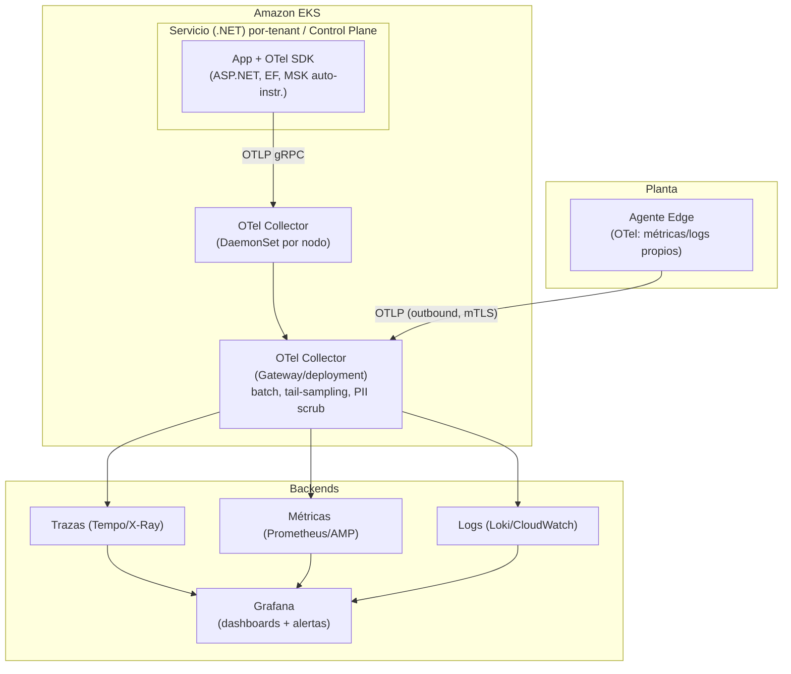
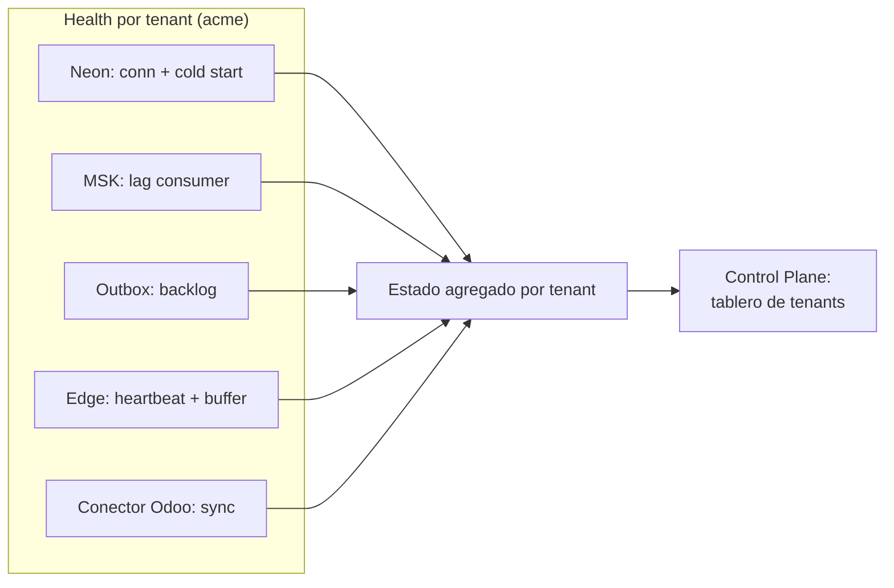
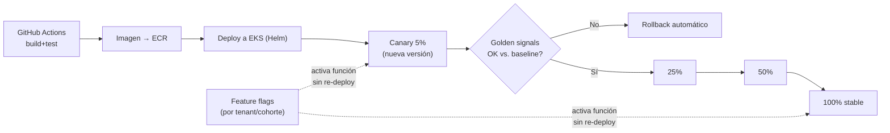
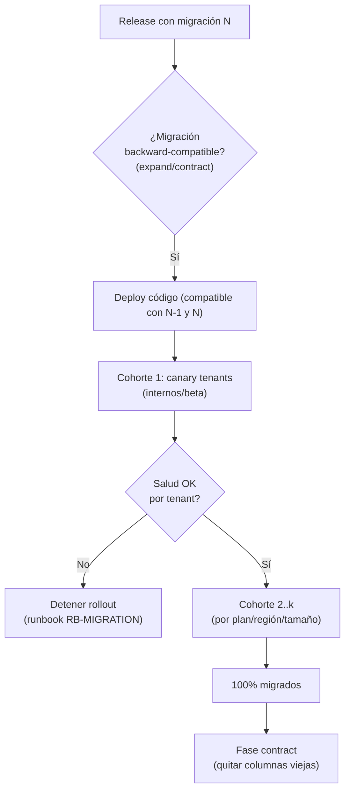
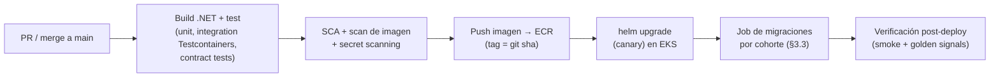

# 08 · Observabilidad y Operaciones — OTel, Despliegue, SLO/DR — Nexo (MVP)

> **Documento:** `design/08-observability-ops.md` · **Estado:** Borrador v0.1 · **Actualizado:** 2026-07-11
> **Roles:** Software Architect · Tech Lead
> **Relacionados:** [00-tech-baseline.md](./00-tech-baseline.md) · [01-multi-tenancy-connection.md](./01-multi-tenancy-connection.md) · [02-event-model.md](./02-event-model.md) · [05-edge-agent.md](./05-edge-agent.md) · [06-odoo-connector.md](./06-odoo-connector.md) · [07-security.md](./07-security.md) · [../specs/specs/architecture.md](../specs/specs/architecture.md) · [../specs/specs/scalability.md](../specs/specs/scalability.md) · [../specs/specs/control-plane.md](../specs/specs/control-plane.md) · [../specs/specs/multi-tenancy.md](../specs/specs/multi-tenancy.md)

## Resumen ejecutivo

Este documento define la **observabilidad** y la **operación** de Nexo para el MVP, respetando el
[baseline técnico](./00-tech-baseline.md): **OpenTelemetry** (trazas/métricas/logs) con correlación por
`tenant_id`/`correlation_id`, despliegue en **EKS con Helm por servicio**, releases **canary + feature flags**,
**job de migraciones por cohorte**, CI/CD **GitHub Actions → ECR → EKS**, **IaC con Terraform**, y un marco de
**SLO / on-call / runbooks / DR**.

Los objetivos:

1. **Ver el estado real por tenant y por edge**, no solo agregados: golden signals + métricas de negocio, health de
   conectividad Neon/MSK, backlog de store-and-forward, estado de conectores/sync.
2. **Observabilidad del Control Plane**: tableros de estado de tenants/servicios/conectores/edges, alertas proactivas,
   logs centralizados **segmentados por tenant** (sin mezclar clientes — refuerza el aislamiento de [07](./07-security.md)).
3. **Desplegar con seguridad a escala multi-tenant**: canary + flags, migraciones por cohorte con estado por tenant,
   IaC reproducible.
4. **Operar con SLOs claros**, on-call mínimo viable, runbooks accionables, y **DR con backup/restore por tenant** que
   aprovecha el aislamiento de proyecto Neon por tenant (mitiga *noisy neighbor*).

El alcance es **diseño**: arquitectura de telemetría, config de OTel (ilustrativa), diagramas de despliegue/release,
tablas de SLO y runbooks. La implementación vive en `deploy/` (Helm/Terraform) y `Nexo.BuildingBlocks.Observability`.

---

## 1. Arquitectura de observabilidad (OpenTelemetry)

Toda la telemetría se emite con el **SDK de OpenTelemetry** (.NET) y se exporta vía **OTLP** a un
**OpenTelemetry Collector** (DaemonSet + Gateway en EKS), que enruta a los backends (CloudWatch/Grafana, ver
[00 §3](./00-tech-baseline.md)).



### 1.1 Señales y fuentes

| Señal | Fuente / auto-instrumentación | Exportador | Backend |
|---|---|---|---|
| **Trazas** | ASP.NET Core, `HttpClient`, gRPC, **Npgsql/EF Core**, **MassTransit/Kafka**, MediatR (custom `ActivitySource`) | OTLP | Tempo / AWS X-Ray |
| **Métricas** | `Meter` de runtime + custom (golden signals + negocio) | OTLP / Prometheus | Prometheus / AMP |
| **Logs** | **Serilog estructurado** → sink OTLP (bridge) | OTLP | Loki / CloudWatch |

### 1.2 Correlación por `tenant_id` / `correlation_id`

**Requisito no negociable del baseline** ([00 §7](./00-tech-baseline.md)): **toda** traza, métrica y log lleva
`tenant_id` y `correlation_id`.

- **Propagación:** `ITenantContext` (scoped) y un `CorrelationMiddleware` inyectan `tenant_id`/`correlation_id` en el
  **`Activity.Baggage`** y en el `LogContext` de Serilog. Se propagan por HTTP/gRPC (headers W3C `traceparent` +
  `baggage`) y por **eventos MSK** (headers del envelope, ver [02-event-model.md](./02-event-model.md)).
- **Enriquecimiento:** un `Processor` de OTel y un `Enricher` de Serilog garantizan que ninguna señal salga sin
  `tenant_id`.
- **Segmentación:** los backends indexan por `tenant_id` como label/atributo ⇒ un dashboard/consulta **nunca mezcla
  datos de dos clientes** (refuerza el aislamiento de [07 §7](./07-security.md)); las consultas de Soporte se acotan por
  tenant.

```csharp
// Ilustrativo — bootstrap de OpenTelemetry en un servicio .NET
builder.Services.AddOpenTelemetry()
    .ConfigureResource(r => r.AddService("nexo.production")
        .AddAttributes(new[] { new KeyValuePair<string, object>("deployment.environment", env) }))
    .WithTracing(t => t
        .AddAspNetCoreInstrumentation()
        .AddHttpClientInstrumentation()
        .AddGrpcClientInstrumentation()
        .AddNpgsql()                                   // EF Core / Npgsql
        .AddSource("MassTransit")                      // Kafka/MSK
        .AddSource("Nexo.*")                           // ActivitySources de dominio
        .AddProcessor<TenantBaggageProcessor>()        // sella tenant_id/correlation_id
        .SetSampler(new ParentBasedSampler(new TraceIdRatioBasedSampler(0.1)))
        .AddOtlpExporter())
    .WithMetrics(m => m
        .AddAspNetCoreInstrumentation()
        .AddRuntimeInstrumentation()
        .AddMeter("Nexo.Business")                     // métricas de negocio
        .AddOtlpExporter());

// Serilog → OTLP con enriquecimiento obligatorio
Log.Logger = new LoggerConfiguration()
    .Enrich.FromLogContext()
    .Enrich.With<TenantEnricher>()                     // tenant_id + correlation_id siempre
    .WriteTo.OpenTelemetry(o => o.Endpoint = otlpEndpoint)
    .CreateLogger();
```

```yaml
# Ilustrativo — OTel Collector (gateway): batch, tail-sampling y scrub de PII
processors:
  batch: {}
  attributes/scrub:                       # nunca telemetría con secretos/PII (07 §5)
    actions:
      - key: db.statement
        action: delete
      - key: http.request.header.authorization
        action: delete
  tail_sampling:                          # conservar 100% de errores y trazas lentas
    policies:
      - name: errors
        type: status_code
        status_code: { status_codes: [ERROR] }
      - name: slow
        type: latency
        latency: { threshold_ms: 1000 }
      - name: sample-rest
        type: probabilistic
        probabilistic: { sampling_percentage: 10 }
exporters:
  otlp/tempo: {}
  prometheusremotewrite/amp: {}
  loki: {}
service:
  pipelines:
    traces:  { receivers: [otlp], processors: [attributes/scrub, tail_sampling, batch], exporters: [otlp/tempo] }
    metrics: { receivers: [otlp], processors: [batch], exporters: [prometheusremotewrite/amp] }
    logs:    { receivers: [otlp], processors: [attributes/scrub, batch], exporters: [loki] }
```

### 1.3 Golden signals + métricas de negocio

| Categoría | Métrica | Tipo | Dimensiones |
|---|---|---|---|
| **Latency** | `http.server.duration` | histogram | `service`, `route`, `tenant_id` |
| **Traffic** | `http.server.request.count` / `kafka.consumer.records` | counter | `service`, `tenant_id` |
| **Errors** | `http.server.errors` (5xx/4xx) / `consumer.faults` | counter | `service`, `tenant_id`, `error.type` |
| **Saturation** | CPU/mem, pool de conexiones, **lag de consumer MSK**, cola outbox | gauge | `service`, `tenant_id`, `topic` |
| **Negocio** | `production.records.ingested` | counter | `tenant_id`, `site`, `line` |
| **Negocio** | `edge.events.buffered` (backlog store-and-forward) | gauge | `tenant_id`, `device_id` |
| **Negocio** | `sync.jobs.pending` / `sync.jobs.failed` (Odoo) | gauge/counter | `tenant_id`, `connector` |
| **Negocio** | `ingestion.lag_seconds` (edge→nube) | gauge | `tenant_id`, `device_id` |
| **Negocio** | `oee.calc.duration` / read-model rebuild lag | histogram/gauge | `tenant_id`, `line` |

### 1.4 Health por tenant y por edge

Cada servicio expone `/health/live` y `/health/ready` ([00 §7](./00-tech-baseline.md)); las sondas cubren dependencias
críticas por tenant y el estado del edge:

| Check | Qué valida | Señal |
|---|---|---|
| `neon.connectivity` | Conexión a la **DB del tenant** (proyecto Neon) | ready/degraded |
| `neon.scale_up` | Tiempo de *cold start* del proyecto Neon (scale-to-zero) | latencia primera query |
| `msk.connectivity` | Productor/consumidor MSK vivo, **lag** aceptable | ready/lag gauge |
| `outbox.backlog` | Tamaño de la tabla outbox por tenant (pendiente de publicar) | gauge |
| `edge.connectivity` | Último *heartbeat* del gateway (edge outbound) | up/down por `device_id` |
| `edge.buffer_backlog` | **Backlog store-and-forward** (eventos sin reenviar) | gauge por `device_id` |
| `connector.sync_status` | Estado del conector Odoo, jobs pendientes/fallidos | ok/degraded/failed |



---

## 2. Observabilidad del Control Plane

El **Control Plane** ([control-plane.md](../specs/specs/control-plane.md)) concentra la vista del proveedor: **gobernar la
plataforma sin ver el dato del cliente** (solo estado/metadatos; el dato operativo requiere break-glass, [07 §7](./07-security.md)).

### 2.1 Tableros de estado

| Tablero | Contenido | Fuente |
|---|---|---|
| **Tenants** | Estado (activo/suspendido/degradado), plan, uso vs. quota, salud agregada | Métricas + Tenancy |
| **Servicios** | Golden signals por microservicio y por versión (canary vs. stable) | Métricas OTel |
| **Conectores** | Estado de sync Odoo por tenant, jobs fallidos, antigüedad de último sync | `Nexo.Connectors` |
| **Edges** | Gateways por tenant: online/offline, backlog, versión de firmware | Health edge |
| **Migraciones** | Estado del rollout por cohorte y por tenant (aplicada/pendiente/error) | Job de migraciones (§3.3) |

### 2.2 Alertas proactivas

| Alerta | Condición (ejemplo) | Severidad | Runbook |
|---|---|---|---|
| Edge caído | `edge.connectivity` down > 10 min | P2 | RB-EDGE-DOWN |
| Backlog store-and-forward alto | `edge.buffer_backlog` > umbral por N min | P2 | RB-EDGE-BACKLOG |
| Lag de ingestión | `ingestion.lag_seconds` p95 > SLO | P2 | RB-INGEST-LAG |
| Sync Odoo fallando | `sync.jobs.failed` creciente / 0 sync en X h | P3 | RB-SYNC-FAIL |
| Neon degradado | errores de conexión / cold start alto | P1/P2 | RB-NEON |
| Consumer lag MSK | lag > umbral sostenido | P2 | RB-MSK-LAG |
| Error budget quemado | burn-rate SLO > 2x | P2 | RB-SLO-BURN |
| Cuota de tenant excedida | uso > límite de licencia | P3 | RB-QUOTA |

- **Multi-window burn-rate** para SLOs (§4): alerta rápida (1h) + lenta (6h) para evitar ruido.
- **Enrutamiento:** por severidad y por si es **global** (Control Plane) o **de un tenant**; las alertas de tenant llevan
  `tenant_id` para no confundir clientes.

### 2.3 Logs centralizados segmentados

- Logs estructurados en un backend central (Loki/CloudWatch) **etiquetados por `tenant_id`**.
- **Segmentación de acceso:** Soporte consulta acotado por tenant; **sin** PII/secretos en logs (scrub en Collector,
  §1.2). Correlación por `correlation_id` para seguir una acción punta a punta.
- Alineado con la **auditoría** ([07 §8](./07-security.md)): observabilidad (operativa, retención corta) vs. auditoría
  (inmutable, legal) son planos distintos pero correlacionables.

---

## 3. Despliegue

### 3.1 EKS + Helm por servicio

- **Un Helm chart por microservicio** (`deploy/charts/nexo-*`), con `values` por entorno (dev/staging/prod, ver
  [00 §8](./00-tech-baseline.md)). Chart base compartido (probes, HPA, `ServiceAccount` con **IRSA**, OTel sidecar/env,
  `PodDisruptionBudget`, `NetworkPolicy`).
- **Aislamiento y seguridad:** `NetworkPolicy` por plano (edge↔nube, servicios, Control Plane) refuerza [07 §7](./07-security.md);
  IRSA acota secretos por servicio/tenant.
- **Autoscaling:** HPA por CPU/latencia/lag de consumer; consumers MSK escalan por lag.

### 3.2 Estrategia de releases: canary + feature flags



- **Canary progresivo** (5→25→50→100%) con **análisis automático** de golden signals contra baseline; **rollback** si se
  degradan errores/latencia.
- **Feature flags por tenant/cohorte** ([00 §5](./00-tech-baseline.md), [multi-tenancy.md](../specs/specs/multi-tenancy.md)):
  desacoplan *deploy* de *release*; permiten activar función por cohorte y son la palanca del **rollout de migraciones**
  (§3.3).
- **Separación deploy/release:** el binario puede estar desplegado y la función apagada por flag hasta validar.

### 3.3 Job de migraciones por cohorte

El reto multi-tenant: **N proyectos Neon** que migrar sin downtime. Diseño de [00 §5](./00-tech-baseline.md) y
[01](./01-multi-tenancy-connection.md): migraciones **EF Core versionadas**, aplicadas **por cohortes** como **Job de
Kubernetes**, con **estado por tenant**.



- **Patrón expand/contract** (backward-compatible): primero se agrega lo nuevo (código tolera esquema viejo y nuevo),
  se migra por cohortes, y al final se elimina lo viejo ⇒ **zero-downtime**.
- **Cohortes** por plan/región/tamaño; **canary de tenants** internos/beta primero.
- **Estado por tenant** (aplicada/pendiente/error) visible en el tablero de migraciones (§2.1); **reintento idempotente**
  y **detención** ante fallo, sin bloquear tenants ya migrados.
- **Neon branching** ([00 §8](./00-tech-baseline.md)): ensayo de la migración en un branch efímero del tenant antes de
  aplicarla en prod.

### 3.4 CI/CD (GitHub Actions → ECR → EKS)



- **Pipeline:** build → test (xUnit + **Testcontainers** Postgres/Kafka + contract tests de eventos, [00 §7](./00-tech-baseline.md))
  → **escaneo de seguridad** (SCA, imagen, secret scanning — refuerza [07](./07-security.md)) → push a **ECR** (tag por
  `git sha`) → `helm upgrade` a **EKS** → job de migraciones → verificación post-deploy.
- **Autenticación GitHub→AWS** vía **OIDC** (sin llaves estáticas). Promoción entre entornos por **flujo GitOps**
  (dev→staging→prod) con aprobación.

### 3.5 IaC (Terraform)

- **Todo el `deploy/` como código** ([00 §2](./00-tech-baseline.md)): VPC, EKS, MSK, ECR, S3, Secrets Manager, IAM/IRSA,
  ALB/WAF, OTel/observabilidad, y **la automatización de provisioning de proyectos Neon por tenant** (vía API de Neon,
  ver [01](./01-multi-tenancy-connection.md)).
- **Estado remoto** (S3 + lock DynamoDB), módulos reutilizables, `plan` en PR y `apply` con aprobación.
- **Separación por entorno** (workspaces/carpetas) y por plano (infra compartida vs. recursos por tenant).

---

## 4. SLO y operación

### 4.1 SLOs por servicio (MVP, indicativos)

| Servicio / flujo | SLI | SLO objetivo | Ventana |
|---|---|---|---|
| API Gateway / lectura dashboards | Disponibilidad (no-5xx) | **99.5%** | 30 días |
| API Gateway / lectura dashboards | Latencia p95 | < 500 ms | 30 días |
| Ingestion (edge→persistido) | Latencia p95 edge→consultable | < 60 s | 30 días |
| Ingestion | Éxito de ingesta (sin pérdida) | 99.9% (con store-and-forward) | 30 días |
| Identity (login/token) | Disponibilidad | **99.9%** | 30 días |
| Sync Odoo | Frescura (antigüedad último sync OK) | < 15 min p95 | 30 días |
| Consumers de eventos | Lag de consumer | < umbral sostenido | 30 días |

- **Error budget** por SLO con **burn-rate multi-ventana** (§2.2); consumir el budget frena releases no críticos.
- **SLO por tenant** cuando aplique (planes enterprise); el aislamiento por proyecto Neon facilita medir por tenant.

### 4.2 On-call mínimo (MVP)

- **Rotación única** (equipo chico) con escalado por severidad (P1 inmediato, P2 en horario extendido, P3 día hábil).
- **Alertas accionables** ligadas a **runbook** y a un **dashboard** de contexto; se evita alertar sin acción (anti-fatiga).
- **Postmortem sin culpa** para P1/P2; acciones correctivas rastreadas.

### 4.3 Runbooks (catálogo inicial)

| ID | Escenario | Primeros pasos |
|---|---|---|
| RB-NEON | DB de tenant degradada / cold start alto | Verificar estado del proyecto Neon, PrivateLink, pool; failover/read-replica si aplica |
| RB-MSK-LAG | Lag de consumer alto | Escalar consumers (HPA), revisar poison message / DLQ, reproceso desde offset |
| RB-EDGE-DOWN | Gateway sin heartbeat | Confirmar conectividad de planta; el store-and-forward protege el dato; contactar sitio |
| RB-EDGE-BACKLOG | Backlog store-and-forward alto | Verificar reenvío/dedup, capacidad de ingesta; drenar buffer |
| RB-SYNC-FAIL | Sync Odoo fallando | Revisar credenciales (rotación, [07 §5](./07-security.md)), ACL/mapeo, reintentos, DLQ del conector |
| RB-MIGRATION | Migración por cohorte falla en un tenant | Detener rollout, revisar estado por tenant, reintento idempotente o rollback de cohorte |
| RB-SLO-BURN | Error budget quemándose | Identificar servicio/tenant, congelar releases, mitigar causa raíz |
| RB-BREACH | Sospecha de incidente de seguridad | Revocar sesiones/tokens/device ([07 §3/§6](./07-security.md)), rotar secretos, preservar auditoría |

### 4.4 Noisy-neighbor

El **proyecto Neon por tenant** aísla cómputo y datos ⇒ un tenant pesado **no** degrada a otro en la capa de datos
(mitiga T8 de [07 §9](./07-security.md) y [scalability.md](../specs/specs/scalability.md)). Complementos:

- **Particiones/topics MSK por tenant** (key = `tenant_id`) + **backpressure** en consumers.
- **Quotas de licencia** (Administration & Licensing) limitan volumen por tenant.
- **HPA** por servicio y **límites de recursos** por pod evitan que un tenant acapare cómputo compartido.

### 4.5 Backups y DR

| Aspecto | Diseño |
|---|---|
| **Backup por tenant** | Backup/PITR del **proyecto Neon** de cada tenant + backups del Control Plane; cifrados (KMS, [07 §5.3](./07-security.md)) |
| **Storage** | Versionado/replicación de S3 por prefijo de tenant |
| **Restore granular** | Recuperación **por tenant** sin afectar a otros (ventaja de DB-per-tenant); ensayo en **branch Neon** |
| **RPO/RTO** | Objetivos por plan (definir en DS-OPS-03); MVP: RPO ≤ minutos (PITR Neon), RTO por runbook |
| **DR de región** | MVP single-region; multi-región/residencia por tenant en V1 ([multi-tenancy.md](../specs/specs/multi-tenancy.md)) |
| **Prueba de restore** | Ensayo periódico de restore por tenant (evita "backup que no restaura") |

---

## 5. Decisiones pendientes

| # | Pregunta | Contexto | Default provisional |
|---|---|---|---|
| DS-OPS-01 | **Backend de observabilidad** (Grafana OSS/Tempo/Loki/Prometheus vs. CloudWatch/X-Ray vs. Grafana Cloud) | [00 §3](./00-tech-baseline.md) deja "CloudWatch/Grafana" abierto | OTel Collector + stack Grafana; CloudWatch como respaldo |
| DS-OPS-02 | **Herramienta de canary / progressive delivery** (Argo Rollouts vs. Flagger vs. manual) | §3.2 | Argo Rollouts (análisis por métricas) — evaluar |
| DS-OPS-03 | **RPO/RTO formales por plan** y estrategia de DR multi-región | §4.5, residencia de datos | RPO ≤ min (PITR Neon); DR región en V1 |
| DS-OPS-04 | **Store de series de tiempo** para métricas de alto volumen de negocio | Relacionado con **DT-01** de [00 §10](./00-tech-baseline.md) (Neon sin TimescaleDB) | Postgres particionado (MVP); Timestream/ClickHouse en V1 |
| DS-OPS-05 | **Gestión de feature flags** (servicio propio vs. OpenFeature + proveedor) | §3.2, flags por tenant/cohorte | OpenFeature; proveedor a definir |
| DS-OPS-06 | **GitOps** (Argo CD / Flux) vs. deploy imperativo desde Actions | §3.4 | GitOps con Argo CD — evaluar en V1 |
| DS-OPS-07 | **Retención de logs/trazas** por entorno y por plan | §2.3, costo vs. cumplimiento | Trazas 7–14 d, logs 30 d (MVP); auditoría aparte (inmutable) |
| DS-OPS-08 | **Muestreo de trazas a escala** (tail-sampling tuning) | ADR-T9 de [00 §9](./00-tech-baseline.md) | 10% + 100% de errores/lentas; tunear con volumen |

---

## 6. Relación con otros documentos

- **[00-tech-baseline.md](./00-tech-baseline.md):** OTel, EKS, MSK, Neon, Secrets Manager, CI/CD, entornos, ADRs.
- **[01-multi-tenancy-connection.md](./01-multi-tenancy-connection.md):** provisioning Neon, migraciones por cohorte,
  Connection Registry.
- **[02-event-model.md](./02-event-model.md):** envelope, headers de correlación, particiones, reproceso.
- **[05-edge-agent.md](./05-edge-agent.md):** store-and-forward, heartbeat, OTA (backlog/health del edge).
- **[06-odoo-connector.md](./06-odoo-connector.md):** sync jobs, reintentos, DLQ (estado de conectores).
- **[07-security.md](./07-security.md):** auditoría vs. observabilidad, scrub de PII, revocación, aislamiento.
- **[../specs/specs/architecture.md](../specs/specs/architecture.md)** · **[../specs/specs/scalability.md](../specs/specs/scalability.md)** · **[../specs/specs/control-plane.md](../specs/specs/control-plane.md)** · **[../specs/specs/multi-tenancy.md](../specs/specs/multi-tenancy.md).**
