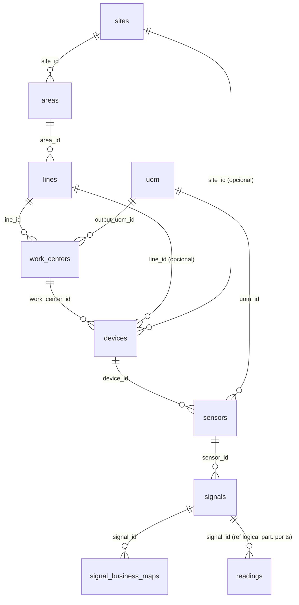
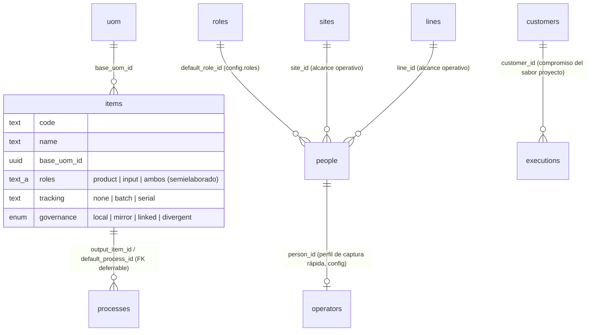
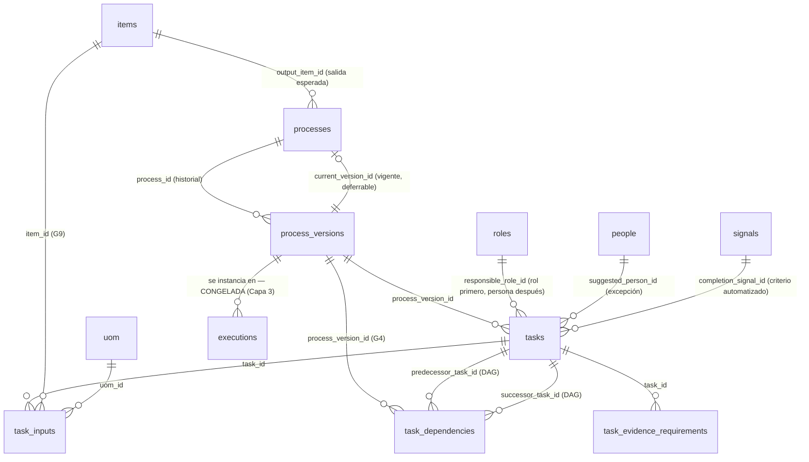
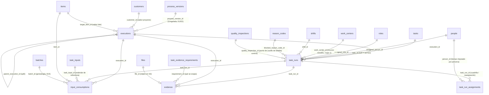
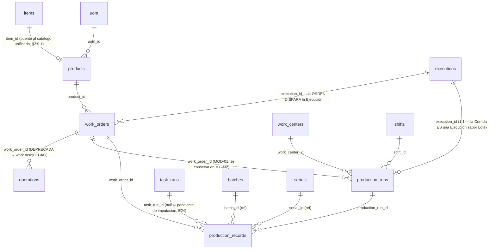
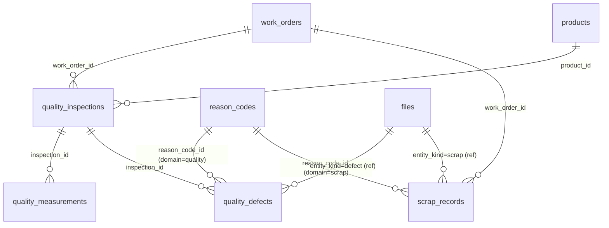
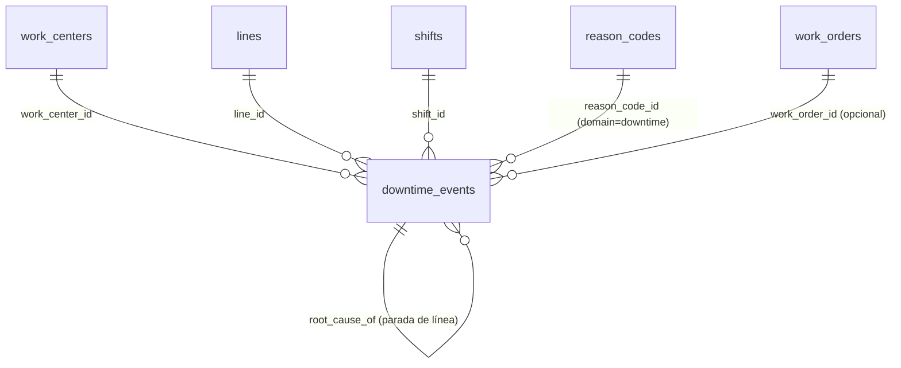
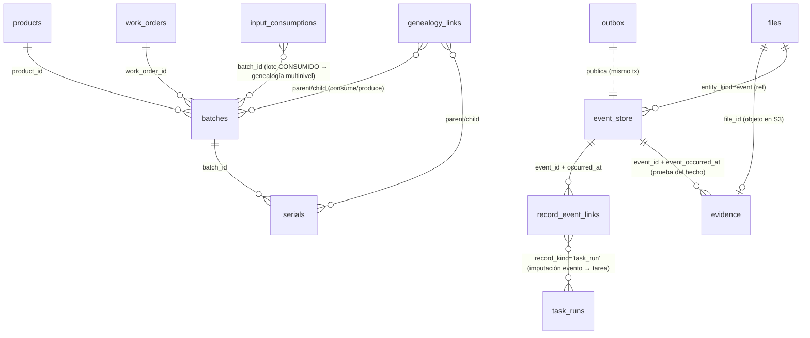
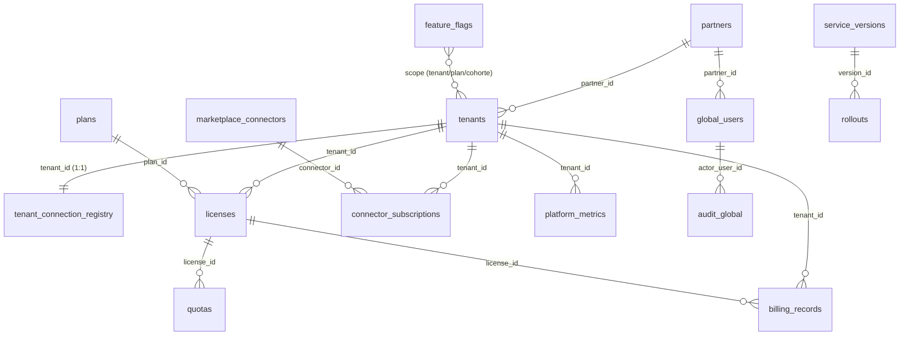

# 03 · Esquema de Datos — Nexo (MVP)

> **Documento:** `design/03-data-schema.md` · **Estado:** Borrador v0.2 · **Actualizado:** 2026-07-13
> **Roles:** Software Architect · Tech Lead
> **Relacionados:** [00-tech-baseline.md](./00-tech-baseline.md) · [01-multi-tenancy-connection.md](./01-multi-tenancy-connection.md) · [02-event-model.md](./02-event-model.md) · [04-service-contracts.md](./04-service-contracts.md) · [07-security.md](./07-security.md) · [08-observability-ops.md](./08-observability-ops.md)
> **Base funcional:** [../specs/specs/data-model.md](../specs/specs/data-model.md) · [../specs/specs/control-plane.md](../specs/specs/control-plane.md) · [../specs/specs/multi-tenancy.md](../specs/specs/multi-tenancy.md) · [Tablero de decisiones](../specs/open-questions-board.md)
> **Base funcional del modelo por capas (v0.2):** [../specs/specs/digital-twin.md](../specs/specs/digital-twin.md) (Capa 1) · [../specs/specs/work-model.md](../specs/specs/work-model.md) (Capa 2) · [../specs/specs/execution.md](../specs/specs/execution.md) (Capa 3) · [../specs/specs/event-engine.md](../specs/specs/event-engine.md) (Capa 4) · [../specs/specs/master-data.md](../specs/specs/master-data.md)

## Resumen ejecutivo

Este documento es el **esquema lógico (DDL de diseño)** de Nexo: la traducción física a **PostgreSQL (Neon)** del
modelo de datos conceptual definido en [`data-model.md`](../specs/specs/data-model.md). **No** redefine los conceptos de
negocio (eso ya existe); define **tipos, claves, integridad referencial, índices, particionado por tiempo, columnas de
auditoría y soft-delete** con los que se materializan esas entidades canónicas.

Respeta el baseline técnico ([00](./00-tech-baseline.md)): **PostgreSQL/Neon con un proyecto Neon por tenant + una DB
Global (Control Plane)**, persistencia con **EF Core + Npgsql**, y el principio **no negociable** de aislamiento por
tenant ([multi-tenancy.md](../specs/specs/multi-tenancy.md)). En consecuencia se describen **dos esquemas físicos
distintos**:

1. **DB del Tenant** (una por cliente): todo el dato operativo — jerarquía física, dispositivos, órdenes, corridas,
   registros, calidad, scrap, paradas, trazabilidad (event store append-only + lecturas time-series), integración,
   outbox/inbox, archivos y auditoría del tenant.
2. **DB Global (Control Plane)** (única, del proveedor): metadatos del ecosistema — tenants, planes, licencias, quotas,
   feature flags, usuarios globales, partners, **Tenant Connection Registry**, marketplace, versiones/rollouts,
   facturación, métricas y auditoría global.

**Decisiones de diseño transversales asumidas (ver §1):** claves primarias **UUIDv7** (`uuid`, ordenables por tiempo),
timestamps **`timestamptz` en UTC**, **snake_case**, columnas de auditoría (`created_at/by`, `updated_at/by`),
**soft-delete** por `deleted_at/by`, organización por **schema-por-bounded-context** dentro de la DB del tenant,
`jsonb` para payloads canónicos y **particionado nativo por RANGE de tiempo** para `readings` y `event_store` (nota
**DT-01**: en el MVP no hay TimescaleDB en Neon, se usa particionado Postgres).

Refinamientos propuestos que este documento materializa y que **dependen de decisiones abiertas del tablero**:

- **`production_runs` (Corrida)** como entidad de primer nivel — depende de **MOD-01** (recomendación (a): formalizarla).
- **`reason_codes` con `domains` transversal** `{quality, scrap, downtime}` — alineado con **MOD-03** (rec. (a)).
- **`event_store` append-only + `batches`/`serials` desde el MVP** — alineado con **MOD-04** (rec. (a), base sin backfill).
- **Jerarquía física en un schema `config`** propio del tenant — alineado con **MOD-09** (rec. (a)).

### Actualización v0.2 — el modelo funcional pasa a ser por capas

El modelo funcional se reorganizó en **cuatro capas** ([`layered-architecture.md`](../specs/specs/layered-architecture.md)) y este
esquema lógico se actualiza en consecuencia. La tesis funcional —**un proyecto único y una producción repetitiva se modelan
igual; cambia el disparador, no el modelo** ([`work-model.md`](../specs/specs/work-model.md) §2)— se materializa acá con
**una sola familia de tablas** y **dos atributos discriminadores** (`work.processes.profile` y `execution.executions.flavor`).

| Capa funcional | Pregunta que responde | Schemas físicos que la materializan |
|---|---|---|
| 1 · Gemelo digital | ¿Qué existe y qué está midiendo? | `config` (jerarquía, turnos, acceso) · `devices` (dispositivos, señales, lecturas) |
| **2 · Modelo de trabajo (plantilla)** | ¿Cómo se hace el trabajo? | **`work`** (nuevo: procesos versionados, tareas, DAG, insumos por tarea) |
| **3 · Ejecución (Lote \| Proyecto)** | ¿Qué se está haciendo ahora? | **`execution`** (nuevo: ejecuciones, tareas instanciadas, consumo real, evidencia) · `production` (disparador) · `quality`, `scrap`, `downtime` |
| 4 · Motor de eventos | ¿Qué pasó realmente? | `trace` (event store append-only, genealogía) · read models (fuera de este documento) |
| — · Master data propia | ¿Contra qué catálogos se opera sin ERP? | **`master`** (nuevo: `uom`, `items`, `people`, `customers`) |

**Decisiones cerradas (2026-07-13) que fija esta versión:**

1. **El MVP soporta los dos perfiles**: repetitivo (Ejecución sabor **Lote**) y proyecto (Ejecución sabor **Proyecto**).
   Cierra las preguntas abiertas #2 de `work-model.md` y #5 de `execution.md`.
2. **DAG completo** de tareas desde el MVP: precedencias tipadas con *lag*, ramas paralelas y **validación de ciclos en
   la base** (§2.6.3). Cierra la pregunta abierta #1 de `work-model.md`.
3. **Master data mínima y SIN costo**: `uom`, `items`, `people`, `customers`. **Centros de costo, tarifas y costos con
   vigencia quedan diferidos a V1** (§2.5.5). El **pedido/compromiso no es catálogo**: son **atributos de la Ejecución**
   de sabor proyecto (entregable + fecha objetivo + cliente).
4. **`production.work_orders` deja de ser el concepto raíz**: pasa a ser **un disparador** de una Ejecución (§2.9).
   `production.production_runs` se relee como **Ejecución sabor Lote**; la estrategia de convivencia y migración —sin
   romper lo ya implementado ni lo ya escrito— está en §2.9.1.

> **Nota de implementación EF Core.** El DDL aquí es el **objetivo**. Las migraciones EF Core lo generan, pero las
> características que EF no modela nativamente (particionado, BRIN, índices parciales, columnas generadas, triggers,
> tipos `enum` nativos, funciones) se emiten con `migrationBuilder.Sql(...)`. Ver [01](./01-multi-tenancy-connection.md)
> para el ciclo de migraciones por cohortes.

---

## 1. Convenciones transversales

> Se presentan **primero** porque todo el DDL de §2 y §3 las asume. Corresponden al punto 3 del alcance.

### 1.1 Claves primarias — UUIDv7

| Decisión | Detalle |
|---|---|
| **Tipo** | `uuid` (16 bytes) en toda PK y FK. |
| **Generación** | **UUIDv7** (RFC 9562): 48 bits de timestamp Unix ms + aleatorio. **Ordenable por tiempo** → buena localidad de índice B-tree y menor fragmentación que UUIDv4. |
| **Dónde se genera** | En la **aplicación** (.NET, value generator del `DbContext`) para no depender de la versión de Postgres. En Neon (PG 15–17) no existe `uuidv7()` nativo (llega en PG 18); se provee además la función SQL `nexo.uuid_generate_v7()` como *fallback* para seeds/scripts. |
| **Nombre** | La PK se llama siempre `id`. |

```sql
-- Fallback SQL para UUIDv7 (seeds/DDL); en runtime lo genera EF Core.
create or replace function nexo.uuid_generate_v7()
returns uuid
language plpgsql
parallel safe
as $$
declare
    unix_ts_ms bytea;
    uuid_bytes bytea;
begin
    unix_ts_ms := int8send((extract(epoch from clock_timestamp()) * 1000)::bigint);
    -- 6 bytes de timestamp + 10 bytes aleatorios; se fijan version (7) y variant (RFC 4122)
    uuid_bytes := substring(unix_ts_ms from 3 for 6) || gen_random_bytes(10);
    uuid_bytes := set_byte(uuid_bytes, 6, (b'0111' || get_byte(uuid_bytes, 6)::bit(4))::bit(8)::int);
    uuid_bytes := set_byte(uuid_bytes, 8, (b'10'   || get_byte(uuid_bytes, 8)::bit(6))::bit(8)::int);
    return encode(uuid_bytes, 'hex')::uuid;
end
$$;
```

### 1.2 Timestamps y husos horarios

- **Todo** timestamp es `timestamptz` y se persiste en **UTC**. La zona local (planta/tenant) es un dato de
  presentación (`sites.timezone`), nunca de almacenamiento.
- Se distingue **tiempo de ocurrencia** (`occurred_at`, sellado en el edge, cercano a la fuente) de **tiempo de ingesta**
  (`ingested_at`/`created_at`, en la nube). La diferencia es un dato trazable (ver [traceability.md](../specs/specs/traceability.md) §3.2).
- Default de columnas de sistema: `now()` (equivale a `current_timestamp`, en UTC dado que las instancias corren en UTC).

### 1.3 Columnas de auditoría (patrón estándar)

Toda tabla de **master data y transaccional** incluye el bloque de auditoría. Los IDs de usuario son **referencias
lógicas** a la identidad global (ver §1.9); **no** llevan FK cross-DB.

```sql
-- Bloque de auditoría estándar (se repite en cada tabla; se omite en las hojas time-series/append-only)
    created_at   timestamptz  not null default now(),
    created_by   uuid         null,               -- ref. lógica a global.global_users / operator
    updated_at   timestamptz  not null default now(),
    updated_by   uuid         null,
    row_version  xid          not null default (xmin)::text::xid,  -- token de concurrencia optimista (EF Core)
```

- **Concurrencia optimista:** se usa la **columna de sistema `xmin`** mapeada en EF Core como token de concurrencia
  (`IsRowVersion()` sobre `xmin`), evitando una columna extra. Alternativa documentada: `concurrency_token uuid` regenerado
  en cada `UPDATE`.
- **`updated_at`:** lo setea la aplicación en `SaveChanges`. Como guardarraíl de defensa, se puede instalar un trigger
  `set_updated_at()` (opcional; ver §1.10).

### 1.4 Soft-delete

- Borrado lógico con `deleted_at timestamptz null` + `deleted_by uuid null`. `deleted_at IS NULL` ⇒ fila vigente.
- **Filtro global** por defecto en EF Core (`HasQueryFilter(e => e.DeletedAt == null)`).
- **Unicidad** de claves de negocio con **índice parcial** que solo aplica a filas vigentes:
  `create unique index ux_... on t (code) where deleted_at is null;`
- **Nunca** se hace soft-delete sobre tablas **append-only** (`event_store`, `readings`, `audit_log`, `outbox`,
  `processed_events`): su historia es inmutable por diseño.

### 1.5 Naming

| Objeto | Convención | Ejemplo |
|---|---|---|
| Schema | snake_case por bounded context | `production`, `devices`, `trace` |
| Tabla | snake_case, **plural** | `work_orders`, `scrap_records` |
| Columna | snake_case, **singular** | `planned_qty`, `occurred_at` |
| PK | `id` | `id uuid` |
| FK | `<entidad_singular>_id` | `work_order_id`, `reason_code_id` |
| Índice | `ix_<tabla>_<cols>` | `ix_downtime_events_asset_id` |
| Único | `ux_<tabla>_<cols>` | `ux_products_sku` |
| FK constraint | `fk_<tabla>_<tabla_ref>` | `fk_lines_areas` |
| Check | `ck_<tabla>_<regla>` | `ck_downtime_events_duration` |
| Partición | `<tabla>_p<periodo>` | `readings_p2026_07` |
| Enum nativo | `<dominio>_enum` | `event_source_enum` |

### 1.6 Dominios de valores (enums)

Se combinan dos estrategias según la naturaleza del dominio:

| Estrategia | Cuándo | Ejemplo |
|---|---|---|
| **`enum` nativo Postgres** | Dominio **canónico, cerrado y muy estable** de la plataforma | `event_source_enum`, `event_type_enum`, `data_quality_enum` |
| **`text` + `CHECK`** | Estados de ciclo de vida y clasificaciones que evolucionan por servicio (fácil de versionar sin `ALTER TYPE`) | `work_orders.status`, `downtime_events.status` |
| **Tabla catálogo** | Dominio **extensible por el tenant** (seed + alta por Admin) | `reason_codes`, `uom` |

EF Core mapea los `enum`/status con `HasConversion<string>()` (persistidos como texto legible).

```sql
create type nexo.event_source_enum   as enum ('device','manual','api','file');
create type nexo.event_type_enum     as enum ('production','scrap','quality','downtime','reading','machine_event','custom');
create type nexo.data_quality_enum   as enum ('good','uncertain','substituted','interpolated','bad');
create type nexo.sync_status_enum     as enum ('pending','in_progress','completed','failed','retrying','not_applicable');

-- Modelo por capas (v0.2). Dominios CANÓNICOS y cerrados: son la tesis del modelo, no estados de ciclo de vida.
create type nexo.process_profile_enum   as enum ('repetitive','project');  -- perfil del Proceso (Capa 2)
create type nexo.execution_flavor_enum  as enum ('batch','project');       -- sabor de la Ejecución (Capa 3)
```

> **Por qué `perfil` y `sabor` sí son `enum` nativos.** Son dominios de **dos valores** que sostienen la tesis funcional
> completa y que **no evolucionan** sin un cambio de producto (a diferencia de `status`, que cambia por servicio). Un
> `enum` nativo hace imposible persistir un tercer valor por error y documenta la cardinalidad en el propio tipo. El
> `flavor` **deriva del `profile`** de la versión congelada y se valida en la aplicación (E3), no por FK.

### 1.7 Tipos numéricos y monetarios

- **Cantidades productivas** (piezas, kg, l): `numeric(18,4)` (evita error de flotante en acumulados/conversión UoM).
- **Costos/importes:** `numeric(18,4)` + columna `currency char(3)` (ISO 4217) cuando aplique.
- **Lecturas analógicas crudas:** `double precision` (`value_num`) — precisión física, alto volumen; la conversión a
  unidad de negocio la aplica el mapeo tag→señal (ver **MOD-05**).
- **Contadores/secuencias lógicas:** `bigint`.

### 1.8 Payloads y datos semiestructurados

- `jsonb` para: `event_store.payload`, `event_store.origin_metadata`, `outbox.payload`, mapeos de conector, snapshots de
  auditoría (`before`/`after`). Índices **GIN** solo donde hay consulta por contenido; el resto sin índice para no encarecer
  la escritura.

### 1.9 Referencias cross-boundary (sin FK física)

- La **identidad** de usuario/operario vive en el **Control Plane** (Duende/Identity, ver [TEN-07] y §3). En la DB del
  tenant, `operators.user_id`, `*.created_by`, `*.operator_id` son `uuid` **sin FK** (bases físicamente separadas). La
  integridad se valida en la capa de aplicación.
- Igual criterio para `readings.signal_id` y `event_store` (ver §1.11): en tablas de altísimo volumen **no** se declara
  FK, para no penalizar el `INSERT`; la coherencia se garantiza en Ingestion.

### 1.10 Trigger opcional de `updated_at` (guardarraíl)

```sql
create or replace function nexo.set_updated_at() returns trigger language plpgsql as $$
begin new.updated_at := now(); return new; end $$;
-- Se aplica por tabla: create trigger tg_set_updated_at before update on <tabla>
--   for each row execute function nexo.set_updated_at();
```

### 1.11 Estrategia de índices y de particionado por tiempo

**Índices (regla general):**

- **B-tree** en toda FK (Postgres no los crea solo) y en columnas de filtro frecuente (`status`, `occurred_at`, códigos).
- **Índices parciales** `where deleted_at is null` para unicidad de negocio y para las consultas del *hot path*.
- **Índices compuestos** siguiendo el patrón de consulta dominante (p. ej. `(asset_id, occurred_at desc)` para timelines).
- **GIN** en `jsonb` solo cuando se consulta por payload.
- **BRIN** en las tablas append-only/time-series ordenadas por tiempo (`readings`, `event_store`): índice diminuto y
  eficiente para *range scans* temporales sobre datos naturalmente ordenados por `occurred_at` (UUIDv7 + inserción cronológica).

**Particionado por tiempo (DT-01):** `readings` y `event_store` se declaran `PARTITION BY RANGE` sobre la marca temporal,
con **particiones mensuales** (revisable a semanal/diario por volumen del tenant).

| Aspecto | Decisión de diseño |
|---|---|
| Clave de partición | `occurred_at` (`timestamptz`) |
| Granularidad MVP | **Mensual** por tenant; ajustable por telemetría real |
| Creación de particiones | Automatizada: `pg_partman` **o** job propio de `Tenant Provisioning` (pre-crea N meses por adelantado) — ver Decisiones pendientes |
| PK de tabla particionada | Debe **incluir la clave de partición**: `primary key (occurred_at, id)` |
| Unicidad de negocio | Igual regla: `unique (occurred_at, dedup_key)` (dedup dentro de ventana; cross-partición ver §2.13) |
| Índice temporal | **BRIN** sobre `occurred_at`; B-tree solo en columnas de acceso puntual |
| Retención / archivado | `DETACH PARTITION` de meses fríos → offload a **S3 (Parquet) + Athena** en V1 (DT-01); política por plan (ver [scalability.md](../specs/specs/scalability.md)) |
| Aislamiento | El particionado es **intra-tenant**; el aislamiento entre tenants ya lo da la DB-per-tenant |

### 1.12 Organización en schemas (DB del tenant)

En lugar de un único `public`, la DB del tenant se organiza en **schemas por bounded context** (facilita migraciones por
`DbContext` y permisos por servicio). Los FK cross-schema son válidos (misma DB física).

| Schema | Contenido | Servicio dueño |
|---|---|---|
| `config` | sites, areas, lines, work_centers, shifts, reason_codes, operators, roles, role_assignments, scope_assignments | Configuración/Admin del tenant (**MOD-09**) |
| **`master`** | **uom, items, people, customers** (master data mínima del MVP, **sin costo**) | **Master Data** (§2.5) |
| **`work`** | **processes, process_versions, tasks, task_dependencies, task_inputs, task_evidence_requirements** | **Work Model — Capa 2** (§2.6) |
| **`execution`** | **executions, task_runs, task_run_assignments, input_consumptions, evidence** | **Execution — Capa 3** (§2.7–§2.8) |
| `devices` | devices, sensors, signals, signal_business_maps, readings | Devices / Ingestion |
| `production` | products, work_orders, operations, production_runs, production_records — **reencuadrado: perfil repetitivo / disparador** (§2.9) | Production |
| `quality` | quality_inspections, quality_measurements, quality_defects | Quality |
| `scrap` | scrap_records | Scrap |
| `downtime` | downtime_events | Downtime |
| `trace` | event_store, batches, serials, genealogy_links | Traceability / Event Store |
| `integration` | connectors, sync_jobs | Connectors / Integrations |
| `rules` | rules, alerts, notifications_log | Rules Engine / Notifications |
| `platform` | outbox, processed_events, files, audit_log | Cross-cutting (BuildingBlocks) |

> **Dirección de dependencia entre schemas (regla dura del modelo por capas).** `master` no depende de nadie; `work`
> depende de `master` + `config` (Capa 1); `execution` depende de `work` + `master` + `config`; `production`, `quality`,
> `scrap` y `downtime` dependen de `execution`; `trace` no depende de ninguno (referencias lógicas, §1.9). **Ninguna FK
> apunta "hacia abajo" en sentido inverso**: `work` nunca referencia `execution`, y `master` nunca referencia `work`.
> La única excepción declarada es `master.items.default_process_id → work.processes` (proceso por defecto de un ítem),
> que se materializa como FK **`deferrable`** y opcional, para no invertir la dependencia en tiempo de creación.

---

## 2. Esquema de la DB del TENANT (MVP)

> Una DB por cliente. Todo lo que sigue vive en la **DB del tenant**. No hay columna `tenant_id` discriminadora en el
> *hot path* (el aislamiento es físico); sí se conserva `tenant_id` en el `event_store` por conveniencia de trazabilidad/
> reproceso, coherente con el envelope canónico ([02](./02-event-model.md)).

### 2.1 Jerarquía física — `config`

```sql
-- Planta (Site)
create table config.sites (
    id           uuid primary key default nexo.uuid_generate_v7(),
    code         text        not null,
    name         text        not null,
    address      text        null,
    timezone     text        not null default 'America/Argentina/Buenos_Aires',
    geo_lat      numeric(9,6) null,
    geo_lng      numeric(9,6) null,
    status       text        not null default 'active',   -- active | inactive
    created_at   timestamptz not null default now(),
    created_by   uuid null,
    updated_at   timestamptz not null default now(),
    updated_by   uuid null,
    deleted_at   timestamptz null,
    deleted_by   uuid null,
    constraint ck_sites_status check (status in ('active','inactive'))
);
create unique index ux_sites_code on config.sites (code) where deleted_at is null;

-- Sector / Área
create table config.areas (
    id           uuid primary key default nexo.uuid_generate_v7(),
    site_id      uuid        not null,
    code         text        not null,
    name         text        not null,
    status       text        not null default 'active',
    created_at   timestamptz not null default now(), created_by uuid null,
    updated_at   timestamptz not null default now(), updated_by uuid null,
    deleted_at   timestamptz null, deleted_by uuid null,
    constraint fk_areas_sites foreign key (site_id) references config.sites (id),
    constraint ck_areas_status check (status in ('active','inactive'))
);
create index ix_areas_site_id on config.areas (site_id);
create unique index ux_areas_site_code on config.areas (site_id, code) where deleted_at is null;

-- Línea (Line)
create table config.lines (
    id             uuid primary key default nexo.uuid_generate_v7(),
    area_id        uuid        not null,
    code           text        not null,
    name           text        not null,
    nominal_speed  numeric(18,4) null,       -- capacidad/velocidad nominal referencial
    speed_uom_id   uuid        null,
    status         text        not null default 'active',
    created_at     timestamptz not null default now(), created_by uuid null,
    updated_at     timestamptz not null default now(), updated_by uuid null,
    deleted_at     timestamptz null, deleted_by uuid null,
    constraint fk_lines_areas foreign key (area_id) references config.areas (id),
    constraint ck_lines_status check (status in ('active','inactive'))
);
create index ix_lines_area_id on config.lines (area_id);
create unique index ux_lines_area_code on config.lines (area_id, code) where deleted_at is null;

-- Máquina / Centro de trabajo (Work Center / Asset)
create table config.work_centers (
    id                uuid primary key default nexo.uuid_generate_v7(),
    line_id           uuid        not null,
    code              text        not null,
    name              text        not null,
    asset_type        text        null,               -- categoría de activo (para MTBF/MTTR)
    ideal_cycle_time  numeric(18,6) null,              -- tiempo de ciclo ideal (seg/pieza) — override MOD-06
    output_uom_id     uuid        null,                -- unidad de medida productiva
    asset_tag         text        null,                -- identificación física del activo
    op_state          text        not null default 'stopped', -- running | stopped | maintenance
    status            text        not null default 'active',
    created_at        timestamptz not null default now(), created_by uuid null,
    updated_at        timestamptz not null default now(), updated_by uuid null,
    deleted_at        timestamptz null, deleted_by uuid null,
    constraint fk_work_centers_lines foreign key (line_id) references config.lines (id),
    constraint fk_work_centers_uom  foreign key (output_uom_id) references config.uom (id),
    constraint ck_work_centers_opstate check (op_state in ('running','stopped','maintenance')),
    constraint ck_work_centers_status  check (status in ('active','inactive'))
);
create index ix_work_centers_line_id on config.work_centers (line_id);
create unique index ux_work_centers_code on config.work_centers (code) where deleted_at is null;
```

### 2.2 Catálogos del tenant — `config`

> **v0.2 — `uom` se reubica, no se duplica.** El catálogo de unidades pasa a su hogar canónico **`master.uom`**
> ([`master-data.md`](../specs/specs/master-data.md) §2.4). La reubicación es un `ALTER TABLE ... SET SCHEMA` que
> **conserva el OID**, de modo que **todas las FK ya declaradas en este documento** (`work_centers.output_uom_id`,
> `sensors.uom_id`, `signals.uom_id`, `products.uom_id`) **siguen siendo válidas sin reescribirse**. El DDL original se
> mantiene abajo tal cual, y §2.5.1 documenta el movimiento y los atributos que se le agregan.

```sql
-- Unidad de medida (UoM) — sincronizable con Odoo (MOD-05). Hogar canónico a partir de v0.2: master.uom (§2.5.1).
create table config.uom (
    id             uuid primary key default nexo.uuid_generate_v7(),
    code           text        not null,               -- 'unit','kg','l',...
    name           text        not null,
    category       text        null,                   -- masa, volumen, unidad...
    factor_to_base numeric(18,8) not null default 1,   -- factor de conversión versionado
    external_ref   text        null,                   -- id en Odoo
    status         text        not null default 'active',
    created_at     timestamptz not null default now(), created_by uuid null,
    updated_at     timestamptz not null default now(), updated_by uuid null,
    deleted_at     timestamptz null, deleted_by uuid null
);
create unique index ux_uom_code on config.uom (code) where deleted_at is null;

-- Motivo (Reason Code) — catálogo ÚNICO transversal con dominios aplicables (MOD-03)
create table config.reason_codes (
    id           uuid primary key default nexo.uuid_generate_v7(),
    code         text        not null,
    name         text        not null,
    domains      text[]      not null,                 -- {'quality','scrap','downtime'} (MOD-03)
    category     text        null,                     -- familia de causa (agrupador)
    parent_id    uuid        null,                     -- jerarquía de motivos
    is_planned   boolean     not null default false,   -- p. ej. parada programada
    is_imputable boolean     not null default true,    -- imputable a Disponibilidad/costo
    status       text        not null default 'active',
    created_at   timestamptz not null default now(), created_by uuid null,
    updated_at   timestamptz not null default now(), updated_by uuid null,
    deleted_at   timestamptz null, deleted_by uuid null,
    constraint fk_reason_codes_parent foreign key (parent_id) references config.reason_codes (id),
    constraint ck_reason_codes_domains check (domains <@ array['quality','scrap','downtime']::text[] and cardinality(domains) > 0)
);
create unique index ux_reason_codes_code on config.reason_codes (code) where deleted_at is null;
create index ix_reason_codes_domains on config.reason_codes using gin (domains);

-- Turno (Shift)
create table config.shifts (
    id           uuid primary key default nexo.uuid_generate_v7(),
    site_id      uuid        not null,
    line_id      uuid        null,                      -- opcional: turno por línea
    code         text        not null,
    name         text        not null,                  -- Mañana/Tarde/Noche
    start_time   time        not null,
    end_time     time        not null,                  -- puede cruzar medianoche (end < start)
    weekdays     smallint[]  not null default '{1,2,3,4,5}', -- 1=lun ... 7=dom
    status       text        not null default 'active',
    created_at   timestamptz not null default now(), created_by uuid null,
    updated_at   timestamptz not null default now(), updated_by uuid null,
    deleted_at   timestamptz null, deleted_by uuid null,
    constraint fk_shifts_sites foreign key (site_id) references config.sites (id),
    constraint fk_shifts_lines foreign key (line_id) references config.lines (id)
);
create index ix_shifts_site_id on config.shifts (site_id);
```

### 2.3 Acceso operativo (perfil + scoping) — `config`

> Frontera **TEN-07**: identidad global y credenciales viven en el Control Plane; **asignaciones de rol y scoping** por
> tenant viven aquí. `user_id` es referencia lógica (§1.9).

```sql
-- Operario (subtipo de Usuario) — perfil operativo por tenant
create table config.operators (
    id            uuid primary key default nexo.uuid_generate_v7(),
    user_id       uuid        not null,               -- ref. lógica a global.global_users (identidad)
    employee_no   text        null,                   -- legajo / id de planta
    fast_auth_kind text       null,                   -- pin | badge | nfc
    fast_auth_hash text       null,                   -- hash del PIN/credencial (nunca en claro)
    default_shift_id uuid     null,
    status        text        not null default 'active',
    created_at    timestamptz not null default now(), created_by uuid null,
    updated_at    timestamptz not null default now(), updated_by uuid null,
    deleted_at    timestamptz null, deleted_by uuid null,
    constraint fk_operators_shift foreign key (default_shift_id) references config.shifts (id)
);
create unique index ux_operators_user on config.operators (user_id) where deleted_at is null;
create unique index ux_operators_employee_no on config.operators (employee_no) where deleted_at is null and employee_no is not null;

-- Roles (asignación por tenant; el rol canónico puede venir del seed)
create table config.roles (
    id          uuid primary key default nexo.uuid_generate_v7(),
    code        text not null,                        -- operator | supervisor | quality | ...
    name        text not null,
    is_system   boolean not null default false,
    created_at  timestamptz not null default now(), created_by uuid null,
    updated_at  timestamptz not null default now(), updated_by uuid null,
    deleted_at  timestamptz null, deleted_by uuid null
);
create unique index ux_roles_code on config.roles (code) where deleted_at is null;

create table config.role_assignments (
    id          uuid primary key default nexo.uuid_generate_v7(),
    user_id     uuid not null,                        -- ref. lógica a identidad global
    role_id     uuid not null,
    created_at  timestamptz not null default now(), created_by uuid null,
    constraint fk_role_assignments_role foreign key (role_id) references config.roles (id)
);
create unique index ux_role_assignments on config.role_assignments (user_id, role_id);

-- Scoping por planta/línea (RBAC + ABAC)
create table config.scope_assignments (
    id          uuid not null default nexo.uuid_generate_v7(),
    user_id     uuid not null,
    scope_kind  text not null,                        -- site | line
    scope_id    uuid not null,                        -- site_id o line_id
    created_at  timestamptz not null default now(), created_by uuid null,
    constraint pk_scope_assignments primary key (id),
    constraint ck_scope_kind check (scope_kind in ('site','line'))
);
create unique index ux_scope_assignments on config.scope_assignments (user_id, scope_kind, scope_id);
```

### 2.4 Dispositivos, sensores y señales — `devices`

```sql
create table devices.devices (
    id                uuid primary key default nexo.uuid_generate_v7(),
    code              text not null,
    name              text not null,
    device_type       text not null,                  -- plc | sensor | gateway | mcu | sbc | camera | datalogger | scale | other
    vendor_model      text null,
    protocol          text null,                       -- s7 | opcua | modbus | mqtt | http | file
    firmware_version  text null,
    connectivity_mode text not null default 'edge',    -- edge | direct
    -- ubicación jerárquica (un dispositivo cuelga de asset/line/site)
    work_center_id    uuid null,
    line_id           uuid null,
    site_id           uuid null,
    edge_agent_id     uuid null,                        -- agente edge que lo lee
    criticality       text not null default 'medium',   -- low | medium | high
    lifecycle_state   text not null default 'registered', -- registered|provisioned|linked|testing|active|degraded|maintenance|retired
    health_state      text not null default 'unknown',   -- online|offline|degraded|unknown|maintenance
    last_seen_at      timestamptz null,
    created_at   timestamptz not null default now(), created_by uuid null,
    updated_at   timestamptz not null default now(), updated_by uuid null,
    deleted_at   timestamptz null, deleted_by uuid null,
    constraint fk_devices_work_center foreign key (work_center_id) references config.work_centers (id),
    constraint fk_devices_line        foreign key (line_id) references config.lines (id),
    constraint fk_devices_site        foreign key (site_id) references config.sites (id),
    constraint ck_devices_criticality check (criticality in ('low','medium','high'))
);
create unique index ux_devices_code on devices.devices (code) where deleted_at is null;
create index ix_devices_work_center on devices.devices (work_center_id);
create index ix_devices_health on devices.devices (health_state);

create table devices.sensors (
    id            uuid primary key default nexo.uuid_generate_v7(),
    device_id     uuid not null,
    code          text not null,
    name          text not null,
    measure_type  text null,                            -- temperatura, peso, conteo...
    uom_id        uuid null,
    channel       text null,
    valid_min     double precision null,
    valid_max     double precision null,
    status        text not null default 'active',
    created_at   timestamptz not null default now(), created_by uuid null,
    updated_at   timestamptz not null default now(), updated_by uuid null,
    deleted_at   timestamptz null, deleted_by uuid null,
    constraint fk_sensors_device foreign key (device_id) references devices.devices (id),
    constraint fk_sensors_uom    foreign key (uom_id) references config.uom (id)
);
create index ix_sensors_device_id on devices.sensors (device_id);

-- Señal / Tag técnica
create table devices.signals (
    id                uuid primary key default nexo.uuid_generate_v7(),
    sensor_id         uuid not null,
    device_id         uuid not null,                    -- denormalizado para resolver contexto rápido
    tag_name          text not null,
    protocol_address  text null,                        -- 'DB10.DBW4', 'ns=2;i=1007', '40001', 'planta/l3/contador'
    logical_type      text not null,                    -- numeric | boolean | state | counter | text
    uom_id            uuid null,
    sample_mode       text null,                        -- poll | on_change | on_event
    sample_rate_ms    integer null,
    thresholds        jsonb null,                       -- umbrales de referencia
    status            text not null default 'active',
    created_at   timestamptz not null default now(), created_by uuid null,
    updated_at   timestamptz not null default now(), updated_by uuid null,
    deleted_at   timestamptz null, deleted_by uuid null,
    constraint fk_signals_sensor foreign key (sensor_id) references devices.sensors (id),
    constraint fk_signals_device foreign key (device_id) references devices.devices (id),
    constraint fk_signals_uom    foreign key (uom_id) references config.uom (id)
);
create index ix_signals_sensor_id on devices.signals (sensor_id);
create index ix_signals_device_id on devices.signals (device_id);

-- Mapeo tag técnico → señal de negocio (versionado; determina el tipo de Evento)
create table devices.signal_business_maps (
    id                uuid primary key default nexo.uuid_generate_v7(),
    signal_id         uuid not null,
    business_name     text not null,                    -- "Piezas OK — L3"
    semantics         text null,                        -- contador acumulativo, estado, medida...
    business_uom_id   uuid null,
    transform         jsonb null,                       -- escala/offset, decodificación de bits, debounce
    emits_event_type  nexo.event_type_enum null,        -- qué tipo de Evento produce
    dedup_key_recipe  text null,                        -- cómo compone el dedup_key
    version           integer not null default 1,       -- MOD-12: se preserva la interpretación vigente
    effective_from    timestamptz not null default now(),
    effective_to      timestamptz null,
    created_at   timestamptz not null default now(), created_by uuid null,
    updated_at   timestamptz not null default now(), updated_by uuid null
);
create index ix_signal_maps_signal on devices.signal_business_maps (signal_id);
```

### 2.5 Master data mínima del MVP — `master`

> Materializa el **mínimo viable de catálogos** de [`master-data.md`](../specs/specs/master-data.md) §7.3. Es la
> contrapartida obligatoria de *"el ERP es opcional"*: sin catálogos propios, la promesa de operar en modo **standalone**
> es falsa. **Recorte cerrado (2026-07-13): sin costos, sin tarifas y sin centros de costo** → §2.5.5.

Toda tabla de `master` lleva una columna de **gobierno**, que es lo que hace posible el *modo híbrido por entidad*
(`master-data.md` §3.2 y §4.3): la unidad de gobierno no es el tenant, es el catálogo.

```sql
create type nexo.master_governance_enum as enum ('local','mirror','linked','divergent');
-- local     : existe solo en Nexo (modo standalone) → edición total
-- mirror    : importado del ERP, sin atributos propios cargados → solo campos no gobernados
-- linked    : vive en ambos, con external_ref establecida → solo campos no gobernados + extensiones
-- divergent : diferencia no resuelta en un campo gobernado → bloqueado, va a la bandeja de conflictos (R3)
```

#### 2.5.1 Unidades de medida — reubicación de `config.uom`, sin duplicar

```sql
-- REUBICACIÓN, no duplicación: ALTER ... SET SCHEMA conserva el OID de la tabla, por lo que TODAS las FK
-- ya declaradas contra config.uom (work_centers, sensors, signals, products) siguen válidas sin reescritura.
alter table config.uom set schema master;

-- Compatibilidad de lectura para consultas/EF mappings ya escritos contra config.uom. Se retira en V1 (DS-15).
create view config.uom as select * from master.uom;

-- Atributos que exige master-data.md §2.4 y que el catálogo original no declaraba.
alter table master.uom add column magnitude  text     null;                      -- mass|length|area|volume|time|count|energy
alter table master.uom add column is_base    boolean  not null default false;    -- unidad base de su magnitud
alter table master.uom add column decimals   smallint not null default 4;        -- precisión de agregación (reproducibilidad)
alter table master.uom add column governance nexo.master_governance_enum not null default 'local';
alter table master.uom add constraint ck_uom_magnitude
    check (magnitude is null or magnitude in ('mass','length','area','volume','time','count','energy'));
create unique index ux_uom_base_per_magnitude on master.uom (magnitude)
    where is_base and deleted_at is null;                                        -- una sola base por magnitud
```

> **Regla dura (`master-data.md` §2.4).** **No se convierte entre magnitudes**: `factor_to_base` solo aplica **dentro** de
> la misma `magnitude`. Pasar de kg a unidades exige el peso unitario del **ítem**, no una conversión de unidad. Y un
> `factor_to_base` que ya valorizó historia **no se edita**: se versiona con vigencia (**DS-11**).

#### 2.5.2 Ítems — producto e insumo son **roles** del mismo ítem

```sql
create table master.items (
    id               uuid primary key default nexo.uuid_generate_v7(),
    code             text not null,                     -- SKU / código propio del tenant
    name             text not null,
    base_uom_id      uuid not null,                     -- piso absoluto: código + denominación + unidad base
    roles            text[] not null default '{input}', -- {'product'} | {'input'} | {'product','input'} (semielaborado)
    category         text null,                         -- material | component | tool | service | external_labor
    family           text null,
    tracking         text not null default 'none',      -- none | batch | serial
    ideal_cycle_time numeric(18,6) null,                -- rol producto, perfil repetitivo; override en work_center (MOD-06)
    default_process_id uuid null,                       -- proceso por defecto (work.processes); FK deferrable (§1.12)
    quality_specs    jsonb null,
    external_ref     text null,                         -- id en el ERP (modo conectado)
    governance       nexo.master_governance_enum not null default 'local',
    last_synced_at   timestamptz null,
    status           text not null default 'active',    -- active | archived (R4: nunca delete físico si hay eventos)
    created_at   timestamptz not null default now(), created_by uuid null,
    updated_at   timestamptz not null default now(), updated_by uuid null,
    deleted_at   timestamptz null, deleted_by uuid null,
    constraint fk_items_uom foreign key (base_uom_id) references master.uom (id),
    constraint ck_items_roles    check (roles <@ array['product','input']::text[] and cardinality(roles) > 0),
    constraint ck_items_tracking check (tracking in ('none','batch','serial')),
    constraint ck_items_status   check (status in ('active','archived'))
);
create unique index ux_items_code on master.items (code) where deleted_at is null;
create unique index ux_items_external_ref on master.items (external_ref) where deleted_at is null and external_ref is not null;
create index ix_items_roles on master.items using gin (roles);
```

> **Por qué un solo catálogo y no dos.** `master-data.md` §2.3 lo fija: *producto e insumo son **roles**, no tipos
> excluyentes*. El producto terminado de una Ejecución es el insumo de la siguiente; modelarlos como catálogos separados
> y sin puente **rompe la genealogía multinivel** de [`traceability.md`](../specs/specs/traceability.md). Se reutiliza el
> patrón `text[] + CHECK + GIN` ya adoptado para `config.reason_codes.domains` (**MOD-03**), por coherencia de estilo.
> La convivencia con `production.products` (que ya existe y ya está implementado) está en **§2.9.1**.

#### 2.5.3 Personas

```sql
create table master.people (
    id              uuid primary key default nexo.uuid_generate_v7(),
    code            text not null,                     -- legajo / identificación de planta
    full_name       text not null,
    default_role_id uuid null,                         -- rol operativo preferido (config.roles)
    site_id         uuid null,                         -- alcance operativo por defecto
    line_id         uuid null,
    user_id         uuid null,                         -- ref. LÓGICA a identidad global (§1.9); puede NO tener usuario
    calendar        jsonb null,                        -- disponibilidad / calendario propio (relevante en sabor proyecto)
    external_ref    text null,                         -- legajo en RRHH/ERP
    governance      nexo.master_governance_enum not null default 'local',
    status          text not null default 'active',
    created_at   timestamptz not null default now(), created_by uuid null,
    updated_at   timestamptz not null default now(), updated_by uuid null,
    deleted_at   timestamptz null, deleted_by uuid null,
    constraint fk_people_role foreign key (default_role_id) references config.roles (id),
    constraint fk_people_site foreign key (site_id) references config.sites (id),
    constraint fk_people_line foreign key (line_id) references config.lines (id),
    constraint ck_people_status check (status in ('active','archived'))
);
create unique index ux_people_code on master.people (code) where deleted_at is null;
create unique index ux_people_user on master.people (user_id) where deleted_at is null and user_id is not null;

-- Puente con el perfil de captura rápida ya existente (§2.3): un operario ES una persona.
alter table config.operators add column person_id uuid null;
alter table config.operators add constraint fk_operators_person foreign key (person_id) references master.people (id);
create unique index ux_operators_person on config.operators (person_id) where deleted_at is null and person_id is not null;
```

> **Deslinde en tres.** **Identidad y credenciales** → Control Plane (**TEN-07**, §3). **Perfil de captura rápida**
> (PIN/badge/NFC) → `config.operators` (§2.3), que no se toca. **Dimensión operativa** (legajo, rol preferido, alcance,
> disponibilidad) → `master.people`, que es lo que la Capa 3 necesita para **asignar tareas**. Una persona puede existir
> **sin** usuario: un operario que ficha por badge no necesita cuenta ([`master-data.md`](../specs/specs/master-data.md) §2.6).
> **La tarifa horaria NO está acá**: es costo → V1 (§2.5.5).

#### 2.5.4 Clientes (mínimos)

```sql
create table master.customers (
    id           uuid primary key default nexo.uuid_generate_v7(),
    code         text not null,
    legal_name   text not null,
    tax_id       text null,                             -- CUIT / tax id
    contact      jsonb null,                            -- {nombre, email, teléfono}
    notes        text null,
    external_ref text null,                             -- partner del ERP/CRM (por defecto lo gobierna el ERP)
    governance   nexo.master_governance_enum not null default 'local',
    status       text not null default 'active',
    created_at   timestamptz not null default now(), created_by uuid null,
    updated_at   timestamptz not null default now(), updated_by uuid null,
    deleted_at   timestamptz null, deleted_by uuid null,
    constraint ck_customers_status check (status in ('active','archived'))
);
create unique index ux_customers_code on master.customers (code) where deleted_at is null;
create unique index ux_customers_external_ref on master.customers (external_ref) where deleted_at is null and external_ref is not null;
```

> **Deliberadamente pobre** (`master-data.md` §2.7): sin condiciones comerciales, sin precios, sin facturación.
> **Nexo no construye un CRM.** Existe por una sola razón: el sabor **Proyecto** necesita saber *para quién* es el entregable.

> **No hay tabla `orders` / `pedidos` — decisión cerrada.** El **pedido/compromiso no es catálogo**: son **atributos de la
> Ejecución** de sabor proyecto (`deliverable`, `committed_date`, `customer_id`, `contract_ref` → §2.7.1). Un pedido del
> ERP entra como **disparador** (`trigger_kind = 'contract'` + `trigger_external_ref`), no como entidad propia. Se evita
> así construir medio módulo de ventas para el MVP y queda **una sola fuente del compromiso**, que es además la que se
> mide contra el cronograma real.

#### 2.5.5 Diferido a V1 — costos, tarifas y centros de costo (explícito)

**No se modelan en el MVP.** Se dejan escritos para que el recorte sea una decisión visible y no un olvido:

| Entidad diferida | Qué habilitaría | Por qué se difiere | Impacto de la ausencia |
|---|---|---|---|
| `master.cost_centers` | Imputación contable jerárquica del costo real | Exige alineación con contabilidad del cliente y sincronización con el ERP | El KPI **costo real** de [`event-engine.md`](../specs/specs/event-engine.md) **no se muestra** (se oculta, no se muestra en cero) |
| `master.labor_rates` (tarifa horaria por persona/rol/centro, **con vigencia**) | Costo de mano de obra real | Requiere versionado por vigencia + valorización a **fecha de ocurrencia** (R7) | Sin costo de mano de obra; el **tiempo real** sí se mide y queda disponible para valorizar retroactivamente |
| `master.item_costs` (costo unitario del ítem **con vigencia**) | Costo de materiales y desvío de costo | Ídem: vigencia temporal, no edición destructiva | `scrap_records.cost_amount` sigue siendo carga manual (**MOD-08**), no derivada |
| `work.tasks.standard_cost` | Desvío costo real vs. estándar por tarea | Depende de las tres anteriores | Solo hay desvío de **tiempo** y de **consumo** (cantidad), no de dinero |

> **Regla que ya queda fijada para cuando entren (R7 de `master-data.md`).** Los atributos económicos **no se editan: se
> versionan con vigencia**, y la valorización usa la tarifa/costo vigente **a la fecha de ocurrencia del hecho**, nunca la
> actual. Cambiar una tarifa **no reescribe** el costo histórico. Diseñar esto mal en V1 es irreversible; por eso se
> difiere entero en vez de "empezar con una columna `cost` y ver".

---

### 2.6 Modelo de trabajo (Capa 2) — `work`

> Materializa [`work-model.md`](../specs/specs/work-model.md). Es **la plantilla**: reutilizable, **versionada** e
> **inmutable una vez publicada**. No conoce ejecuciones, no tiene estado operativo, no tiene cantidades reales.
> **El `profile` (`repetitive | project`) es el único atributo que distingue "hacer ventanas" de "hacer una obra".**

#### 2.6.1 Proceso y versiones

```sql
create table work.processes (
    id                 uuid primary key default nexo.uuid_generate_v7(),
    code               text not null,                          -- 'PRC-VEN-A30' — identidad estable entre versiones
    name               text not null,
    profile            nexo.process_profile_enum not null,     -- repetitive | project (§1.6)
    current_version_id uuid null,                              -- versión publicada vigente (FK deferrable, ver abajo)
    output_item_id     uuid null,                              -- salida esperada: producto (repetitive) o entregable tipificado
    output_uom_id      uuid null,                              -- 'unidades', 'kg', o '1 entregable'
    site_id            uuid null,                              -- alcance físico SUGERIDO (Capa 1), no obligatorio (CB11)
    area_id            uuid null,
    line_id            uuid null,
    evidence_policy    text not null default 'recommended',    -- default de sus tareas: mandatory|recommended|optional|none
    skip_policy        text not null default 'authorized',     -- allowed | authorized | forbidden
    tags               text[] null,                            -- clasificación libre para la biblioteca de procesos
    external_ref       text null,                              -- correlación con ruta/BOM del ERP (solo sugerencia)
    status             text not null default 'active',
    created_at   timestamptz not null default now(), created_by uuid null,
    updated_at   timestamptz not null default now(), updated_by uuid null,
    deleted_at   timestamptz null, deleted_by uuid null,
    constraint fk_processes_item foreign key (output_item_id) references master.items (id),
    constraint fk_processes_uom  foreign key (output_uom_id) references master.uom (id),
    constraint fk_processes_site foreign key (site_id) references config.sites (id),
    constraint fk_processes_area foreign key (area_id) references config.areas (id),
    constraint fk_processes_line foreign key (line_id) references config.lines (id),
    constraint ck_processes_evidence check (evidence_policy in ('mandatory','recommended','optional','none')),
    constraint ck_processes_skip     check (skip_policy in ('allowed','authorized','forbidden')),
    constraint ck_processes_status   check (status in ('active','archived'))
);
create unique index ux_processes_code on work.processes (code) where deleted_at is null;   -- W13
create index ix_processes_profile on work.processes (profile) where deleted_at is null;

create table work.process_versions (
    id                uuid primary key default nexo.uuid_generate_v7(),
    process_id        uuid not null,
    version_no        text not null,                           -- '1.0', '1.3', '2.0' (mayor.menor[.editorial], §9.4)
    version_major     smallint not null,
    version_minor     smallint not null default 0,
    version_patch     smallint not null default 0,
    state             text not null default 'draft',           -- draft|in_review|published|suspended|obsolete|discarded
    profile           nexo.process_profile_enum not null,      -- CONGELADO: cambiarlo exige versión mayor (W11)
    change_reason     text null,
    diff              jsonb null,                              -- altas/bajas/modificaciones vs. la versión anterior (§9.5)
    reviewed_by       uuid null,
    approved_by       uuid null,
    published_at      timestamptz null,
    obsoleted_at      timestamptz null,
    critical_path_sec numeric(18,2) null,                      -- DERIVADO: duración de la ruta crítica del DAG
    workload_sec      numeric(18,2) null,                      -- DERIVADO: suma de tiempos (carga de trabajo ≠ duración)
    created_at   timestamptz not null default now(), created_by uuid null,
    updated_at   timestamptz not null default now(), updated_by uuid null,
    deleted_at   timestamptz null, deleted_by uuid null,
    constraint fk_process_versions_process foreign key (process_id) references work.processes (id),
    constraint ck_process_versions_state check (state in ('draft','in_review','published','suspended','obsolete','discarded')),
    constraint ck_process_versions_published check (state <> 'published' or published_at is not null)
);
create unique index ux_process_versions_no on work.process_versions (process_id, version_no) where deleted_at is null;
-- CB15: UNA sola versión publicada por Proceso, garantizado en la base y no solo en la app.
create unique index ux_process_versions_published on work.process_versions (process_id)
    where state = 'published' and deleted_at is null;
create index ix_process_versions_state on work.process_versions (state) where deleted_at is null;

-- Ciclo entre las dos tablas: se cierra con FK deferrable para poder crear proceso + primera versión en una sola tx.
alter table work.processes add constraint fk_processes_current_version
    foreign key (current_version_id) references work.process_versions (id) deferrable initially deferred;
-- Idem para el proceso por defecto del ítem (§2.5.2): la dependencia master → work es opcional y diferida.
alter table master.items add constraint fk_items_default_process
    foreign key (default_process_id) references work.processes (id) deferrable initially deferred;
```

> **La ruta crítica es un derivado, no un dato de carga.** `critical_path_sec` y `workload_sec` se recalculan al publicar
> y **se nombran distinto en la UI** porque son magnitudes distintas: *"Duración estimada"* (ruta crítica del DAG, las
> tareas paralelas se solapan) vs. *"Carga de trabajo"* (suma de tiempos, horas-hombre). Confundirlas es la fuente número
> uno de promesas de fecha imposibles ([`work-model.md`](../specs/specs/work-model.md) §3.5).

#### 2.6.2 Tarea (definición)

```sql
create table work.tasks (
    id                  uuid primary key default nexo.uuid_generate_v7(),
    process_version_id  uuid not null,
    code                text not null,                         -- 'T5' — único dentro de la versión
    name                text not null,
    instructions        text null,                             -- texto operativo (adjuntos vía platform.files)
    display_seq         integer not null default 0,            -- orden de PRESENTACIÓN; la precedencia real es el DAG
    -- Tiempos (Capa 2 declara estimado y estándar; el REAL es Capa 3/4 y no vive acá)
    est_duration_sec        numeric(18,2) null,                -- estimada (valor probable)
    est_duration_min_sec    numeric(18,2) null,                -- optimista (rango opcional)
    est_duration_max_sec    numeric(18,2) null,                -- pesimista
    std_duration_sec        numeric(18,2) null,                -- ESTÁNDAR: base de eficiencia, peso de avance y takt
    -- Descomposición canónica del tiempo estándar (work-model.md §3.5)
    std_setup_sec       numeric(18,2) not null default 0,      -- preparación / alistamiento
    std_exec_sec        numeric(18,2) not null default 0,      -- ejecución efectiva
    std_wait_sec        numeric(18,2) not null default 0,      -- espera técnica (curado/secado) — NO es tiempo muerto (CB14)
    std_control_sec     numeric(18,2) not null default 0,      -- control de calidad
    std_closing_sec     numeric(18,2) not null default 0,      -- cierre / limpieza / registro
    -- Peso de avance
    progress_weight     numeric(9,6) null,                     -- explícito; si es null se deriva de std_duration_sec (G6)
    -- Responsable: ROL primero, persona después (work-model.md §7)
    responsible_role_id uuid not null,                         -- W3: toda tarea obligatoria tiene rol
    suggested_person_id uuid null,                             -- excepción justificada (persona nominada)
    required_qualification text null,                          -- p. ej. 'soldador_calificado' (se valida en Capa 3, E8)
    -- Recurso requerido (Capa 1): se referencia la CAPACIDAD / tipo de activo, nunca un activo concreto
    required_capability text null,                             -- 'estampar', 'soldar_mig', 'inspeccion_dimensional'
    required_asset_type text null,                             -- coherente con config.work_centers.asset_type (G10/W9)
    -- Criterio de terminación (work-model.md §5.1)
    completion_kind     text not null default 'declarative',   -- declarative|quantity|measurement|signal|evidence|quality|approval|composite
    completion_spec     jsonb null,                            -- parámetros: cantidad objetivo, rango, expresión Y/O
    completion_signal_id uuid null,                            -- señal del gemelo que automatiza el cierre (W14)
    -- Política y clasificación
    evidence_policy     text null,                             -- override del proceso; null = hereda (precedencia: tarea > proceso > tenant)
    obligation          text not null default 'mandatory',     -- mandatory | optional | conditional
    condition_expr      jsonb null,                            -- solo si obligation='conditional' (parámetro de la ejecución)
    is_parallelizable   boolean not null default false,        -- admite N personas/recursos simultáneos (CB4)
    is_repeatable       boolean not null default false,        -- se instancia N veces en la misma ejecución (CB10)
    is_milestone        boolean not null default false,        -- HITO: atributo de la tarea, no entidad propia (§4.5)
    -- Punto de control de calidad (opcional por tarea, obligatorio en su cumplimiento si existe)
    quality_plan_ref    text null,                             -- referencia al plan de control vigente (quality.md §3)
    quality_gate_moment text null,                             -- entry | in_process | exit
    quality_gate_blocking boolean not null default true,
    hazards             text null,                             -- seguridad / EPP / precauciones
    created_at   timestamptz not null default now(), created_by uuid null,
    updated_at   timestamptz not null default now(), updated_by uuid null,
    deleted_at   timestamptz null, deleted_by uuid null,
    constraint fk_tasks_version foreign key (process_version_id) references work.process_versions (id) on delete cascade,
    constraint fk_tasks_role    foreign key (responsible_role_id) references config.roles (id),
    constraint fk_tasks_person  foreign key (suggested_person_id) references master.people (id),
    constraint fk_tasks_signal  foreign key (completion_signal_id) references devices.signals (id),
    constraint ck_tasks_completion check (completion_kind in
        ('declarative','quantity','measurement','signal','evidence','quality','approval','composite')),
    constraint ck_tasks_obligation check (obligation in ('mandatory','optional','conditional')),
    constraint ck_tasks_evidence  check (evidence_policy is null or evidence_policy in ('mandatory','recommended','optional','none')),
    constraint ck_tasks_gate      check (quality_gate_moment is null or quality_gate_moment in ('entry','in_process','exit')),
    constraint ck_tasks_std_time  check (std_duration_sec is null or std_duration_sec > 0),                    -- W7
    constraint ck_tasks_weight    check (progress_weight is null or (progress_weight >= 0 and progress_weight <= 100)),
    constraint ck_tasks_condition check (obligation <> 'conditional' or condition_expr is not null)
);
create unique index ux_tasks_code on work.tasks (process_version_id, code) where deleted_at is null;
create index ix_tasks_version on work.tasks (process_version_id);
create index ix_tasks_role on work.tasks (responsible_role_id);
create index ix_tasks_milestone on work.tasks (process_version_id) where is_milestone;
```

> **El hito no es una entidad.** Es `is_milestone` sobre la tarea ([`work-model.md`](../specs/specs/work-model.md) §4.5).
> La Capa 3 le agrega la **fecha comprometida** en la tarea instanciada (`execution.task_runs.milestone_committed_date`),
> porque el compromiso es de la ejecución concreta, no de la plantilla. Queda como decisión abierta si el seguimiento
> comercial exige una entidad Hito propia (**DS-19**).

#### 2.6.3 Precedencias: el DAG y la prohibición de ciclos

```sql
create table work.task_dependencies (
    id                  uuid primary key default nexo.uuid_generate_v7(),
    process_version_id  uuid not null,                         -- denormalizado: hace verificable G4 con una FK compuesta
    predecessor_task_id uuid not null,
    successor_task_id   uuid not null,
    dep_type            text not null default 'FS',            -- FS (MVP) | SS (V1) | FF (V1)
    lag_sec             integer not null default 0,            -- demora obligatoria; MVP: >= 0 (curado, fragüe)
    condition_expr      jsonb null,                            -- arista condicional (V1)
    created_at   timestamptz not null default now(), created_by uuid null,
    updated_at   timestamptz not null default now(), updated_by uuid null,
    deleted_at   timestamptz null, deleted_by uuid null,
    constraint fk_task_dep_version foreign key (process_version_id) references work.process_versions (id) on delete cascade,
    -- G4: ambas puntas DEBEN pertenecer a la MISMA versión. Se garantiza con FK compuesta contra una unique de tasks.
    constraint fk_task_dep_pred foreign key (predecessor_task_id, process_version_id)
        references work.tasks (id, process_version_id),
    constraint fk_task_dep_succ foreign key (successor_task_id, process_version_id)
        references work.tasks (id, process_version_id),
    constraint ck_task_dep_type check (dep_type in ('FS','SS','FF')),
    constraint ck_task_dep_lag  check (lag_sec >= 0),                                  -- G5; lag negativo → V1
    constraint ck_task_dep_self check (predecessor_task_id <> successor_task_id)       -- ciclo trivial de longitud 1
);
-- Requisito de las FK compuestas de arriba (se crea ANTES que work.task_dependencies en la migración real).
-- `id` ya es PK: esta unique es redundante en datos, pero es la que Postgres exige para referenciar el par.
create unique index ux_tasks_id_version on work.tasks (id, process_version_id);
create unique index ux_task_dep_edge on work.task_dependencies (predecessor_task_id, successor_task_id)
    where deleted_at is null;                                                          -- arista única (sin multigrafo)
create index ix_task_dep_pred on work.task_dependencies (predecessor_task_id);
create index ix_task_dep_succ on work.task_dependencies (successor_task_id);
create index ix_task_dep_version on work.task_dependencies (process_version_id);
```

**Estrategia anti-ciclos: tres barreras, no una.** Un DAG no se puede declarar acíclico con un `CHECK` (la aciclicidad es
una propiedad del grafo entero, no de la fila). Se defiende en capas:

| Barrera | Alcance | Momento | Mecanismo |
|---|---|---|---|
| **B1 — Arista trivial** | `A → A` | Siempre | `ck_task_dep_self` (CHECK de fila) |
| **B2 — Ciclo de cualquier longitud** | `A → B → C → A` | Al insertar/actualizar una arista | **Constraint trigger `deferrable initially deferred`** con CTE recursiva (abajo). Diferido para permitir reordenar el DAG entero dentro de **una** transacción sin falsos positivos |
| **B3 — Validación integral G1–G10** | Grafo completo de la versión | Al **publicar** | `work.validate_process_version(uuid)`: aciclicidad, alcanzabilidad, nodo inicial/terminal, pesos, referencias |

```sql
-- B2: la arista nueva cierra un ciclo si la PREDECESORA ya es alcanzable DESDE la SUCESORA.
create or replace function work.assert_task_dag_acyclic() returns trigger
language plpgsql as $$
begin
    if exists (
        with recursive reachable (task_id, depth) as (
            select new.successor_task_id, 0
            union
            select d.successor_task_id, r.depth + 1
              from work.task_dependencies d
              join reachable r on d.predecessor_task_id = r.task_id
             where d.deleted_at is null
               and r.depth < 500          -- guardarraíl de terminación (RNF: ~200 tareas por proceso)
        )
        select 1 from reachable where task_id = new.predecessor_task_id
    ) then
        raise exception 'G1: la precedencia %  ->  % cierra un ciclo en el DAG de la versión %',
            new.predecessor_task_id, new.successor_task_id, new.process_version_id
            using errcode = '23514', hint = 'La UI del editor debe señalar el ciclo, no solo rechazar el guardado';
    end if;
    return null;
end $$;

create constraint trigger tg_task_dependencies_acyclic
    after insert or update on work.task_dependencies
    deferrable initially deferred
    for each row execute function work.assert_task_dag_acyclic();

-- B3: validación integral al publicar. Devuelve el conjunto de violaciones; publicar exige conjunto vacío.
-- create function work.validate_process_version(p_version_id uuid)
--   returns table (rule text, severity text, detail text) ...
```

| # (`work-model.md` §4.3) | Validación | Dónde se garantiza |
|---|---|---|
| **G1** | El grafo es **acíclico** | **B2 (trigger)** + B3 al publicar |
| **G2** | Toda tarea es alcanzable desde un nodo inicial | B3 (bloquea publicación) |
| **G3** | Existe ≥1 nodo inicial y ≥1 terminal | B3 |
| **G4** | Las precedencias referencian tareas **de la misma versión** | **FK compuesta** `(task_id, process_version_id)` |
| **G5** | Lag coherente con la unidad de tiempo | `ck_task_dep_lag` (MVP: no negativo) |
| **G6** | Los pesos de avance normalizan a 100 % | B3 (normaliza y avisa) |
| **G7** | Tarea obligatoria con rol y criterio de terminación | `responsible_role_id not null` + `completion_kind not null` |
| **G8** | El punto de control referencia un plan vigente | B3 (bloquea o advierte según política) |
| **G9** | Los insumos referencian ítems existentes | **FK** `task_inputs.item_id → master.items` |
| **G10** | El recurso requerido existe como tipo de activo | B3 (**advertencia**, no bloqueo) |

**Inmutabilidad de lo publicado (W10).** Una versión `published` no se edita: se deriva una nueva. Se garantiza con
trigger, no solo con reglas de aplicación:

```sql
create or replace function work.assert_version_is_draft() returns trigger
language plpgsql as $$
declare v_state text; v_id uuid;
begin
    v_id := coalesce(new.process_version_id, old.process_version_id);
    select state into v_state from work.process_versions where id = v_id;
    if v_state is distinct from 'draft' then
        raise exception 'W10: la versión % está en estado "%" y no admite edición estructural', v_id, v_state
            using errcode = '23514', hint = 'Derive una nueva versión (borrador) a partir de la publicada';
    end if;
    return coalesce(new, old);
end $$;
-- Se aplica a work.tasks, work.task_dependencies, work.task_inputs y work.task_evidence_requirements.
```

#### 2.6.4 Insumos y evidencia requerida por tarea

```sql
create table work.task_inputs (
    id                 uuid primary key default nexo.uuid_generate_v7(),
    task_id            uuid not null,
    process_version_id uuid not null,                        -- denormalizado: W10 (trigger) + vista consolidada de insumos
    item_id            uuid not null,                        -- G9: FK dura al catálogo
    qty                numeric(18,4) not null,               -- cantidad ESTÁNDAR (teórica)
    uom_id             uuid not null,
    basis              text not null default 'per_unit',     -- per_unit (proporcional) | per_execution (fija)
    tolerance_pct      numeric(9,4) null,                    -- desvío aceptable antes de alertar (E14)
    input_kind         text not null default 'material',     -- material|component|tool|service|external_labor
    is_blocking        boolean not null default false,       -- su falta impide arrancar la tarea
    requires_traceability boolean not null default false,    -- exige registrar lote/serie consumido (E15)
    substitutes        jsonb null,                           -- [{item_id, factor}] sustitutos admitidos con conversión
    created_at   timestamptz not null default now(), created_by uuid null,
    updated_at   timestamptz not null default now(), updated_by uuid null,
    deleted_at   timestamptz null, deleted_by uuid null,
    constraint fk_task_inputs_task foreign key (task_id, process_version_id)
        references work.tasks (id, process_version_id) on delete cascade,
    constraint fk_task_inputs_item foreign key (item_id) references master.items (id),
    constraint fk_task_inputs_uom  foreign key (uom_id) references master.uom (id),
    constraint ck_task_inputs_qty   check (qty > 0),
    constraint ck_task_inputs_basis check (basis in ('per_unit','per_execution')),
    constraint ck_task_inputs_kind  check (input_kind in ('material','component','tool','service','external_labor'))
);
create unique index ux_task_inputs on work.task_inputs (task_id, item_id) where deleted_at is null;
create index ix_task_inputs_item on work.task_inputs (item_id);
create index ix_task_inputs_version on work.task_inputs (process_version_id);

create table work.task_evidence_requirements (
    id            uuid primary key default nexo.uuid_generate_v7(),
    task_id       uuid not null,
    process_version_id uuid not null,
    evidence_kind text not null,                             -- photo|file|sensor_reading|signature|video|form
    obligation    text not null default 'mandatory',         -- mandatory | recommended | optional
    min_count     smallint not null default 1,
    description   text null,                                 -- qué se espera ver ("foto del sellado")
    form_schema   jsonb null,                                -- si es 'form': esquema del formulario de captura (Capa 1)
    created_at   timestamptz not null default now(), created_by uuid null,
    updated_at   timestamptz not null default now(), updated_by uuid null,
    deleted_at   timestamptz null, deleted_by uuid null,
    constraint fk_task_evreq_task foreign key (task_id, process_version_id)
        references work.tasks (id, process_version_id) on delete cascade,
    constraint ck_task_evreq_kind check (evidence_kind in ('photo','file','sensor_reading','signature','video','form')),
    constraint ck_task_evreq_obl  check (obligation in ('mandatory','recommended','optional'))
);
create index ix_task_evreq_task on work.task_evidence_requirements (task_id);
```

> **El insumo se declara en la TAREA, no en el Proceso.** La "lista de materiales" a nivel Proceso es una **vista
> derivada** (`select item_id, sum(...) from work.task_inputs join work.tasks ... group by`). Esa granularidad temporal
> —*qué consume cada tarea y cuándo*— es exactamente lo que un BOM de ERP no tiene y lo que permite detectar faltantes
> **antes** de que frenen la línea ([`work-model.md`](../specs/specs/work-model.md) §6).

---

### 2.7 Ejecución (Capa 3) — `execution`

> Materializa [`execution.md`](../specs/specs/execution.md). Es la **instancia viva** de una versión de Proceso: congela
> la versión, instancia las tareas, resuelve recursos y personas, abre el reloj y produce los hechos que consume la
> Capa 4. **Un solo motor y un solo esqueleto de tablas para los dos sabores**: todo lo que difiere entre Lote y Proyecto
> es *configuración, política de cálculo o presentación*, nunca estructura.

#### 2.7.1 Ejecución

```sql
create table execution.executions (
    id                  uuid primary key default nexo.uuid_generate_v7(),
    code                text not null,                        -- 'L-2026-0417' | 'PRY-2026-012'
    -- Plantilla CONGELADA (E1/E2): la ejecución queda atada para siempre a la versión con la que arrancó
    process_id          uuid not null,
    process_version_id  uuid not null,
    flavor              nexo.execution_flavor_enum not null,  -- batch | project — DERIVA del profile (E3)
    status              text not null default 'draft',
    -- Disparador (§4 de execution.md): lo único que estructuralmente distingue un lote de un proyecto al nacer
    trigger_kind        text not null default 'manual',       -- work_order|plan|stock|rule|contract|quote|maintenance|manual
    trigger_ref_kind    text null,                            -- 'work_order' | 'contract' | ...
    trigger_ref_id      uuid null,                            -- ref. polimórfica (sin FK: el disparador puede ser externo)
    trigger_external_ref text null,                           -- MO / pedido del ERP, si hay conector
    -- Objetivo — sabor LOTE
    target_item_id      uuid null,
    target_qty          numeric(18,4) null,
    target_uom_id       uuid null,
    good_qty            numeric(18,4) not null default 0,     -- proyección de los registros de cantidad
    reject_qty          numeric(18,4) not null default 0,
    -- COMPROMISO — sabor PROYECTO (el "pedido" vive acá, no como catálogo; §2.5.4)
    deliverable         text null,                            -- descripción del entregable único
    deliverable_item_id uuid null,                            -- opcional: si el entregable está tipificado como ítem
    customer_id         uuid null,                            -- para quién se trabaja
    committed_date      timestamptz null,                     -- FECHA OBJETIVO comprometida con el cliente
    contract_ref        text null,                            -- contrato / presupuesto aprobado / OC del cliente
    acceptance_at       timestamptz null,                     -- acta de recepción / conformidad
    -- Alcance físico (Capa 1); cada tarea puede resolver el suyo (CB12)
    site_id             uuid null, area_id uuid null, line_id uuid null, work_center_id uuid null,
    -- Tiempos: baseline (para medir desvío) vs. plan vigente vs. real
    baseline_start_at   timestamptz null,                     -- programación ORIGINAL; nunca se pisa (§8.2 R1)
    baseline_end_at     timestamptz null,
    planned_start_at    timestamptz null,                     -- plan vigente tras reprogramaciones
    planned_end_at      timestamptz null,
    actual_start_at     timestamptz null,                     -- DERIVADO de eventos
    actual_end_at       timestamptz null,
    reschedule_count    integer not null default 0,
    -- Gestión y avance
    owner_person_id     uuid null,                            -- responsable general (supervisor / jefe de proyecto)
    priority            integer not null default 0,
    progress_pct        numeric(5,2) not null default 0,      -- read model materializado (§11)
    progress_method     text not null default 'weighted_standard_time',
    parent_execution_id uuid null,                            -- split: vínculo padre/hija (§9.3, CB20)
    is_reopened         boolean not null default false,
    close_kind          text null,                            -- normal|partial|forced|cancelled|expired
    close_reason        text null,
    external_ref        text null,
    sync_status         nexo.sync_status_enum not null default 'pending',
    created_at   timestamptz not null default now(), created_by uuid null,
    updated_at   timestamptz not null default now(), updated_by uuid null,
    deleted_at   timestamptz null, deleted_by uuid null,
    constraint fk_exec_process  foreign key (process_id) references work.processes (id),
    constraint fk_exec_version  foreign key (process_version_id) references work.process_versions (id),
    constraint fk_exec_item     foreign key (target_item_id) references master.items (id),
    constraint fk_exec_deliv    foreign key (deliverable_item_id) references master.items (id),
    constraint fk_exec_uom      foreign key (target_uom_id) references master.uom (id),
    constraint fk_exec_customer foreign key (customer_id) references master.customers (id),
    constraint fk_exec_owner    foreign key (owner_person_id) references master.people (id),
    constraint fk_exec_site     foreign key (site_id) references config.sites (id),
    constraint fk_exec_line     foreign key (line_id) references config.lines (id),
    constraint fk_exec_wc       foreign key (work_center_id) references config.work_centers (id),
    constraint fk_exec_parent   foreign key (parent_execution_id) references execution.executions (id),
    constraint ck_exec_status check (status in ('draft','scheduled','released','in_progress','paused','blocked',
        'rescheduled','completed','closed','verified','synced','archived','cancelled','reopened')),
    constraint ck_exec_trigger check (trigger_kind in ('work_order','plan','stock','rule','contract','quote','maintenance','manual')),
    constraint ck_exec_progress_method check (progress_method in
        ('weighted_standard_time','explicit_weight','quantity','milestones','hybrid')),
    constraint ck_exec_close check (close_kind is null or close_kind in ('normal','partial','forced','cancelled','expired')),
    -- E4: sabor LOTE exige producto y cantidad objetivo... a partir de "programada" (en borrador todavía se está armando)
    constraint ck_exec_batch_target check (
        status = 'draft' or flavor <> 'batch' or (target_item_id is not null and target_qty is not null and target_qty > 0)),
    -- E5: sabor PROYECTO exige entregable y fecha comprometida
    constraint ck_exec_project_commitment check (
        status = 'draft' or flavor <> 'project' or (deliverable is not null and committed_date is not null)),
    -- Coherencia semántica cruzada (W15): un proyecto no declara cantidad objetivo como salida
    constraint ck_exec_project_no_qty check (flavor <> 'project' or target_qty is null),
    constraint ck_exec_times check (actual_end_at is null or actual_start_at is null or actual_end_at >= actual_start_at)
);
create unique index ux_exec_code on execution.executions (code) where deleted_at is null;
create index ix_exec_status on execution.executions (status) where deleted_at is null;
create index ix_exec_flavor_status on execution.executions (flavor, status) where deleted_at is null;
create index ix_exec_version on execution.executions (process_version_id);
create index ix_exec_customer on execution.executions (customer_id) where customer_id is not null;
create index ix_exec_committed on execution.executions (committed_date) where flavor = 'project' and deleted_at is null;
create index ix_exec_trigger on execution.executions (trigger_ref_kind, trigger_ref_id);
create unique index ux_exec_external_ref on execution.executions (external_ref) where deleted_at is null and external_ref is not null;
```

> **Por qué `customer_id` es nullable y `committed_date` no.** El compromiso que el modelo necesita para medir desvío de
> cronograma es **la fecha**; el cliente puede no existir (un proyecto interno: una mejora de planta, un mantenimiento
> mayor). Exigir cliente convertiría a `master.customers` en obligatorio y contradiría su carácter opcional
> ([`master-data.md`](../specs/specs/master-data.md) §2.7). La UI **sí** lo pide por defecto en el alta comercial.

> **Los tres relojes.** `baseline_*` (la promesa original, nunca se pisa), `planned_*` (el plan vigente) y `actual_*`
> (derivado de eventos). Reprogramar **nunca borra historia**: incrementa `reschedule_count` y emite
> `execution.rescheduled`; se admiten varios baselines revisados (CB9) manteniendo el original en esta fila y el
> historial en `trace.event_store`.

#### 2.7.2 Tarea instanciada (`task_runs`) y asignación

```sql
create table execution.task_runs (
    id                 uuid primary key default nexo.uuid_generate_v7(),
    execution_id       uuid not null,
    task_id            uuid null,                             -- null ⇒ tarea AD-HOC (§9.4): existe en la ejecución, no en la plantilla
    occurrence         smallint not null default 1,           -- ocurrencia N de una tarea repetible (CB10)
    is_ad_hoc          boolean not null default false,
    name               text null,                             -- obligatorio si es ad-hoc; si no, se hereda de la tarea
    status             text not null default 'pending',
    -- Asignación (rol → persona se resuelve ACÁ, no en la plantilla)
    assigned_role_id   uuid null,
    assigned_person_id uuid null,
    assignment_mode    text not null default 'individual',    -- individual|crew|role_open|automatic|external
    -- Recurso resuelto (Capa 1) y marco temporal
    work_center_id     uuid null,
    shift_id           uuid null,
    -- Tiempos: estándar heredado (congelado), estimado ajustable, real MEDIDO
    std_duration_sec   numeric(18,2) null,                    -- copia de la definición: la plantilla puede versionarse después
    est_duration_sec   numeric(18,2) null,
    baseline_start_at  timestamptz null, baseline_end_at timestamptz null,
    planned_start_at   timestamptz null, planned_end_at  timestamptz null,
    actual_start_at    timestamptz null, actual_end_at   timestamptz null,
    -- Tiempo real POR COMPONENTE (misma descomposición canónica que el estándar, work-model.md §3.5)
    actual_setup_sec   bigint not null default 0,
    actual_exec_sec    bigint not null default 0,
    actual_wait_sec    bigint not null default 0,             -- espera técnica: NO es tiempo muerto (CB18)
    actual_control_sec bigint not null default 0,
    actual_closing_sec bigint not null default 0,
    actual_total_sec   bigint generated always as
                       (actual_setup_sec + actual_exec_sec + actual_wait_sec + actual_control_sec + actual_closing_sec) stored,
    -- Avance
    progress_pct       numeric(5,2) not null default 0,
    progress_method    text null,                             -- declared|quantity|checklist|time|signal  (SIEMPRE se muestra en la UI)
    produced_qty       numeric(18,4) null,                    -- avance por cantidad (sabor lote)
    target_qty         numeric(18,4) null,
    -- Ruta crítica, hitos y calidad
    is_on_critical_path boolean not null default false,
    is_milestone        boolean not null default false,
    milestone_committed_date timestamptz null,                -- el compromiso es de la EJECUCIÓN, no de la plantilla
    milestone_reached_at     timestamptz null,
    quality_inspection_id uuid null,                          -- quality.quality_inspections (disposición del punto de control)
    -- Bloqueos, desvíos y excepciones
    blocked_reason_code_id uuid null,                         -- causa del bloqueo → insumo del KPI de cuello de botella
    blocked_at         timestamptz null,
    is_forced_close    boolean not null default false,        -- override con permiso (E19) → siempre genera excepción
    skip_reason        text null,                             -- omisión justificada (E18)
    close_reason       text null,
    notes              text null,
    created_at   timestamptz not null default now(), created_by uuid null,
    updated_at   timestamptz not null default now(), updated_by uuid null,
    deleted_at   timestamptz null, deleted_by uuid null,
    constraint fk_task_runs_exec   foreign key (execution_id) references execution.executions (id) on delete cascade,
    constraint fk_task_runs_task   foreign key (task_id) references work.tasks (id),
    constraint fk_task_runs_role   foreign key (assigned_role_id) references config.roles (id),
    constraint fk_task_runs_person foreign key (assigned_person_id) references master.people (id),
    constraint fk_task_runs_wc     foreign key (work_center_id) references config.work_centers (id),
    constraint fk_task_runs_shift  foreign key (shift_id) references config.shifts (id),
    constraint fk_task_runs_reason foreign key (blocked_reason_code_id) references config.reason_codes (id),
    constraint ck_task_runs_status check (status in ('pending','ready','assigned','in_progress','paused','blocked',
        'in_control','non_conforming','rework','completed','skipped','rejected','cancelled','reopened')),
    constraint ck_task_runs_mode   check (assignment_mode in ('individual','crew','role_open','automatic','external')),
    constraint ck_task_runs_progress check (progress_pct >= 0 and progress_pct <= 100),   -- el avance NUNCA supera 100 %
    constraint ck_task_runs_adhoc  check ((is_ad_hoc and task_id is null and name is not null)
                                       or (not is_ad_hoc and task_id is not null)),
    constraint ck_task_runs_adhoc_std check (not is_ad_hoc or std_duration_sec is null)   -- ad-hoc NO tiene estándar (§9.4)
);
create unique index ux_task_runs_instance on execution.task_runs (execution_id, task_id, occurrence)
    where deleted_at is null and task_id is not null;
create index ix_task_runs_exec on execution.task_runs (execution_id);
create index ix_task_runs_status on execution.task_runs (status) where deleted_at is null;
create index ix_task_runs_person on execution.task_runs (assigned_person_id, status) where deleted_at is null;
create index ix_task_runs_wc_time on execution.task_runs (work_center_id, actual_start_at desc);
create index ix_task_runs_milestone on execution.task_runs (execution_id, milestone_committed_date) where is_milestone;

-- Imputación de tiempo por PERSONA: la reasignación no reescribe la historia (§7.3 R3, CB19) y habilita cuadrillas (CB4).
create table execution.task_run_assignments (
    id           uuid primary key default nexo.uuid_generate_v7(),
    task_run_id  uuid not null,
    person_id    uuid not null,
    role_id      uuid null,
    is_lead      boolean not null default false,              -- referente de la cuadrilla
    assigned_at  timestamptz not null default now(),
    released_at  timestamptz null,                            -- fin de la participación (reasignación)
    imputed_sec  bigint not null default 0,                   -- tiempo atribuido a ESTA persona
    unassign_reason text null,
    created_at   timestamptz not null default now(), created_by uuid null,
    updated_at   timestamptz not null default now(), updated_by uuid null,
    constraint fk_tra_run    foreign key (task_run_id) references execution.task_runs (id) on delete cascade,
    constraint fk_tra_person foreign key (person_id) references master.people (id),
    constraint fk_tra_role   foreign key (role_id) references config.roles (id),
    constraint ck_tra_time   check (released_at is null or released_at >= assigned_at)
);
create index ix_tra_run on execution.task_run_assignments (task_run_id);
create index ix_tra_person on execution.task_run_assignments (person_id, assigned_at desc);
```

> **Regla E6/E7 (precedencias en ejecución).** Una tarea instanciada pasa a `ready` **solo si** todas sus predecesoras
> están en estado terminal admitido (`completed` u `skipped`) **y venció el `lag_sec`**. Esto **no** se modela con un
> constraint: se resuelve leyendo `work.task_dependencies` de la versión congelada. Se materializa como read model para
> que la tablet del operario no recorra el DAG en cada refresco.

> **Regla E22 — nunca edición destructiva.** Ni `task_runs` ni `input_consumptions` se corrigen editando: se registra un
> **evento de ajuste** (`is_adjustment`) y el `event_store` conserva ambos. `deleted_at` existe solo para el borrado
> lógico administrativo, no para "arreglar" un hecho.

#### 2.7.3 Consumo real de insumos

```sql
create table execution.input_consumptions (
    id              uuid primary key default nexo.uuid_generate_v7(),
    execution_id    uuid not null,
    task_run_id     uuid null,                                -- imputación fina; null solo en consumos a nivel ejecución
    task_input_id   uuid null,                                -- el ESTÁNDAR de referencia (Capa 2); null si es ad-hoc/sustituto
    item_id         uuid not null,
    qty             numeric(18,4) not null,                   -- consumo REAL
    uom_id          uuid not null,
    planned_qty     numeric(18,4) null,                       -- previsto = estándar × cantidad objetivo (al programar)
    batch_id        uuid null,                                -- lote consumido → genealogía (E15)
    serial_id       uuid null,
    method          text not null default 'declared',         -- declared|backflush|scale|scan|adjustment
    is_substitute   boolean not null default false,
    substitute_of_item_id uuid null,
    conversion_factor numeric(18,8) null,                     -- factor del sustituto admitido
    is_out_of_tolerance boolean not null default false,       -- desvío > tolerance_pct (E14) → evento de desvío
    is_adjustment   boolean not null default false,           -- corrección trazable, NUNCA edición destructiva (E22)
    person_id       uuid null,
    source          nexo.event_source_enum not null default 'manual',
    recorded_at     timestamptz not null default now(),
    created_at   timestamptz not null default now(), created_by uuid null,
    updated_at   timestamptz not null default now(), updated_by uuid null,
    deleted_at   timestamptz null, deleted_by uuid null,
    constraint fk_ic_exec   foreign key (execution_id) references execution.executions (id),
    constraint fk_ic_run    foreign key (task_run_id) references execution.task_runs (id),
    constraint fk_ic_input  foreign key (task_input_id) references work.task_inputs (id),
    constraint fk_ic_item   foreign key (item_id) references master.items (id),
    constraint fk_ic_uom    foreign key (uom_id) references master.uom (id),
    constraint fk_ic_batch  foreign key (batch_id) references trace.batches (id),
    constraint fk_ic_serial foreign key (serial_id) references trace.serials (id),
    constraint fk_ic_person foreign key (person_id) references master.people (id),
    constraint ck_ic_method check (method in ('declared','backflush','scale','scan','adjustment')),
    constraint ck_ic_qty    check (qty <> 0),                 -- negativo = devolución/ajuste; cero no informa nada
    constraint ck_ic_subst  check (not is_substitute or substitute_of_item_id is not null)
);
create index ix_ic_exec on execution.input_consumptions (execution_id);
create index ix_ic_run on execution.input_consumptions (task_run_id);
create index ix_ic_item_time on execution.input_consumptions (item_id, recorded_at desc);
create index ix_ic_batch on execution.input_consumptions (batch_id) where batch_id is not null;
```

> **El desvío no se persiste, se deriva.** `qty` (real) y `planned_qty` (previsto) están en la fila; el **desvío** es
> Capa 4 ([`event-engine.md`](../specs/specs/event-engine.md)). `is_out_of_tolerance` se materializa solo porque es el
> disparador de la alerta y del filtro operativo, no porque sea la métrica.

---

### 2.8 Evidencia como entidad de primera clase — `execution`

> **La evidencia no es un adjunto decorativo: es parte del contrato del evento**
> ([`work-model.md`](../specs/specs/work-model.md) §5.2). Por eso tiene tabla propia, hash de integridad y vínculo
> explícito a la tarea instanciada **y** al evento del `event_store`. `platform.files` sigue siendo el **metadato del
> objeto en S3**; `execution.evidence` es el **artefacto de negocio** que satisface —o no— un requisito de la Capa 2.

```sql
create table execution.evidence (
    id              uuid primary key default nexo.uuid_generate_v7(),
    -- A qué se ata (al menos uno; se valida con CHECK)
    execution_id    uuid null,
    task_run_id     uuid null,
    requirement_id  uuid null,                                -- work.task_evidence_requirements: QUÉ se exigía
    -- Vínculo al hecho (Capa 4). Se lleva occurred_at porque event_store está PARTICIONADO por tiempo (§2.13).
    event_id           uuid null,
    event_occurred_at  timestamptz null,
    -- Vínculo a los dominios que también producen evidencia
    quality_inspection_id uuid null,
    scrap_record_id       uuid null,
    downtime_event_id     uuid null,
    -- Contenido
    evidence_kind   text not null,                            -- photo|file|sensor_reading|signature|video|form
    file_id         uuid null,                                -- objeto en S3 (bucket aislado por tenant)
    form_data       jsonb null,                               -- formulario estructurado (Capa 1) — vive en la DB, no en S3
    reading_ref     jsonb null,                               -- {signal_id, from, to}: la curva vive en devices.readings
    -- Integridad y no repudio
    content_hash    bytea null,                               -- hash del contenido (mismo criterio que event_store.event_hash)
    hash_algo       text not null default 'sha256',
    -- Contexto de captura
    source          nexo.event_source_enum not null default 'manual',
    captured_at     timestamptz not null default now(),
    captured_by     uuid null,                                -- ref. lógica a identidad (§1.9)
    person_id       uuid null,
    work_center_id  uuid null,
    is_mandatory    boolean not null default false,           -- copia de la obligatoriedad efectiva al momento de capturar
    caption         text null,
    created_at   timestamptz not null default now(), created_by uuid null,
    updated_at   timestamptz not null default now(), updated_by uuid null,
    deleted_at   timestamptz null, deleted_by uuid null,
    constraint fk_ev_exec    foreign key (execution_id) references execution.executions (id),
    constraint fk_ev_run     foreign key (task_run_id) references execution.task_runs (id),
    constraint fk_ev_req     foreign key (requirement_id) references work.task_evidence_requirements (id),
    constraint fk_ev_file    foreign key (file_id) references platform.files (id),
    constraint fk_ev_person  foreign key (person_id) references master.people (id),
    constraint fk_ev_wc      foreign key (work_center_id) references config.work_centers (id),
    constraint ck_ev_kind    check (evidence_kind in ('photo','file','sensor_reading','signature','video','form')),
    constraint ck_ev_hash    check (hash_algo in ('sha256','sha512')),
    -- Toda evidencia se ata a ALGO: sin dueño no es evidencia, es un archivo suelto
    constraint ck_ev_target  check (task_run_id is not null or execution_id is not null or event_id is not null
                                    or quality_inspection_id is not null or scrap_record_id is not null
                                    or downtime_event_id is not null),
    -- Y tiene contenido de alguna de las tres formas posibles
    constraint ck_ev_payload check (file_id is not null or form_data is not null or reading_ref is not null),
    -- Coherencia de la referencia al event store particionado
    constraint ck_ev_event   check ((event_id is null) = (event_occurred_at is null))
);
create index ix_ev_run on execution.evidence (task_run_id);
create index ix_ev_exec on execution.evidence (execution_id);
create index ix_ev_req on execution.evidence (requirement_id);
create index ix_ev_event on execution.evidence (event_id) where event_id is not null;
create index ix_ev_time on execution.evidence (captured_at desc);
create unique index ux_ev_file on execution.evidence (file_id) where file_id is not null and deleted_at is null;
```

| Consulta que esta tabla debe resolver barata | Índice / camino |
|---|---|
| "¿Esta tarea puede cerrar?" (¿está la evidencia obligatoria?) | `ix_ev_run` + `left join` contra `work.task_evidence_requirements` de la tarea |
| "Índice de toda la evidencia de la ejecución" (§2.2 de `execution.md`) | `ix_ev_exec` |
| "Mostrame la prueba de este evento" (auditoría / reclamo de cliente) | `ix_ev_event` + `event_occurred_at` para ir a la partición |
| "Verificá que este archivo no se cambió" | `content_hash` + `hash_algo` |

> **E11 no se resuelve con un constraint.** "No se cierra una tarea sin la evidencia obligatoria" es una regla que cruza
> dos tablas y una política de tres niveles (tenant > proceso > tarea); vive en el servicio de Ejecución. La base
> garantiza que la evidencia **existe, está atribuida y es verificable**; la aplicación garantiza que **alcanza**.

---

### 2.9 Producto y trabajo — `production` (reencuadrado: la Orden es un **disparador**)

> **Reencuadre v0.2 ([`work-model.md`](../specs/specs/work-model.md) §10).** La **Orden de producción deja de ser el
> concepto raíz**: pasa a ser **una de las formas de disparar** la Ejecución de un Proceso de perfil repetitivo. Y la
> **Corrida (`production_runs`) se relee como Ejecución sabor Lote**. **Nada de lo escrito abajo se invalida ni se
> borra**: se reubica un nivel más abajo en la jerarquía conceptual y se le agregan **cuatro FK de reencuadre, todas
> nullable y aditivas**. La estrategia de convivencia y migración está en §2.9.1.

```sql
create table production.products (
    id              uuid primary key default nexo.uuid_generate_v7(),
    sku             text not null,
    name            text not null,
    uom_id          uuid null,
    family          text null,
    ideal_cycle_time numeric(18,6) null,               -- maestro (Odoo); override en work_center (MOD-06)
    quality_specs   jsonb null,                         -- especificaciones de referencia
    external_ref    text null,                          -- product.product de Odoo
    status          text not null default 'active',
    created_at   timestamptz not null default now(), created_by uuid null,
    updated_at   timestamptz not null default now(), updated_by uuid null,
    deleted_at   timestamptz null, deleted_by uuid null,
    constraint fk_products_uom foreign key (uom_id) references config.uom (id)
);
create unique index ux_products_sku on production.products (sku) where deleted_at is null;
create unique index ux_products_external_ref on production.products (external_ref) where deleted_at is null and external_ref is not null;

create table production.work_orders (
    id               uuid primary key default nexo.uuid_generate_v7(),
    code             text not null,                     -- número de orden
    product_id       uuid not null,
    line_id          uuid null,
    work_center_id   uuid null,
    planned_qty      numeric(18,4) not null,
    uom_id           uuid null,
    planned_date     timestamptz null,
    actual_start_at  timestamptz null,
    actual_end_at    timestamptz null,
    status           text not null default 'planned',   -- planned|released|in_progress|paused|completed|closed|synced
    priority         integer not null default 0,
    external_ref     text null,                          -- mrp.production (MO) de Odoo
    sync_status      nexo.sync_status_enum not null default 'pending',
    created_at   timestamptz not null default now(), created_by uuid null,
    updated_at   timestamptz not null default now(), updated_by uuid null,
    deleted_at   timestamptz null, deleted_by uuid null,
    constraint fk_work_orders_product foreign key (product_id) references production.products (id),
    constraint fk_work_orders_line    foreign key (line_id) references config.lines (id),
    constraint fk_work_orders_wc      foreign key (work_center_id) references config.work_centers (id),
    constraint ck_work_orders_status check (status in ('planned','released','in_progress','paused','completed','closed','synced'))
);
create unique index ux_work_orders_code on production.work_orders (code) where deleted_at is null;
create unique index ux_work_orders_external_ref on production.work_orders (external_ref) where deleted_at is null and external_ref is not null;
create index ix_work_orders_status on production.work_orders (status) where deleted_at is null;
create index ix_work_orders_product on production.work_orders (product_id);

-- Operación / Ruta (hoja de ruta) — opcional en MVP
create table production.operations (
    id             uuid primary key default nexo.uuid_generate_v7(),
    product_id     uuid null,
    work_order_id  uuid null,
    seq            integer not null,
    name           text not null,
    work_center_id uuid null,                            -- centro sugerido
    standard_time  numeric(18,6) null,
    params         jsonb null,
    created_at   timestamptz not null default now(), created_by uuid null,
    updated_at   timestamptz not null default now(), updated_by uuid null,
    deleted_at   timestamptz null, deleted_by uuid null,
    constraint fk_operations_product foreign key (product_id) references production.products (id),
    constraint fk_operations_wo      foreign key (work_order_id) references production.work_orders (id),
    constraint fk_operations_wc      foreign key (work_center_id) references config.work_centers (id)
);
create index ix_operations_wo on production.operations (work_order_id);

-- Corrida de producción (Production Run) — REFINAMIENTO PROPUESTO (depende de MOD-01)
-- Período de ejecución de una orden en una máquina/turno. Una orden puede tener varias corridas.
create table production.production_runs (
    id               uuid primary key default nexo.uuid_generate_v7(),
    work_order_id    uuid not null,
    work_center_id   uuid not null,
    shift_id         uuid null,
    operator_id      uuid null,                          -- ref. lógica a operator/identidad
    operation_id     uuid null,
    started_at       timestamptz not null,
    ended_at         timestamptz null,
    status           text not null default 'running',    -- running | paused | closed
    good_qty         numeric(18,4) not null default 0,   -- acumulado (proyección de registros)
    reject_qty       numeric(18,4) not null default 0,
    created_at   timestamptz not null default now(), created_by uuid null,
    updated_at   timestamptz not null default now(), updated_by uuid null,
    deleted_at   timestamptz null, deleted_by uuid null,
    constraint fk_runs_wo foreign key (work_order_id) references production.work_orders (id),
    constraint fk_runs_wc foreign key (work_center_id) references config.work_centers (id),
    constraint fk_runs_shift foreign key (shift_id) references config.shifts (id),
    constraint ck_runs_status check (status in ('running','paused','closed')),
    constraint ck_runs_time check (ended_at is null or ended_at >= started_at)
);
create index ix_runs_wo on production.production_runs (work_order_id);
create index ix_runs_wc_time on production.production_runs (work_center_id, started_at desc);

-- Registro de producción (Production Record) — incremento de cantidad DENTRO de una corrida
create table production.production_records (
    id               uuid primary key default nexo.uuid_generate_v7(),
    production_run_id uuid null,                          -- FK a corrida (MOD-01); null si se difiere el refinamiento
    work_order_id    uuid not null,
    work_center_id   uuid null,
    shift_id         uuid null,
    operator_id      uuid null,
    good_qty         numeric(18,4) not null default 0,
    reject_qty       numeric(18,4) not null default 0,
    uom_id           uuid null,
    batch_id         uuid null,
    serial_id        uuid null,
    source           nexo.event_source_enum not null default 'manual',
    recorded_at      timestamptz not null default now(),
    sync_status      nexo.sync_status_enum not null default 'pending',
    is_adjustment    boolean not null default false,      -- evento de ajuste (MOD-02/MOD-11), nunca borra el auto
    created_at   timestamptz not null default now(), created_by uuid null,
    updated_at   timestamptz not null default now(), updated_by uuid null,
    deleted_at   timestamptz null, deleted_by uuid null,
    constraint fk_prod_records_run foreign key (production_run_id) references production.production_runs (id),
    constraint fk_prod_records_wo  foreign key (work_order_id) references production.work_orders (id),
    constraint fk_prod_records_wc  foreign key (work_center_id) references config.work_centers (id)
);
create index ix_prod_records_wo on production.production_records (work_order_id);
create index ix_prod_records_run on production.production_records (production_run_id);
create index ix_prod_records_time on production.production_records (recorded_at desc);
```

> **`production_records → event_store`:** la relación registro↔evento(s) que exige la trazabilidad se materializa vía
> `trace.record_event_links` (§2.13), no como FK directa (un registro consolida N eventos).

**DDL del reencuadre** (aditivo: no altera ninguna columna existente ni ningún dato ya cargado):

```sql
-- 1) La Orden pasa a ser DISPARADOR de una Ejecución (deja de ser la raíz).
alter table production.work_orders add column execution_id uuid null;
alter table production.work_orders add constraint fk_work_orders_execution
    foreign key (execution_id) references execution.executions (id);
create index ix_work_orders_execution on production.work_orders (execution_id);
-- La orden conserva sus estados como DOCUMENTO; el ciclo de vida OPERATIVO se mudó a execution.executions.status.

-- 2) La Corrida se relee como Ejecución sabor Lote: puente 1:1 durante la convivencia.
alter table production.production_runs add column execution_id uuid null;
alter table production.production_runs add constraint fk_runs_execution
    foreign key (execution_id) references execution.executions (id);
create unique index ux_runs_execution on production.production_runs (execution_id)
    where execution_id is not null and deleted_at is null;

-- 3) El registro de cantidad se imputa a una TAREA INSTANCIADA (regla del dato huérfano, §13.3 de execution.md).
alter table production.production_records add column task_run_id uuid null;
alter table production.production_records add constraint fk_prod_records_task_run
    foreign key (task_run_id) references execution.task_runs (id);
create index ix_prod_records_task_run on production.production_records (task_run_id);
-- null ⇒ PENDIENTE DE IMPUTACIÓN: no se descarta ni se fuerza; va a la bandeja del supervisor (E24, CB2).

-- 4) El producto es un ROL del ítem: puente al catálogo unificado (§2.5.2).
alter table production.products add column item_id uuid null;
alter table production.products add constraint fk_products_item
    foreign key (item_id) references master.items (id);
create unique index ux_products_item on production.products (item_id)
    where item_id is not null and deleted_at is null;

-- 5) production.operations queda SUPERSEDIDA por work.tasks (secuencia lineal → DAG).
comment on table production.operations is
    'DEPRECADA en v0.2: sustituida por work.tasks + work.task_dependencies (DAG). Se conserva para lectura del histórico; sin altas nuevas.';
```

#### 2.9.1 Estrategia de convivencia y migración (sin romper lo implementado)

Al 2026-07-13 lo **físicamente implementado** es `production.work_orders`, `production.production_runs`,
`production.production_records` y `platform.outbox` (migración `InitialCreate`). El reencuadre **no revierte nada de
eso**: avanza en cuatro fases, cada una desplegable por separado y reversible.

| Fase | Qué se hace | Estado de `production_runs` | Riesgo |
|---|---|---|---|
| **M0 — hoy** | Nada. La Corrida funciona sola; no hay `work` ni `execution`. | Fuente de verdad | — |
| **M1 — aditiva** | Se crean `master`, `work`, `execution` y las FK de reencuadre de arriba (todas **nullable**). Nada obliga a usarlas. | Fuente de verdad; `execution_id` null | **Bajo**: solo `CREATE`/`ADD COLUMN` |
| **M2 — doble escritura** | Toda Corrida nueva crea también su Ejecución sabor Lote (`flavor='batch'`, `trigger_kind='work_order'`) y queda apareada por `execution_id`. Los KPIs siguen leyendo de `production`. | Fuente de verdad; **espejo** en `execution` | **Medio**: consistencia de la doble escritura (misma transacción + outbox) |
| **M3 — inversión** | `execution.executions` pasa a ser fuente de verdad. Se hace *backfill* de las corridas históricas. `production_runs` se conserva como **vista de compatibilidad**: `create view production.production_runs as select ... from execution.executions e join ... where e.flavor='batch'`. | **Vista** (solo lectura) | **Medio-alto**: se ejecuta con la app ya leyendo de `execution` |

**Reglas de la convivencia (no negociables):**

1. **Ninguna fase borra datos ni columnas.** El *drop* de `production.operations` y de las columnas redundantes de
   `production_runs` se evalúa recién en V1, con el histórico ya migrado y verificado.
2. **`production_run` ≡ Ejecución sabor Lote con un solo recurso y una sola cadena de tareas.** Es el caso **degenerado**
   del modelo general, no un modelo distinto ([`execution.md`](../specs/specs/execution.md) §2.1). Por eso el mapeo es
   1:1 y no exige transformación semántica.
3. **La Orden puede seguir existiendo sin Ejecución** (`execution_id is null`) durante M1–M2: es una orden todavía no
   liberada a planta. Y una Ejecución **puede existir sin Orden** desde M1: ese es exactamente el punto del pivot
   (modo standalone, sabor proyecto, creación manual).
4. **`production.products` y `master.items` conviven** hasta V1 apareados por `products.item_id`. En V1
   `production.products` pasa a vista sobre `master.items where 'product' = any(roles)`.
5. **Nada de esto toca el `event_store`.** Los eventos ya escritos conservan su forma; el envelope canónico **se
   extiende** con `execution_id`/`task_run_id`, no se rompe ([02-event-model.md](./02-event-model.md)).

| Concepto anterior (raíz) | Concepto en el modelo por capas | Tabla destino | Qué cambia en la práctica |
|---|---|---|---|
| **Orden de producción** era la raíz | **Disparador** de una Ejecución sabor Lote | `production.work_orders.execution_id` | Sigue existiendo con los mismos atributos y el mismo sync con Odoo. **Deja de ser obligatoria.** |
| **Operación / Ruta** de la orden | **Tarea** dentro del **Proceso** | `work.tasks` + `work.task_dependencies` | La ruta se generaliza de **secuencia** a **DAG**, con insumos, evidencia y criterio de terminación por paso |
| **Corrida (`production_runs`)** | **Ejecución (Run)**, sabor Lote | `execution.executions` | Se generaliza para admitir el sabor Proyecto, N recursos y N turnos |
| **Registro de producción** | Evento imputado a una **tarea instanciada** | `production.production_records.task_run_id` | Gana contexto de tarea; **los KPIs de producción no cambian** |
| **Producto / SKU de la orden** | **Salida esperada** del Proceso + **rol** del ítem | `work.processes.output_item_id`, `master.items.roles` | Igual, ahora declarado en la plantilla y en un catálogo unificado |
| **BOM del ERP** | **Insumos por tarea** (el BOM solo sugiere) | `work.task_inputs` | Gana granularidad temporal: se sabe **cuándo** se consume cada cosa |
| **Tiempo de ciclo ideal** | **Duración estándar de la ruta crítica** | `work.process_versions.critical_path_sec` | Misma magnitud, mejor origen (recalculable con historia real) |
| **Estados de la orden** | Estados de la **Ejecución** (+ estados del documento) | `execution.executions.status` | El ciclo de vida operativo se mueve a la Ejecución |

> **Compromiso explícito de compatibilidad.** No cambian las fórmulas de OEE/MTBF/MTTR/FPY/scrap rate; no cambia la
> definición canónica de pieza buena/no conforme; no se rompe el contrato del Evento; el aislamiento **DB-per-tenant** no
> se toca. **OEE sigue siendo un KPI del perfil repetitivo y no se calcula para ejecuciones de sabor Proyecto** (E23):
> la UI la **oculta**, no la muestra en cero.

### 2.10 Calidad y scrap — `quality`, `scrap`

```sql
create table quality.quality_inspections (
    id              uuid primary key default nexo.uuid_generate_v7(),
    work_order_id   uuid null,
    product_id      uuid null,
    work_center_id  uuid null,
    operator_id     uuid null,
    shift_id        uuid null,
    batch_id        uuid null,
    serial_id       uuid null,
    inspection_type text not null default 'attributes',  -- variables | attributes
    result          text null,                            -- conforming | non_conforming | conditional
    disposition     text null,                            -- accept | rework | reject | concession | quarantine
    source          nexo.event_source_enum not null default 'manual',
    inspected_at    timestamptz not null default now(),
    created_at   timestamptz not null default now(), created_by uuid null,
    updated_at   timestamptz not null default now(), updated_by uuid null,
    deleted_at   timestamptz null, deleted_by uuid null,
    constraint fk_qi_wo foreign key (work_order_id) references production.work_orders (id),
    constraint fk_qi_product foreign key (product_id) references production.products (id),
    constraint ck_qi_result check (result is null or result in ('conforming','non_conforming','conditional')),
    constraint ck_qi_disposition check (disposition is null or disposition in ('accept','rework','reject','concession','quarantine'))
);
create index ix_qi_wo on quality.quality_inspections (work_order_id);
create index ix_qi_time on quality.quality_inspections (inspected_at desc);

-- Mediciones por variables (una inspección tiene N características medidas)
create table quality.quality_measurements (
    id             uuid primary key default nexo.uuid_generate_v7(),
    inspection_id  uuid not null,
    characteristic text not null,
    measured_value double precision null,
    lsl            double precision null,                -- límite inferior
    usl            double precision null,                -- límite superior
    uom_id         uuid null,
    passed         boolean null,
    created_at   timestamptz not null default now(), created_by uuid null,
    constraint fk_qm_inspection foreign key (inspection_id) references quality.quality_inspections (id) on delete cascade
);
create index ix_qm_inspection on quality.quality_measurements (inspection_id);

create table quality.quality_defects (
    id             uuid primary key default nexo.uuid_generate_v7(),
    inspection_id  uuid not null,
    reason_code_id uuid null,                             -- tipo/código de defecto (domain='quality')
    severity       text null,                             -- minor | major | critical
    affected_qty   numeric(18,4) null,
    batch_id       uuid null,
    serial_id      uuid null,
    description    text null,
    created_at   timestamptz not null default now(), created_by uuid null,
    updated_at   timestamptz not null default now(), updated_by uuid null,
    deleted_at   timestamptz null, deleted_by uuid null,
    constraint fk_qd_inspection foreign key (inspection_id) references quality.quality_inspections (id),
    constraint fk_qd_reason foreign key (reason_code_id) references config.reason_codes (id)
);
create index ix_qd_inspection on quality.quality_defects (inspection_id);
create index ix_qd_reason on quality.quality_defects (reason_code_id);

create table scrap.scrap_records (
    id              uuid primary key default nexo.uuid_generate_v7(),
    work_order_id   uuid null,
    work_center_id  uuid null,
    shift_id        uuid null,
    operator_id     uuid null,
    reason_code_id  uuid not null,                        -- motivo (domain='scrap')
    qty             numeric(18,4) not null,
    uom_id          uuid null,
    classification  text not null default 'waste',        -- reworkable | waste
    cost_amount     numeric(18,4) null,                   -- costo estándar (MOD-08)
    currency        char(3) null,
    batch_id        uuid null,
    serial_id       uuid null,
    source          nexo.event_source_enum not null default 'manual',
    recorded_at     timestamptz not null default now(),
    sync_status     nexo.sync_status_enum not null default 'pending', -- push a stock.scrap
    created_at   timestamptz not null default now(), created_by uuid null,
    updated_at   timestamptz not null default now(), updated_by uuid null,
    deleted_at   timestamptz null, deleted_by uuid null,
    constraint fk_scrap_wo foreign key (work_order_id) references production.work_orders (id),
    constraint fk_scrap_wc foreign key (work_center_id) references config.work_centers (id),
    constraint fk_scrap_reason foreign key (reason_code_id) references config.reason_codes (id),
    constraint ck_scrap_classification check (classification in ('reworkable','waste')),
    constraint ck_scrap_qty check (qty > 0)
);
create index ix_scrap_wo on scrap.scrap_records (work_order_id);
create index ix_scrap_reason on scrap.scrap_records (reason_code_id);
create index ix_scrap_time on scrap.scrap_records (recorded_at desc);
```

### 2.11 Paradas — `downtime`

```sql
create table downtime.downtime_events (
    id              uuid primary key default nexo.uuid_generate_v7(),
    work_center_id  uuid not null,
    line_id         uuid null,
    shift_id        uuid null,
    work_order_id   uuid null,
    reason_code_id  uuid null,                            -- motivo (domain='downtime'); null hasta justificar
    started_at      timestamptz not null,
    ended_at        timestamptz null,
    duration_sec    integer generated always as
                    (case when ended_at is null then null
                          else extract(epoch from (ended_at - started_at))::int end) stored,
    planning_kind   text null,                             -- planned | unplanned
    nature          text null,                             -- failure | changeover | no_material | ...
    status          text not null default 'detected',      -- detected|open|in_attention|closed|pending_justification|justified|confirmed|unjustified|discarded
    attention_started_at timestamptz null,                 -- arranque de MTTR
    origin          nexo.event_source_enum not null default 'device',
    root_cause_of   uuid null,                             -- parada de línea propaga a máquinas (MOD-07)
    comment         text null,
    classified_by   uuid null,
    created_at   timestamptz not null default now(), created_by uuid null,
    updated_at   timestamptz not null default now(), updated_by uuid null,
    deleted_at   timestamptz null, deleted_by uuid null,
    constraint fk_dt_wc foreign key (work_center_id) references config.work_centers (id),
    constraint fk_dt_reason foreign key (reason_code_id) references config.reason_codes (id),
    constraint fk_dt_root foreign key (root_cause_of) references downtime.downtime_events (id),
    constraint ck_dt_status check (status in ('detected','open','in_attention','closed','pending_justification','justified','confirmed','unjustified','discarded')),
    constraint ck_dt_time check (ended_at is null or ended_at >= started_at)
);
create index ix_dt_wc_time on downtime.downtime_events (work_center_id, started_at desc);
create index ix_dt_status on downtime.downtime_events (status);
create index ix_dt_reason on downtime.downtime_events (reason_code_id);
-- Regla V2 (no solapamiento por máquina): se valida en la app; opcionalmente con exclusion constraint + btree_gist:
-- constraint ex_dt_no_overlap exclude using gist (work_center_id with =, tstzrange(started_at, coalesce(ended_at,'infinity')) with &&)
```

### 2.12 Trazabilidad: lotes, series y genealogía — `trace`

```sql
create table trace.batches (
    id            uuid primary key default nexo.uuid_generate_v7(),
    code          text not null,
    product_id    uuid null,
    work_order_id uuid null,
    qty           numeric(18,4) null,
    uom_id        uuid null,
    manufactured_from timestamptz null,
    manufactured_to   timestamptz null,
    status        text not null default 'released',        -- released | quarantine | blocked
    external_ref  text null,                                -- lote en Odoo
    created_at   timestamptz not null default now(), created_by uuid null,
    updated_at   timestamptz not null default now(), updated_by uuid null,
    deleted_at   timestamptz null, deleted_by uuid null,
    constraint fk_batches_product foreign key (product_id) references production.products (id),
    constraint fk_batches_wo foreign key (work_order_id) references production.work_orders (id)
);
create unique index ux_batches_code on trace.batches (code) where deleted_at is null;

create table trace.serials (
    id           uuid primary key default nexo.uuid_generate_v7(),
    serial_no    text not null,
    batch_id     uuid null,
    product_id   uuid null,
    work_order_id uuid null,
    status       text not null default 'active',
    created_at   timestamptz not null default now(), created_by uuid null,
    updated_at   timestamptz not null default now(), updated_by uuid null,
    deleted_at   timestamptz null, deleted_by uuid null,
    constraint fk_serials_batch foreign key (batch_id) references trace.batches (id),
    constraint fk_serials_product foreign key (product_id) references production.products (id)
);
create unique index ux_serials_no on trace.serials (serial_no) where deleted_at is null;
create index ix_serials_batch on trace.serials (batch_id);

-- Grafo de genealogía consume/produce (MOD-14: soporta lote mixto/prorrateo)
create table trace.genealogy_links (
    id            uuid primary key default nexo.uuid_generate_v7(),
    relation      text not null,                           -- consumes | produces
    parent_kind   text not null,                           -- batch | serial | work_order
    parent_id     uuid not null,
    child_kind    text not null,                           -- batch | serial | work_order
    child_id      uuid not null,
    proportion    numeric(9,6) null,                       -- prorrateo en mezclas
    created_at    timestamptz not null default now(), created_by uuid null,
    constraint ck_gen_relation check (relation in ('consumes','produces'))
);
create index ix_gen_parent on trace.genealogy_links (parent_kind, parent_id);
create index ix_gen_child  on trace.genealogy_links (child_kind, child_id);
```

### 2.13 Event Store (append-only, particionado por tiempo) — `trace`

```sql
-- Tabla particionada por RANGE(occurred_at). Append-only, inmutable (MOD-04). Sin soft-delete.
create table trace.event_store (
    id             uuid        not null,                   -- event_id (UUIDv7)
    tenant_id      uuid        not null,                   -- redundante intra-DB, útil para reproceso/envelope
    seq_no         bigint      not null,                   -- posición monótona lógica (nextval)
    occurred_at    timestamptz not null,                   -- tiempo de ocurrencia (clave de partición)
    ingested_at    timestamptz not null default now(),     -- tiempo de ingesta
    source         nexo.event_source_enum not null,
    type           nexo.event_type_enum   not null,
    device_id      uuid        null,
    site_id        uuid        null,
    line_id        uuid        null,
    work_center_id uuid        null,
    operator_id    uuid        null,
    shift_id       uuid        null,
    batch_id       uuid        null,
    serial_id      uuid        null,
    payload        jsonb       not null,                    -- payload normalizado canónico
    origin_metadata jsonb      null,                        -- protocolo, firmware, data_quality
    data_quality   nexo.data_quality_enum null,
    dedup_key      text        not null,                    -- idempotencia (store-and-forward)
    prev_hash      bytea       null,                        -- encadenamiento verificable (hash-chain)
    event_hash     bytea       null,
    correlation_id uuid        null,
    constraint pk_event_store primary key (occurred_at, id)  -- la PK incluye la clave de partición
) partition by range (occurred_at);

create sequence trace.event_store_seq;

-- BRIN sobre el tiempo (append-only ⇒ orden físico ~ orden temporal)
create index ix_event_store_occurred_brin on trace.event_store using brin (occurred_at);
-- Accesos puntuales frecuentes
create index ix_event_store_type on trace.event_store (type, occurred_at);
create index ix_event_store_wc   on trace.event_store (work_center_id, occurred_at);
create index ix_event_store_batch on trace.event_store (batch_id) where batch_id is not null;
-- Idempotencia: única dentro de la ventana de partición (dedup cross-partición: ver nota)
create unique index ux_event_store_dedup on trace.event_store (occurred_at, dedup_key);

-- Ejemplo de partición mensual (las crea Tenant Provisioning / pg_partman por adelantado)
create table trace.event_store_p2026_07 partition of trace.event_store
    for values from ('2026-07-01') to ('2026-08-01');
create table trace.event_store_p2026_08 partition of trace.event_store
    for values from ('2026-08-01') to ('2026-09-01');

-- Vínculo registro de negocio ↔ evento(s) origen (la relación N:M que exige la trazabilidad)
create table trace.record_event_links (
    id           uuid primary key default nexo.uuid_generate_v7(),
    record_kind  text not null,                            -- production|scrap|quality|downtime + (v0.2) execution|task_run|input_consumption|evidence
    record_id    uuid not null,
    event_id     uuid not null,
    event_occurred_at timestamptz not null,                -- necesario para navegar la partición
    created_at   timestamptz not null default now(),
    constraint ck_rel_kind check (record_kind in ('production','scrap','quality','downtime',
                                                  'execution','task_run','input_consumption','evidence'))
);
create index ix_rel_record on trace.record_event_links (record_kind, record_id);
create index ix_rel_event  on trace.record_event_links (event_id);
```

> **Nota — dedup e idempotencia cross-partición.** El índice único incluye `occurred_at` (obligatorio en tablas
> particionadas), por lo que garantiza dedup **dentro de la ventana** de cada partición. Para la ventana de reintento del
> store-and-forward esto es suficiente en el MVP. Si se requiere dedup global se complementa con la tabla `platform.processed_events`
> (inbox) o un índice de dedup no particionado mantenido por Ingestion. Ver [02-event-model.md](./02-event-model.md).

### 2.14 Lecturas time-series (particionado por tiempo) — `devices`

```sql
-- Alta cadencia. Particionada por RANGE(ts). Append-only, sin FK (§1.9), sin auditoría.
create table devices.readings (
    id          uuid        not null default nexo.uuid_generate_v7(),
    signal_id   uuid        not null,                       -- ref. lógica (sin FK por volumen)
    device_id   uuid        not null,
    ts          timestamptz not null,                       -- tiempo de muestra (clave de partición)
    ingested_at timestamptz not null default now(),
    value_num   double precision null,
    value_bool  boolean     null,
    value_text  text        null,
    quality     nexo.data_quality_enum not null default 'good',
    constraint pk_readings primary key (ts, id)
) partition by range (ts);

create index ix_readings_ts_brin on devices.readings using brin (ts);
create index ix_readings_signal on devices.readings (signal_id, ts desc);

create table devices.readings_p2026_07 partition of devices.readings
    for values from ('2026-07-01') to ('2026-08-01');
```

> **MOD-10:** no toda lectura se materializa como Evento. Las `reading` de altísima frecuencia viven aquí (time-series);
> se emiten Eventos de dominio al `event_store` **solo cuando la señal lo requiere** (config del mapeo tag→señal).

### 2.15 Integración (config + jobs) — `integration`

```sql
create table integration.connectors (
    id              uuid primary key default nexo.uuid_generate_v7(),
    kind            text not null,                          -- odoo | sap | ...
    marketplace_ref uuid null,                              -- ref. lógica a global.marketplace_connectors
    direction       text not null default 'bidirectional', -- inbound | outbound | bidirectional
    secret_ref      text null,                              -- referencia a Secrets Manager (nunca credencial en claro)
    mappings        jsonb null,                             -- Producto↔product, Orden↔MO...
    status          text not null default 'active',         -- active | error | disabled
    created_at   timestamptz not null default now(), created_by uuid null,
    updated_at   timestamptz not null default now(), updated_by uuid null,
    deleted_at   timestamptz null, deleted_by uuid null
);

create table integration.sync_jobs (
    id             uuid primary key default nexo.uuid_generate_v7(),
    connector_id   uuid not null,
    entity_kind    text not null,                           -- production_record | work_order | scrap ...
    entity_id      uuid null,
    direction      text not null,
    status         nexo.sync_status_enum not null default 'pending',
    attempts       integer not null default 0,
    external_ref   text null,                               -- id devuelto por el ERP
    error_detail   text null,
    scheduled_at   timestamptz null,
    completed_at   timestamptz null,
    created_at   timestamptz not null default now(), created_by uuid null,
    updated_at   timestamptz not null default now(), updated_by uuid null,
    constraint fk_sync_jobs_connector foreign key (connector_id) references integration.connectors (id)
);
create index ix_sync_jobs_status on integration.sync_jobs (status, scheduled_at);
create index ix_sync_jobs_entity on integration.sync_jobs (entity_kind, entity_id);
```

### 2.16 Automatización y notificación — `rules`

```sql
create table rules.rules (
    id          uuid primary key default nexo.uuid_generate_v7(),
    name        text not null,
    trigger     jsonb not null,                             -- tipo de evento/umbral/ventana
    conditions  jsonb null,
    actions     jsonb not null,                             -- alerta/notificar/bloquear...
    scope_kind  text null,                                  -- site | line | work_center
    scope_id    uuid null,
    priority    integer not null default 0,
    status      text not null default 'active',
    created_at   timestamptz not null default now(), created_by uuid null,
    updated_at   timestamptz not null default now(), updated_by uuid null,
    deleted_at   timestamptz null, deleted_by uuid null
);

create table rules.alerts (
    id          uuid primary key default nexo.uuid_generate_v7(),
    rule_id     uuid null,
    severity    text not null default 'info',               -- info | warning | critical
    status      text not null default 'open',               -- open | acknowledged | resolved
    context     jsonb null,                                 -- máquina/línea/orden
    triggered_at timestamptz not null default now(),
    created_at   timestamptz not null default now(), created_by uuid null,
    updated_at   timestamptz not null default now(), updated_by uuid null,
    constraint fk_alerts_rule foreign key (rule_id) references rules.rules (id)
);
create index ix_alerts_status on rules.alerts (status, triggered_at desc);

create table rules.notifications_log (
    id           uuid primary key default nexo.uuid_generate_v7(),
    alert_id     uuid null,
    channel      text not null,                              -- email | push | sms | webhook
    recipient    uuid null,                                  -- ref. lógica a usuario
    status       text not null default 'pending',            -- pending | sent | failed | escalated
    attempts     integer not null default 0,
    sent_at      timestamptz null,
    created_at   timestamptz not null default now(),
    constraint fk_notif_alert foreign key (alert_id) references rules.alerts (id)
);
create index ix_notif_status on rules.notifications_log (status);
```

### 2.17 Cross-cutting: outbox, inbox, files, auditoría — `platform`

> ⚠️ **Corrección de diseño (2026-07-13, surgida al implementar — ver [completed/002](./completed/002-masterdata.md)).**
> **El outbox NO es compartido: cada servicio es dueño del suyo, en su propio schema**
> (`production.outbox_messages`, `master.outbox_messages`, `work.outbox_messages`, …).
>
> **Por qué.** Los servicios de un tenant comparten **una sola base física**. Con una única tabla
> `platform.outbox`, el primer servicio que migra la crea y **todos los demás fallan** con
> `42P07: relation "outbox_messages" already exists` — que es exactamente lo que ocurrió al aplicar la
> segunda migración. Además, el outbox pertenece a la **frontera transaccional del servicio**: se escribe
> en la misma transacción que su cambio de estado. Tenerlo por servicio elimina la ambigüedad de
> propiedad de la tabla y la **dependencia de orden entre migraciones** de servicios distintos.
>
> **Consecuencia operativa:** cada servicio corre su propio relay, que drena su propia tabla. El DDL de
> abajo se mantiene como **forma canónica de la tabla** (columnas e índices), pero se materializa **una vez
> por schema de servicio**, no una sola vez en `platform`. `processed_events` (inbox) sigue el mismo criterio.

```sql
-- Transactional Outbox (publica eventos atómicamente con el cambio de estado)
-- FORMA CANÓNICA: se crea una vez POR SCHEMA DE SERVICIO (production.*, master.*, work.*, …),
-- no una sola vez en platform. Ver la corrección de diseño de arriba.
create table platform.outbox (
    id             uuid primary key default nexo.uuid_generate_v7(),
    aggregate_type text not null,
    aggregate_id   uuid null,
    event_type     text not null,
    payload        jsonb not null,
    dedup_key      text null,
    occurred_at    timestamptz not null default now(),
    status         text not null default 'pending',          -- pending | published | failed
    attempts       integer not null default 0,
    published_at   timestamptz null
);
create index ix_outbox_unpublished on platform.outbox (occurred_at) where status = 'pending';

-- Inbox / processed_events (idempotencia de consumidores)
create table platform.processed_events (
    message_id   text not null,                              -- dedup_key/event_id del envelope
    consumer     text not null,
    processed_at timestamptz not null default now(),
    constraint pk_processed_events primary key (message_id, consumer)
);

-- Archivos / Media (referencias a S3; el objeto vive en storage aislado por tenant)
create table platform.files (
    id            uuid primary key default nexo.uuid_generate_v7(),
    entity_kind   text null,                                 -- inspection | defect | scrap | event | evidence | task_run
    entity_id     uuid null,
    kind          text null,                                 -- image | document | dataset
    s3_bucket     text not null,
    s3_key        text not null,
    content_type  text null,
    size_bytes    bigint null,
    checksum      text null,
    metadata      jsonb null,
    created_at   timestamptz not null default now(), created_by uuid null,
    deleted_at   timestamptz null, deleted_by uuid null
);
create index ix_files_entity on platform.files (entity_kind, entity_id);
create unique index ux_files_s3 on platform.files (s3_bucket, s3_key) where deleted_at is null;

-- Auditoría del tenant (acciones de usuario; append-only)
create table platform.audit_log (
    id             uuid primary key default nexo.uuid_generate_v7(),
    actor_user_id  uuid null,                                 -- ref. lógica a identidad global
    action         text not null,                             -- create | update | close | export | login ...
    entity_kind    text null,
    entity_id      uuid null,
    before         jsonb null,
    after          jsonb null,
    ip_address     inet null,
    correlation_id uuid null,
    occurred_at    timestamptz not null default now()
);
create index ix_audit_entity on platform.audit_log (entity_kind, entity_id);
create index ix_audit_actor on platform.audit_log (actor_user_id, occurred_at desc);
```

---

## 3. Esquema de la DB GLOBAL (Control Plane)

> Única DB compartida del proveedor. **Solo metadatos del ecosistema**; nunca dato operativo del cliente
> ([multi-tenancy.md](../specs/specs/multi-tenancy.md) §4). Schema único `global`. Aquí sí las tablas llevan `tenant_id`
> como FK (es su razón de ser). Rige RLS reforzada y MFA obligatoria ([control-plane.md](../specs/specs/control-plane.md),
> [07-security.md](./07-security.md)).

```sql
-- Tenants (ficha comercial + estado del ciclo de vida)
create table global.tenants (
    id            uuid primary key default nexo.uuid_generate_v7(),
    slug          text not null,                             -- subdominio (empresa.nexo.app)
    legal_name    text not null,
    commercial_id text null,                                 -- CUIT/tax id
    partner_id    uuid null,
    lifecycle_state text not null default 'provisioning',    -- provisioning|failed|active|suspended|soft_deleted|purged
    contact       jsonb null,
    default_timezone text null,
    created_at   timestamptz not null default now(), created_by uuid null,
    updated_at   timestamptz not null default now(), updated_by uuid null,
    deleted_at   timestamptz null, deleted_by uuid null,
    constraint ck_tenants_state check (lifecycle_state in ('provisioning','failed','active','suspended','soft_deleted','purged'))
);
create unique index ux_tenants_slug on global.tenants (slug) where deleted_at is null;

-- Planes
create table global.plans (
    id          uuid primary key default nexo.uuid_generate_v7(),
    code        text not null,                               -- starter | pro | enterprise
    name        text not null,
    features    jsonb null,                                  -- módulos por capa (Captura → MES V1 → IA)
    limits      jsonb null,                                  -- topes de referencia
    ref_price   numeric(18,4) null,
    currency    char(3) null,
    status      text not null default 'active',
    created_at   timestamptz not null default now(), created_by uuid null,
    updated_at   timestamptz not null default now(), updated_by uuid null
);
create unique index ux_plans_code on global.plans (code);

-- Licencias (instancia de un plan para un tenant)
create table global.licenses (
    id           uuid primary key default nexo.uuid_generate_v7(),
    tenant_id    uuid not null,
    plan_id      uuid not null,
    valid_from   timestamptz not null,
    valid_until  timestamptz null,
    status       text not null default 'active',             -- active | expired | suspended
    enabled_modules jsonb null,
    created_at   timestamptz not null default now(), created_by uuid null,
    updated_at   timestamptz not null default now(), updated_by uuid null,
    constraint fk_licenses_tenant foreign key (tenant_id) references global.tenants (id),
    constraint fk_licenses_plan   foreign key (plan_id) references global.plans (id)
);
create index ix_licenses_tenant on global.licenses (tenant_id);

-- Límites / Quotas efectivos (derivados de la licencia; enforcement COM-01)
create table global.quotas (
    id          uuid primary key default nexo.uuid_generate_v7(),
    license_id  uuid not null,
    metric      text not null,                               -- users | devices | sites | events_per_day | storage_gb
    limit_value bigint not null,
    created_at   timestamptz not null default now(),
    constraint fk_quotas_license foreign key (license_id) references global.licenses (id)
);
create unique index ux_quotas_license_metric on global.quotas (license_id, metric);

-- Feature Flags (por plan/tenant/cohorte/entorno)
create table global.feature_flags (
    id          uuid primary key default nexo.uuid_generate_v7(),
    key         text not null,
    scope_kind  text not null default 'global',              -- global | plan | tenant | cohort | environment
    scope_id    uuid null,
    enabled     boolean not null default false,
    rules       jsonb null,                                  -- reglas de exposición
    created_at   timestamptz not null default now(), created_by uuid null,
    updated_at   timestamptz not null default now(), updated_by uuid null
);
create unique index ux_feature_flags on global.feature_flags (key, scope_kind, coalesce(scope_id, '00000000-0000-0000-0000-000000000000'));

-- Usuarios globales del proveedor
create table global.global_users (
    id           uuid primary key default nexo.uuid_generate_v7(),
    email        text not null,
    display_name text null,
    global_role  text not null,                              -- super_admin | support | implementer | partner
    mfa_enabled  boolean not null default true,              -- obligatoria (control-plane §4)
    auth_ref     text null,                                  -- ref. a Duende IdentityServer
    partner_id   uuid null,
    status       text not null default 'active',
    created_at   timestamptz not null default now(), created_by uuid null,
    updated_at   timestamptz not null default now(), updated_by uuid null,
    deleted_at   timestamptz null, deleted_by uuid null,
    constraint ck_global_users_role check (global_role in ('super_admin','support','implementer','partner'))
);
create unique index ux_global_users_email on global.global_users (email) where deleted_at is null;

-- Partners
create table global.partners (
    id          uuid primary key default nexo.uuid_generate_v7(),
    name        text not null,
    partner_type text null,
    status      text not null default 'active',
    created_at   timestamptz not null default now(), created_by uuid null,
    updated_at   timestamptz not null default now(), updated_by uuid null,
    deleted_at   timestamptz null, deleted_by uuid null
);

-- Tenant Connection Registry (coherente con 01-multi-tenancy-connection.md)
create table global.tenant_connection_registry (
    id              uuid primary key default nexo.uuid_generate_v7(),
    tenant_id       uuid not null,
    neon_project_id text not null,                           -- proyecto Neon del tenant
    db_host         text not null,
    db_name         text not null,
    region          text null,
    cluster         text null,                               -- densidad/instancia (multi-tenancy §8.4)
    secret_ref      text not null,                           -- referencia a AWS Secrets Manager (NUNCA credencial en claro)
    schema_version  text null,                               -- versión de migración aplicada (observabilidad)
    status          text not null default 'active',
    created_at   timestamptz not null default now(), created_by uuid null,
    updated_at   timestamptz not null default now(), updated_by uuid null,
    constraint fk_registry_tenant foreign key (tenant_id) references global.tenants (id)
);
create unique index ux_registry_tenant on global.tenant_connection_registry (tenant_id);

-- Marketplace de conectores (catálogo)
create table global.marketplace_connectors (
    id            uuid primary key default nexo.uuid_generate_v7(),
    code          text not null,
    name          text not null,
    provider      text null,
    category      text null,                                 -- erp | plc | protocol | datalogger | sensor | ai | report
    version       text null,
    is_official   boolean not null default true,
    compatibility jsonb null,                                -- versiones de plataforma/esquema soportadas
    publish_status text not null default 'published',        -- draft | published | deprecated
    created_at   timestamptz not null default now(), created_by uuid null,
    updated_at   timestamptz not null default now(), updated_by uuid null
);
create unique index ux_marketplace_code_ver on global.marketplace_connectors (code, version);

-- Suscripción de un tenant a un conector del marketplace
create table global.connector_subscriptions (
    id           uuid primary key default nexo.uuid_generate_v7(),
    tenant_id    uuid not null,
    connector_id uuid not null,
    status       text not null default 'enabled',
    created_at   timestamptz not null default now(), created_by uuid null,
    constraint fk_consub_tenant foreign key (tenant_id) references global.tenants (id),
    constraint fk_consub_connector foreign key (connector_id) references global.marketplace_connectors (id)
);
create unique index ux_consub on global.connector_subscriptions (tenant_id, connector_id);

-- Versiones de servicio / esquema
create table global.service_versions (
    id           uuid primary key default nexo.uuid_generate_v7(),
    service_name text not null,
    version      text not null,
    kind         text not null default 'service',            -- service | tenant_schema | connector
    released_at  timestamptz null,
    compatibility jsonb null,
    created_at   timestamptz not null default now(), created_by uuid null
);
create unique index ux_service_versions on global.service_versions (service_name, version);

-- Despliegue progresivo por cohortes (rollouts)
create table global.rollouts (
    id            uuid primary key default nexo.uuid_generate_v7(),
    version_id    uuid not null,
    cohort        text not null,                             -- c0_internal | c1_early | c2_general | all
    status        text not null default 'pending',           -- pending | in_progress | completed | rolled_back
    started_at    timestamptz null,
    completed_at  timestamptz null,
    created_at   timestamptz not null default now(), created_by uuid null,
    constraint fk_rollouts_version foreign key (version_id) references global.service_versions (id)
);

-- Facturación (consumo/cargos por ciclo)
create table global.billing_records (
    id            uuid primary key default nexo.uuid_generate_v7(),
    tenant_id     uuid not null,
    license_id    uuid null,
    period_start  date not null,
    period_end    date not null,
    line_items    jsonb null,                                -- usuarios/dispositivos/plantas/eventos/storage/conectores
    amount        numeric(18,4) null,
    currency      char(3) null,
    status        text not null default 'draft',             -- draft | issued | paid | overdue
    created_at   timestamptz not null default now(), created_by uuid null,
    updated_at   timestamptz not null default now(), updated_by uuid null,
    constraint fk_billing_tenant foreign key (tenant_id) references global.tenants (id),
    constraint fk_billing_license foreign key (license_id) references global.licenses (id)
);
create index ix_billing_tenant_period on global.billing_records (tenant_id, period_start);

-- Métricas de plataforma (agregadas, segmentadas por tenant; OPS-01)
create table global.platform_metrics (
    id          uuid not null default nexo.uuid_generate_v7(),
    tenant_id   uuid null,
    metric      text not null,                               -- events_per_day | active_devices | sync_backlog ...
    value       double precision not null,
    captured_at timestamptz not null default now(),
    constraint pk_platform_metrics primary key (captured_at, id)
) partition by range (captured_at);
create index ix_platform_metrics_tenant on global.platform_metrics (tenant_id, metric, captured_at desc);

-- Auditoría global (acciones del proveedor sobre tenants; append-only)
create table global.audit_global (
    id            uuid primary key default nexo.uuid_generate_v7(),
    actor_user_id uuid null,                                 -- global_users
    action        text not null,                             -- provision | suspend | reactivate | license_change | break_glass ...
    tenant_id     uuid null,
    target_kind   text null,
    target_id     uuid null,
    detail        jsonb null,
    occurred_at   timestamptz not null default now(),
    constraint fk_audit_global_actor foreign key (actor_user_id) references global.global_users (id)
);
create index ix_audit_global_tenant on global.audit_global (tenant_id, occurred_at desc);

-- Configuración global (parámetros de plataforma)
create table global.global_config (
    key         text primary key,
    value       jsonb not null,
    updated_at  timestamptz not null default now(), updated_by uuid null
);
```

---

## 4. Mapeo entidad → servicio / bounded context

Consolidado con [`data-model.md`](../specs/specs/data-model.md) §6–§7. **Ubicación** = qué DB física; **Dueño** = qué
bounded context la gobierna (los demás la referencian).

| Tabla (schema.tabla) | Bounded context dueño | Ubicación (DB) |
|---|---|---|
| `config.sites` / `areas` / `lines` / `work_centers` | Config/Admin del tenant (**MOD-09**) | Tenant |
| `config.reason_codes` / `shifts` | Config/Admin del tenant (seed + extensible) | Tenant |
| `config.operators` / `roles` / `role_assignments` / `scope_assignments` | Identity & Access (porción por tenant, **TEN-07**) | Tenant |
| **`master.uom`** (reubicada desde `config`, §2.5.1) | **Master Data** (gobierno por catálogo; ERP por defecto en modo conectado) | Tenant |
| **`master.items`** | **Master Data** (producto e insumo = **roles** del mismo ítem) | Tenant |
| **`master.people`** | **Master Data** (dimensión **operativa**; identidad y credenciales en Global, **TEN-07**) | Tenant |
| **`master.customers`** | **Master Data** (mínimo; el ERP/CRM manda en modo conectado) | Tenant |
| **`work.processes`** / **`process_versions`** | **Work Model — Capa 2** (**siempre** propio de Nexo; el ERP nunca lo gobierna) | Tenant |
| **`work.tasks`** / **`task_dependencies`** / **`task_inputs`** / **`task_evidence_requirements`** | **Work Model — Capa 2** | Tenant |
| **`execution.executions`** / **`task_runs`** / **`task_run_assignments`** | **Execution — Capa 3** | Tenant |
| **`execution.input_consumptions`** | **Execution — Capa 3** (alimenta genealogía en Traceability y costo en Capa 4) | Tenant |
| **`execution.evidence`** | **Execution — Capa 3** (metadato del objeto en `platform.files`; el objeto vive en S3) | Tenant |
| `devices.devices` / `sensors` / `signals` / `signal_business_maps` | Devices | Tenant |
| `devices.readings` | Devices / Ingestion (time-series) | Tenant |
| `production.products` / `work_orders` / `operations` | Production — **reencuadrado**: `work_orders` es **disparador** de Ejecución; `operations` **deprecada** por `work.tasks` | Tenant |
| `production.production_runs` / `production_records` | Production — `production_runs` se relee como **Ejecución sabor Lote** (convivencia M0–M3, §2.9.1) | Tenant |
| `quality.quality_inspections` / `quality_measurements` / `quality_defects` | Quality | Tenant |
| `scrap.scrap_records` | Scrap | Tenant |
| `downtime.downtime_events` | Downtime (Paradas) | Tenant |
| `trace.event_store` / `record_event_links` | Traceability / Event Store (normaliza Ingestion) | Tenant |
| `trace.batches` / `serials` / `genealogy_links` | Traceability / Event Store | Tenant |
| `integration.connectors` / `sync_jobs` | Connectors / Integrations (config por tenant) | Tenant |
| `rules.rules` / `alerts` / `notifications_log` | Rules Engine / Notifications | Tenant |
| `platform.outbox` / `processed_events` | Messaging (BuildingBlocks) | Tenant |
| `platform.files` | Files / Media (metadatos; objeto en S3) | Tenant |
| `platform.audit_log` | Audit (por tenant) | Tenant |
| `global.tenants` / `tenant_connection_registry` | Tenant Provisioning | **Global** |
| `global.plans` / `licenses` / `quotas` / `feature_flags` / `billing_records` | Administration & Licensing | **Global** |
| `global.global_users` / `partners` | Identity & Access / Admin & Licensing | **Global** |
| `global.marketplace_connectors` / `connector_subscriptions` | Marketplace | **Global** |
| `global.service_versions` / `rollouts` | Observability / Admin & Licensing | **Global** |
| `global.platform_metrics` | Observability | **Global** |
| `global.audit_global` | Audit (global) | **Global** |
| `global.global_config` | Administration & Licensing | **Global** |

**Entidades de doble residencia** (metadato en Global, operación en Tenant): **Tenant/Empresa**
(`global.tenants` ↔ config operativa del tenant), **Usuario** (`global.global_users` ↔ `config.operators`/asignaciones),
**Conector** (`global.marketplace_connectors` ↔ `integration.connectors`), **Auditoría**
(`global.audit_global` ↔ `platform.audit_log`). No viola el aislamiento: la parte en Global es metadato/config.

---

## 5. Diagramas erDiagram (Mermaid) por área

> Diagramas del **esquema físico** (tablas y FK). Las relaciones cross-boundary sin FK (referencias lógicas) se anotan
> con línea punteada conceptual en el texto, no como FK.

### 5.1 Activos: jerarquía física + dispositivos (tenant)



### 5.2 Master data mínima del MVP — `master` (tenant)



> **Lo que este diagrama NO tiene, a propósito:** no hay `cost_centers`, no hay `labor_rates`, no hay `item_costs` y no
> hay `orders`. Los tres primeros son **costo → V1** (§2.5.5); el cuarto no existe porque **el pedido es un atributo de
> la Ejecución**, no un catálogo (§2.5.4).

### 5.3 Modelo de trabajo — Capa 2, `work` (tenant)



> **Las tareas cuelgan de la VERSIÓN, no del Proceso.** Cambiar una tarea es, por definición, crear una nueva versión.
> `task_dependencies` referencia tareas por **FK compuesta `(id, process_version_id)`**: es lo que hace **imposible** una
> precedencia entre versiones distintas (G4), sin depender de la aplicación.

### 5.4 Ejecución — Capa 3, `execution` (tenant)



> **Un solo esqueleto para los dos sabores.** No hay tablas `batch_executions` y `project_executions`: hay
> `execution.executions` con `flavor` y dos bloques de columnas mutuamente excluyentes por CHECK (objetivo de cantidad vs.
> compromiso entregable + fecha). Esa es la traducción física exacta de la tesis funcional.

### 5.5 Producción reencuadrada: la Orden como **disparador** (tenant)



### 5.6 Calidad y scrap (tenant)



### 5.7 Paradas (tenant)



### 5.8 Trazabilidad: event store, genealogía y evidencia (tenant)



> **La cadena de trazabilidad ahora cierra entera:** `dato → activo → tarea instanciada → ejecución → lote/serie`, con la
> **evidencia** colgada de cada eslabón y con `content_hash` verificable contra el `event_hash` del evento. Ese era el
> agujero que dejaba el modelo con la Orden como raíz: el dato llegaba hasta la orden, no hasta *quién hizo qué paso*.

### 5.9 Control Plane (DB Global)



---

## Decisiones pendientes

> Estas dependen de preguntas del [tablero](../specs/open-questions-board.md) o son puramente técnicas del esquema
> físico. Al cerrarse se promueven a ADR en [00-tech-baseline.md](./00-tech-baseline.md).

| # | Decisión | Contexto | Default provisional |
|---|---|---|---|
| **DS-01** | **Formalizar `production_runs`** como entidad de primer nivel | Depende de **MOD-01** (rec. (a)). El DDL ya la incluye con `production_records.production_run_id` **nullable** para poder diferir. **v0.2: parcialmente superada** — la Corrida se relee como **Ejecución sabor Lote** (§2.9.1); lo que queda por decidir es **en qué fase** (M2/M3) `execution.executions` pasa a ser fuente de verdad. | Adoptar (a) y ejecutar M1 (aditiva) de inmediato; M2 con el primer piloto; M3 con el histórico verificado. |
| **DS-02** | **Generación de UUIDv7**: app (.NET) vs. DB (función/PG18) | Neon aún en PG 15–17 (sin `uuidv7()` nativo). | Generar en app; función SQL `nexo.uuid_generate_v7()` solo para seeds/scripts. Reevaluar al llegar PG 18. |
| **DS-03** | **Estrategia de enums**: `enum` nativo vs `text`+`CHECK` vs catálogo | `ALTER TYPE` de enums nativos es rígido; `CHECK` es flexible. | Nativo solo para dominios canónicos estables (source/type/quality/sync); `text`+`CHECK` para estados de ciclo de vida. |
| **DS-04** | **Automatización de particiones** para `readings`/`event_store` | Crear/rotar particiones mensuales por tenant a escala. | `pg_partman` si Neon lo permite; si no, job propio de `Tenant Provisioning` que pre-crea N meses. Confirmar extensiones disponibles en Neon (DT-01). |
| **DS-05** | **Granularidad de partición** (mensual vs semanal/diaria) | Depende del volumen real por tenant (millones de eventos/día en grandes). | Mensual en MVP; ajustar por telemetría (OPS-01) y por plan. |
| **DS-06** | **Dedup/idempotencia cross-partición** del event store | El único incluye `occurred_at`; dedup global no es directo. | Dedup por ventana de partición + `platform.processed_events`. Evaluar índice de dedup no particionado si aparecen duplicados fuera de ventana (**DT-02**). |
| **DS-07** | **FK en tablas de alto volumen** (`readings`, `event_store`) | FK penaliza el `INSERT` masivo. | Sin FK (ref. lógica); integridad en Ingestion. Reevaluar si el costo de datos huérfanos lo justifica. |
| **DS-08** | **Nivel de hash-chain** en `event_store` (`prev_hash`/`event_hash`) | Integridad/no repudio; ¿anclaje externo RFC-3161? | Hash-chain por partición en MVP; sellado externo por industria/plan en V1 — definir con [07-security.md](./07-security.md). |
| **DS-09** | **RLS como defensa en profundidad** dentro de la DB del tenant | El aislamiento ya es físico (DB-per-tenant); RLS extra por planta/línea (scoping). | Evaluar RLS por `scope` para reforzar ABAC en lectura; en la DB Global, RLS por rol global. |
| **DS-10** | **Retención y archivado en frío** de particiones | Costo a millones de eventos/día ([scalability.md](../specs/specs/scalability.md)). | `DETACH` + offload a S3 (Parquet) + Athena en V1; política por plan/licencia. |
| **DS-11** | **Conversión de UoM** (`uom.factor_to_base`) y su versionado | **MOD-05**: peso↔unidades en Rendimiento/scrap; cuarentena si falta factor. | Factor en catálogo Producto/UoM, versionado; aplicar al normalizar (mapeo tag→señal). |
| **DS-12** | **Extensibilidad por tenant** (campos personalizados) | **MOD-15**: modelo canónico cerrado en MVP. | MVP cerrado; en V2, columna `custom_attrs jsonb` acotada en `work_orders`/`products`/`quality_inspections` sin contaminar KPIs. |
| **DS-13** | **`operators`/roles: frontera exacta con Identity** | **TEN-07** (rec. (a)) aún marcada abierta. | Identidad/credenciales en Global; perfil operativo, asignaciones y scoping en Tenant (como está modelado). |

### Nuevas (v0.2 — modelo por capas)

| # | Decisión | Contexto | Default provisional |
|---|---|---|---|
| **DS-14** | **Fase de corte de `production_runs` → `execution.executions`** | §2.9.1. En M2 hay **doble escritura**: dos filas describen el mismo trabajo y hay que garantizar consistencia (misma transacción + outbox). | M1 ya; M2 con el piloto; M3 (vista de compatibilidad) recién con backfill verificado y KPIs comparados lado a lado. |
| **DS-15** | **Retiro de la vista `config.uom`** | §2.5.1: `ALTER ... SET SCHEMA` + vista de compatibilidad. La vista es útil mientras haya mapeos EF y consultas apuntando a `config.uom`. | Vista en MVP; se elimina en V1 tras migrar mapeos EF y read models. Los FK ya migraron solos (siguen el OID). |
| **DS-16** | **Instanciación de tareas: ansiosa vs. perezosa** | Pregunta abierta #1 de `execution.md`. Instanciar todo el DAG al programar habilita ruta crítica y avance completo, pero multiplica filas en `task_runs` (procesos de ~200 tareas × N ejecuciones). | **Ansiosa** (todas al programar): es lo que hace calculable la ruta crítica. Revisar si el percentil alto de tenants degrada el tablero. |
| **DS-17** | **Validación del DAG: trigger vs. solo aplicación** | §2.6.3. El *constraint trigger* diferido protege contra escrituras fuera del servicio (scripts, importaciones, backfill), a costa de una CTE recursiva por arista. | **Mantener el trigger.** El costo es despreciable (edición de plantilla, no *hot path*) y el daño de un ciclo publicado es total: rompe ruta crítica, avance y programación. |
| **DS-18** | **Residencia de `evidence`: `execution` vs. `platform`** | §2.8. La evidencia también la producen Quality, Scrap y Downtime, que no dependen de `execution`. | En `execution` (es donde nace y donde se exige). Si Quality/Scrap generan volumen de evidencia sin ejecución asociada, se promueve a `platform.evidence` sin cambiar columnas. |
| **DS-19** | **Hito: atributo vs. entidad propia** | Pregunta abierta #8 de `work-model.md`. Hoy es `tasks.is_milestone` + `task_runs.milestone_committed_date`. | Atributo en MVP. Si el seguimiento comercial exige hitos con valor contractual y facturación por avance, se promueve a `execution.milestones`. |
| **DS-20** | **Particionado de `execution.task_runs` e `input_consumptions`** | Hoy no están particionadas: son dato de negocio, no telemetría. Pero un tenant grande con instanciación ansiosa puede llegar a millones de filas/año. | Sin particionar en MVP; índices por `execution_id`/`status`. Reevaluar con telemetría real (**OPS-01**); si hace falta, `PARTITION BY RANGE (created_at)`. |
| **DS-21** | **Método de avance por defecto** | Pregunta abierta #3 de `execution.md`. Impacta la comparabilidad entre ejecuciones y entre sabores. | `weighted_standard_time` en ambos sabores; `progress_method` se persiste **siempre** por fila y **siempre** se muestra junto al valor (un 70 % por tiempo consumido ≠ un 70 % por tareas). |
| **DS-22** | **Reserva de insumos al programar** | Pregunta abierta #10 de `execution.md`. Reservar exige un modelo de inventario propio, que **no** está en el mínimo viable de master data. | Solo **verificación** de disponibilidad, sin reserva. `input_consumptions.planned_qty` guarda el previsto; el stock queda fuera del MVP. |
| **DS-23** | **Ejecución sin Proceso** | Pregunta abierta #4 de `execution.md`. Hoy `process_version_id` es `not null`. | Exigir siempre una versión de Proceso, aunque sea de **una sola tarea** (CB1). Evita una segunda ruta de código y mantiene el estándar como denominador de todo KPI. |

---

> **Próximo documento:** [04-service-contracts.md](./04-service-contracts.md) — contratos REST/OpenAPI, gRPC y eventos por
> servicio, que consumen y producen las entidades definidas aquí. **Impacto de v0.2:** los contratos de Work Model
> (Capa 2) y Execution (Capa 3) son nuevos y deben agregarse allí; los de Production se releen como el perfil repetitivo.
