# 04 · Contratos de Servicio — Nexo (MVP)

> **Documento:** `design/04-service-contracts.md` · **Estado:** Borrador v0.2 · **Actualizado:** 2026-07-23
> **Roles:** Software Architect · Tech Lead
> **Relacionados:** [00-tech-baseline.md](./00-tech-baseline.md) · [01-multi-tenancy-connection.md](./01-multi-tenancy-connection.md) · [02-event-model.md](./02-event-model.md) · [03-data-schema.md](./03-data-schema.md) · [05-edge-agent.md](./05-edge-agent.md) · [06-odoo-connector.md](./06-odoo-connector.md) · [07-security.md](./07-security.md)
> **Base funcional:** [../specs/specs/architecture.md](../specs/specs/architecture.md) · [../specs/specs/modules.md](../specs/specs/modules.md) · [../specs/specs/production.md](../specs/specs/production.md)
> **Modelo por capas:** [../specs/specs/layered-architecture.md](../specs/specs/layered-architecture.md) · [../specs/specs/work-model.md](../specs/specs/work-model.md) · [../specs/specs/execution.md](../specs/specs/execution.md) · [../specs/specs/event-engine.md](../specs/specs/event-engine.md) · [../specs/specs/master-data.md](../specs/specs/master-data.md)

## Resumen ejecutivo

Este documento define los **contratos de interfaz** de cada servicio del MVP de Nexo, respetando los tres estilos de
comunicación fijados en el baseline ([00-tech-baseline.md](./00-tech-baseline.md), §4): **REST/OpenAPI en el borde**
(frontend, agente edge, integraciones externas), **gRPC para las llamadas internas síncronas** de baja latencia, y
**eventos asíncronos** sobre MassTransit/MSK como columna vertebral de la integración entre dominios (envelope canónico
en [02-event-model.md](./02-event-model.md)).

Alcance: **diseño de contratos**, no implementación. Para cada servicio del MVP se especifica su **responsabilidad**,
un **bosquejo OpenAPI** (YAML resumido) de sus endpoints clave, los **fragmentos `.proto`** de su superficie gRPC
interna cuando aplica, y las **listas de eventos publicados/consumidos**. Se cierra con el **mapa de dependencias**
entre servicios (qué llama a qué por gRPC y qué escucha qué por eventos) y el **flujo end-to-end** del caso estrella del
MVP —carga de producción manual → evento → read model del dashboard → push a Odoo— más las **decisiones pendientes**.

Todos los contratos asumen los invariantes del baseline: **multi-tenant DB-per-tenant** con `tenant_id` resuelto del
JWT (nunca del payload; ver [01-multi-tenancy-connection.md](./01-multi-tenancy-connection.md) y
[../specs/specs/multi-tenancy.md](../specs/specs/multi-tenancy.md)), **Clean Architecture** por servicio, **Duende
IdentityServer** para AuthN/AuthZ (scopes + roles), y **Outbox/Inbox** para publicación/consumo consistente de eventos.

**Novedades del modelo por capas (2026-07-13).** Se incorporan tres servicios por tenant que materializan las capas 2 y 3 y
los catálogos propios: **`Nexo.MasterData`** (§2.5), **`Nexo.WorkModel`** (§2.6) y **`Nexo.Execution`** (§2.7). Con ellos, el
MVP soporta **ambos perfiles** —Lote y Proyecto— con **DAG completo** de tareas, y el conector **Odoo/ERP pasa a ser
explícitamente OPCIONAL**: ningún servicio del MVP lo tiene como dependencia, ni síncrona ni asíncrona. El flujo
end-to-end se documenta ahora en **dos versiones** (§4.1 repetitivo/Lote y §4.2 proyecto), y la del perfil proyecto
**no toca el ERP en ningún paso**.

---

## 1. Convenciones de API

Reglas transversales que **todos** los servicios respetan. Un endpoint que se desvíe debe documentar la excepción.

### 1.1 Versionado

| Estilo | Regla |
|---|---|
| **REST** | Versión en la URL: `/v1/...`. El breaking change sube a `/v2`; los cambios compatibles (agregar campos opcionales, nuevos endpoints) no cambian la versión. Todos los servicios exponen bajo el prefijo del servicio en el Gateway (p. ej. `/production/v1/...`). |
| **gRPC** | Versión en el **paquete** `.proto`: `nexo.production.v1`. Un cambio incompatible crea `v2`; se mantienen ambos durante la ventana de migración. |
| **Eventos** | Versión en el **envelope** (`schema_version`) y sufijo en el **topic** (`nexo.production.registered.v1`); el `type` (`nexo.production.registered`) no lleva versión. Compatibilidad hacia atrás gobernada por el schema registry (ver [02-event-model.md](./02-event-model.md)). |

### 1.2 Paginación, filtros y ordenamiento

- **Paginación por cursor** (opaco, estable ante inserciones) como estándar para colecciones grandes/append-only:
  `GET /v1/recursos?limit=50&cursor=<opaco>`. Respuesta:

  ```json
  { "data": [ ... ], "page": { "next_cursor": "eyJ...", "has_more": true, "limit": 50 } }
  ```
- **Paginación por offset** (`?page=1&page_size=50`, con `X-Total-Count`) admitida solo en listados acotados de
  configuración (catálogos, usuarios). `limit`/`page_size` máximo **200**, default **50**.
- **Filtros:** query params tipados (`?status=EnEjecucion&line_id=...&from=2026-07-01T00:00:00Z&to=...`). Rangos con
  `from`/`to` en **ISO-8601 UTC**. Filtros repetibles con coma (`?status=EnEjecucion,Pausada`).
- **Ordenamiento:** `?sort=-occurred_at,created_at` (prefijo `-` = descendente).

### 1.3 Errores — ProblemDetails (RFC 7807)

Toda respuesta de error usa `application/problem+json`. `type` apunta a un catálogo estable de problemas de Nexo; `code`
es un **código de error de dominio estable** (no cambia entre versiones); `errors` detalla validaciones de campo.

```json
{
  "type": "https://problems.nexo.app/production/order-not-in-execution",
  "title": "La orden no está En ejecución",
  "status": 409,
  "code": "PRODUCTION.ORDER_NOT_IN_EXECUTION",
  "detail": "No se puede registrar producción contra una orden en estado 'Pausada'.",
  "instance": "/production/v1/orders/9f1c.../production-records",
  "trace_id": "00-4bf92f3577b34da6a3ce929d0e0e4736-00f067aa0ba902b7-01",
  "tenant_id": "acme",
  "errors": { "quantity_good": ["debe ser >= 0"] }
}
```

| HTTP | Uso canónico |
|---|---|
| `400` | Sintaxis/tipos inválidos (validación estructural). |
| `401` | Token ausente/expirado/ inválido. |
| `403` | Autenticado pero sin **scope**/rol o fuera de **scoping** de planta/línea (403 de negocio, V8 de producción). |
| `404` | Recurso inexistente **en el tenant resuelto**. |
| `409` | Conflicto de estado o de **Idempotency-Key** reutilizada con payload distinto. |
| `422` | Regla de negocio/validación semántica (V2–V7 de [../specs/specs/production.md](../specs/specs/production.md)). |
| `429` | Rate limit / throttling por tenant. |
| `503` | Dependencia no disponible (Neon/MSK) — con `Retry-After`. |

### 1.4 Autenticación y autorización (Duende)

- **Bearer JWT** emitido por `Nexo.Identity` (Duende). Claims mínimos: `sub`, `tenant_id`, `roles[]`, `scope`
  (ver [00-tech-baseline.md](./00-tech-baseline.md) §6 y [07-security.md](./07-security.md)).
- El **Gateway** valida firma (JWKS), expiración y coherencia `host`↔`tenant_id`; propaga el contexto aguas abajo.
  Cada servicio revalida el token y aplica **políticas de scope por endpoint** (ASP.NET Core Authorization).
- **`tenant_id` SIEMPRE del token**, nunca de la URL/payload. El scoping por planta/línea (RBAC + ABAC) se resuelve con
  claims/consultas de política (ver [../specs/specs/users-permissions.md](../specs/specs/users-permissions.md)).

**Convención de scopes** — `nexo.<dominio>.<acción>` con `acción ∈ {read, write, admin}`:

| Scope | Otorga |
|---|---|
| `nexo.masterdata.read` / `.write` / `.admin` | Consultar catálogos / ABM de catálogos / importación CSV, archivado y cambio de gobierno. |
| `nexo.workmodel.read` / `.write` / `.publish` | Ver procesos / editar borradores (tareas, DAG, tiempos) / **publicar o suspender** una versión (SoD respecto de quien la diseña). |
| `nexo.execution.read` / `.write` / `.admin` | Ver ejecuciones y tareas / operar (tomar, avanzar, adjuntar evidencia, cerrar tarea) / **programar, liberar, reprogramar, omitir, cierre forzado, reabrir**. |
| `nexo.production.read` / `.write` | Leer / registrar-modificar producción (órdenes, corridas, registros). |
| `nexo.quality.read` / `.write` | Calidad (inspecciones, disposición). |
| `nexo.scrap.read` / `.write` | Scrap. |
| `nexo.downtime.read` / `.write` | Paradas. |
| `nexo.devices.read` / `.admin` | Inventario/salud vs. alta/mapeos/OTA. |
| `nexo.ingestion.write` | **Cuenta de servicio del Agente Edge**: enviar lotes de eventos/lecturas y subir CSV. |
| `nexo.traceability.read` | Consultar event store/genealogía. |
| `nexo.connectors.read` / `.admin` | Ver estado vs. configurar conectores/mapeos/reintentos. |
| `nexo.dashboards.read` | Consultar read models/KPIs. |
| `nexo.notifications.read` / `.write` | Bandeja/preferencias vs. envío (servicios internos). |
| `nexo.tenancy.admin` · `nexo.cp.admin` | **Roles globales** del Control Plane (Super Admin, Implementador, Soporte). |

> Los scopes acotan la **capacidad**; el **alcance** (planta/línea) y las condiciones **ABAC** (ventana de edición,
> propiedad, turno, estado) se validan además en la capa Application de cada servicio.

### 1.5 Idempotencia en escrituras

- Toda escritura no idempotente por naturaleza (`POST` que crea) acepta el header **`Idempotency-Key`** (UUID por
  intento lógico de negocio). El servicio persiste `(tenant_id, idempotency_key) → resultado` durante una ventana
  configurable (≥ 24 h). Reintento con la **misma** clave y **mismo** payload ⇒ misma respuesta (200/201 original);
  con payload **distinto** ⇒ `409 IDEMPOTENCY_KEY_REUSE`.
- **Ingesta de eventos:** además del header, cada evento porta su **`dedup_key`** determinística (edge offline-first,
  store-and-forward). La deduplicación de extremo a extremo se apoya en `dedup_key`/`event_id`
  (ver [02-event-model.md](./02-event-model.md) y [../specs/specs/data-ingestion.md](../specs/specs/data-ingestion.md) §5).
- **Consumidores de eventos:** idempotentes vía tabla `inbox`/`processed_events` (`event_id`).

### 1.6 Correlación y observabilidad

- Propagación **W3C Trace Context**: header `traceparent` (y `tracestate`) end-to-end (Gateway → Ingestion → broker →
  dominios). Se acepta `X-Correlation-Id` del cliente; si falta, el Gateway lo genera.
- El `correlation_id`/`trace_id` y el `tenant_id` viajan en **todos** los logs (Serilog→OTel) y en el `origin_metadata`
  de los eventos, para diagnóstico por tenant (ver [00-tech-baseline.md](./00-tech-baseline.md) §7 y §8.2 de arquitectura).
- **Health:** cada servicio expone `GET /health/live` y `GET /health/ready` (sin auth, no versionados).

### 1.7 Convenciones gRPC internas

- Solo tráfico **service-to-service** dentro del clúster; **nunca** expuesto por el Gateway. Canal **mTLS**
  (ver [07-security.md](./07-security.md)).
- Contexto de tenant y correlación por **metadata**: `x-tenant-id`, `x-correlation-id`, `authorization` (token de
  servicio). El servidor revalida `x-tenant-id` contra el token.
- **Deadlines** obligatorios en el cliente + Polly (timeout, retry con backoff, circuit breaker). Errores mapeados a
  `google.rpc.Status` con el mismo `code` de dominio que REST.

### 1.8 Convención de eventos (resumen; detalle en 02)

> **El catálogo canónico de eventos vive en [02-event-model.md](./02-event-model.md); acá se referencian esos mismos nombres.**

Envelope canónico (campos clave, ver [02-event-model.md](./02-event-model.md)):

```jsonc
{
  "event_id": "uuid",            // idempotencia
  "tenant_id": "acme",           // determina DB y partición
  "type": "nexo.production.registered",
  "occurred_at": "2026-07-11T13:20:05Z",
  "source": "manual|device|api|file",
  "payload": { /* según type */ },
  "dedup_key": "det-hash",
  "origin_metadata": { "correlation_id": "...", "site":"S1","line":"L3","device_id":"...","data_quality":"good" }
}
```

- **Transporte:** MassTransit sobre MSK/Kafka. **Clave de partición = `tenant_id`** (+ `aggregate_id` donde importa el
  orden intra-agregado). Canales lógicos por familia de `type` (`evt.ingest.*`, `evt.production`, `evt.quality`,
  `evt.scrap`, `evt.downtime`, `evt.machine`, `evt.reading`). **Dead-letter** por canal.
- **Dos capas de eventos:** (a) **canónicos normalizados** que publica Ingestion (routing por `type`: `production`,
  `scrap`, `quality`, `downtime`, `reading`, `machine_event`, `custom`); (b) **eventos de dominio/negocio** que publican
  los dominios (`nexo.production.registered`, `nexo.quality.disposition_set`, …). Traceability consume prácticamente todo.
- **Familias del modelo por capas** (catálogo en [02-event-model.md](./02-event-model.md) §6.1): `nexo.process.*` (Capa 2),
  `nexo.execution.*` y `nexo.task.*` (Capa 3) y `nexo.masterdata.*` (catálogos). Clave de partición
  `tenant_id|execution_id` para ejecución **y** tarea. **Ningún evento existente se renombra**: `nexo.production.registered`
  sigue siendo el hecho de cantidad del perfil Lote, ahora con `execution_id`/`task_instance_id` en el envelope.
- **Imputación en el envelope:** todo evento productivo viaja con `execution_id`/`task_instance_id` y `attribution`; si no se
  puede imputar, `attribution.pending=true` y va a la bandeja de `Nexo.Execution` (`GET /executions/pending-imputation`).
- **Evidencia:** el evento porta **referencias** (`evidence[]`), nunca binarios. El artefacto vive en Files/Media aislado por
  tenant y puede materializarse más tarde (`nexo.task.evidence_attached`).

---

## 2. Servicios del MVP

Cada subsección: **responsabilidad** · **REST (OpenAPI resumido)** · **gRPC interno (.proto)** si aplica · **eventos
publicados/consumidos**. La clasificación tenant/compartido/global sigue
[../specs/specs/architecture.md](../specs/specs/architecture.md) §3 y [../specs/specs/multi-tenancy.md](../specs/specs/multi-tenancy.md) §7.

**Ubicación en el modelo de 4 capas** ([layered-architecture.md](../specs/specs/layered-architecture.md)):

| Capa | Pregunta que responde | Servicios |
|---|---|---|
| **1 · Física — Gemelo digital** | ¿Qué existe y qué está midiendo? | `Nexo.Devices` (§2.4) · `Nexo.Ingestion` (§2.3) |
| **2 · Modelo de trabajo** | ¿Cómo se hace el trabajo? (plantilla) | **`Nexo.WorkModel` (§2.6)** |
| **3 · Ejecución** | ¿Qué se está haciendo ahora? (instancia) | **`Nexo.Execution` (§2.7)** · `Nexo.Production` (§2.8, perfil repetitivo) · `Nexo.Quality` · `Nexo.Scrap` · `Nexo.Downtime` |
| **4 · Motor de eventos** | ¿Qué pasó realmente? (hechos + métricas) | `Nexo.Traceability` (§2.12) · `Nexo.Dashboards` (§2.14) |
| *Transversal* | Catálogos, identidad, tenancy, entrega | **`Nexo.MasterData` (§2.5)** · `Nexo.Tenancy` · `Nexo.Identity` · `Nexo.Notifications` |
| *Lateral — **OPCIONAL*** | Acelerador, **no es capa** | `Nexo.Connectors` (§2.13, Odoo/ERP) |

---

### 2.1 Tenancy / Provisioning — `Nexo.Tenancy` (Control Plane)

**Responsabilidad:** alta y ciclo de vida de tenants (flujo de 7 pasos), creación de la DB Neon del tenant, migraciones,
seed, y **Tenant Connection Registry** (ubicación de DB + referencia al secreto). Es el corazón de la resolución de
tenant; **no** almacena dato operativo (ver [../specs/specs/control-plane.md](../specs/specs/control-plane.md) y
[01-multi-tenancy-connection.md](./01-multi-tenancy-connection.md)).

#### REST (OpenAPI resumido)

```yaml
openapi: 3.1.0
info: { title: Nexo Tenancy / Provisioning API, version: "1.0" }
servers: [{ url: https://api.nexo.app/tenancy/v1 }]
security: [{ bearer: [] }]
paths:
  /tenants:
    post:
      summary: Alta de tenant (dispara los 7 pasos de aprovisionamiento, async)
      security: [{ bearer: [ nexo.tenancy.admin ] }]
      parameters:
        - { name: Idempotency-Key, in: header, required: true, schema: { type: string, format: uuid } }
      requestBody:
        required: true
        content:
          application/json:
            schema:
              type: object
              required: [legal_name, plan_code, region, admin_email]
              properties:
                legal_name: { type: string }
                subdomain:  { type: string, description: "empresa → empresa.nexo.app" }
                plan_code:  { type: string, enum: [starter, pro, enterprise] }
                region:     { type: string, example: sa-east-1 }
                admin_email: { type: string, format: email }
      responses:
        "202": { description: Aprovisionamiento encolado, devuelve tenant en estado 'Aprovisionando' }
        "409": { description: Subdominio en uso, $ref: '#/components/responses/Problem' }
    get:
      summary: Listar tenants (filtros por estado/plan/partner)
      security: [{ bearer: [ nexo.tenancy.admin ] }]
      parameters:
        - { name: status, in: query, schema: { type: string, enum: [Aprovisionando,Activo,Suspendido,BajaLogica] } }
        - { name: limit,  in: query, schema: { type: integer, maximum: 200, default: 50 } }
        - { name: cursor, in: query, schema: { type: string } }
      responses: { "200": { description: Página de tenants } }
  /tenants/{tenantId}:
    get:
      summary: Estado y salud del tenant (ciclo de vida, versión de esquema, último backup)
      security: [{ bearer: [ nexo.tenancy.admin ] }]
      responses: { "200": { description: Tenant }, "404": { $ref: '#/components/responses/Problem' } }
  /tenants/{tenantId}:suspend:
    post:
      summary: Suspender tenant (impago/incidente); preserva datos
      security: [{ bearer: [ nexo.tenancy.admin ] }]
      responses: { "200": { description: Tenant suspendido } }
  /tenants/{tenantId}/provisioning-status:
    get:
      summary: Progreso del aprovisionamiento (paso 1..7)
      security: [{ bearer: [ nexo.tenancy.admin ] }]
      responses: { "200": { description: Estado por paso } }
components:
  securitySchemes:
    bearer: { type: http, scheme: bearer, bearerFormat: JWT }
  responses:
    Problem:
      description: Error RFC7807
      content: { application/problem+json: { schema: { type: object } } }
```

#### gRPC interno (.proto)

`ResolveConnection` es la operación **más llamada de la plataforma**: todo servicio por-tenant la usa (con caché) para
obtener la conexión a la DB del tenant antes de tocar dato.

```proto
syntax = "proto3";
package nexo.tenancy.v1;

// Consumido por TODOS los servicios por-tenant para resolver la DB del tenant.
service TenantConnectionRegistry {
  rpc ResolveConnection (ResolveConnectionRequest) returns (ResolveConnectionReply);
}
message ResolveConnectionRequest { string tenant_id = 1; }
message ResolveConnectionReply {
  string tenant_id       = 1;
  string db_host         = 2;   // proyecto/endpoint Neon del tenant
  string secret_ref      = 3;   // referencia en AWS Secrets Manager (NUNCA la credencial en claro)
  string schema_version  = 4;   // versión de migración aplicada
  string status          = 5;   // Activo | Suspendido | ...
}

// Orquestación del alta (llamado por Administration/Control Plane).
service TenantProvisioning {
  rpc StartProvisioning (StartProvisioningRequest) returns (ProvisioningHandle);
  rpc GetProvisioningStatus (ProvisioningHandle) returns (ProvisioningStatus);
}
message StartProvisioningRequest { string tenant_id = 1; string plan_code = 2; string region = 3; string admin_email = 4; }
message ProvisioningHandle { string tenant_id = 1; string operation_id = 2; }
message ProvisioningStatus { string tenant_id = 1; int32 step = 2; string state = 3; string message = 4; }
```

#### Eventos

| Dirección | Evento | Consumidores / Notas |
|---|---|---|
| **Publica** | `nexo.tenant.provisioning_started.v1` | Observability, Audit global |
| **Publica** | `nexo.tenant.provisioned.v1` (activo) | Notifications (bienvenida), Identity, Connectors (seed de config), Observability |
| **Publica** | `nexo.tenant.state_changed.v1` (suspendido/baja) | Notifications, todos los servicios (cache-invalidate del Registry) |
| **Consume** | — | (orquesta vía gRPC a Identity/Neon; el seed lo dispara internamente) |

---

### 2.2 Identity — `Nexo.Identity` (Duende IdentityServer, Control Plane)

**Responsabilidad:** OIDC/OAuth2, emisión/validación de **JWT** con claim `tenant_id`, federación por tenant (OIDC/SAML)
+ cuentas locales, MFA/step-up, **introspection** y rotación de claves. Provee la identidad que todo el resto valida.

#### REST (OpenAPI resumido) — endpoints OAuth2/OIDC estándar

```yaml
openapi: 3.1.0
info: { title: Nexo Identity (Duende), version: "1.0" }
servers: [{ url: https://id.nexo.app }]
paths:
  /.well-known/openid-configuration:
    get: { summary: Discovery document, responses: { "200": { description: OIDC metadata } } }
  /.well-known/jwks.json:
    get: { summary: JWKS (claves públicas para validar JWT), responses: { "200": { description: JWKS } } }
  /connect/token:
    post:
      summary: Emisión de token (authorization_code+PKCE, client_credentials para edge/servicios, refresh)
      requestBody:
        content:
          application/x-www-form-urlencoded:
            schema:
              type: object
              properties:
                grant_type:    { type: string, enum: [authorization_code, client_credentials, refresh_token] }
                scope:         { type: string, example: "openid profile nexo.production.write" }
                client_id:     { type: string }
                acr_values:    { type: string, description: "mfa / step-up para acciones críticas" }
      responses:
        "200": { description: "access_token (JWT con tenant_id, roles, scope), id_token, refresh_token" }
        "400": { description: invalid_grant / invalid_scope }
  /connect/introspect:
    post:
      summary: Introspección de token (RFC 7662) — uso interno de servicios/Gateway
      security: [{ basicClient: [] }]
      responses: { "200": { description: "{ active, sub, tenant_id, scope, exp }" } }
  /connect/userinfo:
    get:
      summary: Claims del usuario autenticado
      security: [{ bearer: [] }]
      responses: { "200": { description: UserInfo } }
components:
  securitySchemes:
    bearer:      { type: http, scheme: bearer, bearerFormat: JWT }
    basicClient: { type: http, scheme: basic }
```

> **Nota:** la validación de tokens por los servicios es **local vía JWKS** (sin llamada por request); la
> **introspection** se reserva para tokens de referencia o revocación. Gestión de usuarios operativos por tenant vive en
> la porción por-tenant de Identity & Access (ver [../specs/specs/users-permissions.md](../specs/specs/users-permissions.md)).

#### gRPC interno (.proto)

```proto
syntax = "proto3";
package nexo.identity.v1;

// Llamado por Tenant Provisioning (paso 5: crear admin inicial del tenant).
service IdentityProvisioning {
  rpc CreateTenantAdmin (CreateTenantAdminRequest) returns (CreateTenantAdminReply);
}
message CreateTenantAdminRequest { string tenant_id = 1; string email = 2; string display_name = 3; }
message CreateTenantAdminReply   { string user_id = 1; string invite_token = 2; }
```

#### Eventos

| Dirección | Evento | Consumidores / Notas |
|---|---|---|
| **Publica** | `nexo.identity.user_created.v1`, `nexo.identity.role_binding_changed.v1` | Audit, Notifications |
| **Publica** | `nexo.identity.login_suspicious.v1` | Rules Engine, Notifications (severidad seguridad) |
| **Consume** | `nexo.tenant.provisioned.v1` | Habilita realm/login del tenant |

---

### 2.3 Ingestion / Edge Gateway — `Nexo.Ingestion` (compartido, procesa por tenant)

**Responsabilidad:** recepción de los envíos **outbound** del Agente Edge (lotes de eventos/lecturas) y **carga CSV/Excel**,
**normalización al Evento canónico**, validación en capas, **deduplicación** y **enrutamiento por `type`** al broker.
No habla con el ERP ni persiste estado de dominio (ver [../specs/specs/data-ingestion.md](../specs/specs/data-ingestion.md)).
En el MVP los adapters activos son **manual/tablet** y **datalogger vía archivo** (S7/OPC UA/Modbus/MQTT llegan en V1).

#### REST (OpenAPI resumido) — borde edge/carga

```yaml
openapi: 3.1.0
info: { title: Nexo Ingestion API, version: "1.0" }
servers: [{ url: https://api.nexo.app/ingestion/v1 }]
security: [{ bearer: [] }]
paths:
  /events:batch:
    post:
      summary: Ingesta de un lote de eventos/lecturas desde el Agente Edge o la tablet (offline-first)
      security: [{ bearer: [ nexo.ingestion.write ] }]
      parameters:
        - { name: Idempotency-Key, in: header, required: true, schema: { type: string, format: uuid } }
      requestBody:
        required: true
        content:
          application/json:
            schema:
              type: object
              required: [items]
              properties:
                items:
                  type: array
                  maxItems: 1000
                  items:
                    type: object
                    required: [dedup_key, source, type, occurred_at, payload]
                    properties:
                      dedup_key:   { type: string }
                      source:      { type: string, enum: [manual, device, api, file] }
                      type:        { type: string, enum: [production, scrap, quality, downtime, reading, machine_event, custom] }
                      occurred_at: { type: string, format: date-time }
                      device_id:   { type: string, nullable: true }
                      tag_id:      { type: string, nullable: true }
                      operator_id: { type: string, nullable: true }
                      payload:     { type: object }
      responses:
        "202":
          description: Aceptado; devuelve resultado por ítem (aceptado/duplicado/cuarentena)
          content:
            application/json:
              schema:
                type: object
                properties:
                  accepted:   { type: integer }
                  duplicated: { type: integer }
                  quarantined:{ type: integer }
                  results:    { type: array, items: { type: object, properties: { dedup_key: {type: string}, status: {type: string} } } }
        "207": { description: Multi-status (mezcla de aceptados/cuarentena) }
        "422": { description: Lote inválido, $ref: '#/components/responses/Problem' }
  /imports:csv:
    post:
      summary: Carga de archivo CSV/Excel (datalogger/carga manual masiva) → parseo + mapeo de columnas
      security: [{ bearer: [ nexo.ingestion.write ] }]
      parameters:
        - { name: Idempotency-Key, in: header, required: true, schema: { type: string, format: uuid } }
        - { name: mapping_id, in: query, required: true, schema: { type: string }, description: "perfil de mapeo columna→campo" }
      requestBody:
        content: { multipart/form-data: { schema: { type: object, properties: { file: { type: string, format: binary } } } } }
      responses:
        "202": { description: Import job creado }
  /imports/{jobId}:
    get:
      summary: Estado de un import (filas OK / en cuarentena / errores)
      security: [{ bearer: [ nexo.ingestion.read ] }]
      responses: { "200": { description: Import job status } }
  /quarantine:
    get:
      summary: Eventos en cuarentena (dead-letter) para revisión/reinyección
      security: [{ bearer: [ nexo.ingestion.read ] }]
      responses: { "200": { description: Página de eventos en cuarentena } }
components:
  securitySchemes: { bearer: { type: http, scheme: bearer, bearerFormat: JWT } }
  responses:
    Problem: { description: Error RFC7807, content: { application/problem+json: { schema: { type: object } } } }
```

#### gRPC interno — Ingestion es **cliente** de Devices

Para normalizar, Ingestion resuelve el contexto de la señal/tag (device→site/line/asset + mapeo señal de negocio)
llamando a `Nexo.Devices` (patrón del baseline §4). No expone servidor gRPC propio en el MVP (el ingreso es REST).

#### Eventos

| Dirección | Evento (`type`) | Consumidores / Notas |
|---|---|---|
| **Publica** | Canónico categoría `production` | Production (+ Traceability, Dashboards, Rules) |
| **Publica** | Canónico categoría `scrap` | Scrap (+ Traceability, Dashboards, Rules) |
| **Publica** | Canónico categoría `quality` / `nexo.quality.measured.v1` | Quality (+ Traceability, Dashboards) |
| **Publica** | Canónico categoría `downtime` / `machine_event` | Downtime/Devices (+ Production para pausar corrida, Rules) |
| **Publica** | `nexo.reading.ingested.v1` | Time-series / Devices (+ Rules; agregaciones a Dashboards) |
| **Publica** | `nexo.ingestion.quarantined.v1` | Observability/Notifications (evento inválido/no contextualizado) |
| **Consume** | — | (recibe de edge/CSV por REST; resuelve contexto por gRPC a Devices) |

---

### 2.4 Devices — `Nexo.Devices` (por tenant)

**Responsabilidad:** catálogo de dispositivos/sensores/**señales-tags**, salud/estado de conexión, **mapeo tag→señal de
negocio** (fuente de verdad que Ingestion consume), firmware/OTA. Provee el **contexto físico** que enriquece cada evento
(ver [../specs/specs/devices.md](../specs/specs/devices.md)).

#### REST (OpenAPI resumido)

```yaml
openapi: 3.1.0
info: { title: Nexo Devices API, version: "1.0" }
servers: [{ url: https://api.nexo.app/devices/v1 }]
security: [{ bearer: [] }]
paths:
  /devices:
    get:
      summary: Inventario de dispositivos (filtros por línea/estado/protocolo)
      security: [{ bearer: [ nexo.devices.read ] }]
      parameters:
        - { name: line_id, in: query, schema: { type: string } }
        - { name: status,  in: query, schema: { type: string, enum: [Activo,Degradado,Retirado,EnPrueba] } }
      responses: { "200": { description: Página de dispositivos } }
    post:
      summary: Alta de dispositivo (onboarding paso 1)
      security: [{ bearer: [ nexo.devices.admin ] }]
      parameters: [{ name: Idempotency-Key, in: header, required: true, schema: { type: string, format: uuid } }]
      responses: { "201": { description: Dispositivo creado } }
  /devices/{deviceId}/health:
    get:
      summary: Salud y estado de conexión (online/offline, última comunicación, calidad de dato)
      security: [{ bearer: [ nexo.devices.read ] }]
      responses: { "200": { description: DeviceHealth } }
  /devices/{deviceId}/signals:
    post:
      summary: Declarar señal/tag técnica + mapeo a señal de negocio
      security: [{ bearer: [ nexo.devices.admin ] }]
      responses: { "201": { description: Señal creada } }
  /signal-mappings:
    get:
      summary: Catálogo de mapeos tag→señal de negocio (usado por Ingestion)
      security: [{ bearer: [ nexo.devices.read ] }]
      responses: { "200": { description: Página de mapeos } }
components:
  securitySchemes: { bearer: { type: http, scheme: bearer, bearerFormat: JWT } }
```

#### gRPC interno (.proto) — servidor consumido por Ingestion (y Production)

```proto
syntax = "proto3";
package nexo.devices.v1;

service DeviceContext {
  // Ingestion: resolver contexto de una lectura antes de normalizar.
  rpc ResolveSignal (ResolveSignalRequest) returns (ResolveSignalReply);
  // Production/otros: contexto físico de un asset.
  rpc GetAssetContext (GetAssetContextRequest) returns (AssetContext);
}
message ResolveSignalRequest { string tenant_id = 1; string device_id = 2; string tag_id = 3; }
message ResolveSignalReply {
  string business_signal = 1;   // "Piezas producidas OK — L3"
  string signal_kind     = 2;   // contador_acumulativo | estado | analogica | evento
  string unit            = 3;
  string site = 4; string line = 5; string asset = 6;
  string event_type      = 7;   // production | reading | machine_event ...
  string data_quality    = 8;   // good | suspect | ...
}
message GetAssetContextRequest { string tenant_id = 1; string asset_id = 2; }
message AssetContext { string site = 1; string line = 2; string asset = 3; string work_center = 4; }
```

#### Eventos

| Dirección | Evento | Consumidores / Notas |
|---|---|---|
| **Publica** | `nexo.device.status_changed.v1` (online/offline/degradado) | Dashboards, Rules Engine, Observability |
| **Publica** | `nexo.device.mapping_changed.v1` | Ingestion (refresca caché de mapeos), Audit |
| **Publica** | `nexo.device.ota_campaign_status.v1` | Dashboards, Audit |
| **Consume** | `machine_event` (canónico), `nexo.reading.ingested.v1` | Actualiza salud/última-comunicación del dispositivo |

---

### 2.5 Master Data — `Nexo.MasterData` (por tenant)

**Responsabilidad:** los **catálogos propios** que hacen posible operar **sin ERP**: unidades de medida, **ítems**
(producto e insumo son **roles del mismo ítem**, no catálogos separados), personas y roles operativos, y clientes
**mínimos**. Gobierna el ciclo de vida del dato maestro (Local · Espejo · Vinculado · Divergente · Archivado), la
**precedencia por catálogo** (Nexo vs. ERP) y el **importador CSV acotado** con validación en dos etapas y **simulación
previa obligatoria** (ver [../specs/specs/master-data.md](../specs/specs/master-data.md)).

**Recorte explícito del MVP (decisión 2026-07-13 — master data mínima *sin costo*):** **no** hay tarifas, **no** hay
centros de costo, **no** hay costo unitario ni stock, compras o facturación → **V1**. **No** hay entidad *Pedido*: el
compromiso comercial (cliente, entregable, fecha comprometida) es **atributo de la Ejecución de perfil proyecto** (§2.7).
Los **Procesos** son master data nativa de Nexo pero viven en `Nexo.WorkModel` (§2.6), no acá.

#### REST (OpenAPI resumido)

```yaml
openapi: 3.1.0
info: { title: Nexo Master Data API, version: "1.0" }
servers: [{ url: https://api.nexo.app/masterdata/v1 }]
security: [{ bearer: [] }]
paths:
  /uoms:
    get:
      summary: Catálogo de unidades de medida (semilla SI + conteo + tiempo, extensible)
      security: [{ bearer: [ nexo.masterdata.read ] }]
      parameters:
        - { name: magnitude, in: query, schema: { type: string, example: masa } }
      responses: { "200": { description: Página de unidades } }
    post:
      summary: Alta de unidad (solo conversión DENTRO de la misma magnitud)
      security: [{ bearer: [ nexo.masterdata.write ] }]
      parameters: [{ name: Idempotency-Key, in: header, required: true, schema: { type: string, format: uuid } }]
      requestBody:
        required: true
        content:
          application/json:
            schema:
              type: object
              required: [code, symbol, magnitude, factor_to_base]
              properties:
                code:           { type: string }
                symbol:         { type: string }
                magnitude:      { type: string, enum: [masa, longitud, volumen, tiempo, conteo, superficie] }
                factor_to_base: { type: number, exclusiveMinimum: 0 }
                decimals:       { type: integer, default: 3 }
      responses:
        "201": { description: Unidad creada }
        "409": { description: "Código duplicado o factor ya usado por eventos (se versiona, no se edita)" }
  /items:
    get:
      summary: Ítems (filtro por rol producto/insumo, familia, estado)
      security: [{ bearer: [ nexo.masterdata.read ] }]
      parameters:
        - { name: role,   in: query, schema: { type: string, enum: [producto, insumo, ambos] } }
        - { name: status, in: query, schema: { type: string, enum: [Activo, Discontinuado, Archivado] } }
        - { name: q,      in: query, schema: { type: string, description: "búsqueda por código/denominación" } }
        - { name: limit,  in: query, schema: { type: integer, maximum: 200, default: 50 } }
        - { name: cursor, in: query, schema: { type: string } }
      responses: { "200": { description: Página de ítems } }
    post:
      summary: "Alta de ítem — piso absoluto: código + denominación + unidad base"
      security: [{ bearer: [ nexo.masterdata.write ] }]
      parameters: [{ name: Idempotency-Key, in: header, required: true, schema: { type: string, format: uuid } }]
      requestBody:
        required: true
        content:
          application/json:
            schema:
              type: object
              required: [code, name, base_uom]
              properties:
                code:        { type: string }
                name:        { type: string }
                base_uom:    { type: string }
                roles:       { type: array, items: { type: string, enum: [producto, insumo] } }
                family:      { type: string, nullable: true }
                tracking:    { type: string, enum: [ninguno, lote, serie], default: ninguno }
                ideal_cycle_time_s: { type: number, nullable: true, description: "perfil repetitivo" }
                default_process_id: { type: string, nullable: true }
      responses:
        "201": { description: "Ítem creado; emite nexo.masterdata.record_upserted" }
        "409": { description: "Código duplicado en el tenant", $ref: '#/components/responses/Problem' }
  /items/{itemId}:archive:
    post:
      summary: Baja LÓGICA con reporte de impacto (nunca borrado físico si hay eventos que lo referencian)
      security: [{ bearer: [ nexo.masterdata.admin ] }]
      responses:
        "200": { description: "Archivado; devuelve impacto {eventos, ejecuciones, procesos}" }
        "409": { description: "Referenciado por procesos publicados; requiere sustituto", $ref: '#/components/responses/Problem' }
  /people:
    get:
      summary: Personas operativas (legajo, rol/es, alcance planta/línea, calendario)
      security: [{ bearer: [ nexo.masterdata.read ] }]
      responses: { "200": { description: Página de personas } }
    post:
      summary: Alta de persona operativa (SIN tarifa en el MVP — costo a V1)
      security: [{ bearer: [ nexo.masterdata.write ] }]
      responses: { "201": { description: Persona creada } }
  /roles:
    get:
      summary: Roles operativos a los que una Tarea puede asignarse (canónicos + propios del tenant)
      security: [{ bearer: [ nexo.masterdata.read ] }]
      responses: { "200": { description: Lista de roles } }
  /customers:
    get:
      summary: Clientes (mínimos — sin condiciones comerciales, sin precios, sin facturación)
      security: [{ bearer: [ nexo.masterdata.read ] }]
      responses: { "200": { description: Página de clientes } }
    post:
      summary: Alta de cliente mínimo (código + razón social + contacto)
      security: [{ bearer: [ nexo.masterdata.write ] }]
      responses: { "201": { description: Cliente creado } }
  /import-templates/{catalog}:
    get:
      summary: Plantilla CSV del catálogo (columnas, obligatoriedad, tipos, ejemplos)
      security: [{ bearer: [ nexo.masterdata.read ] }]
      parameters:
        - { name: catalog, in: path, required: true, schema: { type: string, enum: [uoms, items, people, customers] } }
      responses: { "200": { description: "text/csv con encabezados y fila de ejemplo" } }
  /imports:csv:
    post:
      summary: "Importar CSV — SIEMPRE en seco: valida (estructural + semántica) y SIMULA; no aplica nada"
      description: >
        Alcance MVP del importador: unidades, ítems, personas y clientes. Los Procesos se cargan por interfaz, no por CSV.
        Orden de dependencias impuesto por el asistente: unidades → ítems → personas → clientes.
      security: [{ bearer: [ nexo.masterdata.admin ] }]
      parameters:
        - { name: Idempotency-Key, in: header, required: true, schema: { type: string, format: uuid } }
        - { name: catalog, in: query, required: true, schema: { type: string, enum: [uoms, items, people, customers] } }
      requestBody:
        content: { multipart/form-data: { schema: { type: object, properties: { file: { type: string, format: binary } } } } }
      responses:
        "202": { description: "Import job creado en estado 'Simulado'" }
        "422": { description: "Archivo ilegible o catálogo desconocido", $ref: '#/components/responses/Problem' }
  /imports/{jobId}:
    get:
      summary: Resultado de la simulación — a crear / a actualizar / a rechazar, con motivo por fila y columna
      security: [{ bearer: [ nexo.masterdata.admin ] }]
      responses:
        "200":
          description: >
            { status: Simulado|Aplicado|Descartado, to_create, to_update, to_reject,
              rows: [{ line, code, action, errors: [{ column, code, message, suggestion }] }] }
  /imports/{jobId}:confirm:
    post:
      summary: Aplicar el upsert por CLAVE NATURAL (reimportar el mismo archivo actualiza, no duplica)
      security: [{ bearer: [ nexo.masterdata.admin ] }]
      responses:
        "200": { description: "Aplicado; emite nexo.masterdata.import_completed. Archivo conservado como evidencia" }
        "409": { description: "Job ya aplicado o vencido", $ref: '#/components/responses/Problem' }
  /governance:
    get:
      summary: Quién gobierna cada catálogo en este tenant (Nexo | ERP | ERP+extensiones | no usado)
      security: [{ bearer: [ nexo.masterdata.read ] }]
      responses: { "200": { description: "Matriz de gobierno + última sincronización + divergencias pendientes" } }
components:
  securitySchemes: { bearer: { type: http, scheme: bearer, bearerFormat: JWT } }
  responses:
    Problem: { description: Error RFC7807, content: { application/problem+json: { schema: { type: object } } } }
```

> **Un ABM que deja editar un campo que la sincronización va a pisar es peor que un ABM bloqueado.** `GET /governance` existe
> para que la UI pueda decir, sin ambigüedad, qué campo es editable y por qué. En modo **standalone** (el nominal del MVP)
> todos los catálogos están gobernados por Nexo y todo es editable.

#### gRPC interno (.proto) — servidor consumido por WorkModel, Execution e Ingestion

```proto
syntax = "proto3";
package nexo.masterdata.v1;

service MasterDataCatalog {
  // Execution/Ingestion: resolver un ítem y su unidad base al imputar consumo o cantidad.
  rpc ResolveItem (ResolveItemRequest) returns (Item);
  // WorkModel: validar en bloque las referencias de una versión ANTES de publicar (W5/G9).
  rpc ValidateCatalogRefs (ValidateCatalogRefsRequest) returns (ValidateCatalogRefsReply);
  // Conversión dentro de la MISMA magnitud (nunca entre magnitudes).
  rpc ConvertUom (ConvertUomRequest) returns (ConvertUomReply);
}
message ResolveItemRequest { string tenant_id = 1; string code = 2; }
message Item {
  string item_id = 1; string code = 2; string name = 3;
  string base_uom = 4; string tracking = 5;   // ninguno | lote | serie
  string status = 6;                          // Activo | Discontinuado | Archivado
  repeated string roles = 7;                  // producto | insumo
}
message ValidateCatalogRefsRequest {
  string tenant_id = 1;
  repeated string item_codes = 2;
  repeated string uom_codes  = 3;
  repeated string role_codes = 4;
}
message ValidateCatalogRefsReply {
  bool ok = 1;
  repeated string missing = 2;    // referencias inexistentes -> bloquea publicación
  repeated string archived = 3;   // referencias archivadas   -> advertencia + sustituto
}
message ConvertUomRequest { string tenant_id = 1; string from_uom = 2; string to_uom = 3; double value = 4; }
message ConvertUomReply   { double value = 1; string uom = 2; }
```

#### Eventos

| Dirección | Evento | Consumidores / Notas |
|---|---|---|
| **Publica** | `nexo.masterdata.record_upserted.v1` | WorkModel, Execution, Ingestion (invalidan caché de catálogos), Dashboards, Traceability |
| **Publica** | `nexo.masterdata.record_archived.v1` | WorkModel (advertencia al publicar), Execution, Audit |
| **Publica** | `nexo.masterdata.import_completed.v1` | Notifications, Audit, Observability |
| **Consume** | `nexo.tenant.provisioned.v1` | **Semilla** del tenant: unidades estándar + roles canónicos + motivos base (idempotente) |
| **Consume** | `nexo.integration.order_imported.v1` y catálogos del conector *(solo si el ERP está activo)* | *Upsert* por referencia externa; **jamás** pisa las extensiones propias de Nexo (R2 de master-data.md) |

---

### 2.6 Work Model — `Nexo.WorkModel` (por tenant) · **Capa 2**

**Responsabilidad:** la **biblioteca de Procesos versionados**: Tareas, **DAG** de precedencias, tiempos estándar/estimado,
insumos por tarea, rol responsable, **evidencia requerida**, **criterio de terminación**, punto de control de calidad, peso
de avance y marca de **hito**. Publica versiones **inmutables** y calcula **ruta crítica** y **carga de trabajo** (dos
magnitudes distintas que se muestran con nombres distintos). Un Proceso tiene **perfil** `repetitivo | proyecto` y **el
mismo modelo sirve a los dos** (ver [../specs/specs/work-model.md](../specs/specs/work-model.md)).

**Alcance MVP (decisión 2026-07-13):** **DAG completo** con precedencias **Fin→Inicio + demora (lag)**; SS/FF y
condicionales → V1. **El Proceso nunca se terceriza al ERP**: aun con conector activo, el BOM/ruta solo puede **sugerir** un
borrador que exige revisión y publicación humanas.

#### REST (OpenAPI resumido)

```yaml
openapi: 3.1.0
info: { title: Nexo Work Model API, version: "1.0" }
servers: [{ url: https://api.nexo.app/workmodel/v1 }]
security: [{ bearer: [] }]
paths:
  /processes:
    get:
      summary: Biblioteca de procesos (filtros por perfil, familia, estado de la versión vigente)
      security: [{ bearer: [ nexo.workmodel.read ] }]
      parameters:
        - { name: profile, in: query, schema: { type: string, enum: [repetitivo, proyecto] } }
        - { name: status,  in: query, schema: { type: string, enum: [Borrador,EnRevision,Publicada,Suspendida,Obsoleta] } }
        - { name: q,       in: query, schema: { type: string } }
      responses: { "200": { description: Página de procesos } }
    post:
      summary: Crear proceso (identidad estable a través de todas sus versiones)
      security: [{ bearer: [ nexo.workmodel.write ] }]
      parameters: [{ name: Idempotency-Key, in: header, required: true, schema: { type: string, format: uuid } }]
      requestBody:
        required: true
        content:
          application/json:
            schema:
              type: object
              required: [code, name, profile, output]
              properties:
                code:    { type: string }
                name:    { type: string }
                profile: { type: string, enum: [repetitivo, proyecto] }
                output:
                  type: object
                  description: "Producto/SKU (repetitivo) o entregable (proyecto) + unidad de salida"
                  properties:
                    item_code:  { type: string, nullable: true }
                    deliverable: { type: string, nullable: true }
                    uom:        { type: string }
                evidence_policy: { type: string, enum: [obligatoria, recomendada, opcional, ninguna], default: recomendada }
      responses:
        "201": { description: Proceso creado con versión 1.0 en Borrador }
        "409": { description: "Código de proceso duplicado (W13)", $ref: '#/components/responses/Problem' }
  /processes/{processId}/versions:
    get:
      summary: Historial de versiones (con ejecuciones que usaron cada una)
      security: [{ bearer: [ nexo.workmodel.read ] }]
      responses: { "200": { description: Lista de versiones } }
    post:
      summary: Derivar una nueva versión Borrador desde la publicada (mayor | menor | editorial)
      security: [{ bearer: [ nexo.workmodel.write ] }]
      responses: { "201": { description: Borrador derivado } }
  /versions/{versionId}/tasks:
    post:
      summary: Agregar tarea al borrador
      security: [{ bearer: [ nexo.workmodel.write ] }]
      requestBody:
        required: true
        content:
          application/json:
            schema:
              type: object
              required: [code, name, role_code, completion_criterion, mandatory]
              properties:
                code:      { type: string }
                name:      { type: string }
                role_code: { type: string, description: "rol primero; persona nominada es excepción" }
                estimated_duration_s: { type: integer }
                standard_duration_s:  { type: integer, nullable: true }
                weight:    { type: number, nullable: true, description: "si falta, se deriva del tiempo estándar" }
                mandatory: { type: boolean }
                parallelizable: { type: boolean, default: false }
                repeatable:     { type: boolean, default: false }
                is_milestone:   { type: boolean, default: false, description: "hito — típico del perfil proyecto" }
                resource_requirement: { type: string, nullable: true, description: "tipo de activo (Capa 1)" }
                completion_criterion:
                  type: object
                  properties:
                    kind: { type: string, enum: [declarativo, cantidad, medicion, señal, evidencia, calidad, aprobacion, compuesto] }
                    spec: { type: object }
                evidence_requirements:
                  type: array
                  items:
                    type: object
                    properties:
                      kind:   { type: string, enum: [photo, file, sensor_reading, signature, video_frame, structured_note] }
                      policy: { type: string, enum: [bloqueante, diferida, recomendada, ninguna] }
                      min_count: { type: integer, default: 1 }
                inputs:
                  type: array
                  items:
                    type: object
                    properties:
                      item_code:   { type: string }
                      qty:         { type: number }
                      uom:         { type: string }
                      basis:       { type: string, enum: [fija, proporcional] }
                      tolerance_pct: { type: number }
                      tracking_required: { type: boolean }
      responses:
        "201": { description: Tarea agregada }
        "409": { description: "La versión no es Borrador (W10)", $ref: '#/components/responses/Problem' }
  /versions/{versionId}/graph:
    put:
      summary: Definir precedencias del DAG (MVP - Fin→Inicio + lag positivo)
      security: [{ bearer: [ nexo.workmodel.write ] }]
      requestBody:
        content:
          application/json:
            schema:
              type: object
              properties:
                edges:
                  type: array
                  items:
                    type: object
                    required: [from_task, to_task]
                    properties:
                      from_task: { type: string }
                      to_task:   { type: string }
                      kind:      { type: string, enum: [FS], default: FS }
                      lag_s:     { type: integer, default: 0 }
      responses:
        "200": { description: Grafo actualizado }
        "422": { description: "Ciclo detectado (G1) — se devuelve el ciclo señalado", $ref: '#/components/responses/Problem' }
  /versions/{versionId}:validate:
    post:
      summary: Correr validaciones G1–G10 / W1–W15 sin publicar (validación en vivo del editor)
      security: [{ bearer: [ nexo.workmodel.read ] }]
      responses: { "200": { description: "{ ok, blocking[], warnings[] }" } }
  /versions/{versionId}:publish:
    post:
      summary: Publicar versión (se vuelve INMUTABLE y ejecutable; una sola vigente por proceso)
      description: "Requiere G1–G10 OK. Emite nexo.process.version_published; a partir de acá Execution puede instanciarla."
      security: [{ bearer: [ nexo.workmodel.publish ] }]
      parameters: [{ name: Idempotency-Key, in: header, required: true, schema: { type: string, format: uuid } }]
      responses:
        "200": { description: Versión publicada }
        "422": { description: "Validaciones bloqueantes (ciclo, tarea sin criterio, insumo inexistente)", $ref: '#/components/responses/Problem' }
  /versions/{versionId}:suspend:
    post:
      summary: Suspender versión vigente (las ejecuciones en curso CONTINÚAN; no se pueden crear nuevas)
      security: [{ bearer: [ nexo.workmodel.publish ] }]
      responses: { "200": { description: Versión suspendida } }
  /versions/{versionId}/critical-path:
    get:
      summary: Ruta crítica y carga de trabajo (magnitudes distintas, nombradas distinto)
      security: [{ bearer: [ nexo.workmodel.read ] }]
      responses:
        "200": { description: "{ critical_path: [task_ref], duration_s, workload_s, weights_normalized }" }
  /processes/{processId}:duplicate:
    post:
      summary: Duplicar proceso como borrador (mecanismo de reutilización del MVP - copia, no referencia)
      security: [{ bearer: [ nexo.workmodel.write ] }]
      responses: { "201": { description: Proceso duplicado } }
components:
  securitySchemes: { bearer: { type: http, scheme: bearer, bearerFormat: JWT } }
  responses:
    Problem: { description: Error RFC7807, content: { application/problem+json: { schema: { type: object } } } }
```

#### gRPC interno (.proto) — servidor consumido por Execution

```proto
syntax = "proto3";
package nexo.workmodel.v1;

service ProcessCatalog {
  // Execution al programar: trae la versión PUBLICADA para congelarla e instanciar su DAG.
  rpc GetPublishedVersion (GetPublishedVersionRequest) returns (ProcessVersion);
  // Execution: relee la versión CONGELADA de una ejecución en curso (aunque ya sea Obsoleta).
  rpc GetVersion (GetVersionRequest) returns (ProcessVersion);
}
message GetPublishedVersionRequest { string tenant_id = 1; string process_id = 2; }
message GetVersionRequest          { string tenant_id = 1; string process_id = 2; string version = 3; }

message ProcessVersion {
  string process_id = 1; string version = 2; string profile = 3;   // repetitivo | proyecto
  string status = 4;                                               // Publicada | Suspendida | Obsoleta
  repeated TaskDefinition tasks = 5;
  repeated Edge edges = 6;
  int64  critical_path_s = 7; int64 workload_s = 8;
}
message TaskDefinition {
  string code = 1; string name = 2; string role_code = 3;
  int64  standard_duration_s = 4; double weight = 5;
  bool   mandatory = 6; bool parallelizable = 7; bool repeatable = 8; bool is_milestone = 9;
  string completion_criterion_kind = 10;
  repeated EvidenceRequirement evidence = 11;
  repeated InputRequirement inputs = 12;
  string resource_requirement = 13;
  string quality_gate_ref = 14;
}
message EvidenceRequirement { string kind = 1; string policy = 2; int32 min_count = 3; }
message InputRequirement    { string item_code = 1; double qty = 2; string uom = 3; string basis = 4;
                              double tolerance_pct = 5; bool tracking_required = 6; }
message Edge { string from_task = 1; string to_task = 2; string kind = 3; int64 lag_s = 4; }
```

#### Eventos

| Dirección | Evento | Consumidores / Notas |
|---|---|---|
| **Publica** | `nexo.process.version_published.v1` | **Execution** (habilita instanciar), Dashboards, Traceability, Audit |
| **Publica** | `nexo.process.version_suspended.v1` | Execution (bloquea nuevas instanciaciones), Notifications, Audit |
| **Consume** | `nexo.masterdata.record_archived.v1` | Advierte en el editor y exige sustituto para nuevas versiones (CB8) |
| **Consume** | `nexo.execution.closed.v1` | Realimentación de **tiempo real → propuesta de tiempo estándar**. En el MVP solo se acumula la muestra; la propuesta asistida es **V1** ([work-model.md](../specs/specs/work-model.md) PA-4) |

---

### 2.7 Execution — `Nexo.Execution` (por tenant) · **Capa 3 · motor único de los dos perfiles**

**Responsabilidad:** la **Ejecución (Run)** —instancia viva de una versión de Proceso congelada— en sus dos sabores,
**Lote** y **Proyecto**, con **un solo esqueleto**: instanciación del DAG, **habilitación de tareas** (evento de origen
`system`), asignación, reloj (inicio/pausa/reanudación/fin), avance parcial, **consumo real** de insumos, **evidencia**,
bloqueos, hitos, excepciones y cierre. Es también el dueño de la **bandeja de pendientes de imputación**: el hecho que no
encuentra tarea **no se descarta ni se fuerza** (ver [../specs/specs/execution.md](../specs/specs/execution.md)).

**Decisiones que lo definen (2026-07-13):** ambos perfiles en el MVP; DAG completo; el **pedido/compromiso** (cliente,
entregable, fecha comprometida, hitos) es **atributo de la ejecución de perfil proyecto**, no una entidad de master data; y
**toda ejecución nace, vive y se cierra sin ERP** — el conector, si existe, solo recibe copia de los hechos.

> **Relación con `Nexo.Production` (§2.8).** La Ejecución **generaliza** a `production_run`: una corrida es una Ejecución de
> sabor Lote, disparada por una orden, con una sola cadena de tareas y un solo recurso. En el MVP conviven —Production
> conserva orden, cantidades, turnos y OEE; Execution aporta tareas, DAG, evidencia y los dos perfiles— y la cantidad
> producida se sigue declarando con `nexo.production.registered`. La convergencia formal es **SC-11**.

#### REST (OpenAPI resumido)

```yaml
openapi: 3.1.0
info: { title: Nexo Execution API, version: "1.0" }
servers: [{ url: https://api.nexo.app/execution/v1 }]
security: [{ bearer: [] }]
paths:
  /executions:
    get:
      summary: Listar ejecuciones (un solo listado para los dos sabores)
      security: [{ bearer: [ nexo.execution.read ] }]
      parameters:
        - { name: flavor, in: query, schema: { type: string, enum: [lote, proyecto] } }
        - { name: status, in: query, schema: { type: string, enum: [Borrador,Programada,Liberada,EnCurso,Pausada,Bloqueada,Reprogramada,Completada,Cerrada,Verificada,Sincronizada,Archivada,Cancelada,Reabierta] } }
        - { name: process_id,  in: query, schema: { type: string } }
        - { name: due_before,  in: query, schema: { type: string, format: date-time } }
        - { name: limit,  in: query, schema: { type: integer, maximum: 200, default: 50 } }
        - { name: cursor, in: query, schema: { type: string } }
      responses: { "200": { description: Página de ejecuciones } }
    post:
      summary: Crear ejecución (Borrador) a partir de un disparador
      description: >
        El SABOR deriva del perfil del Proceso, no del disparador (E3). Un disparador incompatible se rechaza con 422.
        El disparador manual está SIEMPRE disponible, incluso sin ERP.
      security: [{ bearer: [ nexo.execution.admin ] }]
      parameters: [{ name: Idempotency-Key, in: header, required: true, schema: { type: string, format: uuid } }]
      requestBody:
        required: true
        content:
          application/json:
            schema:
              type: object
              required: [process_id, trigger]
              properties:
                process_id: { type: string }
                trigger:
                  type: object
                  required: [type]
                  properties:
                    type: { type: string, enum: [orden, plan, reposicion, regla, contrato, presupuesto, ot_mantenimiento, manual] }
                    ref:  { type: string, nullable: true, description: "referencia al objeto que la originó (externa u opcional)" }
                target:
                  type: object
                  description: "sabor LOTE — cantidad objetivo"
                  properties:
                    item_code: { type: string }
                    qty:       { type: number, exclusiveMinimum: 0 }
                    uom:       { type: string }
                commitment:
                  type: object
                  description: "sabor PROYECTO — el pedido/compromiso es ATRIBUTO de la ejecución (no entidad de master data)"
                  properties:
                    deliverable:  { type: string }
                    customer_code: { type: string, nullable: true }
                    due_at:       { type: string, format: date-time }
                    external_ref: { type: string, nullable: true }
                priority: { type: integer, default: 0 }
      responses:
        "201": { description: "Ejecución en Borrador; emite nexo.execution.created" }
        "422": { description: "E1 versión no publicada · E3 disparador incompatible · E4/E5 datos faltantes por sabor", $ref: '#/components/responses/Problem' }
  /executions/{executionId}:
    get:
      summary: Detalle (versión congelada, avance con su MÉTODO de cálculo, desvío contra baseline, hitos)
      security: [{ bearer: [ nexo.execution.read ] }]
      responses: { "200": { description: Ejecución }, "404": { $ref: '#/components/responses/Problem' } }
  /executions/{executionId}:schedule:
    post:
      summary: Programar — congela la versión, instancia el DAG, propaga fechas y marca la ruta crítica
      security: [{ bearer: [ nexo.execution.admin ] }]
      responses:
        "200": { description: "Programada; emite nexo.execution.scheduled (con baseline y ruta crítica)" }
        "422": { description: "E2 versión ya congelada · faltantes de insumo/recurso", $ref: '#/components/responses/Problem' }
  /executions/{executionId}:release:
    post:
      summary: Liberar a planta (habilita el arranque; emite nexo.execution.released)
      security: [{ bearer: [ nexo.execution.admin ] }]
      responses: { "200": { description: Liberada } }
  /executions/{executionId}:pause:
    post:
      summary: Pausar (parada, fin de turno, decisión) — emite nexo.execution.paused con causa
      security: [{ bearer: [ nexo.execution.write ] }]
      requestBody:
        content: { application/json: { schema: { type: object, required: [cause], properties: { cause: { type: string, enum: [parada, fin_turno, bloqueo, decision] }, reason_code: { type: string } } } } }
      responses: { "200": { description: Pausada } }
  /executions/{executionId}:resume:
    post:
      summary: Reanudar
      security: [{ bearer: [ nexo.execution.write ] }]
      responses: { "200": { description: En curso } }
  /executions/{executionId}:reschedule:
    post:
      summary: Reprogramar — NUNCA borra historia; conserva el baseline anterior para medir desvío
      security: [{ bearer: [ nexo.execution.admin ] }]
      requestBody:
        content: { application/json: { schema: { type: object, required: [kind, reason], properties: { kind: { type: string, enum: [fechas, alcance, recursos, prioridad, split, migracion_version] }, reason: { type: string } } } } }
      responses: { "200": { description: "Reprogramada; emite nexo.execution.rescheduled con baseline previo" } }
  /executions/{executionId}:close:
    post:
      summary: Cerrar (normal | parcial | forzado) — corre el checklist de cierre de 10 puntos
      security: [{ bearer: [ nexo.execution.admin ] }]
      requestBody:
        content: { application/json: { schema: { type: object, properties: { mode: { type: string, enum: [normal, parcial, forzado] }, reason: { type: string } } } } }
      responses:
        "200": { description: "Cerrada; emite nexo.execution.closed" }
        "422": { description: "Tareas obligatorias abiertas · evidencia obligatoria faltante · punto de control sin resolver · hito pendiente (sabor proyecto)", $ref: '#/components/responses/Problem' }
  /executions/{executionId}:cancel:
    post:
      summary: Cancelar (conserva tiempos y consumos incurridos)
      security: [{ bearer: [ nexo.execution.admin ] }]
      responses: { "200": { description: Cancelada } }
  /executions/{executionId}:reopen:
    post:
      summary: Reabrir con autorización y motivo (queda marcada como reabierta en todos los reportes)
      security: [{ bearer: [ nexo.execution.admin ] }]
      responses: { "200": { description: Reabierta } }
  /executions/{executionId}/tasks:
    get:
      summary: "Tareas instanciadas — la vista del operario: 'mis tareas ahora'"
      security: [{ bearer: [ nexo.execution.read ] }]
      parameters:
        - { name: state, in: query, schema: { type: string, enum: [Pendiente,Lista,Asignada,EnCurso,Pausada,Bloqueada,EnControl,Completada,NoConforme,Retrabajo,Omitida,Rechazada,Cancelada,Reabierta] } }
        - { name: assignee_id, in: query, schema: { type: string } }
      responses: { "200": { description: Página de tareas instanciadas } }
    post:
      summary: Agregar tarea AD-HOC a la ejecución (nunca a la versión publicada del Proceso)
      description: "Sin tiempo estándar (no distorsiona la eficiencia histórica). Entra al denominador del avance: puede BAJAR el %."
      security: [{ bearer: [ nexo.execution.admin ] }]
      responses: { "201": { description: Tarea ad-hoc creada; cuenta como desvío de alcance } }
  /tasks/{taskInstanceId}:take:
    post:
      summary: Autoasignación del operario desde la tablet
      security: [{ bearer: [ nexo.execution.write ] }]
      responses:
        "200": { description: "Asignada; emite nexo.task.assigned" }
        "403": { description: "Sin rol, alcance o calificación (E8)", $ref: '#/components/responses/Problem' }
  /tasks/{taskInstanceId}:start:
    post:
      summary: Iniciar tarea (arranca el reloj real; la espera se mide contra nexo.task.enabled)
      security: [{ bearer: [ nexo.execution.write ] }]
      parameters: [{ name: Idempotency-Key, in: header, required: true, schema: { type: string, format: uuid } }]
      responses:
        "201": { description: "Iniciada; emite nexo.task.started" }
        "422": { description: "E6 predecesoras incompletas · E7 lag no vencido — se informa CUÁNDO se habilita", $ref: '#/components/responses/Problem' }
  /tasks/{taskInstanceId}:progress:
    post:
      summary: Declarar avance parcial (% | cantidad | checklist)
      security: [{ bearer: [ nexo.execution.write ] }]
      requestBody:
        content:
          application/json:
            schema:
              type: object
              required: [method]
              properties:
                method:   { type: string, enum: [declarado, cantidad, checklist, senal] }
                progress_pct: { type: number, minimum: 0, maximum: 100 }
                qty:      { type: number, nullable: true }
                uom:      { type: string, nullable: true }
      responses: { "201": { description: "Emite nexo.task.progress_reported (con el MÉTODO, que siempre viaja junto al valor)" } }
  /tasks/{taskInstanceId}:block:
    post:
      summary: Declarar bloqueo con causa (insumo/recurso/aprobación/calidad) — insumo directo del KPI de cuello de botella
      security: [{ bearer: [ nexo.execution.write ] }]
      requestBody:
        content: { application/json: { schema: { type: object, required: [cause], properties: { cause: { type: string, enum: [insumo, recurso, aprobacion, calidad] }, reason_code: { type: string } } } } }
      responses: { "201": { description: "Emite nexo.task.blocked" } }
  /tasks/{taskInstanceId}:unblock:
    post:
      summary: Resolver bloqueo (emite nexo.task.unblocked con la duración del bloqueo)
      security: [{ bearer: [ nexo.execution.write ] }]
      responses: { "200": { description: Desbloqueada } }
  /tasks/{taskInstanceId}:complete:
    post:
      summary: Cerrar tarea — exige criterio de terminación + evidencia obligatoria + punto de control conforme
      security: [{ bearer: [ nexo.execution.write ] }]
      parameters: [{ name: Idempotency-Key, in: header, required: true, schema: { type: string, format: uuid } }]
      requestBody:
        content:
          application/json:
            schema:
              type: object
              properties:
                evidence:
                  type: array
                  description: "Referencias (Files/Media). Offline-first - se admite status=pending y se materializa después."
                  items:
                    type: object
                    required: [evidence_id, kind, status]
                    properties:
                      evidence_id: { type: string }
                      kind:   { type: string, enum: [photo, file, sensor_reading, signature, video_frame, structured_note] }
                      media_ref: { type: string, nullable: true }
                      content_hash: { type: string, nullable: true }
                      status: { type: string, enum: [pending, materialized] }
                      requirement_ref: { type: string }
                force:  { type: boolean, default: false, description: "cierre forzado - requiere nexo.execution.admin + motivo" }
                reason: { type: string, nullable: true }
      responses:
        "201": { description: "Completada; emite nexo.task.completed (y nexo.task.enabled de las sucesoras)" }
        "403": { description: "Cierre forzado sin permiso (E19)", $ref: '#/components/responses/Problem' }
        "422": { description: "E10 criterio no cumplido · E11 evidencia obligatoria faltante · E12 control bloqueante no conforme · E15 lote no declarado", $ref: '#/components/responses/Problem' }
  /tasks/{taskInstanceId}:skip:
    post:
      summary: Omitir tarea con justificación (obligatoria requiere autorización — E18)
      security: [{ bearer: [ nexo.execution.admin ] }]
      responses: { "200": { description: "Omitida; sale del denominador del avance y se reporta aparte" } }
  /tasks/{taskInstanceId}/evidence:
    post:
      summary: Adjuntar/materializar evidencia después del hecho (cancela deuda de evidencia)
      security: [{ bearer: [ nexo.execution.write ] }]
      responses: { "201": { description: "Emite nexo.task.evidence_attached (causation_id al evento original)" } }
  /executions/{executionId}/inputs:
    post:
      summary: Registrar CONSUMO REAL de insumo (declarado | backflush | báscula | escaneo de lote)
      description: "Sin costo en el MVP - cantidad, unidad y lote. La valorización llega en V1."
      security: [{ bearer: [ nexo.execution.write ] }]
      parameters: [{ name: Idempotency-Key, in: header, required: true, schema: { type: string, format: uuid } }]
      requestBody:
        content:
          application/json:
            schema:
              type: object
              required: [task_instance_id, item_code, qty, uom, method]
              properties:
                task_instance_id: { type: string }
                item_code: { type: string }
                qty:  { type: number, minimum: 0 }
                uom:  { type: string }
                lot:  { type: string, nullable: true }
                method: { type: string, enum: [declarado, backflush, bascula, escaneo, ajuste] }
      responses:
        "201": { description: "Emite nexo.execution.input_consumed" }
        "422": { description: "E15 insumo con trazabilidad sin lote · E14 fuera de tolerancia (registra desvío)", $ref: '#/components/responses/Problem' }
  /executions/{executionId}/milestones:
    get:
      summary: Hitos del sabor PROYECTO (comprometido vs. cumplido, con desvío)
      security: [{ bearer: [ nexo.execution.read ] }]
      responses: { "200": { description: Lista de hitos } }
  /executions/pending-imputation:
    get:
      summary: "Bandeja del dato huérfano - hechos productivos sin tarea (E24). NUNCA se descartan"
      security: [{ bearer: [ nexo.execution.read ] }]
      parameters:
        - { name: asset_id, in: query, schema: { type: string } }
        - { name: from, in: query, schema: { type: string, format: date-time } }
      responses: { "200": { description: "Página de hechos pendientes, con candidatos sugeridos por ventana temporal" } }
  /executions/pending-imputation/{eventId}:assign:
    post:
      summary: Imputar (o reimputar) un hecho a una tarea instanciada — evento de corrección + recálculo
      security: [{ bearer: [ nexo.execution.admin ] }]
      responses: { "200": { description: "Imputado; el evento original permanece intacto (E22)" } }
components:
  securitySchemes: { bearer: { type: http, scheme: bearer, bearerFormat: JWT } }
  responses:
    Problem: { description: Error RFC7807, content: { application/problem+json: { schema: { type: object } } } }
```

> **Offline-first.** `:take`, `:start`, `:progress` y `:complete` son las cuatro operaciones que la tablet debe poder
> encolar sin red. Todas aceptan `Idempotency-Key` y el evento resultante lleva `dedup_key` determinística, de modo que el
> reenvío tras la reconexión **no duplica** ni el hecho ni la proyección ([05-edge-agent.md](./05-edge-agent.md)).

#### gRPC interno (.proto) — servidor consumido por Ingestion (y Connectors, si está activo)

```proto
syntax = "proto3";
package nexo.execution.v1;

service ExecutionContext {
  // Ingestion: imputar un hecho automático (contador, señal, visión) a la tarea en curso de un activo.
  rpc ResolveImputation (ResolveImputationRequest) returns (ImputationReply);
  // Connectors (OPCIONAL) / Reports: snapshot consolidado de una ejecución cerrada.
  rpc GetExecutionSnapshot (GetExecutionSnapshotRequest) returns (ExecutionSnapshot);
}

message ResolveImputationRequest {
  string tenant_id = 1; string asset_id = 2; string occurred_at = 3;
  string operator_id = 4;   // opcional: refina la resolución
}
// method: explicit | active_execution | time_window | unassigned  (event-engine.md §4.3)
message ImputationReply {
  string execution_id = 1; string task_instance_id = 2;
  string method = 3; double confidence = 4; bool pending = 5;
  repeated string candidates = 6;   // si es ambiguo, va a la bandeja con estos candidatos
}

message GetExecutionSnapshotRequest { string tenant_id = 1; string execution_id = 2; }
message ExecutionSnapshot {
  string execution_id = 1; string code = 2; string flavor = 3;   // lote | proyecto
  string process_id = 4; string frozen_version = 5; string status = 6;
  double progress_pct = 7; string progress_method = 8;           // el método SIEMPRE viaja con el valor
  int64  worked_time_s = 9;
  double good_qty = 10; double nonconform_qty = 11;              // sabor lote
  repeated Milestone milestones = 12;                            // sabor proyecto
  repeated InputConsumption inputs = 13;                         // sin valorizar en el MVP
  string external_ref = 14;                                      // vacío si el tenant no tiene ERP
}
message Milestone { string task_instance_id = 1; string committed_at = 2; string reached_at = 3; }
message InputConsumption { string item_code = 1; double qty = 2; string uom = 3; string lot = 4; }
```

#### Eventos

| Dirección | Evento | Consumidores / Notas |
|---|---|---|
| **Publica** | `nexo.execution.created.v1` · `scheduled` · `released` · `started` · `paused` · `resumed` · `rescheduled` · `closed` · `cancelled` | Dashboards, Traceability, Notifications, Connectors *(solo si el ERP está activo)* |
| **Publica** | `nexo.execution.input_consumed.v1` | Traceability (genealogía), Dashboards (desvío de consumo). **Sin costo en el MVP** |
| **Publica** | `nexo.execution.milestone_reached.v1` | Dashboards (hitos), Notifications — **solo sabor Proyecto** |
| **Publica** | `nexo.execution.imputation_pending.v1` | Dashboards (bandeja), Notifications, Traceability |
| **Publica** | `nexo.task.enabled.v1` (origen `system`) | **Dashboards (cola y espera)** — sin este evento la espera no es medible |
| **Publica** | `nexo.task.assigned` · `started` · `paused` · `resumed` · `progress_reported` · `blocked` · `unblocked` · `completed` · `skipped` | Dashboards (progreso, productividad, cuellos), Traceability, Rules, Notifications |
| **Publica** | `nexo.task.evidence_attached.v1` | Traceability, Files/Media, Dashboards (deuda de evidencia) |
| **Consume** | `nexo.process.version_published.v1` / `version_suspended.v1` | Qué versiones puede instanciar |
| **Consume** | `nexo.masterdata.record_upserted.v1` / `record_archived.v1` | Ítems y unidades válidos al declarar consumo |
| **Consume** | `nexo.production.registered.v1` | Cantidad producida imputada a la tarea (avance por cantidad, sabor Lote) |
| **Consume** | `nexo.quality.disposition_set.v1` | Resuelve el punto de control; libera o retrabaja la rama del DAG |
| **Consume** | `nexo.scrap.registered.v1` | Ajusta cantidades y consumo |
| **Consume** | `nexo.downtime.started.v1` / `ended.v1`, `machine_event` | Pausa/reanuda la ejecución o la tarea |
| **Consume** | Canónico categoría `reading` / `machine_event` (Ingestion) | Criterio de terminación automático y cantidad por contador |

---

### 2.8 Production — `Nexo.Production` (por tenant) · **caso estrella del MVP**

**Responsabilidad:** órdenes de producción (espejo de la MO de Odoo), **corridas (Production Run)**, **registros de
producción** (manual y automático), turnos, ciclo de estados y KPIs (Rendimiento, factor Calidad, cumplimiento de plan).
Emite eventos `nexo.production.*`; consume calidad/scrap/máquina para conciliar (ver
[../specs/specs/production.md](../specs/specs/production.md)).

#### REST (OpenAPI resumido)

```yaml
openapi: 3.1.0
info: { title: Nexo Production API, version: "1.0" }
servers: [{ url: https://api.nexo.app/production/v1 }]
security: [{ bearer: [] }]
paths:
  /orders:
    get:
      summary: Listar órdenes (filtros por estado/línea/producto/turno)
      security: [{ bearer: [ nexo.production.read ] }]
      parameters:
        - { name: status,  in: query, schema: { type: string, enum: [Planificada,Liberada,EnEjecucion,Pausada,Completada,Cerrada,Sincronizada,Cancelada] } }
        - { name: line_id, in: query, schema: { type: string } }
        - { name: limit,   in: query, schema: { type: integer, maximum: 200, default: 50 } }
        - { name: cursor,  in: query, schema: { type: string } }
      responses: { "200": { description: Página de órdenes } }
  /orders/{orderId}:
    get:
      summary: Detalle de orden (acumulados buenas/no conformes, avance vs plan)
      security: [{ bearer: [ nexo.production.read ] }]
      responses: { "200": { description: Orden }, "404": { $ref: '#/components/responses/Problem' } }
  /orders/{orderId}:release:
    post:
      summary: Liberar orden a planta (Planificada→Liberada)
      security: [{ bearer: [ nexo.production.write ] }]
      responses: { "200": { description: Orden liberada }, "422": { $ref: '#/components/responses/Problem' } }
  /orders/{orderId}/runs:
    post:
      summary: Abrir corrida en una máquina/turno (arranque)
      security: [{ bearer: [ nexo.production.write ] }]
      parameters: [{ name: Idempotency-Key, in: header, required: true, schema: { type: string, format: uuid } }]
      responses: { "201": { description: Corrida abierta (orden→EnEjecucion) } }
  /runs/{runId}:close:
    post:
      summary: Cerrar corrida (consolida totales; dispara push agregado a Odoo)
      security: [{ bearer: [ nexo.production.write ] }]
      responses: { "200": { description: Corrida cerrada } }
  /orders/{orderId}/production-records:
    post:
      summary: Registrar producción MANUAL (tablet) — caso estrella
      description: >
        Requiere orden En ejecución (V2), scoping de línea (V8) y ABAC (turno activo, ventana de edición).
        Idempotente por Idempotency-Key + dedup_key.
      security: [{ bearer: [ nexo.production.write ] }]
      parameters: [{ name: Idempotency-Key, in: header, required: true, schema: { type: string, format: uuid } }]
      requestBody:
        required: true
        content:
          application/json:
            schema:
              type: object
              required: [machine_id, quantity_good, quantity_nonconform, occurred_at]
              properties:
                run_id:              { type: string, nullable: true }
                machine_id:          { type: string }
                quantity_good:       { type: integer, minimum: 0 }
                quantity_nonconform: { type: integer, minimum: 0 }
                nonconform_reason:   { type: string, nullable: true }
                occurred_at:         { type: string, format: date-time }
                photo_file_id:       { type: string, nullable: true }
      responses:
        "201": { description: "Registro creado; emite nexo.production.registered" }
        "403": { description: "Fuera de scoping/ABAC", $ref: '#/components/responses/Problem' }
        "409": { description: "Idempotency-Key reusada con distinto payload" }
        "422": { description: "Orden no En ejecución / discrepancia (V4/V7)", $ref: '#/components/responses/Problem' }
  /orders/{orderId}/adjustments:
    post:
      summary: Ajuste retroactivo (supervisor) — nunca edición destructiva, genera evento de ajuste
      security: [{ bearer: [ nexo.production.write ] }]
      responses: { "201": { description: Ajuste registrado } }
components:
  securitySchemes: { bearer: { type: http, scheme: bearer, bearerFormat: JWT } }
  responses:
    Problem: { description: Error RFC7807, content: { application/problem+json: { schema: { type: object } } } }
```

#### gRPC interno (.proto) — servidor consumido por Connectors e Ingestion

```proto
syntax = "proto3";
package nexo.production.v1;

service ProductionOrders {
  // Connectors (pull Odoo): crear/actualizar orden espejo idempotente por external_ref.
  rpc UpsertOrder (UpsertOrderRequest) returns (Order);
  // Ingestion/otros: resolver la orden ACTIVA de una máquina para imputar un delta automático.
  rpc GetActiveOrder (GetActiveOrderRequest) returns (Order);
  // Connectors (push): snapshot consolidado por cierre de corrida para reportar a Odoo.
  rpc GetRunClosure (GetRunClosureRequest) returns (RunClosure);
}
message UpsertOrderRequest {
  string tenant_id = 1; string external_ref = 2; string product_sku = 3;
  double planned_qty = 4; string uom = 5; string odoo_state = 6;
}
message Order {
  string order_id = 1; string external_ref = 2; string status = 3;
  double planned_qty = 4; double good_qty = 5; double nonconform_qty = 6;
}
message GetActiveOrderRequest { string tenant_id = 1; string machine_id = 2; string at = 3; }
message GetRunClosureRequest  { string tenant_id = 1; string run_id = 2; }
message RunClosure {
  string run_id = 1; string order_id = 2; string external_ref = 3;
  double good_qty = 4; double nonconform_qty = 5; string operative_time = 6; string closed_at = 7;
}
```

#### Eventos

| Dirección | Evento | Consumidores / Notas |
|---|---|---|
| **Publica** | `nexo.production.registered.v1` | Traceability, Dashboards, Rules, (Scrap/Downtime/Quality como denominador/contexto) |
| **Publica** | `nexo.production.order_state_changed.v1` | Dashboards, **Connectors (Odoo)**, Notifications |
| **Publica** | `nexo.production.run_closed.v1` | **Connectors (push agregado a Odoo)**, Dashboards, Traceability |
| **Publica** | `nexo.production.discrepancy_detected.v1` (V4/V7) | Rules Engine, Notifications |
| **Consume** | `machine_event` (canónico) | Pausar/reanudar corrida (de Downtime/Devices) |
| **Consume** | `nexo.quality.disposition_set.v1` | Reclasificar buenas/no conformes |
| **Consume** | `nexo.scrap.registered.v1` | Descontar buenas / ajustar total |
| **Consume** | Canónico categoría `production` (Ingestion) | Registro automático por delta de contador |

---

### 2.9 Quality — `Nexo.Quality` (por tenant)

**Responsabilidad:** inspecciones, checklists, tolerancias (LSL/USL), defectos y **disposición** (aceptar/rechazar/retrabajar),
FPY. Dueño del **factor Calidad** junto con Production (ver [../specs/specs/quality.md](../specs/specs/quality.md)).

#### REST (OpenAPI resumido)

```yaml
openapi: 3.1.0
info: { title: Nexo Quality API, version: "1.0" }
servers: [{ url: https://api.nexo.app/quality/v1 }]
security: [{ bearer: [] }]
paths:
  /inspections:
    post:
      summary: Registrar inspección/checklist (ejecución en piso)
      security: [{ bearer: [ nexo.quality.write ] }]
      parameters: [{ name: Idempotency-Key, in: header, required: true, schema: { type: string, format: uuid } }]
      responses: { "201": { description: "Inspección creada; emite nexo.quality.inspection_completed" } }
    get:
      summary: Listar inspecciones (por orden/línea/resultado)
      security: [{ bearer: [ nexo.quality.read ] }]
      responses: { "200": { description: Página de inspecciones } }
  /nonconformances/{ncId}:disposition:
    post:
      summary: Decidir disposición (aceptar/rechazar/retrabajar) — acción exclusiva de Calidad (SoD)
      security: [{ bearer: [ nexo.quality.write ] }]
      requestBody:
        content:
          application/json:
            schema:
              type: object
              required: [disposition]
              properties:
                disposition: { type: string, enum: [aceptar, rechazar, retrabajar] }
                reason_code: { type: string }
      responses:
        "200": { description: "Disposición aplicada; emite nexo.quality.disposition_set (y scrap si 'rechazar')" }
        "403": { description: "Solo rol Calidad", $ref: '#/components/responses/Problem' }
  /defect-reason-codes:
    get:
      summary: Taxonomía de reason codes de defectos (compartida con Scrap/Downtime)
      security: [{ bearer: [ nexo.quality.read ] }]
      responses: { "200": { description: Árbol de reason codes } }
components:
  securitySchemes: { bearer: { type: http, scheme: bearer, bearerFormat: JWT } }
  responses:
    Problem: { description: Error RFC7807, content: { application/problem+json: { schema: { type: object } } } }
```

> gRPC interno: **no requerido en el MVP** (integración por eventos). Odoo `quality.check` es bidireccional-opcional vía
> Connectors.

#### Eventos

| Dirección | Evento | Consumidores / Notas |
|---|---|---|
| **Publica** | `nexo.quality.inspection_completed.v1` | Traceability, Dashboards |
| **Publica** | `nexo.quality.nonconformance_detected.v1` | Rules Engine, Notifications, Scrap, Downtime |
| **Publica** | `nexo.quality.disposition_set.v1` (aceptar/rechazar/retrabajar) | Production (reclasifica), Scrap (si rechazo) |
| **Publica** | `nexo.quality.measured.v1` (sensor) | Dashboards, Rules |
| **Consume** | `nexo.production.registered.v1` | Contexto/cantidades |
| **Consume** | Canónico categoría `quality` / `machine_event` | Inspección desde ingesta / correlación con máquina |

---

### 2.10 Scrap — `Nexo.Scrap` (por tenant)

**Responsabilidad:** registros de scrap con **reason code**, costo y clasificación; alimenta el **Scrap Rate** (por piezas
o costo). Reason codes coherentes con Quality/Downtime (ver [../specs/specs/scrap.md](../specs/specs/scrap.md)).

#### REST (OpenAPI resumido)

```yaml
openapi: 3.1.0
info: { title: Nexo Scrap API, version: "1.0" }
servers: [{ url: https://api.nexo.app/scrap/v1 }]
security: [{ bearer: [] }]
paths:
  /scrap-records:
    post:
      summary: Registrar scrap (cantidad + reason code + contexto orden/máquina)
      security: [{ bearer: [ nexo.scrap.write ] }]
      parameters: [{ name: Idempotency-Key, in: header, required: true, schema: { type: string, format: uuid } }]
      requestBody:
        content:
          application/json:
            schema:
              type: object
              required: [order_id, quantity, reason_code]
              properties:
                order_id:    { type: string }
                machine_id:  { type: string }
                quantity:    { type: number, minimum: 0 }
                uom:         { type: string }
                reason_code: { type: string }
                cost:        { type: number, nullable: true }
      responses: { "201": { description: "Scrap creado; emite nexo.scrap.registered" } }
    get:
      summary: Listar scrap (Pareto de motivos, por turno/línea)
      security: [{ bearer: [ nexo.scrap.read ] }]
      responses: { "200": { description: Página de scrap } }
  /scrap-reason-codes:
    get:
      summary: Taxonomía de reason codes de scrap
      security: [{ bearer: [ nexo.scrap.read ] }]
      responses: { "200": { description: Árbol de reason codes } }
components:
  securitySchemes: { bearer: { type: http, scheme: bearer, bearerFormat: JWT } }
```

#### Eventos

| Dirección | Evento | Consumidores / Notas |
|---|---|---|
| **Publica** | `nexo.scrap.registered.v1` | Production (ajusta buenas/total), Traceability, Dashboards, **Connectors (`stock.scrap`)** |
| **Publica** | `nexo.scrap.classified.v1` / `nexo.scrap.valued.v1` | Dashboards, Reports, Connectors |
| **Publica** | `nexo.scrap.threshold_exceeded.v1` | Rules Engine, Notifications |
| **Consume** | `nexo.quality.disposition_set.v1` (rechazo) | Crea Scrap Record |
| **Consume** | `nexo.production.registered.v1` | Denominador Scrap Rate |
| **Consume** | `machine_event` (canónico) | Correlación con parada/setup |

---

### 2.11 Downtime — `Nexo.Downtime` (por tenant)

**Responsabilidad:** paradas (programadas/no), árbol de motivos, MTBF/MTTR y factor **Disponibilidad**. Emite/consume
`machine_event`; puede **inferir** parada por ausencia de conteo (ver [../specs/specs/downtime.md](../specs/specs/downtime.md)).

#### REST (OpenAPI resumido)

```yaml
openapi: 3.1.0
info: { title: Nexo Downtime API, version: "1.0" }
servers: [{ url: https://api.nexo.app/downtime/v1 }]
security: [{ bearer: [] }]
paths:
  /downtime-events:
    post:
      summary: Abrir parada (manual, por supervisor) — Liberada→Pausada en Production
      security: [{ bearer: [ nexo.downtime.write ] }]
      parameters: [{ name: Idempotency-Key, in: header, required: true, schema: { type: string, format: uuid } }]
      responses: { "201": { description: "Parada abierta; emite nexo.downtime.started" } }
    get:
      summary: Listar paradas (Pareto de motivos, activas por línea)
      security: [{ bearer: [ nexo.downtime.read ] }]
      responses: { "200": { description: Página de paradas } }
  /downtime-events/{id}:close:
    post:
      summary: Cerrar parada con motivo (reason code técnico)
      security: [{ bearer: [ nexo.downtime.write ] }]
      requestBody:
        content: { application/json: { schema: { type: object, required: [reason_code], properties: { reason_code: { type: string } } } } }
      responses: { "200": { description: "Parada cerrada; emite nexo.downtime.ended" } }
components:
  securitySchemes: { bearer: { type: http, scheme: bearer, bearerFormat: JWT } }
```

#### Eventos

| Dirección | Evento | Consumidores / Notas |
|---|---|---|
| **Publica** | `machine_event` (canónico; run/stop/fault) | Production (pausar corrida), Devices, Rules |
| **Publica** | `nexo.downtime.started.v1` | Rules Engine, Notifications, Dashboards |
| **Publica** | `nexo.downtime.ended.v1` | Dashboards, Traceability, Reports |
| **Publica** | `nexo.downtime.unjustified.v1` | Rules Engine, Notifications |
| **Publica** | `nexo.downtime.critical.v1` | Rules Engine → Notifications (escalado Mantenimiento) |
| **Consume** | `nexo.production.registered.v1` | Inferencia por ausencia de conteo |
| **Consume** | `nexo.quality.nonconformance_detected.v1` | Parada por calidad |
| **Consume** | Canónico categoría `machine_event` (Ingestion) | Estado de máquina automático |

---

### 2.12 Traceability / Event Store — `Nexo.Traceability` (por tenant)

**Responsabilidad:** **event store append-only** inmutable por tenant, historial de entidades, **genealogía forward/backward**
de lote/serie, y correlación evento→registro→Sync Job→ERP. Consume prácticamente todos los eventos; expone **consultas**
(ver [../specs/specs/traceability.md](../specs/specs/traceability.md)).

#### REST (OpenAPI resumido)

```yaml
openapi: 3.1.0
info: { title: Nexo Traceability / Event Store API, version: "1.0" }
servers: [{ url: https://api.nexo.app/traceability/v1 }]
security: [{ bearer: [ nexo.traceability.read ] }]
paths:
  /events:
    get:
      summary: Consultar event store (por rango temporal/type/aggregate) — solo lectura, inmutable
      parameters:
        - { name: type,        in: query, schema: { type: string } }
        - { name: aggregate_id,in: query, schema: { type: string } }
        - { name: from, in: query, schema: { type: string, format: date-time } }
        - { name: to,   in: query, schema: { type: string, format: date-time } }
        - { name: limit,  in: query, schema: { type: integer, maximum: 200, default: 50 } }
        - { name: cursor, in: query, schema: { type: string } }
      responses: { "200": { description: Página de eventos } }
  /entities/{entityType}/{entityId}/timeline:
    get:
      summary: Línea de tiempo (historial reproducible) de una entidad de negocio
      responses: { "200": { description: Timeline de eventos } }
  /genealogy/{lotOrSerial}:
    get:
      summary: Genealogía de un lote/serie
      parameters:
        - { name: direction, in: query, required: true, schema: { type: string, enum: [forward, backward] } }
        - { name: depth, in: query, schema: { type: integer, default: 5 } }
      responses:
        "200": { description: "Grafo consume/produce (forward=where-used/recall; backward=as-built)" }
components:
  securitySchemes: { bearer: { type: http, scheme: bearer, bearerFormat: JWT } }
```

#### Eventos

| Dirección | Evento | Notas |
|---|---|---|
| **Publica** | `nexo.traceability.chain_linked.v1` | (opcional) confirma correlación registro↔evento↔sync |
| **Consume** | **Todos** los canónicos + eventos de dominio (`nexo.production.*`, `nexo.quality.*`, `nexo.scrap.*`, `nexo.downtime.*`, `nexo.reading.ingested`, `machine_event`) | Construye el historial inmutable y la genealogía |

---

### 2.13 Connectors / Integrations (Odoo) — `Nexo.Connectors` (compartido, config por tenant) · **OPCIONAL**

> **🔌 Servicio opcional (decisión 2026-07-13).** El ERP **está fuera del modelo de capas**: es un **conector lateral**, un
> acelerador, no la razón de ser. **Ningún flujo del MVP puede depender de él.** Un tenant en modo *standalone* opera con
> `Nexo.Connectors` **sin desplegar** —o desplegado y sin configurar— y **no pierde ninguna capacidad**: crea sus catálogos
> ([§2.5](#25-master-data--nexomasterdata-por-tenant)), modela sus procesos ([§2.6](#26-work-model--nexoworkmodel-por-tenant--capa-2))
> y ejecuta, mide y cierra su trabajo ([§2.7](#27-execution--nexoexecution-por-tenant--capa-3--motor-único-de-los-dos-perfiles)).
> Consecuencias contractuales: **(a)** ningún servicio llama a Connectors por gRPC; **(b)** Connectors solo **consume** del
> backbone, nunca es consumidor obligatorio de un evento; **(c)** si el conector está caído o ausente, la captura, la
> ejecución y los tableros **siguen funcionando**; **(d)** desconectar el ERP revierte los catálogos a gobierno de Nexo sin
> degradación ([master-data.md](../specs/specs/master-data.md) §3.3.2). INT-01 queda marcada **♻️ a revisar**.

**Responsabilidad:** **ACL** hacia el ERP **cuando el tenant elige tenerlo**. En el MVP, conector **Odoo**: **pull** de
MO/Producto/UoM/Motivos (contexto) y **push** de producción real (**agregado por cierre de corrida**) y scrap
(`stock.scrap`); calidad bidireccional opcional. Con el modelo por capas suma, también de forma opcional, el push del
**cierre de ejecución** (`nexo.execution.closed`) para las ejecuciones que tengan `external_ref`. Sync Jobs con
reintentos/idempotencia/DLQ (ver [../specs/specs/integrations.md](../specs/specs/integrations.md) y
[06-odoo-connector.md](./06-odoo-connector.md)).

#### REST (OpenAPI resumido) — administración/operación del conector

```yaml
openapi: 3.1.0
info: { title: Nexo Connectors API, version: "1.0" }
servers: [{ url: https://api.nexo.app/connectors/v1 }]
security: [{ bearer: [] }]
paths:
  /connectors:
    get:
      summary: Conectores habilitados del tenant y su estado (Activo/Degradado/Error/SinCredenciales)
      security: [{ bearer: [ nexo.connectors.read ] }]
      responses: { "200": { description: Lista de conectores } }
  /connectors/odoo:
    put:
      summary: Configurar/actualizar el conector Odoo (endpoint + referencia de credencial + opciones)
      security: [{ bearer: [ nexo.connectors.admin ] }]
      responses: { "200": { description: Conector configurado } }
  /connectors/odoo/mappings:
    put:
      summary: Mapeo declarativo (entidad/campo/catálogos/UoM/identidad) — sin redeploy
      security: [{ bearer: [ nexo.connectors.admin ] }]
      responses: { "200": { description: Mapeo actualizado } }
  /connectors/odoo:pull:
    post:
      summary: Forzar pull de MO/catálogos (además del schedule)
      security: [{ bearer: [ nexo.connectors.admin ] }]
      responses: { "202": { description: Pull encolado } }
  /sync-jobs:
    get:
      summary: Bitácora de Sync Jobs (estado, dirección, entidad, reintentos)
      security: [{ bearer: [ nexo.connectors.read ] }]
      parameters:
        - { name: status, in: query, schema: { type: string, enum: [Encolado,EnProceso,Reintentando,Exitoso,Fallido,EnRevision] } }
      responses: { "200": { description: Página de sync jobs } }
  /sync-jobs/{jobId}:retry:
    post:
      summary: Reintentar un Sync Job de la DLQ (tras corregir mapeo/dato)
      security: [{ bearer: [ nexo.connectors.admin ] }]
      responses: { "202": { description: Reencolado } }
components:
  securitySchemes: { bearer: { type: http, scheme: bearer, bearerFormat: JWT } }
```

#### gRPC interno — Connectors es **cliente** de Production

En el **pull**, Connectors traduce cada MO de Odoo y llama a `nexo.production.v1.ProductionOrders/UpsertOrder`
(idempotente por `external_ref`). En el **push**, reacciona a `nexo.production.run_closed.v1` y usa `GetRunClosure` para armar
el payload consolidado. No expone servidor gRPC en el MVP.

#### Eventos

| Dirección | Evento | Consumidores / Notas |
|---|---|---|
| **Publica** | `nexo.integration.order_imported.v1` | Production (vía gRPC Upsert) / Dashboards, Audit |
| **Publica** | `nexo.integration.odoo_sync_requested.v1` (orquestador→adapter) · `nexo.integration.odoo_sync_completed.v1` (`result{ok\|failed}`) | Rules Engine, Notifications, Observability |
| **Consume** | `nexo.production.run_closed.v1` | Push agregado de producción real a la MO (avance/cierre) |
| **Consume** | `nexo.production.order_state_changed.v1` | Mapear estado Nexo→Odoo |
| **Consume** | `nexo.scrap.registered.v1` / `nexo.scrap.valued.v1` | Push `stock.scrap` |
| **Consume** | `nexo.quality.disposition_set.v1` | (opcional) push `quality.check` |
| **Consume** | `nexo.execution.closed.v1` / `cancelled.v1` | **Solo si hay `external_ref`**: reporta el cierre de la ejecución al pedido/MO. Sin conector, el evento simplemente no tiene este consumidor |
| **Consume** | `nexo.tenant.provisioned.v1` | Seed de configuración base del conector |

> **Ningún servicio del MVP publica *para* Connectors.** Los dominios publican hechos al backbone; Connectors se suscribe
> **si existe**. Esa asimetría es lo que hace que el ERP sea realmente opcional y no "obligatorio con otro nombre".

---

### 2.14 Dashboards / Analytics — `Nexo.Dashboards` (por tenant, read side CQRS)

**Responsabilidad:** **read models** materializados desde el backbone de eventos y **API de consulta** de KPIs/tableros
(OEE y sus factores, Producción, Scrap Rate, FPY, MTBF/MTTR, alarmas). Solo lectura; nunca fuente de verdad
(ver [../specs/specs/dashboards.md](../specs/specs/dashboards.md)). El tiempo real se sirve por **SSE/WebSocket**.

#### REST (OpenAPI resumido)

```yaml
openapi: 3.1.0
info: { title: Nexo Dashboards / Analytics API, version: "1.0" }
servers: [{ url: https://api.nexo.app/dashboards/v1 }]
security: [{ bearer: [ nexo.dashboards.read ] }]
paths:
  /kpis/oee:
    get:
      summary: OEE y sus tres factores por dimensión/ventana
      parameters:
        - { name: dimension, in: query, required: true, schema: { type: string, enum: [tenant,site,line,asset,shift,order] } }
        - { name: dimension_id, in: query, schema: { type: string } }
        - { name: from, in: query, schema: { type: string, format: date-time } }
        - { name: to,   in: query, schema: { type: string, format: date-time } }
      responses:
        "200":
          description: "Read model rm_oee (availability, performance, quality, oee, freshness_at)"
          headers: { X-Data-Freshness: { schema: { type: string, format: date-time } } }
  /kpis/production:
    get:
      summary: Producción y eficiencia (rm_production) — soporta drill-down por dimensión
      responses: { "200": { description: Read model de producción } }
  /andon/{lineId}/stream:
    get:
      summary: Stream en vivo del andon de línea (Server-Sent Events)
      responses: { "200": { description: "text/event-stream; eventos push de KPIs en vivo" } }
  /alerts:
    get:
      summary: Alarmas activas (rm_alerts) priorizadas
      responses: { "200": { description: Lista de alarmas } }
components:
  securitySchemes: { bearer: { type: http, scheme: bearer, bearerFormat: JWT } }
```

#### Eventos

| Dirección | Evento | Notas |
|---|---|---|
| **Publica** | — | (proyecta a read models; no publica eventos de dominio) |
| **Consume** | `nexo.production.registered.v1`, `nexo.production.run_closed.v1` | rm_production, rm_oee |
| **Consume** | `nexo.scrap.registered.v1`/`nexo.scrap.valued.v1` | rm_scrap |
| **Consume** | `nexo.quality.*` | rm_quality (FPY, factor Calidad) |
| **Consume** | `nexo.downtime.*`, `machine_event` | rm_downtime (Disponibilidad, MTBF/MTTR) |
| **Consume** | `nexo.reading.ingested` | rm_consumption |
| **Consume** | alertas de Rules/Notifications | rm_alerts |

---

### 2.15 Notifications — `Nexo.Notifications` (compartido, segmentado por tenant)

**Responsabilidad:** **entrega** multicanal (in-app/email/SMS/push/WhatsApp/webhook), plantillas, preferencias por
usuario, reintentos/fallback y estado de entrega. La **decisión** (qué disparar) vive en Rules Engine/servicios origen
(ver [../specs/specs/notifications.md](../specs/specs/notifications.md)).

#### REST (OpenAPI resumido)

```yaml
openapi: 3.1.0
info: { title: Nexo Notifications API, version: "1.0" }
servers: [{ url: https://api.nexo.app/notifications/v1 }]
security: [{ bearer: [] }]
paths:
  /inbox:
    get:
      summary: Bandeja in-app del usuario autenticado (badge de la UI)
      security: [{ bearer: [ nexo.notifications.read ] }]
      responses: { "200": { description: Página de notificaciones } }
  /inbox/{id}:ack:
    post:
      summary: Acusar/marcar leída (alimenta el escalado del Rules Engine)
      security: [{ bearer: [ nexo.notifications.read ] }]
      responses: { "200": { description: Acuse registrado } }
  /preferences:
    put:
      summary: Preferencias de canal por severidad, no-molestar, digest, idioma
      security: [{ bearer: [ nexo.notifications.read ] }]
      responses: { "200": { description: Preferencias actualizadas } }
  /templates:
    put:
      summary: Override de plantillas por tenant (versionadas, previsualizables)
      security: [{ bearer: [ nexo.notifications.write ] }]
      responses: { "200": { description: Plantilla actualizada } }
components:
  securitySchemes: { bearer: { type: http, scheme: bearer, bearerFormat: JWT } }
```

#### gRPC interno (.proto) — servidor consumido por Rules Engine / servicios origen

```proto
syntax = "proto3";
package nexo.notifications.v1;

service NotificationDispatch {
  // Enviar una notificación resolviendo destinatarios por rol/scope + preferencias.
  rpc Send (SendRequest) returns (SendReply);
}
message SendRequest {
  string tenant_id      = 1;
  string template_key   = 2;   // "parada_larga_sin_motivo"
  string severity       = 3;   // info | warning | critical
  repeated string recipient_roles = 4;   // resueltos a usuarios por scope
  repeated string recipient_users = 5;
  map<string,string> context = 6;        // placeholders de plantilla
  string dedup_key      = 7;   // idempotencia (evento+destinatario+canal)
}
message SendReply { string notification_id = 1; string status = 2; } // Encolada | Degradada | ...
```

> Notifications también puede **consumir eventos** directamente (bienvenida de tenant, resultado de sync) además del gRPC
> `Send`.

#### Eventos

| Dirección | Evento | Notas |
|---|---|---|
| **Publica** | `nexo.notification.delivered.v1` / `nexo.notification.failed.v1` | Rules Engine (señal de escalado), Observability |
| **Consume** | `nexo.tenant.provisioned.v1` | Mensaje de bienvenida |
| **Consume** | `nexo.integration.odoo_sync_completed.v1` (`result=failed`), `nexo.downtime.critical.v1`, `nexo.scrap.threshold_exceeded.v1`, … | Avisos de plataforma/proceso (o vía gRPC del Rules Engine) |

---

## 3. Mapa de dependencias entre servicios

Dos planos superpuestos: **síncrono (gRPC, línea llena)** y **asíncrono (eventos, línea punteada)**. El broker desacopla
a los productores de los consumidores; las llamadas gRPC se reservan para consultas/comandos cortos que exigen respuesta
inmediata (baseline §4.2 y regla anti-monolito-distribuido).

```mermaid
flowchart TB
    subgraph CP["Control Plane (global)"]
      TEN["Tenancy / Provisioning<br/>+ Connection Registry"]
      IDN["Identity (Duende)"]
    end

    subgraph SHARED["Compartidos"]
      GW["API Gateway (YARP/BFF)"]
      ING["Ingestion / Edge Gateway"]
      NOT["Notifications"]
    end

    subgraph TENANTSVC["Dominios por tenant"]
      MD["Master Data<br/>catálogos + importador CSV"]
      DEV["Devices — Capa 1"]
      WM["Work Model — Capa 2<br/>procesos · tareas · DAG"]
      EXE["Execution — Capa 3<br/>lote + proyecto · tareas instanciadas"]
      PROD["Production (perfil repetitivo)"]
      QUA["Quality"]
      SCR["Scrap"]
      DWN["Downtime"]
      TRC["Traceability / Event Store — Capa 4"]
      DASH["Dashboards (read) — Capa 4"]
    end

    subgraph OPT["Lateral — OPCIONAL (fuera del modelo de capas)"]
      CONN["Connectors (Odoo/ACL)<br/>🔌 ningún servicio depende de él"]
      ERP["ERP (Odoo)"]
    end

    BUS(("Backbone de eventos<br/>MSK / MassTransit"))

    %% ---- gRPC síncrono (línea llena) ----
    TEN -->|"CreateTenantAdmin"| IDN
    ING -->|"ResolveSignal"| DEV
    ING -->|"ResolveImputation"| EXE
    ING -->|"GetActiveOrder"| PROD
    EXE -->|"GetPublishedVersion / GetVersion"| WM
    EXE -->|"ResolveItem / ConvertUom"| MD
    WM  -->|"ValidateCatalogRefs"| MD
    MD  -->|"ResolveConnection"| TEN
    WM  -->|"ResolveConnection"| TEN
    EXE -->|"ResolveConnection"| TEN
    PROD -->|"ResolveConnection"| TEN
    QUA -->|"ResolveConnection"| TEN
    SCR -->|"ResolveConnection"| TEN
    DWN -->|"ResolveConnection"| TEN
    DEV -->|"ResolveConnection"| TEN
    TRC -->|"ResolveConnection"| TEN
    DASH -->|"ResolveConnection"| TEN
    NOT -->|"resuelve destinatarios (roles/scope)"| IDN
    %% Rules/servicios -> Notifications.Send
    DWN -.->|"NotificationDispatch.Send"| NOT

    %% ---- Eventos asíncronos (punteado) ----
    ING -.->|"canónicos por type"| BUS
    MD -.-> BUS
    WM -.-> BUS
    EXE -.-> BUS
    PROD -.-> BUS
    QUA -.-> BUS
    SCR -.-> BUS
    DWN -.-> BUS
    DEV -.-> BUS
    TEN -.-> BUS
    BUS -.-> WM
    BUS -.-> EXE
    BUS -.-> PROD
    BUS -.-> QUA
    BUS -.-> SCR
    BUS -.-> DWN
    BUS -.-> DEV
    BUS -.-> TRC
    BUS -.-> DASH
    BUS -.-> NOT

    %% ---- ERP: SOLO consume del bus; nadie lo llama ni lo espera ----
    BUS -.->|"si el conector está activo"| CONN
    CONN -.->|"push de hechos (store-and-forward)"| ERP
    ERP -.->|"pull de catálogos / MO"| CONN
    CONN -.->|"UpsertOrder / GetRunClosure / GetExecutionSnapshot<br/>(solo en modo conectado)"| PROD
    CONN -.-> EXE

    %% ---- Borde REST (Gateway) ----
    GW --> ING
    GW --> MD
    GW --> WM
    GW --> EXE
    GW --> PROD
    GW --> DASH
    GW --> DEV
    GW -.->|"solo si hay conector"| CONN

    classDef optional stroke-dasharray: 6 4,stroke-width:2px;
    class CONN,ERP optional;
```



**Lectura:**

1. **Todo servicio por-tenant depende síncronamente de Tenancy** (`ResolveConnection`, con caché) e indirectamente de
   **Identity** (validación JWT vía JWKS en el Gateway). Eso no cambió.
2. **Las nuevas dependencias gRPC son pocas, cortas y en un solo sentido**, respetando la regla dura del modelo por capas
   —cada capa depende solo de la de abajo—: `Execution → WorkModel` (traer la versión publicada para congelarla),
   `Execution → MasterData` (resolver ítem/unidad), `WorkModel → MasterData` (validar referencias antes de publicar) e
   `Ingestion → Execution` (imputar un hecho automático a la tarea en curso). **No hay llamadas hacia arriba**: WorkModel
   nunca llama a Execution, y ni WorkModel ni Execution llaman a Dashboards o Traceability.
3. **El ERP no tiene ninguna flecha entrante desde un servicio de dominio.** Connectors **solo consume** del backbone y, en
   modo conectado, llama a Production/Execution para traducir. Si el conector no existe, **el grafo sigue siendo conexo y
   completo**: es la prueba estructural de que el ERP es opcional.
4. El resto de la integración —incluidos los dos flujos end-to-end de §4— fluye por **eventos**.

---

## 4. Flujos end-to-end

Dos flujos, **un solo motor**. El §4.1 es el caso estrella del perfil **repetitivo** (Lote) con ERP conectado; el §4.2 es el
del perfil **proyecto**, que corre **sin tocar el ERP en ningún paso**. Comparten entidad, eventos, evidencia y cierre;
difieren en el disparador, el objetivo y los KPIs — exactamente la tesis del modelo por capas.

### 4.1 Perfil repetitivo (Lote) — producción manual → dashboard → Odoo *(opcional)*

Secuencia del MVP: un operario carga producción en la tablet; el evento se normaliza y publica; el read model del dashboard
se actualiza casi en tiempo real; al **cerrar la corrida**, Connectors empuja la producción **agregada** a la MO de Odoo
(decisión INT-01; ver [../specs/specs/production.md](../specs/specs/production.md) §3 y
[../specs/specs/integrations.md](../specs/specs/integrations.md) §4).

```mermaid
sequenceDiagram
    autonumber
    actor OP as Operario (tablet)
    participant GW as API Gateway
    participant PROD as Production
    participant BUS as Backbone (MSK)
    participant TRC as Traceability
    participant DASH as Dashboards (read model)
    participant CONN as Connectors (Odoo ACL)
    participant ODOO as Odoo (ERP)

    Note over OP,GW: JWT con tenant_id + scope nexo.production.write · Idempotency-Key + dedup_key
    OP->>GW: POST /production/v1/orders/{id}/production-records (buenas=120, no_conf=3)
    GW->>PROD: Enrutar (tenant resuelto, traceparent propagado)
    PROD->>PROD: Validar V2 (orden En ejecución), V8 (scoping), ABAC (turno/ventana)
    PROD->>PROD: Persistir Registro + Outbox (misma transacción, DB del tenant)
    PROD-->>GW: 201 Created (record_id)
    GW-->>OP: 201 (UI confirma)

    PROD-)BUS: nexo.production.registered.v1 (Outbox → publish)
    BUS-)TRC: nexo.production.registered.v1
    TRC->>TRC: Append-only al Event Store (inmutable) + genealogía
    BUS-)DASH: nexo.production.registered.v1
    DASH->>DASH: Proyectar rm_production / rm_oee (idempotente por event_id)
    DASH-->>OP: SSE andon/tablero actualizado (freshness < pocos s)

    Note over OP,PROD: ... la corrida continúa; al finalizar ...
    OP->>GW: POST /production/v1/runs/{runId}:close
    GW->>PROD: Cerrar corrida (consolidar totales)
    PROD-)BUS: nexo.production.run_closed.v1
    BUS-)CONN: nexo.production.run_closed.v1
    CONN->>PROD: gRPC GetRunClosure(runId) - snapshot consolidado
    PROD-->>CONN: RunClosure (good=..., nonconform=..., external_ref MO)
    CONN->>CONN: ACL: traducir a modelo Odoo + clave idempotencia (dedup_key)
    CONN->>ODOO: Reportar avance/cierre de MO (Sync Job)
    alt Éxito
        ODOO-->>CONN: OK (referencia externa)
        CONN-)BUS: nexo.integration.odoo_sync_completed.v1 (result=ok)
        BUS-)TRC: correlación registro→Sync Job→ERP (cierra la cadena)
        BUS-)PROD: (orden → Sincronizada)
    else ERP caído / error transitorio
        CONN->>CONN: Reencolar con backoff (store-and-forward); la planta sigue operando
    end
```

**Puntos de diseño clave del flujo:**

1. **Idempotencia de extremo a extremo:** `Idempotency-Key` (REST) + `dedup_key` (evento) + `event_id` en consumidores
   ⇒ ni doble registro por reenvío offline-first ni doble proyección en el read model.
2. **Outbox transaccional:** el `nexo.production.registered` se publica **atómicamente** con la escritura del registro en la DB
   del tenant (baseline §4.1), evitando pérdidas/duplicados respecto del estado local.
3. **CQRS/eventual consistency:** Dashboards va "un poco atrás" del write side y comunica **frescura** en la UI; puede
   **reconstruirse** reproyectando desde el log de eventos.
4. **Push agregado por cierre de corrida:** Connectors **no** empuja por cada evento a Odoo; consolida por `nexo.production.run_closed`
   para acotar la carga sobre el ERP (INT-01). Ante ERP caído, **store-and-forward** y la captura nunca se bloquea.
5. **Cadena de trazabilidad:** Traceability cierra el círculo evento→registro→Sync Job→referencia ERP, habilitando recall
   y RCA (ver [../specs/specs/traceability.md](../specs/specs/traceability.md)).
6. **El tramo del ERP es opcional.** Los pasos 1 a 5 (captura → evento → read model) son el **valor completo** del flujo. Si
   el tenant no tiene conector, la secuencia termina en el cierre de corrida y **nada se degrada**.

### 4.2 Perfil proyecto — contrato → DAG → obra → hito → cierre *(sin ERP)*

Mismo motor, otro disparador. Una carpintería de aluminio ejecuta el frente vidriado de una obra: **entregable único**,
fecha comprometida y tres hitos. El tenant opera en modo **standalone**: cargó sus catálogos por CSV, modeló el Proceso en
`Nexo.WorkModel` y **nunca** conectó un ERP. La secuencia muestra los eventos nuevos —`task.enabled` (el que hace medible la
espera), evidencia con materialización diferida e hito— y el cálculo de progreso ponderado.

```mermaid
sequenceDiagram
    autonumber
    actor PL as Planner / Proyectos
    actor OP as Montajista (tablet en obra)
    participant GW as API Gateway
    participant WM as WorkModel (Capa 2)
    participant EXE as Execution (Capa 3)
    participant MD as MasterData
    participant BUS as Backbone (MSK)
    participant TRC as Traceability
    participant DASH as Dashboards (read model)

    Note over PL,WM: Precondición: PRC-OBRA-FV v1.0 PUBLICADA (G1-G10 OK) · catálogos cargados por CSV
    WM-)BUS: nexo.process.version_published.v1

    PL->>GW: POST /execution/v1/executions (process_id=PRC-OBRA-FV, trigger=contrato,<br/>commitment{deliverable, customer_code, due_at})
    GW->>EXE: Crear (sabor PROYECTO derivado del PERFIL del proceso, no del disparador — E3)
    EXE->>MD: gRPC ResolveItem (insumos declarados en las tareas)
    EXE-)BUS: nexo.execution.created.v1

    PL->>GW: POST /executions/{id}:schedule
    EXE->>WM: gRPC GetPublishedVersion → DAG + tiempos + evidencia requerida
    EXE->>EXE: CONGELA la versión · instancia las 12 tareas · propaga fechas · marca ruta crítica
    EXE-)BUS: nexo.execution.scheduled.v1 (baseline + critical_path)
    EXE-)BUS: nexo.task.enabled.v1 (P0 · source=system, sin predecesoras)
    BUS-)DASH: cola por recurso y reloj de espera arrancan acá

    Note over OP,EXE: ... semanas de obra; la tablet trabaja OFFLINE y sincroniza ...
    OP->>GW: POST /tasks/{P10#1}:take → :start
    EXE-)BUS: nexo.task.assigned.v1 · nexo.task.started.v1 (wait_s = start − enabled)
    OP->>GW: POST /tasks/{P10#1}:complete (evidence: protocolo PDF + foto pendiente)
    EXE->>EXE: Verifica criterio de terminación + evidencia obligatoria + punto de control (E10/E11/E12)
    EXE-)BUS: nexo.task.completed.v1 (is_milestone=true, evidence_debt=true)
    EXE-)BUS: nexo.execution.milestone_reached.v1
    EXE-)BUS: nexo.task.enabled.v1 (P11 · sucesora habilitada por el sistema)

    BUS-)TRC: append-only inmutable + índice de evidencia
    BUS-)DASH: progreso PONDERADO (peso = tiempo estándar) · desvío vs. baseline · hitos · deuda de evidencia
    DASH-->>PL: SSE — % avance, ruta crítica y hitos (OEE NO se muestra: no aplica al perfil proyecto — E23)

    OP->>GW: POST /tasks/{P10#1}/evidence (sube la foto al recuperar red)
    EXE-)BUS: nexo.task.evidence_attached.v1 (causation_id al cierre; cancela la deuda)

    PL->>GW: POST /executions/{id}:close (acta de aceptación adjunta)
    EXE->>EXE: Checklist de cierre — tareas terminales · evidencia · hitos · consumo real
    EXE-)BUS: nexo.execution.closed.v1
    Note over BUS: No hay Connectors suscripto: el tenant NO tiene ERP.<br/>El flujo termina acá, completo y sin degradación.
```

**Puntos de diseño clave del flujo de proyecto:**

1. **El sabor lo decide el perfil del Proceso, no el disparador** (E3). Un mismo taller puede tener procesos repetitivos y de
   proyecto conviviendo, con las mismas personas y las mismas máquinas.
2. **`nexo.task.enabled` es el reloj contra el que se miden las demoras.** Lo emite el **sistema** al cumplirse las
   precedencias del DAG. Sin él sabríamos cuánto **tardó** una tarea, pero nunca cuánto **esperó** — y sin espera no hay
   cuello de botella medible.
3. **La evidencia sobrevive a la falta de red.** El cierre se admite con la referencia `pending` y la tarea queda con **deuda
   de evidencia** visible; `evidence_attached` la cancela después. Si la política de la tarea fuera *bloqueante*, el cierre
   se rechaza con 422 y no hay evento de cierre (MOD-19).
4. **Progreso ponderado, nunca "tareas hechas / totales".** El peso sale del tiempo estándar de la Capa 2, y el **método de
   cálculo viaja siempre junto al valor**: un 70 % por tiempo consumido y un 70 % por tareas completadas no significan lo mismo.
5. **KPIs por perfil.** Dashboards muestra % de avance, desvío de cronograma, ruta crítica e hitos; **oculta** OEE y takt
   —no los muestra en cero—.
6. **Cero ERP.** Ninguna flecha sale hacia Connectors. El mismo flujo con conector activo solo **agrega** un consumidor de
   `nexo.execution.closed`; no cambia ni un paso de los anteriores.

---

## Decisiones pendientes

> **Cerradas el 2026-07-13 (ya no se discuten en este documento):** el MVP soporta **ambos perfiles** (Lote y Proyecto) con
> **DAG completo** → `Nexo.WorkModel` y `Nexo.Execution` entran al MVP (PRD-16, MOD-18). La **master data mínima es sin
> costo** → `Nexo.MasterData` no expone tarifas ni centros de costo, y el *Pedido* es atributo de la ejecución de perfil
> proyecto (MOD-17). El **ERP es opcional** → ningún servicio depende de `Nexo.Connectors` (INT-01 ♻️ a revisar, INT-07).

| # | Pregunta | Contexto | Default provisional |
|---|---|---|---|
| SC-01 | **Estilo de identificador de recursos en URLs** (UUID v7 vs. ULID) | Impacta ordenamiento por cursor y sharding | UUID v7 (ordenable temporalmente) — confirmar en [03-data-schema.md](./03-data-schema.md) |
| SC-02 | **Transporte edge→Ingestion**: REST batch (definido aquí) vs. gRPC streaming | El baseline admite "HTTPS/gRPC outbound"; el MVP procesa manual + CSV | REST `/events:batch` + `/imports:csv`; evaluar gRPC streaming al habilitar protocolos industriales en V1 ([05-edge-agent.md](./05-edge-agent.md)) |
| SC-03 | **Tiempo real de Dashboards**: SSE vs. WebSocket vs. polling | Andon exige "en vivo" (frescura de pocos s) | SSE para andon/tablero (unidireccional); reevaluar WS si se requiere interacción bidireccional |
| SC-04 | **Caché y TTL de `ResolveConnection`** e invalidación ante `nexo.tenant.state_changed` | Llamada de altísima frecuencia a Tenancy | Caché in-proc con TTL corto + invalidación por evento; confirmar en [01-multi-tenancy-connection.md](./01-multi-tenancy-connection.md) |
| SC-05 | **Naming/particionado de topics** por `type` vs. por dominio, y política de retención para reproceso | Afecta orden, paralelismo y reconstrucción de read models | Definir en [02-event-model.md](./02-event-model.md) (canales `evt.*`, clave `tenant_id`+`aggregate_id`) |
| SC-06 | **Contrato exacto que detiene el escalado** (entregada vs. leída vs. acusada) entre Notifications y Rules Engine | Rules Engine llega en V1; MVP puede incluir alerta mínima (parada prolongada) | `acusada` detiene escalado; confirmar con `rules-engine.md` |
| SC-07 | **Superficie de Identity por tenant** (gestión de usuarios operativos) como endpoints propios vs. dentro de cada servicio | MVP RBAC básico (ver modules.md preguntas abiertas) | Endpoints de usuarios/roles bajo `identity/v1` (ámbito tenant), gobernados por `nexo.identity.admin` |
| SC-08 | **Quality/Odoo `quality.check` bidireccional** en el MVP | Marcado como opcional (INT-01) | Push de resultados opcional; pull de planes de control diferible a V1 ([06-odoo-connector.md](./06-odoo-connector.md)) |
| SC-09 | **Gateway público**: YARP en EKS vs. AWS API Gateway | Reabre DT-03 del baseline | YARP/BFF; reevaluar para exposición pública |
| SC-10 | **Formato de serialización de eventos** (JSON+JSON Schema vs. Avro/Protobuf) | DT-02 del baseline; el `.proto` aquí es solo para gRPC | JSON + JSON Schema registry en MVP; evaluar Avro/Protobuf por volumen |
| SC-11 | **Convergencia `Nexo.Production` ↔ `Nexo.Execution`** | La Ejecución **generaliza** a `production_run` ([execution.md](../specs/specs/execution.md) PA-2). Mantener los dos servicios duplica ciclo de vida y cantidades; fusionarlos toca el caso estrella ya especificado | **Convivencia en el MVP**: Production conserva orden, cantidades, turnos y OEE (perfil repetitivo) y Execution aporta tareas, DAG, evidencia y los dos perfiles; `nexo.production.registered` **no se renombra** y se imputa a la tarea. Fusión evaluada en V1 con una ruta de migración explícita |
| SC-12 | **¿`Nexo.WorkModel` y `Nexo.Execution` son dos servicios o un solo *bounded context* "Work"?** | Comparten el DAG y el versionado; separarlos agrega un salto gRPC en el camino caliente de programar | **Dos servicios** (plantilla vs. instancia son ciclos de vida distintos: uno inmutable y de baja frecuencia, otro de altísima frecuencia). Reevaluar si la latencia de `GetPublishedVersion` lo justifica |
| SC-13 | **Granularidad de instanciación del DAG** | Instanciar todas las tareas al programar (habilita ruta crítica y avance) vs. perezosa. Afecta el volumen de `nexo.task.enabled` y el tablero del operario | Instanciación **completa al programar**; `enabled` al cumplirse precedencias + lag. Ver DT-EV-09 en [02-event-model.md](./02-event-model.md) |
| SC-14 | **Política de evidencia en el cierre de tarea** | ¿`POST /tasks/{id}:complete` rechaza con 422 (bloqueante), admite deuda (diferida) o solo advierte? Es configurable por tenant/proceso/tarea en la spec (MOD-19) | Las tres políticas están en el contrato; el **default del tenant** es *recomendada* y el MVP admite *bloqueante* por tarea. Confirmar el default con el piloto |
| SC-15 | **Alcance del importador CSV y exportación** | MVP: unidades, ítems, personas y clientes; procesos solo por interfaz ([master-data.md](../specs/specs/master-data.md) PA-7). Falta decidir la **exportación completa** (portabilidad y salida) | Importador acotado como se documenta en §2.5; **exportación por catálogo** en V1, salvo que se exija como requisito de portabilidad desde el MVP |
| SC-16 | **Costo real (tarifas, centros de costo) a V1** | La master data mínima del MVP es **sin costo**, así que `input_consumed` viaja sin valorizar y la métrica de costo se muestra **no disponible con motivo** | Reservar el contrato ahora (campos opcionales de vigencia) y **no** implementar ABM de tarifas en el MVP ([event-engine.md](../specs/specs/event-engine.md) PA-9) |
| SC-17 | **Dueño de la bandeja de pendientes de imputación** | Quién la revisa, con qué frecuencia y qué pasa con lo que nunca se imputa ([execution.md](../specs/specs/execution.md) PA-11) | Bandeja en `Nexo.Execution` con notificación al supervisor; lo no imputado **permanece** y alimenta métricas de activo, nunca de ejecución |
| SC-18 | **Superficie REST de `Nexo.Execution`** | Es, por lejos, la API más grande del MVP (ejecución + tarea + evidencia + consumo + bandeja). ¿Se parte en dos APIs (`/executions`, `/tasks`) o se mantiene una sola? | Una sola API con dos raíces de recurso (`/executions`, `/tasks`), como está documentado; partir solo si el BFF del operario lo pide |
