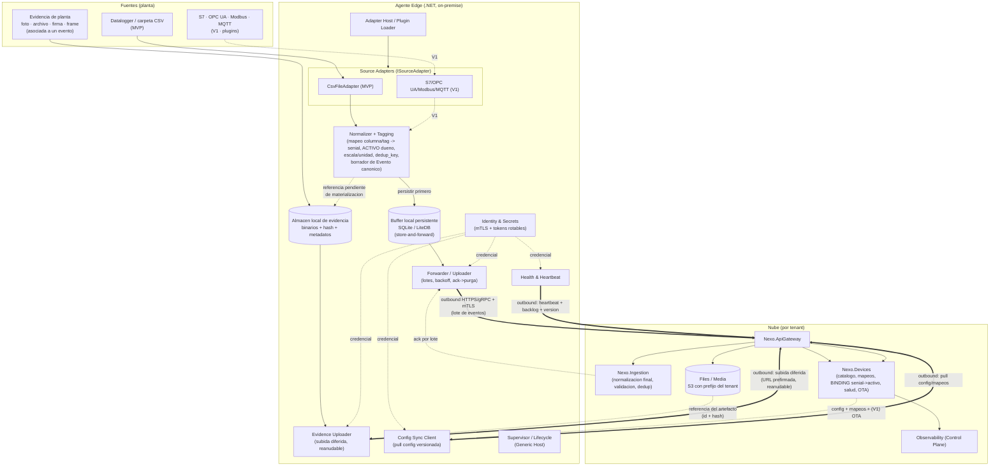
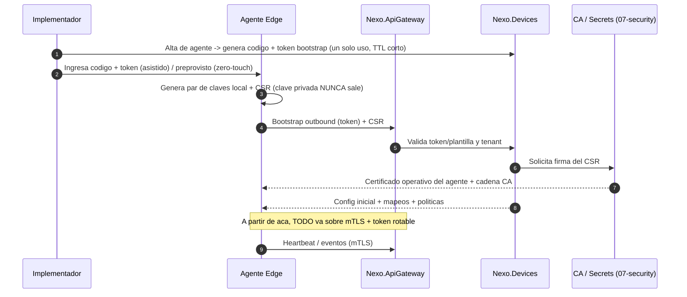
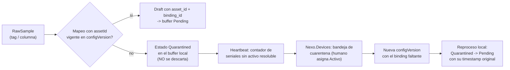
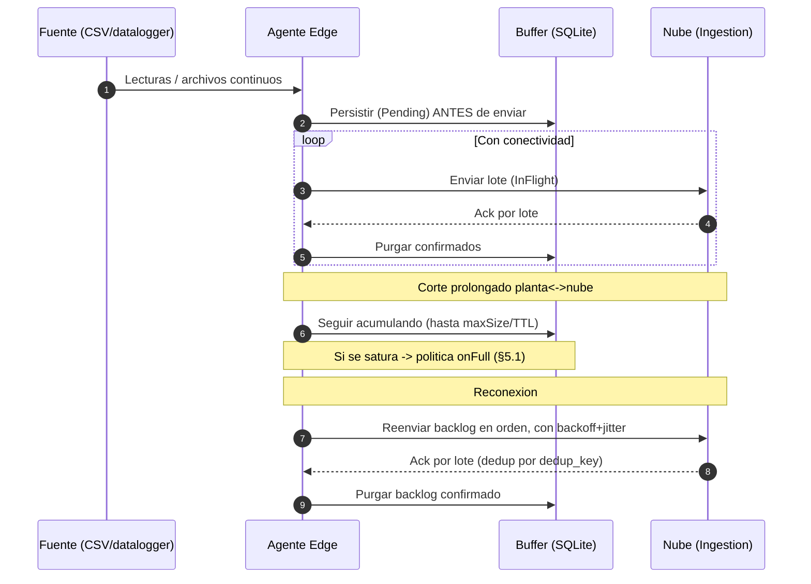
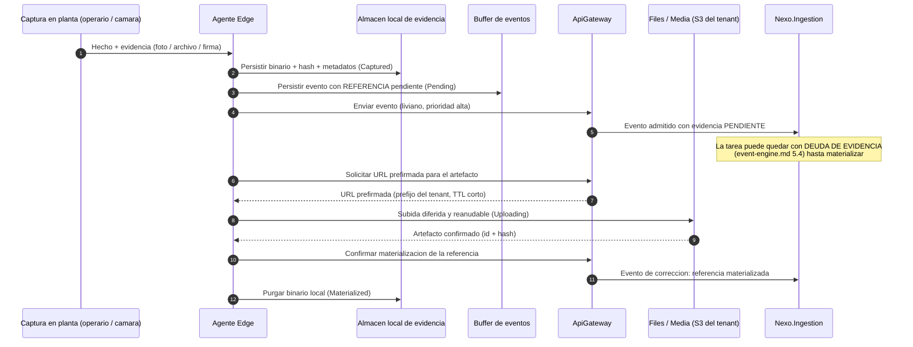
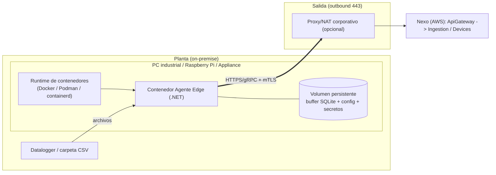

# 05 · Agente Edge — Nexo (MVP)

> **Documento:** `design/05-edge-agent.md` · **Estado:** Borrador v0.1 · **Actualizado:** 2026-07-11
> **Roles:** Software Architect · Tech Lead
> **Relacionados:** [00-tech-baseline.md](./00-tech-baseline.md) · [01-multi-tenancy-connection.md](./01-multi-tenancy-connection.md) · [02-event-model.md](./02-event-model.md) · [07-security.md](./07-security.md) · [08-observability-ops.md](./08-observability-ops.md) · [../specs/specs/devices.md](../specs/specs/devices.md) · [../specs/specs/data-ingestion.md](../specs/specs/data-ingestion.md) · [../specs/specs/digital-twin.md](../specs/specs/digital-twin.md) · [../specs/specs/event-engine.md](../specs/specs/event-engine.md)

## Resumen ejecutivo

El **Agente Edge** es el componente **on-premise** que materializa el principio *edge-first* de Nexo: corre en la planta, cerca de la fuente, captura datos, los **normaliza parcialmente** al Evento canónico ([02](./02-event-model.md)), los **bufferiza de forma persistente** (store-and-forward) y los **publica en modo outbound** hacia el servicio `Nexo.Ingestion` en la nube. Es el **plano de datos** del borde; su contraparte en la nube (`Nexo.Devices`) es el **plano de control** que le empuja catálogo, mapeos y configuración (ver [devices.md](../specs/specs/devices.md) §9 y [data-ingestion.md](../specs/specs/data-ingestion.md)).

Este documento fija el **diseño técnico** del agente respetando las decisiones cerradas del baseline:

- **Runtime .NET** (DT-06 de [00](./00-tech-baseline.md)) — se comparte lenguaje con el backend y se reutilizan `BuildingBlocks` (contratos de evento, serialización, Polly, OpenTelemetry).
- **Distribución como contenedor/software** sobre PC industrial o Raspberry Pi, con **appliance pre-provisto opcional** (DEV-01) — siempre **outbound-only** (no se abren puertos entrantes en planta).
- **Identidad por dispositivo/agente con mTLS + tokens rotables** y **revocación** (DEV-03), secretos custodiados localmente.
- **Store-and-forward** con buffer local persistente e idempotencia por `dedup_key` (DEV-02, [data-ingestion.md](../specs/specs/data-ingestion.md) §5, §7).
- **Evidencia como ciudadano de primera clase** ([event-engine.md](../specs/specs/event-engine.md) §5): el binario (foto, archivo, firma, frame) se **bufferiza local** y se **sube diferido** a Files/Media (S3 del tenant); el evento **solo porta la referencia** (§5.5).
- **Toda señal tiene un Activo dueño** ([digital-twin.md](../specs/specs/digital-twin.md) §5): el agente **resuelve el activo** de cada fuente contra el binding descendido desde Devices, y lo que no resuelve va a **cuarentena**, no al flujo productivo (§4.5).
- **Alcance MVP = datalogger vía archivo/CSV** (carga/observación de carpeta); los **adapters de protocolo industrial (S7 / OPC UA / Modbus / MQTT) son V1** y se incorporan como **plugins** sin tocar el core: en este documento se **diseña la interfaz** (`ISourceAdapter`) pero **no se implementan** esos protocolos.

> **Nota de alcance:** este es un documento de **diseño**. El código C# es **ilustrativo** (firmas, contratos, ejemplos de configuración), no la implementación final del agente.

---

## 1. Arquitectura interna del Agente Edge

### 1.1 Principios de diseño

1. **Núcleo estable, bordes enchufables.** El *core* (buffer, forwarder, seguridad, config, health) no cambia cuando se agrega un protocolo. Las **fuentes** entran como **adapters/plugins** detrás de la interfaz `ISourceAdapter` (§2). En MVP solo el adapter de **archivo/CSV** está activo; en V1 se habilitan S7/OPC UA/Modbus/MQTT (mismo contrato, sin migración del core — alineado con DEV-02).
2. **Durabilidad antes que velocidad.** Todo dato capturado se **persiste localmente** antes de intentar enviarlo. El envío es un proceso separado, reintentable y confirmado con **ack → purga**.
3. **Outbound-only.** El agente **inicia** siempre la conexión hacia la nube (HTTPS/gRPC sobre TLS + mTLS). No expone endpoints entrantes. La configuración y las órdenes descienden por **polling** del propio agente (long-poll / pull), nunca por conexión entrante (ver [devices.md](../specs/specs/devices.md) §9 y [07-security.md](./07-security.md)).
4. **Normalización parcial en el borde.** El agente hace el *tagging* (columna/tag → señal), conversiones de escala/unidad y arma el **borrador de Evento canónico** con su `dedup_key`; la **normalización canónica final** y la validación fuerte quedan en `Nexo.Ingestion` (ver [data-ingestion.md](../specs/specs/data-ingestion.md) §3; la frontera exacta es una decisión pendiente, §7).
5. **Un proceso, varias etapas desacopladas.** Se implementa como **.NET Generic Host** con `BackgroundService`s conectados por **canales acotados** (`System.Threading.Channels`), lo que da **backpressure** natural entre captura y envío.

### 1.2 Componentes

| Componente | Responsabilidad | Estado MVP |
|---|---|---|
| **Adapter Host / Plugin Loader** | Descubre, carga y aísla los adapters de fuente según la config; expone capacidades (browse/test) | ✅ (solo carga adapter CSV) |
| **Source Adapters** | Capturan de la fuente y emiten `RawSample` uniformes (§2) | ✅ CSV/archivo · 🔜 V1: S7/OPC UA/Modbus/MQTT |
| **Normalizer / Tagging** | Aplica mapeo tag→señal, **resuelve el Activo dueño** (§4.5), escalas/unidades, arma `CanonicalEventDraft` + `dedup_key` | ✅ |
| **Store-and-Forward Buffer** | Cola **persistente** (SQLite/LiteDB) de eventos pendientes; sobrevive reinicios | ✅ |
| **Evidence Store & Uploader** | Custodia local de los binarios de evidencia (foto/archivo/firma/frame), subida **diferida** a Files/Media y materialización de la referencia en el evento (§5.5) | ✅ |
| **Forwarder / Uploader** | Envío outbound por lotes a Ingestion (HTTPS/gRPC), reintentos con backoff, **ack → purga** | ✅ |
| **Config Sync Client** | *Pull* de configuración desde la nube (fuentes, mapeos, políticas), versionada y atómica (§4) | ✅ |
| **Identity & Secrets** | Custodia cert mTLS + tokens rotables; renovación/rotación; almacén local protegido (§3) | ✅ |
| **Health & Heartbeat** | Latido periódico + métricas (backlog, conectividad, versión) a Devices/Observability (§4, §5) | ✅ |
| **OTA / Self-Update** | Actualización supervisada del agente y de plugins | 🔜 V1 |
| **Supervisor / Lifecycle** | Arranque ordenado, *graceful shutdown*, drenado de canales, watchdog | ✅ |

### 1.3 Diagrama — arquitectura interna y flujo de datos



### 1.4 Flujo canónico (happy path) y contrato ack → purga

1. El **adapter** detecta un archivo nuevo / cambio en la carpeta observada (o, en V1, obtiene una lectura por polling/suscripción) y emite `RawSample`.
2. El **Normalizer** resuelve el mapeo (columna → señal de negocio), **resuelve el `asset_id` del Activo dueño** de esa señal contra el binding vigente descendido desde Devices (§4.5), aplica escala/unidad, **calcula el `dedup_key`** determinístico y arma un `CanonicalEventDraft`.
3. El draft se **persiste** en el buffer local con estado `Pending` (transacción local: nada se considera capturado hasta que está en disco). Si el evento trae **evidencia**, el binario se persiste **primero** en el almacén local de evidencia y el draft queda con la referencia en estado `PendingUpload` (§5.5).
4. El **Forwarder** toma un **lote** de `Pending` (orden FIFO por `capture_ts`), lo envía outbound a Ingestion y marca `InFlight`.
5. Ingestion responde **ack por lote** (con detalle por evento: aceptado / duplicado / rechazado).
6. Los eventos `ack`-eados (aceptados **o** marcados duplicados por Ingestion) se **purgan** del buffer; los rechazados recuperables vuelven a `Pending`; los no recuperables van a un **DLQ local** para inspección.
7. Ante error de red/timeout: el lote vuelve a `Pending` y reintenta con **backoff exponencial + jitter** (Polly). El buffer sigue acumulando (§5).

> **Idempotencia extremo a extremo:** como el transporte es *at-least-once* ([data-ingestion.md](../specs/specs/data-ingestion.md) §5), un lote parcialmente confirmado puede reenviarse; la **deduplicación por `dedup_key`** en Ingestion (y el estado local `InFlight`) evita el doble conteo. El agente **nunca** borra un evento sin ack.

---

## 2. Interfaz de adapter de fuente (`ISourceAdapter`)

El objetivo de esta sección es dejar **congelado el contrato** que permite que S7 / OPC UA / Modbus / MQTT se sumen en **V1 como plugins sin modificar el core** (extensibilidad de [data-ingestion.md](../specs/specs/data-ingestion.md) §2: "adapters como plugins"). El core solo conoce estas abstracciones; cada protocolo vive en su propio ensamblado.

### 2.1 Contrato principal (C# ilustrativo)

```csharp
namespace Nexo.Edge.Abstractions;

/// <summary>
/// Contrato que todo adapter de fuente debe implementar. El core del agente
/// no conoce protocolos: solo consume RawSample a traves de esta interfaz.
/// MVP: CsvFileAdapter. V1: S7/OpcUa/Modbus/Mqtt (mismo contrato, plugin aparte).
/// </summary>
public interface ISourceAdapter : IAsyncDisposable
{
    /// <summary>Metadatos estaticos: protocolo, version, modo (pull/push).</summary>
    AdapterDescriptor Descriptor { get; }

    /// <summary>Valida la config y prepara recursos (abre carpeta, conexion, sesion).</summary>
    Task InitializeAsync(AdapterContext context, CancellationToken ct);

    /// <summary>
    /// Arranca la captura. El adapter ESCRIBE en el canal de salida a su ritmo
    /// (pull=polling, push=suscripcion/observacion de carpeta). El canal esta
    /// ACOTADO: si se llena, el adapter debe frenar (backpressure, §5).
    /// </summary>
    Task RunAsync(ChannelWriter<RawSample> output, CancellationToken ct);

    /// <summary>Detiene la captura de forma ordenada (drena/cierra sesion).</summary>
    Task StopAsync(CancellationToken ct);

    /// <summary>Salud del adapter (conexion, ultima captura, errores recientes).</summary>
    ValueTask<AdapterHealth> CheckHealthAsync(CancellationToken ct);
}

/// <summary>Fabrica registrada por protocolo; la resuelve el Plugin Loader.</summary>
public interface ISourceAdapterFactory
{
    /// <summary>Clave de protocolo: "csv" (MVP); "s7","opcua","modbus","mqtt" (V1).</summary>
    string Protocol { get; }
    ISourceAdapter Create(AdapterConfig config);
}
```

### 2.2 Capacidades opcionales (discovery / prueba)

Los protocolos que soportan **descubrimiento asistido** o **lectura de prueba** ([devices.md](../specs/specs/devices.md) §5.3, §7) implementan interfaces de capacidad **adicionales**. El core detecta la capacidad con un `is`/pattern-match; el adapter CSV del MVP puede implementar solo `ITestableSource` (validar un archivo de muestra).

```csharp
/// <summary>Descubrimiento: browse OPC UA, escaneo Modbus, sniff de topics MQTT (V1).</summary>
public interface IBrowsableSource
{
    IAsyncEnumerable<DiscoveredTag> BrowseAsync(BrowseRequest request, CancellationToken ct);
}

/// <summary>Lectura de prueba de un tag/columna sin afectar produccion.</summary>
public interface ITestableSource
{
    Task<TagReadResult> TestReadAsync(TagAddress address, CancellationToken ct);
}
```

### 2.3 Tipos de datos del contrato

```csharp
/// <summary>Muestra cruda uniforme: la moneda comun entre adapter y core.</summary>
public sealed record RawSample
{
    public required string SourceId { get; init; }        // id del adapter/fuente en la config
    public required TagAddress Address { get; init; }     // direccion cruda por protocolo
    public required Variant Value { get; init; }          // valor tipado (num/bool/string/bytes)
    public DataQuality Quality { get; init; } = DataQuality.Good; // status OPC UA, etc.
    public DateTimeOffset? SourceTimestamp { get; init; } // tiempo de origen si la fuente lo aporta
    public DateTimeOffset CaptureTimestamp { get; init; } // sellado por el agente (siempre)
    public IReadOnlyDictionary<string, string>? OriginMetadata { get; init; } // fila CSV, lote, RSSI...
}

/// <summary>Direccion cruda, agnostica de protocolo (string + tipo).</summary>
public sealed record TagAddress(string Protocol, string Raw);
// CSV: Raw = nombre/indice de columna | S7: "DB10.DBW4" | OPC UA: "ns=2;i=1007"
// Modbus: "HR:40001" | MQTT: "planta/l3/contador"

public enum DataQuality { Good, Uncertain, Bad, Stale }
public enum AdapterMode { Pull, Push }   // pull=polling; push=suscripcion/observacion

public sealed record AdapterDescriptor(
    string Protocol, string Version, AdapterMode Mode, bool SupportsBrowse, bool SupportsTestRead);

public sealed record AdapterContext(
    AdapterConfig Config, TimeProvider Clock, ILogger Logger, Meter Metrics);

public sealed record AdapterHealth(
    bool Connected, DateTimeOffset? LastSampleAt, string? LastError, long SamplesEmitted);
```

### 2.4 Cómo se suma un protocolo en V1 (sin tocar el core)

1. Se crea un ensamblado `Nexo.Edge.Adapters.OpcUa` (o `.S7`, `.Modbus`, `.Mqtt`) que referencia **solo** `Nexo.Edge.Abstractions`.
2. Implementa `ISourceAdapter` + `ISourceAdapterFactory` (y, si aplica, `IBrowsableSource`/`ITestableSource`).
3. Se registra su `Protocol` (p. ej. `"opcua"`) en el Plugin Loader (por DI/manifest del plugin).
4. La config declara una fuente con `type: opcua` (§4) y el core la carga. **El buffer, el forwarder, la seguridad y la config no cambian** — cumpliendo DEV-02 ("lo único que cambia entre MVP y V1 es qué adapters están habilitados").

> **Regla de oro:** un adapter **nunca** habla con la nube ni con el buffer directamente. Solo produce `RawSample`. Todo lo transversal (durabilidad, envío, identidad, dedup) es del core. Esto mantiene los plugins pequeños, testeables y sustituibles.

---

## 3. Enrolamiento y seguridad

El agente y cada dispositivo tienen **identidad propia** basada en **mTLS + tokens rotables**, con **revocación por unidad** (DEV-03 de [devices.md](../specs/specs/devices.md) §11; detalle técnico en [07-security.md](./07-security.md)). El agente es *outbound-only*: presenta credenciales al **iniciar** cada conexión, nunca las expone.

### 3.1 Provisioning: asistido y zero-touch

| Modo | Cuándo | Flujo |
|---|---|---|
| **Asistido** | Instalación de software en PC/Raspberry del cliente | El implementador crea el agente en Nexo (Devices) y obtiene un **código de enrolamiento** + **token de bootstrap de un solo uso** (TTL corto). Los ingresa en el agente. El agente **genera su par de claves local**, arma un **CSR** y lo envía por el canal de bootstrap; la **CA de Nexo firma** y devuelve el **certificado operativo** del agente. |
| **Zero-touch (plantilla)** | Appliance pre-provisto o flota estandarizada (DEV-01) | El appliance viene con una **identidad de bootstrap** de fábrica (clave en elemento seguro/TPM) y una **plantilla de dispositivo** ([devices.md](../specs/specs/devices.md) §5.3). Al primer arranque con conectividad, se **auto-enrola** contra la plantilla asignada al tenant y recibe su certificado operativo + config, sin intervención en planta. |



### 3.2 Identidad, tokens rotables y revocación

- **mTLS (identidad fuerte):** el agente presenta su **certificado operativo** en cada conexión; la nube valida contra la CA de Nexo. Certificados de **vida corta** con renovación automática antes del vencimiento (rotación transparente).
- **Tokens rotables (autorización):** sobre el canal mTLS, el agente porta un **token de acceso de corta duración** (scope acotado al tenant + agente). Se **rota** vía *refresh* periódico; la corta vida limita la ventana de abuso si se filtra.
- **Revocación por unidad:** ante compromiso, la nube **revoca** el certificado (lista de revocación / TTL corto que fuerza rechazo en la próxima renovación) y/o **invalida el token**, **sin afectar** al resto de la flota. El agente revocado deja de ser admitido en Ingestion/Devices.
- **Identidad de dispositivo vs. de agente:** el **agente** tiene su identidad; los **dispositivos directos a la nube** (MQTT/HTTP, V1) tienen la suya. En MVP la fuente es archivo/CSV local, así que la identidad relevante es la del **agente** que lo lee.

### 3.3 Secretos locales

- **Clave privada del agente:** se genera **en el dispositivo** y **nunca** se transmite. Se protege según plataforma: **DPAPI** (Windows), *keyring*/archivo con permisos restringidos (Linux), y **TPM / elemento seguro** en el appliance (DEV-01).
- **Custodia:** nada de secretos en la imagen del contenedor ni en el repo. Los tokens se guardan cifrados en reposo en el almacén local del agente. Alineado con el principio de custodia central de secretos ([00](./00-tech-baseline.md) §7 y [devices.md](../specs/specs/devices.md) §11).
- **Rotación de secretos de fuente (V1):** credenciales de PLC/OPC UA (usuario, cert de sesión OPC UA) se referencian desde la config y se resuelven contra el almacén local; se rotan sin redeploy.

---

## 4. Configuración y ciclo de vida

### 4.1 Configuración declarativa

La configuración es **declarativa y editable sin redeploy** ([devices.md](../specs/specs/devices.md) §8.3). Define **fuentes** (adapters), **mapeo de columnas CSV → señales/tags**, y **políticas** (buffer, envío). La **fuente de verdad está en la nube** (Devices); el archivo local es una **caché** de la última config aplicada.

Ejemplo (YAML ilustrativo — MVP, adapter CSV):

```yaml
# nexo-edge.yaml  — caché local de la config empujada desde Nexo.Devices
apiVersion: nexo.edge/v1
kind: EdgeAgentConfig
metadata:
  agentId: "agt-planta-cordoba-01"
  tenantId: "tnt-laceleste"
  configVersion: 42              # monotonico; el core aplica solo si es mayor
  etag: "sha256:9f3c…"

cloud:
  ingestionEndpoint: "https://ingest.nexo.app"   # outbound-only
  transport: "grpc"             # grpc | https  (ver §1)
  batchMaxEvents: 500
  batchMaxIntervalMs: 2000

security:
  mtls:
    certRef: "local:agent-cert"     # referencia al almacen local (no el material)
    caBundleRef: "local:nexo-ca"
  token:
    refreshBeforeExpiryMin: 5

buffer:                            # ver §5
  store: "sqlite"                  # sqlite | litedb
  maxSizeMb: 2048
  maxAgeHours: 168                 # TTL: 7 dias
  onFull: "drop-oldest-readings"   # ver politicas §5.1
  minGuaranteedRetentionHours: 24

sources:
  - id: "datalogger-temp-l3"
    type: "csv"                    # MVP. En V1: s7 | opcua | modbus | mqtt
    enabled: true
    csv:
      mode: "watch-folder"         # watch-folder | upload
      path: "/data/incoming/l3/*.csv"
      archivePath: "/data/processed/l3"   # mover tras procesar (idempotencia por archivo)
      delimiter: ";"
      hasHeader: true
      encoding: "utf-8"
      culture: "es-AR"             # decimal con coma, fecha dd/MM/yyyy
      timestamp:
        column: "FechaHora"
        format: "dd/MM/yyyy HH:mm:ss"
        timezone: "America/Argentina/Cordoba"
      # Mapeo columna CSV -> senial de negocio (proviene de Devices §8)
      # assetId = ACTIVO DUENO del binding vigente (regla no negociable, §4.5)
      columnMappings:
        - column: "Temp_Horno"
          signal: "temp-horno-l3"        # id de senial de negocio (catalogo Devices)
          assetId: "ast-horno-2"         # Activo dueno (digital-twin.md §5) - OBLIGATORIO
          bindingId: "bnd-7c41"          # binding vigente que respalda la atribucion
          deviceId: "dev-datalogger-l3"
          sensorId: "sen-temp-01"
          unit: "degC"
          transform: { scale: 1.0, offset: 0.0 }
          eventType: "reading"
          qualityColumn: "Estado_Temp"   # opcional
        - column: "Piezas_OK"
          signal: "conteo-ok-l3"
          assetId: "ast-prensa-2"
          bindingId: "bnd-9a03"
          deviceId: "dev-datalogger-l3"
          sensorId: "sen-cnt-01"
          unit: "pieces"
          eventType: "production"
          # dedup_key: device + tag + timestamp de origen + valor (ver §5.3)
          dedupKey: ["deviceId","column","sourceTimestamp","value"]

evidence:                          # ver §5.5
  enabled: true
  store: "/data/evidence"          # volumen persistente, cifrado en reposo (07-security §5.3)
  maxSizeMb: 8192                  # cuota propia, SEPARADA del buffer de eventos
  maxAgeHours: 336                 # 14 dias
  maxArtifactMb: 25                # tope por artefacto (foto/archivo)
  uploadConcurrency: 2
  uploadOnMeteredLink: false       # diferir mientras el enlace este saturado por eventos
  onFull: "block-capture"          # nunca se descarta evidencia en silencio (§5.5)
  priority: ["signature","document","photo","frame"]

health:
  heartbeatIntervalSec: 30
  includeBufferBacklog: true
  includeEvidenceDebt: true        # artefactos pendientes de subida (§5.5, 08-observability)
```

> **Mapeo CSV → señal:** el bloque `columnMappings` es la **autoría de mapeo** que vive en `Nexo.Devices` (§8 de [devices.md](../specs/specs/devices.md)) y **desciende** al agente. El agente **aplica** el mapeo, no lo define. Cambiar una escala o un `dedupKey` es un cambio de config versionado (no de código).

### 4.2 Sync de configuración desde la nube

- **Pull versionado (outbound):** el `Config Sync Client` consulta periódicamente (long-poll) a Devices por `configVersion`/`etag`. Si hay una versión mayor, la **descarga, valida y aplica de forma atómica** (swap de config), reinicializando solo los adapters afectados.
- **Aplicación atómica + rollback:** si la nueva config falla la validación local (p. ej. mapeo inconsistente, adapter no disponible), el agente **conserva la anterior** y reporta el error por health. Nunca queda en estado intermedio.
- **Push lógico sin conexión entrante:** aunque conceptualmente Devices "empuja" config ([devices.md](../specs/specs/devices.md) §9), técnicamente es el agente quien **hace pull** — respetando outbound-only.

### 4.3 Heartbeat y health

- **Heartbeat periódico** (configurable, def. 30 s) a Devices con: versión del agente y de plugins, `configVersion` aplicada, **backlog del buffer**, estado de conectividad de cada fuente, uso de CPU/mem/disco. Alimenta el semáforo de [devices.md](../specs/specs/devices.md) §6 y la Observability del Control Plane.
- **Health local:** endpoints `live`/`ready` **internos** (para el orquestador local / Docker healthcheck), no expuestos a la red externa.
- **Distinción dispositivo caído vs. enlace caído:** si el enlace planta↔nube cae pero el agente sigue capturando, el heartbeat se corta pero el buffer crece; al reconectar, el agente informa el **backlog** para no disparar falsas alarmas ([devices.md](../specs/specs/devices.md) §6, [data-ingestion.md](../specs/specs/data-ingestion.md) §7).

### 4.4 OTA y versionado (OTA = V1)

- **Versionado triple:** versión del **agente** (semver), versión de cada **plugin adapter**, y **`configVersion`** (monotónica). Todo se reporta en el heartbeat y viaja en `origin_metadata` de los eventos para trazabilidad ([data-ingestion.md](../specs/specs/data-ingestion.md) §3).
- **OTA (V1):** actualización del binario del agente y de plugins mediante **campañas** desde Devices ([devices.md](../specs/specs/devices.md) §10): paquete **firmado + checksum**, descarga outbound, validación de firma, **despliegue canary/por lotes** y **rollback automático** ante fallo de arranque. La OTA del **propio agente** sobre plantas críticas requiere salvaguardas específicas (ver Decisiones pendientes).
- **Compatibilidad:** cada versión declara con qué versión de contrato de evento ([02](./02-event-model.md)) y de `ISourceAdapter` es compatible, evitando romper la flota.

### 4.5 Resolución del Activo dueño de cada señal

La regla de la Capa 1 es **no negociable**: *todo dato capturado en la planta pertenece a un Activo; no existe el dato huérfano* ([digital-twin.md](../specs/specs/digital-twin.md) §5). El agente es el **primer punto donde esa regla se puede hacer cumplir**, y por eso resuelve el `asset_id` **en el borde**, no en la nube.

| Aspecto | Diseño |
|---|---|
| **Quién define el binding** | `Nexo.Devices` (plano de control). El agente **no** crea ni inventa bindings: los **recibe** en la config versionada (§4.1, campo `assetId` + `bindingId` de cada mapeo) |
| **Quién lo aplica** | El **Normalizer**: por cada `RawSample` busca el mapeo de su `TagAddress` y sella `asset_id` + `binding_id` en el `CanonicalEventDraft` |
| **Vigencia** | El binding tiene vigencia desde/hasta ([digital-twin.md](../specs/specs/digital-twin.md) §5.3). El agente resuelve contra la vigencia **a la fecha de ocurrencia** del hecho, no a la de envío: reprocesar un CSV viejo conserva la atribución que correspondía entonces |
| **Cambio de binding** | Llega como **nueva `configVersion`**. Los eventos ya bufferizados **conservan** el `asset_id` con el que se sellaron; no se re-atribuyen retroactivamente |
| **Sin binding resoluble** | El evento **no se descarta y no se envía como productivo**: se marca `Quarantined` en el buffer local y se reporta en el heartbeat. Ver abajo |

**Cuarentena local (contraparte en el borde de [digital-twin.md](../specs/specs/digital-twin.md) §5.5):**



- **Nunca se descarta**: la cuarentena preserva a la vez el invariante (nada entra sin dueño) y la promesa de trazabilidad (nada de planta se pierde). La retención de la cuarentena local se rige por `maxAgeHours` del buffer.
- **Nunca se auto-asigna**: el agente **no** crea Activos lógicos ni adivina el dueño por proximidad de nombre. La resolución es **humana** y ocurre en Devices; el agente solo aplica el resultado.
- **Observable**: el contador de señales en cuarentena viaja en el heartbeat y alimenta la alerta de "eventos sin activo resoluble" de [08-observability-ops.md](./08-observability-ops.md).

> **Por qué en el borde y no en la nube:** resolver el activo en el borde permite que el evento nazca **ya atribuido**, que la cuarentena sea visible aunque el enlace esté caído, y que el operario del kiosco vea de inmediato que su captura no tiene dueño. Resolverlo solo en la nube trasladaría el problema a un momento en que ya nadie está delante de la máquina.

---

## 5. Resiliencia

El agente es el **último amortiguador** del pipeline: prioriza **retener y diferir** antes que perder ([data-ingestion.md](../specs/specs/data-ingestion.md) §7.2).

### 5.1 Políticas de buffer (tamaño / TTL / descarte)

El buffer es una **cola persistente** en **SQLite** (o LiteDB) con WAL, que sobrevive a reinicios. Se gobierna por límites y una **política ante saturación**:

| Parámetro | Descripción | Default provisional |
|---|---|---|
| `maxSizeMb` | Tope de tamaño en disco | 2048 MB |
| `maxAgeHours` (TTL) | Antigüedad máxima de un evento en buffer | 168 h (7 días) |
| `minGuaranteedRetentionHours` | Retención mínima garantizada antes de aplicar descarte | 24 h |
| `onFull` | Política al llegar al tope | `drop-oldest-readings` |

**Políticas `onFull` disponibles:**

- `drop-oldest-readings` (**default**): ante saturación, se **descartan primero las lecturas de alta frecuencia** (`type=reading`), preservando eventos de dominio (`production`/`scrap`/`downtime`/`quality`). Alineado con [data-ingestion.md](../specs/specs/data-ingestion.md) §7.3.
- `downsample-readings`: **downsampling local** de `reading` (submuestreo) para reducir volumen sin perder tendencia.
- `drop-oldest`: FIFO puro (descarta lo más viejo sin distinción de tipo).
- `block-source`: frena la captura (backpressure duro hacia el adapter) — solo para fuentes que toleran pausa.

Toda decisión de descarte/downsampling se **registra** (contador local + `origin_metadata`/Observability) para auditar pérdida.

### 5.2 Backpressure

- **Entre etapas:** los canales `Channel<RawSample>` y la cola de envío están **acotados**. Si el buffer/persistencia va más lento que la captura, el canal se llena y el **adapter frena** (respetando `ChannelWriter.WaitToWriteAsync`). Para el adapter CSV, esto significa **pausar el procesamiento** del próximo archivo; para adapters pull de V1, **espaciar el polling**; para push (MQTT), aplicar la política del broker.
- **Hacia la nube:** si Ingestion aplica *throttling* por tenant ([data-ingestion.md](../specs/specs/data-ingestion.md) §7.1), el forwarder **respeta el backoff** y el buffer absorbe la diferencia. El backpressure se propaga hacia atrás de forma controlada, tal como pide [data-ingestion.md](../specs/specs/data-ingestion.md) §7.2.

### 5.3 Deduplicación por `dedup_key`

- El agente **calcula el `dedup_key` en el borde** de forma **determinística y estable** ([data-ingestion.md](../specs/specs/data-ingestion.md) §5.2): derivado de atributos **invariantes** del hecho, **no** del momento de envío. Para CSV: **identidad de la fila dentro del lote** (deviceId + columna/tag + timestamp de origen + valor / nº de fila), de modo que reprocesar un archivo ya cargado no genere duplicados.
- El `dedup_key` viaja en el Evento; Ingestion mantiene la **ventana de deduplicación**. El agente además usa el estado local `InFlight` para no reenviar a ciegas lotes ya confirmados.
- **Idempotencia de archivos:** un archivo procesado se **mueve a `archivePath`**; si reaparece (recarga), sus filas producen el **mismo** `dedup_key` y Ingestion las descarta.

### 5.4 Comportamiento ante cortes largos



- Durante el corte, la **captura continúa** (el dispositivo se considera *online a nivel de captura*, [devices.md](../specs/specs/devices.md) §6). El buffer crece hasta `maxSize`/`TTL`; superado el límite, actúa `onFull`.
- Al reconectar, el **reenvío es ordenado** (FIFO por `capture_ts`) con **backoff exponencial + jitter** para no saturar la admisión (evita el pico de reconexión de [data-ingestion.md](../specs/specs/data-ingestion.md) §7.1). La **dedup** absorbe los lotes parcialmente confirmados antes del corte.
- **Reinicio del agente** durante un corte: como todo `Pending`/`InFlight` está en disco, al reiniciar **retoma** el backlog sin pérdida (los `InFlight` sin ack vuelven a `Pending`).

### 5.5 Evidencia capturada en el borde (buffer local + subida diferida)

La **evidencia es ciudadano de primera clase del evento** ([event-engine.md](../specs/specs/event-engine.md) §5): una foto, un archivo, una firma, una lectura asociada o un frame de cámara **nacen pegados al hecho**, no son un adjunto tardío. Pero el binario es órdenes de magnitud más pesado que el evento y el enlace de planta es el recurso escaso. De ahí la regla de diseño:

> **El evento viaja liviano y llega primero; el binario viaja después. El evento nunca contiene la evidencia: contiene su referencia.**

#### 5.5.1 Dos colas, un solo hecho

| | **Buffer de eventos** (§5.1) | **Almacén de evidencia** (§5.5) |
|---|---|---|
| Qué guarda | `CanonicalEventDraft` (bytes, KB) | Binarios (foto, PDF, firma, frame — MB) |
| Motor | SQLite/LiteDB | Archivos en volumen persistente + índice en el mismo SQLite |
| Cuota | `buffer.maxSizeMb` | `evidence.maxSizeMb` — **separada**, para que un lote de fotos no expulse eventos de dominio |
| Destino | `Nexo.Ingestion` | **Files/Media** (S3 con prefijo del tenant, [01 §6.3](./01-multi-tenancy-connection.md)) |
| Política ante saturación | `onFull` (descarta lecturas primero) | `block-capture` por defecto: **la evidencia no se descarta en silencio** |
| Prioridad de envío | Alta (el hecho manda) | Diferida y de menor prioridad que los eventos |

#### 5.5.2 Ciclo de vida de un artefacto de evidencia

| Estado | Significado |
|---|---|
| `Captured` | El binario está en disco local, con **hash de integridad**, tamaño, tipo MIME, instante de captura y `asset_id` del activo de contexto |
| `PendingUpload` | El evento ya fue enviado (o está en el buffer) con la referencia marcada **pendiente de materialización** |
| `Uploading` | Subida en curso a Files/Media, **reanudable** (multipart / rango) tras un corte |
| `Materialized` | Files/Media confirmó el artefacto; la referencia del evento queda completa (id + hash verificado) |
| `Orphan` | El artefacto quedó sin evento asociado (p. ej. la captura se abandonó) → se purga por TTL y se contabiliza |



#### 5.5.3 Reglas de diseño

- **Persistir antes que enviar**, igual que con los eventos: nada se considera capturado hasta que el binario **y** su hash están en disco. Sacar la foto no puede depender de la red.
- **El evento no espera al binario.** Si el enlace alcanza para el evento pero no para la foto, el evento se admite igual con la referencia pendiente y el hecho ya cuenta para las métricas; lo que queda pendiente es la **deuda de evidencia**, que es una métrica de negocio en sí misma ([event-engine.md](../specs/specs/event-engine.md) §5.4, §7.5) y viaja en el heartbeat.
- **Misma `dedup_key`, sin duplicar el evento.** La materialización posterior de la referencia **no crea un evento nuevo**: se emite como evento de corrección que completa la referencia del original ([event-engine.md](../specs/specs/event-engine.md) §5.3).
- **Integridad verificable.** El hash calculado en el borde viaja en la referencia; Files/Media lo revalida al recibir. Un artefacto cuyo hash no coincide **no** materializa la referencia: se reintenta y, si persiste, se reporta.
- **Inmutabilidad.** Un artefacto subido no se reemplaza: reemplazar una foto es **agregar** otra evidencia con su evento de corrección. El agente nunca sobrescribe un artefacto ya materializado.
- **Aislamiento por tenant.** La subida usa **URL prefirmada** emitida por la nube contra el **prefijo S3 del tenant** ([01 §6.3](./01-multi-tenancy-connection.md)); el agente **no** porta credenciales de S3 ni conoce el bucket. Detalle de control de acceso en [07-security.md](./07-security.md).
- **Cifrado en reposo local.** El almacén de evidencia se cifra con la clave del dispositivo, igual que el buffer ([07-security.md](./07-security.md) §5.3): una foto de un puesto de trabajo puede contener personas o información sensible.
- **Prioridad configurable.** Ante enlace escaso, se suben primero **firmas y documentos de conformidad** (sustento probatorio), después fotos de control de calidad, y al final frames de cámara — coherente con la política de retención de [event-engine.md](../specs/specs/event-engine.md) §5.5.
- **Saturación sin pérdida silenciosa.** Con `onFull: block-capture`, al agotarse la cuota el agente **rechaza nuevas capturas de evidencia con aviso explícito** en lugar de aceptarlas y descartarlas después. Las políticas alternativas (`downscale-photos`, `drop-frames-first`) degradan de forma declarada y auditada.
- **Frames de cámara.** Por defecto se conserva y sube **frame + ventana corta**, nunca video continuo; la promoción a retención larga la decide la nube cuando el evento se asocia a un defecto, una parada o una disputa.

---

## 6. Empaquetado y despliegue

### 6.1 Forma de distribución (DEV-01)

| Forma | Destino | Notas |
|---|---|---|
| **Contenedor (Docker/OCI)** | PC industrial (x64) o Raspberry Pi (arm64) del cliente | Imagen multi-arch (`linux/amd64`, `linux/arm64`); corre con Docker/containerd o Podman. **Distribución primaria del MVP.** |
| **Software nativo (servicio)** | Windows/Linux sin contenedores | Publicado como *self-contained* .NET; se instala como **servicio de Windows** o **unidad systemd**. Para plantas sin runtime de contenedores. |
| **Appliance pre-provisto (opcional)** | Cliente que prefiere *llave en mano* | Hardware con el agente y **identidad de bootstrap en TPM/elemento seguro**; zero-touch (§3.1). |

En **todos** los casos: **outbound-only**, sin puertos entrantes expuestos a la red de planta.

### 6.2 Empaquetado .NET

- **Runtime .NET 8** (DT-06). Imagen base recomendada: `runtime-deps` + publish **self-contained** *trimmed* para reducir footprint; evaluar **Native AOT** para el core del agente (arranque rápido, menor RAM) si la compatibilidad de dependencias lo permite (los plugins de protocolo V1 pueden requerir JIT — decisión abierta).
- **Volúmenes/persistencia:** el buffer SQLite, el **almacén local de evidencia** (§5.5) y la config/secretos locales se montan en un **volumen persistente** (que sobreviva a recreación del contenedor). El dimensionado del volumen debe contemplar `buffer.maxSizeMb` **más** `evidence.maxSizeMb`.
- **Reutilización de `BuildingBlocks`:** contratos de evento ([02](./02-event-model.md)), serialización, Polly (retry/circuit breaker) y OpenTelemetry se comparten con el backend .NET ([00](./00-tech-baseline.md) §2, §7), reduciendo divergencia.

### 6.3 Footprint objetivo (provisional, a validar en hardware real — DT-06)

| Recurso | Objetivo MVP (adapter CSV) | Comentario |
|---|---|---|
| **RAM** | ≤ 150–250 MB en reposo | Raspberry Pi 4 (2–4 GB) holgado; AOT/trimming ayuda |
| **CPU** | < 5 % en reposo; picos en parseo de lotes CSV | 1 core suficiente en MVP |
| **Disco** | 100–200 MB imagen + buffer (`maxSizeMb`, def. 2 GB) + **evidencia** (`evidence.maxSizeMb`, def. 8 GB) | Ambas cuotas son independientes; la evidencia domina el dimensionado en plantas con captura fotográfica intensiva |
| **Arranque** | < 3 s (AOT) / < 8 s (JIT self-contained) | Relevante para reinicios/OTA |
| **Red** | Solo saliente 443 (HTTPS/gRPC) | Sin ingress; tolerante a NAT/proxy corporativo. La subida de evidencia comparte el enlace y **cede prioridad** a los eventos (§5.5) |

> Estas cifras son **objetivo de diseño**; se confirman midiendo en el hardware objetivo (PC industrial / Raspberry Pi) como pide DT-06 de [00](./00-tech-baseline.md).

### 6.4 Diagrama de despliegue



---

## 7. Decisiones pendientes

Estas preguntas se resuelven **a medida que el diseño de implementación las necesite**; al cerrarse se promueven a ADR en [00-tech-baseline.md](./00-tech-baseline.md) (o al [tablero de decisiones](../specs/open-questions-board.md) si son de negocio). Varias son contraparte directa de las Preguntas abiertas de [devices.md](../specs/specs/devices.md) y [data-ingestion.md](../specs/specs/data-ingestion.md).

| # | Pregunta | Contexto / impacto | Default provisional |
|---|---|---|---|
| ED-01 | **Frontera de normalización edge vs. nube** | ¿Cuánto normaliza el agente (unidades/agregaciones) vs. Ingestion? ¿Configurable por planta según capacidad del hardware? (esp. Raspberry) | MVP: normalización **parcial** en el borde (tagging + escala/unidad + `dedup_key`); canónica final en Ingestion ([data-ingestion.md](../specs/specs/data-ingestion.md) §3, PA-3) |
| ED-02 | **Transporte: gRPC vs. HTTPS** para el envío outbound | gRPC (streaming, eficiencia) vs. HTTPS/REST (simpleza, atraviesa proxies) | Soportar **ambos** por config; **default HTTPS/REST por lote** en MVP (máxima compatibilidad con proxies corporativos); gRPC opcional |
| ED-03 | **Motor del buffer: SQLite vs. LiteDB** | Durabilidad, concurrencia, footprint en arm64 | **SQLite (WAL)** como default por madurez/rendimiento; LiteDB como alternativa si se prioriza *zero-dependency* .NET puro |
| ED-04 | **Native AOT para el agente** | Menor RAM/arranque vs. compatibilidad con plugins de protocolo V1 (algunos drivers requieren JIT/reflection) | Core en **AOT** si es viable; plugins que no lo toleren, en runtime JIT — validar por adapter |
| ED-05 | **Política de saturación del buffer** | Qué degradar ante cortes largos (contraparte de [data-ingestion.md](../specs/specs/data-ingestion.md) PA-1) | `drop-oldest-readings` con **retención mínima garantizada de 24 h**; confirmar por vertical/criticidad |
| ED-06 | **Sincronización de reloj del edge** | Deriva de reloj distorsiona KPIs (contraparte de [data-ingestion.md](../specs/specs/data-ingestion.md) PA-2, §8) | Sincronizar hora del host (NTP) y **registrar offset** en `origin_metadata`; para CSV, preferir timestamp de origen del archivo |
| ED-07 | **OTA del propio Agente en plantas críticas** | Riesgo de dejar una planta sin captura (contraparte de [devices.md](../specs/specs/devices.md) PA-2) | OTA **supervisada** con canary + rollback; agente crítico requiere **aprobación humana** y ventana de mantenimiento |
| ED-08 | **Redundancia de Agente por planta (HA)** | Doble conteo si dos agentes leen la misma fuente ([devices.md](../specs/specs/devices.md) PA-8) | MVP: **1 agente por planta/sector**; HA activa-pasiva en V1, con dedup por `dedup_key` como red de seguridad |
| ED-09 | **Aislamiento de plugins de adapter** | ¿`AssemblyLoadContext` (in-proc) vs. proceso separado por adapter? Un adapter que crashea no debe tumbar el core | MVP: in-proc (solo CSV, bajo riesgo); V1: evaluar aislamiento por `AssemblyLoadContext` o subproceso para protocolos de terceros |
| ED-10 | **Cuota y política de saturación de la evidencia** (§5.5) | Un turno con captura fotográfica intensiva puede llenar el disco antes que el buffer de eventos; ¿se bloquea la captura, se degrada la resolución o se descartan frames? | `block-capture` con cuota separada de 8 GB y aviso explícito al operario; `downscale-photos` configurable por planta. Confirmar con el tope por artefacto (25 MB) |
| ED-11 | **Materialización de la referencia de evidencia: URL prefirmada vs. proxy por Ingestion** (§5.5) | La prefirmada evita que el binario atraviese los servicios, pero exige un endpoint de emisión y un TTL bien acotado; el proxy simplifica el borde pero carga la nube | **URL prefirmada** contra el prefijo S3 del tenant, emitida por la nube con TTL corto; el agente nunca porta credenciales de S3. Coordinar con [07-security.md](./07-security.md) |
| ED-12 | **Resolución del Activo dueño: borde vs. nube** (§4.5) | Resolver en el borde da cuarentena visible offline, pero obliga a descender el binding completo en la config y a re-descargarla ante cada cambio | Resolver **en el borde** con `assetId`/`bindingId` en la config versionada; Ingestion **revalida** y es la última línea de defensa del invariante |

---

> **Cierre.** Este diseño deja el **core del agente congelado** alrededor de un contrato de fuente (`ISourceAdapter`), un buffer store-and-forward persistente, un **almacén de evidencia con subida diferida y referencia materializable**, la **resolución obligatoria del Activo dueño** de cada señal, un forwarder outbound con ack→purga y una identidad mTLS+token rotable. El MVP se limita a **datalogger/CSV**, pero la **superficie de extensión para S7/OPC UA/Modbus/MQTT queda definida** para habilitarse en V1 **sin migrar** el core ni el pipeline (DEV-02). Próximos documentos: envelope de evento en [02-event-model.md](./02-event-model.md), detalle de mTLS/secretos en [07-security.md](./07-security.md), y health/OTA/ops en [08-observability-ops.md](./08-observability-ops.md).
