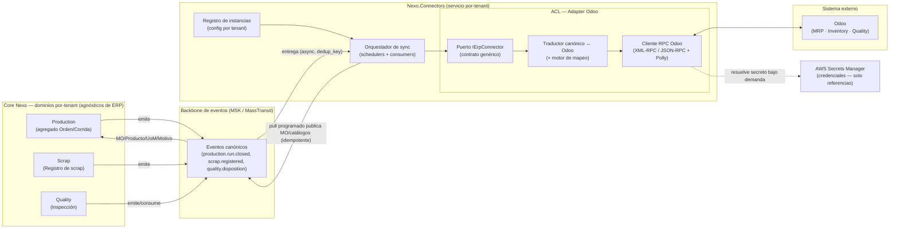
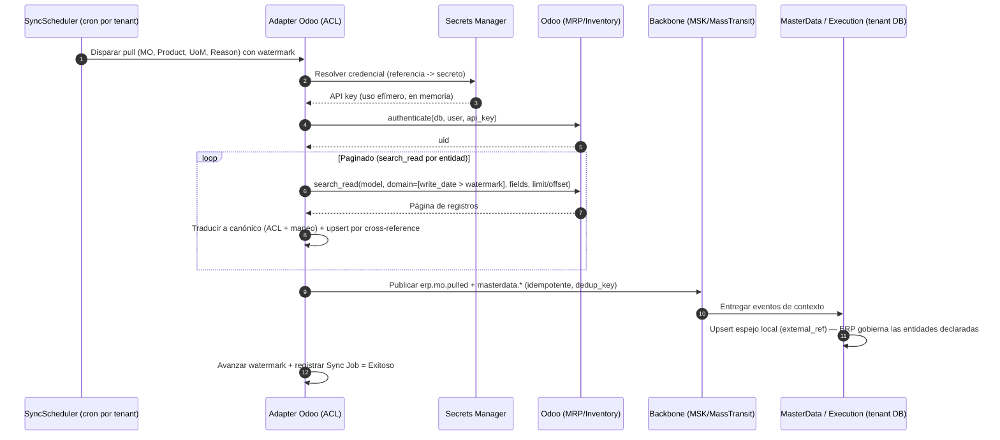
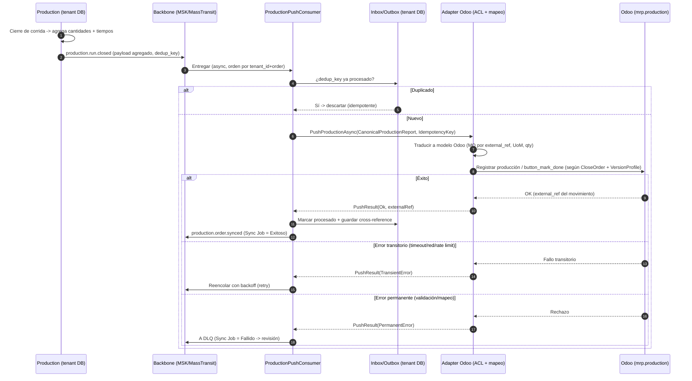
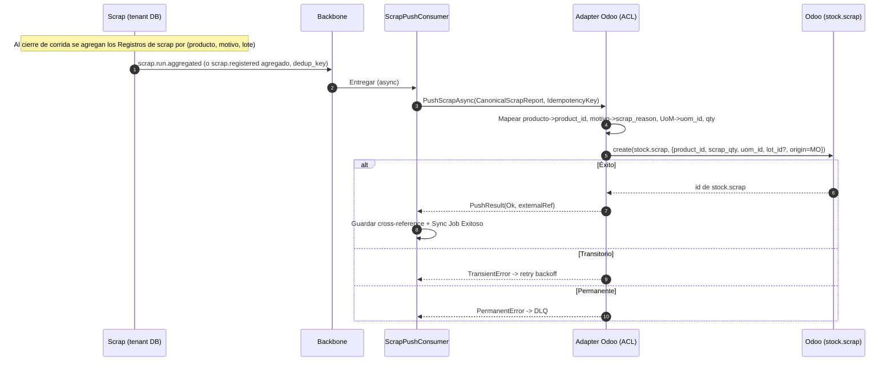
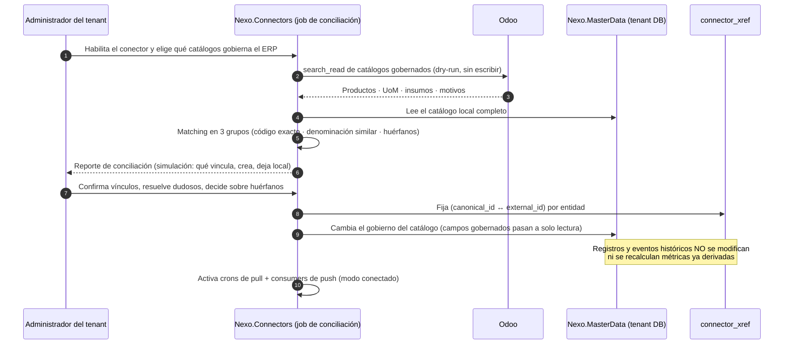
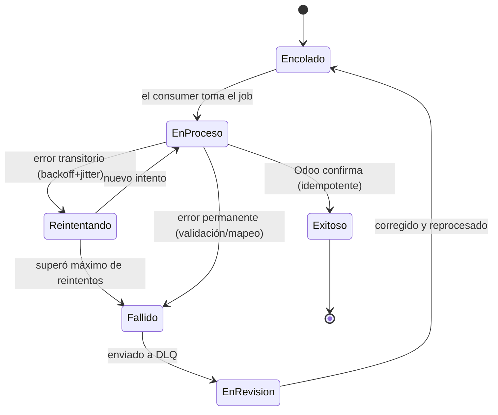
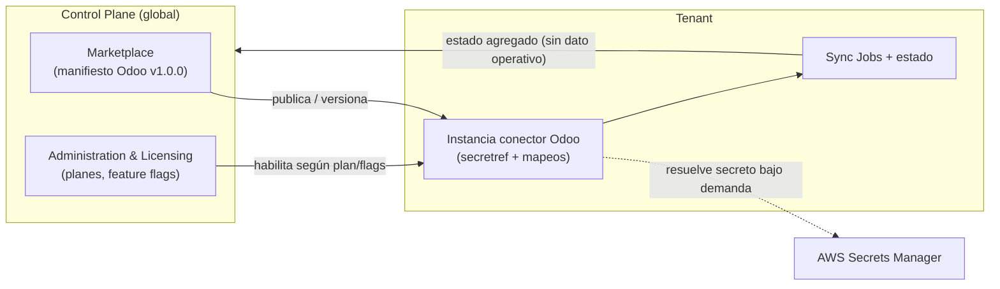

# 06 · Conector Odoo (OPCIONAL) — ACL, Sync Jobs, Mapeo y Fiabilidad

> **Documento:** `design/06-odoo-connector.md` · **Estado:** Borrador v0.2 · **Actualizado:** 2026-07-13
> **Roles:** Software Architect · Tech Lead
> **Relacionados (diseño):** [00-tech-baseline.md](./00-tech-baseline.md) · [01-multi-tenancy-connection.md](./01-multi-tenancy-connection.md) · [02-event-model.md](./02-event-model.md) · [03-data-schema.md](./03-data-schema.md) · [04-service-contracts.md](./04-service-contracts.md) · [05-edge-agent.md](./05-edge-agent.md) · [07-security.md](./07-security.md) · [08-observability-ops.md](./08-observability-ops.md)
> **Relacionados (specs):** [../specs/specs/layered-architecture.md](../specs/specs/layered-architecture.md) · [../specs/specs/master-data.md](../specs/specs/master-data.md) · [../specs/specs/integrations.md](../specs/specs/integrations.md) · [../specs/specs/production.md](../specs/specs/production.md) · [../specs/specs/scrap.md](../specs/specs/scrap.md) · [../specs/specs/quality.md](../specs/specs/quality.md) · [../specs/specs/control-plane.md](../specs/specs/control-plane.md) · [../specs/specs/security.md](../specs/specs/security.md) · [../specs/specs/data-model.md](../specs/specs/data-model.md) · [../specs/specs/architecture.md](../specs/specs/architecture.md) · [../specs/open-questions-board.md](../specs/open-questions-board.md)

## Resumen ejecutivo

Este documento es el **diseño técnico del conector Odoo** de Nexo, el primer conector de la plataforma y la
implementación de referencia del patrón **Conector + Anti-Corruption Layer (ACL)** definido en
[`integrations.md`](../specs/specs/integrations.md). Traduce las decisiones funcionales y de negocio de
esa spec a un diseño concreto sobre el stack del [baseline técnico](./00-tech-baseline.md): **.NET 8**,
Clean Architecture, **eventos async** sobre MassTransit/MSK, **DB-per-tenant** en Neon y **credenciales en
AWS Secrets Manager** (solo referencias).

> ## ⚠️ El conector es OPCIONAL (reencuadre del 2026-07-13)
>
> Desde la adopción del **modelo de 4 capas**
> ([`layered-architecture.md`](../specs/specs/layered-architecture.md)), **el ERP no es una capa**: es un
> **conector lateral opcional**, un *plus*. En consecuencia:
>
> - **Ningún flujo del MVP puede depender de este conector.** Captura, modelo de trabajo, ejecución, eventos,
>   trazabilidad, KPIs y tableros funcionan **completos** sin Odoo. Si un flujo se rompe al desactivar el
>   conector, es un **defecto de diseño**, no una limitación de configuración.
> - **En modo standalone no hay pull de contexto:** los catálogos (ítems, UoM, insumos, motivos, personas) y el
>   disparador del trabajo salen de **`Nexo.MasterData`** ([`master-data.md`](../specs/specs/master-data.md)).
>   Ver **§1.4**.
> - **Un tenant puede conectar un ERP más tarde** sin perder ni duplicar su master data: hay una
>   **conciliación de identidad** asistida, con confirmación humana y sin recálculo del histórico. Ver **§3.5**.
> - **`Nexo.Connectors` no es un prerrequisito de despliegue:** se habilita por tenant desde el Marketplace,
>   gobernado por plan/licencia y feature flags (**ADR-T11** de [00-tech-baseline.md](./00-tech-baseline.md) §9).
>
> **Reencuadre de INT-01.** La decisión **INT-01** fijaba Odoo como **conector obligatorio del MVP**. Queda
> marcada como **♻️ a revisar** en el [tablero de decisiones](../specs/open-questions-board.md): se conserva su
> **alcance funcional** (pull de contexto, push agregado por cierre de corrida, calidad bidireccional opcional),
> pero **deja de ser obligatoria**. Lo que era requisito de fase pasa a ser **capacidad habilitable**, y la
> prioridad de esfuerzo se mueve del conector hacia la **master data propia**. Si el conector entra al MVP o se
> corre a V1 es una decisión comercial abierta (**OD-09**, ver "Decisiones pendientes").

El principio rector es **no negociable**: el Core de Nexo (dominios `Production`, `Scrap`, `Quality`)
**no conoce Odoo**. El dominio habla su **lenguaje canónico**; el servicio `Nexo.Connectors` es la frontera
donde vive el ACL que traduce **modelo canónico ↔ modelo Odoo**. Esto se materializa en un **puerto genérico
`IErpConnector`** (C# ilustrativo) que habilita agregar **SAP/Dynamics/Oracle** en V2 como un adapter nuevo,
sin tocar el dominio.

Alcance del conector **cuando el tenant lo habilita** (INT-01 reencuadrada, ver
[tablero](../specs/open-questions-board.md)):

- **Pull** programado de **contexto de captura**: MO (`mrp.production`), Producto (`product.product`),
  UoM (`uom.uom`) y Motivos (reason codes).
- **Push** de **producción real** (avance/cierre de MO) **agregado por cierre de corrida** — disparado por
  el evento canónico `production.run.closed` (**`RunClosed`**), **no** por cada evento de producción.
- **Push** de **scrap** como `stock.scrap`, agregado por cierre de corrida.
- **Calidad bidireccional opcional** (`quality.check`), detrás de un feature flag.

Todo el flujo es **asíncrono, idempotente, con reintentos/backoff, DLQ y reconciliación**; **en modo conectado**
el ERP es la **fuente de verdad del contexto** (MO/catálogos) para las entidades que se declaren gobernadas por
él, y Nexo es **siempre** la **fuente de verdad de la ejecución real** (cantidades producidas y scrap). La
captura de planta **nunca** se bloquea si Odoo está caído (store-and-forward + cola) **ni si Odoo no existe**
(modo standalone, §1.4).

> **Nota de alcance:** este es un documento de **diseño**, no de implementación. El C# es **ilustrativo**
> (firmas de puertos y DTOs) para fijar contratos; los esquemas de config y mapeo son **declarativos**.

---

## 1. Arquitectura del conector + ACL

### 1.1 Dónde vive y qué desacopla

El conector Odoo vive en el servicio por-tenant **`Nexo.Connectors`** (ver estructura del monorepo en
[00-tech-baseline.md §2](./00-tech-baseline.md)), que es **opcional y se habilita por tenant**. Los dominios de
negocio **no dependen** de este servicio ni de Odoo: se comunican **solo por eventos canónicos** sobre el
backbone (MSK/MassTransit). Esa es, exactamente, la propiedad que hace que el conector se pueda apagar sin
consecuencias (§1.4).



**Cómo el dominio no conoce Odoo (regla de diseño):**

- El dominio `Production` emite `production.run.closed` con **cantidades reales** en su **lenguaje ubicuo**
  (buenas, no conformes, total, tiempos, `external_ref` de la orden). No sabe qué es una `mrp.production`.
- `Nexo.Connectors` **consume** ese evento, aplica el ACL y llama a Odoo. El **acoplamiento a Odoo queda
  confinado** al adapter y su cliente RPC.
- En el sentido inverso (pull), el conector **publica eventos canónicos** de contexto (`erp.mo.pulled`,
  `erp.catalog.updated`) que `Production`/`Scrap` consumen como cualquier otro evento. El dominio recibe una
  **Orden de producción canónica**, nunca un registro Odoo.

### 1.2 Anatomía (mapeo a componentes .NET)

Traducción de la anatomía conceptual de [`integrations.md §2.2`](../specs/specs/integrations.md) a artefactos
del servicio (Clean Architecture, ver [00 §2.1](./00-tech-baseline.md)):

| Componente (spec) | Artefacto en `Nexo.Connectors` | Capa |
|---|---|---|
| **Manifiesto** | `OdooConnectorManifest` (id, versión, capacidades, dirección, requisitos de credenciales) | Domain |
| **Adapter de protocolo** | `OdooRpcClient` (XML-RPC/JSON-RPC + Polly) | Infrastructure |
| **Traductor (ACL)** | `OdooTranslator` (canónico ↔ Odoo) + `IMappingEngine` | Application/Infrastructure |
| **Mapeo de datos** | `TenantMappingProfile` (declarativo, por tenant) | Domain/config |
| **Orquestador de sync** | `SyncScheduler` (pull) + `*Consumer` (push, MassTransit) | Application |
| **Gestor de resiliencia** | `ResiliencePipeline` (Polly), Outbox/Inbox, DLQ | Infrastructure |
| **Reportador de estado** | `ConnectorHealthReporter` (OTel + read model de estado) | Infrastructure |

### 1.3 Interfaz genérica `IErpConnector` (C# ilustrativo)

El puerto es **el contrato estable** que habilita multi-ERP (IN-05, recomendación: **contrato genérico desde
el MVP**). Odoo es una implementación; SAP/Dynamics serán otras. El dominio **nunca** referencia estas firmas:
las usa `Nexo.Connectors` internamente.

```csharp
namespace Nexo.Connectors.Application.Ports;

/// <summary>
/// Puerto genérico de conector ERP. Trabaja SIEMPRE con DTOs canónicos de Nexo.
/// Cada ERP (Odoo, SAP, Dynamics) provee una implementación (adapter).
/// </summary>
public interface IErpConnector
{
    /// Identidad y capacidades declaradas del conector (dirige el orquestador y la validación de mapeo).
    ErpConnectorManifest Manifest { get; }

    // ---------- PULL: contexto de captura (ERP -> Nexo) ----------
    Task<PullResult<CanonicalManufacturingOrder>> PullManufacturingOrdersAsync(
        PullQuery query, ErpSession session, CancellationToken ct);

    Task<PullResult<CanonicalProduct>> PullProductsAsync(
        PullQuery query, ErpSession session, CancellationToken ct);

    Task<PullResult<CanonicalUnitOfMeasure>> PullUnitsOfMeasureAsync(
        PullQuery query, ErpSession session, CancellationToken ct);

    Task<PullResult<CanonicalReasonCode>> PullReasonCodesAsync(
        PullQuery query, ErpSession session, CancellationToken ct);

    // ---------- PUSH: hechos de planta (Nexo -> ERP) ----------
    /// Reporta producción real AGREGADA por cierre de corrida (avance/cierre de MO).
    Task<PushResult> PushProductionAsync(
        CanonicalProductionReport report, IdempotencyKey key, ErpSession session, CancellationToken ct);

    /// Registra scrap agregado por cierre de corrida como stock.scrap.
    Task<PushResult> PushScrapAsync(
        CanonicalScrapReport report, IdempotencyKey key, ErpSession session, CancellationToken ct);

    // ---------- CALIDAD (bidireccional, opcional — feature flag) ----------
    Task<PushResult> PushQualityResultAsync(
        CanonicalQualityResult result, IdempotencyKey key, ErpSession session, CancellationToken ct);

    Task<PullResult<CanonicalQualityControlPoint>> PullQualityControlPointsAsync(
        PullQuery query, ErpSession session, CancellationToken ct);

    // ---------- Salud / conectividad ----------
    Task<ConnectorHealth> CheckHealthAsync(ErpSession session, CancellationToken ct);
}

/// Capacidades declaradas: qué entidades y direcciones soporta el conector concreto.
public sealed record ErpConnectorManifest(
    string ConnectorId,              // "odoo"
    string Version,                  // "1.0.0"
    string ExternalSystem,           // "Odoo"
    IReadOnlyList<string> SupportedTargets,   // p.ej. ["odoo:16","odoo:17","odoo:18"] — IN-04 abierta
    IReadOnlyList<EntityCapability> Entities, // MO(pull), Product(pull), Scrap(push), ...
    CredentialRequirement Credentials);

public sealed record EntityCapability(string CanonicalEntity, SyncDirection Direction, bool Optional);
public enum SyncDirection { Pull, Push, Bidirectional }

/// Sesión resuelta por tenant: NO contiene el secreto en claro, sino el material ya resuelto
/// bajo demanda desde Secrets Manager para la vida de la llamada (ver §6 y 07-security.md).
public sealed record ErpSession(TenantId TenantId, Uri BaseUrl, string Database, ErpAuthToken Auth);

public sealed record PullQuery(DateTimeOffset? SinceWatermark, int PageSize, string? Cursor, IReadOnlyDictionary<string,string>? Filters);
public sealed record PullResult<T>(IReadOnlyList<T> Items, string? NextCursor, DateTimeOffset Watermark, bool HasMore);

/// Idempotencia: clave estable derivada del dedup_key del evento canónico (ver 02-event-model.md y §5.1).
public readonly record struct IdempotencyKey(string Value);

public sealed record PushResult(
    PushOutcome Outcome,             // Ok | AlreadyApplied | TransientError | PermanentError
    string? ExternalRef,             // id devuelto por Odoo (para cross-reference)
    ErrorClass? Error,               // clasificación (ver §5.3)
    string? Detail);

public enum PushOutcome { Ok, AlreadyApplied, TransientError, PermanentError }
public enum ErrorClass { Transient, PermanentData, Contract, Configuration }
```

**DTOs canónicos (extracto ilustrativo):**

```csharp
namespace Nexo.Connectors.Application.Canonical;

public sealed record CanonicalProductionReport(
    string OrderExternalRef,     // external_ref de la MO (correlación estable)
    string RunId,                // corrida cerrada que dispara el push (RunClosed)
    string ProductSku,
    decimal QtyProduced,         // total = buenas + no conformes
    decimal QtyGood,
    decimal QtyRejected,
    string UomCode,              // unidad canónica; el ACL convierte a uom.uom
    DateTimeOffset RunStartedAt,
    DateTimeOffset RunClosedAt,
    bool CloseOrder,             // true si la corrida cierra la MO (to_close/done)
    string DedupKey);

public sealed record CanonicalScrapReport(
    string OrderExternalRef,
    string RunId,
    string ProductSku,
    decimal QtyScrapped,
    string UomCode,
    string ReasonCode,           // motivo canónico Nexo -> se mapea a scrap_reason_id
    string? LotOrSerial,
    string DedupKey);
```

### 1.4 Modo standalone: qué pasa cuando no hay ERP

Es el **modo por defecto** de un tenant nuevo. No es un modo degradado ni un "plan B": es la operación normal
de la plataforma ([`integrations.md §1.1`](../specs/specs/integrations.md),
[`master-data.md §3`](../specs/specs/master-data.md)).

> **Regla técnica:** en modo standalone **no hay pull de contexto**. Todo lo que en modo conectado llegaría de
> Odoo, en standalone **ya vive en `Nexo.MasterData`**, cargado por ABM o importación CSV.

| Capacidad | Modo conectado | **Modo standalone** |
|---|---|---|
| **Catálogos** (ítems/SKU, insumos, UoM, motivos) | Pull programado desde Odoo → espejo con `external_ref` | **`Nexo.MasterData`** es la fuente de verdad; alta por ABM o importador CSV con validación y simulación |
| **Personas y roles** | Configurable (Nexo o ERP/IdP) | `Nexo.MasterData` (dimensión operativa) + `Nexo.Identity` (acceso) |
| **Disparador del trabajo** | MO de Odoo (`erp.mo.pulled`) **o** alta local | **Siempre local**: alta manual de la Ejecución, plan interno, regla o pedido cargado en `Nexo.MasterData` |
| **Jerarquía física, Procesos, tareas y DAG** | **Nexo** (el ERP no los modela) | **Nexo** — idéntico |
| **Ejecución, eventos, evidencia, trazabilidad, KPIs** | **Nexo** | **Nexo** — idéntico, sin ninguna diferencia funcional |
| **Push de producción y scrap** | `RunClosed` → avance/cierre de MO + `stock.scrap` | **No aplica**: no hay destino externo. Los eventos igual se persisten y proyectan (`Traceability`, `Dashboards`) y se exportan por reportes/CSV |
| **`Nexo.Connectors`** | Instancia activa por tenant (credenciales + mapeos) | **Sin instancia activa**: el servicio no tiene jobs, no agenda crons y no aparece en el tablero de integraciones |

**Consecuencias de diseño (verificables):**

- **Sin dependencia de compilación ni de runtime.** Ningún servicio del Core referencia `Nexo.Connectors`, ni
  por gRPC ni por paquete. La comunicación es **solo por eventos** y el conector es **consumidor**, nunca
  productor obligatorio. Un despliegue sin `Nexo.Connectors` debe pasar la suite completa de integración.
- **Los eventos de contexto tienen dos orígenes intercambiables.** `Nexo.MasterData` publica los mismos
  contratos canónicos de catálogo (`masterdata.item.upserted`, `masterdata.uom.upserted`, …) que el conector
  produce tras el ACL. Los consumidores (`WorkModel`, `Execution`, `Production`, `Scrap`) **no distinguen el
  origen**: solo ven el evento canónico y su `origin_metadata` (ver [02-event-model.md](./02-event-model.md) y
  **OD-11** en "Decisiones pendientes").
- **`external_ref` es opcional en el modelo.** Un ítem local vive sin referencia externa; la columna existe pero
  es nullable, y ninguna validación de dominio la exige (ver [03-data-schema.md](./03-data-schema.md)).
- **Estado del conector = "No configurado".** No es *Error* ni *Degradado*: la ausencia de conector **no genera
  alerta** en Rules Engine ni penaliza salud del tenant en el Control Plane
  ([08-observability-ops.md](./08-observability-ops.md)).
- **El costo se corre de lugar, no desaparece.** Lo que el conector ahorraba (alta de catálogos) pasa a ser
  trabajo de implantación y superficie de producto en `Nexo.MasterData` — el costo de alcance registrado en
  **ADR-T11** ([`master-data.md §7`](../specs/specs/master-data.md)).

---

## 2. API de Odoo

### 2.1 Transporte y protocolo

Odoo expone su **ORM externo** por RPC sobre HTTP(S). Dos dialectos equivalentes:

| Protocolo | Endpoint | Uso en el conector | Nota |
|---|---|---|---|
| **XML-RPC** | `/xmlrpc/2/common`, `/xmlrpc/2/object` | Compatibilidad máxima (todas las versiones soportadas) | Verboso; payload XML |
| **JSON-RPC** | `/jsonrpc` | Preferido por payload liviano y parseo simple en .NET | Mismo modelo `execute_kw` |

**Decisión de diseño:** el `OdooRpcClient` abstrae ambos detrás de una operación `ExecuteKwAsync(model, method,
args, kwargs)`; se usa **JSON-RPC por defecto** y XML-RPC como *fallback* configurable por tenant/versión.
Todas las llamadas salen por **HTTPS**, con **Polly** (timeout, retry, circuit breaker) y **OpenTelemetry**.

Operaciones ORM que usa el conector (todas vía `execute_kw`):

- `search_read` — pull paginado de MO/catálogos (con `domain`, `fields`, `limit`, `offset`, `order`).
- `create` / `write` — alta/actualización (p. ej. `stock.scrap`, resultados de calidad).
- Métodos de negocio MRP: `button_mark_done`, registro de producción (según versión, ver §2.4) para
  avance/cierre de MO.
- `read` — releer un registro para reconciliación.

### 2.2 Autenticación

1. **Login:** `common.authenticate(db, username, password/api_key)` → devuelve `uid`.
2. **Llamadas:** `object.execute_kw(db, uid, password/api_key, model, method, args, kwargs)`.

**Modelo de credenciales (MVP):** **usuario de servicio** por tenant (rol técnico con mínimo privilegio) +
**API key de Odoo** (recomendado sobre password). La credencial se guarda **solo como referencia** en la config
del conector y se **resuelve bajo demanda** desde **AWS Secrets Manager** en el contexto del tenant; nunca se
persiste en claro ni se loguea (ver §6 y [07-security.md](./07-security.md)). El `uid`/handshake se **cachea**
por sesión con expiración corta para evitar re-autenticar en cada llamada.

> **Odoo.sh / OAuth:** para instancias gestionadas se contempla API key; OAuth2/JWT queda como opción a
> confirmar según versión/hosting (ligado a **IN-04**).

### 2.3 Entidades Odoo relevantes

| Modelo Odoo | Módulo | Rol en el conector | Dirección |
|---|---|---|---|
| `mrp.production` | MRP | Manufacturing Order (contexto + avance/cierre) | Pull + Push |
| `product.product` / `product.template` | Inventory | Catálogo de productos/SKU | Pull |
| `uom.uom` / `uom.category` | UoM | Unidades y factores de conversión | Pull |
| `stock.scrap` | Inventory | Registro de desecho valorizado | Push |
| `mrp.workorder` | MRP | Operación/ruta (contexto fino, opcional MVP) | Pull |
| `stock.lot` (`stock.production.lot`) | Inventory | Lote/Serie (trazabilidad) | Bidireccional (V1) |
| `quality.check` / `quality.point` | Quality | Inspección y puntos de control | Bidireccional (opcional) |
| Motivos de scrap (`stock.scrap.reason` o campo de motivo según versión) | Inventory/Quality | Reason codes | Pull |

> **Nota de versión (`stock.lot`):** el modelo de lotes se renombró de `stock.production.lot` a `stock.lot`
> en versiones recientes. Es un ejemplo típico de deriva de modelo que **se absorbe en el adapter** (mapeo por
> versión), no en el dominio.

### 2.4 Versiones de Odoo soportadas — **IN-04 abierta**

La pregunta **IN-04** (¿qué versiones de Odoo se soportan: SaaS vs on-premise, Community vs Enterprise?) sigue
**abierta** (ver [open-questions.md](../specs/specs/open-questions.md), P1). Impacta el alcance del adapter y su
mantenimiento.

**Default provisional de diseño (hasta cerrar IN-04):**

- Soportar un **rango de versiones LTS-ish** declarado en el `Manifest.SupportedTargets` (p. ej. Odoo 16–18),
  con una **capa de compatibilidad por versión** dentro del adapter (`IOdooVersionProfile`) que resuelve
  diferencias de modelo/método (p. ej. nombre de `stock.lot`, método de registro de producción MRP).
- Detección de versión en el `handshake` (`common.version()`) para elegir el `VersionProfile`.
- **Quality** requiere Odoo **Enterprise** (el módulo Quality no está en Community): la calidad bidireccional
  queda **detrás de feature flag** y sujeta a que el tenant tenga el módulo.

> **Decisión pendiente (ver §7):** confirmar matriz exacta de versiones/edición/hosting soportadas en el MVP.

---

## 3. Flujos de sincronización (solo en modo conectado)

> **Todo este apartado aplica únicamente si el tenant habilitó el conector.** En modo standalone (§1.4) no se
> ejecuta ninguno de estos flujos y la plataforma opera igual.

Tres planos, coherentes con [`integrations.md §5`](../specs/specs/integrations.md):

- **Pull de contexto** (MO/Producto/UoM/Motivos): **programado/batch** (datos maestros).
- **Push de hechos** (producción real y scrap): **event-driven**, disparado por **`RunClosed`**
  (`production.run.closed`), agregado por **cierre de corrida** (INT-01).
- **Conciliación de alta tardía** (§3.5): se ejecuta **una vez**, cuando un tenant que venía operando
  standalone conecta un ERP.

### 3.1 Pull de contexto (programado) — ERP → Nexo



**Notas:**

- **Watermark incremental** por entidad (`write_date`/`__last_update` de Odoo) persistido en la DB del tenant
  para no re-traer todo en cada corrida.
- **Frecuencia** configurable por tenant/entidad (p. ej. MO cada 5–15 min; catálogos nocturnos). MVP: sin
  webhooks entrantes de Odoo (queda para V1 si el ERP lo soporta).
- **Upsert idempotente por cross-reference** `(external_id ↔ canonical_id)`: re-pull no duplica.
- **Destino del pull:** los **catálogos** (producto, UoM, motivos) aterrizan en **`Nexo.MasterData`**, que es su
  dueño canónico en ambos modos; la **MO** aterriza como **disparador** de `Nexo.Execution` / `Nexo.Production`.
  El conector **no escribe** en las DB de los dominios: publica eventos canónicos y cada dueño hace su upsert.
- **ERP = fuente de verdad del contexto** (IN-03, opción (a)), **por entidad y por tenant**: el gobierno se
  declara catálogo por catálogo ([`master-data.md §4.2`](../specs/specs/master-data.md)). En un campo **gobernado
  por el ERP**, en conflicto **gana Odoo**; los **campos propios de Nexo** (tiempo estándar, evidencia requerida,
  tarifa de planta, política de lote/serie) **nunca son pisados** por una sincronización. La ejecución real
  (cantidades, tiempos) es siempre de Nexo.

### 3.2 Push de producción real por cierre de corrida — Nexo → ERP

Disparador: evento canónico **`production.run.closed` (`RunClosed`)**. El dominio `Production` **agrega** las
cantidades de la corrida (buenas/no conformes/total + tiempos) y publica **un** evento; el conector empuja **un**
avance/cierre a la MO (no un push por cada `production.registered`). Esto acota la carga sobre Odoo (INT-01).



**Semántica de `CloseOrder`:** si la corrida cerrada **completa** la MO, el push lleva `CloseOrder=true` y el
adapter dispara el cierre en Odoo (`to_close`/`done` según flujo); si es un **avance parcial**, se registra
producción sin cerrar. El mapeo de estados sigue [`production.md §5.3`](../specs/specs/production.md).

### 3.3 Push de scrap por cierre de corrida — Nexo → `stock.scrap`



**Agregación:** el scrap se empuja **agregado por corrida** y agrupado por `(producto, motivo, lote)` para
generar **un `stock.scrap` por grupo**, coherente con el push de producción por cierre de corrida (INT-01) y con
[`scrap.md §12`](../specs/specs/scrap.md). El **costeo** valorizado en Nexo puede acompañar como metadato;
la imputación contable en Odoo se difiere a V1.

### 3.4 Calidad (bidireccional, opcional — feature flag)

- **Pull (Odoo → Nexo):** `quality.point`/planes de control → puntos canónicos que Nexo usa como contexto de
  inspección.
- **Push (Nexo → Odoo):** resultado de inspección (aprobado/rechazado, mediciones, defectos) → `quality.check`.
- **Condiciones:** requiere Odoo **Enterprise** (módulo Quality) y el **feature flag** `odoo.quality.enabled`.
  Si está deshabilitado, el conector no ofrece estas operaciones (el `Manifest` marca la capacidad como
  `Optional`).

### 3.5 Alta tardía del ERP: conciliación standalone → conectado

El caso frecuente: un tenant arrancó **standalone**, cargó sus catálogos en `Nexo.MasterData`, produjo durante
meses y **recién ahora** conecta Odoo. **No se puede tirar su master data, ni duplicarla, ni reescribir su
histórico** ([`master-data.md §3.3.1`](../specs/specs/master-data.md)).

> **Principio:** la conciliación es **un flujo de una sola vez, asistido y con confirmación humana**. El
> emparejamiento automático se admite **solo por código exacto**; todo lo demás se propone, no se aplica.



**Reglas de resolución** (implementación de [`master-data.md §3.3.1`](../specs/specs/master-data.md)):

| Situación detectada | Resolución técnica |
|---|---|
| **Mismo código en ambos lados** | Vinculación automática: alta en `connector_xref`; el ERP pasa a gobernar sus campos; las **extensiones locales se conservan** |
| **Códigos distintos, denominación equivalente** | Se **propone** el vínculo con score de similitud; requiere **confirmación humana explícita**. Nunca se aplica solo |
| **Existe solo en Nexo** | Se conserva como **registro local no vinculado** (`external_ref = null`), marcado en la UI. Opciones: seguir local o crearlo en Odoo y vincular |
| **Existe solo en Odoo** | Se importa como registro nuevo (`Espejo`) |
| **Conflicto de valores en el vínculo** | El valor de Odoo rige **hacia adelante**; el previo queda en historial y el registro pasa a `Divergente` hasta resolverse en la bandeja de conflictos |

**Garantías no negociables de la transición:**

- **El histórico no se recalcula.** Las Ejecuciones, eventos y métricas ya derivadas **conservan la referencia
  al ítem local con el que se operó**. Cambiar el gobierno de un catálogo cambia el comportamiento **hacia
  adelante**, nunca el pasado ([`master-data.md` R6](../specs/specs/master-data.md)).
- **Ejecuciones en curso no se interrumpen.** Un `Run` abierto sigue con la versión de Proceso y las referencias
  de catálogo con las que arrancó.
- **Sin borrado en cascada.** Si Odoo desactiva un ítem, Nexo lo **archiva**; un ítem referenciado por eventos
  históricos **nunca se elimina**.
- **La conciliación es simulable y reversible antes de confirmar.** El *dry-run* no escribe nada; solo tras la
  confirmación se fijan `connector_xref` y el gobierno.
- **Camino inverso (conectado → standalone).** Desconectar el conector **no degrada nada**: Nexo **retiene** todo
  el master data espejado, los campos gobernados **vuelven a ser editables** y las `external_ref` se conservan
  marcadas como históricas para poder reconectar. **Esta es la prueba de que el ERP es opcional**: si desconectarlo
  dejara al sistema inoperante, sería obligatorio con otro nombre.

---

## 4. Mapeo de datos

El mapeo es **declarativo y por tenant** ([`integrations.md §6`](../specs/specs/integrations.md)), editable sin
redeploy, **versionado y auditado**. La **correlación de identidad** `(external_id ↔ canonical_id)` es la base
de la idempotencia (upserts).

### 4.1 Orden de producción / MO (`mrp.production`) — Pull

| Campo canónico Nexo | Campo Odoo (`mrp.production`) | Dirección | Nota |
|---|---|---|---|
| `external_ref` | `id` (+ `name`, p. ej. `WH/MO/00042`) | Odoo → Nexo | Clave de correlación estable |
| `product_sku` | `product_id` → `product.product.default_code` | Odoo → Nexo | Referencia a catálogo |
| `cantidad_planificada` | `product_qty` | Odoo → Nexo | Meta a producir |
| `uom` | `product_uom_id` (`uom.uom`) | Odoo → Nexo | Unidad de la orden |
| `estado` | `state` (draft/confirmed/progress/to_close/done/cancel) | Odoo → Nexo (mapeo §4.5) | Ver `production.md §5.3` |
| `centro_trabajo` | `workorder_ids`/`workcenter_id` | Odoo → Nexo | Opcional MVP |
| `watermark` | `write_date` | Odoo → Nexo | Pull incremental |

### 4.2 Producción real — Push (avance/cierre)

| Campo canónico Nexo | Destino Odoo | Dirección | Nota |
|---|---|---|---|
| `OrderExternalRef` | `mrp.production.id` | Nexo → Odoo | Localiza la MO |
| `QtyProduced` (buenas+NC) | `qty_producing` / registro de producción | Nexo → Odoo | Según `VersionProfile` |
| `QtyGood` | cantidad producida (buenas) | Nexo → Odoo | Fuente de verdad = Nexo |
| `UomCode` | `product_uom_id` (convertido) | Nexo → Odoo | Conversión de UoM (§4.4) |
| `CloseOrder=true` | `button_mark_done` / `to_close` | Nexo → Odoo | Cierre de MO |
| `IdempotencyKey` | `origin`/ref externa + Inbox | Nexo → Odoo | Evitar doble reporte |

### 4.3 Scrap (`stock.scrap`) — Push

| Campo canónico Nexo | Campo Odoo (`stock.scrap`) | Dirección | Nota |
|---|---|---|---|
| `ProductSku` | `product_id` | Nexo → Odoo | Vía cross-reference de producto |
| `QtyScrapped` | `scrap_qty` | Nexo → Odoo | Cantidad descartada |
| `UomCode` | `product_uom_id` | Nexo → Odoo | Conversión de UoM |
| `ReasonCode` | motivo de scrap (`scrap_reason`/campo por versión) | Nexo → Odoo | Mapeo de códigos (§4.5) |
| `LotOrSerial` | `lot_id` (`stock.lot`) | Nexo → Odoo | Si trazabilidad por lote |
| `OrderExternalRef` | `origin` / `production_id` | Nexo → Odoo | Asocia a la MO |
| (almacén) | `location_id` / `scrap_location_id` | Nexo → Odoo | Default por mapeo del tenant |

### 4.4 Unidades de medida (`uom.uom`)

- Pull de `uom.uom` + `uom.category` con su **factor** para construir la tabla de conversión canónica.
- El **motor de mapeo** convierte la unidad canónica de Nexo (p. ej. `uds`, `kg`) a la `uom_id` correcta del
  producto en Odoo **antes** de cada push. Ejemplos: `kg ↔ g`, `piezas ↔ docenas`.
- **Validación previa:** si una unidad canónica no tiene conversión hacia la `uom` del producto, el mapeo se
  marca **incompleto** y el conector no se activa (evita `PermanentData` en runtime). Casos sin factor →
  cuarentena (coherente con `scrap.md V8`).

### 4.5 Códigos de motivo y estados

**Motivos (reason codes):** tabla de traducción por tenant `reason_code_nexo ↔ código/registro Odoo`.
La taxonomía canónica de Nexo es compartida entre Scrap/Calidad/Paradas
([`scrap.md §3`](../specs/specs/scrap.md)); el ACL mapea al concepto de motivo de desecho de Odoo.

| Reason code Nexo (ejemplo) | Motivo Odoo (ejemplo) |
|---|---|
| `SCRAP.ARR.PUNTAS` (puntas de arranque) | "Puntas de setup" |
| `SCRAP.CAL.DIMENSIONAL` (dimensional fuera de tolerancia) | "Rechazo dimensional" |
| `SCRAP.MAT.MP_DEFECT` (MP defectuosa) | "MP no conforme" |

**Estados de MO** (mapeo bidireccional, ver [`production.md §5.3`](../specs/specs/production.md)):

| Estado Nexo | Estado Odoo `mrp.production` | Fuente de verdad |
|---|---|---|
| Planificada | `confirmed` | Odoo |
| Liberada | `confirmed`/`progress` | Odoo → Nexo |
| En ejecución / Pausada | `progress` | Nexo (ejecución real) |
| Completada / Cerrada | `to_close` | Nexo |
| Sincronizada | `done` | Nexo → Odoo confirma |
| Cancelada | `cancel` | Bidireccional |

### 4.6 Correlación de identidad (cross-reference)

Tabla por tenant `connector_xref` (esquema lógico en [03-data-schema.md](./03-data-schema.md)):

| Columna | Descripción |
|---|---|
| `connector_id` | `odoo` |
| `canonical_entity` | `mo` / `product` / `uom` / `scrap` / `quality` / `lot` |
| `canonical_id` | id interno de Nexo |
| `external_model` | `mrp.production`, `product.product`, `stock.scrap`, … |
| `external_id` | id en Odoo |
| `external_ref` | referencia legible (`WH/MO/00042`) |
| `last_synced_at` / `sync_hash` | control de deriva y watermark |

---

## 5. Fiabilidad

Asume el fallo como caso normal: **ningún dato se pierde ni se duplica**
([`integrations.md §7`](../specs/specs/integrations.md)). Se apoya en el patrón de mensajería del baseline
([00 §4.1](./00-tech-baseline.md)): **Outbox transaccional**, **Inbox/idempotencia**, orden por `tenant_id`,
reproceso desde MSK.

### 5.1 Idempotencia (evitar doble reporte)

- **Clave de idempotencia** = derivada del **`dedup_key`** del evento canónico
  ([02-event-model.md](./02-event-model.md)). Para producción/scrap por corrida, `dedup_key` incluye
  `(tenant, run_id, tipo)` → **una corrida cerrada produce un único push**.
- **Inbox/processed_events** en la DB del tenant: antes de llamar a Odoo se verifica si el `dedup_key` ya fue
  aplicado; si sí, se descarta (o se relee la cross-reference) sin re-crear en Odoo.
- **Upsert por cross-reference:** el push localiza el registro Odoo por `external_id`; si ya existe el resultado
  del `IdempotencyKey`, se devuelve `AlreadyApplied` (efecto único ante reentregas de MSK).
- **Outbox** garantiza publicar el evento de dominio atómicamente con el cambio de estado (sin pérdidas ni
  dobles emisiones en el lado Nexo).

### 5.2 Reintentos, backoff y DLQ

- **Reintentos con backoff exponencial + jitter** (Polly) para **errores transitorios** (timeout, red, rate
  limit, Odoo momentáneamente caído), hasta un máximo configurable por tenant.
- **Circuit breaker** por instancia de conector: si Odoo falla sistemáticamente, se abre el circuito, el
  conector pasa a **Degradado** y **encola** (no satura). **Backpressure**: respeta límites de tasa de Odoo.
- **DLQ** para **errores permanentes** (validación/mapeo/datos): el Sync Job pasa a **Fallido → En revisión**;
  se alerta a Integraciones sin bloquear el resto del flujo. Reproceso posible tras corregir mapeo/dato
  (re-consumo desde offset MSK o re-encolado desde DLQ).

**Estados del Sync Job** (según [`integrations.md §7.2`](../specs/specs/integrations.md)):



### 5.3 Clasificación de errores → estrategia

| Tipo | Ejemplos | Estrategia | `ErrorClass` |
|---|---|---|---|
| **Transitorio** | Timeout, red, rate limit, Odoo caído | Retry backoff+jitter; circuit breaker | `Transient` |
| **Permanente (datos)** | Producto/UoM no mapeado, validación Odoo | DLQ + alerta; corregir mapeo/dato | `PermanentData` |
| **De contrato** | Cambio de modelo/método Odoo (versión) | Aislar en `VersionProfile`; versionar conector | `Contract` |
| **De configuración** | API key vencida, permiso insuficiente | Alerta; pausar conector; rotar credencial | `Configuration` |

### 5.4 Conciliación y conflictos

- **Reconciliación programada:** pasada periódica que compara cantidades producidas/scrap de Nexo vs. la MO en
  Odoo y detecta divergencias (deriva). Frecuencia/granularidad y política auto vs. manual **pendientes**
  (pregunta abierta 3 de `integrations.md`; ver §7).
- **Resolución de conflictos (IN-03, opción (a)) — solo en modo conectado:**
  - **Contexto** (MO, catálogos, UoM, motivos, estados de planificación): **ERP = fuente de verdad** *para las
    entidades declaradas como gobernadas por el ERP en ese tenant*. En conflicto, gana Odoo; Nexo re-sincroniza
    su espejo. Las **extensiones locales** y los catálogos gobernados por Nexo (Procesos, jerarquía física,
    personas operativas, turnos) **no se tocan** ([`master-data.md §4.2`](../specs/specs/master-data.md)).
  - **Ejecución real** (cantidades producidas, scrap, tiempos): **Nexo = fuente de verdad**. Se empuja a Odoo.
  - **Correcciones:** nunca edición destructiva; una corrección genera un **evento de ajuste** trazable
    ([`production.md §12 CB11`](../specs/specs/production.md), [`scrap.md §6`](../specs/specs/scrap.md)); si el
    registro ya estaba sincronizado, se genera **contra-ajuste** en Odoo (`scrap.md CB10`).

### 5.5 Estado y observabilidad por conector

- **Read model de estado** por conector/tenant: Activo / Pausado / Degradado / Error / Sin credenciales;
  última sync exitosa por entidad/dirección; backlog de cola; tasa éxito/error; elementos en DLQ; latencia
  evento→confirmación; divergencias de reconciliación (indicadores de
  [`integrations.md §8`](../specs/specs/integrations.md)).
- **OpenTelemetry** (trazas/métricas/logs) correlacionado por `tenant_id` + `correlation_id`
  ([00 §7](./00-tech-baseline.md)); métricas específicas: `connector_sync_jobs_total{result}`,
  `connector_dlq_size`, `connector_sync_latency_seconds`, `connector_backlog`.
- **Estado agregado al Control Plane** (sin dato operativo) para SLA/soporte, respetando aislamiento
  ([control-plane.md](../specs/specs/control-plane.md)); detalle de instrumentación en
  [08-observability-ops.md](./08-observability-ops.md).
- **Alertas** vía Rules Engine/Notifications ante conector en error, DLQ creciente, credencial vencida o atraso.

---

## 6. Configuración por tenant

La **lógica del conector es común**; **config, credenciales, mapeos y jobs son por tenant**
([`integrations.md §1`](../specs/specs/integrations.md)), en la DB del tenant + catálogo en el Control Plane.

### 6.1 Esquema de configuración (ilustrativo, declarativo)

```jsonc
{
  "connectorId": "odoo",
  "version": "1.0.0",
  "enabled": true,                         // gobernado por feature flag / licencia (ver §6.3)
  "featureFlags": {
    "odoo.quality.enabled": false          // calidad bidireccional opcional
  },
  "connection": {
    "baseUrlRef":  "secretref://tenant/{tenantId}/odoo/base_url",   // solo referencias
    "databaseRef": "secretref://tenant/{tenantId}/odoo/database",
    "auth": {
      "type": "api_key",                   // usuario de servicio + API key
      "usernameRef": "secretref://tenant/{tenantId}/odoo/username",
      "apiKeyRef":   "secretref://tenant/{tenantId}/odoo/api_key"   // AWS Secrets Manager
    },
    "protocol": "jsonrpc",                 // jsonrpc | xmlrpc (fallback)
    "versionProfile": "auto"               // auto-detección via common.version() — IN-04
  },
  "sync": {
    "pull": {
      "mo":       { "cron": "*/10 * * * *", "domain": "state in (confirmed,progress,to_close)" },
      "product":  { "cron": "0 2 * * *" },
      "uom":      { "cron": "0 2 * * *" },
      "reason":   { "cron": "0 2 * * *" }
    },
    "push": {
      "productionTrigger": "production.run.closed",   // RunClosed (agregado por corrida)
      "scrapTrigger":      "scrap.run.aggregated",
      "maxRetries": 8,
      "backoff": { "initialSeconds": 2, "maxSeconds": 300, "jitter": true }
    }
  },
  "mapping": {
    "warehouseDefault": "WH",
    "scrapLocation": "WH/Scrap",
    "reasonCodes": [
      { "nexo": "SCRAP.ARR.PUNTAS", "odoo": "Puntas de setup" },
      { "nexo": "SCRAP.CAL.DIMENSIONAL", "odoo": "Rechazo dimensional" }
    ],
    "uomOverrides": []                     // conversiones específicas del tenant
  }
}
```

> Las **credenciales nunca se guardan en claro**: la config solo lleva `secretref://…` que el runtime resuelve
> **bajo demanda** desde **AWS Secrets Manager** en el contexto del tenant, con **rotación** periódica y ante
> incidente (decisión **TEN-02**; ver [07-security.md](./07-security.md) y
> [01-multi-tenancy-connection.md](./01-multi-tenancy-connection.md)).

### 6.2 Validación de mapeo previa a activación

Antes de poner un conector en **Activo** se valida: entidades obligatorias mapeadas, unidades convertibles,
catálogos de motivos alineados, credenciales resolubles y conectividad (`CheckHealthAsync`). Un mapeo incompleto
deja el conector **Sin credenciales/Degradado** y no procesa jobs (evita errores permanentes en runtime).

### 6.3 Habilitación por feature flag y relación con el Marketplace

- **Estado por defecto de un tenant: sin instancia.** El alta de tenant **no** crea ninguna instancia de
  conector; el tenant nace en **modo standalone** (§1.4). Instalar el conector es una **acción deliberada** del
  administrador, no un paso del provisioning.
- **Marketplace (Control Plane):** el conector Odoo se publica en el catálogo global con su **manifiesto,
  versión, capacidades y requisitos de credenciales**. Instalarlo desde el Marketplace crea una **instancia
  configurada** en el tenant (credenciales + mapeos) — ver [`integrations.md §9`](../specs/specs/integrations.md)
  y [control-plane.md](../specs/specs/control-plane.md).
- **Licencia / feature flags:** la habilitación (`enabled`) y capacidades opcionales (calidad) se gobiernan por
  **plan/licencia y feature flags** del BC Administration & Licensing.
- **Versionado:** nuevas versiones del conector se publican en el Marketplace; cada tenant controla cuándo
  actualizar su instancia, con **compatibilidad de mapeos** verificada.
- **Aislamiento:** la instancia (credenciales, mapeos, jobs) vive en el **tenant**; el Marketplace solo aporta
  artefacto y metadatos, nunca dato operativo. El estado agregado (sin dato) sube al Control Plane.



---

## Decisiones pendientes

| # | Pregunta | Origen | Default provisional de diseño |
|---|---|---|---|
| OD-01 | **Versiones/edición/hosting de Odoo** soportadas en MVP (SaaS vs on-premise, Community vs Enterprise) | **IN-04** ([open-questions.md](../specs/specs/open-questions.md)) | Rango LTS (p. ej. 16–18) con `VersionProfile` por versión; Quality solo Enterprise (feature flag) |
| OD-02 | **Método MRP exacto** para registrar producción/cierre por versión (`qty_producing`/`button_mark_done` vs. wizard de producción) | Deriva de API MRP | Encapsular en `IOdooVersionProfile`; confirmar por versión objetivo |
| OD-03 | **Calidad bidireccional**: alcance real en MVP (planes de control, mediciones, defectos) | INT-01 (opcional) | Detrás de `odoo.quality.enabled`; push de resultado primero, pull de puntos después |
| OD-04 | **Reconciliación**: frecuencia, granularidad y política auto vs. revisión humana | Pregunta abierta 3 de [`integrations.md`](../specs/specs/integrations.md) | Pasada diaria por MO; auto-corrige deriva de contexto (ERP), marca divergencia de cantidades para revisión |
| OD-05 | **Ciclo de vida del adapter ante cambios de API de Odoo** sin interrumpir tenants en prod | Pregunta abierta 2 de [`integrations.md`](../specs/specs/integrations.md) | Versionado del conector en Marketplace; `Contract` errors aisladas en el adapter; migración por tenant |
| OD-06 | **Auth**: API key vs OAuth2/JWT según hosting; TTL de sesión/`uid` cacheado | §2.2 (ligado a IN-04) | Usuario de servicio + API key; OAuth a confirmar para Odoo.sh |
| OD-07 | **Lote/Serie y multi-ERP simultáneo** (competencia por la misma entidad) | Pregunta abierta 4 de [`integrations.md`](../specs/specs/integrations.md) | Lotes bidireccionales en V1; MVP un ERP por entidad por tenant |
| OD-08 | **SLA de sincronización** por plan (latencia/consistencia) y su medición | Pregunta abierta 8 de [`integrations.md`](../specs/specs/integrations.md) | Métricas OTel de latencia/backlog; objetivos por plan a definir con Enterprise |
| OD-09 | **¿El conector Odoo entra al MVP o se corre a V1?** Con el ERP ya opcional, compite en prioridad con `Nexo.MasterData` | **INT-01 reencuadrada** (♻️ a revisar en el [tablero](../specs/open-questions-board.md)) · pregunta abierta 9 de [`integrations.md`](../specs/specs/integrations.md) | Diseño listo y congelado en este documento; **implementación detrás de feature flag** y priorizada **después** del mínimo viable de master data |
| OD-10 | **Alcance de la conciliación de alta tardía** (§3.5): ¿emparejamiento por denominación con score, o solo por código exacto? ¿Qué catálogos son conciliables en el MVP? | Pregunta abierta 10 de [`integrations.md`](../specs/specs/integrations.md) · [`master-data.md §3.3.1`](../specs/specs/master-data.md) | Automático **solo por código exacto**; similitud como sugerencia con confirmación humana; MVP: ítems, UoM y motivos |
| OD-11 | **Contrato de los eventos de catálogo**: ¿el conector publica `masterdata.*` (mismo contrato que `Nexo.MasterData`) o `erp.catalog.updated` y MasterData traduce? | §1.4 · [02-event-model.md](./02-event-model.md) | **Un solo contrato canónico** (`masterdata.*`) con el origen declarado en `origin_metadata`: los consumidores no distinguen el origen |

> Las decisiones OD-0x se promueven a **ADR** en [00-tech-baseline.md](./00-tech-baseline.md) (si son técnicas)
> o al [tablero de decisiones](../specs/open-questions-board.md) (si son de negocio) a medida que el diseño las
> cierra.
