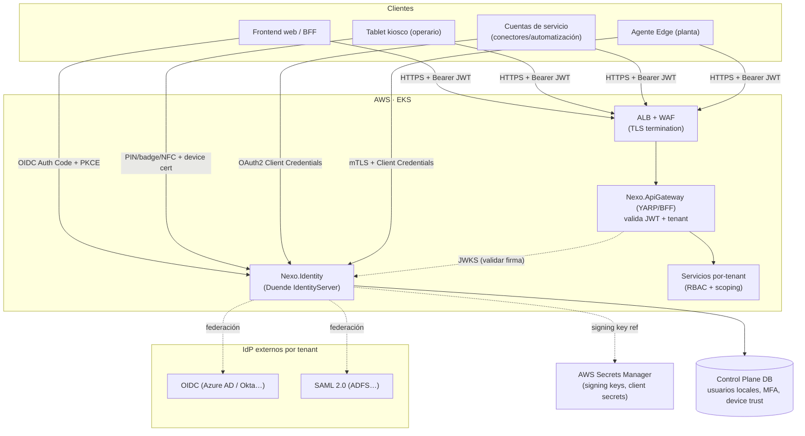
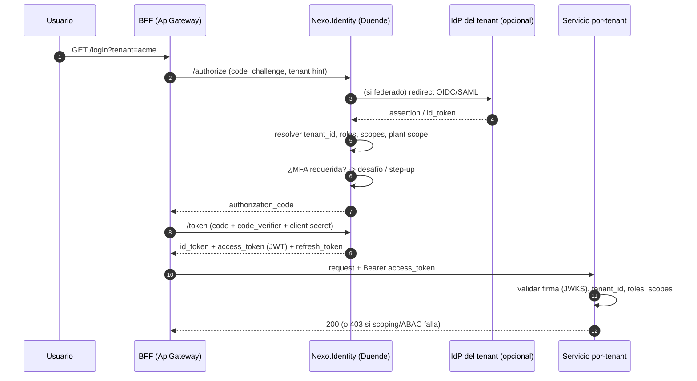
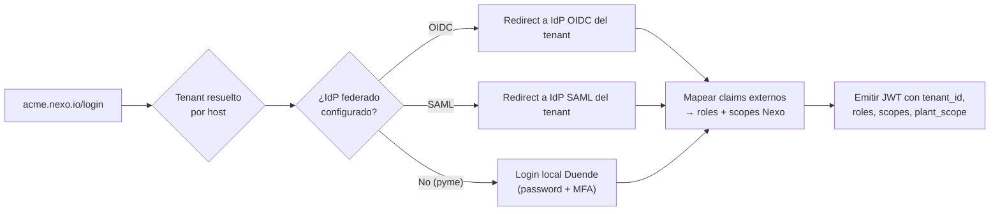
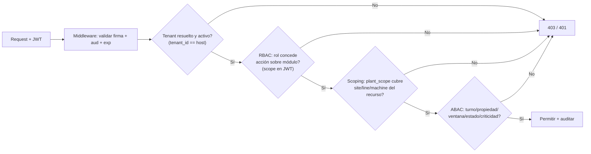
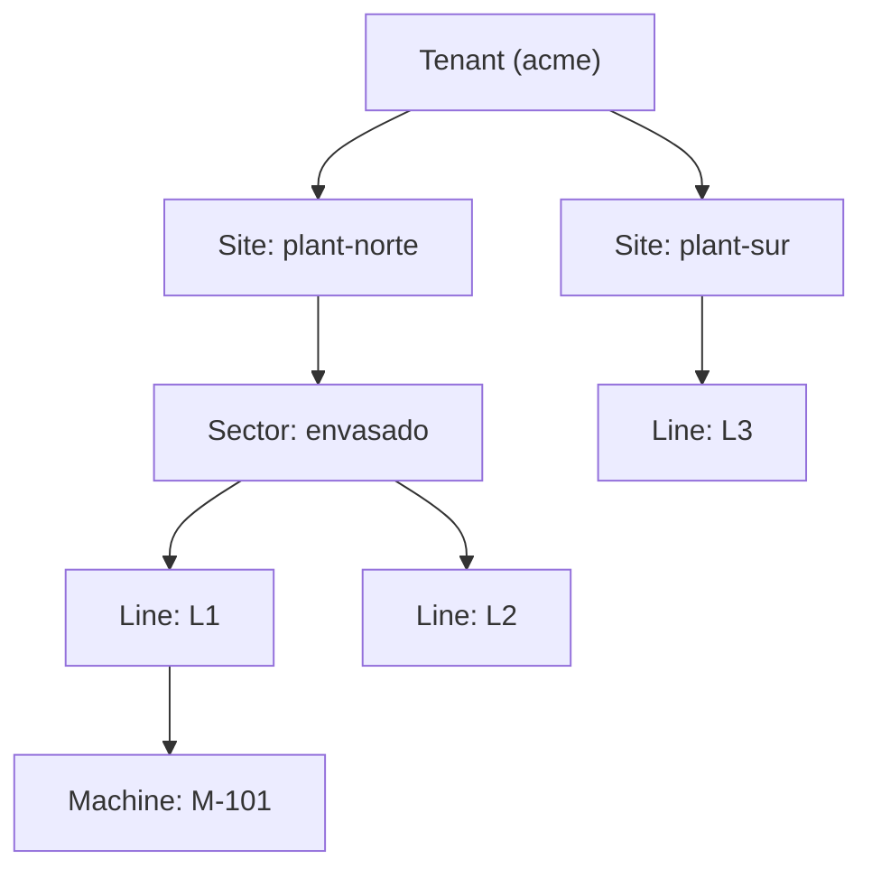
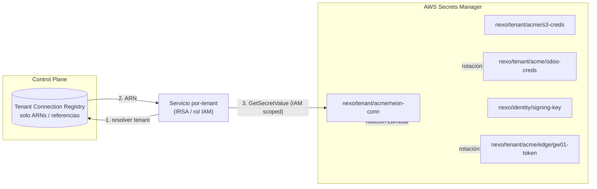
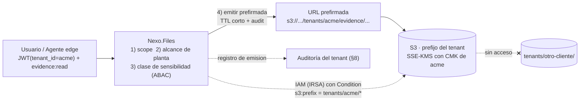
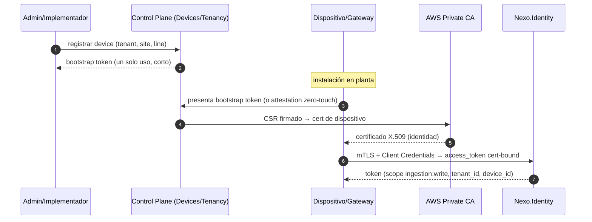
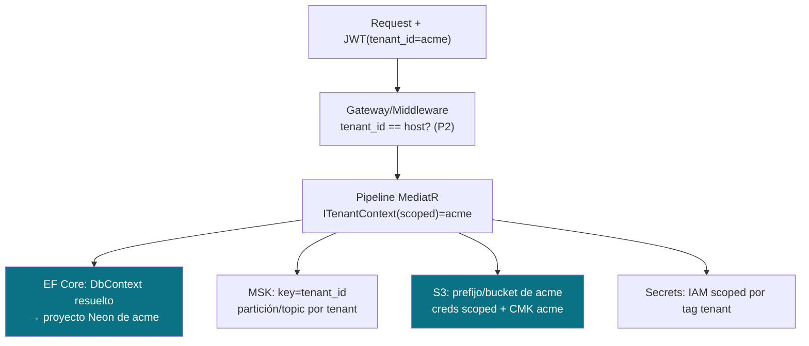

# 07 · Seguridad — AuthN/Z, Secretos, Edge y Aislamiento — Nexo (MVP)

> **Documento:** `design/07-security.md` · **Estado:** Borrador v0.1 · **Actualizado:** 2026-07-11
> **Roles:** Software Architect · Tech Lead
> **Relacionados:** [00-tech-baseline.md](./00-tech-baseline.md) · [01-multi-tenancy-connection.md](./01-multi-tenancy-connection.md) · [02-event-model.md](./02-event-model.md) · [05-edge-agent.md](./05-edge-agent.md) · [08-observability-ops.md](./08-observability-ops.md) · [../specs/specs/security.md](../specs/specs/security.md) · [../specs/specs/users-permissions.md](../specs/specs/users-permissions.md) · [../specs/specs/multi-tenancy.md](../specs/specs/multi-tenancy.md) · [../specs/specs/control-plane.md](../specs/specs/control-plane.md) · [../specs/specs/devices.md](../specs/specs/devices.md) · [../specs/specs/master-data.md](../specs/specs/master-data.md) · [../specs/specs/event-engine.md](../specs/specs/event-engine.md)

## Resumen ejecutivo

Este documento traduce a **diseño técnico** los requisitos funcionales de [`security.md`](../specs/specs/security.md) y
[`users-permissions.md`](../specs/specs/users-permissions.md), respetando el [baseline técnico](./00-tech-baseline.md).
Define **cómo se autentican y autorizan** los usuarios humanos, los operarios en kiosco, las cuentas de servicio y los
agentes edge; **cómo se gestionan secretos y cifrado**; **cómo se asegura el edge** con mTLS y tokens rotables; y **cómo
se hace cumplir técnicamente el aislamiento entre tenants**, con un modelo de amenazas y auditoría.

Los pilares del diseño son:

1. **AuthN con Duende IdentityServer** (`Nexo.Identity`): OIDC/OAuth2 con federación por tenant (OIDC/SAML), cuentas
   locales para pymes, **MFA obligatoria** para roles sensibles y globales, autenticación de piso (PIN/badge/NFC + device
   trust) para el operario en kiosco, y **step-up** para acciones críticas.
2. **AuthZ como cadena de tres filtros** — `tenant` → `RBAC` → `scoping (planta/línea)` con extensión `ABAC` — implementada
   con **políticas y `AuthorizationHandler` de ASP.NET Core**, alimentada por los claims del JWT.
3. **Secretos en AWS Secrets Manager**: el [Tenant Connection Registry](./01-multi-tenancy-connection.md) guarda **solo
   referencias** (ARNs), nunca valores; rotación programada y bajo demanda; resolución en el contexto de tenant correcto.
4. **Cifrado extremo a extremo**: TLS 1.2+ en tránsito, **mTLS** en el borde y en tráfico servicio↔servicio sensible,
   cifrado en reposo (Neon, S3, backups) con KMS.
5. **Edge zero-trust**: identidad por dispositivo, mTLS + JWT de agente rotable, provisioning (zero-touch opcional),
   revocación por dispositivo sin afectar al resto del tenant.
6. **Aislamiento por diseño**: DB-per-tenant (proyecto Neon por tenant) + validación de `tenant_id` en cada capa
   (gateway, pipeline MediatR, EF Core, MSK, S3), defensa en profundidad.
7. **Gobierno de la master data propia** (§4.6): con el **ERP opcional**, los catálogos son de la plataforma, y aparece
   un **eje de permisos nuevo** — quién administra cada catálogo, quién aprueba las **altas al vuelo** y quién resuelve
   los **conflictos de conciliación** con el ERP.
8. **Control de acceso a la evidencia** (§5.4): la evidencia es parte del hecho, y a menudo el dato más sensible del
   sistema (fotos con personas, documentos, firmas). Acceso por scope + alcance de planta, entrega por **URL prefirmada**
   de vida corta y **aislamiento por tenant en S3** con CMK propia.

El alcance es **diseño**: diagramas, tablas de políticas/scopes y **ejemplos ilustrativos** de claims y políticas
ASP.NET Core. La implementación completa vive en el código de `Nexo.Identity` y `Nexo.BuildingBlocks.Web`.

---

## 1. Modelo de identidad y topología de AuthN

### 1.1 Planos de identidad

Coherente con [users-permissions.md §2](../specs/specs/users-permissions.md) y [§4](../specs/specs/control-plane.md), hay
**dos planos de identidad que nunca se mezclan**:

| Plano | Realm en Duende | Emisor (`iss`) | Token | Directorio |
|---|---|---|---|---|
| **Tenant** | `tenant/{slug}` (realm lógico) | `https://id.nexo.io` con claim `tenant_id` | JWT con `tenant_id` | IdP federado del cliente **o** cuentas locales de Nexo |
| **Control Plane** | `global` | `https://id.nexo.io` sin `tenant_id` (o `tenant_id` destino solo en break-glass) | JWT global | Directorio del proveedor (SSO propio) |

> Duende IdentityServer es **single-issuer, multi-tenant lógico**: un único host `Nexo.Identity` sirve todos los realms;
> la separación es por **cliente OIDC**, **esquema de identidad** y **claim `tenant_id`**, no por instancia. Ver §1.4.

### 1.2 Topología de componentes



### 1.3 Flujos OIDC/OAuth2 por tipo de cliente

| Cliente | Flujo OAuth2/OIDC | Motivo | Tokens |
|---|---|---|---|
| **Frontend web / BFF** | **Authorization Code + PKCE** (client público/confidencial vía BFF) | Estándar seguro para SPA/BFF; sin secreto en el browser | `id_token` + `access_token` (JWT) + `refresh_token` (rotativo, en BFF) |
| **Tablet en kiosco** | Authorization Code + PKCE con **factor de piso** (PIN/badge/NFC) sobre **device trust** | Sesión larga de dispositivo enrolado; login rápido de operario | `access_token` de vida corta + `refresh_token` ligado al device |
| **Cuenta de servicio (conector)** | **Client Credentials** | Identidad no humana, sin usuario interactivo | `access_token` (JWT) con `scopes` acotados; sin `refresh_token` |
| **Agente Edge** | **Client Credentials sobre mTLS** (client cert-bound token, RFC 8705) | Identidad por dispositivo, certificado mutuo | `access_token` bound al cert (`cnf.x5t#S256`) |
| **Integración externa (webhook entrante)** | Client Credentials o API key gestionada | M2M de terceros | `access_token` con `scope` mínimo |

> **No usamos** *Resource Owner Password Credentials* (deprecado en OAuth 2.1). El login local de pymes se hace vía la UI
> de login de Duende (Authorization Code), nunca enviando contraseña directo a un endpoint de token.

**Ejemplo de flujo Authorization Code + PKCE (web):**



### 1.4 Federación SSO por tenant (OIDC / SAML)

Cada tenant enterprise puede federar su IdP corporativo. La configuración vive en el **Control Plane** (por tenant) y
Duende la carga dinámicamente:

- **Resolución de tenant en login:** por **subdominio/host** (`acme.nexo.io`) o selección explícita → fija el realm y el
  `tenant_id` **antes** de cualquier decisión (P2 de [users-permissions.md](../specs/specs/users-permissions.md)).
- **OIDC externo:** Duende actúa como *relying party* del IdP del cliente (Azure AD, Okta, Google Workspace…).
- **SAML 2.0:** vía plugin SAML de Duende / componente `Rsk.Saml`; el cliente es el IdP, Nexo el SP.
- **Just-in-Time provisioning:** al primer login federado se crea el usuario con **rol mínimo y sin alcance**; el
  Administrador del tenant lo eleva (mínimo privilegio, P1).
- **Mapeo de claims externos → claims Nexo:** un perfil por tenant traduce grupos/roles del IdP a **roles Nexo** y
  **scopes de planta/línea** (ver Decisión pendiente DS-06 sobre mapeo de grupos).
- **Offboarding:** la baja en el directorio corporativo corta el acceso (sin sesión renovable); refuerza [ciclo de vida
  §8.3](../specs/specs/users-permissions.md).



### 1.5 Cuentas locales (pymes)

Para tenants sin IdP, Duende gestiona cuentas locales con:

- **Política de contraseñas robusta** (longitud mínima, verificación contra listas de comprometidas, hashing con
  **ASP.NET Identity / PBKDF2** o Argon2 vía extensión).
- **MFA obligatoria** para roles sensibles (§2).
- **Bloqueo por intentos** y recuperación con códigos de un solo uso.
- Gobierno por el **Administrador del tenant** (alta/baja, reseteo de MFA), todo auditado.

---

## 2. MFA, kiosco y step-up

### 2.1 Matriz de obligatoriedad de MFA

Deriva de [users-permissions.md §6.2](../specs/specs/users-permissions.md) y [security.md §2.1](../specs/specs/security.md):

| Rol | Plano | MFA | Segundo factor típico |
|---|---|---|---|
| Super Administrador, Soporte, Implementador, Partner | Global | **Obligatoria** | TOTP / WebAuthn (FIDO2) |
| Administrador (tenant), Integraciones | Tenant | **Obligatoria** | TOTP / WebAuthn |
| Producción, Calidad, Mantenimiento, Supervisor | Tenant | **Obligatoria** | TOTP / WebAuthn / push |
| **Operario (kiosco)** | Tenant | **Factor de piso** | PIN/badge/NFC + **device trust** (no teléfono) |
| Gerencia (solo lectura) | Tenant | **Obligatoria** (recomendada) | TOTP / WebAuthn |
| Cuentas de servicio / Edge | Tenant | **No interactiva** | Credencial/clave rotable + mTLS (edge) |

### 2.2 Operario en kiosco (PIN / badge / NFC + device trust)

El operario opera una **tablet compartida en modo kiosco** a pie de línea. Exigir TOTP en teléfono personal rompería el
flujo (guantes, ritmo de producción). El diseño:

1. **Enrolamiento del dispositivo (device trust):** la tablet se enrola como *trusted device* → recibe un **certificado
   de dispositivo** (mTLS) y un `device_id`. El enrolamiento lo hace el Administrador/Supervisor y queda auditado.
2. **Sesión de dispositivo larga + sesión de operario corta:** el dispositivo mantiene una sesión confiable; el operario
   se autentica con **PIN corto**, **badge** o **NFC** para "asumir" una sesión de usuario efímera sobre ese device.
3. **El factor de piso vale solo sobre device confiable:** un PIN/badge sin device enrolado **no** autentica (el device
   es el segundo factor de facto).
4. **Revocación remota:** una tablet perdida se revoca (certificado + device trust) sin cambiar credenciales del turno.
5. **Alcance mínimo:** el operario tiene el scope más chico (P1), lo que acota el riesgo residual.

```mermaid
sequenceDiagram
    autonumber
    participant T as Tablet (device enrolado)
    participant O as Operario
    participant I as Nexo.Identity (Duende)
    T->>I: mTLS handshake (device cert) → sesión de dispositivo
    O->>T: PIN / badge / NFC
    T->>I: /connect/token (device-bound) + factor de piso
    I->>I: validar device trust + factor + tenant + línea
    I-->>T: access_token corto (operario, scope de línea)
    Note over T,I: Refresh ligado al device; revocable por device_id
```

### 2.3 Step-up authentication

Acciones críticas exigen **reautenticación/segundo factor en el momento**, aunque la sesión esté activa
([users-permissions.md §6.2](../specs/specs/users-permissions.md)):

- Ejecutar **OTA/firmware en activo crítico** (ver [devices.md](../specs/specs/devices.md)).
- **Cambio de mapeo ERP** en producción.
- **Break-glass** de Soporte/Super Admin.
- **Cambios masivos de rol/alcance**.

**Diseño técnico:** el `access_token` porta el claim **`acr`** (Authentication Context Class Reference) y **`amr`**
(métodos usados) y un **`auth_time`**. Los endpoints críticos exigen `acr` de nivel elevado y `auth_time` reciente; si no
se cumple, responden **`403` con `WWW-Authenticate: insufficient_user_authentication`** y el cliente dispara un **step-up**
(nuevo `/authorize` con `acr_values=mfa` y `max_age=0`).

```csharp
// Ilustrativo — política de step-up para acciones críticas
options.AddPolicy("StepUpMfa", policy =>
    policy.RequireAssertion(ctx =>
    {
        var acr = ctx.User.FindFirst("acr")?.Value ?? "";
        var authTime = ctx.User.FindFirst("auth_time")?.Value;
        var fresh = long.TryParse(authTime, out var t)
                    && DateTimeOffset.FromUnixTimeSeconds(t) > DateTimeOffset.UtcNow.AddMinutes(-5);
        return acr.Contains("mfa") && fresh; // MFA + reautenticación reciente
    }));
```

---

## 3. Estructura de claims del JWT

El `access_token` emitido por Duende es un **JWT firmado (RS256/ES256)** cuya firma se valida contra el **JWKS** de
`Nexo.Identity`. Estructura ilustrativa para un usuario de tenant:

```json
{
  "iss": "https://id.nexo.io",
  "aud": ["nexo.api", "nexo.production", "nexo.devices"],
  "sub": "u_9f2c...",
  "tenant_id": "acme",
  "roles": ["Supervisor", "Calidad"],
  "scopes": ["production:write", "quality:disposition", "devices:read"],
  "plant_scope": [
    { "site": "plant-norte", "lines": ["L1", "L2"] },
    { "site": "plant-sur",   "lines": ["L3"] }
  ],
  "acr": "mfa",
  "amr": ["pwd", "otp"],
  "auth_time": 1752230400,
  "device_id": null,
  "sid": "sess_7a1b...",
  "exp": 1752234000,
  "iat": 1752230400,
  "jti": "tok_5e8d..."
}
```

**Claims de servicio / edge** (Client Credentials):

```json
{
  "iss": "https://id.nexo.io",
  "aud": ["nexo.ingestion"],
  "sub": "svc_edge_plant-norte-gw01",
  "tenant_id": "acme",
  "client_type": "edge_agent",
  "device_id": "dev_gw01",
  "scopes": ["ingestion:write"],
  "cnf": { "x5t#S256": "b64u-cert-thumbprint" },
  "plant_scope": [{ "site": "plant-norte", "lines": ["L1"] }],
  "exp": 1752232200
}
```

| Claim | Uso técnico | Notas |
|---|---|---|
| `tenant_id` | Resolución de tenant + validación contra host/subdominio | **Nunca** ausente en tokens de tenant; base de todo el aislamiento |
| `roles` | Entrada de RBAC (policies `RequireRole`/handlers) | Roles canónicos de [users-permissions.md §3](../specs/specs/users-permissions.md) |
| `scopes` | Autorización fina por endpoint (verbo/módulo) | Ver matriz §5 |
| `plant_scope` | **Scoping** planta/línea/máquina (claim custom compacto) | Se compara contra el recurso; ver §4.3 |
| `acr` / `amr` / `auth_time` | Step-up y política de MFA | §2.3 |
| `device_id` / `cnf` | Kiosco y edge (token cert-bound, RFC 8705) | Revocación por dispositivo |
| `sid` / `jti` | Revocación de sesión / token; correlación en auditoría | `jti` en logs de auditoría |

> **`plant_scope` como claim vs. lookup:** para tenants con jerarquías grandes, un `plant_scope` extenso infla el token.
> Diseño: si el número de asignaciones supera un umbral, el token porta una **referencia** (`scope_ref`) y el servicio
> resuelve el árbol de alcance desde la DB del tenant (cacheado). Ver Decisión pendiente **DS-02**.

**Ciclo de vida de tokens y revocación:**

- `access_token`: **vida corta** (5–15 min). Se valida solo por firma + claims (stateless) en el camino caliente.
- `refresh_token`: **rotativo** (one-time use), en el BFF (web) o ligado al device (kiosco); reuso detectado ⇒ revoca la
  familia.
- **Revocación:** lista de `sid`/`jti` revocados publicada por `Nexo.Identity` (endpoint + evento MSK
  `identity.session.revoked`); los servicios consultan una **cache de revocación** para acciones sensibles. El cierre de
  sesión forzado ante incidente revoca por `sub`, `sid` o `device_id`.

---

## 4. Autorización (AuthZ): RBAC + scoping + ABAC

### 4.1 Cadena de decisión (tres filtros)

Implementa la cadena de [users-permissions.md §2.2](../specs/specs/users-permissions.md) con el pipeline de ASP.NET Core:



**Por qué en este orden:** primero lo barato e infalible (tenant), luego lo estructural (rol/scope/alcance), y por último
lo contextual y costoso (ABAC que puede requerir leer estado del recurso). Protege rendimiento a escala.

### 4.2 Requisitos y handlers de ASP.NET Core (ilustrativos)

**Validación del bearer y tenant** (en `Nexo.BuildingBlocks.Web`):

```csharp
// Program.cs — validación de JWT emitido por Duende
builder.Services.AddAuthentication(JwtBearerDefaults.AuthenticationScheme)
    .AddJwtBearer(o =>
    {
        o.Authority = "https://id.nexo.io";      // descubre JWKS
        o.MapInboundClaims = false;               // conservar nombres de claim originales
        o.TokenValidationParameters = new()
        {
            ValidateIssuer = true,
            ValidateAudience = true,
            ValidAudiences = new[] { "nexo.api", "nexo.production", "nexo.devices" },
            ValidateLifetime = true,
            RoleClaimType = "roles",
            NameClaimType = "sub"
        };
    });

// Middleware: coherencia tenant_id (claim) == tenant del host/subdominio
app.UseMiddleware<TenantConsistencyMiddleware>();  // 403 si no coinciden (P2)
```

**Requisito de scope + scoping planta/línea:**

```csharp
// Requisito compuesto
public sealed record ScopedRequirement(string RequiredScope) : IAuthorizationRequirement;

public sealed class ScopedHandler : AuthorizationHandler<ScopedRequirement, IScopedResource>
{
    protected override Task HandleRequirementAsync(
        AuthorizationHandlerContext ctx, ScopedRequirement req, IScopedResource resource)
    {
        // 1) RBAC/scope: el token debe portar el scope requerido
        var scopes = ctx.User.FindAll("scopes").Select(c => c.Value);
        if (!scopes.Contains(req.RequiredScope)) return Task.CompletedTask; // deny-by-default (P7)

        // 2) Scoping: plant_scope del token cubre el site/line del recurso
        var plantScope = PlantScope.Parse(ctx.User.FindAll("plant_scope"));
        if (plantScope.Covers(resource.Site, resource.Line, resource.Machine))
            ctx.Succeed(req);

        return Task.CompletedTask; // si no cubre → permanece denegado
    }
}
```

**Registro de políticas por scope:**

```csharp
builder.Services.AddAuthorization(o =>
{
    o.AddPolicy("Production.Write", p => p.AddRequirements(new ScopedRequirement("production:write")));
    o.AddPolicy("Quality.Disposition", p => p.AddRequirements(new ScopedRequirement("quality:disposition")));
    o.AddPolicy("Devices.Ota", p => p.Requirements.Add(new ScopedRequirement("devices:ota")));
    // step-up encadenado para acciones críticas
    o.AddPolicy("Devices.Ota.Critical", p =>
    {
        p.AddRequirements(new ScopedRequirement("devices:ota"));
        p.RequireAssertion(StepUp.FreshMfa); // §2.3
    });
});
```

**Uso en endpoint (resource-based authorization para el scoping):**

```csharp
app.MapPost("/v1/production/records", async (
        CreateProductionRecord cmd, IAuthorizationService authz, ClaimsPrincipal user, IMediator mediator) =>
{
    var resource = new ScopedResource(cmd.Site, cmd.Line, cmd.Machine);
    var result = await authz.AuthorizeAsync(user, resource, "Production.Write");
    if (!result.Succeeded) return Results.Forbid();          // 403 + auditar
    return Results.Ok(await mediator.Send(cmd));             // ABAC se evalúa en el handler MediatR
})
.RequireAuthorization();
```

**ABAC en el pipeline MediatR (behavior):** las condiciones que requieren leer estado del recurso (ventana de edición,
propiedad, turno activo, estado sincronizado, criticidad) se evalúan en un `IPipelineBehavior` de
`Nexo.BuildingBlocks.Application`, ya con el `DbContext` del tenant resuelto:

```csharp
public sealed class AbacBehavior<TReq, TRes> : IPipelineBehavior<TReq, TRes>
    where TReq : IAbacGuarded
{
    public async Task<TRes> Handle(TReq req, RequestHandlerDelegate<TRes> next, CancellationToken ct)
    {
        foreach (var rule in req.AbacRules)                 // p.ej. EditWindow, Ownership, ShiftOpen, NotSynced
            if (!await rule.IsSatisfiedAsync(_tenantCtx, _db, ct))
                throw new AbacDeniedException(rule.Reason);  // → 403 + auditoría con razón
        return await next();
    }
}
```

### 4.3 Modelo del `plant_scope` y jerarquía



- El `plant_scope` es un **conjunto de subárboles**: `{ site, lines[] , machines[]? }`. `Covers()` implementa cobertura
  jerárquica (un scope de `site` cubre sus líneas; un scope de `tenant` — p.ej. Gerencia/Administrador — cubre todo).
- **Gerencia/Administrador:** `plant_scope: [{ "site": "*" }]` (tenant completo, lectura o CRUD según rol).
- **Un usuario, varias asignaciones:** el token concatena todos los subárboles de los role bindings del usuario.

### 4.4 Matriz scope ↔ endpoint (extracto)

Traducción de la [Matriz de permisos §5.2](../specs/specs/users-permissions.md) a **scopes OAuth** y endpoints REST del
[contrato de servicios](./04-service-contracts.md). `★` = sujeto a scoping planta/línea; `†` = ABAC.

| Módulo | Endpoint (ej.) | Scope requerido | Roles que lo portan | Notas |
|---|---|---|---|---|
| Producción | `POST /v1/production/records` | `production:write` ★† | Operario†, Supervisor, Producción | Operario: estado borrador + propiedad + turno (ABAC) |
| Producción | `POST /v1/production/records/{id}:confirm` | `production:confirm` ★ | Supervisor, Producción | SoD: quien confirma ≠ quien capturó |
| Calidad | `POST /v1/quality/dispositions` | `quality:disposition` ★ | **Solo Calidad** | Acción exclusiva (P4) |
| Scrap | `POST /v1/scrap` | `scrap:write` ★† | Operario†, Supervisor, Calidad(clasif.) | — |
| Paradas | `POST /v1/downtime/{id}:close` | `downtime:close` ★ | Mantenimiento, Supervisor | — |
| Dispositivos | `POST /v1/devices/{id}:ota` | `devices:ota` ★† | Mantenimiento | **Step-up** si activo crítico (†) |
| Integraciones | `POST /v1/connectors/{id}:retry-sync` | `connectors:sync` | Integraciones, Administrador | — |
| Trazabilidad | `GET /v1/traceability/**` | `traceability:read` ★ | Todos (según alcance) | Inmutable, solo lectura (P6) |
| Auditoría | `GET /v1/audit/**` | `audit:read` ★ | Admin, Supervisor★, … | Nadie `U/D` (P6) |
| Usuarios (tenant) | `POST /v1/users` | `identity:admin` | **Solo Administrador** | — |
| Config (sites/líneas) | `PUT /v1/config/lines/{id}` | `config:write` ★ | Administrador (+delegación) | — |
| **Master data** | `POST /v1/masterdata/{catalog}` | `masterdata:{catalog}:write` | Según catálogo (§4.6) | Deny-by-default por catálogo, no un permiso único |
| **Master data** | `POST /v1/masterdata/drafts/{id}:approve` | `masterdata:draft:approve` | Supervisor, Administrador | Aprobación de **alta al vuelo** (§4.6.3); SoD: aprobador ≠ autor |
| **Master data** | `POST /v1/masterdata/conflicts/{id}:resolve` | `masterdata:conflict:resolve` | Integraciones, Administrador | Conciliación con ERP (§4.6.4); **step-up** |
| **Master data** | `PUT /v1/masterdata/governance/{catalog}` | `masterdata:governance` | **Solo Administrador** | Cambia la fuente de verdad de un catálogo; **step-up** + auditoría |
| **Evidencia** | `GET /v1/evidence/{id}:url` | `evidence:read` ★† | Según sensibilidad (§5.4) | Devuelve **URL prefirmada** de vida corta, nunca el binario por el API |
| **Evidencia** | `POST /v1/evidence` | `evidence:write` ★ | Operario★, Supervisor, Calidad, agente edge | Escritura por prefirmada contra el prefijo del tenant |

**Control Plane (roles globales):** scopes con prefijo `cp:` (`cp:tenants:admin`, `cp:licensing`, `cp:observability`,
`cp:break-glass`). Emitidos en tokens **sin `tenant_id`**; el acceso a dato operativo requiere **break-glass** (§7).

### 4.5 Cuentas de servicio

- **Identidad no humana** (Client Credentials): conectores ERP y automatizaciones autentican con `client_id`/secreto
  rotable; **sin MFA interactiva**. Rol **Integraciones** acotado, `scopes` mínimos.
- El **secreto de cliente** vive en Secrets Manager (§5); rotación programada. La cuenta se **audita igual que un humano**
  (`sub = svc_...`).
- **Nunca** reutilizan credenciales de un administrador humano (P1). El token porta `tenant_id` y `scopes` reducidos.
- **Edge:** ver §6 (mTLS + token cert-bound por dispositivo).

### 4.6 Administración de master data (eje de permisos nuevo)

Con el **ERP opcional** y la **master data propia** de la plataforma
([`master-data.md`](../specs/specs/master-data.md)), aparece un eje de permisos que antes no existía: cuando los
catálogos eran espejos de solo lectura del ERP, no había nada que autorizar. Ahora el tenant **da de alta y edita sus
propios catálogos**, y eso abre tres decisiones de autorización distintas que **no** deben resolverse con un único
permiso de "administrador".

> **Principio:** administrar un catálogo **no** es una acción operativa. Cambiar una unidad de medida o una tarifa
> altera cómo se interpretan **todos** los eventos futuros —y, si se hiciera mal, la lectura del negocio entero—.
> Por eso el eje es **por catálogo**, no por módulo, y es **deny-by-default** como todo lo demás (P7).

#### 4.6.1 Scopes por catálogo

Un scope por catálogo y por verbo, `masterdata:{catalog}:{read|write}`. La granularidad por catálogo es deliberada: el
riesgo de que Producción cargue un producto **no** es el mismo que el de que cargue una tarifa horaria.

| Catálogo | Scope de escritura | Rol que lo porta por defecto | Por qué ese rol |
|---|---|---|---|
| **Unidades de medida** | `masterdata:uom:write` | **Solo Administrador** | Base de toda cuantificación; una conversión mal cargada corrompe cada número de la plataforma |
| **Productos / Ítems** | `masterdata:item:write` | Administrador, Producción | Es el sujeto de la producción; Producción necesita autonomía para no frenar la planta |
| **Insumos** | `masterdata:item:write` | Administrador, Producción | Comparten identidad de ítem con productos ([`master-data.md`](../specs/specs/master-data.md) §2.3) |
| **Procesos y tareas** | `masterdata:process:write` | Administrador, Supervisor | Define tiempos estándar, pesos y **evidencia requerida**: cambia el denominador de las métricas |
| **Personas (dimensión operativa)** | `masterdata:people:write` | Administrador | Roza datos personales; se separa del alta de **usuario de acceso** (`identity:admin`) |
| **Centros de costo y tarifas** | `masterdata:cost:write` | **Solo Administrador** | Dato económico sensible; ver 4.6.2 |
| **Clientes y pedidos** | `masterdata:customer:write` | Administrador, Producción | Opcional por tenant; en modo conectado suele quedar solo lectura |
| **Motivos (reason codes)** | `masterdata:reason:write` | Administrador, Supervisor, Calidad | Cada dominio conoce sus motivos |
| **Jerarquía física (activos)** | `config:write` ★ | Administrador (+delegación) | Ya cubierto por el scope de configuración (§4.4); sujeto a scoping de planta |
| **Gobierno del catálogo** | `masterdata:governance` | **Solo Administrador** | Cambiar la fuente de verdad de un catálogo (Nexo ↔ ERP) es la decisión más peligrosa del eje: **step-up** obligatorio |

- **Scoping de planta:** los catálogos son **del tenant**, no de una planta, así que la mayoría **no** lleva `★`. La
  excepción es la jerarquía física, que sí se scopea por planta/línea. Un supervisor de una planta no debería poder
  reescribir el catálogo de productos de toda la empresa: cuando el tenant lo exija, el scope se acota por ABAC
  (regla de propiedad de catálogo, ver DS-10).
- **Lectura amplia, escritura angosta:** `masterdata:*:read` lo porta todo rol con actividad operativa (hay que poder
  elegir un producto para declarar producción); la escritura es la que se reparte con cuidado.

#### 4.6.2 Datos económicos: tarifas y costos

Las tarifas y los costos unitarios **valorizan el trabajo** ([`event-engine.md`](../specs/specs/event-engine.md) §7.6) y
son, junto con la evidencia, el dato más sensible del tenant.

- **Scope propio** (`masterdata:cost:write`), **nunca** incluido en roles operativos.
- **Sin edición destructiva:** los atributos económicos se **versionan con vigencia**, no se editan
  ([`master-data.md`](../specs/specs/master-data.md) R7). Técnicamente, el endpoint de edición **no existe**: solo hay
  alta de una nueva versión con fecha de vigencia. Esto elimina por diseño el ataque de "cambiar la tarifa para
  reescribir el costo histórico".
- **Auditoría reforzada:** toda alta de vigencia registra `sub`, valor anterior, valor nuevo, fecha de vigencia y
  motivo. Es una acción de las que se revisan en un litigio.

#### 4.6.3 Alta al vuelo desde la captura

El operario declara un ítem, un motivo o un insumo que no existe en el catálogo. Sin control, esto convierte el
catálogo en un basurero de duplicados en semanas ([`master-data.md`](../specs/specs/master-data.md) §5.1).

| Regla | Diseño técnico |
|---|---|
| **Desactivada por defecto** | Feature flag por tenant y **por catálogo**; el default es `off` |
| **Nunca crea un maestro definitivo** | El alta al vuelo crea un registro en estado **borrador**, no seleccionable por otros usuarios y no válido para valorización |
| **Permiso propio** | `masterdata:draft:create` — lo porta el Operario; **no** implica `masterdata:{catalog}:write` |
| **Aprobación con separación de funciones** | `masterdata:draft:approve` (Supervisor / Administrador). **El aprobador no puede ser el autor**: se valida `sub(aprobador) ≠ sub(autor)` como regla ABAC, igual que la confirmación de producción (§4.4) |
| **Caducidad** | Un borrador no aprobado dentro de una ventana se **archiva** y su evento queda marcado como "pendiente de normalizar" |
| **Auditoría** | Alta, aprobación y rechazo se auditan con autor, aprobador, catálogo y motivo del rechazo |

```csharp
// Ilustrativo — separación de funciones en la aprobación de un alta al vuelo
o.AddPolicy("MasterData.Draft.Approve", p =>
{
    p.AddRequirements(new ScopedRequirement("masterdata:draft:approve"));
    p.RequireAssertion(ctx =>
    {
        var approver = ctx.User.FindFirst("sub")?.Value;
        var draft    = ctx.Resource as IMasterDataDraft;
        return draft is not null && draft.CreatedBy != approver;   // SoD: aprobador ≠ autor
    });
});
```

#### 4.6.4 Conflictos de conciliación con el ERP

Al **conectar un ERP a un tenant que ya venía operando standalone**
([`master-data.md`](../specs/specs/master-data.md) §3.3.1), la conciliación produce vínculos dudosos y registros
divergentes que **alguien tiene que resolver a mano**. Es una acción de altísimo impacto: vincular mal dos ítems
mezcla la historia de dos productos.

| Acción | Scope | Rol | Salvaguarda |
|---|---|---|---|
| Ver la **bandeja de conflictos** | `masterdata:conflict:read` | Integraciones, Administrador, Supervisor (lectura) | — |
| **Confirmar un vínculo** propuesto por código exacto | `masterdata:conflict:resolve` | Integraciones, Administrador | Auditado |
| **Confirmar un vínculo** propuesto por denominación (inferido) | `masterdata:conflict:resolve` | Integraciones, Administrador | **Nunca automático**: confirmación humana explícita ([`master-data.md`](../specs/specs/master-data.md) §3.3.1) |
| **Cambiar la fuente de verdad** de un catálogo | `masterdata:governance` | **Solo Administrador** | **Step-up** (§2.3) + notificación al tenant |
| **Desconectar el ERP** (volver a standalone) | `masterdata:governance` + `connectors:sync` | **Solo Administrador** | Step-up; el dato **se retiene**, nunca se borra |

- **La cuenta de servicio del conector NO resuelve conflictos.** El rol Integraciones como **cuenta de servicio**
  (§4.5) tiene `connectors:sync` para sincronizar, pero la resolución de un conflicto es una **decisión humana**: se
  exige un `sub` de persona, no `svc_*`. Un conector que resolviera conflictos solo podría hacerlo "en favor del ERP",
  que es exactamente lo que [`master-data.md`](../specs/specs/master-data.md) R3 prohíbe.
- **Step-up en el cambio de mapeo ERP** ya estaba previsto en §2.3; acá se extiende al **cambio de gobierno de un
  catálogo**, que es su equivalente de mayor alcance.

---

## 5. Secretos y cifrado

### 5.1 Gestión de secretos (AWS Secrets Manager)

Coherente con [00 §7](./00-tech-baseline.md), [01](./01-multi-tenancy-connection.md) y
[security.md §4.2](../specs/specs/security.md): **el Connection Registry y toda configuración guardan solo referencias
(ARNs); los valores viven en Secrets Manager.**



| Secreto | Ruta (convención) | Rotación | Consumidor |
|---|---|---|---|
| Cadena de conexión Neon (tenant) | `nexo/tenant/{id}/neon-conn` | Programada + on-demand | Servicios por-tenant (EF Core) |
| Credenciales S3 (prefijo tenant) | `nexo/tenant/{id}/s3-creds` | Programada | Files/Media |
| Credenciales ERP (Odoo) | `nexo/tenant/{id}/odoo-creds` | Programada + incidente | `Nexo.Connectors` |
| Canales de notificación | `nexo/tenant/{id}/notify/*` | Programada | `Nexo.Notifications` |
| Signing key de Duende | `nexo/identity/signing-key` | Rotación con solape (JWKS) | `Nexo.Identity` |
| Client secrets (svc/edge) | `nexo/tenant/{id}/edge/{dev}-token` | Rotación por dispositivo | Edge / conectores |

**Reglas de diseño:**

- **Acceso IAM por servicio con IRSA** (IAM Roles for Service Accounts en EKS): cada pod asume un rol con política
  `secretsmanager:GetSecretValue` acotada por **ruta/tag de tenant**; un servicio no puede leer secretos de otro tenant.
- **Resolución bajo demanda y cache corta** (TTL) en memoria; **nunca** se persiste el valor ni se loguea (redacción en
  Serilog). El **uso queda trazado** (auditoría + CloudTrail).
- **Rotación:** Lambda de rotación de Secrets Manager; para Neon, coordina con la [rotación de credenciales del proyecto
  Neon](./01-multi-tenancy-connection.md). El JWKS de Duende publica **dos claves** durante el solape (rollover sin corte).
- **Revocación inmediata** ante compromiso: nueva versión del secreto + invalidación de cache (evento
  `identity.secret.rotated`).

### 5.2 Cifrado en tránsito

| Tramo | Protocolo | Notas |
|---|---|---|
| Cliente ↔ ALB | **TLS 1.2+** (cert ACM) | WAF + terminación TLS en ALB |
| ALB ↔ servicios (in-mesh) | TLS / mTLS | mTLS servicio↔servicio sensible (Identity, Tenancy) — ver DS-03 (mesh) |
| **Edge ↔ nube** | **mTLS** (outbound) | Cert por dispositivo; §6 |
| Servicio ↔ Neon | TLS (público) / **PrivateLink** en prod | `sslmode=require`/`verify-full` |
| Servicio ↔ MSK | TLS + **IAM auth** | Dentro de la VPC |
| Servicio ↔ S3 | TLS | Endpoints VPC (gateway) |
| Servicio ↔ ERP (Odoo) | TLS | Credenciales por tenant |

> **Sin canales en claro** en ningún tramo ([security.md §4.1](../specs/specs/security.md)).

### 5.3 Cifrado en reposo y gestión de claves

| Dato | Cifrado | Clave |
|---|---|---|
| DB de tenant (Neon) | Cifrado en reposo del proyecto Neon | Gestionado (Neon/AWS) |
| Control Plane DB | Cifrado en reposo | KMS |
| S3 (evidencias/media) | SSE-KMS, **por prefijo/bucket de tenant** | **CMK por tenant** (aislamiento; habilita crypto-shredding) |
| Backups (Neon/S3) | Cifrados | KMS |
| Secrets Manager | Cifrado con KMS | CMK dedicada |
| Buffer store-and-forward (edge) | Cifrado local | Clave del dispositivo |

- **KMS** gestiona el ciclo de vida (rotación anual de CMK, políticas de clave por servicio/tenant).
- **CMK por tenant** en S3 habilita **crypto-shredding**: destruir la clave inutiliza los datos (borrado seguro al fin de
  la retención; ver [control-plane.md](../specs/specs/control-plane.md) y Preguntas abiertas de la spec).
- **BYOK** para enterprise queda como **DS-05** (Decisión pendiente).

### 5.4 Control de acceso a la evidencia (Files / Media)

La **evidencia es ciudadano de primera clase del evento**
([`event-engine.md`](../specs/specs/event-engine.md) §5): el binario (foto, archivo, firma, frame de cámara) vive en
Files/Media y el evento porta **solo la referencia**. Esa separación es también la línea de defensa: **el binario nunca
viaja por el API de negocio**, y el permiso sobre el evento **no** implica permiso sobre su evidencia.

#### 5.4.1 Por qué la evidencia necesita su propio régimen

| Riesgo | Por qué es distinto del resto del dato |
|---|---|
| **Personas en el encuadre** | Una foto de un puesto o un frame de cámara puede captar operarios: es dato personal, con régimen de finalidad y retención declarado ([`digital-twin.md`](../specs/specs/digital-twin.md) §6.2) |
| **Documentos sensibles** | Certificados, planos, especificaciones de cliente, actas firmadas: propiedad intelectual del tenant o de su cliente |
| **Firmas** | Sustentan responsabilidad y no repudio; su exposición habilita suplantación |
| **Volumen y superficie** | Es el único dato que sale del sistema como **objeto descargable**, con URL propia — la superficie de fuga más ancha |

#### 5.4.2 Reglas de acceso

1. **Deny-by-default con scope propio.** Leer evidencia requiere `evidence:read`, que **no** viene incluido en
   `traceability:read` ni en los scopes de dominio. Un rol puede ver que una tarea se terminó y **no** poder ver la foto.
2. **Alcance de planta/línea (`★`).** El scoping se evalúa contra el **activo de contexto** de la evidencia, que
   siempre existe por el invariante de binding ([`digital-twin.md`](../specs/specs/digital-twin.md) §5). Sin activo no
   hay evidencia servible.
3. **Clasificación de sensibilidad por tipo (ABAC, `†`).** Cada artefacto declara su clase; la clase decide si basta el
   scope o hace falta algo más:

   | Clase | Ejemplos | Requisito adicional |
   |---|---|---|
   | `operational` | Foto de avance, frame de conteo | Solo `evidence:read` + alcance |
   | `quality` | Foto de punto de control, medición de inspección | `evidence:read` + alcance; retención larga |
   | `personal` | Encuadre que puede captar personas | Finalidad declarada + acceso restringido a Supervisor/Calidad/Administrador; auditoría reforzada |
   | `contractual` | Firmas, actas, certificados, documentos de conformidad | `evidence:read` + **step-up** para descarga; auditoría con `jti` |

4. **Entrega solo por URL prefirmada de vida corta.** El API devuelve una **URL prefirmada** (minutos, no horas) contra
   el prefijo S3 del tenant; **nunca** el binario por el endpoint de negocio ni una URL permanente. La emisión de cada
   URL se **audita** (quién, qué artefacto, cuándo, con qué motivo).
5. **Escritura igualmente acotada.** La subida (operario, app de piso o **agente edge**, ver
   [05 §5.5](./05-edge-agent.md)) usa una prefirmada de escritura contra el prefijo del tenant, con `Content-Length` y
   tipo MIME acotados. **Ningún cliente porta credenciales de S3.**
6. **Inmutabilidad.** Los objetos de evidencia son **write-once**: no se sobrescriben ni se borran por API. Reemplazar
   una foto es **agregar** otra con su evento de corrección ([`event-engine.md`](../specs/specs/event-engine.md) §5.3).
   Se apoya en versionado + *object lock* donde el régimen del cliente lo exija.
7. **Integridad verificable.** La referencia porta el **hash** del artefacto, calculado en el punto de captura; se
   revalida al recibir y al servir. Un hash que no coincide **no** se sirve: se reporta como incidente de integridad.

#### 5.4.3 Aislamiento por tenant en S3



- **Prefijo exclusivo por tenant** (`tenants/<tenant_id>/`), ya modelado en el Registry
  ([01 §6.3](./01-multi-tenancy-connection.md)). La policy IAM del servicio lleva `Condition` sobre el prefijo del
  tenant **resuelto en el request**: una prefirmada para otro tenant es **imposible de emitir**, no solo indebida.
- **CMK por tenant** (§5.3): además del aislamiento lógico, el cifrado por cliente habilita **crypto-shredding** en el
  offboarding — destruir la clave inutiliza toda la evidencia de ese tenant de una sola vez.
- **Sin listado cruzado:** el servicio nunca hace `ListBucket` fuera del prefijo del tenant; los identificadores de
  artefacto son **opacos** (no enumerables ni derivables del id de evento).
- **Retención por clase**, alineada con [`event-engine.md`](../specs/specs/event-engine.md) §5.5: firmas y documentos
  con retención larga; frames de cámara con retención corta y **promoción** a larga solo si el evento se asocia a un
  defecto, una parada o una disputa. La política de retención de artefactos `personal` se coordina con la pregunta
  abierta de privacidad de [`digital-twin.md`](../specs/specs/digital-twin.md) (ver **DS-11**).

---

## 6. Seguridad del edge

Deriva de [security.md §5](../specs/specs/security.md) y [devices.md](../specs/specs/devices.md); el diseño del agente vive
en [05-edge-agent.md](./05-edge-agent.md). Principio: **el edge inicia siempre la conexión (outbound), nunca expone puertos
entrantes en planta**, y cada dispositivo es una identidad propia.

### 6.1 Identidad por dispositivo (mTLS + token rotable)

- Cada gateway/dispositivo tiene un **certificado X.509 propio** (identidad) emitido por una **CA privada de Nexo**
  (AWS Private CA), asociado a `tenant_id` + `site` + `device_id`.
- El edge autentica con **mTLS** y obtiene un **`access_token` cert-bound** (RFC 8705, claim `cnf.x5t#S256`): el token solo
  vale presentado sobre la misma conexión mTLS ⇒ un token robado sin el cert es inútil.
- **Token de agente rotable** de vida corta; el certificado es el ancla de confianza de larga vida (rotación periódica).

### 6.2 Provisioning (zero-touch opcional)



- **Bootstrap token de un solo uso** (o **attestation** para zero-touch: TPM/secure element del hardware industrial).
- El alta asocia el dispositivo a **un único tenant** y su planta/línea; sus datos se enrutan **solo** a la DB de ese
  tenant (particiones MSK por `tenant_id`).

### 6.3 Rotación y revocación

- **Rotación** de certificados/tokens programada; el token de agente rota sin intervención (refresh sobre mTLS).
- **Revocación por dispositivo:** revocar el certificado (CRL/OCSP de la Private CA) + invalidar tokens por `device_id`
  ⇒ el dispositivo comprometido queda fuera **sin afectar al resto del tenant** ni cambiar credenciales del turno.
- **Store-and-forward seguro:** buffer local **cifrado** ante cortes; reenvío con **deduplicación** por `dedup_key` del
  [Evento canónico](./02-event-model.md) (sin pérdida ni duplicado). Backlog observado en [08](./08-observability-ops.md).
- **Firmware/OTA firmado y verificado** con rollback: detalle en [devices.md](../specs/specs/devices.md); la ejecución
  requiere `devices:ota` + **step-up** si el activo es crítico (§2.3, §4.4).

---

## 7. Aislamiento entre tenants (enforcement técnico)

El aislamiento es una **propiedad de la topología** (DB-per-tenant / proyecto Neon por tenant) **más** controles de
aplicación en cada capa: defensa en profundidad, un solo fallo no expone otro tenant.



| Capa | Enforcement técnico | Falla contenida |
|---|---|---|
| **Borde** | `TenantConsistencyMiddleware`: `tenant_id` (claim) debe igualar host/subdominio → 403 | Token de un tenant usado en otro host |
| **Aplicación** | `ITenantContext` (scoped) propaga `tenant_id`; behaviors bloquean queries sin tenant | Bug de filtro / falta de `WHERE tenant` (no aplica: DB separada) |
| **Datos** | **Proyecto Neon por tenant**: la cadena de conexión resuelta apunta a **otra base física** | Consulta jamás cruza al dato de otro tenant |
| **Mensajería** | Key de partición = `tenant_id`; consumers validan `tenant_id` del envelope | Fuga entre streams / noisy neighbor |
| **Storage** | Prefijo/bucket por tenant + credenciales de alcance limitado + **CMK por tenant** | Bucket cruzado |
| **Evidencia** | Prefirmadas de vida corta emitidas **solo** contra el prefijo del tenant resuelto + identificadores opacos + scope `evidence:read` (§5.4) | Descarga de evidencia de otro cliente o enumeración de artefactos |
| **Secretos** | IAM (IRSA) acotado por ruta/tag de tenant | Lectura de secreto ajeno |
| **Control Plane** | Sin `tenant_id`; nunca dato operativo; break-glass auditado | Cuenta global no ve dato del cliente por defecto |

**Break-glass (acceso de emergencia):** Soporte/Super Admin acceden a dato de un tenant solo con **justificación escrita,
consentimiento/registro del tenant, duración limitada, caducidad automática y notificación** al Administrador
([users-permissions.md §9](../specs/specs/users-permissions.md)). Técnicamente: token global con `tenant_id` **destino
explícito** + scope `cp:break-glass` + **step-up**; toda la sesión se audita en la **auditoría global** y la del tenant.

---

## 8. Auditoría

Coherente con [security.md §6](../specs/specs/security.md) y [users-permissions.md §9](../specs/specs/users-permissions.md):

| Ámbito | Dónde | Qué registra | Inmutabilidad |
|---|---|---|---|
| **Auditoría por tenant** | Servicio **Audit**, DB del tenant | quién/qué/cuándo/sobre qué; login, cambios de rol, edición fuera de ventana, disposiciones, OTA | **Inmutable** (P6): solo append; correcciones por evento compensatorio |
| **Auditoría global** | Control Plane | alta/baja/suspensión de tenants, licencias, accesos de Soporte/break-glass | Inmutable |

- **Atribución de identidad** (contra repudio, T11): cada registro lleva `sub`, `tenant_id`, `roles`, `scope`, `jti`,
  `correlation_id`, resultado y **razón** (en denegaciones ABAC).
- **Correlación** con [08-observability-ops.md](./08-observability-ops.md): los logs de auditoría comparten
  `tenant_id`/`correlation_id` pero **no** se mezclan entre clientes.
- **Inmutabilidad técnica:** tabla append-only + (opcional) sellado por hash encadenado; alineado con el Event Store de
  [traceability.md](../specs/specs/traceability.md).

---

## 9. Modelo de amenazas (amenaza / mitigación)

Extiende el modelo de [security.md §8](../specs/specs/security.md) con el **enforcement técnico** de este diseño.
Referencia STRIDE entre paréntesis.

| # | Amenaza (STRIDE) | Vector | Mitigación técnica en el diseño |
|---|---|---|---|
| T1 | Fuga entre tenants (Information Disclosure) | Bug de filtro, escalada | **DB-per-tenant (Neon)** + `TenantConsistencyMiddleware` + `ITenantContext` + IAM/S3/MSK por tenant (§7) |
| T2 | Robo de credenciales de conexión (I.D.) | Secreto en token/log/código | **Secrets Manager** (solo ARNs en Registry), IRSA scoped, redacción en logs, rotación (§5.1) |
| T3 | Acceso no autorizado a cuentas (Spoofing) | Phishing, credenciales robadas | **MFA** obligatoria + SSO federado + `access_token` corto + `refresh` rotativo con detección de reuso (§2, §3) |
| T4 | Abuso del Control Plane (Elevation of Privilege) | Cuenta global comprometida | Separación de planos, **break-glass** con step-up y auditoría, MFA WebAuthn, mínimo privilegio (§7) |
| T5 | Dispositivo edge comprometido (Spoofing/Tampering) | Firmware alterado, cert robado | **mTLS + token cert-bound**, provisioning con identidad única, **revocación por device**, OTA firmado (§6) |
| T6 | Interceptación / MITM (I.D.) | Tráfico en claro | **TLS 1.2+ extremo a extremo + mTLS** en edge y servicio↔servicio sensible (§5.2) |
| T7 | Manipulación del historial (Tampering/Repudiation) | Alterar eventos/auditoría | Auditoría/Event Store **inmutables (append-only)** + `dedup_key`; corrección por compensación (§8, P6) |
| T8 | DoS / noisy neighbor (Denial of Service) | Picos de eventos, tenant abusivo | Particiones MSK por tenant + backpressure + autoscaling + **proyecto Neon aislado** + quotas de licencia (§7, [08](./08-observability-ops.md)) |
| T9 | Inyección vía integraciones/ERP (Tampering) | Datos maliciosos externos | **ACL** en `Nexo.Connectors` + validación/normalización + credenciales por tenant + cuenta de servicio acotada (§4.5) |
| T10 | Pérdida de datos (Denial of Service) | Fallo infra / error humano | Backup/restore por tenant, cifrado de backups, recuperación granular ([08](./08-observability-ops.md)) |
| T11 | Repudio de acciones (Repudiation) | Usuario niega actuar | Auditoría con **atribución** (`sub`,`jti`,`acr`) por tenant y global (§8) |
| T12 | Storage mal configurado (I.D.) | Bucket/URL accesible | Prefijo/bucket por tenant + **CMK por tenant** + URLs prefirmadas temporales (§5.3) |
| T13 | Token robado / replay (Spoofing) | Bearer interceptado o filtrado | Vida corta, **cert-bound** (edge/kiosco), `aud` estricta, revocación por `sid`/`jti`/`device_id` (§3) |
| T14 | Confusión de tenant (Elevation of Privilege) | Token de tenant A hacia recurso de tenant B | Coherencia `tenant_id`==host + validación de coherencia usuario/recurso/tenant antes de autorizar (§4, §7) |
| T15 | Escalada de privilegios ABAC (E.o.P.) | Editar fuera de ventana/propiedad | **AbacBehavior** en MediatR con reglas de ventana/propiedad/turno/estado/criticidad (§4.2) |
| T16 | **Manipulación de la master data** (Tampering) | Cambiar una tarifa, una unidad o una conversión para alterar costo, productividad o progreso ya reportados | Scope **por catálogo** (§4.6.1), datos económicos **versionados con vigencia** sin endpoint de edición (§4.6.2), histórico que **no se recalcula** ([`master-data.md`](../specs/specs/master-data.md) R6/R7), auditoría con valor anterior/nuevo |
| T17 | **Contaminación del catálogo** (Tampering/DoS funcional) | Alta al vuelo abusiva que llena el catálogo de duplicados y degrada toda la analítica | Alta al vuelo **off por defecto**, estado borrador no valorizable, **aprobación con SoD** y caducidad (§4.6.3) |
| T18 | **Resolución indebida de conflictos de conciliación** (E.o.P.) | Vincular dos ítems distintos al conectar el ERP, mezclando la historia de dos productos | Confirmación **humana** obligatoria (nunca `svc_*`), `masterdata:conflict:resolve` separado de `connectors:sync`, **step-up** en cambio de gobierno, auditoría (§4.6.4) |
| T19 | **Fuga de evidencia** (Information Disclosure) | URL prefirmada larga o compartida, enumeración de artefactos, foto con personas servida a quien no corresponde | Prefirmadas de **minutos** + identificadores opacos + `evidence:read` con alcance y **clase de sensibilidad** ABAC + step-up para `contractual` + auditoría de cada emisión (§5.4) |

---

## 10. Decisiones pendientes

| # | Pregunta | Contexto | Default provisional |
|---|---|---|---|
| DS-01 | **Estándares de cumplimiento objetivo** (SOC 2, ISO 27001, GDPR-like, es-AR/industrial) y fase del roadmap | Pregunta abierta 1 de [security.md](../specs/specs/security.md) | MVP: buenas prácticas + auditoría inmutable; certificación en V1 |
| DS-02 | **`plant_scope` en token vs. lookup por referencia** para jerarquías grandes | Tamaño del JWT a escala | Claim compacto; `scope_ref` + cache si supera umbral (§3) |
| DS-03 | **Service mesh / mTLS interno** (Istio/Linkerd vs. mTLS puntual) | mTLS servicio↔servicio (§5.2) | mTLS puntual en Identity/Tenancy; evaluar mesh en V1 |
| DS-04 | **WebAuthn/FIDO2 vs. TOTP** como segundo factor por defecto | UX vs. resistencia a phishing | Soportar ambos; recomendar WebAuthn para roles globales |
| DS-05 | **BYOK / crypto-shredding** para enterprise | Pregunta abierta 4 de [security.md](../specs/specs/security.md) | Plataforma gestiona KMS; CMK por tenant en S3; BYOK en V1 |
| DS-06 | **Mapeo de grupos IdP → roles/scopes Nexo** | Federación (§1.4), pregunta abierta 6 de [users-permissions.md](../specs/specs/users-permissions.md) | Perfil de mapeo por tenant; JIT con rol mínimo |
| DS-07 | **Break-glass y residencia de datos** (Soporte global vs. regionalizado) | Pregunta abierta 7 de [users-permissions.md](../specs/specs/users-permissions.md) | Break-glass global auditado; regionalizar según residencia en V1 |
| DS-08 | **Roles personalizados por tenant** (composición de scopes) | Pregunta abierta 1 de [users-permissions.md](../specs/specs/users-permissions.md) | Catálogo cerrado de 8 roles en MVP; custom en fase avanzada |
| DS-09 | **Plan de respuesta a incidentes / notificación de brechas** | Pregunta abierta 7 de [security.md](../specs/specs/security.md) | Runbook base en [08](./08-observability-ops.md); formalizar en V1 |
| DS-10 | **¿Los scopes de master data se acotan por planta?** | §4.6.1; un supervisor de una planta editando el catálogo de toda la empresa | MVP: catálogos **del tenant**, sin scoping de planta (salvo jerarquía física); regla ABAC de propiedad de catálogo si un tenant lo exige. Coordinar con pregunta abierta 2 de [master-data.md](../specs/specs/master-data.md) |
| DS-11 | **Régimen de la evidencia `personal`** (encuadres que captan personas) | §5.4.2; pregunta abierta 11 de [digital-twin.md](../specs/specs/digital-twin.md) y 6 de [event-engine.md](../specs/specs/event-engine.md) | Finalidad declarada por punto de visión + acceso restringido + retención corta por defecto; formalizar régimen legal en V1 (ligado a DS-01) |
| DS-12 | **Alta al vuelo en el MVP** | §4.6.3; pregunta abierta 3 de [master-data.md](../specs/specs/master-data.md) | **Off por defecto**; si se habilita, borrador + aprobación con SoD. Confirmar si entra al MVP o se difiere a V1 |

---

## 11. Relación con otros documentos

- **[00-tech-baseline.md](./00-tech-baseline.md):** stack, Duende, Secrets Manager, OTel, EKS, MSK, Neon.
- **[01-multi-tenancy-connection.md](./01-multi-tenancy-connection.md):** Connection Registry (referencias), resolución de
  tenant, provisioning Neon.
- **[02-event-model.md](./02-event-model.md):** envelope, `dedup_key`, particiones por `tenant_id`.
- **[05-edge-agent.md](./05-edge-agent.md):** agente edge, store-and-forward, OTA.
- **[08-observability-ops.md](./08-observability-ops.md):** auditoría/observabilidad correlacionadas, health del edge, DR.
- **[../specs/specs/master-data.md](../specs/specs/master-data.md):** catálogos propios, modos standalone/conectado, precedencia y conciliación — origen del eje de permisos de §4.6.
- **[../specs/specs/event-engine.md](../specs/specs/event-engine.md):** la evidencia como parte del evento, tipos y retención — origen del régimen de §5.4.
- **[../specs/specs/security.md](../specs/specs/security.md)** y **[../specs/specs/users-permissions.md](../specs/specs/users-permissions.md):** requisitos funcionales que este diseño implementa.
- **[../specs/specs/multi-tenancy.md](../specs/specs/multi-tenancy.md)** · **[../specs/specs/control-plane.md](../specs/specs/control-plane.md)** · **[../specs/specs/devices.md](../specs/specs/devices.md).**
