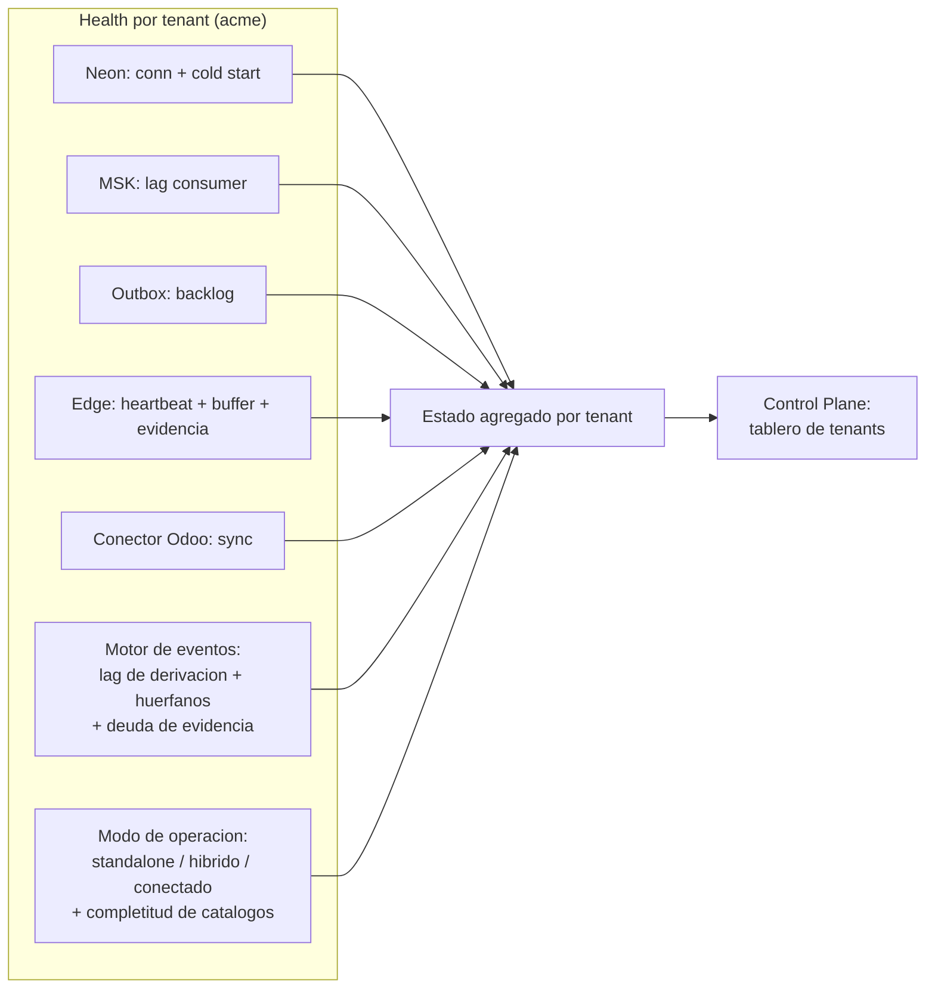
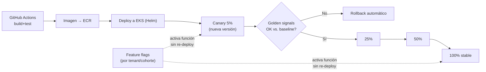
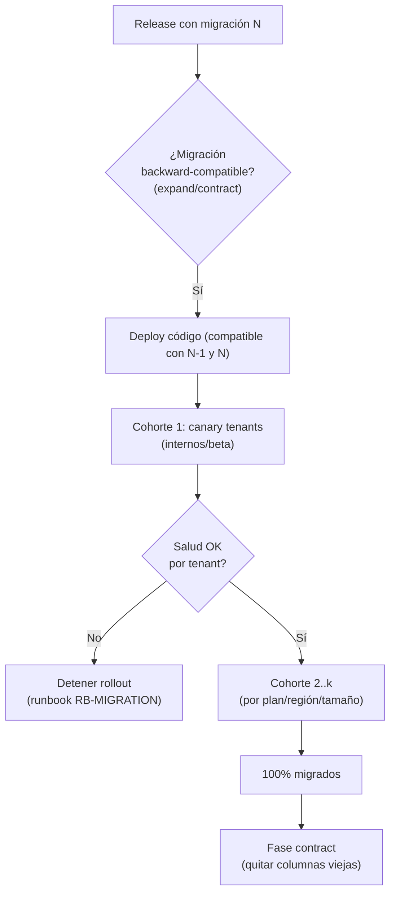
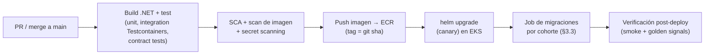

# 08 · Observabilidad y Operaciones — OTel, Despliegue, SLO/DR — Nexo (MVP)

> **Documento:** `design/08-observability-ops.md` · **Estado:** Borrador v0.1 · **Actualizado:** 2026-07-11
> **Roles:** Software Architect · Tech Lead
> **Relacionados:** [00-tech-baseline.md](./00-tech-baseline.md) · [01-multi-tenancy-connection.md](./01-multi-tenancy-connection.md) · [02-event-model.md](./02-event-model.md) · [05-edge-agent.md](./05-edge-agent.md) · [06-odoo-connector.md](./06-odoo-connector.md) · [07-security.md](./07-security.md) · [../specs/specs/architecture.md](../specs/specs/architecture.md) · [../specs/specs/scalability.md](../specs/specs/scalability.md) · [../specs/specs/control-plane.md](../specs/specs/control-plane.md) · [../specs/specs/multi-tenancy.md](../specs/specs/multi-tenancy.md) · [../specs/specs/event-engine.md](../specs/specs/event-engine.md) · [../specs/specs/master-data.md](../specs/specs/master-data.md) · [../specs/specs/digital-twin.md](../specs/specs/digital-twin.md)

## Resumen ejecutivo

Este documento define la **observabilidad** y la **operación** de Nexo para el MVP, respetando el
[baseline técnico](./00-tech-baseline.md): **OpenTelemetry** (trazas/métricas/logs) con correlación por
`tenant_id`/`correlation_id`, despliegue en **EKS con Helm por servicio**, releases **canary + feature flags**,
**job de migraciones por cohorte**, CI/CD **GitHub Actions → ECR → EKS**, **IaC con Terraform**, y un marco de
**SLO / on-call / runbooks / DR**.

Los objetivos:

1. **Ver el estado real por tenant y por edge**, no solo agregados: golden signals + métricas de negocio, health de
   conectividad Neon/MSK, backlog de store-and-forward, estado de conectores/sync, **salud del motor de eventos**
   (Capa 4) y **modo de operación** del tenant (standalone vs. conectado).
2. **Observabilidad del Control Plane**: tableros de estado de tenants/servicios/conectores/edges, alertas proactivas,
   logs centralizados **segmentados por tenant** (sin mezclar clientes — refuerza el aislamiento de [07](./07-security.md)).
3. **Desplegar con seguridad a escala multi-tenant**: canary + flags, migraciones por cohorte con estado por tenant,
   IaC reproducible.
4. **Operar con SLOs claros**, on-call mínimo viable, runbooks accionables, y **DR con backup/restore por tenant** que
   aprovecha el aislamiento de proyecto Neon por tenant (mitiga *noisy neighbor*).

El alcance es **diseño**: arquitectura de telemetría, config de OTel (ilustrativa), diagramas de despliegue/release,
tablas de SLO y runbooks. La implementación vive en `deploy/` (Helm/Terraform) y `Nexo.BuildingBlocks.Observability`.

---

## 1. Arquitectura de observabilidad (OpenTelemetry)

Toda la telemetría se emite con el **SDK de OpenTelemetry** (.NET) y se exporta vía **OTLP** a un
**OpenTelemetry Collector** (DaemonSet + Gateway en EKS), que enruta a los backends (CloudWatch/Grafana, ver
[00 §3](./00-tech-baseline.md)).

```mermaid
flowchart TB
    subgraph EKS["Amazon EKS"]
        subgraph Pod["Servicio (.NET) por-tenant / Control Plane"]
            APP["App + OTel SDK\n(ASP.NET, EF, MSK auto-instr.)"]
        end
        COLd["OTel Collector\n(DaemonSet por nodo)"]
        COLg["OTel Collector\n(Gateway/deployment)\nbatch, tail-sampling, PII scrub"]
    end
    subgraph Edge["Planta"]
        AG["Agente Edge\n(OTel: métricas/logs propios)"]
    end
    subgraph Back["Backends"]
        TR["Trazas (Tempo/X-Ray)"]
        ME["Métricas (Prometheus/AMP)"]
        LO["Logs (Loki/CloudWatch)"]
        DASH["Grafana\n(dashboards + alertas)"]
    end
    APP -->|"OTLP gRPC"| COLd --> COLg
    AG -->|"OTLP (outbound, mTLS)"| COLg
    COLg --> TR & ME & LO
    TR & ME & LO --> DASH
```



### 1.1 Señales y fuentes

| Señal | Fuente / auto-instrumentación | Exportador | Backend |
|---|---|---|---|
| **Trazas** | ASP.NET Core, `HttpClient`, gRPC, **Npgsql/EF Core**, **MassTransit/Kafka**, MediatR (custom `ActivitySource`) | OTLP | Tempo / AWS X-Ray |
| **Métricas** | `Meter` de runtime + custom (golden signals + negocio) | OTLP / Prometheus | Prometheus / AMP |
| **Logs** | **Serilog estructurado** → sink OTLP (bridge) | OTLP | Loki / CloudWatch |

### 1.2 Correlación por `tenant_id` / `correlation_id`

**Requisito no negociable del baseline** ([00 §7](./00-tech-baseline.md)): **toda** traza, métrica y log lleva
`tenant_id` y `correlation_id`.

- **Propagación:** `ITenantContext` (scoped) y un `CorrelationMiddleware` inyectan `tenant_id`/`correlation_id` en el
  **`Activity.Baggage`** y en el `LogContext` de Serilog. Se propagan por HTTP/gRPC (headers W3C `traceparent` +
  `baggage`) y por **eventos MSK** (headers del envelope, ver [02-event-model.md](./02-event-model.md)).
- **Enriquecimiento:** un `Processor` de OTel y un `Enricher` de Serilog garantizan que ninguna señal salga sin
  `tenant_id`.
- **Segmentación:** los backends indexan por `tenant_id` como label/atributo ⇒ un dashboard/consulta **nunca mezcla
  datos de dos clientes** (refuerza el aislamiento de [07 §7](./07-security.md)); las consultas de Soporte se acotan por
  tenant.

```csharp
// Ilustrativo — bootstrap de OpenTelemetry en un servicio .NET
builder.Services.AddOpenTelemetry()
    .ConfigureResource(r => r.AddService("nexo.production")
        .AddAttributes(new[] { new KeyValuePair<string, object>("deployment.environment", env) }))
    .WithTracing(t => t
        .AddAspNetCoreInstrumentation()
        .AddHttpClientInstrumentation()
        .AddGrpcClientInstrumentation()
        .AddNpgsql()                                   // EF Core / Npgsql
        .AddSource("MassTransit")                      // Kafka/MSK
        .AddSource("Nexo.*")                           // ActivitySources de dominio
        .AddProcessor<TenantBaggageProcessor>()        // sella tenant_id/correlation_id
        .SetSampler(new ParentBasedSampler(new TraceIdRatioBasedSampler(0.1)))
        .AddOtlpExporter())
    .WithMetrics(m => m
        .AddAspNetCoreInstrumentation()
        .AddRuntimeInstrumentation()
        .AddMeter("Nexo.Business")                     // métricas de negocio
        .AddOtlpExporter());

// Serilog → OTLP con enriquecimiento obligatorio
Log.Logger = new LoggerConfiguration()
    .Enrich.FromLogContext()
    .Enrich.With<TenantEnricher>()                     // tenant_id + correlation_id siempre
    .WriteTo.OpenTelemetry(o => o.Endpoint = otlpEndpoint)
    .CreateLogger();
```

```yaml
# Ilustrativo — OTel Collector (gateway): batch, tail-sampling y scrub de PII
processors:
  batch: {}
  attributes/scrub:                       # nunca telemetría con secretos/PII (07 §5)
    actions:
      - key: db.statement
        action: delete
      - key: http.request.header.authorization
        action: delete
  tail_sampling:                          # conservar 100% de errores y trazas lentas
    policies:
      - name: errors
        type: status_code
        status_code: { status_codes: [ERROR] }
      - name: slow
        type: latency
        latency: { threshold_ms: 1000 }
      - name: sample-rest
        type: probabilistic
        probabilistic: { sampling_percentage: 10 }
exporters:
  otlp/tempo: {}
  prometheusremotewrite/amp: {}
  loki: {}
service:
  pipelines:
    traces:  { receivers: [otlp], processors: [attributes/scrub, tail_sampling, batch], exporters: [otlp/tempo] }
    metrics: { receivers: [otlp], processors: [batch], exporters: [prometheusremotewrite/amp] }
    logs:    { receivers: [otlp], processors: [attributes/scrub, batch], exporters: [loki] }
```

### 1.3 Golden signals + métricas de negocio

| Categoría | Métrica | Tipo | Dimensiones |
|---|---|---|---|
| **Latency** | `http.server.duration` | histogram | `service`, `route`, `tenant_id` |
| **Traffic** | `http.server.request.count` / `kafka.consumer.records` | counter | `service`, `tenant_id` |
| **Errors** | `http.server.errors` (5xx/4xx) / `consumer.faults` | counter | `service`, `tenant_id`, `error.type` |
| **Saturation** | CPU/mem, pool de conexiones, **lag de consumer MSK**, cola outbox | gauge | `service`, `tenant_id`, `topic` |
| **Negocio** | `production.records.ingested` | counter | `tenant_id`, `site`, `line` |
| **Negocio** | `edge.events.buffered` (backlog store-and-forward) | gauge | `tenant_id`, `device_id` |
| **Negocio** | `sync.jobs.pending` / `sync.jobs.failed` (Odoo) | gauge/counter | `tenant_id`, `connector` |
| **Negocio** | `ingestion.lag_seconds` (edge→nube) | gauge | `tenant_id`, `device_id` |
| **Negocio** | `oee.calc.duration` / read-model rebuild lag | histogram/gauge | `tenant_id`, `line` |
| **Capa 4** | `eventengine.derivation.lag_seconds` (evento admitido → métrica derivada disponible) | gauge | `tenant_id`, `metric`, `site` |
| **Capa 4** | `eventengine.events.unresolved_asset` (eventos sin **Activo** resoluble → cuarentena) | gauge/counter | `tenant_id`, `site`, `device_id` |
| **Capa 4** | `eventengine.events.unattributed_task` (eventos sin **tarea/ejecución** imputable) | gauge | `tenant_id`, `site`, `imputation_mode` |
| **Capa 4** | `eventengine.evidence.debt` (tareas terminadas con evidencia incompleta) | gauge | `tenant_id`, `site`, `evidence_policy` |
| **Capa 4** | `eventengine.recalc.pending` (ventanas por recalcular tras eventos tardíos) | gauge | `tenant_id`, `window` |
| **Capa 4** | `eventengine.metrics.provisional_ratio` (métricas provisorias vs. consolidadas) | gauge | `tenant_id`, `metric` |
| **Master data** | `tenant.operation_mode` (0=standalone · 1=híbrido · 2=conectado) | gauge | `tenant_id` |
| **Master data** | `masterdata.catalog.completeness` (catálogos mínimos poblados / requeridos) | gauge | `tenant_id`, `catalog` |
| **Master data** | `masterdata.conflicts.open` / `masterdata.drafts.pending` | gauge | `tenant_id`, `catalog` |

### 1.4 Health por tenant y por edge

Cada servicio expone `/health/live` y `/health/ready` ([00 §7](./00-tech-baseline.md)); las sondas cubren dependencias
críticas por tenant y el estado del edge:

| Check | Qué valida | Señal |
|---|---|---|
| `neon.connectivity` | Conexión a la **DB del tenant** (proyecto Neon) | ready/degraded |
| `neon.scale_up` | Tiempo de *cold start* del proyecto Neon (scale-to-zero) | latencia primera query |
| `msk.connectivity` | Productor/consumidor MSK vivo, **lag** aceptable | ready/lag gauge |
| `outbox.backlog` | Tamaño de la tabla outbox por tenant (pendiente de publicar) | gauge |
| `edge.connectivity` | Último *heartbeat* del gateway (edge outbound) | up/down por `device_id` |
| `edge.buffer_backlog` | **Backlog store-and-forward** (eventos sin reenviar) | gauge por `device_id` |
| `edge.evidence_debt` | Artefactos de evidencia pendientes de subida en el borde ([05 §5.5](./05-edge-agent.md)) | gauge por `device_id` |
| `connector.sync_status` | Estado del conector Odoo, jobs pendientes/fallidos | ok/degraded/failed |
| `eventengine.derivation` | **Lag de derivación** de métricas de la Capa 4 (§1.5) | ok/degraded/lag gauge |
| `eventengine.orphans` | Eventos **sin activo** o **sin tarea** resolubles (§1.5) | gauge |
| `eventengine.evidence` | **Deuda de evidencia** del tenant (§1.5) | gauge |
| `tenant.operation_mode` | **Modo de operación** y completitud de master data (§1.6) | standalone/híbrido/conectado + gauge |



### 1.5 Salud del motor de eventos (Capa 4)

El **Motor de Eventos** ([event-engine.md](../specs/specs/event-engine.md)) es la capa que produce el dato sobre el que
el cliente decide: progreso, cuellos de botella, tiempos muertos, productividad y costo. Su degradación **no se ve** en
los golden signals: el API responde 200, la latencia es buena, no hay errores… y el tablero del cliente muestra un
número viejo, incompleto o construido sobre eventos que no se pudieron atribuir. Por eso necesita señales propias.

> **Regla:** una métrica de la Capa 4 puede estar **equivocada sin que nada falle**. Las tres señales de abajo son las
> que hacen visible esa clase de falla.

#### 1.5.1 Lag de derivación de métricas

**Qué mide:** el tiempo entre que un evento es admitido y que la métrica que lo incluye está disponible para consulta.
Es el equivalente de Capa 4 del `ingestion.lag_seconds`, pero del lado de la **derivación**, no de la ingesta.

| Señal | Detalle |
|---|---|
| `eventengine.derivation.lag_seconds` | Por métrica (`progreso`, `cuellos`, `tiempos_muertos`, `productividad`, `costo`) y por tenant. Un supervisor que mira el tablero está viendo dato con este retraso |
| `eventengine.recalc.pending` | Ventanas pendientes de recálculo por **eventos tardíos** ([event-engine.md](../specs/specs/event-engine.md) §8). Un pico tras una reconexión es **esperado**; una cola que no drena es un incidente |
| `eventengine.recalc.duration` | Costo del reproceso; su crecimiento anticipa saturación antes de que el lag lo muestre |
| `eventengine.metrics.provisional_ratio` | Proporción de métricas en estado **provisorio** (la ventana aún admite tardíos) vs. **consolidado**. Alto y sostenido = se está comunicando como firme lo que todavía se mueve |

- **Se mide por tenant**, no solo agregado: un tenant con un corte largo de planta genera un backlog de recálculo que no
  afecta a los demás (blast radius = 1, igual que el resto del modelo).
- **Se correlaciona con el edge:** un pico de `eventengine.recalc.pending` que sigue a un `edge.buffer_backlog` alto es
  el comportamiento correcto del sistema, no una alerta. La alerta se dispara cuando **no** hay backlog que lo explique.

#### 1.5.2 Eventos sin activo o sin tarea resolubles

Las dos formas en que un evento llega y **no se puede usar**:

| Señal | Qué significa | Dueño de la resolución |
|---|---|---|
| `eventengine.events.unresolved_asset` | El evento no resuelve un **Activo dueño**: viola el invariante de binding ([digital-twin.md](../specs/specs/digital-twin.md) §5) y queda en **cuarentena**. No entra al flujo productivo, **no se descarta** | Integraciones / Implementador: crear el binding o el Activo lógico faltante |
| `eventengine.events.unattributed_task` | El evento tiene activo pero **no imputa** a una tarea/ejecución ([event-engine.md](../specs/specs/event-engine.md) §4.3). Alimenta métricas de activo, **no** de progreso | Supervisor: imputación diferida o corrección |
| `eventengine.imputation.inferred_ratio` | Proporción de eventos imputados **por inferencia** (ventana temporal) sobre el total. Alto = las métricas se sostienen en conjeturas | Supervisor / Implementador |

- **La cuarentena es una tarea operativa con responsable, no un log**
  ([digital-twin.md](../specs/specs/digital-twin.md) N6): la métrica alimenta una bandeja, y el SLA de resolución es
  parte del acompañamiento de implantación.
- **Es el mejor indicador temprano de implantación incompleta.** Un tenant recién provisionado con
  `unresolved_asset` creciente no tiene un problema técnico: tiene señales sin binding, es decir, implantación a medias.
- **Se cruza con el edge:** el agente ya reporta su contador local de cuarentena en el heartbeat
  ([05 §4.5](./05-edge-agent.md)); la nube consolida ambos para distinguir "el borde no supo atribuirlo" de "la nube lo
  rechazó".

#### 1.5.3 Deuda de evidencia

**Qué mide:** tareas terminadas **sin su evidencia completa**
([event-engine.md](../specs/specs/event-engine.md) §5.4). Es a la vez una métrica de negocio y una señal de salud
técnica, y hay que saber distinguir las dos causas:

| Causa | Cómo se distingue | Acción |
|---|---|---|
| **Disciplina de captura** | La evidencia nunca se capturó: no hay artefacto ni en el borde ni en la nube | Producto/proceso: recordatorio, política más estricta, revisión de la tarea |
| **Deuda técnica de subida** | El artefacto existe en el borde (`edge.evidence_debt` > 0) pero no materializó su referencia | Operación: enlace saturado, cuota de evidencia llena, subida fallando ([05 §5.5](./05-edge-agent.md)) |

| Señal | Dimensiones |
|---|---|
| `eventengine.evidence.debt` | `tenant_id`, `site`, `evidence_policy` (bloqueante / diferida / opcional) |
| `eventengine.evidence.pending_materialization` | Referencias admitidas pendientes de materializar, con antigüedad |
| `edge.evidence_debt` | `tenant_id`, `device_id` — contraparte en el borde (§1.4) |
| `evidence.integrity_failures` | Hash que no coincide al materializar o al servir → incidente de integridad ([07 §5.4](./07-security.md)) |

> **Por qué es una señal de primera:** en las tareas con política **obligatoria bloqueante**, la deuda de evidencia
> **frena la producción** (la tarea no alcanza su criterio de terminación). Un problema de subida en el borde se
> convierte, sin intermediarios, en una planta detenida.

### 1.6 Modo de operación por tenant (standalone vs. conectado)

Con el **ERP opcional** ([master-data.md](../specs/specs/master-data.md)), dos tenants con la misma versión del producto
pueden estar en situaciones operativas **completamente distintas**, y las alertas que valen para uno son ruido para el
otro. El modo de operación deja de ser un dato comercial y pasa a ser **una dimensión de observabilidad**.

| Señal | Qué expone |
|---|---|
| `tenant.operation_mode` | **standalone** (sin conector activo) · **híbrido** (gobierno repartido por catálogo) · **conectado** (el ERP gobierna los catálogos que le corresponden) |
| `masterdata.catalog.governance` | Por catálogo: fuente de verdad declarada (Nexo / ERP), última sincronización, si hay divergencias pendientes |
| `masterdata.catalog.completeness` | Catálogos mínimos poblados sobre requeridos: unidades, productos, insumos, procesos, personas, centros de costo |
| `masterdata.conflicts.open` | Registros en estado **Divergente** esperando resolución humana ([master-data.md](../specs/specs/master-data.md) §4.3) |
| `masterdata.drafts.pending` | Altas al vuelo en borrador esperando aprobación ([07 §4.6.3](./07-security.md)) |
| `masterdata.mode_transition` | Transición en curso standalone → conectado (o inversa), con estado de la conciliación |

**Por qué importa operacionalmente:**

- **Cambia qué alertas tienen sentido.** "0 sync en X horas" es un incidente P3 en un tenant conectado y **no existe**
  en uno standalone. Sin esta dimensión, el on-call recibe ruido de la mitad de la flota.
- **Cambia el diagnóstico de una métrica ausente.** Si el costo real no se muestra, en modo standalone la causa
  probable es **falta de tarifas cargadas** ([master-data.md](../specs/specs/master-data.md) §7.6) y no un fallo del
  motor de eventos. La completitud de catálogos es la que permite decir cuál de las dos es.
- **Hace visible la implantación a medias.** Un tenant activo hace tres semanas, en standalone, con
  `catalog.completeness` estancada en 40 % y sin procesos cargados, **no está usando el producto** aunque su salud
  técnica sea verde. Es una señal de riesgo de abandono, no un incidente — y llega antes que cualquier reclamo.
- **La transición entre modos es un momento crítico.** Conectar un ERP a un tenant que venía operando dispara la
  conciliación; `masterdata.conflicts.open` sin drenar significa catálogos bloqueados y operación degradada.

---

## 2. Observabilidad del Control Plane

El **Control Plane** ([control-plane.md](../specs/specs/control-plane.md)) concentra la vista del proveedor: **gobernar la
plataforma sin ver el dato del cliente** (solo estado/metadatos; el dato operativo requiere break-glass, [07 §7](./07-security.md)).

### 2.1 Tableros de estado

| Tablero | Contenido | Fuente |
|---|---|---|
| **Tenants** | Estado (activo/suspendido/degradado), plan, uso vs. quota, salud agregada | Métricas + Tenancy |
| **Servicios** | Golden signals por microservicio y por versión (canary vs. stable) | Métricas OTel |
| **Conectores** | Estado de sync Odoo por tenant, jobs fallidos, antigüedad de último sync | `Nexo.Connectors` |
| **Edges** | Gateways por tenant: online/offline, backlog de eventos, **backlog de evidencia**, versión de firmware | Health edge |
| **Migraciones** | Estado del rollout por cohorte y por tenant (aplicada/pendiente/error) | Job de migraciones (§3.3) |
| **Motor de eventos** | Por tenant: lag de derivación por métrica, cola de recálculo, eventos **sin activo**/sin tarea, **deuda de evidencia**, ratio provisorio/consolidado | Métricas Capa 4 (§1.5) |
| **Modo de operación** | Por tenant: standalone/híbrido/conectado, gobierno por catálogo, completitud de master data, conflictos y borradores abiertos | Master Data + Connectors (§1.6) |

### 2.2 Alertas proactivas

| Alerta | Condición (ejemplo) | Severidad | Runbook |
|---|---|---|---|
| Edge caído | `edge.connectivity` down > 10 min | P2 | RB-EDGE-DOWN |
| Backlog store-and-forward alto | `edge.buffer_backlog` > umbral por N min | P2 | RB-EDGE-BACKLOG |
| Lag de ingestión | `ingestion.lag_seconds` p95 > SLO | P2 | RB-INGEST-LAG |
| Sync Odoo fallando | `sync.jobs.failed` creciente / 0 sync en X h | P3 | RB-SYNC-FAIL |
| Neon degradado | errores de conexión / cold start alto | P1/P2 | RB-NEON |
| Consumer lag MSK | lag > umbral sostenido | P2 | RB-MSK-LAG |
| Error budget quemado | burn-rate SLO > 2x | P2 | RB-SLO-BURN |
| Cuota de tenant excedida | uso > límite de licencia | P3 | RB-QUOTA |
| **Lag de derivación de métricas** | `eventengine.derivation.lag_seconds` p95 > SLO por > 15 min | P2 | RB-EE-LAG |
| **Cola de recálculo sin drenar** | `eventengine.recalc.pending` creciente > 30 min **sin** backlog de edge que lo explique | P2 | RB-EE-RECALC |
| **Eventos sin activo resoluble** | `eventengine.events.unresolved_asset` > umbral o creciente > 1 h | P3 (P2 en tenant en producción estable) | RB-EE-ORPHAN |
| **Deuda de evidencia alta** | `eventengine.evidence.debt` > umbral, **o** cualquier deuda en tareas de política **bloqueante** | P2 (bloqueante) / P3 | RB-EE-EVIDENCE |
| **Fallo de integridad de evidencia** | `evidence.integrity_failures` > 0 | P2 | RB-BREACH |
| **Master data incompleta en tenant activo** | `masterdata.catalog.completeness` < umbral tras N días en `active` | P3 (implantación, no sistema) | RB-MD-ONBOARD |
| **Conflictos de conciliación sin resolver** | `masterdata.conflicts.open` > 0 por > 48 h | P3 | RB-MD-CONFLICT |

- **Multi-window burn-rate** para SLOs (§4): alerta rápida (1h) + lenta (6h) para evitar ruido.
- **Enrutamiento:** por severidad y por si es **global** (Control Plane) o **de un tenant**; las alertas de tenant llevan
  `tenant_id` para no confundir clientes.
- **Filtrado por modo de operación (§1.6):** las alertas de conector (`RB-SYNC-FAIL`, frescura de sync) **solo aplican a
  tenants conectados o híbridos**; en `standalone` se suprimen en origen. Sin ese filtro, la mitad de la flota generaría
  ruido permanente por un ERP que nunca existió.
- **Alertas de negocio vs. de sistema.** `RB-EE-ORPHAN` y `RB-MD-ONBOARD` **no** indican que algo esté roto: indican
  implantación incompleta. Se enrutan al canal de **implantación / soporte de cliente**, no al on-call técnico — la regla
  anti-fatiga (§4.2) exige que quien recibe la alerta pueda actuar sobre ella.

### 2.3 Logs centralizados segmentados

- Logs estructurados en un backend central (Loki/CloudWatch) **etiquetados por `tenant_id`**.
- **Segmentación de acceso:** Soporte consulta acotado por tenant; **sin** PII/secretos en logs (scrub en Collector,
  §1.2). Correlación por `correlation_id` para seguir una acción punta a punta.
- Alineado con la **auditoría** ([07 §8](./07-security.md)): observabilidad (operativa, retención corta) vs. auditoría
  (inmutable, legal) son planos distintos pero correlacionables.

---

## 3. Despliegue

### 3.1 EKS + Helm por servicio

- **Un Helm chart por microservicio** (`deploy/charts/nexo-*`), con `values` por entorno (dev/staging/prod, ver
  [00 §8](./00-tech-baseline.md)). Chart base compartido (probes, HPA, `ServiceAccount` con **IRSA**, OTel sidecar/env,
  `PodDisruptionBudget`, `NetworkPolicy`).
- **Aislamiento y seguridad:** `NetworkPolicy` por plano (edge↔nube, servicios, Control Plane) refuerza [07 §7](./07-security.md);
  IRSA acota secretos por servicio/tenant.
- **Autoscaling:** HPA por CPU/latencia/lag de consumer; consumers MSK escalan por lag.

### 3.2 Estrategia de releases: canary + feature flags



- **Canary progresivo** (5→25→50→100%) con **análisis automático** de golden signals contra baseline; **rollback** si se
  degradan errores/latencia.
- **Feature flags por tenant/cohorte** ([00 §5](./00-tech-baseline.md), [multi-tenancy.md](../specs/specs/multi-tenancy.md)):
  desacoplan *deploy* de *release*; permiten activar función por cohorte y son la palanca del **rollout de migraciones**
  (§3.3).
- **Separación deploy/release:** el binario puede estar desplegado y la función apagada por flag hasta validar.

### 3.3 Job de migraciones por cohorte

El reto multi-tenant: **N proyectos Neon** que migrar sin downtime. Diseño de [00 §5](./00-tech-baseline.md) y
[01](./01-multi-tenancy-connection.md): migraciones **EF Core versionadas**, aplicadas **por cohortes** como **Job de
Kubernetes**, con **estado por tenant**.



- **Patrón expand/contract** (backward-compatible): primero se agrega lo nuevo (código tolera esquema viejo y nuevo),
  se migra por cohortes, y al final se elimina lo viejo ⇒ **zero-downtime**.
- **Cohortes** por plan/región/tamaño; **canary de tenants** internos/beta primero.
- **Estado por tenant** (aplicada/pendiente/error) visible en el tablero de migraciones (§2.1); **reintento idempotente**
  y **detención** ante fallo, sin bloquear tenants ya migrados.
- **Neon branching** ([00 §8](./00-tech-baseline.md)): ensayo de la migración en un branch efímero del tenant antes de
  aplicarla en prod.

### 3.4 CI/CD (GitHub Actions → ECR → EKS)



- **Pipeline:** build → test (xUnit + **Testcontainers** Postgres/Kafka + contract tests de eventos, [00 §7](./00-tech-baseline.md))
  → **escaneo de seguridad** (SCA, imagen, secret scanning — refuerza [07](./07-security.md)) → push a **ECR** (tag por
  `git sha`) → `helm upgrade` a **EKS** → job de migraciones → verificación post-deploy.
- **Autenticación GitHub→AWS** vía **OIDC** (sin llaves estáticas). Promoción entre entornos por **flujo GitOps**
  (dev→staging→prod) con aprobación.

### 3.5 IaC (Terraform)

- **Todo el `deploy/` como código** ([00 §2](./00-tech-baseline.md)): VPC, EKS, MSK, ECR, S3, Secrets Manager, IAM/IRSA,
  ALB/WAF, OTel/observabilidad, y **la automatización de provisioning de proyectos Neon por tenant** (vía API de Neon,
  ver [01](./01-multi-tenancy-connection.md)).
- **Estado remoto** (S3 + lock DynamoDB), módulos reutilizables, `plan` en PR y `apply` con aprobación.
- **Separación por entorno** (workspaces/carpetas) y por plano (infra compartida vs. recursos por tenant).

---

## 4. SLO y operación

### 4.1 SLOs por servicio (MVP, indicativos)

| Servicio / flujo | SLI | SLO objetivo | Ventana |
|---|---|---|---|
| API Gateway / lectura dashboards | Disponibilidad (no-5xx) | **99.5%** | 30 días |
| API Gateway / lectura dashboards | Latencia p95 | < 500 ms | 30 días |
| Ingestion (edge→persistido) | Latencia p95 edge→consultable | < 60 s | 30 días |
| Ingestion | Éxito de ingesta (sin pérdida) | 99.9% (con store-and-forward) | 30 días |
| Identity (login/token) | Disponibilidad | **99.9%** | 30 días |
| Sync Odoo | Frescura (antigüedad último sync OK) | < 15 min p95 | 30 días |
| Consumers de eventos | Lag de consumer | < umbral sostenido | 30 días |
| **Motor de eventos** (evento → métrica) | Lag de derivación p95 | < 120 s | 30 días |
| **Motor de eventos** | Eventos **sin activo** resoluble sobre el total admitido | < 0,1 % | 30 días |
| **Evidencia** | Referencias materializadas dentro de la ventana comprometida | 99 % | 30 días |

> **SLO de conector solo si aplica:** la frescura de sync **no se mide** en tenants `standalone` (§1.6); incluirlos
> ensucia el error budget con un objetivo que no les corresponde.

- **Error budget** por SLO con **burn-rate multi-ventana** (§2.2); consumir el budget frena releases no críticos.
- **SLO por tenant** cuando aplique (planes enterprise); el aislamiento por proyecto Neon facilita medir por tenant.

### 4.2 On-call mínimo (MVP)

- **Rotación única** (equipo chico) con escalado por severidad (P1 inmediato, P2 en horario extendido, P3 día hábil).
- **Alertas accionables** ligadas a **runbook** y a un **dashboard** de contexto; se evita alertar sin acción (anti-fatiga).
- **Postmortem sin culpa** para P1/P2; acciones correctivas rastreadas.

### 4.3 Runbooks (catálogo inicial)

| ID | Escenario | Primeros pasos |
|---|---|---|
| RB-NEON | DB de tenant degradada / cold start alto | Verificar estado del proyecto Neon, PrivateLink, pool; failover/read-replica si aplica |
| RB-MSK-LAG | Lag de consumer alto | Escalar consumers (HPA), revisar poison message / DLQ, reproceso desde offset |
| RB-EDGE-DOWN | Gateway sin heartbeat | Confirmar conectividad de planta; el store-and-forward protege el dato; contactar sitio |
| RB-EDGE-BACKLOG | Backlog store-and-forward alto | Verificar reenvío/dedup, capacidad de ingesta; drenar buffer |
| RB-SYNC-FAIL | Sync Odoo fallando | Revisar credenciales (rotación, [07 §5](./07-security.md)), ACL/mapeo, reintentos, DLQ del conector |
| RB-MIGRATION | Migración por cohorte falla en un tenant | Detener rollout, revisar estado por tenant, reintento idempotente o rollback de cohorte |
| RB-SLO-BURN | Error budget quemándose | Identificar servicio/tenant, congelar releases, mitigar causa raíz |
| RB-BREACH | Sospecha de incidente de seguridad | Revocar sesiones/tokens/device ([07 §3/§6](./07-security.md)), rotar secretos, preservar auditoría |
| RB-EE-LAG | Lag de derivación de métricas alto | Verificar si hay recálculo masivo en curso (evento tardío tras corte); revisar lag de consumers de la Capa 4 y rebuild de read models; **comunicar el estado provisorio** antes de que el cliente lea un número viejo como firme |
| RB-EE-RECALC | Cola de recálculo sin drenar | Identificar la ventana y el tenant; confirmar si el disparador fue un backlog de edge; acotar el reproceso por ventana afectada en vez de reproyectar la ejecución completa ([event-engine.md](../specs/specs/event-engine.md) §8) |
| RB-EE-ORPHAN | Eventos sin activo / sin tarea resolubles | Abrir la bandeja de **cuarentena**; identificar la fuente sin binding; **no descartar** — crear el binding o el Activo lógico ([digital-twin.md](../specs/specs/digital-twin.md) §5.5) y **reprocesar** con el timestamp original. Escalar a implantación si el tenant es nuevo |
| RB-EE-EVIDENCE | Deuda de evidencia alta | Distinguir causa: si `edge.evidence_debt` > 0 es **técnica** (enlace, cuota, subida fallando → [05 §5.5](./05-edge-agent.md)); si no, es **de captura** (proceso/disciplina). En tareas de política bloqueante, tratar como P2: hay producción frenada |
| RB-MD-ONBOARD | Master data incompleta en tenant activo | Revisar completitud por catálogo y orden de dependencias ([master-data.md](../specs/specs/master-data.md) §6.3); es una acción de **implantación**, no de infraestructura: contactar al implantador, no reiniciar nada |
| RB-MD-CONFLICT | Conflictos de conciliación sin resolver | Revisar la bandeja de conflictos; los registros **Divergentes** están bloqueados y degradan la operación. La resolución es **humana** y requiere `masterdata:conflict:resolve` ([07 §4.6.4](./07-security.md)); nunca resolver en favor del ERP por defecto |

### 4.4 Noisy-neighbor

El **proyecto Neon por tenant** aísla cómputo y datos ⇒ un tenant pesado **no** degrada a otro en la capa de datos
(mitiga T8 de [07 §9](./07-security.md) y [scalability.md](../specs/specs/scalability.md)). Complementos:

- **Particiones/topics MSK por tenant** (key = `tenant_id`) + **backpressure** en consumers.
- **Quotas de licencia** (Administration & Licensing) limitan volumen por tenant.
- **HPA** por servicio y **límites de recursos** por pod evitan que un tenant acapare cómputo compartido.

### 4.5 Backups y DR

| Aspecto | Diseño |
|---|---|
| **Backup por tenant** | Backup/PITR del **proyecto Neon** de cada tenant + backups del Control Plane; cifrados (KMS, [07 §5.3](./07-security.md)) |
| **Storage** | Versionado/replicación de S3 por prefijo de tenant |
| **Restore granular** | Recuperación **por tenant** sin afectar a otros (ventaja de DB-per-tenant); ensayo en **branch Neon** |
| **RPO/RTO** | Objetivos por plan (definir en DS-OPS-03); MVP: RPO ≤ minutos (PITR Neon), RTO por runbook |
| **DR de región** | MVP single-region; multi-región/residencia por tenant en V1 ([multi-tenancy.md](../specs/specs/multi-tenancy.md)) |
| **Prueba de restore** | Ensayo periódico de restore por tenant (evita "backup que no restaura") |

---

## 5. Decisiones pendientes

| # | Pregunta | Contexto | Default provisional |
|---|---|---|---|
| DS-OPS-01 | **Backend de observabilidad** (Grafana OSS/Tempo/Loki/Prometheus vs. CloudWatch/X-Ray vs. Grafana Cloud) | [00 §3](./00-tech-baseline.md) deja "CloudWatch/Grafana" abierto | OTel Collector + stack Grafana; CloudWatch como respaldo |
| DS-OPS-02 | **Herramienta de canary / progressive delivery** (Argo Rollouts vs. Flagger vs. manual) | §3.2 | Argo Rollouts (análisis por métricas) — evaluar |
| DS-OPS-03 | **RPO/RTO formales por plan** y estrategia de DR multi-región | §4.5, residencia de datos | RPO ≤ min (PITR Neon); DR región en V1 |
| DS-OPS-04 | **Store de series de tiempo** para métricas de alto volumen de negocio | Relacionado con **DT-01** de [00 §10](./00-tech-baseline.md) (Neon sin TimescaleDB) | Postgres particionado (MVP); Timestream/ClickHouse en V1 |
| DS-OPS-05 | **Gestión de feature flags** (servicio propio vs. OpenFeature + proveedor) | §3.2, flags por tenant/cohorte | OpenFeature; proveedor a definir |
| DS-OPS-06 | **GitOps** (Argo CD / Flux) vs. deploy imperativo desde Actions | §3.4 | GitOps con Argo CD — evaluar en V1 |
| DS-OPS-07 | **Retención de logs/trazas** por entorno y por plan | §2.3, costo vs. cumplimiento | Trazas 7–14 d, logs 30 d (MVP); auditoría aparte (inmutable) |
| DS-OPS-08 | **Muestreo de trazas a escala** (tail-sampling tuning) | ADR-T9 de [00 §9](./00-tech-baseline.md) | 10% + 100% de errores/lentas; tunear con volumen |
| DS-OPS-09 | **Umbrales del lag de derivación y de la cola de recálculo** por métrica | §1.5.1; depende de la granularidad del recálculo (pregunta abierta 10 de [event-engine.md](../specs/specs/event-engine.md)) | SLO p95 < 120 s como punto de partida; recalibrar con volumen real y con la decisión de recálculo por ventana vs. reproyección completa |
| DS-OPS-10 | **`operation_mode` como label de métrica vs. lookup en el Control Plane** | §1.6; un label extra multiplica la cardinalidad, pero suprimir alertas requiere conocer el modo en el evaluador | Label en las métricas de conector y master data (cardinalidad baja: 3 valores); lookup para el resto |
| DS-OPS-11 | **Dueño de las alertas de implantación** (`RB-EE-ORPHAN`, `RB-MD-ONBOARD`) | §2.2; no son incidentes técnicos y no deben ir al on-call | Canal de implantación/soporte de cliente con SLA propio; formalizar al definir el proceso de onboarding |

---

## 6. Relación con otros documentos

- **[00-tech-baseline.md](./00-tech-baseline.md):** OTel, EKS, MSK, Neon, Secrets Manager, CI/CD, entornos, ADRs.
- **[01-multi-tenancy-connection.md](./01-multi-tenancy-connection.md):** provisioning Neon, migraciones por cohorte,
  Connection Registry.
- **[02-event-model.md](./02-event-model.md):** envelope, headers de correlación, particiones, reproceso.
- **[05-edge-agent.md](./05-edge-agent.md):** store-and-forward, heartbeat, evidencia diferida y cuarentena local (backlog/health del edge).
- **[06-odoo-connector.md](./06-odoo-connector.md):** sync jobs, reintentos, DLQ (estado de conectores).
- **[07-security.md](./07-security.md):** auditoría vs. observabilidad, scrub de PII, revocación, aislamiento, permisos de master data y acceso a la evidencia.
- **[../specs/specs/event-engine.md](../specs/specs/event-engine.md):** métricas derivadas, imputación, evidencia y recálculo — origen de las señales de §1.5.
- **[../specs/specs/master-data.md](../specs/specs/master-data.md):** modos standalone/conectado y gobierno por catálogo — origen de las señales de §1.6.
- **[../specs/specs/digital-twin.md](../specs/specs/digital-twin.md):** invariante de binding señal↔activo y cuarentena.
- **[../specs/specs/architecture.md](../specs/specs/architecture.md)** · **[../specs/specs/scalability.md](../specs/specs/scalability.md)** · **[../specs/specs/control-plane.md](../specs/specs/control-plane.md)** · **[../specs/specs/multi-tenancy.md](../specs/specs/multi-tenancy.md).**
