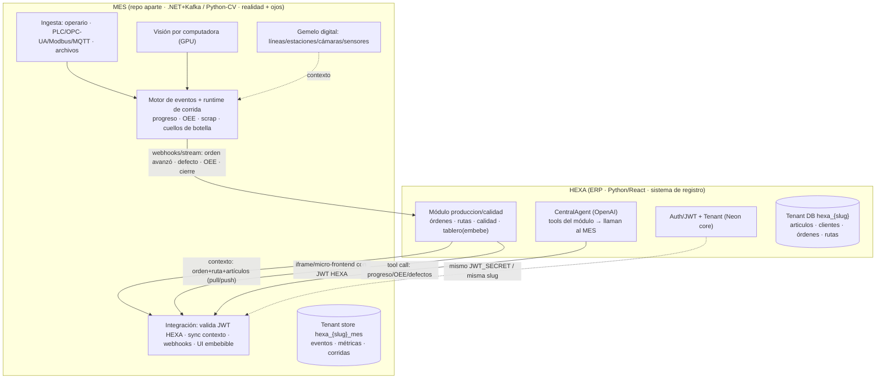

# Nexo como módulo de HEXA — Revisión de arquitectura y plan de integración

> **Documento:** `docs/design/hexa-integration/README.md` · **Estado:** Propuesta v0.1 · **Creado:** 2026-08-11
> **Rol:** arquitecto de producto senior (revisión estructural, no cosmética)
> **Fuentes:** código y specs reales de [`buttiepedro/hexa`](https://github.com/buttiepedro/hexa) (clonado y leído) + estado actual de este repo (Nexo/MES).
> **Disciplina de evidencia:** **[H]** hecho observado en el código/spec · **[I]** inferencia · **[S]** suposición a validar.

---

## 1. Executive summary

El cambio de encuadre es correcto y **de fondo**: **Nexo deja de ser un MES autónomo y pasa a ser el subsistema de _generación de eventos + visión por computadora_ de HEXA** (el ERP), en un **repo separado** pero integrado de forma que, para el usuario final, sea una parte más de HEXA.

La tesis se sostiene porque los dos sistemas resuelven problemas de naturaleza distinta:

- **HEXA [H]** es un **ERP SaaS IA-first**: CRUD de gestión (facturas, contabilidad, artículos, clientes, stock, proyectos), multi-tenant, con agentes OpenAI. Stack: FastAPI async + SQLAlchemy + Neon + Redis/Celery + React. Es el **sistema de registro y el plan**.
- **El MES** resuelve **tiempo real de planta**: captura heterogénea (operarios, PLC, cámaras), alta frecuencia, edge, inferencia de visión (GPU) y derivación de métricas en vivo. Es **la realidad y los ojos**. Ese perfil de carga **no encaja** en un backend Python CRUD — de ahí que sea un repo aparte con otra complejidad.

**La buena noticia:** la integración es más barata de lo esperado porque HEXA y Nexo **ya comparten las dos decisiones estructurales más caras** — **DB-per-tenant en Neon** y **multitenancy por `company/slug`** — y HEXA expone **exactamente los puntos de extensión** que el MES necesita (sistema de módulos/apps, hook `on_activate`, agente IA por módulo, JWT con secreto compartido).

**El costo real** está en tres frentes: (1) **reposicionar el MES** —sacarle todo lo que ahora es de HEXA (master data, identidad, autoría de procesos, "modo standalone")—; (2) **construir el subsistema de visión por computadora**, que hoy no existe; (3) **construir el módulo `produccion`/`calidad` en HEXA** como superficie de negocio y consumidor de los eventos del MES.

---

## 2. Critical findings

| # | Hallazgo | Evidencia | Consecuencia |
|---|---|---|---|
| **CF-1** | **HEXA ya es el IdP y el dueño del tenant.** JWT HS256 con `JWT_SECRET` compartido, payload `{sub, company_id, role}`; DB-per-tenant Neon por slug; `TenantMiddleware` resuelve `company_id → db_url`. | [H] `backend/app/core/security.py` (jwt.encode/decode HS256); `openspec/specs/auth-multitenancy.md`. | El MES **no construye Identity** (se descarta el plan Duende). Valida el JWT de HEXA con el mismo secreto y reusa `company_id`/slug como su clave de tenant. **Elimina M8 del roadmap del MES.** |
| **CF-2** | **La MasterData del MES duplica a HEXA.** HEXA ya tiene `articulo`, `cliente`, `deposito`, `stock`, `proyecto`, `registro_tiempo`, y usuarios. | [H] `backend/app/models/tenant/*` (articulo.py, cliente.py, deposito.py, stock.py, proyecto*.py, registro_tiempo.py). | **`Nexo.MasterData` se elimina** como fuente de verdad. El MES **consume** artículos/clientes/depósitos de HEXA. Operarios = usuarios de HEXA. |
| **CF-3** | **HEXA tiene el enchufe listo.** Sistema de módulos/apps con `BaseModule.on_activate(company_id, tenant_db_url)`, registries, `module_subscriptions`/`app_subscriptions`, agente IA por módulo. `produccion` y `calidad` son **stubs vacíos** (`module.py` de ~730 bytes + ROADMAP, sin apps). | [H] `openspec/specs/module-system.md`; `backend/app/modules/{produccion,calidad}/` (stubs). | El MES se expone como el **módulo `produccion`** (y `calidad`) de HEXA. `on_activate` aprovisiona/vincula el tenant del MES. **Greenfield**: no hay que romper nada existente. |
| **CF-4** | **La IA de HEXA ya "ve" y ya delega.** `CentralAgent` es la entrada única del chat (web + WhatsApp), **clasifica adjuntos por visión** y delega a agentes de módulo, que exponen `tool.py`. | [H] `context.md`; `openspec/specs/module-system.md` (ToolDefinition por app). | La integración de IA es "seamless" nativa: el módulo `produccion` aporta **tools** que consultan al MES (progreso/OEE/defectos). La **visión del MES** puede alimentar el clasificador de HEXA. |
| **CF-5** | **El narrativo "autónomo / ERP opcional" de Nexo queda invalidado.** Toda la doc de Nexo (idea/roadmap/vision) se posiciona como "sistema autónomo que funciona sin ERP". | [H] `docs/specs/idea.md`, `docs/specs/roadmap/*`. | Hay que **reposicionar la documentación** del MES: de "MES autónomo, ERP opcional" a "módulo sensor/eventos de HEXA". No es cosmético: cambia la propuesta de valor, el pricing y el alcance del MVP. |
| **CF-6** | **Decisión de stack pendiente.** HEXA es Python; el MES es .NET/Kafka. La integración **no exige** mismo stack (repos separados, contrato por API/eventos), pero la cohesión de equipo sí pesa. | [H] lenguajes de ambos repos. | Ver §7 (alternativas de stack). Recomendación: **mantener el core .NET de eventos** (aprovecha lo construido, fuerte en throughput) + **servicio Python para visión** (fuerte en ML/GPU). |

---

## 2.5 Definición afinada del MES (2026-08-11) — sistema de eventos por visión

> Refinamiento del alcance del MES posterior a la revisión inicial. **Acota y reorienta** lo de abajo: el MES no es un MES de procesos/órdenes, es un **motor de eventos guiado por visión por computadora**.

**El MES es un sistema donde *nosotros* definimos:**

| Entidad de configuración | Qué es |
|---|---|
| **Planta** | Layout operativo: líneas, zonas, puestos. El "dónde". |
| **Cámara** | Dispositivo de captura, ubicado en la planta, apuntando a una zona/línea. |
| **Objeto reconocible** | Clase de detección: pieza, caja, herramienta, persona, EPP, **defecto**… (catálogo). |
| **Acción reconocible** | Patrón espacio-temporal: "operario coloca pieza", "máquina detenida", "caja llena", "persona en zona restringida"… (catálogo). |
| **Regla** | Combinación **(cámara × objeto(s) × acción(es) × condición espacio-temporal)** → **genera un Evento**. Ej.: *"en cámara-3, si aparece `caja` con acción `llena` por >5 s → evento `caja_completa`"*. |

**Runtime:**
1. Las cámaras alimentan el **pipeline de visión** → **detección de objetos** + **reconocimiento de acciones**.
2. El **motor de reglas** evalúa las detecciones contra las reglas configuradas → emite **Eventos canónicos** (cámara, objeto, acción, timestamp, frame/evidencia).
3. Los eventos se **exponen a HEXA**, que les da **significado de negocio**: **trabar una orden**, **finalizar una producción**, registrar una no-conformidad, disparar una alerta, etc.

**Modelo de dominio del MES (nuevo núcleo):**
```
Planta → Cámara → (Objeto, Acción) → Regla → Evento → HEXA
```

**Frontera afinada:** el MES **no** modela órdenes, procesos ni DAG (eso es de la producción de HEXA). El MES define **planta / cámaras / objetos / acciones / reglas** y **emite eventos**; HEXA los interpreta.

**Impacto honesto en lo ya construido:** bajo esta definición, el núcleo .NET de **procesos/ejecución (`WorkModel`, `Execution`, `MasterData`) NO es el núcleo del MES** — migra a la producción de HEXA o se retira. **Sobrevive del MES:** el **backbone de eventos** (Kafka / outbox / relay), el **shell del tablero** (se reorienta a visualizar cámaras/eventos), y el **seam de identidad HEXA** ya construido. El resto se reemplaza por: **configuración (planta/cámaras/objetos/acciones/reglas)** + **pipeline de visión** + **motor de reglas de eventos**.

**Plan MES reorientado (reemplaza el detalle de §5 para el núcleo):**
- **V-A · Configuración**: ABM + API de **planta, cámaras, catálogo de objetos, catálogo de acciones, reglas** (el modelo de dominio de arriba). Es lo primero: sin config no hay eventos.
- **V-B · Pipeline de visión**: ingesta de cámara (RTSP/IP/USB) → **detección de objetos** + **reconocimiento de acciones** (Python/GPU, ONNX/PyTorch).
- **V-C · Motor de reglas**: evalúa (objeto × acción × cámara × condición) → **Evento canónico**.
- **V-D · Salida a HEXA**: webhooks/API de eventos (§4.3) + **seam de identidad (✅ hecho)**.
- **V-E · Tablero de planta**: reorienta el tablero actual a **cámaras + eventos en vivo** (no progreso de tareas).

---

## 3. Modelo conceptual: la frontera HEXA ↔ MES

El principio: **HEXA es dueño del _plan_ y del _registro de negocio_; el MES es dueño de _lo que realmente pasa_ y de _los ojos_.** Cada dato tiene un solo dueño (single source of truth).

| Dominio | Dueño | Notas |
|---|---|---|
| Empresas, usuarios, roles, auth, tenant DB | **HEXA** | El MES los consume (JWT + slug). |
| Artículos, clientes, depósitos, stock | **HEXA** | El MES los referencia por id; **no** los replica como catálogo propio. |
| Unidades de medida | **HEXA** (agregar si falta) | Hoy Nexo tenía UoM; se re-homea a HEXA o se vuelve config mínima. **[S] validar si HEXA ya tiene UoM.** |
| **Órdenes de producción** (qué producir, cuánto, cuándo) | **HEXA** (`produccion`) | Es negocio/planificación. Nace de una venta/pedido/plan. |
| **Rutas / procesos / DAG** (cómo se hace) — *autoría* | **HEXA** (`produccion`) | La **definición** es config de negocio. Viaja al MES como contexto de corrida. |
| **Planes de calidad** (qué se inspecciona) | **HEXA** (`calidad`) | El MES ejecuta/captura; HEXA define y registra el resultado formal. |
| **Gemelo digital**: líneas, estaciones, máquinas, **cámaras**, sensores | **MES** | Infraestructura física/sensorial, no master data de negocio. |
| **Captura / ingesta** de hechos (operario, PLC/OPC-UA/Modbus/MQTT, archivos) | **MES** | El corazón de "generación de eventos". |
| **Visión por computadora** (inferencia sobre cámaras → detecciones) | **MES** | Conteo, defectos, presencia, OCR → eventos. |
| **Runtime de ejecución** (corrida viva: estados de tarea, gating del DAG, atribución evento→orden/tarea/estación) | **MES** | Recibe orden+ruta de HEXA; **no** las autora. Es el contexto al que se pegan los eventos. |
| **Motor de eventos + métricas en vivo** (progreso, OEE, scrap, tiempos muertos, cuellos de botella) | **MES** | Especializado; empuja resultados a HEXA. |
| **KPIs de negocio, reportes, contabilidad de costos** | **HEXA** | Consume las métricas del MES y las cruza con negocio. |

> **La regla de oro para dirimir dudas de frontera:** si la pregunta es *"¿qué debería pasar?"* → HEXA. Si es *"¿qué está pasando / qué pasó / qué ven las cámaras?"* → MES.

**Qué se elimina o re-homea del MES actual (Nexo):**
- `Nexo.MasterData` → **eliminar** (consumir de HEXA). [CF-2]
- Plan de **Identity/Duende** → **eliminar** (validar JWT de HEXA). [CF-1]
- **Autoría** de procesos en `Nexo.WorkModel` → **mover a HEXA**; el MES conserva la **representación runtime** del DAG (para gatear y derivar progreso), alimentada desde HEXA.
- Framing **standalone / ERP opcional / conector Odoo** → **eliminar** (HEXA ya tiene conectores). [CF-5]

**Qué conserva y refuerza el MES:**
- `Nexo.EventEngine` (motor de eventos) — núcleo.
- Ingesta/edge + relay/outbox + backbone Kafka.
- `Nexo.Execution` como **runtime** de corrida.
- Tablero/andon → **superficies embebibles**.

**Qué agrega el MES (nuevo, de mayor complejidad):**
- **Subsistema de Visión por computadora** (ingesta de cámara + pipeline de inferencia + model serving).
- **Capa de integración con HEXA** (JWT, contexto, webhooks, UI embebible, tools IA).

---

## 4. Arquitectura de integración (el *seam*)



**Los cinco contratos del seam:**

1. **Identidad y tenant [CF-1].** HEXA es el IdP. El MES valida el JWT de HEXA (HS256, `JWT_SECRET` compartido vía secreto de plataforma), extrae `company_id`, y resuelve su propio tenant en Neon (`hexa_{slug}_mes`, misma slug). Para los callbacks **MES→HEXA** se usa un **JWT/API-key de servicio** por empresa (auth servicio-a-servicio, sin usuario).

2. **Activación / aprovisionamiento.** Cuando un admin activa el módulo `produccion` en HEXA, `on_activate(company_id, tenant_db_url)` llama al **API de provisioning del MES** para crear/vincular el tenant del MES; guarda su handle en `module_subscriptions.config` y un `integration_config` con la URL/secreto del MES.

3. **Contexto HEXA → MES (el plan).** Al lanzar una orden, HEXA envía al MES la **orden + ruta/DAG + referencias de artículo/estación** (push al crear, o el MES pull-ea del API de HEXA). El MES materializa una **corrida viva** contra ese contexto.

4. **Realidad MES → HEXA (los hechos).** El MES emite **webhooks/stream** de eventos de negocio (orden avanzó X%, tarea completada, **defecto de visión detectado**, OEE del turno, cierre de corrida). Un **worker Celery** de HEXA los consume y actualiza la orden, el registro de calidad y los KPIs. Además, el MES expone un **API de lectura** (progreso/métricas) que HEXA embebe/consulta. **Kafka queda interno al MES**; el contrato externo es HTTP.

5. **UI e IA embebidas.** Las páginas del módulo `produccion` (`/modules/produccion/tablero`, `/andon`, `/captura`) **embeben** las superficies del MES (iframe/micro-frontend, con passthrough del JWT de HEXA y estilos Tailwind para que se vean nativas). El agente del módulo aporta `tool.py` que consultan al MES; la **visión** del MES puede alimentar el clasificador de adjuntos de HEXA.

---

## 5. Plan lado MES — "modificar todo"

Fases pensadas para **no romper lo que ya funciona** (la tajada vertical M0–M4/M3) mientras se re-encuadra.

### Fase R0 · Reposicionamiento (docs + narrativa)
- Reescribir `idea.md`, `roadmap/*`, `vision.md`: de "MES autónomo / ERP opcional" a **"módulo sensor/eventos de HEXA"**. Bajar de alcance: sin master data propia, sin identidad propia, sin conector Odoo. [CF-5]
- Marcar en la bitácora qué piezas se re-homean y cuáles se conservan.

### Fase R1 · Seam de identidad y tenant (reemplaza M8)
- Reemplazar el **dev-bypass/Duende** por **validación de JWT de HEXA** (HS256, secreto compartido). Extraer `company_id` → resolver tenant del MES.
- Auth **servicio-a-servicio** para los callbacks MES→HEXA.
- Aprovisionamiento del tenant del MES (`hexa_{slug}_mes`) disparado por HEXA.

### Fase R2 · Recortes (sacar lo que es de HEXA)
- **Eliminar `Nexo.MasterData`**; introducir un **cliente de contexto** que lee artículos/clientes/depósitos/UoM del API de HEXA (con caché). [CF-2]
- **Mover la autoría de procesos** fuera del MES; `Nexo.WorkModel` se reduce a **modelo runtime del DAG** que se hidrata desde el contexto de orden de HEXA.
- Quitar el conector Odoo y el "modo standalone/conectado".

### Fase R3 · Contexto e ingesta de negocio
- API de provisioning + endpoint "lanzar corrida desde orden HEXA" (recibe orden+ruta).
- `Nexo.Execution` pasa a materializar la corrida desde ese contexto (hoy ya recibe un snapshot inline — el cambio es que la fuente es HEXA).

### Fase R4 · Realidad hacia HEXA
- **Publisher de webhooks/stream** hacia HEXA (deriva del outbox/relay ya construido): orden avanzó, defecto, OEE, cierre.
- API de lectura de métricas para embeber (evoluciona el tablero actual).

### Fase R5 · UI embebible
- Convertir tablero/console en **superficies embebibles** (tema alineado a HEXA, auth por token de HEXA, sin CORS gracias al embed).

### Fase R6 · **Visión por computadora** (el bloque grande y nuevo)
- Servicio de **ingesta de cámara** (RTSP/USB/IP) + **pipeline de inferencia** (conteo, defectos, presencia, OCR) + **model serving** (GPU).
- Cada detección → **Evento canónico** en el motor de eventos (misma tubería que el resto).
- Bucle con calidad: detección de defecto → evento → HEXA registra no-conformidad.
- **[S] Stack:** Python (OpenCV/PyTorch/ONNX/Triton) por afinidad ML/GPU; ver §7.

### Fase R7 · Ingesta industrial (edge)
- Edge gateway + adapters PLC/OPC-UA/Modbus/MQTT (estaba en V1 del roadmap viejo; sigue siendo del MES).

### Fase R8 · IA para el agente de HEXA
- Contratos de **tools** que HEXA invoca (progreso/OEE/defectos/estado de corrida).

---

## 6. Plan lado HEXA — "qué hace falta"

Siguiendo el patrón canónico de HEXA (módulo → apps con `service/router/tool/schemas` + `AppSpec` en el registry). [CF-3]

### 6.1 Módulo `produccion`
- **Apps:**
  - **Órdenes de producción** — CRUD de órdenes (nace de venta/plan); estado sincronizado desde el MES.
  - **Rutas / Procesos** — autoría del proceso y su DAG (tareas, precedencias); se envía al MES como contexto.
  - **Tablero en vivo** — página que **embebe** el tablero del MES.
- `on_activate`: crea tablas tenant (`orden_produccion`, `ruta`, `ruta_tarea`, `ruta_precedencia`) **y** llama al provisioning del MES; guarda handle/secreto en `module_subscriptions.config` + `integration_config`.
- **Agente del módulo**: tools `estado_orden`, `oee_turno`, `cuellos_de_botella` → llaman al MES.

### 6.2 Módulo `calidad`
- **Apps:** Planes de calidad (qué inspeccionar), **Registro de no-conformidades** (alimentado por las detecciones de visión del MES + carga manual), tablero de calidad (FPY, Pareto de defectos).
- Consume el stream de defectos del MES.

### 6.3 Núcleo / plataforma HEXA
- **Ingesta de eventos del MES:** endpoint(s) webhook autenticados + **handler Celery** que actualiza órdenes/calidad/KPIs; `integration_config` por empresa con URL/secreto del MES. (Reusa el patrón `integration_sync_log`.)
- **Emisión de contexto:** endpoints para que el MES lea órdenes/rutas/artículos/estaciones, **o** un push al MES al lanzar la orden.
- **Identidad para el MES:** exponer el `JWT_SECRET` como secreto compartido para validación + emitir credencial de servicio para los callbacks. **[S] confirmar** que el `JWT_SECRET` de plataforma es apto para compartir (o emitir un par de claves dedicado MES).
- **UoM:** agregar catálogo de unidades si no existe. **[S] validar.**
- **Modelo de estación/línea:** decidir si HEXA referencia estaciones (para asociar órdenes a líneas) o lo delega 100% al MES. Recomendado: HEXA guarda un **id/nombre de estación** liviano; el detalle del gemelo digital vive en el MES.

### 6.4 Frontend HEXA
- Páginas del módulo `produccion`/`calidad` que **embeben** las superficies del MES (contenedor iframe/micro-frontend con passthrough de token), + navegación en el sidebar (patrón `/modules/{modulo}/{app}`).

---

## 7. Alternativas y trade-offs

| Decisión | Opción A | Opción B | Recomendación |
|---|---|---|---|
| **Frontera del work model** | Autoría de rutas en HEXA; runtime en MES | Todo (orden+ruta+ejecución) en HEXA; MES = puro sensor→evento | **A.** Puro-sensor es más fiel a la frase "solo eventos", pero empuja el cómputo de progreso en tiempo real a Python (mal fit) y tira el motor de ejecución ya hecho. |
| **Transporte MES→HEXA** | Webhooks HTTP + API de lectura | Kafka compartido | **Webhooks + API.** HEXA no tiene Kafka; agregarlo es caro. Kafka queda **interno** al MES. |
| **Home de datos del MES por tenant** | DB companion `hexa_{slug}_mes` en Neon | Esquema dentro de la tenant DB de HEXA | **Companion DB/store.** Los eventos son alto volumen y otra forma; conviene aislarlos (y habilita un time-series store). |
| **Embed de UI** | iframe con token | Micro-frontend / module federation | **iframe primero**, evolucionar a micro-frontend cuando la costura se note. |
| **Stack del MES** | Mantener core .NET/Kafka + servicio Python de visión (**polyglot**) | Reescribir todo en Python para cohesión con HEXA | **Polyglot.** El core .NET aprovecha lo construido y es fuerte en throughput; Python para visión (ML/GPU). Costo honesto: dos lenguajes de mantenimiento. Reevaluar si el equipo es 100% Python. |
| **Visión: dónde corre la inferencia** | Nube (GPU central) | Edge (en planta) | **Híbrido:** modelos livianos en edge (latencia/privacidad), pesados en nube. Empezar en nube. |

---

## 8. Priority matrix (P0–P3)

| Prioridad | Ítem | Lado |
|---|---|---|
| **P0** | Confirmar la **frontera** (§3) y las decisiones de §9 antes de tocar código | Ambos |
| **P0** | Seam de **identidad/tenant** (validar JWT HEXA, tenant por slug) — reemplaza M8 | MES + HEXA |
| **P0** | Módulo `produccion` en HEXA con app **Órdenes** + `on_activate` que provisiona el MES | HEXA |
| **P0** | Contrato **contexto (HEXA→MES)** y **eventos (MES→HEXA)** | Ambos |
| **P1** | Eliminar `Nexo.MasterData`; cliente de contexto que lee de HEXA | MES |
| **P1** | Reposicionar docs del MES (sacar "autónomo/ERP opcional") | MES |
| **P1** | App **Rutas/Procesos** en HEXA (autoría del DAG) + envío al MES | HEXA |
| **P1** | Tablero/andon del MES **embebibles** en HEXA | Ambos |
| **P1** | **Subsistema de visión** (MVP: una cámara, un modelo de conteo o defecto → evento) | MES |
| **P2** | Módulo `calidad` en HEXA consumiendo detecciones de visión | HEXA |
| **P2** | Tools IA del módulo `produccion` que consultan al MES | HEXA |
| **P2** | Ingesta industrial edge (PLC/OPC-UA/Modbus/MQTT) | MES |
| **P3** | Micro-frontend en vez de iframe; visión en edge; métricas ricas | Ambos |

---

## 9. Decisiones a resolver antes de seguir desarrollando

1. **Frontera del work model:** ¿HEXA autora rutas/procesos y el MES solo las ejecuta/deriva (recomendado), o el MES es puro sensor→evento y HEXA computa el progreso?
2. **Alcance del MES:** ¿conserva el **runtime de ejecución** (corridas, gating DAG, atribución) o se queda solo con captura + visión + motor de métricas?
3. **Stack:** ¿core del MES en **.NET** (aprovecha lo hecho) + visión en Python, o consolidar todo en Python por cohesión de equipo?
4. **Home de datos del MES por tenant:** ¿DB companion en Neon (recomendado), esquema en la tenant DB de HEXA, o store dedicado (time-series)?
5. **Identidad de servicio:** ¿se comparte el `JWT_SECRET` de HEXA para validar, o se emite un par de claves dedicado para el MES? ¿Cómo se autentican los callbacks MES→HEXA?
6. **UoM y estaciones:** ¿HEXA agrega UoM y un modelo liviano de estación, o el MES los aporta?
7. **Transporte de eventos:** ¿webhooks + API (recomendado) o algo más?
8. **Pricing/empaquetado:** el MES es ahora un **módulo activable** de HEXA (feature flag en `module_subscriptions`), no un producto aparte — revisar el modelo comercial.

> **Nada de código nuevo del seam hasta cerrar 1–5.** Son decisiones estructurales; revertirlas tarde es caro.
