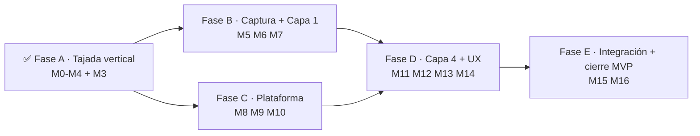

# Roadmap de ejecución del MVP

> ## ⚠️ CAMBIO DE ENCUADRE (2026-08-11) — Nexo es ahora un módulo de HEXA
> La **tajada vertical ya construida y verificada (M0–M4 + M3)** sigue **vigente**: es la **base del módulo MES de HEXA** (motor de eventos + tablero + flujo real). Lo que **queda SUPERADO** son las fases **M5–M16** que apuntaban a un MES **autónomo** (Identity propio, master data propia, Control Plane, conector Odoo, etc.). Esas se reemplazan por las **fases de reposicionamiento e integración (R0–R8)** definidas en **[docs/design/hexa-integration/README.md](./hexa-integration/README.md)** §5. Brief para HEXA: **[HEXA-INTEGRATION.md](../../HEXA-INTEGRATION.md)**.
>
> **Mapeo rápido:** M8 (Identity) → se descarta (HEXA es el IdP) · MasterData → se elimina (HEXA es dueño) · M5 gemelo digital / ingesta / **visión** → siguen siendo del MES (fases R6–R7) · el resto de dominios de negocio → migran a HEXA.

> **Documento:** `docs/design/mvp-execution-roadmap.md` · **Estado:** Activo (encuadre actualizado 2026-08-11) · **Actualizado:** 2026-08-11
> **Relacionados:** [design/completed/](./completed/README.md) · [roadmap.md](../specs/roadmap/roadmap.md) (estratégico) · [02-event-model.md](./02-event-model.md) · [04-service-contracts.md](./04-service-contracts.md)

Este documento es el **plan de ejecución concreto** desde lo ya construido hasta el **MVP completo**, aterrizado en **milestones ejecutables y verificables**. No repite el roadmap estratégico ([roadmap.md](../specs/roadmap/roadmap.md), que define las fases MVP→V1→V2→Enterprise); lo baja a "qué construimos y en qué orden". Para todo lo posterior al MVP (motor de reglas, protocolos industriales, capa de costo, trazabilidad, reportes, marketplace, multi-ERP, IA) manda el roadmap estratégico.

## Estrategia

Primero se construyó una **tajada vertical** (*un hecho → evento → progreso en vivo*) para tener algo demostrable de punta a punta. **Esa tajada ya está cerrada y verificada con datos reales.** Lo que sigue es **ensanchar**: completar la captura y el modelo físico, la plataforma (identidad, control plane, multi-tenancy real), la Capa 4 rica y la experiencia de usuario, y cerrar los criterios de salida del MVP.

---

## ✅ Fase A — Tajada vertical (HECHA)

La cadena **escritura → outbox → Kafka → motor de eventos → tablero**, navegable y con datos reales.

| # | Milestone | Entrega | Registro |
|---|---|---|---|
| **M0** | Modo dev sin auth | Bypass de auth solo en Development; endpoints ejercitables (401→200) | [005](./completed/005-m0-dev-auth.md) |
| **M1** | Relay outbox → Kafka | `Nexo.BuildingBlocks.Outbox`: los eventos persistidos se publican al bus | [006](./completed/006-m1-outbox-relay.md) |
| **M2** | Capa 4 mínima · motor de eventos | `Nexo.EventEngine`: read model de progreso por ejecución | [007](./completed/007-m2-event-engine.md) |
| **M4** | Tablero en vivo | `http://localhost:5084/` con progreso en tiempo real | [008](./completed/008-m4-dashboard.md) |
| **M3** | Flujo real end-to-end | Crear ejecución + avanzar tareas **por API** → progreso real en el tablero (+ fix estado monotónico) | [009](./completed/009-m3-real-flow.md) |

**Estado del código:** 5 APIs corriendo local (Producción 5080 · MasterData 5081 · WorkModel 5082 · Execution 5083 · EventEngine 5084), infra en docker-compose (Postgres 5433, Redpanda 9092, MinIO, Jaeger). Todo compila y está en `main`.

---

## Fase B — Completar la captura y el modelo físico

### M5 · Gemelo digital mínimo (Capa 1)
- **Alcance:** jerarquía **Empresa → Planta → Sector → Línea → Centro de trabajo/Máquina** como master data del tenant, y **binding señal↔activo** (cada dato con dueño físico). ABM + navegación básica.
- **Por qué:** es un `Must` del MVP y hoy no existe; sin él ningún hecho se atribuye a un activo.
- **Criterio de hecho:** se define una jerarquía de activos y un evento/registro queda **atribuido a un activo**; el tablero puede filtrar por planta/línea.
- **Depende de:** master data (hecho). Nuevo bounded context de configuración del tenant (**MOD-09**).

### M6 · Dominios de captura: Scrap, Calidad, Paradas
- **Alcance:** los 3 dominios que faltan (hoy solo `Nexo.Production` es scaffold): **Scrap** (motivo + cantidad, sin costo), **Calidad** (inspección con checklist/variables + reason codes), **Paradas** (Downtime con reason code). **Reason Codes** compartidos (**MOD-03**). Fix: registrar validadores en `Nexo.Production`.
- **Por qué:** los "5 registros" del MVP (producción, scrap, calidad, paradas, eventos) son `Must`.
- **Criterio de hecho:** cada dominio registra por API, emite su evento canónico (`nexo.scrap.*`, `nexo.quality.*`, `nexo.downtime.*`) y llega al motor/tablero.
- **Depende de:** relay (hecho), gemelo digital (M5) para atribuir a activo.

### M7 · Ingesta datalogger/CSV + evento canónico
- **Alcance:** ingesta de **archivo/CSV/Excel** + carga manual normalizada al **Evento canónico** con `dedup_key` (idempotencia) y **store-and-forward** (offline-first). Alta y salud básica de dispositivos/señales.
- **Por qué:** el MVP promete "eliminar la carga manual" desde datalogger/CSV; los protocolos industriales (S7/OPC UA/Modbus/MQTT) quedan en V1 (**DEV-02**).
- **Criterio de hecho:** un archivo de datalogger cargado se ve en el tablero; tras un corte simulado ningún evento se pierde ni se duplica.
- **Depende de:** evento canónico (parcial), gemelo digital (M5).

---

## Fase C — Plataforma, identidad y multi-tenancy

### M8 · Identity real (Duende) — reemplaza el dev-bypass (M0)
- **Alcance:** `Nexo.Identity` con Duende IdentityServer; JWT con claim de tenant + **scopes por rol**; los 8 roles canónicos; login de operario por PIN/NFC en kiosco (**SEG-01**). Quitar el dev-bypass de los entornos no-dev (ya está aislado).
- **Por qué:** hoy todo corre con el bypass de desarrollo; sin Identity no hay seguridad real ni escritura autenticada en la nube.
- **Criterio de hecho:** un usuario obtiene un token real, y los endpoints validan scope por rol; sin token → 401 fuera de Development.
- **Depende de:** nada nuevo (los endpoints ya usan políticas de scope).

### M9 · Control Plane mínimo (alta de tenant + licencias)
- **Alcance:** alta de tenant **end-to-end** (los 7 pasos, provisioning DB-per-tenant, seed idempotente **MOD-16**), planes/licencias básicas, estado de tenants.
- **Por qué:** hoy el tenant local es una cadena de conexión en config; el alta automatizada es `Must` y prerrequisito de todo a escala.
- **Criterio de hecho:** el alta ejecuta los 7 pasos y deja la empresa "activa" de forma repetible.
- **Depende de:** Identity (M8) para el primer usuario del tenant.

### M10 · Multi-tenancy productivo
- **Alcance:** **Tenant Connection Registry** real (Neon + Secrets Manager) reemplazando el `ConfigurationTenantConnectionResolver`; **relay del outbox multi-tenant** (iterar tenants, no solo el fallback demo); migraciones por cohortes con feature flags (**TEN-01/02**).
- **Por qué:** el relay y los DbContext hoy usan el fallback del tenant demo; a escala hay que resolver e iterar tenants reales.
- **Criterio de hecho:** dos tenants con DBs distintas operan aislados; el relay publica los eventos de ambos.
- **Depende de:** Control Plane (M9).

---

## Fase D — Capa 4 completa y experiencia de usuario

### M11 · Persistir el read model + push en vivo
- **Alcance:** persistir la proyección de progreso en una **tabla de read model** (offsets committeados, no replay total en memoria); **push** al tablero por WebSocket/SSE (objetivo ≤5 s, **UX-05**) en vez de polling.
- **Criterio de hecho:** la proyección sobrevive al reinicio sin replay completo; el tablero se actualiza por push.
- **Depende de:** motor de eventos (hecho).

### M12 · Métricas ricas de Capa 4
- **Alcance:** **tiempos muertos, cuellos de botella**, progreso **ponderado** (por `progressWeight`), y **KPIs por perfil**: OEE + scrap rate para Lote; **% de avance, desvío de cronograma, hitos** para Proyecto.
- **Por qué:** el MVP promete estas métricas de la Capa 4; hoy el motor hace solo progreso por conteo.
- **Criterio de hecho:** el tablero muestra OEE/scrap (lote) y desvío/hitos (proyecto), y señala cuellos de botella.
- **Depende de:** dominios de captura (M6), read model persistido (M11).

### M13 · gRPC WorkModel → Execution
- **Alcance:** `ProcessCatalog.GetPublishedVersion` por **gRPC**; Execution obtiene el snapshot de la versión publicada del servicio real en vez de recibirlo como input.
- **Por qué:** hoy el snapshot se pasa a mano en el `POST /v1/executions`; falta la integración real entre servicios.
- **Criterio de hecho:** crear una ejecución referenciando una versión publicada de WorkModel, sin enviar el snapshot en el body.
- **Depende de:** WorkModel + Execution (hechos).

### M14 · Frontend (experiencia de usuario)
> 🟡 **Slice hecho ([010](./completed/010-m14-console.md)):** una **consola web** (`http://localhost:5084/console.html`) ya cierra el lazo humano —alta de master data, definir/lanzar una corrida y avanzar tareas, sin curl—. Falta la UX de operario final (abajo).
- **Alcance:** UI real más allá del tablero de demo: **ABM de master data**, **definición de procesos** (formulario/lista con DAG), **formularios de captura en tablet** (UX de operario, offline-first) para los 5 registros + avance de tarea, y **tablero enriquecido** con KPIs por perfil.
- **Por qué:** hoy la captura se hace por API/Swagger; para un operario real hace falta la UX (**UX-01/02**).
- **Criterio de hecho:** un operario carga producción/avance desde una tablet (formulario) y lo ve en el tablero.
- **Depende de:** Identity (M8), dominios (M6), métricas (M12).

---

## Fase E — Integración opcional y cierre del MVP

### M15 · Conector Odoo (opcional, modo conectado)
- **Alcance:** conector con ACL — **pull** de MO/Producto/UoM/Motivos, **push** de producción real y scrap (**INT-01**); activable por tenant; el MVP funciona sin él (modo standalone).
- **Criterio de hecho:** en un tenant conectado, un registro se sincroniza con Odoo; si no hay ERP, no se pierde ninguna capacidad.
- **Depende de:** dominios (M6), modo de operación del tenant (**INT-07**).

### M16 · Hardening + criterios de salida del MVP
- **Alcance:** subir OpenTelemetry (**NU1902**), **tests de integración** end-to-end, **CI/CD** por servicio, **despliegue cloud** (K8s), observabilidad mínima del Control Plane. Cerrar los **[criterios de salida del MVP](../specs/roadmap/roadmap.md#25-criterios-de-salida-exit-criteria)** y un cliente de referencia.
- **Criterio de hecho:** los criterios de salida de la fase MVP del roadmap estratégico se cumplen y se marcan.

---

## Mapeo a los criterios de salida del MVP

Los [criterios de salida de la fase MVP](../specs/roadmap/roadmap.md) se cubren así:

| Criterio de salida (roadmap estratégico) | Milestone(s) |
|---|---|
| Alta de tenant end-to-end (7 pasos) | M9 |
| Tenant opera standalone (master data → proceso → ejecución → progreso) | ✅ Fase A + M14 (UI) |
| Producción manual → tablero (caso estrella) | M6 + M7 + M14 |
| Los dos perfiles (Lote y Proyecto) con KPIs por perfil | ✅ Fase A (modelo) + M12 (KPIs) |
| DAG completo demostrado | ✅ Fase A (gating real en M3) |
| Importador CSV acotado | M7 |
| Cada señal ligada a un activo | M5 |
| Store-and-forward sin pérdida ni duplicados | M7 |
| Aislamiento entre tenants verificado | M10 |
| Sincronización Odoo (no bloqueante) | M15 |
| Cliente de referencia con reducción de carga manual | M16 |

---

## Más allá del MVP

V1 (MES ligero: reglas, notificaciones, **protocolos industriales**, trazabilidad, reportes, **capa de costo**), V2 (marketplace, multi-ERP, distribución geográfica) y Enterprise (IA/visión, predictivo, simulación) están en el **[roadmap estratégico](../specs/roadmap/roadmap.md)** con su prioridad MoSCoW, dependencias y riesgos. Este documento se detiene en el cierre del MVP.

## Convención de trabajo

Cada milestone terminado se registra en [`design/completed/`](./completed/README.md) con su evidencia de verificación, y —cuando corresponde— se agrega a [`roadmap/completed/`](../specs/roadmap/completed/README.md). Sin verificación (compila + corre + se comprueba), el milestone no se da por hecho. Los milestones de una fase pueden solaparse; las dependencias marcadas arriba son las que sí obligan a un orden.
