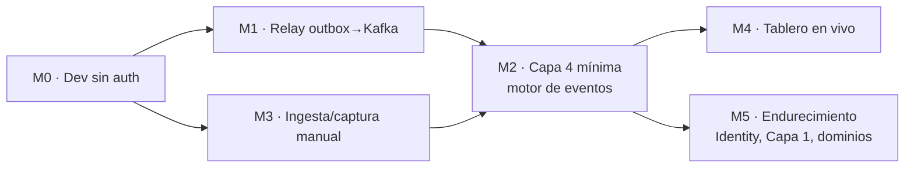

# Roadmap de ejecución del MVP

> **Documento:** `docs/design/mvp-execution-roadmap.md` · **Estado:** Activo · **Actualizado:** 2026-07-26
> **Relacionados:** [design/completed/](./completed/README.md) · [roadmap.md](../specs/roadmap/roadmap.md) · [02-event-model.md](./02-event-model.md) · [04-service-contracts.md](./04-service-contracts.md)

Este documento es el **plan de ejecución concreto** para llevar lo ya construido (master data + Capas 2-3, verificadas) hasta un **MVP demostrable**. No repite el roadmap estratégico ([roadmap.md](../specs/roadmap/roadmap.md)); lo aterriza en **milestones ejecutables y verificables**, en el orden que da valor visible más rápido.

## Estrategia: una tajada vertical primero

En vez de completar las 4 capas en ancho, se construye **una tajada vertical del caso estrella** —*un hecho de planta → evento → progreso en vivo*— para tener algo demostrable cuanto antes. Recién después se ensancha (Identity real, gemelo digital, Scrap/Calidad/Paradas, Control Plane).

## Estado de partida (verificado)

`Nexo.MasterData` (master data sin costo) · `Nexo.WorkModel` (Capa 2, DAG completo) · `Nexo.Execution` (Capa 3, Lote y Proyecto) compilan, testean y corren local. Infra local: Postgres, Redpanda/Kafka, MinIO, Jaeger. **Gaps que ataca este plan:** nadie publica el outbox, no hay motor de eventos, todos los endpoints dan 401, no hay tablero.

## Milestones

| # | Milestone | Entrega | Criterio de "hecho" (verificable) | Estado |
|---|---|---|---|---|
| **M0** | **Modo dev sin auth** | Bypass de autenticación **solo en Development** en las 4 APIs | Un `GET`/`POST` a un endpoint protegido responde **≠ 401** desde Swagger/cURL, sin token | 🟡 En curso |
| **M1** | **Relay outbox → Kafka** | Hosted service que drena `*.outbox_messages` y publica al bus | Un evento persistido en el outbox aparece **publicado en Kafka** (visible en la consola Redpanda) y queda `ProcessedOn` marcado | ⬜ |
| **M2** | **Capa 4 mínima — motor de eventos** | Proyección que consume eventos de Ejecución/Tarea y calcula **progreso por ejecución** | Tras avanzar tareas de una ejecución, una query devuelve su **% de progreso** derivado de los eventos | ⬜ |
| **M3** | **Ingesta / captura manual** | Flujo mínimo para **reportar un hecho** (avance de tarea / producción) que emite evento | Un registro manual genera su evento canónico y dispara la proyección de M2 | ⬜ |
| **M4** | **Tablero en vivo (mínimo)** | Página web mínima que muestra el **progreso de las ejecuciones en tiempo real** | Un avance cargado se ve reflejado en el tablero sin recargar (o con refresh corto) | ⬜ |
| **M5** | **Endurecimiento** | Identity real (Duende), gemelo digital (Capa 1), Scrap/Calidad/Paradas, Control Plane, gRPC WorkModel→Execution | Cada uno con su propio registro en `design/completed/` | ⬜ |

## Detalle por milestone

### M0 · Modo dev sin auth
- **Qué:** un `DevAuthenticationHandler` (esquema `DevBypass`) en `BuildingBlocks.Web` que, **solo en Development**, autentica cada request como un usuario dev con **todos los scopes `nexo.*`** y el **tenant demo**. En otros entornos no se registra: sigue el JWT/Duende real.
- **Por qué:** hoy los endpoints validan contra un Duende inexistente (`Authority:Issuer`) → 401. Sin destrabar esto no se puede ejercitar ni demostrar nada.
- **No hace:** no reemplaza Identity; es andamiaje de desarrollo. La solución real es **M5**.

### M1 · Relay outbox → Kafka
- **Qué:** los productores de MassTransit + rider de Kafka **ya están cableados** en cada `Program.cs`, pero **nada drena el outbox**. Falta un `BackgroundService` que lea las filas sin procesar de `*.outbox_messages`, las publique al bus y marque `ProcessedOn`.
- **Ojo (multi-tenant):** el relay debe recorrer los tenants. En local hay uno (demo) vía config; el diseño deja la iteración por tenant lista para el resolver productivo.

### M2 · Capa 4 mínima — motor de eventos
- **Qué:** un consumidor/proyección que escucha `nexo.execution.*` y `nexo.task.*` y mantiene un **read model de progreso** por ejecución (tareas completadas / totales, ponderado).
- **Alcance mínimo:** progreso y conteo de tareas; tiempos muertos y cuellos de botella quedan para después.

### M3 · Ingesta / captura manual
- **Qué:** el endpoint de avance de tarea de Execution ya existe; M3 lo envuelve en el flujo mínimo de "reportar un hecho" y garantiza que emite su evento canónico (que alimenta M2).

### M4 · Tablero en vivo (mínimo)
- **Qué:** página web mínima (self-contained) que consulta el read model de M2 y muestra el progreso de las ejecuciones activas, con refresh corto o push.

### M5 · Endurecimiento
- Identity real (Duende) · gemelo digital (Capa 1: jerarquía de activos + binding señal↔activo) · Scrap/Calidad/Paradas · Control Plane (alta de tenant real) · gRPC WorkModel→Execution · registrar validadores en Production · NU1902 OTel.

## Convención de trabajo

Cada milestone terminado se registra en [`design/completed/`](./completed/README.md) con su evidencia de verificación, y —cuando corresponde— se agrega a [`roadmap/completed/`](../specs/roadmap/completed/README.md). Sin verificación, el milestone no se da por hecho.
