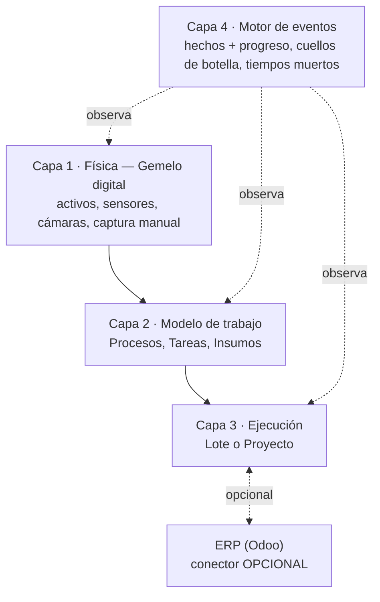
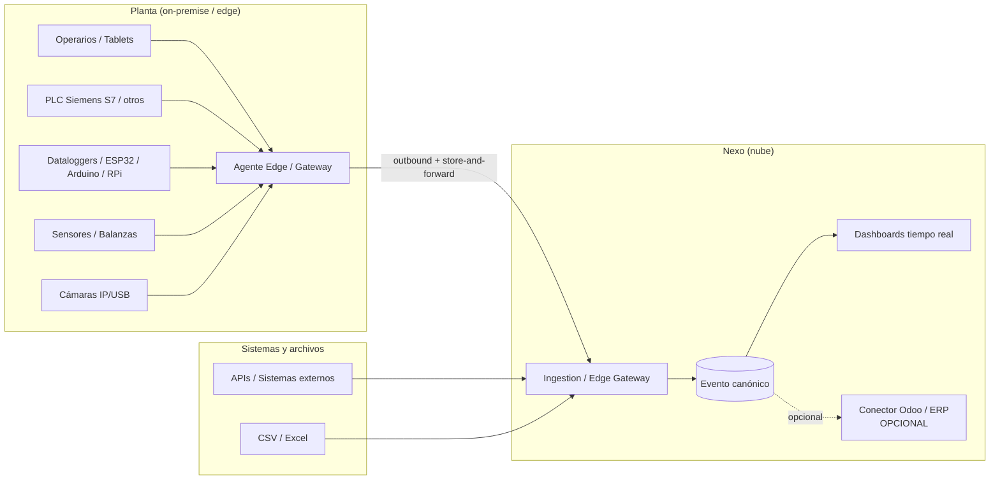
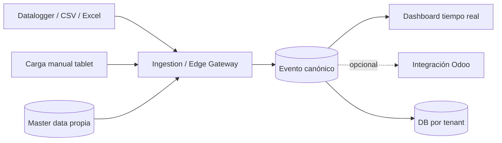

# Nexo — La idea

> **Documento:** `specs/idea.md` · **Estado:** Borrador v0.2 · **Actualizado:** 2026-07-25
> **Roles:** Product Manager · Software Architect · UX Designer
> **Relacionados:** [product.md](./specs/product.md) · [layered-architecture.md](./specs/layered-architecture.md) · [architecture.md](./specs/architecture.md) · [modules.md](./specs/modules.md) · [roadmap.md](./roadmap/roadmap.md) · [vision.md](./roadmap/vision.md) · [design/completed/](../design/completed/README.md)

> **🔧 Estado de implementación (2026-07-25).** El encuadre de este documento —modelo de 4 capas, ERP opcional, ambos perfiles y DAG completo— ya empezó a bajar a código. La cadena **Capa 2 → Capa 3** está implementada y verificada: los servicios `Nexo.MasterData` (master data sin costo), `Nexo.WorkModel` (Procesos + DAG completo con validación de ciclos) y `Nexo.Execution` (Ejecución en sabores **Lote** y **Proyecto**) compilan, testean y corren localmente. Lo que falta para el flujo vivo end-to-end es la **Capa 4 (motor de eventos)**, el **relay del outbox a Kafka**, la integración **gRPC** entre servicios y el servicio de **Identity**. Ver la bitácora en [design/completed/](../design/completed/README.md).

## Resumen ejecutivo

**Nexo** es una plataforma industrial SaaS que funciona como **sistema de ejecución y trazabilidad del trabajo en planta**. Su tagline lo resume: *"El sistema que sabe qué se está haciendo en tu planta, cómo va y qué pasó realmente."* Hoy, la mayoría de las pymes y medianas industrias —tanto las de producción repetitiva como las que trabajan por proyecto— siguen registrando su producción, avance de obra, scrap, controles de calidad y paradas a mano —en papel, planillas de Excel o cargas dobles dentro de un sistema de gestión— lo que genera datos tardíos, incompletos, poco confiables y desconectados de la realidad del piso de planta. Ese vacío entre **el trabajo que realmente ocurre** y **lo que el sistema sabe** es el problema que Nexo resuelve.

**Nexo es autónomo: funciona sin ERP.** La propuesta central es **modelar, ejecutar y medir el trabajo en planta** —qué existe, cómo se hace, qué se está haciendo ahora y qué pasó realmente— convirtiendo datos heterogéneos en **eventos normalizados**, trazables y accionables. Nexo captura desde múltiples fuentes (operarios en tablets, PLCs Siemens S7 y de otros fabricantes, OPC UA, Modbus, MQTT, dataloggers, ESP32/Arduino/Raspberry Pi, sensores, balanzas, cámaras, APIs y archivos CSV/Excel), los normaliza a un **Evento canónico** y deriva de ahí las métricas que importan: **progreso, cuellos de botella, tiempos muertos, productividad y costo real**. La **integración con un ERP es un conector opcional** —un *plus*, no la razón de ser: el primer ERP soportado es **Odoo**, y cuando no hay ERP la plataforma opera con su **master data propia** (ver [master-data.md](./specs/master-data.md)).

Este documento describe el problema, la visión, el **modelo de 4 capas** sobre el que se organiza el producto, la propuesta de valor, qué **ES** y qué **NO ES** Nexo, el rol opcional del ERP, las fuentes de datos soportadas, las industrias objetivo, por qué el momento es ahora y un resumen del MVP. Es el punto de entrada conceptual del cuerpo de especificaciones y enlaza al detalle de producto, arquitectura y roadmap.

---

## 1. El problema: el trabajo en planta no está medido

En el piso de planta conviven máquinas modernas con procesos de registro que no cambiaron en décadas. El dato de lo que realmente ocurre —cuánto se produjo, cuánto avanzó la obra, cuánto se descartó, por qué se detuvo una máquina, si la pieza pasó el control de calidad— **nace en el mundo físico y muere en una planilla**. Nadie puede responder con datos las tres preguntas que definen la operación: **¿en qué estamos?**, **¿cómo venimos?** y **¿dónde se está perdiendo tiempo?**

El problema no es "que el ERP no se entera": el problema es que **la ejecución del trabajo no está modelada ni medida en ningún lado**. Que además exista un ERP al que sincronizar es una circunstancia frecuente, no la causa del problema.

### 1.1 Manifestaciones del problema

| Síntoma | Descripción | Consecuencia de negocio |
|---|---|---|
| **Registro en papel / Excel** | Operarios anotan producción, avance, scrap y paradas en planillas físicas o de escritorio. | Datos tardíos (se cargan al final del turno o al día siguiente), con errores de transcripción. |
| **Avance de proyecto "a ojo"** | En trabajo a medida (obra, equipo especial, ingeniería bajo pedido) el % de avance lo estima una persona. | Desvíos de cronograma que se descubren tarde; no hay ruta crítica ni costo real por tarea. |
| **Doble carga en el sistema de gestión** | Alguien retipea a mano lo que ya se registró en papel dentro del ERP u otra planilla. | Duplicación de esfuerzo, latencia de horas o días, inconsistencias entre planta y gestión. |
| **Datos de máquina inaccesibles** | Los PLCs y dataloggers ya tienen el dato (contadores, estados, temperaturas) pero está encerrado on-premise. | Se pierde la fuente más confiable; se recaptura manualmente lo que la máquina ya sabe. |
| **Sin tiempo real** | La gerencia se entera de un problema de producción horas o días después. | Decisiones reactivas; imposibilidad de corregir en el turno. |
| **KPIs poco confiables** | El **OEE**, el scrap rate o el **FPY** se calculan a mano, con supuestos y datos incompletos. | Indicadores que nadie termina de creer; mejora continua sin base objetiva. |
| **Trazabilidad frágil** | La genealogía de lote/serie depende de papeles archivados. | Recalls costosos, auditorías lentas, riesgo regulatorio. |
| **Islas de datos** | Cada sistema (SCADA, balanza, cámara, ERP) habla su propio idioma. | No hay una única fuente de verdad del dato de planta. |

### 1.2 Por qué el ERP no resuelve esto (y por qué muchas plantas ni siquiera tienen uno)

El ERP es excelente gestionando órdenes, inventario, costos y finanzas, pero **no está diseñado para modelar ni capturar la ejecución del trabajo en el momento y el lugar donde ocurre**: no habla protocolos industriales (OPC UA, Modbus, MQTT), no tolera bien la conectividad intermitente del piso de planta, no ofrece una UX pensada para un operario con guantes frente a una tablet, no representa la planta como activos con señales asociadas, y su modelo de datos no absorbe naturalmente la alta frecuencia de lecturas de sensores. El resultado es que **la ejecución queda en manos de personas y papeles**, con todo el costo, la latencia y el error que eso implica.

Además, **una porción importante del mercado objetivo no tiene ERP**, o tiene uno que solo se usa para facturar. Por eso Nexo **no se define por el ERP**: es un sistema **autónomo** de ejecución y trazabilidad del trabajo, que entrega valor completo por sí solo. Cuando hay un ERP, Nexo **no compite con él**: se conecta lateralmente vía un **conector opcional** que sincroniza en ambos sentidos (ver §6).

---

## 2. Visión

> Que **todo el trabajo que ocurre en una planta esté modelado, ejecutado y medido en un solo sistema**: que cada hecho se capture en su origen, se normalice a un evento confiable y trazable, y fluya en tiempo real hacia quien lo necesite —el operario, el supervisor, la gerencia y, si existe, el ERP— sin retipeos, sin planillas y sin islas de datos.

Nexo aspira a convertirse en **el estándar de facto del sistema de ejecución y trazabilidad del trabajo en planta** para la industria de habla hispana y, progresivamente, global: una plataforma que cualquier planta u obra pueda adoptar en días, que **no requiera un ERP para funcionar**, que sea agnóstica del ERP y de los fabricantes de hardware, y que escale desde un taller con una línea hasta miles de empresas con miles de plantas y millones de eventos diarios. La visión de largo plazo se detalla en [vision.md](./roadmap/vision.md).

---

## 3. El modelo de 4 capas

Nexo se organiza sobre **cuatro capas**, cada una con una pregunta clara que responde. **Cada capa depende solo de la de abajo**, y la Capa 4 observa a las otras tres para producir el dato de verdad. El **ERP no es una capa**: es un conector opcional que se enchufa lateralmente.

| Capa | Nombre | Responde a | Detalle |
|---|---|---|---|
| **1** | **Física — Gemelo digital de la planta** | *¿Qué existe y qué está midiendo?* | [digital-twin.md](./specs/digital-twin.md) |
| **2** | **Modelo de trabajo — Procesos** | *¿Cómo se hace el trabajo?* (plantilla) | [work-model.md](./specs/work-model.md) |
| **3** | **Ejecución — Lote o Proyecto** | *¿Qué se está haciendo ahora?* (instancia) | [execution.md](./specs/execution.md) |
| **4** | **Motor de eventos** | *¿Qué pasó realmente?* (hechos + métricas derivadas) | [event-engine.md](./specs/event-engine.md) |

Dos ideas hacen la diferencia:

- **Todo dato tiene dueño físico:** cada sensor o señal está ligado a un **Activo** del gemelo digital, lo que permite atribuir cada hecho a una tarea, a una ejecución y a un recurso.
- **Proyecto y producción repetitiva se modelan igual:** un **Proceso** es la misma plantilla en ambos casos; lo único que cambia es el **disparador** de la ejecución (demanda/plan vs. contrato/pedido único) y el set de KPIs.

El documento ancla que explica el conjunto y las fronteras entre capas es **[layered-architecture.md](./specs/layered-architecture.md)**. La master data que alimenta las capas (productos, insumos, unidades, procesos, personas, centros de costo) vive en [master-data.md](./specs/master-data.md).

---

## 4. Propuesta de valor

**Nexo modela el trabajo, lo ejecuta en planta y lo mide con hechos: convierte datos heterogéneos y dispersos en eventos normalizados y trazables, y de ahí deriva progreso, cuellos de botella y tiempos muertos.**

| Eje de valor | Qué entrega Nexo |
|---|---|
| **Saber en qué se está y cómo va** | Progreso real por ejecución (lote o proyecto), tarea y recurso, calculado sobre hechos y no sobre estimaciones. |
| **Eliminar la carga manual** | La captura se automatiza desde máquinas y se simplifica al máximo desde tablets; se termina la doble carga. |
| **Dato confiable y en tiempo real** | Un tablero vivo del estado de la planta, con KPIs (OEE, scrap rate, FPY, MTBF/MTTR para el perfil repetitivo; avance, desvío de cronograma e hitos para el perfil proyecto) con fórmulas consistentes. |
| **Una única fuente de verdad** | Todo se normaliza al **Evento canónico** —fecha, origen, valor y evidencia—: mismo idioma para PLCs, operarios, APIs y archivos. |
| **Trazabilidad de punta a punta** | Historial inmutable, evidencia de primera clase (foto, archivo, lectura, firma) y genealogía de lote/serie para auditorías, calidad y recalls. |
| **Autónomo, sin dependencias** | Funciona **sin ERP**, con master data propia; no ata a la empresa a un ERP ni a un fabricante de hardware. |
| **ERP como acelerador, no como requisito** | Si hay ERP (Odoo primero), el conector sincroniza en ambos sentidos y evita la doble carga; si no lo hay, no se pierde ninguna capacidad central. |
| **Time-to-value rápido** | Alta de tenant automatizada y captura manual disponible desde el día uno, sin esperar la integración de hardware ni la del ERP. |
| **Escala sin fricción** | Arquitectura multi-tenant con **base de datos por tenant** que crece de una línea a miles de plantas. |

El desglose de la propuesta de valor por persona y el modelo de monetización se desarrollan en [product.md](./specs/product.md).

---

## 5. Qué ES y qué NO ES Nexo

### 5.1 Qué ES

- Un **sistema autónomo de ejecución y trazabilidad del trabajo en planta**: modela qué existe, cómo se hace el trabajo, qué se está haciendo ahora y qué pasó realmente.
- El **punto único de captura y contextualización** del dato de planta: captura, normaliza, valida y atribuye cada hecho a un activo, una tarea y una ejecución.
- Un **gemelo digital operativo de la planta** (Capa 1): jerarquía de activos con sus sensores, señales y estado en vivo.
- Un **motor de ejecución unificado** para **producción repetitiva y trabajo por proyecto**: mismo modelo de Proceso/Tarea/Insumo, distinto disparador y distintos KPIs.
- Un **MES ligero**, orientado a la ejecución y la medición del trabajo, no un MES pesado de piso completo.
- Una plataforma **cloud native, event-driven y multi-tenant** (ver [architecture.md](./specs/architecture.md)).
- **Agnóstica de ERP y de hardware**, con conectores desacoplados y **operable sin ERP** gracias a su master data propia.

### 5.2 Qué NO ES

- **No requiere un ERP para funcionar**, y tampoco lo reemplaza: cuando existe, lo **complementa**. El inventario, los costos y las finanzas siguen siendo el terreno natural del ERP.
- **No es una "capa entre la planta y el ERP"**: ese encuadre quedó atrás. Nexo tiene valor completo por sí mismo; el ERP es un **conector opcional** (ver §6).
- **No es un SCADA** ni un sistema de control de procesos: no comanda máquinas ni cierra lazos de control en tiempo real de planta.
- **No es un historiador puro** de señales: contextualiza y normaliza el dato en eventos de negocio; no es solo un almacén crudo de tags.
- **No es un gemelo digital de simulación** (3D, física, *what-if*): el gemelo de Capa 1 es un modelo **operativo** de activos y señales, no un simulador.
- **No es, en el MVP**, IA/visión artificial, mantenimiento predictivo, marketplace público, multi-ERP simultáneo avanzado ni simulación (ver §9 y [roadmap.md](./roadmap/roadmap.md)).

| Nexo **SÍ** | Nexo **NO** |
|---|---|
| Modela y ejecuta el trabajo (lote o proyecto) | Depende de un ERP para funcionar |
| Captura y normaliza el dato de planta | Reemplaza al ERP |
| Contextualiza en eventos de negocio con evidencia | Comanda o controla máquinas (SCADA) |
| Deriva progreso, cuellos de botella y tiempos muertos | Es un historiador crudo de señales |
| Tableros y KPIs en tiempo real | Hace IA/visión en el MVP |
| Trazabilidad de lote/serie y de tareas | Es un gemelo digital de simulación |

---

## 6. El ERP es opcional (Odoo primero)

El **core de Nexo NUNCA depende de un ERP**: el sistema es **autónomo** y entrega su valor central —ejecución, trazabilidad y métricas— sin ningún sistema de gestión conectado. Cuando el cliente tiene ERP, la integración se resuelve mediante el patrón **Conectores + Anti-Corruption Layer (ACL)**: cada ERP se conecta a través de un conector desacoplado que traduce entre el modelo canónico de Nexo y el modelo particular del ERP, de modo que el dominio interno permanece limpio y estable aunque cambie el ERP de destino.

### 6.1 Dos modos de operación

| Modo | Cómo funciona | Master data |
|---|---|---|
| **Standalone** (sin ERP) | Nexo opera completo por sí solo: gemelo digital, procesos, ejecución, eventos y tableros. | **Propia**: catálogos cargados en Nexo (manual/CSV) — ver [master-data.md](./specs/master-data.md). |
| **Conectado** (con ERP) | Se suma el conector, que sincroniza en ambos sentidos (contexto hacia Nexo, resultados hacia el ERP). | **Sincronizada**: el ERP puede ser fuente de verdad de los catálogos que correspondan. |

- **Primer ERP soportado: Odoo.** Es la puerta de entrada al mercado por su fuerte adopción en pymes industriales de la región y su ecosistema abierto.
- **Diseño multi-ERP desde el origen:** aunque el foco inicial es Odoo, la arquitectura contempla la incorporación futura de SAP, Microsoft Dynamics y Oracle sin reescribir el núcleo (fase V2, ver [roadmap.md](./roadmap/roadmap.md)).
- **Beneficio para el cliente:** no queda atado (*lock-in*) a Nexo ni a un ERP específico; puede empezar sin ERP y conectarlo después, o cambiar de ERP conservando toda su historia de ejecución.
- **Consecuencia de alcance:** operar sin ERP obliga a que la plataforma posea su **propia master data** (productos/ítems, insumos, unidades de medida, procesos, personas/roles, clientes y pedidos opcionales, centros de costo). Es el costo mayor de este encuadre y **agranda el alcance del MVP** (ver [product.md](./specs/product.md)).

El detalle de conectores, mapeos, jobs de sincronización y reintentos vive en el módulo de integraciones (ver [modules.md](./specs/modules.md)).

---

## 7. Fuentes de datos

Nexo captura desde un espectro amplio y heterogéneo de orígenes, todos normalizados al **Evento canónico** y **ligados a un Activo** del gemelo digital. Las tres familias de origen de la Capa 1 son **sensores**, **cámaras/visión** y **captura manual del operario** (mediante *formularios de captura*, que no deben confundirse con los tableros de KPI). La captura de protocolos industriales sigue un principio **edge-first**: los PLC/OPC UA/Modbus viven on-premise y un **Agente Edge / Gateway** en planta conecta hacia la nube (outbound), con *store-and-forward* ante cortes de conectividad.

| Categoría | Fuentes |
|---|---|
| **Personas y terminales** | Operarios, Tablets, PCs, Celulares |
| **Controladores industriales** | PLC Siemens S7, PLCs de otros fabricantes |
| **Protocolos industriales** | OPC UA, Modbus, MQTT |
| **Dispositivos de adquisición** | Dataloggers, ESP32, Arduino, Raspberry Pi |
| **Instrumentación** | Sensores, Balanzas |
| **Visión** | Cámaras IP, Cámaras USB |
| **Sistemas y archivos** | Sistemas externos, APIs, Archivos CSV/Excel |

> El MVP prioriza la **carga manual desde tablets** más el **datalogger vía carga de archivo/CSV/Excel**; la **captura automática por protocolos industriales** (Siemens S7, OPC UA, Modbus, MQTT) pasa a **V1** —el modelo de Devices/ingesta los contempla desde el día uno pero se activan en V1— y el resto de fuentes se completa en fases posteriores (ver §9 y [roadmap.md](./roadmap/roadmap.md)).

---

## 8. Industrias objetivo

Al unificar **producción repetitiva y trabajo por proyecto** bajo el mismo modelo de Proceso/Tarea/Insumo, el mercado direccionable se amplía: ya no es solo la manufactura repetitiva. Nexo apunta a **cualquier organización que ejecute trabajo físico planificable** y hoy lo registre a mano.

### 8.1 Perfil repetitivo (producción en serie)

| Industria | Por qué encaja con Nexo |
|---|---|
| **Metalúrgicas** | Alto uso de máquinas con PLC; scrap y paradas críticas para costos. |
| **Alimenticias** | Trazabilidad de lote y controles de calidad regulados; balanzas y sensores. |
| **Plásticos** | Ciclos de inyección/extrusión medibles; scrap por defecto relevante. |
| **Químicas** | Procesos con instrumentación intensiva y exigencias de calidad. |
| **Automotrices** | Trazabilidad de serie estricta y KPIs de OEE exigentes. |
| **Madereras** | Líneas con dataloggers y control de mermas. |
| **Textiles** | Producción por lotes, turnos y control de defectos. |
| **Packaging** | Alta velocidad de línea; paradas y rendimiento clave. |

### 8.2 Perfil proyecto (trabajo único, a medida)

| Industria | Por qué encaja con Nexo |
|---|---|
| **Construcción y obra civil** | Avance de obra estimado a ojo; tareas con precedencias, hitos y evidencia fotográfica obligatoria. |
| **Metalmecánica a medida** | Estructuras y equipos únicos: cada pedido es un proyecto con tareas, insumos y horas reales que hoy no se miden. |
| **Ingeniería bajo pedido (ETO)** | Ciclo diseño→fabricación→montaje con desvíos de cronograma y costo real desconocidos hasta el cierre. |
| **Montajes e instalaciones industriales** | Trabajo en sitio, conectividad intermitente y necesidad de evidencia y trazabilidad por tarea. |
| **Astilleros, matricería y bienes de capital** | Series muy cortas o unitarias: el lote clásico no aplica, pero el control de avance y cuellos de botella es crítico. |
| **Mantenimiento y servicios técnicos en planta** | Órdenes de trabajo únicas con responsables, insumos y tiempos que alimentan MTBF/MTTR. |

> Los KPIs se aplican **por perfil**: OEE, scrap rate, takt y FPY corresponden al perfil repetitivo; % de avance, desvío de cronograma, ruta crítica e hitos corresponden al perfil proyecto. Tiempos muertos, cuellos de botella, productividad por recurso y costo real vs. estimado son **comunes a ambos**.

El posicionamiento y las personas objetivo se detallan en [product.md](./specs/product.md); el modelo de perfiles, en [work-model.md](./specs/work-model.md).

---

## 9. Resumen del MVP

El MVP demuestra el valor central —ejecutar el trabajo, eliminar la carga manual y dar tiempo real— con el mínimo alcance viable, **funcionando sin ERP**:

**El MVP incluye (canónico):**
- **Master data propia mínima** (productos/ítems, insumos, unidades de medida, procesos, personas/roles) para operar en modo **standalone** — ver [master-data.md](./specs/master-data.md).
- **Registrar:** Producción, Scrap, Controles de Calidad, Paradas y Eventos de máquina.
- **Capturar desde:** carga manual (tablet) + datalogger vía carga de archivo/CSV/Excel.
- **Carga manual desde tablets** (UX de operario, mediante *formularios de captura*). **Caso estrella: Producción + dashboard** (perfil repetitivo), con demo end-to-end **producción manual → dashboard**, y **→ Odoo** cuando el conector está activo.
- **Dashboard en tiempo real.**
- **Integración con Odoo — opcional**, activable por tenant.
- **Multi-tenant con base de datos por tenant** y **Control Plane mínimo** (alta de tenant, licencias).

**Modo híbrido configurable (manual + automático, por planta):** en el MVP el híbrido se limita a **manual + datalogger/CSV**; el híbrido con **protocolos industriales** se vuelve real en V1.

**Fuera del MVP (a V1):** **captura automática por protocolos industriales** (Siemens S7, OPC UA, Modbus, MQTT) —el modelo de Devices/ingesta los contempla desde el día uno pero se activan en V1.
**Fuera del MVP (ejemplos):** IA/visión artificial, mantenimiento predictivo, marketplace público, multi-ERP simultáneo avanzado y gemelo digital de simulación.

> **Impacto de alcance a declarar:** la master data propia **agranda el MVP** y obliga a revisar dos decisiones ya tomadas — **INT-01** (Odoo dentro del MVP pasa a opcional) y **COM-01** (el pricing puede requerir revisión si el sistema se vende sin ERP). Ver [product.md](./specs/product.md) y el [tablero de decisiones](./open-questions-board.md).

El detalle de fases (MVP, V1, V2, Enterprise), prioridades MoSCoW, dependencias y riesgos vive en [roadmap.md](./roadmap/roadmap.md). El desglose del alcance MVP por módulo está en [modules.md](./specs/modules.md) y [product.md](./specs/product.md).

---

## 10. Por qué ahora

| Fuerza | Por qué el momento es propicio |
|---|---|
| **Industria 4.0 y madurez digital** | La industria manufacturera acelera su digitalización; la captura manual es el cuello de botella evidente. |
| **Hardware de captura accesible** | ESP32, Arduino, Raspberry Pi, dataloggers y sensores abarataron la instrumentación de máquinas viejas. |
| **Estándares de conectividad consolidados** | OPC UA, Modbus y MQTT son ya estándares de facto en planta, listos para integrarse. |
| **Cloud native y multi-tenancy maduros** | La tecnología para operar un SaaS escalable, con DB-per-tenant y event-driven, está probada y disponible. |
| **Adopción de ERPs abiertos (Odoo)** | El crecimiento de Odoo en pymes industriales facilita la integración… **cuando existe**; el resto del mercado sigue sin ningún sistema que mida la ejecución. |
| **Mercado sin cubrir por falta de ERP** | Muchas pymes y empresas de proyecto no tienen ERP o lo usan solo para facturar: un sistema autónomo no encuentra competencia ahí. |
| **Presión por eficiencia y trazabilidad** | Costos, exigencias de calidad y regulaciones empujan a medir OEE, avance, scrap y trazabilidad con datos reales. |
| **Brecha de mercado** | Los MES tradicionales son caros, pesados y solo repetitivos; los software de proyecto no bajan al piso. Falta un sistema ligero, autónomo y accesible que cubra ambos. |

La convergencia de hardware barato, estándares maduros, cloud escalable y ERPs abiertos hace que **hoy** sea posible entregar, a costo razonable, lo que antes requería proyectos de MES de gran porte.

---

## 11. Enlaces a documentos relacionados

- **Producto:** [product.md](./specs/product.md) — visión de producto, personas, pilares, alcance MVP, métricas y monetización.
- **Modelo por capas:** [layered-architecture.md](./specs/layered-architecture.md) — documento ancla de las 4 capas; detalle en [digital-twin.md](./specs/digital-twin.md), [work-model.md](./specs/work-model.md), [execution.md](./specs/execution.md) y [event-engine.md](./specs/event-engine.md).
- **Master data:** [master-data.md](./specs/master-data.md) — catálogos propios y modos standalone vs. conectado.
- **Arquitectura:** [architecture.md](./specs/architecture.md) — microservicios, event-driven, edge-first y multi-tenancy.
- **Módulos:** [modules.md](./specs/modules.md) — catálogo completo de módulos y su mapeo a fases.
- **Roadmap:** [roadmap.md](./roadmap/roadmap.md) — fases MVP/V1/V2/Enterprise con prioridad, dependencias y riesgos.
- **Visión de largo plazo:** [vision.md](./roadmap/vision.md).

---

## Preguntas abiertas

> Estas preguntas se gestionan de forma consolidada en el **[tablero maestro de decisiones](./open-questions-board.md)**; abajo queda su estado resumido.

1. ✅ **Resuelto (2026-07-26) — PRD-01:** se mantiene **"Nexo" como working name** hasta el go-to-market; la verificación de marca/dominio/handles queda diferida y **no bloqueante**.
2. ✅ **Resuelto (2026-07-26) — PRD-04:** dos verticales piloto, **una por perfil** — **Construcción/obra** (perfil proyecto) y **Alimenticia** (perfil repetitivo) — sobre un núcleo genérico configurable. Aprovecha que por **PRD-16** el MVP soporta **ambos perfiles**: el piloto de obra ejercita el DAG (MOD-18) y el sabor Proyecto; el alimenticio, OEE/scrap y trazabilidad de lote (sabor Lote).
3. ⚠️ **A revisar (2026-07-13) — INT-01:** la integración Odoo del MVP hace *pull* de MO/Producto/UoM/Motivos y *push* de producción real (avance/cierre de MO) y scrap (agregado por cierre de corrida); calidad opcional. **Se reencuadra:** Odoo pasa a ser **opcional** y el MVP debe funcionar sin ERP — ver [tablero de decisiones](./open-questions-board.md).
4. ✅ **Resuelto (2026-07-11):** el Agente Edge/Gateway se distribuye como **contenedor/software** (con **appliance opcional**), siempre **outbound-only**; en el MVP no captura por protocolos industriales (solo manual + datalogger/CSV), que pasan a V1 — ver [tablero de decisiones](./open-questions-board.md).
5. ⚠️ **A revisar (2026-07-13) — COM-01:** el pricing es **suscripción base por planta** (captura manual, usuarios, Odoo y dashboard) **+ precio por dispositivo conectado** al entrar la captura automática, con módulos empaquetados por capa vía feature flags. La pregunta derivada —si el pricing cambia cuando el sistema se vende sin ERP— quedó registrada como **COM-10** (recomendación: el conector ERP se cobra como add-on; el modo *standalone* es un plan legítimo y completo) — ver [tablero de decisiones](./open-questions-board.md).
6. ✅ **Resuelto (2026-07-26) — PRD-06:** mercado inicial **LatAm de habla hispana (es-AR base)** con **expansión temprana** a mercados no hispanos; por eso la arquitectura **i18n** y la **residencia de datos por región** se priorizan desde el diseño (no se difieren a Enterprise).
7. **Definición de "eliminar la carga manual" como métrica:** ¿cómo medimos objetivamente la reducción de carga manual para probar la propuesta de valor (ver métricas en [product.md](./specs/product.md))? (**PRD-07, abierta**).
8. ✅ **Resuelto (2026-07-13) — PRD-16:** el MVP soporta **ambos perfiles** (repetitivo/**Lote** y proyecto/**Proyecto**), en modelo, UI y KPIs; el perfil proyecto **no** se difiere a V1. Ya implementado en el agregado `Execution` — ver [tablero de decisiones](./open-questions-board.md) y [design/completed/004-execution.md](../design/completed/004-execution.md).
9. ✅ **Resuelto (2026-07-13) — MOD-17:** la master data del MVP es el **mínimo SIN COSTO** (unidades, productos/ítems, procesos con DAG, personas/roles, insumos sin costo, clientes mínimos); centros de costo, tarifas y costo de insumos —y la métrica de costo real— pasan a V1. Ya implementado en `Nexo.MasterData` — ver [tablero de decisiones](./open-questions-board.md) y [design/completed/002-masterdata.md](../design/completed/002-masterdata.md).
