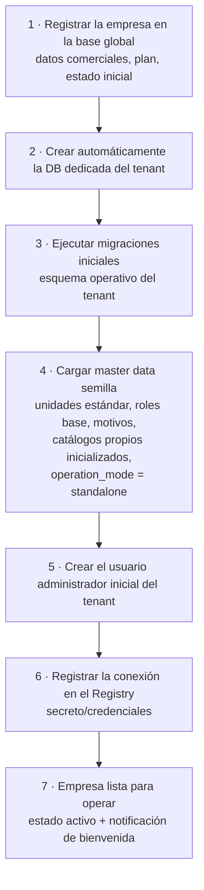
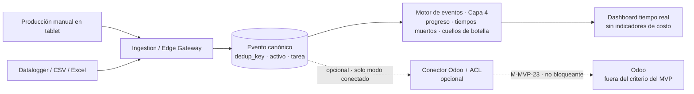
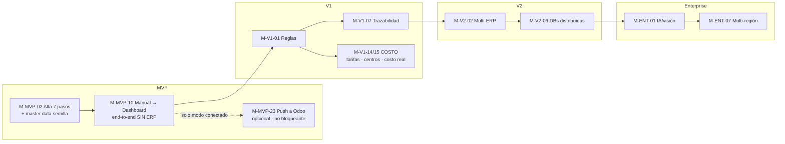

# Nexo — Hitos y criterios de aceptación

> **Documento:** `docs/specs/roadmap/milestones.md` · **Estado:** Borrador v0.1 · **Actualizado:** 2026-07-13
> **Roles:** Product Manager · Software Architect · UX Designer
> **Relacionados:** [roadmap.md](./roadmap.md) · [vision.md](./vision.md) · [backlog.md](./backlog.md) · [idea.md](../idea.md) · [layered-architecture.md](../specs/layered-architecture.md) · [master-data.md](../specs/master-data.md) · [work-model.md](../specs/work-model.md) · [execution.md](../specs/execution.md) · [event-engine.md](../specs/event-engine.md) · [digital-twin.md](../specs/digital-twin.md) · [multi-tenancy.md](../specs/multi-tenancy.md) · [control-plane.md](../specs/control-plane.md) · [integrations.md](../specs/integrations.md)

## Resumen ejecutivo

Este documento descompone las fases del [roadmap](./roadmap.md) en **hitos concretos y verificables**. Mientras el roadmap responde *qué* y *en qué orden*, los hitos responden *cómo sabemos que está hecho*: cada hito tiene un **entregable**, un **criterio de aceptación medible** y sus **dependencias**. Son la unidad de compromiso operativo y el insumo de seguimiento de avance.

Los hitos se organizan por fase (**MVP → V1 → V2 → Enterprise**) y comparten un principio: **si el criterio de aceptación no se puede demostrar de forma objetiva, el hito no está cumplido.** Nada de "casi listo": cada criterio describe una condición observable (un flujo que corre, un dato que llega, un KPI que coincide con su fórmula canónica, un aislamiento que se verifica).

Dos hitos son **faro** del MVP y se destacan por su valor probatorio: **"Alta de tenant end-to-end (7 pasos)"** —que demuestra el modelo multi-tenant DB-per-tenant y el time-to-value, y cuyo *definition of done* es que **un usuario pueda entrar y declarar producción sin ERP**— y **"Producción manual → dashboard (end-to-end, sin ERP)"** —que demuestra la propuesta de valor central: capturar en planta (carga manual o datalogger/CSV), normalizar al Evento canónico y **ver el progreso real en tiempo real, en modo *standalone***. El ***push* a Odoo dejó de ser parte del criterio de aceptación del MVP**: la integración ERP es **opcional** (reencuadre de INT-01, 2026-07-13) y vive como hito **aparte y no bloqueante** (**M-MVP-23**), validable solo en tenants en modo conectado. El hito **"Primer dato de PLC a Odoo"** (captura automática por protocolo industrial) pasa a **V1**. Ambos hitos faro del MVP se detallan de forma ampliada en las secciones §2.1 y §2.2.

> **🔺 Reencuadre (2026-07-13) — modelo por capas y tres decisiones cerradas.** Los hitos del MVP se reorganizan según el **modelo de 4 capas** (Capa 1 gemelo digital · Capa 2 modelo de trabajo · Capa 3 ejecución · Capa 4 motor de eventos; ver [layered-architecture.md](../specs/layered-architecture.md)), con el **ERP como conector opcional**: el sistema funciona **standalone**. Tres decisiones fijan el contenido y aparecen como hitos nuevos **M-MVP-17 a M-MVP-22**:
>
> - **PRD-16** — el MVP soporta **ambos perfiles de ejecución**: repetitivo (**Lote**) y **Proyecto**. El **compromiso** del proyecto (entregable + fecha objetivo + cliente) es **atributo de la Ejecución**, no un catálogo de Pedidos.
> - **MOD-18** — **DAG completo** de tareas desde el MVP: ramas paralelas, tipos de precedencia, lags y **validación de ciclos** (el editor visual queda en V1).
> - **MOD-17** — **master data propia mínima SIN COSTO** (unidades, productos/ítems, procesos, personas/roles, insumos sin costo, clientes mínimo), con importador CSV acotado. **Centros de costo, tarifas con vigencia, costo de insumos y la métrica de costo real se mueven a V1** (hitos **M-V1-14** y **M-V1-15**).
>
> **Consecuencia que atraviesa todos los criterios de aceptación de esta fase: el MVP mide TIEMPO y AVANCE, no COSTO.** Ningún hito del MVP se declara cumplido con un indicador monetario, y ningún criterio de aceptación del MVP puede exigirlo.

---

## 1. Cómo leer esta tabla

- **Hito:** entregable con nombre estable; se referencia desde el [backlog](./backlog.md) y el seguimiento.
- **Fase:** MVP / V1 / V2 / Enterprise (canónico, brief §11).
- **Entregable:** el artefacto o capacidad funcional que produce el hito.
- **Criterio de aceptación:** condición **medible y demostrable** que declara el hito cumplido.
- **Dependencias:** hitos u condiciones previas necesarias.

> Convención de identificadores: `M-<FASE>-<n>` (p. ej. `M-MVP-01`). Los dos hitos faro llevan además una descripción ampliada.

---

## 2. Hitos faro (destacados)

### 2.1 M-MVP-02 · Alta de tenant end-to-end (7 pasos)

**Por qué es faro:** prueba el requisito no negociable de **multi-tenancy DB-per-tenant** (brief §6) y el pilar de **time-to-value**: una empresa nueva queda lista para operar de forma **automatizada, repetible e idempotente**.

**El flujo funcional (canónico, brief §6.1):**

**Qué carga el paso 4 (seed, actualizado 2026-07-13):** ya no son solo motivos, roles y unidades. El alta deja al tenant con **master data semilla** que le permite operar sin ERP: **unidades de medida estándar** (SI + conteo + tiempo, con su magnitud y factor de conversión), **roles base**, **motivos** de scrap/parada, los **catálogos propios inicializados** (productos/ítems, insumos, personas, clientes) con su plantilla CSV disponible, y el **modo de operación en `operation_mode = standalone`** (ver [master-data.md](../specs/master-data.md) §5.1 y §7.3).

**Criterio de aceptación:** desde una solicitud de alta, el sistema ejecuta los **7 pasos** sin intervención manual; al finalizar, existe una **DB dedicada** con esquema migrado y **master data semilla** cargada (unidades estándar, roles base, motivos, catálogos propios inicializados y `operation_mode = standalone`), un **usuario administrador** operativo, la **conexión registrada** en el Connection Registry, y la empresa en estado **"activo"** con notificación de bienvenida enviada. El flujo es **idempotente** (reejecutar no duplica) y admite **rollback** si un paso falla. Un tenant recién creado **no ve datos** de ningún otro.

> **Definition of done del alta:** el usuario administrador recién creado **inicia sesión, da de alta un producto y declara producción — sin ERP y sin ningún paso manual de configuración previa**. Si para declarar producción hiciera falta conectar Odoo o cargar a mano un catálogo base, el hito **no está cumplido**.

### 2.2 M-MVP-10 · Producción manual → dashboard (end-to-end, sin ERP)

**Por qué es faro:** prueba la **propuesta de valor central del MVP** de punta a punta **en modo *standalone***: el dato se registra una sola vez en planta (carga manual o datalogger/CSV), se atribuye a su activo y a su tarea, y se convierte en **progreso visible** sin retipeo y **sin depender de ningún ERP**. Es el **caso estrella del MVP**.

**Criterio de aceptación:** un registro de producción **cargado manualmente en tablet** (o desde un **datalogger vía carga de archivo/CSV/Excel**) se normaliza a un **Evento canónico** (con `origin_metadata`, `dedup_key`, **activo dueño** y tarea/ejecución de imputación) y es **visible en el dashboard en tiempo real** en segundos, reflejado en el **progreso de la ejecución** correspondiente. Offline-first: ante conectividad intermitente, el evento **no se pierde ni se duplica** (store-and-forward + idempotencia).

> **El criterio se cumple con el tenant en modo *standalone***: **no se requiere ningún ERP** para darlo por cumplido, y el tablero **no muestra ningún indicador de costo**. El ***push* a Odoo** se prueba en el hito **aparte y no bloqueante M-MVP-23** (solo modo conectado). La **captura automática por protocolos industriales** (hito **"Primer dato de PLC a Odoo"**) es un hito de **V1** (ver §4).

---

## 3. Hitos de la fase MVP

> **Nota de lectura (2026-07-13).** Los identificadores son **estables** y la tabla se ordena por identificador, **no** por secuencia de ejecución. Los hitos **M-MVP-17 a M-MVP-22** se incorporaron con el modelo por capas y las decisiones PRD-16 / MOD-18 / MOD-17, y en la práctica **anteceden** al piloto (M-MVP-16): la secuencia real es **Capa 1** (M-MVP-17, M-MVP-18) → **Capa 2** (M-MVP-19) → **Capa 3** (M-MVP-20, M-MVP-21) → **Capa 4** (M-MVP-22) → caso estrella (M-MVP-10) → piloto (M-MVP-16). **M-MVP-23** (Odoo) queda fuera de esa cadena por ser opcional.

| Hito | Fase | Entregable | Criterio de aceptación (medible) | Dependencias |
|---|---|---|---|---|
| **M-MVP-01** · Fundaciones multi-tenant | MVP | Control Plane mínimo + Connection Registry + resolución de tenant | Se resuelve el tenant por subdominio/host o claim `tenant_id` del JWT y se obtiene la cadena de conexión correcta; un servicio "por tenant" opera contra la DB del tenant resuelto | — |
| **M-MVP-02** · Alta de tenant end-to-end (7 pasos) | MVP | Provisioning automatizado con **master data semilla** (ver §2.1) | Los 7 pasos corren sin intervención, idempotentes, con rollback; empresa en "activo" con `operation_mode = standalone`; **el admin entra y declara producción sin ERP** ni configuración manual previa; sin fuga entre tenants | M-MVP-01 |
| **M-MVP-03** · Identity & Access | MVP | AuthN/AuthZ con claim de tenant | Un usuario se autentica y recibe token con claim de tenant; el acceso a un recurso de otro tenant se deniega | M-MVP-01 |
| **M-MVP-04** · Licencias y planes básicos | MVP | Administration & Licensing mínimo | Un tenant tiene un plan con límites; superar un límite se bloquea o registra según política | M-MVP-02 |
| **M-MVP-05** · Ingesta datalogger/CSV + carga de archivo | MVP | Ingesta de datalogger vía carga de archivo/CSV/Excel (outbound) | Se ingesta un archivo de datalogger (CSV/Excel) real y se normaliza al Evento canónico; el modelo de Devices/ingesta contempla los protocolos industriales desde el día uno (se activan en V1) | M-MVP-01 |
| **M-MVP-06** · Evento canónico + idempotencia | MVP | Normalización + `dedup_key` | Toda fuente produce un Evento canónico con los campos mínimos (brief §8.1); eventos duplicados se descartan por `dedup_key` | M-MVP-05 |
| **M-MVP-07** · Store-and-forward | MVP | Buffer edge ante cortes | Tras un corte de red simulado, al restablecerse la conexión todos los eventos llegan una sola vez, en orden recuperable | M-MVP-05, M-MVP-06 |
| **M-MVP-08** · Módulos de dominio (Prod/Scrap/QC/Downtime) | MVP | Registro de los 5 tipos de datos | Se registran producción, scrap, calidad, paradas y eventos de máquina, cada uno con sus campos canónicos (motivo, cantidad, unidad, checklist según corresponda) y su **activo dueño**; **sin valorización de costo** (MOD-17) | M-MVP-06 |
| **M-MVP-09** · Carga manual en tablet (UX operario) | MVP | App/formularios de operario | Un operario registra los 5 tipos en tablet con mínimos toques; validación en origen; funciona con conectividad intermitente | M-MVP-08 |
| **M-MVP-10** · Producción manual → dashboard (end-to-end, **sin ERP**) | MVP | Flujo end-to-end en modo *standalone* (ver §2.2) | Registro manual/datalogger → Evento canónico (con activo y tarea) → progreso en el dashboard en tiempo real, **con el tenant en modo standalone y sin ningún ERP conectado**; sin doble carga y sin pérdida/duplicación ante cortes; **sin indicadores de costo** | M-MVP-05..07, M-MVP-09, M-MVP-11, M-MVP-18, M-MVP-22 |
| **M-MVP-11** · Dashboard en tiempo real | MVP | Read models + tablero CQRS con **KPIs por perfil** | El dashboard muestra OEE (Disponibilidad × Rendimiento × Calidad) y scrap rate con las fórmulas canónicas (brief §10.1) para el perfil **Lote**, y **% de avance, hitos y desvío contra la fecha objetivo** para el perfil **Proyecto** (sin OEE), actualizados en tiempo real; **ninguna vista expone indicadores monetarios** | M-MVP-08, M-MVP-22 |
| **M-MVP-12** · Conector Odoo + ACL (**opcional**) | MVP | Integración desacoplada con Odoo — **`Should`, no bloqueante** | Se hace *pull* de MO/Producto/UoM/Motivos y *push* de producción real (avance/cierre de MO) y scrap (agregado por cierre de corrida) vía ACL; calidad opcional; **el core no depende de Odoo y se verifica que apagar el conector no degrada ninguna capacidad del MVP**; se valida **solo en tenants en modo conectado** | M-MVP-06 |
| **M-MVP-13** · Job de sincronización con reintentos (**opcional**) | MVP | Sync Job resiliente — **solo modo conectado** | Un fallo transitorio de Odoo se reintenta y se resuelve sin pérdida ni duplicación; estado del job observable; **no bloquea el cierre de fase** | M-MVP-12 |
| **M-MVP-14** · Event Store inmutable (base) | MVP | Historial de eventos append-only | Un evento ingerido no puede alterarse; se puede consultar el historial por contexto (site/line/asset) | M-MVP-06 |
| **M-MVP-15** · Auditoría básica | MVP | Registro de acciones clave | Las acciones sensibles (alta de usuario, cambios de configuración) quedan auditadas por tenant | M-MVP-03 |
| **M-MVP-16** · Piloto y cliente de referencia | MVP | Despliegue productivo con un cliente | Un cliente opera en producción **en modo standalone** con evidencia objetiva de reducción de carga manual (NSM en movimiento, ver [vision.md](./vision.md) §2); el piloto es válido **con cualquiera de los dos perfiles** (Lote o Proyecto), sin exigir ERP | M-MVP-10, M-MVP-11, M-MVP-20 o M-MVP-21 |
| **M-MVP-17** · Master data mínima operativa (**sin costo**) | MVP | Catálogos propios (unidades, productos/ítems, insumos sin costo, personas/roles, clientes mínimo) con ABM + **importador CSV acotado** | Un tenant en modo *standalone* administra por ABM los catálogos mínimos de **MOD-17** y carga por CSV **unidades, productos, insumos y personas** con validación en dos etapas (estructural y semántica), **simulación previa** y reporte de errores por fila/columna; reimportar el mismo archivo **actualiza y no duplica** (idempotencia por código); el orden de dependencias se impone (unidades → productos/insumos → personas); **ningún catálogo expone campos de costo** | M-MVP-02, M-MVP-03 |
| **M-MVP-18** · Gemelo digital: jerarquía + **toda señal con Activo dueño** | MVP | Jerarquía Empresa→Planta→Sector→Línea→Centro de trabajo/Máquina + *binding* señal↔activo | La jerarquía de la planta piloto se modela completa y **el 100 % de las señales y eventos ingeridos resuelven un Activo dueño**; un evento sin activo atribuible **se rechaza o queda en bandeja de excepción y nunca se agrega a un KPI**; una consulta de auditoría devuelve **cero** eventos sin dueño físico | M-MVP-17 |
| **M-MVP-19** · Modelo de trabajo: Proceso con **DAG completo** | MVP | Definición de Procesos, Tareas e Insumos con DAG (ramas paralelas, tipos de precedencia, lags) por formulario/API | Se define un Proceso con **al menos dos ramas paralelas**, **más de un tipo de precedencia** y **al menos un lag**, y queda **versionado**; el sistema **rechaza todo grafo con ciclos** con un error comprensible que **identifica las aristas** que lo forman; el DAG está disponible en la API, no solo en la UI (**MOD-18**; editor visual → V1) | M-MVP-17, M-MVP-18 |
| **M-MVP-20** · Ejecución **perfil repetitivo (Lote)** | MVP | Run de perfil Lote sobre un Proceso versionado | Se lanza un Lote: las tareas se **instancian según el DAG** (las paralelas quedan habilitadas simultáneamente), se asignan a persona/rol, cambian de estado, registran **consumo real en cantidad** y cierran; el **% de avance ponderado** coincide con la ponderación de tareas terminadas y la ejecución queda atada a la **versión de Proceso con la que arrancó** | M-MVP-19 |
| **M-MVP-21** · Ejecución **perfil proyecto (Proyecto)** con compromiso | MVP | Run de perfil Proyecto con entregable, fecha objetivo y cliente | Se lanza una Ejecución de perfil proyecto **sobre el mismo modelo Proceso/Tarea/Insumo** que el Lote, con el **compromiso registrado como atributo de la Ejecución** (entregable + fecha objetivo + cliente del catálogo mínimo, **sin catálogo de Pedidos**); muestra **% de avance, hitos y desvío en días contra la fecha objetivo**, y **no se le aplica OEE** (**PRD-16**) | M-MVP-17, M-MVP-19 |
| **M-MVP-22** · Motor de eventos: **progreso, cuellos de botella y tiempos muertos** | MVP | Métricas derivadas de la Capa 4, con evidencia adjunta | A partir de los eventos, el sistema deriva y expone: **% de avance ponderado** por ejecución, **tiempo muerto** por activo/tarea (tiempo de calendario productivo sin avance declarado) y el **cuello de botella** de la ejecución (tarea/activo con mayor espera acumulada); cada métrica es **trazable a los eventos que la originan** (*drill-down*) y desde ella se recupera la **evidencia adjunta** (foto/archivo/lectura); **ninguna métrica del MVP se expresa en dinero** | M-MVP-06, M-MVP-20, M-MVP-21 |
| **M-MVP-23** · *Push* de producción a Odoo (**hito aparte, NO bloqueante**) | MVP (opcional) | Flujo end-to-end hacia el ERP en modo conectado | En un tenant **en modo conectado**, el mismo registro que ya se ve en el dashboard se **refleja en Odoo** vía el conector con ACL (*push* de producción real y scrap), sin doble carga y sin duplicación ante reintentos. **Este hito no condiciona el cierre del MVP:** si no hay tenant piloto con ERP, se valida en entorno de prueba y la fase cierra igual | M-MVP-10, M-MVP-12, M-MVP-13 |

**Criterio de salida de la fase MVP:** todos los hitos M-MVP-01 a M-MVP-11 y M-MVP-14 a M-MVP-22 cumplidos, y los criterios de salida del [roadmap](./roadmap.md) §2.5 verificados. **M-MVP-12, M-MVP-13 y M-MVP-23 (integración Odoo) NO son bloqueantes**: son `Should` y se validan solo en tenants en modo conectado (reencuadre de INT-01).

> **Nota de salida — el MVP no muestra costo (MOD-17).** Ningún hito del MVP se declara cumplido con un indicador monetario: **ni el tablero, ni los reportes, ni las métricas derivadas del motor de eventos exponen dinero**. El consumo de insumos se mide en **cantidad**, el trabajo en **tiempo** y la ejecución en **avance**. Centros de costo, tarifas con vigencia, costo de insumos y **costo real vs. estimado** son hitos de **V1** (**M-V1-14** y **M-V1-15**). Pedir un criterio de aceptación con costo dentro del MVP es un **cambio de alcance formal**, no un ajuste.

---

## 4. Hitos de la fase V1 (MES ligero)

| Hito | Fase | Entregable | Criterio de aceptación (medible) | Dependencias |
|---|---|---|---|---|
| **M-V1-01** · Motor de reglas | V1 | Rules Engine trigger-condición-acción | Una regla definida por el cliente evalúa una condición sobre eventos en tiempo real y ejecuta una acción | MVP (Evento canónico) |
| **M-V1-02** · Notificaciones multicanal | V1 | Notifications con plantillas y escalado | Una regla dispara una notificación por al menos dos canales, con plantilla por rol y escalado ante no-atención | M-V1-01 |
| **M-V1-03** · Alertas/alarmas por umbral | V1 | Alertas disparadas por reglas/umbral | Un umbral superado genera una alerta trazable a su regla y notifica al rol correspondiente | M-V1-01, M-V1-02 |
| **M-V1-04** · Adapter OPC UA | V1 | Captura OPC UA completa | Un servidor OPC UA real se lee y normaliza al Evento canónico | MVP (Edge) |
| **M-V1-05** · Adapter Modbus | V1 | Captura Modbus completa | Un dispositivo Modbus real se lee y normaliza al Evento canónico | MVP (Edge) |
| **M-V1-06** · Adapter MQTT | V1 | Captura MQTT completa | Un broker MQTT real publica lecturas que se normalizan al Evento canónico | MVP (Edge) |
| **M-V1-07** · Trazabilidad lote/serie | V1 | Genealogía sobre Event Store | Se reconstruye la genealogía completa de un lote/serie de punta a punta desde el historial inmutable | M-MVP-14 |
| **M-V1-08** · Reportes on-demand y programados | V1 | Reports exportables | Un reporte programado se genera y exporta automáticamente; sus cifras coinciden con el dashboard | M-MVP-11 |
| **M-V1-09** · RBAC avanzado con scoping | V1 | Control de acceso por planta/línea | El acceso se restringe por planta/línea según la matriz de [users-permissions.md](../specs/users-permissions.md); un usuario no ve fuera de su alcance | M-MVP-03 |
| **M-V1-10** · Observabilidad transversal | V1 | Logs/métricas/trazas en Control Plane | Un incidente de un tenant se diagnostica con una traza extremo a extremo desde el Control Plane | MVP |
| **M-V1-11** · Agente Edge + Adapter Siemens S7 | V1 | Captura automática desde PLC S7 | Un PLC Siemens S7 real se lee vía el Agente Edge/Gateway (outbound-only, store-and-forward) y se normaliza al Evento canónico | MVP (Ingesta) |
| **M-V1-12** · Primer dato de PLC a Odoo | V1 | Flujo end-to-end desde PLC | Una lectura/contador de un PLC S7 real → Evento canónico → dashboard en tiempo real → Odoo vía ACL; sin pérdida/duplicación ante cortes | M-V1-11, M-MVP-12 |
| **M-V1-13** · Modo híbrido real (manual + automático) | V1 | Híbrido por planta | En una misma planta conviven captura manual y automática por protocolo sobre el mismo Evento canónico | M-V1-11 |
| **M-V1-14** · Capa de costo en Master Data (**movida desde el MVP por MOD-17**) | V1 | Centros de costo, **tarifas con vigencia** y **costo de insumos con vigencia** | Se dan de alta centros de costo jerárquicos asociados a línea/activo, persona y proceso; tarifas y costos de insumo se **versionan con fecha de vigencia** (nunca edición destructiva); una consulta valorizada a una fecha pasada devuelve la **tarifa vigente a esa fecha**, no la actual, y cambiar una tarifa **no reescribe** ningún costo histórico | M-MVP-17 |
| **M-V1-15** · Costo real vs. estimado (**movido desde el MVP por MOD-17**) | V1 | Métrica de costo por ejecución y por tarea + valorización de scrap + KPIs de costo | Para un **Lote** y un **Proyecto** ya ejecutados en el MVP, el sistema calcula **costo real** (mano de obra por tarifa vigente + insumos consumidos valorizados) y su **desvío contra el estimado**, usando vigencias por **fecha de ocurrencia** y **sin recarga manual ni backfill** de los datos capturados en el MVP; el scrap queda valorizado y el tablero muestra los KPIs de costo por perfil | M-V1-14, M-MVP-22 |

**Criterio de salida V1:** hitos M-V1-01 a M-V1-15 cumplidos y criterios de salida del [roadmap](./roadmap.md) §3.5 verificados. **La dimensión de costo (M-V1-14 y M-V1-15) es compromiso de V1, no del MVP:** el MVP entrega tiempo y avance, V1 agrega el dinero.

---

## 5. Hitos de la fase V2 (Ecosistema y multi-ERP)

| Hito | Fase | Entregable | Criterio de aceptación (medible) | Dependencias |
|---|---|---|---|---|
| **M-V2-01** · Marketplace de conectores | V2 | Catálogo instalable | Un cliente instala un conector desde el Marketplace y queda operativo sin intervención del proveedor | V1 |
| **M-V2-02** · Conector multi-ERP | V2 | ERP distinto de Odoo (SAP/Dynamics/Oracle) | Un tenant sincroniza con un segundo ERP reutilizando el patrón ACL, sin tocar el core | M-MVP-12 |
| **M-V2-03** · Analytics avanzado | V2 | Tendencias/comparativas/cohortes | El analytics entrega vistas que el dashboard base no ofrecía, consistentes con los read models | M-MVP-11 |
| **M-V2-04** · Feature flags | V2 | Flags por tenant/plan | Una capacidad se habilita/inhabilita por tenant sin re-despliegue | M-MVP-04 |
| **M-V2-05** · Despliegues progresivos | V2 | Canary / blue-green | Un cambio se despliega a un subconjunto y se revierte automáticamente ante degradación | M-V1-10 |
| **M-V2-06** · Distribución geográfica de DBs | V2 | Migración de DB de tenant a otra región | La DB de un tenant se mueve a otra región sin cambios de lógica y sin downtime perceptible | M-MVP-01, M-MVP-02 |
| **M-V2-07** · Certificación de conectores de terceros | V2 | Gobernanza del catálogo | Un conector de tercero pasa sandbox/certificación antes de publicarse; puede revocarse | M-V2-01 |

**Criterio de salida V2:** hitos M-V2-01 a M-V2-06 cumplidos y criterios de salida del [roadmap](./roadmap.md) §4.5 verificados.

---

## 6. Hitos de la fase Enterprise (Inteligencia industrial)

| Hito | Fase | Entregable | Criterio de aceptación (medible) | Dependencias |
|---|---|---|---|---|
| **M-ENT-01** · IA de calidad / visión artificial | Enterprise | Modelo de visión/OCR/ML | Un modelo clasifica o inspecciona un caso real de calidad con precisión aceptada por el cliente; respeta aislamiento por tenant | V2, Files/Media, Quality |
| **M-ENT-02** · Mantenimiento predictivo | Enterprise | Modelos sobre señales/eventos | Se anticipa una condición de falla con antelación útil sobre datos históricos reales | Devices, Downtime (MTBF/MTTR) |
| **M-ENT-03** · Gemelo digital | Enterprise | Representación de planta/línea | El gemelo refleja el estado real de una línea a partir de eventos, con desfase acotado | M-ENT-01/02 |
| **M-ENT-04** · Energía y sustentabilidad | Enterprise | Consumo/huella | Se mide y reporta consumo energético de una línea y su indicador de sustentabilidad | Devices |
| **M-ENT-05** · Integración con MES/SCADA existentes | Enterprise | Conector a MES/SCADA legado | Nexo integra datos de un MES/SCADA de terceros vía ACL, sin comandar máquinas | Connectors |
| **M-ENT-06** · SLAs enterprise | Enterprise | Compromisos de servicio medidos | Disponibilidad y tiempos de respuesta se cumplen y reportan según el SLA contratado | M-V1-10, M-V2-05 |
| **M-ENT-07** · Alta disponibilidad multi-región | Enterprise | Operación en ≥2 regiones | La plataforma opera en dos regiones con failover probado y sin pérdida de datos | M-V2-06 |

**Criterio de salida Enterprise:** hitos M-ENT-01, M-ENT-02, M-ENT-06 y M-ENT-07 cumplidos y criterios de salida del [roadmap](./roadmap.md) §5.5 verificados.

---

## 7. Trazabilidad de hitos → fases → visión

Los hitos alimentan el seguimiento de las fases del [roadmap](./roadmap.md) y prueban las capas de la [visión](./vision.md); el trabajo que los realiza se detalla en el [backlog](./backlog.md).

---

## Preguntas abiertas

1. **Umbral de "precisión aceptada" en IA (M-ENT-01/02).** ¿Qué métrica y qué valor definen el éxito de un modelo con cada cliente? Debe pactarse por caso.
2. **Definición de "sin downtime perceptible" (M-V2-06, M-ENT-07).** ¿Qué ventana de indisponibilidad se tolera en una migración/failover? Ligar a los SLAs de [product.md](../specs/product.md).
3. ♻️ **Reencuadrada (2026-07-13 — MOD-17). Alcance del seed inicial (M-MVP-02, paso 4).** Ya está cerrado **qué** carga el seed: unidades estándar, roles base, motivos, catálogos propios inicializados y `operation_mode = standalone`. Queda abierto lo fino: ¿qué juego de **unidades** y de **motivos** se considera "estándar" por industria, y hasta dónde se precarga sin ensuciar el catálogo del cliente?
4. ♻️ **Resuelto (2026-07-11), reencuadrado (2026-07-13):** el alcance del conector Odoo sigue vigente (*pull* de MO/Producto/UoM/Motivos y *push* de producción real y scrap; calidad opcional), pero **la integración es opcional**: M-MVP-12, M-MVP-13 y M-MVP-23 bajan a `Should` y **no bloquean** el cierre del MVP — ver [tablero de decisiones](../open-questions-board.md).
5. **Medición objetiva de "reducción de carga manual" (M-MVP-16).** ¿Cómo se instrumenta la evidencia para el cliente de referencia? Coordinar con la NSM de [vision.md](./vision.md).
6. **Criterio de captura de lote/serie en MVP vs. V1.** ¿Se registra lote/serie ya en el MVP para habilitar M-V1-07 sin backfill?
7. **Prioridad de MQTT (M-V1-06).** ¿Es Must o Should en V1 según demanda real de los primeros clientes?
8. **Fórmula canónica de "tiempo muerto" y "cuello de botella" (M-MVP-22).** El criterio exige que sean medibles: falta congelar la definición (¿tiempo muerto contra calendario de turno o contra ventana de ejecución? ¿cuello de botella por espera acumulada o por utilización del activo?) para que el hito no dependa de interpretación.
9. **Cobertura de perfiles en el piloto (M-MVP-16).** Con ambos perfiles dentro del MVP (PRD-16), ¿el cierre de fase exige **un piloto de cada perfil** o basta con uno productivo y el otro demostrado en entorno de prueba?
