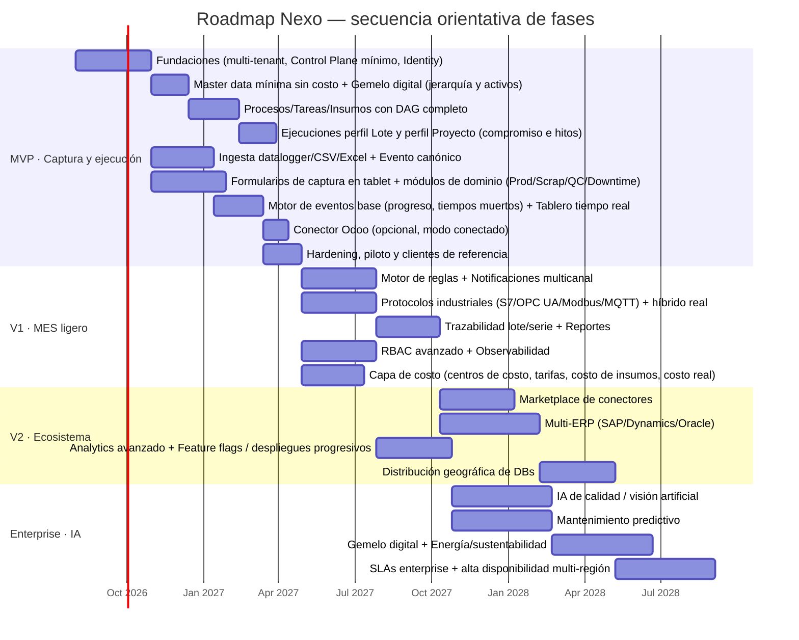
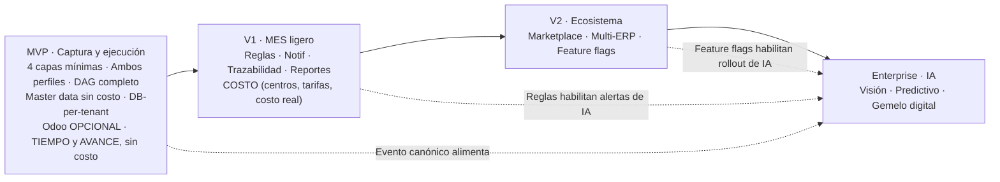

# Nexo — Roadmap por fases

> **Documento:** `specs/roadmap/roadmap.md` · **Estado:** Borrador v0.1 · **Actualizado:** 2026-07-13
> **Roles:** Product Manager · Software Architect · UX Designer
> **Relacionados:** [vision.md](./vision.md) · [milestones.md](./milestones.md) · [backlog.md](./backlog.md) · [idea.md](../idea.md) · [product.md](../specs/product.md) · [layered-architecture.md](../specs/layered-architecture.md) · [master-data.md](../specs/master-data.md) · [architecture.md](../specs/architecture.md) · [modules.md](../specs/modules.md) · [future-features.md](../specs/future-features.md)

## Resumen ejecutivo

Este documento traduce la [visión](./vision.md) en un **plan de fases** ejecutable: **MVP → V1 → V2 → Enterprise**. Para cada fase define objetivos, funcionalidades, prioridad **MoSCoW**, dependencias, una **tabla de riesgos y mitigaciones** y **criterios de salida** medibles que habilitan el pasaje a la siguiente. Es el puente entre la estrategia (qué queremos ser) y la ejecución (qué construimos y en qué orden), y la fuente de la que se derivan los [hitos](./milestones.md) y el [backlog](./backlog.md).

La secuencia respeta la **escalera evolutiva de peldaños** de la visión: el MVP entrega el peldaño de **captura y ejecución** (eliminar la carga manual, ver el progreso real, tablero en tiempo real, multi-tenant DB-per-tenant); V1 y V2 construyen el **MES ligero** (reglas, notificaciones, trazabilidad, reportes, **la capa de costo**, más protocolos, Marketplace, multi-ERP, distribución geográfica); y Enterprise incorpora la **inteligencia industrial** (IA/visión, mantenimiento predictivo, simulación sobre el gemelo digital, SLAs enterprise). Cada fase reutiliza y capitaliza la anterior; el **Evento canónico** capturado desde el MVP es el activo que habilita todo lo demás.

> **🔺 Impacto de fase del cambio de encuadre (2026-07-13) — modelo por capas + ERP opcional.** La adopción del **modelo de 4 capas** (ver [layered-architecture.md](../specs/layered-architecture.md) y [vision.md](./vision.md) §1.4) mueve dos cosas en este roadmap, y **ninguna es cosmética**:
>
> 1. **El MVP suma alcance: Master Data propia mínima.** Como el sistema debe funcionar **sin ERP** (modo *standalone*), el MVP necesita sus propios catálogos —unidades de medida, productos/ítems, procesos, personas/roles, insumos y clientes— con ABM e importación CSV. Su mínimo exacto quedó cerrado en **MOD-17** (ver el recuadro siguiente).
> 2. **El MVP pierde un bloqueante: la integración ERP pasa a ser opcional.** El conector Odoo deja de ser `Must` y de condicionar los criterios de salida: baja a `Should` y se valida **solo en tenants en modo conectado**. Un piloto sin ERP es un piloto válido (reencuadre de **INT-01**).
>
> Además, las cuatro capas están **presentes desde el MVP en versión mínima** (gemelo digital, procesos/tareas, ejecuciones, motor de eventos): lo que evoluciona por fase es su **profundidad**, no su existencia. Las métricas derivadas de la Capa 4 (**progreso, cuellos de botella, tiempos muertos**) entran ya en el MVP.

> **🔺 Decisiones cerradas (2026-07-13) — PRD-16, MOD-18 y MOD-17. Nota de alcance honesta.** Tres decisiones fijan el contenido del MVP y **cambian su tamaño en las dos direcciones**:
>
> 1. **PRD-16 — el MVP soporta AMBOS perfiles:** repetitivo (**Lote**) y proyecto (**Proyecto**). **Agranda el MVP:** entra el compromiso del proyecto (entregable, fecha objetivo, cliente) como **atributo de la Ejecución**, hitos, % de avance, desvío de cronograma y KPIs por perfil en el tablero. Deja de haber un "perfil correcto" de piloto.
> 2. **MOD-18 — DAG COMPLETO de tareas desde el MVP:** ramas paralelas, **tipos de precedencia** y **validación de ciclos**, en el modelo y en la API. **Agranda el MVP**, y evita la migración forzada de procesos y ejecuciones vivas que provocaría un modelo lineal. El **editor visual** del grafo se queda en V1.
> 3. **MOD-17 — master data mínima SIN COSTO:** entran unidades, productos/ítems, procesos (con DAG), personas y roles, **insumos sin costo** y **clientes (mínimo)**; el importador CSV se acota a **unidades/productos/insumos/personas**. **Achica el MVP:** salen a **V1** los **centros de costo**, las **tarifas con vigencia**, el **costo de insumos** y la **métrica de costo real**.
>
> **El balance, dicho sin maquillaje:** el MVP **creció** por (1) y (2), y lo que lo **compensa** es el recorte de (3) — no hay un tercer ahorro escondido, ni el crecimiento se absorbe "con eficiencia". **El MVP mide TIEMPO y AVANCE, no COSTO**, y ese es el precio que se paga por entrar con los dos perfiles y el DAG completo. Si el equipo no acepta ese intercambio, la única palanca real que queda es volver a un solo perfil.

Las fases y su contenido son **canónicos** (brief §11): no se agregan ni se mueven capacidades entre fases sin actualizar este documento y la visión. Las fechas relativas del diagrama son orientativas de secuencia y dependencia, no compromisos contractuales; los compromisos verificables viven como criterios de aceptación en [milestones.md](./milestones.md).

---

## 1. Vista general de las fases

| Fase | Tema | Peldaño (visión) | Profundidad de las 4 capas | Resultado de negocio |
|---|---|---|---|---|
| **MVP** | Capturar, ejecutar y probar el valor **en tiempo y avance** | Captura y ejecución | Las 4 capas en versión mínima + master data propia **sin costo**; Capas 2-3 con **ambos perfiles** y **DAG completo** | La planta deja de cargar datos a mano y ve su progreso real —en lote y en proyecto—; opera **sin ERP** (Odoo opcional). **No mide costo.** |
| **V1** | Automatizar, trazar **y costear** | MES ligero | Capa 4 (reglas, trazabilidad, reportes, **costo real**) y Master Data (**capa de costo**) | El dato dispara acciones (reglas/notificaciones), se traza, se reporta y **se valoriza** |
| **V2** | Ecosistema y multi-ERP | MES ligero | Conector lateral: multi-ERP + Marketplace | Marketplace, varios ERPs, despliegues progresivos, DBs distribuidas |
| **Enterprise** | Inteligencia industrial | Inteligencia | Capa 1 (simulación) y Capa 4 (predicción/visión) | IA/visión, predicción, simulación sobre el gemelo digital, SLAs y multi-región |

### 1.1 Cronograma orientativo (Gantt)

> Las duraciones son relativas y sirven para comunicar **secuencia y solapamiento**, no fechas comprometidas. El día cero es el inicio de construcción del MVP.

### 1.2 Dependencias entre fases (mapa)

---

## 2. Fase MVP — Captura, ejecución y prueba de valor

**Tema:** eliminar la carga manual, **mostrar el progreso real del trabajo** —en producción repetitiva **y** en proyecto— y demostrar valor con el mínimo alcance viable — **sin depender de un ERP** y **sin medir costo**.

### 2.1 Objetivos

- Modelar un **gemelo digital mínimo** de la planta (Empresa → Planta → Sector → Línea → Centro de trabajo/Máquina) con **cada señal ligada a su activo**.
- Definir **Procesos, Tareas e Insumos** con **DAG completo de tareas** (ramas paralelas, **tipos de precedencia** y **validación de ciclos**) y **ejecutarlos** como Ejecuciones con avance, consumo real y evidencia (**MOD-18**).
- Soportar **ambos perfiles de ejecución (PRD-16)**: **Lote** (repetitivo) y **Proyecto** (trabajo único), sobre el mismo modelo. El **compromiso del proyecto** —entregable, fecha objetivo y cliente— se registra como **atributo de la Ejecución de perfil proyecto**, no como catálogo de pedidos.
- Poseer una **Master Data propia mínima y SIN COSTO (MOD-17)**: unidades de medida, productos/ítems, procesos (con DAG), personas y roles, **insumos sin costo** y **clientes (mínimo)**, que permita operar en **modo standalone**, sin ERP. **Importador CSV solo para unidades, productos, insumos y personas.**
- Derivar en la Capa 4 las primeras **métricas de verdad**: **progreso, tiempos muertos y cuellos de botella**, además del OEE base. **El MVP mide tiempo y avance: no calcula costo** (centros de costo, tarifas, costo de insumos y costo real vs. estimado son objetivos de **V1**).
- Registrar **Producción, Scrap, Controles de Calidad, Paradas y Eventos de máquina** normalizados al **Evento canónico** (fecha, origen, valor, evidencia).
- Capturar desde **datalogger vía carga de archivo/CSV/Excel** y **carga manual**, normalizando al Evento canónico (el modelo de Devices/ingesta contempla los protocolos industriales desde el día uno, pero se activan en V1).
- Permitir la carga manual desde tablets mediante **formularios de captura** con UX de operario (offline-first). *(Formulario de captura = el operario ingresa datos; tablero = solo visualiza KPIs.)*
- Demostrar el **caso estrella del MVP** (perfil repetitivo): **producción manual → tablero en tiempo real**, y **→ Odoo** cuando el tenant está en modo conectado. En perfil proyecto, el caso equivalente es **avance de tarea → progreso y desvío del proyecto**.
- Ofrecer un **tablero en tiempo real** con **KPIs por perfil**: OEE y sus factores + scrap rate para el perfil lote; **% de avance, desvío contra la fecha objetivo e hitos** para el perfil proyecto; progreso, tiempos muertos y cuellos de botella para ambos. **Sin indicadores de costo.**
- **Integrar con Odoo** vía conector desacoplado con ACL — **opcional, no bloqueante** (reencuadre de INT-01, 2026-07-13).
- Operar **multi-tenant con base de datos por tenant** y un **Control Plane mínimo** (alta de tenant en 7 pasos, licencias básicas).
- Probar objetivamente la **reducción de carga manual** con clientes de referencia.

### 2.2 Funcionalidades y prioridad (MoSCoW)

| Funcionalidad | Módulo (BC) | MoSCoW |
|---|---|---|
| Alta de tenant end-to-end (7 pasos, DB-per-tenant) | Tenant Provisioning | **Must** |
| AuthN/AuthZ con claim de tenant en el token | Identity & Access | **Must** |
| Registro de conexión de tenant (Connection Registry) | Tenant Provisioning / Control Plane | **Must** |
| Planes/licencias básicas y límites | Administration & Licensing | **Must** |
| **Master data propia mínima SIN COSTO** (unidades de medida, productos/ítems, procesos, personas/roles, **insumos sin costo**) con ABM | Master Data | **Must** |
| **Clientes (mínimo)**: alta básica para atribuir el compromiso de una Ejecución de perfil proyecto | Master Data | **Must** |
| **Importador CSV acotado**: solo unidades, productos, insumos y personas | Master Data | **Must** |
| **Centros de costo, tarifas con vigencia y costo de insumos** en master data | Master Data | **Won't** (V1) |
| **Modo de operación del tenant** (*standalone* / *conectado*) y su efecto sobre qué catálogos son editables | Master Data / Connectors | **Must** |
| **Gemelo digital mínimo**: jerarquía Empresa→Planta→Sector→Línea→Activo y **binding señal↔activo** | Digital Twin | **Must** |
| Estado en vivo del activo y navegación del gemelo en la UI | Digital Twin | **Should** |
| **Definición de Procesos** en **ambos perfiles** (repetitivo y proyecto) con **Tareas** e **Insumos**, tiempos estándar y rol responsable | Work Model | **Must** |
| **DAG completo de tareas**: ramas paralelas, **tipos de precedencia** y **validación de ciclos** en el modelo y la API (edición por formulario/lista) | Work Model | **Must** |
| Editor **visual** del grafo de tareas (DAG) | Work Model | **Won't** (V1) |
| Versionado de Proceso y ejecución atada a la versión con la que arrancó | Work Model | **Should** |
| **Ejecución (Run)** de perfil **Lote**: tareas instanciadas, asignación, estados, consumo real y cierre | Execution | **Must** |
| **Ejecución (Run)** de perfil **Proyecto**: mismo modelo, con **compromiso** (entregable, fecha objetivo, cliente) como atributo de la Ejecución, **hitos** y **% de avance** | Execution | **Must** |
| **Desvío de cronograma** del proyecto (avance real vs. fecha objetivo) y ruta crítica derivada del DAG | Execution / Event Engine | **Should** |
| **Motor de eventos**: contrato de evento (fecha/origen/valor/evidencia) + atribución a activo/tarea/ejecución | Event Engine | **Must** |
| **Métricas derivadas base**: **progreso** ponderado, **tiempos muertos** y **cuellos de botella** — **de tiempo y avance, sin costo** | Event Engine | **Must** |
| **Métrica de costo real vs. estimado** y productividad valorizada | Event Engine | **Won't** (V1) |
| **Evidencia** adjunta al evento/tarea (foto, archivo, lectura), requerida por tarea de forma configurable | Event Engine / Files / Media | **Should** |
| Ingesta de datalogger vía carga de archivo/CSV/Excel + carga manual | Ingestion / Edge Gateway | **Must** |
| Normalización al Evento canónico + `dedup_key` (idempotencia) | Ingestion / Edge Gateway | **Must** |
| Store-and-forward / offline-first ante cortes de conectividad (manual y datalogger) | Ingestion / Edge Gateway | **Must** |
| Alta y salud básica de dispositivos y señales/tags | Devices | **Must** |
| Registro de producción (orden/máquina/turno) | Production | **Must** |
| Registro de scrap (motivo + cantidad) — **sin valorización de costo** | Scrap | **Must** |
| Inspección de calidad con checklist/variables | Quality | **Must** |
| Registro de paradas con motivo (Reason Code) | Downtime | **Must** |
| **Formularios de captura** en tablet (UX operario) para los 5 registros + avance de tarea | Production/Scrap/Quality/Downtime | **Must** |
| **Tablero** en tiempo real (CQRS/read models) con OEE, scrap rate y **progreso de ejecuciones** | Dashboards / Analytics | **Must** |
| **KPIs por perfil** en el tablero (OEE/scrap para lote; % de avance, desvío e hitos para proyecto) | Dashboards / Analytics | **Must** |
| Conector Odoo (órdenes/productos/cantidades) con ACL — **opcional: el MVP funciona sin ERP** | Connectors / Integrations | **Should** |
| Job de sincronización con reintentos básicos (solo modo conectado) | Connectors / Integrations | **Should** |
| Historial de eventos inmutable (base de trazabilidad) | Traceability / Event Store | **Should** |
| Auditoría de acciones básicas | Audit | **Should** |
| Adjuntar foto/evidencia a un registro | Files / Media | **Could** |
| Estado de tenants/servicios en Control Plane (salud mínima) | Observability | **Could** |
| Notificación de bienvenida al alta de tenant | Notifications | **Could** |
| Captura automática por protocolos industriales (S7/OPC UA/Modbus/MQTT), motor de reglas, multi-ERP, marketplace, IA, simulación sobre el gemelo | (varios) | **Won't** (fase posterior) |
| **Toda la dimensión de costo** (centros de costo, tarifas con vigencia, costo de insumos, costo real vs. estimado) y el **catálogo de pedidos/órdenes de cliente** | Master Data / Event Engine | **Won't** (V1) |

### 2.3 Dependencias

- **Internas:** el multi-tenancy DB-per-tenant y el Control Plane mínimo son prerrequisito de todo lo demás; Identity & Access habilita el resto de servicios. **La Master Data y el gemelo digital (Capa 1) son ahora prerrequisito de Procesos (Capa 2), que a su vez lo es de Ejecución (Capa 3)**; el Evento canónico (Ingestion) alimenta el Motor de eventos (Capa 4), que es prerrequisito del tablero. El Conector Odoo depende del Evento canónico, pero **ninguna otra pieza depende de él**.
- **Externas:** acceso de red desde el edge del cliente hacia la nube (outbound); datalogger / archivos CSV/Excel del piloto (los PLC/protocolos industriales entran en V1); **catálogos del cliente** (unidades, productos, insumos, personas) para cargar la master data inicial por CSV. Si el piloto es de **perfil proyecto**, se suma el **listado de clientes** y el compromiso de cada obra/proyecto (entregable y fecha objetivo). La disponibilidad de un **entorno Odoo** deja de ser dependencia bloqueante: solo aplica a pilotos en modo conectado. **No se depende de datos de costo del cliente** (tarifas, precios de insumos): quedan fuera del MVP.
- **De arquitectura:** broker de mensajería (event-driven), object storage por tenant, gestión de secretos para cadenas de conexión. Ver [architecture.md](../specs/architecture.md).

### 2.4 Riesgos y mitigaciones

| Riesgo | Impacto | Prob. | Mitigación |
|---|---|---|---|
| Complejidad del alta automatizada de DB-per-tenant (7 pasos) retrasa todo | Alto | Media | Automatizar y probar el flujo como primer hito; idempotencia y rollback por paso; ver [milestones.md](./milestones.md) |
| Conectividad intermitente del edge causa pérdida de datos | Alto | Alta | Store-and-forward + `dedup_key` como Must; pruebas de corte de red desde el diseño |
| Formatos heterogéneos de datalogger/CSV/Excel dificultan el parseo | Medio | Media | Acotar el MVP a datalogger + CSV/Excel con plantillas; validar con archivos reales del piloto; los protocolos industriales (S7/OPC UA/Modbus/MQTT) se acotan en V1 |
| Mapeo Odoo (objetos/direccionalidad) mal definido | Medio | Alta | Cerrar alcance de sincronización con el cliente piloto; ACL aísla el core; **el conector es `Should`: si se atrasa, el MVP igual sale en modo standalone** |
| **La master data propia agranda el MVP** (ABM, importación, validaciones, permisos) y retrasa la fase | Medio | Media | **Acotada por MOD-17** al mínimo sin costo (unidades, productos, procesos, personas/roles, insumos sin costo, clientes mínimo); **importador CSV limitado a unidades/productos/insumos/personas**; seed idempotente antes que UI rica |
| **El MVP creció por PRD-16 (ambos perfiles) y MOD-18 (DAG completo)**: más modelo, más UI y más KPIs de los planificados | Alto | **Alta** | El recorte de **toda la dimensión de costo** (MOD-17) es la compensación explícita y ya está tomada; no hay una segunda palanca de ahorro — si la fecha se compromete, la decisión a reabrir es **PRD-16** (arrancar con un solo perfil), no recortar el DAG |
| **Expectativa de costo mal gestionada en ventas/piloto**: se promete "costo real vs. estimado" que el MVP no calcula | Alto | Media | Decirlo explícito en material comercial y en el piloto: **el MVP mide tiempo y avance**; el costo es compromiso de V1; no hay indicadores de costo en el tablero del MVP |
| **Un piloto de perfil proyecto exige más UX de la prevista** (hitos, cronograma, desvío) | Medio | Media | Alcance acotado: compromiso como atributo de la Ejecución, hitos y % de avance; sin editor visual de DAG ni cronograma tipo Gantt editable en el MVP |
| **Conciliación al conectar un ERP después** (duplicados, referencias rotas de procesos/ejecuciones vivas) | Alto | Media | Referencia externa por entidad desde el día uno; conciliación asistida con confirmación humana; ver **INT-07** |
| Modelo de tareas insuficiente (solo lineal) obliga a migrar procesos y ejecuciones vivas | Alto | Baja | **Mitigado por MOD-18 (resuelto):** el **DAG completo** —ramas paralelas, tipos de precedencia y validación de ciclos— entra en el modelo y la API del MVP; la UI puede seguir siendo lineal/por formulario |
| Evidencia obligatoria mal calibrada frena la línea (o queda decorativa) | Medio | Media | Requisito configurable por tarea con override justificado y auditado; ver **MOD-19** |
| UX de operario insuficiente → los operarios no cargan | Alto | Media | Diseño con operarios reales, pruebas en planta, mínimos toques; ver [ui-ux.md](../specs/ui-ux.md) |
| Fuga de datos entre tenants (aislamiento) | Crítico | Baja | DB-per-tenant no negociable; resolución de tenant por claim/Registry; auditoría; ver [multi-tenancy.md](../specs/multi-tenancy.md) |
| Sobre-alcance (scope creep) hacia features de V1 | Medio | Alta | MoSCoW estricto; "Won't" explícito; disciplina de fase |

### 2.5 Criterios de salida (Exit Criteria)

- [ ] **Alta de tenant end-to-end** ejecuta los 7 pasos y deja la empresa en estado "activo" de forma automatizada y repetible.
- [ ] **Un tenant opera de punta a punta en modo *standalone*, sin ERP:** carga su master data mínima (**sin costo**), define un Proceso con Tareas e Insumos, lanza una Ejecución y ve su progreso en el tablero. **Este es el criterio que reemplaza a "sin ERP no hay MVP".**
- [ ] **Producción manual → tablero en tiempo real (caso estrella):** un registro de producción cargado a mano en un formulario de captura se ve en el tablero en tiempo real, atribuido a su activo y a su tarea.
- [ ] **Los dos perfiles funcionan en el MVP (PRD-16):** un **Lote** y un **Proyecto** se planifican y ejecutan con el **mismo modelo** de Proceso/Tarea/Insumo; el Proyecto lleva su **compromiso** (entregable, fecha objetivo y cliente) como atributo de la Ejecución, muestra **% de avance, hitos y desvío contra la fecha objetivo**, y **no se le aplica OEE**.
- [ ] **DAG completo demostrado (MOD-18):** un Proceso con **ramas paralelas** y **más de un tipo de precedencia** se define, se ejecuta y calcula progreso correctamente; el sistema **rechaza un grafo con ciclos** con un error comprensible.
- [ ] **Importador CSV acotado:** unidades, productos, insumos y personas se cargan por CSV con validación y reporte de errores; el resto de los catálogos se administra por ABM.
- [ ] **El MVP no muestra costo:** ni el tablero ni los reportes del MVP exponen indicadores monetarios; el criterio de "costo real vs. estimado" se traslada íntegro a los criterios de salida de **V1**.
- [ ] **Sincronización con Odoo (solo modo conectado, no bloqueante):** en un tenant con ERP, el mismo registro se sincroniza con Odoo vía el conector. Si no hay tenant piloto con ERP, este criterio se valida en entorno de prueba y **no detiene el cierre de fase**.
- [ ] **Primer dato de datalogger/CSV:** un evento capturado desde un datalogger (carga de archivo/CSV/Excel) se ve en el tablero en tiempo real (y se refleja en Odoo si el tenant está conectado).
- [ ] Los **cinco registros** (producción, scrap, calidad, paradas, eventos) se capturan por **formulario de captura en tablet** y por **datalogger/CSV** (la captura automática por protocolos industriales se valida en V1).
- [ ] **Cada señal está ligada a un activo** del gemelo digital: no existen datos sin dueño físico en el tenant piloto.
- [ ] El **tablero** muestra OEE (con sus tres factores) y scrap rate calculados con las fórmulas canónicas, en tiempo real, **más el progreso de las ejecuciones activas y sus tiempos muertos**, y aplica los **KPIs correctos según el perfil** de cada ejecución.
- [ ] **Store-and-forward** demostrado: tras un corte de red simulado, ningún evento se pierde ni se duplica.
- [ ] **Aislamiento** verificado: un tenant no puede acceder a datos de otro (prueba de penetración básica).
- [ ] Al menos **un cliente de referencia** en producción con evidencia objetiva de reducción de carga manual (NSM en movimiento, ver [vision.md](./vision.md) §2).

---

## 3. Fase V1 — MES ligero: automatizar y trazar

**Tema:** el dato deja de solo mostrarse y empieza a **disparar acciones**, a **trazarse**, a **reportarse** y a **valorizarse** — V1 es la fase donde entra **todo el costo** que el MVP dejó afuera (MOD-17).

### 3.1 Objetivos

- Habilitar un **motor de reglas** (trigger-condición-acción) en tiempo real.
- Enviar **notificaciones multicanal** con plantillas y escalado.
- Incorporar la **captura automática por protocolos industriales** (**Siemens S7, OPC UA, Modbus, MQTT**) y habilitar el **modo híbrido real** (manual + automático por planta).
- Entregar **reportes** on-demand y programados, exportables.
- Implementar **trazabilidad de lote/serie** (genealogía) sobre el Event Store inmutable.
- Elevar el control de acceso a **RBAC avanzado** con scoping por planta/línea (y ABAC donde aplique).
- Consolidar la **observabilidad** transversal (logs/métricas/trazas en Control Plane).
- **Incorporar la dimensión de costo, ausente en el MVP (MOD-17):** **centros de costo**, **tarifas con vigencia**, **costo de insumos** y la **métrica de costo real vs. estimado** por ejecución y por tarea.
- **Profundizar el perfil Proyecto** —que ya opera desde el MVP (PRD-16)— con cronograma editable, ruta crítica avanzada y reprogramación asistida.
- Entregar el **editor visual del grafo de tareas (DAG)** sobre el modelo de DAG completo que el MVP ya trae (MOD-18).
- Completar la **Master Data propia** (clientes enriquecidos, capa de costo) y la **conciliación asistida** al conectar un ERP a un tenant que venía en modo *standalone*.

### 3.2 Funcionalidades y prioridad (MoSCoW)

| Funcionalidad | Módulo (BC) | MoSCoW |
|---|---|---|
| Motor de reglas trigger-condición-acción en tiempo real | Rules Engine | **Must** |
| Notificaciones multicanal + plantillas + escalado | Notifications | **Must** |
| Agente Edge/Gateway + adapters Siemens S7, OPC UA y Modbus (captura automática) | Ingestion / Edge Gateway | **Must** |
| Modo híbrido real (manual + automático por planta) | Ingestion / Devices | **Must** |
| Adapter MQTT completo | Ingestion / Edge Gateway | **Should** |
| **Capa de costo en Master Data**: centros de costo, **tarifas con vigencia** y **costo de insumos** (movido desde el MVP por **MOD-17**) | Master Data | **Must** |
| **Métrica de costo real vs. estimado** por ejecución y por tarea, y valorización del scrap | Event Engine / Dashboards | **Must** |
| **Perfil Proyecto avanzado**: cronograma editable, ruta crítica avanzada y reprogramación (*el perfil Proyecto base ya entra en el MVP por PRD-16*) | Execution / Work Model | **Must** |
| Editor visual del **grafo de tareas (DAG)** con precedencias y paralelismo (*el modelo de DAG completo ya está en el MVP por MOD-18*) | Work Model | **Should** |
| **Master data completa** (clientes enriquecidos, pedidos si el negocio los requiere) y **conciliación asistida** standalone → conectado | Master Data / Connectors | **Must** |
| Productividad por recurso y métricas derivadas avanzadas de la Capa 4 | Event Engine / Dashboards | **Should** |
| **KPIs por perfil de costo** en el tablero (costo real vs. estimado por lote y por proyecto) | Dashboards / Analytics | **Should** |
| Trazabilidad y genealogía de lote/serie | Traceability / Event Store | **Must** |
| Reportes on-demand y programados, exportables | Reports | **Must** |
| RBAC avanzado con scoping por planta/línea | Identity & Access | **Must** |
| Extensiones ABAC donde aplique | Identity & Access | **Should** |
| Observabilidad transversal (logs/métricas/trazas) | Observability | **Must** |
| Alertas/alarmas por umbral disparadas por reglas | Rules Engine / Notifications | **Should** |
| Salud avanzada de dispositivos y firmware/OTA | Devices | **Could** |
| Gestión de evidencias/archivos enriquecida | Files / Media | **Could** |
| Marketplace, multi-ERP, IA | (varios) | **Won't** (fase posterior) |

### 3.3 Dependencias

- **Del MVP:** el Evento canónico, el Event Store y el edge deben estar sólidos; las reglas y la trazabilidad se apoyan en ellos.
- **Internas:** el motor de reglas es prerrequisito de las alertas/alarmas; RBAC avanzado condiciona el scoping de reportes y dashboards; la observabilidad requiere instrumentación en todos los servicios.
- **Externas:** entornos de prueba con OPC UA/Modbus/MQTT reales; catálogos de motivos (Reason Codes) del cliente para trazabilidad y reportes.

### 3.4 Riesgos y mitigaciones

| Riesgo | Impacto | Prob. | Mitigación |
|---|---|---|---|
| Motor de reglas mal acotado deriva en complejidad inmanejable | Alto | Media | Modelo trigger-condición-acción simple y evaluable; límites por tenant; iterar casos reales |
| "Tormenta de notificaciones" molesta y se ignora | Medio | Alta | Escalado, agrupación, umbrales y silenciamiento; plantillas por rol/persona |
| Heterogeneidad de OPC UA/Modbus entre fabricantes | Alto | Media | Certificar por dispositivo; suite de pruebas de interoperabilidad; priorizar los más comunes |
| Trazabilidad exige datos que el MVP no capturó (lote/serie) | Alto | Media | Definir captura de lote/serie desde el diseño; migración/backfill controlada |
| **El costo llega en V1 sobre datos históricos del MVP sin valorizar** (consumos e insumos registrados sin precio ni tarifa) | Alto | Media | El MVP registra **cantidades, tiempos y responsables** completos; V1 valoriza aplicando tarifas y costos **con vigencia por fecha**, sin exigir recarga de datos ni backfill manual |
| **Clientes que compraron esperando costo desde el MVP** | Medio | Media | Alcance comunicado desde la venta (el MVP mide tiempo y avance); V1 como compromiso datado en el roadmap del cliente |
| Costo de almacenamiento del Event Store inmutable crece | Medio | Media | Almacenamiento time-series, políticas de retención por plan/licencia |
| RBAC/ABAC complejo genera errores de permisos | Alto | Media | Matriz de permisos canónica en [users-permissions.md](../specs/users-permissions.md); pruebas de scoping |

### 3.5 Criterios de salida

- [ ] Una **regla** definida por el cliente dispara una **acción/notificación** en tiempo real ante una condición de planta.
- [ ] **Siemens S7, OPC UA y Modbus** capturan datos de al menos un dispositivo real cada uno, normalizados al Evento canónico.
- [ ] El **modo híbrido** combina, en una misma planta, captura manual y automática por protocolo sobre el mismo Evento canónico.
- [ ] La **genealogía de un lote/serie** se reconstruye de punta a punta desde el Event Store.
- [ ] El **costo real vs. estimado** de una ejecución (lote y proyecto) se calcula a partir de **tarifas con vigencia**, **costo de insumos** y **centros de costo**, sobre datos capturados desde el MVP y **sin recarga manual**.
- [ ] Un **Proyecto** ya operativo desde el MVP suma **cronograma editable, ruta crítica y reprogramación**, y muestra su **desvío de costo** además del de cronograma.
- [ ] El **editor visual del DAG** permite modelar ramas paralelas y tipos de precedencia sobre procesos creados en el MVP, sin migrar datos.
- [ ] Un tenant que operaba en **modo standalone conecta un ERP** y la **conciliación asistida** enlaza sus catálogos sin duplicar ítems ni romper procesos/ejecuciones vivas.
- [ ] Un **reporte programado** se genera y exporta automáticamente con datos consistentes con el dashboard.
- [ ] El **RBAC avanzado** restringe correctamente el acceso por planta/línea según la matriz de permisos.
- [ ] La **observabilidad** permite diagnosticar un incidente de un tenant desde el Control Plane (traza extremo a extremo).

---

## 4. Fase V2 — Ecosistema y multi-ERP

**Tema:** abrir la plataforma al **ecosistema** y romper la dependencia de un único ERP y una única ubicación de datos.

### 4.1 Objetivos

- Lanzar el **Marketplace de conectores** (oficiales y de terceros).
- Soportar **multi-ERP**: SAP, Microsoft Dynamics, Oracle, además de Odoo.
- Entregar **analytics avanzado** sobre los read models.
- Habilitar **feature flags** y **despliegues progresivos** (canary/blue-green).
- Permitir la **distribución geográfica de las DBs por tenant**.

### 4.2 Funcionalidades y prioridad (MoSCoW)

| Funcionalidad | Módulo (BC) | MoSCoW |
|---|---|---|
| Marketplace de conectores oficiales | Marketplace | **Must** |
| Conectores multi-ERP (SAP / Dynamics / Oracle) vía ACL | Connectors / Integrations | **Must** |
| Analytics avanzado (tendencias, comparativas, cohortes) | Dashboards / Analytics | **Must** |
| Feature flags por tenant/plan | Administration & Licensing | **Must** |
| Despliegues progresivos (canary / blue-green) | (plataforma) / Observability | **Should** |
| Distribución geográfica de DBs por tenant | Tenant Provisioning / Control Plane | **Must** |
| Catálogo de conectores de terceros + certificación | Marketplace | **Should** |
| Facturación por uso/plan avanzada | Administration & Licensing | **Should** |
| SDK/portal para partners | Marketplace | **Could** |
| IA/visión, mantenimiento predictivo, gemelo digital | AI / Computer Vision | **Won't** (fase posterior) |

### 4.3 Dependencias

- **Del MVP/V1:** el patrón Conectores + ACL (probado con Odoo) es la base del multi-ERP; los read models de V1 sostienen el analytics avanzado; la observabilidad habilita los despliegues progresivos.
- **Internas:** el Marketplace depende del catálogo y de Administration & Licensing (planes/feature flags); la distribución geográfica depende del Connection Registry y de la resolución de tenant.
- **Externas:** entornos y credenciales de SAP/Dynamics/Oracle; requisitos de residencia de datos por región de cada cliente.

### 4.4 Riesgos y mitigaciones

| Riesgo | Impacto | Prob. | Mitigación |
|---|---|---|---|
| Cada ERP nuevo multiplica el esfuerzo de integración | Alto | Alta | ACL estricto + mapeos declarativos reutilizables; certificación por conector |
| Marketplace de terceros introduce conectores de baja calidad | Alto | Media | Proceso de certificación, sandbox, revisión y revocación; gobernanza del catálogo |
| Distribución geográfica rompe supuestos de latencia/consistencia | Alto | Media | DB-per-tenant ya particiona; probar migración individual sin cambio de lógica |
| Feature flags mal gestionados generan estados inconsistentes | Medio | Media | Flags por tenant/plan versionados; despliegues progresivos con rollback |
| Complejidad operativa y costo de multi-región | Alto | Media | Autoscaling por servicio, políticas de costo por plan; ver [scalability.md](../specs/scalability.md) |
| Residencia de datos y cumplimiento por país | Alto | Media | Elección de región por tenant; auditoría; alinear con [security.md](../specs/security.md) |

### 4.5 Criterios de salida

- [ ] Un cliente **instala un conector desde el Marketplace** y queda operativo sin intervención manual del proveedor.
- [ ] Un tenant **sincroniza con un ERP distinto de Odoo** (SAP, Dynamics u Oracle) reutilizando el patrón ACL.
- [ ] El **analytics avanzado** entrega comparativas/tendencias que el dashboard base no ofrecía.
- [ ] Un **feature flag** habilita/inhabilita una capacidad por tenant sin re-despliegue.
- [ ] La **DB de un tenant se migra a otra región** sin cambios en la lógica de negocio y sin downtime perceptible.

---

## 5. Fase Enterprise — Inteligencia industrial

**Tema:** construir **inteligencia** sobre el activo de datos y operar con exigencias enterprise.

### 5.1 Objetivos

- Incorporar **IA de calidad y visión artificial** (inspección, OCR, clasificación).
- Habilitar **mantenimiento predictivo** sobre señales y eventos históricos.
- Ofrecer un **gemelo digital** de la planta/línea.
- Añadir **energía y sustentabilidad** (consumo, huella).
- Integrar con **MES/SCADA existentes**.
- Cumplir **SLAs enterprise** y **alta disponibilidad multi-región**.

### 5.2 Funcionalidades y prioridad (MoSCoW)

| Funcionalidad | Módulo (BC) | MoSCoW |
|---|---|---|
| IA de calidad y visión artificial (inspección/OCR/ML) | AI / Computer Vision | **Must** |
| Mantenimiento predictivo (modelos sobre señales/eventos) | AI / Computer Vision + Devices | **Must** |
| Gemelo digital de planta/línea | (plataforma) / Dashboards | **Should** |
| Energía y sustentabilidad (consumo, huella) | Devices / Dashboards | **Should** |
| Integración con MES/SCADA existentes | Connectors / Integrations | **Should** |
| SLAs enterprise (soporte, disponibilidad, respuesta) | Administration & Licensing / Observability | **Must** |
| Alta disponibilidad multi-región | (plataforma) / Tenant Provisioning | **Must** |
| Marketplace de modelos/algoritmos de IA | Marketplace / AI | **Could** |

### 5.3 Dependencias

- **De fases previas:** el **Evento canónico** y el **Event Store** acumulados desde el MVP son el conjunto de datos para IA/predictivo; V2 (feature flags, multi-región, observabilidad) sostiene el rollout controlado y los SLAs.
- **Internas:** la IA de calidad depende de Files/Media (imágenes) y Quality; el mantenimiento predictivo depende de Devices y Downtime (MTBF/MTTR).
- **Externas:** capacidad de cómputo para modelos (GPU); cámaras IP/USB en planta; integraciones con MES/SCADA de terceros.

### 5.4 Riesgos y mitigaciones

| Riesgo | Impacto | Prob. | Mitigación |
|---|---|---|---|
| Datos insuficientes/sesgados para entrenar modelos | Alto | Media | Capitalizar Evento canónico desde el MVP; validar calidad del dato (`origin_metadata`) |
| Expectativas irreales sobre la IA (sobrepromesa) | Alto | Alta | Casos acotados y medibles; IA como asistencia, no reemplazo; pilotos controlados |
| Aislamiento de modelos/datos por tenant en IA compartida | Crítico | Media | Modelos y storage por tenant; IA compartida trata dato de forma segmentada (brief §6) |
| Costo de cómputo (GPU/visión) erosiona márgenes | Alto | Alta | Pricing por uso; procesamiento en edge cuando aplique; políticas por plan |
| Multi-región y SLAs elevan complejidad operativa | Alto | Media | HA probada en V2; runbooks; observabilidad y automatización de failover |
| Integración con MES/SCADA legados heterogéneos | Medio | Alta | ACL y conectores certificados; alcance por caso; no comandar máquinas (Nexo no es SCADA) |

### 5.5 Criterios de salida

- [ ] Un **modelo de visión/IA** clasifica o inspecciona un caso real de calidad con precisión aceptada por el cliente.
- [ ] El **mantenimiento predictivo** anticipa al menos una condición de falla con antelación útil, sobre datos históricos reales.
- [ ] Los **SLAs enterprise** se cumplen y se reportan (disponibilidad, tiempos de respuesta).
- [ ] La plataforma opera en **al menos dos regiones** con failover probado.
- [ ] La IA respeta el **aislamiento por tenant** (modelos y datos no se filtran entre clientes).

---

## 6. Prioridades transversales (todas las fases)

Estas capacidades no pertenecen a una sola fase; se refuerzan en cada una:

| Eje transversal | MVP | V1 | V2 | Enterprise |
|---|---|---|---|---|
| **Aislamiento multi-tenant** | Base no negociable | Scoping RBAC | Multi-región | Aislamiento de modelos IA |
| **Escalabilidad** | Diseño para escala | Time-series/read models | Autoscaling/distribución | HA multi-región |
| **Observabilidad** | Salud mínima | Transversal completa | Despliegues progresivos | SLAs y failover |
| **Seguridad** | Aislamiento + auditoría | RBAC/ABAC | Residencia de datos | Cumplimiento enterprise |
| **Time-to-value** | Alta 7 pasos + master data mínima sin costo + CSV acotado + carga manual | Reglas listas | Marketplace autoservicio | Onboarding enterprise |
| **Empaquetado / pricing** | Base por planta (standalone completo; ERP como add-on) | + Precio por dispositivo (protocolos) | Feature flags por peldaño/plan | Add-ons IA / por consumo |
| **Autonomía (ERP opcional)** | Master data propia mínima **sin costo** + modo standalone | Master data completa (**capa de costo**) + conciliación al conectar | Multi-ERP y fuente de verdad por entidad | Integración con MES/SCADA existentes |
| **Modelo de trabajo (Capas 2-3)** | Procesos/Tareas/Insumos con **DAG completo** + Ejecución en **ambos perfiles** (lote y proyecto) | + DAG visual, cronograma y reprogramación | Procesos reutilizables entre plantas | Procesos sugeridos/optimizados por IA |
| **Dimensión medida** | **Tiempo y avance** (progreso, tiempos muertos, cuellos de botella, desvío de cronograma) | **+ Costo** (real vs. estimado, tarifas, insumos, centros de costo) | + Analítica comparativa entre plantas y proyectos | + Predicción de desvíos de tiempo y costo |

---

## 7. Enlaces de trazabilidad

- Cada fase se descompone en **hitos con criterios de aceptación medibles** en [milestones.md](./milestones.md).
- El trabajo concreto (épicas y user stories con tag de fase) vive en [backlog.md](./backlog.md).
- El **modelo de 4 capas** que estructura todas las fases está en [layered-architecture.md](../specs/layered-architecture.md) y se desarrolla en [digital-twin.md](../specs/digital-twin.md), [work-model.md](../specs/work-model.md), [execution.md](../specs/execution.md), [event-engine.md](../specs/event-engine.md) y [master-data.md](../specs/master-data.md).
- El detalle por módulo y su mapeo a fases está en [modules.md](../specs/modules.md) y los documentos de dominio ([production.md](../specs/production.md), [quality.md](../specs/quality.md), [scrap.md](../specs/scrap.md), [downtime.md](../specs/downtime.md), [traceability.md](../specs/traceability.md), [integrations.md](../specs/integrations.md), [rules-engine.md](../specs/rules-engine.md), [dashboards.md](../specs/dashboards.md), [notifications.md](../specs/notifications.md), [devices.md](../specs/devices.md)).
- Las capacidades marcadas **Won't** en cada fase se documentan como visión futura en [future-features.md](../specs/future-features.md).

---

## Preguntas abiertas

1. **Fechas reales por fase.** El Gantt es orientativo; falta convertir la secuencia en un calendario con capacidad de equipo real y compromisos de cliente.
2. ♻️ **Resuelto (2026-07-11), reencuadrado (2026-07-13):** el conector Odoo del MVP hace *pull* de MO/Producto/UoM/Motivos y *push* de producción real (avance/cierre de MO) y scrap (agregado por cierre de corrida); calidad opcional. **Ese alcance sigue vigente cuando hay ERP, pero la integración pasa a ser opcional y baja a `Should`** (INT-01 marcada "a revisar") — ver [tablero de decisiones](../open-questions-board.md).
3. **Corte MVP/V1 para trazabilidad.** ¿La captura de lote/serie se inicia ya en el MVP (aunque la genealogía completa sea V1) para evitar backfills costosos?
4. **Orden interno de V2.** ¿Multi-ERP antes que Marketplace, o Marketplace primero para habilitar conectores de terceros que aceleren el multi-ERP?
5. **Criterio de entrada a Enterprise.** ¿Qué masa de datos/clientes se requiere para que la IA sea viable y no una promesa? Debe definirse un umbral objetivo.
6. ✅ **Resuelto (2026-07-11):** cada capa se monetiza como **suscripción base por planta + precio por dispositivo conectado**, con módulos empaquetados por capa vía feature flags (Captura base → MES ligero V1 → IA Enterprise) y add-ons por consumo — ver [tablero de decisiones](../open-questions-board.md).
7. **Gestión de "Won't" que se vuelven urgentes.** ¿Qué proceso reevalúa una capacidad diferida si un cliente estratégico la exige antes de tiempo, sin romper la disciplina de fases?
8. **Deuda técnica entre fases.** ¿Cómo se reserva capacidad para hardening/refactor entre fases para no comprometer la escala diseñada?
9. ✅ **Resuelto (2026-07-13) — MOD-17:** la master data del MVP se acota al **mínimo sin costo** (unidades, productos/ítems, procesos con DAG, personas/roles, insumos sin costo, clientes mínimo) con **importador CSV solo para unidades/productos/insumos/personas**; **centros de costo, tarifas con vigencia, costo de insumos y la métrica de costo real pasan a V1**. Ese recorte es lo que **compensa** el crecimiento del MVP por PRD-16 y MOD-18 — ver el recuadro de decisiones y §2.2.
10. ✅ **Resuelto (2026-07-13) — PRD-16 y MOD-18:** el MVP soporta **ambos perfiles** y el **DAG completo**, así que **el piloto puede ser repetitivo o proyecto indistintamente**. Lo que queda diferido a V1 del perfil proyecto es el **cronograma editable, la ruta crítica avanzada, la reprogramación** y **todo el costo**.
11. **Cuánto se corre la fecha del MVP por el crecimiento neto.** Ambos perfiles + DAG completo agregan trabajo real y el recorte de costo lo compensa, pero **la compensación no está cuantificada**: falta estimar con el equipo si el intercambio cierra en la ventana prevista o si hay que reabrir **PRD-16**.
12. **Criterio de salida del conector ERP.** Con el conector en `Should`, ¿el cierre del MVP exige igualmente una demo Odoo en entorno de prueba, o basta con el modo standalone en producción?
13. **Unidad de cobro del perfil proyecto en el MVP.** Con ambos perfiles adentro desde la primera entrega, la base "por planta" puede no aplicar a una obra o un proyecto activo: hay que cerrarlo junto con **COM-01**.
