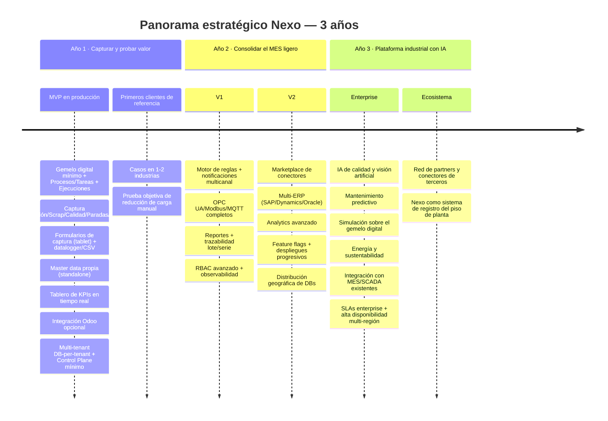
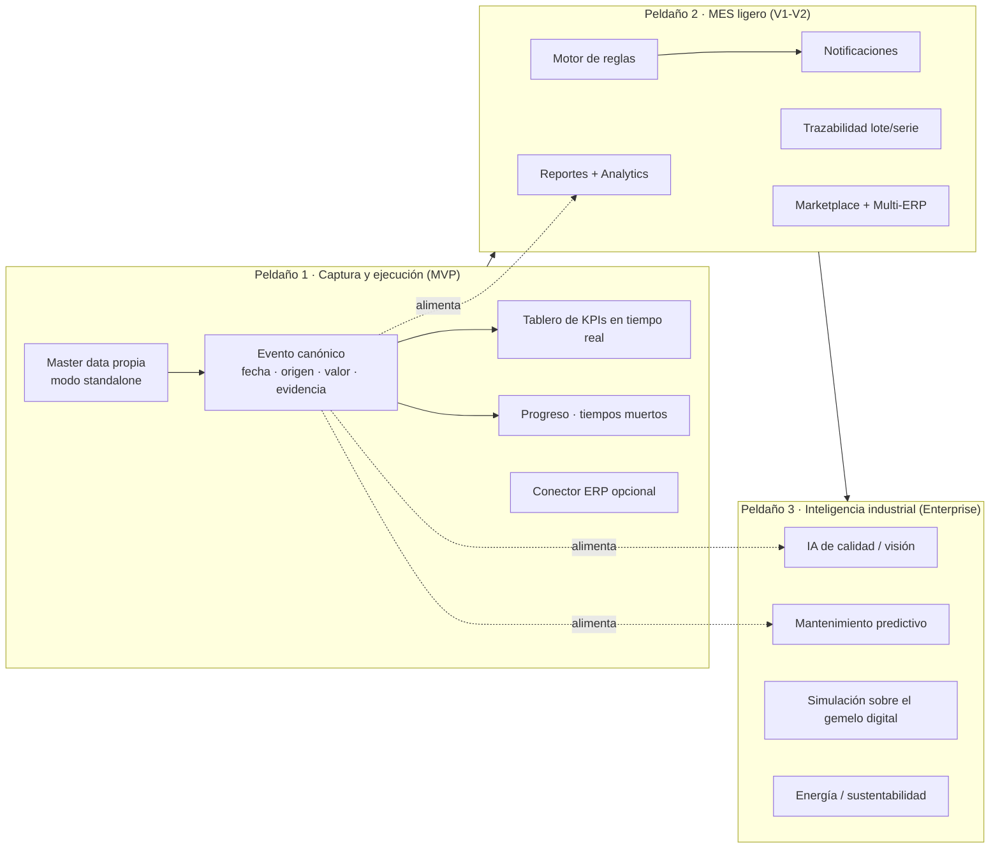

# Nexo — Visión y estrategia de largo plazo

> **Documento:** `specs/roadmap/vision.md` · **Estado:** Borrador v0.1 · **Actualizado:** 2026-07-13
> **Roles:** Product Manager · Software Architect · UX Designer
> **Relacionados:** [idea.md](../idea.md) · [roadmap.md](./roadmap.md) · [milestones.md](./milestones.md) · [backlog.md](./backlog.md) · [layered-architecture.md](../specs/layered-architecture.md) · [master-data.md](../specs/master-data.md) · [future-features.md](../specs/future-features.md) · [product.md](../specs/product.md) · [architecture.md](../specs/architecture.md)

## Resumen ejecutivo

Este documento define **hacia dónde va Nexo en el largo plazo** y por qué. Mientras [idea.md](../idea.md) explica el problema y la propuesta de valor, y [roadmap.md](./roadmap.md) detalla el *cómo* y el *cuándo* de cada fase, `vision.md` fija el **norte estratégico**: la misión, la visión a tres años, la métrica *North Star*, los pilares que sostienen la construcción del producto, la trayectoria evolutiva de la plataforma y los principios de producto que deben guiar cada decisión. Es la brújula contra la cual se validan las decisiones de roadmap, arquitectura y priorización.

La tesis central es que Nexo no es un producto puntual ni un accesorio de otro sistema, sino un **sistema autónomo de ejecución del trabajo en planta**: una plataforma que responde, por sí sola, *qué existe*, *cómo se hace el trabajo*, *qué se está haciendo ahora* y *qué pasó realmente*. Esa es la razón del **modelo de 4 capas** adoptado el **2026-07-13** —**Capa 1 Física/Gemelo digital → Capa 2 Modelo de trabajo (Procesos) → Capa 3 Ejecución (Lote o Proyecto) → Capa 4 Motor de eventos**— con el **ERP como conector lateral opcional**, no como la otra mitad del producto. El documento ancla del modelo es [layered-architecture.md](../specs/layered-architecture.md).

Sobre esa estructura, la trayectoria de producto sigue siendo una **escalera evolutiva** deliberada —**captura → MES ligero → inteligencia industrial**— pero se recorre *dentro* del modelo de 4 capas, no en lugar de él: el MVP entrega las cuatro capas en su versión mínima, V1–V2 las profundizan con reglas, trazabilidad, reportes y ecosistema, y Enterprise construye IA sobre el activo acumulado. Todo ello sobre una base multi-tenant con **base de datos por tenant**, event-driven y edge-first. Para evitar la colisión de vocabulario, en este documento los peldaños de esa escalera se llaman **peldaños** y el término **capa** queda reservado a las cuatro capas del modelo canónico.

La visión se ancla en una convicción de negocio: **el registro fiel de lo que se hizo en planta —quién, cuándo, con qué insumos, con qué evidencia— es el activo defendible** de la compañía. Quien posea la ejecución del trabajo, agnóstico de ERP y de hardware, se vuelve el sistema de registro del piso de planta y el punto natural de expansión hacia todo lo que se puede construir sobre ese dato; la integración con el ERP **acelera** ese valor, pero ya no es la razón de ser. Este documento describe cómo llegamos ahí sin traicionar los principios que hacen a Nexo adoptable, escalable y confiable.

---

## 1. Misión y visión

### 1.1 Misión (el porqué, hoy)

> **Que la planta sepa, sin esfuerzo, qué se está haciendo y qué pasó realmente.** Convertir el trabajo del piso —tareas, insumos, producción, scrap, calidad, paradas, eventos de máquina— en **eventos normalizados, trazables y con evidencia**, capturados en su origen y disponibles en tiempo real para quien los necesite: el operario, el supervisor, la gerencia y, **si existe**, el ERP. Eliminar la carga manual es el medio; **el fin es la ejecución del trabajo bajo control**.

La misión es operativa y verificable: se cumple cuando una planta deja de retipear información, deja de perseguir el estado de un trabajo por teléfono y empieza a confiar en un único dato de verdad. Es el compromiso que Nexo asume con cada cliente desde el primer día, y se materializa ya en el MVP (ver [idea.md](../idea.md) §8).

### 1.2 Visión (el estado futuro, a dónde vamos)

> Que Nexo sea **el estándar de facto del sistema de ejecución y trazabilidad del trabajo en planta** para la industria manufacturera de habla hispana y, progresivamente, global: una plataforma **autónoma** —que funciona con o sin ERP— que cualquier planta adopte en días, agnóstica de ERP y de hardware, que modele con **el mismo lenguaje una producción repetitiva y un proyecto único**, que escale de un taller de una línea a **miles de empresas, miles de plantas y millones de eventos diarios**, y sobre la cual se construya un ecosistema de inteligencia industrial —analítica, reglas e IA— sin que el cliente quede atado a ningún proveedor.

La visión describe un destino de plataforma, no de feature. Se reconoce cumplida cuando Nexo es la respuesta natural a la pregunta **"¿cómo sé qué está pasando en mi planta y cómo lo controlo?"** en su mercado objetivo —y no solo a "cómo conecto mi planta con mi gestión"—, y cuando terceros construyen valor sobre sus cuatro capas (conectores, analítica, integraciones).

### 1.3 Relación misión ↔ visión

| Dimensión | Misión (hoy) | Visión (largo plazo) |
|---|---|---|
| **Foco** | Poner bajo control la ejecución del trabajo en cada planta (y eliminar la carga manual) | Ser el sistema estándar de ejecución y trazabilidad del trabajo industrial |
| **Alcance** | Gemelo digital mínimo, procesos y tareas, ejecuciones (lote o proyecto), eventos con evidencia | Plataforma de inteligencia industrial extensible sobre las 4 capas |
| **Unidad de valor** | El Evento canónico confiable, atribuido a un activo y a una tarea | El ecosistema y la red de conectores/IA sobre el dato |
| **Rol del ERP** | Conector **opcional** que acelera el valor (no condición de uso) | Uno de muchos sistemas satélite; multi-ERP vía ACL |
| **Horizonte** | MVP y adopción inicial | 3 años y más allá (ver §3 y §5) |
| **Prueba de éxito** | La planta deja de retipear y sabe en vivo su progreso | Nexo es sistema de registro de facto del piso |

---

### 1.4 El modelo de 4 capas (marco estructural de la visión)

La visión ya no se ordena como "una capa entre la planta y el ERP", sino como un **sistema completo de cuatro capas** donde cada una depende solo de la de abajo y la **Capa 4 observa a las otras tres** para producir el dato de verdad. El ERP **no es una capa**: es un conector opcional conectado lateralmente.

| Capa | Nombre | Responde a | Documento |
|---|---|---|---|
| **1** | Física — **Gemelo digital** de la planta | *¿Qué existe y qué está midiendo?* | [digital-twin.md](../specs/digital-twin.md) |
| **2** | **Modelo de trabajo** — Procesos | *¿Cómo se hace el trabajo?* (plantilla) | [work-model.md](../specs/work-model.md) |
| **3** | **Ejecución** — Lote o Proyecto | *¿Qué se está haciendo ahora?* (instancia) | [execution.md](../specs/execution.md) |
| **4** | **Motor de eventos** | *¿Qué pasó realmente?* (hechos + métricas) | [event-engine.md](../specs/event-engine.md) |

```
Capa 4 · Motor de eventos  ← observa todo, deriva métricas
Capa 3 · Ejecución (Lote | Proyecto)
Capa 2 · Modelo de trabajo (Procesos)
Capa 1 · Física (Gemelo digital: activos, sensores, cámaras, captura manual)
            ⟂  ERP (conector OPCIONAL, "plus")
```

**Tres consecuencias estratégicas de este encuadre:**

1. **Autonomía.** Nexo funciona sin ERP. Eso exige **Master Data propia** (productos/ítems, insumos, unidades, procesos, personas/roles y, opcionalmente, clientes/pedidos y centros de costo) y dos modos de operación, *standalone* y *conectado* (ver [master-data.md](../specs/master-data.md)). Es el **costo oculto más grande** del cambio y agranda el alcance: se declara, no se esconde.
2. **Un solo modelo para dos mundos.** Una producción repetitiva y un proyecto único **se modelan igual** (Proceso → Tareas → Insumos → Ejecución). Cambia el **perfil** —y con él el disparador y el set de KPIs—, no el modelo. Esto amplía el mercado direccionable más allá de la manufactura repetitiva sin duplicar producto.
3. **El valor sale de la Capa 4.** Progreso, cuellos de botella y tiempos muertos son **métricas derivadas** que ninguna planilla ni ERP produce solo: son el corazón de la propuesta de valor y la razón por la que el dato debe estar atribuido a un activo y a una tarea desde el origen.

---

## 2. North Star y sistema de métricas

### 2.1 North Star Metric (NSM)

La métrica *North Star* debe capturar el valor central —eliminar la carga manual— y correlacionar con retención e ingreso. La elegida es:

> **NSM = Eventos normalizados capturados automáticamente por período, con trazabilidad hasta su origen.**
>
> Formulación conceptual: *volumen de Eventos canónicos ingeridos desde fuentes automáticas (PLC, datalogger, protocolos, API) y desde carga manual asistida, que sustituyen un registro que antes se hacía a mano.*

La NSM se lee como "cuánta carga manual eliminó Nexo": cada evento capturado en origen es una anotación en papel o una doble carga en el ERP que dejó de existir. Crece con la adopción (más plantas), con la profundidad de integración (más fuentes automáticas por planta) y con el uso sostenido (retención).

### 2.2 Métricas de entrada (input metrics) que mueven la NSM

| Palanca | Métrica de entrada | Cómo mueve la NSM |
|---|---|---|
| **Adopción** | Tenants activos · Plantas activas · Operarios activos por turno | Más orígenes de eventos |
| **Profundidad** | % de captura automática vs. manual · Fuentes conectadas por planta | Más eventos por planta, menos fricción |
| **Time-to-value** | Días desde alta de tenant hasta primer evento en dashboard | Acelera la activación |
| **Confiabilidad** | % de eventos sincronizados al ERP sin intervención · Tasa de reintentos exitosos | Sostiene la confianza y la retención |
| **Salud del dato** | % de eventos con `origin_metadata` completo · Latencia de ingesta P95 | Calidad del activo que habilita analítica/IA |
| **Cobertura del modelo de trabajo** | % de ejecuciones con Proceso definido · % de eventos atribuidos a un activo **y** a una tarea · % de tareas con evidencia | Sin atribución no hay progreso, cuellos de botella ni tiempos muertos: es lo que convierte volumen en métrica |

### 2.3 Contra-métricas (para no optimizar a ciegas)

- **Ruido de eventos:** volumen alto sin valor (duplicados, lecturas irrelevantes). Se controla con `dedup_key` y contextualización.
- **Carga manual encubierta:** operarios que "completan" datos que la máquina debería dar. Se vigila con el ratio automático/manual.
- **Deuda de confiabilidad:** eventos capturados pero no sincronizados o no trazables. La NSM exige *trazabilidad hasta el origen*, no solo volumen.

> Las fórmulas de KPI de negocio del cliente (OEE, scrap rate, FPY, MTBF/MTTR) están definidas de forma canónica en el brief de fundamentos y se detallan en [product.md](../specs/product.md) y los módulos de dominio. La NSM es la métrica de la **plataforma**, no del cliente.

---

## 3. Panorama a 3 años

El horizonte de tres años traza la transición de **producto de captura** a **plataforma industrial**. No es un compromiso de fechas exactas (esas viven en [roadmap.md](./roadmap.md) y [milestones.md](./milestones.md)), sino la narrativa estratégica por año.



| Año | Tema estratégico | Qué debe ser verdad al final del año |
|---|---|---|
| **Año 1** | **Capturar y probar el valor** | El MVP está en producción con clientes de referencia; se demuestra objetivamente la reducción de carga manual **y el control del avance del trabajo**; el Evento canónico fluye de **datalogger/CSV y carga manual (tablet)** a dashboard **con master data propia** (modo *standalone*), y a Odoo **cuando el cliente lo tiene** (los protocolos industriales/PLC se incorporan en V1). |
| **Año 2** | **Consolidar el MES ligero y abrir el ecosistema** | Nexo automatiza decisiones (reglas), notifica, reporta y traza lote/serie; soporta más protocolos y más de un ERP; el Marketplace y los feature flags habilitan crecimiento sin fricción. |
| **Año 3** | **Plataforma industrial con IA** | Sobre la capa de datos se construye inteligencia (visión, predicción, gemelo digital); Nexo opera con SLAs enterprise y multi-región; un ecosistema de partners extiende la plataforma. |

---

## 4. Pilares estratégicos

Los pilares son las apuestas de largo plazo que **no cambian** aunque cambien las features. Toda iniciativa debe poder justificarse contra al menos uno.

### Pilar 1 — El Evento canónico como activo defendible
El corazón de Nexo es normalizar todo origen heterogéneo a un **Evento canónico** inmutable y trazable, con sus atributos mínimos —**fecha, origen, valor y evidencia**— y **atribuido a un activo, una tarea y una ejecución**. Es el activo que se acumula con cada cliente y el que, más adelante, habilita analítica e IA. **Todo lo que capturamos hoy es el combustible de lo que construimos mañana.**

### Pilar 2 — Autonomía y agnosticismo radical (ERP opcional, hardware opcional)
El sistema **funciona solo**: no requiere ERP para entregar valor, y por eso posee su **Master Data propia**. Cuando el ERP existe, entra como **conector opcional** vía **Conectores + Anti-Corruption Layer (ACL)** —Odoo es el primero, no el único— y sincroniza en ambos sentidos. El core **nunca** depende de un ERP ni de un fabricante. Este pilar protege al cliente del *lock-in*, abre el mercado de plantas sin ERP (y de trabajo por proyecto) y es una ventaja competitiva frente a soluciones cautivas de un ERP.

### Pilar 3 — Aislamiento y confianza multi-tenant (DB-per-tenant)
El modelo de **base de datos por tenant** es un requisito no negociable (brief §6): aislamiento total de datos, storage, cómputo y credenciales. Es simultáneamente una decisión de seguridad, de cumplimiento y de escalabilidad (cada DB puede migrar de servidor/región sin cambiar la lógica). La confianza es prerequisito de venta en industria.

### Pilar 4 — Edge-first y resiliencia ante la realidad de planta
La captura vive donde vive el dato: on-premise, con **Agente Edge/Gateway** que conecta *outbound* y aplica **store-and-forward** ante cortes. El piso de planta es hostil a la conectividad; Nexo asume esa realidad como principio de diseño, no como excepción.

### Pilar 5 — Escala desde el diseño
Cada decisión se justifica contra metas de escala: **miles de empresas, miles de plantas, decenas de miles de usuarios, cientos de miles de dispositivos, millones de eventos diarios** (brief §7). Arquitectura event-driven, CQRS/read models, autoscaling por servicio, backpressure y almacenamiento time-series. La escala no se agrega después: se diseña desde el origen.

### Pilar 6 — Time-to-value y experiencia de operario
El valor debe percibirse en **días, no meses**: alta de tenant automatizada (7 pasos, brief §6.1) y carga manual disponible desde el día uno, sin esperar la integración de hardware. La UX del operario —con guantes, frente a una tablet, en un turno— es un pilar, no un detalle.

### Pilar 7 — Extensibilidad y ecosistema
La plataforma se diseña para que terceros construyan sobre ella: **Marketplace de conectores**, feature flags, APIs desacopladas. El valor de largo plazo está en la red de integraciones y partners que rodean al core.

| Pilar | Riesgo que mitiga | Se materializa en (fase) |
|---|---|---|
| 1 · Evento canónico | Datos irreconciliables entre fuentes | MVP y todas las siguientes |
| 2 · Autonomía y agnosticismo | Dependencia del ERP para existir; *lock-in* | MVP (standalone + Odoo opcional) → V2 (multi-ERP) |
| 3 · Aislamiento multi-tenant | Fuga de datos entre clientes | MVP (no negociable) |
| 4 · Edge-first | Pérdida de datos por cortes | MVP → V1 (protocolos completos) |
| 5 · Escala desde el diseño | Reescrituras por crecimiento | Transversal, prueba en V2 |
| 6 · Time-to-value / UX operario | Adopción lenta, abandono | MVP |
| 7 · Extensibilidad / ecosistema | Techo de crecimiento | V2 (Marketplace) → Enterprise |

---

## 5. Evolución de la plataforma: de captura a plataforma industrial con IA

La trayectoria de producto es una **escalera evolutiva de tres peldaños**, donde cada peldaño se apoya en el anterior y aumenta el valor sin descartar lo construido. La escalera **sigue plenamente válida**, pero desde el 2026-07-13 se recorre **sobre el modelo de 4 capas** (§1.4): son **dos ejes distintos** y no deben confundirse.

> **Dos ejes, un producto.** El **modelo de 4 capas** es el eje **estructural** (qué es el sistema: gemelo digital, procesos, ejecución, motor de eventos) y está **completo desde el MVP**, aunque en versión mínima. La **escalera de peldaños** es el eje **temporal** (cuánta profundidad tiene cada capa en cada fase). Por eso una misma capa —por ejemplo la Capa 4— aparece en los tres peldaños con distinta madurez.



### 5.0 Cómo se relacionan los dos ejes

| Capa (estructura) | Peldaño 1 · MVP | Peldaño 2 · MES ligero (V1–V2) | Peldaño 3 · Inteligencia (Enterprise) |
|---|---|---|---|
| **1 · Gemelo digital** | Jerarquía física + activos + señales ligadas a su activo; formularios de captura | Auto-discovery, salud avanzada, más protocolos | Simulación y optimización sobre el gemelo |
| **2 · Modelo de trabajo** | Procesos, tareas e insumos (perfil repetitivo; el modelo soporta ambos) | Perfil proyecto completo, rutas, versionado maduro | Procesos sugeridos/optimizados por IA |
| **3 · Ejecución** | Ejecuciones (lote) con tareas instanciadas, consumo y evidencia | Proyectos con hitos y cronograma; reprogramación | Reprogramación asistida y predicción de desvíos |
| **4 · Motor de eventos** | Progreso, tiempos muertos, cuellos de botella, OEE base | Reglas, alertas, trazabilidad, reportes, analytics | Predicción, visión artificial, prescripción |
| **ERP (lateral, opcional)** | Conector Odoo opcional | Multi-ERP + Marketplace | Integración con MES/SCADA existentes |

### 5.1 Peldaño 1 — Captura y ejecución (MVP): "la planta sabe qué está haciendo, y deja de cargarlo a mano"
Nexo entra como **sistema autónomo**: modela la planta (Capa 1), sus procesos y tareas (Capa 2), ejecuta lotes con avance y evidencia (Capa 3) y deriva las primeras métricas de verdad (Capa 4). Registra producción, scrap, calidad, paradas y eventos; en el MVP captura desde **formularios de captura en tablet** (de primera clase) y **datalogger/CSV**; muestra un **tablero de KPIs** en tiempo real; opera con **master data propia** en modo *standalone* y **sincroniza con Odoo solo si el cliente lo tiene**; multi-tenant con DB-per-tenant y un Control Plane mínimo. La **captura automática por protocolos industriales (S7/OPC UA/Modbus/MQTT) llega en V1**. El resultado tangible: **la planta deja de retipear y empieza a ver su progreso real**. (Detalle en [roadmap.md](./roadmap.md) fase MVP.)

### 5.2 Peldaño 2 — MES ligero (V1–V2): "el dato dispara acciones y se abre al ecosistema"
Sobre la captura se agrega inteligencia operativa: **motor de reglas** (trigger-condición-acción), **notificaciones multicanal**, **trazabilidad de lote/serie**, **reportes** y **analytics**, más protocolos (OPC UA/Modbus/MQTT completos), **RBAC avanzado** y **observabilidad**. Luego el ecosistema: **Marketplace de conectores**, **multi-ERP** (SAP/Dynamics/Oracle), **feature flags** y **distribución geográfica de DBs**. Nexo pasa de *ver* a *actuar* y de *un ERP* a *muchos*.

### 5.3 Peldaño 3 — Plataforma industrial con IA (Enterprise): "el dato predice y optimiza"
Con el activo de datos consolidado y trazable, se construye inteligencia: **IA de calidad y visión artificial**, **mantenimiento predictivo**, **simulación y optimización sobre el gemelo digital** (la *representación* del gemelo ya existe desde el MVP como Capa 1; lo que llega aquí es simular con ella), **energía y sustentabilidad**, **integración con MES/SCADA existentes**, **SLAs enterprise** y **alta disponibilidad multi-región**. Aquí el Evento canónico capturado desde el MVP paga dividendos: es el conjunto de entrenamiento y contexto que hace posible la IA. (Ver [future-features.md](../specs/future-features.md).)

| Peldaño | Pregunta que responde | Fase | Valor incremental |
|---|---|---|---|
| **Captura y ejecución** | ¿Qué existe, qué se está haciendo y qué pasó? | MVP | Dato confiable en tiempo real, sin carga manual, con progreso real del trabajo |
| **MES ligero** | ¿Qué hago con lo que pasa? | V1–V2 | Automatización, trazabilidad, ecosistema |
| **Inteligencia** | ¿Qué va a pasar y cómo lo optimizo? | Enterprise | Predicción, visión, optimización |

---

## 6. Principios de producto

Los principios traducen la estrategia en criterios de decisión cotidianos. Cuando dos opciones compiten, gana la que mejor respeta estos principios.

1. **Cero carga manual como norte, no como dogma.** Preferimos capturar en origen; cuando la carga manual es inevitable, la hacemos trivial (UX de operario). Nunca pedimos al humano lo que la máquina ya sabe.
2. **El core no se contamina.** Todo sistema externo entra por un conector con ACL. El modelo de dominio permanece limpio y estable aunque cambien ERPs, protocolos o hardware.
3. **Aislamiento primero.** Ante cualquier duda de diseño, se elige la opción que refuerza el aislamiento entre tenants. La confianza no se negocia.
4. **Diseñar para el corte de red.** Asumimos conectividad intermitente: store-and-forward, idempotencia (`dedup_key`), reintentos. Un evento capturado nunca se pierde por un corte.
5. **Inmutabilidad y trazabilidad del evento.** Un Evento canónico, una vez ingerido, no se altera. La verdad del piso de planta es auditable de punta a punta.
6. **Consistencia de terminología y de KPI.** Los mismos nombres y las mismas fórmulas en todos los módulos y documentos (brief §8 y §10). Un OEE calculado igual en todas partes vale; uno calculado distinto no vale nada.
7. **Time-to-value sobre completitud.** Preferimos entregar valor percibible rápido (captura manual desde el día uno) que esperar la integración perfecta. La adopción se gana en días.
8. **Escala como restricción de diseño, no como epílogo.** Cada feature se piensa para miles de plantas y millones de eventos. No construimos nada que sepamos que habrá que reescribir para escalar.
9. **Extensible por defecto.** Preferimos capacidades que terceros puedan aprovechar (conectores, feature flags) antes que soluciones cerradas. El ecosistema es parte del producto.
10. **Observabilidad como ciudadanía de primera.** Logs, métricas y trazas son parte de la definición de "terminado" de cada servicio. No se opera lo que no se observa.
11. **Autonomía primero: el ERP suma, no habilita.** Ninguna capacidad del producto puede requerir un ERP para funcionar. Si una función solo tiene sentido conectada, se diseña como *enriquecimiento* del modo *standalone*, nunca como su prerrequisito.
12. **Un solo modelo para repetitivo y proyecto.** Antes de crear una entidad nueva para un caso "distinto", se verifica si es el mismo Proceso/Tarea/Insumo con otro **perfil**. Duplicar el modelo por tipo de trabajo es deuda garantizada.
13. **Ningún dato flota.** Toda señal, lectura o evento pertenece a un **activo** y, cuando corresponde, a una **tarea** y una **ejecución**. Sin dueño no hay atribución, y sin atribución no hay progreso, cuello de botella ni tiempo muerto.
14. **Captura y visualización no se mezclan.** El operario **ingresa** datos en un **formulario de captura**; el **tablero** solo **muestra** KPIs. Confundirlos degrada las dos experiencias.

---

## 7. Cómo se usa esta visión

- **En priorización:** una iniciativa que no avanza ningún pilar (§4) ni mueve la NSM (§2) es candidata a descartarse o posponerse.
- **En arquitectura:** las decisiones se validan contra los principios de producto (§6) y los principios de arquitectura del brief (§5). Ver [architecture.md](../specs/architecture.md).
- **En roadmap:** la secuencia de fases (§5) es la columna vertebral de [roadmap.md](./roadmap.md); los hitos que prueban cada capa viven en [milestones.md](./milestones.md); el trabajo concreto en [backlog.md](./backlog.md).
- **En go-to-market:** el panorama a 3 años (§3) alinea comercial, producto e ingeniería sobre el mismo destino.

---

## Preguntas abiertas

1. ✅ **Resuelto (2026-07-26) — PRD-01:** se mantiene **"Nexo" como working name** hasta el go-to-market; la validación de marca/dominio queda diferida y no bloqueante.
2. **Definición operativa de la NSM.** ¿Cómo medimos con precisión "eventos que sustituyen carga manual"? ¿Contamos por evento, por registro sustituido o por hora-persona ahorrada? Debe cerrarse junto con las métricas de [product.md](../specs/product.md).
3. ✅ **Resuelto (2026-07-26) — PRD-06:** mercado inicial **LatAm hispano (es-AR)** con **expansión temprana** a mercados de habla no hispana; en consecuencia, **i18n y residencia de datos por región se priorizan desde el diseño** (no se difieren al final del horizonte), aunque la multi-región de alta disponibilidad siga siendo capacidad Enterprise.
4. **Ritmo de la escalera de capas.** ¿La transición captura → MES → IA es estrictamente secuencial, o se anticipan capacidades de analítica/IA "faro" en V2 para diferenciación comercial temprana?
5. **Modelo de ecosistema/partners.** ¿El Marketplace será de conectores oficiales y de terceros desde V2, y qué gobernanza (certificación, revenue share) sostiene el pilar de extensibilidad?
6. **Umbral de "estándar de facto".** ¿Con qué señales medibles (cuota de mercado, número de plantas, presencia de partners) declaramos cumplida la visión de ser la capa estándar de captura?
7. **Prioridad relativa de IA vs. profundidad de captura.** Con recursos limitados, ¿se invierte antes en más fuentes/protocolos de captura o en las primeras capacidades de IA? La respuesta define el énfasis de la fase Enterprise.
8. **Perfil del cliente objetivo tras el pivot.** Si el sistema ya no necesita ERP y modela también trabajo por proyecto, ¿el segmento inicial sigue siendo manufactura repetitiva con ERP, o se prioriza el segmento sin ERP (talleres, obra, fabricación a medida)? Impacta go-to-market y PRD-04/PRD-16 del [tablero](../open-questions-board.md).
9. **Costo de la autonomía.** La **Master Data propia** agranda el alcance del MVP: ¿se acepta el retraso de fase o se acota el mínimo viable de catálogos (MOD-17)? Es la contrapartida honesta de la visión autónoma.
10. **Narrativa comercial del ERP opcional.** ¿Cómo se comunica "funciona sin ERP" sin perder el argumento de valor de la integración ante clientes que sí lo tienen (y sin canibalizar el pricing, COM-10)?
