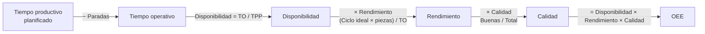
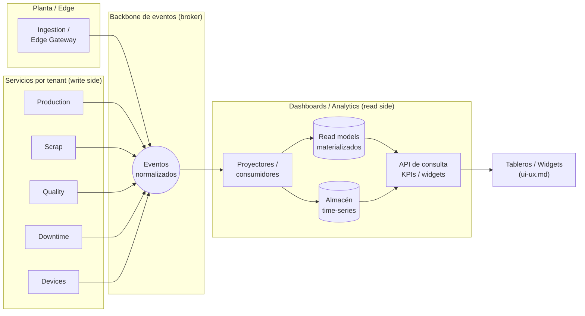
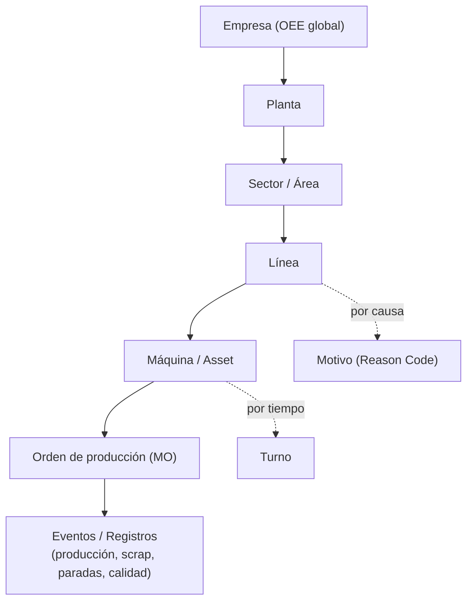

# Dashboards / Analytics

> **Documento:** `specs/specs/dashboards.md` · **Estado:** Borrador v0.1 · **Actualizado:** 2026-07-13
> **Roles:** Product Manager · Software Architect · UX Designer
> **Relacionados:** [event-engine.md](./event-engine.md) · [work-model.md](./work-model.md) · [execution.md](./execution.md) · [digital-twin.md](./digital-twin.md) · [layered-architecture.md](./layered-architecture.md) · [production.md](./production.md) · [quality.md](./quality.md) · [scrap.md](./scrap.md) · [downtime.md](./downtime.md) · [reports.md](./reports.md) · [rules-engine.md](./rules-engine.md) · [ui-ux.md](./ui-ux.md) · [data-model.md](./data-model.md) · [architecture.md](./architecture.md) · [glossary.md](./glossary.md)

## Resumen ejecutivo

El servicio **Dashboards / Analytics** es la cara visible del valor de Nexo: convierte el flujo de **Eventos** normalizados de planta en **KPIs**, tableros y visualizaciones que un operario, un supervisor o la gerencia entienden en segundos. Es un servicio **por tenant** que opera exclusivamente contra **read models** (vistas materializadas de lectura), siguiendo el principio de arquitectura **CQRS / read models** definido en el brief de fundamentos. No calcula nada "en caliente" sobre las bases transaccionales de los dominios: consume las proyecciones que se van construyendo a partir del backbone de eventos.

El documento define el **catálogo de KPIs** (con sus fórmulas canónicas, idénticas a las de `production`, `downtime` y `quality`), la distinción entre **tiempo real** e **histórico**, la **arquitectura CQRS** de proyecciones y read models, el **catálogo de widgets**, los **tableros por persona** (operario, supervisor, gerencia), la mecánica de **drill-down** y los **tableros de planta (andon)** pensados para pantallas grandes en el piso productivo.

Dashboards es un servicio de **solo lectura**: nunca es fuente de verdad. Las fórmulas y los datos crudos viven en los dominios ([Production](./production.md), [Scrap](./scrap.md), [Quality](./quality.md), [Downtime](./downtime.md)); Dashboards los **presenta**. Cuando un umbral o una tendencia detectada en un tablero debe disparar una acción, ese comportamiento vive en el [Rules Engine](./rules-engine.md); cuando el usuario necesita un documento formal exportable, eso es [Reports](./reports.md). Este documento delimita explícitamente esas fronteras para evitar duplicación de lógica.

---

## 1. Alcance y no-alcance

| Sí es alcance de Dashboards | NO es alcance (vive en otro documento) |
|---|---|
| Visualización de KPIs en tiempo real e histórico | Cálculo de origen / fuente de verdad de los datos → dominios |
| Read models y proyecciones para lectura rápida | Registro transaccional de producción/scrap/paradas → dominios |
| Catálogo de widgets y tableros configurables | Documentos formales exportables (PDF/Excel/CSV) → [reports.md](./reports.md) |
| Tableros por persona/rol y andon de planta | Disparo de acciones ante umbrales → [rules-engine.md](./rules-engine.md) |
| Drill-down interactivo y filtros | Envío de avisos por canal → [notifications.md](./notifications.md) |
| Definición de KPIs y su semántica de presentación | Diseño visual base y design system → [ui-ux.md](./ui-ux.md) |

> **Regla de frontera:** un dashboard **muestra** un KPI; una regla **reacciona** a un KPI; un reporte **congela** un KPI en un documento. Los tres consumen los mismos read models, pero no comparten responsabilidad.

### 1.1 Terminología canónica: Tablero ≠ Formulario de captura

Distinción **no negociable** en toda la documentación y en la UI, para evitar una confusión frecuente ("dashboards para que el operario cargue datos"):

| Término | Qué es | Dirección del dato | Capa | Documento |
|---|---|---|---|---|
| **Tablero / Dashboard** | **Visualización de KPIs** (números, gauges, series, Pareto, andon) | **Salida**: el usuario **lee** | 4 · Motor de eventos (origen del dato) | **este documento** |
| **Formulario de captura** | Pantalla donde el operario **ingresa** datos (cantidades, motivos, evidencia, marcar tarea terminada) | **Entrada**: el usuario **escribe** | 1 · Física / Gemelo digital | [digital-twin.md](./digital-twin.md) |

- Un **Formulario de captura NUNCA se llama "dashboard"**, aunque muestre contexto (orden activa, objetivo del turno) junto al campo de carga.
- Un **Tablero NUNCA escribe**: Dashboards es de solo lectura (§4.4). Si desde una pantalla se puede cargar un dato, esa pantalla es un formulario de captura, no un tablero.
- Una misma tablet puede alternar entre ambas pantallas; son **componentes distintos, de capas distintas, con dueños distintos**.
- El **andon** (§8) es un tablero puro: solo lectura, sin interacción.

> Esta distinción también está declarada en [digital-twin.md](./digital-twin.md) y en [glossary.md](./glossary.md). Ante cualquier duda de nomenclatura, prevalece esta tabla.

---

## 2. Catálogo de KPIs

Todas las fórmulas de esta sección son **idénticas** a las definidas en el brief de fundamentos (sección 10.1) y a las usadas en [production.md](./production.md), [downtime.md](./downtime.md) y [quality.md](./quality.md). Dashboards **no reinterpreta** ni redefine fórmulas; solo elige cómo presentarlas.

### 2.1 KPIs principales y fórmulas canónicas

| KPI | Fórmula canónica | Fuente (read model) | Presentación típica |
|---|---|---|---|
| **Producción** | Suma de piezas del **Registro de producción** en el contexto (orden/máquina/turno) | `rm_production` | Contador, barra vs objetivo, tendencia |
| **Scrap Rate** | **Piezas descartadas / Total producidas** (o por costo) | `rm_scrap` | Porcentaje, semáforo, Pareto de motivos |
| **Eficiencia** | Producción real / Producción objetivo del contexto | `rm_production` | Gauge, % vs meta |
| **OEE** | **Disponibilidad × Rendimiento × Calidad** | `rm_oee` | Gauge compuesto, waterfall de pérdidas |
| **Disponibilidad** | **Tiempo operativo / Tiempo productivo planificado** (Tiempo operativo = Planificado − Paradas) | `rm_oee`, `rm_downtime` | Gauge, aporte al OEE |
| **Rendimiento** | **(Tiempo de ciclo ideal × Total de piezas producidas) / Tiempo operativo** | `rm_oee`, `rm_production` | Gauge, aporte al OEE |
| **Calidad (factor)** | **Piezas buenas / Total de piezas producidas** | `rm_oee`, `rm_quality` | Gauge, aporte al OEE |
| **Alarmas** | Conteo / severidad de **Alertas** activas y su antigüedad | `rm_alerts` | Lista priorizada, badges, semáforo |
| **Consumo** | Agregado de lecturas de **Señales/Tags** de consumo (energía, aire, agua, materia prima) por contexto | `rm_consumption` | Serie temporal, consumo por unidad producida |
| **Tendencias** | Evolución temporal de cualquier KPI sobre ventana móvil | Cualquier read model | Línea, área, comparación período-a-período |

### 2.2 KPIs secundarios y de soporte (contexto)

Estos KPIs se calculan en sus dominios de origen y se **exponen** en tableros de Dashboards para contexto y drill-down. Sus fórmulas también son canónicas:

| KPI | Fórmula canónica | Dominio de origen |
|---|---|---|
| **FPY (First Pass Yield)** | **Piezas buenas a la primera / Total ingresadas** | [quality.md](./quality.md) |
| **MTBF** | **Tiempo operativo total / N.º de fallas** | [downtime.md](./downtime.md) |
| **MTTR** | **Tiempo total de reparación / N.º de reparaciones** | [downtime.md](./downtime.md) |

### 2.3 Descomposición del OEE (visual "waterfall")

El OEE se presenta siempre con su descomposición en los tres factores, para que el usuario entienda **de dónde** viene una pérdida. Este es uno de los widgets más pedidos por Producción y Gerencia.



> **Nota de consistencia:** la única definición de "Tiempo operativo" en toda la plataforma es **Planificado − Paradas**. Las paradas provienen de [downtime.md](./downtime.md); las piezas buenas/totales provienen de [production.md](./production.md) y [quality.md](./quality.md).

### 2.4 Semántica de agregación

Un mismo KPI puede agregarse por distintas dimensiones. Dashboards **no recalcula** fórmulas al cambiar la dimensión; solo cambia el nivel de agregación del read model.

| Dimensión de agregación | Entidad canónica | Ejemplo de uso |
|---|---|---|
| Empresa / Tenant | Tenant | OEE global de la empresa |
| Planta (Site) | Planta | Comparar plantas |
| Sector / Área | Sector | Ranking de sectores por scrap |
| Línea (Line) | Línea | OEE por línea |
| Centro de trabajo / Máquina | Work Center / Asset | Disponibilidad por máquina |
| Turno (Shift) | Turno | Producción turno mañana vs noche |
| Producto / SKU | Producto | Calidad por producto |
| Orden de producción (MO) | Work Order | Avance de una orden |
| Operario | Operario | Productividad por operario (con cuidado ético/gremial) |

### 2.5 KPIs por perfil (repetitivo vs proyecto)

Un mismo modelo de trabajo se ejecuta con **dos perfiles** ([work-model.md](./work-model.md)): **repetitivo** (se ejecuta N veces, como **Lote**) y **proyecto** (se ejecuta una vez, entregable único). **El set de KPIs es una de las dos únicas cosas que cambian entre perfiles** —la otra es el disparador de la ejecución—. Aplicar el indicador equivocado al perfil equivocado es el error de lectura más caro de esta plataforma.

> **Regla canónica: el OEE aplica al perfil REPETITIVO, no a proyectos.** Un proyecto no tiene tiempo de ciclo ideal ni piezas totales; medirlo con OEE produce un número sin significado. Un proyecto se mide por **avance, cronograma y ruta crítica**.

| Perfil | KPIs propios | Por qué son propios de ese perfil |
|---|---|---|
| **Repetitivo** (Lote) | **OEE** (Disponibilidad × Rendimiento × Calidad), **scrap rate**, **takt**, **tiempo de ciclo**, **FPY** | Presuponen repetición: un ciclo ideal por pieza, un ritmo de demanda y un universo de piezas sobre el cual calcular tasas |
| **Proyecto** | **% de avance**, **desvío de cronograma**, **ruta crítica**, **hitos cumplidos**, (futuro) **valor ganado** | Presuponen entregable único y fechas: lo que importa es dónde está respecto del plan, no cuántas unidades por hora |
| **Comunes (ambos)** | **tiempos muertos**, **cuellos de botella**, **productividad por recurso**, **costo real vs estimado**, **calidad** | Se derivan de eventos y tareas, no de la naturaleza repetitiva del trabajo: valen igual para un lote de ventanas que para una obra a medida |

**Reglas de presentación:**

- **Las fórmulas existentes NO cambian.** OEE, Disponibilidad, Rendimiento, Calidad, FPY, MTBF y MTTR conservan exactamente las definiciones de §2.1 y §2.2 y del glosario. Esta sección **no redefine nada**: solo declara **a qué perfil aplica cada indicador**.
- **Selección automática por perfil.** Un tablero conoce el perfil de la Ejecución que está mostrando y ofrece por defecto el set correspondiente; los KPIs del otro perfil **no se muestran vacíos ni en cero**, simplemente no aplican (la UI lo indica como "no aplica a este perfil", nunca como 0%).
- **Agregados mixtos.** Un tenant puede tener ambos perfiles conviviendo. Un tablero de gerencia que agrega planta o empresa **solo puede sumar KPIs comunes** entre perfiles distintos; el OEE agregado se calcula **exclusivamente sobre ejecuciones repetitivas** y así debe rotularse.
- **Drill-down coherente:** desde un KPI común se baja al detalle del perfil que corresponda (Lote → §7 rutas repetitivas; Proyecto → tareas, hitos y ruta crítica).

**Origen del dato:** los KPIs **comunes** —**progreso/avance, cuellos de botella, tiempos muertos**, productividad por recurso y costo real— **no los calcula Dashboards ni los dominios clásicos**: son **métricas derivadas del motor de eventos** ([event-engine.md](./event-engine.md), Capa 4), que observa todas las capas y produce el dato de verdad. Dashboards las **proyecta y presenta**; su definición canónica vive en el motor de eventos:

| Métrica derivada | Definición canónica (resumen) | Dueño |
|---|---|---|
| **Progreso / % de avance** | Tareas completadas **ponderadas** (por tiempo estándar o por peso configurable) sobre el total de la Ejecución | [event-engine.md](./event-engine.md) |
| **Cuello de botella** | Recurso o tarea con mayor **cola o espera acumulada** | [event-engine.md](./event-engine.md) |
| **Tiempo muerto** | Intervalos **sin eventos productivos** dentro de una ventana planificada (se cruza con [downtime.md](./downtime.md)) | [event-engine.md](./event-engine.md) |
| **Productividad por recurso** | Trabajo efectivo atribuido a un Activo/persona sobre tiempo disponible; requiere que cada señal esté **ligada a un Activo** ([digital-twin.md](./digital-twin.md)) | [event-engine.md](./event-engine.md) |
| **Costo real vs estimado** | Consumo real de insumos y tiempos contra los estándares del Proceso | [event-engine.md](./event-engine.md) + [work-model.md](./work-model.md) |

---

## 3. Tiempo real vs histórico

Nexo distingue dos "velocidades" de dato, cada una con su propio camino en la arquitectura CQRS. La distinción es central: el MVP exige **dashboard en tiempo real**, y el histórico habilita el análisis de tendencias.

| Aspecto | Tiempo real (near real-time) | Histórico (analítico) |
|---|---|---|
| Latencia objetivo | Segundos (percepción "vivo") | Minutos a horas; se prioriza profundidad |
| Fuente | Proyección incremental sobre el stream de eventos | Read models materializados + almacenamiento time-series |
| Uso típico | Andon, tablero de operario/supervisor | Tendencias, comparativas, análisis de causa |
| Ventana temporal | Turno actual / últimas N horas | Días, semanas, meses, año a año |
| Actualización en UI | Push (streaming) o polling corto | On-demand / refresco programado |
| Ejemplo | Contador de piezas del turno subiendo en vivo | OEE mensual por línea últimos 12 meses |

> El operario y el andon viven en **tiempo real**; la gerencia vive mayormente en **histórico y tendencias**; el supervisor navega entre ambos. La UI señala visualmente el modo (indicador "en vivo" vs "período: …").

---

## 4. Arquitectura CQRS / read models

Dashboards materializa el principio **CQRS / read models** del brief. La escritura (comandos) ocurre en los dominios; la lectura (consultas) ocurre aquí, sobre proyecciones optimizadas para presentación.

### 4.1 Flujo de datos end-to-end



### 4.2 Principios de diseño de read models

- **Un read model por vista, no por tabla.** Cada tablero/widget consume una proyección pensada para ese uso (desnormalizada, pre-agregada), no las estructuras transaccionales del dominio.
- **Idempotencia y `dedup_key`.** Los proyectores reprocesan eventos sin duplicar, apoyándose en la clave de deduplicación del **Evento canónico** (ver sección 8.1 del brief). Esto permite **reconstruir** un read model desde el historial si cambia una definición.
- **Eventual consistencia explícita.** El read side puede ir "un poco atrás" del write side. La UI comunica frescura (marca de tiempo "actualizado hace X").
- **Time-series para lecturas/consumo.** Las series de **Señales/Tags** y KPIs continuos se materializan en almacenamiento time-series (metas de escalabilidad: millones de eventos/día), con *downsampling* por ventana para histórico profundo.
- **Aislamiento por tenant.** Todos los read models y series viven en la **DB del tenant** (servicio por tenant, DB-per-tenant). Ningún KPI se calcula sobre datos combinados de varios tenants.
- **Recalculabilidad.** Si se corrige una fórmula o un mapeo, se **reproyecta** desde el Event Store / historial sin tocar los dominios.

### 4.3 Catálogo de read models (referencia)

| Read model | Alimentado por eventos de | KPIs que sirve |
|---|---|---|
| `rm_production` | Production (`production`) | Producción, Eficiencia |
| `rm_scrap` | Scrap (`scrap`) | Scrap Rate, Pareto de motivos |
| `rm_quality` | Quality (`quality`) | Calidad (factor), FPY, defectos |
| `rm_downtime` | Downtime (`downtime`, `machine_event`) | Disponibilidad, MTBF, MTTR, Pareto de paradas |
| `rm_oee` | Production + Downtime + Quality (compuesto) | OEE y sus 3 factores |
| `rm_consumption` | Devices/Ingestion (`reading`) | Consumo, consumo por unidad producida |
| `rm_alerts` | Rules Engine / Notifications | Alarmas activas, severidad, antigüedad |
| `rm_execution` | Ejecución (Lote/Proyecto) + Motor de eventos | **Progreso/% de avance**, hitos, desvío de cronograma, estado de tareas |
| `rm_flow` | Motor de eventos (derivadas) | **Cuellos de botella**, **tiempos muertos**, productividad por recurso, costo real vs estimado |

> Los read models `rm_execution` y `rm_flow` proyectan **métricas ya derivadas por el motor de eventos** ([event-engine.md](./event-engine.md)); Dashboards no las recalcula ni las reinterpreta, igual que hace con las fórmulas de los dominios. Sirven a los **KPIs comunes** y a los **propios del perfil proyecto** de §2.5.

> `rm_oee` es un read model **compuesto**: un proyector suscrito a los tres dominios mantiene los numeradores y denominadores de cada factor por dimensión, y expone el producto ya calculado con la fórmula canónica.

### 4.4 Fronteras con otros servicios

- **Contra los dominios:** Dashboards **solo lee** eventos; nunca escribe en Production/Scrap/Quality/Downtime. Tampoco captura: la **entrada** de datos del operario es un **Formulario de captura** de la Capa 1 (§1.1, [digital-twin.md](./digital-twin.md)).
- **Contra [event-engine.md](./event-engine.md):** el motor de eventos **deriva** las métricas (progreso, cuellos de botella, tiempos muertos, productividad, costo real); Dashboards las **visualiza**. La definición de una métrica derivada se cambia en el motor de eventos, nunca en un widget.
- **Contra [reports.md](./reports.md):** Reports consume los **mismos read models** para generar documentos exportables/programados; la lógica de KPI no se duplica.
- **Contra [rules-engine.md](./rules-engine.md):** las reglas evalúan el **stream de eventos** en tiempo real (no los read models de Dashboards); si una regla necesita un agregado, ese agregado se publica como evento derivado. Un tablero puede **enlazar** a la regla que originó una alarma mostrada.

---

## 5. Catálogo de widgets

Un **widget** es la unidad mínima de visualización. Los tableros se componen ensamblando widgets sobre una grilla responsive (ver [ui-ux.md](./ui-ux.md) para el design system y el comportamiento de grilla). Todo widget declara: fuente (read model), KPI/consulta, dimensión de agregación, ventana temporal, umbrales de color y nivel de drill-down.

| Widget | Uso principal | KPIs típicos | Interacción |
|---|---|---|---|
| **KPI Card / Contador** | Número grande + delta vs objetivo | Producción, OEE, Scrap Rate | Click → drill-down |
| **Gauge / Semáforo** | Valor contra umbrales (verde/amarillo/rojo) | OEE, Disponibilidad, Calidad | Tooltip con fórmula |
| **Serie temporal (línea/área)** | Tendencia en el tiempo | Tendencias, Consumo | Zoom, brush, comparar períodos |
| **Barra / Barra apilada** | Comparación entre dimensiones | Producción por línea/turno | Click en barra → drill-down |
| **Pareto** | Priorizar causas (80/20) | Motivos de scrap/parada/defecto | Click en motivo → detalle |
| **Waterfall de OEE** | Descomposición de pérdidas | OEE → Disp./Rend./Calidad | Hover por factor |
| **Heatmap / Calendario** | Densidad por hora/día/máquina | Paradas, defectos, consumo | Click en celda → drill-down |
| **Tabla / Ranking** | Detalle o top-N | Órdenes, operarios, máquinas | Ordenar, filtrar, paginar |
| **Lista de alarmas** | Alertas activas priorizadas | Alarmas | Acuse, click → origen (regla) |
| **Estado de máquinas (tiles)** | Estado en vivo de cada Asset | Run/Idle/Down por color | Click → tablero de máquina |
| **Progreso de orden** | Avance de una Work Order | Eficiencia, avance % | Click → detalle de orden |
| **Consumo por unidad** | Eficiencia energética/insumo | Consumo / pieza | Comparar contra objetivo |
| **Marcador de andon** | Señal grande estilo semáforo | Estado de línea | Solo lectura (pantalla grande) |

> **Reglas de widget:** (1) cada widget cita su fórmula canónica en el tooltip; (2) cada widget declara su **frescura** (tiempo real vs histórico); (3) los umbrales de color se configuran por tenant/tablero, no se hardcodean.

---

## 6. Tableros por persona

Los tableros por defecto se diseñan alrededor de las **personas canónicas** (sección 9 del brief). Cada persona ve, por defecto, lo que necesita para decidir en su horizonte temporal. Todos los tableros respetan el **scoping por planta/línea** del modelo RBAC/ABAC (ver [users-permissions.md](./users-permissions.md)): un usuario solo ve datos de las plantas/líneas a las que tiene alcance.

### 6.1 Matriz persona × tablero

| Persona | Horizonte | Tableros por defecto | KPIs destacados | Modo dominante |
|---|---|---|---|---|
| **Operario** | Turno actual, mi máquina/línea | "Mi puesto": producción vs objetivo, scrap del turno, alarmas, instrucción de orden | Producción, Scrap Rate, Alarmas | Tiempo real |
| **Supervisor** | Turno/día, mi sector | "Sector en vivo": OEE por línea, paradas activas, ranking de máquinas, Pareto de motivos | OEE, Disponibilidad, Paradas, Scrap | Real + histórico |
| **Calidad** | Turno/día, líneas asignadas | "Calidad": FPY, factor Calidad, Pareto de defectos, tendencia | Calidad, FPY, Defectos | Real + histórico |
| **Producción** | Día/semana, plantas | "Plan vs real": eficiencia, avance de órdenes, OEE agregado | Eficiencia, Producción, OEE | Histórico + real |
| **Mantenimiento** | Día/semana, activos | "Salud de activos": MTBF, MTTR, paradas por máquina | MTBF, MTTR, Disponibilidad | Histórico + real |
| **Gerencia** | Semana/mes/trimestre, empresa | "Dirección": OEE por planta, tendencias, scrap por costo, comparativas | OEE, Tendencias, Scrap (costo) | Histórico |
| **Administrador (tenant)** | Configuración | Salud de tableros, uso, definición de KPIs/umbrales | — (meta) | Configuración |

> **Los tableros por defecto de esta matriz asumen perfil repetitivo** (es el caso más frecuente en manufactura seriada). Para ejecuciones de **perfil proyecto**, el mismo rol ve el tablero equivalente con el set de §2.5: **% de avance, hitos, desvío de cronograma y ruta crítica** en lugar de OEE/takt/ciclo. Los KPIs **comunes** (tiempos muertos, cuellos de botella, productividad, costo real vs estimado) aparecen en **ambos**.

### 6.2 Tablero del **Operario** (esquema)

Foco: claridad extrema, números grandes, tiempo real, cero ambigüedad. Pensado para tablet en planta.

```
+--------------------------------------------------------------+
|  LÍNEA 3 · TURNO MAÑANA · Orden MO-10482      [ EN VIVO ● ]   |
+-----------------------------+--------------------------------+
|  PRODUCIDO                  |  OBJETIVO DEL TURNO            |
|      1.240 pz               |     1.500 pz  (83%)           |
|   [======================  ]|   ritmo: ok / atrasado         |
+-----------------------------+--------------------------------+
|  SCRAP TURNO   |  ALARMAS ACTIVAS                            |
|   32 pz (2,5%) |  ! Temp. horno alta (hace 4 min)           |
|   semáforo ●   |  · sin más alarmas                          |
+----------------+---------------------------------------------+
|  INSTRUCCIÓN / OPERACIÓN ACTUAL:  Sellado — ver checklist    |
+--------------------------------------------------------------+
```

### 6.3 Tablero del **Supervisor** (esquema)

Foco: comparar líneas del sector, detectar la peor pérdida ahora, actuar. Mezcla vivo + últimas horas.

```
+--------------------------------------------------------------+
|  SECTOR ENVASADO · HOY · [ filtros: línea ▼ turno ▼ ]         |
+----------------+----------------+----------------------------+
|  OEE SECTOR    | DISPONIBILIDAD |  ESTADO DE MÁQUINAS        |
|   68%  gauge   |   82%          |  L1 ● L2 ● L3 ● L4 ○(down) |
+----------------+----------------+----------------------------+
|  PARADAS ACTIVAS (top motivos - Pareto)                      |
|   Cambio de formato ████████ 41%                             |
|   Falta de material █████ 26%                                |
|   Ajuste/calidad    ███ 15%                                  |
+--------------------------------------------------------------+
|  OEE por línea (barras) → click en barra = drill-down        |
+--------------------------------------------------------------+
```

### 6.4 Tablero de **Gerencia** (esquema)

Foco: tendencia, comparación entre plantas, impacto económico (scrap por costo). Mayormente histórico.

```
+--------------------------------------------------------------+
|  DIRECCIÓN · [ período: mes ▼ ]  vs período anterior         |
+----------------+----------------+----------------------------+
|  OEE EMPRESA   |  SCRAP $ MES   |  TENDENCIA OEE 12 MESES     |
|   71% ▲2pp     |  $ 184k ▼      |   /\    /\___/  (línea)     |
+----------------+----------------+----------------------------+
|  OEE POR PLANTA (ranking)   |  SCRAP POR PLANTA (costo)      |
|  Planta A 76% ● ...         |  Planta C lidera pérdidas      |
+--------------------------------------------------------------+
```

---

## 7. Drill-down

El **drill-down** permite pasar de un agregado a su detalle sin cambiar de mentalidad. Toda navegación mantiene los **filtros de contexto** (planta, línea, turno, período) y respeta el **scoping** del usuario.

### 7.1 Rutas de drill-down canónicas



### 7.2 Reglas de drill-down

- **Coherencia de KPI:** al bajar de nivel, el KPI conserva su **fórmula canónica**; solo cambia el denominador/numerador al nuevo alcance.
- **Trazabilidad hasta el evento:** el último nivel de drill-down llega al **Evento** o al registro de dominio, con enlace a [traceability.md](./traceability.md) para genealogía lote/serie.
- **Cruce de dominios:** desde un pico de scrap se navega al detalle en [scrap.md](./scrap.md); desde una parada, a [downtime.md](./downtime.md); desde un defecto, a [quality.md](./quality.md).
- **Contexto persistente:** filtros y período se conservan al drill-down y al volver ("breadcrumb" de navegación).
- **Salto a acción:** desde una alarma mostrada se enlaza a la **Regla** que la generó ([rules-engine.md](./rules-engine.md)); nunca se ejecuta la acción desde el dashboard.

---

## 8. Tableros de planta (Andon)

El **andon** es un tablero de solo lectura pensado para **pantallas grandes** montadas en el piso de planta (TV/monitor), visibles a distancia, sin interacción. Es una de las expresiones más valiosas del "dashboard en tiempo real" del MVP.

### 8.1 Características del andon

| Característica | Definición |
|---|---|
| **Modo kiosco** | Pantalla completa, sin navegación, auto-login por dispositivo/planta |
| **Alto contraste** | Colores de semáforo legibles a 5–10 m, tipografía grande |
| **Tiempo real estricto** | Actualización push por segundos; indicador "en vivo" |
| **Rotación de vistas** | Ciclo automático entre líneas/sectores cada N segundos |
| **Estado por color** | Verde (ok) / Amarillo (atención) / Rojo (parada o fuera de meta) |
| **Resiliencia** | Si se corta el stream, muestra "sin datos hace X" (no datos viejos como si fueran vivos) |
| **Sin datos sensibles** | No muestra costos ni datos de personas; foco operativo |

### 8.2 Esquema de andon de línea

```
################################################################
#   LÍNEA 3   ·   ENVASADO   ·   TURNO MAÑANA      EN VIVO ●    #
################################################################
#                                                              #
#        OEE            PRODUCIDO          OBJETIVO             #
#        68%             1.240              1.500               #
#      (AMARILLO)      ▲ ritmo ok          83% del turno        #
#                                                              #
#   DISPONIBILIDAD 82%   RENDIMIENTO 91%   CALIDAD 91%          #
#                                                              #
#   ESTADO:  ● PRODUCIENDO      ÚLTIMA PARADA: 12 min (formato) #
################################################################
```

### 8.3 Andon vs semáforo de reglas

El **color** del andon puede provenir de umbrales simples del propio widget o de una **Alerta** emitida por el [Rules Engine](./rules-engine.md). Cuando la fuente es una regla, el andon **refleja** el estado de la alerta pero no la genera. Así, un mismo evento (ej. "OEE < 60% por 10 min") enciende el rojo del andon, dispara una notificación ([notifications.md](./notifications.md)) y queda registrado, sin que Dashboards duplique la lógica.

---

## 9. Configuración y personalización

- **Tableros por defecto** por persona/rol, listos al alta del tenant (parte del seed inicial de la sección 6.1 del brief).
- **Editor de tableros:** el Administrador del tenant y roles habilitados pueden clonar, componer y compartir tableros (grilla de widgets, ver [ui-ux.md](./ui-ux.md)).
- **Umbrales configurables** por tenant/tablero (verde/amarillo/rojo), nunca hardcodeados.
- **Favoritos y vista inicial** por usuario; el tablero de arranque depende del rol.
- **Compartir vs privado:** tableros de tenant (compartidos con scoping) vs tableros personales.
- **Feature flags:** widgets/tableros avanzados pueden gobernarse por plan/licencia (ver [control-plane.md](./control-plane.md)).

---

## 10. Rendimiento, escalabilidad y aislamiento

- **Aislamiento por tenant:** read models y series en la **DB del tenant**; ningún tablero cruza datos entre empresas.
- **Escala de diseño:** millones de eventos/día ⇒ proyecciones incrementales, *downsampling* de series, caching de consultas frecuentes de tableros, paginación en tablas (ver [scalability.md](./scalability.md)).
- **Backpressure y frescura:** ante picos, el read side prioriza consistencia eventual y comunica la frescura en UI antes que bloquear.
- **Coste de consulta acotado:** cada widget consulta un read model pre-agregado; se evitan consultas ad-hoc pesadas sobre datos crudos.
- **Observabilidad:** salud de proyectores, *lag* de consumo y frescura de read models se reportan al servicio **Observability** del Control Plane.

---

## 11. Trazabilidad de dependencias (resumen)

| Dashboards depende de | Para |
|---|---|
| [event-engine.md](./event-engine.md) | **Progreso, cuellos de botella, tiempos muertos**, productividad por recurso, costo real (métricas derivadas) |
| [work-model.md](./work-model.md) | **Perfil** del Proceso (repetitivo/proyecto) para elegir el set de KPIs; tiempos estándar |
| [execution.md](./execution.md) | Estado y avance de Lotes y Proyectos, hitos, tareas instanciadas |
| [digital-twin.md](./digital-twin.md) | Jerarquía de activos para agregación, y frontera con el **Formulario de captura** |
| [production.md](./production.md) | Producción, eficiencia, piezas totales/buenas, ciclos (perfil repetitivo) |
| [scrap.md](./scrap.md) | Scrap Rate, motivos, costo de scrap |
| [quality.md](./quality.md) | Calidad (factor), FPY, defectos |
| [downtime.md](./downtime.md) | Disponibilidad, paradas, MTBF, MTTR |
| [rules-engine.md](./rules-engine.md) | Alarmas mostradas y su origen |
| [notifications.md](./notifications.md) | Estado de avisos (contexto de alarmas) |
| [data-model.md](./data-model.md) | Entidades canónicas y sus relaciones |
| [ui-ux.md](./ui-ux.md) | Design system, grilla, componentes de visualización |
| [reports.md](./reports.md) | Comparte read models para exportables/programados |

---

## Preguntas abiertas

1. **Frescura objetivo del "tiempo real":** ¿qué latencia máxima (¿2 s?, ¿5 s?) define la percepción "en vivo" del andon y del tablero de operario, y cómo se comunica cuando se degrada?
2. **KPIs por operario y sensibilidad gremial:** ¿se habilitan tableros de productividad individual por operario? ¿Con qué salvaguardas éticas/legales y qué roles pueden verlos?
3. **Umbrales de color:** ¿los umbrales de OEE/scrap son globales por tenant, por planta o por línea/producto? ¿Quién los gobierna y con qué histórico se calibran?
4. **Retención y downsampling:** ¿cuánto histórico "fino" se conserva antes de degradar la resolución de las series, y difiere por plan/licencia?
5. **Reproyección de read models:** ante un cambio de definición de KPI, ¿se versiona el KPI y se reproyecta todo el histórico, o se aplica solo hacia adelante?
6. **Tableros compuestos multi-planta:** para gerencia con muchas plantas, ¿cómo se equilibra el aislamiento DB-per-tenant con vistas consolidadas de la misma empresa (varias plantas, misma DB de tenant)?
7. **Andon offline:** si el edge pierde conexión, ¿el andon local muestra el último estado con marca de antigüedad, o se apaga? ¿Hay caché local en planta?
8. **Definición canónica de "Eficiencia":** confirmar si Eficiencia = Producción/Objetivo es suficiente o si convive con Rendimiento del OEE para evitar confusión de usuarios.
9. **Ponderación del % de avance:** ¿el progreso se pondera por **tiempo estándar** de tarea (default) o por un **peso configurable** por Proceso? ¿Se puede cambiar la ponderación con ejecuciones en curso sin distorsionar la serie histórica?
10. **Tableros mixtos repetitivo + proyecto:** para un tenant con ambos perfiles, ¿se ofrece un tablero consolidado con solo KPIs comunes, o dos tableros separados por perfil? ¿Cómo se rotula un OEE agregado que ignora las ejecuciones de proyecto?
11. **Tableros por perfil en el MVP:** si el MVP arranca solo con el perfil repetitivo, ¿los KPIs de proyecto (% avance, ruta crítica, hitos) se documentan ahora y se implementan después, o se difieren por completo?
