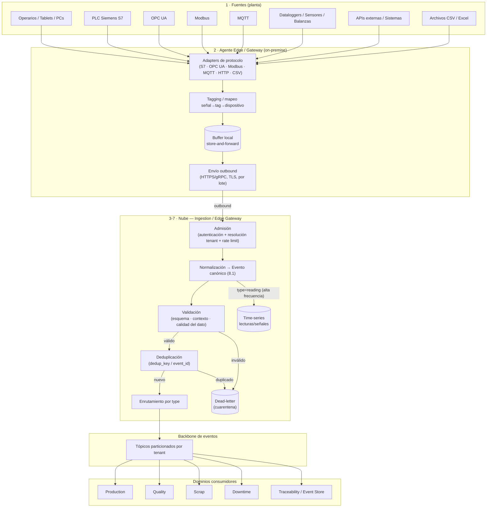
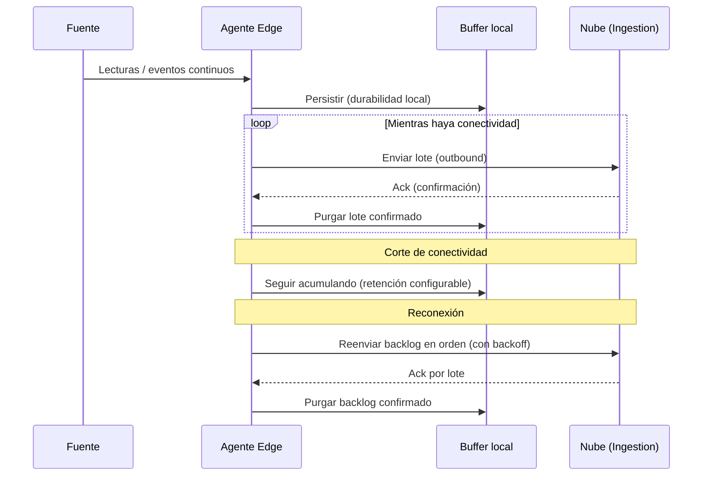

# Ingesta y Normalización de Datos

> **Documento:** `specs/specs/data-ingestion.md` · **Estado:** Borrador v0.1 · **Actualizado:** 2026-07-13
> **Roles:** Product Manager · Software Architect · UX Designer
> **Relacionados:** [event-engine.md](./event-engine.md) · [layered-architecture.md](./layered-architecture.md) · [digital-twin.md](./digital-twin.md) · [execution.md](./execution.md) · [architecture.md](./architecture.md) · [devices.md](./devices.md) · [traceability.md](./traceability.md) · [integrations.md](./integrations.md) · [scalability.md](./scalability.md) · [glossary.md](./glossary.md)

## Resumen ejecutivo

La ingesta y normalización de datos es **el core del producto Nexo**. Es el mecanismo que convierte el mundo físico y heterogéneo de la planta —PLCs Siemens S7, OPC UA, Modbus, MQTT, dataloggers, sensores, balanzas, cámaras, cargas manuales desde tablets, APIs de terceros y archivos CSV/Excel— en un flujo único de **Eventos canónicos** normalizados, validados, trazables y sincronizables con el ERP. Todo el valor de la plataforma (dashboards en tiempo real, KPIs de OEE, trazabilidad de lote/serie, integración con Odoo) se construye sobre la calidad y confiabilidad de este pipeline.

El pipeline arranca en el **borde**: un **Agente Edge / Gateway** on-premise ejecuta los *adapters de protocolo* cerca de la fuente, aplica *store-and-forward* ante cortes de conectividad y envía los datos en modo *outbound* hacia la nube. En la nube, el servicio **Ingestion / Edge Gateway** completa la **normalización al Evento canónico** (sección 8.1 del brief), lo **valida**, lo **deduplica** y lo **enruta** hacia los dominios (Production, Quality, Scrap, Downtime, Traceability) a través del backbone de eventos.

El diseño asume un régimen de carga exigente (millones de eventos/día, picos abruptos, conectividad intermitente) y se apoya en cuatro pilares: **absorción de picos y backpressure** (colas/broker y buffering), **garantías de entrega at-least-once con idempotencia** (para no perder ni duplicar), **gestión rigurosa de orden, timestamps y calidad del dato**, y **capacidad de reprocesamiento** para reconstruir estado o corregir errores sin perder el historial inmutable.

En el **modelo conceptual de 4 capas** (ver [architecture.md](./architecture.md) §1.6 y [layered-architecture.md](./layered-architecture.md)), este documento especifica **el pipeline de la Capa 4 — Motor de eventos**: la maquinaria que **trae, normaliza, valida y enruta** los hechos. No especifica la capa completa. El **contrato del evento canónico** y las **métricas derivadas** (progreso, cuellos de botella, tiempos muertos, productividad por recurso, costo real) viven en [event-engine.md](./event-engine.md). Dicho de forma corta: **acá se define cómo llega el hecho; allá, qué significa el hecho y qué se calcula con él.**

Este documento describe el pipeline extremo a extremo, sus etapas, sus garantías y sus modos de falla, sirviendo de contrato funcional entre el edge, el servicio de ingesta y los dominios consumidores. La gestión del hardware que produce los datos está en [devices.md](./devices.md); el modelo del gemelo digital que da contexto físico (activos, binding sensor↔activo) en [digital-twin.md](./digital-twin.md); la persistencia inmutable y la genealogía en [traceability.md](./traceability.md); la salida hacia el ERP —**conector lateral opcional**— en [integrations.md](./integrations.md).

---

## 1. Panorama del pipeline

El pipeline se organiza en etapas con responsabilidades claras. Desde la fuente hasta el enrutamiento a dominios:

1. **Fuentes** — operarios/tablets, PLCs, OPC UA, Modbus, MQTT, dataloggers, sensores, balanzas, cámaras, APIs externas, archivos CSV/Excel.
2. **Agente Edge / Gateway** — captura on-premise, adapters de protocolo, tagging, buffer local (store-and-forward), envío outbound.
3. **Recepción en la nube** — API Gateway + servicio Ingestion (autenticación, resolución de tenant, admisión).
4. **Normalización** — mapeo a **Evento canónico** (8.1).
5. **Validación** — esquema, contexto (device/site/line/asset), reglas de calidad del dato.
6. **Deduplicación** — por `dedup_key` / `event_id` (idempotencia).
7. **Enrutamiento a dominios** — publicación por `type` hacia Production/Quality/Scrap/Downtime/Traceability y demás consumidores.

### 1.1 Diagrama de flujo (fuentes → dominios)

> `type=reading` de alta frecuencia se persiste en **time-series** además de (o en lugar de) generar eventos de dominio, según la configuración de la señal; ver sección 6 y [scalability.md](./scalability.md).

### 1.2 Rol en el modelo por capas y frontera con el Motor de eventos

La ingesta es **el pipeline de entrada de la Capa 4**. Todo lo que ocurre en las capas inferiores —un sensor que mide (Capa 1), un operario que marca una tarea como terminada (Capa 3), el sistema mismo— entra por acá y sale convertido en **Evento canónico**. La frontera con [event-engine.md](./event-engine.md) se declara explícitamente para **no duplicar** contenido entre ambos documentos:

| Responsabilidad | Vive en `data-ingestion.md` (este doc) | Vive en `event-engine.md` |
|---|---|---|
| Adapters de protocolo, captura y tagging en el borde | ✅ | ❌ |
| Store-and-forward, backpressure, picos, reintentos | ✅ | ❌ |
| Normalización a Evento canónico (cómo se completa cada campo) | ✅ | ❌ |
| Validación, calidad del dato, cuarentena/dead-letter | ✅ | ❌ |
| Deduplicación e idempotencia extremo a extremo | ✅ | ❌ |
| Enrutamiento a dominios y persistencia diferenciada | ✅ | ❌ |
| **Contrato semántico del evento** (qué significa cada atributo, incluida la evidencia) | referencia | ✅ (definición) |
| **Métricas derivadas** (progreso, cuellos de botella, tiempos muertos, productividad, costo real) | ❌ | ✅ |
| Atribución del evento a `Activo` / `Tarea ejecutada` / `Ejecución` | resuelve el contexto disponible en la captura | ✅ (define la regla de atribución) |
| Historial inmutable y genealogía | ❌ → [traceability.md](./traceability.md) | referencia |
| Automatizaciones y alertas sobre eventos | ❌ → [rules-engine.md](./rules-engine.md) | referencia |
| Visualización de métricas | ❌ → [dashboards.md](./dashboards.md) | referencia |

- **Regla práctica:** si la pregunta es *"¿cómo llega el dato y con qué garantías?"*, la respuesta está acá. Si es *"¿qué es un evento, a qué se atribuye y qué se calcula con él?"*, está en [event-engine.md](./event-engine.md).
- **Contexto físico obligatorio:** la ingesta resuelve el `Activo` de cada señal usando el binding **sensor/señal ↔ Activo** de la Capa 1 (regla no negociable, ver [digital-twin.md](./digital-twin.md) y [devices.md](./devices.md)). Un dato sin Activo resoluble entra marcado como **no contextualizado** (sección 4) y no alimenta métricas por recurso hasta que se mapee.

---

## 2. Fuentes y adapters de protocolo

El Agente Edge ejecuta un **adapter** por familia de protocolo/fuente. Cada adapter conoce las particularidades de su origen y entrega al núcleo del agente una representación uniforme (lectura/evento con contexto de dispositivo y tag), lista para tagging y buffering.

| Fuente / protocolo | Modo de captura | Consideraciones clave |
|---|---|---|
| **PLC Siemens S7** | Lectura de áreas de memoria / bloques por *polling* o suscripción | Mapeo de direcciones a tags; frecuencia de sondeo configurable; deriva de reloj del PLC |
| **OPC UA** | Suscripción a nodos / *monitored items* | Modelo de información rico; calidad del dato nativa (status codes); certificados |
| **Modbus** | *Polling* de registros/coils | Sin timestamp nativo; el agente sella el tiempo de lectura; endianness/escala |
| **MQTT** | Suscripción a *topics* | Push desde dispositivos IoT (ESP32/Arduino/RPi); QoS del broker; payloads heterogéneos |
| **HTTP / API** | Push (webhook) o pull (polling) | Sistemas externos; autenticación; paginación; límites de tasa |
| **CSV / Excel** | Importación por lote (upload o carpeta observada) | Parseo tolerante; mapeo de columnas a campos; validación de encabezados y tipos |
| **Carga manual (Operario/Tablet)** | Formularios en app | El operario aporta contexto (orden, turno, motivo); validación en origen; captura **offline-first con store-and-forward** y `dedup_key` (alineado con edge-first): la tablet persiste local y sincroniza al reconectar sin generar duplicados |

> **Adapters activos en MVP vs. V1 — decisión cerrada (DEV-02, 2026-07-11):** en el **MVP** están activos los adapters de **carga manual (operario/tablet)** y **datalogger vía archivo (CSV/Excel/upload)**; los adapters de **protocolo industrial de captura automática — Siemens S7, OPC UA, Modbus, MQTT — se habilitan en V1**. El **pipeline y el modelo canónico soportan todos los protocolos desde el día 1** (sin migraciones para activarlos); lo único que cambia es qué adapters están **habilitados**. Ver [devices.md](./devices.md) y [tablero de decisiones](../open-questions-board.md).

- **Extensibilidad:** nuevos protocolos se incorporan como nuevos adapters sin alterar el resto del pipeline (adapters como plugins). El catálogo de conectores/adapters oficiales y de terceros se gobierna vía Marketplace (ver [architecture.md](./architecture.md)).
- **Tagging:** cada lectura/evento se asocia a un **tag/señal** y a un **dispositivo** del inventario de [devices.md](./devices.md), y se contextualiza con **site/line/asset** cuando aplica. Sin este mapeo, el dato se admite pero se marca como *no contextualizado* para revisión.

---

## 3. Normalización al Evento canónico

Todas las fuentes convergen en el **Evento canónico** (sección 8.1 del brief), la unidad normalizada e **inmutable** del sistema. La normalización es la traducción de la representación de origen a este contrato común.

| Campo | Cómo se completa en la ingesta |
|---|---|
| `event_id` | Se asigna un identificador único al admitir el evento (si el origen no lo trae) |
| `tenant_id` | Resuelto en la admisión (subdominio/host o claim del token); nunca lo define el payload |
| `timestamp` | Preferentemente el **tiempo de origen** del hecho; si falta, el tiempo de captura del agente; se registra también el tiempo de ingesta (ver sección 8) |
| `source` | device / manual / api / file, según el adapter (**origen**) |
| `device_id?` | Del mapeo de tagging (si aplica) |
| `site / line / asset` | Del contexto del dispositivo/operario. **`asset` es obligatorio cuando el hecho es físico**: se resuelve por el binding señal↔Activo |
| `task_run_id? / run_id?` | Referencia a la **`Tarea ejecutada`** y/o a la **`Ejecución`** cuando el hecho es atribuible al trabajo (típico en captura manual y en señales de un Activo con tarea en curso) |
| `type` | production \| scrap \| quality \| downtime \| reading \| machine_event \| custom |
| `payload` | Contenido normalizado según `type` (unidades, escalas y códigos ya convertidos) — el **valor** del hecho |
| **`evidencia?`** | **Referencia(s) a la prueba del hecho: foto, archivo, lectura de sensor, firma, frame de cámara.** El binario se sube a **Files / Media** y el evento guarda la **referencia + metadatos** (tipo, autor, marca temporal, checksum); el evento **nunca transporta el binario** |
| `operator_id?` | Para eventos manuales/operados |
| `shift?` | Turno resuelto por contexto temporal/planta |
| `origin_metadata` | Protocolo, firmware, **calidad del dato** (p. ej. status OPC UA), agente de origen |
| `dedup_key` | Clave determinística para idempotencia (ver sección 5) |

- **Normalización distribuida:** el agente realiza normalización **parcial** (conversión de escalas/unidades, tagging) para reducir carga en la nube; el servicio Ingestion consolida la **normalización canónica final** y garantiza el contrato.
- **Inmutabilidad:** una vez normalizado e ingerido, el evento no se modifica. Las correcciones se modelan como **nuevos eventos** (compensatorios o de anexo), preservando la trazabilidad (ver [traceability.md](./traceability.md)).
- **Versionado de esquema:** el Evento canónico evoluciona con compatibilidad hacia atrás; productores (adapters) y consumidores (dominios) evolucionan de forma independiente bajo gobierno de esquema (ver [architecture.md](./architecture.md)).
- **Atribución al trabajo:** cuando el contexto lo permite (formulario de captura de una tarea, o señal de un `Activo` con una `Tarea ejecutada` en curso), la ingesta completa la referencia a `Tarea ejecutada`/`Ejecución`. La **regla de atribución** —qué hacer ante ambigüedad o solapamiento de tareas en un mismo Activo— la define [event-engine.md](./event-engine.md); acá solo se resuelve con el contexto disponible.

### 3.1 Evidencia dentro del evento normalizado

La **evidencia** es parte del evento canónico, no un anexo posterior (su definición semántica y su obligatoriedad por tarea se especifican en [event-engine.md](./event-engine.md) y [work-model.md](./work-model.md)). Para la ingesta, esto implica reglas concretas:

- **Separación binario / metadato:** el archivo viaja por el canal de **Files / Media** (upload directo, resumible, con storage aislado por tenant) y el evento porta **solo la referencia**. Así el pipeline de eventos no se degrada por payloads pesados.
- **Captura offline:** una foto tomada por un operario sin conectividad se retiene en el buffer local junto al evento; al reconectar se sube primero el binario y luego se confirma el evento, manteniendo la misma `dedup_key` (sin duplicar ni la evidencia ni el hecho).
- **Evidencia como lectura de sensor:** cuando la prueba del hecho es un valor medido (peso de balanza, temperatura al momento del control), la evidencia se resuelve por **referencia al evento/serie temporal** de esa señal, sin generar un archivo.
- **Evidencia faltante:** si la `Tarea` exige evidencia obligatoria y el evento llega sin ella, el evento **se admite** (nunca se pierde el hecho) pero se marca como *incompleto*; la política de bloqueo del cierre de la tarea es de la Capa 3 (ver [execution.md](./execution.md)), no del pipeline.
- **Trazabilidad:** la referencia de evidencia es inmutable como el resto del evento y forma parte de la cadena de trazabilidad (ver [traceability.md](./traceability.md)).

---

## 4. Validación y calidad del dato

Antes de enrutar, cada evento atraviesa una validación en capas. Lo que no supera la validación se deriva a **cuarentena (dead-letter)** para inspección y eventual reprocesamiento, sin bloquear el flujo del resto.

- **Validación estructural (esquema):** presencia y forma de los campos obligatorios del Evento canónico; tipos y rangos básicos.
- **Validación de contexto:** que `device_id`, `site/line/asset`, `operator_id` y `shift` existan y sean coherentes en el tenant (referencias a [devices.md](./devices.md) y a los maestros del dominio).
- **Validación semántica / de calidad del dato:**
  - Rangos plausibles por tag (p. ej. temperatura fuera de límites físicos → marca de calidad).
  - Códigos de calidad nativos del protocolo (status OPC UA, banderas del PLC) propagados en `origin_metadata`.
  - Detección de valores atascados (*stuck*), saltos imposibles y *gaps* temporales.
- **Marcado de calidad (data quality flags):** el evento no siempre se descarta; puede admitirse con una **marca de calidad** (bueno / sospechoso / interpolado / fuera de rango) para que los dominios y dashboards decidan cómo usarlo. Esto preserva el dato crudo y su linaje.

| Resultado de validación | Acción |
|---|---|
| Válido y de buena calidad | Continúa a deduplicación y enrutamiento |
| Válido con marca de calidad (sospechoso) | Continúa, pero etiquetado; visible en dashboards/reportes con su calidad |
| Inválido (esquema/contexto) | Cuarentena (dead-letter) con motivo; alerta a Observability |
| No contextualizado (sin tag/dispositivo **o sin `Activo` resoluble**) | Admitido y marcado para mapeo manual; no enruta a dominio ni alimenta métricas por recurso hasta resolverse |
| Sin evidencia cuando la tarea la exige | Admitido y marcado como *incompleto*; la Capa 3 decide si eso bloquea el cierre de la tarea (ver [execution.md](./execution.md)) |

---

## 5. Deduplicación y garantías de entrega

### 5.1 Garantía at-least-once + idempotencia

- El transporte edge→nube y el broker operan con **entrega at-least-once**: ante reintentos por cortes o *acks* perdidos, un mismo evento puede llegar más de una vez. Nunca se pierde, pero puede duplicarse.
- La **idempotencia** neutraliza los duplicados: cada evento porta una **`dedup_key`** (y `event_id`) determinística. El servicio Ingestion mantiene una **ventana de deduplicación** que descarta reingresos del mismo evento.
- **Idempotencia en consumidores:** los dominios también consumen de forma idempotente (aplicar un evento ya aplicado no cambia el estado), reforzando la garantía extremo a extremo.

### 5.2 Construcción de la `dedup_key`

- Debe ser **determinística y estable** a lo largo de reintentos: derivada de atributos invariantes del hecho (p. ej. dispositivo/tag + timestamp de origen + secuencia), no del momento de envío.
- Para cargas manuales, se deriva del contexto del formulario para evitar dobles registros por reenvío del operario; la tablet trabaja **offline-first** (store-and-forward local) y, al reconectar, reenvía con la misma `dedup_key`, de modo que la sincronización diferida no genera duplicados (decisión UX-01).
- Para archivos (CSV/Excel), se deriva de la identidad de la fila dentro del lote para evitar reprocesar filas ya cargadas.

### 5.3 Ventana y persistencia de deduplicación

- La deduplicación usa una ventana temporal/estado acotado (para no crecer sin límite). Eventos muy tardíos fuera de la ventana se tratan según política (admitir con marca, o comparar contra el Event Store de [traceability.md](./traceability.md) para casos críticos).
- El patrón **outbox/inbox** garantiza consistencia entre la escritura local del servicio y la publicación/consumo de eventos (ver [architecture.md](./architecture.md)).

---

## 6. Enrutamiento a dominios y persistencia

- Tras deduplicar, el evento se **publica en el backbone** —broker **tipo Kafka detrás de una abstracción**, agnóstico de nube y con opción de *managed* equivalente sin acoplarse a primitivas propietarias (decisión ARQ-01, ver [architecture.md](./architecture.md))— en tópicos **particionados por tenant** (y por clave de orden, p. ej. dispositivo/línea). El enrutamiento primario es por `type`:

| `type` | Dominio(s) consumidor(es) principal(es) |
|---|---|
| `production` | Production (+ Traceability, Dashboards, Rules) |
| `scrap` | Scrap (+ Traceability, Dashboards, Rules) |
| `quality` | Quality (+ Traceability, Dashboards, Rules) |
| `downtime` | Downtime (+ Traceability, Dashboards, Rules) |
| `reading` | Time-series / Devices (+ Rules; agregaciones a Dashboards) |
| `machine_event` | Downtime/Devices según semántica (+ Rules) |
| `custom` | Según configuración del tenant (Rules/Dashboards) |

- **Consumidores en paralelo:** el mismo evento puede ser consumido por varios dominios de forma independiente (pub/sub). **Traceability** consume prácticamente todos los eventos para construir el **historial inmutable** y la **genealogía** (ver [traceability.md](./traceability.md)).
- **Persistencia diferenciada:**
  - Eventos de dominio → estado transaccional en la **DB del tenant** (por dominio).
  - `reading` de alta frecuencia → **time-series** (append-only, con *downsampling* y retención; ver [scalability.md](./scalability.md)).
  - Read models de Dashboards/Reports se materializan consumiendo el flujo (CQRS).
- **Salida al ERP:** los dominios (o Traceability) producen los hechos que **Connectors/Integrations** sincroniza con el ERP vía ACL (ver [integrations.md](./integrations.md)). La ingesta no habla directamente con el ERP, **y el ERP es opcional**: sin conector, el flujo termina en los dominios, la trazabilidad y los tableros, sin degradación funcional.
- **Frontera con las métricas:** el enrutamiento entrega **hechos**, no indicadores. El cálculo de **progreso, cuellos de botella, tiempos muertos, productividad por recurso y costo real** ocurre en la Capa 4 según lo definido en [event-engine.md](./event-engine.md); su visualización, en [dashboards.md](./dashboards.md). La ingesta no calcula KPIs ni los persiste.

---

## 7. Manejo de picos, backpressure y store-and-forward

El régimen de carga es **irregular**: arranques de turno, reanudaciones tras cortes y ráfagas de máquinas generan **picos** muy por encima del promedio. El diseño absorbe estos picos sin perder datos ni degradar de forma incontrolada.

### 7.1 Absorción de picos

- El **broker/colas** actúan como amortiguador: desacoplan la tasa de llegada de la tasa de procesamiento. Los consumidores escalan horizontalmente según el *lag*/profundidad de cola (ver [scalability.md](./scalability.md)).
- La **admisión** aplica *rate limiting* y *throttling* por tenant para evitar que un tenant ruidoso afecte a otros (aislamiento de rendimiento).

### 7.2 Backpressure

- Cuando un consumidor no da abasto, la **presión se propaga hacia atrás** de forma controlada: el broker retiene, la admisión ralentiza y, en el extremo, el **agente retiene en su buffer local** en lugar de descartar.
- Se prefiere **retener y diferir** antes que perder; el buffer del edge es el último amortiguador ante saturación de la nube.

### 7.3 Store-and-forward ante cortes

- El **buffer local es persistente** (sobrevive a reinicios del agente) y tiene **retención configurable** (por tiempo/tamaño). Al reconectar, el agente **reenvía el backlog** respetando orden y con *backoff*.
- Al reingresar el backlog, la **deduplicación** de la sección 5 evita duplicados por lotes reenviados que ya habían sido parcialmente confirmados.
- **Política de saturación del buffer:** si el corte se prolonga y el buffer llega a su límite, se aplica una política definida (p. ej. priorizar eventos de dominio sobre lecturas de alta frecuencia, o *downsampling* local de `reading`), registrando la decisión en `origin_metadata`/Observability. Ver Preguntas abiertas.

---

## 8. Orden, timestamps y relojes

El orden y el tiempo son críticos para KPIs (OEE, MTBF/MTTR) y trazabilidad. El pipeline distingue varios tiempos y aplica estrategias de orden robustas ante llegadas fuera de secuencia.

- **Tres tiempos por evento:**
  - **Tiempo de origen** (cuándo ocurrió el hecho) — preferente para negocio; puede venir del PLC/OPC UA o sellarse en el agente.
  - **Tiempo de captura** (cuándo lo leyó el agente) — respaldo cuando la fuente no aporta timestamp (p. ej. Modbus).
  - **Tiempo de ingesta** (cuándo lo admitió la nube) — para diagnóstico de latencia y reproceso.
- **Deriva de reloj del edge:** los relojes de PLC/agentes pueden estar desalineados. Se documenta una estrategia de sincronización/corrección (p. ej. sincronización de tiempo en el agente y registro del *offset* en `origin_metadata`) para no distorsionar métricas.
- **Orden por partición:** el broker preserva orden **dentro de una partición** (clave por tenant + dispositivo/línea). El orden global estricto entre particiones no se garantiza; los dominios que lo requieran reordenan por `timestamp` de origen dentro de ventanas.
- **Eventos tardíos (late arrivals):** tras un corte, llegan eventos con timestamp antiguo. Los dominios y read models manejan **ventanas de tolerancia** y recomputan agregaciones afectadas; la trazabilidad los incorpora al historial por su tiempo de origen (ver [traceability.md](./traceability.md)).

---

## 9. Reprocesamiento

El pipeline soporta **reprocesar** eventos para corregir errores de normalización/mapeo, reconstruir read models o incorporar nuevas reglas retroactivas, **sin violar la inmutabilidad** del historial.

- **Fuente de verdad para reproceso:** el **log de eventos** del broker (retención configurable) y/o el **Event Store** de [traceability.md](./traceability.md) permiten **releer** el flujo histórico.
- **Reconstrucción de read models:** los modelos de Dashboards/Reports pueden **reconstruirse desde cero** reproyectando eventos (propiedad clave de CQRS). Útil ante cambios de esquema de vista o corrupción de un read model.
- **Corrección de datos:** un error en el mapeo de un tag se corrige emitiendo **eventos compensatorios/de anexo** o reproyectando con la lógica corregida; el evento original permanece inmutable con su marca de calidad.
- **Cuarentena (dead-letter):** los eventos en cuarentena (inválidos/duplicados/no contextualizados) pueden **corregirse y reinyectarse** una vez resuelto el problema (p. ej. tras crear el dispositivo faltante o corregir el mapeo de columnas de un CSV).
- **Trazabilidad del reproceso:** todo reprocesamiento queda auditado (quién, qué rango, con qué versión de lógica) vía Audit/Observability, para reproducibilidad.

---

## 10. Modos de falla y mitigaciones (resumen)

| Situación | Riesgo | Mitigación |
|---|---|---|
| Corte de conectividad planta↔nube | Pérdida de datos | Store-and-forward con buffer persistente y reenvío de backlog |
| Pico de eventos (arranque de turno, reconexión) | Saturación, pérdida | Broker como amortiguador + backpressure + autoscaling de consumidores |
| Duplicados por reintentos | Doble conteo | `dedup_key`/idempotencia en Ingestion y consumidores |
| Evento inválido o mal mapeado | Datos corruptos aguas abajo | Validación en capas + cuarentena + reproceso |
| Falta timestamp de origen | KPIs distorsionados | Tiempo de captura del agente + registro de los tres tiempos |
| Deriva de reloj del edge | Orden/latencia erróneos | Sincronización de tiempo y registro de offset en `origin_metadata` |
| Tenant ruidoso | Afecta a otros tenants | Rate limiting/throttling y particionamiento por tenant |
| Corrupción de read model | Dashboards erróneos | Reproyección/reconstrucción desde el log de eventos (CQRS) |

---

## 11. Referencias cruzadas

- **Capa 4 · contrato del evento y métricas derivadas:** [event-engine.md](./event-engine.md)
- Modelo por capas (documento ancla): [layered-architecture.md](./layered-architecture.md)
- Capa 1 · gemelo digital, binding sensor↔Activo y formularios de captura: [digital-twin.md](./digital-twin.md)
- Capa 3 · ejecuciones y tareas a las que se atribuyen los eventos: [execution.md](./execution.md)
- Inventario, salud y OTA de dispositivos/agentes: [devices.md](./devices.md)
- Historial inmutable, genealogía y Event Store: [traceability.md](./traceability.md)
- Sincronización con ERPs (Odoo) y ACL: [integrations.md](./integrations.md)
- Arquitectura global, evento canónico y broker: [architecture.md](./architecture.md)
- Escala, particionamiento, time-series y retención: [scalability.md](./scalability.md)

---

## Preguntas abiertas

1. **Política de saturación del buffer edge:** ante cortes prolongados que llenan el buffer, ¿qué se prioriza y qué se degrada (p. ej. downsampling local de `reading` vs. retención total)? ¿Retención mínima garantizada (horas/días)?
2. **Estrategia de reloj y tolerancia a tardíos:** ¿qué mecanismo de sincronización de tiempo se estandariza en el edge y qué ventana de tolerancia adoptan dashboards/read models para *late arrivals*?
3. **Alcance de la normalización en el edge vs. nube:** ¿cuánta transformación (unidades, agregaciones) se hace en el agente para aliviar la nube sin complejizar en exceso el despliegue de flota?
4. **Ventana y almacén de deduplicación:** ¿qué duración/estrategia de la ventana de dedup equilibra memoria y cobertura de reenvíos muy tardíos? ¿Se apoya en Traceability para casos críticos?
5. **Retención del log de eventos para reproceso:** ¿cuánto tiempo se conserva el flujo en el broker/Event Store para permitir reconstrucción de read models y auditoría?
6. **Manejo de `reading` de alta frecuencia:** ¿qué señales generan eventos de dominio y cuáles solo alimentan time-series? ¿Umbrales/agregaciones configurables por tag?
7. **Gobernanza de adapters de terceros:** ¿qué requisitos de calidad/seguridad debe cumplir un adapter publicado en Marketplace para entrar al pipeline de captura?
8. **Límites de la evidencia:** ¿qué tamaño máximo, formatos y política de retención se admiten para la evidencia adjunta (foto/video/frame), y qué pasa con el buffer del edge cuando un corte prolongado acumula binarios pesados? (cruza con la sección 7.3 y con [event-engine.md](./event-engine.md)).
9. **Atribución automática evento → tarea:** cuando un `Activo` tiene más de una `Tarea ejecutada` abierta o solapada, ¿con qué criterio la ingesta propone la atribución y cuándo la deja en manos de la Capa 4? ¿Se admite atribución diferida (reproceso) al cerrar la tarea?
