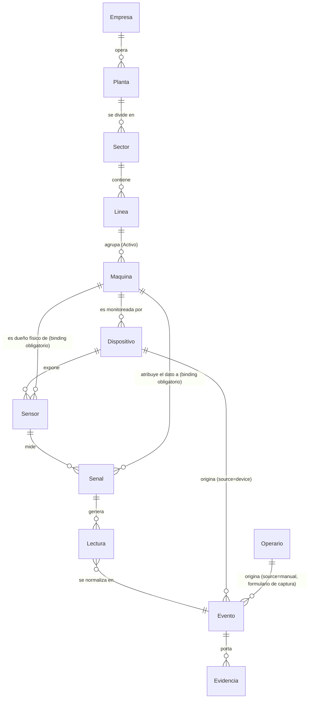
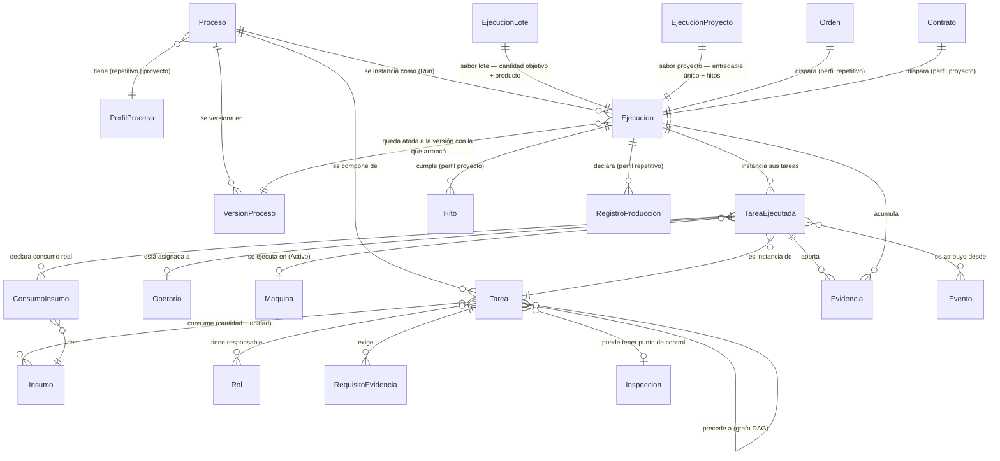
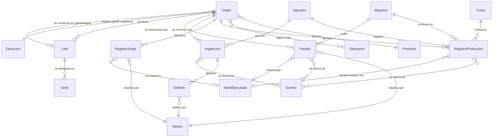
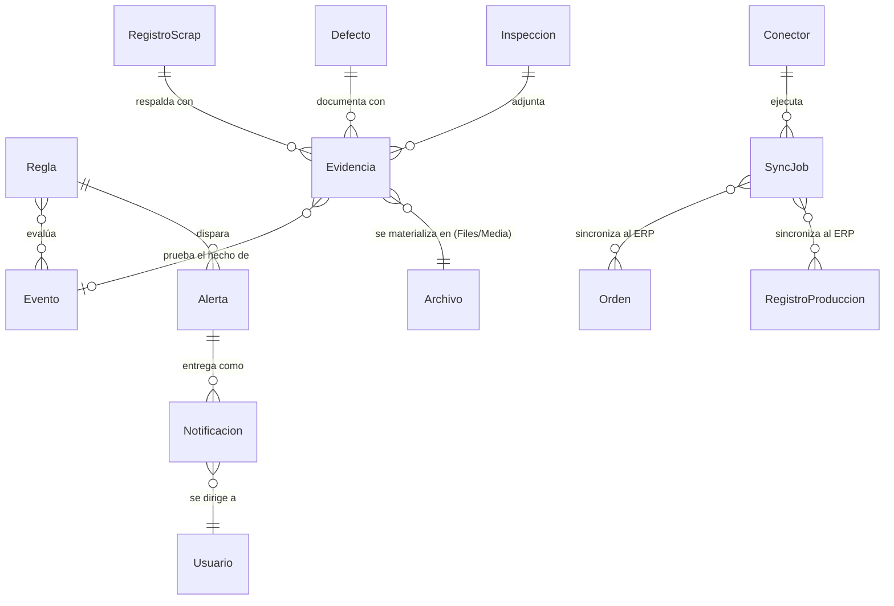
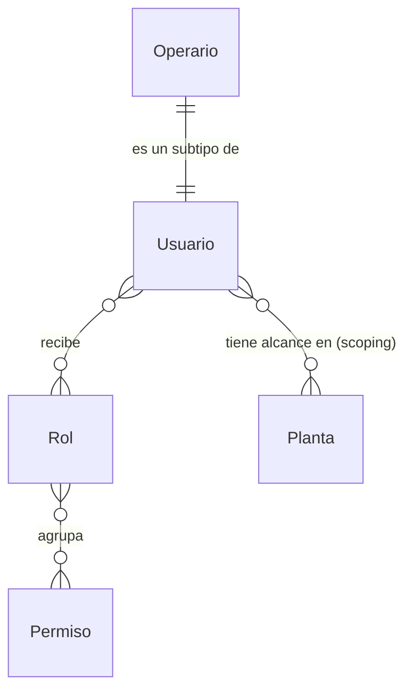
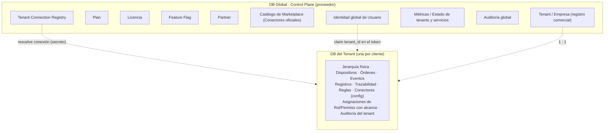

# Modelo de Datos Conceptual (Negocio)

> **Documento:** `specs/specs/data-model.md` · **Estado:** Borrador v0.1 · **Actualizado:** 2026-07-13
> **Roles:** Product Manager · Software Architect · UX Designer
> **Relacionados:** [layered-architecture.md](./layered-architecture.md) · [digital-twin.md](./digital-twin.md) · [work-model.md](./work-model.md) · [execution.md](./execution.md) · [event-engine.md](./event-engine.md) · [master-data.md](./master-data.md) · [architecture.md](./architecture.md) · [multi-tenancy.md](./multi-tenancy.md) · [control-plane.md](./control-plane.md) · [production.md](./production.md) · [quality.md](./quality.md) · [scrap.md](./scrap.md) · [downtime.md](./downtime.md) · [devices.md](./devices.md) · [traceability.md](./traceability.md) · [integrations.md](./integrations.md) · [rules-engine.md](./rules-engine.md) · [users-permissions.md](./users-permissions.md) · [data-ingestion.md](./data-ingestion.md) · [glossary.md](./glossary.md)

## Resumen ejecutivo

Este documento define el **modelo de datos conceptual** de Nexo: el vocabulario común de negocio con el que hablan todos los dominios de la plataforma. **No es un diseño físico de base de datos.** Aquí no hay tablas SQL, tipos de columnas ni DDL: se describen **conceptos de negocio** —qué significa cada entidad, qué atributos conceptuales la caracterizan y cómo se relaciona con las demás—. El objetivo es que "Orden de producción", "Lote", "Evento" o "Parada" signifiquen exactamente lo mismo en Producción, Calidad, Trazabilidad, Integraciones y en la conversación con el cliente. El diseño físico (motores, índices, particionamiento, almacenamiento time-series) es responsabilidad de cada microservicio y se aborda en sus documentos y en [scalability.md](./scalability.md).

El modelo se organiza alrededor de una idea central: **todo dato de planta se convierte en un `Evento` canónico normalizado**, y a partir de esos eventos se derivan los **registros de negocio** (producción, scrap, calidad, paradas) y la **genealogía** de materiales (lotes y series). Sobre esa base se apoyan la automatización (reglas y alertas), la integración con el ERP (conectores y jobs de sincronización) y el control de acceso (usuarios, roles y permisos). Las entidades descritas son exactamente las **entidades canónicas** del brief de fundamentos (sección 8); este documento es su definición extendida y la fuente para el resto de las especificaciones.

El modelo incorpora además el **modelo conceptual de 4 capas** (ver [architecture.md](./architecture.md) §1.6 y [layered-architecture.md](./layered-architecture.md)): entidades **físicas** (Capa 1: Activo, Sensor, Señal), entidades de **modelo de trabajo** (Capa 2: `Proceso`, `Tarea`, `Insumo`, `Perfil de proceso`), entidades de **ejecución** (Capa 3: `Ejecución (Run)` en sus dos sabores, **lote** y **proyecto**) y entidades del **motor de eventos** (Capa 4: `Evento` y `Evidencia`). Esta incorporación **generaliza** el modelo previo en lugar de reemplazarlo: la `Orden de producción` deja de ser el concepto raíz del trabajo y pasa a ser **una forma de disparar** la ejecución de un Proceso de perfil **repetitivo**, y el `Registro de producción` queda ligado a la `Tarea`/`Ejecución` que lo produjo, además de a la Orden. Todo lo definido para producción sigue siendo válido: cambia el encuadre, no la semántica.

Un principio arquitectónico atraviesa todo el modelo: la separación entre la **DB Global (Control Plane)** —exclusiva del proveedor, con datos compartidos como empresas/tenants, planes, licencias, feature flags y catálogo de marketplace— y la **DB del tenant** —una por cliente, con todo su dato operativo (plantas, dispositivos, órdenes, eventos, trazabilidad)—. Ninguna entidad operativa de un cliente vive en una base compartida. Por eso, además de describir cada entidad, este documento indica **en qué microservicio (bounded context) vive** y **en qué base de datos reside** (Control Plane vs. tenant), cumpliendo el requisito no negociable de aislamiento por tenant descrito en [multi-tenancy.md](./multi-tenancy.md).

---

## 1. Principios del modelo conceptual

1. **Conceptos, no tablas.** Cada entidad es una noción de negocio con atributos conceptuales y significado. La materialización física (una o varias tablas, un stream, un documento, un read model) es decisión del servicio dueño.
2. **Lenguaje ubicuo (DDD).** Los nombres provienen del glosario y de las entidades canónicas; no se inventan sinónimos. Ver [glossary.md](./glossary.md).
3. **El evento es el átomo.** El `Evento` es la unidad normalizada de la que se derivan los registros de negocio y la trazabilidad. Ver [data-ingestion.md](./data-ingestion.md) y [traceability.md](./traceability.md).
4. **Master data vs. dato transaccional.** Se distingue el dato de configuración relativamente estable (planta, línea, producto, dispositivo, motivos) del dato de flujo de alta cadencia (lecturas, eventos, registros).
5. **Cada entidad tiene un dueño.** Una entidad "vive" en un único bounded context que la gobierna; los demás la referencian, no la duplican como fuente de verdad (bajo acoplamiento, alta cohesión).
6. **Aislamiento por tenant.** El dato operativo reside siempre en la DB del tenant; el Control Plane solo guarda datos compartidos del proveedor. Ver [multi-tenancy.md](./multi-tenancy.md) y [control-plane.md](./control-plane.md).
7. **Referencias, no acoplamiento fuerte.** Las relaciones entre contextos se expresan por referencia lógica (identificadores de negocio), permitiendo que cada servicio evolucione y escale de forma independiente.
8. **Plantilla vs. instancia.** El modelo separa explícitamente **cómo se hace el trabajo** (`Proceso`/`Tarea`/`Insumo`, Capa 2) de **qué se está haciendo ahora** (`Ejecución`/`Tarea ejecutada`, Capa 3). Un mismo Proceso genera N Ejecuciones; una Ejecución nunca redefine la plantilla, la referencia (y a la versión con la que arrancó).
9. **Ningún dato físico "flota".** Toda `Señal`/`Sensor` está ligada a un **Activo** (Máquina/Centro de trabajo). Es la condición que permite atribuir eventos a tareas y ejecuciones y calcular métricas por recurso. Ver sección 2 y [digital-twin.md](./digital-twin.md).
10. **La evidencia es de primera clase.** Foto, archivo, lectura de sensor, firma o frame de cámara no son un adjunto decorativo: forman parte del hecho registrado y de la cadena de trazabilidad. Ver 4.9 y [traceability.md](./traceability.md).

---

## 2. Panorama de entidades por dominio

Las entidades canónicas se agrupan en clústeres conceptuales. Cada clúster corresponde aproximadamente a uno o más bounded contexts (ver sección 6) y se ubica en una de las **cuatro capas conceptuales** (ver [architecture.md](./architecture.md) §1.6).

| Clúster conceptual | Capa | Entidades canónicas | Naturaleza |
|---|---|---|---|
| **Organización y jerarquía física** | 1 | Tenant/Empresa, Planta, Sector/Área, Línea, **Máquina/Centro de trabajo (Activo)** | Master data del tenant |
| **Captura de datos** | 1 | Dispositivo, Sensor, Señal/Tag, Lectura | Config + dato de alta cadencia |
| **Modelo de trabajo (plantilla)** | 2 | **Proceso**, **Tarea**, **Insumo**, **Perfil de proceso**, Operación/Ruta, Producto/SKU | Master data del tenant (versionada) |
| **Ejecución (instancia)** | 3 | **Ejecución (Run)** y sus sabores **lote** y **proyecto**, **Tarea ejecutada**, **Consumo de insumo**, Orden de producción (disparador), Turno | Dato transaccional |
| **Personas y acceso** | transversal | Operario, Usuario/Rol/Permiso | Identidad + master data |
| **Registros operativos** | 3–4 | Registro de producción, Registro de scrap, Inspección de calidad, Defecto, Parada, Motivo | Dato transaccional |
| **Hechos y métricas** | 4 | **Evento**, métricas derivadas (progreso, cuellos de botella, tiempos muertos) | Dato inmutable + derivado |
| **Trazabilidad** | 4 | Lote/Serie de material (+ Evento como sustrato), genealogía de ejecuciones y tareas | Genealogía |
| **Automatización y notificación** | 4 | Regla, Alerta/Alarma, Notificación | Config + eventos derivados |
| **Integración (lateral, opcional)** | — | Conector, Job de sincronización | Config + transaccional |
| **Evidencia** | 1 y 4 | **Evidencia** (concepto) → Archivo/Media (materialización) | Prueba del hecho |
| **Control Plane (proveedor)** | transversal | Tenant (registro), Plan, Licencia, Feature Flag, Partner, Catálogo de Marketplace, Registry de conexión, Métricas/Estado, Auditoría global | Datos compartidos del proveedor |

> **Binding sensor/señal ↔ Activo (regla no negociable).** Toda `Señal/Tag` —y por extensión todo `Sensor` y toda `Lectura`— **debe** resolver a un **Activo** (Máquina/Centro de trabajo) dueño del dato. El `Dispositivo` puede estar físicamente instalado a nivel de planta o línea (un gateway, un datalogger multicanal), pero **cada una de sus señales declara su Activo**. Si una medición no corresponde a una máquina productiva (temperatura ambiente, consumo eléctrico general), se declara un **Activo de infraestructura** que la posea. Sin dueño físico, el dato **no se puede atribuir** a una tarea ni a una ejecución y no alimenta métricas por recurso: se admite marcado como *no contextualizado* y queda pendiente de mapeo (ver [data-ingestion.md](./data-ingestion.md) §4 y [devices.md](./devices.md)).
>
> **Aviso de terminología — dos "lotes".** *Ejecución de lote* (sabor de la Capa 3: *qué se está fabricando ahora*) **no** es lo mismo que *Lote de material (Batch/Lot)* (unidad de trazabilidad de material, 4.6). Cuando el contexto no sea evidente, escribir **"ejecución de lote"** y **"lote de material"**.

---

## 3. Diagramas conceptuales (Mermaid `erDiagram`)

> Los diagramas son **conceptuales**: muestran entidades y relaciones de negocio con su cardinalidad, no columnas ni tipos. Los nombres se escriben en token único por compatibilidad de render; entre paréntesis va la denominación canónica cuando difiere.

### 3.1 Jerarquía física y captura de datos — Capa 1 (DB del tenant)

> El **binding sensor/señal ↔ Activo** es doble a propósito: el `Dispositivo` describe **dónde está instalado el hardware**, mientras que la `Máquina/Activo` describe **de quién es el dato**. Ambos pueden no coincidir (un gateway de sector que lee cuatro máquinas). El binding vinculante para métricas y trazabilidad es el del Activo. Las tres fuentes de dato de la capa son **sensores**, **cámaras/visión** y **captura manual del operario** (formulario de captura, nunca "dashboard"; ver [digital-twin.md](./digital-twin.md)).

### 3.2 Modelo de trabajo y ejecución — Capas 2 y 3 (DB del tenant)

Un proyecto único y una producción repetitiva **se modelan igual**: mismo `Proceso`, mismas `Tareas`, mismos `Insumos`. Lo único que cambia es el **perfil**, el **disparador** de la ejecución y el set de KPIs aplicables (ver [work-model.md](./work-model.md) y [execution.md](./execution.md)).

> **Cómo generaliza lo existente:** `Orden de producción` y `Operación/Ruta` no desaparecen; se reencuadran. La Orden es **el disparador** de una `Ejecución` de perfil repetitivo (demanda/plan/stock) y la Ruta es la expresión secuencial de un grafo de `Tareas`. Un proyecto usa el mismo esqueleto con otro disparador (contrato/pedido único) y otros KPIs (% de avance, desvío de cronograma, ruta crítica) en lugar de OEE. Ver [production.md](./production.md) como **perfil repetitivo** del modelo de trabajo.

### 3.3 Trabajo, personas, registros operativos y trazabilidad (DB del tenant)

> Los registros operativos **conservan** su vínculo con la `Orden` (compatibilidad con lo ya especificado) y **suman** el vínculo con la `Tarea ejecutada`/`Ejecución` que los originó. Ese segundo vínculo es el que permite medir avance, tiempos muertos y cuellos de botella a nivel de tarea, y el que hace que el modelo funcione igual para un proyecto (donde no hay Orden de producción).

### 3.4 Automatización, integración y evidencia (DB del tenant)

### 3.5 Acceso y frontera Control Plane ↔ Tenant

---

## 4. Entidades canónicas — definición conceptual

Para cada entidad: **significado**, **atributos conceptuales** (nociones de negocio, sin tipos SQL), **relaciones** principales y **ubicación** (servicio dueño + base de datos). Ver el mapeo consolidado en la sección 6 y 7.

### 4.1 Organización y jerarquía física

#### Tenant / Empresa
- **Significado:** cliente de la plataforma. Es la unidad de aislamiento: **una DB por tenant**. Tiene una doble cara: un **registro comercial** en el Control Plane y una **configuración operativa** dentro de su propia DB.
- **Atributos conceptuales:** identidad del tenant; denominación/razón social; identificador comercial; estado (en alta, activo, suspendido, dado de baja); plan contratado; datos de contacto; zona horaria y localización por defecto; referencia a la conexión de su DB (en el Registry, dato del Control Plane).
- **Relaciones:** opera una o más `Planta`; agrupa a sus `Usuarios`; posee `Conectores` y toda su operación.
- **Ubicación:** registro comercial y estado → **Control Plane** (servicios Tenant Provisioning + Administration & Licensing). Configuración operativa → **DB del tenant**.

#### Planta (Site)
- **Significado:** instalación física de la empresa donde ocurre la producción.
- **Atributos conceptuales:** identidad; denominación; ubicación geográfica/dirección; zona horaria; estado (activa/inactiva); referencia a la `Empresa`.
- **Relaciones:** pertenece a una `Empresa`; se divide en `Sectores`; es unidad de **scoping** de acceso (un usuario puede tener alcance a una planta).
- **Ubicación:** master data de la **DB del tenant**.

#### Sector / Área
- **Significado:** subdivisión funcional de una planta (p. ej. mecanizado, envasado, pintura).
- **Atributos conceptuales:** identidad; denominación; referencia a la `Planta`; estado.
- **Relaciones:** pertenece a una `Planta`; contiene `Líneas`.
- **Ubicación:** master data de la **DB del tenant**.

#### Línea (Line)
- **Significado:** línea de producción dentro de un sector; agrupa recursos productivos que trabajan coordinadamente.
- **Atributos conceptuales:** identidad; denominación; referencia al `Sector`; capacidad/velocidad nominal (referencial); estado.
- **Relaciones:** pertenece a un `Sector`; agrupa `Máquinas`; es unidad de **scoping** de acceso.
- **Ubicación:** master data de la **DB del tenant**.

#### Máquina / Centro de trabajo (Work Center / Asset)
- **Significado:** recurso productivo concreto (una máquina, una estación de trabajo, un centro). Es donde se declara producción y donde ocurren las paradas.
- **Atributos conceptuales:** identidad; denominación; tipo/categoría de activo; referencia a la `Línea`; parámetros de referencia (tiempo de ciclo ideal, unidad de medida productiva); estado operativo (en marcha, detenida, en mantenimiento); datos de identificación del activo (para MTBF/MTTR).
- **Relaciones:** pertenece a una `Línea`; es monitoreada por uno o más `Dispositivos`; produce `Registros de producción`; sufre `Paradas`.
- **Ubicación:** master data de la **DB del tenant** (consumida por Production, Devices, Downtime).

### 4.2 Captura de datos

#### Dispositivo (Device)
- **Significado:** hardware de captura que conecta el mundo físico con Nexo (PLC Siemens S7, otros PLC, datalogger, ESP32, Arduino, Raspberry Pi, gateway, cámara).
- **Atributos conceptuales:** identidad; denominación; tipo de dispositivo; protocolo(s) soportado(s) (OPC UA, Modbus, MQTT, S7…); versión de firmware; estado de salud (en línea, degradado, fuera de línea); última vez visto; referencia a la `Máquina`/`Línea` que monitorea; datos de aprovisionamiento/OTA.
- **Relaciones:** monitorea una `Máquina`; expone `Sensores`; origina `Eventos` con `source=device`.
- **Ubicación:** servicio **Devices**, **DB del tenant**.

#### Sensor
- **Significado:** punto de medición asociado a un dispositivo/máquina (termocupla, celda de carga, encoder, fin de carrera).
- **Atributos conceptuales:** identidad; denominación; magnitud física medida; unidad de medida; rango válido/tolerancias; referencia al `Dispositivo`; **referencia al `Activo` dueño del dato (obligatoria)**; estado/calibración.
- **Relaciones:** pertenece a un `Dispositivo`; **está ligado a un `Activo` (Máquina/Centro de trabajo)**; mide una o más `Señales`.
- **Ubicación:** servicio **Devices**, **DB del tenant**.

#### Señal / Tag
- **Significado:** variable concreta que se lee (temperatura, contador de piezas, estado de máquina, presión). Es el "punto de datos" configurado.
- **Atributos conceptuales:** identidad; nombre de la señal/tag; tipo de dato lógico (numérico, booleano, estado); unidad; frecuencia/modo de muestreo (por sondeo, por cambio, por evento); dirección de mapeo (dirección lógica en el dispositivo); umbrales de referencia; referencia al `Sensor`/`Dispositivo`; **referencia al `Activo` al que se atribuye el dato (obligatoria y no negociable)**.
- **Relaciones:** pertenece a un `Sensor`; **se atribuye a un `Activo`**; genera `Lecturas`.
- **Ubicación:** servicio **Devices**, **DB del tenant**.
- **Regla:** una señal sin `Activo` no puede alimentar métricas por recurso ni atribuirse a una `Tarea ejecutada`; se admite como *no contextualizada* y queda pendiente de mapeo. Ver sección 2 y [digital-twin.md](./digital-twin.md).

#### Lectura (Reading)
- **Significado:** muestra puntual del valor de una señal en un instante. Es el dato de **más alta cadencia** del sistema.
- **Atributos conceptuales:** referencia a la `Señal`; valor medido; marca temporal de la muestra; **calidad del dato** (buena, sospechosa, sustituida, interpolada); referencia al `Dispositivo` de origen.
- **Relaciones:** pertenece a una `Señal`; se normaliza en un `Evento` (típicamente `type=reading`).
- **Ubicación:** servicio **Devices / Ingestion**; se persiste como serie temporal en la **DB del tenant** (almacenamiento time-series). Ver [data-ingestion.md](./data-ingestion.md) y [scalability.md](./scalability.md).

#### Evento (Event)
- **Significado:** **unidad normalizada canónica del sistema.** Todo hecho relevante (producción, scrap, calidad, parada, lectura, evento de máquina, personalizado) se expresa como un evento inmutable. Es el sustrato de la trazabilidad.
- **Atributos conceptuales (esquema canónico, ver 8.1 del brief):** los cuatro mínimos de negocio son **fecha** (marca de tiempo de ocurrencia e ingesta), **origen** (`source`: device/manual/api/file + `device_id?`/`operator_id?`), **valor** (`payload` normalizado) y **evidencia** (referencia a la prueba del hecho). Se completan con `event_id`; `tenant_id`; ubicación (`site`/`line`/**`asset`**); **referencia a `Tarea ejecutada`/`Ejecución`** cuando el hecho es atribuible al trabajo; `type` (production | scrap | quality | downtime | reading | machine_event | custom); `shift?`; `origin_metadata` (protocolo, firmware, calidad del dato); `dedup_key`. **Inmutable una vez ingerido.**
- **Relaciones:** originado por `Dispositivo`/`Operario`/`Sistema externo`/`Archivo`; **se atribuye a un `Activo` y, cuando corresponde, a una `Tarea ejecutada`/`Ejecución`**; porta `Evidencia`; se deriva en `Registros` de negocio; es evaluado por `Reglas`; enlaza `Lote`/`Serie` para la genealogía; es la materia prima de las **métricas derivadas** de la Capa 4 (ver [event-engine.md](./event-engine.md)).
- **Ubicación:** normalizado por **Ingestion / Edge Gateway**; persistido por **Traceability / Event Store** en el event store append-only de la **DB del tenant**. Ver [traceability.md](./traceability.md).

### 4.3 Producto, modelo de trabajo (Capa 2) y ejecución (Capa 3)

> Este bloque contiene las **entidades canónicas nuevas** que generalizan el trabajo. La regla de oro: **`Proceso`/`Tarea`/`Insumo` son plantilla** (cómo se hace el trabajo) y **`Ejecución`/`Tarea ejecutada` son instancia** (qué se está haciendo ahora). Un proyecto único y una producción repetitiva comparten exactamente el mismo modelo; cambia el **perfil** y el **disparador**.

#### Producto / SKU
- **Significado:** ítem que se fabrica; se sincroniza típicamente desde el ERP.
- **Atributos conceptuales:** identidad; código/SKU; denominación; unidad de medida; familia/categoría; especificaciones de calidad de referencia; tiempo de ciclo ideal; referencia externa al ERP.
- **Relaciones:** es fabricado por `Órdenes`; asociado a `Inspecciones` (especificaciones); asociado a `Lotes`/`Series`.
- **Ubicación:** servicio **Production**, **DB del tenant** (origen frecuente: ERP vía **Connectors**).

#### Proceso (Process Definition)
- **Significado:** **plantilla de trabajo versionada**: la definición de cómo se hace algo en la empresa, independientemente de cuántas veces se haga. Es la entidad raíz de la Capa 2. Ver [work-model.md](./work-model.md).
- **Atributos conceptuales:** identidad; nombre; **perfil** (repetitivo | proyecto); **versión** y estado de la versión (borrador, vigente, obsoleta); conjunto de `Tareas` con sus precedencias; `Insumos` requeridos; roles responsables; tiempos estándar agregados; criterios de calidad y puntos de control; producto/entregable asociado (cuando aplica); vigencia.
- **Relaciones:** se compone de `Tareas`; requiere `Insumos`; tiene un `Perfil de proceso`; se instancia como `Ejecuciones` (una Ejecución queda atada a la **versión** con la que arrancó); puede asociarse a un `Producto/SKU` (perfil repetitivo).
- **Ubicación:** master data del **modelo de trabajo** en la **DB del tenant** (hoy gobernada por **Production**; ver Preguntas abiertas sobre un bounded context propio). Catálogo propio de la plataforma en modo standalone: ver [master-data.md](./master-data.md).

#### Perfil de proceso (Process Profile)
- **Significado:** clasificador que determina **cómo se dispara** y **cómo se mide** un Proceso. Es la única diferencia estructural entre "fabricar ventanas" y "construir algo a medida".
- **Atributos conceptuales:** identidad; tipo (**repetitivo** | **proyecto**); disparador esperado; set de KPIs aplicable; reglas de cierre.

| Perfil | Se ejecuta | Disparador | Ejemplo | KPIs propios |
|---|---|---|---|---|
| **Repetitivo** | N veces | demanda / plan / stock (típicamente una `Orden de producción`) | fabricar ventanas | **OEE** (Disponibilidad × Rendimiento × Calidad), scrap rate, takt, tiempo de ciclo, FPY |
| **Proyecto** | 1 vez | contrato / pedido único | construir algo a medida | **% de avance**, desvío de cronograma, ruta crítica, hitos cumplidos |
| *(comunes a ambos)* | — | — | — | tiempos muertos, cuellos de botella, productividad por recurso, costo real vs. estimado, calidad |

> Las fórmulas de OEE/MTBF/MTTR **no cambian** (ver [glossary.md](./glossary.md)); lo que se aclara es que **OEE aplica al perfil repetitivo** y no debe forzarse sobre un proyecto.

#### Tarea (Task)
- **Significado:** **unidad de trabajo** dentro de un Proceso. Es el nivel en el que se asigna responsabilidad, se mide avance y se exige evidencia.
- **Atributos conceptuales:** identidad; denominación; **precedencias** (grafo DAG con las tareas anteriores/posteriores); duración **estimada** y **estándar**; **rol responsable** (preferido) o persona; `Insumos` que consume con cantidad y unidad; **evidencia requerida** (tipo y obligatoriedad); criterio de terminación (*definition of done*); punto de control de calidad opcional; `Activo`/centro de trabajo sugerido.
- **Relaciones:** pertenece a un `Proceso`; precede/sucede a otras `Tareas`; consume `Insumos`; exige `Evidencia`; puede disparar una `Inspección de calidad`; se instancia como `Tareas ejecutadas`.
- **Ubicación:** junto al `Proceso`, en la **DB del tenant**.

#### Insumo (Input)
- **Significado:** material, componente, herramienta o servicio que una `Tarea` consume. Generaliza la lista de materiales sin depender de que exista un ERP.
- **Atributos conceptuales:** identidad; código; denominación; tipo (material, componente, herramienta, servicio); **cantidad** y **unidad de medida** por tarea; sustituibles admitidos; costo estándar de referencia; referencia externa al ERP (si existe conector).
- **Relaciones:** es consumido por `Tareas` (plantilla) y por `Consumos de insumo` reales (ejecución); puede referenciar un `Lote de material` en la genealogía.
- **Ubicación:** catálogo de master data en la **DB del tenant** (ver [master-data.md](./master-data.md)); en modo conectado puede sincronizarse desde el ERP.

#### Ejecución (Run)
- **Significado:** **instancia viva de un Proceso**: la respuesta a *"¿qué se está haciendo ahora?"*. **Generaliza** el `production_run` del diseño técnico y es la entidad raíz de la Capa 3. Ver [execution.md](./execution.md).
- **Atributos conceptuales:** identidad; referencia al `Proceso` y a su **versión**; **sabor** (lote | proyecto); disparador que la originó (`Orden`, contrato/pedido, plan, manual); estado del ciclo de vida (planificada, liberada, en curso, pausada, cerrada, cancelada); fechas planificadas y reales; responsable; **avance**; `Tareas ejecutadas`; consumo real de insumos; evidencia acumulada; contexto físico (`Planta`/`Línea`/`Activo`).
- **Relaciones:** instancia un `Proceso`; contiene `Tareas ejecutadas`; acumula `Evidencia`; se atribuye `Eventos`; produce `Lotes`/`Series` de material y `Registros de producción` (perfil repetitivo); cumple `Hitos` (perfil proyecto).
- **Sabores (mismo esqueleto, distinto objetivo):**

| Sabor | Objetivo | Atributos propios | Cierre típico |
|---|---|---|---|
| **Ejecución de lote (Batch Run)** | Cantidad objetivo de un producto; repetible | producto, cantidad objetivo, cantidad producida/scrap, turno | cantidad alcanzada o cierre del supervisor |
| **Ejecución de proyecto (Project Run)** | Entregable único | entregable, fecha objetivo, **hitos**, cronograma, cliente/contrato | aceptación del entregable / hitos cumplidos |

- **Ubicación:** **DB del tenant**; hoy gobernada por **Production** (ver Preguntas abiertas).

#### Tarea ejecutada (Task Instance)
- **Significado:** una `Tarea` de la plantilla materializada dentro de una `Ejecución` concreta. Es el objeto que el operario ve, toma y termina, y la unidad mínima de medición de avance.
- **Atributos conceptuales:** identidad; referencia a la `Tarea` plantilla y a la `Ejecución`; **asignación** (rol/persona); estado (pendiente, lista para iniciar, en curso, bloqueada, terminada, omitida); tiempos (planificado, inicio real, fin real, tiempo efectivo); `Activo` donde se ejecutó; consumo real de insumos; evidencia aportada; resultado del punto de control; peso para el cálculo de avance.
- **Relaciones:** instancia una `Tarea`; pertenece a una `Ejecución`; asignada a un `Operario`/rol; se ejecuta en un `Activo`; consume `Insumos`; aporta `Evidencia`; recibe la atribución de `Eventos`; contextualiza `Registros de producción`, `scrap`, `Inspecciones` y `Paradas`.
- **Ubicación:** **DB del tenant**, junto a la `Ejecución`.

#### Orden de producción (Work Order / MO)
- **Significado:** orden a ejecutar en planta. **Reencuadre (Capa 2/3):** deja de ser el concepto raíz del trabajo y pasa a ser **un disparador** de la `Ejecución` de un `Proceso` de **perfil repetitivo** —el disparador más frecuente en manufactura y el que se sincroniza con el ERP cuando existe conector—. Todo lo especificado en [production.md](./production.md) sigue vigente, ahora leído como el **perfil repetitivo** del modelo de trabajo.
- **Atributos conceptuales:** identidad; número/código de orden; referencia al `Producto`; cantidad planificada; fechas (planificada, inicio real, fin real); estado (planificada, liberada, en curso, pausada, cerrada); referencia a `Máquina`/`Línea`; **referencia a la `Ejecución` que dispara** y al `Proceso`/versión aplicado; referencia externa al ERP (opcional); prioridad.
- **Relaciones:** fabrica un `Producto`; **dispara una `Ejecución`** (relación 1:1); sigue una `Operación/Ruta` (expresión secuencial del grafo de `Tareas`); declara `Registros de producción`/`scrap`; se controla con `Inspecciones`; se interrumpe por `Paradas`; produce `Lotes`/`Series`; se sincroniza vía `Sync Job` **si hay ERP**.
- **Ubicación:** servicio **Production**, **DB del tenant**.
- **Nota de autonomía:** sin ERP, la Orden se crea en la plataforma (manual, plan o regla de stock) contra la master data propia; el conector solo cambia **de dónde viene**, no qué significa.

#### Operación / Ruta
- **Significado:** paso o secuencia de pasos del proceso productivo (la "hoja de ruta"), cada uno realizado en un centro de trabajo. **Reencuadre:** es la **expresión secuencial** del grafo de `Tareas` de un `Proceso` repetitivo; toda Operación es una `Tarea`, pero no toda `Tarea` es secuencial (el modelo general admite DAG).
- **Atributos conceptuales:** identidad; denominación del paso; secuencia/orden; referencia al `Centro de trabajo` sugerido; tiempo estándar; parámetros/instrucciones.
- **Relaciones:** pertenece a una `Orden`/`Producto`/`Proceso`; se ejecuta en una `Máquina`; se instancia como `Tarea ejecutada`.
- **Ubicación:** servicio **Production**, **DB del tenant**.

#### Turno (Shift)
- **Significado:** franja horaria de trabajo; enmarca temporalmente la producción y habilita KPIs por turno.
- **Atributos conceptuales:** identidad; denominación (mañana/tarde/noche…); hora de inicio/fin; días de vigencia; referencia a `Planta`/`Línea`; calendario asociado.
- **Relaciones:** enmarca `Registros de producción`, `Paradas` e `Inspecciones`; asociado a `Operarios`.
- **Ubicación:** servicio **Production**, **DB del tenant**.

### 4.4 Personas y acceso

#### Operario (Operator)
- **Significado:** usuario que opera en planta; **subtipo de Usuario** con perfil orientado a captura desde tablet/terminal.
- **Atributos conceptuales:** identidad (heredada de `Usuario`); legajo/identificador de planta; método de identificación rápida en terminal (PIN/credencial); referencia a `Planta`/`Línea` de trabajo; turno habitual.
- **Relaciones:** es un `Usuario`; registra `Registros de producción`/`scrap`; ejecuta `Inspecciones`; declara `Paradas`.
- **Ubicación:** identidad en **Identity & Access** (Control Plane); perfil operativo y **alcance por planta/línea** en la **DB del tenant**.

#### Usuario / Rol / Permiso
- **Significado:** modelo de acceso. **Usuario** es la identidad; **Rol** agrupa capacidades; **Permiso** es la capacidad atómica sobre un recurso/acción. Modelo **RBAC** con **scoping** por planta/línea y extensiones **ABAC**. Ver [users-permissions.md](./users-permissions.md).
- **Atributos conceptuales:**
  - *Usuario:* identidad; nombre; correo; estado; método(s) de autenticación; referencia al tenant (claim); roles asignados; alcance (plantas/líneas).
  - *Rol:* identidad; denominación (Operario, Supervisor, Calidad, Producción, Mantenimiento, Gerencia, Administrador, Integraciones…); conjunto de permisos; si es de sistema o personalizado.
  - *Permiso:* identidad; recurso; acción (ver/crear/editar/aprobar/exportar…); condiciones ABAC opcionales.
- **Relaciones:** `Usuario` recibe `Roles`; `Rol` agrupa `Permisos`; `Usuario` tiene alcance en `Plantas`/`Líneas`.
- **Ubicación:** **Identity & Access**. Identidad global de usuario y credenciales → **Control Plane**; **asignaciones de rol/permiso y scoping por tenant** → **DB del tenant**. (Frontera exacta a confirmar; ver Preguntas abiertas.)

### 4.5 Registros operativos

#### Registro de producción (Production Record)
- **Significado:** cantidad producida en un contexto (orden/máquina/turno). Se **deriva de eventos** de conteo/declaración. **Reencuadre:** además de la `Orden`, queda ligado a la **`Tarea ejecutada`** y a la **`Ejecución`** que lo generaron; ese vínculo es el que permite medir avance por tarea y hace que el registro funcione igual en un proyecto (donde no hay Orden).
- **Atributos conceptuales:** identidad; referencia a `Orden`/`Máquina`/`Turno`/`Operario`; **referencia a la `Tarea ejecutada` y a la `Ejecución`**; cantidad producida (buena); unidad de medida; marca temporal/ventana; referencia a los `Eventos` origen; **`Evidencia` asociada**; referencia a `Lote`/`Serie` producido; estado de sincronización con el ERP (solo en modo conectado).
- **Relaciones:** declara avance de una `Tarea ejecutada` dentro de una `Ejecución`; pertenece a una `Orden` (perfil repetitivo); producido en una `Máquina`; enmarcado por `Turno`; registrado por `Operario`; sincronizado vía `Sync Job` si hay ERP.
- **Ubicación:** servicio **Production**, **DB del tenant**.

#### Registro de scrap (Scrap Record)
- **Significado:** cantidad descartada, con motivo y costo asociado. Ver [scrap.md](./scrap.md).
- **Atributos conceptuales:** identidad; referencia a `Orden`/`Máquina`/`Turno`/`Operario`; cantidad descartada; unidad; **referencia al `Motivo`**; costo asociado (material/proceso); clasificación (retrabajable/desecho); marca temporal; referencia a `Eventos` origen y a `Lote`/`Serie`; evidencia (`Archivo`).
- **Relaciones:** pertenece a una `Orden`; clasificado por `Motivo`; respaldado por `Archivos`.
- **Ubicación:** servicio **Scrap**, **DB del tenant**.

#### Inspección de calidad (Quality Inspection)
- **Significado:** control de calidad con variables/checklist y resultado. Ver [quality.md](./quality.md).
- **Atributos conceptuales:** identidad; referencia a `Orden`/`Producto`/`Máquina`/`Operario`/`Turno`; tipo de control (por variables, por atributos/checklist); valores medidos y tolerancias; resultado (aprobado/rechazado/condicional); disposición (aceptar/retrabajar/desechar/cuarentena); marca temporal; referencia a `Eventos` origen; evidencia (`Archivo`).
- **Relaciones:** controla una `Orden`/`Producto`; detecta `Defectos`; adjunta `Archivos`; asociada a `Lote`/`Serie`.
- **Ubicación:** servicio **Quality**, **DB del tenant**.

#### Defecto (Defect)
- **Significado:** no conformidad concreta detectada en una inspección.
- **Atributos conceptuales:** identidad; referencia a la `Inspección`; **tipo/`Motivo`** (código de defecto); severidad; cantidad afectada; ubicación/descripción; referencia a `Lote`/`Serie`; evidencia (`Archivo`).
- **Relaciones:** detectado en una `Inspección`; tipificado por `Motivo`; documentado con `Archivos`.
- **Ubicación:** servicio **Quality**, **DB del tenant**.

#### Parada (Downtime Event)
- **Significado:** detención de una máquina (programada o no programada), con su motivo. Insumo de MTBF/MTTR y de la Disponibilidad del OEE. Ver [downtime.md](./downtime.md).
- **Atributos conceptuales:** identidad; referencia a `Máquina`/`Línea`/`Turno`; marca de inicio y fin; duración; clasificación (programada/no programada, planificada/falla); **referencia al `Motivo`**; referencia a `Eventos` origen (automáticos o declarados); comentario/operario que la clasificó.
- **Relaciones:** afecta a una `Máquina`; clasificada por `Motivo`; enmarcada por `Turno`; derivada de `Eventos`.
- **Ubicación:** servicio **Downtime (Paradas)**, **DB del tenant**.

#### Motivo (Reason Code)
- **Significado:** código catalogado que clasifica una parada, un scrap o un defecto. Catálogo semilla del tenant (paso 4 del alta), extensible por el cliente.
- **Atributos conceptuales:** identidad; código; denominación; categoría (parada/scrap/defecto); agrupador/jerarquía (p. ej. familia de causas); estado (activo/inactivo); indicadores (planificado, imputable, etc.).
- **Relaciones:** clasifica `Paradas`, `Registros de scrap` y `Defectos`.
- **Ubicación:** catálogo de la **DB del tenant** (referenciado por Downtime, Scrap y Quality). Ver Preguntas abiertas sobre propiedad del catálogo.

### 4.6 Trazabilidad

#### Lote (Batch/Lot)
- **Significado:** agrupación de producto fabricado bajo condiciones homogéneas; unidad de trazabilidad típica de procesos por lote/continuos. Ver [traceability.md](./traceability.md).
- **Atributos conceptuales:** identidad; código de lote; referencia al `Producto`; referencia a la `Orden` que lo produjo; cantidad; fecha/ventana de fabricación; estado (liberado, en cuarentena, bloqueado); referencias de genealogía (lotes de insumo consumidos).
- **Relaciones:** producido por una `Orden`; se desglosa en `Series`; se consume como insumo en otras `Órdenes` (genealogía); asociado a `Inspecciones`.
- **Ubicación:** servicio **Traceability / Event Store**, **DB del tenant** (referenciado por Production y Quality).

#### Serie (Serial)
- **Significado:** identificador único de una pieza individual; unidad de trazabilidad en producción discreta.
- **Atributos conceptuales:** identidad; número de serie; referencia al `Lote` (si aplica) y al `Producto`; referencia a la `Orden`; estado; historia asociada (eventos e inspecciones de esa pieza).
- **Relaciones:** pertenece a un `Lote`; producida por una `Orden`; asociada a `Inspecciones`/`Defectos`; participa de la genealogía forward/backward.
- **Ubicación:** servicio **Traceability / Event Store**, **DB del tenant**.

### 4.7 Automatización y notificación

#### Regla (Rule)
- **Significado:** automatización **trigger–condición–acción** que se evalúa en tiempo real sobre eventos/lecturas. Ver [rules-engine.md](./rules-engine.md).
- **Atributos conceptuales:** identidad; denominación; trigger (tipo de evento/umbral/ventana temporal); condición(es) lógicas; acción(es) (generar alerta, notificar, bloquear disposición, crear tarea); estado (activa/inactiva); alcance (planta/línea/máquina); prioridad.
- **Relaciones:** evalúa `Eventos`; dispara `Alertas`.
- **Ubicación:** servicio **Rules Engine**, **DB del tenant**.

#### Alerta / Alarma (Alert)
- **Significado:** condición notificable disparada por una regla o umbral.
- **Atributos conceptuales:** identidad; referencia a la `Regla` origen; severidad; estado (abierta, reconocida, resuelta); marca temporal; contexto (máquina/línea/orden); evento(s) que la dispararon.
- **Relaciones:** disparada por una `Regla`; se entrega como `Notificaciones`.
- **Ubicación:** servicio **Rules Engine**, **DB del tenant**.

#### Notificación (Notification)
- **Significado:** mensaje entregado por un canal (email, push, SMS, webhook…) a partir de una alerta o proceso.
- **Atributos conceptuales:** identidad; referencia a la `Alerta`/origen; canal; destinatario(s) (`Usuario`/rol); plantilla; estado de entrega (pendiente, enviada, fallida, escalada); marcas temporales; reintentos.
- **Relaciones:** deriva de una `Alerta`; dirigida a `Usuarios`.
- **Ubicación:** servicio **Notifications** (compartido, **config por tenant**); el registro de entrega se segmenta por tenant. Ver [notifications.md](./notifications.md).

### 4.8 Integración

#### Conector (Connector)
- **Significado:** integración con un sistema externo/ERP (primer ERP: Odoo). Encapsula el **Anti-Corruption Layer** y los mapeos. Ver [integrations.md](./integrations.md).
- **Atributos conceptuales:** identidad; tipo/proveedor (Odoo, SAP…); referencia al ítem del **Catálogo de Marketplace**; configuración de conexión (credenciales gestionadas como secreto); mapeos de entidades (Producto↔producto ERP, Orden↔MO…); estado (activo, con error, deshabilitado); dirección (entrada/salida/bidireccional).
- **Relaciones:** ejecuta `Sync Jobs`; referencia un ítem del catálogo (Marketplace, CP).
- **Ubicación:** **config del tenant** en la **DB del tenant** (servicio **Connectors / Integrations**); el **catálogo** de conectores disponibles vive en **Marketplace** (Control Plane).

#### Job de sincronización (Sync Job)
- **Significado:** ejecución concreta de una sincronización con el ERP (envío o recepción de datos). Cierra la cadena de trazabilidad hacia el ERP.
- **Atributos conceptuales:** identidad; referencia al `Conector`; entidad/registro sincronizado (`Registro de producción`, `Orden`…); dirección; estado (pendiente, en curso, completado, fallido, reintentando); intentos y política de backoff; **referencia externa devuelta por el ERP**; marcas temporales; detalle de error.
- **Relaciones:** ejecutado por un `Conector`; sincroniza `Registros`/`Órdenes`; correlaciona con `Eventos`/`Registros` origen (trazabilidad).
- **Ubicación:** servicio **Connectors / Integrations**, **DB del tenant** (con estado/métricas espejadas en **Observability** del Control Plane).

### 4.9 Evidencia

#### Evidencia (Evidence)
- **Significado:** **prueba de que un hecho ocurrió como se declara.** Es un concepto de **primera clase** del modelo (no un adjunto opcional): acompaña al `Evento`, a la `Tarea ejecutada` y a los registros de negocio, y forma parte de la **cadena de trazabilidad** (ver [traceability.md](./traceability.md) y [event-engine.md](./event-engine.md)).
- **Tipos canónicos:** **foto**, **archivo/documento**, **lectura de sensor**, **firma** (conformidad de una persona), **video / frame de cámara**.
- **Atributos conceptuales:** identidad; tipo de evidencia; entidad a la que prueba (`Evento`, `Tarea ejecutada`, `Ejecución`, `Inspección`, `Defecto`, `Registro de scrap`); autor (operario/dispositivo) y marca temporal de captura; `Activo` y ubicación de captura; **obligatoriedad** (heredada del `requisito de evidencia` de la `Tarea`); estado de validación (pendiente, aceptada, rechazada); referencia al `Archivo/Media` que la materializa (salvo la lectura de sensor, que puede resolverse contra el `Evento`/serie temporal).
- **Relaciones:** exigida por una `Tarea` (requisito de evidencia); aportada por una `Tarea ejecutada`/`Operario`/`Dispositivo`; referenciada por el `Evento`; **se materializa en** un `Archivo / Media`.
- **Ubicación:** el **metadato** vive en la **DB del tenant** junto a la entidad que prueba; el **binario** vive en **Files / Media** (storage aislado por tenant).

#### Archivo / Media (File / Media)
- **Significado:** el **binario** que materializa una evidencia u otro adjunto: foto de un defecto, imagen de una cámara, CSV importado, documento de respaldo, firma capturada.
- **Atributos conceptuales:** identidad; tipo (imagen, documento, dataset, video); referencia a la `Evidencia`/entidad que lo adjunta (`Inspección`, `Defecto`, `Scrap`, `Evento`, `Tarea ejecutada`); metadatos (autor, marca temporal, origen); referencia al objeto en el storage aislado del tenant; retención.
- **Relaciones:** materializa una `Evidencia`; adjunto a `Inspecciones`, `Defectos`, `Registros de scrap`, `Eventos`, `Tareas ejecutadas`.
- **Ubicación:** servicio **Files / Media** (**storage aislado por tenant**); los **metadatos** se referencian desde la **DB del tenant**.

### 4.10 Entidades del Control Plane (proveedor)

> Estas entidades pertenecen exclusivamente a la **DB Global (Control Plane)** y **nunca** contienen dato operativo de producción del cliente. Ver [control-plane.md](./control-plane.md).

| Entidad | Significado | Atributos conceptuales | Servicio dueño |
|---|---|---|---|
| **Tenant (registro)** | Ficha comercial y de estado de cada empresa cliente. | Identidad; razón social; plan; estado del ciclo de vida; datos comerciales; referencia a su conexión. | Tenant Provisioning / Administration & Licensing |
| **Plan** | Paquete comercial contratable. | Identidad; denominación; límites/cuotas; features incluidos; precio de referencia. | Administration & Licensing |
| **Licencia** | Derecho de uso vigente de un tenant. | Identidad; tenant; plan; vigencia; estado; límites efectivos. | Administration & Licensing |
| **Feature Flag** | Interruptor de funcionalidad por plan/tenant. | Identidad; clave; alcance; estado; reglas de exposición. | Administration & Licensing |
| **Partner** | Socio/implementador asociado a tenants. | Identidad; denominación; tipo; tenants asociados. | Administration & Licensing |
| **Catálogo de Marketplace** | Conectores oficiales/terceros disponibles. | Identidad; nombre; proveedor; versión; compatibilidad; estado de publicación. | Marketplace |
| **Tenant Connection Registry** | Mapa tenant → cadena de conexión de su DB (secreto). | Identidad de tenant; referencia al secreto de conexión; ubicación/clúster. | Tenant Provisioning |
| **Métricas / Estado** | Salud de tenants, servicios y conectores. | Estado por tenant/servicio/conector; métricas agregadas; logs/trazas. | Observability |
| **Auditoría global** | Acciones administrativas de nivel proveedor. | Actor global; acción; objeto; marca temporal. | Audit (espejo global) |
| **Identidad global de Usuario** | Cuenta y credenciales de acceso. | Identidad; credenciales; método(s) de auth; claim de tenant. | Identity & Access |

---

## 5. Relaciones clave (resumen)

| Relación | Cardinalidad | Significado de negocio |
|---|---|---|
| Empresa → Planta → Sector → Línea → Máquina | 1:N encadenado | Jerarquía física/organizacional del tenant. |
| Máquina → Dispositivo → Sensor → Señal → Lectura | 1:N encadenado | Cadena de captura del dato físico. |
| **Señal / Sensor → Activo (Máquina)** | **N:1 obligatoria** | **Binding no negociable: ningún dato físico flota; siempre tiene dueño.** |
| Lectura → Evento | N:1 (normalización) | Toda lectura relevante se expresa como evento canónico. |
| Evento → Registro (producción/scrap/inspección/parada) | 1:N / N:M | Los registros de negocio se derivan de eventos (proyección). |
| **Proceso → Tarea** | **1:N** | La plantilla se compone de unidades de trabajo. |
| **Tarea ↔ Tarea (precedencia)** | **N:M (DAG)** | Grafo de precedencias; la ruta secuencial es un caso particular. |
| **Tarea → Insumo** | **N:M** | Qué consume cada unidad de trabajo (cantidad + unidad). |
| **Proceso → Perfil de proceso** | **N:1** | Repetitivo o proyecto: define disparador y set de KPIs. |
| **Proceso → Ejecución (Run)** | **1:N** | Plantilla → instancias; la Ejecución queda atada a la versión con la que arrancó. |
| **Ejecución → Tarea ejecutada** | **1:N** | Instanciación de las tareas con asignación, estado y tiempos. |
| **Orden de producción → Ejecución** | **1:1 (disparador)** | La Orden dispara la ejecución de un Proceso de perfil repetitivo. |
| **Tarea ejecutada → Registro de producción / scrap / Inspección / Parada** | **1:N** | Los registros operativos se imputan a la tarea que los generó. |
| **Evidencia → Archivo/Media** | **N:1** | La evidencia se materializa en un binario del storage del tenant. |
| **Tarea / Tarea ejecutada → Evidencia** | **1:N** | Evidencia requerida (plantilla) y evidencia aportada (instancia). |
| Orden → Producto | N:1 | La orden fabrica un producto/SKU. |
| Orden → Registros / Inspecciones / Paradas / Lotes | 1:N | La orden contextualiza toda la operación. |
| Lote → Serie | 1:N | Un lote se desglosa en piezas serializadas. |
| Lote ↔ Orden (consume) | N:M | Genealogía: lotes de insumo consumidos por órdenes. |
| Motivo → Parada/Scrap/Defecto | 1:N | Catálogo de causas que clasifica los registros. |
| Regla → Alerta → Notificación | 1:N encadenado | De la automatización a la entrega del aviso. |
| Conector → Sync Job → (ERP) | 1:N | Ejecución de sincronizaciones y correlación con el ERP. |
| Usuario ↔ Rol ↔ Permiso | N:M / N:M | Modelo RBAC con scoping por planta/línea. |
| Operario → Usuario | subtipo | El operario es un usuario con perfil de planta. |

---

## 6. Mapeo entidad → bounded context / microservicio

Cada entidad "vive" (es gobernada) en un bounded context de la lista canónica (brief 5.1). Los demás servicios la **referencian**.

| Entidad canónica | Bounded context dueño | Notas |
|---|---|---|
| Tenant/Empresa (registro) | Tenant Provisioning + Administration & Licensing | Cara comercial en CP. |
| Tenant/Empresa (config operativa) | Administración del tenant (config) | En DB del tenant. |
| Planta, Sector, Línea | Master data del tenant (config) | Consumida por Production/Devices/Quality/Downtime. Ver Preguntas abiertas. |
| Máquina / Centro de trabajo | Production (uso productivo) + Devices (vínculo hardware) | Recurso productivo; monitoreada por dispositivos. |
| Dispositivo, Sensor, Señal, Lectura | Devices (+ Ingestion para el flujo) | Config y salud en Devices; lecturas como time-series. |
| Evento | Traceability / Event Store (persistencia) + Ingestion (normalización) | Sustrato canónico. |
| Producto/SKU | Production (catálogo propio en modo standalone) | Origen frecuente: ERP vía Connectors **si existe**; ver [master-data.md](./master-data.md). |
| **Proceso / Perfil de proceso** | Modelo de trabajo (hoy dentro de **Production**) | Plantilla versionada, Capa 2. Ver Preguntas abiertas. |
| **Tarea** | Modelo de trabajo (hoy dentro de **Production**) | Unidad de trabajo con precedencias DAG y evidencia requerida. |
| **Insumo** | Catálogo de master data del tenant | Consumido por Tareas; sincronizable desde ERP si hay conector. |
| **Ejecución (Run) y sus sabores** | Ejecución (hoy dentro de **Production**) | Instancia viva, Capa 3. Generaliza `production_run`. |
| **Tarea ejecutada / Consumo de insumo** | Ejecución (hoy dentro de **Production**) | Asignación, estado, tiempos y consumo real. |
| Orden de producción | Production | **Disparador** de una Ejecución de perfil repetitivo; sincronizada con ERP solo en modo conectado. |
| Operación/Ruta | Production | Hoja de ruta = expresión secuencial del grafo de Tareas. |
| Turno | Production | Marco temporal de KPIs. |
| Operario | Identity & Access (identidad) + tenant (perfil) | Subtipo de Usuario. |
| Usuario/Rol/Permiso | Identity & Access | Identidad en CP; asignaciones/scoping en tenant. |
| Registro de producción | Production | Derivado de eventos. |
| Registro de scrap | Scrap | Motivo + costo. |
| Inspección de calidad | Quality | Checklist/variables + disposición. |
| Defecto | Quality | No conformidad. |
| Parada (Downtime) | Downtime (Paradas) | MTBF/MTTR, Disponibilidad. |
| Motivo (Reason Code) | Catálogo del tenant (usado por Scrap/Downtime/Quality) | Semilla del alta. |
| Lote / Serie | Traceability / Event Store | Genealogía; referenciada por Production/Quality. |
| Regla | Rules Engine | Trigger-condición-acción. |
| Alerta/Alarma | Rules Engine | Deriva en notificación. |
| Notificación | Notifications | Compartido, config por tenant. |
| Conector | Connectors / Integrations (config) + Marketplace (catálogo) | ACL + mapeos. |
| Sync Job | Connectors / Integrations | Correlación con ERP; estado espejado en Observability. |
| **Evidencia** | La entidad que prueba (Ejecución/Tarea/Quality/Scrap) + **Files / Media** (binario) | Metadato junto al hecho; binario en storage aislado. |
| Archivo/Media | Files / Media | Storage aislado por tenant; metadatos en tenant. |
| Auditoría (acciones) | Audit | Por tenant (+ espejo CP). |
| Plan, Licencia, Feature Flag, Partner | Administration & Licensing | Solo CP. |
| Catálogo de Marketplace | Marketplace | Solo CP. |
| Tenant Connection Registry, Estado/Métricas | Tenant Provisioning / Observability | Solo CP. |

---

## 7. Ubicación del dato: Control Plane vs. DB del tenant

El principio no negociable: **el dato operativo del cliente vive en su DB de tenant; el Control Plane solo guarda datos compartidos del proveedor.** Ver [multi-tenancy.md](./multi-tenancy.md) y [control-plane.md](./control-plane.md).

### 7.1 DB Global (Control Plane) — solo datos compartidos del proveedor

- **Tenant/Empresa** (registro comercial y estado), **Plan**, **Licencia**, **Feature Flag**, **Partner**.
- **Identidad global de Usuario** (cuenta/credenciales) y claim de tenant.
- **Catálogo de Marketplace** (conectores disponibles).
- **Tenant Connection Registry** (mapa tenant → conexión, gestionado como secreto).
- **Métricas/Estado** de tenants, servicios y conectores (**Observability**).
- **Auditoría global** (acciones de nivel proveedor).
- **Nunca:** producción, scrap, calidad, paradas, dispositivos, eventos, lotes/series, archivos ni configuración operativa de clientes.

### 7.2 DB del Tenant — todo el dato operativo (una por cliente)

- **Jerarquía física (Capa 1):** Planta, Sector, Línea, Máquina/**Activo**.
- **Captura (Capa 1):** Dispositivo, Sensor, Señal (con su **binding a Activo**), Lectura (time-series), **Evento** (event store inmutable).
- **Modelo de trabajo (Capa 2):** **Proceso** (y sus versiones), **Tarea**, **Insumo**, **Perfil de proceso**, Producto/SKU, Operación/Ruta.
- **Ejecución (Capa 3):** **Ejecución (Run)** en sus sabores lote/proyecto, **Tarea ejecutada**, **Consumo de insumo**, Hitos, Orden (disparador), Turno.
- **Registros operativos:** Registro de producción, Registro de scrap, Inspección, Defecto, Parada, Motivo (catálogo).
- **Trazabilidad:** Lote, Serie, genealogía.
- **Automatización:** Regla, Alerta.
- **Integración:** Conector (config), Sync Job.
- **Acceso operativo:** asignaciones de Rol/Permiso y **scoping** por planta/línea; perfil de Operario.
- **Evidencia:** metadatos de **Evidencia** y de Archivo/Media (los objetos, en storage aislado del tenant).
- **Auditoría del tenant.**

### 7.3 Entidades con doble residencia (aclaración)

Algunas entidades tienen una parte en cada lado; esto **no** viola el aislamiento porque la porción en el Control Plane es metadato/config, no dato operativo:

| Entidad | Parte en Control Plane | Parte en DB del tenant |
|---|---|---|
| **Tenant/Empresa** | Registro comercial, plan, estado, conexión. | Configuración operativa (plantas, catálogos, etc.). |
| **Usuario** | Identidad global, credenciales, claim de tenant. | Asignaciones de rol/permiso y scoping. |
| **Conector** | Ítem del catálogo (Marketplace). | Configuración, mapeos y credenciales del tenant. |
| **Sync Job / Conector (estado)** | Métricas/estado agregado (Observability). | Ejecuciones y detalle por tenant. |
| **Notificación** | Config/plantillas compartidas. | Registro de entrega segmentado por tenant. |
| **Auditoría** | Acciones globales del proveedor. | Acciones dentro del tenant. |

---

## Preguntas abiertas

1. **Propiedad de la jerarquía física.** Planta/Sector/Línea/Máquina son master data usada por varios contextos, pero no hay un microservicio canónico "Sites/Assets". ¿Se crea un contexto de configuración/administración del tenant que la gobierne, o se reparte entre Production y Devices?
2. **Frontera exacta de acceso (Identity & Access).** ¿Qué parte de Usuario/Rol/Permiso vive en el Control Plane (identidad) y qué parte en la DB del tenant (asignaciones y scoping)? Definir con [users-permissions.md](./users-permissions.md) y [security.md](./security.md).
3. **Propiedad del catálogo de Motivos.** ¿Es un único catálogo transversal del tenant o cada dominio (Scrap/Downtime/Quality) mantiene su propio subconjunto de reason codes?
4. **Producto/SKU y Orden: fuente de verdad.** Cuando existen en el ERP, ¿Nexo los replica como referencia (read-only) o puede crearlos/editarlos y empujarlos al ERP? Impacta la dirección de los `Sync Jobs` (ver [integrations.md](./integrations.md)).
5. **Modelo de Lectura vs. Evento.** ¿Toda lectura se materializa como evento, o solo las relevantes/agregadas, conservando el detalle de alta cadencia solo en el almacén time-series? Impacta volumen y costo (ver [scalability.md](./scalability.md) y [data-ingestion.md](./data-ingestion.md)).
6. **Genealogía de mezclas.** ¿Cómo se modela conceptualmente la relación Lote↔Orden cuando hay mezcla continua (silos/tanques) y no una relación discreta insumo→salida?
7. **Nombre del producto.** "Nexo" es un working name provisional; confirmar antes de fijar terminología de marca en el modelo y la UI.
8. **Extensibilidad del modelo por tenant.** ¿Se permiten atributos personalizados por cliente (campos definidos por el tenant) sobre entidades como Orden, Producto o Inspección, y cómo se concilian con el modelo canónico compartido?
9. **Versionado de `Proceso`.** ¿El Proceso se versiona con historial completo y cada `Ejecución` queda atada a la versión con la que arrancó (postura asumida en este documento), o las ejecuciones en curso migran a la versión vigente? Impacta trazabilidad y comparabilidad de KPIs entre ejecuciones.
10. **Precedencias: ¿DAG completo o secuencia lineal en V1?** El modelo conceptual define `Tarea ↔ Tarea` como grafo. ¿El MVP/V1 soporta DAG completo (paralelismo, convergencias) o se limita a secuencia lineal, dejando el DAG para más adelante?
11. **Obligatoriedad de la `Evidencia`.** ¿La evidencia por tarea es **configurable** (obligatoria/opcional por tipo de tarea) o siempre opcional? ¿Una tarea puede cerrarse sin su evidencia requerida y quedar marcada como incompleta?
12. **Bounded context propio para Capas 2 y 3.** `Proceso`/`Tarea`/`Insumo` y `Ejecución`/`Tarea ejecutada` viven hoy dentro de **Production**. ¿Se extraen como contextos propios (*Work Model* y *Execution*) al incorporar el perfil proyecto? (coordinar con [architecture.md](./architecture.md) §3.1).
13. **Master data propia vs. ERP.** Sin ERP, la plataforma es dueña de productos, insumos, unidades, procesos, personas/roles y centros de costo. ¿Qué catálogos entran al MVP y, en modo conectado, cuáles pasan a tener al ERP como fuente de verdad? (ver [master-data.md](./master-data.md)).
14. **Colisión terminológica "lote".** *Ejecución de lote* (Capa 3) vs. *Lote de material* (trazabilidad). ¿Se adoptan denominaciones distintas en la UI y el glosario para evitar ambigüedad con el cliente? (ver [glossary.md](./glossary.md)).
15. **Activos de infraestructura.** Para señales que no pertenecen a una máquina productiva (temperatura ambiente, energía general), ¿se modela un `Activo` de infraestructura o se admite el binding a `Línea`/`Planta` como excepción acotada? Impacta la regla "ningún dato flota".
