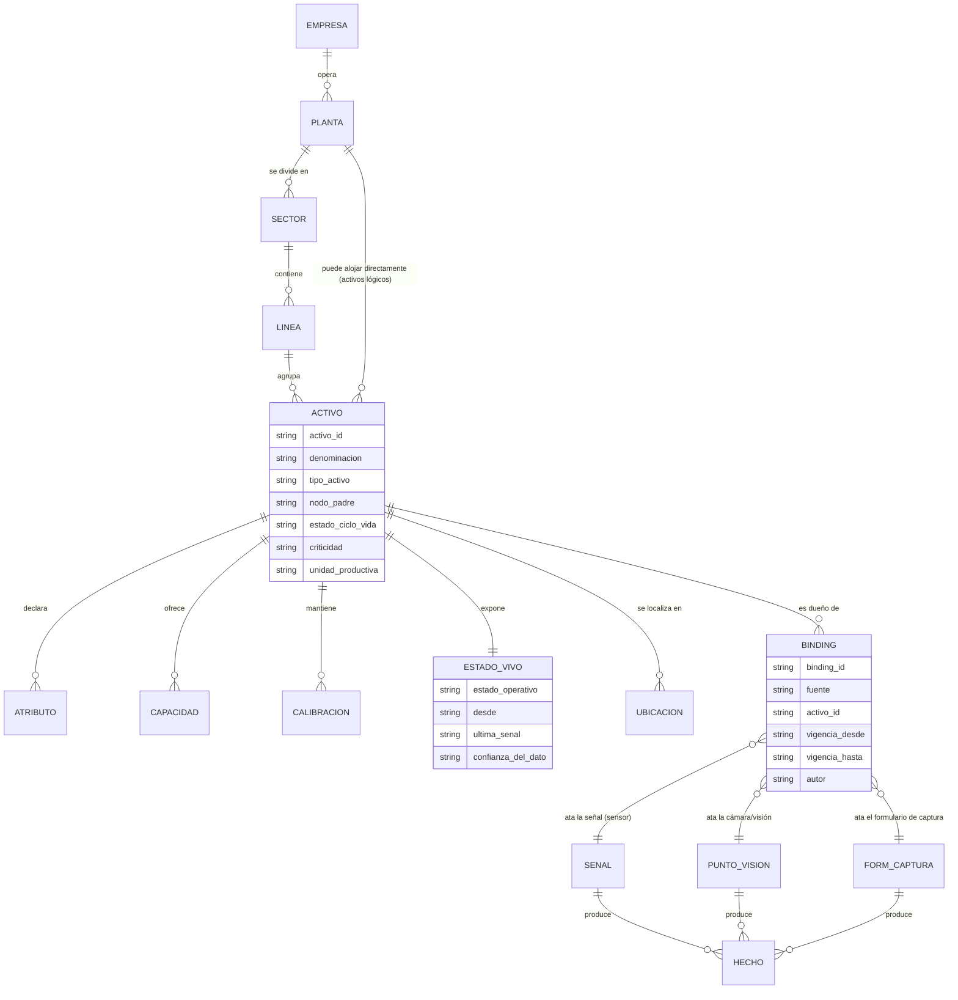
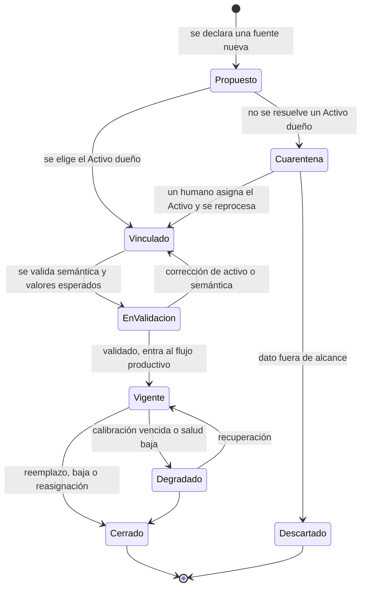
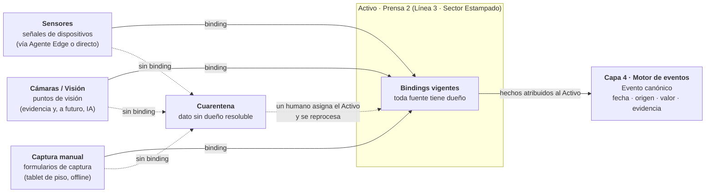
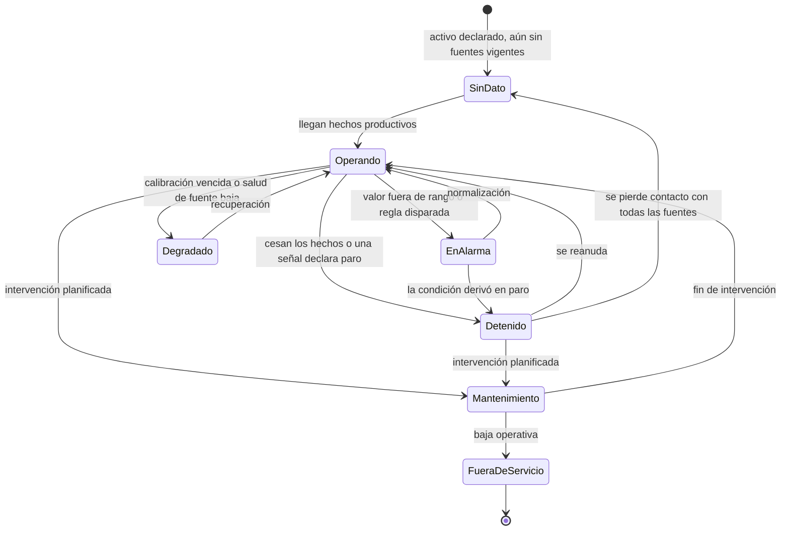
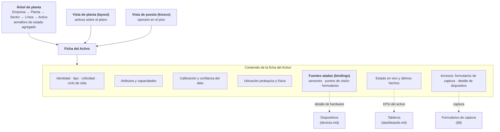

# Capa 1 — Gemelo Digital de la Planta

> **Documento:** `specs/specs/digital-twin.md` · **Estado:** Borrador v0.1 · **Actualizado:** 2026-07-13
> **Roles:** Product Manager · Software Architect · UX Designer
> **Relacionados:** [layered-architecture.md](./layered-architecture.md) · [devices.md](./devices.md) · [master-data.md](./master-data.md) · [work-model.md](./work-model.md) · [execution.md](./execution.md) · [event-engine.md](./event-engine.md) · [data-ingestion.md](./data-ingestion.md) · [data-model.md](./data-model.md) · [dashboards.md](./dashboards.md) · [ui-ux.md](./ui-ux.md) · [users-permissions.md](./users-permissions.md) · [downtime.md](./downtime.md) · [glossary.md](./glossary.md)

## Resumen ejecutivo

El **gemelo digital de la planta** es la **Capa 1** del modelo por capas de Nexo (ver [layered-architecture.md](./layered-architecture.md)) y responde a una única pregunta: **¿qué existe físicamente y qué está midiendo?** Es la representación **viva y consultable** de la instalación del cliente: una jerarquía **Empresa → Planta → Sector → Línea → Centro de trabajo / Activo** sobre la que cuelgan todas las fuentes de dato de la planta y en la que cada activo tiene un **estado en vivo**, un conjunto de **atributos y capacidades**, un **régimen de calibración** y una **ubicación**.

El gemelo introduce la regla que sostiene todo el valor analítico de la plataforma: **cada sensor, cada señal y cada dato capturado está ligado a un Activo. Un dato nunca "flota".** Sin dueño físico no hay atribución; sin atribución no se puede calcular productividad por recurso, cuello de botella ni tiempo muerto de forma confiable. Esta regla es **no negociable** y se expresa como invariante del modelo, no como buena práctica: un dato que llega sin poder resolverse a un Activo entra en **cuarentena**, no al flujo productivo.

La Capa 1 reconoce **tres fuentes de dato**, con igual jerarquía conceptual: **sensores** (captura automática vía dispositivos y agente edge), **cámaras / visión** (evidencia visual y, a futuro, inspección automática) y **captura manual del operario** (lo que la máquina no puede medir: motivos, observaciones, conteos, confirmaciones). Las tres producen hechos que la Capa 4 normaliza como Eventos, y las tres se atan al mismo Activo.

Este documento define **el modelo del gemelo**: la jerarquía, el Activo como unidad central, el **binding** señal ↔ activo, las tres fuentes, el estado en vivo, la calibración, la ubicación y la **navegación del gemelo en la UI**. Deliberadamente **no duplica** el modelado de hardware —tipos de dispositivo, protocolos, salud, firmware/OTA y mapeo tag→señal viven en [devices.md](./devices.md)— ni el pipeline de ingesta ([data-ingestion.md](./data-ingestion.md)). Además fija una **corrección terminológica canónica** que atraviesa todo el producto: **"Formulario de captura" ≠ "Tablero / Dashboard"** (§2).

---

## 1. Alcance y frontera

### 1.1 Qué es y qué no es la Capa 1

| Sí es alcance del gemelo digital | NO es alcance (vive en otro documento) |
|---|---|
| Jerarquía **Empresa → Planta → Sector → Línea → Activo** y su navegación | Catálogos de negocio (productos, insumos, unidades, personas) → [master-data.md](./master-data.md) |
| El **Activo** como unidad central: atributos, capacidades, calibración, ubicación | Taxonomía de hardware, protocolos (S7/OPC UA/Modbus/MQTT/HTTP), firmware y OTA → [devices.md](./devices.md) |
| **Binding** obligatorio de sensor/señal a un Activo | Mapeo técnico tag → señal de negocio (direccionamiento por protocolo) → [devices.md](./devices.md) §8 |
| Las **tres fuentes** de la capa: sensores, cámaras/visión, captura manual | Normalización, deduplicación, backpressure y garantías de entrega → [data-ingestion.md](./data-ingestion.md) |
| **Estado en vivo** del activo y su semántica | Cálculo de KPIs y métricas derivadas → [event-engine.md](./event-engine.md) y [dashboards.md](./dashboards.md) |
| **Formularios de captura** del operario (qué son y cómo se atan al activo) | **Tableros de KPI** → [dashboards.md](./dashboards.md) · Design system y wireframes → [ui-ux.md](./ui-ux.md) / [mockups.md](./mockups.md) |
| Navegación del gemelo en la UI (árbol, ficha de activo, vista de planta) | Clasificación de motivos de parada y su análisis → [downtime.md](./downtime.md) |
| Ciclo de vida del binding y su auditoría | Persistencia inmutable y genealogía de lotes/series → [traceability.md](./traceability.md) |

### 1.2 Regla de no duplicación con `devices.md`

La distinción es simple y hay que sostenerla en toda la documentación:

| Pregunta | Documento que responde | Ejemplo |
|---|---|---|
| *¿Con qué hardware capturo y cómo hablo con él?* | [devices.md](./devices.md) | "Un PLC S7-1500 leído por el Agente Edge, tag `DB10.DBW4`, salud OK, firmware 2.3" |
| *¿A qué parte de la planta pertenece ese dato y qué significa ahí?* | **Este documento** | "Esa señal es el contador de piezas OK de la **Prensa 2**, activo de la **Línea 3** del sector **Estampado**" |

> **En una frase:** `devices.md` modela **el instrumento**; `digital-twin.md` modela **la planta y el dueño del dato**.

---

## 2. Terminología canónica: Formulario de captura vs. Tablero / Dashboard

> **Esta sección es normativa.** Corrige una ambigüedad detectada en la conversación de producto ("dashboards para que los operarios ingresen datos") que colisiona con el significado que `dashboards.md` ya le da al término. **A partir de acá, los dos conceptos no se mezclan nunca.**

### 2.1 Las dos definiciones

| | **Formulario de captura** | **Tablero / Dashboard** |
|---|---|---|
| **Qué es** | Pantalla donde una persona **ingresa** datos al sistema | Visualización de **KPIs** y métricas |
| **Dirección del dato** | **Entrada** (escritura) | **Salida** (solo lectura) |
| **Capa del modelo** | **Capa 1 — Física** (es una de las tres fuentes de dato) | Resultado de la **Capa 4 — Motor de eventos** |
| **Qué produce** | Eventos con `origen = manual`, con evidencia opcional/obligatoria | Nada: **no es fuente de verdad**, presenta lo ya calculado |
| **Usuario típico** | Operario, inspector de calidad, mantenimiento | Supervisor, jefe de planta, gerencia (y operario, en modo *andon*) |
| **Superficie típica** | Tablet industrial en el piso, terminal de puesto | Pantalla grande (andon), desktop, mobile |
| **Criterio de diseño** | Mínima fricción: pocos toques, targets grandes, offline de primera clase | Máxima legibilidad del número y su contexto (meta, tendencia, umbral) |
| **Documento** | **Este documento** (§8) | [dashboards.md](./dashboards.md) |
| **Cómo NO llamarlo** | ❌ "dashboard de carga", ❌ "dashboard del operario" | ❌ "formulario de KPIs" |

### 2.2 Por qué la distinción importa

- **Son dos productos de UX distintos.** Un formulario de captura se juzga por *cuánto tiempo y cuántos errores ahorra al operario*; un tablero se juzga por *cuán rápido permite decidir*. Optimizar uno con los criterios del otro degrada ambos (ver principios D2 y D8 de [ui-ux.md](./ui-ux.md)).
- **Son dos direcciones del dato.** El formulario **escribe** en el sistema y genera eventos; el tablero **lee** read models y no es fuente de verdad de nada ([dashboards.md](./dashboards.md) §1). Confundirlos invita a que alguien intente "editar el KPI".
- **Son dos capas distintas.** El formulario es una fuente de la Capa 1; el tablero es la presentación de la Capa 4. Mezclarlos rompe el principio de dependencia del modelo por capas.
- **Son dos regímenes de permisos distintos.** Capturar requiere permiso de escritura con alcance sobre un activo; visualizar requiere permiso de lectura sobre un ámbito (ver [users-permissions.md](./users-permissions.md)).

### 2.3 Regla de escritura para toda la documentación y la UI

> Cuando el operario **ingresa** un dato, es un **Formulario de captura**. Cuando alguien **mira** un número calculado, es un **Tablero**. Ningún documento, etiqueta de menú, mockup ni ticket debe usar "dashboard" para una pantalla de ingreso de datos.

Ambos términos se incorporan al [glossary.md](./glossary.md) con estas definiciones.

### 2.4 Un caso legítimo de convivencia (y cómo se resuelve)

En la práctica, una tablet de piso muestra las dos cosas: el operario ve su meta de turno *y* carga producción. Eso **no** las convierte en lo mismo. La resolución canónica es:

- La pantalla se compone de **un bloque de tablero** (widgets de solo lectura, provistos por [dashboards.md](./dashboards.md)) y **uno o más accesos a formularios de captura** (acciones de escritura, definidas acá).
- Cada bloque conserva su naturaleza, su origen de datos y su permiso. La **composición** de ambos en una misma pantalla es una decisión de UX que se documenta en [ui-ux.md](./ui-ux.md) y [mockups.md](./mockups.md), no una fusión de conceptos.

---

## 3. La jerarquía del gemelo

### 3.1 Los cinco niveles

| Nivel | Entidad canónica | Significado | Cardinalidad | Es unidad de… |
|---|---|---|---|---|
| **0** | **Empresa (Tenant)** | El cliente de la plataforma; raíz del gemelo | 1 por tenant | Aislamiento total (DB por tenant) |
| **1** | **Planta (Site)** | Instalación física donde ocurre el trabajo | 1..N por Empresa | *Scoping* de acceso · zona horaria · calendario |
| **2** | **Sector / Área** | Subdivisión funcional (estampado, envasado, pintura, obra) | 0..N por Planta | Agrupación operativa y de responsabilidad |
| **3** | **Línea (Line)** | Conjunto de recursos que trabajan coordinadamente | 0..N por Sector | *Scoping* de acceso · KPIs de línea · takt |
| **4** | **Centro de trabajo / Activo (Asset)** | **Recurso productivo concreto**: máquina, estación, puesto, herramienta mayor | 1..N por Línea | **Atribución del dato** · estado en vivo · calibración · OEE |

> **Nota de vocabulario:** "Centro de trabajo", "Máquina" y "Activo" refieren a la **misma entidad canónica** que [data-model.md](./data-model.md) nomina *Máquina / Centro de trabajo (Work Center / Asset)*. En este documento se usa **Activo** por ser el término más neutral: cubre tanto una prensa de una línea repetitiva como un puesto de armado de un proyecto único.

### 3.2 Flexibilidad de la jerarquía

No todas las plantas tienen los cinco niveles poblados. El modelo lo contempla sin romper el binding:

| Situación real | Cómo se modela | Regla |
|---|---|---|
| Taller chico sin sectores ni líneas | Planta → Activo (niveles 2 y 3 vacíos o con un nodo "General") | El Activo **siempre** existe |
| Obra o proyecto sin línea de producción | Planta "Obra Norte" → Sector "Etapa de estructura" → Activo "Puesto de soldadura 1" | Se usa la misma jerarquía; cambia la semántica, no el modelo |
| Servicio o herramienta compartida entre líneas | Activo asignado a la Línea/Sector principal, con **capacidad compartida** declarada (§4.3) | Un Activo pertenece a **un solo** nodo padre |
| Dispositivo de planta que no mide una máquina (p. ej. medidor general de energía) | Se crea un **Activo lógico** de nivel planta o sector (p. ej. "Acometida eléctrica") al que se ata la señal | **Nunca** se deja la señal sin activo |

> El último caso es el más importante: la respuesta a "este sensor no es de ninguna máquina" **nunca** es "dejarlo suelto", sino **crear el Activo que lo representa**. Esto convierte una excepción en una entidad de primera clase y preserva el invariante.

### 3.3 Diagrama del modelo del gemelo

> El diagrama es **conceptual**. `SENAL` corresponde a la entidad *Señal / Tag* gobernada por [devices.md](./devices.md); acá aparece solo como **extremo del binding**. `HECHO` es lo que la Capa 4 normaliza como **Evento canónico** ([event-engine.md](./event-engine.md)).

---

## 4. El Activo como unidad central

El Activo es **el sujeto del gemelo digital**. Todo lo demás de la Capa 1 existe para describirlo, medirlo o atribuirle datos.

### 4.1 Identidad y clasificación

| Atributo | Descripción | Uso |
|---|---|---|
| **Identidad** | Identificador estable dentro del tenant | Clave de atribución de todo evento |
| **Denominación** | Nombre legible en planta ("Prensa 2", "Puesto de armado A") | UI, formularios, tableros |
| **Tipo de activo** | Máquina · Estación de trabajo · Puesto manual · Herramienta mayor · Activo lógico · Infraestructura | Determina qué capacidades y qué estados aplican |
| **Nodo padre** | Referencia a la Línea (o Sector/Planta para activos lógicos) | Posición en la jerarquía |
| **Criticidad** | Baja · Media · Alta | Umbrales de alerta, prioridad de mantenimiento y de soporte |
| **Estado de ciclo de vida** | En alta · Activo · En mantenimiento · Fuera de servicio · Dado de baja | Distinto del **estado en vivo** (§6): esto es administrativo, aquello es operativo |
| **Identificación física** | Número de activo, patrimonio, fabricante, modelo, año | Trazabilidad, MTBF/MTTR, inventario |

### 4.2 Atributos declarados

Son las **características estables** del activo, cargadas como master data y consumidas por las capas superiores:

| Atributo | Ejemplo | Quién lo consume |
|---|---|---|
| **Unidad de medida productiva** | piezas · kg · metros · horas | Capa 2 (tiempos estándar), Capa 4 (KPIs) |
| **Tiempo de ciclo ideal** | 12 s/pieza | OEE (componente Rendimiento) — perfil repetitivo |
| **Capacidad nominal** | 300 piezas/hora | Planificación y detección de cuello de botella |
| **Rangos operativos** | Temperatura 60–95 °C, presión máx. 8 bar | Validación de lecturas y reglas de alerta |
| **Consumos de referencia** | kWh/hora, aire comprimido | Costo real (Capa 4) |
| **Calendario / turnos aplicables** | Turnos A/B/C, paradas planificadas | Cálculo de **tiempo muerto** dentro de ventana planificada |
| **Atributos personalizados del tenant** | Lo que cada cliente necesite declarar | Extensibilidad (ver Preguntas abiertas) |

### 4.3 Capacidades

Las **capacidades** describen **qué sabe hacer** un activo. Son el punto de contacto entre la Capa 1 y la Capa 2: una **Tarea** de un Proceso declara qué capacidad requiere, y la Capa 3 resuelve **qué activo concreto** puede ejecutarla.

| Elemento de la capacidad | Descripción | Ejemplo |
|---|---|---|
| **Capacidad** | Operación que el activo puede realizar | "Estampar", "Soldar MIG", "Pintar", "Inspección dimensional" |
| **Restricciones** | Límites de la capacidad | Espesor máx. 6 mm; largo máx. 3 m |
| **Rendimiento asociado** | Velocidad o tiempo estándar para esa capacidad | 8 s/pieza en estampado tipo A |
| **Exclusividad / compartición** | Si el activo puede atender más de una tarea a la vez | Excluyente (una tarea por vez) o compartido |
| **Habilitaciones requeridas** | Competencia del operario para operarlo | Certificación de soldadura |

> **Dependencia correcta:** la Capa 2 referencia **capacidades** (concepto de la Capa 1), no activos concretos. Eso permite que un mismo Proceso se ejecute en distintas plantas. La resolución capacidad → activo concreto ocurre en la Capa 3 ([execution.md](./execution.md)).

### 4.4 Calibración

La calibración es lo que determina si **se puede confiar** en lo que un activo (o su instrumentación) reporta. Se modela en la Capa 1 porque afecta la **calidad del dato**, no la ejecución del trabajo.

| Elemento | Descripción |
|---|---|
| **Alcance** | Qué se calibra: el instrumento de un sensor, un patrón de medición del puesto, o el propio activo (p. ej. una balanza) |
| **Método y patrón** | Procedimiento de calibración y referencia usada |
| **Periodicidad** | Intervalo requerido (por tiempo, por uso o por eventos) |
| **Última calibración / próxima** | Fechas, resultado y responsable |
| **Certificado** | Evidencia adjunta (archivo en Files/Media) |
| **Estado de calibración** | Vigente · Por vencer · Vencida · No aplica |
| **Efecto sobre el dato** | Si está **vencida**, las lecturas asociadas se marcan con **confianza degradada** y se propagan como tal al Evento canónico |

- **Consecuencia de negocio:** una calibración vencida **no bloquea** la captura por defecto (la planta no se detiene por un certificado), pero **sí marca el dato** y **sí dispara alerta** vía [rules-engine.md](./rules-engine.md). Si un tenant necesita bloqueo duro (industria regulada), se configura por activo.
- **Frontera:** la ejecución del *trabajo* de calibrar es una tarea de mantenimiento y se modela como Proceso/Ejecución en las capas 2 y 3. Acá vive solo **el estado y su efecto sobre la confianza del dato**.

### 4.5 Ubicación

| Tipo de ubicación | Qué expresa | Uso |
|---|---|---|
| **Ubicación jerárquica** | Posición en Empresa → Planta → Sector → Línea | Navegación, scoping de permisos, agregación de KPIs |
| **Ubicación física** | Nave, coordenada de layout, referencia de plano, geolocalización de la planta | Vista de planta, mapa, despacho de mantenimiento |
| **Ubicación móvil** *(opcional)* | Para activos que se desplazan (herramienta, equipo de obra, carro) | Trazabilidad de recursos en proyectos y obras |
| **Zona horaria efectiva** | Heredada de la Planta | Interpretación correcta de `fecha` en los eventos |

> Para plantas con layout cargado, la ubicación física habilita la **vista de planta** de la UI (§7.3). Es opcional: el gemelo funciona con la ubicación jerárquica sola.

---

## 5. El binding señal ↔ Activo (regla no negociable)

### 5.1 El enunciado

> **Todo dato capturado en la planta pertenece a un Activo. No existe el dato huérfano.**
> El **binding** es el vínculo explícito, versionado y auditado entre una **fuente de dato** (señal de sensor, punto de visión o formulario de captura) y **un Activo** del gemelo.

Esta es la regla nueva del modelo y la que justifica que la Capa 1 sea la base del stack.

### 5.2 Por qué es no negociable

| Sin binding | Con binding |
|---|---|
| Un valor con timestamp y poco más | Un valor **atribuible** a un recurso físico y, a través de la Ejecución, a una **Tarea** |
| "Productividad por recurso" es una estimación por convención de nombres | Es una **derivación** exacta sobre eventos atribuidos |
| "Cuello de botella" requiere que un humano sepa qué señal es de qué máquina | Se calcula: cola y espera acumulada **por Activo** |
| "Tiempo muerto" no se puede acotar a una ventana planificada de un recurso | Se cruza el calendario del Activo con sus eventos productivos |
| Cambiar un sensor de máquina reinterpreta el histórico en silencio | El binding tiene **vigencia**: el histórico conserva su atribución original |
| La trazabilidad tiene agujeros | La genealogía cierra: dato → activo → tarea → ejecución → lote/serie |

### 5.3 Anatomía del binding

| Elemento | Descripción | Ejemplo |
|---|---|---|
| **Fuente** | Qué se ata: `señal` (sensor), `punto de visión` (cámara), `formulario de captura` (manual) | Señal "contador de piezas OK" |
| **Activo destino** | El dueño físico del dato | Prensa 2 (Línea 3, Sector Estampado) |
| **Semántica en el activo** | Qué significa esa fuente **para ese activo** | "Conteo de producción buena" |
| **Rol en el KPI** | Qué métrica alimenta | Rendimiento y Calidad del OEE |
| **Vigencia** | Desde / hasta. Un binding **no se edita en el pasado**: se cierra y se abre uno nuevo | Vigente desde 2026-03-01 |
| **Autor y motivo** | Quién lo creó/cerró y por qué | Integraciones · "reemplazo de sensor" |
| **Confianza** | Estado de calibración y salud heredados que afectan al dato | Vigente / degradada |

### 5.4 Ciclo de vida del binding

### 5.5 Qué pasa con un dato sin dueño: cuarentena

El invariante no se cumple con un mensaje de error: se cumple con un **circuito operativo**.

| Paso | Qué ocurre |
|---|---|
| **1. Detección** | Llega un dato cuya fuente no tiene binding vigente a ningún Activo |
| **2. Cuarentena** | El dato **no se descarta y no entra al flujo productivo**: queda retenido, visible y contabilizado |
| **3. Aviso** | Se notifica al rol responsable (Integraciones / Implementador) con el contexto disponible (dispositivo, tag, planta) |
| **4. Resolución humana** | Se crea el binding faltante —eligiendo un Activo existente o **creando el Activo lógico** que corresponda (§3.2)— |
| **5. Reproceso** | Los datos en cuarentena se **reprocesan** con el binding ya creado y entran al flujo con su timestamp original |
| **6. Auditoría** | Queda registrado quién resolvió la cuarentena, cuándo y con qué criterio |

> **Por qué cuarentena y no descarte:** descartar rompería la promesa de trazabilidad y perdería dato real de planta. Aceptarlo sin dueño rompería el invariante. La cuarentena es la única salida que preserva ambas cosas. La mecánica técnica de retención y reproceso se coordina con [data-ingestion.md](./data-ingestion.md) (cola de descarte / *dead letter* y reprocesamiento).

### 5.6 Reglas de integridad del binding

| # | Regla | Motivo |
|---|---|---|
| **B1** | Una fuente de dato tiene **exactamente un** Activo dueño en un momento dado | Elimina la ambigüedad de atribución y el doble conteo |
| **B2** | Un Activo puede tener **muchas** fuentes atadas | Una máquina tiene varios sensores, una cámara y formularios |
| **B3** | El binding es **versionado con vigencia**; nunca se reescribe el pasado | El histórico conserva la interpretación vigente al momento de la captura |
| **B4** | Dar de baja un Activo **cierra** sus bindings; no los borra | Preserva la trazabilidad histórica |
| **B5** | Toda alta, cambio y cierre de binding se **audita** | Cambiar un binding cambia la lectura del negocio; es una acción sensible |
| **B6** | El binding **no puede cruzar tenants** | Aislamiento multi-tenant (requisito no negociable) |
| **B7** | Mover un Activo de línea/sector **no** cierra sus bindings | El dueño físico no cambió; cambió su ubicación jerárquica |

---

## 6. Las tres fuentes de dato de la Capa 1

Las tres tienen **la misma jerarquía conceptual**: producen hechos atribuidos a un Activo que la Capa 4 normaliza como Eventos. Cambia el mecanismo, no el estatus.

| | **Sensores** | **Cámaras / Visión** | **Captura manual del operario** |
|---|---|---|---|
| **Qué aporta** | Medición continua o por evento de una variable física | Evidencia visual y, a futuro, lectura automática (conteo, OCR, detección de defecto) | Lo que ninguna máquina sabe: motivo, contexto, criterio, confirmación |
| **Origen del evento** | `sensor` (device) | `vision` (device/cámara) | `manual` |
| **Naturaleza del dato** | Valor + unidad + calidad + timestamp | Imagen / frame / stream + metadatos | Valor declarado + selección de catálogo + texto |
| **Frecuencia típica** | Alta (segundos a milisegundos) | Baja/media (por disparo o por evento) | Baja (por acción del operario) |
| **Vía de llegada** | Agente Edge → Ingestion, o directo a la nube (MQTT/HTTP) | Snapshot/stream referenciado; media a **Files / Media** | App de piso (tablet/terminal), con **offline y store-and-forward** |
| **Destino del binario** | — | Object storage aislado por tenant | Adjuntos opcionales/obligatorios en object storage |
| **Confianza** | Depende de salud del dispositivo y calibración (§4.4) | Depende de calibración óptica/encuadre y, a futuro, del modelo | Depende de la identificación del operario y de la evidencia requerida |
| **Modelado del hardware** | [devices.md](./devices.md) | [devices.md](./devices.md) | — (no hay hardware que modelar) |
| **Detalle en este documento** | §6.1 | §6.2 | §6.3 y §8 |

### 6.1 Sensores

- Un sensor es un **punto de medición** expuesto por un Dispositivo y expresado como una o más **Señales**. El modelo de Dispositivo ↔ Sensor ↔ Señal/Tag, sus protocolos, su salud y su mapeo técnico viven íntegramente en [devices.md](./devices.md).
- Lo que aporta la Capa 1 es **el binding de esa señal a un Activo** (§5) y su **semántica en el contexto del activo**: la misma señal técnica "contador" significa cosas distintas según el activo al que pertenece.
- **Regla práctica:** un dispositivo puede estar *ubicado* en una línea, pero cada una de sus señales debe estar *atada* a un activo. Un datalogger de 8 canales instalado en la Línea 3 puede tener 8 señales atadas a 4 activos distintos.

### 6.2 Cámaras y visión

- Una cámara se registra como **Dispositivo** ([devices.md](./devices.md) §2), pero en el gemelo se modela como **Punto de visión**: el par *cámara + encuadre/zona de interés* atado a un Activo.
- **Dos usos, un mismo modelo:**
  1. **Evidencia visual** (disponible desde el MVP en su forma simple): un frame o snapshot que respalda un hecho —un defecto, una terminación de tarea, un estado de máquina—. El binario vive en **Files / Media**; el hecho lo referencia.
  2. **Visión artificial** (fase futura, servicio **AI / Computer Vision**): conteo automático, OCR de etiquetas, detección de no conformidad. Produce hechos con la misma estructura, con metadatos de modelo y confianza.
- **El binding también aplica:** una cámara que mira dos puestos requiere **dos puntos de visión**, uno por Activo, no un vínculo difuso a "la línea".
- **Privacidad:** cuando el encuadre puede capturar personas, el punto de visión declara su finalidad y su régimen de retención; se coordina con [security.md](./security.md).

### 6.3 Captura manual del operario

- Es una **fuente de primera clase**, no un plan B. Hay información que ningún sensor puede dar: **por qué** se detuvo la máquina, **qué** se observó, **qué criterio** se aplicó, **qué** se consumió realmente.
- Se materializa en **Formularios de captura** (§8), que **siempre** se ejecutan en el contexto de un Activo (y, cuando corresponde, de una Tarea de una Ejecución).
- Aporta al evento el `operario` y, cuando el proceso lo exige, la **evidencia** (foto, firma, archivo).
- **Offline es un estado de primera clase:** el formulario funciona sin red, encola y reconcilia (principio D4 de [ui-ux.md](./ui-ux.md)); es la contraparte en la UI del *store-and-forward* del edge.

### 6.4 Diagrama de las tres fuentes

---

## 7. Estado en vivo del Activo

### 7.1 Qué es

El **estado en vivo** es la respuesta inmediata a *"¿qué está haciendo ahora este activo y puedo confiar en lo que me dice?"*. Es una propiedad de la Capa 1: se deriva de las fuentes atadas al Activo **sin necesidad de conocer qué Proceso o qué Ejecución está corriendo**.

> **Frontera importante:** el estado en vivo dice *"la Prensa 2 está detenida desde hace 14 minutos"*. **No** dice *"el Lote 4471 lleva 62 % de avance"* — eso es Capa 3 y Capa 4. El estado en vivo es **físico**, no productivo.

### 7.2 Modelo de estados

### 7.3 Semántica de cada estado

| Estado en vivo | Significado | Cómo se determina | Efecto |
|---|---|---|---|
| **Operando** | El activo está produciendo o trabajando | Hechos productivos dentro de la ventana esperada | Cuenta como tiempo productivo |
| **Detenido** | Sin actividad productiva | Ausencia de hechos productivos o señal explícita de paro | Insumo de **Parada** ([downtime.md](./downtime.md)) y de **tiempo muerto** (Capa 4) |
| **En alarma** | Condición anómala activa | Valor fuera de rango o regla del [rules-engine.md](./rules-engine.md) | Notificación; puede derivar en paro |
| **Mantenimiento** | Intervención planificada en curso | Declaración manual o ventana planificada | Se excluye del cálculo de disponibilidad según política del tenant |
| **Degradado** | Opera, pero con **dato poco confiable** | Calibración vencida (§4.4) o salud baja de sus dispositivos ([devices.md](./devices.md) §7) | Los eventos se marcan con confianza reducida |
| **Sin dato** | No hay fuentes reportando | Ninguna fuente vigente comunicó dentro de la ventana | Se distingue explícitamente de "Detenido" |
| **Fuera de servicio** | Baja operativa del activo | Estado de ciclo de vida administrativo (§4.1) | No se espera dato; no genera falsas alarmas |

> **Distinción crítica — "Detenido" ≠ "Sin dato":** una máquina parada es un hecho de negocio (se investiga, se le asigna motivo, cuenta para OEE). Una máquina de la que no llegan datos puede ser un problema de conectividad, no de producción. Confundirlas produce KPIs falsos y alertas que el cliente deja de mirar. La distinción entre *dispositivo caído* y *enlace caído* se resuelve con la información de [devices.md](./devices.md) §6.

### 7.4 Atributos del estado en vivo

| Atributo | Descripción |
|---|---|
| **Estado actual** | Uno de los siete anteriores |
| **Desde** | Momento en que entró en ese estado (habilita "detenida hace 14 min") |
| **Última señal** | Timestamp del último hecho recibido, por fuente |
| **Confianza del dato** | Alta · Media · Degradada — derivada de calibración y salud |
| **Fuentes activas / esperadas** | Cuántas fuentes atadas están reportando |
| **Contexto operativo** *(referencia, no propiedad)* | Ejecución y Tarea que la Capa 3 tiene asignadas a este activo, mostradas como enlace |

> El último atributo se **muestra** en la ficha del activo por utilidad de la UI, pero **es propiedad de la Capa 3**. La Capa 1 lo referencia; no lo gobierna. Así se respeta el principio de dependencia.

---

## 8. Formularios de captura (la fuente manual, en detalle)

### 8.1 Definición

Un **Formulario de captura** es la pantalla mediante la cual una persona **ingresa** un hecho al sistema. Es la materialización en la UI de la tercera fuente de la Capa 1 (§6.3) y **nunca** debe llamarse "dashboard" (§2).

### 8.2 Anatomía

| Elemento | Descripción | Obligatorio |
|---|---|---|
| **Activo de contexto** | Sobre qué activo se está capturando | **Sí** (invariante de binding) |
| **Tarea / Ejecución de contexto** | A qué trabajo pertenece el hecho, si aplica | No (depende del flujo) |
| **Tipo de hecho** | Qué se declara: producción, scrap, parada, inspección, consumo, observación, avance de tarea | **Sí** |
| **Valor** | Cantidad, medición, selección o confirmación | **Sí** |
| **Unidad** | Heredada del activo o del insumo | Sí, cuando hay cantidad |
| **Motivo** | Selección de catálogo cuando el hecho lo requiere (scrap, parada, defecto) | Según tipo |
| **Evidencia** | Foto, archivo, firma, frame de cámara, lectura de sensor asociada | **Configurable** (ver Preguntas abiertas) |
| **Operario** | Identificado por sesión o identificación rápida en terminal | **Sí** |
| **Momento** | Instante del hecho (puede diferir del de carga si es offline o retroactivo) | **Sí** |
| **Observaciones** | Texto libre acotado | No |

### 8.3 Tipos de formulario

| Formulario | Qué captura | Fuente complementaria típica |
|---|---|---|
| **Declaración de producción** | Cantidad producida buena | Contador de sensor (uno valida al otro) |
| **Registro de scrap** | Cantidad descartada + motivo + evidencia | Balanza, foto |
| **Declaración de parada** | Inicio/fin + motivo + comentario | Señal de estado de máquina |
| **Inspección de calidad** | Mediciones o checklist + resultado + disposición | Instrumento, cámara |
| **Consumo de insumo** | Qué y cuánto se consumió realmente | Balanza, lectura de código |
| **Avance de tarea** | Marcar tarea iniciada / terminada / bloqueada | — |
| **Observación / hallazgo** | Nota con evidencia, sin cantidad | Foto |

> El **contenido concreto** de cada formulario (campos, validaciones, disposiciones) lo definen los dominios correspondientes: [production.md](./production.md), [scrap.md](./scrap.md), [downtime.md](./downtime.md), [quality.md](./quality.md). Este documento define **su naturaleza, su contexto obligatorio y su lugar en el modelo**.

### 8.4 Principios de diseño (heredados de `ui-ux.md`)

- **Contexto preseleccionado:** el activo llega resuelto por el kiosco/terminal o por escaneo, no se elige de una lista larga.
- **Mínimo de toques:** los flujos frecuentes se resuelven en ≤ 3 interacciones (principio D2).
- **Offline de primera clase:** encola, muestra "pendiente de envío" y reconcilia (principio D4).
- **Feedback inmediato e inequívoco:** el operario nunca debe dudar si se guardó (principio D3), porque la duda produce doble carga.
- **Evidencia sin fricción:** sacar la foto es un paso del flujo, no una pantalla aparte.
- **Trazabilidad visible:** el operario ve el estado del dato —borrador, confirmado, sincronizado— (principio D10).

---

## 9. Navegación del gemelo en la UI

El gemelo no es solo un modelo de datos: es **una forma de recorrer la planta** dentro del producto. La navegación es la que hace tangible el valor de la Capa 1.

### 9.1 Las cuatro vistas del gemelo

| Vista | Qué muestra | Usuario típico | Superficie |
|---|---|---|---|
| **Árbol de planta** | La jerarquía completa Empresa → Planta → Sector → Línea → Activo, con **semáforo de estado en vivo** por nodo (agregado hacia arriba) | Supervisor, implementador | Desktop, tablet |
| **Ficha del Activo** | Todo sobre un activo: identidad, atributos, capacidades, calibración, ubicación, **fuentes atadas (bindings)**, estado en vivo, últimos hechos, acceso a formularios de captura | Todos los roles | Desktop, tablet |
| **Vista de planta (layout)** | Los activos posicionados sobre el plano, coloreados por estado en vivo | Supervisor, jefe de planta | Desktop, pantalla grande |
| **Vista de puesto (kiosco)** | El activo del puesto, su estado y sus **formularios de captura** disponibles | Operario | Tablet industrial |

### 9.2 Recorrido de navegación

### 9.3 Reglas de navegación

| # | Regla | Motivo |
|---|---|---|
| **N1** | **El Activo es siempre el destino final** de la navegación del gemelo | Es la unidad de atribución; todo converge ahí |
| **N2** | El estado en vivo **se agrega hacia arriba** (línea, sector, planta) con la peor condición de sus hijos | Un supervisor detecta el problema sin abrir cada activo |
| **N3** | La navegación respeta el **scoping** de rol y alcance | Un usuario solo ve las plantas/líneas de su alcance ([users-permissions.md](./users-permissions.md)) |
| **N4** | Desde la ficha del Activo se llega en **un salto** a sus fuentes, a sus formularios y a sus tableros | El gemelo es el punto de partida operativo del producto |
| **N5** | Un Activo **sin ninguna fuente atada** se muestra explícitamente como tal | Hace visible el trabajo de implementación pendiente y evita la falsa sensación de cobertura |
| **N6** | La **cuarentena** de datos sin dueño es una vista de primera clase, no un log escondido | Es una tarea operativa con responsable, no un error técnico |

> El diseño visual concreto, la densidad por superficie y los wireframes se definen en [ui-ux.md](./ui-ux.md) y [mockups.md](./mockups.md). Acá se fija **qué debe poder hacerse**, no cómo se ve.

---

## 10. Relación con las otras capas y dominios

| Con quién | Qué le aporta la Capa 1 | Qué NO le corresponde a la Capa 1 | Documento |
|---|---|---|---|
| **Capa 2 — Modelo de trabajo** | **Capacidades** y unidades de medida contra las que se definen las Tareas | Definir Procesos, Tareas o tiempos estándar | [work-model.md](./work-model.md) |
| **Capa 3 — Ejecución** | Activos concretos asignables, su disponibilidad y su estado en vivo | Instanciar, asignar, planificar ni cerrar ejecuciones | [execution.md](./execution.md) |
| **Capa 4 — Motor de eventos** | El **dueño físico** de cada hecho (`activo`) y la **confianza del dato** | Normalizar, deduplicar ni derivar métricas | [event-engine.md](./event-engine.md) |
| **Devices** | El Activo al que se ata cada señal; la semántica de negocio de la fuente | Protocolos, salud del hardware, firmware/OTA, mapeo tag→señal | [devices.md](./devices.md) |
| **Ingestion / Edge Gateway** | El contexto físico que enriquece cada evento | El pipeline, el backpressure y las garantías de entrega | [data-ingestion.md](./data-ingestion.md) |
| **Master Data** | Consume la jerarquía y los catálogos que Master Data gobierna | Ser el dueño de productos, insumos, unidades y personas | [master-data.md](./master-data.md) |
| **Downtime** | Estado "Detenido" y su instante de inicio, distinguido de "Sin dato" | Clasificar el motivo ni calcular MTBF/MTTR | [downtime.md](./downtime.md) |
| **Rules Engine** | Estados y umbrales del activo como disparadores | Definir ni ejecutar reglas | [rules-engine.md](./rules-engine.md) |
| **Dashboards** | La dimensión de agregación (planta/sector/línea/activo) | Calcular ni presentar KPIs | [dashboards.md](./dashboards.md) |
| **Files / Media** | Referencias a evidencia visual y adjuntos | Almacenar los binarios | [data-model.md](./data-model.md) |
| **Traceability** | La cadena dato → activo que cierra la genealogía | El event store inmutable ni la genealogía de lotes | [traceability.md](./traceability.md) |

---

## 11. Referencias cruzadas

- Modelo por capas y principio de dependencia: [layered-architecture.md](./layered-architecture.md)
- Hardware de captura, protocolos, salud y OTA: [devices.md](./devices.md)
- Catálogos propios y modos *standalone* / conectado: [master-data.md](./master-data.md)
- Procesos y tareas (Capa 2): [work-model.md](./work-model.md)
- Ejecución de lotes y proyectos (Capa 3): [execution.md](./execution.md)
- Evento canónico y métricas derivadas (Capa 4): [event-engine.md](./event-engine.md)
- Pipeline de ingesta y cuarentena técnica: [data-ingestion.md](./data-ingestion.md)
- Entidades canónicas y su ubicación: [data-model.md](./data-model.md)
- Tableros y KPIs (**no** formularios de captura): [dashboards.md](./dashboards.md)
- Principios de UX, superficies y offline: [ui-ux.md](./ui-ux.md) · [mockups.md](./mockups.md)
- Roles, alcance y permisos: [users-permissions.md](./users-permissions.md)
- Tablero de decisiones: [open-questions-board.md](../open-questions-board.md)

---

## Preguntas abiertas

1. **Dueño del gemelo.** ¿La jerarquía Empresa/Planta/Sector/Línea/Activo la gobierna un contexto canónico de **Master Data / Assets** del tenant, o se sigue repartiendo entre Production y Devices? La Capa 1 vuelve urgente esta decisión (ver [data-model.md](./data-model.md) pregunta 1 y [layered-architecture.md](./layered-architecture.md) §7.4).
2. **Profundidad obligatoria de la jerarquía.** ¿Los niveles Sector y Línea son opcionales en el MVP (permitiendo Planta → Activo) o se exige la jerarquía completa con nodos "General"? Impacta el alta de tenants chicos y la agregación de KPIs.
3. **Activos lógicos.** ¿Qué salvaguardas hay para que "crear un Activo lógico" no se convierta en un vertedero de señales sin analizar? ¿Se limita por rol, se audita, se revisa periódicamente?
4. **Política de cuarentena.** ¿Cuánto tiempo se retiene un dato sin dueño antes de descartarlo? ¿Quién es el responsable por defecto de resolverla y qué SLA se le pide? Coordinar con [data-ingestion.md](./data-ingestion.md).
5. **Obligatoriedad de la evidencia.** ¿Se configura por Proceso, por Tarea, por tipo de formulario o por activo? (Cruza con la pregunta equivalente de [work-model.md](./work-model.md)).
6. **Capacidades vs. tipos de activo.** ¿Las capacidades son un catálogo libre por tenant o un catálogo semilla curado por Nexo? Un catálogo libre da flexibilidad pero dificulta plantillas de Proceso reutilizables entre clientes.
7. **Reinterpretación histórica al recablear.** Si un binding se cierra y se abre otro por reemplazo de sensor, ¿los KPIs históricos del activo se recalculan o se congelan? (Cruza con [devices.md](./devices.md) pregunta 7 sobre versionado de mapeos).
8. **Bloqueo por calibración vencida.** ¿El bloqueo duro de captura ante calibración vencida es configurable por activo desde el MVP, o se difiere a V1 junto con los requisitos de industria regulada?
9. **Layout de planta.** ¿La vista de layout entra al MVP (requiere carga de plano y posicionamiento) o se difiere a V1, dejando el árbol como única navegación?
10. **Atributos personalizados del Activo.** ¿Se permiten campos definidos por el tenant sobre el Activo y cómo se concilian con el modelo canónico compartido? (Cruza con [data-model.md](./data-model.md) pregunta 8).
11. **Retención y privacidad de la evidencia visual.** ¿Qué política de retención aplica a frames y snapshots de cámaras, y cómo se maneja el caso en que el encuadre capta personas? Coordinar con [security.md](./security.md).
12. **Activos móviles.** ¿El MVP soporta activos que cambian de ubicación (herramientas, equipos de obra) o se difiere a V1 junto con el perfil proyecto?
