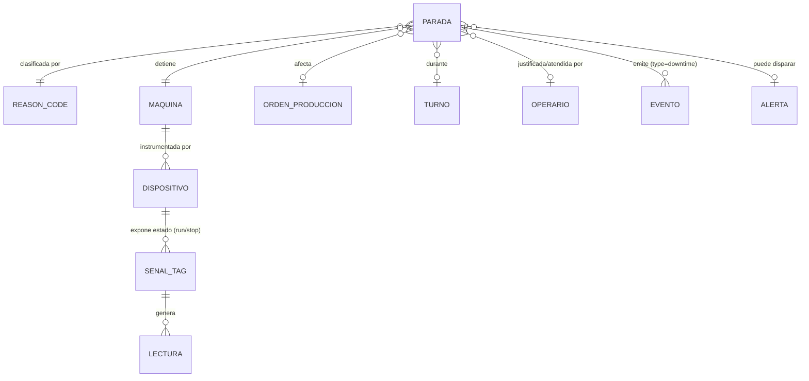
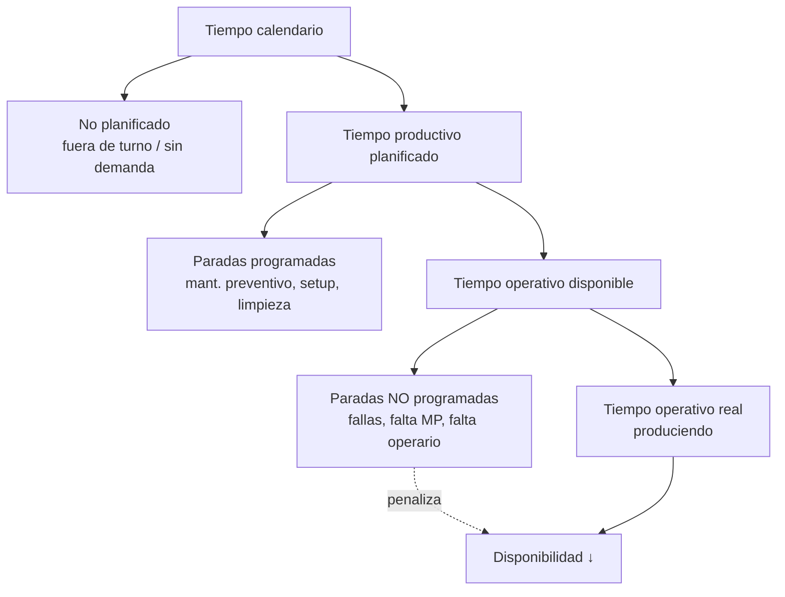
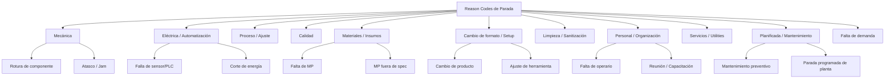
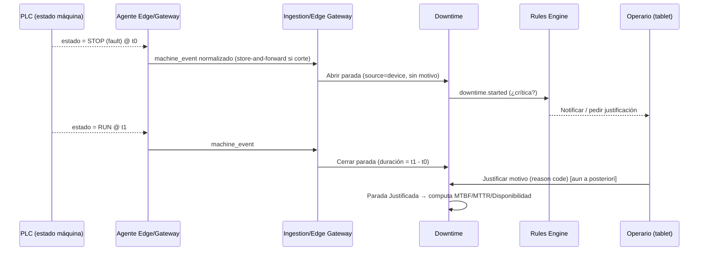
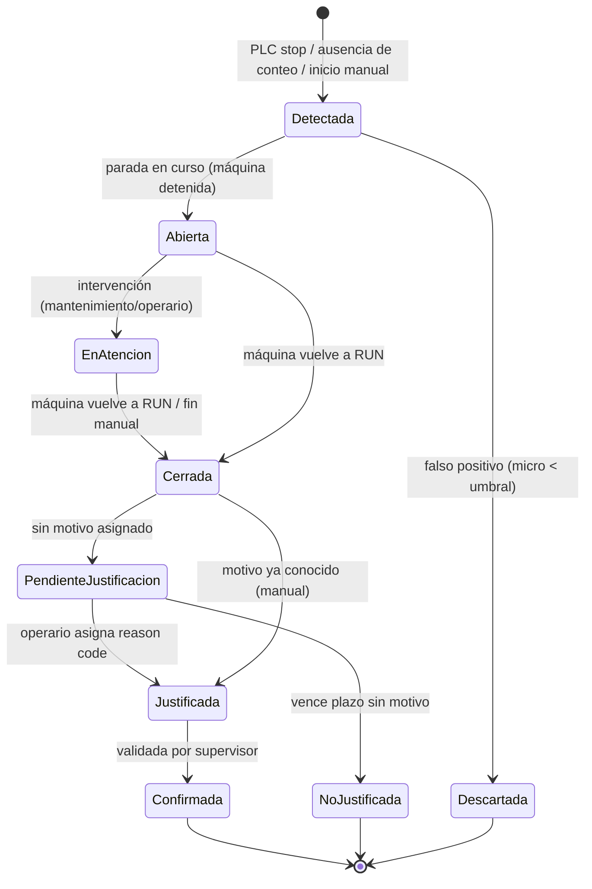
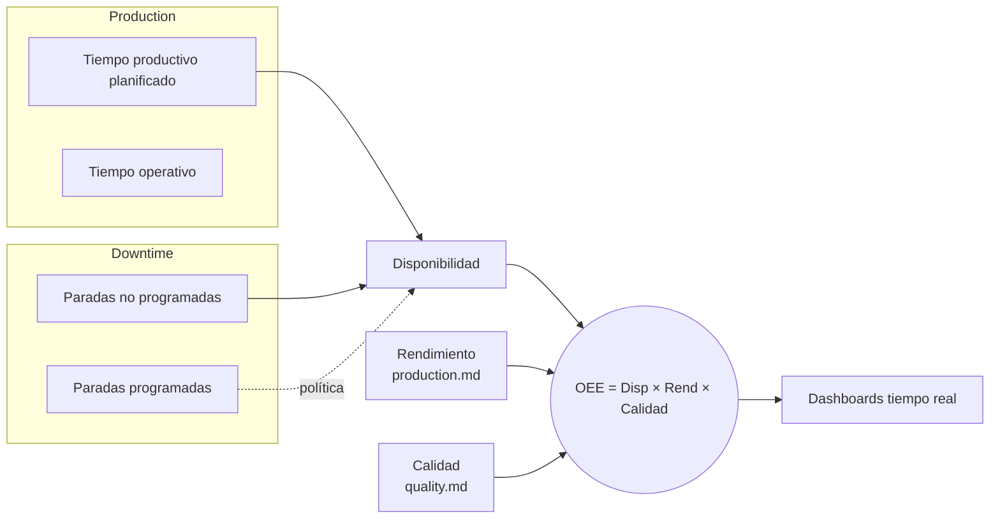

# Paradas (Downtime)

> **Documento:** `specs/specs/downtime.md` · **Estado:** Borrador v0.1 · **Actualizado:** 2026-07-11
> **Roles:** Product Manager · Software Architect · UX Designer
> **Relacionados:** [architecture.md](./architecture.md) · [glossary.md](./glossary.md) · [production.md](./production.md) · [quality.md](./quality.md) · [scrap.md](./scrap.md) · [traceability.md](./traceability.md) · [data-ingestion.md](./data-ingestion.md) · [dashboards.md](./dashboards.md) · [rules-engine.md](./rules-engine.md) · [integrations.md](./integrations.md) · [devices.md](./devices.md) · [data-model.md](./data-model.md)

## Resumen ejecutivo

El dominio de **Paradas (Downtime)** modela **cuándo, por qué y por cuánto tiempo** una máquina o línea deja de producir. Distingue **paradas programadas** (mantenimiento planificado, cambios de formato, limpieza) de **no programadas** (fallas, falta de material, ausencia de operario), construye un **árbol de motivos** (reason codes) coherente con [Calidad](./quality.md) y [Scrap](./scrap.md), y calcula los indicadores de confiabilidad **MTBF** y **MTTR**. Es el dominio que aporta el insumo crítico de la **Disponibilidad** y, por lo tanto, del **OEE**.

Cada minuto de parada tiene un impacto directo: **Disponibilidad = Tiempo operativo / Tiempo productivo planificado**, donde **Tiempo operativo = Planificado − Paradas**. Si Nexo no captura bien las paradas, el OEE es ficción. Por eso este dominio es tan sensible a la **captura dual**: **manual desde tablet** (el operario declara el motivo de la parada, ideal para causas humanas/logísticas) y **automática desde el estado de la máquina** (un PLC que reporta `máquina detenida` vía OPC UA/Modbus/MQTT, o la ausencia de pulsos del contador de producción durante N segundos).

La captura automática detecta el **cuándo** (la máquina paró) casi sin error; el **por qué** casi siempre necesita al operario. Nexo resuelve esto con paradas que nacen "sin motivo" (detectadas por el PLC) y quedan **pendientes de justificación**: la tablet le pide al operario que las clasifique, incluso a posteriori. Esta mecánica de "tiempo detectado + motivo declarado" es el corazón del dominio.

Como el resto de la plataforma, es **agnóstico del ERP** y **event-driven**: las paradas se registran on-premise vía el **Agente Edge / Gateway** (store-and-forward ante cortes) y se normalizan al **Evento canónico** `type=downtime` / `machine_event`, alimentando dashboards en tiempo real, el motor de reglas y, cuando aplica, a Odoo (mantenimiento/planificación).

---

## 1. Alcance y objetivos del dominio

**Servicio (Bounded Context) responsable:** **Downtime (Paradas)** (por tenant). Responsabilidad: *Eventos de parada, motivos, MTBF/MTTR*.

### En alcance (MVP)
- Registrar **eventos de parada** con **inicio, fin, duración, motivo y contexto** (máquina/línea/turno/orden).
- Distinguir **programada vs no programada** y **planificada vs no planificada**.
- **Árbol de motivos** (reason codes) jerárquico, coherente con [Calidad](./quality.md)/[Scrap](./scrap.md).
- **Captura dual**: manual (tablet) y automática (estado de máquina desde PLC / ausencia de conteo).
- **Micro-paradas** y su tratamiento (umbral de duración).
- **MTBF** y **MTTR** por máquina/línea.
- Aporte a **Disponibilidad** y **OEE**.
- Emisión de **Eventos canónicos** `type=downtime` y `machine_event`.

### Fuera de alcance de este dominio
- Volumen/tiempos de producción efectiva → [production.md](./production.md).
- Paradas por defecto de calidad las **origina** [Calidad](./quality.md) (aquí se registran como parada).
- Órdenes de trabajo de mantenimiento correctivo/preventivo detallado (mantenimiento avanzado es fase futura); en MVP se registra la parada y su causa.

---

## 2. Entidades involucradas

Nombres de las **entidades canónicas (sección 8 del brief)**.

| Entidad canónica | Rol en Paradas | Propiedad |
|---|---|---|
| **Parada (Downtime Event)** | Detención de máquina + motivo | **Propia** |
| **Motivo (Reason Code)** | Código de parada (árbol de motivos) | **Propia** (taxonomía compartida) |
| **Máquina / Centro de trabajo (Asset)** | Qué se detuvo | Referenciada ([devices.md](./devices.md)) |
| **Línea (Line) / Sector / Planta** | Alcance de la parada | Referenciada |
| **Dispositivo / Señal (Tag)** | Fuente del estado de máquina | Referenciada ([devices.md](./devices.md)) |
| **Lectura (Reading)** | Muestra de estado (run/stop) | Referenciada (ingesta) |
| **Orden de producción (WO/MO)** | Orden afectada por la parada | Referenciada ([production.md](./production.md)) |
| **Turno (Shift)** | Cuándo ocurrió | Referenciada |
| **Operario (Operator)** | Quién justificó / intervino | Referenciada |
| **Evento (Event)** | Salida `type=downtime` / `machine_event` | Co-propiedad con Traceability |
| **Alerta / Alarma (Alert)** | Parada crítica que dispara notificación | Referenciada ([rules-engine.md](./rules-engine.md)) |

---

## 3. Clasificación de paradas

### 3.1 Ejes de clasificación

| Eje | Valores | Uso |
|---|---|---|
| **Planificación** | Programada / No programada | Programada resta a "planificado"; no programada penaliza Disponibilidad |
| **Naturaleza** | Falla / Cambio de formato / Falta de insumo / Falta de operario / Calidad / Limpieza / Ajuste / Reunión / Falta de demanda | Árbol de motivos §4 |
| **Duración** | Micro-parada / Parada / Parada mayor | Umbral configurable |
| **Impacto en OEE** | Cuenta como pérdida de Disponibilidad / No cuenta (fuera de turno planificado) | Ver §7 |
| **Origen del registro** | Manual / Automático | §5 |

### 3.2 Programada vs no programada (impacto en el cálculo)

> **Definición canónica (coherente con brief 10.1):** **Tiempo operativo = Tiempo productivo planificado − Paradas.** Las **paradas programadas** pueden restarse del "planificado" (política del tenant) o computarse dentro; las **no programadas** siempre penalizan la Disponibilidad. La política exacta se define por tenant. Ver [Preguntas abiertas](#preguntas-abiertas).

---

## 4. Árbol de motivos (reason codes de parada, compartido)

El árbol de motivos de paradas **reutiliza el modelo de Reason Codes compartido** (ver [quality.md](./quality.md) §6, [scrap.md](./scrap.md) §3): una parada por defecto de calidad comparte el reason code raíz con el defecto; una parada por falta de MP comparte raíz con el scrap por MP.

### 4.1 Correlación entre dominios

| Rama de Parada | Correlato en Calidad | Correlato en Scrap |
|---|---|---|
| Calidad | [Defecto](./quality.md) que fuerza detención | Scrap por defecto |
| Cambio de formato / Setup | first-off | Scrap de arranque/purga |
| Materiales / Insumos | Defecto de MP | Scrap por MP |
| Mecánica / Eléctrica | Puede generar defectos por deriva | Scrap por proceso |

> **Regla canónica:** reason code raíz = **mismo objeto conceptual** en los tres dominios (`dominios_aplica = [quality, scrap, downtime]`). Habilita **análisis de causa raíz cruzado**: "la falla mecánica X causó 40 min de parada, 120 piezas de scrap y 3 defectos". Catálogo base en el **seed del tenant** (sección 6.1 del brief), extensible por el Administrador.

---

## 5. Métodos de captura

### 5.1 Captura manual (tablet)
El operario declara la parada:
- Marca **inicio/fin** (o la parada ya fue detectada por PLC y solo declara el **motivo**).
- Selecciona **reason code** del árbol, agrega comentario y, opcional, **foto**.
- Ideal para causas que el PLC **no** conoce: falta de operario, reunión, espera de MP, decisión organizativa.
- **Offline-first**: encola sin red.

### 5.2 Captura automática (estado de máquina desde PLC)
Dos mecanismos complementarios:

1. **Estado explícito:** el PLC expone una **Señal/Tag de estado** (`estado_maquina` = run/stop/fault, o un bit de "en marcha"). Un cambio a `stop`/`fault` **abre** una parada; el regreso a `run` la **cierra**.
2. **Inferencia por ausencia de conteo:** si el contador de producción ([production.md](./production.md)) no incrementa durante **N segundos** (umbral configurable) mientras la orden está activa, Nexo **infiere** una parada.

La parada automática nace **sin motivo** → estado **"Pendiente de justificación"** → la tablet solicita al operario el reason code.

### 5.3 Comparativa
| Criterio | Manual (tablet) | Automático (estado PLC / ausencia conteo) |
|---|---|---|
| `source` del Evento | `manual` | `device` |
| Detección del **cuándo** | Depende del operario | Preciso, casi tiempo real |
| Determinación del **por qué** | Directa | Requiere justificación posterior |
| Micro-paradas | Difíciles de capturar a mano | Detectables por ausencia de conteo |
| Falla de red | Se encola en tablet | Store-and-forward en el edge |
| Rol dominante | Operario | Devices + Ingestion |

> **Regla canónica de captura:** el **tiempo** de parada lo determina preferentemente la **fuente automática** (más precisa); el **motivo** lo determina preferentemente el **operario**. Una parada detectada por PLC y nunca justificada permanece como **"No justificada"** y así se reporta (transparencia del dato).

---

## 6. Estados de la parada

| Estado | Significado | Computa en KPIs |
|---|---|---|
| **Detectada** | Se detectó una detención (aún sin confirmar si es parada real) | No hasta confirmar |
| **Abierta** | Parada en curso, máquina detenida | Cuenta tiempo en vivo |
| **En atención** | Alguien interviene (arranca MTTR) | Sí (tiempo de reparación) |
| **Cerrada** | Máquina volvió a producir | Duración fija |
| **Pendiente de justificación** | Cerrada pero sin motivo | Sí (como "no justificada" hasta clasificar) |
| **Justificada** | Motivo asignado | Sí, con reason code |
| **Confirmada** | Validada por supervisor | Sí (dato firme) |
| **No justificada** | Venció plazo sin motivo | Sí, marcada como tal |
| **Descartada** | Falso positivo / bajo umbral de micro-parada | No |

> **Micro-paradas:** detenciones por debajo de un **umbral** (p. ej. < 2 min, configurable) se agrupan como **pérdidas de velocidad/micro-paradas**. Afectan más al **Rendimiento** ([production.md](./production.md)) que a la Disponibilidad; su tratamiento exacto se define por tenant. Ver [Preguntas abiertas](#preguntas-abiertas).

---

## 7. Aporte a Disponibilidad y OEE

Fórmulas **idénticas** a la sección 10.1 del brief.

### 7.1 Disponibilidad
> **Disponibilidad = Tiempo operativo / Tiempo productivo planificado**
> donde **Tiempo operativo = Tiempo productivo planificado − Paradas.**

- **Tiempo productivo planificado:** definido por el **calendario de turnos** ([production.md](./production.md) §7.3) menos, según política, las **paradas programadas**.
- **Paradas (no programadas):** la suma de las duraciones de paradas que penalizan disponibilidad.

### 7.2 Contribución al OEE

### 7.3 MTBF y MTTR (confiabilidad)
> **MTBF = Tiempo operativo total / N.º de fallas** — **MTTR = Tiempo total de reparación / N.º de reparaciones**

| KPI | Fórmula | Notas |
|---|---|---|
| **MTBF** (Mean Time Between Failures) | Tiempo operativo total / N.º de fallas | Solo paradas tipo "falla"; por máquina/línea |
| **MTTR** (Mean Time To Repair) | Tiempo total de reparación / N.º de reparaciones | Tiempo en estado "En atención" hasta cierre |
| **Disponibilidad** | Tiempo operativo / Tiempo productivo planificado | Insumo directo del OEE |
| **Tasa de paradas** | N.º de paradas / tiempo | Frecuencia |
| **Tiempo medio de parada** | Σ duración / N.º paradas | Severidad |
| **Pareto de motivos** | Ranking de reason codes por tiempo perdido | Priorización de mejora |

> **Nota MTBF/MTTR:** solo las paradas clasificadas como **falla** (ramas Mecánica/Eléctrica/etc.) cuentan para MTBF/MTTR; los cambios de formato o reuniones **no** son fallas. La clasificación (§4) es la que habilita este cálculo. Los KPIs se materializan como read models (CQRS) y se muestran en [dashboards.md](./dashboards.md).

---

## 8. Validaciones

| # | Validación | Tipo | Acción ante fallo |
|---|---|---|---|
| V1 | `fin` > `inicio` (duración positiva) | Sintáctica | Rechazo |
| V2 | Solapamiento: una máquina no puede tener 2 paradas simultáneas | Consistencia | Fusionar/rechazar |
| V3 | Motivo obligatorio para pasar a "Justificada" | Completitud | Bloquear transición |
| V4 | Duración < umbral micro-parada → clasificar como micro/descartar | Negocio | Reclasificar automáticamente |
| V5 | Estado de máquina coherente con conteo de producción | Cross-check | Alertar discrepancia (para si contó, contó si paró) |
| V6 | Reason code "falla" requerido para computar MTBF/MTTR | Integridad KPI | No computar si no es falla |
| V7 | Operario/supervisor con permiso sobre la máquina/línea | Autorización | Rechazo |
| V8 | Dedup por `dedup_key` de `machine_event` | Idempotencia | Descartar duplicado |
| V9 | Parada abierta huérfana (nunca cerró) supera tope | Housekeeping | Alertar; cierre asistido |
| V10 | Justificación fuera de plazo → "No justificada" | Temporal | Marcar y reportar como tal |

---

## 9. Personas y permisos

| Persona | Interacción con Paradas |
|---|---|
| **Operario** | Justifica paradas, declara motivo, marca inicio/fin manual |
| **Mantenimiento** | Atiende la parada (MTTR), registra intervención/causa raíz |
| **Supervisor** | Confirma paradas, resuelve no justificadas, revisa Pareto |
| **Producción** | Monitorea impacto en avance de orden |
| **Calidad** | Origina paradas de calidad (línea detenida por no conformidad) |
| **Gerencia** | Ve Disponibilidad, OEE, MTBF/MTTR, Pareto en [dashboards.md](./dashboards.md) |
| **Administrador** (tenant) | Configura árbol de motivos, umbrales de micro-parada, política de programadas |
| **Integraciones** | Configura sync con mantenimiento/planificación de Odoo |

Matriz completa en [users-permissions.md](./users-permissions.md).

---

## 10. Eventos emitidos y consumidos

| Evento | Dirección | Consumidores |
|---|---|---|
| `machine_event` (run/stop/fault) | Emite/Consume | Ingestion → Downtime → Production (pausar corrida) |
| `downtime.started` | Emite | Rules Engine, Notifications, Dashboards |
| `downtime.ended` | Emite | Dashboards, Traceability, Reports |
| `downtime.unjustified` | Emite | Rules Engine, Notifications (recordatorio de justificar) |
| `downtime.critical` (falla mayor) | Emite | Rules Engine → Notifications (escalado a Mantenimiento) |
| `production.registered` | Consume | de [Producción](./production.md) (inferencia por ausencia de conteo) |
| `quality.nonconformance.detected` | Consume | de [Calidad](./quality.md) (parada por calidad) |

Todos siguen el **Evento canónico** (sección 8.1 del brief), inmutables, con `type=downtime` o `machine_event`. Normalización y store-and-forward en [data-ingestion.md](./data-ingestion.md); genealogía en [traceability.md](./traceability.md). Las alertas/escalados por parada crítica se definen en [rules-engine.md](./rules-engine.md) y [notifications.md](./notifications.md).

---

## 11. Integración con Odoo

| Concepto Odoo | Concepto Nexo | Dirección | Notas |
|---|---|---|---|
| Mantenimiento (`maintenance.request`) | Parada por falla | Nexo → Odoo | Generar solicitud de mantenimiento |
| Estado de centro de trabajo (`mrp.workcenter` productivity) | Parada / tiempo improductivo | Nexo → Odoo | Reportar tiempos de improductividad |
| Calendario / disponibilidad de recurso | Tiempo planificado | Odoo → Nexo (opcional) | Fuente del planificado |
| Motivo de improductividad (`mrp.workcenter.productivity.loss`) | Reason code de parada | Bidireccional (mapeado) | Alinear taxonomías |

Toda la conversación pasa por **Connectors / Integrations** (ACL). Las paradas se registran sin depender de Odoo (store-and-forward). Detalle en [integrations.md](./integrations.md).

---

## 12. Casos borde

| # | Caso | Tratamiento |
|---|---|---|
| CB1 | **Parada detectada pero nunca justificada** | Permanece "No justificada"; se reporta como tal (transparencia) |
| CB2 | **Falso positivo / micro-parada** | Bajo umbral → descartada o agrupada como micro-parada (V4) |
| CB3 | **PLC caído** (no reporta estado) | Store-and-forward; al reconectar, reconstruir por timestamps; posible parada por "falla de comunicación" |
| CB4 | **Máquina parada pero contador sigue** (tag mal mapeado) | Cross-check V5; alertar a Devices; cuarentena del dato |
| CB5 | **Parada que cruza cambio de turno** | Se atribuye tiempo a cada turno proporcionalmente; una sola parada lógica |
| CB6 | **Parada programada mal clasificada como falla** | Reclasificar; recalcular MTBF/MTTR (versionado) |
| CB7 | **Solapamiento de paradas** (dos fuentes) | Fusionar en una parada lógica; conservar ambos eventos origen (V2) |
| CB8 | **Parada abierta huérfana** (nunca cerró) | Housekeeping V9; cierre asistido con marca de estimación |
| CB9 | **Parada de línea que detiene varias máquinas** | Propagar parada a máquinas dependientes; una causa raíz |
| CB10 | **Ausencia de conteo con orden pausada legítimamente** | No inferir parada si la orden ya está Pausada por otra razón conocida |

---

## 13. Requisitos no funcionales (resumen del dominio)

- **Multi-tenant DB-per-tenant:** Downtime opera contra la DB del tenant resuelto.
- **Tiempo real:** detección y tablero de paradas con latencia de segundos (crítico para reacción).
- **Store-and-forward en el edge:** ninguna parada se pierde por cortes de red.
- **Inmutabilidad:** reclasificaciones por evento de ajuste; nunca edición destructiva.
- **Configurabilidad:** árbol de motivos, umbrales de micro-parada y política de programadas por tenant.

---

## Preguntas abiertas

1. **Política de paradas programadas:** ¿se restan del "Tiempo productivo planificado" (no penalizan Disponibilidad) o se cuentan como pérdida? ¿Configurable por tenant/planta?
2. **Umbral de micro-parada:** ¿valor por defecto (p. ej. 2 min) y quién lo ajusta? ¿Impactan Disponibilidad o solo Rendimiento?
3. **Inferencia por ausencia de conteo:** ¿qué N segundos por línea? ¿Cómo evitar falsos positivos en procesos de ciclo lento?
4. **Plazo de justificación:** ¿cuánto tiempo tiene el operario para justificar antes de marcar "No justificada"? ¿Bloquea el cierre de turno?
5. **MTBF/MTTR:** confirmar que solo paradas tipo "falla" computan. ¿Cómo se define "reparación" (estado En atención) para MTTR con fuente automática?
6. **Paradas encadenadas de línea:** ¿cómo modelar la propagación a máquinas dependientes sin doble contar tiempo perdido?
7. **Taxonomía compartida:** confirmar reuso del mismo objeto Reason Code entre Paradas/Calidad/Scrap (`dominios_aplica`) para causa raíz cruzada.
8. **Fuente del "planificado":** ¿calendario de turnos de Nexo o disponibilidad de recurso importada de Odoo? Debe ser única y consistente con [production.md](./production.md).
