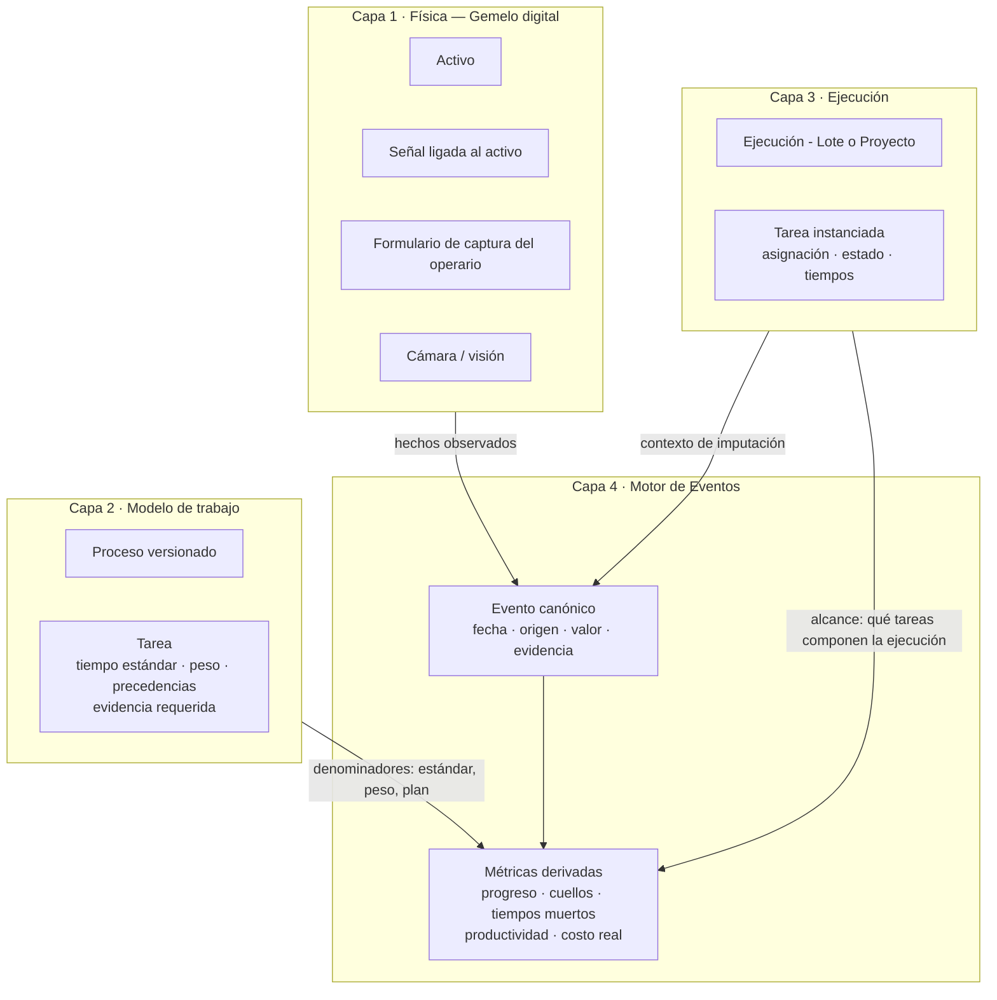
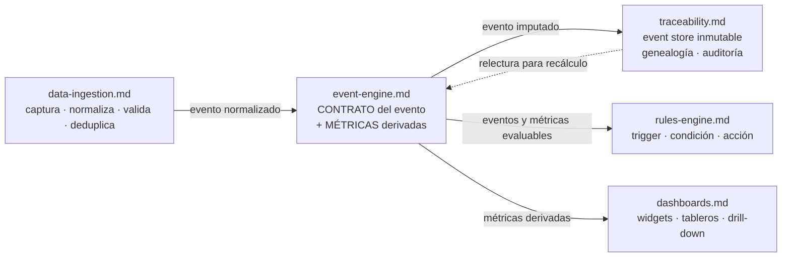
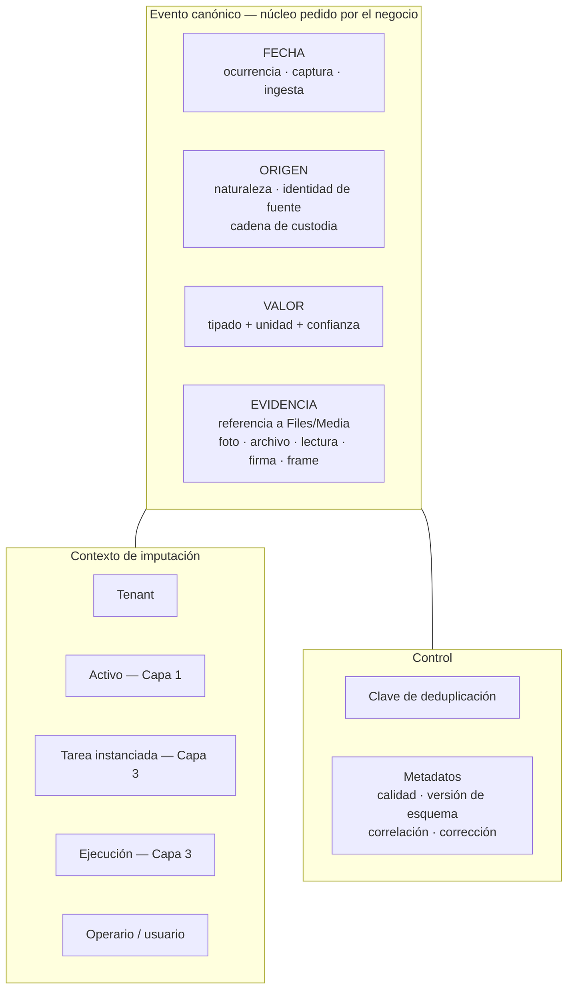
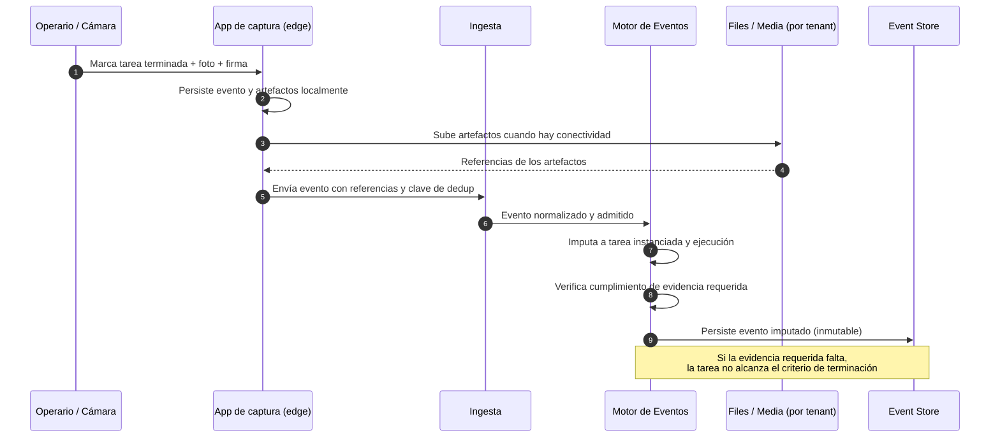
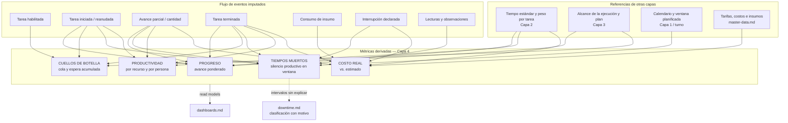
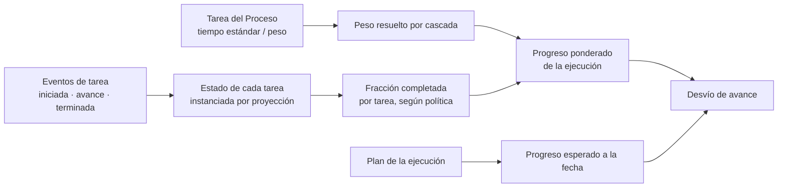
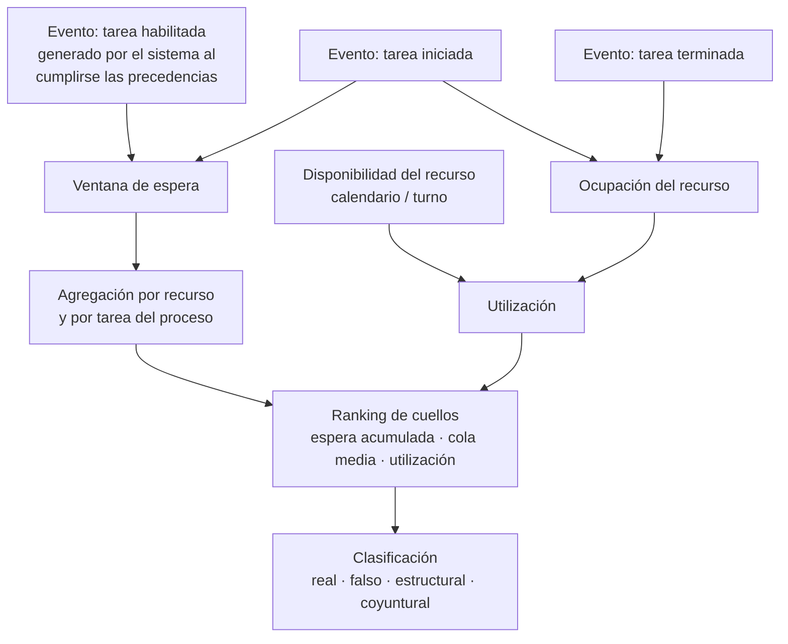
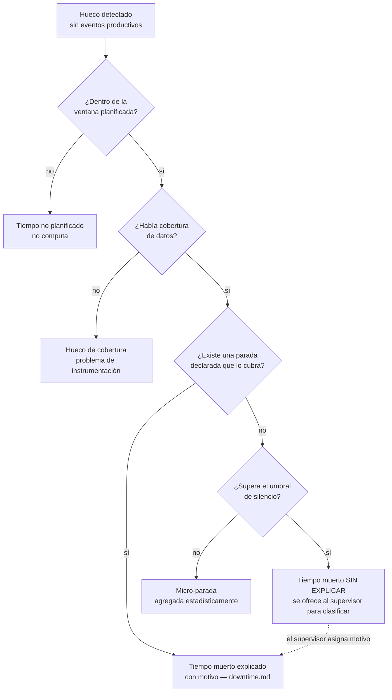

# Capa 4 — Motor de Eventos (Event Engine)

> **Documento:** `specs/specs/event-engine.md` · **Estado:** Borrador v0.1 · **Actualizado:** 2026-07-13
> **Roles:** Product Manager · Software Architect · UX Designer
> **Relacionados:** [layered-architecture.md](./layered-architecture.md) · [digital-twin.md](./digital-twin.md) · [work-model.md](./work-model.md) · [execution.md](./execution.md) · [data-ingestion.md](./data-ingestion.md) · [traceability.md](./traceability.md) · [rules-engine.md](./rules-engine.md) · [dashboards.md](./dashboards.md) · [downtime.md](./downtime.md) · [master-data.md](./master-data.md) · [data-model.md](./data-model.md) · [glossary.md](./glossary.md)

## Resumen ejecutivo

El **Motor de Eventos** es la **Capa 4** del modelo de cuatro capas de Nexo (ver [layered-architecture.md](./layered-architecture.md)). Es la capa que responde a la pregunta **"¿qué pasó realmente?"**, y lo hace observando a las tres capas de abajo: la **Física** ([digital-twin.md](./digital-twin.md)), el **Modelo de trabajo** ([work-model.md](./work-model.md)) y la **Ejecución** ([execution.md](./execution.md)). Es la única capa que produce el **dato de verdad** sobre el que se toman decisiones: progreso, cuellos de botella, tiempos muertos, productividad y costo real.

Su principio fundacional es simple y absoluto: **todo genera eventos**. Un sensor que reporta una temperatura genera un evento. Una cámara que detecta una pieza genera un evento. Un operario que marca una tarea como terminada genera un evento. Y el sistema mismo —al vencer un plazo, al habilitar una tarea porque se cumplieron sus precedencias, al cerrar una ejecución— también genera eventos. No existe un "hecho" en la plataforma que no esté respaldado por un evento; el estado siempre es una consecuencia, nunca un origen.

Este documento define dos cosas y solo dos cosas:

1. **El contrato del evento canónico** desde la perspectiva de la capa: qué significa cada atributo para el negocio, con foco explícito en los cuatro que el negocio pidió por nombre — **fecha, origen, valor y evidencia** — sumados a los ya definidos (tenant, activo/tarea/ejecución, operario, deduplicación, metadatos). La **evidencia** se trata como **ciudadano de primera clase**: no es un adjunto opcional, es parte del hecho.
2. **Las métricas derivadas**: cómo, a partir de ese flujo de eventos, se calculan **progreso**, **cuellos de botella**, **tiempos muertos**, **productividad por recurso** y **costo real**, con la trazabilidad completa desde la métrica hasta los eventos que la sostienen.

Lo que este documento **no** hace es tan importante como lo que hace. El pipeline técnico que trae el dato hasta acá, el almacén inmutable donde queda, las automatizaciones que reaccionan y las pantallas que lo muestran **viven en otros documentos**. La sección 2 declara esas fronteras de forma explícita y no negociable.

---

## 1. Ubicación en el modelo de cuatro capas

| Capa | Nombre | Responde a | Relación con el Motor de Eventos |
|---|---|---|---|
| **1** | Física — Gemelo digital | *¿Qué existe y qué está midiendo?* | **Fuente**: aporta el `activo` dueño de cada señal; sin activo, un evento no se puede atribuir |
| **2** | Modelo de trabajo — Procesos | *¿Cómo se hace el trabajo?* | **Referencia**: aporta tiempos estándar, pesos, precedencias y evidencia requerida — los denominadores de las métricas |
| **3** | Ejecución — Lote o Proyecto | *¿Qué se está haciendo ahora?* | **Sujeto**: aporta la instancia (ejecución, tarea instanciada, asignación) a la que el evento se imputa |
| **4** | **Motor de eventos** | ***¿Qué pasó realmente?*** | **Esta capa**: registra los hechos y deriva las métricas |

**Principio de dependencia:** la Capa 4 **observa** a las otras tres y **no las modifica**. No decide qué activos existen, ni cómo se define un proceso, ni cuándo arranca una ejecución. Consume esas definiciones como contexto y produce hechos y métricas.

---

## 2. Fronteras — qué es y qué NO es de este documento

Esta sección es **normativa**. El Motor de Eventos toca varios documentos existentes y la única forma de evitar duplicación (y contradicciones) es declarar la frontera de forma explícita.

### 2.1 Regla de frontera en una línea

> **La ingesta trae el evento. La trazabilidad lo guarda. Las reglas reaccionan a él. Los tableros lo muestran. El Motor de Eventos lo _define_ y _deriva métricas de él_.**

### 2.2 Reparto de responsabilidades

| Pregunta | Documento dueño | Qué aporta este documento |
|---|---|---|
| ¿Cómo llega el dato desde el PLC/tablet/CSV hasta la nube? ¿Cómo se normaliza, valida y deduplica? ¿Qué pasa ante cortes, picos y relojes desalineados? | **[data-ingestion.md](./data-ingestion.md)** | Nada del pipeline. Este documento asume el evento **ya normalizado y admitido**, y define **qué significa cada atributo para el negocio** |
| ¿Dónde queda el evento de forma inmutable? ¿Cómo se encadena, se audita y se reconstruye la genealogía lote↔serie? | **[traceability.md](./traceability.md)** | Nada del Event Store. Este documento **consume** la garantía de inmutabilidad como axioma y agrega la **imputación a tarea/ejecución** que la Capa 4 necesita |
| ¿Qué automatización se dispara cuando un evento cumple una condición? ¿Cómo se escala una alerta? | **[rules-engine.md](./rules-engine.md)** | Nada de trigger-condición-acción. Este documento **expone** eventos y métricas derivadas como insumo evaluable; no define reglas ni alertas |
| ¿Cómo se ven las métricas? ¿Qué widget, qué tablero, qué drill-down, para qué persona? | **[dashboards.md](./dashboards.md)** | Nada de visualización. Este documento define la **semántica y la derivación** de la métrica; Dashboards elige **cómo presentarla** |
| ¿Cómo se clasifica y gestiona una parada con su motivo? ¿Cómo aporta a Disponibilidad/OEE? | **[downtime.md](./downtime.md)** | Este documento detecta **intervalos sin eventos productivos** (tiempo muerto observado) y los ofrece a Downtime para clasificación; no gestiona motivos ni el ciclo de vida de la parada |
| ¿Qué activos, procesos y ejecuciones existen? | **[digital-twin.md](./digital-twin.md)** · **[work-model.md](./work-model.md)** · **[execution.md](./execution.md)** | Este documento los **referencia**; no los define ni los administra |
| ¿De dónde salen productos, insumos, unidades, tarifas y centros de costo usados en costo real? | **[master-data.md](./master-data.md)** | Este documento **consume** esos catálogos; no los posee |

### 2.3 Qué SÍ es exclusivo de este documento

1. **El contrato semántico del evento canónico** como hecho de negocio: los cuatro atributos pedidos (fecha, origen, valor, evidencia) y su interpretación.
2. **La evidencia como ciudadano de primera clase**: tipos, obligatoriedad, referencia a Files/Media, verificación.
3. **La taxonomía funcional de eventos** de la Capa 4, en particular la distinción **productivo / no productivo**, que es la base del cálculo de tiempos muertos.
4. **La imputación**: cómo un evento se ata a un `activo`, a una `tarea instanciada` y a una `ejecución`.
5. **Las métricas derivadas y su método de derivación**: progreso, cuellos de botella, tiempos muertos, productividad por recurso y costo real.
6. **Las reglas de recálculo** ante eventos tardíos, correcciones y cambios de plan.

### 2.4 Diagrama de fronteras

---

## 3. Principio "todo genera eventos"

### 3.1 Los cuatro generadores

El negocio expresó el principio con cuatro ejemplos concretos. Se elevan a **categorías canónicas de generador**:

| Generador | Qué produce | Ejemplos | `origen` |
|---|---|---|---|
| **Sensor / señal** | Lecturas y transiciones de estado del mundo físico | Temperatura de un horno, contador de piezas, balanza, estado marcha/paro del PLC | `dispositivo` |
| **Cámara / visión** | Detecciones e inferencias sobre imagen | Conteo de piezas, presencia/ausencia, lectura de código, detección de defecto, frame de referencia | `visión` |
| **Persona (operario / supervisor)** | Declaraciones humanas sobre el trabajo | "Tarea terminada", "arranqué la tarea", cantidad producida, motivo de parada, resultado de inspección, firma de conformidad | `manual` |
| **Sistema (la plataforma misma)** | Hechos derivados de su propia lógica | Tarea habilitada porque se cumplieron sus precedencias, plazo vencido, ejecución cerrada automáticamente, evento de corrección, resultado de un cálculo programado | `sistema` |

> **Por qué importa que el sistema sea un generador de primera:** si la habilitación de una tarea (cuando se cumplen sus precedencias del DAG) no queda registrada como evento, **no se puede calcular la espera** —y sin espera no hay cuello de botella medible—. Los hechos del sistema no son ruido: son el reloj contra el que se miden las demoras humanas y físicas.

A estos cuatro se suman, por continuidad con el diseño existente, los orígenes `api` (sistema externo) y `archivo` (importación CSV/Excel), ya definidos en [data-ingestion.md](./data-ingestion.md) y [traceability.md](./traceability.md).

### 3.2 Consecuencias del principio

- **El estado es una proyección.** El estado de una tarea instanciada ("en curso", "terminada") no es un campo que se edita: es la lectura consolidada de su corriente de eventos. Ver el principio rector equivalente en [traceability.md](./traceability.md).
- **No hay corrección destructiva.** Un error se corrige con un **evento de corrección** que referencia al original. El histórico completo permanece.
- **Toda métrica es explicable.** Cualquier número de un tablero debe poder descomponerse hasta la lista de eventos que lo produjeron. Si una métrica no se puede rastrear a eventos, no pertenece a esta capa.
- **La ausencia de evento también es información.** Un intervalo sin eventos productivos dentro de una ventana planificada es, en sí mismo, el hecho más caro de la planta: un tiempo muerto (sección 7.3).

---

## 4. El evento canónico — contrato de la Capa 4

### 4.1 Los cuatro atributos pedidos por el negocio

El negocio definió cuatro atributos como **irrenunciables**. Se documentan primero y con detalle, porque son el núcleo del contrato.

#### 4.1.1 `fecha` — cuándo pasó

No es un solo dato: es una **terna temporal**, y confundirla es la causa más frecuente de KPIs erróneos.

| Marca temporal | Significado | Uso | Quién la sella |
|---|---|---|---|
| **Fecha de ocurrencia** | Cuándo ocurrió el hecho en la planta | **Preferente para todo cálculo de negocio** (progreso, esperas, tiempos muertos, costo) | La fuente (PLC/OPC UA), el agente edge o la app del operario |
| **Fecha de captura** | Cuándo el agente/dispositivo leyó el hecho | Respaldo cuando la fuente no aporta hora propia | Agente edge / dispositivo de captura |
| **Fecha de ingesta** | Cuándo la nube admitió el evento | Diagnóstico de latencia, detección de tardíos, disparo de recálculo | Servicio de ingesta |

- La **fecha de ocurrencia** es la que ordena la línea de tiempo del negocio. Un evento que llega dos horas tarde tras un corte **no** se computa en el momento en que llegó: se computa cuando ocurrió, y las métricas afectadas se recalculan (sección 8).
- Los eventos de **duración** (una tarea que dura, una parada que dura) se modelan preferentemente como **par inicio/fin**, no como un único evento con campo "duración". El intervalo es entonces derivable y auditable a ambos extremos. Cuando el origen solo puede reportar duración (típico en captura manual diferida), se registra explícitamente el modo de derivación en metadatos.
- La zona horaria y el turno se resuelven contra el calendario de la planta (Capa 1) y quedan **fijados en el evento**, para que un cambio posterior de calendario no altere la historia.

#### 4.1.2 `origen` — quién o qué lo dijo

El origen es lo que determina **cuánta confianza** merece un número. Es una tripleta:

| Componente del origen | Qué expresa | Ejemplo |
|---|---|---|
| **Naturaleza** | Categoría de generador (sección 3.1) | `dispositivo` · `visión` · `manual` · `sistema` · `api` · `archivo` |
| **Identidad de la fuente** | Quién exactamente lo produjo | Dispositivo + señal/tag · modelo y versión del detector de visión · usuario/operario · componente del sistema · conector · archivo y fila |
| **Cadena de custodia** | Por qué medio llegó | Protocolo, agente edge, versión de firmware, calidad del dato reportada por la fuente |

- **La distinción de origen habilita políticas de negocio**: "una lectura automática de balanza prevalece sobre una estimación manual"; "un valor inferido por visión con confianza baja no cierra una tarea sin validación humana". Esas políticas **se ejecutan en [rules-engine.md](./rules-engine.md)**; acá se garantiza que la información para decidirlas exista y sea confiable.
- **El origen `sistema` no es menos trazable**: registra qué componente y qué versión de lógica generó el hecho, para poder reproducirlo.

#### 4.1.3 `valor` — qué se midió o se declaró

El `valor` es el contenido del hecho. Es **polimórfico y siempre tipado**: nunca un texto libre sin semántica.

| Tipo de valor | Estructura | Ejemplos |
|---|---|---|
| **Numérico con unidad** | magnitud + unidad de medida + precisión | 82,4 °C · 350 kg · 1200 piezas · 45 min |
| **Contador / incremento** | delta o acumulado, con indicación de cuál es | +12 piezas desde la última lectura · contador acumulado en 45.320 |
| **Booleano / estado** | valor de un dominio cerrado de estados | marcha/paro · presente/ausente · abierto/cerrado |
| **Categórico** | código de un catálogo gobernado | motivo de parada · código de defecto · resultado aprobado/rechazado |
| **Compuesto** | conjunto de campos con semántica propia del tipo de evento | declaración de producción: cantidad buena + cantidad rechazada + lote |
| **Vacío / marcador** | el hecho es la ocurrencia misma | "tarea iniciada", "tarea terminada", "turno abierto" |

Reglas del `valor`:

- **Toda magnitud lleva unidad**, y la unidad pertenece al catálogo de unidades de [master-data.md](./master-data.md). Un número sin unidad no es un valor: es un riesgo.
- **Toda categoría lleva catálogo**. Los códigos libres no se admiten en producción; se admiten en captura con marca de "a normalizar".
- **El valor no se reinterpreta aguas abajo**. Si hay conversión de escala/unidad, ocurre en la normalización ([data-ingestion.md](./data-ingestion.md)) y queda registrada; las métricas no vuelven a convertir.
- **Confianza asociada**: los valores inferidos (visión, estimaciones) llevan un indicador de confianza. Las métricas pueden filtrar por umbral de confianza.

#### 4.1.4 `evidencia` — con qué se prueba

La evidencia se trata en detalle en la **sección 5**, por su condición de ciudadano de primera clase. En el contrato, la regla es:

> **El evento no contiene la evidencia: la referencia.** El binario (foto, video, archivo, firma) vive en **Files / Media**, aislado por tenant. El evento porta un **puntero inmutable** más los metadatos que permiten verificar que el puntero sigue apuntando a lo mismo.

#### 4.1.5 Los cuatro, en un vistazo

### 4.2 Contrato completo

| Atributo | Obligatorio | Descripción funcional | Notas de la Capa 4 |
|---|---|---|---|
| **Identidad del evento** | Sí | Identificador único e inmutable del hecho | Asignado en la admisión; es la clave de toda trazabilidad |
| **Tenant** | Sí | Empresa dueña del hecho | Resuelto en la admisión, **nunca** desde el payload. Aislamiento no negociable |
| **Fecha** | Sí | Terna temporal (4.1.1) | La de **ocurrencia** manda para el negocio |
| **Origen** | Sí | Tripleta de procedencia (4.1.2) | Determina la confianza y habilita políticas |
| **Tipo de evento** | Sí | Familia funcional del hecho (sección 6) | Define la forma del `valor` y si el evento es **productivo** |
| **Valor** | Según tipo | Contenido tipado del hecho (4.1.3) | Con unidad y confianza cuando corresponde |
| **Evidencia** | Configurable | Referencias a artefactos probatorios (sección 5) | Puede ser obligatoria por tarea; ver Preguntas abiertas |
| **Activo** | Sí cuando aplica | Recurso físico al que se imputa el hecho (Capa 1) | **Ningún dato flota**: toda señal tiene dueño físico. Los eventos puramente administrativos pueden no tener activo |
| **Tarea instanciada** | Cuando aplica | Unidad de trabajo concreta a la que se imputa (Capa 3) | Es lo que permite calcular progreso y espera |
| **Ejecución** | Cuando aplica | Lote o Proyecto al que pertenece (Capa 3) | Contexto de agregación de casi todas las métricas |
| **Operario / usuario** | Cuando aplica | Persona responsable o autora del hecho | Base de productividad por persona y de no repudio |
| **Turno** | Derivado | Turno vigente al momento de ocurrencia | Fijado en el evento; no se recalcula si cambia el calendario |
| **Lote / Serie** | Cuando aplica | Claves de material para genealogía | La genealogía se construye en [traceability.md](./traceability.md) |
| **Clave de deduplicación** | Sí | Clave determinística de idempotencia | Construcción y ventana definidas en [data-ingestion.md](./data-ingestion.md) |
| **Metadatos** | Sí | Calidad del dato, versión de esquema, protocolo, correlación de proceso, referencia a evento corregido | Sostiene reproducibilidad y auditoría |

### 4.3 Imputación: cómo un evento encuentra su tarea

La imputación es la operación distintiva de esta capa y la que hace posibles las métricas. Un evento crudo trae contexto físico (activo, señal); el Motor de Eventos le agrega contexto **de trabajo**.

| Vía de imputación | Cuándo se usa | Confiabilidad |
|---|---|---|
| **Explícita** | El evento ya nombra la tarea instanciada (el operario la marcó en el formulario de captura; la app la conocía) | **Alta** — es la vía preferente |
| **Por ejecución activa en el activo** | El evento nombra solo el activo; hay exactamente una tarea instanciada en curso en ese activo en esa ventana temporal | **Media-alta** — determinista si no hay solapamiento |
| **Por ventana temporal** | Hay varias tareas candidatas; se resuelve por solapamiento de la fecha de ocurrencia con los intervalos declarados | **Media** — se marca el evento como imputado por inferencia |
| **Sin imputar** | No hay ejecución activa ni candidata | **Nula** — el evento se conserva (no se descarta) y queda disponible para imputación diferida o solo para métricas a nivel de activo |

- Un evento **sin imputar no se pierde**: alimenta métricas de activo (utilización, disponibilidad) aunque no alimente progreso de una ejecución.
- La imputación por inferencia queda **marcada** en metadatos. Las métricas pueden reportarse con y sin eventos inferidos, y el supervisor puede confirmarlas.
- La **reimputación** posterior (un supervisor corrige a qué tarea pertenecía un evento) se modela como evento de corrección y dispara recálculo (sección 8).

---

## 5. La evidencia como ciudadano de primera clase

### 5.1 Por qué es de primera clase

En una planta, la diferencia entre "está terminado" y "está terminado **y lo puedo probar**" es la diferencia entre un sistema de registro y un sistema de gestión. La evidencia sostiene tres cosas que el negocio no puede resignar:

1. **Confianza en la declaración humana** — un operario que marca "terminado" con foto de la pieza montada declara algo verificable.
2. **Defensa ante reclamos y auditorías** — el expediente de un lote o de un proyecto se arma con evidencia, no con adjetivos.
3. **Diagnóstico y mejora** — el frame de la cámara en el instante de la anomalía es el insumo del análisis de causa raíz.

Por eso la evidencia **no es un adjunto tardío del registro de negocio**: nace pegada al evento, en el mismo acto de captura.

### 5.2 Tipos de evidencia

| Tipo | Qué prueba | Generador típico | Consideraciones |
|---|---|---|---|
| **Foto** | Estado físico observable en un instante | Operario (formulario de captura), cámara | Puede requerirse cantidad mínima/máxima y encuadre; conviene marcar geo/activo y hora del dispositivo |
| **Archivo / documento** | Un entregable, un certificado, una planilla, un plano firmado | Operario, sistema externo | Formatos admitidos configurables; puede versionarse |
| **Lectura de sensor** | Una medición objetiva en el instante del hecho | Sensor / señal | La evidencia **es** el propio valor + su contexto de origen; puede ir acompañada de la serie temporal de la ventana |
| **Firma** | Conformidad o responsabilidad de una persona | Operario, supervisor, cliente | Firma en pantalla o confirmación fuerte; requiere identidad autenticada y no repudio (ver [security.md](./security.md)) |
| **Video / frame de cámara** | Secuencia o instante capturado por visión | Cámara / visión | Costoso: por defecto se conserva **frame + ventana corta**, no video continuo (ver Preguntas abiertas) |
| **Anotación estructurada** | Observación humana catalogada | Operario | No es texto libre: usa catálogo (defecto, motivo, observación tipificada) |

### 5.3 Dónde vive y cómo se referencia

- **El binario vive en Files / Media**, con **aislamiento por tenant** (ver [multi-tenancy.md](./multi-tenancy.md) y [traceability.md](./traceability.md)). El Motor de Eventos **no** es un repositorio de archivos.
- **El evento porta la referencia**, y la referencia incluye lo necesario para confiar en ella: identificador del artefacto, tipo, tamaño, huella de verificación de integridad, fecha de captura del artefacto y su origen.
- **La evidencia es inmutable como el evento**. Reemplazar una foto no es editar: es agregar una nueva evidencia con un evento de corrección que explica por qué.
- **La captura es offline-first**: el operario saca la foto sin conectividad; el artefacto queda en el dispositivo y se sube cuando hay red. El evento puede admitirse con la referencia **pendiente de materialización** y completarse al sincronizar, sin duplicar el evento (misma clave de deduplicación). Este comportamiento se apoya en el store-and-forward descrito en [data-ingestion.md](./data-ingestion.md).

### 5.4 Evidencia requerida y criterio de terminación

La Capa 2 ([work-model.md](./work-model.md)) define, por tarea, **qué evidencia se exige** para darla por terminada. La Capa 4 es la que **verifica ese cumplimiento** contra los eventos reales.

| Política de evidencia | Comportamiento al declarar "terminada" | Cuándo usarla |
|---|---|---|
| **Obligatoria bloqueante** | La tarea no pasa a terminada sin la evidencia completa | Puntos de control de calidad, hitos contractuales, tareas con impacto regulatorio |
| **Obligatoria diferida** | La tarea se marca terminada, pero queda con **deuda de evidencia** visible y con plazo | Planta sin conectividad estable, donde bloquear frena la producción |
| **Opcional recomendada** | Se solicita, no se bloquea; la ausencia se registra | Tareas de bajo riesgo |
| **No aplica** | No se solicita evidencia | Tareas puramente administrativas |

- La **deuda de evidencia** es una métrica en sí misma: porcentaje de tareas terminadas sin su evidencia completa, por ejecución/recurso/turno. Es un indicador temprano de degradación de la disciplina de captura.
- La política por defecto y su configurabilidad quedan como **pregunta abierta** (alineada con la pregunta del brief sobre obligatoriedad de evidencia).

### 5.5 Retención y costo

La evidencia es, por lejos, el componente más caro del dato. Se documenta la política, no el valor:

| Clase de evidencia | Criterio de retención sugerido |
|---|---|
| Firmas y documentos de conformidad | Retención larga; son el sustento probatorio |
| Fotos de puntos de control de calidad | Retención larga, alineada al régimen del cliente |
| Fotos de avance rutinario | Retención media, con posible reducción de resolución tras un período |
| Frames y video de cámara | Retención corta por defecto, con **promoción a retención larga** cuando el evento se asocia a un defecto, una parada o una disputa |
| Lecturas de sensor como evidencia | Sigue la política de time-series de [scalability.md](./scalability.md) |

---

## 6. Taxonomía funcional de eventos

Esta taxonomía es la de la **capa**, no la del pipeline: agrupa los eventos por **qué significan para el trabajo**, y marca cuáles son **productivos** (base del cálculo de tiempos muertos).

| Familia | Ejemplos de evento | Generador típico | ¿Productivo? | Métricas que alimenta |
|---|---|---|---|---|
| **Ciclo de vida de ejecución** | Ejecución creada, iniciada, pausada, reanudada, cerrada, cancelada | Sistema / Supervisor | No (delimita ventanas) | Todas: define el marco temporal |
| **Ciclo de vida de tarea** | Tarea habilitada, asignada, iniciada, pausada, reanudada, terminada, rechazada | Sistema / Operario | **Sí** (iniciada, reanudada, terminada) | Progreso, esperas, tiempos muertos, productividad |
| **Avance parcial** | Avance declarado (porcentaje), cantidad producida acumulada | Operario / Sensor contador | **Sí** | Progreso, productividad, tiempo de ciclo |
| **Consumo de insumo** | Consumo real declarado o pesado | Operario / Balanza | **Sí** | Costo real, trazabilidad de material |
| **Salida productiva** | Producción buena declarada, pieza detectada por visión | Operario / Sensor / Visión | **Sí** | Progreso, productividad, costo unitario |
| **Calidad** | Inspección realizada, defecto detectado, rechazo, retrabajo | Operario / Visión | **Sí** (es trabajo) | Calidad, costo de no calidad, FPY |
| **Desecho (scrap)** | Descarte con motivo y cantidad | Operario | **Sí** (es trabajo, con resultado negativo) | Costo real, scrap rate |
| **Interrupción** | Parada declarada, falla de máquina, falta de material, espera de aprobación | Operario / PLC / Sistema | **No** | Tiempos muertos, disponibilidad, cuellos de botella |
| **Lectura de proceso** | Temperatura, presión, velocidad, estado de máquina | Sensor | **Configurable** por señal | Diagnóstico, correlación en RCA, detección de actividad |
| **Observación de visión** | Presencia/ausencia, conteo, lectura de código, anomalía | Cámara | **Configurable** | Conteo automático, calidad, verificación de actividad |
| **Sistema y control** | Plazo vencido, recálculo ejecutado, corrección emitida, reimputación | Sistema | No | Auditoría, recálculo, explicabilidad |

> **La marca "productivo" es configurable por tenant y por tipo de señal.** Es la palanca más sensible del modelo: define qué cuenta como "estar trabajando". Una lectura de temperatura de un horno en régimen puede ser evidencia de actividad en un proceso continuo, y ruido irrelevante en un taller de mecanizado. Cambiar esta configuración **cambia retroactivamente** los tiempos muertos históricos, por lo que se versiona y se audita.

---

## 7. Métricas derivadas

Esta es la razón de ser de la capa. Cada métrica se documenta con: **qué responde**, **de qué eventos se deriva**, **cómo se calcula** y **qué la invalida**.

### 7.1 Panorama de derivación

### 7.2 Progreso

**Qué responde:** *¿cuánto de este trabajo está realmente hecho?* — con un número que no se pueda inflar declarando terminadas las tareas fáciles.

#### 7.2.1 El problema del progreso ingenuo

Contar "tareas terminadas / tareas totales" es el error clásico: da 50% cuando se completaron cinco tareas de diez minutos y faltan cinco de ocho horas. Nexo pondera.

#### 7.2.2 Ponderación

El **peso de una tarea** se resuelve en cascada, tomando la primera opción disponible:

| Prioridad | Fuente del peso | Cuándo aplica |
|---|---|---|
| 1 | **Peso explícito configurado** en la tarea del Proceso (Capa 2) | El cliente define su propia importancia relativa (típico en proyectos: un hito pesa más que su papeleo) |
| 2 | **Tiempo estándar** de la tarea (Capa 2) | Opción por defecto y recomendada: el peso es el esfuerzo planificado |
| 3 | **Cantidad objetivo** de la tarea | Perfil repetitivo donde la tarea produce unidades |
| 4 | **Peso uniforme** | Último recurso; se marca la métrica como "ponderación degradada" |

**Progreso de la ejecución** = suma de los pesos de trabajo completado ÷ suma de los pesos de todas las tareas instanciadas de la ejecución.

#### 7.2.3 Cómo se cuenta una tarea en curso

| Política de avance parcial | Cómo se computa una tarea iniciada y no terminada | Cuándo usarla |
|---|---|---|
| **Binaria 0/100** | Aporta 0 hasta que se emite "tarea terminada" | Tareas cortas; máxima objetividad, progreso "a escalones" |
| **Declarado por el operario** | Aporta el porcentaje del último evento de avance parcial | Tareas largas de proyecto; depende de la disciplina de carga |
| **Proporcional a cantidad** | Cantidad producida acumulada ÷ cantidad objetivo de la tarea | Perfil repetitivo con conteo automático; el más objetivo cuando hay sensor |
| **Proporcional a tiempo** | Tiempo trabajado acumulado ÷ tiempo estándar, topeado al 100% | Fallback; advierte, no mide (tiempo consumido ≠ trabajo hecho) |

#### 7.2.4 Dos progresos que hay que reportar juntos

| Métrica | Cálculo | Qué revela |
|---|---|---|
| **Progreso físico** | Trabajo completado ponderado ÷ trabajo total ponderado | Cuánto está hecho |
| **Progreso esperado (plan)** | Trabajo que debería estar hecho a la fecha, según el plan de la Capa 3 | Cuánto debería estar hecho |
| **Desvío de avance** | Progreso físico − Progreso esperado | Si se va adelantado o atrasado |

> Reportar solo el progreso físico es la forma más elegante de ocultar un atraso. La Capa 4 siempre entrega el par físico/esperado.

#### 7.2.5 Derivación paso a paso

**Qué lo invalida:** tareas sin tiempo estándar ni peso (ponderación degradada); tareas agregadas a mitad de ejecución sin recalcular el denominador; avance declarado sin evidencia en tareas de política obligatoria.

### 7.3 Cuellos de botella

**Qué responde:** *¿dónde se está frenando el trabajo, y cuánto cuesta ese freno?*

#### 7.3.1 Definición operativa

Un **cuello de botella** es el recurso (activo, centro de trabajo, rol o persona) o la **tarea del proceso** que concentra la mayor **cola** o la mayor **espera acumulada** en una ventana de análisis.

Las dos magnitudes se derivan de eventos:

| Magnitud | Derivación | Eventos necesarios |
|---|---|---|
| **Espera de una tarea** | Fecha de "tarea iniciada" − Fecha de "tarea habilitada" | Habilitación (generada por el **sistema** al cumplirse las precedencias del DAG) + inicio |
| **Espera acumulada de un recurso** | Suma de las esperas de todas las tareas atribuidas a ese recurso en la ventana | Los anteriores, agregados por recurso |
| **Cola instantánea** | Cantidad de tareas habilitadas y no iniciadas atribuidas al recurso en un instante | Habilitación + inicio |
| **Cola media** | Promedio temporal de la cola instantánea en la ventana | Serie derivada de los anteriores |
| **Utilización** | Tiempo del recurso en tareas iniciadas y no terminadas ÷ tiempo disponible del recurso | Inicio/fin + calendario del recurso |
| **Tiempo de permanencia** | Fecha de "terminada" − Fecha de "habilitada" (espera + trabajo) | Habilitación + fin |

> **Aquí se ve por qué el sistema debe ser un generador de eventos de primera clase:** sin el evento de **habilitación** no existe el instante "el trabajo estaba listo para empezar", y sin ese instante **la espera no es medible**. Un sistema que solo registra inicio y fin puede decir cuánto tardó una tarea, pero nunca cuánto esperó.

#### 7.3.2 Índice de cuello de botella

En lugar de un único número, la Capa 4 entrega un **perfil de tres señales** por recurso, y ordena los recursos por su combinación:

| Señal | Interpretación aislada | Interpretación combinada |
|---|---|---|
| **Espera acumulada alta** | Se acumula trabajo esperando a este recurso | + utilización alta ⇒ **cuello de botella real** (falta capacidad) |
| **Cola media alta** | Hay fila permanente | + utilización baja ⇒ **cuello de botella falso**: el recurso está ocioso pero el trabajo no le llega (problema de asignación, de material o de aprobación) |
| **Utilización alta** | El recurso está saturado | + espera baja ⇒ recurso ocupado pero **no bloqueante** |

#### 7.3.3 Cuello estructural vs. coyuntural

| Clase | Cómo se detecta | Acción típica |
|---|---|---|
| **Estructural** | El mismo recurso encabeza el ranking en la mayoría de las ventanas analizadas | Decisión de capacidad: más turnos, más máquinas, rebalanceo del proceso |
| **Coyuntural** | Un recurso aparece en el tope solo en ventanas puntuales | Diagnóstico de causa: falla, ausentismo, falta de insumo, pico de demanda |
| **Migrante** | El cuello se desplaza entre recursos al resolverse el anterior | Comportamiento esperado; confirma que la mejora funcionó y señala el siguiente objetivo |

**Qué lo invalida:** ausencia de eventos de habilitación (esperas no medibles); tareas asignadas a roles genéricos sin recurso concreto; ejecuciones con precedencias mal modeladas (todo habilitado desde el inicio ⇒ esperas artificialmente enormes).

### 7.4 Tiempos muertos

**Qué responde:** *¿cuánto tiempo de la ventana en que se debía estar produciendo no pasó nada?*

#### 7.4.1 Definición operativa

Un **tiempo muerto** es un **intervalo sin eventos productivos dentro de una ventana planificada**, cuya duración supera un **umbral de silencio** configurado.

Los tres ingredientes:

| Ingrediente | De dónde sale | Detalle |
|---|---|---|
| **Ventana planificada** | Capa 1 (calendario del activo) + Capa 3 (plan de la ejecución) | Turno productivo, ventana de la ejecución, disponibilidad declarada del recurso. Fuera de la ventana no hay tiempo muerto: hay tiempo no planificado |
| **Eventos productivos** | Taxonomía de la sección 6, configurable por tenant/señal | Inicio/fin de tarea, avance, cantidad, consumo, calidad, scrap; opcionalmente lecturas y observaciones marcadas como indicadoras de actividad |
| **Umbral de silencio** | Configuración por tipo de recurso/proceso | Evita que la micro-granularidad convierta cada respiro en un evento de gestión |

**Cálculo:** dentro de la ventana planificada, se ordenan los eventos productivos por fecha de ocurrencia; cada hueco entre dos eventos consecutivos mayor al umbral es un **candidato a tiempo muerto**. Se agregan también el hueco inicial (desde el comienzo de la ventana al primer evento) y el final.

**Identidad de control:**

> Ventana planificada = Tiempo productivo observado + Paradas declaradas + Tiempo muerto no explicado

#### 7.4.2 Silencio real vs. silencio de instrumentación

Este es el punto crítico y el que más errores causa en los MES. **La ausencia de eventos puede significar dos cosas opuestas:**

| Situación | Significado | Cómo se distingue |
|---|---|---|
| **Silencio productivo real** | La planta estaba parada | El activo/agente reportaba señales de vida (latido, lecturas no productivas, estado de máquina) durante el hueco |
| **Silencio de instrumentación** | La planta trabajaba pero nadie/nada lo registró | El dispositivo o el agente edge estaba caído/desconectado durante el hueco (ver salud de dispositivos en [devices.md](./devices.md)) |

- Un hueco que coincide con **pérdida de conectividad o dispositivo sin latido** **no** se reporta como tiempo muerto: se reporta como **hueco de cobertura de datos**, una categoría distinta y con dueño distinto (mantenimiento de la instrumentación, no producción).
- Los eventos que lleguen tarde tras la reconexión **rellenan** el hueco por su fecha de ocurrencia y **disparan recálculo** (sección 8). Un tiempo muerto solo se consolida cuando venció la ventana de tolerancia a tardíos.

#### 7.4.3 Clasificación del tiempo muerto

- El **tiempo muerto sin explicar** es la métrica de mayor valor inmediato para el cliente: es el dinero que se pierde sin que nadie sepa por qué. La Capa 4 lo **detecta y cuantifica**; la **clasificación con motivo** y su ciclo de vida pertenecen a [downtime.md](./downtime.md).
- Las **micro-paradas** (por debajo del umbral) no se descartan: se agregan como estadística, porque su acumulación suele superar a las paradas grandes.

#### 7.4.4 Ejemplo ilustrativo

```mermaid
gantt
    title Ventana planificada vs. actividad observada - Centro de trabajo CT-02
    dateFormat HH:mm
    axisFormat %H:%M

    section Ventana planificada
    Turno manana de 06 a 14        :active, plan, 06:00, 480m

    section Actividad productiva observada
    Tarea A en ejecucion           :done, a1, 06:00, 105m
    Tarea B en ejecucion           :done, a2, 08:30, 120m
    Tarea C en ejecucion           :done, a3, 11:40, 110m

    section Huecos detectados
    Sin explicar                   :crit, g1, 07:45, 45m
    Parada declarada con motivo    :        g2, 10:30, 70m
    Sin explicar                   :crit, g3, 13:30, 30m
```

Lectura: sobre 480 minutos planificados, 335 fueron productivos, 70 corresponden a una parada declarada (explicada) y **75 minutos quedan sin explicar** repartidos en dos huecos. Ese es el número que se lleva a la reunión de planta.

**Qué lo invalida:** ventana planificada mal cargada (el error más común); marca "productivo" mal configurada para el tipo de proceso; huecos de cobertura contabilizados como tiempo muerto; consolidación antes de que venza la tolerancia a tardíos.

### 7.5 Productividad por recurso

**Qué responde:** *¿cuánto rinde efectivamente cada máquina, cada persona y cada equipo?*

| Métrica | Derivación | Denominador |
|---|---|---|
| **Eficiencia contra estándar** | Suma de tiempos estándar de las tareas completadas por el recurso ÷ tiempo real trabajado por el recurso | Tiempo estándar (Capa 2) |
| **Rendimiento por hora** | Unidades producidas imputadas al recurso ÷ horas trabajadas | Eventos de cantidad + ocupación |
| **Tasa de ocupación** | Tiempo en tareas ÷ tiempo disponible según calendario | Calendario del recurso |
| **Tiempo de ciclo real** | Duración media de una misma tarea del proceso, por recurso | Pares inicio/fin de la misma tarea |
| **Calidad a la primera** | Tareas terminadas sin retrabajo ÷ tareas terminadas | Eventos de calidad/retrabajo |
| **Deuda de evidencia** | Tareas terminadas sin evidencia completa ÷ tareas terminadas | Evidencia requerida (Capa 2) |

Consideraciones de uso responsable:

- La productividad **por persona** es sensible: se documenta que su uso primario es **detectar necesidades de capacitación y desbalanceos de asignación**, no ranking punitivo. El acceso a la vista por persona se rige por [users-permissions.md](./users-permissions.md).
- Toda comparación entre recursos exige **normalizar por el tipo de tarea**: comparar recursos que ejecutan tareas distintas sin normalizar produce conclusiones falsas.
- El tiempo real trabajado sale de la **ocupación derivada de eventos**, no de la asistencia declarada.

### 7.6 Costo real

**Qué responde:** *¿cuánto costó de verdad este lote o este proyecto, y cuánto se desvió de lo estimado?*

#### 7.6.1 Composición

| Componente | Derivación | Insumo externo requerido |
|---|---|---|
| **Costo de mano de obra** | Tiempo real trabajado por recurso/persona × tarifa horaria del recurso | Tarifas (ver [master-data.md](./master-data.md) o ERP) |
| **Costo de máquina** | Tiempo de ocupación del activo × tarifa horaria del activo | Tarifas por centro de trabajo |
| **Costo de materiales** | Consumo real declarado o pesado × costo unitario del insumo | Catálogo de insumos y costos |
| **Costo de no calidad** | Scrap y retrabajo valorizados: cantidad descartada × costo acumulado hasta esa etapa + tiempo de retrabajo × tarifa | Catálogo de productos e insumos |
| **Costo de tiempo muerto** | Tiempo muerto imputable × tarifa del recurso ocioso | Tarifas; política de imputación |

**Costo real de la ejecución** = suma de los componentes, imputada al **centro de costo** de la ejecución o de cada tarea.

**Desvío** = Costo real − Costo estimado, donde el estimado se calcula con los tiempos estándar y los consumos teóricos del Proceso (Capa 2).

#### 7.6.2 Principios

- **El costo no es un evento: es una derivación.** Nexo no registra "costos"; registra tiempos y consumos, y los valoriza con las tarifas vigentes al momento de ocurrencia. Cambiar una tarifa **no** debe reescribir la historia: la valorización usa la tarifa vigente en la fecha del hecho.
- **Sin master data no hay costo.** Si el tenant opera en modo standalone y no cargó tarifas ni costos de insumo, la métrica de costo **no se muestra a medias**: se muestra como no disponible con el motivo explícito. Esto se detalla en [master-data.md](./master-data.md).
- **El costo real de Nexo no es contabilidad.** Es un costo operativo de ejecución, útil para gestión de planta y comparación contra estimado. La valorización contable oficial, cuando hay ERP, sigue siendo del ERP (ver [integrations.md](./integrations.md)).

### 7.7 Resumen de métricas

| Métrica | Eventos de entrada principales | Referencias externas | Dimensiones de agregación | Perfil |
|---|---|---|---|---|
| **Progreso** | Tarea iniciada / avance / terminada, cantidad | Tiempo estándar o peso; plan | Ejecución, proceso, recurso, fecha | Ambos (clave en Proyecto) |
| **Cuellos de botella** | Tarea habilitada / iniciada / terminada | Alcance de la ejecución; calendario | Recurso, tarea del proceso, planta, turno | Ambos |
| **Tiempos muertos** | Todos los productivos + interrupciones | Ventana planificada; salud del dispositivo | Activo, línea, turno, ejecución | Ambos |
| **Productividad por recurso** | Inicio/fin, cantidad, calidad | Tiempo estándar; calendario | Recurso, persona, equipo, turno | Ambos |
| **Costo real** | Ocupación, consumo, scrap, retrabajo | Tarifas, costos, centros de costo | Ejecución, centro de costo, producto | Ambos |
| **OEE y derivados** | Producción, scrap, paradas | Tiempo de ciclo ideal | Activo, línea, turno | **Solo repetitivo** |
| **Desvío de cronograma / hitos** | Ciclo de vida de tarea y de ejecución | Plan e hitos | Ejecución, hito | **Solo proyecto** |

> **Recordatorio canónico:** el **OEE no se aplica a proyectos**. Los KPIs por perfil están definidos en [layered-architecture.md](./layered-architecture.md) y sus fórmulas canónicas en [glossary.md](./glossary.md); esta capa las alimenta, no las redefine.

---

## 8. Ventanas, eventos tardíos y recálculo

Las métricas de la Capa 4 son **derivaciones sobre una ventana temporal**, y la realidad industrial garantiza que la ventana nunca está cerrada del todo: un corte de conectividad devuelve eventos con horas de atraso, un supervisor corrige una imputación, un operario carga la evidencia al día siguiente.

| Situación | Efecto sobre las métricas | Tratamiento |
|---|---|---|
| **Evento tardío dentro de la tolerancia** | Puede llenar un hueco, alargar una tarea, cambiar un progreso | Recálculo automático de las métricas de la ventana afectada |
| **Evento tardío fuera de la tolerancia** | Métrica ya consolidada y comunicada | Recálculo con **marca de revisión** y registro del cambio; nunca reescritura silenciosa |
| **Corrección de un evento** | Cambia el valor de origen | Evento de corrección + recálculo; el original permanece |
| **Reimputación a otra tarea** | Mueve tiempo y costo entre tareas/recursos | Evento de corrección; recálculo de ambas |
| **Cambio de plan / reprogramación** | Cambia la ventana planificada y el progreso esperado | El plan es versionado (Capa 3); la métrica declara contra qué versión se calculó |
| **Cambio de configuración de "productivo"** | Cambia retroactivamente los tiempos muertos | Versionado y auditado; se puede recalcular la serie histórica bajo pedido explícito |
| **Cambio de tiempos estándar o pesos** | Cambia la ponderación del progreso | Las ejecuciones quedan atadas a la versión de Proceso con la que arrancaron (ver Preguntas abiertas del brief) |

**Principios de recálculo:**

- **Determinismo:** recalcular la misma ventana con el mismo conjunto de eventos y la misma versión de configuración debe dar el mismo resultado. Sin esto, ninguna métrica es defendible.
- **Explicabilidad:** toda métrica publicada declara la ventana, la versión de configuración y el conjunto de eventos que la sostiene. Un supervisor debe poder hacer drill-down desde el número hasta los eventos (la mecánica de drill-down es de [dashboards.md](./dashboards.md); la **capacidad de descomponer** es de esta capa).
- **Estabilidad comunicada:** una métrica tiene estado **provisoria** (la ventana aún admite tardíos) o **consolidada**. Los tableros muestran esa condición; no se comunica como definitivo lo que aún puede moverse.
- **Reconstrucción total:** ante un cambio de lógica de derivación, las métricas se reconstruyen **reproyectando** desde el histórico de eventos, apoyándose en el mecanismo de reproceso de [data-ingestion.md](./data-ingestion.md) y el Event Store de [traceability.md](./traceability.md).

---

## 9. Interacción con el resto de la plataforma

| Servicio / documento | Qué le da el Motor de Eventos | Qué recibe de él |
|---|---|---|
| **[data-ingestion.md](./data-ingestion.md)** | El contrato semántico que el pipeline debe respetar al normalizar | Eventos normalizados, validados y deduplicados |
| **[traceability.md](./traceability.md)** | Eventos ya imputados a tarea/ejecución y con evidencia referenciada | Inmutabilidad, encadenamiento, genealogía y relectura para recálculo |
| **[rules-engine.md](./rules-engine.md)** | Eventos y métricas derivadas como insumos evaluables (p. ej. "progreso por debajo del esperado", "tiempo muerto sin explicar mayor a X") | Eventos generados por acciones de reglas (que vuelven a entrar como origen `sistema`) |
| **[dashboards.md](./dashboards.md)** | Métricas derivadas con su semántica, dimensiones, estado provisoria/consolidada y capacidad de descomposición | Nada: Dashboards es solo lectura |
| **[downtime.md](./downtime.md)** | Intervalos de tiempo muerto detectados, explicados y sin explicar | Paradas declaradas con motivo, que explican huecos y alimentan Disponibilidad |
| **[digital-twin.md](./digital-twin.md)** | Actividad observada por activo (utilización, silencio, última señal) | Jerarquía física, binding señal↔activo, calendario y estado en vivo |
| **[work-model.md](./work-model.md)** | Tiempos reales que retroalimentan la revisión de tiempos estándar | Tiempos estándar, pesos, precedencias y evidencia requerida |
| **[execution.md](./execution.md)** | Progreso, avance real, consumo real y costo de cada ejecución | Alcance, plan, tareas instanciadas y asignaciones |
| **[master-data.md](./master-data.md)** | Consumo real observado, que valida la calidad de los catálogos | Unidades, productos, insumos, tarifas y centros de costo |
| **[integrations.md](./integrations.md)** | Hechos de negocio consolidados listos para sincronizar | Contexto traído del ERP cuando el conector está activo |
| **[devices.md](./devices.md)** | Demanda de latido y salud para distinguir silencio real de falta de cobertura | Estado de dispositivos y agentes |

---

## Preguntas abiertas

1. **Obligatoriedad de la evidencia:** ¿la evidencia por tarea es **configurable por tenant** (bloqueante / diferida / opcional) desde el MVP, o el MVP arranca con evidencia siempre opcional y la política llega en V1? (Pregunta abierta del brief; impacta directamente en el criterio de terminación de tarea.)
2. **Umbral de silencio y ventana planificada por defecto:** ¿qué umbral se toma como predeterminado por tipo de proceso, y qué pasa cuando el tenant no cargó calendario ni plan? ¿La métrica de tiempo muerto se oculta o se calcula sobre una ventana inferida del propio flujo de eventos?
3. **Marca "productivo" por señal:** ¿quién la gobierna (administrador del tenant, implementador, soporte del proveedor) y qué proceso de aprobación exige, dado que su cambio altera retroactivamente los tiempos muertos históricos?
4. **Eventos de habilitación en V1:** si el MVP soportara solo secuencia lineal en lugar de DAG completo (pregunta abierta del brief), ¿se generan igualmente eventos de habilitación para poder medir esperas, o la métrica de cuello de botella queda degradada en el MVP?
5. **Política de avance parcial por defecto:** ¿binaria 0/100 (más objetiva, progreso a escalones) o declarada por el operario (más suave, más manipulable)? ¿Se decide por perfil de proceso —repetitivo vs. proyecto— o por tenant?
6. **Retención de evidencia de cámara:** ¿qué ventana de frames/video se conserva por defecto y bajo qué condiciones se promueve a retención larga? Definir con [traceability.md](./traceability.md) y [scalability.md](./scalability.md) por su impacto directo en costo.
7. **Tolerancia a tardíos y consolidación:** ¿cuánto tiempo permanece "provisoria" una métrica antes de consolidarse, y cómo se comunica un recálculo de una métrica ya comunicada a la gerencia?
8. **Imputación por inferencia:** ¿se admiten métricas que incluyan eventos imputados por ventana temporal, o se exige confirmación humana antes de que impacten en costo y productividad?
9. **Costo sin master data:** cuando faltan tarifas o costos de insumo, ¿la métrica de costo se omite por completo, se muestra parcial con advertencia, o se calcula con valores por defecto del tenant? (Coordinar con [master-data.md](./master-data.md).)
10. **Granularidad de la reproyección:** ¿el recálculo se hace por ventana afectada (más barato, más complejo de acotar) o por reproyección completa de la ejecución (más simple, más caro)? ¿Cambia según el volumen del tenant?
