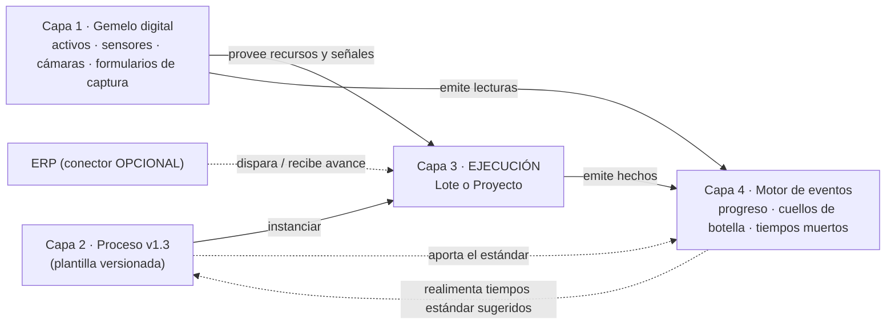
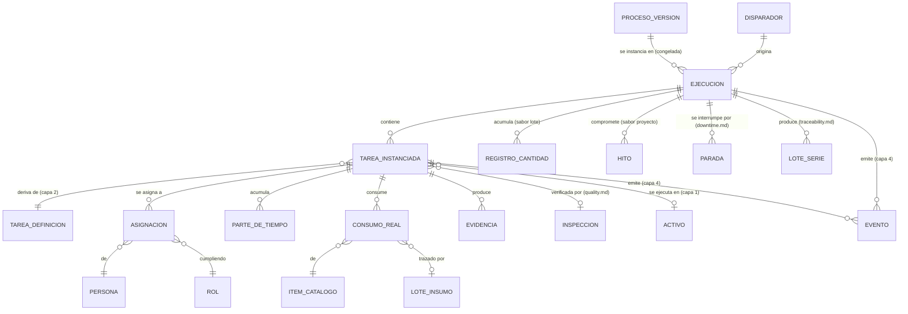
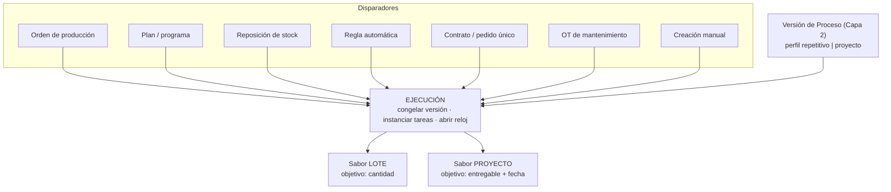
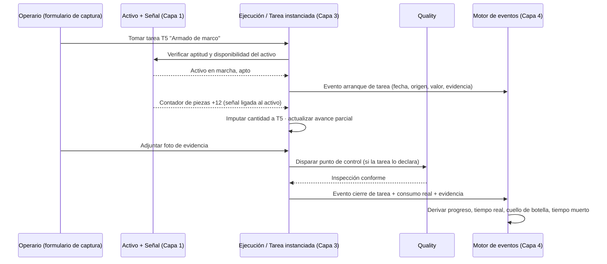

# Ejecución — Lote o Proyecto (Capa 3)

> **Documento:** `specs/specs/execution.md` · **Estado:** Borrador v0.1 · **Actualizado:** 2026-07-13
> **Roles:** Product Manager · Software Architect · UX Designer
> **Relacionados:** [layered-architecture.md](./layered-architecture.md) · [work-model.md](./work-model.md) · [digital-twin.md](./digital-twin.md) · [event-engine.md](./event-engine.md) · [production.md](./production.md) · [quality.md](./quality.md) · [scrap.md](./scrap.md) · [downtime.md](./downtime.md) · [traceability.md](./traceability.md) · [master-data.md](./master-data.md) · [data-model.md](./data-model.md) · [users-permissions.md](./users-permissions.md) · [dashboards.md](./dashboards.md) · [rules-engine.md](./rules-engine.md) · [integrations.md](./integrations.md) · [data-ingestion.md](./data-ingestion.md) · [devices.md](./devices.md) · [glossary.md](./glossary.md)

## Resumen ejecutivo

La **Capa 3** responde a la pregunta operativa por excelencia: **¿qué se está haciendo ahora?** Es la capa donde el conocimiento congelado de la [Capa 2](./work-model.md) se pone en movimiento sobre la planta real de la [Capa 1](./digital-twin.md), y donde se genera el caudal de hechos que la [Capa 4](./event-engine.md) convierte en métricas.

Su entidad central es la **Ejecución (Run)**: **la instancia viva de una versión de Proceso**. Al crearse, una Ejecución congela la versión del Proceso, instancia sus tareas como **tareas instanciadas** (con asignación, estado y tiempos propios), reserva o prevé los insumos, y abre el reloj. A partir de ahí, todo lo que pasa en la planta se imputa a una tarea instanciada de una Ejecución concreta: cuánto se trabajó, quién lo hizo, en qué activo, qué se consumió, qué evidencia quedó y qué controló Calidad.

La Ejecución **generaliza** el concepto de `production_run` ("Corrida de producción") que ya existe en el diseño técnico de Nexo ([`../../design/03-data-schema.md`](../../design/03-data-schema.md)). Aquella corrida era el período de ejecución de una **orden** en una **máquina/turno**: un caso particular —perfectamente válido— de lo que ahora es la Ejecución. Lo que cambia es que la Ejecución ya no depende de que exista una orden, ni de que el trabajo sea repetitivo, ni de que ocurra en una sola máquina.

La Ejecución tiene **dos sabores** con **un solo esqueleto**: **Lote (Batch)**, cuando el objetivo es una **cantidad** de un producto y el trabajo es repetible; y **Proyecto (Project)**, cuando el objetivo es un **entregable único** con **fecha objetivo** e **hitos**. Comparten estado, tareas instanciadas, asignación, tiempos, consumo real, avance, evidencia y cierre. Difieren en el disparador, el objetivo, el criterio de completitud y el set de KPIs. Esa es la contracara operativa de la tesis de la Capa 2: **un proyecto único y una producción repetitiva se ejecutan igual; solo cambia el disparador**.

Finalmente, la Ejecución es **el contextualizador universal del dato**. Un evento sin ejecución es un dato huérfano: se puede almacenar, pero no se puede interpretar. Por eso la regla dura de esta capa es que **todo evento productivo debe poder imputarse a una tarea instanciada**, y cuando no puede, queda explícitamente marcado como **pendiente de imputación** en lugar de perderse o de contaminar los KPIs.

---

## 1. Ubicación en la arquitectura de capas

| Capa | Nombre | Responde a | Documento |
|---|---|---|---|
| 1 | Física — Gemelo digital | ¿Qué existe y qué está midiendo? | [`digital-twin.md`](./digital-twin.md) |
| 2 | Modelo de trabajo — Procesos | ¿Cómo se hace el trabajo? (plantilla) | [`work-model.md`](./work-model.md) |
| **3** | **Ejecución — Lote o Proyecto** | **¿Qué se está haciendo ahora?** (instancia) | **este documento** |
| 4 | Motor de eventos | ¿Qué pasó realmente? (hechos + métricas) | [`event-engine.md`](./event-engine.md) |

**Dependencias.**

| La Capa 3 **usa** de la Capa 2 | La Capa 3 **usa** de la Capa 1 | La Capa 3 **entrega** a la Capa 4 |
|---|---|---|
| La versión de Proceso congelada | Activos/centros de trabajo donde se ejecuta cada tarea | Eventos de arranque, avance, pausa, cierre |
| El DAG de tareas y sus precedencias | Señales/tags para criterios automáticos | Consumo real de insumos |
| Tiempos estándar y pesos de avance | Formularios de captura del operario | Evidencia asociada a cada hecho |
| Insumos estándar y tolerancias | Estado en vivo del activo (marcha/parada) | Asignaciones y tiempos por persona/rol |
| Evidencia requerida y criterios de terminación | Cámaras (evidencia visual) | Excepciones (overrides, omisiones, desvíos) |
| Puntos de control de calidad | Calendario/turnos de la planta | Referencias de trazabilidad (lote/serie) |

---

## 2. La Ejecución (Run)

### 2.1 Definición y generalización de `production_run`

**Definición canónica.** Una **Ejecución (Run)** es la **instancia viva de una versión de Proceso**: el objeto que representa un trabajo concreto en curso, con su propio estado, su propio reloj, sus propias tareas instanciadas y su propio resultado.

| Dimensión | `production_run` (diseño técnico actual) | **Ejecución (Run)** — modelo por capas |
|---|---|---|
| Origen | Siempre una **Orden de producción** | Cualquier **disparador** ([§4](#4-disparadores)) — la orden es uno de ellos |
| Plantilla | Implícita (ruta/operación de la orden) | **Explícita**: una versión de Proceso congelada |
| Unidad de trabajo interna | Registros de producción (incrementos de cantidad) | **Tareas instanciadas** (con estado, asignación y tiempos) + registros de cantidad |
| Recurso | **Una** máquina / **un** turno | **N** recursos y **N** turnos; cada tarea instanciada resuelve el suyo |
| Objetivo | Cantidad producida | Cantidad (**Lote**) o entregable + fecha (**Proyecto**) |
| Duración típica | Horas / un turno | Minutos a meses |
| Perfil admitido | Solo repetitivo | Repetitivo **y** proyecto |
| Consumo de insumos | Implícito (vía BOM del ERP) | **Explícito**: estándar (Capa 2) vs. real (Capa 3) |
| Evidencia | Foto opcional en el registro | **De primera clase**, exigible por tarea |
| Estados | `running` · `paused` · `closed` | Ciclo completo de [§6](#6-ciclo-de-vida-y-estados) |

> **Compromiso de compatibilidad.** El `production_run` **no desaparece ni se contradice**: se relee como **una Ejecución de sabor Lote, disparada por una Orden de producción, cuyo Proceso tiene una sola cadena de tareas y un solo recurso**. Toda la semántica ya especificada en [`production.md`](./production.md) (§5 estados, §7 tiempos/turnos, §10 OEE) sigue vigente sobre ese caso. La generalización agrega grados de libertad; no quita ninguno.

### 2.2 Atributos de la Ejecución

| Atributo conceptual | Descripción | Lote | Proyecto |
|---|---|---|---|
| Identidad / código | Identificador legible (`L-2026-0417`, `PRY-2026-012`). | ✔ | ✔ |
| **Proceso y versión congelada** | Referencia inmutable a la versión de Capa 2 instanciada. | ✔ | ✔ |
| **Sabor** | `lote` \| `proyecto` (deriva del perfil del Proceso). | ✔ | ✔ |
| **Estado** | Ciclo de vida de [§6](#6-ciclo-de-vida-y-estados). | ✔ | ✔ |
| **Disparador** | Tipo + referencia al objeto que la originó ([§4](#4-disparadores)). | ✔ | ✔ |
| Objetivo | Cantidad objetivo + Producto/SKU. | ✔ | — |
| Entregable | Descripción del entregable único + cliente/contrato. | — | ✔ |
| Fechas planificadas | Inicio y fin previstos (de la programación). | ✔ | ✔ |
| Fecha objetivo / compromiso | Fecha comprometida con el cliente. | Opcional | ✔ |
| Fechas reales | Inicio y fin efectivos (derivados de eventos). | ✔ | ✔ |
| Alcance físico | Planta / Sector / Línea / Activos involucrados (Capa 1). | ✔ | ✔ |
| **Tareas instanciadas** | Copia viva de las tareas del Proceso ([§3](#3-tarea-instanciada)). | ✔ | ✔ |
| Responsable general | Persona a cargo de la Ejecución (supervisor / jefe de proyecto). | ✔ | ✔ |
| Equipo asignado | Personas/roles participantes. | ✔ | ✔ |
| **Avance** | % calculado ([§11](#11-avance)). | ✔ | ✔ |
| **Consumo real** | Insumos efectivamente consumidos ([§10](#10-consumo-real-de-insumos)). | ✔ | ✔ |
| Cantidades | Buenas / no conformes / descartadas (definición canónica de [`production.md`](./production.md) §6). | ✔ | Parcial |
| Hitos | Tareas marcadas como hito, con fecha comprometida y estado. | Raro | ✔ |
| Prioridad | Orden relativo frente a otras ejecuciones. | ✔ | ✔ |
| Referencia externa | Correlación con la MO/pedido del ERP, si hay conector. | ✔ | ✔ |
| Evidencia consolidada | Índice de toda la evidencia producida. | ✔ | ✔ |
| Trazabilidad | Lotes/series producidos y consumidos ([`traceability.md`](./traceability.md)). | ✔ | ✔ |
| Motivo de cierre | Normal, forzado, cancelado, con su justificación. | ✔ | ✔ |

### 2.3 Modelo de entidades de la capa

---

## 3. Tarea instanciada

**Definición.** Copia viva de una Tarea del Proceso dentro de una Ejecución. Es **la unidad operativa real**: lo que un operario ve en su tablet, toma, trabaja y cierra. Es también **la unidad de imputación** de tiempo, consumo, evidencia y calidad.

| Atributo | Descripción |
|---|---|
| Referencia a la tarea de la definición | Qué tarea de la versión congelada representa. |
| Ocurrencia | Número de ocurrencia si la tarea es repetible (1 de N). |
| **Estado** | Ciclo de vida de [§6.2](#62-ciclo-de-vida-de-la-tarea-instanciada). |
| **Asignación** | Persona(s) asignada(s) + rol con el que participan. |
| Recurso resuelto | Activo/centro de trabajo concreto de la Capa 1. |
| Fechas planificadas | Inicio/fin previstos, derivados del DAG y de la programación. |
| Fechas reales | Inicio/fin efectivos, derivados de eventos. |
| **Tiempos** | Estándar (heredado) · estimado (ajustable) · **real acumulado** (medido). |
| Tiempo por componente | Preparación · ejecución · espera · control · cierre. |
| **Avance parcial** | % declarado o derivado (cantidad, subtareas, criterio). |
| **Consumo real** | Ítems efectivamente usados, con lote si aplica. |
| **Evidencia adjunta** | Lo que se cargó frente a lo requerido. |
| Resultado de calidad | Referencia a la inspección y su disposición, si hay punto de control. |
| Bloqueos | Motivo por el cual no puede avanzar (falta insumo, falta recurso, espera de aprobación). |
| Desvíos | Diferencia contra el estándar (tiempo, consumo, recurso). |
| Excepciones | Omisión justificada, cierre forzado, reasignación, ad-hoc. |
| Observaciones | Notas del operario/supervisor. |

**Reglas.**

1. Una tarea instanciada **solo puede iniciarse** si todas sus predecesoras están en estado terminal admitido (Completada u Omitida) y venció la demora (lag).
2. El tiempo real **no se declara: se mide**, a partir de eventos de arranque/pausa/fin y de la actividad detectada en el activo. La declaración manual es el fallback.
3. Una tarea instanciada **puede existir sin estar en el Proceso**: es una **tarea ad-hoc**, marcada como desvío ([§9.4](#94-tareas-ad-hoc)).
4. Cerrar una tarea instanciada exige cumplir **criterio de terminación** + **evidencia obligatoria** + **punto de control conforme** (si es bloqueante), salvo cierre forzado con permiso y traza.

---

## 4. Disparadores

El disparador es **lo único que distingue estructuralmente a un lote de un proyecto** en el momento de nacer.

| Disparador | Perfil que dispara | Sabor resultante | Origen | Datos que aporta |
|---|---|---|---|---|
| **Orden de producción** (propia o sincronizada del ERP) | Repetitivo | **Lote** | [`production.md`](./production.md), [`integrations.md`](./integrations.md) | Producto, cantidad planificada, fecha, prioridad, referencia externa |
| **Plan / programa de producción** | Repetitivo | Lote | Planificación interna | Secuencia, fechas, mix de productos |
| **Reposición de stock / punto de pedido** | Repetitivo | Lote | Master data + inventario | Cantidad a reponer |
| **Regla automática** | Repetitivo | Lote | [`rules-engine.md`](./rules-engine.md) | Condición que la disparó |
| **Contrato / pedido único del cliente** | Proyecto | **Proyecto** | Comercial (o ERP si hay conector) | Cliente, entregable, fecha comprometida, hitos, precio |
| **Presupuesto aprobado** | Proyecto | Proyecto | Comercial | Alcance y condiciones |
| **Orden de trabajo de mantenimiento** | Repetitivo o proyecto | Según el caso | Mantenimiento | Activo, criticidad, ventana |
| **Creación manual** | Cualquiera | Cualquiera | Supervisor / planner | Todo a mano (siempre disponible, incluso sin ERP) |

> **Regla canónica.** El **sabor** de la Ejecución **deriva del perfil del Proceso**, no del disparador. Un disparador incompatible con el perfil (p. ej. una orden de producción con cantidad sobre un Proceso de perfil proyecto) se rechaza en la validación E3 ([§14](#14-validaciones)).

---

## 5. Los dos sabores: Lote y Proyecto

### 5.1 Lote (Batch)

**Cuándo.** El trabajo produce **una cantidad** de un producto conocido, es repetible y se mide contra un ritmo esperado.

- **Objetivo:** cantidad de un Producto/SKU (con unidad de medida).
- **Completitud:** cantidad producida ≥ cantidad objetivo (o cierre por decisión).
- **Granularidad de avance:** por **cantidad** producida y por tareas completadas.
- **Duración típica:** de minutos a días; frecuentemente cruza turnos.
- **Relación con turnos:** intensa. El cambio de turno puede segmentar la ejecución sin perder acumulados ([`production.md`](./production.md) §7.3, CB5).
- **Trazabilidad:** produce **lotes/series**; consume lotes de insumo (genealogía).
- **KPIs:** OEE, takt, tiempo de ciclo, scrap rate, FPY, cumplimiento de plan.
- **Ejemplo:** *Ejecución L-2026-0417 — 60 ventanas corredizas A30, Proceso `PRC-VEN-A30` v2.0, línea de armado 1, entrega el viernes.*

### 5.2 Proyecto (Project)

**Cuándo.** El trabajo produce **un entregable único**, con fecha comprometida e hitos, y se mide contra un cronograma.

- **Objetivo:** entregable único, descripto, asociado a un cliente/contrato.
- **Completitud:** todas las tareas obligatorias completadas + hitos cumplidos + acta/aceptación.
- **Granularidad de avance:** por **tareas completadas ponderadas** y por hitos.
- **Duración típica:** de días a meses.
- **Relación con turnos:** débil. Importa el calendario y la disponibilidad de personas, no el turno de máquina.
- **Trazabilidad:** consume lotes de insumo; produce un entregable identificable (no necesariamente serializado).
- **KPIs:** % de avance, desvío de cronograma, ruta crítica, hitos cumplidos, costo real vs. estimado.
- **Ejemplo:** *Ejecución PRY-2026-012 — Frente vidriado Obra Torre Callao, Proceso `PRC-OBRA-FV` v1.0, entrega comprometida 30/11, 3 hitos.*

### 5.3 Tabla comparativa: qué comparten y en qué difieren

| Aspecto | **Lote** | **Proyecto** | ¿Compartido? |
|---|---|---|---|
| Entidad | Ejecución (Run) | Ejecución (Run) | **Compartido** |
| Versión de Proceso congelada | Sí | Sí | **Compartido** |
| Tareas instanciadas con estado | Sí | Sí | **Compartido** |
| Asignación de responsables | Sí | Sí | **Compartido** |
| Tiempos estándar / estimado / real | Sí | Sí | **Compartido** |
| Consumo real de insumos | Sí | Sí | **Compartido** |
| Evidencia por tarea | Sí | Sí | **Compartido** |
| Puntos de control de calidad | Sí | Sí | **Compartido** |
| Ciclo de vida y estados | Sí | Sí | **Compartido** |
| Reprogramación y ejecución parcial | Sí | Sí | **Compartido** |
| Emisión de eventos a Capa 4 | Sí | Sí | **Compartido** |
| Trazabilidad de insumos consumidos | Sí | Sí | **Compartido** |
| **Disparador** | Orden / plan / stock / regla | Contrato / pedido único | **Difiere** |
| **Objetivo** | Cantidad de un SKU | Entregable único | **Difiere** |
| **Criterio de completitud** | Cantidad alcanzada | Tareas + hitos + aceptación | **Difiere** |
| **Cálculo de avance por defecto** | Cantidad producida / objetivo | Tareas ponderadas por tiempo estándar | **Difiere** |
| **Hitos** | Excepcional | **Nativo** | **Difiere** |
| **Fecha comprometida** | Opcional | **Obligatoria** | **Difiere** |
| **Relación con turnos** | Fuerte (segmenta la ejecución) | Débil (calendario de personas) | **Difiere** |
| **Producción de lote/serie** | Habitual | Excepcional | **Difiere** |
| **KPIs primarios** | OEE, takt, ciclo, scrap, FPY | % avance, desvío, ruta crítica, hitos | **Difiere** |
| **Repetición** | N ejecuciones del mismo Proceso | Típicamente 1 | **Difiere** |
| **Sync con ERP** | MO ↔ orden; reporte de producción real | Pedido/proyecto ↔ avance y costos | **Difiere en mapeo** |

> **Conclusión de diseño.** Todo lo que difiere es **configuración, política de cálculo o presentación**. Ninguna diferencia exige un modelo de datos alternativo, un servicio distinto ni un ciclo de vida propio. **Un solo motor de ejecución sirve a los dos sabores.**

---

## 6. Ciclo de vida y estados

### 6.1 Ciclo de vida de la Ejecución

```mermaid
stateDiagram-v2
    [*] --> Borrador : creada por disparador o a mano
    Borrador --> Programada : se congela versión, se instancian tareas, se fijan fechas
    Programada --> Liberada : insumos y recursos verificados; habilitada a planta
    Programada --> Cancelada : se anula antes de arrancar
    Liberada --> EnCurso : primer evento de trabajo (arranque de tarea)
    Liberada --> Cancelada : se anula antes de arrancar
    EnCurso --> Pausada : pausa operativa, parada de máquina, fin de turno
    Pausada --> EnCurso : se reanuda
    EnCurso --> Bloqueada : falta insumo / recurso / aprobación / calidad no conforme
    Bloqueada --> EnCurso : se resuelve el bloqueo
    EnCurso --> Reprogramada : cambio de fechas o de alcance
    Reprogramada --> EnCurso : continúa con el nuevo plan
    EnCurso --> Completada : criterio de completitud alcanzado
    Pausada --> Cerrada : cierre por decisión (parcial)
    Bloqueada --> Cerrada : cierre por decisión (no se puede continuar)
    EnCurso --> Cerrada : cierre por decisión del supervisor
    Completada --> Verificada : control final / aceptación / acta
    Cerrada --> Verificada : control final sobre lo ejecutado
    Verificada --> Sincronizada : reportada al ERP (si hay conector)
    Verificada --> Archivada : sin ERP o sync no aplicable
    Sincronizada --> Archivada
    Cerrada --> Reabierta : reapertura autorizada
    Completada --> Reabierta : reapertura autorizada
    Reabierta --> EnCurso : continúa
    Cancelada --> [*]
    Archivada --> [*]
```

### 6.2 Ciclo de vida de la tarea instanciada

```mermaid
stateDiagram-v2
    [*] --> Pendiente : instanciada al crear la ejecución
    Pendiente --> Lista : predecesoras completas y demora vencida
    Lista --> Asignada : se asigna persona/equipo
    Asignada --> EnCurso : el responsable la inicia
    Lista --> EnCurso : autoasignación al iniciar
    EnCurso --> Pausada : pausa, fin de turno, parada
    Pausada --> EnCurso : reanuda
    EnCurso --> Bloqueada : falta insumo / recurso / aprobación
    Bloqueada --> EnCurso : se resuelve
    EnCurso --> EnControl : criterio cumplido; hay punto de control
    EnControl --> Completada : inspección conforme
    EnControl --> NoConforme : inspección no conforme
    NoConforme --> Retrabajo : disposición retrabajo
    NoConforme --> Completada : concesión autorizada
    NoConforme --> Rechazada : disposición rechazo (a scrap)
    Retrabajo --> EnCurso : se reprocesa
    EnCurso --> Completada : criterio cumplido; sin punto de control
    Pendiente --> Omitida : omisión justificada (tarea opcional/condicional)
    Lista --> Omitida : omisión justificada
    EnCurso --> Cancelada : se anula por cambio de alcance
    Completada --> Reabierta : corrección autorizada
    Reabierta --> EnCurso : continúa
    Completada --> [*]
    Omitida --> [*]
    Rechazada --> [*]
    Cancelada --> [*]
```

### 6.3 Definición de estados de la Ejecución

| Estado | Significado | ¿Acepta trabajo? | ¿Cuenta tiempo? | Transición típica |
|---|---|---|---|---|
| **Borrador** | Creada, sin versión congelada ni fechas firmes. | No | No | Disparador o alta manual |
| **Programada** | Versión congelada, tareas instanciadas, fechas fijadas. | No | No | Programación |
| **Liberada** | Insumos y recursos verificados; habilitada a planta. | Sí (puede arrancar) | No | Liberación del supervisor |
| **En curso** | Al menos una tarea trabajándose. | **Sí** | **Sí** (productivo) | Arranque de tarea |
| **Pausada** | Detenida temporalmente (parada, fin de turno). | No | Sí (no productivo → [`downtime.md`](./downtime.md)) | Parada / cambio de turno |
| **Bloqueada** | No puede avanzar por una causa identificada. | No | Sí (tiempo muerto imputable) | Falta de insumo/recurso/aprobación |
| **Reprogramada** | Cambio de fechas o de alcance aprobado. | Sí | Sí | Replanificación |
| **Completada** | Criterio de completitud alcanzado. | Solo ajustes | No | Meta cumplida |
| **Cerrada** | Cerrada por decisión, con o sin objetivo alcanzado. | No | No | Cierre del supervisor |
| **Verificada** | Control final / aceptación / acta registrada. | No | No | Calidad o cliente |
| **Sincronizada** | Reportada al ERP con éxito. | No | No | Sync Job OK |
| **Archivada** | Terminada y cerrada contablemente. | No | No | Fin del ciclo |
| **Cancelada** | Anulada antes o durante, sin entregar. | No | No | Decisión / cancelación del pedido |
| **Reabierta** | Vuelta a abrir con autorización, tras Completada/Cerrada. | Sí | Sí | Corrección |

> **Relación con Paradas.** El pasaje a **Pausada** por detención de máquina genera un **Downtime Event** ([`downtime.md`](./downtime.md)); el pasaje a **Bloqueada** genera un **tiempo muerto imputable** que la Capa 4 clasifica por causa. Ambos restan a la Disponibilidad en el perfil repetitivo, pero **se cuentan y se explican distinto**: la pausa es del activo, el bloqueo es del flujo de trabajo.

### 6.4 Matriz de autorizaciones de transición

| Transición | Operario | Supervisor | Calidad | Planner / Proyectos | Administrador |
|---|---|---|---|---|---|
| Crear (Borrador) | — | ✔ | — | ✔ | ✔ |
| Programar | — | ✔ | — | ✔ | ✔ |
| Liberar | — | ✔ | — | ✔ | ✔ |
| Iniciar tarea / Ejecución | ✔ | ✔ | — | — | ✔ |
| Pausar / reanudar | ✔ | ✔ | — | — | ✔ |
| Declarar bloqueo | ✔ | ✔ | ✔ | ✔ | ✔ |
| Reasignar responsable | — | ✔ | — | ✔ | ✔ |
| Reprogramar | — | ✔ | — | ✔ | ✔ |
| Omitir tarea | — | ✔ | — | ✔ | ✔ |
| Agregar tarea ad-hoc | — | ✔ | ✔ (de calidad) | ✔ | ✔ |
| Resolver disposición de calidad | — | ✔ (según severidad) | ✔ | — | ✔ |
| Cierre forzado de tarea (override) | — | ✔ | — | — | ✔ |
| Cerrar Ejecución | — | ✔ | — | ✔ | ✔ |
| Verificar / aceptar | — | ✔ | ✔ | ✔ | ✔ |
| Cancelar | — | ✔ | — | ✔ | ✔ |
| Reabrir | — | ✔ (con motivo) | — | — | ✔ |

Detalle y scoping por planta/línea en [`users-permissions.md`](./users-permissions.md).

---

## 7. Asignación de responsables

### 7.1 De rol a persona

La Capa 2 declara **roles**; la Capa 3 los resuelve en **personas**. La resolución puede ocurrir en tres momentos:

| Momento | Modo | Cuándo conviene |
|---|---|---|
| **Al programar** | Asignación anticipada por el supervisor/planner. | Proyectos, trabajo con calificación específica, planificación de capacidad. |
| **Al liberar** | Asignación por turno, a partir de la dotación disponible. | Producción repetitiva con dotación fija. |
| **Al iniciar** | **Autoasignación**: el operario "toma" la tarea desde la tablet. | Planta con equipos polivalentes; reduce carga administrativa. |

### 7.2 Modos de asignación

| Modo | Descripción | Efecto en KPIs |
|---|---|---|
| **Individual** | Una persona responsable de la tarea. | Productividad por persona directa. |
| **Equipo / cuadrilla** | Varias personas, con un referente. | El tiempo se imputa al equipo; se prorratea o se declara por persona (configurable). |
| **Por rol sin nominar** | Queda abierta; la toma quien esté habilitado. | Se atribuye al que la cierra; el tiempo, a quien la trabajó. |
| **Recurso automático** | La ejecuta una máquina; una persona supervisa. | El tiempo lo mide el activo (Capa 1); la responsabilidad es del supervisor. |
| **Externo / tercero** | Proveedor o servicio contratado. | Se mide plazo y costo, no productividad interna. |

### 7.3 Reglas de asignación

1. **Solo se asigna a quien tiene el rol y el alcance (scoping)** sobre esa planta/línea.
2. Si la tarea exige **calificación** (soldador calificado, matriculado), el candidato debe tenerla vigente; si no, la asignación se bloquea con motivo explícito.
3. La **reasignación** es siempre posible con permiso y **conserva el tiempo ya imputado a la persona anterior** (nunca se reescribe la historia).
4. La **delegación temporal** (ausencia, licencia) se resuelve por rol: si nadie la toma, la tarea se marca como **Bloqueada por falta de recurso**, que es un dato valiosísimo para la Capa 4.
5. En captura automática, el operario asignado al activo en ese turno **se atribuye por defecto** (configurable), en coherencia con [`production.md`](./production.md) §7.4.
6. La sobrecarga (misma persona asignada a tareas simultáneas) genera **advertencia**, no bloqueo: la realidad de planta muchas veces la justifica, y ocultarla falsearía el dato.

---

## 8. Programación y reprogramación

### 8.1 Programación inicial

Al pasar de Borrador a Programada, el sistema:

1. **Congela** la versión de Proceso vigente.
2. **Instancia** todas las tareas del DAG (incluidas las condicionales que apliquen según parámetros).
3. **Calcula** fechas planificadas por tarea propagando duraciones estándar/estimadas a través del DAG (hacia adelante desde la fecha de inicio, o hacia atrás desde la fecha comprometida).
4. **Identifica la ruta crítica** y la marca.
5. **Verifica** disponibilidad preliminar de insumos y recursos, y señala faltantes.

### 8.2 Reprogramación

| Tipo de reprogramación | Qué cambia | Efecto sobre lo ya ejecutado | Autorización |
|---|---|---|---|
| **Corrimiento de fechas** | Fecha de inicio/fin planificada. | Ninguno. | Supervisor / Planner |
| **Reordenamiento de recursos** | Qué activo o persona ejecuta cada tarea. | Ninguno sobre lo hecho. | Supervisor |
| **Cambio de prioridad** | Orden relativo frente a otras ejecuciones. | Ninguno. | Planner |
| **Ampliación de alcance** | Se agregan tareas ad-hoc. | Recalcula avance y ruta crítica. | Supervisor / Proyectos |
| **Reducción de alcance** | Se omiten tareas pendientes con justificación. | Recalcula avance; deja traza. | Supervisor / Proyectos |
| **Split de ejecución** | Se divide en dos ejecuciones ([§9.3](#93-división-split-de-una-ejecución)). | Reparte tareas, cantidades y consumos. | Supervisor |
| **Migración de versión de Proceso** | Se adopta una versión superior de la plantilla. | **No retroactivo**: solo afecta tareas aún no iniciadas; requiere autorización explícita. | Planner + Ingeniería |

**Reglas.**

1. **Reprogramar nunca borra historia.** Se conservan las fechas planificadas originales (**baseline**) para poder medir el desvío de cronograma.
2. Cada reprogramación genera un **evento** con motivo, autor y diferencia contra el baseline.
3. Se admite **más de un baseline** (original y revisados); el KPI de desvío indica contra cuál se mide ([`event-engine.md`](./event-engine.md)).
4. La reprogramación **no cambia la versión congelada** del Proceso, salvo migración explícita.

---

## 9. Ejecución parcial

La ejecución parcial no es un caso borde: **es el estado normal de la planta**. El modelo la soporta en cuatro niveles.

### 9.1 Avance parcial de una tarea

| Mecanismo | Descripción | Sabor típico |
|---|---|---|
| **% declarado** | El responsable declara "60 % hecho". Simple, subjetivo. | Proyecto |
| **Por cantidad** | 45 de 60 unidades cortadas. Objetivo y auditable. | Lote |
| **Por subtareas / checklist** | Ítems del checklist tildados. | Ambos |
| **Por tiempo consumido** | Tiempo real / tiempo estándar (con techo del 100 %). Solo como fallback. | Ambos |
| **Automático por señal** | Contador del activo o ciclo de máquina (Capa 1). | Lote |

> **Regla canónica.** El avance por **tiempo consumido** es el método **menos confiable** y solo se usa cuando no hay otro. Nunca debe presentarse como equivalente a los demás en el tablero: la Capa 4 marca el **método de cálculo** junto al valor.

### 9.2 Cantidad parcial en un lote

- Se admite cerrar una Ejecución de sabor Lote con **cantidad menor a la objetivo** (estado **Cerrada**, no Completada), con motivo obligatorio.
- El faltante puede: (a) quedar sin producir, (b) generar una **nueva Ejecución de reposición**, o (c) volcarse a una ejecución existente. La decisión la toma el planner y queda registrada.
- La **sobreproducción** se permite con alerta, en coherencia con [`production.md`](./production.md) V7/CB7.

### 9.3 División (split) de una Ejecución

Cuando una parte del trabajo debe seguir un camino distinto (otra máquina, otra fecha, otro cliente):

1. Se crea una **Ejecución hija** que hereda la misma versión de Proceso.
2. Se reparten **cantidad objetivo**, **tareas pendientes** y **consumos ya realizados** (proporcional o explícito).
3. Ambas quedan **vinculadas** (padre/hija) para trazabilidad y para consolidar KPIs.
4. Lo ya ejecutado **no se reasigna retroactivamente**: queda en la ejecución original.

### 9.4 Tareas ad-hoc

Trabajo real que la plantilla no previó. Se agrega **a la Ejecución**, nunca a la versión publicada del Proceso.

| Atributo | Tratamiento |
|---|---|
| Origen | Marcada como `ad-hoc`, con motivo y autor. |
| Tiempos | Solo estimado y real; **no tiene estándar** (no distorsiona la eficiencia histórica). |
| Avance | Se incorpora al cálculo con peso explícito o por tiempo estimado. |
| Consecuencia | Alimenta la **propuesta de nueva versión** del Proceso en Capa 2 ([`work-model.md`](./work-model.md) CB3). |
| KPI | Cuenta como **desvío de alcance**; se reporta por separado. |

### 9.5 Omisión de tareas

| Situación | Requisito | Traza |
|---|---|---|
| Tarea **opcional** no ejecutada | Justificación breve. | Evento de omisión. |
| Tarea **condicional** que no aplica | Automática por parámetro. | Registro del parámetro. |
| Tarea **obligatoria** omitida | Autorización de supervisor + motivo obligatorio. | Evento de excepción + impacto en avance recalculado. |

---

## 10. Consumo real de insumos

**Principio.** La Capa 2 declara el **consumo estándar**; la Capa 3 registra el **consumo real**; la Capa 4 calcula el **desvío**.

| Concepto | Descripción | Capa |
|---|---|---|
| Consumo estándar | Cantidad teórica por tarea (fija o proporcional). | 2 |
| Consumo previsto | Estándar × cantidad objetivo de la ejecución. | 3 (al programar) |
| **Consumo real** | Lo efectivamente usado, declarado o medido. | **3** |
| Desvío de consumo | Real − previsto, absoluto y porcentual. | 4 |
| Costo real | Consumo real × costo del ítem + mano de obra real. | 4 |

**Métodos de registro del consumo real.**

| Método | Descripción | Confianza |
|---|---|---|
| **Declaración del operario** | Carga en el formulario de captura al cerrar la tarea. | Media |
| **Backflush (retro-consumo)** | Se descuenta el estándar automáticamente al completar la tarea. | Media (asume que no hubo desvío) |
| **Lectura de báscula/sensor** | Peso o volumen medido en la Capa 1. | **Alta** |
| **Escaneo de lote/serie** | Código de barras/QR del insumo consumido. | **Alta** (habilita genealogía) |
| **Ajuste posterior** | Corrección con evento de ajuste trazable, nunca edición destructiva. | Auditada |

**Reglas.**

1. Si el insumo exige **trazabilidad**, el registro del **lote consumido es obligatorio** y alimenta la genealogía de [`traceability.md`](./traceability.md).
2. Un consumo fuera de la **tolerancia** declarada en Capa 2 genera un evento de desvío y, opcionalmente, una alerta ([`rules-engine.md`](./rules-engine.md)).
3. El uso de un **sustituto** admitido se registra con su factor de conversión; el uso de un sustituto **no admitido** requiere autorización y queda como excepción.
4. En modo **standalone**, el descuento de stock es opcional y vive en la master data propia; en modo **conectado**, el consumo se puede reportar al ERP ([`integrations.md`](./integrations.md)).

---

## 11. Avance

**Definición canónica.** El **avance** de una Ejecución es el porcentaje de trabajo completado, calculado como **tareas completadas ponderadas**.

| Método de ponderación | Fórmula conceptual | Cuándo se usa |
|---|---|---|
| **Por tiempo estándar** (por defecto) | Σ (tiempo estándar de tareas completadas) / Σ (tiempo estándar de todas las tareas obligatorias) | Default en ambos sabores |
| **Por peso explícito** | Σ (peso de tareas completadas) / 100 | Cuando el diseñador del Proceso definió pesos |
| **Por cantidad** | Cantidad producida / cantidad objetivo | Sabor Lote, procesos de una sola tarea dominante |
| **Por hitos** | Hitos cumplidos / hitos totales | Vista comercial del sabor Proyecto |
| **Híbrido** | Tareas ponderadas, con avance parcial de la tarea en curso | Vista más precisa; default recomendado |

**Reglas.**

1. Las tareas **omitidas** salen del denominador (no inflan ni deprimen el avance artificialmente); la omisión se reporta aparte.
2. Las tareas **ad-hoc** entran al denominador desde que se agregan, lo que **puede hacer bajar el % de avance**: es correcto y debe explicarse en la UI (el alcance creció).
3. El avance **nunca supera 100 %**. La sobreproducción se reporta como KPI separado.
4. El avance se recalcula ante cada evento relevante y se materializa como **read model** ([`dashboards.md`](./dashboards.md)).
5. El **método de cálculo se muestra siempre** junto al valor. Un 70 % por tiempo consumido y un 70 % por tareas completadas no significan lo mismo.

> El cálculo formal, sus variantes y su relación con cuellos de botella y tiempos muertos se especifican en [`event-engine.md`](./event-engine.md). La Capa 3 **aporta los hechos**; la Capa 4 **calcula la métrica**.

---

## 12. Cierre de la Ejecución

### 12.1 Modos de cierre

| Modo | Condición | Estado resultante | Requisitos |
|---|---|---|---|
| **Cierre normal** | Criterio de completitud alcanzado. | Completada → Verificada | Todas las tareas obligatorias completadas u omitidas con justificación; evidencia obligatoria presente; controles de calidad resueltos. |
| **Cierre parcial** | Se decide cerrar sin alcanzar el objetivo. | Cerrada | Motivo obligatorio; decisión de qué hacer con el faltante. |
| **Cierre forzado** | Hay bloqueos irresolubles o pendientes. | Cerrada | Permiso de supervisor + motivo + evento de excepción. |
| **Cancelación** | El trabajo no se hará. | Cancelada | Motivo; se conservan los consumos y tiempos ya incurridos. |
| **Cierre por vencimiento** | Ejecución inactiva más allá de un umbral. | Cerrada (propuesta) | Sugerido por regla; requiere confirmación humana. |

### 12.2 Checklist de cierre

| # | Verificación | Bloqueante |
|---|---|---|
| 1 | Todas las tareas obligatorias en estado terminal. | Sí (salvo cierre forzado) |
| 2 | Evidencia obligatoria completa. | Sí |
| 3 | Puntos de control bloqueantes resueltos. | Sí |
| 4 | Consumo real registrado (o backflush aplicado). | Configurable |
| 5 | Cantidades buenas / no conformes conciliadas. | Sí (sabor Lote) |
| 6 | Lotes/series producidos declarados. | Si aplica trazabilidad |
| 7 | Hitos cumplidos o justificados. | Sí (sabor Proyecto) |
| 8 | Desvíos de tiempo y consumo revisados. | No (informativo) |
| 9 | Acta de aceptación / conformidad del cliente. | Sí (sabor Proyecto, si el contrato lo exige) |
| 10 | Sincronización con ERP encolada. | No (asíncrono, store-and-forward) |

### 12.3 Después del cierre

- La Ejecución cerrada es **inmutable**: correcciones solo por **evento de ajuste** o por **reapertura autorizada**.
- La **reapertura** deja traza, vuelve el estado a En curso y marca la ejecución como "reabierta" en todos los reportes.
- Los KPIs se consolidan y se comparan contra el estándar de la versión congelada.
- La Capa 4 propone, si corresponde, un **ajuste del tiempo estándar** para la Capa 2 ([`work-model.md`](./work-model.md) §5, CB9).

---

## 13. Interfaces con las otras capas

### 13.1 Cómo la Ejecución consume la Capa 1 (gemelo digital)

La Ejecución **no crea realidad física**: la **usa**. Todo lo que necesita del mundo real lo obtiene del gemelo digital, donde **cada sensor/señal está ligado a un Activo** — regla no negociable de la Capa 1 que es, precisamente, lo que hace posible atribuir hechos a tareas.

| Necesidad de la Ejecución | Qué le da la Capa 1 | Consecuencia |
|---|---|---|
| Dónde se ejecuta cada tarea | Activo / centro de trabajo concreto de la jerarquía Empresa → Planta → Sector → Línea → Activo. | Permite KPIs por recurso y detección de cuellos de botella. |
| Si el recurso está disponible | Estado en vivo del activo (en marcha, detenido, en mantenimiento). | Habilita el arranque o genera bloqueo. |
| Si el recurso es apto | Capacidades y atributos del activo vs. recurso requerido de la tarea. | Validación de compatibilidad. |
| Criterios de terminación automáticos | Señal/tag ligada al activo (ciclo terminado, contador, temperatura alcanzada). | Cierre automático de tarea sin carga manual. |
| Cantidad producida automática | Contador de piezas del activo (delta entre lecturas). | Registro de cantidad sin intervención ([`production.md`](./production.md) §4.2). |
| Evidencia objetiva | Lectura de sensor, frame de cámara. | Evidencia de alta confianza. |
| Captura manual | **Formulario de captura** del operario asociado al activo. | Cantidad, consumo, evidencia y cierre declarados. |
| Marco temporal | Calendario y turnos de la planta. | Segmentación de la ejecución y KPIs por turno. |

> **Terminología (canónica, del brief).** La pantalla donde el operario **ingresa** datos es un **formulario de captura** (Capa 1). **Nunca** se la llama "dashboard": un **tablero/dashboard** es visualización de KPIs y sale de la Capa 4 ([`dashboards.md`](./dashboards.md)).

### 13.2 Cómo la Ejecución alimenta la Capa 4 (motor de eventos)

**Todo lo que ocurre en una Ejecución se expresa como Evento canónico.** El evento lleva, como mínimo, **fecha**, **origen**, **valor** y **evidencia**, además del contexto (tenant, activo, ejecución, tarea, operario, dedup, metadatos). Contrato completo en [`event-engine.md`](./event-engine.md).

| Evento emitido por la Capa 3 | Cuándo | Consumidores principales |
|---|---|---|
| `execution.created` | Al crear la Ejecución (con disparador y versión congelada). | Dashboards, Integrations |
| `execution.scheduled` / `execution.released` | Programación / liberación. | Dashboards, Notifications |
| `execution.state_changed` | Cualquier cambio de estado. | Dashboards, Rules Engine, Integrations |
| `execution.rescheduled` | Reprogramación (con baseline anterior). | Dashboards (desvío de cronograma) |
| `task.assigned` / `task.reassigned` | Asignación de responsable. | Dashboards (productividad por recurso) |
| `task.started` / `task.paused` / `task.resumed` | Reloj de la tarea. | **Motor de eventos** (tiempo real, tiempo muerto) |
| `task.progress_reported` | Avance parcial declarado o derivado. | Motor de eventos (progreso) |
| `task.blocked` / `task.unblocked` | Bloqueo con causa. | **Motor de eventos** (cuellos de botella), Notifications |
| `task.completed` / `task.skipped` / `task.reopened` | Cierre, omisión, reapertura. | Motor de eventos, Traceability |
| `task.evidence_attached` | Evidencia cargada. | Traceability, Files/Media |
| `execution.input_consumed` | Consumo real de insumo (con lote si aplica). | Traceability (genealogía), Costeo |
| `execution.quantity_registered` | Cantidad producida (buenas / no conformes). | **Production** (KPIs, OEE), Dashboards |
| `execution.milestone_reached` | Hito cumplido (sabor Proyecto). | Dashboards, Notifications, Comercial |
| `execution.exception` | Cierre forzado, omisión de tarea obligatoria, sustituto no admitido, sobrecarga. | Rules Engine, Audit |
| `execution.closed` / `execution.cancelled` | Cierre. | Integrations (sync), Dashboards |

| Evento consumido por la Capa 3 | Origen | Efecto |
|---|---|---|
| `machine_event` (arranque/paro) | [`devices.md`](./devices.md) / [`downtime.md`](./downtime.md) | Pausa o reanuda la ejecución/tarea. |
| `reading` (contador, medición) | [`data-ingestion.md`](./data-ingestion.md) | Alimenta criterio de terminación y cantidad. |
| `quality.disposition` | [`quality.md`](./quality.md) | Resuelve el punto de control; reclasifica buenas/no conformes. |
| `scrap.registered` | [`scrap.md`](./scrap.md) | Ajusta cantidades y consumo. |
| `downtime.registered` | [`downtime.md`](./downtime.md) | Imputa tiempo no productivo a la ejecución. |
| Alerta de regla | [`rules-engine.md`](./rules-engine.md) | Puede bloquear, notificar o disparar tarea de inspección. |
| Actualización de MO / pedido | [`integrations.md`](./integrations.md) | Cambia cantidad, fecha o cancela (según dirección de verdad). |

**Métricas que la Capa 4 deriva de estos eventos** (definición formal en [`event-engine.md`](./event-engine.md)):

| Métrica | Qué eventos la alimentan | Perfil |
|---|---|---|
| **Progreso** | `task.completed`, `task.progress_reported`, `execution.quantity_registered` | Ambos |
| **Cuellos de botella** | `task.blocked`, colas de tareas Listas por recurso, tiempo de espera acumulado | Ambos |
| **Tiempos muertos** | Ventanas sin eventos productivos dentro del período planificado, `task.blocked`, `downtime.registered` | Ambos |
| **Productividad por recurso** | `task.started/completed` + asignación + tiempo estándar | Ambos |
| **Costo real vs. estimado** | `execution.input_consumed` + tiempo real por rol | Ambos |
| **OEE, takt, ciclo, scrap, FPY** | `execution.quantity_registered`, calidad, paradas | **Repetitivo** |
| **Desvío de cronograma, ruta crítica, hitos** | Fechas planificadas vs. reales, `execution.milestone_reached`, `execution.rescheduled` | **Proyecto** |

> **Frontera declarada — no duplicar.** La **ingesta y normalización** viven en [`data-ingestion.md`](./data-ingestion.md); el **almacenamiento inmutable y la genealogía**, en [`traceability.md`](./traceability.md); las **automatizaciones y alertas**, en [`rules-engine.md`](./rules-engine.md); la **visualización**, en [`dashboards.md`](./dashboards.md). Este documento define **qué hechos produce y consume la Ejecución**, no cómo se transportan, guardan ni grafican.

### 13.3 Regla del dato huérfano

> **Todo evento productivo debe poder imputarse a una tarea instanciada de una Ejecución.**

Cuando no puede (una máquina cuenta piezas sin ejecución activa; un operario registra trabajo sin haber tomado tarea), el evento **no se descarta ni se fuerza**: se marca como **pendiente de imputación** y aparece en una bandeja donde el supervisor lo asigna. Generaliza el caso CB4 de [`production.md`](./production.md) ("producción sin orden activa"). Es un requisito de honestidad del dato: **es preferible un hecho sin dueño y visible, que un hecho asignado mal y silencioso**.

---

## 14. Validaciones

| # | Validación | Tipo | Acción ante fallo |
|---|---|---|---|
| E1 | La Ejecución referencia una versión de Proceso **Publicada** al momento de crearse. | Referencial | Bloquear creación |
| E2 | La versión congelada **no cambia** después de programar (salvo migración autorizada). | Inmutabilidad | Rechazo |
| E3 | El disparador es compatible con el perfil del Proceso (orden→repetitivo, contrato→proyecto). | Semántica | Rechazo con explicación |
| E4 | Sabor Lote: cantidad objetivo y producto declarados. | Completitud | Bloquear programación |
| E5 | Sabor Proyecto: entregable y fecha comprometida declarados. | Completitud | Bloquear programación |
| E6 | Una tarea no inicia si sus predecesoras no están en estado terminal admitido. | Precedencia | Bloquear inicio; explicar qué falta |
| E7 | La demora (lag) declarada en la precedencia venció. | Temporal | Bloquear inicio; mostrar cuándo se habilita |
| E8 | El responsable asignado tiene rol, alcance y calificación requeridos. | Autorización | Rechazo (403 de negocio) |
| E9 | El activo asignado es apto para la tarea (recurso requerido). | Semántica | Advertencia; confirmación de supervisor |
| E10 | No se cierra una tarea sin cumplir criterio de terminación. | Negocio | Bloquear cierre (override con permiso + traza) |
| E11 | No se cierra una tarea sin la evidencia obligatoria. | Negocio | Bloquear cierre |
| E12 | Punto de control bloqueante no conforme impide avanzar en esa rama del DAG. | Calidad | Bloquear; exigir disposición |
| E13 | Cantidades no negativas; `buenas + no conformes` coherente con el total automático (tolerancia %). | Conciliación | Marcar discrepancia; evento de ajuste |
| E14 | Consumo real fuera de tolerancia genera desvío. | Negocio | Registrar desvío; alertar según regla |
| E15 | Insumo con trazabilidad exige lote consumido registrado. | Integridad | Bloquear cierre de tarea |
| E16 | Timestamp dentro de turno válido y no futuro. | Temporal | Rechazo / cuarentena |
| E17 | Dedup por `dedup_key` del Evento. | Idempotencia | Descartar duplicado silenciosamente |
| E18 | Omitir tarea obligatoria requiere autorización y motivo. | Autorización | Bloquear sin permiso |
| E19 | Cierre forzado exige motivo y genera evento de excepción. | Auditoría | Bloquear sin motivo |
| E20 | Reapertura requiere permiso y deja la ejecución marcada como reabierta. | Auditoría | Bloquear sin permiso |
| E21 | La Ejecución opera siempre dentro del alcance (planta/línea) del usuario. | Autorización | Rechazo |
| E22 | Nunca se edita destructivamente un hecho ya registrado: solo evento de ajuste. | Inmutabilidad | Rechazo |
| E23 | No se calcula OEE para ejecuciones de sabor Proyecto. | Coherencia de KPI | Ocultar la métrica (no mostrar cero) |
| E24 | Evento productivo sin ejecución/tarea → pendiente de imputación. | Integridad | Encolar en bandeja; nunca descartar |

---

## 15. Personas y permisos

| Persona | Interacción con la Capa 3 |
|---|---|
| **Operario** | Ve sus tareas, las toma, registra avance/cantidad/consumo, adjunta evidencia, declara bloqueos, cierra tareas. Es el usuario de mayor volumen. |
| **Supervisor** | Libera, asigna, reasigna, reprograma, autoriza omisiones y cierres forzados, resuelve bloqueos y discrepancias, cierra ejecuciones. |
| **Producción (planner)** | Programa, prioriza, gestiona el mix de ejecuciones, decide sobre faltantes y splits. |
| **Proyectos / Comercial** | Dispara ejecuciones desde contratos, sigue hitos y fecha comprometida, gestiona la aceptación del cliente. |
| **Calidad** | Ejecuta puntos de control, resuelve disposiciones, agrega tareas de inspección ad-hoc. |
| **Mantenimiento** | Interviene en pausas por parada; ejecuta sus propias ejecuciones de mantenimiento. |
| **Gerencia** | Ve avance, desvíos, cuellos de botella y costo en [`dashboards.md`](./dashboards.md). No opera. |
| **Administrador (tenant)** | Configura políticas de cierre, evidencia, autorizaciones y métodos de avance. |
| **Integraciones** | Configura y monitorea el sync de ejecuciones con el ERP, si existe. |

Permisos específicos de la capa: `ejecucion.ver`, `ejecucion.crear`, `ejecucion.programar`, `ejecucion.liberar`, `ejecucion.reprogramar`, `ejecucion.cerrar`, `ejecucion.cancelar`, `ejecucion.reabrir`, `tarea.tomar`, `tarea.asignar`, `tarea.cerrar`, `tarea.cerrar_forzado`, `tarea.omitir`, `tarea.agregar_adhoc`. Matriz completa en [`users-permissions.md`](./users-permissions.md).

---

## 16. Casos borde

| # | Caso | Tratamiento propuesto |
|---|---|---|
| CB1 | **Cambio de turno a mitad de ejecución** | La ejecución continúa; el tiempo se segmenta por turno para KPIs. Coherente con [`production.md`](./production.md) CB5. |
| CB2 | **Máquina cuenta piezas sin ejecución activa** | Evento **pendiente de imputación**; el supervisor lo asigna después ([§13.3](#133-regla-del-dato-huérfano)). |
| CB3 | **Operario trabaja sin haber tomado la tarea** | Se detecta actividad en el activo; se sugiere imputación al abrir la tablet. |
| CB4 | **Dos personas trabajan la misma tarea en paralelo** | Permitido si la tarea es paralelizable; el tiempo se imputa a ambas y se marca solapamiento. |
| CB5 | **Tarea bloqueada por falta de insumo** | Estado Bloqueada con causa; tiempo muerto imputable a abastecimiento; alerta al planner. |
| CB6 | **Punto de control no conforme en una rama paralela** | Se bloquea solo esa rama; las demás siguen. El avance refleja el bloqueo. |
| CB7 | **Se descubre trabajo no previsto** | Tarea ad-hoc ([§9.4](#94-tareas-ad-hoc)); propuesta de nueva versión del Proceso. |
| CB8 | **Se publica una versión nueva del Proceso con 30 ejecuciones abiertas** | Ninguna cambia. Migración opcional, solo para tareas no iniciadas y con autorización. |
| CB9 | **Reprogramación repetida (proyecto que se corre 5 veces)** | Se conservan todos los baselines; el desvío se mide contra el original y contra el último, ambos visibles. |
| CB10 | **Cliente cancela un proyecto a mitad de camino** | Estado Cancelada; se conservan tiempos y consumos incurridos (base para facturar avance). |
| CB11 | **Tablet offline durante horas** | Cola local; al reconectar, ingesta con `dedup_key` respetando el orden temporal ([`production.md`](./production.md) CB9). |
| CB12 | **Ejecución que cruza plantas** | Cada tarea instanciada resuelve su recurso; los KPIs se agregan por planta y por ejecución. |
| CB13 | **Sobreproducción en un lote** | Permitida con alerta; el exceso se marca para el planner (coherente con V7/CB7 de Producción). |
| CB14 | **Retrabajo que recupera una pieza** | Tarea de retrabajo (instanciada o ad-hoc); reclasificación vía `quality.disposition`; **no** suma a "buenas a la primera" (FPY). |
| CB15 | **Ejecución olvidada abierta semanas** | Regla de inactividad propone cierre; requiere confirmación humana. |
| CB16 | **ERP caído al cerrar** | Cierre local normal; sync encolada con store-and-forward ([`integrations.md`](./integrations.md)). |
| CB17 | **Ejecución sin ERP en absoluto (standalone)** | Camino nominal: la ejecución nace de un disparador interno y nunca sale del sistema. |
| CB18 | **Tarea con espera técnica larga (curado 24 h)** | Estado propio de espera; **no** cuenta como tiempo muerto ni como bloqueo ([`work-model.md`](./work-model.md) CB14). |
| CB19 | **Persona asignada renuncia con tareas en curso** | Reasignación; el tiempo ya imputado permanece atribuido a la persona anterior. |
| CB20 | **Ejecución hija creada por split** | Vinculación padre/hija; KPIs consolidables y desagregables. |
| CB21 | **Evidencia obligatoria imposible (cámara rota)** | Bloqueo del cierre; excepción autorizada por supervisor con motivo, que queda auditada. |
| CB22 | **Dos ejecuciones compiten por el mismo activo** | Se resuelve por prioridad; la perdedora queda Bloqueada por recurso — insumo directo del KPI de cuello de botella. |

---

## 17. Requisitos no funcionales de la capa

- **Multi-tenant DB-per-tenant.** Toda Ejecución es dato operativo del tenant y vive en su DB ([`multi-tenancy.md`](./multi-tenancy.md)).
- **Tiempo real.** De la acción en planta al tablero, pocos segundos (CQRS / read models).
- **Offline-first.** La tablet debe poder tomar, trabajar y cerrar tareas sin red, con cola local y `dedup_key` al reconectar.
- **Inmutabilidad y auditoría.** Ninguna edición destructiva: correcciones por evento de ajuste; historial completo en [`traceability.md`](./traceability.md).
- **Escala.** Millones de eventos/día; la imputación evento→tarea debe resolverse sin bloquear la ingesta ([`scalability.md`](./scalability.md)).
- **Independencia del ERP.** Toda ejecución debe poder nacer, vivir y cerrarse sin conexión al ERP.
- **Usabilidad en planta.** La vista del operario es "mis tareas ahora": mínima cantidad de toques para tomar, avanzar y cerrar ([`ui-ux.md`](./ui-ux.md), [`mockups.md`](./mockups.md)).
- **Concurrencia.** Varias personas operando la misma ejecución simultáneamente, con resolución determinista de conflictos.

---

## Preguntas abiertas

1. **Granularidad de la tarea instanciada en el MVP.** ¿Se instancian todas las tareas del DAG al programar (recomendado, habilita ruta crítica y avance), o se instancian perezosamente a medida que se habilitan? Impacta volumen y rendimiento del tablero.
2. **Formalización de `production_run`.** Confirmar que la **Ejecución** reemplaza y generaliza a `production_run` en [`data-model.md`](./data-model.md) y en el esquema técnico ([`../../design/03-data-schema.md`](../../design/03-data-schema.md), decisión DS-01/MOD-01), y definir la ruta de convivencia con lo ya implementado.
3. **Método de avance por defecto.** ¿Híbrido (tareas ponderadas + avance parcial de la tarea en curso) para ambos sabores, o por cantidad en Lote y por tareas en Proyecto? Impacta la comparabilidad entre ejecuciones.
4. **Ejecución sin Proceso.** ¿Se permite una ejecución "libre" (sin plantilla, solo tareas ad-hoc) para trabajos improvisados, o se exige siempre un Proceso, aunque sea de una sola tarea?
5. **Sabores en el MVP.** ¿El MVP incluye el sabor Proyecto o solo Lote? Depende de la definición del piloto (ver PRD-02 en [`open-questions-board.md`](../open-questions-board.md)).
6. **Turnos en el sabor Proyecto.** ¿Se aplica el calendario de turnos a las ejecuciones de proyecto (montaje en obra), o se usa un calendario de personas/recursos distinto?
7. **Imputación de tiempo en equipos.** Cuando una cuadrilla trabaja una tarea, ¿el tiempo se declara por persona, se prorratea automáticamente, o se imputa al equipo como unidad?
8. **Migración de versión con ejecución abierta.** ¿Se ofrece migración asistida a una versión superior del Proceso, y con qué reglas para tareas ya iniciadas?
9. **Costeo de la ejecución.** ¿El costo real (consumo + mano de obra) se calcula en la Capa 4 desde el MVP, o se difiere hasta tener master data de costos consolidada ([`master-data.md`](./master-data.md))?
10. **Reserva de insumos.** ¿La programación **reserva** insumos (compromete stock) o solo verifica disponibilidad? En modo standalone esto exige un modelo de inventario propio.
11. **Bandeja de pendientes de imputación.** ¿Quién la revisa, con qué frecuencia y qué pasa con lo que nunca se imputa (se descarta, se agrega a una ejecución "genérica", queda como no atribuido en los KPIs)?
12. **Sync de proyectos con el ERP.** Con conector activo, ¿un proyecto se mapea a un pedido de venta, a un proyecto del ERP, o no se mapea y solo se reportan costos? Impacta [`integrations.md`](./integrations.md) y la decisión INT-01.
13. **Cancelación con costo incurrido.** ¿Cómo se reporta y valoriza el trabajo incurrido en una ejecución cancelada (base de facturación por avance)?
14. **Límite de concurrencia por activo.** ¿Un activo puede estar asignado a dos tareas de ejecuciones distintas al mismo tiempo (multitarea real), o el sistema lo impide?
