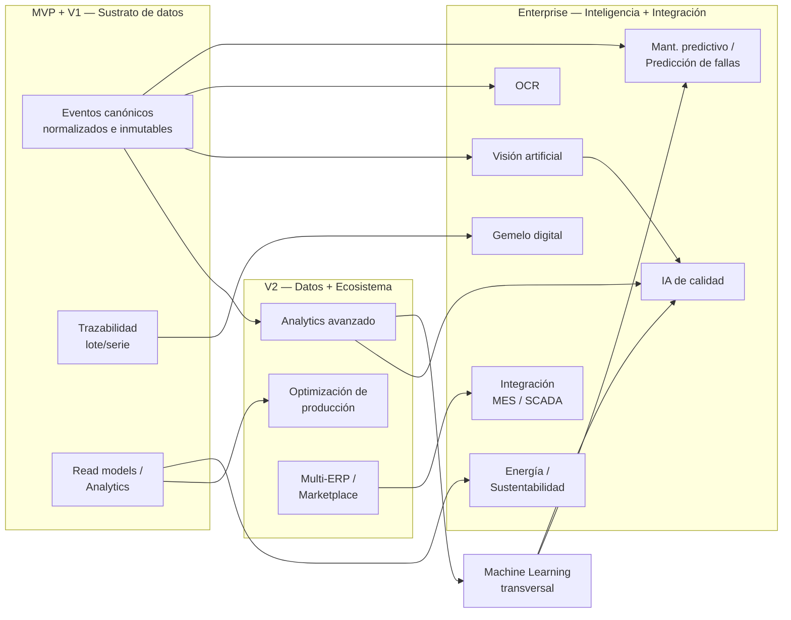

# Funcionalidades futuras — Plataforma "Nexo"

> **Documento:** `specs/specs/future-features.md` · **Estado:** Borrador v0.1 · **Actualizado:** 2026-07-11
> **Roles:** Product Manager · Software Architect · UX Designer
> **Relacionados:** [product.md](./product.md) · [architecture.md](./architecture.md) · [quality.md](./quality.md) · [downtime.md](./downtime.md) · [devices.md](./devices.md) · [integrations.md](./integrations.md) · [dashboards.md](./dashboards.md) · [traceability.md](./traceability.md) · [glossary.md](./glossary.md) · [open-questions.md](./open-questions.md) · [roadmap](../roadmap/roadmap.md) · [idea](../idea.md)

## Resumen ejecutivo

Este documento reúne las **funcionalidades futuras** de "Nexo" que quedan **fuera del MVP** y que, en su mayoría, corresponden a las fases **V2** y **Enterprise** del [roadmap](../roadmap/roadmap.md). El objetivo es doble: (1) dar visibilidad de hacia dónde evoluciona el producto para que las decisiones de arquitectura del MVP **no cierren puertas** (event-driven, eventos canónicos inmutables, DB-per-tenant, servicio compartido de **AI / Computer Vision** ya previsto en la lista canónica de microservicios); y (2) documentar para cada capacidad su **descripción, valor de negocio, prerrequisitos y fase sugerida**.

La tesis de fondo: el MVP construye el **activo estratégico** que habilita todo lo demás —un flujo de **eventos normalizados, contextualizados y trazables**—. Sobre ese sustrato de datos limpios se apoyan las capacidades avanzadas (IA de calidad y mantenimiento predictivo, visión artificial, OCR, gemelo digital, analytics y ML, optimización de producción, energía y sustentabilidad, e integraciones con MES/SCADA existentes). Sin datos consistentes, ninguna de estas funciones entrega valor real; por eso se posicionan **después** de que la captura y la trazabilidad estén maduras.

Ninguna de estas funcionalidades debe adelantarse al MVP. Se listan como **north star** para alinear expectativas comerciales y guardarraíles de arquitectura. Las dependencias y dudas asociadas se consolidan en [open-questions.md](./open-questions.md).

> **Convención de fases** (ver [roadmap](../roadmap/roadmap.md)):
> **MVP** → captura básica + Odoo · **V1** → reglas, notificaciones, reportes, trazabilidad, más protocolos · **V2** → marketplace, multi-ERP, analytics avanzado · **Enterprise** → IA/visión, predictivo, gemelo digital, energía/sustentabilidad, integración MES/SCADA.

---

## 1. Panorama de capacidades futuras

---

## 2. Catálogo de funcionalidades futuras

| # | Funcionalidad | Descripción | Valor de negocio | Prerrequisitos | Fase sugerida |
|---|---------------|-------------|------------------|----------------|---------------|
| F-01 | **IA para calidad** | Modelos que detectan patrones de defectos y anticipan no conformidades a partir de inspecciones, variables de proceso y **SPC**, sugiriendo causas raíz y disposiciones. | Menos scrap y retrabajo; mejora de **FPY**; decisiones de calidad proactivas en lugar de reactivas. | Historial suficiente de [quality.md](./quality.md) (inspecciones, defectos, motivos), eventos canónicos limpios, servicio **AI / Computer Vision**, etiquetado de datos. | **Enterprise** |
| F-02 | **IA para mantenimiento predictivo** | Predice degradación y necesidad de intervención de activos usando lecturas de sensores, paradas históricas y patrones de **MTBF/MTTR**. | Reduce paradas no planificadas; extiende vida útil; optimiza repuestos y **Disponibilidad** (OEE). | Series temporales de sensores densas ([devices.md](./devices.md)), historial de paradas ([downtime.md](./downtime.md)), plataforma ML, feature store. | **Enterprise** |
| F-03 | **Visión artificial (Computer Vision)** | Inspección automática por imagen desde cámaras IP/USB para detectar defectos, contar piezas, verificar ensamble y leer estados. | Control 100% en línea (vs. muestreo); detección temprana; libera operarios de inspección repetitiva. | Cámaras registradas como **Dispositivo**, storage de **Files/Media** por tenant, servicio **AI / Computer Vision**, dataset etiquetado, cómputo (edge/nube). | **Enterprise** |
| F-04 | **OCR (reconocimiento óptico de caracteres)** | Lectura automática de displays, etiquetas, lotes, remitos y documentos en papel para convertirlos en **Eventos** sin tipeo manual. | Elimina carga manual de datos que hoy no tienen protocolo digital; captura desde equipos "cerrados". | Captura de imagen ([devices.md](./devices.md)), pipeline de visión, normalización a evento canónico ([data-ingestion.md](./data-ingestion.md)). | **Enterprise** (piezas útiles ya en V2) |
| F-05 | **Gemelo digital (Digital Twin)** | Réplica virtual de líneas/máquinas alimentada en tiempo real para simular, visualizar y experimentar escenarios ("what-if"). | Optimización sin riesgo en planta real; formación; diagnóstico y planificación de cambios. | Trazabilidad y modelo de planta consolidados ([traceability.md](./traceability.md), [data-model.md](./data-model.md)), eventos en tiempo real, motor de simulación. | **Enterprise** |
| F-06 | **Analytics avanzado** | Análisis multidimensional, correlaciones, benchmarking entre plantas/líneas, detección de anomalías y explicabilidad de KPIs más allá de los dashboards estándar. | Insights accionables; comparación entre sitios; base para decisiones de mejora continua. | **Read models** maduros y **CQRS** ([dashboards.md](./dashboards.md)), data warehouse/lakehouse por tenant, gobierno de datos. | **V2** |
| F-07 | **Machine Learning (plataforma transversal)** | Infraestructura de ML reutilizable (feature store, entrenamiento, despliegue, monitoreo de modelos) que sustenta F-01, F-02, F-03, F-09, F-11. | Acelera y estandariza todas las capacidades de IA; evita silos de modelos; MLOps. | Volumen y calidad de datos, servicio **AI / Computer Vision**, cómputo, gobierno de modelos, aislamiento por tenant. | **V2** (base) → **Enterprise** (casos) |
| F-08 | **Optimización de producción** | Recomendaciones de secuenciación, balanceo de líneas, reducción de cambios de formato y sugerencias para acercar **Cycle time** al **Takt time**. | Más throughput con los mismos recursos; menos tiempos muertos; mejora de OEE. | Datos de producción y paradas ([production.md](./production.md), [downtime.md](./downtime.md)), órdenes desde ERP ([integrations.md](./integrations.md)), analytics. | **V2** → **Enterprise** |
| F-09 | **Predicción de fallas** | Alertas anticipadas de fallo de componentes/procesos combinando umbrales, tendencias y ML sobre señales y eventos. | Evita interrupciones costosas; convierte mantenimiento correctivo en condicional. | Series temporales, historial de fallas ([downtime.md](./downtime.md)), **Rules Engine** ([rules-engine.md](./rules-engine.md)) + ML (F-07). | **Enterprise** |
| F-10 | **Energía** | Monitoreo de consumo energético por línea/máquina/turno, correlación con producción e indicadores de eficiencia energética (energía por unidad producida). | Reducción de costos energéticos; identificación de derroche; base para eficiencia. | Medidores/sensores de energía ([devices.md](./devices.md)), eventos canónicos, dashboards ([dashboards.md](./dashboards.md)). | **Enterprise** (piloto posible en V2) |
| F-11 | **Sustentabilidad** | Cálculo de huella (energía, agua, residuos/scrap), reporting ESG y trazabilidad ambiental por producto/lote. | Cumplimiento y reporting ESG; ventaja comercial; presión regulatoria creciente. | Datos de energía (F-10), scrap ([scrap.md](./scrap.md)), trazabilidad ([traceability.md](./traceability.md)), factores de conversión y estándares ESG. | **Enterprise** |
| F-12 | **Integración con MES existentes** | Conectores para intercambiar datos con sistemas MES ya instalados (coexistencia/complemento, no reemplazo). | Reduce fricción de adopción en plantas con MES legacy; posiciona a "Nexo" como capa de captura/contextualización. | **ACL** y contrato de conector genérico ([integrations.md](./integrations.md)), **Marketplace**, mapeos por sistema. | **Enterprise** |
| F-13 | **Integración con SCADA** | Conectores hacia sistemas **SCADA** existentes para ingerir/contextualizar sus datos y complementar la supervisión con captura y trazabilidad. | Aprovecha infraestructura instalada; evita duplicar cableado/sensores; acelera time-to-value. | Adapters de protocolo maduros (OPC UA/Modbus), edge robusto ([devices.md](./devices.md), [data-ingestion.md](./data-ingestion.md)), ACL. | **Enterprise** (algunos protocolos ya en V1) |

---

## 3. Prerrequisitos transversales (habilitadores comunes)

Casi todas las capacidades de arriba comparten un conjunto de habilitadores que deben madurar antes:

| Habilitador | Por qué es prerrequisito | Se construye en |
|-------------|--------------------------|-----------------|
| **Eventos canónicos limpios y densos** | La IA/ML y el analytics valen lo que valen los datos de entrada. | MVP/V1 — [data-ingestion.md](./data-ingestion.md), [data-model.md](./data-model.md) |
| **Trazabilidad lote/serie consolidada** | Base del gemelo digital, sustentabilidad y análisis de causa raíz. | V1 — [traceability.md](./traceability.md) |
| **Read models / CQRS maduros** | Sustentan analytics avanzado, optimización y energía. | V1/V2 — [dashboards.md](./dashboards.md), [architecture.md](./architecture.md) |
| **Servicio AI / Computer Vision + plataforma ML (MLOps)** | Infra común para F-01, F-02, F-03, F-09, F-11; con aislamiento por tenant. | V2 — servicio canónico **AI / Computer Vision** ([architecture.md](./architecture.md)) |
| **ACL y contrato de conector genérico** | Habilita multi-ERP y las integraciones con MES/SCADA existentes. | V2 — [integrations.md](./integrations.md) |
| **Storage de media por tenant** | Necesario para visión y OCR (imágenes/evidencias). | MVP+ — servicio **Files / Media** |
| **Cómputo edge/nube y timestamping fiable** | Visión en línea y predictivo requieren latencia y sincronía temporales. | V1/Enterprise — [devices.md](./devices.md) |

> **Guardarraíl de arquitectura:** aunque estas funciones son futuras, el MVP debe preservar la **inmutabilidad y el esquema del evento canónico** ([glossary.md](./glossary.md) §2, "Evento") y el **aislamiento por tenant** ([multi-tenancy.md](./multi-tenancy.md)) para no bloquearlas. Ver decisiones relacionadas en [open-questions.md](./open-questions.md) (AR-04, MT-03, ED-06).

---

## 4. Relación con el roadmap

- Estas funcionalidades **no** están en el MVP (ver "Fuera del MVP" en [product.md](./product.md) y el brief de fundamentos).
- La secuencia sugerida —**Analytics avanzado y base de ML en V2**, **IA/visión/predictivo/gemelo/energía/sustentabilidad e integraciones MES-SCADA en Enterprise**— sigue el [roadmap](../roadmap/roadmap.md). Cada ítem debe entrar al [backlog](../roadmap/backlog.md) con priorización MoSCoW, dependencias y riesgos cuando se planifique su fase.
- Los enlaces a los módulos afectados permiten rastrear qué dominio evoluciona para habilitar cada capacidad.

---

## Preguntas abiertas

Estas dudas se consolidan en [open-questions.md](./open-questions.md):

1. **Dónde corre la IA/visión:** ¿inferencia en el **edge**, en la nube, o híbrida, según latencia y privacidad? (relacionado con ED-01, ED-06).
2. **Datos para entrenar:** ¿los modelos se entrenan **por tenant** (aislado), de forma **federada**, o con datos agregados anonimizados? Impacto en privacidad y en calidad del modelo (relacionado con MT-06, SE-06).
3. **Estándares ESG:** ¿qué marco de sustentabilidad/reporting se adopta (GHG Protocol, ISO 14000, ESRS) para F-11?
4. **Alcance del gemelo digital:** ¿visualización + simulación completa, o solo réplica de estado en tiempo real como primer paso?
5. **Priorización Enterprise:** entre IA de calidad (F-01), predictivo (F-02) y visión (F-03), ¿cuál es el primer diferenciador a construir según demanda de clientes?
6. **Coste vs. valor de la IA:** ¿qué umbral de volumen/calidad de datos justifica activar cada capacidad para que no sea "IA de vitrina"?
