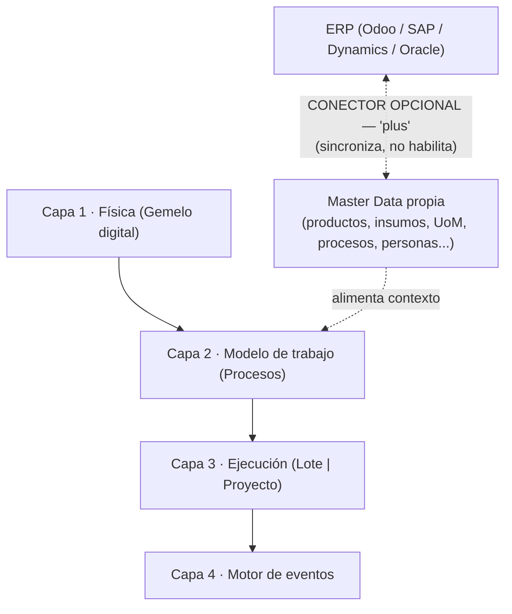
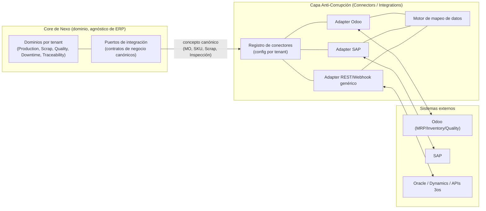
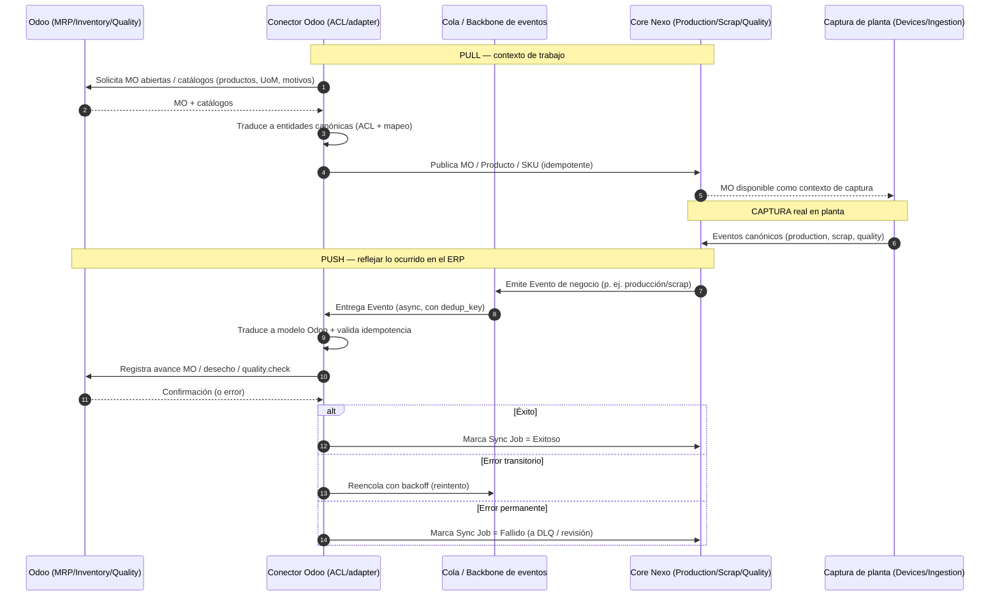
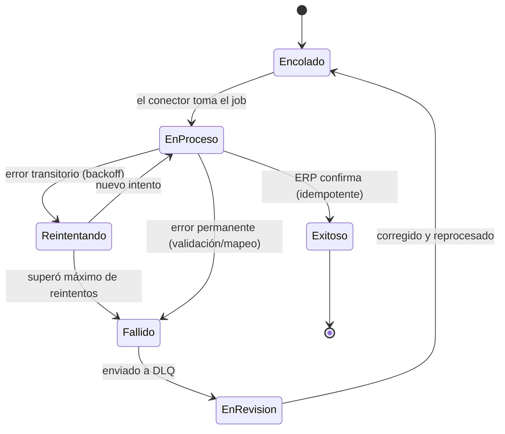
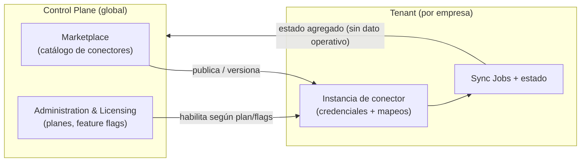

# Integraciones y Conectores (Connectors / Integrations)

> **Documento:** `specs/specs/integrations.md` · **Estado:** Borrador v0.1 · **Actualizado:** 2026-07-13
> **Roles:** Product Manager · Software Architect · UX Designer
> **Relacionados:** [layered-architecture.md](./layered-architecture.md) · [master-data.md](./master-data.md) · [architecture.md](./architecture.md) · [control-plane.md](./control-plane.md) · [data-ingestion.md](./data-ingestion.md) · [devices.md](./devices.md) · [security.md](./security.md) · [data-model.md](./data-model.md) · [glossary.md](./glossary.md)

## Resumen ejecutivo

El dominio **Connectors / Integrations** es la frontera controlada entre el **Core de negocio de Nexo** y el mundo exterior de los sistemas de gestión (ERPs como Odoo, SAP, Dynamics, Oracle) y sistemas/protocolos de terceros (APIs REST, MQTT, OPC UA, Modbus, Webhooks). Su principio fundacional, tomado del brief de fundamentos (§1 y §5.5), es que **el core NUNCA depende de un ERP**: el dominio de Nexo modela producción, scrap, calidad, paradas y trazabilidad en **términos propios y canónicos**, y cada integración se resuelve mediante un **Conector** que actúa como **Anti-Corruption Layer (ACL)**, traduciendo entre el lenguaje del sistema externo y el lenguaje interno de Nexo.

Esta arquitectura basada en conectores es la que hace realidad la promesa de producto: Nexo es un **sistema de ejecución y trazabilidad del trabajo en planta** que funciona **por sí solo**, y la integración con el ERP es un **acelerador, no su razón de ser**. Odoo es el **primer** conector soportado y el más detallado en este documento, pero el diseño garantiza que agregar SAP, Dynamics u Oracle sea **sumar un adapter**, no **reescribir el dominio**. El Core no sabe qué ERP hay del otro lado —ni siquiera si hay uno—; solo publica y consume Eventos canónicos y conceptos de negocio, y el conector se ocupa de hablar el dialecto del sistema externo.

> **Cambio de posicionamiento (importante):** el **ERP es OPCIONAL**. La plataforma opera en **modo standalone** (sin ERP, con **master data propia** — ver [master-data.md](./master-data.md)) y el conector ERP es un **"plus"** que acelera la puesta en marcha y elimina doble carga cuando el cliente ya tiene un ERP. El ERP **no es una capa** de la arquitectura: se conecta **lateralmente** a las cuatro capas (ver [layered-architecture.md](./layered-architecture.md)). Los **modos de operación** se detallan en §1.1.

Este documento define: la **anatomía de un conector** y cómo desacopla el Core; el **catálogo de conectores** previstos; el **conector Odoo en detalle** (órdenes de producción/MO, productos, scrap, calidad); los **patrones de sincronización** (push/pull, batch/tiempo real); el **mapeo de datos**; el **manejo de errores, reintentos e idempotencia** con colas; el **monitoreo de sincronización** con estado por conector; y el **Marketplace de conectores** (enlazado a [control-plane.md](./control-plane.md)). Como toda la especificación, se describe a nivel de negocio y arquitectura, **sin implementación concreta**.

---

## 1. Ubicación en la arquitectura

| Aspecto | Definición |
|---|---|
| **Bounded Context** | **Connectors / Integrations** (lista canónica 5.1 del brief) |
| **Ámbito** | **Compartido (config por tenant)** — la lógica del conector es común; la **configuración, credenciales, mapeos y jobs** son por tenant (DB del tenant + Control Plane para catálogo) |
| **Qué posee** | Definición de conectores instalados, configuración por tenant, mapeos de datos, **Jobs de sincronización (Sync Job)**, estado por conector, cola de reintentos, bitácora de sincronización |
| **Qué NO posee** | La lógica de negocio de producción/scrap/calidad/paradas (vive en sus dominios); la captura de datos de planta (→ [devices.md](./devices.md), [data-ingestion.md](./data-ingestion.md)); el catálogo oficial de conectores (→ **Marketplace**, [control-plane.md](./control-plane.md)) |
| **Se comunica con** | El **backbone de eventos** (async) para reaccionar a Eventos canónicos; los dominios por tenant (sync) para leer/escribir conceptos de negocio; los sistemas externos (ERP/API) a través de cada adapter |

**Encaje con los principios del brief:** este dominio implementa el principio §5.5 **"Core desacoplado del ERP vía Conectores + ACL"** y se apoya en el §5.2 **event-driven** (reacciona a eventos), el §5.3 **multi-tenant DB-per-tenant** (config y jobs por tenant) y el §5.8 **observabilidad** (estado de conectores hacia el Control Plane). Ver [architecture.md](./architecture.md).

### 1.1 El ERP es opcional: modos de operación

Nexo es **autónomo**. Las cuatro capas de la plataforma —Física ([digital-twin.md](./digital-twin.md)), Modelo de trabajo ([work-model.md](./work-model.md)), Ejecución ([execution.md](./execution.md)) y Motor de eventos ([event-engine.md](./event-engine.md))— funcionan **sin ningún sistema externo**. El ERP se conecta **de costado**, como un conector más del catálogo.

#### Los dos modos

| Aspecto | **Modo standalone** (sin ERP) | **Modo conectado** (con ERP) |
|---|---|---|
| **Condición** | El cliente no tiene ERP, o no quiere/puede integrarlo aún | El cliente tiene ERP y habilita el conector desde el Marketplace |
| **Master data** | **Propia de Nexo**: productos/ítems, insumos, unidades de medida, procesos, personas/roles, clientes y pedidos (opcional), centros de costo. Alta manual, importación CSV o API ([master-data.md](./master-data.md)) | **Sincronizada** desde el ERP por el conector; Nexo mantiene un espejo local con referencia cruzada (`external_ref`) |
| **Fuente de verdad del contexto** | **Nexo** (es el único sistema que tiene el dato) | **El ERP**, para las entidades que se declaren sincronizadas (típicamente catálogos y pedidos/órdenes) |
| **Fuente de verdad de la ejecución** | **Nexo, siempre** | **Nexo, siempre** — lo que pasó en planta lo sabe la planta |
| **Disparador del trabajo** | Creado en Nexo: pedido/demanda cargada, plan interno, reposición de stock, o alta manual de la Ejecución | Puede llegar del ERP (MO, pedido, orden de trabajo) y también crearse en Nexo |
| **Rol del conector** | No hay conector ERP activo (puede haber Webhooks/REST/MQTT para otros fines) | ACL bidireccional: pull de contexto, push de lo ejecutado (ver §4 y §5) |
| **Alta del tenant** | Seed de catálogos mínimos + carga inicial guiada | Seed + primera sincronización completa de catálogos |
| **Qué se pierde/gana** | Autonomía total; a cambio, alguien debe mantener los catálogos en Nexo | Cero doble carga y coherencia con gestión; a cambio, dependencia de disponibilidad y modelo del ERP |
| **Qué NO cambia** | Captura, procesos, ejecución, eventos, trazabilidad, KPIs y tableros: **idénticos en ambos modos** | Ídem |

#### Fuente de verdad por entidad

La regla es simple y no admite excepción: **el ERP puede ser fuente de verdad del contexto (qué hay que hacer y con qué catálogos); Nexo es siempre fuente de verdad de la ejecución (qué pasó realmente en planta)**.

| Entidad | Standalone | Conectado |
|---|---|---|
| Producto / SKU, Insumo, UoM, Motivos | Nexo | **ERP** (Nexo mantiene espejo) |
| Personas / roles | Nexo ([users-permissions.md](./users-permissions.md)) | Configurable: Nexo o ERP/IdP |
| Clientes y pedidos | Nexo (opcional) | **ERP** |
| Proceso (plantilla de trabajo) | **Nexo** ([work-model.md](./work-model.md)) | **Nexo** (el ERP no modela el trabajo de planta a este nivel) |
| Ejecución (Lote / Proyecto), tareas, tiempos, avance | **Nexo** | **Nexo** |
| Eventos, evidencia, trazabilidad, KPIs | **Nexo** | **Nexo** |
| Producción real, scrap, calidad ejecutada | **Nexo** | **Nexo** (se *empuja* al ERP; el ERP la refleja, no la define) |

#### Consecuencias de diseño

- **Master data propia es un requisito, no un plan B.** Sin ERP, la plataforma necesita sus propios catálogos y su UI de gestión. Es el **costo oculto más grande** de este posicionamiento y **agranda el alcance** del producto: hay que decirlo con todas las letras al planificar el roadmap ([master-data.md](./master-data.md)).
- **Migración entre modos sin ruptura.** Un tenant debe poder arrancar standalone y **conectar el ERP después**: al habilitar el conector se ejecuta una **conciliación inicial** que correlaciona catálogos locales con los del ERP (por código/SKU) y decide, por entidad, quién pasa a ser fuente de verdad. El proceso inverso (desconectar) deja los datos en Nexo, que pasa a ser fuente de verdad de todo.
- **El conector nunca es un prerrequisito de operación.** Ninguna capacidad de captura, ejecución o tablero puede quedar bloqueada por la ausencia o caída del ERP (ver §5, "la sincronización nunca bloquea la captura").
- **El modo es configuración del tenant, no una variante de producto.** El mismo despliegue soporta ambos; lo que cambia es qué conectores están habilitados y qué mapeos existen.

> **Reencuadre de INT-01 (decisión a revisar).** La decisión **INT-01** fijaba **Odoo como conector obligatorio del MVP**. Con este posicionamiento, **Odoo pasa a ser opcional**: el **MVP debe funcionar sin ERP**. Lo que se conserva de INT-01 es el **alcance funcional** del conector Odoo cuando el tenant sí lo habilita (pull de contexto, push agregado por cierre de corrida, calidad bidireccional opcional — ver §4). Lo que cambia es su **obligatoriedad** y, en consecuencia, la prioridad relativa frente a la master data propia. Marcada como decisión a revisar en el [tablero de decisiones](../open-questions-board.md).

---

## 2. El problema que resuelve: por qué conectores + ACL

Sin una capa de aislamiento, integrar un ERP contamina el dominio: los nombres, estados, unidades y reglas del ERP se filtran al Core, y cada nuevo ERP obliga a modificar el modelo central. Eso rompe la promesa de agnosticismo y multiplica el costo de cada integración.

La solución es el patrón **Anti-Corruption Layer (ACL)** materializado como **Conector**:

> El **dominio de Nexo habla su propio idioma** (entidades canónicas del brief §8: Orden de producción/MO, Producto/SKU, Registro de scrap, Inspección de calidad, etc.). El **Conector traduce** ese idioma hacia/desde el idioma del ERP. El dominio **no conoce** al ERP; solo conoce **puertos** (contratos de negocio). El conector es un **adapter** que implementa esos puertos para un sistema externo concreto.

### 2.1 Cómo se desacopla el Core (en detalle)

**Consecuencias de este diseño:**

- **Reemplazabilidad:** cambiar de Odoo a SAP no toca el Core; se cambia el adapter y su mapeo.
- **Coexistencia:** un tenant puede tener varios conectores activos (p. ej. Odoo para MRP + un Webhook a un dashboard corporativo).
- **Evolución independiente:** cada adapter se versiona y despliega por separado (brief §5.10, CI/CD por servicio).
- **Estabilidad del contrato:** el Core expone **puertos estables**; los cambios de API del ERP se absorben en el adapter, no en el dominio.
- **Testabilidad:** el dominio se prueba contra puertos simulados sin depender de un ERP real.

### 2.2 Anatomía de un conector

Todo conector, sin importar el sistema externo, comparte una estructura conceptual común:

| Componente del conector | Responsabilidad |
|---|---|
| **Manifiesto** | Identidad, versión, sistema externo soportado, capacidades (qué entidades sincroniza), dirección (push/pull/ambas), requisitos de credenciales |
| **Adapter de protocolo/transporte** | Cómo se conecta al sistema externo (API REST/RPC, base, archivo, broker) |
| **Traductor (ACL)** | Convierte entre entidades canónicas de Nexo y el modelo del sistema externo (ida y vuelta) |
| **Mapeo de datos** | Configuración por tenant: correspondencia de entidades, campos, unidades, catálogos y códigos (ver §6) |
| **Orquestador de sincronización** | Decide cuándo/cómo sincroniza (push/pull, batch/tiempo real, disparadores) y crea **Sync Jobs** |
| **Gestor de resiliencia** | Reintentos, idempotencia, backpressure, cola de errores (ver §7) |
| **Reportador de estado** | Publica salud y métricas del conector a monitoreo/Observability (ver §8) |

---

## 3. Catálogo de conectores

Nexo prevé un catálogo extensible. La disponibilidad sigue el roadmap del brief §11 (Odoo como primer conector; multi-ERP en V2). **Ningún conector de esta tabla es obligatorio para operar:** un tenant en modo standalone (§1.1) puede tener cero conectores activos y usar la plataforma completa.

| Conector | Categoría | Dirección típica | Capacidades principales | Fase (brief §11) |
|---|---|---|---|---|
| **Odoo** | ERP | Bidireccional | MO/producción, productos/SKU, scrap, calidad, unidades, lotes | **MVP (opcional)** |
| **SAP** | ERP | Bidireccional | Órdenes, materiales, movimientos, calidad | V2 |
| **Microsoft Dynamics** | ERP | Bidireccional | Órdenes, productos, inventario | V2 |
| **Oracle** | ERP | Bidireccional | Órdenes, ítems, movimientos | V2 |
| **API REST genérica** | Integración | Push/Pull | Envío/consumo de recursos vía endpoints configurables | V1 |
| **Webhooks** | Notificación saliente | Push | Notificar Eventos/estados a sistemas externos por suscripción | V1 |
| **MQTT (integración)** | Mensajería | Push/Pull | Publicar/consumir hacia brokers corporativos externos | V1 |
| **OPC UA (integración)** | Interoperabilidad industrial | Pull/Sub | Intercambio con SCADA/MES existentes | V2/Enterprise |
| **Modbus (integración)** | Interoperabilidad industrial | Pull | Lectura/escritura hacia sistemas industriales externos | V2/Enterprise |

> **Nota de deslinde (integración ≠ captura):** MQTT, OPC UA y Modbus aparecen también en [devices.md](./devices.md), pero allí se usan para **capturar datos de planta desde hardware**. Aquí se usan para **integrar sistemas externos** (por ejemplo, publicar Eventos de Nexo en un broker corporativo o intercambiar con un SCADA existente). Son planos distintos y desacoplados.

---

## 4. Conector Odoo (detallado — primer ERP soportado)

Odoo es el conector de referencia: el primero que se implementa y el patrón que siguen los demás. **No es obligatorio** — todo este apartado describe el **modo conectado** (§1.1); en modo standalone nada de lo que sigue aplica y los catálogos se gestionan en [master-data.md](./master-data.md). Su alcance funcional cubre el ciclo que conecta la **producción real de planta** (capturada por Nexo) con la **gestión** (registrada en Odoo), eliminando la doble carga cuando el ERP existe.

> **Alcance del conector (reencuadre de INT-01):** cuando el tenant lo habilita, el conector Odoo hace **pull** de MO, Producto, UoM y Motivos (contexto de captura) y **push** de la producción real (avance/cierre de MO) y del scrap (`stock.scrap`), con el **push de producción agregado por cierre de corrida** (no por evento). La sincronización de **calidad es bidireccional y opcional**. Este alcance sigue vigente; lo que cambia respecto de INT-01 es que **el MVP ya no lo exige**: debe poder entregarse y operarse sin Odoo (ver §1.1).

### 4.1 Entidades sincronizadas y dirección

| Concepto canónico de Nexo | Concepto en Odoo (módulo) | Dirección | Descripción funcional |
|---|---|---|---|
| **Orden de producción (Work Order / MO)** | Manufacturing Order — *mrp.production* (MRP) | **Odoo → Nexo** (pull) | Nexo trae las MO a ejecutar para dar contexto a la captura de planta |
| **Registro de producción (Production Record)** | Avance/cierre de MO, producción registrada (MRP) | **Nexo → Odoo** (push) | Lo producido en planta actualiza el avance/cierre de la MO |
| **Producto / SKU** | Producto — *product* (Inventory) | **Odoo → Nexo** (pull, catálogo) | Catálogo maestro de productos para asociar producción/scrap |
| **Registro de scrap (Scrap Record)** | Desecho — *stock.scrap* (Inventory) | **Nexo → Odoo** (push) | El scrap capturado (cantidad + motivo + costo) se refleja como desecho |
| **Inspección de calidad (Quality Inspection)** | Control de calidad — *quality.check* (Quality) | **Bidireccional** | Nexo empuja resultados de control; puede traer puntos/planes de control definidos en Odoo |
| **Motivo (Reason Code)** | Motivos/razones (scrap, calidad) | **Odoo → Nexo** (pull, catálogo) | Alinear catálogos de motivos entre ambos sistemas |
| **Lote / Serie (Batch/Lot / Serial)** | Lote/Número de serie — *stock.lot* | **Bidireccional** | Trazabilidad coherente entre planta y ERP |
| **Unidades de medida (UoM)** | *uom.uom* | **Odoo → Nexo** (pull, catálogo) | Base de conversiones en el mapeo |

### 4.2 Flujos funcionales clave

- **Descarga de órdenes (pull):** Nexo sincroniza las MO abiertas/confirmadas desde Odoo para que el operario vea **qué producir** y la captura quede contextualizada (orden ↔ máquina ↔ turno).
- **Reporte de producción (push):** el conector **consolida el avance por cierre de corrida** (no por cada Evento `production`) y lo empuja a la MO correspondiente (avance/cierre), para acotar la carga sobre el ERP.
- **Reporte de scrap (push):** cada **Registro de scrap** (cantidad, Motivo, costo) se envía como desecho asociado al producto/lote/MO.
- **Calidad (bidireccional, opcional en el MVP):** los planes/puntos de control pueden definirse en Odoo y traerse a Nexo; los resultados de inspección (aprobado/rechazado, mediciones, defectos) se empujan a Odoo.
- **Alineación de catálogos:** productos, unidades, motivos y lotes se mantienen consistentes para que el mapeo sea confiable.

### 4.3 Diagrama del flujo de sincronización con Odoo (Mermaid)

---

## 5. Patrones de sincronización

Cada conector combina modos de sincronización según la naturaleza del dato y las capacidades del sistema externo.

| Patrón | Descripción | Cuándo usarlo | Ejemplo en Odoo |
|---|---|---|---|
| **Push (Nexo → externo)** | Nexo envía cambios al ERP al ocurrir un Evento | Reflejar producción/scrap/calidad casi en tiempo real | Reportar avance de MO al cerrar producción |
| **Pull (externo → Nexo)** | Nexo consulta periódicamente al ERP | Traer datos maestros y órdenes | Descargar MO y catálogos |
| **Tiempo real (event-driven)** | Disparado por un Evento del backbone | Baja latencia, alta prioridad | Empujar un scrap crítico apenas ocurre |
| **Batch / programado** | Ejecuciones periódicas por lote | Volúmenes grandes, catálogos, ventanas nocturnas | Refresco diario de productos/UoM |
| **Webhook entrante** | El externo notifica a Nexo un cambio | Cuando el ERP soporta webhooks | Odoo notifica cambio de estado de una MO |
| **Reconciliación** | Comparación periódica para detectar divergencias | Garantizar consistencia eventual | Cotejo de cantidades producidas vs. MO |

**Criterios de elección:** los **datos maestros** (productos, unidades, motivos) suelen ir por **pull/batch**; los **hechos de planta** (producción, scrap, calidad) por **push/tiempo real**; y se agrega **reconciliación** para asegurar **consistencia eventual** ante fallos o desconexiones. La sincronización nunca bloquea la captura: la planta sigue registrando aunque el ERP esté caído (los Eventos se encolan y se sincronizan al restablecerse).

---

## 6. Mapeo de datos

El mapeo es la configuración **por tenant** que hace que la traducción del ACL sea correcta para cada cliente. Es **declarativo** y editable sin redeploy (configuración, no código), en línea con el principio de "conectar sin programar".

| Nivel de mapeo | Qué resuelve | Ejemplo |
|---|---|---|
| **Entidad ↔ Entidad** | Qué concepto canónico corresponde a qué objeto del ERP | Registro de scrap ↔ *stock.scrap* |
| **Campo ↔ Campo** | Correspondencia de atributos | cantidad, producto, lote, motivo |
| **Catálogos / códigos** | Traducción de códigos (motivos, estados, unidades) | Motivo "rebaba" (Nexo) ↔ código de desecho (Odoo) |
| **Unidades de medida** | Conversión de UoM | kg ↔ g, piezas ↔ docenas |
| **Identidad / claves** | Cómo se correlaciona un objeto entre ambos sistemas | MO por referencia externa; producto por SKU |
| **Valores por defecto y reglas** | Rellenos, condiciones, transformaciones | almacén por defecto, redondeos, filtros |

**Principios de mapeo:**

- **Correlación de identidad estable:** cada objeto sincronizado mantiene una **referencia cruzada** (id externo ↔ id canónico) para evitar duplicados y permitir *upserts* idempotentes.
- **Mapeos versionados y auditados:** todo cambio de mapeo queda registrado (ver `audit`), porque altera cómo se interpreta y sincroniza el dato.
- **Validación previa:** antes de activar un conector se valida que el mapeo esté completo y consistente (entidades obligatorias, unidades convertibles, catálogos alineados).
- **Aislamiento por tenant (brief §6):** los mapeos y credenciales de un tenant jamás son visibles ni reutilizables por otro. Las **credenciales del conector** (API keys, OAuth, usuarios de servicio) se custodian en el **gestor de secretos central (Vault/KMS)** con el mismo estándar que el resto de la plataforma; la configuración del conector guarda **solo referencias** (nunca el secreto en claro), con **resolución bajo demanda** en el contexto del tenant y **rotación** periódica y ante incidente (ver [security.md](./security.md)).

---

## 7. Manejo de errores, reintentos, idempotencia y colas

La sincronización con sistemas externos es intrínsecamente falible (ERP caído, timeouts, rechazos de validación, cambios de API). El diseño asume el fallo como caso normal y garantiza que **ningún dato se pierda ni se duplique**.

### 7.1 Principios de resiliencia

- **Colas y backbone asíncrono:** los Eventos de negocio a sincronizar se entregan al conector vía **cola/broker** (brief §5.2). Esto absorbe picos, desacopla ritmos y habilita reintentos.
- **Idempotencia:** cada operación de sincronización lleva una **clave de idempotencia** derivada del `dedup_key` del Evento canónico (brief §8.1). Reprocesar el mismo Evento produce el **mismo efecto una sola vez** (upsert por referencia cruzada), tolerando reintentos y reentregas.
- **Reintentos con backoff exponencial:** los **errores transitorios** (red, timeout, rate limit) se reintentan con espera creciente y *jitter*, hasta un máximo configurable.
- **Dead-Letter Queue (DLQ):** los **errores permanentes** (rechazo de validación, mapeo inválido) se derivan a una **cola de revisión** para intervención humana, sin bloquear el resto del flujo.
- **Backpressure:** ante saturación del ERP, el conector reduce el ritmo (respeta límites de tasa) y encola, en lugar de saturar o perder mensajes.
- **Consistencia eventual + reconciliación:** cuando el ERP vuelve, se drena la cola y una pasada de reconciliación detecta y corrige divergencias.
- **Transaccionalidad de negocio:** una sincronización se considera completa solo cuando el ERP confirma; hasta entonces el **Sync Job** permanece en curso/reintentando.

### 7.2 Estados de un Sync Job

### 7.3 Clasificación de errores

| Tipo de error | Ejemplos | Estrategia |
|---|---|---|
| **Transitorio** | Timeout, red, rate limit, ERP momentáneamente caído | Reintento con backoff + jitter |
| **Permanente (datos)** | Producto inexistente, unidad no mapeada, validación del ERP | DLQ + alerta; requiere corregir mapeo/dato |
| **De contrato** | Cambio de API/modelo del ERP | Aísla en el adapter; versiona el conector |
| **De configuración** | Credencial vencida, permiso insuficiente | Alerta a Integraciones; pausar conector |

---

## 8. Monitoreo de sincronización (estado por conector)

Cada conector expone su **estado y salud** de forma observable, tanto para el **Administrador/Integraciones del tenant** como, de forma agregada y sin dato operativo, para **Observability** del Control Plane (ver [control-plane.md](./control-plane.md)).

| Indicador | Qué muestra | Uso |
|---|---|---|
| **Estado del conector** | Activo / Pausado / Degradado / Error / Sin credenciales | Semáforo por conector |
| **Última sincronización exitosa** | Timestamp por dirección/entidad | Detectar atrasos |
| **Backlog de la cola** | Jobs pendientes / reintentando | Salud del flujo y del ERP |
| **Tasa de éxito/error** | % de Sync Jobs por resultado | Calidad de la integración |
| **Elementos en DLQ** | Jobs que requieren intervención | Cola de trabajo para Integraciones |
| **Latencia de sincronización** | Tiempo Evento→confirmación ERP | SLA de integración |
| **Deriva/reconciliación** | Divergencias detectadas | Disparar corrección |

- **Alertas:** el **Rules Engine** puede disparar alertas ante conector en error, DLQ creciente, credencial vencida o atraso de sincronización (ver `rules-engine.md` y `notifications.md`).
- **Bitácora de sincronización:** historial consultable de Sync Jobs por conector/entidad para auditoría y soporte.
- **Observabilidad transversal (brief §5.8):** métricas y logs de conectores se centralizan; el Control Plane ve **estado de conectores por tenant** para soporte y SLAs, respetando el aislamiento (no accede al contenido operativo).

---

## 9. Marketplace de conectores

El **Marketplace** (BC compartido del Control Plane, brief §5.1) es el **catálogo de conectores oficiales y de terceros/partners** desde el cual un tenant descubre, habilita y configura integraciones. Desacopla el **ciclo de vida del catálogo** (global) de la **instancia configurada** (por tenant).

- **Catálogo global:** conectores publicados con su manifiesto, versión, capacidades, requisitos de credenciales y compatibilidad. Gestionado en el Control Plane (ver [control-plane.md](./control-plane.md)).
- **Publicación por partners:** los **Partners** (rol global, brief §9) pueden publicar conectores de terceros; el proveedor certifica/oficializa los conectores de confianza.
- **Habilitación por tenant:** instalar un conector desde el Marketplace crea una **instancia configurada** en el tenant (credenciales + mapeos), gobernada por su **plan/licencia y feature flags** (BC Administration & Licensing).
- **Versionado y actualización:** las nuevas versiones se publican en el Marketplace; cada tenant controla cuándo actualizar su instancia (con compatibilidad de mapeos).
- **Aislamiento:** la configuración de una instancia (credenciales, mapeos, jobs) vive en el **tenant**; el Marketplace solo aporta el **artefacto y metadatos** del conector, nunca dato operativo.

---

## 10. Relación con otros dominios

| Dominio | Interacción | Documento |
|---|---|---|
| **Master Data** | Dueño de los catálogos propios de la plataforma; en modo conectado, destino/origen de la sincronización de catálogos y quien registra la fuente de verdad por entidad | [master-data.md](./master-data.md) |
| **Arquitectura por capas** | Ubica al ERP como conector lateral opcional, no como capa | [layered-architecture.md](./layered-architecture.md) |
| **Modelo de trabajo / Ejecución** | El Proceso y la Ejecución son siempre de Nexo; el ERP solo puede aportar el disparador y el contexto | [work-model.md](./work-model.md) · [execution.md](./execution.md) |
| **Arquitectura** | Encaje con event-driven, ACL, API Gateway, comunicación sync/async | [architecture.md](./architecture.md) |
| **Control Plane / Marketplace / Licensing** | Catálogo de conectores, habilitación por plan, estado agregado | [control-plane.md](./control-plane.md) |
| **Data Ingestion** | Fuente de los Eventos canónicos que disparan sincronizaciones | [data-ingestion.md](./data-ingestion.md) |
| **Devices** | Aporta contexto físico (device/asset) a los Eventos que se sincronizan; plano de captura desacoplado del plano de integración | [devices.md](./devices.md) |
| **Security** | Custodia de credenciales de ERP/API, aislamiento, mínimo privilegio | [security.md](./security.md) |
| **Production / Scrap / Quality / Traceability** | Dueños de los conceptos de negocio que el conector traduce; no conocen al ERP | `production.md` · `scrap.md` · `quality.md` · `traceability.md` |
| **Rules Engine / Notifications** | Alertas por estado de conector, DLQ, atrasos | `rules-engine.md` · `notifications.md` |

---

## Preguntas abiertas

1. **Fuente de verdad por entidad:** §1.1 fija la regla general (contexto → ERP si está conectado; ejecución → siempre Nexo), pero para conceptos que existen en ambos lados (p. ej. lotes, motivos), ¿el *system of record* es configurable por entidad y por tenant, y cómo se resuelve un conflicto de doble edición?
2. **Estrategia frente a cambios de API del ERP:** ¿cómo se gestiona el ciclo de vida de versiones del adapter Odoo (y futuros) cuando el ERP cambia su modelo, sin interrumpir la sincronización de tenants en producción?
3. **Reconciliación:** ¿con qué frecuencia y granularidad corre la reconciliación, y qué política de resolución automática vs. revisión humana se aplica ante divergencias?
4. **Multi-ERP simultáneo:** el brief marca multi-ERP avanzado fuera del MVP; ¿qué restricciones se imponen en V1/V2 cuando un tenant activa dos ERPs que compiten por la misma entidad?
5. **Certificación del Marketplace:** ¿qué proceso de certificación/seguridad deben pasar los conectores de terceros/Partners antes de ser "oficiales", y cómo se firman/verifican? (Coordinar con [control-plane.md](./control-plane.md) y [security.md](./security.md).)
6. ✅ **Resuelto (2026-07-11):** el push de producción a Odoo se hace **agregado por cierre de corrida** (avance/cierre de MO), no por cada evento, para acotar la carga sobre el ERP — ver [tablero de decisiones](../open-questions-board.md).
7. ✅ **Resuelto (2026-07-11):** todas las credenciales de conector se custodian en el gestor de secretos central (Vault/KMS); la configuración guarda solo referencias, con resolución bajo demanda en contexto de tenant y rotación periódica y ante incidente — ver [tablero de decisiones](../open-questions-board.md).
8. **SLA de sincronización:** ¿qué objetivos de latencia/consistencia se comprometen por plan (brief §11 Enterprise) y cómo se miden y reportan al cliente?
9. **INT-01 reencuadrada:** con el ERP ya opcional, ¿el conector Odoo sigue entrando en el MVP como diferencial comercial, o se corre a V1 para priorizar la master data propia? (Decisión a revisar en el [tablero](../open-questions-board.md).)
10. **Conciliación al conectar un ERP tardíamente:** cuando un tenant standalone habilita el ERP meses después, ¿qué política se aplica ante catálogos divergentes (fusión automática por código, revisión humana obligatoria, o congelamiento del catálogo local)? ¿Y qué pasa con las Ejecuciones históricas que apuntan a ítems locales?
11. **Pricing por modo (COM-01):** ¿el precio cambia si el sistema se vende sin ERP —donde Nexo hace más trabajo, no menos—, y cómo se comunica que el conector es un "plus" y no un componente que se paga aparte?
