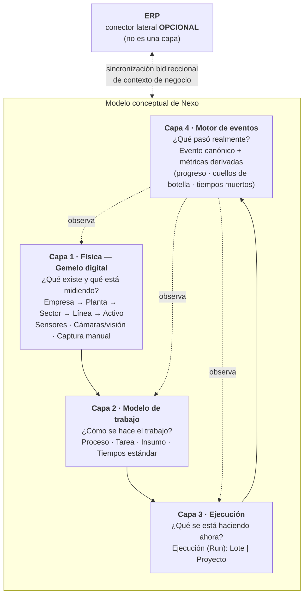
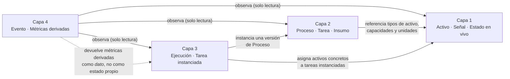
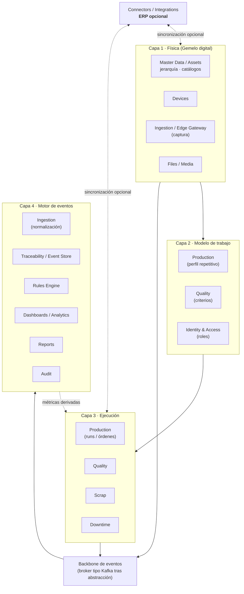
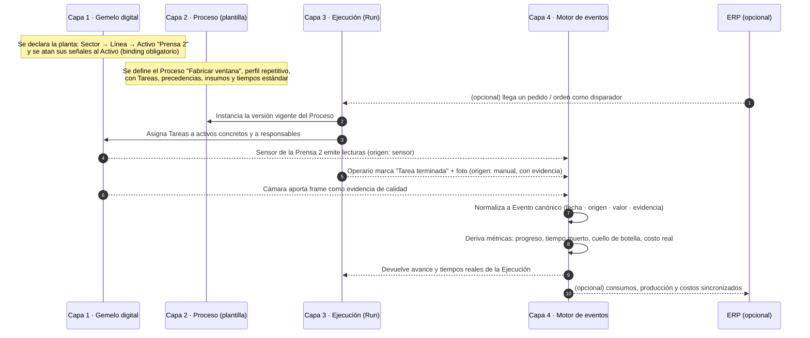

# Arquitectura por Capas (modelo conceptual canónico)

> **Documento:** `specs/specs/layered-architecture.md` · **Estado:** Borrador v0.1 · **Actualizado:** 2026-07-13
> **Roles:** Product Manager · Software Architect · UX Designer
> **Relacionados:** [digital-twin.md](./digital-twin.md) · [work-model.md](./work-model.md) · [execution.md](./execution.md) · [event-engine.md](./event-engine.md) · [master-data.md](./master-data.md) · [architecture.md](./architecture.md) · [data-model.md](./data-model.md) · [devices.md](./devices.md) · [production.md](./production.md) · [dashboards.md](./dashboards.md) · [integrations.md](./integrations.md) · [traceability.md](./traceability.md) · [glossary.md](./glossary.md) · [idea.md](../idea.md) · [tablero de decisiones](../open-questions-board.md)

## Resumen ejecutivo

Este documento es el **ancla conceptual** de Nexo: define el **modelo de 4 capas** con el que se entiende, se explica y se especifica la plataforma. Es la respuesta a una pregunta que la documentación anterior no formulaba de manera explícita: *¿cuál es el orden de razonamiento del producto?* La respuesta es que Nexo se construye sobre cuatro planos conceptuales apilados —**Física**, **Modelo de trabajo**, **Ejecución** y **Motor de eventos**— donde cada uno responde a una pregunta distinta y **depende únicamente del que tiene debajo**.

El modelo por capas trae consigo un **cambio de posicionamiento de fondo**: el sistema deja de estar centrado en el ERP. Hasta ahora, la tesis del producto era ser "la capa única de captura entre la planta y el ERP" y el ERP ocupaba, implícitamente, el lugar de destino final del dato y de fuente de verdad del contexto de negocio. A partir de este modelo, **el ERP no es una capa**: es un **conector lateral opcional** —un *plus*— que se enchufa a un sistema que ya funciona por sí solo. La propuesta de valor pasa a ser **"sistema de ejecución y trazabilidad del trabajo en planta"**, y la integración con ERP se convierte en un acelerador, no en la razón de ser.

Es importante entender **qué tipo de modelo es este**. Las 4 capas son un **modelo conceptual de dominio**, no una arquitectura de despliegue ni una nueva descomposición de servicios. La arquitectura técnica de Nexo **no cambia**: sigue siendo Cloud Native, orientada a microservicios con DDD, event-driven, con **base de datos por tenant** y **Control Plane** global, exactamente como se define en [architecture.md](./architecture.md). Los *bounded contexts* siguen siendo los de la lista canónica de esa especificación. Lo que este documento aporta es el **mapeo capa ↔ servicios**: qué microservicios materializan cada capa y por qué una capa puede estar servida por varios contextos (y un contexto participar de más de una capa).

El documento presenta: la motivación del modelo, las cuatro capas con su responsabilidad y su frontera, el **principio de dependencia** con sus reglas y sus prohibiciones, el rol lateral del ERP y los dos modos de operación (*standalone* y *conectado*), la tabla capa → documento, el mapeo capa ↔ bounded contexts, un recorrido de extremo a extremo de un dato real, y un balance explícito de **qué cambia y qué no cambia** respecto del diseño anterior, incluyendo el impacto sobre decisiones ya cerradas.

---

## 1. Por qué un modelo por capas

La documentación previa de Nexo estaba organizada **por dominio** (Producción, Calidad, Scrap, Paradas, Dispositivos, Trazabilidad…). Esa organización es correcta para el **diseño técnico** —cada dominio es un *bounded context* con su ciclo de vida— pero resultó insuficiente para tres cosas:

| Problema detectado | Consecuencia | Cómo lo resuelve el modelo por capas |
|---|---|---|
| **No había un orden de razonamiento** explícito entre dominios | Cada spec definía su universo; el lector no sabía qué se apoya en qué ni qué se define primero | Cuatro planos apilados con una dependencia unidireccional clara |
| **El "trabajo" no estaba modelado como concepto** | La `Orden de producción` funcionaba como raíz de facto, lo que excluía el trabajo por proyecto (obra única, fabricación a medida) | Se separa la **plantilla** de trabajo (Capa 2) de la **instancia** que se ejecuta (Capa 3) |
| **El dato podía "flotar"** sin dueño físico | Sin un vínculo obligatorio señal ↔ activo, atribuir un evento a una tarea o calcular métricas por recurso queda librado a convención | La Capa 1 impone el **binding sensor/señal ↔ Activo** como invariante |
| **El ERP aparecía como destino natural del dato** | El producto se leía como "middleware de ERP" y su valor dependía de que hubiera un ERP | El ERP sale del stack y pasa a ser conector lateral opcional |

El modelo por capas es, entonces, una herramienta de **claridad conceptual y de alcance**: define qué pregunta responde cada parte del sistema, en qué orden se especifican y hasta dónde llega cada documento.

---

## 2. El modelo de 4 capas

### 2.1 Tabla canónica

| Capa | Nombre | Responde a | Naturaleza | Unidad conceptual central |
|---|---|---|---|---|
| **1** | **Física — Gemelo digital de la planta** | *¿Qué existe y qué está midiendo?* | Estructural / master data + estado en vivo | **Activo** (centro de trabajo/máquina) con sus señales |
| **2** | **Modelo de trabajo — Procesos** | *¿Cómo se hace el trabajo?* | **Plantilla** (definición reutilizable y versionada) | **Proceso** con sus **Tareas** e **Insumos** |
| **3** | **Ejecución — Lote o Proyecto** | *¿Qué se está haciendo ahora?* | **Instancia** viva de una plantilla | **Ejecución (Run)** |
| **4** | **Motor de eventos** | *¿Qué pasó realmente?* | Observación + derivación | **Evento canónico** y sus **métricas derivadas** |

> **Cómo leerla:** las capas 1 y 2 describen **el mundo tal como se declara** (lo que existe y cómo debería hacerse el trabajo). La capa 3 describe **el mundo tal como se planifica y se ejecuta**. La capa 4 describe **el mundo tal como ocurrió**, y es la única que produce *el dato de verdad*: progreso, cuellos de botella, tiempos muertos, productividad y costo real.

### 2.2 Diagrama del stack

> **Lectura del diagrama:** las flechas llenas hacia arriba son **dependencias de construcción** (una capa se apoya en la de abajo). Las flechas punteadas de la Capa 4 son **observación**: el motor de eventos no es "dueño" de las otras capas, las mira y deriva hechos. La conexión del ERP es **lateral y punteada**: entra y sale por el costado, y su ausencia no rompe el stack.

---

## 3. El principio de dependencia

> **Principio rector: cada capa depende solo de la de abajo.**

Es la regla que le da valor al modelo. Sin ella, las capas serían solamente una agrupación estética de documentos.

### 3.1 Qué significa en la práctica

| Regla | Enunciado | Ejemplo permitido | Ejemplo prohibido |
|---|---|---|---|
| **R1 — Dependencia descendente** | Una capa puede referenciar entidades de la capa inmediatamente inferior | Una **Tarea** (Capa 2) declara que se realiza en un **tipo de Activo** (Capa 1) | Un **Activo** (Capa 1) no conoce las **Tareas** que se hacen sobre él |
| **R2 — Sin dependencia ascendente** | Una capa nunca necesita conocer a la de arriba para tener sentido | El gemelo digital es útil aunque no exista ningún Proceso definido | Definir un Activo cuyo modelo dependa de que exista un Lote en curso |
| **R3 — Sin salto de capa hacia arriba** | La Capa 1 no invoca ni asume nada de las Capas 2, 3 o 4 | — | Un sensor que "sabe" a qué Ejecución pertenece su lectura |
| **R4 — Observación desde la Capa 4** | La Capa 4 lee de las tres capas inferiores, pero **no las modifica** | El motor deriva "tiempo muerto del Activo X" cruzando eventos con la ventana planificada | El motor no reescribe el estado del Activo ni cambia una Tarea |
| **R5 — Plantilla ≠ instancia** | La Capa 2 nunca guarda estado de ejecución; la Capa 3 nunca redefine la plantilla | Una Ejecución "congela" la versión del Proceso con la que arrancó | Modificar el tiempo real de una Tarea dentro del Proceso plantilla |
| **R6 — El dato tiene dueño físico** | Todo dato capturado se ata a un elemento de la Capa 1 | Una lectura pertenece a una Señal, que pertenece a un Activo | Una lectura huérfana, sin Activo asignado |

### 3.2 Por qué la dirección importa

- **Reusabilidad:** un mismo **Proceso** (Capa 2) puede ejecutarse en distintas plantas y sobre distintos activos porque no está atado a una ejecución concreta.
- **Trazabilidad atribuible:** como todo dato cuelga de un Activo (R6), la Capa 4 puede **atribuir** cualquier evento a un recurso físico y, a través de la Ejecución, a una Tarea. Sin esa cadena, "cuello de botella" y "productividad por recurso" no son calculables, solo estimables.
- **Evolución independiente:** cambiar el catálogo de procesos no obliga a tocar el gemelo digital; agregar sensores no obliga a rediseñar procesos.
- **Alcance de documentación:** cada spec sabe hasta dónde escribe. Si un tema requiere conocer una capa superior, está en el documento equivocado.

### 3.3 Diagrama de dependencias permitidas

> **Matiz sobre la Capa 3 → Capa 1:** la Ejecución referencia directamente activos concretos (a qué máquina se asignó una tarea). Esto **no viola** el principio: la Capa 3 se apoya en las capas inferiores, y la Capa 1 sigue sin saber nada de ejecuciones. La regla prohíbe la dependencia **ascendente**, no el uso de una capa inferior no adyacente.

---

## 4. Las cuatro capas, una por una

Cada capa tiene su documento dedicado. Acá se define **su frontera** y **qué NO es**, para que ningún documento invada al otro.

### 4.1 Capa 1 — Física: gemelo digital de la planta

- **Responde a:** *¿qué existe físicamente y qué está midiendo?*
- **Contiene:** la jerarquía **Empresa → Planta → Sector → Línea → Centro de trabajo / Activo**; el **binding no negociable** de cada sensor/señal a un Activo; las tres fuentes de dato de la capa (**sensores**, **cámaras/visión**, **captura manual del operario**); el **estado en vivo**, las capacidades/atributos, la calibración y la ubicación del activo; y la navegación del gemelo en la UI.
- **NO es:** el modelado del hardware de captura (protocolos, salud, firmware/OTA, mapeo tag→señal), que vive en [devices.md](./devices.md). La Capa 1 usa ese modelo; no lo redefine.
- **Documento:** [digital-twin.md](./digital-twin.md).

### 4.2 Capa 2 — Modelo de trabajo: Procesos

- **Responde a:** *¿cómo se hace el trabajo?* Es la **plantilla**.
- **Contiene:** **Proceso (Process Definition)** versionado, con su **perfil** (*repetitivo* o *proyecto*); **Tareas** con precedencias en grafo (DAG), duración estimada/estándar, rol responsable, evidencia requerida y criterio de terminación; **Insumos** con cantidad y unidad; **Responsables** por rol; **tiempos** estimado y estándar.
- **Idea central:** un proyecto único y una producción repetitiva **se modelan igual**. Cambia el disparador y el set de KPIs, no el modelo.
- **NO es:** una instancia en curso (eso es Capa 3) ni el registro de lo que efectivamente pasó (eso es Capa 4).
- **Documento:** [work-model.md](./work-model.md).

### 4.3 Capa 3 — Ejecución: Lote o Proyecto

- **Responde a:** *¿qué se está haciendo ahora?* Es la **instancia**.
- **Contiene:** la **Ejecución (Run)** —generalización del `production_run` ya existente— en sus dos sabores, **Lote (Batch)** y **Proyecto (Project)**, que comparten esqueleto: estado, tareas instanciadas con asignación y tiempos, consumo real de insumos, avance y evidencia. Incluye ciclo de vida, reprogramación, ejecución parcial y cierre.
- **NO es:** la definición del trabajo (Capa 2) ni el cálculo de métricas (Capa 4). La Ejecución **registra**; el motor **deriva**.
- **Documento:** [execution.md](./execution.md).

### 4.4 Capa 4 — Motor de eventos

- **Responde a:** *¿qué pasó realmente?*
- **Contiene:** el **contrato del Evento canónico** —con **fecha**, **origen**, **valor** y **evidencia** como atributos de primera clase, sumados a los ya definidos (tenant, activo/tarea/ejecución, operario, deduplicación, metadatos de origen)— y las **métricas derivadas**: progreso, cuellos de botella, tiempos muertos, productividad por recurso y costo real.
- **Todo genera eventos:** un sensor, una cámara, un operario marcando una tarea terminada, y el sistema mismo.
- **NO es:** el pipeline de ingesta y normalización ([data-ingestion.md](./data-ingestion.md)), el almacenamiento inmutable y la genealogía ([traceability.md](./traceability.md)), las automatizaciones y alertas sobre eventos ([rules-engine.md](./rules-engine.md)) ni la visualización de las métricas ([dashboards.md](./dashboards.md)).
- **Documento:** [event-engine.md](./event-engine.md).

---

## 5. El ERP no es una capa: es un conector lateral opcional

### 5.1 El enunciado

> **El sistema es autónomo. Funciona sin ERP.** El ERP es un **conector opcional** que sincroniza en ambos sentidos y aporta contexto de negocio (catálogos, pedidos, costos), pero **no está en el camino crítico** de ninguna de las cuatro capas.

Este es el cambio de posicionamiento más profundo del modelo. Nexo deja de definirse por *dónde está* (entre la planta y el ERP) y pasa a definirse por *qué hace* (ejecutar y trazar el trabajo en planta).

### 5.2 Consecuencia obligatoria: master data propia

Si el sistema debe funcionar sin ERP, **la plataforma tiene que poseer sus propios catálogos**. Esta es la consecuencia de mayor costo del pivot y hay que decirla con todas las letras: **agranda el alcance**.

| Catálogo propio requerido | Uso principal | Capa que lo consume |
|---|---|---|
| **Productos / ítems** | Qué se fabrica o se entrega | Capas 2 y 3 |
| **Insumos** | Qué consume cada Tarea | Capas 2 y 3 |
| **Unidades de medida** | Normalización de cantidades y señales | Capas 1, 2, 3 y 4 |
| **Procesos** | Plantillas de trabajo | Capa 2 |
| **Personas y roles** | Responsables y asignación | Capas 2 y 3 |
| **Clientes y pedidos** *(opcional)* | Disparador de ejecuciones de perfil proyecto | Capa 3 |
| **Centros de costo** | Costo real vs. estimado | Capa 4 |

El detalle de estos catálogos, su ciclo de vida y su gobierno viven en [master-data.md](./master-data.md).

### 5.3 Los dos modos de operación

| Aspecto | Modo **standalone** (sin ERP) | Modo **conectado** (con ERP) |
|---|---|---|
| **Fuente de verdad de catálogos** | La plataforma (master data local) | El ERP, para los catálogos que correspondan; la plataforma para el resto |
| **Alta de datos maestros** | Carga manual en UI e importación CSV/Excel | Sincronización por conector + carga manual para lo que el ERP no cubre |
| **Disparo de una Ejecución** | Manual, por plan interno o por regla | Además: orden/pedido proveniente del ERP |
| **Salida de resultados** | Reportes, tableros y exportables propios | Además: devolución de consumos, producción y costos al ERP |
| **Dependencia operativa** | Ninguna respecto de sistemas externos | El corte del ERP degrada la sincronización, **no** la operación de planta |
| **Documento de referencia** | [master-data.md](./master-data.md) | [integrations.md](./integrations.md) |

### 5.4 Qué NO cambia del diseño de integraciones

El conector sigue implementándose exactamente como está especificado: **Connectors / Integrations** con **Anti-Corruption Layer**, mapeos declarativos, reintentos y jobs de sincronización (decisión ADR-07 en [architecture.md](./architecture.md)). Lo que cambia es su **criticidad**: pasa de ser componente estructural a ser componente habilitable.

---

## 6. Mapa capa → documento

| Capa | Documento de la capa | Documentos satélite que profundizan |
|---|---|---|
| **1 · Física — Gemelo digital** | [digital-twin.md](./digital-twin.md) | [devices.md](./devices.md) (hardware, protocolos, salud, OTA) · [data-ingestion.md](./data-ingestion.md) (pipeline) · [master-data.md](./master-data.md) (jerarquía y catálogos) |
| **2 · Modelo de trabajo** | [work-model.md](./work-model.md) | [production.md](./production.md) (perfil repetitivo) · [quality.md](./quality.md) (criterios y puntos de control) · [master-data.md](./master-data.md) (insumos, unidades) · [users-permissions.md](./users-permissions.md) (roles responsables) |
| **3 · Ejecución** | [execution.md](./execution.md) | [production.md](./production.md) · [scrap.md](./scrap.md) · [downtime.md](./downtime.md) · [quality.md](./quality.md) |
| **4 · Motor de eventos** | [event-engine.md](./event-engine.md) | [data-ingestion.md](./data-ingestion.md) · [traceability.md](./traceability.md) · [rules-engine.md](./rules-engine.md) · [dashboards.md](./dashboards.md) · [reports.md](./reports.md) |
| **Lateral · ERP opcional** | [integrations.md](./integrations.md) | [master-data.md](./master-data.md) · [control-plane.md](./control-plane.md) (marketplace de conectores) |
| **Transversal · técnico** | [architecture.md](./architecture.md) | [multi-tenancy.md](./multi-tenancy.md) · [scalability.md](./scalability.md) · [security.md](./security.md) · [control-plane.md](./control-plane.md) |
| **Transversal · producto y UX** | [product.md](./product.md) · [ui-ux.md](./ui-ux.md) | [modules.md](./modules.md) · [mockups.md](./mockups.md) · [glossary.md](./glossary.md) |

---

## 7. Relación con la arquitectura de microservicios existente

Esta es la sección que evita el malentendido más peligroso del modelo.

> **Las 4 capas son un modelo CONCEPTUAL. No son una arquitectura en capas de despliegue, no son módulos de código y no reemplazan los *bounded contexts*.** Los servicios de Nexo siguen siendo **exactamente** los de la lista canónica de [architecture.md](./architecture.md) §3.

### 7.1 Dos vistas del mismo sistema

| Dimensión | Modelo de 4 capas | Arquitectura de microservicios |
|---|---|---|
| **Qué organiza** | El **razonamiento de dominio**: qué pregunta responde cada parte | El **despliegue y la propiedad del dato**: quién es dueño de qué |
| **Criterio de corte** | Nivel de abstracción del concepto (físico → plantilla → instancia → hecho) | Cohesión de dominio, cadencia de cambio, perfil de carga, régimen de aislamiento |
| **Se materializa en** | Documentación, lenguaje ubicuo, navegación del producto | Servicios desplegables, bases por tenant, tópicos del broker |
| **Cardinalidad** | Una capa puede estar servida por **varios** servicios | Un servicio puede participar de **varias** capas |
| **Cambia con** | La visión de producto | Las necesidades de escala, aislamiento y equipo |

**Corolario:** no se debe crear un microservicio "Capa 1" ni un namespace "Capa 3". La descomposición física del sistema no se toca.

### 7.2 Mapeo capa ↔ bounded contexts

| Capa | Bounded contexts que la materializan | Rol de cada uno | Almacenamiento predominante |
|---|---|---|---|
| **1 · Física** | **Devices** · contexto de **Master Data / Assets** del tenant *(ver §7.4)* · **Ingestion / Edge Gateway** (borde de captura) · **Files / Media** (evidencia visual de cámaras y formularios) | Devices posee hardware, señales y mapeos; Master Data posee la jerarquía y los catálogos; Ingestion captura; Files custodia evidencia | DB del tenant (master data y config) · time-series (lecturas) · object storage (media) |
| **2 · Modelo de trabajo** | **Production** (reencuadrado como *perfil repetitivo*) · **Quality** (criterios y puntos de control de las tareas) · **Master Data** (insumos, unidades, productos) · **Identity & Access** (roles responsables) | Definen y versionan la plantilla de trabajo y sus catálogos de apoyo | DB del tenant |
| **3 · Ejecución** | **Production** (órdenes y runs) · **Quality** · **Scrap** · **Downtime** · **Files / Media** (evidencia de tareas) | Instancian, asignan, registran avance y consumo, y cierran | DB del tenant |
| **4 · Motor de eventos** | **Ingestion / Edge Gateway** (normalización al Evento canónico) · **Traceability / Event Store** (persistencia inmutable y genealogía) · **Rules Engine** (reacción) · **Dashboards / Analytics** (proyecciones y KPIs) · **Reports** · **Audit** | Producen, persisten, evalúan y proyectan los hechos y las métricas derivadas | Event store append-only · read models (CQRS) |
| **Lateral · ERP** | **Connectors / Integrations** (ACL) · **Marketplace** (catálogo de conectores, Control Plane) | Sincronización bidireccional opcional del contexto de negocio | Config en DB del tenant · catálogo en Control Plane |
| **Transversales** | **Identity & Access** · **Notifications** · **Observability** · **Tenant Provisioning** · **Administration & Licensing** · **AI / Computer Vision** (fase futura) | Servicios que atraviesan todas las capas o gobiernan la plataforma | Control Plane · config por tenant |

### 7.3 Vista combinada

> El **backbone de eventos** sigue siendo la columna vertebral técnica ([architecture.md](./architecture.md) §4.3). En la lectura por capas, el broker es el **medio** por el cual las capas 1 y 3 alimentan a la Capa 4; no es una capa en sí mismo.

### 7.4 Una pregunta abierta que este modelo vuelve urgente

[data-model.md](./data-model.md) deja abierta la propiedad de la jerarquía física (Planta/Sector/Línea/Máquina): hoy es master data usada por varios contextos, sin un servicio canónico "Sites/Assets". Con el modelo por capas y con el binding obligatorio señal ↔ activo, esa jerarquía deja de ser un detalle de configuración y pasa a ser **la base estructural de la Capa 1**. La recomendación de este documento es **consolidar un contexto de Master Data / Assets del tenant** que la gobierne, y que además aloje los catálogos propios exigidos por el modo *standalone* (§5.2). La decisión se traslada al [tablero de decisiones](../open-questions-board.md).

---

## 8. Recorrido de extremo a extremo

Ejemplo funcional que atraviesa las cuatro capas y muestra dónde entra —opcionalmente— el ERP.

**Lo importante del recorrido:** si se elimina el participante `ERP`, **el flujo sigue siendo completo y valioso**. Esa es, en una imagen, la tesis del pivot.

---

## 9. Qué cambia respecto del diseño anterior (y por qué)

### 9.1 Cambios de fondo

| # | Antes | Ahora | Por qué |
|---|---|---|---|
| **C1** | Nexo es **"la capa única de captura entre la planta y el ERP"** | Nexo es **"el sistema de ejecución y trazabilidad del trabajo en planta"**; el ERP es un acelerador | Un producto definido por su posición respecto de otro sistema no tiene valor propio si ese sistema no existe. La mayoría de las PyMEs industriales no tiene ERP, o lo tiene sin uso en planta |
| **C2** | La **Orden de producción** era el concepto raíz del trabajo | La raíz es **Proceso** (plantilla, Capa 2) + **Ejecución** (instancia, Capa 3). La Orden pasa a ser **una forma de disparar** una Ejecución de perfil repetitivo | Permite modelar trabajo por proyecto (obra, fabricación a medida) con el mismo modelo, sin duplicar dominio |
| **C3** | Solo existía el trabajo **repetitivo** de manera implícita | Existen dos **perfiles** de Proceso: **repetitivo** y **proyecto**, con el mismo modelo y **KPIs distintos** | Evita el error de aplicar OEE a un proyecto único, donde la métrica correcta es % de avance, desvío de cronograma y ruta crítica |
| **C4** | El dato de sensor podía existir con contexto físico **opcional** (`site/line/asset` como enriquecimiento) | **Binding sensor/señal ↔ Activo obligatorio**: un dato nunca "flota" | Sin dueño físico no hay atribución; sin atribución no hay productividad por recurso, cuello de botella ni tiempo muerto confiables |
| **C5** | El ERP era **fuente de verdad implícita** del contexto de negocio (productos, órdenes, personas) | La plataforma tiene **master data propia**; con ERP se sincroniza y el ERP puede ser fuente de verdad de lo que corresponda | Es la condición necesaria para operar en modo *standalone*. **Es el costo oculto más grande del pivot**: agranda el alcance del MVP |
| **C6** | Los eventos eran principalmente el **sustrato de la ingesta** | El **Motor de eventos es una capa** con contrato propio (fecha, origen, valor, **evidencia**) y **métricas derivadas de primera clase** | El valor no está en almacenar eventos sino en derivar de ellos progreso, cuellos de botella y tiempos muertos |
| **C7** | La **evidencia** era un adjunto de ciertos registros | La **evidencia es de primera clase** del Evento: foto, archivo, lectura de sensor, firma, frame de cámara | Es lo que sostiene la promesa de trazabilidad verificable, sobre todo en modo *standalone* |
| **C8** | Terminología ambigua: se hablaba de "dashboards para que los operarios carguen datos" | Distinción canónica: **Formulario de captura** (el operario ingresa datos, Capa 1) vs. **Tablero / Dashboard** (visualiza KPIs, sale de Capa 4) | Dos objetos distintos, dos documentos distintos, dos experiencias de UX distintas. Ver [digital-twin.md](./digital-twin.md) §2 y [dashboards.md](./dashboards.md) |

### 9.2 Qué NO cambia

Es tan importante decir qué se conserva como qué se modifica. **Ninguna decisión técnica estructural se revierte.**

| Decisión / definición | Estado |
|---|---|
| Cloud Native, microservicios con DDD, event-driven, **NO monolito** (ADR-01) | **Sin cambios** |
| **Base de datos por tenant** (ADR-03, requisito no negociable) | **Sin cambios** |
| **Control Plane** global sin dato operativo del cliente | **Sin cambios** |
| Broker tipo Kafka detrás de abstracción, agnóstico de nube (ARQ-01 / ADR-02) | **Sin cambios** |
| Captura **edge-first**, *outbound-only*, con **store-and-forward** (ADR-04) | **Sin cambios** |
| **CQRS** con read models para tableros y reportes (ADR-05) | **Sin cambios** |
| **Evento canónico inmutable** como contrato central (ADR-10) | **Se extiende** (evidencia, valor y origen explícitos), no se reemplaza |
| Core desacoplado del ERP vía Conectores + **ACL** (ADR-07) | **Sin cambios** en el mecanismo; cambia su **criticidad** |
| Fórmulas de **OEE / MTBF / MTTR / FPY / scrap rate** | **Sin cambios**; se aclara que aplican al **perfil repetitivo** |
| Escala objetivo, personas, principios de UX, RBAC con scoping | **Sin cambios** |
| Lista canónica de **bounded contexts** | **Sin cambios** |

### 9.3 KPIs por perfil (referencia canónica)

| Perfil | KPIs propios |
|---|---|
| **Repetitivo** | **OEE** (Disponibilidad × Rendimiento × Calidad), scrap rate, takt, tiempo de ciclo, FPY |
| **Proyecto** | **% de avance**, desvío de cronograma, ruta crítica, hitos cumplidos, (futuro) valor ganado |
| **Comunes a ambos** | Tiempos muertos, cuellos de botella, productividad por recurso, costo real vs. estimado, calidad |

> Las fórmulas viven en [glossary.md](./glossary.md), [production.md](./production.md), [downtime.md](./downtime.md) y [quality.md](./quality.md), y se presentan en [dashboards.md](./dashboards.md). Este documento **no las redefine**.

### 9.4 Impacto sobre decisiones ya cerradas

| Decisión | Estado previo | Impacto del modelo por capas |
|---|---|---|
| **INT-01 — Odoo en el MVP** | Cerrada: Odoo es el primer ERP integrado en el MVP | **Se reencuadra:** Odoo pasa a ser **opcional**; el MVP debe funcionar sin ERP. Queda marcada en el [tablero de decisiones](../open-questions-board.md) como **decisión a revisar** |
| **PRD-02 — Caso estrella** | Cerrada: "Producción + dashboard" | **Sigue válida**, pero ahora se entiende como el **perfil repetitivo**. Conviene validar si el piloto real es repetitivo o proyecto |
| **DEV-01 / DEV-02 / DEV-03** (agente edge, roadmap de protocolos, identidad de dispositivo) | Cerradas | **Sin impacto** |
| **ARQ-01** (broker), multi-tenancy, secretos, edge, auth, offline, pricing, observabilidad (**OPS-01**) | Cerradas | **Sin impacto** |
| **COM-01** (pricing) | Cerrada | **A revisar:** vender sin ERP cambia la propuesta comercial (ver Preguntas abiertas) |

---

## 10. Cómo usar este documento

| Si sos… | Empezá por | Después |
|---|---|---|
| **Nuevo en el proyecto** | Este documento (§2, §3, §5) | [idea.md](../idea.md) → [product.md](./product.md) → [modules.md](./modules.md) |
| **Product Manager** | §5 (ERP opcional) y §9 (qué cambia) | [work-model.md](./work-model.md) → [execution.md](./execution.md) |
| **Software Architect** | §7 (mapeo capa ↔ servicios) | [architecture.md](./architecture.md) → [data-model.md](./data-model.md) |
| **UX Designer** | §9.1 C8 (formulario vs. tablero) | [digital-twin.md](./digital-twin.md) → [ui-ux.md](./ui-ux.md) → [dashboards.md](./dashboards.md) |
| **Implementador / Integrador** | §4.1 y §5.3 (modos de operación) | [digital-twin.md](./digital-twin.md) → [devices.md](./devices.md) → [master-data.md](./master-data.md) |

---

## 11. Referencias cruzadas

- Capa 1 — Gemelo digital de la planta: [digital-twin.md](./digital-twin.md)
- Capa 2 — Modelo de trabajo (Procesos): [work-model.md](./work-model.md)
- Capa 3 — Ejecución (Lote o Proyecto): [execution.md](./execution.md)
- Capa 4 — Motor de eventos: [event-engine.md](./event-engine.md)
- Master data propia y modos de operación: [master-data.md](./master-data.md)
- Arquitectura técnica y bounded contexts: [architecture.md](./architecture.md)
- Modelo de datos conceptual: [data-model.md](./data-model.md)
- Hardware de captura: [devices.md](./devices.md)
- Integración con ERP (conector lateral): [integrations.md](./integrations.md)
- Tableros y KPIs: [dashboards.md](./dashboards.md)
- Roadmap por fases: [roadmap](../roadmap/roadmap.md)
- Tablero de decisiones: [open-questions-board.md](../open-questions-board.md)

---

## Preguntas abiertas

1. **Alcance de perfiles en el MVP.** ¿El MVP soporta **ambos perfiles** (repetitivo y proyecto) o arranca solo con repetitivo y habilita proyecto en V1? Impacta directamente el alcance de [work-model.md](./work-model.md) y [execution.md](./execution.md).
2. **Mínimo viable de master data propia.** ¿Cuántos catálogos entran al MVP en modo *standalone* (productos, insumos, unidades, procesos, personas, clientes/pedidos, centros de costo)? Es el costo oculto principal del pivot (§5.2).
3. **Revisión de INT-01.** Si Odoo pasa a ser opcional, ¿el conector sigue estando en el MVP como diferencial comercial o se difiere a V1? ¿Qué se le promete al piloto?
4. **Propiedad de la jerarquía física.** ¿Se crea un contexto canónico de **Master Data / Assets** del tenant que gobierne Empresa/Planta/Sector/Línea/Activo y los catálogos propios, o se sigue repartiendo entre Production y Devices? (§7.4 y [data-model.md](./data-model.md) pregunta 1).
5. **Granularidad del modelo de tareas.** ¿La Capa 2 soporta **DAG completo** de precedencias desde V1 o solo secuencia lineal en el MVP?
6. **Obligatoriedad de la evidencia.** ¿La evidencia por tarea es **configurable** (obligatoria/opcional por Proceso o por Tarea) o siempre opcional en V1?
7. **Versionado de Procesos.** ¿El Proceso se versiona con historial y las Ejecuciones quedan **atadas a la versión** con la que arrancaron? ¿Qué pasa con una Ejecución en curso cuando se publica una versión nueva?
8. **Pricing sin ERP.** ¿Cambia el modelo comercial si el sistema se vende *standalone* (revisión de **COM-01**)? ¿La integración ERP es un módulo pago aparte?
9. **Ubicación del cómputo de métricas derivadas.** ¿Las métricas de la Capa 4 (progreso, cuello de botella, tiempo muerto) se materializan como **read models** de Dashboards o requieren un servicio de cálculo propio? Coordinar con [event-engine.md](./event-engine.md) y [dashboards.md](./dashboards.md).
10. **Nombre del producto.** "Nexo" sigue siendo un *working name* provisional; el reposicionamiento (§5.1) es una buena oportunidad para confirmarlo o cambiarlo.
