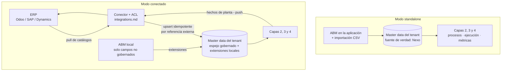
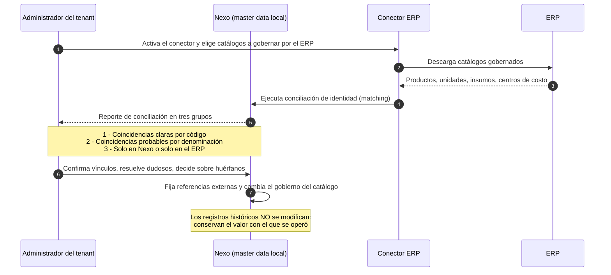
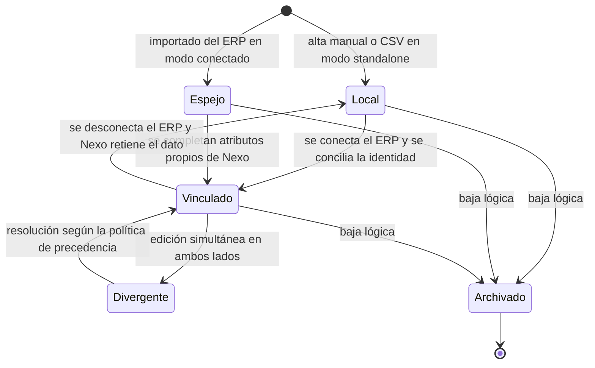
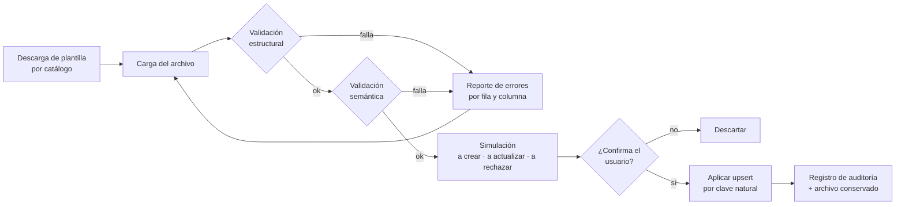

# Master Data — Catálogos propios de la plataforma

> **Documento:** `specs/specs/master-data.md` · **Estado:** Borrador v0.1 · **Actualizado:** 2026-07-13
> **Roles:** Product Manager · Software Architect · UX Designer
> **Relacionados:** [integrations.md](./integrations.md) · [layered-architecture.md](./layered-architecture.md) · [work-model.md](./work-model.md) · [execution.md](./execution.md) · [digital-twin.md](./digital-twin.md) · [event-engine.md](./event-engine.md) · [data-model.md](./data-model.md) · [users-permissions.md](./users-permissions.md) · [production.md](./production.md) · [multi-tenancy.md](./multi-tenancy.md) · [glossary.md](./glossary.md)

## Resumen ejecutivo

Este documento existe por una sola razón, y conviene decirla sin rodeos: **si el ERP es opcional, la plataforma tiene que poseer sus propios catálogos**. No hay atajo. Un sistema que promete funcionar de forma autónoma en una planta que no tiene ERP —o que lo tiene pero no quiere integrarlo todavía— necesita saber, por sí mismo, qué productos fabrica, con qué insumos, en qué unidades, mediante qué procesos, con qué personas, para qué clientes y contra qué centros de costo. Sin eso no hay ejecución, no hay costo real y no hay trazabilidad útil.

Nexo se reposiciona: deja de ser "la capa entre la planta y el ERP" y pasa a ser un **sistema de ejecución y trazabilidad del trabajo en planta**, con la integración ERP como **acelerador y no como razón de ser** (ver [layered-architecture.md](./layered-architecture.md) e [integrations.md](./integrations.md)). La consecuencia directa e ineludible de ese reposicionamiento es este documento.

Se definen aquí: el **inventario de catálogos propios** que la plataforma debe gobernar; los **dos modos de operación** —**standalone** (master data local, alta manual o por CSV) y **conectado** (el ERP es fuente de verdad de los catálogos que corresponda)— con su variante realista, el **modo híbrido por entidad**; la **política de precedencia y resolución de conflictos** entre ambos mundos, incluidos los dos momentos más delicados del ciclo de vida de un cliente: **conectar un ERP a un tenant que ya venía operando standalone** y **desconectarlo**; el **ciclo de vida** del dato maestro; y la mecánica de **carga manual/CSV**.

Y se dice con todas las letras lo que el brief pide que no se oculte: **esto agranda el alcance del producto**. Es el **costo oculto más grande del pivot**. La sección 7 lo cuantifica cualitativamente eje por eje, sin maquillaje, y fija el recorte mínimo viable para que el MVP siga siendo alcanzable.

> **Decisión cerrada (2026-07-13 — MOD-17): el mínimo viable del MVP es SIN COSTO.** Entran unidades de medida, productos/ítems, procesos (completo, con DAG), personas y roles, insumos **sin costo** y **clientes mínimos** (código + denominación). El **pedido no es catálogo propio**: el compromiso se modela como **atributos de la Ejecución de perfil proyecto** (entregable + fecha objetivo + cliente). Se **difieren a V1** los centros de costo, las tarifas de persona con vigencia y el costo de insumos con vigencia —y, por lo tanto, la **métrica de costo real**. **El MVP mide TIEMPO y AVANCE, no costo.** El alcance congelado está en [§7.3](#73-cómo-se-acota-el-mínimo-viable-de-catálogos).

---

## 1. Por qué existe este documento

### 1.1 El cambio de premisa

| Premisa anterior | Premisa nueva |
|---|---|
| El ERP es obligatorio; Nexo se conecta a él en el MVP (decisión INT-01) | El ERP es **opcional**; Nexo **debe funcionar sin él** |
| El contexto de trabajo (productos, órdenes, unidades, motivos) **se descarga** del ERP | El contexto de trabajo **puede tener que crearse dentro de Nexo** |
| Los catálogos son **espejos** de los del ERP | Los catálogos son **propios**, y el espejo es un modo entre otros |
| La propuesta de valor es la integración planta↔ERP | La propuesta de valor es la **ejecución y trazabilidad del trabajo en planta** |

### 1.2 Qué se rompe si no se hace

Sin master data propia, un tenant sin ERP no puede:

| Necesidad | Qué falta sin catálogos propios | Impacto |
|---|---|---|
| Declarar producción | No hay **producto** al que imputar la cantidad | La captura no tiene sujeto |
| Declarar consumo | No hay **insumo** ni **unidad de medida** | No hay costo de materiales ni trazabilidad de origen |
| Ejecutar trabajo | No hay **proceso** ni tareas con tiempo estándar | No hay progreso ponderado ni tiempos muertos medibles |
| Asignar responsables | No hay **personas ni roles** más allá de los usuarios de acceso | No hay productividad por recurso |
| Calcular costo real | No hay **tarifas** ni **centros de costo** | La métrica de costo de [event-engine.md](./event-engine.md) queda no disponible |
| Vincular al negocio | No hay **cliente** ni **pedido** | Un proyecto a medida no se puede rastrear hasta su contrato |

> **En una frase:** sin master data propia, la promesa "funciona sin ERP" es falsa, y el pivot de posicionamiento no se sostiene.

---

## 2. Inventario de catálogos propios

### 2.1 Panorama

| Catálogo | Qué resuelve | Quién lo consume | ¿Mínimo viable en MVP? | ¿Sincronizable con ERP? |
|---|---|---|---|---|
| **Unidades de medida** | Base de toda cuantificación y conversión | Todos | **Sí — imprescindible** | Sí (ERP suele mandar) |
| **Productos / Ítems** | Qué se fabrica o se entrega | Ejecución, eventos, costo, trazabilidad | **Sí — imprescindible** | Sí (ERP suele mandar) |
| **Insumos** | Qué se consume | Modelo de trabajo, trazabilidad | **Sí — reducido y SIN COSTO** | Sí |
| **Procesos** | Cómo se hace el trabajo | Modelo de trabajo (Capa 2), ejecución | **Sí — completo, con DAG (propio de Nexo)** | Rara vez (ver 2.5) |
| **Personas y roles** | Quién hace el trabajo | Asignación, productividad, permisos | **Sí — persona operativa + rol, SIN tarifa** | Parcial (RRHH) |
| **Centros de costo** | Contra qué se imputa el gasto | Costo real, reportes | **No — diferido a V1** | Sí |
| **Clientes** | Para quién se trabaja | Proyectos, trazabilidad comercial | **Sí — mínimo (código + denominación)** | Sí (ERP/CRM manda) |
| **Pedidos** | Qué se comprometió y para cuándo | Disparador de ejecución (perfil proyecto) | **No es catálogo propio** — el compromiso son **atributos de la Ejecución de perfil proyecto** (ver 2.7) | Sí (ERP manda, cuando existe) |
| **Motivos (reason codes)** | Por qué pasó algo (parada, scrap, defecto) | Downtime, Scrap, Quality | Ya existente (semilla del alta) | Sí |
| **Jerarquía física** | Planta → Sector → Línea → Activo | Capa 1, imputación de eventos | Ya existente | Excepcional |
| **Turnos y calendario** | Cuándo se debía trabajar | Tiempos muertos, disponibilidad | Ya existente | Rara vez |

> **Decisión cerrada (2026-07-13 — MOD-17).** La columna "¿Mínimo viable en MVP?" ya no es una propuesta: refleja el recorte **cerrado** del MVP, detallado en [§7.3](#73-cómo-se-acota-el-mínimo-viable-de-catálogos). Lo esencial: **el MVP no lleva costo**. Centros de costo, tarifas de persona con vigencia y costo de insumos con vigencia se **difieren a V1**, y con ellos la **métrica de costo real**. **El MVP mide TIEMPO y AVANCE.**

> **Deslinde:** los tres últimos ya están cubiertos por documentos vigentes ([data-model.md](./data-model.md), [digital-twin.md](./digital-twin.md), [downtime.md](./downtime.md)). Se listan para completitud del inventario de master data, pero **este documento no los redefine**: aporta sobre ellos únicamente la política de modo de operación y precedencia de la sección 4.

### 2.2 Productos / Ítems

**Qué es:** el ítem identificable que la ejecución produce o entrega. Cubre tanto el producto terminado del perfil repetitivo como el entregable único del perfil proyecto.

| Aspecto | Definición funcional |
|---|---|
| **Identidad** | Código propio del tenant (SKU o equivalente), estable y único; único obligatorio en modo standalone |
| **Atributos núcleo** | Denominación, unidad de medida base, familia/categoría, estado (activo/discontinuado) |
| **Atributos productivos** | Tiempo de ciclo ideal (perfil repetitivo), proceso por defecto asociado, especificaciones de calidad de referencia |
| **Atributos de costo** | Costo estándar de referencia, centro de costo por defecto. **Diferidos a V1 (MOD-17):** no forman parte del mínimo del MVP |
| **Atributos de trazabilidad** | Si se controla por lote, por serie, o por ninguno |
| **Referencia externa** | Identificador en el ERP cuando existe vínculo (modo conectado) |
| **Extensiones** | Atributos personalizados definidos por el tenant, siempre locales (nunca los pisa el ERP) |

**Regla de mínimo:** un producto necesita, como piso absoluto, **código + denominación + unidad base**. Todo lo demás puede completarse después; el sistema debe permitir empezar a producir con lo mínimo y enriquecer sobre la marcha.

### 2.3 Insumos

**Qué es:** material, componente, herramienta o servicio que una tarea consume (definición canónica en [work-model.md](./work-model.md)).

| Aspecto | Definición funcional |
|---|---|
| **Identidad** | Código propio del tenant |
| **Atributos núcleo** | Denominación, unidad de medida de consumo, categoría (material / componente / herramienta / servicio) |
| **Atributos de costo** | Costo unitario de referencia con vigencia temporal (para valorizar el consumo por fecha de ocurrencia). **Diferido a V1 (MOD-17):** en el MVP el insumo se define con **código + denominación + unidad, sin costo**; el consumo se mide en **cantidad**, no en dinero |
| **Atributos de trazabilidad** | Si se controla por lote/serie; proveedor cuando aplica |
| **Relación con producto** | Un ítem puede ser **producto** de una ejecución e **insumo** de otra (semielaborado). El modelo lo admite: producto e insumo son **roles**, no tipos excluyentes |

> **Decisión de modelo relevante:** producto e insumo comparten identidad de ítem. Modelarlos como catálogos separados y sin puente rompe la genealogía multinivel descrita en [traceability.md](./traceability.md), donde el producto terminado de una orden es insumo de la siguiente.

### 2.4 Unidades de medida

**Qué es:** el catálogo más pequeño y el más peligroso de subestimar. Sin unidades gobernadas, todo número de la plataforma es ambiguo.

| Aspecto | Definición funcional |
|---|---|
| **Identidad** | Código y símbolo |
| **Magnitud** | Familia física a la que pertenece (masa, longitud, volumen, tiempo, conteo…) |
| **Unidad base por magnitud** | Referencia contra la que se definen los factores de conversión |
| **Factor de conversión** | Relación con la unidad base de su magnitud; solo se convierte dentro de la misma magnitud |
| **Precisión y redondeo** | Decimales significativos y regla de redondeo, para que la agregación sea reproducible |
| **Semilla** | El alta de tenant provee un juego estándar (unidades SI + conteo + tiempo), extensible por el cliente |

**Reglas duras:**

- **No se convierte entre magnitudes.** Convertir kg a unidades requiere un dato del producto (peso unitario), no una conversión de unidades. Esa conversión pertenece al producto, no al catálogo de unidades.
- **Las conversiones de unidad son inmutables una vez usadas.** Cambiar un factor de conversión que ya valorizó eventos históricos reescribe la historia; se modela como nueva versión con vigencia, no como edición.
- La conversión aplicada en el pipeline queda registrada en el evento (ver [data-ingestion.md](./data-ingestion.md)).

### 2.5 Procesos

**Qué es:** la plantilla de trabajo versionada de la Capa 2. **Se define en [work-model.md](./work-model.md)**; acá solo se lo trata **como pieza de master data**, es decir: quién lo posee, cómo se carga y qué pasa si hay ERP.

| Aspecto | Posición de este documento |
|---|---|
| **Propiedad** | El Proceso es **master data nativa de Nexo**. Es el catálogo donde la plataforma aporta valor propio y donde el ERP casi nunca tiene un equivalente rico |
| **Sincronización con ERP** | Excepcional y parcial. Un ERP puede aportar una lista de materiales o una ruta de operaciones, pero **no** aporta tareas con evidencia requerida, criterios de terminación y precedencias — que es lo que Nexo necesita |
| **Modo conectado** | Cuando el ERP aporta lista de materiales/ruta, esta se usa como **semilla de importación asistida**, no como fuente de verdad continua |
| **Implicancia** | El Proceso **no se puede tercerizar al ERP**. Aun con ERP conectado, el cliente tiene que modelar sus procesos dentro de Nexo. Este es uno de los mayores esfuerzos de onboarding (ver sección 7) |

### 2.6 Personas y roles

**Qué es:** las personas que ejecutan el trabajo y los roles a los que se asignan tareas.

| Aspecto | Definición funcional |
|---|---|
| **Persona / Recurso humano** | Identidad operativa: legajo o código, nombre, rol/es, planta y línea de alcance, calendario y disponibilidad. **En el MVP el mínimo es persona operativa + rol** (MOD-17); la **tarifa horaria con vigencia** se difiere a V1 junto con el costo |
| **Rol** | Perfil de responsabilidad al que una tarea se asigna preferentemente (definición canónica en [work-model.md](./work-model.md)) |
| **Deslinde con acceso** | **Usuario, permisos, RBAC/ABAC y scoping viven en [users-permissions.md](./users-permissions.md)**. Acá vive la dimensión **operativa** de la persona: disponibilidad, calendario, tarifa, competencia |
| **Relación** | Una persona puede tener usuario de acceso o no (un operario de planta puede registrarse por identificación sin cuenta propia); todo usuario con actividad en planta se vincula a una persona |
| **Sincronización con ERP/RRHH** | Parcial: nombres y legajos pueden venir de un sistema de RRHH; la tarifa y la competencia suelen quedarse en Nexo |

### 2.7 Clientes (mínimo) y el compromiso del proyecto

> **Decisión cerrada (2026-07-13 — MOD-17).** **Cliente entra al MVP como catálogo mínimo. Pedido NO es catálogo propio.** El compromiso comercial se modela como **atributos de la Ejecución de perfil proyecto** —**entregable + fecha objetivo + cliente**— y no como una entidad de master data con su propio ABM, importador y ciclo de vida.

**Qué es:** el vínculo entre el trabajo de planta y el compromiso comercial.

| Entidad | Dónde vive | Atributos en el MVP |
|---|---|---|
| **Cliente** | **Catálogo propio (master data)** | **Mínimo: código + denominación.** Sin contacto obligatorio, sin condiciones comerciales, sin precios |
| **Compromiso del proyecto** | **NO es catálogo**: son **atributos de la Ejecución de perfil proyecto** ([execution.md](./execution.md)) | **Entregable + fecha objetivo + cliente** (referencia al catálogo de Clientes) |

- **Por qué no hay catálogo de Pedidos.** Un pedido propio arrastraría ítems, cantidades, estados, precios, prioridad y un ciclo de vida comercial completo: es la puerta de entrada a un módulo de ventas. El único dato que la ejecución necesita para trabajar a pedido es **qué hay que entregar, para cuándo y para quién** — y eso ya son tres campos de la Ejecución.
- El **disparador** de una Ejecución de perfil proyecto es la **creación manual** (o el conector, cuando hay ERP): se elige el Proceso, se declara el entregable, la fecha objetivo y el cliente, y arranca. Ver [execution.md](./execution.md) §4.
- En **modo conectado**, el ERP sigue mandando de forma casi absoluta sobre clientes y pedidos de venta: cuando existe conector, el pedido del ERP se correlaciona con la Ejecución por **referencia externa**, sin crear un catálogo local espejo.
- Nexo **no está construyendo un CRM ni un módulo de ventas**, y decirlo explícitamente es parte del control de alcance.

### 2.8 Centros de costo — **diferido a V1**

> **Decisión cerrada (2026-07-13 — MOD-17).** **Los centros de costo NO entran al MVP.** Se difieren a V1 junto con las **tarifas de persona con vigencia** y el **costo de insumos con vigencia**. Consecuencia directa y aceptada: la **métrica de costo real** de [event-engine.md](./event-engine.md) **no está disponible en el MVP**. **El MVP mide TIEMPO y AVANCE, no costo.** Lo que sigue queda como definición funcional de referencia para V1, no como alcance del MVP.

**Qué es:** la unidad contra la que se imputa el costo real derivado en [event-engine.md](./event-engine.md).

| Aspecto | Definición funcional |
|---|---|
| **Identidad** | Código y denominación |
| **Estructura** | Jerárquica (permite agregación) |
| **Asociaciones** | A la jerarquía física (línea, activo), a personas, a procesos y a ejecuciones |
| **Tarifas** | Tarifa horaria por centro de costo o por recurso, **con vigencia temporal** |
| **Regla de vigencia** | La valorización usa la tarifa vigente a la **fecha de ocurrencia** del hecho, nunca la tarifa actual. Cambiar una tarifa no reescribe el costo histórico |
| **Sincronización con ERP** | Alta cuando hay ERP: es el catálogo donde el área de administración exige alineación con la contabilidad |

---

## 3. Los dos modos de operación

### 3.1 Definición

| Dimensión | **Modo standalone** | **Modo conectado** |
|---|---|---|
| **Premisa** | No hay ERP integrado (no existe, o existe pero no se integra todavía) | Hay al menos un conector ERP activo (ver [integrations.md](./integrations.md)) |
| **Fuente de verdad de los catálogos** | **Nexo**, para todos | **El ERP**, para los catálogos que le correspondan; Nexo para el resto |
| **Alta de datos maestros** | Manual (ABM en la aplicación) e importación CSV/Excel | Sincronización por *pull* del conector; alta manual restringida a los catálogos no gobernados |
| **Edición** | Libre, con permisos y auditoría | **Bloqueada o degradada a "sugerencia"** en los campos gobernados por el ERP |
| **Identidad del registro** | Código propio del tenant | Código propio + **referencia externa** al objeto del ERP |
| **Riesgo principal** | Calidad y completitud del dato dependen de la disciplina del cliente | Divergencia y conflicto de doble edición |
| **Esfuerzo de onboarding** | **Alto**: hay que cargar todo | **Medio**: se importa, pero hay que mapear y completar lo que el ERP no tiene (procesos, tiempos estándar, evidencia) |
| **Valor diferencial de Nexo** | Autonomía total; el cliente arranca sin depender de nadie | Cero doble carga; el ERP sigue siendo el sistema de gestión |

### 3.2 El modo real: híbrido por entidad

En la práctica **casi ningún tenant es puramente uno u otro**. Un cliente con Odoo puede querer que Odoo gobierne productos y unidades, pero que Nexo gobierne procesos, personas operativas y tarifas de planta. Por eso:

> **La unidad de gobierno no es el tenant: es la entidad (catálogo).** Cada catálogo declara, por tenant, quién es su **fuente de verdad**. El "modo del tenant" es simplemente el resumen de esas declaraciones.

| Configuración por catálogo | Significado |
|---|---|
| **Gobernado por Nexo** | Alta y edición en Nexo; el conector no lo trae ni lo pisa |
| **Gobernado por el ERP** | Se importa del ERP; en Nexo es solo lectura en los campos gobernados |
| **Gobernado por el ERP con extensiones locales** | Los campos del ERP son solo lectura; los campos propios de Nexo (tiempo estándar, evidencia requerida, tarifa de planta) se editan localmente |
| **No gobernado / no usado** | El catálogo no está activo para ese tenant (típico de clientes y pedidos) |

### 3.3 Transición entre modos

Los dos momentos más delicados del ciclo de vida de un cliente:

#### 3.3.1 Standalone → Conectado (el caso frecuente)

Un cliente arrancó sin ERP, cargó sus catálogos, produjo durante meses, y ahora integra Odoo. **No se puede tirar su master data ni duplicarla.**

Reglas de la transición:

| Situación en la conciliación | Resolución |
|---|---|
| **Existe en ambos con el mismo código** | Se vinculan; el ERP pasa a gobernar los campos gobernados; los campos propios de Nexo se conservan |
| **Existe en ambos con códigos distintos pero denominación equivalente** | Se propone el vínculo; **requiere confirmación humana**, nunca automática |
| **Existe solo en Nexo** | Se conserva como **registro local no vinculado**. Se marca visiblemente. Opciones: seguir como local, o crearlo en el ERP y vincular |
| **Existe solo en el ERP** | Se importa como nuevo registro |
| **Conflicto de valores en el vínculo** | El valor del ERP pasa a regir **hacia adelante**; el valor previo queda en el historial. **Los eventos y métricas históricos no se recalculan** por un cambio de catálogo |

#### 3.3.2 Conectado → Standalone (la garantía de no dependencia)

El cliente desconecta el ERP (cambio de sistema, fin de contrato, decisión de negocio). **Nexo debe seguir operando sin degradarse.**

- **Nexo retiene todos los datos maestros** que había espejado. No son "del ERP": son del tenant, y viven en su base ([multi-tenancy.md](./multi-tenancy.md)).
- Los catálogos gobernados **revierten a gobierno de Nexo**: los campos que eran solo lectura se vuelven editables.
- Las **referencias externas se conservan** (marcadas como históricas), para no perder la trazabilidad de lo ya sincronizado ni la capacidad de reconectar en el futuro.
- **Esta es la garantía que hace creíble el posicionamiento.** Si desconectar el ERP dejara al sistema inoperante, el ERP no sería opcional: sería obligatorio con otro nombre.

---

## 4. Precedencia y resolución de conflictos

### 4.1 Principio rector

> **Una entidad, una fuente de verdad, declarada explícitamente y por tenant.** No hay "el que escribió último gana". La ambigüedad en la fuente de verdad es la causa número uno de fracaso de las integraciones de master data.

Esto responde directamente a la pregunta abierta #1 de [integrations.md](./integrations.md) *("¿quién es el system of record por entidad y por tenant?")*, aportando el marco; la decisión concreta por tenant es de configuración.

### 4.2 Matriz de precedencia por defecto

Valores **por defecto** en modo conectado, configurables por tenant:

| Catálogo | Fuente de verdad por defecto | Justificación | ¿Extensiones locales? |
|---|---|---|---|
| **Unidades de medida** | **ERP** | La conversión debe ser idéntica en ambos sistemas o los números no cierran | No |
| **Productos / Ítems** | **ERP** | Es el catálogo comercial y de inventario; duplicarlo genera doble alta | **Sí**: tiempo de ciclo, proceso por defecto, política de lote/serie |
| **Insumos** | **ERP** | Igual que productos | **Sí**: unidad de consumo en planta, mermas de referencia |
| **Centros de costo** _(V1)_ | **ERP** | Debe alinear con contabilidad | **Sí**: tarifas de planta si el ERP no las expone |
| **Clientes** | **ERP** | Terreno indiscutido del ERP/CRM | No |
| **Pedidos** _(no es catálogo de Nexo)_ | **ERP** | Compromiso comercial; Nexo lo ejecuta, no lo crea. En Nexo el compromiso son **atributos de la Ejecución de perfil proyecto** ([§2.7](#27-clientes-mínimo-y-el-compromiso-del-proyecto)); el pedido del ERP se correlaciona por **referencia externa**, sin catálogo espejo | — |
| **Motivos (reason codes)** | **Configurable** | Muchos ERPs tienen catálogos pobres de motivos; Nexo suele ser más rico | Sí |
| **Procesos** | **Nexo** | El ERP no modela tareas, evidencia ni criterios de terminación | — |
| **Personas (operativo)** | **Nexo** | Disponibilidad, competencia y tarifa de planta rara vez están en el ERP | — |
| **Jerarquía física** | **Nexo** | Es el gemelo digital; el ERP no lo modela a este nivel | — |
| **Turnos y calendario** | **Nexo** | Necesario para tiempos muertos; el ERP no lo expone con esa granularidad | — |

### 4.3 Estados de un registro maestro

| Estado | Significado | Editabilidad en Nexo |
|---|---|---|
| **Local** | Existe solo en Nexo | Total |
| **Espejo** | Importado del ERP, sin atributos propios cargados | Solo campos no gobernados |
| **Vinculado** | Vive en ambos, con referencia externa establecida | Solo campos no gobernados y extensiones |
| **Divergente** | Detectada una diferencia no resuelta en un campo gobernado | Bloqueado hasta resolver; visible en la bandeja de conflictos |
| **Archivado** | Baja lógica; no seleccionable en altas nuevas | No |

### 4.4 Reglas de resolución de conflictos

| Regla | Enunciado |
|---|---|
| **R1 — Campos gobernados** | Un campo gobernado por el ERP **no se edita en Nexo**. La interfaz lo muestra como solo lectura, indicando el origen. Nunca se permite editar y perder silenciosamente el cambio en la próxima sincronización |
| **R2 — Extensiones intocables** | Los campos propios de Nexo (tiempo estándar, evidencia requerida, tarifa de planta, política de trazabilidad) **jamás son pisados por una sincronización**, aunque el ERP tenga un campo de nombre parecido |
| **R3 — Divergencia visible, nunca silenciosa** | Si se detecta una diferencia inesperada en un campo gobernado, el registro pasa a **Divergente** y aparece en una bandeja de conflictos. No se resuelve automáticamente en favor de nadie |
| **R4 — Sin borrado en cascada** | El ERP puede desactivar un ítem; Nexo lo **archiva**, no lo borra. Un ítem referenciado por eventos históricos **nunca se elimina** (ver sección 5.3) |
| **R5 — Idempotencia por referencia externa** | La sincronización es un *upsert* por referencia cruzada, no un alta ciega. Reprocesar una importación no duplica registros (mecanismo definido en [integrations.md](./integrations.md)) |
| **R6 — El histórico no se recalcula** | Cambiar un catálogo cambia el comportamiento **hacia adelante**. Los eventos y las métricas ya derivadas conservan el valor con el que se calcularon, salvo reproceso explícito y auditado |
| **R7 — Vigencia sobre edición** | Los atributos económicos (costos, tarifas) no se editan: se versionan con fecha de vigencia. La valorización usa la vigente a la fecha de ocurrencia del hecho |
| **R8 — Multi-ERP** | Si un tenant activara dos conectores ERP, **una entidad no puede estar gobernada por dos fuentes**. La restricción queda alineada con la pregunta abierta #4 de [integrations.md](./integrations.md) |

### 4.5 Qué ve el usuario

Toda pantalla de master data debe comunicar, sin ambigüedad:

- **Quién gobierna este registro** (Nexo o el ERP, con nombre del conector).
- **Qué campos son editables y cuáles no**, y por qué.
- **Cuándo fue la última sincronización** y si hay divergencias pendientes.
- **Qué pasa si edito**: si el cambio se conservará o será sobrescrito en la próxima sincronización.

> Un ABM que deja editar un campo que la sincronización va a pisar es peor que un ABM bloqueado: destruye la confianza del cliente en el sistema entero.

---

## 5. Ciclo de vida del dato maestro

### 5.1 Alta

| Vía de alta | Modo | Comportamiento |
|---|---|---|
| **ABM en la aplicación** | Standalone y catálogos gobernados por Nexo | Validación en el momento; permisos y auditoría |
| **Importación CSV/Excel** | Standalone, y carga inicial en conectado | Ver sección 6 |
| **Sincronización desde ERP** | Conectado | *Upsert* idempotente por referencia externa |
| **Alta al vuelo desde la captura** | Ambos, configurable | El operario declara un ítem inexistente; se crea como **borrador pendiente de aprobación**, no como maestro definitivo |
| **Semilla del alta de tenant** | Ambos | Juego mínimo de unidades y motivos provisto por la plataforma |

> **El alta al vuelo es un arma de doble filo.** Habilitarla sin control convierte el catálogo en un basurero de duplicados en semanas. Se documenta como **desactivada por defecto** y, cuando se activa, siempre con estado borrador y aprobación posterior.

### 5.2 Versionado y vigencia

| Tipo de atributo | Tratamiento ante cambio |
|---|---|
| **Descriptivo** (denominación, categoría) | Edición directa con auditoría |
| **Estructural** (unidad base de un producto, magnitud de una unidad) | **Cambio restringido** si ya hay eventos referenciando el registro; se prefiere crear un ítem nuevo |
| **Económico** (costo, tarifa) | **Versionado con vigencia**; nunca edición destructiva |
| **De comportamiento** (política de lote/serie, evidencia requerida) | Versionado; las ejecuciones en curso conservan la versión con la que arrancaron |

### 5.3 Baja

- **No hay borrado físico de un registro referenciado.** Un producto que aparece en un evento histórico existe para siempre; a lo sumo se **archiva**.
- El archivado quita el registro de las listas de selección para altas nuevas, pero **no** afecta el histórico ni las métricas ya derivadas.
- El intento de baja de un registro referenciado devuelve el **impacto** al usuario (cuántos eventos, ejecuciones y registros lo usan) antes de permitir archivarlo.

---

## 6. Carga manual y CSV — la puerta de entrada del modo standalone

En modo standalone, la calidad de la implantación depende casi enteramente de esta mecánica. Es la parte menos glamorosa del producto y la que más determina si el cliente arranca o abandona.

### 6.1 Principios

| Principio | Detalle |
|---|---|
| **Plantilla por catálogo** | Cada catálogo ofrece su plantilla descargable con columnas, obligatoriedad, tipos y ejemplos |
| **Validación previa en dos etapas** | *Estructural* (columnas, tipos, obligatorios) y luego *semántica* (referencias existen, unidades convertibles, códigos únicos) |
| **Simulación antes de aplicar** | El usuario ve el resultado —qué se crea, qué se actualiza, qué se rechaza— **antes** de confirmar. Nunca una importación aplica de forma directa e irreversible |
| **Reporte de errores accionable** | Por fila y por columna, con el motivo en lenguaje de negocio y la corrección sugerida. Un archivo con errores se devuelve corregible, no se descarta entero |
| **Idempotencia por clave natural** | Reimportar el mismo archivo **actualiza**, no duplica. La clave es el código del registro |
| **Orden de dependencias** | El asistente impone el orden correcto. En el MVP: unidades → productos/insumos → personas → procesos → clientes. Importar productos sin unidades falla de entrada |
| **Trazabilidad de la carga** | Toda importación queda auditada: quién, cuándo, qué archivo, qué filas creó y actualizó. El archivo original se conserva en Files/Media como evidencia |

### 6.2 Flujo de importación

### 6.3 Orden recomendado de implantación

| Paso | Catálogo | Por qué en ese orden |
|---|---|---|
| 1 | Unidades de medida | Todo lo demás las referencia |
| 2 | Jerarquía física (plantas, líneas, activos) | Los eventos necesitan dueño físico |
| 3 | Productos e insumos | Sujeto de la producción y del consumo |
| 4 | Personas y roles | Necesarios para asignar |
| 5 | Procesos y tareas (con DAG) | El mayor esfuerzo; requiere todo lo anterior |
| 6 | Clientes (mínimo) | Solo si se va a trabajar con perfil proyecto; el compromiso se declara en la Ejecución |
| 7 | Motivos y turnos | Refinan tiempos muertos y clasificación |
| 8 | _(V1)_ Centros de costo y tarifas | **Fuera del MVP.** Habilitan la métrica de costo real recién en V1 |

> **Lectura de producto:** el paso 5 es el que consume más tiempo del cliente y donde más se juega la adopción. Un cliente que no modela sus procesos no obtiene progreso, ni cuellos de botella, ni tiempos muertos — es decir, no obtiene el producto.

---

## 7. El costo oculto: esto agranda el alcance

El brief lo pide con todas las letras y este documento lo cumple sin atenuantes: **poseer master data propia es el costo oculto más grande del pivot**. No es un módulo más; es un producto adicional adentro del producto.

### 7.1 Qué se agrega que antes no existía

| Eje | Con ERP obligatorio (premisa anterior) | Con ERP opcional (premisa nueva) | Magnitud del agregado |
|---|---|---|---|
| **Superficie funcional** | Catálogos como espejos de solo lectura | **ABM completo** de 7+ catálogos, con validaciones, dependencias y estados | **Alta** |
| **Superficie de UI** | Pantallas de consulta y mapeo | Formularios de alta/edición, buscadores, importadores, bandeja de conflictos, asistentes de implantación | **Alta** |
| **Importación de datos** | Innecesaria (venía del ERP) | Importador CSV completo con plantillas, validación en dos etapas, simulación y reporte accionable | **Alta** |
| **Modelo de datos** | Entidades delgadas con referencia externa | Entidades completas con vigencias, versionado, extensiones y estados de gobierno | **Media-alta** |
| **Reglas de negocio** | Confiar en la validación del ERP | Validar todo localmente: unicidad, referencias, convertibilidad, integridad referencial ante bajas | **Media-alta** |
| **Integración** | Un flujo (pull del ERP) | Dos flujos + conciliación de identidad + política de precedencia + transición entre modos | **Media-alta** |
| **Onboarding / implantación** | Conectar el ERP y mapear | **Cargar la planta entera** o conectar y completar lo que el ERP no tiene | **Muy alta** |
| **Soporte** | Problemas de sincronización | Problemas de sincronización **+ problemas de calidad de dato del cliente** (duplicados, unidades mal cargadas, procesos incompletos) | **Alta** |
| **Documentación y capacitación** | Guía de integración | Guía de integración + manual de administración de catálogos + material de implantación | **Media** |
| **Permisos** | Roles operativos | Nuevo eje de permisos: quién administra cada catálogo, quién aprueba altas al vuelo, quién resuelve conflictos | **Media** |
| **Pruebas** | Contra un ERP simulado | Contra un ERP simulado **y** en modo standalone puro **y** en la transición entre ambos | **Media-alta** |

### 7.2 Efectos de segundo orden

| Efecto | Descripción |
|---|---|
| **El tiempo hasta el primer valor se alarga** | Un cliente sin ERP no ve un dashboard el primer día: primero carga catálogos y modela procesos. Esto compite directamente con la promesa de implantación rápida |
| **La calidad del dato pasa a ser responsabilidad compartida** | Antes el ERP garantizaba la coherencia del catálogo. Ahora, si el cliente carga mal, el producto se ve mal — y el reclamo llega igual |
| **Aumenta el riesgo de "producto a medias"** | Un ABM de catálogos hecho apurado se percibe como software viejo. La comparación mental del cliente es con su ERP, que lleva veinte años puliendo esos formularios |
| **Cambia el perfil de la implantación** | Se necesita acompañamiento de implantación (propio o de partner), no solo soporte técnico. Eso tiene costo operativo real |
| **Impacta el pricing** | Vender sin ERP implica más trabajo de implantación y más superficie de producto. Se conecta con la pregunta abierta del brief sobre COM-01 |
| **Impacta decisiones cerradas** | Reencuadra **INT-01** (Odoo obligatorio en MVP): el MVP ahora debe funcionar sin ERP, lo que mueve esfuerzo desde el conector hacia los catálogos |

### 7.3 Cómo se acota: el mínimo viable de catálogos

La única defensa razonable contra este costo es **recortar deliberadamente**, y dejar el recorte por escrito.

> **Decisión cerrada (2026-07-13 — MOD-17): el mínimo viable del MVP es SIN COSTO.** Esta ya no es una propuesta a validar: es el alcance congelado. La regla que ordena todo el recorte es una sola — **el MVP mide TIEMPO y AVANCE, no costo**. Toda ampliación de esta tabla es un **cambio de alcance formal**.

**Lo que ENTRA al MVP:**

| Catálogo | Alcance exacto en el MVP | Recorte explícito |
|---|---|---|
| **Unidades de medida** | Semilla estándar + alta simple + **conversión dentro de la misma magnitud** | Sin conversiones entre magnitudes, sin unidades compuestas |
| **Productos / Ítems** | **Código + denominación + unidad base + política de lote/serie + tiempo de ciclo** | Sin costo estándar, sin centro de costo por defecto, sin variantes, sin familias multinivel, sin listas de materiales completas |
| **Procesos** | **Completo, con DAG** (es el core de la Capa 2). Grafo dirigido acíclico completo: ramas paralelas, tipos de precedencia y lags, con validación de ciclos (decisión **MOD-18**, ver [work-model.md](./work-model.md)) | — |
| **Personas y roles** | **Persona operativa + rol** | **Sin tarifa horaria**, sin gestión de RRHH, sin competencias ni certificaciones |
| **Insumos** | **Código + denominación + unidad — SIN COSTO** | Sin costo unitario ni vigencias, sin gestión de stock, sin proveedores, sin compras |
| **Clientes** | **Mínimo: código + denominación** | Sin contactos obligatorios, sin condiciones comerciales, sin precios, sin facturación |
| **Compromiso del proyecto** | **No es catálogo:** entregable + fecha objetivo + cliente son **atributos de la Ejecución de perfil proyecto** ([execution.md](./execution.md)) | Sin catálogo de Pedidos, sin ítems/cantidades de pedido, sin estados comerciales, sin prioridad comercial |
| **Importador CSV** | Solo **unidades, productos, insumos y personas** | **Los procesos se cargan por interfaz**, no por CSV. Clientes, por interfaz |

**Lo que se DIFIERE a V1 (explícito, no olvidado):**

| Diferido | Por qué se difiere | Consecuencia asumida |
|---|---|---|
| **Centros de costo** | Estructura contable; no aporta a medir tiempo ni avance | No hay imputación contable del trabajo en el MVP |
| **Tarifas de persona con vigencia** | Requiere versionado por fecha de vigencia y valorización por fecha de ocurrencia | No hay costo de mano de obra en el MVP |
| **Costo de insumos con vigencia** | Ídem: vigencias, valorización histórica, reglas de no-reescritura | El consumo se mide en **cantidad**, no en dinero |
| **Métrica de costo real** | Es la consecuencia directa de los tres anteriores ([event-engine.md](./event-engine.md)) | **El MVP no muestra costo.** Muestra tiempo, avance, desvío, cuellos de botella y tiempos muertos |

> **Lo que Nexo NO va a construir, y conviene decirlo desde ahora:** no es un ERP, **no gestiona stock, no gestiona compras, no gestiona ventas ni facturación, no es un CRM y no es un sistema de RRHH**. Posee los catálogos **mínimos para ejecutar y medir trabajo en planta**. Cada pedido de ampliación de master data debe medirse contra esa frontera.

### 7.4 Riesgo principal y mitigación

| Riesgo | Probabilidad | Mitigación |
|---|---|---|
| El esfuerzo de catálogos desplaza al núcleo de valor (Capa 4) en el MVP | **Alta** | Congelar el mínimo viable de 7.3 y tratar toda ampliación como cambio de alcance formal |
| El cliente abandona en la carga inicial | **Alta** | Asistente de implantación por pasos, plantillas, importación con simulación y posibilidad de empezar con datos mínimos |
| Duplicados y basura en el catálogo | **Media-alta** | Alta al vuelo desactivada por defecto, unicidad por código, detección de similares en el alta |
| Conflictos irresueltos al conectar un ERP | **Media** | Conciliación asistida con confirmación humana y bandeja de conflictos visible |
| Percepción de "ABM pobre" frente al ERP | **Media** | Foco de calidad en los 4 catálogos más usados; el resto, funcional y honesto |

---

## 8. Relación con otros documentos

| Documento | Relación |
|---|---|
| **[integrations.md](./integrations.md)** | **Enlace principal.** Define el conector, el ACL, el mapeo por tenant, la idempotencia por referencia externa, los patrones *pull/batch* para catálogos y el manejo de errores. Este documento define **qué catálogos** existen y **quién los gobierna**; `integrations.md` define **cómo viajan** |
| **[layered-architecture.md](./layered-architecture.md)** | Establece el ERP como conector opcional y no como capa; este documento es su consecuencia obligatoria |
| **[work-model.md](./work-model.md)** | Define el Proceso, la Tarea y el Insumo como entidades de la Capa 2; acá se los trata como master data (gobierno, carga, sincronización) |
| **[execution.md](./execution.md)** | Consume los catálogos para instanciar ejecuciones. **El compromiso del perfil proyecto (entregable + fecha objetivo + cliente) vive ahí, como atributos de la Ejecución**, no como catálogo de Pedidos |
| **[event-engine.md](./event-engine.md)** | Consume unidades, productos e insumos para derivar tiempo y avance. Tarifas y centros de costo se difieren a V1, por lo que **la métrica de costo real no se muestra en el MVP** (MOD-17) |
| **[digital-twin.md](./digital-twin.md)** | Posee la jerarquía física, que es master data pero con documento propio |
| **[users-permissions.md](./users-permissions.md)** | Posee usuario, rol de acceso, RBAC/ABAC y scoping; acá vive solo la dimensión operativa de la persona |
| **[data-model.md](./data-model.md)** | Modelo conceptual de las entidades y su residencia (DB del tenant); este documento agrega la dimensión de gobierno y modo de operación |
| **[multi-tenancy.md](./multi-tenancy.md)** | Todo el master data vive en la **DB del tenant**; ningún catálogo operativo se comparte entre tenants |
| **[production.md](./production.md)** | Reencuadrado como perfil repetitivo; consume productos, unidades y procesos |

---

## Preguntas abiertas

1. ✅ **RESUELTA (2026-07-13 — MOD-17). Mínimo viable de catálogos en el MVP: SIN COSTO.** Entran unidades, productos/ítems, procesos (completo, con DAG), personas y roles, insumos **sin costo** y **clientes mínimos** (código + denominación). El **pedido no es catálogo propio**: el compromiso son **atributos de la Ejecución de perfil proyecto** (entregable + fecha objetivo + cliente). Se **difieren a V1** centros de costo, tarifas de persona con vigencia, costo de insumos con vigencia y la **métrica de costo real**. **El MVP mide tiempo y avance, no costo.** Detalle en [§7.3](#73-cómo-se-acota-el-mínimo-viable-de-catálogos).
2. **Fuente de verdad por entidad y por tenant:** ¿la matriz de precedencia de 4.2 se adopta como configuración por defecto, o cada implantación la negocia de cero? ¿Quién tiene la potestad de cambiarla: el administrador del tenant o el implantador?
3. **Alta al vuelo desde la captura:** ¿se habilita en el MVP con estado borrador y aprobación posterior, o se difiere por completo a V1 para proteger la calidad del catálogo?
4. **Conciliación al conectar un ERP:** ¿el emparejamiento por denominación se ofrece como sugerencia automática, o solo se admite el emparejamiento por código para evitar vínculos erróneos silenciosos?
5. **Tarifas y costos (diferido a V1 por MOD-17):** con costo fuera del MVP, la pregunta se posterga pero no desaparece. Al abrir V1: ¿Nexo mantiene tarifas propias siempre, o cuando hay ERP conectado se toman de él? ¿Qué pasa si el ERP no expone tarifas horarias de planta (caso muy frecuente)?
6. **Producto e insumo como roles del mismo ítem:** ¿se adopta el modelo unificado de 2.3, o se mantienen catálogos separados con un puente explícito para semielaborados?
7. ✅ **RESUELTA en su parte de alcance (2026-07-13 — MOD-17).** El importador CSV del MVP cubre **unidades, productos, insumos y personas**; **los procesos se cargan por interfaz**. Queda abierto un punto acotado: ¿se ofrece **exportación completa** del master data (requisito habitual de portabilidad y de salida) desde el MVP o en V1?
8. **Pricing en modo standalone:** ¿el plan sin ERP cuesta lo mismo, más (por mayor esfuerzo de implantación) o menos (por menor superficie integrada)? Se conecta con COM-01 en el [tablero de decisiones](../open-questions-board.md).
9. **Extensiones de catálogo por tenant:** ¿se admiten atributos personalizados definidos por el cliente desde el MVP, o se difieren? Su impacto sobre importación, sincronización y reportes es considerable.
10. **Multi-ERP y gobierno:** cuando un tenant active dos conectores, ¿se prohíbe por completo que compitan por una entidad, o se admite un reparto por catálogo con validación previa? (Alineado con la pregunta abierta #4 de [integrations.md](./integrations.md).)
