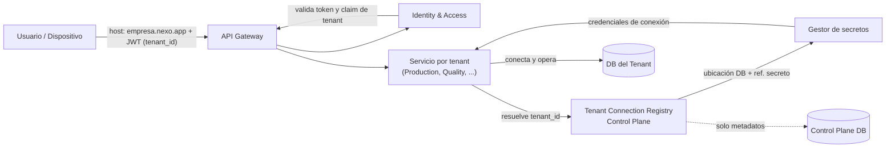
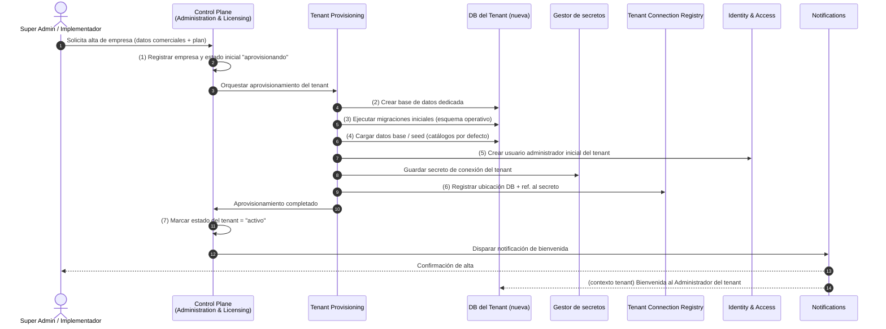
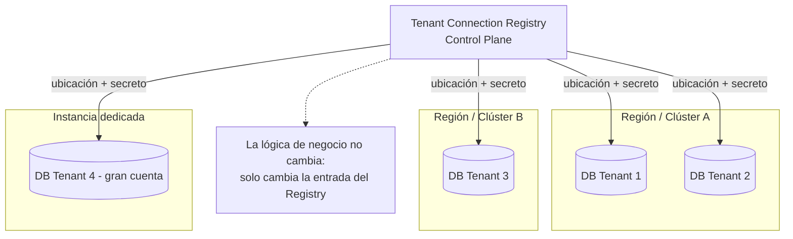

# Multi-Tenancy — Base de datos por tenant (DB-per-tenant)

> **Documento:** `specs/specs/multi-tenancy.md` · **Estado:** Borrador v0.1 · **Actualizado:** 2026-07-11
> **Roles:** Product Manager · Software Architect · UX Designer
> **Relacionados:** [control-plane.md](./control-plane.md) · [architecture.md](./architecture.md) · [scalability.md](./scalability.md) · [security.md](./security.md) · [integrations.md](./integrations.md) · [glossary.md](./glossary.md)

## Resumen ejecutivo

Este documento define el modelo de multi-tenancy de la plataforma **Nexo** y su decisión de arquitectura fundacional: **una base de datos dedicada por cada empresa cliente (DB-per-tenant)**. La decisión es un **requisito NO negociable** de la plataforma, inspirado en el proyecto de referencia **Hexa**, y condiciona el diseño de todos los dominios y microservicios: los servicios operativos trabajan siempre contra la DB del tenant resuelto, mientras que una única **Base Global (Control Plane)** concentra exclusivamente metadatos del proveedor.

El objetivo central de este modelo es garantizar el **aislamiento total** entre clientes: una empresa nunca puede acceder —ni por error, ni por bug, ni por escalada de privilegios en la capa de datos— a la producción, dispositivos, integraciones, archivos, usuarios o configuración de otra empresa. El aislamiento se aplica en cuatro planos simultáneos: **datos** (base separada), **storage** (bucket/prefijo por tenant), **cómputo** (procesamiento segmentado por tenant) y **credenciales** (secretos de conexión gestionados y separados).

En este documento se **comparan** las tres estrategias clásicas de multi-tenancy (base compartida, schema-por-tenant y DB-por-tenant) en tablas de ventajas/desventajas, dejando explícito que la comparación es solo ilustrativa: **la recomendación única y el diseño de toda la plataforma asumen DB-por-tenant**. No se propone la base compartida como solución principal ni como alternativa de fallback. Además se detalla el mecanismo de resolución de tenant, el flujo funcional de alta de un tenant (los 7 pasos canónicos), los servicios compartidos vs. por-tenant, las operaciones de ciclo de datos (migraciones, seed, backup, restore) y la escalabilidad futura del modelo.

Para la administración global del proveedor, ver [control-plane.md](./control-plane.md); para las metas de escala y estrategias de crecimiento, ver [scalability.md](./scalability.md); para el detalle de cifrado, secretos y modelo de amenazas, ver [security.md](./security.md).

---

## 1. Principio rector: aislamiento total por diseño

El multi-tenancy de Nexo parte de un principio no negociable: **cada empresa cliente (Tenant / Empresa) es un compartimento estanco**. No existe una tabla, colección ni bucket donde convivan datos operativos de dos clientes distintos. El aislamiento no se delega a una cláusula de filtrado (`WHERE tenant_id = ...`) que un desarrollador podría olvidar, sino que se materializa en la **topología física de datos**: bases de datos separadas.

Este principio se expresa en cuatro dimensiones de aislamiento, todas obligatorias:

| Dimensión de aislamiento | Qué significa en Nexo | Mecanismo |
|---|---|---|
| **Datos** | Cada tenant tiene su propia base de datos operativa. Ninguna consulta cruza el límite del tenant. | DB-per-tenant. La conexión se resuelve por tenant antes de tocar dato alguno. |
| **Storage** | Fotos, adjuntos y evidencias (Archivo / Media) viven en un bucket o prefijo exclusivo del tenant. | Object storage segmentado por tenant; credenciales/scopes por tenant. Ver [security.md](./security.md). |
| **Cómputo** | El procesamiento de eventos, reglas y read models de un tenant no interfiere ni comparte estado en memoria con otro. | Contexto de tenant explícito en cada unidad de trabajo; segmentación de colas/particiones por tenant. |
| **Credenciales** | Las cadenas de conexión, claves de storage y secretos de integración de cada tenant son independientes. | **Gestor de secretos central (Vault/KMS)**; el **Tenant Connection Registry** guarda **solo referencias** (no credenciales en claro) y las resuelve bajo demanda en el contexto del tenant; rotación periódica y ante incidente. |

> El aislamiento total es el mismo principio fundamental que gobierna [security.md](./security.md). Multi-tenancy y seguridad son dos caras de la misma decisión.

---

## 2. Comparación de estrategias de multi-tenancy

> **Nota de decisión:** La siguiente comparación se incluye por rigor de arquitectura y para documentar el razonamiento. **NO** implica que se evalúe adoptar base compartida o schema-por-tenant. La decisión de Nexo es **DB-per-tenant** y es definitiva (ver sección 3).

### 2.1 Las tres estrategias

- **Base compartida (shared database, shared schema):** todos los tenants comparten las mismas tablas; cada fila lleva una columna discriminadora `tenant_id`. El aislamiento es puramente lógico, sostenido por la aplicación.
- **Schema-por-tenant (shared database, separate schemas):** una sola base de datos física, pero cada tenant tiene su propio esquema/namespace de tablas. Aislamiento intermedio.
- **DB-por-tenant (database-per-tenant):** cada tenant tiene una base de datos completamente independiente. Aislamiento físico máximo. **← Modelo elegido por Nexo.**

### 2.2 Tabla comparativa — ventajas y desventajas

| Criterio | Base compartida | Schema-por-tenant | **DB-por-tenant (elegido)** |
|---|---|---|---|
| **Aislamiento de datos** | Débil (lógico, depende del filtro de la app) | Medio (namespaces, misma instancia) | **Fuerte (físico, base separada)** |
| **Riesgo de fuga entre tenants** | Alto (un bug de filtro expone a todos) | Medio | **Muy bajo (no hay dato de otro tenant en la misma base)** |
| **Blast radius de un incidente** | Toda la plataforma | La instancia compartida | **Un único tenant** |
| **Backup / restore por cliente** | Complejo (extraer filas de un tenant) | Medio | **Simple y nativo (respaldar/restaurar su base)** |
| **Migración individual de un cliente** | Muy difícil | Difícil | **Directa (mover su base a otro servidor/región)** |
| **Personalización por tenant (índices, tuning)** | Casi nula | Limitada | **Alta (cada base se ajusta a su carga)** |
| **Cumplimiento / residencia de datos** | Difícil de garantizar | Parcial | **Fácil (base ubicable por región)** |
| **Ruido entre vecinos (noisy neighbor)** | Alto | Medio-alto | **Bajo (recursos separables por tenant)** |
| **Costo por tenant pequeño** | Muy bajo | Bajo | Mayor (overhead por base) — mitigable (sección 8.4) |
| **Complejidad operativa (miles de bases)** | Baja | Media | Alta — se resuelve con automatización (Tenant Provisioning) |
| **Onboarding de nuevo tenant** | Trivial (insertar filas) | Crear esquema | **Crear base + migraciones + seed (automatizado, sección 6)** |
| **Consultas analíticas cross-tenant (proveedor)** | Nativas | Posibles | Requieren agregación explícita (por diseño, refuerza aislamiento) |

### 2.3 Conclusión de la comparación

Para un SaaS industrial que maneja **datos de producción sensibles, exigencias de trazabilidad, requisitos de cumplimiento y una promesa comercial de aislamiento total**, las ventajas de aislamiento, blast radius acotado, backup/restore por cliente, migración individual y residencia de datos de **DB-per-tenant superan claramente** el mayor costo y complejidad operativa —los cuales se neutralizan con automatización de aprovisionamiento y estrategias de densidad (secciones 6 y 8). Por eso Nexo adopta DB-per-tenant como **única** estrategia. La base compartida queda descartada como solución, incluso como fallback.

---

## 3. Decisión de arquitectura (no negociable)

**Nexo implementa multi-tenancy con base de datos por tenant (database-per-tenant), estilo Hexa.** Esta es la decisión fundacional y no se propone alternativa como principal.

Consecuencias de diseño que todos los documentos y dominios deben respetar:

1. **Los servicios "por tenant"** (Devices, Production, Quality, Scrap, Downtime, Traceability, Rules Engine, Dashboards, Reports, Audit) operan **siempre** contra la DB del tenant resuelto. Ver lista canónica en [architecture.md](./architecture.md).
2. **Los servicios "compartidos / global"** (Identity & Access, Tenant Provisioning, Administration & Licensing, Marketplace, Observability, Notifications, Files/Media, AI/Computer Vision, Connectors/Integrations en su parte de config) **nunca** almacenan datos operativos de clientes en una base común: solo metadatos/config en el Control Plane o storage segmentado por tenant.
3. La **lógica de negocio no cambia** según dónde viva físicamente la DB del tenant (mismo servidor, otro clúster u otra región). La ubicación es un detalle de infraestructura resuelto por el registro de conexiones.
4. El **Control Plane** es la única base compartida y solo contiene metadatos del proveedor (ver sección 4 y [control-plane.md](./control-plane.md)).

---

## 4. Base Global (Control Plane DB)

La **Base Global (Control Plane DB)** es la base de datos exclusiva del proveedor de Nexo. Es la única base compartida de toda la plataforma y su función es administrar el ecosistema de tenants, no la operación de ningún cliente. Su gestión y experiencia de administración se detallan en [control-plane.md](./control-plane.md).

### 4.1 Qué contiene el Control Plane

| Categoría | Contenido | Servicio responsable |
|---|---|---|
| **Empresas / Tenants** | Registro de cada empresa cliente, datos comerciales, estado del tenant | Tenant Provisioning · Administration & Licensing |
| **Planes y Licencias** | Plan contratado, vencimientos, límites de uso, módulos/features habilitados | Administration & Licensing |
| **Estado de tenants** | Estado del ciclo de vida (aprovisionando, activo, suspendido, dado de baja…) | Tenant Provisioning · Observability |
| **Usuarios globales** | Super Administrador, Soporte, Implementador, Partner | Identity & Access |
| **Partners** | Integradores/implementadores y su relación comercial con tenants | Administration & Licensing |
| **Tenant Connection Registry** | Ubicación de la DB de cada tenant + **referencia** al secreto de conexión en el gestor central (nunca credenciales en claro) | Tenant Provisioning |
| **Feature Flags** | Banderas de funcionalidad por plan/tenant/entorno | Administration & Licensing |
| **Marketplace** | Catálogo de conectores oficiales y de terceros | Marketplace |
| **Versiones y despliegues** | Versionado de servicios, despliegues progresivos, rollbacks, compatibilidad | Observability · Administration & Licensing |
| **Auditoría global** | Acciones del proveedor sobre tenants (alta, baja, suspensión…) | Audit (global) |
| **Facturación y métricas generales** | Consumo agregado, métricas de plataforma, datos de billing | Administration & Licensing · Observability |
| **Configuración global** | Parámetros de plataforma no específicos de un tenant | Administration & Licensing |

### 4.2 Qué NUNCA contiene el Control Plane

El Control Plane **jamás** almacena datos operativos de producción de los clientes. En particular, nunca contiene:

- Registros de producción, scrap, inspecciones de calidad, paradas ni eventos de máquina.
- Trazabilidad, genealogía de lote/serie ni el historial inmutable de eventos de un tenant.
- Dispositivos, sensores, señales/tags ni lecturas de un tenant.
- Usuarios operativos del tenant (operarios, supervisores, etc.) con su detalle de negocio —el Control Plane solo conoce usuarios **globales del proveedor**; la identidad operativa vive por tenant (ver [users-permissions.md](./users-permissions.md)).
- Archivos/evidencias (fotos, adjuntos) —esos viven en storage segmentado por tenant.
- Configuración operativa de plantas, líneas, reglas o mapeos de integración con nivel de dato de negocio.

> Regla de oro: si un dato pertenece a la **operación** de un cliente, va en la **DB de ese tenant** (o en su storage). Si es un **metadato del proveedor** sobre el ecosistema, va en el **Control Plane**.

---

## 5. Resolución de tenant

Cada request que llega a la plataforma debe **resolver a qué tenant pertenece** antes de tocar cualquier dato operativo. La resolución es un paso previo y obligatorio en el pipeline de cada servicio "por tenant".

### 5.1 Fuentes de identidad del tenant

1. **Subdominio / host:** cada empresa accede por un subdominio propio (por ejemplo, `empresa.nexo.app`). El host identifica al tenant de forma inicial.
2. **Claim `tenant_id` en el JWT:** el token emitido por **Identity & Access** incluye el claim de tenant. Este claim es la fuente autoritativa dentro de la sesión autenticada y se valida contra el host. Ver [security.md](./security.md) y [users-permissions.md](./users-permissions.md).

### 5.2 Del identificador a la conexión

El identificador de tenant se traduce en una conexión concreta mediante el **Tenant Connection Registry** (alojado en el Control Plane):

1. La API Gateway y el servicio reciben el request con host + JWT (claim `tenant_id`).
2. Se valida que el claim de tenant sea coherente con el host y con los permisos del usuario.
3. Se consulta el **Tenant Connection Registry** para obtener la **ubicación** de la DB del tenant y la referencia a su **secreto de conexión**.
4. El secreto se resuelve contra el gestor de secretos (nunca viaja en el token ni se persiste en logs). Ver [security.md](./security.md).
5. El servicio abre/reutiliza la conexión a la **DB del tenant** y ejecuta la lógica de negocio.

> La lógica de negocio es **idéntica** independientemente de dónde viva la DB. El Registry desacopla "quién es el tenant" de "dónde y cómo me conecto a su base".

### 5.3 Diagrama — flujo de resolución de tenant

---

## 6. Flujo de alta de un tenant (7 pasos, funcional)

El alta de un nuevo tenant es un proceso **automatizado** orquestado por **Tenant Provisioning**, disparado desde el [control-plane.md](./control-plane.md) por un rol global (Super Administrador o Implementador). Se documenta el **flujo funcional**, no la implementación técnica. Son los 7 pasos canónicos:

1. **Registrar la empresa** en la Base Global (Control Plane): datos comerciales, plan contratado y estado inicial del tenant.
2. **Crear automáticamente la base de datos** dedicada del tenant (la DB operativa exclusiva de esa empresa).
3. **Ejecutar las migraciones iniciales:** desplegar la estructura del esquema operativo del tenant (dominios de producción, calidad, scrap, paradas, dispositivos, trazabilidad, etc.).
4. **Cargar datos base (seed):** catálogos por defecto —motivos (Reason Codes) de scrap y parada, roles, unidades de medida, turnos base y demás valores iniciales.
5. **Crear el usuario administrador inicial** del tenant (rol Administrador del tenant), con sus credenciales de acceso.
6. **Registrar la información de conexión** del tenant en el **Tenant Connection Registry** (ubicación de la DB + secreto/credenciales gestionadas).
7. **Dejar la empresa lista para operar:** marcar el estado del tenant como **"activo"** y enviar la notificación de bienvenida al administrador.

### 6.1 Diagrama de secuencia — alta de tenant

> El ciclo de vida completo del tenant (suspensión, reactivación, baja lógica) se define en [control-plane.md](./control-plane.md).

---

## 7. Servicios compartidos vs. servicios por tenant

Centralizar ciertos servicios reduce costo y complejidad **sin comprometer el aislamiento**, siempre que esos servicios **no almacenen dato operativo del cliente** o lo traten de forma efímera y segmentada por tenant. La lista canónica de microservicios está en [architecture.md](./architecture.md); aquí se justifica la clasificación desde la óptica de tenancy.

### 7.1 Tabla justificada

| Servicio (BC) | Clasificación | Dónde viven los datos | Justificación de tenancy |
|---|---|---|---|
| **Identity & Access** | Compartido | Control Plane + claims por tenant | Autenticación centralizada; emite tokens con claim de tenant. No guarda dato operativo. |
| **Tenant Provisioning** | Global / CP | Control Plane DB | Crea y registra las DB de tenants; opera sobre metadatos del ecosistema. |
| **Administration & Licensing** | Global / CP | Control Plane DB | Planes, licencias, límites, feature flags, facturación: metadatos del proveedor. |
| **Marketplace** | Global / CP | Control Plane DB | Catálogo de conectores común a toda la plataforma; no hay dato de cliente. |
| **Observability** | Global / CP | Control Plane DB | Estado de tenants/servicios/conectores, métricas y logs centralizados (segmentados por tenant). |
| **Ingestion / Edge Gateway** | Compartido (procesa por tenant) | Buffer + enruta | Recibe y normaliza eventos, pero cada evento se enruta a la DB del tenant. Trata el dato de forma efímera. |
| **Connectors / Integrations** | Compartido (config por tenant) | DB del tenant + CP | La lógica de sincronización es común; los mapeos y datos van a la DB del tenant. Ver [integrations.md](./integrations.md). |
| **Notifications** | Compartido | Config por tenant | Envío multicanal centralizado; plantillas/config por tenant, mensajes efímeros. |
| **Files / Media** | Compartido (storage aislado por tenant) | Object storage | Servicio común de archivos, pero cada evidencia vive en bucket/prefijo del tenant. |
| **AI / Computer Vision** | Compartido | Modelos + storage por tenant | Motor común; datos e inferencias segmentados por tenant (fase futura). |
| **Devices** | Por tenant | DB del tenant | Dispositivos, sensores, tags, salud, firmware: 100% dato operativo del cliente. Ver [devices.md](./devices.md). |
| **Production** | Por tenant | DB del tenant | Órdenes y registros de producción del cliente. |
| **Quality** | Por tenant | DB del tenant | Inspecciones, defectos, disposiciones del cliente. |
| **Scrap** | Por tenant | DB del tenant | Registros de scrap, motivos y costos del cliente. |
| **Downtime (Paradas)** | Por tenant | DB del tenant | Eventos de parada y motivos del cliente. |
| **Traceability / Event Store** | Por tenant | DB del tenant | Historial inmutable y genealogía del cliente. Ver [traceability.md](./traceability.md). |
| **Rules Engine** | Por tenant | DB del tenant | Reglas trigger-condición-acción del cliente. |
| **Dashboards / Analytics** | Por tenant | Read models | KPIs y tableros construidos sobre datos del tenant (CQRS). |
| **Reports** | Por tenant | Read models | Reportes on-demand/programados sobre datos del tenant. |
| **Audit** | Por tenant (+ global CP) | DB del tenant | Auditoría operativa por tenant; auditoría del proveedor en CP. |

### 7.2 Regla de clasificación

> Un servicio puede ser **compartido** solo si (a) no persiste dato operativo del cliente en una base común, o (b) lo procesa de forma efímera y siempre lo entrega/segmenta por tenant. Si un servicio necesita persistir dato de negocio del cliente, es **por tenant** y escribe en la DB del tenant.

---

## 8. Migraciones, seed, backup y restore por tenant

Con miles de bases de datos, estas operaciones deben ser **automatizadas, versionadas y ejecutables por tenant o por lote**. Son responsabilidad funcional de **Tenant Provisioning** (con soporte de Observability para seguimiento).

### 8.1 Migraciones de esquema

- Cada versión del esquema operativo del tenant está **versionada e idempotente**; toda DB de tenant conoce en qué versión está y una migración puede re-aplicarse de forma segura.
- Las migraciones se aplican **por cohortes con feature flags** (por ejemplo, primero un grupo piloto → grupos → total), habilitando **despliegues progresivos** con **objetivo de zero-downtime**, alineados con las versiones de servicio (ver [control-plane.md](./control-plane.md)).
- Un alta de tenant siempre parte de las migraciones iniciales (paso 3 del flujo de alta).
- El estado de migración de cada tenant es **observable** desde el Control Plane (quién está atrasado, quién falló, quién está al día).

### 8.2 Seed (datos base)

- El seed carga catálogos por defecto: motivos (Reason Codes) de scrap y parada, roles, unidades de medida, turnos base, etc.
- El seed es **idempotente y versionado**: se puede re-aplicar de forma segura y evoluciona junto con el esquema.

### 8.3 Backup y restore

- El **backup por tenant** es una ventaja nativa del modelo: respaldar una empresa es respaldar su base. Restaurar un cliente **no afecta** a los demás.
- Permite **recuperación granular**: point-in-time recovery de un único tenant sin tocar al resto.
- Cada tenant puede tener su **política de retención y frecuencia** de backup según su plan/licencia y requisitos de cumplimiento (ver [security.md](./security.md)).
- El estado y la última fecha de backup por tenant son **observables** desde el Control Plane.

### 8.4 Densidad y costo operativo

- Aunque cada tenant tiene su base lógica, la plataforma puede **agrupar múltiples bases de tenants pequeños en una misma instancia/clúster** para optimizar costo, manteniendo el aislamiento lógico por base. Tenants grandes o exigentes pueden vivir en instancias dedicadas.
- Esta densidad es un parámetro de infraestructura que **no cambia la lógica de negocio** ni el modelo: el Registry siempre sabe dónde está cada base. Ver [scalability.md](./scalability.md).

### 8.5 Tabla resumen de operaciones de ciclo de datos

| Operación | Alcance | Disparador | Ventaja del modelo DB-per-tenant |
|---|---|---|---|
| Migración inicial | Un tenant | Alta de tenant (paso 3) | Esquema limpio y versionado desde el día 1 |
| Migración evolutiva | 1 · lote · cohorte | Nueva versión de servicio | Despliegue progresivo, rollback por cohorte |
| Seed | Un tenant | Alta / re-seed | Idempotente, catálogos consistentes |
| Backup | Un tenant | Programado / bajo demanda | Respaldo por cliente, sin acoplar a otros |
| Restore | Un tenant | Incidente / solicitud | Recuperación granular, blast radius = 1 tenant |
| Migración física de DB | Un tenant | Escala / geo / balanceo | Mover un cliente sin afectar a los demás (sección 9) |

---

## 9. Escalabilidad futura del modelo

El modelo DB-per-tenant es la base de la estrategia de escala de Nexo (ver metas y estrategias completas en [scalability.md](./scalability.md)). Sus habilitadores clave:

- **DB de tenant en distinto servidor/clúster:** cada base puede vivir donde convenga sin cambios en la lógica de negocio. El Tenant Connection Registry abstrae la ubicación. Esto ya **particiona la carga por tenant** (sharding natural).
- **Distribución geográfica:** una empresa puede alojar su base en la región que exijan sus requisitos de latencia o de residencia/cumplimiento de datos (ver [security.md](./security.md)), sin afectar a otros tenants.
- **Balanceo y densidad:** se pueden reubicar tenants entre instancias para equilibrar carga o consolidar costos, ajustando solo infraestructura y el Registry.
- **Migración individual transparente:** mover un único cliente (de servidor, clúster o región) es una operación acotada que **no impacta** al resto de la plataforma. Es una consecuencia directa del aislamiento físico.

### 9.1 Diagrama — distribución flexible de las DB de tenants

---

## 10. Relación con otros documentos

- **[control-plane.md](./control-plane.md):** administración global, entidades del Control Plane, ciclo de vida del tenant, licencias, observabilidad, marketplace.
- **[architecture.md](./architecture.md):** lista canónica de microservicios, event-driven, CQRS, API Gateway, observabilidad transversal.
- **[scalability.md](./scalability.md):** metas de escala (miles de empresas, millones de eventos/día) y estrategias.
- **[security.md](./security.md):** cifrado, gestión de secretos, aislamiento de red, cumplimiento y modelo de amenazas.
- **[integrations.md](./integrations.md):** conectores y sincronización con ERPs (config por tenant).
- **[devices.md](./devices.md)** · **[traceability.md](./traceability.md)** · **[users-permissions.md](./users-permissions.md):** dominios por tenant.

---

## Preguntas abiertas

1. **Nombre del producto:** "Nexo" es un working name provisional; falta confirmar naming definitivo y disponibilidad de dominios/subdominios (impacta el esquema de resolución por subdominio).
2. **Estrategia de densidad inicial:** ¿cuántos tenants por instancia en el arranque y cuál es el umbral (por consumo/plan) que promueve a un tenant a instancia dedicada?
3. **Residencia de datos:** ¿qué regiones se ofrecerán en el MVP/V1 y cómo se comercializa la residencia de datos por región (¿feature enterprise, opción de plan?)?
4. ✅ **Resuelto (2026-07-11):** migraciones versionadas e idempotentes, aplicadas por cohortes con feature flags y objetivo zero-downtime, con estado de migración observable por tenant desde el Control Plane — ver [tablero de decisiones](../open-questions-board.md).
5. **Política de backup por plan:** ¿qué frecuencia, retención y RPO/RTO se garantizan por plan/licencia, y cómo se reflejan en Administration & Licensing?
6. **Reporting cross-tenant del proveedor:** ¿cómo se construyen las métricas agregadas de plataforma sin violar el aislamiento (agregación en Observability vs. pipeline analítico separado)?
7. **Migración física en caliente:** ¿qué SLA y experiencia se ofrece al mover un tenant de región/clúster (¿modo lectura, ventana, transparente)?
8. **Herramientas de acceso de Soporte:** ¿bajo qué controles el rol Soporte puede acceder temporalmente a la DB de un tenant (break-glass) y cómo se audita? (coordinar con [security.md](./security.md)).
