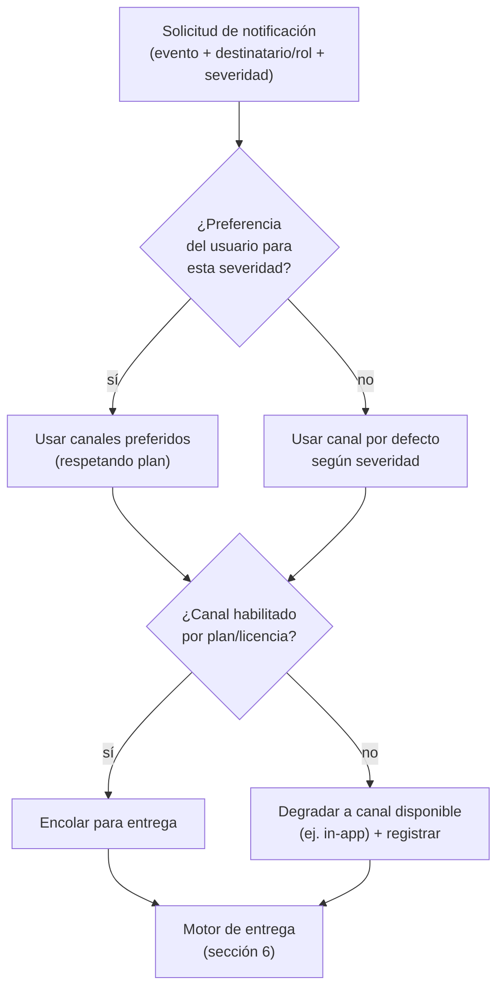
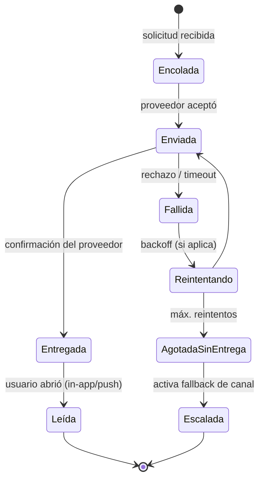
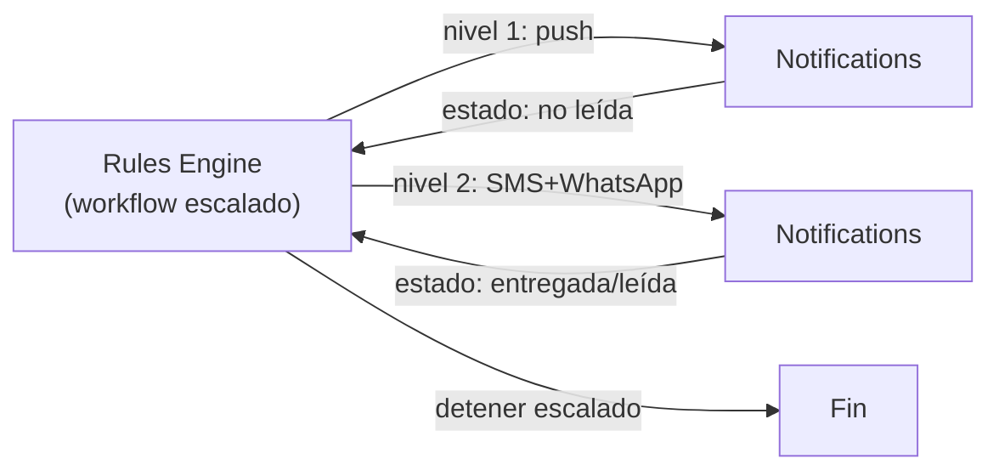

# Notifications (Notificaciones)

> **Documento:** `specs/specs/notifications.md` · **Estado:** Borrador v0.1 · **Actualizado:** 2026-07-11
> **Roles:** Product Manager · Software Architect · UX Designer
> **Relacionados:** [rules-engine.md](./rules-engine.md) · [users-permissions.md](./users-permissions.md) · [control-plane.md](./control-plane.md) · [dashboards.md](./dashboards.md) · [notifications.md](./notifications.md) · [architecture.md](./architecture.md) · [glossary.md](./glossary.md)

## Resumen ejecutivo

El servicio **Notifications** entrega, por múltiples canales, los mensajes que el resto de la plataforma necesita hacer llegar a las personas: alertas de una regla, un escalado que nadie acusó, el resultado de una sincronización, la bienvenida al alta de un tenant. Es un **servicio compartido** (según la lista canónica de microservicios del brief) pero **segmentado por tenant**: centraliza la mecánica de envío sin comprometer el aislamiento total: cada tenant tiene su propia configuración, plantillas, preferencias y credenciales de proveedor, y ningún mensaje ni destinatario se filtra entre empresas.

Su responsabilidad es la **entrega**, no la **decisión**. Quién debe recibir qué y cuándo lo determina el [Rules Engine](./rules-engine.md) (o el servicio que origina el aviso); Notifications resuelve el "cómo llega": elige canal, aplica la plantilla, respeta las **preferencias del usuario**, ejecuta las **reglas de escalado** de entrega, y garantiza la **entrega con reintentos**. La entidad canónica que produce es la **Notificación (Notification)**: un mensaje entregado por un canal.

Este documento define los **canales** (in-app, email, SMS, push, WhatsApp, webhooks), los **tipos de eventos notificables**, las **plantillas**, las **preferencias por usuario**, las **reglas de escalado**, el modelo de **entrega/reintentos**, y cómo el servicio permanece **compartido pero segmentado por tenant**, apoyándose en el [Control Plane](./control-plane.md) para credenciales y límites.

---

## 1. Alcance y no-alcance

| Sí es alcance de Notifications | NO es alcance (vive en otro documento) |
|---|---|
| Entrega multicanal (in-app/email/SMS/push/WhatsApp/webhook) | Decidir qué condición dispara el aviso → [rules-engine.md](./rules-engine.md) |
| Plantillas, render y localización del mensaje | Ciclo de vida de la Alerta (ack/resuelta) → [rules-engine.md](./rules-engine.md) |
| Preferencias de canal por usuario | Identidad/roles de destinatarios → [users-permissions.md](./users-permissions.md) |
| Escalado de **entrega** y reintentos | Lógica de negocio del escalado (workflow) → [rules-engine.md](./rules-engine.md) |
| Estado de entrega (enviado/entregado/fallido) | Credenciales globales de proveedores → [control-plane.md](./control-plane.md) |
| Preferencias globales y digest | Visualización de alarmas en tablero → [dashboards.md](./dashboards.md) |

> **Regla de frontera:** el Rules Engine dice *"notificar al supervisor por push"*; Notifications resuelve *cómo* (plantilla, idioma, proveedor, reintento) y *garantiza* que llegue o quede registrado como fallido. La **lógica** del escalado (cuándo subir de nivel) es del workflow del motor; la **mecánica** de re-enviar por otro canal es de Notifications.

---

## 2. Canales

| Canal | Uso típico | Latencia / criticidad | Consideraciones |
|---|---|---|---|
| **In-app** | Centro de notificaciones dentro de Nexo (web/tablet) | Inmediata; siempre disponible | Canal base; no depende de terceros; alimenta el badge de la UI |
| **Email** | Resúmenes, alertas no urgentes, reportes distribuidos | Minutos | Plantillas ricas; ideal para digest y adjuntos ([reports.md](./reports.md)) |
| **SMS** | Alertas críticas, escalado, donde no hay smartphone | Segundos-minutos | Costo por mensaje; texto corto; útil sin datos móviles |
| **Push** | Alertas a la app móvil/tablet de planta | Segundos | Requiere registro de token de dispositivo; bueno para operarios |
| **WhatsApp** | Alertas y confirmaciones donde el canal es de uso cotidiano | Segundos | Plantillas aprobadas por el proveedor; muy usado en industria local |
| **Webhook** | Integrar sistemas del cliente (guardia, ticketing, chat corporativo) | Segundos | Saliente, firmado, con reintentos; puente hacia terceros |

### 2.1 Selección de canal

La elección del canal surge de la combinación **severidad del evento × preferencias del usuario × disponibilidad × límites del plan**:

> Los canales de pago (SMS/WhatsApp) pueden estar limitados por **plan/licencia** (ver [control-plane.md](./control-plane.md)); si no están disponibles, la entrega **degrada** a un canal disponible y lo registra, sin perder el aviso.

---

## 3. Tipos de eventos notificables

Los eventos notificables se alinean con el **Evento canónico** y con las familias de dominio. La mayoría llegan a través del [Rules Engine](./rules-engine.md); algunos son de sistema/plataforma.

| Categoría | Ejemplos de evento notificable | Origen típico | Severidad usual |
|---|---|---|---|
| **Alertas de proceso** | Temperatura fuera de rango, presión anómala | Rules Engine (`reading`) | Advertencia/Crítica |
| **Producción** | Orden completada, ritmo por debajo de meta | Rules Engine ([production.md](./production.md)) | Info/Advertencia |
| **Scrap** | Scrap del turno supera umbral | Rules Engine ([scrap.md](./scrap.md)) | Advertencia |
| **Calidad** | Inspección fallida, defecto crítico recurrente | Rules Engine ([quality.md](./quality.md)) | Advertencia/Crítica |
| **Paradas** | Parada larga sin motivo, máquina caída | Rules Engine ([downtime.md](./downtime.md)) | Crítica |
| **Dispositivos** | Device offline, batería baja, dato degradado | Rules Engine / Devices | Advertencia |
| **Integraciones** | Sync Job falló, conflicto de mapeo | Rules Engine ([integrations.md](./integrations.md)) | Advertencia/Crítica |
| **Escalados** | Alerta sin acuse en tiempo T | Workflow del Rules Engine | Crítica |
| **Reportes** | Reporte programado listo/distribuido | [reports.md](./reports.md) | Info |
| **Plataforma / tenant** | Bienvenida al alta, cambios de plan, cuota al límite | Control Plane | Info/Advertencia |
| **Seguridad** | Login sospechoso, cambio de permisos | Identity & Access / Audit | Advertencia/Crítica |

### 3.1 Niveles de severidad

| Severidad | Significado | Canal por defecto | Escalado |
|---|---|---|---|
| **Info** | Confirmación o dato; no requiere acción | In-app (+ email si se prefiere) | No |
| **Advertencia** | Requiere atención en el turno | In-app + push | Opcional |
| **Crítica** | Requiere acción inmediata | In-app + push + SMS/WhatsApp | Sí, con escalado |

---

## 4. Plantillas

Una **plantilla** define el contenido de la Notificación para un tipo de evento y canal. Separa el **qué se dice** del **cómo se decide** (motor) y del **cómo se entrega** (canal).

| Aspecto de la plantilla | Descripción |
|---|---|
| **Clave / tipo** | Identifica el evento (ej. "parada_larga_sin_motivo") |
| **Variantes por canal** | Mismo mensaje adaptado a in-app/email/SMS/push/WhatsApp (longitud, formato) |
| **Variables / contexto** | Placeholders que se rellenan del evento: planta, línea, máquina, valor, orden, turno, operario |
| **Localización** | es-AR por defecto; extensible a otros idiomas por tenant/usuario |
| **Severidad y tono** | Coherentes con el nivel (crítica: directa y accionable) |
| **Enlace de acción** | Deep link al recurso en Nexo (alerta, tablero, orden) para "ver y acusar" |
| **Marca por tenant** | Logo/remitente/firma del tenant (sin exponer datos de otros tenants) |

- **Herencia:** plantillas por defecto de la plataforma → override por tenant → (opcional) override por planta. El tenant puede personalizar sin partir de cero.
- **Versionado y previsualización:** las plantillas se versionan y se pueden previsualizar con datos de ejemplo antes de activarse.
- **WhatsApp/SMS:** respetan restricciones del proveedor (plantillas pre-aprobadas, longitud), gestionadas por tenant.

---

## 5. Preferencias por usuario

Cada usuario controla **cómo** quiere ser notificado, dentro de lo que el tenant y el plan permiten. Las preferencias se resuelven junto con el **rol** y el **scope** de plantas/líneas ([users-permissions.md](./users-permissions.md)).

| Dimensión de preferencia | Opciones |
|---|---|
| **Canal por severidad** | Elegir canales para Info / Advertencia / Crítica |
| **Suscripción por categoría** | Activar/silenciar familias (producción, calidad, paradas…) según su rol/scope |
| **Horario / no-molestar** | Ventanas de silencio (respetando que las críticas puedan forzarse) |
| **Digest / agrupación** | Recibir resúmenes (ej. email diario) en vez de avisos sueltos para baja severidad |
| **Idioma** | Idioma de las plantillas |
| **Dispositivos** | Gestión de tokens push y números de contacto verificados |

> **Guardas:** las notificaciones **críticas** pueden configurarse a nivel tenant como **no silenciables**, para que una parada urgente no quede oculta por un "no molestar". El operario recibe solo lo de su **scope** (su línea/planta), evitando ruido.

---

## 6. Entrega y reintentos

El motor de entrega garantiza *at-least-once* con control de duplicados, y registra el **estado** de cada Notificación para trazabilidad y para alimentar el escalado.

### 6.1 Ciclo de vida de una notificación

### 6.2 Política de reintentos y fallback

| Mecanismo | Descripción |
|---|---|
| **Reintentos con backoff** | Reintentar envíos fallidos con espera creciente, hasta un máximo por canal |
| **Idempotencia** | Clave por (evento + destinatario + canal) para no duplicar el mismo aviso |
| **Fallback de canal** | Si un canal agota reintentos, degradar a otro (ej. SMS falla → in-app + email) |
| **Confirmación de entrega** | Usar acuses del proveedor (delivery receipts) donde existan |
| **Cola por tenant/prioridad** | Críticas primero; aislamiento de colas para que un tenant no afecte a otro |
| **Dead-letter** | Avisos irremediablemente no entregables quedan registrados para diagnóstico |
| **Rate limiting anti-tormenta** | Agrupar/limitar ráfagas del mismo tipo para no saturar al usuario |

### 6.3 Rol en el escalado

El **workflow** de escalado lo gobierna el [Rules Engine](./rules-engine.md) (cuándo subir de nivel y a quién). Notifications aporta la **señal**: informa si una notificación fue **entregada/leída/acusada**, de modo que el motor sepa si debe escalar. Cuando el motor pide un nuevo nivel, Notifications lo entrega por el canal indicado (típicamente más intrusivo: SMS/WhatsApp).

---

## 7. Servicio compartido pero segmentado por tenant

Notifications es **compartido** (una sola infraestructura de entrega) pero **estrictamente segmentado por tenant**, en línea con el principio de servicios compartidos del brief (centralizar sin comprometer aislamiento).

| Dimensión | Cómo se segmenta por tenant |
|---|---|
| **Configuración** | Plantillas, remitentes, marca y preferencias por tenant |
| **Credenciales de proveedor** | Cada tenant puede usar sus propias credenciales (email/SMS/WhatsApp) o las gestionadas por el proveedor; secretos aislados en el [control-plane.md](./control-plane.md) |
| **Destinatarios** | Solo usuarios del tenant; nunca cruza empresas |
| **Colas y límites** | Colas y cuotas por tenant; un tenant no consume el presupuesto de entrega de otro |
| **Datos efímeros** | El contenido operativo del mensaje se trata de forma efímera/segmentada; no se acumula en una base común |
| **Auditoría** | Registro de envíos por tenant (quién, qué, cuándo, estado) para su propia Audit |

- **Control Plane** provee: catálogo de canales habilitados por plan, límites/cuotas, credenciales gestionadas y estado del servicio (Observability). Ver [control-plane.md](./control-plane.md).
- **Sin dato operativo en común:** el servicio no almacena producción/scrap/paradas; solo el mensaje a entregar y su estado, segmentado por tenant y con retención acotada.

---

## 8. Escalabilidad, resiliencia y observabilidad

- **Escala de diseño:** picos de eventos (millones/día) ⇒ colas por tenant/prioridad, envío asíncrono, batching de digests, y aislamiento de fallos por proveedor (ver [scalability.md](./scalability.md)).
- **Resiliencia ante proveedores caídos:** *circuit breaker* por proveedor y **fallback de canal**; los avisos no se pierden (se reintentan o degradan).
- **Anti-tormenta:** agrupación y rate limiting para no saturar a las personas ante ráfagas (coordinado con cooldown/dedup del Rules Engine).
- **Observabilidad:** tasas de entrega/fallo por canal y tenant, latencias y colas se reportan a **Observability** del Control Plane; alertas de plataforma si un canal degrada.
- **Aislamiento:** ninguna caída ni cuota de un tenant impacta a otro.

---

## 9. Trazabilidad de dependencias (resumen)

| Notifications depende de / colabora con | Para |
|---|---|
| [rules-engine.md](./rules-engine.md) | Recibir solicitudes de aviso y señales para el escalado |
| [users-permissions.md](./users-permissions.md) | Resolver destinatarios por rol/scope y sus datos de contacto |
| [control-plane.md](./control-plane.md) | Canales por plan, límites/cuotas, credenciales gestionadas, estado |
| [dashboards.md](./dashboards.md) | Coherencia con las alarmas mostradas (mismo origen) |
| [reports.md](./reports.md) | Distribuir reportes programados por email/enlace |
| [integrations.md](./integrations.md) | Notificar resultados de sincronización |

---

## Preguntas abiertas

1. **Credenciales de proveedor:** ¿el modelo por defecto usa credenciales gestionadas por el proveedor de Nexo o BYO (bring-your-own) por tenant para SMS/WhatsApp? ¿Cómo se factura el consumo?
2. **Críticas no silenciables:** ¿la política de "no molestar no aplica a críticas" es configurable por tenant, o es un mínimo obligatorio de plataforma?
3. **Estado de lectura y escalado:** ¿qué señal exacta (entregada vs leída vs acusada) detiene un escalado? Requiere contrato claro con [rules-engine.md](./rules-engine.md).
4. **Retención de mensajes:** ¿cuánto tiempo se conserva el contenido y el estado de las notificaciones por tenant, y qué exige la auditoría?
5. **WhatsApp/SMS regulatorio:** manejo de plantillas pre-aprobadas, opt-in/opt-out y regulaciones locales (Argentina y otros mercados).
6. **Digest inteligente:** ¿se agrupan automáticamente avisos de baja severidad en resúmenes? ¿Con qué frecuencia y quién lo configura?
7. **Fallback de canal:** definir la matriz exacta de degradación por canal (qué canal reemplaza a cuál) y si el usuario puede vetarla.
8. **Preferencias vs obligatoriedad:** ¿puede un tenant forzar ciertos avisos (seguridad, paradas críticas) por encima de las preferencias del usuario?
