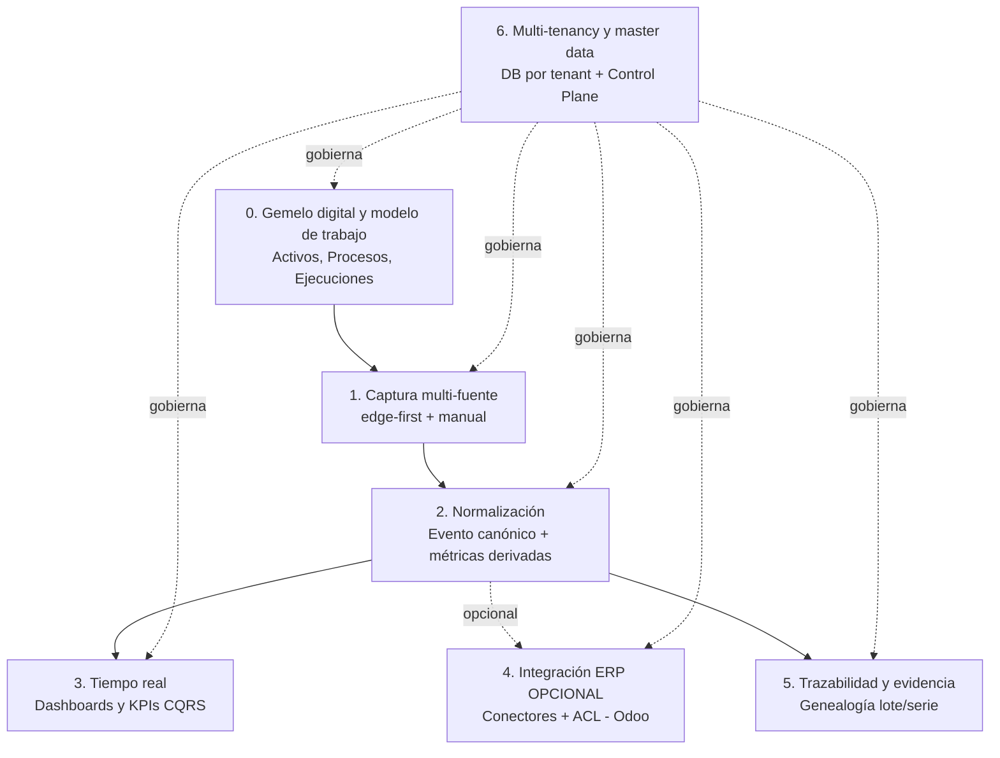

# Producto — Nexo

> **Documento:** `specs/specs/product.md` · **Estado:** Borrador v0.1 · **Actualizado:** 2026-07-13
> **Roles:** Product Manager · Software Architect · UX Designer
> **Relacionados:** [idea.md](../idea.md) · [layered-architecture.md](./layered-architecture.md) · [master-data.md](./master-data.md) · [modules.md](./modules.md) · [architecture.md](./architecture.md) · [control-plane.md](./control-plane.md) · [users-permissions.md](./users-permissions.md) · [roadmap.md](../roadmap/roadmap.md)

## Resumen ejecutivo

Este documento define la **estrategia de producto de Nexo**: qué construimos, para quién, cómo nos posicionamos y cómo medimos el éxito. Nexo es un **sistema autónomo de ejecución y trazabilidad del trabajo en planta**: modela cómo se hace el trabajo, lo ejecuta en piso y lo mide con hechos, convirtiendo datos heterogéneos en **eventos normalizados** y trazables de los que derivan progreso, cuellos de botella, tiempos muertos y costo real (ver [idea.md](../idea.md)). **Funciona sin ERP**; la integración con Odoo u otro sistema de gestión es un **conector opcional** que acelera, pero no condiciona, la propuesta de valor.

El producto se organiza sobre un **modelo de 4 capas** —gemelo digital, modelo de trabajo, ejecución y motor de eventos (ver [layered-architecture.md](./layered-architecture.md))— y sobre **pilares funcionales** (captura multi-fuente, normalización a evento canónico, tiempo real, trazabilidad, master data propia, integración ERP opcional y multi-tenancy) que se materializan en un catálogo de **módulos** (ver [modules.md](./modules.md)), cada uno alineado a un microservicio/bounded context. Al unificar **producción repetitiva y trabajo por proyecto** bajo el mismo modelo, el producto sirve tanto a la manufactura en serie como a la construcción, la metalmecánica a medida y la ingeniería bajo pedido. Sirve a **nueve personas del tenant** (Operario, Supervisor, Calidad, Producción, **Responsable de proyecto/obra**, Mantenimiento, Gerencia, Administrador e Integraciones) y a **cuatro roles globales** del proveedor (Super Administrador, Soporte, Implementador, Partner).

Aquí se especifican la visión de producto, el posicionamiento competitivo, el **modelo de 4 capas** a alto nivel, las personas con sus dolores y objetivos, la propuesta de valor por persona, los pilares funcionales, el **alcance del MVP y lo explícitamente fuera de MVP** —incluido el **impacto de alcance** que introduce la master data propia—, el mapa de módulos, las **métricas de éxito** (activación, adopción, reducción de carga manual, time-to-value), el **modelo de licenciamiento/monetización** a alto nivel (planes y límites por usuarios/dispositivos/plantas, coherente con [control-plane.md](./control-plane.md)) y la **matriz de módulos por fase**.

---

## 1. Visión de producto

> Ser **el sistema donde vive la ejecución del trabajo en planta**: que cualquier organización industrial —fabrique en serie o trabaje por proyecto— pueda modelar cómo se hace el trabajo, capturar en su origen lo que realmente ocurre —producción, avance, scrap, calidad, paradas, eventos de máquina—, normalizarlo a un dato confiable y trazable, verlo en tiempo real y, si lo desea, sincronizarlo con su ERP, sin cargar nada dos veces.

Nexo persigue una experiencia donde el **operario dedica segundos, no minutos**, a registrar; donde el **supervisor ve el turno en vivo**, no al día siguiente; donde el **responsable de proyecto conoce el avance real**, no una estimación; donde la **gerencia decide con KPIs confiables**; y donde el **ERP —si existe— recibe el dato automáticamente**. Todo sobre una plataforma cloud native, event-driven y multi-tenant con **base de datos por tenant** que escala de una línea a miles de plantas (ver [architecture.md](./architecture.md)).

---

## 2. Posicionamiento

**Para** organizaciones industriales que ejecutan trabajo físico —en serie o por proyecto— y hoy lo registran a mano, **que** necesitan saber en qué están, cómo vienen y dónde pierden tiempo, **Nexo es** el sistema de ejecución y trazabilidad del trabajo en planta (MES ligero) **que** modela el trabajo, elimina la carga manual y normaliza todo a un evento canónico trazable del que derivan progreso, cuellos de botella y tiempos muertos, **a diferencia de** los MES tradicionales (caros, pesados y solo repetitivos), los SCADA (control, no gestión), el software de gestión de proyectos (no baja al piso ni lee máquinas) o la carga manual en planillas y ERP (tardía y con errores), **porque** es **autónomo —funciona sin ERP—**, agnóstico de ERP y de hardware, se adopta en días y escala como SaaS multi-tenant.

### 2.1 Mapa competitivo

| Alternativa | Qué resuelve | Dónde queda corta | Cómo se diferencia Nexo |
|---|---|---|---|
| **Carga manual en ERP / Excel** | Registro básico | Tardío, con errores, doble carga, sin tiempo real | Automatiza la captura y elimina el retipeo |
| **SCADA / historiador** | Control y almacenamiento de señales | No contextualiza en eventos de negocio ni mide el trabajo | Normaliza a evento de negocio atribuido a tarea, activo y ejecución |
| **MES tradicional (on-premise pesado)** | Gestión de piso completa | Costoso, largo de implementar, atado a proveedor/hardware, solo perfil repetitivo | Ligero, agnóstico, SaaS multi-tenant, time-to-value rápido, repetitivo **y** proyecto |
| **Software de gestión de proyectos / obra** | Cronograma, tareas y avance declarado | El avance lo carga una persona; no lee máquinas ni sensores; sin trazabilidad de piso | El avance sale de **hechos** capturados en planta, con evidencia |
| **Desarrollos a medida / integraciones ad hoc** | Casos puntuales | Frágiles, no escalan, mantenimiento caro | Plataforma con conectores y ACL, escalable por diseño |
| **Módulo MES del propio ERP** | Cierta captura dentro del ERP | Exige tener (y pagar) ese ERP; no habla protocolos industriales ni tolera el edge | Autónomo, edge-first, multi-protocolo, agnóstico de ERP |

### 2.2 Qué NO es (recordatorio de encuadre)

Nexo **no requiere un ERP** y tampoco lo reemplaza; **no es una "capa entre la planta y el ERP"** —ese encuadre quedó atrás—; **no es un SCADA** y **no es un historiador puro** (ver [idea.md](../idea.md)). Se posiciona como **sistema autónomo** de ejecución y trazabilidad, con el ERP como **conector opcional** ("plus") conectado lateralmente.

---

## 3. El modelo de 4 capas (encuadre del producto)

Todo el producto se ordena sobre cuatro capas; **cada capa depende solo de la de abajo** y la Capa 4 observa a las otras tres para producir el dato de verdad. El **ERP no es una capa**: es un conector opcional.

| Capa | Nombre | Responde a | Qué aporta al producto | Detalle |
|---|---|---|---|---|
| **1** | **Física — Gemelo digital** | *¿Qué existe y qué está midiendo?* | Jerarquía Empresa→Planta→Sector→Línea→Activo, con cada señal ligada a un activo | [digital-twin.md](./digital-twin.md) |
| **2** | **Modelo de trabajo — Procesos** | *¿Cómo se hace el trabajo?* | Proceso/Tarea/Insumo versionados, con perfil **repetitivo** o **proyecto** | [work-model.md](./work-model.md) |
| **3** | **Ejecución — Lote o Proyecto** | *¿Qué se está haciendo ahora?* | Instancia viva del proceso, con asignación, avance y consumo real | [execution.md](./execution.md) |
| **4** | **Motor de eventos** | *¿Qué pasó realmente?* | Evento canónico (fecha, origen, valor, evidencia) y métricas derivadas | [event-engine.md](./event-engine.md) |

**Consecuencia de producto clave:** un proyecto único y una producción repetitiva **se modelan igual**; lo único que cambia es el **disparador** de la ejecución y el set de KPIs. Eso duplica el mercado direccionable sin duplicar el producto. El documento ancla del conjunto es [layered-architecture.md](./layered-architecture.md); los catálogos que alimentan las capas viven en [master-data.md](./master-data.md).

---

## 4. Personas

Personas del **tenant** (clientes) y roles **globales** del proveedor. El modelo de acceso es **RBAC** con alcance por planta/línea (scoping) y extensiones **ABAC** donde aplique; la matriz de permisos detallada vive en [users-permissions.md](./users-permissions.md).

### 4.1 Personas del tenant

| Persona | Rol en planta | Dolores principales | Objetivos con Nexo |
|---|---|---|---|
| **Operario** | Opera máquinas/línea; registra en piso | Registrar quita tiempo; papel/Excel es engorroso; guantes y ambiente hostil | Registrar producción/scrap/parada en segundos desde una tablet, sin fricción |
| **Supervisor** | Coordina turno/línea | No sabe qué pasa hasta el final del turno; apagar incendios tarde | Ver el turno en vivo, detectar desvíos y actuar en el momento |
| **Calidad** | Controles e inspecciones | Checklists en papel; defectos sin trazar; SPC manual | Inspecciones digitales, defectos trazados, calidad medida con FPY |
| **Producción** | Planifica y cumple órdenes (perfil repetitivo) | Avance real desconocido; órdenes desincronizadas con la gestión | Avance en tiempo real por orden/máquina/turno, sincronizado con ERP si lo hay |
| **Responsable de proyecto / obra** | Conduce trabajos únicos a medida (construcción, metalmecánica, ETO) | Avance estimado "a ojo"; desvíos de cronograma y sobrecostos que se descubren al cierre; evidencia dispersa en fotos y WhatsApp | Avance calculado sobre hechos, ruta crítica, hitos y evidencia por tarea desde el MVP; **costo real vs. estimado en V1** |
| **Mantenimiento** | Disponibilidad de máquinas | Paradas mal registradas; sin MTBF/MTTR confiable | Paradas capturadas con motivo, MTBF/MTTR reales, alertas |
| **Gerencia** | Decisión y resultados | KPIs poco confiables y tardíos; sin visión consolidada | OEE, scrap rate y productividad confiables y en vivo, multi-planta |
| **Administrador (del tenant)** | Administra la cuenta de la empresa | Alta de usuarios, plantas, dispositivos; gobierno interno | Configurar la organización, usuarios/roles, plantas y límites del plan |
| **Integraciones** *(solo si hay ERP)* | Conecta Nexo con sistemas | Mapeos frágiles; sincronizaciones que fallan en silencio | Configurar conectores, mapeos y jobs de sincronización con visibilidad |

> La persona **Integraciones** solo aplica en el modo **conectado**; en modo **standalone** (sin ERP) su lugar lo ocupa el Administrador, que gobierna la **master data propia** (ver [master-data.md](./master-data.md)).

### 4.2 Roles globales (Control Plane, proveedor)

| Rol global | Responsabilidad | Referencia |
|---|---|---|
| **Super Administrador** | Gobierno de la plataforma, tenants, planes | [control-plane.md](./control-plane.md) |
| **Soporte** | Atención y diagnóstico de tenants | [control-plane.md](./control-plane.md) · [observability](./architecture.md) |
| **Implementador** | Onboarding y puesta en marcha de tenants | [control-plane.md](./control-plane.md) |
| **Partner** | Canal / reventa / conectores de terceros | [control-plane.md](./control-plane.md) · marketplace |

---

## 5. Propuesta de valor por persona

| Persona | Propuesta de valor concreta |
|---|---|
| **Operario** | "Registrás en segundos, no en planillas." Formularios de captura en tablet ultra simples, tolerantes a errores y al ambiente de planta. |
| **Supervisor** | "Ves tu turno en vivo y actuás a tiempo." Estado de líneas, alertas de desvío y paradas en curso. |
| **Calidad** | "Calidad medible y trazable." Inspecciones digitales, defectos catalogados, FPY y disposición de material. |
| **Producción** | "Sabés el avance real y, si tenés ERP, se entera solo." Producción por orden/máquina/turno, con sync opcional a Odoo. |
| **Responsable de proyecto / obra** | "El avance ya no se estima: se mide." Tareas con precedencias (DAG), hitos, evidencia obligatoria por tarea y desvío contra la fecha objetivo — **desde el MVP**. El **costo real vs. estimado** llega en **V1**. |
| **Mantenimiento** | "Disponibilidad con números reales." Paradas con motivo, MTBF/MTTR y alertas de reglas. |
| **Gerencia** | "Decidís con datos confiables, no con supuestos." OEE, scrap rate, avance y productividad consolidados multi-planta y multi-proyecto. |
| **Administrador** | "Gobernás tu empresa en la plataforma." Usuarios, roles, plantas, dispositivos, catálogos propios y límites del plan. |
| **Integraciones** | "Integrás sin dolor y con visibilidad." Conectores, mapeos y jobs de sync observables y con reintentos — **solo si el tenant usa ERP**. |

Las fórmulas de KPI (OEE, Disponibilidad, Rendimiento, Calidad, Scrap Rate, FPY, MTBF, MTTR) son **canónicas y consistentes** en toda la plataforma (ver [dashboards.md](./dashboards.md), [production.md](./production.md), [downtime.md](./downtime.md), [quality.md](./quality.md)) y **se aplican al perfil repetitivo**; el perfil proyecto usa % de avance, desvío de cronograma, ruta crítica e hitos. Tiempos muertos y cuellos de botella son comunes a ambos perfiles **desde el MVP**; **productividad por recurso y costo real vs. estimado son de V1** (el MVP no calcula costo, ver §7.1 y [event-engine.md](./event-engine.md)).

---

## 6. Pilares funcionales

| Pilar | Descripción | Módulos que lo materializan |
|---|---|---|
| **0. Gemelo digital y modelo de trabajo** | Representar la planta (activos y señales) y modelar cómo se hace el trabajo (Procesos, Tareas, Insumos) para ejecutarlo como lote o proyecto. | [digital-twin.md](./digital-twin.md), [work-model.md](./work-model.md), [execution.md](./execution.md) |
| **1. Captura multi-fuente (edge-first + manual)** | Capturar desde PLCs, dataloggers, sensores, cámaras, APIs, archivos y formularios de captura en tablet, con store-and-forward. | [data-ingestion.md](./data-ingestion.md), [devices.md](./devices.md) |
| **2. Normalización a evento canónico y métricas** | Convertir todo origen en un Evento normalizado, inmutable y deduplicado (fecha, origen, valor, evidencia) y derivar progreso, cuellos de botella y tiempos muertos. | [event-engine.md](./event-engine.md), [data-ingestion.md](./data-ingestion.md), [traceability.md](./traceability.md) |
| **3. Tiempo real (CQRS)** | KPIs y tableros vivos con fórmulas canónicas por perfil, y reportes. | [dashboards.md](./dashboards.md), [reports.md](./reports.md) |
| **4. Integración con ERP — opcional** | Sincronizar con Odoo (y futuros ERPs) vía conectores desacoplados + ACL. **Es un "plus": el producto funciona completo sin este pilar.** | [integrations.md](./integrations.md) |
| **5. Trazabilidad y evidencia** | Historial inmutable, evidencia de primera clase (foto, archivo, lectura, firma) y genealogía de lote/serie. | [traceability.md](./traceability.md) |
| **6. Gobierno, multi-tenancy y master data propia** | Catálogos propios del tenant, reglas, notificaciones, seguridad, multi-tenancy y Control Plane. | [master-data.md](./master-data.md), [rules-engine.md](./rules-engine.md), [notifications.md](./notifications.md), [security.md](./security.md), [multi-tenancy.md](./multi-tenancy.md), [control-plane.md](./control-plane.md) |

Los dominios de negocio capturados sobre estos pilares son **Producción (perfil repetitivo), Proyectos (perfil proyecto), Scrap, Calidad, Paradas y Eventos de máquina** (ver [production.md](./production.md), [execution.md](./execution.md), [scrap.md](./scrap.md), [quality.md](./quality.md), [downtime.md](./downtime.md)).

---

## 7. Alcance del MVP y fuera de MVP

### 7.1 Dentro del MVP (canónico)

> **Decisiones cerradas el 2026-07-13 que fijan este alcance:** **PRD-16** (el MVP soporta **ambos perfiles**: repetitivo/Lote y proyecto/Proyecto), **MOD-18** (**DAG completo** de tareas) y **MOD-17** (**master data mínima SIN costo**). Ver §7.2 y el [tablero de decisiones](../open-questions-board.md).

- **Ambos perfiles de trabajo (PRD-16):** ejecución de perfil **Lote** (repetitivo) y de perfil **Proyecto** (trabajo único a medida) sobre el mismo modelo de Proceso/Tarea/Insumo. El **compromiso del proyecto** —entregable, fecha objetivo y cliente— son **atributos de la Ejecución de perfil proyecto**, no un catálogo de pedidos.
- **DAG completo de tareas (MOD-18):** ramas paralelas, **tipos de precedencia** y **validación de ciclos** desde el MVP, en el modelo y en la API. El **editor visual** del grafo llega en V1; en el MVP la edición es por formulario/lista.
- **Master data propia mínima — SIN costo (MOD-17):** unidades de medida, productos/ítems, **procesos (con su DAG)**, personas y roles, **insumos sin costo** y **clientes (mínimo)**. Es la condición para operar **sin ERP** (ver [master-data.md](./master-data.md)).
- **Importador CSV acotado:** solo **unidades, productos, insumos y personas**. El resto se carga por ABM.
- **Gemelo digital básico:** jerarquía Empresa→Planta→Sector→Línea→Activo, con señales ligadas a activos (ver [digital-twin.md](./digital-twin.md)).
- **Registrar:** Producción, Scrap, Controles de Calidad, Paradas y Eventos de máquina.
- **Capturar desde:** carga manual (tablet) + datalogger vía carga de archivo/CSV/Excel.
- **Formularios de captura en tablet** (UX de operario) — **caso estrella: Producción + dashboard** (perfil repetitivo); el perfil proyecto suma el caso **avance de tarea → progreso de la ejecución**.
- **Dashboard en tiempo real**, con KPIs por perfil: OEE y scrap rate para repetitivo; **% de avance, desvío contra la fecha objetivo e hitos** para proyecto.
- **Integración con Odoo — opcional**, activable por tenant vía feature flag.
- **Multi-tenant con base de datos por tenant.**
- **Control Plane mínimo:** alta de tenant y licencias.
- **Modo híbrido configurable (por planta):** en el MVP el híbrido se limita a **manual + datalogger/CSV**; el híbrido con **protocolos industriales** se vuelve real en V1.

> **⛔ El MVP mide TIEMPO y AVANCE, no COSTO.** Toda la dimensión económica se **difiere a V1**: centros de costo, tarifas con vigencia, costo de insumos y la **métrica de costo real (real vs. estimado)**. Es una exclusión deliberada, no una omisión: es el recorte que financia la entrada de **ambos perfiles** y del **DAG completo** al MVP (ver §7.2 y [roadmap.md](../roadmap/roadmap.md) §2).

### 7.2 Impacto en el alcance del pivot (declarado, no oculto)

El encuadre autónomo tiene un **costo de alcance real** que hay que asumir explícitamente:

| Impacto | Qué cambia | Consecuencia |
|---|---|---|
| **Master data propia** | La plataforma debe poseer sus catálogos en vez de tomarlos del ERP. **Acotada por MOD-17 al mínimo sin costo**: unidades, productos/ítems, procesos (con DAG), personas/roles, insumos **sin costo** y clientes (mínimo). | **Agranda el MVP**, pero menos de lo temido: suma modelo, ABM, importador CSV acotado (unidades/productos/insumos/personas) y validaciones. **Centros de costo, tarifas con vigencia y costo de insumos quedan fuera** — ver §7.3. |
| **Odoo deja de ser requisito (INT-01)** | El MVP debe funcionar y demostrarse **sin ERP**; el conector queda como feature opcional. | La decisión **INT-01** pasa a estado *a revisar* en el [tablero](../open-questions-board.md). |
| **Pricing (COM-01)** | Hoy la base por planta incluye la integración Odoo como parte del valor. Sin ERP, ese componente no aplica y aparece un segmento nuevo (proyecto/obra) con otra estructura de uso. | **El pricing puede requerir revisión**: definir si la base por planta cambia, si el conector ERP se cobra como add-on y cómo se licencia el perfil proyecto. Decisión **COM-01** a revisar. |
| **Dos perfiles de trabajo (PRD-16 — resuelto)** | Repetitivo y proyecto comparten modelo pero difieren en disparador y KPIs. **El MVP soporta ambos.** | **Agranda el MVP:** suma el compromiso del proyecto (entregable/fecha objetivo/cliente), hitos, % de avance y desvío de cronograma, y KPIs por perfil en el tablero. A cambio, duplica el mercado direccionable desde el día uno y libera la elección del piloto. |
| **DAG completo de tareas (MOD-18 — resuelto)** | Las tareas se modelan como grafo dirigido acíclico: ramas paralelas, tipos de precedencia y validación de ciclos, desde el MVP. | **Agranda el MVP**, pero evita la migración de procesos y ejecuciones vivas que provocaría un modelo lineal. El **editor visual** se difiere a V1: entra el modelo, no la UI rica. |
| **Costo diferido a V1 (MOD-17 — resuelto)** | Centros de costo, tarifas con vigencia, costo de insumos y métrica de **costo real** salen del MVP. | **Achica el MVP** y es lo que **compensa** los dos impactos anteriores. Consecuencia comercial: el MVP se vende y se demuestra sobre **tiempo y avance**; el discurso de "costo real vs. estimado" es promesa de V1, no de la primera entrega. |

### 7.3 Explícitamente fuera del MVP

- **Toda la dimensión de costo (MOD-17) — diferida a V1:** **centros de costo**, **tarifas con vigencia**, **costo de insumos** y la **métrica de costo real (real vs. estimado)**. El MVP mide **tiempo y avance**.
- **Catálogo de pedidos/órdenes de cliente:** el **compromiso** (entregable, fecha objetivo, cliente) vive como **atributo de la Ejecución de perfil proyecto**; no se construye un catálogo de pedidos en el MVP.
- **Editor visual del grafo de tareas (DAG):** el modelo de DAG completo entra en el MVP; su edición visual llega en V1.
- **Importador CSV más allá de unidades, productos, insumos y personas.**
- IA / visión artificial y OCR.
- Mantenimiento predictivo.
- Marketplace público de conectores.
- Multi-ERP simultáneo avanzado (SAP/Dynamics/Oracle).
- Gemelo digital **de simulación** (3D, física, *what-if*) — el gemelo **operativo** de Capa 1 sí entra en el MVP en su versión básica.
- (Diferidos a V1/V2: **captura automática por protocolos industriales (Siemens S7, OPC UA, Modbus, MQTT)**, motor de reglas completo, notificaciones multicanal, reportes avanzados, trazabilidad lote/serie completa, RBAC avanzado, observabilidad avanzada — ver §11 y [roadmap.md](../roadmap/roadmap.md)).

> **Principio de MVP:** el tenant **arranca sin ERP** con su master data mínima **sin costo**; el operario puede **cargar manual desde el día uno** (time-to-value inmediato) y sumar el **datalogger vía carga de archivo/CSV/Excel**; la **captura automática por protocolos industriales** llega en V1. **Demo end-to-end del MVP: producción manual → dashboard** (perfil lote) y **avance de tarea → progreso del proyecto** (perfil proyecto), y **→ Odoo** solo cuando el conector opcional está activo. **Lo que el MVP promete medir es tiempo y avance; el costo se promete para V1.**

---

## 8. Mapa de módulos

Catálogo resumido; el detalle y la tabla maestra completa están en [modules.md](./modules.md).

| Módulo | Propósito | Documento |
|---|---|---|
| **Gemelo digital** *(Capa 1)* | Jerarquía de activos, binding sensor↔activo, estado en vivo | [digital-twin.md](./digital-twin.md) |
| **Modelo de trabajo / Procesos** *(Capa 2)* | Procesos versionados, tareas, insumos, perfiles repetitivo/proyecto | [work-model.md](./work-model.md) |
| **Ejecución** *(Capa 3)* | Instancias vivas: lotes y proyectos, tareas instanciadas, avance | [execution.md](./execution.md) |
| **Motor de eventos** *(Capa 4)* | Evento canónico con evidencia y métricas derivadas | [event-engine.md](./event-engine.md) |
| **Master Data** | Catálogos propios del tenant; modos standalone y conectado | [master-data.md](./master-data.md) |
| **Producción** | Órdenes, registros de producción, turnos, productividad (perfil repetitivo) | [production.md](./production.md) |
| **Calidad** | Inspecciones, checklists, defectos, disposición | [quality.md](./quality.md) |
| **Scrap** | Registros de scrap, motivos, costos | [scrap.md](./scrap.md) |
| **Paradas** | Eventos de parada, motivos, MTBF/MTTR | [downtime.md](./downtime.md) |
| **Trazabilidad** | Genealogía lote/serie, historial inmutable | [traceability.md](./traceability.md) |
| **Dispositivos** | Dispositivos, sensores, tags, salud, OTA | [devices.md](./devices.md) |
| **Integraciones** *(opcional)* | Conectores ERP (Odoo), ACL, mapeos, sync — módulo **no obligatorio** | [integrations.md](./integrations.md) |
| **Dashboards** | KPIs y tableros en tiempo real (CQRS) | [dashboards.md](./dashboards.md) |
| **Motor de reglas** | Reglas trigger-condición-acción | [rules-engine.md](./rules-engine.md) |
| **Usuarios y permisos** | RBAC/ABAC, roles, scoping | [users-permissions.md](./users-permissions.md) |
| **Notificaciones** | Envío multicanal, plantillas, escalado | [notifications.md](./notifications.md) |
| **Reportes** | Reportes on-demand/programados, exportables | [reports.md](./reports.md) |
| **Ingesta de datos** | Recepción, adapters, normalización a evento | [data-ingestion.md](./data-ingestion.md) |
| **Multi-tenancy** | DB por tenant, aislamiento, resolución de tenant | [multi-tenancy.md](./multi-tenancy.md) |
| **Control Plane** | Tenants, planes, licencias, provisioning, observabilidad | [control-plane.md](./control-plane.md) |
| **Seguridad** | AuthN/AuthZ, aislamiento, auditoría, secretos | [security.md](./security.md) |

---

## 9. Métricas de éxito

Métricas de producto organizadas por etapa del ciclo de vida del cliente. Los umbrales son objetivos iniciales a validar.

### 9.1 Activación

| Métrica | Definición | Objetivo inicial |
|---|---|---|
| **Time-to-first-event** | Tiempo desde alta del tenant hasta el primer Evento capturado | < 1 día |
| **Tenants activados** | % de tenants dados de alta que registran ≥ N eventos en la 1.ª semana | ≥ 70% |
| **Onboarding completo** | % que configuró al menos 1 planta, 1 usuario operario, 1 proceso y 1 fuente de captura | ≥ 80% |
| **Master data mínima cargada** | % de tenants con catálogos mínimos cargados (ítems, insumos, UoM, procesos) sin intervención de soporte | ≥ 70% |
| **Primer dashboard visto** | % de tenants cuyo supervisor/gerencia abre el dashboard en tiempo real la 1.ª semana | ≥ 75% |

### 9.2 Adopción

| Métrica | Definición | Objetivo inicial |
|---|---|---|
| **Operarios activos / plan** | Operarios que registran al menos 1 vez por turno vs. licenciados | ≥ 60% |
| **Eventos/día por planta** | Volumen de eventos normalizados por planta | Creciente mes a mes |
| **Cobertura de dominios** | Cuántos de los 5 dominios (prod/scrap/calidad/paradas/eventos) usa el tenant | ≥ 3 |
| **Ejecuciones activas** | Lotes y proyectos en curso por tenant y mes | Creciente mes a mes |
| **Uso de integración Odoo** *(solo modo conectado)* | % de **tenants con ERP** que tienen sync activo hacia Odoo | ≥ 50% |
| **Mix standalone / conectado** | % de tenants que operan sin ERP (valida el encuadre autónomo) | A medir; sin objetivo previo |
| **Retención (logo/NRR)** | Retención de tenants y expansión de ingresos | NRR ≥ 110% |

### 9.3 Reducción de carga manual (métrica estrella)

| Métrica | Definición | Objetivo inicial |
|---|---|---|
| **% de eventos automáticos** | Eventos con `source = device` sobre total de eventos | Creciente; ≥ 50% en tenants con hardware |
| **Reducción de doble carga** | Reducción de registros retipeados en planillas o en el ERP tras adoptar Nexo | ≥ 70% |
| **Tiempo de registro por operario** | Segundos promedio por registro manual en tablet | ≤ 15 s por registro |
| **Latencia dato→dashboard** | Tiempo desde el evento en planta hasta verlo en el dashboard | Segundos (near real-time) |

### 9.4 Time-to-value

| Métrica | Definición | Objetivo inicial |
|---|---|---|
| **Time-to-value** | Tiempo desde alta hasta el primer KPI confiable en el dashboard, **sin depender del ERP** | ≤ 1 semana |
| **Time-to-integration (Odoo)** *(opcional)* | Tiempo hasta el primer sync exitoso con Odoo, en tenants que lo activan | ≤ 2 semanas |
| **Time-to-automation** | Tiempo hasta la primera captura automática por protocolo industrial (V1) | ≤ 4 semanas |

> La definición operativa de "reducción de carga manual" es una **pregunta abierta** (ver [idea.md](../idea.md) y §Preguntas abiertas).

---

## 10. Modelo de licenciamiento y monetización (alto nivel)

> ⚠️ **Sujeto a revisión por el cambio de posicionamiento (COM-01).** El modelo vigente supone que la **integración Odoo forma parte del valor de la base por planta**. Con el sistema vendido como **autónomo**, hay que redefinir si el conector ERP pasa a ser un **add-on cobrado aparte**, si la base por planta cambia de precio y cómo se licencia el **perfil proyecto** (donde "planta" puede no ser la unidad natural: obra, contrato o proyecto activo). Ver §7.2 y el [tablero de decisiones](../open-questions-board.md).

Modelo **SaaS por suscripción** con dos ejes principales: una **suscripción base por planta** —que cubre captura manual, usuarios, integración Odoo y dashboard en tiempo real— y un **precio por dispositivo conectado**, eje central de escalado cuando entra la **captura automática** (protocolos industriales, V1). Sobre esa base, los **módulos se empaquetan por capa** vía **feature flags** (Captura base → MES ligero (V1) → IA Enterprise). El escenario **100% manual paga la base por planta**; los **add-ons por consumo** son posibles. La gestión de la base por planta, el precio por dispositivo, feature flags, límites y facturación reside en el **Control Plane** (servicio *Administration & Licensing*), coherente con [control-plane.md](./control-plane.md). Los límites se **hacen cumplir** y se reflejan en el alta y operación del tenant.

### 10.1 Ejes de precio

| Eje | Qué cubre | Cómo escala |
|---|---|---|
| **Suscripción base por planta** | Captura manual, usuarios, dashboard en tiempo real y —hoy— la integración Odoo (a redefinir, ver COM-01) | Por cada planta activa; el escenario 100% manual paga solo esta base |
| **Conector ERP** *(a definir)* | Sincronización bidireccional con Odoo u otro ERP | Candidato a **add-on opcional** en vez de estar incluido en la base |
| **Precio por dispositivo conectado** | Captura automática por dispositivo/fuente industrial | Eje principal de escalado al activar los protocolos industriales (V1) |
| **Módulos por capa (feature flags)** | Habilitación de capas de producto | Captura base (MVP) → MES ligero (V1) → IA (Enterprise) |
| **Add-ons por consumo** | Retención extendida, conectores premium (marketplace), plantas/usuarios adicionales | Cobro por consumo/uso sobre la base |

> Los precios concretos (base por planta, por dispositivo) y los límites son **referenciales** y sujetos a validación comercial; la fuente de verdad vigente es el Control Plane.

### 10.2 Capas empaquetadas por feature flag

| Capa | Contenido | Fase |
|---|---|---|
| **Captura base** | Master data propia mínima **sin costo**, gemelo digital básico, procesos con **DAG completo** y ejecución en **ambos perfiles (lote y proyecto)**, captura manual + datalogger/CSV, dashboard en tiempo real con KPIs por perfil, multi-tenant; **Odoo opcional**. **Mide tiempo y avance, no costo.** | MVP |
| **MES ligero** | Protocolos industriales (S7/OPC UA/Modbus/MQTT) + híbrido real, reglas, notificaciones, trazabilidad, reportes y **capa de costo** (centros de costo, tarifas, costo de insumos, costo real vs. estimado) | V1 |
| **IA Enterprise** | IA/visión, mantenimiento predictivo, gemelo digital de simulación | Enterprise |

> Las capas se habilitan por **feature flags** en el Control Plane; el **modo híbrido configurable** (manual + automático por planta) se cobra sumando la **base por planta** y los **dispositivos conectados**. Palancas complementarias: **Marketplace de conectores** (fase V2, revenue share a partners) y **servicios de implementación** (rol Implementador/Partner).

### 10.3 Coherencia con Control Plane

- **Base por planta, precio por dispositivo, feature flags de capa, límites y facturación** los administra *Administration & Licensing* en la Control Plane DB.
- El **alta de tenant** (7 pasos) fija plan y estado inicial; los límites por usuarios/dispositivos/plantas se aplican desde el provisioning (ver [control-plane.md](./control-plane.md) y [multi-tenancy.md](./multi-tenancy.md)).
- El **Marketplace** (fase V2) gobierna el catálogo de conectores y su monetización.

---

## 11. Matriz de módulos por fase

Alineada al roadmap canónico (MVP, V1, V2, Enterprise). Detalle, prioridades MoSCoW, dependencias y riesgos en [roadmap.md](../roadmap/roadmap.md) y [modules.md](./modules.md).

| Módulo | MVP | V1 | V2 | Enterprise |
|---|:---:|:---:|:---:|:---:|
| Master Data (catálogos propios) | ● mínima **sin costo** (unidades, productos, procesos, personas/roles, insumos sin costo, clientes mínimo) + CSV acotado | ● **capa de costo** (centros de costo, tarifas con vigencia, costo de insumos) + sync/conciliación ERP | ◐ | ◐ |
| Gemelo digital (Capa 1) | ● básico | ◐ estado en vivo / calibración | ◐ | ● simulación |
| Modelo de trabajo / Procesos (Capa 2) | ● **ambos perfiles + DAG completo** (ramas paralelas, tipos de precedencia, validación de ciclos) | ◐ editor visual del DAG + criterios de terminación | ◐ | ◐ |
| Ejecución — Lote / Proyecto (Capa 3) | ● **lote y proyecto** (compromiso: entregable/fecha objetivo/cliente, hitos, % de avance) | ◐ reprogramación, ruta crítica avanzada | ◐ | ◐ |
| Motor de eventos (Capa 4) | ● evento + progreso + tiempos muertos + cuellos de botella (**tiempo y avance, sin costo**) | ● **costo real vs. estimado** + productividad por recurso | ◐ | ◐ |
| Ingesta de datos (manual + datalogger/CSV) | ● núcleo | ◐ + protocolos (S7/OPC UA/Modbus/MQTT) | ◐ | ◐ |
| Dispositivos | ● básico | ◐ salud/OTA | ◐ | ◐ |
| Producción | ● | ◐ | ◐ | ◐ |
| Scrap | ● cantidad + motivo (**sin costo**) | ● + costo del scrap | ◐ | ◐ |
| Calidad | ● | ◐ SPC/checklists | ◐ | ● IA/visión |
| Paradas | ● | ◐ MTBF/MTTR | ◐ | ● predictivo |
| Dashboards / Analytics | ● tiempo real, **KPIs por perfil** (OEE/scrap para lote; avance/desvío/hitos para proyecto) | ◐ + KPIs de costo | ● analytics avanzado | ◐ |
| Integraciones (Odoo) — **opcional** | ◐ Odoo opcional | ◐ | ● multi-ERP (SAP/Dynamics/Oracle) | ◐ |
| Multi-tenancy (DB-per-tenant) | ● | ◐ | ● distribución geográfica | ● alta disponibilidad multi-región |
| Control Plane (alta tenant + licencias) | ● mínimo | ◐ | ◐ feature flags/despliegues | ● SLAs enterprise |
| Trazabilidad | ○ | ● lote/serie | ◐ | ◐ |
| Motor de reglas | ○ | ● | ◐ | ◐ |
| Notificaciones | ○ | ● multicanal | ◐ | ◐ |
| Reportes | ○ | ● | ◐ | ◐ |
| Usuarios y permisos | ● básico | ● RBAC avanzado | ◐ ABAC | ◐ |
| Observabilidad | ◐ mínima | ● | ◐ | ● SLA |
| Marketplace de conectores | ○ | ○ | ● | ◐ |
| IA / Visión artificial | ○ | ○ | ○ | ● |

**Leyenda:** ● principal/entra en la fase · ◐ evoluciona/se profundiza · ○ fuera de la fase.

> **Integraciones (ERP) es el único módulo del MVP marcado como opcional:** el producto debe poder demostrarse y venderse completo sin él.

> **Nota de alcance (2026-07-13):** el MVP **creció** por dos decisiones —**ambos perfiles** (PRD-16) y **DAG completo** (MOD-18)— y **se recortó** por una tercera: **todo el costo se difiere a V1** (MOD-17). El recorte de costo es lo que compensa el crecimiento; no es un extra encima. La contrapartida honesta es que **la propuesta "costo real vs. estimado" no se puede vender como parte del MVP** — el MVP mide **tiempo y avance**.

---

## Preguntas abiertas

1. **Definición y medición de "reducción de carga manual":** ¿qué línea base tomamos por tenant y cómo la instrumentamos para probar la métrica estrella?
2. **Precios y límites concretos:** los valores de la base por planta, el precio por dispositivo y los límites por usuarios/plantas son referenciales; falta validación comercial y su fijación en Control Plane.
3. ✅ **Resuelto (2026-07-11):** los módulos se empaquetan **por capa vía feature flags** (Captura base → MES ligero V1 → IA Enterprise); los avanzados se habilitan como capa/add-on sobre la base por planta — ver [tablero de decisiones](../open-questions-board.md).
4. ⚠️ **A revisar (2026-07-13) — COM-01:** el pricing distingue manual vs. automático (base por planta + precio por dispositivo). **Pendiente:** ¿cambia el pricing si el sistema se vende **sin ERP**? Definir si el conector ERP pasa a add-on, si la base por planta se recalibra y qué unidad de cobro aplica al **perfil proyecto** (planta vs. obra/proyecto activo) — ver §7.2 y [tablero de decisiones](../open-questions-board.md).
5. ✅ **Resuelto (2026-07-13) — PRD-16 y MOD-18:** el MVP soporta **ambos perfiles** (repetitivo/Lote y proyecto/Proyecto) y modela las tareas como **DAG completo** (ramas paralelas, tipos de precedencia, validación de ciclos); el **editor visual** del DAG queda en V1. La elección del piloto ya no está condicionada por el perfil — ver §7.1 y el [tablero de decisiones](../open-questions-board.md).
6. ✅ **Resuelto (2026-07-13) — MOD-17:** la master data mínima del MVP es **sin costo** —unidades, productos/ítems, procesos (con DAG), personas y roles, insumos sin costo y clientes (mínimo)—, con **importador CSV solo para unidades/productos/insumos/personas**; el **pedido/compromiso es atributo de la Ejecución de perfil proyecto**, no un catálogo. **Centros de costo, tarifas con vigencia, costo de insumos y la métrica de costo real se difieren a V1** — ver §7.1, §7.3 y [master-data.md](./master-data.md).
7. **Persona "Integraciones" en pymes chicas:** ¿existe ese rol en el segmento Starter o lo cubre el Administrador/Implementador? Se agudiza en modo standalone, donde el rol puede no existir.
8. **Segmentación go-to-market del perfil proyecto:** ¿construcción, metalmecánica a medida e ingeniería bajo pedido se atacan desde el día uno o después de validar el repetitivo?
9. **Métrica de NRR/retención:** objetivos de retención y expansión aún sin validar con datos reales.
10. **Frontera de personas Mantenimiento vs. Producción:** ¿cómo se reparten paradas/MTBF entre ambas personas en el MVP vs. V1?
11. **Frontera Producción vs. Responsable de proyecto:** ¿son dos personas distintas o una sola persona con dos perfiles de trabajo según el tipo de ejecución?
12. **Marca del producto:** "Nexo" es provisional (ver [idea.md](../idea.md)); impacta naming de planes y comunicación. El cambio de posicionamiento también obliga a revisar el **tagline** y el material comercial.
