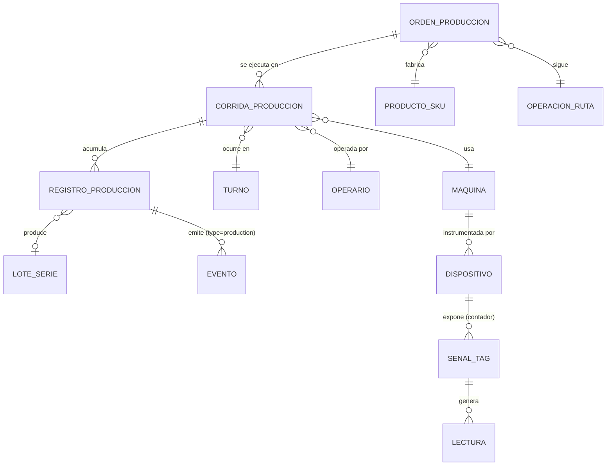
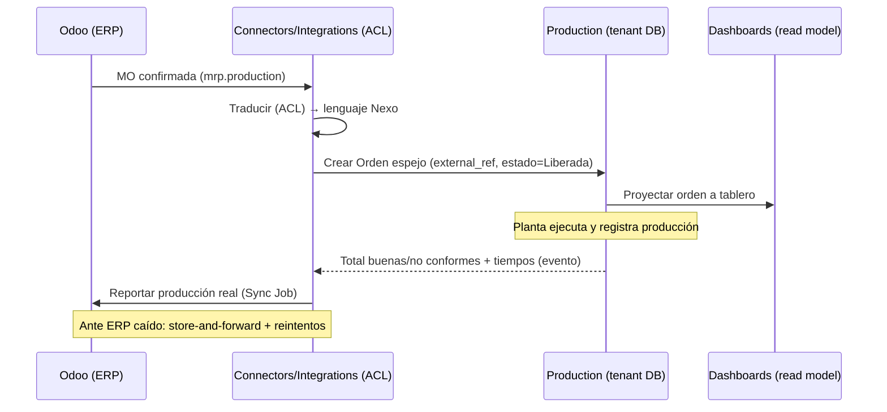
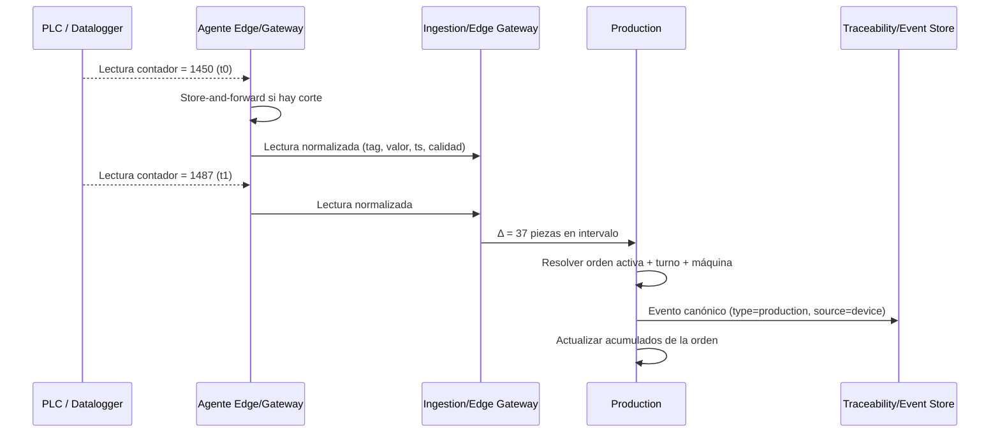
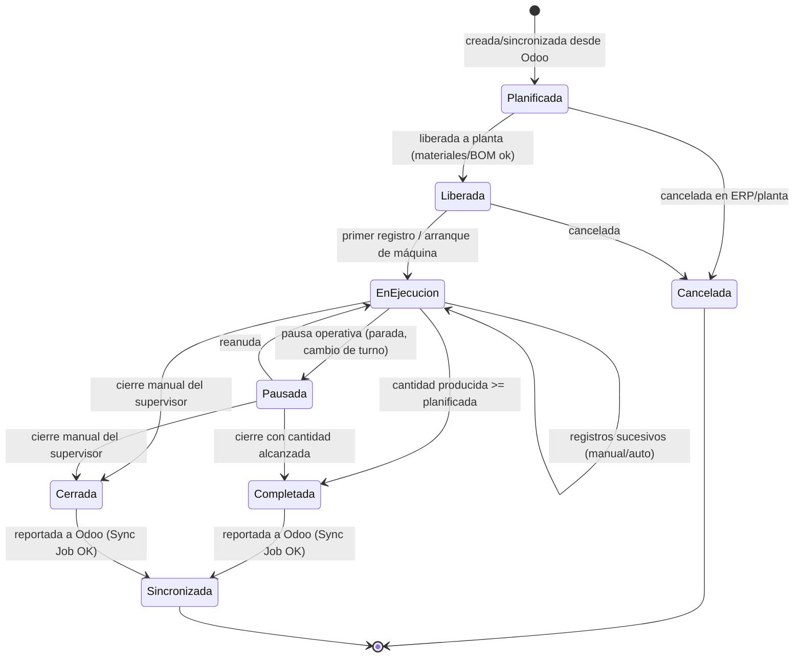
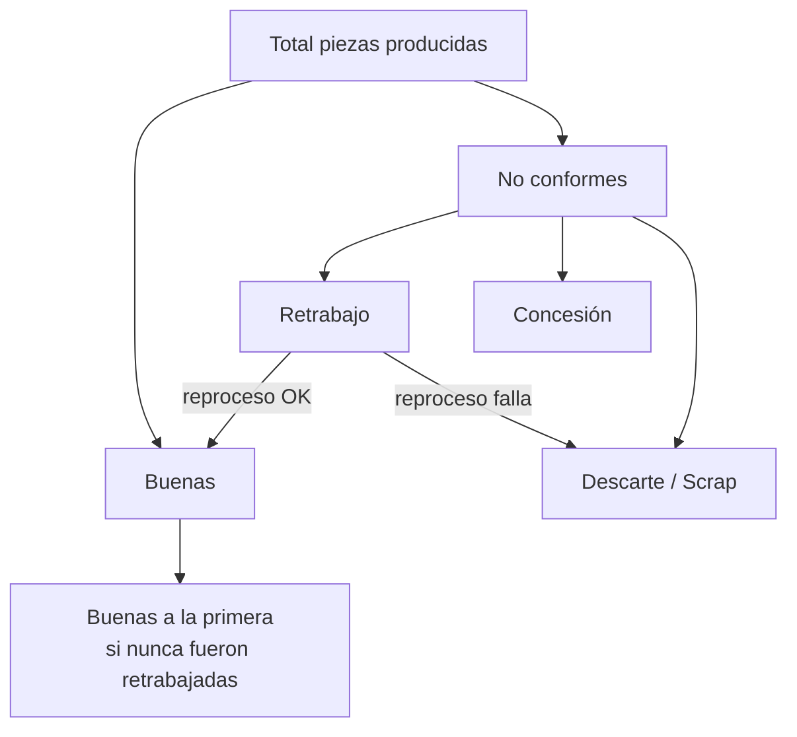
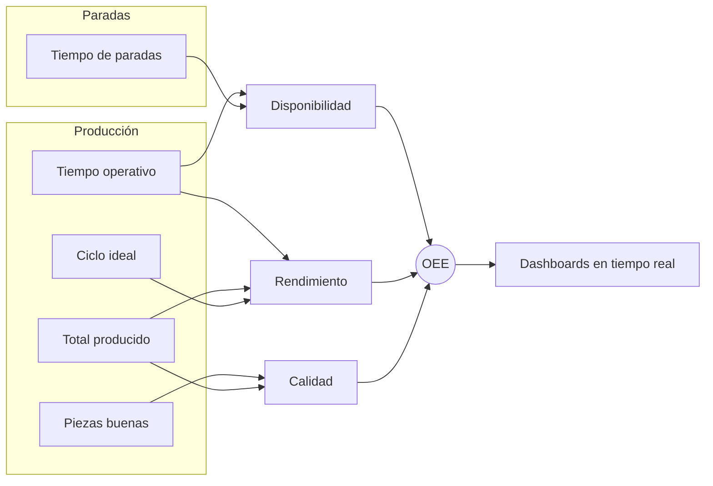

# Producción (perfil repetitivo del modelo de trabajo)

> **Documento:** `specs/specs/production.md` · **Estado:** Borrador v0.1 · **Actualizado:** 2026-07-13
> **Roles:** Product Manager · Software Architect · UX Designer
> **Relacionados:** [layered-architecture.md](./layered-architecture.md) · [work-model.md](./work-model.md) · [execution.md](./execution.md) · [event-engine.md](./event-engine.md) · [architecture.md](./architecture.md) · [glossary.md](./glossary.md) · [quality.md](./quality.md) · [scrap.md](./scrap.md) · [downtime.md](./downtime.md) · [traceability.md](./traceability.md) · [data-ingestion.md](./data-ingestion.md) · [dashboards.md](./dashboards.md) · [rules-engine.md](./rules-engine.md) · [integrations.md](./integrations.md) · [devices.md](./devices.md) · [data-model.md](./data-model.md)

## Resumen ejecutivo

> **Reencuadre (arquitectura por capas).** Producción **ya no es un dominio raíz** de la plataforma: es **el perfil repetitivo del modelo de trabajo**. Lo que este documento describe es un **Proceso** con perfil `repetitivo` ([work-model.md](./work-model.md), Capa 2) que se **ejecuta como Lote** ([execution.md](./execution.md), Capa 3), sobre activos del gemelo digital ([digital-twin.md](./digital-twin.md), Capa 1) y observado por el motor de eventos ([event-engine.md](./event-engine.md), Capa 4). La **Orden de producción deja de ser el concepto central**: pasa a ser **un disparador** de esa ejecución —uno entre varios—. Todo el detalle de dominio de este documento (captura manual/automática, estados, validaciones, casos borde, KPIs y aporte al OEE) **sigue plenamente vigente**: es la especialización repetitiva del modelo general. Ver [layered-architecture.md](./layered-architecture.md).

El **perfil repetitivo** es el corazón operativo de Nexo en manufactura seriada: modela la ejecución en planta de un Proceso que se repite N veces y la captura de **cuánto se produjo, cuándo, con qué máquina, en qué turno y por qué operario**. Es el ámbito que convierte la intención de fabricación —disparada por una **Orden de producción**, por un plan, por demanda o por reposición de stock— en **eventos normalizados** de piezas producidas, buenas y no conformes, alimentando de forma trazable a Calidad, Scrap, Paradas y a los tableros en tiempo real.

Producción resuelve el problema central que da sentido a la plataforma: **eliminar la carga manual y heterogénea de datos de fabricación**. Un mismo registro de producción puede nacer de un operario que toca una tablet o de un **contador de un PLC** que incrementa automáticamente; en ambos casos, el sistema los normaliza al mismo Evento canónico y los contextualiza (orden, máquina, turno, producto). Esta dualidad manual/automático es un requisito de diseño transversal, no una opción.

El ámbito es **agnóstico del ERP y no lo requiere**: la Orden de producción de Nexo es una entidad propia que **puede** sincronizarse con la Manufacturing Order (MO) de Odoo mediante el servicio de **Connectors / Integrations** y su Anti-Corruption Layer (ACL), pero el **ERP es opcional** (ver [integrations.md](./integrations.md) §1.1). En **modo standalone** la orden —o directamente el Lote— se crea en Nexo a partir de la master data propia ([master-data.md](./master-data.md)). Nexo nunca depende del ERP para operar; si el ERP no está disponible o no existe, la planta sigue registrando y la sincronización se resuelve luego (store-and-forward) o simplemente no aplica.

Finalmente, Producción es un **contribuyente directo del OEE**. Aporta el **Total de piezas producidas**, las **Piezas buenas** y el **Tiempo operativo** necesarios para el cálculo de **Rendimiento** y **Calidad**, en coherencia con las fórmulas canónicas del brief y con los dominios de [Paradas](./downtime.md) (Disponibilidad), [Calidad](./quality.md) (factor Calidad) y [Scrap](./scrap.md).

---

## 1. Alcance y objetivos del dominio

**Servicio (Bounded Context) responsable:** **Production** (por tenant, opera siempre contra la DB del tenant resuelto).

### Ubicación en el modelo de 4 capas

Producción no introduce conceptos paralelos: **especializa** los conceptos canónicos de las capas para el caso repetitivo. Esta tabla es la clave de lectura del resto del documento.

| Concepto de este documento | Concepto canónico de la capa | Capa | Documento de referencia |
|---|---|---|---|
| Ruta / operación / receta de fabricación | **Proceso** (plantilla versionada) con **perfil `repetitivo`** | 2 · Modelo de trabajo | [work-model.md](./work-model.md) |
| Operación de la ruta | **Tarea** (con precedencias, insumos, evidencia, criterio de terminación) | 2 · Modelo de trabajo | [work-model.md](./work-model.md) |
| **Corrida de producción (Production Run)** | **Ejecución** en su sabor **Lote (Batch)** | 3 · Ejecución | [execution.md](./execution.md) |
| **Orden de producción (Work Order / MO)** | **Disparador** de una Ejecución (no es la ejecución ni el proceso) | 3 · Ejecución (entrada) | [execution.md](./execution.md) |
| Máquina / centro de trabajo / señal de contador | **Activo** y **sensor ligado al activo** | 1 · Física | [digital-twin.md](./digital-twin.md) |
| Pantalla de carga del operario | **Formulario de captura** (nunca "dashboard") | 1 · Física | [digital-twin.md](./digital-twin.md) |
| Evento `type=production`, KPIs derivados | **Evento canónico** y **métricas derivadas** | 4 · Motor de eventos | [event-engine.md](./event-engine.md) |

> **Mismo modelo, distinto disparador.** Una producción repetitiva y un proyecto único **se modelan igual** (Proceso → Tarea → Insumo → Ejecución). Lo único que cambia es **el disparador de la ejecución** y **el set de KPIs** ([dashboards.md](./dashboards.md)). Por eso este documento no describe "otro dominio", sino **el perfil repetitivo** del mismo modelo.

**Disparadores de una ejecución repetitiva** (la Orden de producción es solo el primero):

| Disparador | Origen | Modo típico |
|---|---|---|
| **Orden de producción / MO** | ERP (pull por conector) o alta manual en Nexo | Conectado o standalone |
| **Plan de producción** | Planificación interna en Nexo | Standalone o conectado |
| **Demanda / pedido de cliente** | Master data propia o ERP | Ambos |
| **Reposición de stock (punto de pedido)** | Regla de negocio / [rules-engine.md](./rules-engine.md) | Ambos |
| **Alta manual del supervisor** | Supervisor en planta | Ambos |

### En alcance (MVP)
- Modelar y ejecutar el **perfil repetitivo**: Proceso repetitivo → Lote, disparado por **Orden de producción** (propia de Nexo, opcionalmente sincronizada con la MO de Odoo) o por cualquier otro disparador de la tabla anterior.
- Registrar **cantidades producidas** (buenas y no conformes) por orden, máquina, turno y operario.
- Capturar **tiempos** de ejecución (arranque, pausa, fin, tiempo operativo).
- Soportar **captura manual** (tablet) y **captura automática vía datalogger/CSV** en el MVP; los **protocolos industriales** (S7/OPC UA/Modbus/MQTT) para captura directa de PLC llegan en **V1** (ver [devices.md](./devices.md)).
- Gestionar el **ciclo de estados** de la orden y de las corridas de producción.
- Calcular y exponer KPIs de **producción, productividad, rendimiento** y la contribución de Producción al **OEE**.
- Emitir **Eventos canónicos** de tipo `production` hacia el Event Store y los read models de dashboards.

### Fuera de alcance de este dominio (viven en otros documentos)
- Disposición de la no conformidad y planes de control → [quality.md](./quality.md).
- Costeo y taxonomía de descarte → [scrap.md](./scrap.md).
- Cálculo de Disponibilidad y árbol de paradas → [downtime.md](./downtime.md).
- Genealogía de lote/serie y eventos inmutables → [traceability.md](./traceability.md).
- Adaptadores de protocolo, normalización y store-and-forward → [data-ingestion.md](./data-ingestion.md).
- **Definición del Proceso/Tarea/Insumo y el concepto de perfil** → [work-model.md](./work-model.md).
- **Ciclo de vida genérico de la Ejecución** (común a Lote y Proyecto) y el **perfil proyecto** → [execution.md](./execution.md).
- **Contrato del evento canónico y métricas derivadas** (progreso, cuellos de botella, tiempos muertos) → [event-engine.md](./event-engine.md).
- **Catálogos maestros** (productos, insumos, unidades, motivos) cuando no hay ERP → [master-data.md](./master-data.md).

---

## 2. Entidades involucradas

Nombres tomados de las **entidades canónicas (sección 8 del brief)**. Producción **posee** algunas y **referencia** otras que pertenecen a dominios vecinos.

| Entidad canónica | Rol en Producción | Propiedad |
|---|---|---|
| **Orden de producción (Work Order / MO)** | **Disparador** de la ejecución: qué producir y cuánto. Propia de Nexo; opcionalmente espejo de la MO del ERP | **Propia** (espejo local con ACL si hay ERP) |
| **Proceso (perfil `repetitivo`)** | Plantilla versionada de cómo se fabrica (tareas, insumos, tiempos estándar, criterios de calidad) | Referenciada ([work-model.md](./work-model.md)) |
| **Ejecución — Lote (Batch)** | Instancia viva del Proceso; equivale a la **Corrida de producción** de este documento | Referenciada ([execution.md](./execution.md)) |
| **Registro de producción (Production Record)** | Cantidad producida en un contexto (orden/máquina/turno/operario) | **Propia** |
| **Producto / SKU** | Ítem fabricado por la orden | Referenciada (catálogo, sync Odoo) |
| **Operación / Ruta** | Pasos del proceso; a qué operación corresponde la corrida | Referenciada |
| **Centro de trabajo / Máquina (Work Center / Asset)** | Recurso productivo donde ocurre la corrida | Referenciada ([devices.md](./devices.md)) |
| **Turno (Shift)** | Franja horaria que contextualiza el registro | **Propia** (calendario de turnos) |
| **Operario (Operator)** | Usuario que ejecuta/registra | Referenciada ([users-permissions.md](./users-permissions.md)) |
| **Dispositivo / Sensor / Señal (Tag)** | Fuente automática del conteo | Referenciada ([devices.md](./devices.md)) |
| **Lectura (Reading)** | Muestra puntual del contador de piezas | Referenciada (ingesta) |
| **Evento (Event)** | Salida normalizada `type=production` | Co-propiedad con Traceability |
| **Lote (Batch) / Serie (Serial)** | Trazabilidad de lo producido | Referenciada ([traceability.md](./traceability.md)) |

### Diagrama conceptual de relaciones

> **Nota de modelo.** El concepto operativo de **Corrida de producción (Production Run)** es el "período de ejecución" de una orden en una máquina/turno determinado. Una orden puede tener varias corridas (por pausas, cambios de turno o de máquina). El **Registro de producción** es el incremento de cantidad dentro de una corrida. Este refinamiento se propone para `data-model.md`; ver [Preguntas abiertas](#preguntas-abiertas).

> **Nota de reencuadre.** La **Corrida de producción** es la manifestación repetitiva de la **Ejecución (Run)** de la Capa 3: el mismo esqueleto —estado, tareas instanciadas, consumo real de insumos, avance, evidencia— que usa un **Proyecto**, con el sabor **Lote** (cantidad objetivo, producto, repetible). Lo que aquí se llama "orden → corridas" es, en el lenguaje canónico, "**disparador → Ejecución(es) de un Proceso repetitivo**". Ver [execution.md](./execution.md). El diagrama de abajo mantiene la nomenclatura de dominio por legibilidad operativa; la equivalencia está en §1.

> **Sin ERP.** En modo standalone, `PRODUCTO_SKU` y `OPERACION_RUTA` no vienen del ERP: son entidades de la **master data propia** ([master-data.md](./master-data.md)), y la ruta/operación se expresa como las **Tareas** del Proceso repetitivo ([work-model.md](./work-model.md)).

---

## 3. Relación con la MO de Odoo (integración ERP **opcional**)

> **El ERP es opcional.** Esta sección describe el **modo conectado**. En **modo standalone** (sin ERP) nada de lo que sigue es necesario: la Orden de producción se crea en Nexo, el producto/SKU y las unidades salen de la **master data propia**, y no hay Sync Job ni mapeo de estados. La capacidad de producir, capturar, trazar y medir **es idéntica en ambos modos**. Ver [integrations.md](./integrations.md) §1.1 y [master-data.md](./master-data.md).

Cuando el ERP existe, Nexo **complementa** el ERP; no lo reemplaza. La planificación (qué producir, cuánto, con qué BOM) vive en Odoo; la **ejecución real** vive **siempre** en Nexo, con o sin ERP.

| Concepto Odoo | Concepto Nexo | Dirección | Notas |
|---|---|---|---|
| `mrp.production` (MO) | Orden de producción | Odoo → Nexo (import) | Nexo crea un espejo local con `external_ref` |
| Producto / `product.product` | Producto / SKU | Odoo → Nexo | Catálogo maestro en el ERP |
| Cantidad planificada | `cantidad_planificada` | Odoo → Nexo | Meta a producir |
| Estado MO (draft/confirmed/progress/done) | Estado de orden Nexo | Bidireccional (mapeado) | Ver mapeo en §5.3 |
| Cantidad producida real | Total buenas/producidas | **Nexo → Odoo** | Nexo es la fuente de verdad de la ejecución |
| Consumo/rendimiento | Aporta a costeo | Nexo → Odoo (V1+) | Ver [scrap.md](./scrap.md) para costo del descarte |

**Principio arquitectónico:** toda la conversación con Odoo pasa por el servicio **Connectors / Integrations** y su **ACL**. Production **no** conoce el modelo de Odoo; solo publica/consume su propio lenguaje ubicuo. Corolario del reencuadre: el ERP **puede** aportar el **disparador** (la MO) y el **contexto** (catálogos), pero **nunca** es fuente de verdad del Proceso ni de la Ejecución. Detalle de mapeos, reintentos y **Job de sincronización (Sync Job)** en [integrations.md](./integrations.md).

> **Granularidad del push (INT-01):** el reporte de producción real a Odoo se **agrega por cierre de corrida** (avance/cierre de MO), no por cada evento, para acotar la carga sobre el ERP; el scrap se refleja como `stock.scrap`. El pull de contexto (MO, Producto, UoM, Motivos) y la calidad bidireccional opcional se detallan en [integrations.md](./integrations.md).

---

## 4. Métodos de captura

La captura es **dual y equivalente en el modelo de datos**: sea manual o automática, ambas terminan en un **Registro de producción** y un **Evento canónico** `type=production`. Lo que cambia es el `source` y la confianza del dato (`origin_metadata.data_quality`).

### 4.1 Captura manual (tablet en planta)
El operario, autenticado y con la orden seleccionada, ingresa cantidades en un **Formulario de captura**. Pensado para líneas no instrumentadas o como respaldo.

> **Terminología.** La pantalla donde el operario **ingresa** datos se llama **Formulario de captura** y pertenece a la **Capa 1** ([digital-twin.md](./digital-twin.md)); **nunca** se la llama "dashboard". Un **Tablero/Dashboard** es una **visualización de KPIs** y vive en [dashboards.md](./dashboards.md).

- **Persona:** Operario (registra), Supervisor (corrige/valida). Ver [personas](#9-personas-y-permisos).
- **Momentos de carga:** por evento (cada X piezas/bandeja/pallet), por hora, o al cierre de corrida/turno.
- **Campos mínimos:** orden, máquina, cantidad buenas, cantidad no conformes, (opcional) motivo preliminar de no conforme, timestamp.
- **UX:** teclado numérico grande, botones +1/+10/+bandeja, foto opcional, funcionamiento **offline-first** (la tablet encola si no hay red).

### 4.2 Captura automática (contador PLC / datalogger)
Una **Señal/Tag** de tipo contador (p. ej. `contador_piezas_OK`) del PLC se lee vía el **Agente Edge / Gateway** y se transforma en registros de producción.

- **Fuente:** en el MVP la captura automática es por **datalogger/CSV**; los protocolos industriales (PLC Siemens S7, OPC UA, Modbus, MQTT) para lectura directa de contadores llegan en **V1** (ver sección 3 del brief y [devices.md](./devices.md)).
- **Patrón:** el contador es **acumulativo/monótono**; Nexo calcula el **delta** entre lecturas para obtener piezas del intervalo. Debe manejar **reset de contador** (rollover) y reinicios de PLC.
- **Buenas vs no conformes automáticas:** idealmente dos tags (`contador_OK`, `contador_NOK`) o un tag total + señal de rechazo. Si solo hay un contador total, las no conformes se completan por Calidad/Scrap o manualmente.
- **Contexto:** la asociación tag→máquina→orden→turno la resuelve Production usando la **orden activa** de esa máquina en ese momento y el **calendario de turnos**.

### 4.3 Comparativa manual vs automático

| Criterio | Manual (tablet) | Automático (PLC/contador) |
|---|---|---|
| `source` del Evento | `manual` | `device` |
| Confianza del dato | Media (error humano) | Alta (si el tag está bien mapeado) |
| Granularidad temporal | Por lote/hora/turno | Cuasi tiempo real |
| Buenas vs no conformes | Directa (el operario clasifica) | Requiere tag de rechazo o complemento manual |
| Casos de falla | Olvido, doble carga, unidad equivocada | Reset de contador, tag caído, doble conteo |
| Costo de habilitación | Bajo (solo tablet) | Requiere instrumentación/edge |
| Rol dominante | Operario | Devices + Ingestion |

> **Regla de conciliación (canónica del dominio).** Si en un mismo contexto conviven conteo automático y carga manual, **el automático es la fuente primaria de cantidad total** y el manual aporta la **clasificación/ajuste** (buenas vs no conformes, correcciones). Un ajuste manual nunca borra el evento automático: genera un **evento de ajuste** trazable. Ver [Preguntas abiertas](#preguntas-abiertas).

---

## 5. Estados y ciclo de vida

> **Reencuadre.** Lo que sigue es la **especialización repetitiva** del ciclo de vida genérico de la **Ejecución** (Capa 3). Los estados y transiciones descritos aquí son los del par *orden repetitiva → Lote*; el esqueleto común a Lote y Proyecto (creación, asignación de responsables, reprogramación, ejecución parcial, cierre) vive en [execution.md](./execution.md) y **no se duplica**. Los estados **Planificada** y **Sincronizada** solo tienen sentido en **modo conectado**: en standalone, la orden nace **Liberada** (o directamente como Lote) y el cierre no espera confirmación de ningún ERP.

### 5.1 Diagrama de estados de la Orden de producción

### 5.2 Definición de estados

| Estado | Significado | Se puede registrar producción | Transición típica |
|---|---|---|---|
| **Planificada** | Existe pero no liberada a planta | No | Sync desde Odoo |
| **Liberada** | Aprobada para ejecutar (materiales/BOM ok) | No (aún no arrancó) | Liberación supervisor |
| **En ejecución** | Corrida activa produciendo | **Sí** | Arranque / primer registro |
| **Pausada** | Detenida temporalmente (ver [downtime.md](./downtime.md)) | No (se acumula tiempo de parada) | Parada / fin de turno |
| **Completada** | Alcanzó/superó cantidad planificada | Solo ajustes | Meta cumplida |
| **Cerrada** | Cerrada por decisión (con o sin cantidad completa) | No | Cierre supervisor |
| **Sincronizada** | Producción real reportada al ERP | No | Sync Job exitoso |
| **Cancelada** | Anulada antes de completar | No | Cancelación ERP/planta |

> **Relación con Paradas.** Cuando una orden pasa a **Pausada** por una detención de máquina, se genera un **Downtime Event** en el dominio [Paradas](./downtime.md). Producción y Paradas comparten el reloj de la corrida: el tiempo pausado **no** cuenta como Tiempo operativo y sí resta a la Disponibilidad.

### 5.3 Mapeo de estados con Odoo (solo en modo conectado)

| Estado Nexo | Estado Odoo (`mrp.production`) | Dirección de verdad |
|---|---|---|
| Planificada | `confirmed` | Odoo |
| Liberada | `confirmed` / `progress` (inicio) | Odoo→Nexo |
| En ejecución | `progress` | Nexo (ejecución real) |
| Pausada | `progress` | Nexo |
| Completada / Cerrada | `to_close` | Nexo |
| Sincronizada | `done` | Nexo→Odoo confirma |
| Cancelada | `cancel` | Bidireccional |

---

## 6. Piezas buenas vs no conformes (definición canónica compartida)

> Esta definición es **común a los cuatro dominios** ([quality.md](./quality.md), [scrap.md](./scrap.md), [downtime.md](./downtime.md)) para garantizar coherencia de KPIs. **No** debe redefinirse en otro documento.

- **Pieza buena (conforme):** unidad producida que **cumple todas las especificaciones aplicables** y supera los controles de calidad requeridos; apta para avanzar/entregar **sin retrabajo**.
- **Pieza no conforme:** unidad que **no cumple** una o más especificaciones. Su destino (**disposición**) lo define [Calidad](./quality.md):
  - **Retrabajo (rework):** se recupera y puede volver a contarse como buena tras reproceso.
  - **Concesión (use-as-is):** se acepta con desviación aprobada.
  - **Descarte (scrap):** se descarta; pasa al dominio [Scrap](./scrap.md).
- **Total de piezas producidas** = **buenas + no conformes** (incluye retrabajadas y descartadas). Es el denominador de **Calidad** y **Scrap Rate**.
- **Piezas descartadas (scrap)** ⊆ no conformes. Detalle y costeo en [scrap.md](./scrap.md).
- **Piezas buenas a la primera** = buenas sin haber pasado por retrabajo; denominador/numerador de **FPY** (ver [quality.md](./quality.md)).

---

## 7. Cantidades, tiempos, turnos, máquinas y operarios

### 7.1 Cantidades
- `cantidad_planificada` (de la orden/MO), `cantidad_buenas`, `cantidad_no_conformes`, `cantidad_descartada` (referencia a Scrap), `cantidad_total_producida = buenas + no_conformes`.
- Unidad de medida heredada del Producto/SKU (uds, kg, m, etc.). La conversión de unidades es responsabilidad del catálogo; ver [Preguntas abiertas](#preguntas-abiertas).

### 7.2 Tiempos (base para Rendimiento y OEE)
| Tiempo | Definición | Fuente |
|---|---|---|
| **Tiempo productivo planificado** | Tiempo asignado a producir según turno/calendario menos paradas planificadas | Calendario de turnos + Paradas |
| **Tiempo operativo** | Planificado − Paradas (programadas y no) | Production + [Downtime](./downtime.md) |
| **Tiempo de ciclo ideal (Cycle time)** | Tiempo teórico por pieza del Producto/operación | Maestro de producto/ruta |
| **Takt time** | Ritmo de demanda (referencia de planificación) | Planificación |
| **Tiempo real de corrida** | Duración efectiva de la corrida | Arranque/fin registrados |

### 7.3 Turnos (Shift)
- Nexo mantiene un **calendario de turnos** por planta/línea (p. ej. Mañana/Tarde/Noche, con excepciones y feriados).
- Todo registro se **estampa con el turno** correspondiente por timestamp (crítico para KPIs por turno).
- Cambio de turno = evento de negocio: puede cerrar una corrida y abrir otra sin perder acumulados de la orden.

### 7.4 Máquinas y operarios
- **Máquina (Work Center/Asset):** una corrida ocurre en **una** máquina. Una orden puede migrar de máquina (nueva corrida).
- **Operario:** quien registra o supervisa. En captura automática, el operario **asignado a la máquina en el turno** se atribuye por defecto (configurable). Login por PIN/credencial en tablet.

---

## 8. Validaciones

| # | Validación | Tipo | Acción ante fallo |
|---|---|---|---|
| V1 | Cantidad no negativa y numérica | Sintáctica | Rechazo inmediato en UI/ingesta |
| V2 | La orden debe estar **En ejecución** para aceptar producción | Estado | Bloquear o exigir cambio de estado |
| V3 | Máquina y orden **compatibles** (ruta/centro de trabajo) | Semántica | Advertencia; requiere confirmación supervisor |
| V4 | `buenas + no_conformes` coherente con total automático (tolerancia %) | Conciliación | Marcar discrepancia; evento de ajuste |
| V5 | Delta de contador PLC **no negativo** salvo reset detectado | Ingesta | Tratar como rollover; no sumar delta negativo |
| V6 | Timestamp dentro de un turno válido y no futuro | Temporal | Rechazo / cuarentena para revisión |
| V7 | `cantidad_total` no supera desproporcionadamente lo planificado (umbral configurable) | Negocio | Alerta a supervisor (posible doble conteo) |
| V8 | Operario con permiso sobre la línea/planta (scoping RBAC) | Autorización | Rechazo (403 de negocio) |
| V9 | Dedup por `dedup_key` del Evento (evitar reprocesos) | Idempotencia | Descartar duplicado silenciosamente |
| V10 | Producto/SKU y unidad de medida existentes en catálogo | Referencial | Rechazo / cuarentena |

> Las validaciones de ingesta (V5, V9) se coordinan con [data-ingestion.md](./data-ingestion.md); las de negocio (V2–V7) son responsabilidad del servicio Production. Umbrales configurables por el motor de reglas ([rules-engine.md](./rules-engine.md)).

---

## 9. Personas y permisos

Roles del brief (sección 9) con su interacción típica en Producción (matriz completa en [users-permissions.md](./users-permissions.md)):

| Persona | Interacción con Producción |
|---|---|
| **Operario** | Registra producción (manual), inicia/pausa corridas, adjunta foto |
| **Supervisor** | Libera/cierra órdenes, corrige registros, resuelve discrepancias, cambia estados |
| **Producción** (planner) | Monitorea avance vs plan, prioriza, gestiona el mix de órdenes |
| **Calidad** | Consume cantidades; clasifica no conformes (ver [quality.md](./quality.md)) |
| **Mantenimiento** | Interviene en pausas por parada (ver [downtime.md](./downtime.md)) |
| **Gerencia** | Ve KPIs agregados (OEE, productividad) en [dashboards.md](./dashboards.md) |
| **Administrador** (tenant) | Configura turnos, líneas, mapeos de máquina/tag |
| **Integraciones** | Configura y monitorea la sincronización con Odoo |

---

## 10. KPIs asociados y contribución al OEE

Fórmulas **idénticas** a la sección 10.1 del brief —**no cambian**—. Producción es dueño de **Rendimiento**, del factor **Calidad** (junto con [Quality](./quality.md)) y aporta insumos a **Disponibilidad** (junto con [Downtime](./downtime.md)).

> **KPIs por perfil.** Los indicadores de esta sección (**OEE**, scrap rate, takt, tiempo de ciclo, FPY) son los del **perfil repetitivo**. **El OEE no aplica al perfil proyecto**, que se mide con **% de avance, desvío de cronograma, ruta crítica e hitos cumplidos**. Los KPIs **comunes a ambos perfiles** —tiempos muertos, cuellos de botella, productividad por recurso, costo real vs estimado— los deriva el **motor de eventos** ([event-engine.md](./event-engine.md)). Tabla completa por perfil en [dashboards.md](./dashboards.md).

### 10.1 KPIs propios de Producción
| KPI | Fórmula | Insumos que aporta Producción |
|---|---|---|
| **Producción (volumen)** | Σ Total de piezas producidas (por orden/turno/máquina/línea) | buenas + no conformes |
| **Rendimiento (Performance)** | **(Tiempo de ciclo ideal × Total de piezas producidas) / Tiempo operativo** | ciclo ideal, total producido, tiempo operativo |
| **Calidad (factor)** | **Piezas buenas / Total de piezas producidas** | buenas, total |
| **Cumplimiento de plan** | Total producido / Cantidad planificada | producido, plan (Odoo) |
| **Productividad por operario/turno** | Total producido / (operarios × horas) | producido, dotación, turnos |

### 10.2 Contribución al OEE
> **OEE = Disponibilidad × Rendimiento × Calidad**
> - **Disponibilidad = Tiempo operativo / Tiempo productivo planificado** (Tiempo operativo = Planificado − Paradas) → Producción aporta el reloj de la corrida; Paradas aporta las detenciones ([downtime.md](./downtime.md)).
> - **Rendimiento = (Tiempo de ciclo ideal × Total de piezas producidas) / Tiempo operativo** → **calculado en Producción**.
> - **Calidad = Piezas buenas / Total de piezas producidas** → buenas/total de Producción, no conformes clasificadas por [Quality](./quality.md).

Los KPIs se materializan como **read models (CQRS)** y se exponen en [dashboards.md](./dashboards.md). Producción **publica eventos**; Dashboards/Analytics **proyecta**.

---

## 11. Eventos emitidos y consumidos

| Evento | Dirección | Consumidores |
|---|---|---|
| `production.registered` (registro creado) | Emite | Traceability, Dashboards, Rules Engine |
| `production.order.state_changed` | Emite | Dashboards, Integrations (Odoo), Notifications |
| `production.discrepancy.detected` (V4/V7) | Emite | Rules Engine, Notifications, Supervisor |
| `machine_event` (arranque/paro) | Consume | de [Downtime](./downtime.md)/Devices para pausar corrida |
| `quality.disposition` | Consume | de [Quality](./quality.md) para reclasificar buenas/no conformes |
| `scrap.registered` | Consume | de [Scrap](./scrap.md) para descontar buenas/ajustar total |

Todos los eventos siguen el **Evento canónico** (sección 8.1 del brief): `event_id`, `tenant_id`, `timestamp`, `source`, `type=production`, `payload`, `operator_id?`, `shift?`, `origin_metadata`, `dedup_key`; **inmutables** una vez ingeridos ([traceability.md](./traceability.md)). El contrato completo del evento —incluida la **evidencia** (foto, archivo, lectura, firma, frame de cámara) como atributo de primera clase— y las **métricas derivadas** (progreso, cuellos de botella, tiempos muertos) son responsabilidad de la Capa 4: ver [event-engine.md](./event-engine.md). El **motor de reglas** puede reaccionar (p. ej. alertar si el ritmo cae por debajo del takt). Ver [rules-engine.md](./rules-engine.md).

---

## 12. Casos borde

| # | Caso | Tratamiento propuesto |
|---|---|---|
| CB1 | **Reset/rollover del contador PLC** | Detectar caída del valor; no sumar delta negativo; reanudar acumulación desde nuevo cero; registrar evento técnico |
| CB2 | **Doble conteo** (auto + manual del mismo lote) | Regla de conciliación §4.3; conservar ambos eventos, generar ajuste; alertar |
| CB3 | **Orden sin sincronizar** (Odoo caído) | Registrar contra orden local/temporal; store-and-forward; conciliar al reconectar ([integrations.md](./integrations.md)). En modo standalone el caso no existe: la orden **es** local |
| CB4 | **Producción sin orden activa** (máquina cuenta sin orden) | Encolar como "producción sin asignar"; supervisor la imputa después |
| CB5 | **Cambio de turno a mitad de corrida** | Cerrar corrida del turno saliente, abrir del entrante; acumulados de orden intactos |
| CB6 | **Retrabajo que convierte no conforme en buena** | Evento de reclasificación desde Quality; ajustar buenas/no conformes sin duplicar total |
| CB7 | **Cantidad producida > planificada (overproduction)** | Permitir con alerta (V7); marcar exceso para el planner |
| CB8 | **Tag mal mapeado** (contador de otra máquina) | Validación de coherencia máquina↔tag; cuarentena; alerta a Devices/Admin |
| CB9 | **Tablet offline por horas** | Cola local; al reconectar, ingesta con `dedup_key`; respetar orden temporal |
| CB10 | **Producto/SKU cambiado en mitad de orden** | No permitido en una misma orden; forzar nueva orden/corrida |
| CB11 | **Registro retroactivo / corrección** | Permitido con permiso de supervisor; genera evento de ajuste trazable (nunca edición destructiva) |
| CB12 | **Múltiples máquinas para una orden** | Corridas paralelas; el total de la orden es la suma de corridas |

---

## 13. Requisitos no funcionales (resumen del dominio)

- **Multi-tenant DB-per-tenant:** Production opera SIEMPRE contra la DB del tenant resuelto (sección 6 del brief).
- **Tiempo real:** latencia objetivo de registro→tablero de pocos segundos (CQRS/read models).
- **Escala:** millones de eventos/día; la ingesta de contadores usa store-and-forward y backpressure ([data-ingestion.md](./data-ingestion.md), [scalability.md](./scalability.md)).
- **Inmutabilidad y auditoría:** correcciones por evento de ajuste; historial en [traceability.md](./traceability.md) y [audit].
- **Offline-first en el edge y en la tablet:** ninguna captura se pierde por cortes de red.

---

## Preguntas abiertas

1. **Corrida de producción (Production Run):** con el reencuadre, la Corrida es el **Lote** de la Capa 3 ([execution.md](./execution.md)). ¿Se unifican como una sola entidad **Ejecución** en `data-model.md`, o la Corrida sobrevive como subdivisión de un Lote (por turno/máquina)? Impacta granularidad de tiempos y KPIs por turno.
2. **Conciliación auto vs manual:** confirmar la regla "automático primario / manual clasificador". ¿Debe ser configurable por tenant/línea, o política global?
3. **Buenas vs no conformes automáticas:** ¿exigimos dos contadores (OK/NOK) para líneas instrumentadas, o aceptamos total + clasificación posterior por Calidad/Scrap?
4. **Atribución de operario en captura automática:** ¿operario del turno por defecto, login explícito obligatorio, o ambos según criticidad de la línea?
5. **Unidades de medida y conversión** (uds vs peso vs longitud): ¿dónde vive la conversión y cómo afecta el cálculo de "piezas" en el Rendimiento para procesos continuos?
6. **Overproduction:** ¿se bloquea, se alerta, o se permite libremente? ¿Política por tenant?
7. **Ciclo ideal / takt:** ¿se toma del maestro de Odoo, se define en Nexo, o es un dato editable por planta? Fuente de verdad del `cycle_time` para el Rendimiento.
8. **Definición de "planificado" para Disponibilidad:** ¿el Tiempo productivo planificado lo determina el calendario de turnos de Nexo o se importa del ERP/planificación? (En modo standalone la respuesta es forzosa: lo determina Nexo.)
9. **Alcance del MVP por perfil:** ¿el MVP entrega **solo el perfil repetitivo** (este documento) o también el perfil proyecto desde el arranque? Condiciona cuánto del modelo genérico de [work-model.md](./work-model.md)/[execution.md](./execution.md) hay que construir en V1.
10. **Órdenes sin ERP:** ¿qué mínimo de planificación propia entra al MVP para disparar ejecuciones en modo standalone (alta manual de orden, plan simple, punto de pedido), y dónde vive esa planificación?
11. **Ruta vs Proceso:** la "Operación / Ruta" de este documento y las **Tareas** del Proceso repetitivo, ¿son la misma entidad ya en V1, o conviven mientras exista sincronización de rutas desde el ERP?
