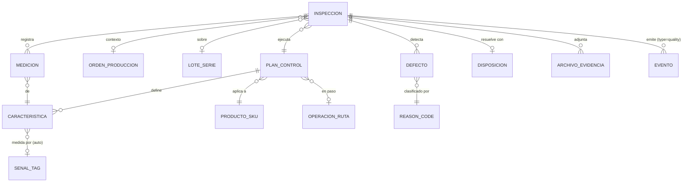
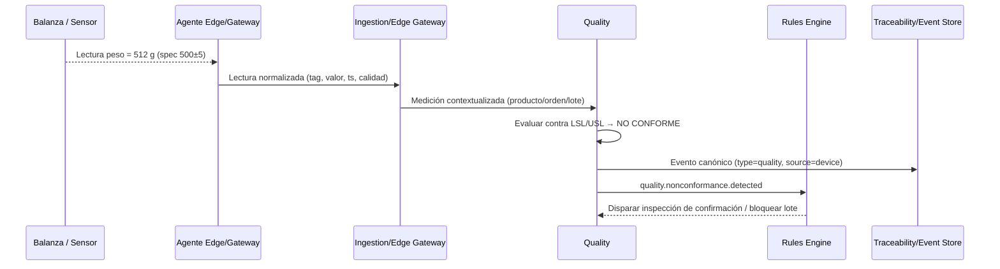
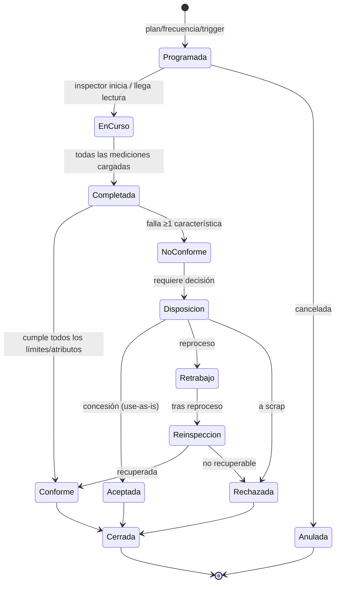
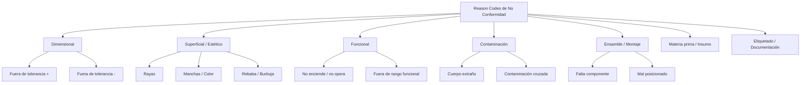
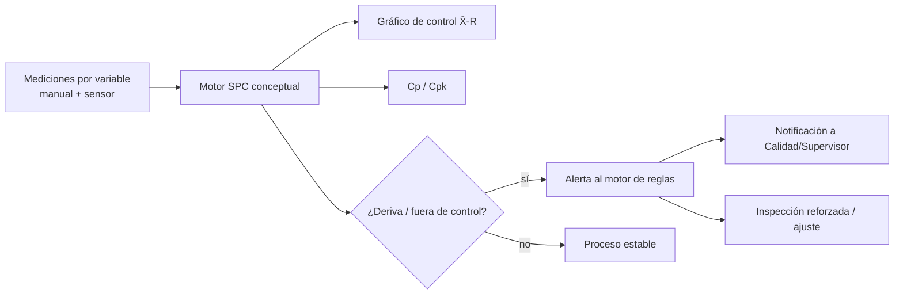
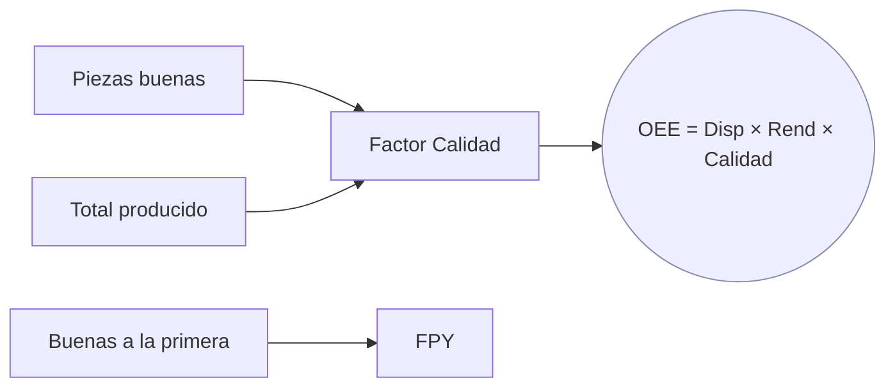

# Calidad

> **Documento:** `specs/specs/quality.md` · **Estado:** Borrador v0.1 · **Actualizado:** 2026-07-11
> **Roles:** Product Manager · Software Architect · UX Designer
> **Relacionados:** [architecture.md](./architecture.md) · [glossary.md](./glossary.md) · [production.md](./production.md) · [scrap.md](./scrap.md) · [downtime.md](./downtime.md) · [traceability.md](./traceability.md) · [data-ingestion.md](./data-ingestion.md) · [dashboards.md](./dashboards.md) · [rules-engine.md](./rules-engine.md) · [integrations.md](./integrations.md) · [devices.md](./devices.md) · [data-model.md](./data-model.md)

## Resumen ejecutivo

El dominio de **Calidad** gobierna cómo Nexo verifica que lo que la planta produce **cumple las especificaciones**. Modela **inspecciones**, **variables medidas**, **checklists**, **evidencias fotográficas**, **defectos**, **tolerancias/límites**, **planes de control**, **muestreo** y **disposición** de lo no conforme (aceptar / rechazar / retrabajar). Es el dominio que define, de forma canónica y compartida con [Producción](./production.md) y [Scrap](./scrap.md), qué es una **pieza buena** y qué es una **pieza no conforme**.

Calidad es un **contribuyente directo del OEE** a través del factor **Calidad = Piezas buenas / Total de piezas producidas**, y del indicador **FPY (First Pass Yield)**. Provee además la base conceptual del **SPC (Statistical Process Control)**: las variables medidas alimentan gráficos de control y reglas que detectan derivas de proceso **antes** de generar scrap masivo.

Como todo en Nexo, la captura es **dual**: una inspección puede completarse **manualmente desde una tablet** (el inspector mide, tilda un checklist y adjunta fotos) o **automáticamente desde un sensor** (una balanza, un sensor dimensional, un termopar leído vía PLC/OPC UA que compara contra límites y decide aprobado/rechazado). Ambos caminos producen el mismo **Evento canónico** `type=quality`, trazable e inmutable.

El dominio es **agnóstico del ERP**: los resultados de calidad (aprobaciones, rechazos, no conformidades) pueden sincronizarse con Odoo (control de calidad de Odoo / bloqueo de lotes) vía **Connectors / Integrations** y su ACL, pero Nexo **no** depende del ERP para inspeccionar. La verdad de la calidad de planta vive en Nexo.

---

## 1. Alcance y objetivos del dominio

**Servicio (Bounded Context) responsable:** **Quality** (por tenant, opera contra la DB del tenant resuelto). Responsabilidad: *Inspecciones, checklists, defectos, tolerancias, disposición*.

### En alcance (MVP)
- **Planes de control** por producto/operación (qué medir, cómo, cuándo, contra qué límites).
- **Inspecciones** por variables (medición numérica) y por atributos (pasa/no pasa, checklist).
- **Muestreo** (100%, por lote, por frecuencia, por plan tipo AQL — conceptual).
- **Registro de defectos** con **taxonomía de reason codes** coherente con [Scrap](./scrap.md).
- **Evidencias** (fotos/adjuntos) vía servicio **Files / Media**.
- **Disposición** de no conformes: **aceptar / rechazar / retrabajar / concesión**.
- **Tolerancias y límites** (especificación, límites de control, límites de acción).
- **KPIs**: FPY, factor Calidad (OEE), tasa de defectos, tasa de rechazo, Cp/Cpk (conceptual).
- **Captura dual**: tablet (manual) y sensor (automático).
- Base conceptual de **SPC** y **auditorías** de calidad.

### Fuera de alcance de este dominio
- Volumen producido y buenas/total base → [production.md](./production.md).
- Costeo del descarte y taxonomía de costos → [scrap.md](./scrap.md).
- Visión artificial/OCR (fase Enterprise) → `AI / Computer Vision`.

---

## 2. Entidades involucradas

Nombres de las **entidades canónicas (sección 8 del brief)**.

| Entidad canónica | Rol en Calidad | Propiedad |
|---|---|---|
| **Inspección de calidad (Quality Inspection)** | Control con variables/checklist/resultado | **Propia** |
| **Defecto (Defect)** | No conformidad detectada | **Propia** |
| **Motivo (Reason Code)** | Código catalogado de defecto | **Propia** (comparte taxonomía con Scrap/Downtime) |
| **Producto / SKU** | Define qué especificaciones aplican | Referenciada |
| **Operación / Ruta** | En qué paso se inspecciona | Referenciada |
| **Orden de producción (WO/MO)** | Contexto de la inspección | Referenciada ([production.md](./production.md)) |
| **Máquina / Centro de trabajo** | Dónde se produjo lo inspeccionado | Referenciada |
| **Sensor / Señal (Tag)** | Fuente automática de la medición | Referenciada ([devices.md](./devices.md)) |
| **Lectura (Reading)** | Valor medido por sensor | Referenciada (ingesta) |
| **Lote (Batch) / Serie (Serial)** | Qué se inspecciona / bloquea | Referenciada ([traceability.md](./traceability.md)) |
| **Archivo (File / Media)** | Fotografía/evidencia | Referenciada (Files/Media) |
| **Operario / Inspector** | Quien ejecuta la inspección | Referenciada (rol Calidad) |
| **Evento (Event)** | Salida `type=quality` | Co-propiedad con Traceability |

### Conceptos propios del dominio (a formalizar en `data-model.md`)
- **Plan de control (Control Plan):** conjunto de **características a controlar** para un producto/operación.
- **Característica (Characteristic):** variable o atributo a medir (con unidad, especificación y límites).
- **Inspección:** ejecución de un plan sobre una muestra/lote → conjunto de **Mediciones** + **Resultado**.
- **Medición (Measurement):** valor de una característica en una inspección.
- **Disposición (Disposition):** decisión sobre lo no conforme.

---

## 3. Planes de control, características y tolerancias

Un **Plan de control** define, para un Producto/SKU (y opcionalmente una operación de la ruta), **qué se controla, cómo, con qué frecuencia y contra qué límites**.

### 3.1 Tipos de característica
| Tipo | Ejemplo | Captura natural |
|---|---|---|
| **Por variable** (medición numérica) | Diámetro 10,0 ± 0,1 mm; peso 500 ± 5 g; temperatura | Sensor o instrumento (auto/manual) |
| **Por atributo** (pasa/no pasa) | ¿Etiqueta presente? ¿Sin rebaba? | Checklist en tablet |
| **Visual / estético** | Rayas, manchas, color | Foto + criterio (o visión, futuro) |

### 3.2 Tolerancias y límites (definiciones canónicas)
| Concepto | Definición | Uso |
|---|---|---|
| **Especificación (LSL/USL)** | Límite inferior/superior de especificación del cliente/ingeniería | Define conforme vs no conforme |
| **Valor nominal / target** | Valor objetivo | Centro del proceso |
| **Límites de control (LCL/UCL)** | Límites estadísticos del proceso (±3σ) | SPC: detectar variación no natural |
| **Límites de acción/advertencia** | Umbrales internos (±2σ) para reaccionar antes | Alertas tempranas (rules-engine) |
| **Tolerancia** | Rango permitido (USL − LSL) | Cálculo de Cp/Cpk |

> **Regla canónica:** una pieza es **no conforme** cuando **al menos una característica** cae **fuera de especificación (LSL/USL)** o **falla un atributo obligatorio** del checklist. Coherente con la definición de "pieza buena/no conforme" de [production.md](./production.md) §6.

### 3.3 Muestreo
| Estrategia | Descripción | Cuándo |
|---|---|---|
| **100% (inspección total)** | Se inspecciona cada pieza | Crítico / automático por sensor |
| **Por lote (AQL, conceptual)** | Se toma una muestra n de un lote N con criterio de aceptación/rechazo | Control por lote |
| **Por frecuencia** | 1 pieza cada X unidades o cada Y minutos | Control de proceso |
| **Primera pieza (first-off)** | Inspección al arranque/tras setup | Setup / cambio de formato |
| **Por evento/trigger** | Disparada por una regla (deriva SPC, alarma) | [rules-engine.md](./rules-engine.md) |

---

## 4. Métodos de captura

### 4.1 Captura por tablet (manual)
El inspector (rol **Calidad**) ejecuta una inspección desde la tablet:
- Selecciona plan de control / producto / lote-orden.
- Ingresa **mediciones** (numéricas) y responde el **checklist** (atributos).
- Adjunta **fotografías** de evidencia (defectos, no conformidades) → Files/Media.
- El sistema **evalúa contra límites en tiempo real** y sugiere resultado (conforme/no conforme).
- Registra **disposición** si aplica.
- Funciona **offline-first**: la inspección se encola si no hay red y se sincroniza luego.

### 4.2 Captura por sensor (automático)
Una **Señal/Tag** (balanza, sensor dimensional, termopar, sensor de visión simple) leída vía **Agente Edge / Gateway** entrega mediciones que se comparan automáticamente contra los límites del plan de control.

- **Fuentes:** balanzas, sensores, PLC (Siemens S7), OPC UA, Modbus, MQTT, dataloggers, cámaras (sección 3 del brief; ver [devices.md](./devices.md)).
- **Evaluación:** la ingesta aplica los límites y emite `quality.measured` con veredicto pasa/no pasa.
- **Ventaja:** inspección 100% en tiempo real, base natural para SPC.
- **Complemento:** un rechazo automático puede **disparar** una inspección manual de confirmación (regla configurable).

### 4.3 Comparativa
| Criterio | Tablet (manual) | Sensor (automático) |
|---|---|---|
| `source` del Evento | `manual` | `device` |
| Cobertura | Muestral (típico) | 100% posible |
| Atributos visuales | Sí (foto + criterio humano) | Limitado (requiere visión) |
| Variables numéricas | Sí (instrumento) | Sí (tiempo real) |
| SPC | Con datos muestrales | Ideal (alta densidad) |
| Rol dominante | Calidad (inspector) | Devices + Ingestion |

---

## 5. Flujo de trabajo de una inspección y estados

### 5.1 Diagrama de estados de la Inspección

### 5.2 Estados y disposición

| Estado / Disposición | Significado | Efecto en KPIs / dominios |
|---|---|---|
| **Conforme** | Cumple especificación | Cuenta como **pieza buena** |
| **No conforme** | Falla ≥1 característica | Cuenta como **no conforme**; requiere disposición |
| **Aceptada (concesión)** | Se acepta con desviación aprobada | No conforme, pero no descartada; requiere autorización |
| **Retrabajo** | Se reprocesa | No conforme; puede volver a buena tras reinspección (impacta **FPY**) |
| **Rechazada** | Se descarta | Genera **Scrap Record** → [scrap.md](./scrap.md) |

> **Coherencia con Producción y Scrap:** "Rechazada" es el puente hacia [Scrap](./scrap.md) (una pieza rechazada por Calidad se registra como scrap con su reason code). "Retrabajo recuperado" reclasifica una no conforme en buena vía evento hacia [Producción](./production.md) §12 (CB6).

---

## 6. Defectos y taxonomía de reason codes (compartida)

Los **defectos** se clasifican con una **taxonomía de Reason Codes** jerárquica, **conceptualmente compartida** con [Scrap](./scrap.md) (motivos de descarte) y alineada con [Downtime](./downtime.md) (motivos de parada). El mismo defecto que provoca un rechazo en Calidad genera, si se descarta, un Scrap con **el mismo reason code raíz**.

### 6.1 Árbol conceptual de reason codes de calidad/defecto

### 6.2 Estructura del Reason Code (canónica)
| Atributo | Descripción |
|---|---|
| `codigo` | Identificador jerárquico (p. ej. `DIM.01`) |
| `categoria` | Rama raíz (Dimensional, Superficial, Funcional, …) |
| `descripcion` | Texto legible |
| `dominios_aplica` | quality / scrap / downtime (habilita reuso) |
| `severidad` | Crítico / Mayor / Menor |
| `activo` | Habilitado para el tenant |

> Los catálogos base se **cargan en el seed del tenant** (paso 4 del alta de tenant, sección 6.1 del brief) y son **configurables** por el Administrador del tenant. Cada tenant puede extender la taxonomía sin romper los KPIs (los agregados usan la categoría raíz).

---

## 7. Evidencias (fotografías / adjuntos)

- Toda inspección puede adjuntar **una o más evidencias** (fotos, PDF, audio) gestionadas por el servicio **Files / Media** (storage aislado por tenant).
- La foto se asocia al Evento canónico y al Defecto/Inspección; queda **trazable e inmutable** ([traceability.md](./traceability.md)).
- Captura desde tablet (cámara) o desde **cámaras IP/USB** de planta (sección 3 del brief).
- Metadatos: timestamp, geo/línea, operario, característica asociada.
- En fase Enterprise, `AI / Computer Vision` podrá clasificar defectos sobre estas mismas imágenes.

---

## 8. SPC (Statistical Process Control) — nivel conceptual

Nexo trata SPC como una **capa analítica sobre las mediciones por variable**. No requiere que el usuario sea estadístico: el sistema calcula y grafica.

- **Gráficos de control** (X̄-R, X-mR conceptuales): la media/rango de las muestras contra **LCL/UCL**.
- **Reglas de deriva** (tipo Western Electric, conceptual): p. ej. "8 puntos consecutivos del mismo lado de la media", "punto fuera de ±3σ", "tendencia creciente". Estas reglas viven como **triggers** en [rules-engine.md](./rules-engine.md).
- **Capacidad de proceso (Cp/Cpk):** relación entre tolerancia y variación real; indica si el proceso es capaz de cumplir especificación.
- **Valor:** detectar la **deriva antes del defecto** → menos scrap, mejor FPY.

---

## 9. Validaciones

| # | Validación | Tipo | Acción ante fallo |
|---|---|---|---|
| V1 | Medición numérica dentro de rango físico plausible | Sintáctica | Rechazo/cuarentena |
| V2 | Toda característica **obligatoria** del plan está medida antes de cerrar | Completitud | Bloquear cierre |
| V3 | Resultado (conforme/no conforme) coherente con límites | Consistencia | Recalcular; alertar si override manual |
| V4 | No conforme **rechazada** debe generar Scrap Record | Integridad cruzada | Forzar registro en [scrap.md](./scrap.md) |
| V5 | Disposición "Aceptada/Concesión" requiere **autorización** (rol/nivel) | Autorización | Bloquear sin firma/nivel |
| V6 | Evidencia obligatoria para severidad Crítica | Negocio | Exigir foto antes de cerrar |
| V7 | Lote/serie inspeccionado existe y está en estado válido | Referencial | Rechazo |
| V8 | Dedup por `dedup_key` del Evento | Idempotencia | Descartar duplicado |
| V9 | Inspector con permiso sobre línea/planta (scoping RBAC) | Autorización | Rechazo |
| V10 | Override de veredicto automático deja **traza y motivo** | Auditoría | Registrar evento de ajuste |

---

## 10. Personas y permisos

| Persona | Interacción con Calidad |
|---|---|
| **Calidad** (inspector) | Ejecuta inspecciones, registra defectos, dispone, adjunta evidencias |
| **Operario** | Auto-control (first-off, checklist básico) según permisos |
| **Supervisor** | Autoriza concesiones, resuelve disposiciones, revisa discrepancias |
| **Producción** | Consume resultados para ajustar la corrida |
| **Mantenimiento** | Actúa si el defecto es por falla de máquina (→ [downtime.md](./downtime.md)) |
| **Gerencia** | Ve FPY, tasa de defectos, tendencias SPC en [dashboards.md](./dashboards.md) |
| **Administrador** (tenant) | Configura planes de control, taxonomía de reason codes, muestreo |
| **Integraciones** | Configura sync de resultados de calidad con Odoo |

Matriz completa en [users-permissions.md](./users-permissions.md).

---

## 11. KPIs asociados

Fórmulas coherentes con la sección 10.1 del brief. Calidad es dueño del **factor Calidad** (junto con [Producción](./production.md)) y del **FPY**.

| KPI | Fórmula | Notas |
|---|---|---|
| **Calidad (factor OEE)** | **Piezas buenas / Total de piezas producidas** | Buenas/total según definición canónica |
| **FPY (First Pass Yield)** | **Piezas buenas a la primera / Total ingresadas** | Excluye recuperadas por retrabajo |
| **Tasa de defectos** | Defectos detectados / Total inspeccionado | Por reason code / producto / línea |
| **Tasa de rechazo** | Piezas rechazadas / Total inspeccionado | Puente a Scrap Rate |
| **Cp / Cpk** | (USL − LSL) / 6σ ; min[(USL−μ),(μ−LSL)] / 3σ | Capacidad de proceso (conceptual) |
| **% Retrabajo** | Piezas a retrabajo / Total producido | Impacta FPY y costo |
| **Cumplimiento de inspección** | Inspecciones realizadas / planificadas | Adherencia al plan de control |

### 11.1 Contribución al OEE

> **OEE = Disponibilidad × Rendimiento × Calidad.** El factor **Calidad** proviene de aquí; **Disponibilidad** de [Paradas](./downtime.md); **Rendimiento** de [Producción](./production.md). Los KPIs se materializan como read models (CQRS) y se muestran en [dashboards.md](./dashboards.md).

---

## 12. Eventos emitidos y consumidos

| Evento | Dirección | Consumidores |
|---|---|---|
| `quality.inspection.completed` | Emite | Traceability, Dashboards |
| `quality.nonconformance.detected` | Emite | Rules Engine, Notifications, Scrap |
| `quality.disposition` (aceptar/rechazar/retrabajar) | Emite | Production (reclasifica), Scrap (si rechazo) |
| `quality.spc.out_of_control` | Emite | Rules Engine, Notifications, Mantenimiento |
| `quality.measured` (sensor) | Emite/Consume | Ingestion → Quality → Dashboards |
| `production.registered` | Consume | de [Producción](./production.md) (contexto/cantidades) |
| `machine_event` | Consume | correlaciona defecto con estado de máquina ([downtime.md](./downtime.md)) |

Todos siguen el **Evento canónico** (sección 8.1 del brief), inmutables, con `type=quality`. Ingesta y normalización en [data-ingestion.md](./data-ingestion.md); genealogía en [traceability.md](./traceability.md).

---

## 13. Integración con Odoo

| Concepto Odoo | Concepto Nexo | Dirección | Notas |
|---|---|---|---|
| Control de calidad (`quality.check`) | Inspección | Bidireccional (mapeado) | Nexo puede reportar aprobación/rechazo |
| Bloqueo/cuarentena de lote | Disposición "Rechazada"/"En espera" | Nexo → Odoo | Bloquear lote no conforme |
| No conformidad / alerta calidad | Defecto | Nexo → Odoo | Notifica no conformidades |
| Puntos de control por producto | Plan de control | Odoo → Nexo (import inicial, opcional) | El maestro puede vivir en el ERP o en Nexo |

Toda la conversación pasa por **Connectors / Integrations** (ACL). Nexo nunca depende de Odoo para inspeccionar (store-and-forward). Detalle en [integrations.md](./integrations.md).

---

## 14. Auditorías de calidad

- **Auditoría de producto/proceso:** checklist estructurado sobre una línea/producto en un momento, reutilizando el motor de inspecciones por atributos.
- **Trazabilidad de auditoría:** toda inspección, override, concesión y disposición queda registrada de forma **inmutable** (servicio **Audit** + [traceability.md](./traceability.md)).
- **Firma/autorización:** las concesiones (use-as-is) requieren nivel/rol y quedan firmadas.
- **Auditoría regulatoria:** la genealogía lote/serie permite reconstruir "qué se inspeccionó, quién, con qué resultado y evidencia" para clientes o entes.

---

## 15. Casos borde

| # | Caso | Tratamiento |
|---|---|---|
| CB1 | **Medición fuera de rango físico** (sensor descalibrado) | Cuarentena; alerta a Devices; no computa como no conforme del producto |
| CB2 | **Override humano del veredicto automático** | Permitido con motivo + firma; evento de ajuste (V10) |
| CB3 | **Retrabajo que recupera la pieza** | Reinspección; si conforme, reclasifica a buena; **no** suma a "buenas a la primera" (FPY) |
| CB4 | **Concesión no autorizada** | Bloqueada hasta firma del nivel requerido (V5) |
| CB5 | **Lote rechazado parcialmente** | Segregar cantidad conforme/no conforme; scrap solo la no conforme |
| CB6 | **Sensor caído durante inspección 100%** | Degradar a muestreo manual; alertar; marcar cobertura reducida |
| CB7 | **Defecto sistemático (deriva SPC)** | Disparar inspección reforzada + notificar mantenimiento; posible parada de calidad ([downtime.md](./downtime.md)) |
| CB8 | **Inspección sin orden/lote asignado** | Encolar como "pendiente de imputación"; supervisor la asigna |
| CB9 | **Reinspección tras cambio de plan de control** | Versionar el plan; la inspección referencia la versión vigente al momento |
| CB10 | **Evidencia obligatoria faltante** | Bloquear cierre para severidad Crítica (V6) |

---

## 16. Requisitos no funcionales (resumen del dominio)

- **Multi-tenant DB-per-tenant:** Quality opera contra la DB del tenant resuelto.
- **Tiempo real:** veredicto automático y SPC con baja latencia (read models/CQRS).
- **Inmutabilidad:** overrides y disposiciones por evento; nunca edición destructiva.
- **Offline-first:** inspecciones desde tablet encolables sin red.
- **Escala:** inspección 100% por sensor puede generar alto volumen → backpressure/muestreo de almacenamiento ([scalability.md](./scalability.md)).

---

## Preguntas abiertas

1. **Fuente de verdad del plan de control:** ¿se define en Nexo, se importa de Odoo (`quality.point`), o ambos con reconciliación? Impacta el maestro de características/tolerancias.
2. **AQL / muestreo estadístico:** ¿implementamos tablas AQL formales en MVP o solo muestreo por frecuencia/lote simple?
3. **SPC en MVP vs V1:** ¿el motor SPC (gráficos de control, reglas Western Electric) entra en MVP a nivel visual o se difiere a V1 con el motor de reglas maduro?
4. **Cp/Cpk:** ¿se calcula en tiempo real o como reporte periódico? Requiere ventana de datos suficiente.
5. **Taxonomía de reason codes compartida:** confirmar el modelo único de códigos reutilizables entre Calidad/Scrap/Downtime con `dominios_aplica`, vs catálogos separados por dominio.
6. **Autorización de concesiones:** ¿qué rol/nivel puede firmar un use-as-is? ¿Se define por severidad del defecto o por política del tenant?
7. **Reinspección y FPY:** confirmar que las piezas recuperadas por retrabajo **no** cuentan como "buenas a la primera". ¿Cómo se refleja en tablero?
8. **Visión artificial:** ¿qué defectos visuales se difieren a `AI / Computer Vision` (Enterprise) y cuáles se resuelven con foto + criterio humano en MVP?
