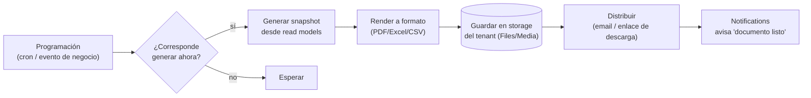
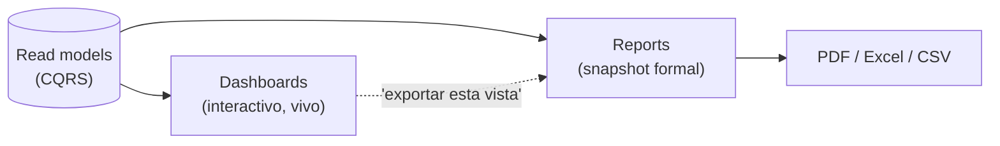

# Reports (Reportes)

> **Documento:** `specs/specs/reports.md` · **Estado:** Borrador v0.1 · **Actualizado:** 2026-07-11
> **Roles:** Product Manager · Software Architect · UX Designer
> **Relacionados:** [dashboards.md](./dashboards.md) · [users-permissions.md](./users-permissions.md) · [data-model.md](./data-model.md) · [production.md](./production.md) · [scrap.md](./scrap.md) · [quality.md](./quality.md) · [downtime.md](./downtime.md) · [traceability.md](./traceability.md) · [notifications.md](./notifications.md) · [glossary.md](./glossary.md)

## Resumen ejecutivo

El servicio **Reports** convierte los datos operativos de Nexo en **documentos formales** — producción, scrap, calidad, paradas, OEE, trazabilidad — que se pueden generar **on-demand** o de forma **programada**, y **exportar** a PDF, Excel o CSV para auditorías, dirección, clientes o el propio ERP. Es un servicio **por tenant** que consume los mismos **read models** (CQRS) que [Dashboards](./dashboards.md), garantizando que un KPI mostrado en un tablero y el mismo KPI impreso en un documento tengan **exactamente el mismo valor y la misma fórmula canónica**.

La diferencia con Dashboards es el propósito: un dashboard es **exploratorio y vivo**; un documento formal es un **artefacto congelado**, fechado, con formato de presentación, pensado para compartir, archivar o cumplir. Reports aporta el **constructor** (armar el documento a partir de secciones y KPIs), la **programación** (diario/semanal/mensual, por turno, por cierre de orden), la **distribución** (email/descarga) y el control de **permisos por rol** para que cada persona solo genere y reciba lo que su alcance permite.

Este documento define los **tipos**, los modos **on-demand y programado**, los **formatos exportables**, el **constructor**, las **fuentes de datos (read models)**, la **distribución** y los **permisos por rol**, alineado con las entidades canónicas ([data-model.md](./data-model.md)) y con las fórmulas de KPI del brief (sección 10.1).

---

## 1. Alcance y no-alcance

| Sí es alcance de Reports | NO es alcance (vive en otro documento) |
|---|---|
| Generar documentos formales (PDF/Excel/CSV) | Cálculo de origen / fuente de verdad → dominios |
| On-demand y programación | Visualización interactiva y drill-down → [dashboards.md](./dashboards.md) |
| Constructor (composición del documento) | Definición de KPI / fórmulas (son canónicas del brief) |
| Distribución por email / descarga | Envío multicanal genérico → [notifications.md](./notifications.md) |
| Permisos de generación/recepción por rol | AuthZ base (RBAC/ABAC) → [users-permissions.md](./users-permissions.md) |
| Snapshots reproducibles y fechados | Almacenamiento de evidencias/fotos → [Files / Media] |

> **Regla de frontera:** Reports **no recalcula** KPIs ni reinventa fórmulas: lee de read models. Reutiliza el **motor de plantillas/entrega de email** de [notifications.md](./notifications.md) para distribuir. Un documento formal es la **fotografía** de lo que los dominios calcularon.

---

## 2. Tipos

Cada tipo se ancla en un dominio y usa fórmulas canónicas idénticas a las de [dashboards.md](./dashboards.md).

| Tipo | Contenido típico | Fórmulas / KPIs canónicos | Read model | Dominio |
|---|---|---|---|---|
| **Producción** | Producido vs objetivo por orden/línea/turno, eficiencia | Producción; Eficiencia = Real/Objetivo | `rm_production` | [production.md](./production.md) |
| **Scrap** | Piezas y costo descartados, Pareto de motivos | **Scrap Rate = Piezas descartadas / Total producidas** (o por costo) | `rm_scrap` | [scrap.md](./scrap.md) |
| **Calidad** | Inspecciones, defectos, FPY, tendencia | **Calidad = Piezas buenas / Total producidas**; **FPY = Buenas a la primera / Total ingresadas** | `rm_quality` | [quality.md](./quality.md) |
| **Paradas** | Tiempo de paro por motivo, disponibilidad, confiabilidad | **MTBF = Tiempo operativo total / N.º de fallas**; **MTTR = Tiempo total de reparación / N.º de reparaciones** | `rm_downtime` | [downtime.md](./downtime.md) |
| **OEE** | OEE y descomposición por línea/turno/período | **OEE = Disponibilidad × Rendimiento × Calidad** (con las 3 fórmulas canónicas) | `rm_oee` | production+downtime+quality |
| **Trazabilidad** | Genealogía lote/serie, historial de un producto/orden | Cadena de eventos inmutables | Event Store | [traceability.md](./traceability.md) |

### 2.1 Recordatorio de fórmulas canónicas usadas

Idénticas al brief (10.1); Reports las **presenta**, no las redefine:

- **OEE = Disponibilidad × Rendimiento × Calidad**
- **Disponibilidad = Tiempo operativo / Tiempo productivo planificado** (Tiempo operativo = Planificado − Paradas)
- **Rendimiento = (Tiempo de ciclo ideal × Total de piezas producidas) / Tiempo operativo**
- **Calidad = Piezas buenas / Total de piezas producidas**
- **Scrap Rate = Piezas descartadas / Total producidas** (o por costo)
- **FPY = Piezas buenas a la primera / Total ingresadas**
- **MTBF = Tiempo operativo total / N.º de fallas** · **MTTR = Tiempo total de reparación / N.º de reparaciones**

### 2.2 Trazabilidad (caso especial)

El de trazabilidad no es un agregado de KPIs sino una **reconstrucción de historia**: dado un **Lote/Serie** o una **Orden**, arma la genealogía completa (materias primas → operaciones → controles de calidad → scrap → destino), leyendo del **Traceability / Event Store** inmutable. Es clave para auditorías, recalls y reclamos de cliente. Ver [traceability.md](./traceability.md).

---

## 3. On-demand vs programado

| Aspecto | **On-demand** | **Programado** |
|---|---|---|
| Disparo | Usuario lo pide en el momento | Calendario o evento (cron / "fin de turno" / "cierre de orden") |
| Parámetros | Elegidos en el momento (período, planta, línea…) | Predefinidos en la programación |
| Uso típico | Análisis puntual, responder una pregunta | Cierre de turno, informe semanal a dirección |
| Entrega | Descarga inmediata (o link cuando esté listo) | Email/descarga automática a destinatarios |
| Latencia | Segundos-minutos según tamaño | Se genera en background y se distribuye |

### 3.1 Ciclo de uno programado

- **Disparo por evento de negocio:** además de cron, puede programarse contra un evento (ej. "al cerrarse una Work Order, generar el de producción de la orden"), coordinado vía [rules-engine.md](./rules-engine.md).
- **Reproducibilidad:** el programado guarda el **snapshot** con su marca temporal; re-generarlo para el mismo período da el mismo resultado (consistencia con el histórico de read models).

---

## 4. Formatos exportables

| Formato | Cuándo usarlo | Características |
|---|---|---|
| **PDF** | Documento formal para leer/archivar/firmar | Layout fijo, marca del tenant, gráficos embebidos, paginado |
| **Excel (XLSX)** | Análisis posterior, tablas dinámicas del cliente | Múltiples hojas, datos + resúmenes, fórmulas visibles |
| **CSV** | Ingesta en otro sistema, datos crudos | Plano, delimitado, ideal para integraciones/BI externo |

- **Coherencia de datos entre formatos:** los tres parten del **mismo snapshot**; PDF prioriza presentación, Excel/CSV priorizan el dato reutilizable.
- **Marca por tenant:** PDF con logo, encabezado y pie del tenant (sin exponer datos de otros tenants).
- **Tamaño y volumen:** los pesados (trazabilidad, históricos largos) se generan en **background** y se ofrecen como descarga cuando están listos, con aviso vía [notifications.md](./notifications.md).

---

## 5. Constructor

El **constructor** permite componer un documento a partir de bloques, sin escribir código, reutilizando las mismas definiciones de KPI que los tableros.

### 5.1 Bloques

| Bloque | Descripción |
|---|---|
| **Portada / encabezado** | Título, período, alcance (planta/línea), marca del tenant, fecha de generación |
| **Parámetros / filtros** | Período, planta, sector, línea, máquina, turno, producto, orden |
| **Secciones de KPI** | Tarjetas/tablas con KPIs canónicos (producción, OEE, scrap, calidad, paradas) |
| **Gráficos** | Tendencias, Pareto, waterfall de OEE (reutilizados de [dashboards.md](./dashboards.md)) |
| **Tablas de detalle** | Registros (órdenes, paradas, defectos) con drill-down "aplanado" en el documento |
| **Notas / comentarios** | Texto libre, conclusiones, firma |
| **Anexos** | Enlaces a evidencias/trazabilidad |

### 5.2 Relación con plantillas y personas

- **Plantillas predefinidas** por caso de uso y persona: "Cierre de turno" (Supervisor), "Informe semanal de dirección" (Gerencia), "Calidad mensual" (Calidad), "Paradas por máquina" (Mantenimiento).
- **Reutilización de widgets:** los gráficos del constructor son los mismos del catálogo de widgets de Dashboards, renderizados en modo estático para el documento.
- **Guardar/compartir:** definiciones guardadas por el tenant, reutilizables on-demand o como base de una programación.

### 5.3 Documento formal vs dashboard (frontera de composición)

> Un usuario puede "exportar" una vista de dashboard como punto de partida: misma fuente, misma fórmula, distinto propósito (explorar vs congelar).

---

## 6. Fuentes de datos (read models)

Reports lee **exclusivamente** de read models (nunca de las bases transaccionales de los dominios), lo que garantiza consistencia con los tableros y protege el rendimiento del write side.

| Documento | Read model / fuente | Notas de consistencia |
|---|---|---|
| Producción | `rm_production` | Mismo dato que la KPI Card de producción del tablero |
| Scrap | `rm_scrap` | Scrap Rate y Pareto idénticos al widget |
| Calidad | `rm_quality` | Calidad y FPY con fórmula canónica |
| Paradas | `rm_downtime` | MTBF/MTTR/Disponibilidad canónicos |
| OEE | `rm_oee` (compuesto) | OEE = Disp.×Rend.×Calidad, mismo denominador que el waterfall |
| Trazabilidad | Traceability / Event Store | Historial inmutable; snapshot reproducible |

- **Aislamiento por tenant:** los read models viven en la **DB del tenant**; ninguno cruza datos entre empresas.
- **Snapshot fechado:** cada documento registra el período y la marca temporal del read model usado, de modo que quede claro "a qué momento corresponde".
- **Recalculabilidad:** si un read model se reproyecta (cambio de definición de KPI), los documentos futuros lo reflejan; los ya emitidos conservan su snapshot original (auditoría).

---

## 7. Distribución

| Vía | Descripción |
|---|---|
| **Descarga en Nexo** | El usuario descarga el archivo desde la UI; enlace temporal seguro |
| **Email** | On-demand/programados enviados a destinatarios; usa el motor de [notifications.md](./notifications.md) |
| **Enlace de descarga** | Link firmado con expiración para compartir (respetando permisos del tenant) |
| **Aviso "documento listo"** | Notificación in-app/email cuando uno pesado termina de generarse |

- **Destinatarios por rol:** una programación puede dirigirse a un **rol con scope** (ej. "supervisores de Planta A") en vez de a personas fijas; Notifications resuelve los destinatarios reales.
- **Segmentación por tenant:** remitente, marca y credenciales de email por tenant; nada se distribuye fuera del tenant sin acción explícita.
- **Almacenamiento:** los archivos generados se guardan en el storage aislado por tenant ([Files / Media]) con retención configurable.

---

## 8. Permisos por rol

La generación, la visibilidad y la recepción se rigen por **RBAC con scope por planta/línea** (y extensiones ABAC), definido en [users-permissions.md](./users-permissions.md). Reports **no** define su propio modelo de auth; lo consume.

| Persona | Genera | Ve / recibe | Alcance (scope) |
|---|---|---|---|
| **Operario** | — (o uno simple de su turno, si el tenant lo habilita) | El de su turno/puesto | Su línea/máquina |
| **Supervisor** | Cierre de turno, paradas, scrap de su sector | Los de su sector | Su sector/plantas asignadas |
| **Calidad** | Los de calidad y defectos | Calidad, FPY, trazabilidad de calidad | Líneas asignadas |
| **Producción** | Producción, OEE, eficiencia | Los de plantas asignadas | Plantas asignadas |
| **Mantenimiento** | Paradas, MTBF/MTTR por activo | Confiabilidad | Activos/plantas asignadas |
| **Gerencia** | Ejecutivos, comparativas, costos | Todos los de la empresa | Toda la empresa (tenant) |
| **Administrador (tenant)** | Gestiona plantillas y programaciones | Todo + configuración | Tenant completo |
| **Integraciones** | Técnicos / export a sistemas | Los de sync/técnicos | Según config |

- **Datos sensibles:** los que incluyen **costos** (scrap por costo, impacto económico) se restringen a roles habilitados (Gerencia/Producción); operarios ven volumen, no dinero.
- **Auditoría:** quién generó/descargó/distribuyó cada documento queda registrado en **Audit** (relevante para datos sensibles y cumplimiento).
- **Scope estricto:** un usuario nunca genera ni recibe uno con datos fuera de su alcance de plantas/líneas.

---

## 9. Escalabilidad, rendimiento y observabilidad

- **Generación asíncrona:** los pesados (trazabilidad, históricos largos, muchos gráficos) se generan en background con cola por tenant, sin bloquear la UI (ver [scalability.md](./scalability.md)).
- **Lectura barata:** al leer de read models pre-agregados, la generación no golpea el write side ni compite con la captura de eventos.
- **Cache de snapshots:** los recurrentes idénticos pueden reutilizar snapshots ya materializados.
- **Aislamiento:** colas, storage y credenciales por tenant; un tenant no afecta el rendimiento de otro.
- **Observabilidad:** tiempos de generación, fallos y volumen por tenant se reportan a **Observability** del Control Plane.

---

## 10. Trazabilidad de dependencias (resumen)

| Reports depende de / colabora con | Para |
|---|---|
| [dashboards.md](./dashboards.md) | Compartir read models, KPIs y widgets (misma fuente/fórmula) |
| [data-model.md](./data-model.md) | Entidades canónicas (orden, lote, turno, motivo…) |
| [users-permissions.md](./users-permissions.md) | Permisos de generación/recepción por rol y scope |
| [production.md](./production.md) · [scrap.md](./scrap.md) · [quality.md](./quality.md) · [downtime.md](./downtime.md) | Semántica y fórmulas de cada tipo |
| [traceability.md](./traceability.md) | Genealogía lote/serie |
| [notifications.md](./notifications.md) | Distribución por email y aviso "documento listo" |
| [rules-engine.md](./rules-engine.md) | Disparo por evento de negocio |

---

## Preguntas abiertas

1. **Snapshots vs reproyección:** cuando un read model se reproyecta por cambio de fórmula, ¿los históricos deben quedar "congelados" con su valor original siempre? ¿Cómo se comunica la diferencia al lector?
2. **Motor de render de PDF:** ¿qué nivel de personalización de layout se ofrece (plantilla fija vs constructor libre) sin escribir código?
3. **Costos y datos sensibles:** definir la matriz exacta de qué roles ven costos/dinero y cómo se audita el acceso.
4. **Programación por evento:** ¿qué eventos de negocio (cierre de orden, fin de turno) habilitan generación automática, y cómo se evita duplicar disparos con el Rules Engine?
5. **Retención de archivos generados:** ¿cuánto tiempo se conservan PDF/Excel/CSV por tenant, y difiere por plan/licencia?
6. **Distribución externa:** ¿se permite enviar a destinatarios **fuera** del tenant (clientes, auditores)? ¿Con qué controles y expiración de enlaces?
7. **Volumen grande:** límites de tamaño/período para exportaciones (especialmente CSV de trazabilidad) y estrategia de paginación/streaming del archivo.
8. **Estándares de la industria:** ¿se requieren formatos normados (ej. para auditorías de calidad o clientes automotrices) que condicionen las plantillas por industria?
