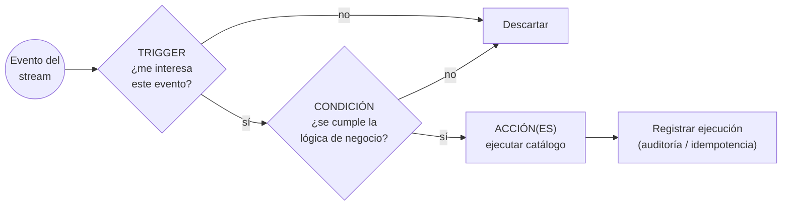
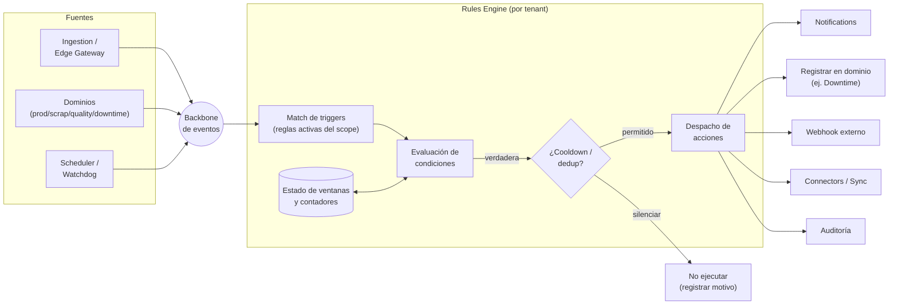
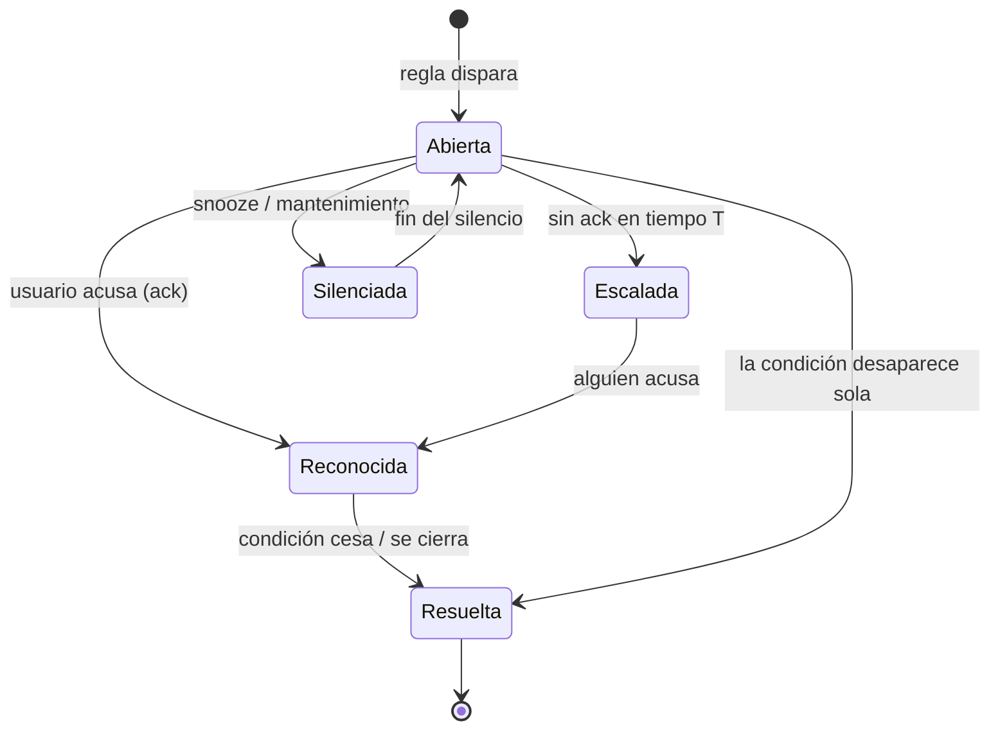
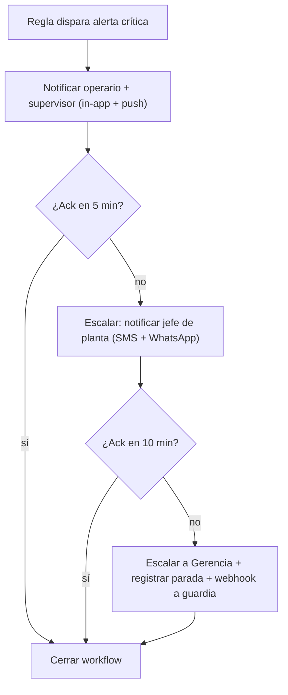

# Rules Engine (Motor de Reglas)

> **Documento:** `specs/specs/rules-engine.md` · **Estado:** Borrador v0.1 · **Actualizado:** 2026-07-11
> **Roles:** Product Manager · Software Architect · UX Designer
> **Relacionados:** [data-ingestion.md](./data-ingestion.md) · [notifications.md](./notifications.md) · [dashboards.md](./dashboards.md) · [downtime.md](./downtime.md) · [production.md](./production.md) · [quality.md](./quality.md) · [scrap.md](./scrap.md) · [integrations.md](./integrations.md) · [users-permissions.md](./users-permissions.md) · [glossary.md](./glossary.md)

## Resumen ejecutivo

El **Rules Engine** es el cerebro reactivo de Nexo: observa el **stream de Eventos** normalizados en **tiempo real** y, cuando se cumple una condición de negocio, ejecuta una o más **acciones** (notificar, crear alerta, registrar una parada, llamar un webhook, sincronizar con el ERP…). Materializa la entidad canónica **Regla (Rule)** — una automatización con modelo **trigger–condición–acción** — y es un servicio **por tenant** que opera contra la **DB del tenant**, respetando el aislamiento total del brief.

Su valor es convertir a Nexo de un sistema que **muestra** datos (ver [dashboards.md](./dashboards.md)) en uno que **actúa** sobre ellos: detectar una temperatura fuera de tolerancia y avisar, transformar una detención de máquina en un **Downtime Event** con motivo, escalar una alarma que nadie acusó, o disparar una sincronización con el ERP cuando se cierra una orden. Todo esto sin intervención humana y en segundos.

Este documento define el **modelo trigger-condición-acción**, los **eventos que disparan** reglas, el **catálogo de acciones**, el manejo de **alertas y workflows**, la **ejecución en tiempo real sobre el stream de eventos**, la distinción conceptual entre **constructor visual** y **DSL**, y un conjunto de **ejemplos concretos**. El Rules Engine **no** es dueño de los datos de dominio ni de los canales de entrega: consume eventos de [data-ingestion.md](./data-ingestion.md) y delega la entrega en [notifications.md](./notifications.md).

---

## 1. Alcance y no-alcance

| Sí es alcance del Rules Engine | NO es alcance (vive en otro documento) |
|---|---|
| Definir y evaluar reglas trigger-condición-acción | Recepción/normalización del evento → [data-ingestion.md](./data-ingestion.md) |
| Ejecución en tiempo real sobre el stream | Entrega multicanal de mensajes → [notifications.md](./notifications.md) |
| Generar **Alertas** (entidad canónica) | Fuente de verdad de producción/scrap/paradas → dominios |
| Orquestar **workflows** (escalado, secuencias) | Visualización de KPIs y alarmas → [dashboards.md](./dashboards.md) |
| Invocar acciones (webhook, sync, registrar parada) | Ejecución de la sincronización ERP en sí → [integrations.md](./integrations.md) |
| Constructor visual / DSL de reglas | AuthZ de quién edita reglas → [users-permissions.md](./users-permissions.md) |

> **Regla de frontera:** el Rules Engine **decide y dispara**; otros servicios **ejecutan la mecánica** (enviar el email, correr el Sync Job, persistir el registro de dominio). Esto mantiene alta cohesión y bajo acoplamiento.

---

## 2. Modelo trigger–condición–acción

Una **Regla (Rule)** es la unidad canónica de automatización. Se compone de tres bloques, más metadatos de gobierno.

### 2.1 Anatomía de una regla

| Bloque | Qué define | Ejemplos |
|---|---|---|
| **Identidad / gobierno** | Nombre, descripción, estado (activa/pausada), owner, alcance (planta/línea), prioridad, versión | "Alerta temperatura horno L3" |
| **Trigger** | Qué **tipo de evento** o cambio la despierta | Llega evento `reading` de tag `temp_horno`; se crea un `downtime`; cambia estado de máquina |
| **Condición** | Predicado sobre el payload del evento y/o contexto/ventana | `valor > 85`; `duración_parada > 15 min`; `scrap_rate_turno > 5%` |
| **Acción(es)** | Qué hacer si la condición es verdadera | Crear alerta + notificar + registrar parada |
| **Control de ejecución** | Anti-ruido y consistencia | Debounce, cooldown, deduplicación, ventana de silencio, límites |

### 2.2 Tipos de condición

| Tipo | Descripción | Ejemplo |
|---|---|---|
| **Umbral simple** | Comparación de un valor del payload | `temp > 85 °C` |
| **Rango / tolerancia** | Dentro/fuera de banda | `presión ∉ [2,0 ; 4,5] bar` |
| **Temporal / ventana** | Sobre una ventana móvil de eventos | `parada activa > 15 min`; `sin producción por 10 min` |
| **Frecuencia / conteo** | N eventos en T tiempo | `> 3 defectos del mismo tipo en 1 h` |
| **Ausencia (heartbeat)** | No llegó un evento esperado | `sin lectura del device por 5 min` → posible caída |
| **Tendencia** | Variación sostenida | `OEE cae > 10 pp respecto al turno anterior` |
| **Compuesta** | Combinación lógica (AND/OR/NOT) | `temp > 85 AND máquina = produciendo` |
| **Contextual (ABAC)** | Depende de turno/planta/producto | `solo en turno noche` |

> **Nota sobre KPIs en condiciones:** cuando una condición usa un KPI (OEE, Scrap Rate, Disponibilidad, etc.), la **fórmula es la canónica** del brief (sección 10.1) y proviene, ya calculada, de un **evento derivado** publicado por el dominio o por una proyección — el Rules Engine **no recalcula** fórmulas de KPI. Por ejemplo, `Scrap Rate = Piezas descartadas / Total producidas` se evalúa sobre el valor ya computado, no reimplementando la división en la regla.

---

## 3. Eventos que disparan reglas

El Rules Engine se suscribe al **backbone de eventos**. Los triggers se expresan sobre el **Evento canónico** (campos `type`, `source`, `site/line/asset`, `payload`, etc., ver sección 8.1 del brief) y sobre **eventos de dominio** publicados por los servicios por tenant.

### 3.1 Catálogo de disparadores

| Familia de evento | `type` / origen | Ejemplos de trigger |
|---|---|---|
| **Lecturas de señal** | `reading` (Devices/Ingestion) | Temperatura, presión, contador, vibración cruza umbral |
| **Producción** | `production` ([production.md](./production.md)) | Se registra producción; se cierra una orden; ritmo bajo |
| **Scrap** | `scrap` ([scrap.md](./scrap.md)) | Se registra scrap; scrap del turno supera umbral |
| **Calidad** | `quality` ([quality.md](./quality.md)) | Inspección falla; defecto crítico; FPY bajo |
| **Paradas** | `downtime` ([downtime.md](./downtime.md)) | Se abre parada; parada supera duración; parada sin motivo |
| **Evento de máquina** | `machine_event` | Cambio de estado (run/idle/down), fallo, alarma de PLC |
| **Salud de dispositivo** | Devices | Device offline, batería baja, calidad de dato degradada |
| **Sincronización** | Connectors ([integrations.md](./integrations.md)) | Sync Job falla; conflicto de mapeo |
| **Temporal / programado** | Scheduler interno | "Cada inicio de turno", "cada hora", "fin de día" |
| **Ausencia de evento** | Watchdog | No llegó evento esperado en la ventana |

### 3.2 Suscripción y contexto

- El motor recibe el evento con su **contexto canónico** (tenant, site/line/asset, shift, operator) para poder **enrutar** la regla al alcance correcto.
- Solo se evalúan reglas **activas** cuyo **scope** (planta/línea) coincide con el del evento — respetando el aislamiento y el scoping RBAC/ABAC.
- Los triggers temporales y de ausencia los genera un **scheduler/watchdog** interno que emite "pseudo-eventos" al mismo pipeline, para un modelo uniforme.

---

## 4. Ejecución en tiempo real sobre el stream de eventos

El Rules Engine es un **procesador de streams**: consume del broker, evalúa y actúa, con latencia de segundos y garantías de no duplicar acciones.

### 4.1 Pipeline de evaluación

### 4.2 Garantías y control de ruido

| Mecanismo | Propósito |
|---|---|
| **Idempotencia** | Usar `event_id`/`dedup_key` del evento para no ejecutar dos veces la misma regla ante reprocesos |
| **Debounce** | Esperar estabilidad antes de disparar (evita parpadeo de umbral) |
| **Cooldown / rate limit** | No repetir la misma alerta cada segundo; una cada N minutos |
| **Ventana de silencio (snooze/maintenance)** | Suspender reglas durante mantenimiento planificado |
| **Deduplicación de alerta** | Una alerta "abierta" por condición+recurso hasta que se resuelva |
| **Orden y estado de ventana** | Manejo de eventos fuera de orden y ventanas móviles con estado |
| **Backpressure** | Ante picos, encolar/priorizar por severidad; nunca perder eventos críticos |

### 4.3 Consistencia con el edge

Como la captura es **edge-first con store-and-forward**, el motor puede recibir eventos **atrasados** tras una reconexión. Las condiciones temporales usan el `timestamp` del evento (no la hora de llegada) y las acciones idempotentes evitan avalanchas de alertas retroactivas. Ver [data-ingestion.md](./data-ingestion.md).

---

## 5. Catálogo de acciones

Las acciones son el **qué hacer** cuando una regla dispara. El motor **decide**; cada acción se ejecuta invocando al servicio responsable.

| Acción | Qué hace | Servicio que ejecuta | Notas |
|---|---|---|---|
| **Notificar** | Enviar aviso multicanal (in-app/email/SMS/push/WhatsApp) | [notifications.md](./notifications.md) | El motor pasa evento + plantilla + destinatarios/rol |
| **Crear alerta** | Materializar una **Alerta** (entidad canónica) con severidad y estado | Rules Engine (propio) | Alimenta lista de alarmas de [dashboards.md](./dashboards.md) |
| **Registrar parada** | Crear/actualizar un **Downtime Event** con motivo | [downtime.md](./downtime.md) | Convierte detección automática en registro de dominio |
| **Llamar webhook** | POST a un endpoint externo del cliente | Rules Engine (saliente) | Firmado, con reintentos; integra sistemas de terceros |
| **Sincronizar** | Disparar un **Sync Job** hacia el ERP (Odoo…) | [integrations.md](./integrations.md) | Ej. cerrar orden al completar producción |
| **Escalar** | Avanzar el workflow al siguiente nivel si no hay acuse | Rules Engine (workflow) | Ver sección 6 |
| **Registrar/etiquetar** | Marcar/anotar un evento o entidad (tag, prioridad) | Dominio / Audit | Para clasificación posterior |
| **Ejecutar workflow** | Lanzar una secuencia de pasos | Rules Engine | Combina varias acciones |
| **Registrar en auditoría** | Dejar traza de la decisión y la acción | [Audit] | Siempre, transversal |

> Cada acción declara: destinatario/objetivo, plantilla/payload, política de reintento y su registro de auditoría. Las acciones **con efectos externos** (webhook, sync) siempre son idempotentes o llevan clave de idempotencia.

---

## 6. Alertas y workflows

### 6.1 Alerta como entidad y su ciclo de vida

Una **Alerta / Alarma (Alert)** es la entidad canónica que representa una condición notificable disparada por una regla o umbral. Tiene ciclo de vida propio para permitir acuse, seguimiento y escalado.

| Atributo de la alerta | Descripción |
|---|---|
| Severidad | Info / Advertencia / Crítica |
| Estado | Abierta / Reconocida / Escalada / Resuelta / Silenciada |
| Recurso | Planta/línea/máquina/orden asociada |
| Origen | Regla que la generó (enlazable desde el dashboard) |
| Deduplicación | Una alerta abierta por condición+recurso |

### 6.2 Workflows (automatizaciones compuestas)

Un **workflow** encadena pasos con esperas, condiciones y escalado. El caso más común es el **escalado de alerta**: si nadie acusa en un tiempo, se sube de nivel (más gente, otro canal). La mecánica de escalado de **entrega** vive en [notifications.md](./notifications.md); el Rules Engine gobierna la **lógica** de avance.

---

## 7. Constructor visual vs DSL (a nivel conceptual)

Nexo ofrece **dos formas** de crear reglas sobre el **mismo modelo** subyacente (trigger-condición-acción). No son motores distintos: son dos interfaces sobre la misma definición canónica.

| Aspecto | **Constructor visual (no-code)** | **DSL (avanzado)** |
|---|---|---|
| Público | Supervisor, Calidad, Producción (sin perfil técnico) | Administrador, Integraciones (técnicos) |
| Forma | Wizard: "Cuando… Si… Entonces…" con selectores y menús | Expresión declarativa legible (regla como texto estructurado) |
| Curva | Baja; guiado, con validaciones y vista previa | Media; potente para lógica compuesta y reutilización |
| Casos | Umbrales, notificaciones, escalados comunes | Condiciones compuestas, ventanas, plantillas reutilizables |
| Reutilización | Plantillas de regla predefinidas por industria | Fragmentos/variables, versionado, revisión por diffs |
| Garantía | Ambas producen la **misma** definición interna de regla y comparten validación, simulación y auditoría | |

- **Vista previa / simulación (dry-run):** antes de activar, la regla se puede **probar contra eventos históricos** ("¿cuántas veces habría disparado la última semana?") para calibrar umbrales y evitar ruido. Este backtesting usa el historial de eventos (ver [traceability.md](./traceability.md)) sin ejecutar acciones reales.
- **Biblioteca de plantillas:** reglas típicas por industria (metalúrgica, alimenticia, plásticos…) listas para clonar, alineadas con el público objetivo del brief.
- **Sin código para el usuario:** en línea con la propuesta de valor de Nexo, el usuario final **no programa**; el DSL es declarativo y conceptual, no un lenguaje de propósito general.

---

## 8. Ejemplos concretos (tabla de reglas)

Reglas de ejemplo que ilustran el modelo completo. Todas respetan scope por planta/línea y las fórmulas canónicas cuando aplican.

| # | Nombre | Trigger | Condición | Acción(es) | Control |
|---|---|---|---|---|---|
| R-01 | Temperatura de horno alta | Evento `reading` tag `temp_horno` | `valor > 85 °C` durante > 30 s | Crear alerta (crítica) + Notificar supervisor (in-app+push) | Debounce 30 s, cooldown 5 min |
| R-02 | Parada larga sin motivo | Evento `downtime` abierto | `duración > 15 min` **AND** `motivo = null` | Notificar operario para clasificar + escalar a supervisor | 1 alerta por parada |
| R-03 | Scrap del turno excede meta | Evento `scrap` registrado | `Scrap Rate turno > 5%` (fórmula canónica) | Alerta (advertencia) + Notificar Calidad | Cooldown 30 min |
| R-04 | Máquina detenida = registrar parada | `machine_event` estado→`down` | Estado pasa a detenido y no hay parada abierta | **Registrar parada** en [downtime.md](./downtime.md) + alerta | Dedup por máquina |
| R-05 | Defecto crítico recurrente | Evento `quality` (defecto) | `> 3 defectos tipo X en 1 h` | Alerta crítica + Notificar Calidad + webhook a sistema QA | Ventana móvil 1 h |
| R-06 | Dispositivo offline | Watchdog (ausencia) | `sin lectura del device > 5 min` | Alerta + Notificar Mantenimiento + marcar salud device | Heartbeat, 1 alerta abierta |
| R-07 | Orden completada → sincronizar | Evento `production` cierre de orden | `producido ≥ objetivo` **AND** orden abierta | **Sincronizar** cierre con ERP (Sync Job) + notificar Producción | Idempotente por orden |
| R-08 | OEE bajo sostenido | Evento derivado OEE por línea | `OEE < 60%` por 10 min (Disp.×Rend.×Calidad) | Alerta + encender rojo de andon ([dashboards.md](./dashboards.md)) | Cooldown 15 min |
| R-09 | Inicio de turno (programada) | Scheduler "cada inicio de turno" | Siempre | Notificar objetivos del turno a operarios (in-app) | 1 vez por turno |
| R-10 | Sync ERP falló | Evento de Connectors | `Sync Job estado = error` | Alerta + Notificar Integraciones + reintento controlado | Backoff, escalar si persiste |

---

## 9. Gobierno, permisos y auditoría

- **Quién puede crear/editar reglas:** gobernado por RBAC/ABAC (ver [users-permissions.md](./users-permissions.md)). Típicamente Administrador e Integraciones editan todo; Supervisor/Calidad crean reglas dentro de su scope de planta/línea.
- **Alcance (scope):** cada regla se limita a las plantas/líneas del alcance del autor; nunca cruza tenants (aislamiento total).
- **Versionado y estados:** reglas versionadas, con estados activa/pausada/borrador; cambios y activaciones quedan en **Audit**.
- **Auditoría de ejecución:** cada disparo registra evento origen, condición evaluada, acción tomada y resultado (para diagnóstico de "por qué disparó / por qué no").
- **Feature flags y límites:** número de reglas, canales permitidos y acciones avanzadas pueden gobernarse por plan/licencia desde el [control-plane.md](./control-plane.md).

---

## 10. Escalabilidad y aislamiento

- **Por tenant, contra la DB del tenant;** el estado de ventanas y contadores es por tenant.
- **Escala de diseño:** millones de eventos/día ⇒ evaluación en streaming particionada por tenant/recurso, indexado de reglas por tipo de evento y scope para *matching* eficiente, y estado de ventanas acotado (ver [scalability.md](./scalability.md)).
- **Prioridad por severidad** ante picos; las reglas críticas no se ven demoradas por reglas informativas.
- **Observabilidad:** *lag* de consumo, tasa de disparos, acciones fallidas y reglas "ruidosas" se reportan a **Observability** del Control Plane.

---

## 11. Trazabilidad de dependencias (resumen)

| Rules Engine depende de / colabora con | Para |
|---|---|
| [data-ingestion.md](./data-ingestion.md) | Recibir el stream de eventos normalizados (triggers) |
| [notifications.md](./notifications.md) | Ejecutar la acción "notificar" y el escalado de entrega |
| [dashboards.md](./dashboards.md) | Publicar alertas/alarmas mostradas y estado del andon |
| [downtime.md](./downtime.md) | Acción "registrar parada" y triggers de parada |
| [production.md](./production.md) · [scrap.md](./scrap.md) · [quality.md](./quality.md) | Triggers de dominio y KPIs canónicos en condiciones |
| [integrations.md](./integrations.md) | Acción "sincronizar" (Sync Job) y triggers de sync |
| [users-permissions.md](./users-permissions.md) | AuthZ de creación/edición y scoping de reglas |
| [traceability.md](./traceability.md) | Backtesting/dry-run contra histórico de eventos |

---

## Preguntas abiertas

1. **Fuente de KPIs en condiciones:** ¿los KPIs usados en condiciones (OEE, Scrap Rate) se consumen como eventos derivados publicados por los dominios, o el motor los pide a un read model? Definir el contrato para no recalcular fórmulas.
2. **Eventos atrasados del edge:** política definitiva para condiciones temporales cuando llegan eventos retroactivos tras store-and-forward (¿re-evaluar? ¿suprimir alertas retroactivas?).
3. **DSL: alcance y forma:** ¿hasta dónde llega el DSL declarativo sin volverse un lenguaje de programación? ¿Se expone a clientes o solo a implementadores/partners?
4. **Backtesting:** ¿qué ventana de histórico se permite simular y con qué costo, dado el volumen de eventos por tenant?
5. **Límites por plan:** cantidad máxima de reglas activas, frecuencia de disparo y canales por licencia — ¿quién los define y cómo se comunican al usuario?
6. **Solapamiento de reglas:** ¿cómo se resuelven reglas que disparan sobre el mismo evento con acciones contradictorias? ¿Prioridad, orden, o composición explícita?
7. **Ownership de "registrar parada":** confirmar la frontera exacta entre detección automática (motor) y confirmación humana del motivo (operario) en [downtime.md](./downtime.md).
8. **Reglas globales del Control Plane:** ¿existen reglas a nivel proveedor (ej. tenant al borde de su cuota) separadas de las reglas operativas por tenant?
