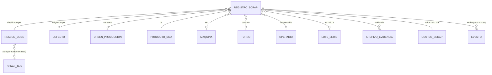
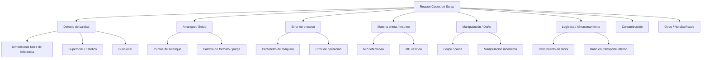
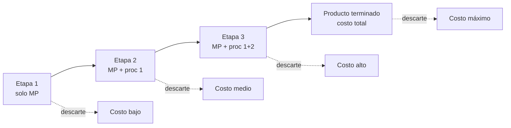
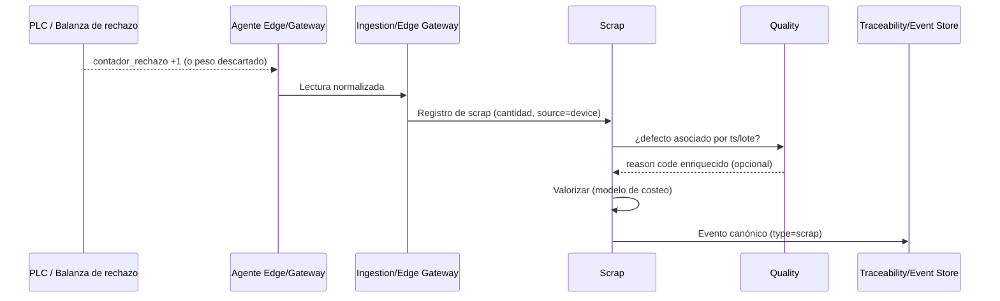
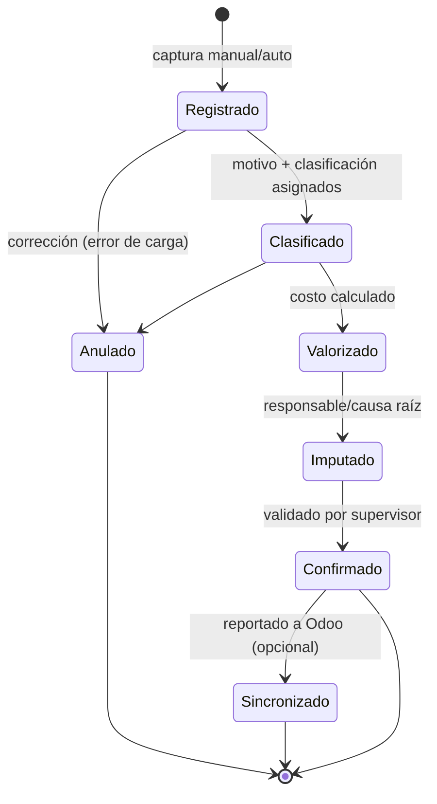
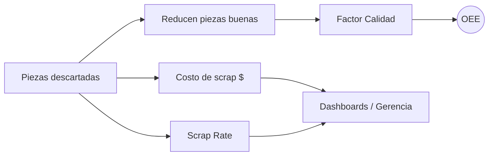

# Scrap (Descarte / Merma)

> **Documento:** `specs/specs/scrap.md` · **Estado:** Borrador v0.1 · **Actualizado:** 2026-07-11
> **Roles:** Product Manager · Software Architect · UX Designer
> **Relacionados:** [architecture.md](./architecture.md) · [glossary.md](./glossary.md) · [production.md](./production.md) · [quality.md](./quality.md) · [downtime.md](./downtime.md) · [traceability.md](./traceability.md) · [data-ingestion.md](./data-ingestion.md) · [dashboards.md](./dashboards.md) · [rules-engine.md](./rules-engine.md) · [integrations.md](./integrations.md) · [devices.md](./devices.md) · [data-model.md](./data-model.md)

## Resumen ejecutivo

El dominio de **Scrap** modela el **material descartado**: cuánto se descartó, **por qué** (taxonomía de reason codes), **cuánto cuesta** (modelo de costeo), **quién** es responsable, con qué **evidencia** y bajo qué **clasificación**. Es el dominio que traduce la no conformidad en **pérdida económica cuantificada**, cerrando el círculo entre calidad, producción y el impacto financiero que la Gerencia necesita ver.

Scrap es un dominio **hermano de Calidad**: una pieza **rechazada** en [Calidad](./quality.md) que no se recupera se convierte en un **Registro de scrap (Scrap Record)**. Pero no todo el scrap nace de una inspección formal: también hay descarte de **arranque/setup**, **derrames**, **material dañado en manipulación** o **puntas de proceso** que el operario registra directamente. Por eso la captura es **dual**: **manual desde tablet** (el operario declara cantidad + motivo + foto) y **automática desde sensor** (una balanza de rechazo, un contador de piezas expulsadas por un PLC, un sensor de la línea de descarte).

Scrap es dueño del KPI **Scrap Rate = Piezas descartadas / Total producidas** (o por costo), coherente con la fórmula canónica del brief, y contribuye indirectamente al **factor Calidad** del OEE (a través de las no conformidades). Provee además las **estadísticas de Pareto** (qué motivos concentran la pérdida) que orientan la mejora continua.

Como todo el sistema, es **agnóstico del ERP**: el scrap valorizado puede sincronizarse con Odoo (ajustes de inventario, consumos, costos) vía **Connectors / Integrations** y su ACL, pero la planta registra scrap **sin** depender del ERP (store-and-forward).

---

## 1. Alcance y objetivos del dominio

**Servicio (Bounded Context) responsable:** **Scrap** (por tenant). Responsabilidad: *Registros de scrap, motivos, costos, clasificación*.

### En alcance (MVP)
- Registrar **cantidad descartada** con **motivo** (reason code), **contexto** (orden/máquina/turno/operario) y **evidencia**.
- **Taxonomía de reason codes** de scrap, **coherente** con [Calidad](./quality.md) y [Paradas](./downtime.md).
- **Modelo de costeo** del scrap (material + proceso + valor agregado perdido).
- **Clasificación**: recuperable vs no recuperable, reciclable, reproceso, tipo de pérdida.
- **Responsables** e imputación (persona, turno, causa raíz).
- **Estadísticas**: Scrap Rate, Pareto de motivos, costo por motivo/línea/producto/turno.
- **Captura dual**: tablet (manual) y sensor (automático).
- Emisión de **Eventos canónicos** `type=scrap`.

### Fuera de alcance de este dominio
- Decisión de disposición (aceptar/rechazar/retrabajar) → [quality.md](./quality.md).
- Volumen producido y buenas/total base → [production.md](./production.md).
- Tiempo perdido por parada de máquina → [downtime.md](./downtime.md).

---

## 2. Entidades involucradas

Nombres de las **entidades canónicas (sección 8 del brief)**.

| Entidad canónica | Rol en Scrap | Propiedad |
|---|---|---|
| **Registro de scrap (Scrap Record)** | Cantidad descartada + motivo + costo | **Propia** |
| **Motivo (Reason Code)** | Código de descarte (taxonomía compartida) | **Propia** (reusa taxonomía de Calidad) |
| **Producto / SKU** | Qué se descartó (define costo unitario base) | Referenciada |
| **Orden de producción (WO/MO)** | Contexto de la corrida | Referenciada ([production.md](./production.md)) |
| **Máquina / Centro de trabajo** | Dónde se generó el scrap | Referenciada |
| **Turno (Shift)** | Cuándo | Referenciada |
| **Operario (Operator)** | Quién registró / responsable | Referenciada |
| **Defecto (Defect)** | No conformidad que originó el descarte | Referenciada ([quality.md](./quality.md)) |
| **Sensor / Señal (Tag)** | Fuente automática (balanza/contador de rechazo) | Referenciada ([devices.md](./devices.md)) |
| **Lote (Batch) / Serie (Serial)** | Trazabilidad de lo descartado | Referenciada ([traceability.md](./traceability.md)) |
| **Archivo (File / Media)** | Foto del descarte | Referenciada (Files/Media) |
| **Evento (Event)** | Salida `type=scrap` | Co-propiedad con Traceability |

---

## 3. Taxonomía de reason codes de scrap (compartida)

La taxonomía de scrap **reutiliza el modelo de Reason Codes compartido** (ver [quality.md](./quality.md) §6): un descarte por un defecto dimensional lleva **el mismo reason code raíz** que el defecto que lo originó. Se agregan ramas propias del descarte que **no** derivan de una inspección formal (arranque, manipulación, logística).

### 3.1 Árbol conceptual de reason codes de scrap

### 3.2 Relación de reason codes entre dominios

| Rama de Scrap | Correlato en Calidad | Correlato en Paradas |
|---|---|---|
| Defecto de calidad | Mismo reason code de [Defecto](./quality.md) | — |
| Arranque / Setup | first-off no conforme | Parada por **cambio de formato/setup** ([downtime.md](./downtime.md)) |
| Error de proceso | Deriva SPC / no conforme | Parada por ajuste de proceso |
| Materia prima | Defecto de MP | Parada por **falta/mala MP** |
| Manipulación / Logística | — | — |

> **Regla canónica:** un reason code raíz es **el mismo objeto conceptual** en los tres dominios (`dominios_aplica = [quality, scrap, downtime]`). Esto permite Paretos **cruzados**: "el motivo X causa parada, defecto y scrap a la vez". Catálogo base cargado en el **seed del tenant** (sección 6.1 del brief), extensible por el Administrador.

---

## 4. Modelo de costeo del scrap

El costeo convierte cantidad descartada en **$**. Nexo adopta un modelo **por capas de costo acumulado**, porque el costo de una pieza descartada **crece a medida que avanza en el proceso** (una pieza descartada al final "vale" más que una descartada al inicio).

### 4.1 Componentes del costo unitario de scrap

| Componente | Descripción | Fuente |
|---|---|---|
| **Costo de material (MP)** | Materia prima incorporada hasta el punto de descarte | Maestro producto / BOM (Odoo) |
| **Costo de proceso** | Mano de obra + máquina + energía consumidos | Tarifas por operación/centro de trabajo |
| **Valor agregado perdido** | Operaciones ya realizadas que se pierden | Ruta / etapa del descarte |
| **Costo de disposición** | Costo de tratar el residuo (reciclaje, disposición) | Parámetro por tipo de material |
| **Crédito de recuperación** | Valor recuperable (reciclable, reproceso) | Resta al costo neto |

**Costo neto del scrap = (MP + Proceso + Valor agregado + Disposición) − Recuperación.**

### 4.2 Costeo según punto de descarte

### 4.3 Estrategias de valorización (a definir por tenant)
| Estrategia | Descripción |
|---|---|
| **Costo estándar** | Costo unitario fijo del maestro (simple, MVP) |
| **Costo por etapa** | Costo acumulado según operación de descarte |
| **Costo real (ERP)** | Valorización tomada de Odoo (costos reales) — V1+ |

> El **modelo de costeo es configurable**. En MVP se recomienda **costo estándar por producto** con opción de **costo por etapa** si la ruta está definida. La reconciliación con costos reales de Odoo se difiere ([integrations.md](./integrations.md)). Ver [Preguntas abiertas](#preguntas-abiertas).

---

## 5. Métodos de captura

### 5.1 Captura manual (tablet)
El operario registra el descarte directamente:
- Selecciona **orden/máquina/producto**, ingresa **cantidad descartada** y **motivo (reason code)**.
- Adjunta **foto** de evidencia (Files/Media).
- Indica **clasificación** (recuperable/no) y, si aplica, **responsable/causa raíz**.
- El costo se **calcula automáticamente** según el modelo (§4) — el operario no ingresa $.
- **Offline-first**: encola sin red.

### 5.2 Captura automática (sensor)
- **Balanza de rechazo / tolva de descarte**: pesa el material descartado → cantidad (kg → uds vía factor).
- **Contador de expulsión (PLC)**: un tag `contador_rechazo` que incrementa cuando la línea expulsa una pieza no conforme.
- **Sensor de línea de descarte**: detector óptico en la vía de rechazo.
- El **motivo automático** suele ser genérico ("rechazo automático de línea"); puede **enriquecerse** con el reason code del defecto que lo disparó en [Calidad](./quality.md) (correlación por timestamp/lote).

### 5.3 Comparativa
| Criterio | Manual (tablet) | Automático (sensor) |
|---|---|---|
| `source` del Evento | `manual` | `device` |
| Motivo | Preciso (operario clasifica) | Genérico (enriquecible) |
| Responsable | Directo | Inferido (turno/operario asignado) |
| Cantidad | Declarada | Medida (peso/conteo) |
| Evidencia | Foto directa | Requiere cámara de línea |
| Rol dominante | Operario | Devices + Ingestion |

---

## 6. Flujo de registro y estados

| Estado | Significado |
|---|---|
| **Registrado** | Cantidad capturada (aún sin motivo/costo completos) |
| **Clasificado** | Reason code + clasificación (recuperable/no) asignados |
| **Valorizado** | Costo calculado según modelo |
| **Imputado** | Responsable / causa raíz asignados |
| **Confirmado** | Validado por supervisor (dato firme para KPI) |
| **Sincronizado** | Ajuste reportado a Odoo (si aplica) |
| **Anulado** | Corrección; nunca se borra, se anula con traza |

> **Correcciones:** como en el resto de Nexo, no hay edición destructiva. Una corrección genera un **evento de ajuste** (inmutabilidad; ver [traceability.md](./traceability.md)).

---

## 7. Clasificación del scrap

| Dimensión de clasificación | Valores |
|---|---|
| **Recuperabilidad** | No recuperable / Reciclable / Reprocesable |
| **Origen** | Calidad / Proceso / Arranque / Material / Manipulación / Logística |
| **Momento** | Arranque (setup) / Régimen / Cierre |
| **Responsabilidad** | Operación / Mantenimiento / Proveedor (MP) / Logística |
| **Evitabilidad** | Evitable / Inevitable (merma técnica esperada) |

> La distinción **evitable vs inevitable** es clave para KPIs: la merma técnica esperada (p. ej. puntas de arranque) no debería penalizar igual que el scrap evitable. Ver [Preguntas abiertas](#preguntas-abiertas).

---

## 8. Validaciones

| # | Validación | Tipo | Acción ante fallo |
|---|---|---|---|
| V1 | Cantidad descartada > 0 y numérica | Sintáctica | Rechazo |
| V2 | Motivo (reason code) **obligatorio** para confirmar | Completitud | Bloquear confirmación |
| V3 | Scrap ≤ Total producido del contexto (coherencia) | Consistencia | Alerta; posible error de carga |
| V4 | Producto/SKU con costo definido (o costo 0 marcado) | Referencial | Advertir; costo pendiente |
| V5 | Evidencia obligatoria según política (motivo/monto) | Negocio | Exigir foto |
| V6 | Responsable con permiso sobre línea/planta | Autorización | Rechazo |
| V7 | Dedup por `dedup_key` (auto) | Idempotencia | Descartar duplicado |
| V8 | Peso→uds con factor de conversión válido | Conversión | Cuarentena si falta factor |
| V9 | Scrap rechazado por Calidad debe existir como Defecto | Integridad cruzada | Vincular al defecto de origen |
| V10 | Costo recalculado si cambia el modelo/tarifa (versionado) | Consistencia | Registrar versión de costeo usada |

---

## 9. Personas y permisos

| Persona | Interacción con Scrap |
|---|---|
| **Operario** | Registra scrap manual, adjunta foto, clasifica motivo |
| **Calidad** | Genera scrap por rechazo; enriquece reason code |
| **Supervisor** | Confirma, imputa responsable/causa raíz, anula errores |
| **Producción** | Monitorea Scrap Rate de la corrida |
| **Mantenimiento** | Recibe imputación cuando el scrap es por falla de máquina |
| **Gerencia** | Ve costo de scrap, Pareto, tendencia en [dashboards.md](./dashboards.md) |
| **Administrador** (tenant) | Configura reason codes, modelo de costeo, tarifas |
| **Integraciones** | Configura sync de ajustes de inventario/costo con Odoo |

Matriz completa en [users-permissions.md](./users-permissions.md).

---

## 10. KPIs y estadísticas

Fórmula **idéntica** a la sección 10.1 del brief.

| KPI | Fórmula | Notas |
|---|---|---|
| **Scrap Rate (por cantidad)** | **Piezas descartadas / Total producidas** | Denominador = total de [Producción](./production.md) |
| **Scrap Rate (por costo)** | Costo de scrap / Costo de producción | Valorización §4 |
| **Costo de scrap** | Σ costo neto de registros | Por motivo/línea/producto/turno |
| **Pareto de motivos** | Ranking de reason codes por cantidad/costo | Priorización de mejora |
| **% Scrap evitable** | Scrap evitable / Scrap total | Foco de acción |
| **Scrap por punto de proceso** | Scrap por etapa/operación | Dónde se pierde valor |

### 10.1 Relación con OEE
Scrap **no** es un factor directo del OEE, pero se relaciona estrechamente:
- Las piezas descartadas son **no conformes** → reducen el **factor Calidad = Piezas buenas / Total producidas** ([quality.md](./quality.md), [production.md](./production.md)).
- El scrap de **arranque/setup** suele correlacionar con **paradas de cambio de formato** ([downtime.md](./downtime.md)).

Los KPIs se materializan como read models (CQRS) y se muestran en [dashboards.md](./dashboards.md).

---

## 11. Eventos emitidos y consumidos

| Evento | Dirección | Consumidores |
|---|---|---|
| `scrap.registered` | Emite | Production (ajusta buenas/total), Traceability, Dashboards |
| `scrap.classified` / `scrap.valued` | Emite | Dashboards, Reports, Integrations |
| `scrap.threshold.exceeded` | Emite | Rules Engine, Notifications (alerta de Scrap Rate alto) |
| `quality.disposition` (rechazo) | Consume | de [Quality](./quality.md) → crea Scrap Record |
| `production.registered` | Consume | de [Producción](./production.md) (denominador Scrap Rate) |
| `machine_event` | Consume | correlación con parada/setup ([downtime.md](./downtime.md)) |

Todos siguen el **Evento canónico** (sección 8.1 del brief), inmutables, con `type=scrap`. Normalización en [data-ingestion.md](./data-ingestion.md); genealogía en [traceability.md](./traceability.md). El motor de reglas dispara alertas por umbral ([rules-engine.md](./rules-engine.md)).

---

## 12. Integración con Odoo

| Concepto Odoo | Concepto Nexo | Dirección | Notas |
|---|---|---|---|
| Ajuste de inventario / desecho (`stock.scrap`) | Registro de scrap | Nexo → Odoo | Descuenta stock de la MP/producto |
| Consumo de MP en MO | Cantidad descartada | Nexo → Odoo | Afecta rendimiento de la MO |
| Costo estándar / real | Modelo de costeo | Odoo → Nexo (import) | Fuente de tarifas/costos |
| Cuenta de pérdida por scrap | Costo valorizado | Nexo → Odoo (contable, V1+) | Imputación contable |

Toda la conversación pasa por **Connectors / Integrations** (ACL). El scrap se registra sin depender de Odoo (store-and-forward); la sincronización de ajustes se resuelve luego. Detalle en [integrations.md](./integrations.md).

---

## 13. Casos borde

| # | Caso | Tratamiento |
|---|---|---|
| CB1 | **Scrap sin motivo** (captura automática) | Estado "Registrado"; reason code genérico; supervisor clasifica luego |
| CB2 | **Scrap > producido** | Alerta de inconsistencia (V3); requiere revisión (posible doble carga) |
| CB3 | **Doble captura** (balanza + operario del mismo descarte) | Regla de conciliación tipo [production.md](./production.md) §4.3; conservar ambos, ajuste |
| CB4 | **Reprocesable que luego se recupera** | No es scrap definitivo; reclasificar (crédito de recuperación) |
| CB5 | **Costo no definido para el SKU** | Registrar con costo pendiente; alertar a Admin |
| CB6 | **Cambio de tarifa/costo retroactivo** | Versionar costeo; no recomputar registros confirmados salvo re-cálculo explícito |
| CB7 | **Scrap de arranque (merma inevitable)** | Clasificar como inevitable; separar en KPI de "evitable" |
| CB8 | **Material de varios lotes en un descarte** | Prorratear por lote o marcar "lote mixto"; trazar ([traceability.md](./traceability.md)) |
| CB9 | **Peso sin factor de conversión a uds** | Cuarentena; pedir factor (V8) |
| CB10 | **Anulación de un scrap ya sincronizado a Odoo** | Generar contra-ajuste en Odoo (no borrar); traza |

---

## 14. Requisitos no funcionales (resumen del dominio)

- **Multi-tenant DB-per-tenant:** Scrap opera contra la DB del tenant resuelto.
- **Inmutabilidad y auditoría:** correcciones por evento de ajuste; trazabilidad total.
- **Offline-first:** captura desde tablet y store-and-forward en el edge.
- **Tiempo real:** Scrap Rate y costo actualizados en tablero con baja latencia (CQRS).
- **Configurabilidad:** modelo de costeo, tarifas y taxonomía por tenant.

---

## Preguntas abiertas

1. **Modelo de costeo en MVP:** ¿costo estándar por producto (simple) o costo por etapa (más preciso)? ¿Cuándo se reconcilia con costos reales de Odoo?
2. **Conversión peso↔unidades:** para procesos donde el scrap se pesa pero el producto se cuenta, ¿dónde vive el factor de conversión y cómo se versiona?
3. **Scrap evitable vs inevitable:** ¿definimos umbrales de merma técnica esperada por producto/operación? ¿Cómo se refleja en el Scrap Rate objetivo?
4. **Enriquecimiento automático del motivo:** ¿con qué ventana de tiempo/lote correlacionamos un rechazo automático con el defecto de [Calidad](./quality.md) para heredar el reason code?
5. **Imputación de responsabilidad:** ¿el sistema sugiere responsable (por causa raíz) o siempre lo asigna un supervisor? Implicancias culturales/laborales.
6. **Contabilización en Odoo:** ¿el scrap valorizado impacta cuentas contables en MVP o solo ajusta inventario? ¿Se difiere lo contable a V1?
7. **Taxonomía compartida:** confirmar el reuso del mismo objeto Reason Code entre Scrap/Calidad/Paradas (`dominios_aplica`) para habilitar Paretos cruzados.
8. **Umbral de alerta de Scrap Rate:** ¿por línea/producto/turno? ¿configurable en [rules-engine.md](./rules-engine.md) por el tenant?
