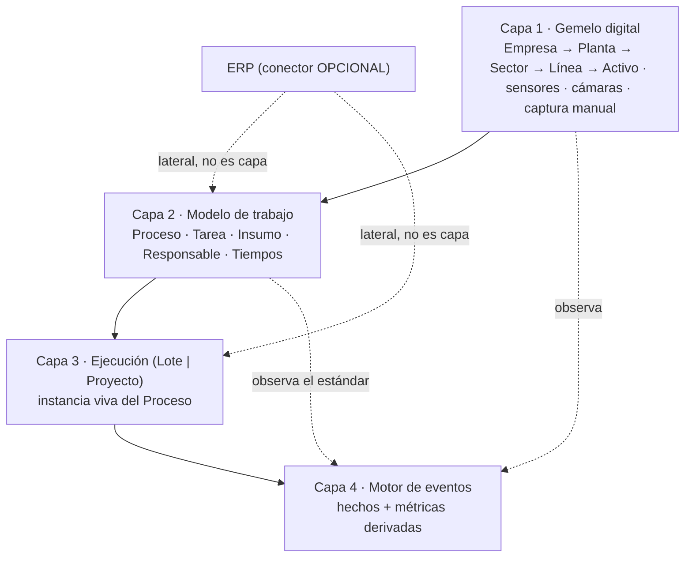
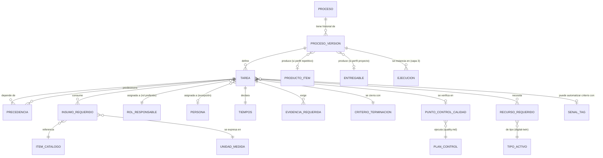
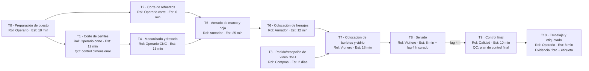
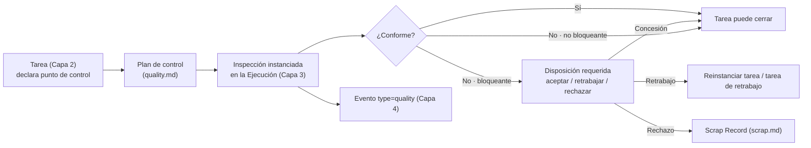
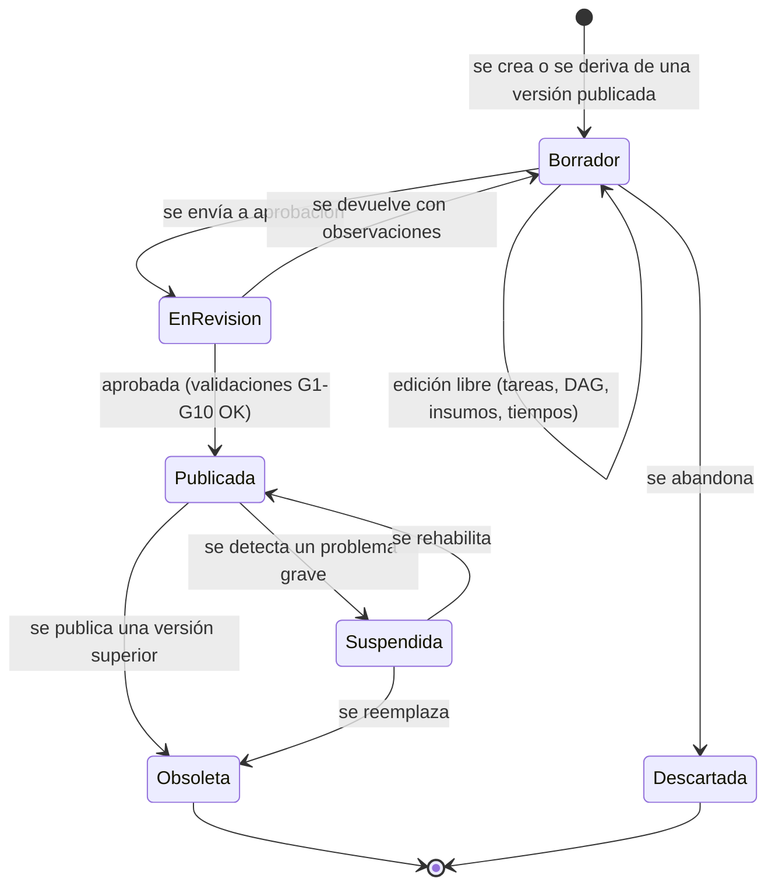
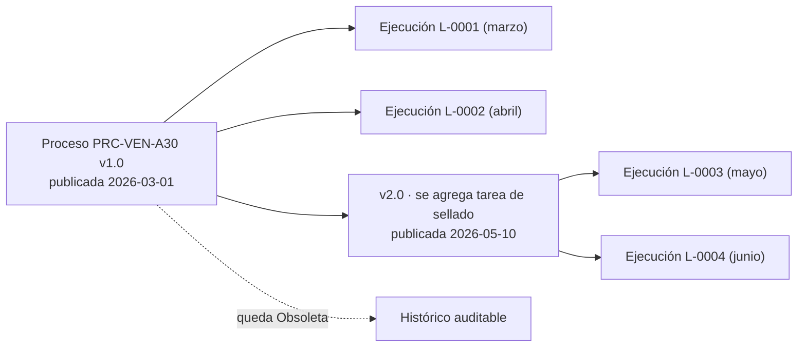
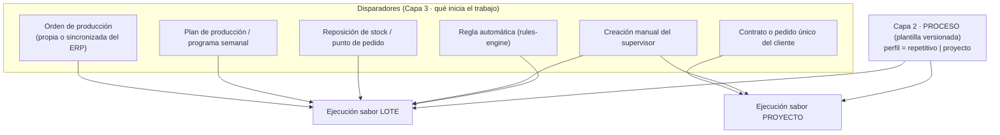

# Modelo de trabajo — Procesos (Capa 2)

> **Documento:** `specs/specs/work-model.md` · **Estado:** Borrador v0.1 · **Actualizado:** 2026-07-13
> **Roles:** Product Manager · Software Architect · UX Designer
> **Relacionados:** [layered-architecture.md](./layered-architecture.md) · [digital-twin.md](./digital-twin.md) · [execution.md](./execution.md) · [event-engine.md](./event-engine.md) · [master-data.md](./master-data.md) · [production.md](./production.md) · [quality.md](./quality.md) · [data-model.md](./data-model.md) · [users-permissions.md](./users-permissions.md) · [traceability.md](./traceability.md) · [dashboards.md](./dashboards.md) · [rules-engine.md](./rules-engine.md) · [integrations.md](./integrations.md) · [devices.md](./devices.md) · [glossary.md](./glossary.md)

## Resumen ejecutivo

La **Capa 2** del modelo de Nexo responde a una sola pregunta: **¿cómo se hace el trabajo?** No responde qué existe en la planta (eso es la Capa 1, el [gemelo digital](./digital-twin.md)), ni qué se está haciendo ahora (eso es la Capa 3, la [ejecución](./execution.md)), ni qué pasó realmente (eso es la Capa 4, el [motor de eventos](./event-engine.md)). La Capa 2 es **la plantilla**: la descripción reutilizable, versionada y auditable de un trabajo que la organización sabe hacer.

**La tesis central de este documento —y del pivot de producto completo— es que un proyecto único y una producción repetitiva se modelan exactamente igual.** Fabricar la ventana número 4.312 de una línea estandarizada y construir un frente vidriado a medida para una obra puntual son, desde el punto de vista del modelo, **el mismo objeto**: un conjunto de **Tareas** con **precedencias**, cada una con un **responsable**, **insumos**, **tiempos**, **evidencia requerida**, un **criterio de terminación** y, opcionalmente, un **punto de control de calidad**. Lo único que cambia entre ambos casos es **el disparador de la ejecución** (demanda/plan/stock vs. contrato/pedido único), **cuántas veces se ejecuta** (N vs. 1) y **el set de KPIs** con el que se mide el resultado (OEE y takt vs. avance y desvío de cronograma). El esqueleto —Proceso → Tareas → Insumos → Responsables → Tiempos— es idéntico.

Esta unificación tiene una consecuencia directa y deliberada sobre la documentación existente: **la Orden de producción deja de ser el concepto raíz de la plataforma**. Pasa a ser **una de las formas de disparar** la ejecución de un Proceso de perfil repetitivo. En consecuencia, [`production.md`](./production.md) se **reencuadra como el perfil repetitivo del modelo de trabajo**, no como un dominio autónomo con su propio universo conceptual. Nada de lo escrito allí se invalida: se reubica un nivel más abajo en la jerarquía conceptual. La sección [§10](#10-reencuadre-la-orden-de-producción-deja-de-ser-el-concepto-raíz) documenta ese reencuadre con todas las letras.

La Capa 2 es, además, **el lugar donde vive el estándar**. Los tiempos estándar, los consumos teóricos, los roles previstos y los criterios de calidad son la referencia contra la cual la Capa 4 mide la realidad. Sin Capa 2 no hay "desvío", no hay "eficiencia" y no hay "avance": solo hay eventos sueltos. Por eso el Proceso es **versionado**: una ejecución queda atada a la versión con la que arrancó, de modo que comparar plan contra realidad siga siendo honesto aunque el proceso haya cambiado después.

---

## 1. Ubicación en la arquitectura de capas

| Capa | Nombre | Responde a | Documento |
|---|---|---|---|
| 1 | Física — Gemelo digital | ¿Qué existe y qué está midiendo? | [`digital-twin.md`](./digital-twin.md) |
| **2** | **Modelo de trabajo — Procesos** | **¿Cómo se hace el trabajo?** (plantilla) | **este documento** |
| 3 | Ejecución — Lote o Proyecto | ¿Qué se está haciendo ahora? (instancia) | [`execution.md`](./execution.md) |
| 4 | Motor de eventos | ¿Qué pasó realmente? (hechos + métricas) | [`event-engine.md`](./event-engine.md) |

**Dependencias de esta capa (regla dura: cada capa depende solo de la de abajo).**

| La Capa 2 **usa** de la Capa 1 | La Capa 2 **entrega** a la Capa 3 | La Capa 2 **no** hace |
|---|---|---|
| Tipos de activo / centros de trabajo donde una tarea puede ejecutarse | La plantilla que se instancia en cada Ejecución | No conoce ejecuciones concretas ni cantidades reales |
| Capacidades y atributos del activo (para validar aptitud) | Los tiempos estándar y los pesos de avance | No guarda estado en vivo de máquinas |
| Señales/tags disponibles para automatizar un criterio de terminación | Los criterios de terminación y los puntos de control | No emite métricas (eso es Capa 4) |
| Formularios de captura asociados a un activo | La evidencia requerida por tarea | No decide *cuándo* se trabaja (eso es el disparador, Capa 3) |

> **Nota de terminología (canónica).** Un **Proceso** en Capa 2 es una **plantilla**, nunca algo "en curso". Cuando alguien dice "el proceso está atrasado" está hablando de una **Ejecución** (Capa 3). El glosario ([`glossary.md`](./glossary.md)) fija esta distinción; la UI debe respetarla (*"Procesos"* es una biblioteca; *"Ejecuciones"* es un tablero operativo).

---

## 2. La tesis: mismo modelo, distinto disparador

### 2.1 Enunciado

> **Un proyecto único y una producción repetitiva se modelan igual. Cambia el disparador, no el modelo.**

La industria históricamente separó estos dos mundos en herramientas distintas: un MES/ERP para lo repetitivo (órdenes, BOM, rutas, OEE) y un gestor de proyectos para lo único (Gantt, hitos, ruta crítica). Esa separación es **una decisión de producto heredada, no una necesidad del dominio**. En una PyME industrial argentina real, la misma carpintería de aluminio fabrica ventanas de catálogo por la mañana y ejecuta un frente vidriado a medida para una obra por la tarde, **con las mismas personas, las mismas máquinas y en muchos casos las mismas tareas**. Obligarla a usar dos sistemas —y a reconciliarlos— es el problema, no la solución.

### 2.2 Qué es idéntico y qué cambia

| Dimensión | Repetitivo | Proyecto | ¿Cambia el modelo? |
|---|---|---|---|
| Entidad plantilla | Proceso | Proceso | **No** |
| Unidad de trabajo | Tarea | Tarea | **No** |
| Precedencias | DAG | DAG | **No** |
| Insumos | Materiales, componentes, herramientas, servicios | Ídem | **No** |
| Responsable | Rol (preferido) o persona | Ídem | **No** |
| Tiempos | Estimado / estándar / real | Ídem | **No** |
| Evidencia y criterio de terminación | Por tarea | Por tarea | **No** |
| Punto de control de calidad | Por tarea, opcional | Por tarea, opcional | **No** |
| **Perfil del proceso** | `repetitivo` | `proyecto` | **Sí — es un atributo** |
| **Disparador de la ejecución** | Demanda / plan / stock / orden | Contrato / pedido único / hito comercial | **Sí — Capa 3** |
| **Sabor de la ejecución** | **Lote (Batch)** | **Proyecto (Project)** | **Sí — Capa 3** |
| **Cardinalidad de ejecución** | N ejecuciones por Proceso | Típicamente 1 | **Sí — operativa** |
| **Objetivo de la ejecución** | Cantidad de producto | Entregable único + fecha | **Sí — Capa 3** |
| **KPIs primarios** | OEE, takt, ciclo, scrap, FPY | % avance, desvío, ruta crítica, hitos | **Sí — Capa 4** |

**Corolario de diseño:** todo el esfuerzo de modelado se concentra en una sola familia de entidades. La diferencia entre "hacer ventanas" y "hacer una obra a medida" se resuelve con **un atributo (`perfil`)** y con **dos disparadores distintos** en Capa 3 — no con dos módulos, dos modelos de datos ni dos UIs.

### 2.3 Qué *no* dice la tesis

Para evitar sobre-interpretaciones en implementación:

- **No dice** que los KPIs sean los mismos. Aplicar **OEE a un proyecto es un error conceptual** (no hay ciclo ideal ni volumen comparable). Ver [§11](#11-kpis-que-habilita-la-capa-2) y [`event-engine.md`](./event-engine.md).
- **No dice** que la UI sea la misma. Un tablero de lotes muestra ritmo y cantidad; un tablero de proyecto muestra cronograma y ruta crítica. El **modelo** es común; la **presentación** se especializa ([`dashboards.md`](./dashboards.md), [`ui-ux.md`](./ui-ux.md)).
- **No dice** que un proceso de perfil proyecto no pueda reutilizarse. Puede existir un Proceso "Obra a medida — estándar de la casa" que se instancie muchas veces con parámetros distintos; sigue siendo perfil proyecto porque **cada ejecución produce un entregable único con fecha objetivo propia**.
- **No dice** que se elimine la Orden de producción. Ver [§10](#10-reencuadre-la-orden-de-producción-deja-de-ser-el-concepto-raíz).

---

## 3. Entidades canónicas de la Capa 2

### 3.1 Panorama

| Entidad | Significado en una frase | Propiedad | Vive en |
|---|---|---|---|
| **Proceso (Process Definition)** | Plantilla versionada de un trabajo que la organización sabe hacer. | **Propia de la capa** | DB del tenant |
| **Tarea (Task Definition)** | Unidad de trabajo dentro de un Proceso, con precedencias. | **Propia de la capa** | DB del tenant |
| **Insumo (Input)** | Material, componente, herramienta o servicio que una tarea consume. | **Propia** (referencia catálogo) | DB del tenant |
| **Responsable (Assignee Spec)** | Rol (preferido) o persona que debe ejecutar la tarea. | Referenciada | [`users-permissions.md`](./users-permissions.md) |
| **Tiempos (Timing)** | Estimado / estándar (el real lo aporta la Capa 4). | **Propia** | DB del tenant |
| **Evidencia requerida (Evidence Requirement)** | Qué prueba exige la tarea para darse por terminada. | **Propia** | DB del tenant (archivos en Files/Media) |
| **Criterio de terminación (Completion Criterion)** | Condición objetiva que define "hecho". | **Propia** | DB del tenant |
| **Punto de control de calidad (Quality Gate)** | Enganche opcional con un plan de control. | Referenciada | [`quality.md`](./quality.md) |
| **Recurso requerido (Resource Requirement)** | Tipo de activo/centro de trabajo apto para la tarea. | Referenciada | [`digital-twin.md`](./digital-twin.md) |
| **Versión de Proceso (Process Version)** | Foto inmutable y publicable de un Proceso. | **Propia** | DB del tenant |

### 3.2 Modelo de entidades (diagrama)

> **Lectura del diagrama.** El **Proceso** es la identidad estable ("Fabricación de ventana corrediza A30"); la **Versión de Proceso** es lo que realmente se ejecuta y lo que queda congelado en cada Ejecución. Las **Tareas** cuelgan de la versión, no del proceso: cambiar una tarea es, por definición, crear una nueva versión ([§9](#9-versionado-de-procesos)).

### 3.3 Proceso (Process Definition)

**Significado.** Plantilla versionada que describe cómo la organización realiza un trabajo determinado, de punta a punta. Es reutilizable, auditable y publicable. Es el objeto que un cliente "carga una vez y usa siempre".

| Atributo conceptual | Descripción | Obligatorio |
|---|---|---|
| Identidad / código | Identificador estable del Proceso a través de todas sus versiones. | Sí |
| Denominación | Nombre legible ("Fabricación ventana corrediza A30 1200×1000"). | Sí |
| **Perfil** | `repetitivo` \| `proyecto`. Determina disparadores admitidos y set de KPIs. | Sí |
| Versión vigente | Referencia a la versión publicada activa. | Sí |
| Estado de la versión | Borrador · En revisión · Publicado · Obsoleto ([§9](#9-versionado-de-procesos)). | Sí |
| Salida esperada | Producto/SKU (repetitivo) o Entregable (proyecto). | Sí |
| Unidad de medida de salida | Unidades, kg, m, m², "1 entregable". | Sí |
| Alcance físico sugerido | Planta / Sector / Línea donde se ejecuta normalmente (Capa 1). | No |
| Tareas | Conjunto de Tareas con su DAG de precedencias. | Sí (≥1) |
| Tiempo estándar total | Derivado: suma ponderada por la ruta crítica del DAG. | Derivado |
| Insumos consolidados | Derivado: unión de insumos de todas las tareas (vista tipo "lista de materiales"). | Derivado |
| Roles involucrados | Derivado: unión de roles responsables de las tareas. | Derivado |
| Criterios de calidad | Derivado: puntos de control declarados en las tareas. | Derivado |
| Etiquetas / familia | Clasificación libre para búsqueda en la biblioteca de procesos. | No |
| Referencia externa (ERP) | Correlación opcional con una ruta/BOM del ERP si hay conector. | No |
| Política de evidencia | Global del proceso: evidencia obligatoria / recomendada / opcional (default de sus tareas). | Sí |
| Política de omisión | Si se permite saltear tareas opcionales y con qué autorización. | Sí |

**Reglas del Proceso.**

1. Un Proceso **siempre** tiene al menos una tarea y un único perfil.
2. Un Proceso publicado **es inmutable**: modificarlo genera una nueva versión.
3. El perfil **no se cambia** en una versión menor; cambiar de `repetitivo` a `proyecto` (o viceversa) exige versión mayor y revalidación de KPIs asociados.
4. El Proceso **no conoce** ejecuciones: no tiene estado operativo, no tiene fechas reales, no tiene cantidades producidas.

### 3.4 Tarea (Task Definition)

**Significado.** Unidad atómica de trabajo dentro de un Proceso. Es lo que una persona (o un equipo, o una máquina supervisada por una persona) hace y declara como terminado. Es **el átomo del avance**: la Capa 4 calcula progreso contando tareas completadas ponderadas.

| Atributo conceptual | Descripción | Obligatorio |
|---|---|---|
| Identidad / código | Identificador de la tarea dentro de la versión del Proceso. | Sí |
| Denominación | "Corte de perfiles", "Colocación de herrajes", "Montaje en obra". | Sí |
| Descripción / instrucción | Texto operativo, opcionalmente con adjuntos (plano, instructivo, foto de referencia). | No |
| **Precedencias** | Lista de tareas predecesoras y tipo de dependencia ([§4](#4-el-grafo-de-tareas-dag)). | Sí (puede ser vacía para tareas iniciales) |
| **Duración estimada** | Estimación inicial (rango o valor puntual). | Sí |
| **Duración estándar** | Tiempo de referencia consolidado, base de la eficiencia y del peso de avance. | Sí (repetitivo) / Recomendado (proyecto) |
| **Rol responsable** | Rol preferido que la ejecuta ([§7](#7-responsables-rol-primero-persona-después)). | Sí |
| Persona sugerida | Excepción: persona concreta cuando el rol no alcanza. | No |
| **Insumos** | Ítems consumidos con cantidad y unidad ([§6](#6-insumos)). | No |
| Recurso requerido | Tipo de activo/centro de trabajo apto (Capa 1). | No |
| **Evidencia requerida** | Qué se debe adjuntar/registrar para cerrar ([§5.2](#52-evidencia-requerida)). | Sí (puede ser "ninguna") |
| **Criterio de terminación** | Condición objetiva de "hecho" ([§5.1](#51-criterio-de-terminación)). | Sí |
| **Punto de control de calidad** | Plan de control a ejecutar al cerrar la tarea ([§8](#8-puntos-de-control-de-calidad)). | No |
| Peso de avance | Peso explícito para el cálculo de progreso; por defecto proporcional al tiempo estándar. | No (derivado) |
| Obligatoriedad | Obligatoria / Opcional / Condicional (según parámetro de la ejecución). | Sí |
| Paralelizable | Si admite ejecución simultánea en varios recursos/personas. | Sí |
| Repetible dentro de la ejecución | Si puede instanciarse N veces (p. ej. una por pieza o por sub-entregable). | Sí |
| Riesgos / advertencias | Seguridad, EPP, precauciones. | No |
| Costo estándar | Costo de referencia (mano de obra + insumos) para el desvío de costo. | No |

**Reglas de la Tarea.**

1. Una Tarea pertenece a **una** versión de Proceso. No se comparte entre procesos (se copia; ver [§9.6](#96-reutilización-fragmentos-y-subprocesos)).
2. Una Tarea **no puede cerrarse** sin cumplir su criterio de terminación ni sin la evidencia obligatoria.
3. Una Tarea con punto de control de calidad **no se da por conforme** hasta que la inspección asociada resuelve ([`quality.md`](./quality.md)).
4. La Tarea es la unidad de **atribución de tiempo**: todo evento productivo de la Capa 4 se imputa a una tarea instanciada (o queda "sin imputar" y se marca como tiempo a clasificar).

### 3.5 Tiempos

Los tiempos son **tres**, y viven en capas distintas. Confundirlos es la fuente número uno de KPIs mentirosos.

| Tiempo | Definición | Quién lo define | Dónde vive | Uso |
|---|---|---|---|---|
| **Estimado** | Lo que se cree que va a tardar, al planificar. Puede ser un rango (optimista/probable/pesimista). | Quien diseña el Proceso o quien programa la Ejecución | Capa 2 (plantilla) y Capa 3 (ajuste por ejecución) | Planificación, promesa de fecha |
| **Estándar** | Tiempo de referencia de la organización para esa tarea, consolidado con historia. | Ingeniería / Producción | **Capa 2** | Eficiencia, peso de avance, costeo, takt |
| **Real** | Lo que efectivamente tardó, derivado de eventos. | Nadie: **se mide** | **Capa 4** ([`event-engine.md`](./event-engine.md)) | Desvío, cuellos de botella, tiempo muerto |

**Descomposición del tiempo estándar de una tarea (canónica).**

| Componente | Descripción | Aplica a |
|---|---|---|
| **Preparación / setup** | Alistamiento previo (cambio de formato, armado de puesto, traslado). | Ambos perfiles |
| **Ejecución** | Tiempo de trabajo efectivo. | Ambos |
| **Espera técnica** | Tiempo obligatorio sin trabajo humano (curado, secado, fragüe, enfriamiento). | Ambos |
| **Control** | Tiempo del punto de control de calidad, si lo hay. | Ambos |
| **Cierre / limpieza** | Orden del puesto, registro, entrega. | Ambos |

> **Regla canónica.** El **tiempo estándar total de un Proceso** no es la suma de los tiempos de sus tareas: es **la duración de la ruta crítica del DAG**, porque las tareas paralelas se solapan. La suma de tiempos sí se usa para **carga de trabajo** (horas-hombre) y costeo, que es un concepto distinto. La UI debe mostrar ambos y nombrarlos distinto ("Duración estimada" vs. "Carga de trabajo").

> **Relación con el ciclo ideal.** Para el perfil repetitivo, el **tiempo de ciclo ideal** de [`production.md`](./production.md) §7.2 es la duración estándar de la ruta crítica del Proceso por unidad producida. Es la **misma magnitud**, expresada ahora en el vocabulario de la Capa 2. Fuente de verdad y edición: ver [Preguntas abiertas](#preguntas-abiertas).

---

## 4. El grafo de tareas (DAG)

### 4.1 Por qué un DAG y no una lista

Una secuencia lineal (paso 1 → paso 2 → paso 3) alcanza para procesos triviales y **falla en cuanto hay paralelismo real**, que es la norma: mientras se cortan los perfiles, se puede pedir el vidrio; mientras cura el sellador, se puede armar el embalaje. Sin paralelismo no hay **ruta crítica**, y sin ruta crítica no hay forma honesta de responder "¿cuándo termina?" ni de identificar **cuellos de botella**.

Por eso la estructura canónica de un Proceso es un **grafo dirigido acíclico (DAG) completo**: nodos = Tareas, aristas = Precedencias. **Decisión cerrada (2026-07-13 — MOD-18):** el DAG completo entra en el MVP; no se arranca con secuencia lineal.

### 4.2 Tipos de precedencia

| Tipo | Semántica | Ejemplo | Prioridad |
|---|---|---|---|
| **Fin → Inicio (FS)** | B no arranca hasta que A termina. | Sellar después de armar. | **MVP** |
| **Inicio → Inicio (SS)** | B no arranca hasta que A arrancó. | Control en proceso arranca cuando arranca el mecanizado. | V1 |
| **Fin → Fin (FF)** | B no termina hasta que A termina. | Documentación no cierra hasta que cierra el montaje. | V1 |
| **Demora / lag** | Espera obligatoria entre A y B (positiva o negativa). | 24 h de curado antes de mover la pieza. | **MVP** (positiva) |
| **Condicional** | La arista solo aplica si se cumple un parámetro de la ejecución. | "Instalación en obra" solo si el pedido incluye montaje. | V1 |

> ✅ **Decisión cerrada (2026-07-13 — MOD-18): DAG COMPLETO.** El alcance del grafo **ya no está condicionado**. Las precedencias se modelan como un **grafo dirigido acíclico completo** desde el MVP: **ramas paralelas y convergencia**, **tipos de precedencia** y **demoras (lag)**, con **validación de ciclos** al publicar ([§4.3](#43-validaciones-del-grafo)). **Queda descartada la secuencia lineal** como alcance del MVP, y también la variante "DAG en el modelo, editor lineal en la UI": el editor del MVP permite modelar el grafo. Es lo que habilita **ruta crítica** y **cuellos de botella**, que son el valor central de la Capa 4. La columna "Prioridad" de la tabla anterior indica el orden de implementación de cada **tipo** de precedencia dentro del DAG, no una limitación de la estructura del grafo.

### 4.3 Validaciones del grafo

| # | Validación | Momento | Acción ante fallo |
|---|---|---|---|
| G1 | El grafo es **acíclico** (no hay dependencias circulares). | Al publicar la versión | Bloquear publicación; señalar el ciclo |
| G2 | Toda tarea es **alcanzable** desde al menos un nodo inicial. | Al publicar | Bloquear; señalar tareas huérfanas |
| G3 | Existe al menos **un nodo inicial** (sin predecesoras) y **uno terminal**. | Al publicar | Bloquear |
| G4 | Las precedencias referencian tareas **de la misma versión**. | Al editar | Rechazo |
| G5 | Las demoras (lag) son coherentes con la unidad de tiempo del proceso. | Al editar | Advertencia |
| G6 | El **peso de avance** total normaliza a 100 %. | Al publicar | Normalizar automáticamente y avisar |
| G7 | Toda tarea obligatoria tiene rol responsable y criterio de terminación. | Al publicar | Bloquear |
| G8 | Toda tarea con punto de control referencia un **plan de control vigente**. | Al publicar | Bloquear o degradar a advertencia según política |
| G9 | Los insumos referencian ítems **existentes** en el catálogo ([`master-data.md`](./master-data.md)). | Al publicar | Bloquear |
| G10 | El recurso requerido existe como **tipo de activo** en el gemelo digital. | Al publicar | Advertencia (puede definirse después) |

### 4.4 Ejemplo A — perfil **repetitivo**: fabricación de ventana corrediza

Proceso `PRC-VEN-A30` · Perfil **repetitivo** · Salida: *Ventana corrediza A30 1200×1000* · Unidad: **unidades**.

**Lectura del ejemplo.**
- El **disparador** típico es una **Orden de producción** (o un plan semanal, o un punto de reposición de stock). Ver [§10](#10-reencuadre-la-orden-de-producción-deja-de-ser-el-concepto-raíz).
- Este Proceso se ejecuta **N veces**: una ejecución por lote de X ventanas.
- La tarea T3 (vidrio) es de **abastecimiento** y su duración estimada domina el arranque: si no se dispara con anticipación, se vuelve el cuello de botella del DAG.
- KPIs naturales: **OEE**, takt, tiempo de ciclo por unidad, scrap rate, FPY.

### 4.5 Ejemplo B — perfil **proyecto**: frente vidriado a medida para una obra

Proceso `PRC-OBRA-FV` · Perfil **proyecto** · Salida: *Frente vidriado — Obra XX* · Unidad: **1 entregable**.

```mermaid
flowchart LR
    P0["P0 · Relevamiento en obra<br/>Rol: Técnico · Est: 1 día<br/>Evidencia: fotos + planilla de medidas"]
    P1["P1 · Ingeniería de detalle y planos<br/>Rol: Proyectista · Est: 5 días"]
    P2["P2 · Aprobación del cliente<br/>Rol: Comercial · Est: 3 días<br/>Evidencia: plano firmado · HITO"]
    P3["P3 · Compra de perfiles y vidrio especial<br/>Rol: Compras · Est: 20 días"]
    P4["P4 · Corte y mecanizado en taller<br/>Rol: Operario CNC · Est: 6 días"]
    P5["P5 · Premontaje en taller<br/>Rol: Armador · Est: 4 días<br/>QC: control de escuadra"]
    P6["P6 · Logística a obra<br/>Rol: Logística · Est: 1 día"]
    P7["P7 · Montaje de estructura en obra<br/>Rol: Montajista · Est: 8 días"]
    P8["P8 · Colocación de vidrios<br/>Rol: Vidriero · Est: 5 días"]
    P9["P9 · Sellado y terminaciones<br/>Rol: Montajista · Est: 3 días"]
    P10["P10 · Ensayo de estanqueidad<br/>Rol: Calidad · Est: 1 día<br/>QC: plan de control de obra · HITO"]
    P11["P11 · Entrega y acta de recepción<br/>Rol: Comercial · Est: 1 día<br/>Evidencia: acta firmada · HITO"]

    P0 --> P1 --> P2
    P2 --> P3
    P2 --> P4
    P3 --> P4
    P4 --> P5 --> P6 --> P7
    P7 --> P8 --> P9 --> P10 --> P11
```

**Lectura del ejemplo.**
- El **disparador** es un **contrato / pedido único** (o la aprobación de un presupuesto). No hay "cantidad objetivo": hay **entregable y fecha**.
- Se ejecuta **una vez**. Si mañana hay otra obra, se instancia otra Ejecución del mismo Proceso con parámetros distintos, o se crea un Proceso derivado.
- Aparece el concepto de **hito** (P2, P10, P11): tareas marcadas como punto de control contractual/comercial. El hito **no es una entidad nueva**: es un atributo de la tarea que la Capa 3 usa para el seguimiento y la Capa 4 para el KPI "hitos cumplidos".
- KPIs naturales: **% de avance**, desvío de cronograma, ruta crítica, hitos cumplidos.

### 4.6 La comparación que prueba la tesis

| Aspecto | Ejemplo A (ventana) | Ejemplo B (frente vidriado) | ¿Distinto modelo? |
|---|---|---|---|
| Entidad raíz | Proceso `PRC-VEN-A30` | Proceso `PRC-OBRA-FV` | **No** |
| Tareas con DAG | 11 tareas, 2 ramas paralelas | 12 tareas, 2 ramas paralelas | **No** |
| Insumos por tarea | Perfiles, vidrio, herrajes, sellador | Perfiles, vidrio especial, anclajes, sellador | **No** |
| Roles | Operario, Armador, Vidriero, Calidad | Técnico, Proyectista, Montajista, Calidad | **No** |
| Evidencia | Foto de embalaje | Planilla, plano firmado, acta | **No** |
| Puntos de control | Dimensional, final | Escuadra, estanqueidad | **No** |
| Unidad de tiempo | Minutos | Días | **No** (solo escala) |
| **Disparador** | Orden de producción / plan / stock | Contrato firmado | **Sí** |
| **Sabor de ejecución** | **Lote** | **Proyecto** | **Sí** |
| **Veces que se ejecuta** | N (cientos por año) | 1 | **Sí** |
| **KPI primario** | OEE / takt | % avance / desvío | **Sí** |

> Todo lo que difiere está **fuera de la Capa 2** (es disparador, cardinalidad o métrica). Todo lo que está **dentro** de la Capa 2 es idéntico. Esa es, literalmente, la tesis.

---

## 5. Criterio de terminación y evidencia

### 5.1 Criterio de terminación

**Definición.** Condición objetiva y verificable que determina que una tarea está **hecha**. Es la "definition of done" operativa, escrita por quien conoce el trabajo y ejecutable por quien lo hace.

| Tipo de criterio | Cómo se satisface | Fuente del dato | Ejemplo |
|---|---|---|---|
| **Declarativo** | El responsable marca "terminado". | Operario (Capa 1, formulario de captura) | "Puesto preparado" |
| **Por cantidad** | Se alcanza una cantidad objetivo. | Conteo manual o automático | "Cortados los 40 perfiles" |
| **Por medición** | Una variable cae dentro de un rango. | Sensor o instrumento (Capa 1) | "Temperatura de horno ≥ 180 °C durante 20 min" |
| **Por señal del activo** | Una señal/tag del gemelo digital cambia de estado. | Señal ligada a un Activo | "Ciclo de CNC finalizado" |
| **Por evidencia** | Se adjunta la evidencia requerida. | Files/Media | "Foto del sellado cargada" |
| **Por control de calidad** | La inspección asociada resuelve conforme. | [`quality.md`](./quality.md) | "Control dimensional aprobado" |
| **Por aprobación** | Un rol con autoridad aprueba. | Usuario con permiso | "Plano aprobado por el cliente" |
| **Compuesto** | Combinación lógica (Y/O) de los anteriores. | Varias | "Cantidad alcanzada **y** foto cargada" |

**Reglas.**
1. Toda tarea obligatoria tiene **exactamente un** criterio de terminación (que puede ser compuesto).
2. El criterio **automatizable** (medición, señal) reduce carga al operario y aumenta la calidad del dato: es el camino preferido cuando el activo está instrumentado ([`digital-twin.md`](./digital-twin.md)).
3. Un criterio que no se cumple **no bloquea el registro de trabajo**: bloquea el **cierre** de la tarea. El tiempo trabajado se sigue midiendo.
4. El cierre forzado (override) es posible con permiso y **siempre** genera un evento de excepción trazable ([`traceability.md`](./traceability.md)).

### 5.2 Evidencia requerida

**Definición.** Prueba que la tarea debe producir para ser auditable. La evidencia es **de primera clase** en Nexo (ver [`event-engine.md`](./event-engine.md)): no es un adjunto decorativo, es parte del contrato del evento.

| Tipo de evidencia | Ejemplos | Origen | Almacenamiento |
|---|---|---|---|
| **Fotografía** | Foto del ensamble, del defecto, del embalaje | Tablet / cámara IP | Files/Media (storage aislado por tenant) |
| **Archivo** | Plano firmado, remito, certificado de material, acta | Carga manual | Files/Media |
| **Lectura de sensor** | Curva de temperatura, peso, presión | Capa 1 | Serie temporal + referencia en el evento |
| **Firma** | Conformidad del cliente, autorización de concesión | Tablet | Files/Media + auditoría |
| **Video / frame de cámara** | Secuencia de montaje, frame de inspección | Cámara | Files/Media |
| **Formulario estructurado** | Planilla de medidas, checklist | Formulario de captura (Capa 1) | DB del tenant |

**Política de obligatoriedad (configurable en tres niveles).**

| Nivel | Alcance | Precedencia |
|---|---|---|
| Política del tenant | Default global (p. ej. "evidencia recomendada"). | Menor |
| Política del Proceso | Sobreescribe el default para todas sus tareas. | Media |
| Requisito de la Tarea | Sobreescribe todo para esa tarea. | **Mayor** |

| Valor | Efecto |
|---|---|
| **Obligatoria** | La tarea **no cierra** sin la evidencia. |
| **Recomendada** | La UI insiste; el cierre sin evidencia genera un evento de excepción. |
| **Opcional** | Se puede adjuntar; no condiciona el cierre. |
| **Ninguna** | No se solicita. |

> **Coherencia con Calidad.** [`quality.md`](./quality.md) §9 (V6) ya exige evidencia obligatoria para severidad crítica. Esa regla **se mantiene y prevalece**: un punto de control crítico impone evidencia obligatoria aunque la tarea la declare opcional.

---

## 6. Insumos

**Definición.** Todo lo que una tarea **consume** para producir su resultado: material, componente, herramienta (consumible o de uso), o servicio de terceros.

| Atributo conceptual | Descripción |
|---|---|
| Ítem | Referencia al catálogo de ítems ([`master-data.md`](./master-data.md)) o al Producto/SKU. |
| Cantidad estándar | Cantidad teórica por ejecución de la tarea (o por unidad producida). |
| Unidad de medida | De la unidad canónica del ítem (uds, kg, m, m², h). |
| Base de cálculo | **Fija por ejecución** o **proporcional a la cantidad** producida. |
| Tolerancia de consumo | Desvío aceptable antes de alertar (±%). |
| Sustitutos admitidos | Ítems alternativos válidos, con su factor de conversión. |
| Criticidad | Si su falta bloquea el arranque de la tarea. |
| Trazabilidad requerida | Si exige registrar el lote/serie consumido (genealogía). |
| Tipo | Material · Componente · Herramienta · Servicio · Mano de obra externa. |

**Reglas.**
1. El insumo se declara **en la tarea**, no en el proceso. La vista consolidada a nivel Proceso (la "lista de materiales") es **derivada**.
2. La Capa 2 declara el **consumo estándar**; el **consumo real** es Capa 3/4 ([`execution.md`](./execution.md) §10).
3. Si el insumo exige trazabilidad, la Ejecución debe registrar el lote consumido y la genealogía se resuelve en [`traceability.md`](./traceability.md).
4. En modo **standalone** (sin ERP), el catálogo de ítems es propio de Nexo. En modo **conectado**, se sincroniza y el ERP puede ser fuente de verdad. Ver [`master-data.md`](./master-data.md) y [§12](#12-modo-standalone-vs-conectado).

**Relación con el BOM del ERP.** Cuando hay conector, el BOM del ERP es una **fuente de sugerencia** para poblar los insumos de las tareas, pero **no los reemplaza**: el BOM dice *qué lleva el producto*; la Capa 2 dice *qué consume cada tarea y cuándo*. Esa granularidad temporal es lo que permite detectar faltantes antes de que frenen la línea.

---

## 7. Responsables: rol primero, persona después

**Regla canónica.** La Tarea declara un **rol responsable**, no una persona. La persona concreta se resuelve **en la Ejecución** (Capa 3), no en la plantilla.

| Motivo | Consecuencia |
|---|---|
| Las personas rotan, se van, se enferman. | Una plantilla atada a personas se rompe sola. |
| Los turnos cambian. | El mismo rol lo cubre distinta gente según el turno. |
| El permiso se modela por rol (RBAC + scoping). | Es coherente con [`users-permissions.md`](./users-permissions.md). |
| Los KPIs por recurso necesitan agregación por rol y por persona. | Ambas dimensiones quedan disponibles. |

| Modo de asignación | Cuándo usarlo | Se resuelve en |
|---|---|---|
| **Rol** (preferido) | Caso general. | Capa 3 (asignación) |
| **Rol + calificación** | La tarea exige certificación (soldador calificado, matriculado). | Capa 3, filtrando por calificación |
| **Persona nominada** | Excepción justificada (única persona habilitada). | Capa 2, con advertencia |
| **Equipo / cuadrilla** | Trabajo colectivo (montaje en obra). | Capa 3 (asignación múltiple) |
| **Recurso automático** | La tarea la "ejecuta" una máquina y una persona la supervisa. | Capa 1 + Capa 3 |

**Roles canónicos disponibles** (del modelo de acceso): Operario, Supervisor, Producción/Planner, Calidad, Mantenimiento, Gerencia, Administrador del tenant, Integraciones. Los tenants pueden crear roles propios (p. ej. *Proyectista*, *Montajista*, *Compras*, *Logística*), que es exactamente lo que exige el perfil proyecto. Detalle en [`users-permissions.md`](./users-permissions.md).

---

## 8. Puntos de control de calidad

Un **punto de control** es el enganche declarativo entre una Tarea (Capa 2) y un **Plan de control** de [`quality.md`](./quality.md). Es **opcional por tarea** y **obligatorio en su cumplimiento** cuando existe.

| Atributo | Descripción |
|---|---|
| Plan de control | Referencia al plan (características, tolerancias, muestreo) de [`quality.md`](./quality.md) §3. |
| Momento | **Antes** de iniciar (entrada), **durante** (en proceso), **al cerrar** (salida). |
| Bloqueante | Si un resultado no conforme impide cerrar la tarea y avanzar en el DAG. |
| Muestreo | 100 %, primera pieza (first-off), por frecuencia, por lote. Hereda del plan. |
| Disposición admitida | Qué disposiciones puede tomar quien controla (aceptar / retrabajar / rechazar / concesión). |
| Rol autorizado | Quién puede resolver la disposición (típicamente Calidad o Supervisor). |

**Reglas de coherencia con [`quality.md`](./quality.md).**

1. La definición de **pieza buena / no conforme** **no se redefine acá**: es la canónica de [`production.md`](./production.md) §6, compartida por Calidad y Scrap.
2. El **versionado del plan de control** y el **versionado del Proceso** son independientes; una tarea referencia un plan y la Ejecución congela **la versión vigente de ambos** al arrancar (coherente con [`quality.md`](./quality.md) CB9).
3. Un punto de control **bloqueante no conforme** detiene el avance del DAG por esa rama; las ramas paralelas siguen. La Capa 4 lo registra como **espera/tiempo muerto imputable a calidad**.
4. Para el perfil **proyecto**, los puntos de control suelen ser **ensayos y aprobaciones** (estanqueidad, escuadra, acta del cliente); el modelo es el mismo, cambia el plan de control.

---

## 9. Versionado de Procesos

### 9.1 Por qué es no negociable

Sin versionado, cualquier cambio en un Proceso **falsifica retroactivamente** todos los KPIs históricos: comparar el tiempo real de ayer contra el estándar de hoy no significa nada. Además, en industrias reguladas hay que poder demostrar **con qué instrucción exacta se fabricó** un lote determinado. Por eso:

> **Regla canónica.** Una **Ejecución queda atada, para siempre, a la versión de Proceso con la que arrancó.** Cambiar el Proceso **nunca** modifica ejecuciones en curso ni cerradas.

### 9.2 Ciclo de vida de una versión de Proceso

### 9.3 Estados

| Estado | Significado | ¿Se puede instanciar? | ¿Se puede editar? |
|---|---|---|---|
| **Borrador** | En construcción. | No | Sí, libremente |
| **En revisión** | Enviada a aprobación. | No | No (solo devolver) |
| **Publicada** | Vigente y ejecutable. | **Sí** | **No** (inmutable) |
| **Suspendida** | Vigente pero bloqueada por un problema. | No (las ejecuciones en curso continúan) | No |
| **Obsoleta** | Reemplazada por una versión superior. | No (salvo autorización explícita) | No |
| **Descartada** | Borrador abandonado. | No | No |

### 9.4 Semántica de versión

| Cambio | Tipo de versión | Efecto sobre ejecuciones en curso |
|---|---|---|
| Alta/baja de tarea; cambio de precedencias; cambio de perfil; cambio de punto de control bloqueante; cambio de insumo crítico | **Mayor** (v2.0) | **Ninguno.** Siguen con su versión. Se puede ofrecer migración manual asistida. |
| Cambio de tiempo estándar; cambio de cantidad de insumo dentro de tolerancia; cambio de rol responsable | **Menor** (v1.3) | Ninguno por defecto; propagación **opt-in** por decisión del supervisor. |
| Corrección de texto, instrucción, adjunto informativo, etiqueta | **Editorial** (v1.3.1) | Se propaga automáticamente (no altera el cálculo). |

### 9.5 Trazabilidad del versionado

Cada versión registra: autor, fecha, motivo del cambio, aprobador, diferencias respecto de la anterior (alta/baja/modificación de tareas, precedencias, tiempos e insumos) y la lista de ejecuciones que la usaron. Todo esto es materia de [`traceability.md`](./traceability.md) y del servicio de auditoría.

### 9.6 Reutilización: fragmentos y subprocesos

Para evitar que el versionado se convierta en copia-y-pega infinito:

| Mecanismo | Descripción | Prioridad |
|---|---|---|
| **Duplicar Proceso** | Copia completa como nuevo borrador; punto de partida para variantes. | **MVP** |
| **Biblioteca de tareas tipo** | Tareas reutilizables que se insertan (se **copian**, no se enlazan). | V1 |
| **Subproceso** | Un Proceso referenciado como una tarea dentro de otro, con su propia versión. | V1/V2 |
| **Parametrización** | Un Proceso con parámetros (medida, color, con/sin montaje) que activan tareas condicionales. | V1 |

> **Decisión de diseño.** En MVP se prefiere **copia** sobre **referencia**: una versión publicada debe ser autocontenida y auditable sin resolver dependencias externas. Los subprocesos referenciados se difieren hasta tener versionado transitivo bien definido.

---

## 10. Reencuadre: la Orden de producción deja de ser el concepto raíz

> Esta sección implementa explícitamente la **§3.2 del brief de arquitectura por capas**. Es un cambio de **posicionamiento conceptual**, no una demolición: nada de lo especificado en [`production.md`](./production.md) se descarta.

### 10.1 Qué era antes

En la especificación original, la **Orden de producción (Work Order / MO)** era el concepto raíz del sistema: casi todo el dato operativo "colgaba" de una orden (registros de producción, inspecciones, paradas, scrap, lotes). Ese modelo es correcto **dentro del mundo repetitivo**, pero tiene tres límites:

1. **No admite trabajo no repetitivo.** Un proyecto único no tiene "cantidad planificada de un SKU", y forzarlo produce órdenes ficticias de cantidad 1 que ensucian todos los KPIs.
2. **Ata el sistema al ERP.** Si la orden es la raíz y la orden nace en el ERP, el sistema **no puede funcionar sin ERP** — lo contrario de lo que el producto necesita ser.
3. **Confunde el "qué hacer" con el "cómo hacerlo".** La orden dice *fabricá 200 ventanas*; no dice *cómo se fabrica una ventana*. Ese conocimiento —el activo más valioso del cliente— no tenía dónde vivir.

### 10.2 Qué es ahora

> **La Orden de producción pasa a ser *una forma de disparar* la ejecución de un Proceso de perfil repetitivo.**

**La orden aporta el contexto comercial y de planificación; el Proceso aporta el conocimiento del trabajo; la Ejecución los une.**

### 10.3 Tabla de reencuadre

| Concepto anterior (raíz) | Concepto en el modelo por capas | Capa | Qué cambia en la práctica |
|---|---|---|---|
| **Orden de producción** era la raíz | **Disparador** de una Ejecución sabor Lote | 3 | Sigue existiendo, con los mismos atributos y el mismo sync con Odoo. Deja de ser obligatoria: puede haber Ejecución sin orden. |
| **Operación / Ruta** de la orden | **Tarea** dentro del **Proceso** | **2** | La ruta se generaliza: pasa de secuencia a **DAG**, con insumos, evidencia y criterio de terminación por paso. |
| **Corrida de producción (`production_run`)** | **Ejecución (Run)**, sabor Lote | 3 | Se generaliza para admitir también el sabor Proyecto. Ver [`execution.md`](./execution.md) §2.1. |
| **Registro de producción** | Evento productivo imputado a una **tarea instanciada** | 3→4 | Gana contexto de tarea; los KPIs de producción no cambian. |
| **Producto / SKU** de la orden | **Salida esperada** del Proceso repetitivo | 2 | Igual, ahora declarado en la plantilla. |
| **BOM del ERP** | **Insumos por tarea** (el BOM lo sugiere) | 2 | Gana granularidad temporal: se sabe *cuándo* se consume cada cosa. |
| **Tiempo de ciclo ideal** del producto | **Duración estándar** de la ruta crítica del Proceso | 2 | Misma magnitud, mejor origen (se puede recalcular con historia real). |
| **Estados de la orden** | Estados de la **Ejecución** (+ estados propios de la orden como documento) | 3 | El ciclo de vida operativo se mueve a la Ejecución. |
| **OEE** | KPI del **perfil repetitivo** | 4 | Se declara explícitamente que **no aplica** al perfil proyecto. |

### 10.4 `production.md` se reencuadra como el perfil repetitivo

**Lectura canónica a partir de este documento:**

> [`production.md`](./production.md) **no es un dominio separado**: es **la especialización del modelo de trabajo para el perfil repetitivo**, incluyendo su disparador más frecuente (la Orden de producción sincronizada con el ERP), su método de captura dual (manual/automática), su ciclo de estados y su contribución al OEE.

| Contenido de `production.md` | Estado tras el reencuadre |
|---|---|
| §2 Entidades involucradas | **Vigente**, releído como entidades del perfil repetitivo. |
| §3 Relación con la MO de Odoo | **Vigente**, ahora explícitamente **opcional** (el sistema funciona sin ERP). |
| §4 Métodos de captura (manual / automática) | **Vigente y generalizado**: aplica a **toda** tarea de cualquier perfil, no solo a producción. Pasa a ser un patrón de Capa 1 + Capa 4. |
| §5 Estados de la orden | **Vigente** como estados del **disparador**; el ciclo operativo vive ahora en la Ejecución ([`execution.md`](./execution.md) §6). |
| §6 Pieza buena / no conforme | **Vigente y canónica sin cambios.** Sigue siendo la definición compartida con Calidad y Scrap. |
| §7 Cantidades, tiempos, turnos, máquinas, operarios | **Vigente**; tiempos y ciclo ideal se releen contra los tiempos estándar de Capa 2. |
| §8 Validaciones | **Vigente**; se agregan las validaciones de Capa 2 ([§13](#13-validaciones)) y de Capa 3. |
| §10 KPIs y OEE | **Vigente y acotado**: OEE es un KPI **del perfil repetitivo**. |
| §11 Eventos | **Vigente**; se integra al contrato de evento canónico de [`event-engine.md`](./event-engine.md). |
| §12 Casos borde | **Vigente**; varios se generalizan a cualquier ejecución. |

### 10.5 Qué **no** cambia (compromiso de compatibilidad)

Para que el pivot no se lea como una re-escritura destructiva:

1. **Las fórmulas de OEE, MTBF, MTTR, FPY, scrap rate no cambian.** Siguen las del glosario.
2. **El contrato del Evento canónico no se rompe**: se **extiende** con referencias a Proceso, Ejecución y Tarea ([`event-engine.md`](./event-engine.md)).
3. **La integración con Odoo no se elimina**: se **degrada a opcional** y se reencuadra como acelerador ([`integrations.md`](./integrations.md), decisión INT-01 marcada para revisión).
4. **La definición de pieza buena/no conforme sigue siendo canónica y única** ([`production.md`](./production.md) §6).
5. **El aislamiento por tenant (DB-per-tenant) no se toca.** Proceso, Tarea, Insumo y Ejecución son **dato operativo del tenant** y viven en su DB ([`multi-tenancy.md`](./multi-tenancy.md)).

---

## 11. KPIs que habilita la Capa 2

La Capa 2 **no calcula KPIs** (eso es Capa 4), pero es la que **hace posible** que existan, porque aporta el denominador: el estándar.

| KPI | Qué aporta la Capa 2 | Perfil |
|---|---|---|
| **% de avance** | Pesos de avance por tarea (por tiempo estándar o peso explícito). | Ambos (primario en proyecto) |
| **Desvío de tiempo** | Tiempo estándar/estimado por tarea. | Ambos |
| **Ruta crítica y desvío de cronograma** | DAG + duraciones. | Proyecto |
| **Cuello de botella** | Recurso requerido por tarea + tiempos estándar (esperado vs. real). | Ambos |
| **Tiempo muerto** | Ventana esperada de trabajo derivada del DAG y del calendario. | Ambos |
| **OEE (Disp × Rend × Calidad)** | Tiempo de ciclo ideal = duración estándar de la ruta crítica por unidad. | **Repetitivo** |
| **Takt / tiempo de ciclo** | Duración estándar por unidad. | **Repetitivo** |
| **FPY / scrap rate** | Puntos de control declarados en las tareas. | **Repetitivo** (aplicable a proyecto con matices) |
| **Hitos cumplidos** | Tareas marcadas como hito. | **Proyecto** |
| **Costo real vs. estándar** | Insumos y costo estándar por tarea. | Ambos |
| **Productividad por recurso** | Rol responsable + tiempo estándar. | Ambos |

> **Advertencia canónica.** **No se calcula OEE para ejecuciones de perfil proyecto.** La UI debe ocultar (no mostrar en cero) los KPIs que no aplican al perfil. Detalle en [`event-engine.md`](./event-engine.md) y [`dashboards.md`](./dashboards.md).

---

## 12. Modo standalone vs. conectado

El pivot declara que **el sistema es autónomo** y que el ERP es un conector opcional. Eso impacta directamente en la Capa 2, porque un Proceso necesita catálogos para existir.

| Elemento que necesita la Capa 2 | Modo **standalone** | Modo **conectado** (ERP) |
|---|---|---|
| Ítems / insumos | Catálogo propio de Nexo (alta manual / importación CSV). | Sincronizado; el ERP puede ser fuente de verdad. |
| Unidades de medida | Catálogo propio. | Sincronizado. |
| Productos / SKU | Catálogo propio. | Sincronizado. |
| Roles y personas | Propios ([`users-permissions.md`](./users-permissions.md)). | Propios (opcionalmente enriquecidos desde RR. HH.). |
| Procesos | **Siempre propios de Nexo.** | **Siempre propios de Nexo** (el BOM/ruta del ERP solo sugiere). |
| Clientes y pedidos | Opcional, propio (necesario para el perfil proyecto). | Sincronizado. |
| Centros de costo | Opcional, propio. | Sincronizado. |

> **Costo oculto declarado.** Sostener catálogos propios (master data) es **el mayor costo del pivot** y agranda el alcance del MVP. Se documenta con todas las letras en [`master-data.md`](./master-data.md). El **Proceso**, en cambio, **nunca** se delega al ERP: es el activo diferencial de Nexo.

---

## 13. Validaciones

| # | Validación | Tipo | Momento | Acción ante fallo |
|---|---|---|---|---|
| W1 | El Proceso tiene perfil declarado y al menos una tarea. | Estructural | Publicación | Bloquear |
| W2 | El DAG es acíclico y conexo (G1–G3). | Estructural | Publicación | Bloquear |
| W3 | Toda tarea obligatoria tiene rol responsable y criterio de terminación. | Completitud | Publicación | Bloquear |
| W4 | Toda tarea con evidencia obligatoria declara **qué** evidencia. | Completitud | Publicación | Bloquear |
| W5 | Los insumos referencian ítems y unidades existentes. | Referencial | Publicación | Bloquear |
| W6 | El punto de control referencia un plan de control vigente. | Referencial | Publicación | Bloquear / advertencia según política |
| W7 | Las duraciones estándar son positivas y coherentes con la unidad de tiempo. | Sintáctica | Edición | Rechazo |
| W8 | Los pesos de avance normalizan a 100 %. | Consistencia | Publicación | Normalizar y avisar |
| W9 | El recurso requerido existe como tipo de activo en el gemelo digital. | Referencial | Publicación | Advertencia |
| W10 | Una versión **Publicada** no admite edición. | Inmutabilidad | Siempre | Rechazo; ofrecer derivar nueva versión |
| W11 | Cambio de perfil solo por versión mayor y con permiso. | Autorización | Edición | Rechazo |
| W12 | El autor tiene permiso de diseño de procesos con alcance sobre la planta/línea. | Autorización | Siempre | Rechazo (403 de negocio) |
| W13 | El código del Proceso es único dentro del tenant. | Unicidad | Alta | Rechazo |
| W14 | Una tarea con criterio automatizado referencia una señal existente y ligada a un activo. | Referencial | Publicación | Advertencia; degradar a criterio declarativo |
| W15 | Un Proceso de perfil proyecto no declara "cantidad objetivo" como salida. | Semántica | Publicación | Rechazo (usar entregable) |

---

## 14. Personas y permisos

| Persona | Interacción con la Capa 2 |
|---|---|
| **Producción (planner) / Ingeniería** | **Diseña y versiona Procesos**: tareas, DAG, tiempos estándar, insumos. Es el usuario principal de esta capa. |
| **Supervisor** | Revisa y aprueba versiones; propone ajustes de tiempo estándar con base en la realidad medida. |
| **Calidad** | Define planes de control y los engancha como puntos de control en las tareas. |
| **Operario** | **No edita** procesos: los **consume** en la Ejecución (ve la instrucción, la evidencia requerida y el criterio de terminación). |
| **Mantenimiento** | Aporta procesos propios (mantenimiento preventivo/correctivo modelado como Proceso). |
| **Comercial / Proyectos** | Consume procesos de perfil proyecto para prometer plazos; dispara ejecuciones desde contratos. |
| **Gerencia** | Ve el catálogo de procesos como activo de la organización; compara estándar vs. real. |
| **Administrador del tenant** | Define políticas globales (evidencia, omisión, aprobación de versiones) y roles propios. |
| **Integraciones** | Configura la sugerencia de insumos desde BOM/ruta del ERP, si hay conector. |

Matriz completa de permisos en [`users-permissions.md`](./users-permissions.md). Permisos específicos de la capa: `proceso.ver`, `proceso.crear`, `proceso.editar_borrador`, `proceso.publicar`, `proceso.suspender`, `proceso.cambiar_perfil`, `proceso.definir_tiempo_estandar`.

---

## 15. Casos borde

| # | Caso | Tratamiento propuesto |
|---|---|---|
| CB1 | **Proceso con una sola tarea** | Válido (es el caso degenerado: equivale a la orden simple de hoy). No se bloquea. |
| CB2 | **Tarea sin insumos ni recurso** | Válida (p. ej. una aprobación). Solo exige rol, criterio de terminación y tiempo. |
| CB3 | **Se descubre a mitad de una obra que falta una tarea** | No se edita la versión publicada: se agrega una **tarea ad-hoc a la Ejecución** (Capa 3), marcada como desvío, y se propone versión mayor para el futuro. |
| CB4 | **El proceso cambia mientras hay 30 ejecuciones abiertas** | Las 30 siguen con su versión. Migración opcional, tarea por tarea, con autorización. |
| CB5 | **Proceso repetitivo con una ejecución "especial"** | Se instancia normalmente y se registran desvíos; si el patrón se repite, se crea un Proceso derivado. |
| CB6 | **Proceso de perfil proyecto que se vuelve repetitivo** | Cambio de perfil = versión mayor + revisión de KPIs. Se recomienda crear un Proceso nuevo y marcar el anterior como obsoleto. |
| CB7 | **Dependencia circular al editar** | Bloqueada por G1 con señalización del ciclo en la UI del editor de DAG. |
| CB8 | **Insumo dado de baja en el catálogo** | Las versiones publicadas conservan la referencia histórica; el editor advierte y exige sustituto para nuevas versiones. |
| CB9 | **Tiempo estándar inexistente al arrancar (proceso nuevo)** | Se usa el estimado; la Capa 4 propone un estándar cuando hay masa crítica de ejecuciones. |
| CB10 | **Tarea que se repite N veces dentro de la misma ejecución** | Atributo "repetible": la Capa 3 instancia N ocurrencias con avance proporcional. |
| CB11 | **Proceso que cruza plantas** | Permitido: el alcance físico es sugerido, no obligatorio. Cada tarea puede resolver su recurso en una planta distinta. |
| CB12 | **Punto de control cuyo plan fue despublicado** | La ejecución en curso conserva la versión congelada; nuevas publicaciones fallan W6. |
| CB13 | **Proceso importado desde una ruta del ERP** | Se crea como **borrador sugerido**; requiere revisión humana y publicación explícita. Nunca se publica automáticamente. |
| CB14 | **Tarea de espera pura (curado, fragüe)** | Se modela como demora (lag) en la precedencia o como tarea con componente "espera técnica"; **no** cuenta como tiempo muerto en la Capa 4. |
| CB15 | **Dos versiones publicadas simultáneamente** | No permitido: una sola versión vigente por Proceso. Convivencia solo vía Procesos distintos. |

---

## 16. Requisitos no funcionales de la capa

- **Multi-tenant DB-per-tenant.** Procesos, Tareas e Insumos son dato operativo del tenant y viven en su DB ([`multi-tenancy.md`](./multi-tenancy.md)).
- **Inmutabilidad de lo publicado.** Una versión publicada no se edita ni se borra; solo se suspende u obsoleta. Correcciones por nueva versión.
- **Auditoría completa.** Quién creó, editó, aprobó y publicó cada versión, con motivo y diferencias ([`traceability.md`](./traceability.md)).
- **Usabilidad del editor.** El diseño del DAG debe ser posible para un supervisor de planta, no solo para un ingeniero industrial: edición visual, plantillas, duplicación, validación en vivo ([`ui-ux.md`](./ui-ux.md)).
- **Rendimiento.** El cálculo de ruta crítica y pesos de avance debe ser instantáneo para procesos de hasta ~200 tareas (tamaño esperado del percentil alto).
- **Disponibilidad offline.** La definición del Proceso debe poder descargarse en la tablet para operar sin red (la Ejecución se sincroniza después).
- **Independencia del ERP.** Ningún Proceso requiere conexión al ERP para diseñarse, publicarse ni ejecutarse.

---

## Preguntas abiertas

1. ✅ **RESUELTA (2026-07-13 — MOD-18). Alcance del DAG en el MVP: DAG COMPLETO.** Grafo dirigido acíclico completo —ramas paralelas, tipos de precedencia y lags— con validación de ciclos, desde el MVP. **No** se limita a secuencia lineal ni se difiere el paralelismo. Ver [§4.2](#42-tipos-de-precedencia).
2. ✅ **RESUELTA (2026-07-13 — PRD-16). Perfiles soportados en el MVP: AMBOS.** El MVP soporta el perfil **repetitivo** (ejecución como **Lote**) y el perfil **proyecto** (ejecución como **Proyecto**). La elección del piloto ya no condiciona el alcance. Ver [`execution.md`](./execution.md).
3. **Obligatoriedad de la evidencia.** ¿La evidencia por tarea es configurable en los tres niveles propuestos (tenant / proceso / tarea) o se simplifica a "siempre opcional" en V1?
4. **Fuente de verdad del tiempo estándar.** ¿Lo define ingeniería a mano, se importa del ERP, o lo **propone la Capa 4** a partir de la historia real (y quién lo aprueba)?
5. **Versionado y ejecuciones en curso.** Confirmado que la ejecución queda atada a su versión; falta definir si existe **migración asistida** de ejecuciones abiertas a una versión superior y con qué autorización.
6. **Subprocesos y reutilización.** ¿Se implementa "copia" (recomendado en MVP) o "referencia" (subproceso versionado) para reutilizar fragmentos? La referencia exige versionado transitivo.
7. **Parametrización del Proceso.** ¿Se admiten parámetros (medida, color, con/sin montaje) que activen tareas condicionales, o cada variante es un Proceso distinto? Impacta el tamaño de la biblioteca de procesos.
8. **Hito como atributo vs. entidad.** Se propone modelar el hito como **atributo de la tarea**. ¿Alcanza para el seguimiento de proyectos, o se requiere una entidad Hito con fecha comprometida propia y valor contractual?
9. **Relación Proceso ↔ Producto.** ¿Un Producto puede tener varios Procesos vigentes (rutas alternativas por planta o por capacidad) y cómo se elige cuál se instancia?
10. ✅ **RESUELTA (2026-07-13 — MOD-17). Costo estándar: fuera del MVP.** El costeo por tarea se **difiere a V1** junto con centros de costo, tarifas de persona y costo de insumos ([`master-data.md`](./master-data.md) §7.3). El estándar del MVP es de **tiempo**, no de dinero: el Proceso aporta tiempo estándar y pesos de avance. Queda abierto solo el diseño del costeo por tarea al abrir V1.
11. **Mantenimiento como Proceso.** ¿Los planes de mantenimiento preventivo se modelan como Procesos de perfil repetitivo disparados por calendario/horas de máquina, o quedan fuera del alcance de esta capa?
12. **Tamaño máximo del Proceso.** ¿Se fija un límite duro de tareas por proceso (rendimiento del editor y del cálculo de ruta crítica) o se deja abierto con degradación gradual?
