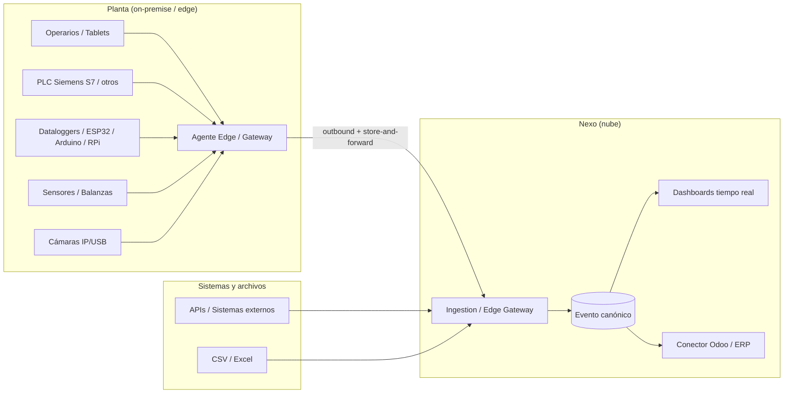
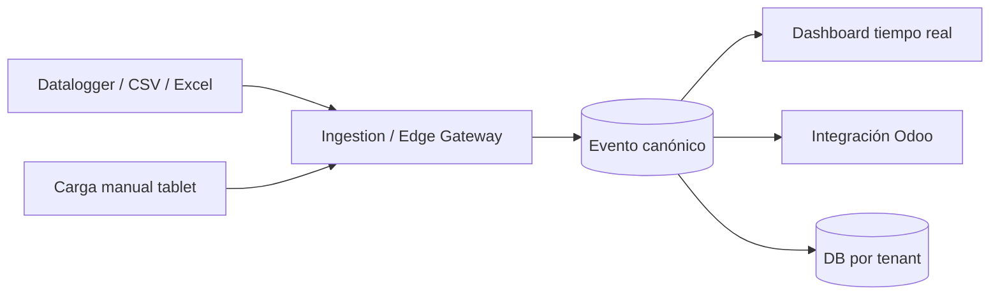

# Nexo — La idea

> **Documento:** `specs/idea.md` · **Estado:** Borrador v0.1 · **Actualizado:** 2026-07-11
> **Roles:** Product Manager · Software Architect · UX Designer
> **Relacionados:** [product.md](./specs/product.md) · [architecture.md](./specs/architecture.md) · [modules.md](./specs/modules.md) · [roadmap.md](./roadmap/roadmap.md) · [vision.md](./roadmap/vision.md)

## Resumen ejecutivo

**Nexo** es una plataforma industrial SaaS que actúa como **la capa única de captura de datos entre la planta y el ERP**. Su tagline lo resume: *"La capa única de captura de datos industriales entre tu planta y tu ERP."* Hoy, la mayoría de las pymes y medianas industrias manufactureras siguen registrando su producción, scrap, controles de calidad y paradas a mano —en papel, planillas de Excel o cargas dobles dentro del ERP— lo que genera datos tardíos, incompletos, poco confiables y desconectados de la realidad del piso de planta. Ese vacío entre el mundo físico (operarios, máquinas, PLCs, sensores) y el mundo de gestión (ERP) es el problema que Nexo resuelve.

La propuesta central es **eliminar la carga manual de información de producción** convirtiendo datos heterogéneos de planta en **eventos normalizados**, trazables y sincronizables. Nexo captura desde múltiples fuentes (operarios en tablets, PLCs Siemens S7 y de otros fabricantes, OPC UA, Modbus, MQTT, dataloggers, ESP32/Arduino/Raspberry Pi, sensores, balanzas, cámaras, APIs y archivos CSV/Excel), los normaliza a un **Evento canónico** y los pone a disposición de dashboards en tiempo real y del ERP de la empresa. El primer ERP soportado es **Odoo**, pero el núcleo es **agnóstico de ERP**: nunca depende de un sistema de gestión particular.

Este documento describe el problema, la visión, la propuesta de valor, qué **ES** y qué **NO ES** Nexo, su agnosticismo de ERP, las fuentes de datos soportadas, las industrias objetivo, por qué el momento es ahora y un resumen del MVP. Es el punto de entrada conceptual del cuerpo de especificaciones y enlaza al detalle de producto, arquitectura y roadmap.

---

## 1. El problema: la carga manual de datos de planta

En el piso de planta de la industria manufacturera conviven máquinas modernas con procesos de registro de datos que no cambiaron en décadas. El dato de lo que realmente ocurre —cuánto se produjo, cuánto se descartó, por qué se detuvo una máquina, si la pieza pasó el control de calidad— **nace en el mundo físico y muere en una planilla**.

### 1.1 Manifestaciones del problema

| Síntoma | Descripción | Consecuencia de negocio |
|---|---|---|
| **Registro en papel / Excel** | Operarios anotan producción, scrap y paradas en planillas físicas o de escritorio. | Datos tardíos (se cargan al final del turno o al día siguiente), con errores de transcripción. |
| **Doble carga en el ERP** | Alguien retipea a mano lo que ya se registró en papel dentro del ERP. | Duplicación de esfuerzo, latencia de horas o días, inconsistencias entre planta y gestión. |
| **Datos de máquina inaccesibles** | Los PLCs y dataloggers ya tienen el dato (contadores, estados, temperaturas) pero está encerrado on-premise. | Se pierde la fuente más confiable; se recaptura manualmente lo que la máquina ya sabe. |
| **Sin tiempo real** | La gerencia se entera de un problema de producción horas o días después. | Decisiones reactivas; imposibilidad de corregir en el turno. |
| **KPIs poco confiables** | El **OEE**, el scrap rate o el **FPY** se calculan a mano, con supuestos y datos incompletos. | Indicadores que nadie termina de creer; mejora continua sin base objetiva. |
| **Trazabilidad frágil** | La genealogía de lote/serie depende de papeles archivados. | Recalls costosos, auditorías lentas, riesgo regulatorio. |
| **Islas de datos** | Cada sistema (SCADA, balanza, cámara, ERP) habla su propio idioma. | No hay una única fuente de verdad del dato de planta. |

### 1.2 Por qué el ERP no alcanza

El ERP es excelente gestionando órdenes, inventario, costos y finanzas, pero **no está diseñado para capturar el dato en el momento y el lugar donde ocurre**: no habla protocolos industriales (OPC UA, Modbus, MQTT), no tolera bien la conectividad intermitente del piso de planta, no ofrece una UX pensada para un operario con guantes frente a una tablet, y su modelo de datos no absorbe naturalmente la alta frecuencia de lecturas de sensores. El resultado es que **la captura queda en manos de personas**, con todo el costo, la latencia y el error que eso implica.

Nexo no compite con el ERP: **cubre exactamente la brecha que el ERP deja abierta** entre la planta y la gestión.

---

## 2. Visión

> Que **ningún dato de producción vuelva a cargarse a mano**: que todo lo que ocurre en la planta se capture en su origen, se normalice a un evento confiable y trazable, y fluya en tiempo real hacia quien lo necesite —el operario, el supervisor, la gerencia y el ERP— sin retipeos, sin planillas y sin islas de datos.

Nexo aspira a convertirse en **el estándar de facto de la capa de captura de datos industriales** para la industria manufacturera de habla hispana y, progresivamente, global: una plataforma que cualquier planta pueda adoptar en días, que sea agnóstica del ERP y de los fabricantes de hardware, y que escale desde un taller con una línea hasta miles de empresas con miles de plantas y millones de eventos diarios. La visión de largo plazo se detalla en [vision.md](./roadmap/vision.md).

---

## 3. Propuesta de valor

**Nexo transforma datos heterogéneos y dispersos de planta en eventos normalizados, trazables y sincronizables, eliminando la carga manual.**

| Eje de valor | Qué entrega Nexo |
|---|---|
| **Eliminar la carga manual** | La captura se automatiza desde máquinas y se simplifica al máximo desde tablets; se termina la doble carga en el ERP. |
| **Dato confiable y en tiempo real** | Un dashboard vivo del estado de la planta, con KPIs (OEE, scrap rate, FPY, MTBF/MTTR) calculados con fórmulas consistentes. |
| **Una única fuente de verdad** | Todo se normaliza al **Evento canónico**: mismo idioma para PLCs, operarios, APIs y archivos. |
| **Trazabilidad de punta a punta** | Historial inmutable y genealogía de lote/serie para auditorías, calidad y recalls. |
| **Agnóstico y desacoplado** | No ata a la empresa a un ERP ni a un fabricante de hardware; se integra vía conectores. |
| **Time-to-value rápido** | Alta de tenant automatizada y captura manual disponible desde el día uno, sin esperar la integración de hardware. |
| **Escala sin fricción** | Arquitectura multi-tenant con **base de datos por tenant** que crece de una línea a miles de plantas. |

El desglose de la propuesta de valor por persona y el modelo de monetización se desarrollan en [product.md](./specs/product.md).

---

## 4. Qué ES y qué NO ES Nexo

### 4.1 Qué ES

- Una **capa intermedia** entre el mundo físico de la planta (operarios, máquinas, dispositivos, sensores) y los sistemas de gestión (ERP).
- El **punto único de captura y contextualización** del dato de planta: captura, normaliza, valida y sincroniza datos industriales.
- Un **MES ligero** orientado a la integración planta↔ERP, no un MES pesado de piso completo.
- Una plataforma **cloud native, event-driven y multi-tenant** (ver [architecture.md](./specs/architecture.md)).
- **Agnóstica de ERP y de hardware**, con conectores desacoplados.

### 4.2 Qué NO ES

- **No reemplaza al ERP**: lo **complementa**. Las órdenes, el inventario, los costos y las finanzas siguen viviendo en el ERP.
- **No es un SCADA** ni un sistema de control de procesos: no comanda máquinas ni cierra lazos de control en tiempo real de planta.
- **No es un historiador puro** de señales: contextualiza y normaliza el dato en eventos de negocio; no es solo un almacén crudo de tags.
- **No es, en el MVP**, IA/visión artificial, mantenimiento predictivo, marketplace público, multi-ERP simultáneo avanzado ni gemelo digital (ver §8 y [roadmap.md](./roadmap/roadmap.md)).

| Nexo **SÍ** | Nexo **NO** |
|---|---|
| Captura y normaliza el dato de planta | Reemplaza al ERP |
| Contextualiza en eventos de negocio | Comanda o controla máquinas (SCADA) |
| Sincroniza con el ERP vía conectores | Es un historiador crudo de señales |
| Dashboards y KPIs en tiempo real | Hace IA/visión en el MVP |
| Trazabilidad de lote/serie | Es un gemelo digital |

---

## 5. Agnosticismo de ERP (Odoo primero)

El **core de Nexo NUNCA depende de un ERP**. La integración con sistemas de gestión se resuelve mediante el patrón **Conectores + Anti-Corruption Layer (ACL)**: cada ERP se conecta a través de un conector desacoplado que traduce entre el modelo canónico de Nexo y el modelo particular del ERP, de modo que el dominio interno permanece limpio y estable aunque cambie el ERP de destino.

- **Primer ERP soportado: Odoo.** Es la puerta de entrada al mercado por su fuerte adopción en pymes industriales de la región y su ecosistema abierto.
- **Diseño multi-ERP desde el origen:** aunque el MVP se enfoca en Odoo, la arquitectura contempla la incorporación futura de SAP, Microsoft Dynamics y Oracle sin reescribir el núcleo (fase V2, ver [roadmap.md](./roadmap/roadmap.md)).
- **Beneficio para el cliente:** no queda atado (*lock-in*) a Nexo ni a un ERP específico; puede evolucionar su stack de gestión conservando su capa de captura.

El detalle de conectores, mapeos, jobs de sincronización y reintentos vive en el módulo de integraciones (ver [modules.md](./specs/modules.md)).

---

## 6. Fuentes de datos

Nexo captura desde un espectro amplio y heterogéneo de orígenes, todos normalizados al **Evento canónico**. La captura de protocolos industriales sigue un principio **edge-first**: los PLC/OPC UA/Modbus viven on-premise y un **Agente Edge / Gateway** en planta conecta hacia la nube (outbound), con *store-and-forward* ante cortes de conectividad.

| Categoría | Fuentes |
|---|---|
| **Personas y terminales** | Operarios, Tablets, PCs, Celulares |
| **Controladores industriales** | PLC Siemens S7, PLCs de otros fabricantes |
| **Protocolos industriales** | OPC UA, Modbus, MQTT |
| **Dispositivos de adquisición** | Dataloggers, ESP32, Arduino, Raspberry Pi |
| **Instrumentación** | Sensores, Balanzas |
| **Visión** | Cámaras IP, Cámaras USB |
| **Sistemas y archivos** | Sistemas externos, APIs, Archivos CSV/Excel |

> El MVP prioriza la **carga manual desde tablets** más el **datalogger vía carga de archivo/CSV/Excel**; la **captura automática por protocolos industriales** (Siemens S7, OPC UA, Modbus, MQTT) pasa a **V1** —el modelo de Devices/ingesta los contempla desde el día uno pero se activan en V1— y el resto de fuentes se completa en fases posteriores (ver §8 y [roadmap.md](./roadmap/roadmap.md)).

---

## 7. Industrias objetivo

Nexo apunta a la **industria manufacturera** con procesos donde la captura de producción, scrap, calidad y paradas hoy es manual y hay máquinas/dispositivos de los que extraer datos.

| Industria | Por qué encaja con Nexo |
|---|---|
| **Metalúrgicas** | Alto uso de máquinas con PLC; scrap y paradas críticas para costos. |
| **Alimenticias** | Trazabilidad de lote y controles de calidad regulados; balanzas y sensores. |
| **Plásticos** | Ciclos de inyección/extrusión medibles; scrap por defecto relevante. |
| **Químicas** | Procesos con instrumentación intensiva y exigencias de calidad. |
| **Automotrices** | Trazabilidad de serie estricta y KPIs de OEE exigentes. |
| **Madereras** | Líneas con dataloggers y control de mermas. |
| **Textiles** | Producción por lotes, turnos y control de defectos. |
| **Packaging** | Alta velocidad de línea; paradas y rendimiento clave. |

El posicionamiento y las personas objetivo se detallan en [product.md](./specs/product.md).

---

## 8. Resumen del MVP

El MVP demuestra el valor central —eliminar la carga manual y dar tiempo real— con el mínimo alcance viable:

**El MVP incluye (canónico):**
- **Registrar:** Producción, Scrap, Controles de Calidad, Paradas y Eventos de máquina.
- **Capturar desde:** carga manual (tablet) + datalogger vía carga de archivo/CSV/Excel.
- **Carga manual desde tablets** (UX de operario). **Caso estrella: Producción + dashboard**, con demo end-to-end **producción manual → dashboard → Odoo**.
- **Dashboard en tiempo real.**
- **Integración con Odoo.**
- **Multi-tenant con base de datos por tenant** y **Control Plane mínimo** (alta de tenant, licencias).

**Modo híbrido configurable (manual + automático, por planta):** en el MVP el híbrido se limita a **manual + datalogger/CSV**; el híbrido con **protocolos industriales** se vuelve real en V1.

**Fuera del MVP (a V1):** **captura automática por protocolos industriales** (Siemens S7, OPC UA, Modbus, MQTT) —el modelo de Devices/ingesta los contempla desde el día uno pero se activan en V1.
**Fuera del MVP (ejemplos):** IA/visión artificial, mantenimiento predictivo, marketplace público, multi-ERP simultáneo avanzado y gemelo digital.

El detalle de fases (MVP, V1, V2, Enterprise), prioridades MoSCoW, dependencias y riesgos vive en [roadmap.md](./roadmap/roadmap.md). El desglose del alcance MVP por módulo está en [modules.md](./specs/modules.md) y [product.md](./specs/product.md).

---

## 9. Por qué ahora

| Fuerza | Por qué el momento es propicio |
|---|---|
| **Industria 4.0 y madurez digital** | La industria manufacturera acelera su digitalización; la captura manual es el cuello de botella evidente. |
| **Hardware de captura accesible** | ESP32, Arduino, Raspberry Pi, dataloggers y sensores abarataron la instrumentación de máquinas viejas. |
| **Estándares de conectividad consolidados** | OPC UA, Modbus y MQTT son ya estándares de facto en planta, listos para integrarse. |
| **Cloud native y multi-tenancy maduros** | La tecnología para operar un SaaS escalable, con DB-per-tenant y event-driven, está probada y disponible. |
| **Adopción de ERPs abiertos (Odoo)** | El crecimiento de Odoo en pymes industriales crea una base de clientes con necesidad clara de integración. |
| **Presión por eficiencia y trazabilidad** | Costos, exigencias de calidad y regulaciones empujan a medir OEE, scrap y trazabilidad con datos reales. |
| **Brecha de mercado** | Los MES tradicionales son caros y pesados; falta una capa ligera, agnóstica y accesible. |

La convergencia de hardware barato, estándares maduros, cloud escalable y ERPs abiertos hace que **hoy** sea posible entregar, a costo razonable, lo que antes requería proyectos de MES de gran porte.

---

## 10. Enlaces a documentos relacionados

- **Producto:** [product.md](./specs/product.md) — visión de producto, personas, pilares, alcance MVP, métricas y monetización.
- **Arquitectura:** [architecture.md](./specs/architecture.md) — microservicios, event-driven, edge-first y multi-tenancy.
- **Módulos:** [modules.md](./specs/modules.md) — catálogo completo de módulos y su mapeo a fases.
- **Roadmap:** [roadmap.md](./roadmap/roadmap.md) — fases MVP/V1/V2/Enterprise con prioridad, dependencias y riesgos.
- **Visión de largo plazo:** [vision.md](./roadmap/vision.md).

---

## Preguntas abiertas

1. **Nombre del producto:** "Nexo" es un *working name* provisional; falta validar disponibilidad de marca/dominio y decidir el nombre definitivo.
2. **Segmento inicial de industrias:** ¿arrancamos foco en 1–2 industrias (p. ej. metalúrgica y alimenticia) para el go-to-market del MVP, o mantenemos amplitud desde el día uno?
3. ✅ **Resuelto (2026-07-11):** la integración Odoo del MVP hace *pull* de MO/Producto/UoM/Motivos y *push* de producción real (avance/cierre de MO) y scrap (agregado por cierre de corrida); calidad opcional — ver [tablero de decisiones](./open-questions-board.md).
4. ✅ **Resuelto (2026-07-11):** el Agente Edge/Gateway se distribuye como **contenedor/software** (con **appliance opcional**), siempre **outbound-only**; en el MVP no captura por protocolos industriales (solo manual + datalogger/CSV), que pasan a V1 — ver [tablero de decisiones](./open-questions-board.md).
5. ✅ **Resuelto (2026-07-11):** el pricing es **suscripción base por planta** (captura manual, usuarios, Odoo y dashboard) **+ precio por dispositivo conectado** al entrar la captura automática, con módulos empaquetados por capa vía feature flags; el escenario 100% manual paga la base por planta — ver [tablero de decisiones](./open-questions-board.md).
6. **Geografía inicial:** ¿el primer mercado es Argentina/LatAm de habla hispana, y qué implica para idioma, soporte y residencia de datos?
7. **Definición de "eliminar la carga manual" como métrica:** ¿cómo medimos objetivamente la reducción de carga manual para probar la propuesta de valor (ver métricas en [product.md](./specs/product.md))?
