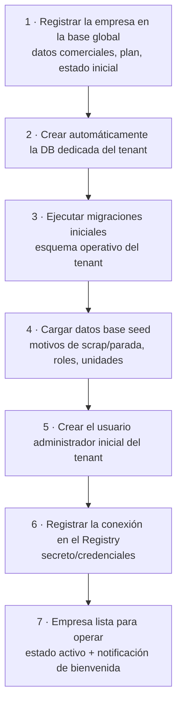
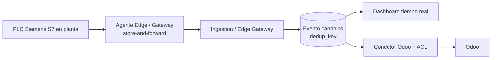
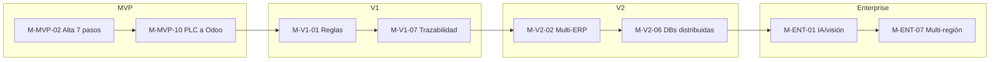

# Nexo — Hitos y criterios de aceptación

> **Documento:** `specs/roadmap/milestones.md` · **Estado:** Borrador v0.1 · **Actualizado:** 2026-07-11
> **Roles:** Product Manager · Software Architect · UX Designer
> **Relacionados:** [roadmap.md](./roadmap.md) · [vision.md](./vision.md) · [backlog.md](./backlog.md) · [idea.md](../idea.md) · [multi-tenancy.md](../specs/multi-tenancy.md) · [control-plane.md](../specs/control-plane.md) · [integrations.md](../specs/integrations.md)

## Resumen ejecutivo

Este documento descompone las fases del [roadmap](./roadmap.md) en **hitos concretos y verificables**. Mientras el roadmap responde *qué* y *en qué orden*, los hitos responden *cómo sabemos que está hecho*: cada hito tiene un **entregable**, un **criterio de aceptación medible** y sus **dependencias**. Son la unidad de compromiso operativo y el insumo de seguimiento de avance.

Los hitos se organizan por fase (**MVP → V1 → V2 → Enterprise**) y comparten un principio: **si el criterio de aceptación no se puede demostrar de forma objetiva, el hito no está cumplido.** Nada de "casi listo": cada criterio describe una condición observable (un flujo que corre, un dato que llega, un KPI que coincide con su fórmula canónica, un aislamiento que se verifica).

Dos hitos son **faro** del MVP y se destacan por su valor probatorio: **"Alta de tenant end-to-end (7 pasos)"** —que demuestra el modelo multi-tenant DB-per-tenant y el time-to-value— y **"Primer dato de PLC a Odoo"** —que demuestra la propuesta de valor central de punta a punta: capturar en la máquina, normalizar al Evento canónico, mostrar en tiempo real y sincronizar con el ERP sin carga manual. Ambos se detallan de forma ampliada en las secciones §2.1 y §2.2.

---

## 1. Cómo leer esta tabla

- **Hito:** entregable con nombre estable; se referencia desde el [backlog](./backlog.md) y el seguimiento.
- **Fase:** MVP / V1 / V2 / Enterprise (canónico, brief §11).
- **Entregable:** el artefacto o capacidad funcional que produce el hito.
- **Criterio de aceptación:** condición **medible y demostrable** que declara el hito cumplido.
- **Dependencias:** hitos u condiciones previas necesarias.

> Convención de identificadores: `M-<FASE>-<n>` (p. ej. `M-MVP-01`). Los dos hitos faro llevan además una descripción ampliada.

---

## 2. Hitos faro (destacados)

### 2.1 M-MVP-02 · Alta de tenant end-to-end (7 pasos)

**Por qué es faro:** prueba el requisito no negociable de **multi-tenancy DB-per-tenant** (brief §6) y el pilar de **time-to-value**: una empresa nueva queda lista para operar de forma **automatizada, repetible e idempotente**.

**El flujo funcional (canónico, brief §6.1):**

**Criterio de aceptación:** desde una solicitud de alta, el sistema ejecuta los **7 pasos** sin intervención manual; al finalizar, existe una **DB dedicada** con esquema migrado y seed cargado, un **usuario administrador** operativo, la **conexión registrada** en el Connection Registry, y la empresa en estado **"activo"** con notificación de bienvenida enviada. El flujo es **idempotente** (reejecutar no duplica) y admite **rollback** si un paso falla. Un tenant recién creado **no ve datos** de ningún otro.

### 2.2 M-MVP-10 · Primer dato de PLC a Odoo

**Por qué es faro:** prueba la **propuesta de valor central** de punta a punta y elimina la carga manual: el dato nace en la máquina y llega a la gestión sin retipeo.

**Criterio de aceptación:** una lectura/contador de un **PLC Siemens S7** real es capturada por el **Agente Edge/Gateway**, normalizada a un **Evento canónico** (con `origin_metadata` y `dedup_key`), **visible en el dashboard en tiempo real** en segundos, y **reflejada en Odoo** vía el conector con ACL. Ante un corte de red simulado entre el edge y la nube, el evento **no se pierde ni se duplica** (store-and-forward + idempotencia).

---

## 3. Hitos de la fase MVP

| Hito | Fase | Entregable | Criterio de aceptación (medible) | Dependencias |
|---|---|---|---|---|
| **M-MVP-01** · Fundaciones multi-tenant | MVP | Control Plane mínimo + Connection Registry + resolución de tenant | Se resuelve el tenant por subdominio/host o claim `tenant_id` del JWT y se obtiene la cadena de conexión correcta; un servicio "por tenant" opera contra la DB del tenant resuelto | — |
| **M-MVP-02** · Alta de tenant end-to-end (7 pasos) | MVP | Provisioning automatizado (ver §2.1) | Los 7 pasos corren sin intervención, idempotentes, con rollback; empresa en "activo"; sin fuga entre tenants | M-MVP-01 |
| **M-MVP-03** · Identity & Access | MVP | AuthN/AuthZ con claim de tenant | Un usuario se autentica y recibe token con claim de tenant; el acceso a un recurso de otro tenant se deniega | M-MVP-01 |
| **M-MVP-04** · Licencias y planes básicos | MVP | Administration & Licensing mínimo | Un tenant tiene un plan con límites; superar un límite se bloquea o registra según política | M-MVP-02 |
| **M-MVP-05** · Agente Edge/Gateway (PLC S7 + datalogger) | MVP | Edge con adapters S7 y datalogger, outbound | El agente lee de un PLC S7 y de un datalogger reales y envía a la nube en modo outbound | M-MVP-01 |
| **M-MVP-06** · Evento canónico + idempotencia | MVP | Normalización + `dedup_key` | Toda fuente produce un Evento canónico con los campos mínimos (brief §8.1); eventos duplicados se descartan por `dedup_key` | M-MVP-05 |
| **M-MVP-07** · Store-and-forward | MVP | Buffer edge ante cortes | Tras un corte de red simulado, al restablecerse la conexión todos los eventos llegan una sola vez, en orden recuperable | M-MVP-05, M-MVP-06 |
| **M-MVP-08** · Módulos de dominio (Prod/Scrap/QC/Downtime) | MVP | Registro de los 5 tipos de datos | Se registran producción, scrap, calidad, paradas y eventos de máquina, cada uno con sus campos canónicos (motivo, cantidad, costo, checklist según corresponda) | M-MVP-06 |
| **M-MVP-09** · Carga manual en tablet (UX operario) | MVP | App/formularios de operario | Un operario registra los 5 tipos en tablet con mínimos toques; validación en origen; funciona con conectividad intermitente | M-MVP-08 |
| **M-MVP-10** · Primer dato de PLC a Odoo | MVP | Flujo end-to-end (ver §2.2) | Dato de PLC → Evento → dashboard → Odoo, sin carga manual y sin pérdida/duplicación ante cortes | M-MVP-05..07, M-MVP-12, M-MVP-11 |
| **M-MVP-11** · Dashboard en tiempo real | MVP | Read models + tablero CQRS | El dashboard muestra OEE (Disponibilidad × Rendimiento × Calidad) y scrap rate calculados con las fórmulas canónicas (brief §10.1), actualizados en tiempo real | M-MVP-08 |
| **M-MVP-12** · Conector Odoo + ACL | MVP | Integración desacoplada con Odoo | Órdenes/productos/cantidades se sincronizan entre Nexo y Odoo vía ACL; el core no depende de Odoo | M-MVP-06 |
| **M-MVP-13** · Job de sincronización con reintentos | MVP | Sync Job resiliente | Un fallo transitorio de Odoo se reintenta y se resuelve sin pérdida ni duplicación; estado del job observable | M-MVP-12 |
| **M-MVP-14** · Event Store inmutable (base) | MVP | Historial de eventos append-only | Un evento ingerido no puede alterarse; se puede consultar el historial por contexto (site/line/asset) | M-MVP-06 |
| **M-MVP-15** · Auditoría básica | MVP | Registro de acciones clave | Las acciones sensibles (alta de usuario, cambios de configuración) quedan auditadas por tenant | M-MVP-03 |
| **M-MVP-16** · Piloto y cliente de referencia | MVP | Despliegue productivo con un cliente | Un cliente opera en producción con evidencia objetiva de reducción de carga manual (NSM en movimiento, ver [vision.md](./vision.md) §2) | M-MVP-10, M-MVP-11 |

**Criterio de salida de la fase MVP:** todos los hitos M-MVP-01 a M-MVP-12 y M-MVP-16 cumplidos, y los criterios de salida del [roadmap](./roadmap.md) §2.5 verificados.

---

## 4. Hitos de la fase V1 (MES ligero)

| Hito | Fase | Entregable | Criterio de aceptación (medible) | Dependencias |
|---|---|---|---|---|
| **M-V1-01** · Motor de reglas | V1 | Rules Engine trigger-condición-acción | Una regla definida por el cliente evalúa una condición sobre eventos en tiempo real y ejecuta una acción | MVP (Evento canónico) |
| **M-V1-02** · Notificaciones multicanal | V1 | Notifications con plantillas y escalado | Una regla dispara una notificación por al menos dos canales, con plantilla por rol y escalado ante no-atención | M-V1-01 |
| **M-V1-03** · Alertas/alarmas por umbral | V1 | Alertas disparadas por reglas/umbral | Un umbral superado genera una alerta trazable a su regla y notifica al rol correspondiente | M-V1-01, M-V1-02 |
| **M-V1-04** · Adapter OPC UA | V1 | Captura OPC UA completa | Un servidor OPC UA real se lee y normaliza al Evento canónico | MVP (Edge) |
| **M-V1-05** · Adapter Modbus | V1 | Captura Modbus completa | Un dispositivo Modbus real se lee y normaliza al Evento canónico | MVP (Edge) |
| **M-V1-06** · Adapter MQTT | V1 | Captura MQTT completa | Un broker MQTT real publica lecturas que se normalizan al Evento canónico | MVP (Edge) |
| **M-V1-07** · Trazabilidad lote/serie | V1 | Genealogía sobre Event Store | Se reconstruye la genealogía completa de un lote/serie de punta a punta desde el historial inmutable | M-MVP-14 |
| **M-V1-08** · Reportes on-demand y programados | V1 | Reports exportables | Un reporte programado se genera y exporta automáticamente; sus cifras coinciden con el dashboard | M-MVP-11 |
| **M-V1-09** · RBAC avanzado con scoping | V1 | Control de acceso por planta/línea | El acceso se restringe por planta/línea según la matriz de [users-permissions.md](../specs/users-permissions.md); un usuario no ve fuera de su alcance | M-MVP-03 |
| **M-V1-10** · Observabilidad transversal | V1 | Logs/métricas/trazas en Control Plane | Un incidente de un tenant se diagnostica con una traza extremo a extremo desde el Control Plane | MVP |

**Criterio de salida V1:** hitos M-V1-01 a M-V1-10 cumplidos y criterios de salida del [roadmap](./roadmap.md) §3.5 verificados.

---

## 5. Hitos de la fase V2 (Ecosistema y multi-ERP)

| Hito | Fase | Entregable | Criterio de aceptación (medible) | Dependencias |
|---|---|---|---|---|
| **M-V2-01** · Marketplace de conectores | V2 | Catálogo instalable | Un cliente instala un conector desde el Marketplace y queda operativo sin intervención del proveedor | V1 |
| **M-V2-02** · Conector multi-ERP | V2 | ERP distinto de Odoo (SAP/Dynamics/Oracle) | Un tenant sincroniza con un segundo ERP reutilizando el patrón ACL, sin tocar el core | M-MVP-12 |
| **M-V2-03** · Analytics avanzado | V2 | Tendencias/comparativas/cohortes | El analytics entrega vistas que el dashboard base no ofrecía, consistentes con los read models | M-MVP-11 |
| **M-V2-04** · Feature flags | V2 | Flags por tenant/plan | Una capacidad se habilita/inhabilita por tenant sin re-despliegue | M-MVP-04 |
| **M-V2-05** · Despliegues progresivos | V2 | Canary / blue-green | Un cambio se despliega a un subconjunto y se revierte automáticamente ante degradación | M-V1-10 |
| **M-V2-06** · Distribución geográfica de DBs | V2 | Migración de DB de tenant a otra región | La DB de un tenant se mueve a otra región sin cambios de lógica y sin downtime perceptible | M-MVP-01, M-MVP-02 |
| **M-V2-07** · Certificación de conectores de terceros | V2 | Gobernanza del catálogo | Un conector de tercero pasa sandbox/certificación antes de publicarse; puede revocarse | M-V2-01 |

**Criterio de salida V2:** hitos M-V2-01 a M-V2-06 cumplidos y criterios de salida del [roadmap](./roadmap.md) §4.5 verificados.

---

## 6. Hitos de la fase Enterprise (Inteligencia industrial)

| Hito | Fase | Entregable | Criterio de aceptación (medible) | Dependencias |
|---|---|---|---|---|
| **M-ENT-01** · IA de calidad / visión artificial | Enterprise | Modelo de visión/OCR/ML | Un modelo clasifica o inspecciona un caso real de calidad con precisión aceptada por el cliente; respeta aislamiento por tenant | V2, Files/Media, Quality |
| **M-ENT-02** · Mantenimiento predictivo | Enterprise | Modelos sobre señales/eventos | Se anticipa una condición de falla con antelación útil sobre datos históricos reales | Devices, Downtime (MTBF/MTTR) |
| **M-ENT-03** · Gemelo digital | Enterprise | Representación de planta/línea | El gemelo refleja el estado real de una línea a partir de eventos, con desfase acotado | M-ENT-01/02 |
| **M-ENT-04** · Energía y sustentabilidad | Enterprise | Consumo/huella | Se mide y reporta consumo energético de una línea y su indicador de sustentabilidad | Devices |
| **M-ENT-05** · Integración con MES/SCADA existentes | Enterprise | Conector a MES/SCADA legado | Nexo integra datos de un MES/SCADA de terceros vía ACL, sin comandar máquinas | Connectors |
| **M-ENT-06** · SLAs enterprise | Enterprise | Compromisos de servicio medidos | Disponibilidad y tiempos de respuesta se cumplen y reportan según el SLA contratado | M-V1-10, M-V2-05 |
| **M-ENT-07** · Alta disponibilidad multi-región | Enterprise | Operación en ≥2 regiones | La plataforma opera en dos regiones con failover probado y sin pérdida de datos | M-V2-06 |

**Criterio de salida Enterprise:** hitos M-ENT-01, M-ENT-02, M-ENT-06 y M-ENT-07 cumplidos y criterios de salida del [roadmap](./roadmap.md) §5.5 verificados.

---

## 7. Trazabilidad de hitos → fases → visión

Los hitos alimentan el seguimiento de las fases del [roadmap](./roadmap.md) y prueban las capas de la [visión](./vision.md); el trabajo que los realiza se detalla en el [backlog](./backlog.md).

---

## Preguntas abiertas

1. **Umbral de "precisión aceptada" en IA (M-ENT-01/02).** ¿Qué métrica y qué valor definen el éxito de un modelo con cada cliente? Debe pactarse por caso.
2. **Definición de "sin downtime perceptible" (M-V2-06, M-ENT-07).** ¿Qué ventana de indisponibilidad se tolera en una migración/failover? Ligar a los SLAs de [product.md](../specs/product.md).
3. **Alcance del seed inicial (M-MVP-02, paso 4).** ¿Qué catálogos por defecto se cargan (motivos de scrap/parada, roles, unidades) y cuáles quedan a configuración del cliente?
4. **Objetos de Odoo en M-MVP-12.** ¿Qué objetos y direccionalidad exactos entran en el primer conector? Depende del cliente piloto (ver [idea.md](../idea.md)).
5. **Medición objetiva de "reducción de carga manual" (M-MVP-16).** ¿Cómo se instrumenta la evidencia para el cliente de referencia? Coordinar con la NSM de [vision.md](./vision.md).
6. **Criterio de captura de lote/serie en MVP vs. V1.** ¿Se registra lote/serie ya en el MVP para habilitar M-V1-07 sin backfill?
7. **Prioridad de MQTT (M-V1-06).** ¿Es Must o Should en V1 según demanda real de los primeros clientes?
