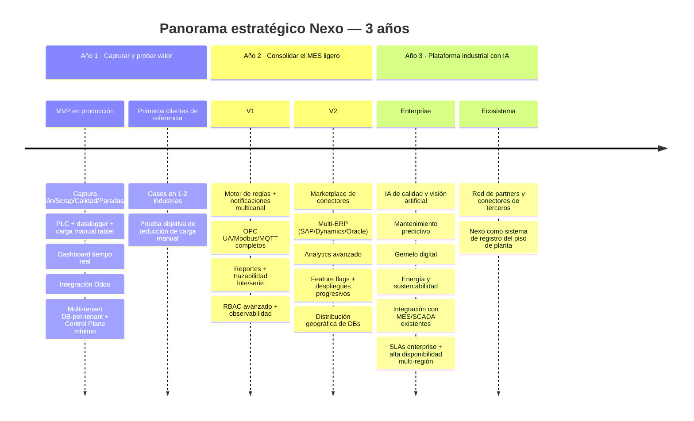
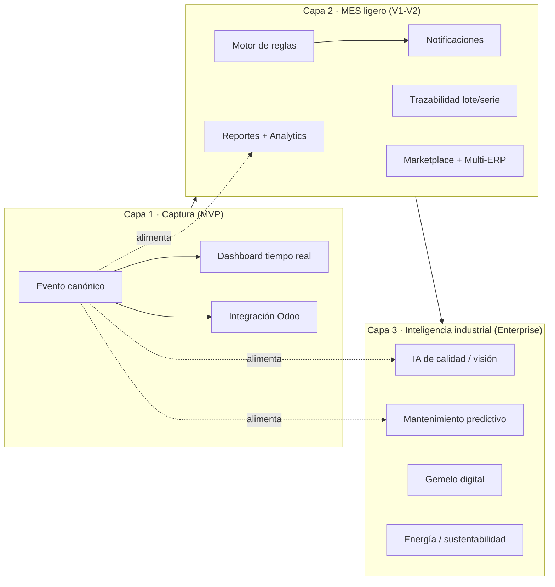

# Nexo — Visión y estrategia de largo plazo

> **Documento:** `specs/roadmap/vision.md` · **Estado:** Borrador v0.1 · **Actualizado:** 2026-07-11
> **Roles:** Product Manager · Software Architect · UX Designer
> **Relacionados:** [idea.md](../idea.md) · [roadmap.md](./roadmap.md) · [milestones.md](./milestones.md) · [backlog.md](./backlog.md) · [future-features.md](../specs/future-features.md) · [product.md](../specs/product.md) · [architecture.md](../specs/architecture.md)

## Resumen ejecutivo

Este documento define **hacia dónde va Nexo en el largo plazo** y por qué. Mientras [idea.md](../idea.md) explica el problema y la propuesta de valor, y [roadmap.md](./roadmap.md) detalla el *cómo* y el *cuándo* de cada fase, `vision.md` fija el **norte estratégico**: la misión, la visión a tres años, la métrica *North Star*, los pilares que sostienen la construcción del producto, la trayectoria evolutiva de la plataforma y los principios de producto que deben guiar cada decisión. Es la brújula contra la cual se validan las decisiones de roadmap, arquitectura y priorización.

La tesis central es que Nexo no es un producto puntual, sino una **plataforma industrial** con una trayectoria deliberada: nace como **la capa única de captura de datos** entre la planta y el ERP (MVP), madura hacia un **MES ligero** con reglas, trazabilidad y analítica (V1–V2), y evoluciona hacia una **plataforma industrial con inteligencia artificial** —visión artificial, mantenimiento predictivo, gemelo digital— sobre una base multi-tenant con **base de datos por tenant**, event-driven y edge-first. Cada capa nueva reutiliza y capitaliza la anterior: el **Evento canónico** capturado desde el día uno es el activo que habilita, más adelante, la analítica avanzada y la IA.

La visión se ancla en una convicción de negocio: **el dato de planta capturado en su origen, normalizado y trazable es el activo defendible** de la compañía. Quien posea la capa de captura, agnóstica de ERP y de hardware, se vuelve el sistema de registro del piso de planta y el punto natural de expansión hacia todo lo que se puede construir sobre ese dato. Este documento describe cómo llegamos ahí sin traicionar los principios que hacen a Nexo adoptable, escalable y confiable.

---

## 1. Misión y visión

### 1.1 Misión (el porqué, hoy)

> **Eliminar la carga manual de datos de planta.** Convertir lo que ocurre en el piso —producción, scrap, calidad, paradas, eventos de máquina— en **eventos normalizados, trazables y sincronizables**, capturados en su origen y disponibles en tiempo real para quien los necesite: el operario, el supervisor, la gerencia y el ERP.

La misión es operativa y verificable: se cumple cuando una planta deja de retipear información y empieza a confiar en un único dato de verdad. Es el compromiso que Nexo asume con cada cliente desde el primer día, y se materializa ya en el MVP (ver [idea.md](../idea.md) §8).

### 1.2 Visión (el estado futuro, a dónde vamos)

> Que Nexo sea **el estándar de facto de la capa de captura y contextualización de datos industriales** para la industria manufacturera de habla hispana y, progresivamente, global: una plataforma que cualquier planta adopte en días, agnóstica de ERP y de hardware, que escale de un taller de una línea a **miles de empresas, miles de plantas y millones de eventos diarios**, y sobre la cual se construya un ecosistema de inteligencia industrial —analítica, reglas e IA— sin que el cliente quede atado a ningún proveedor.

La visión describe un destino de plataforma, no de feature. Se reconoce cumplida cuando Nexo es la respuesta natural a la pregunta "¿cómo conecto mi planta con mi gestión?" en su mercado objetivo, y cuando terceros construyen valor sobre su capa de captura (conectores, analítica, integraciones).

### 1.3 Relación misión ↔ visión

| Dimensión | Misión (hoy) | Visión (largo plazo) |
|---|---|---|
| **Foco** | Eliminar la carga manual en cada planta | Ser la capa estándar de captura industrial |
| **Alcance** | Producción, scrap, calidad, paradas, eventos | Plataforma de inteligencia industrial extensible |
| **Unidad de valor** | El Evento canónico confiable | El ecosistema y la red de conectores/IA sobre el dato |
| **Horizonte** | MVP y adopción inicial | 3 años y más allá (ver §3 y §5) |
| **Prueba de éxito** | La planta deja de retipear | Nexo es sistema de registro de facto del piso |

---

## 2. North Star y sistema de métricas

### 2.1 North Star Metric (NSM)

La métrica *North Star* debe capturar el valor central —eliminar la carga manual— y correlacionar con retención e ingreso. La elegida es:

> **NSM = Eventos normalizados capturados automáticamente por período, con trazabilidad hasta su origen.**
>
> Formulación conceptual: *volumen de Eventos canónicos ingeridos desde fuentes automáticas (PLC, datalogger, protocolos, API) y desde carga manual asistida, que sustituyen un registro que antes se hacía a mano.*

La NSM se lee como "cuánta carga manual eliminó Nexo": cada evento capturado en origen es una anotación en papel o una doble carga en el ERP que dejó de existir. Crece con la adopción (más plantas), con la profundidad de integración (más fuentes automáticas por planta) y con el uso sostenido (retención).

### 2.2 Métricas de entrada (input metrics) que mueven la NSM

| Palanca | Métrica de entrada | Cómo mueve la NSM |
|---|---|---|
| **Adopción** | Tenants activos · Plantas activas · Operarios activos por turno | Más orígenes de eventos |
| **Profundidad** | % de captura automática vs. manual · Fuentes conectadas por planta | Más eventos por planta, menos fricción |
| **Time-to-value** | Días desde alta de tenant hasta primer evento en dashboard | Acelera la activación |
| **Confiabilidad** | % de eventos sincronizados al ERP sin intervención · Tasa de reintentos exitosos | Sostiene la confianza y la retención |
| **Salud del dato** | % de eventos con `origin_metadata` completo · Latencia de ingesta P95 | Calidad del activo que habilita analítica/IA |

### 2.3 Contra-métricas (para no optimizar a ciegas)

- **Ruido de eventos:** volumen alto sin valor (duplicados, lecturas irrelevantes). Se controla con `dedup_key` y contextualización.
- **Carga manual encubierta:** operarios que "completan" datos que la máquina debería dar. Se vigila con el ratio automático/manual.
- **Deuda de confiabilidad:** eventos capturados pero no sincronizados o no trazables. La NSM exige *trazabilidad hasta el origen*, no solo volumen.

> Las fórmulas de KPI de negocio del cliente (OEE, scrap rate, FPY, MTBF/MTTR) están definidas de forma canónica en el brief de fundamentos y se detallan en [product.md](../specs/product.md) y los módulos de dominio. La NSM es la métrica de la **plataforma**, no del cliente.

---

## 3. Panorama a 3 años

El horizonte de tres años traza la transición de **producto de captura** a **plataforma industrial**. No es un compromiso de fechas exactas (esas viven en [roadmap.md](./roadmap.md) y [milestones.md](./milestones.md)), sino la narrativa estratégica por año.

| Año | Tema estratégico | Qué debe ser verdad al final del año |
|---|---|---|
| **Año 1** | **Capturar y probar el valor** | El MVP está en producción con clientes de referencia; se demuestra objetivamente la reducción de carga manual; el Evento canónico fluye de PLC/datalogger/tablet a dashboard y a Odoo. |
| **Año 2** | **Consolidar el MES ligero y abrir el ecosistema** | Nexo automatiza decisiones (reglas), notifica, reporta y traza lote/serie; soporta más protocolos y más de un ERP; el Marketplace y los feature flags habilitan crecimiento sin fricción. |
| **Año 3** | **Plataforma industrial con IA** | Sobre la capa de datos se construye inteligencia (visión, predicción, gemelo digital); Nexo opera con SLAs enterprise y multi-región; un ecosistema de partners extiende la plataforma. |

---

## 4. Pilares estratégicos

Los pilares son las apuestas de largo plazo que **no cambian** aunque cambien las features. Toda iniciativa debe poder justificarse contra al menos uno.

### Pilar 1 — El Evento canónico como activo defendible
El corazón de Nexo es normalizar todo origen heterogéneo a un **Evento canónico** inmutable y trazable (ver esquema conceptual en el brief §8.1). Es el activo que se acumula con cada cliente y el que, más adelante, habilita analítica e IA. **Todo lo que capturamos hoy es el combustible de lo que construimos mañana.**

### Pilar 2 — Agnosticismo radical (de ERP y de hardware)
El core **nunca** depende de un ERP ni de un fabricante. Odoo es el primero, no el único; la integración se resuelve con **Conectores + Anti-Corruption Layer (ACL)**. Este pilar protege al cliente del *lock-in* y a Nexo de atarse a un ecosistema ajeno. Es también una ventaja competitiva frente a soluciones cautivas de un ERP.

### Pilar 3 — Aislamiento y confianza multi-tenant (DB-per-tenant)
El modelo de **base de datos por tenant** es un requisito no negociable (brief §6): aislamiento total de datos, storage, cómputo y credenciales. Es simultáneamente una decisión de seguridad, de cumplimiento y de escalabilidad (cada DB puede migrar de servidor/región sin cambiar la lógica). La confianza es prerequisito de venta en industria.

### Pilar 4 — Edge-first y resiliencia ante la realidad de planta
La captura vive donde vive el dato: on-premise, con **Agente Edge/Gateway** que conecta *outbound* y aplica **store-and-forward** ante cortes. El piso de planta es hostil a la conectividad; Nexo asume esa realidad como principio de diseño, no como excepción.

### Pilar 5 — Escala desde el diseño
Cada decisión se justifica contra metas de escala: **miles de empresas, miles de plantas, decenas de miles de usuarios, cientos de miles de dispositivos, millones de eventos diarios** (brief §7). Arquitectura event-driven, CQRS/read models, autoscaling por servicio, backpressure y almacenamiento time-series. La escala no se agrega después: se diseña desde el origen.

### Pilar 6 — Time-to-value y experiencia de operario
El valor debe percibirse en **días, no meses**: alta de tenant automatizada (7 pasos, brief §6.1) y carga manual disponible desde el día uno, sin esperar la integración de hardware. La UX del operario —con guantes, frente a una tablet, en un turno— es un pilar, no un detalle.

### Pilar 7 — Extensibilidad y ecosistema
La plataforma se diseña para que terceros construyan sobre ella: **Marketplace de conectores**, feature flags, APIs desacopladas. El valor de largo plazo está en la red de integraciones y partners que rodean al core.

| Pilar | Riesgo que mitiga | Se materializa en (fase) |
|---|---|---|
| 1 · Evento canónico | Datos irreconciliables entre fuentes | MVP y todas las siguientes |
| 2 · Agnosticismo | *Lock-in* y dependencia de ERP | MVP (Odoo) → V2 (multi-ERP) |
| 3 · Aislamiento multi-tenant | Fuga de datos entre clientes | MVP (no negociable) |
| 4 · Edge-first | Pérdida de datos por cortes | MVP → V1 (protocolos completos) |
| 5 · Escala desde el diseño | Reescrituras por crecimiento | Transversal, prueba en V2 |
| 6 · Time-to-value / UX operario | Adopción lenta, abandono | MVP |
| 7 · Extensibilidad / ecosistema | Techo de crecimiento | V2 (Marketplace) → Enterprise |

---

## 5. Evolución de la plataforma: de captura a plataforma industrial con IA

La trayectoria de producto es una **escalera de capas**, donde cada peldaño se apoya en el anterior y aumenta el valor sin descartar lo construido.

### 5.1 Capa 1 — Captura (MVP): "el dato deja de cargarse a mano"
Nexo entra como **la capa única de captura**. Registra producción, scrap, calidad, paradas y eventos; captura desde PLC y datalogger; permite carga manual en tablet; muestra un dashboard en tiempo real; sincroniza con Odoo; opera multi-tenant con DB-per-tenant y un Control Plane mínimo. El resultado tangible: **la planta deja de retipear**. (Detalle en [roadmap.md](./roadmap.md) fase MVP.)

### 5.2 Capa 2 — MES ligero (V1–V2): "el dato dispara acciones y se abre al ecosistema"
Sobre la captura se agrega inteligencia operativa: **motor de reglas** (trigger-condición-acción), **notificaciones multicanal**, **trazabilidad de lote/serie**, **reportes** y **analytics**, más protocolos (OPC UA/Modbus/MQTT completos), **RBAC avanzado** y **observabilidad**. Luego el ecosistema: **Marketplace de conectores**, **multi-ERP** (SAP/Dynamics/Oracle), **feature flags** y **distribución geográfica de DBs**. Nexo pasa de *ver* a *actuar* y de *un ERP* a *muchos*.

### 5.3 Capa 3 — Plataforma industrial con IA (Enterprise): "el dato predice y optimiza"
Con el activo de datos consolidado y trazable, se construye inteligencia: **IA de calidad y visión artificial**, **mantenimiento predictivo**, **gemelo digital**, **energía y sustentabilidad**, **integración con MES/SCADA existentes**, **SLAs enterprise** y **alta disponibilidad multi-región**. Aquí el Evento canónico capturado desde el MVP paga dividendos: es el conjunto de entrenamiento y contexto que hace posible la IA. (Ver [future-features.md](../specs/future-features.md).)

| Capa | Pregunta que responde | Fase | Valor incremental |
|---|---|---|---|
| **Captura** | ¿Qué está pasando en la planta? | MVP | Dato confiable en tiempo real, sin carga manual |
| **MES ligero** | ¿Qué hago con lo que pasa? | V1–V2 | Automatización, trazabilidad, ecosistema |
| **Inteligencia** | ¿Qué va a pasar y cómo lo optimizo? | Enterprise | Predicción, visión, optimización |

---

## 6. Principios de producto

Los principios traducen la estrategia en criterios de decisión cotidianos. Cuando dos opciones compiten, gana la que mejor respeta estos principios.

1. **Cero carga manual como norte, no como dogma.** Preferimos capturar en origen; cuando la carga manual es inevitable, la hacemos trivial (UX de operario). Nunca pedimos al humano lo que la máquina ya sabe.
2. **El core no se contamina.** Todo sistema externo entra por un conector con ACL. El modelo de dominio permanece limpio y estable aunque cambien ERPs, protocolos o hardware.
3. **Aislamiento primero.** Ante cualquier duda de diseño, se elige la opción que refuerza el aislamiento entre tenants. La confianza no se negocia.
4. **Diseñar para el corte de red.** Asumimos conectividad intermitente: store-and-forward, idempotencia (`dedup_key`), reintentos. Un evento capturado nunca se pierde por un corte.
5. **Inmutabilidad y trazabilidad del evento.** Un Evento canónico, una vez ingerido, no se altera. La verdad del piso de planta es auditable de punta a punta.
6. **Consistencia de terminología y de KPI.** Los mismos nombres y las mismas fórmulas en todos los módulos y documentos (brief §8 y §10). Un OEE calculado igual en todas partes vale; uno calculado distinto no vale nada.
7. **Time-to-value sobre completitud.** Preferimos entregar valor percibible rápido (captura manual desde el día uno) que esperar la integración perfecta. La adopción se gana en días.
8. **Escala como restricción de diseño, no como epílogo.** Cada feature se piensa para miles de plantas y millones de eventos. No construimos nada que sepamos que habrá que reescribir para escalar.
9. **Extensible por defecto.** Preferimos capacidades que terceros puedan aprovechar (conectores, feature flags) antes que soluciones cerradas. El ecosistema es parte del producto.
10. **Observabilidad como ciudadanía de primera.** Logs, métricas y trazas son parte de la definición de "terminado" de cada servicio. No se opera lo que no se observa.

---

## 7. Cómo se usa esta visión

- **En priorización:** una iniciativa que no avanza ningún pilar (§4) ni mueve la NSM (§2) es candidata a descartarse o posponerse.
- **En arquitectura:** las decisiones se validan contra los principios de producto (§6) y los principios de arquitectura del brief (§5). Ver [architecture.md](../specs/architecture.md).
- **En roadmap:** la secuencia de fases (§5) es la columna vertebral de [roadmap.md](./roadmap.md); los hitos que prueban cada capa viven en [milestones.md](./milestones.md); el trabajo concreto en [backlog.md](./backlog.md).
- **En go-to-market:** el panorama a 3 años (§3) alinea comercial, producto e ingeniería sobre el mismo destino.

---

## Preguntas abiertas

1. **Nombre definitivo del producto.** "Nexo" es un *working name* provisional; falta validar disponibilidad de marca/dominio antes de invertir en posicionamiento de la visión.
2. **Definición operativa de la NSM.** ¿Cómo medimos con precisión "eventos que sustituyen carga manual"? ¿Contamos por evento, por registro sustituido o por hora-persona ahorrada? Debe cerrarse junto con las métricas de [product.md](../specs/product.md).
3. **Alcance geográfico del horizonte a 3 años.** ¿La visión de "multi-región" del Año 3 apunta a LatAm, o incluye expansión a mercados de habla no hispana antes de lo previsto? Impacta residencia de datos y localización.
4. **Ritmo de la escalera de capas.** ¿La transición captura → MES → IA es estrictamente secuencial, o se anticipan capacidades de analítica/IA "faro" en V2 para diferenciación comercial temprana?
5. **Modelo de ecosistema/partners.** ¿El Marketplace será de conectores oficiales y de terceros desde V2, y qué gobernanza (certificación, revenue share) sostiene el pilar de extensibilidad?
6. **Umbral de "estándar de facto".** ¿Con qué señales medibles (cuota de mercado, número de plantas, presencia de partners) declaramos cumplida la visión de ser la capa estándar de captura?
7. **Prioridad relativa de IA vs. profundidad de captura.** Con recursos limitados, ¿se invierte antes en más fuentes/protocolos de captura o en las primeras capacidades de IA? La respuesta define el énfasis de la fase Enterprise.
