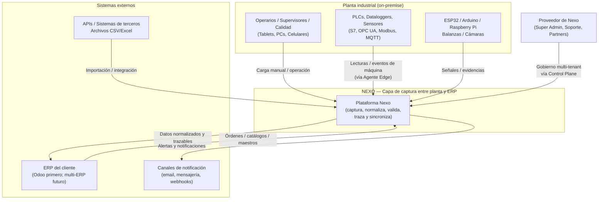
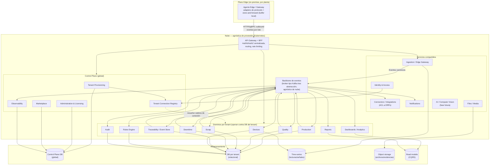
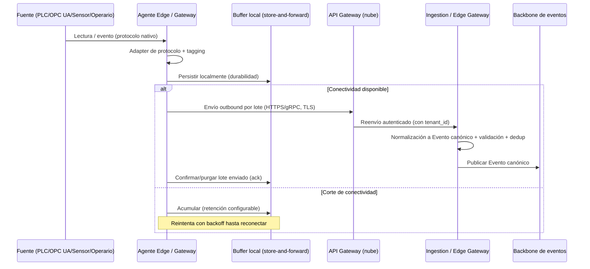
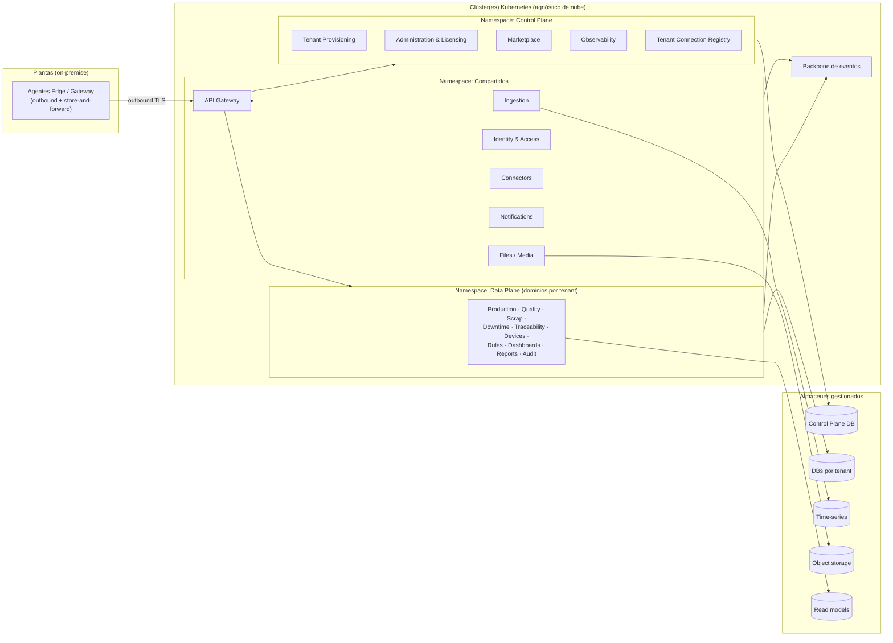

# Arquitectura de la Plataforma Nexo

> **Documento:** `specs/specs/architecture.md` · **Estado:** Borrador v0.1 · **Actualizado:** 2026-07-11
> **Roles:** Product Manager · Software Architect · UX Designer
> **Relacionados:** [data-ingestion.md](./data-ingestion.md) · [scalability.md](./scalability.md) · [multi-tenancy.md](./multi-tenancy.md) · [security.md](./security.md) · [integrations.md](./integrations.md) · [control-plane.md](./control-plane.md) · [devices.md](./devices.md) · [traceability.md](./traceability.md) · [glossary.md](./glossary.md)

## Resumen ejecutivo

Nexo es la **capa única de captura de datos industriales entre la planta y el ERP**. Su arquitectura existe para resolver un problema estructural: el dato de planta nace heterogéneo (protocolos industriales, cargas manuales, archivos, APIs externas), disperso y sin contexto, mientras que los sistemas de gestión (ERP, empezando por Odoo) necesitan información **normalizada, validada, trazable y sincronizable**. Este documento define cómo se organiza el sistema para lograr esa transformación a escala de miles de empresas y millones de eventos diarios, sin acoplarse a ningún ERP ni a ningún proveedor de nube.

La arquitectura es **Cloud Native, orientada a microservicios con Domain-Driven Design (DDD), event-driven y explícitamente NO monolítica**. Cada dominio de negocio (Producción, Calidad, Scrap, Paradas, Trazabilidad, Dispositivos, etc.) es un *bounded context* con su propio ciclo de vida de despliegue, y se comunica con el resto a través de un **backbone de eventos asíncrono** y de un conjunto acotado de llamadas sincrónicas. La captura ocurre en el **borde (edge)**: los PLC, OPC UA y Modbus viven on-premise y un **Agente Edge / Gateway** conecta hacia la nube en modo *outbound* con *store-and-forward* ante cortes de conectividad.

El modelo de datos es **multi-tenant con base de datos por tenant** (requisito NO negociable, ver [multi-tenancy.md](./multi-tenancy.md)): cada empresa tiene su propia base operativa, aislada de las demás, y un **Control Plane** global gobierna el ciclo de vida de los tenants sin almacenar jamás datos operativos de clientes. Este modelo es a la vez la base del aislamiento y la estrategia natural de particionamiento para escalar (ver [scalability.md](./scalability.md)).

Este documento presenta los principios rectores, las vistas de arquitectura al estilo C4 (contexto y contenedores), la justificación de cada límite de servicio, los patrones de comunicación, la arquitectura de captura en el edge, la estrategia de almacenamiento por servicio, la observabilidad, la topología de despliegue sobre Kubernetes agnóstico de nube y un registro de decisiones arquitectónicas (ADR). Es el documento raíz de arquitectura; los detalles de ingesta, escala, integraciones y plano de control se profundizan en sus documentos dedicados.

---

## 1. Principios de arquitectura

Los siguientes principios son la traducción directa de los fundamentos canónicos de la plataforma y gobiernan cada decisión técnica. Ninguna decisión de diseño puede contradecirlos sin quedar registrada como una excepción explícita en la sección de ADR.

### 1.1 Cloud Native

- El sistema se diseña para ejecutarse sobre **orquestación de contenedores (Kubernetes)**, con servicios *stateless* donde sea posible y estado delegado a almacenes gestionados (bases relacionales, time-series, object storage, broker).
- **Agnóstico de nube:** ningún servicio depende de una primitiva propietaria de un proveedor específico. Las capacidades de nube (colas, blobs, secretos, balanceadores) se consumen detrás de abstracciones para permitir portabilidad entre AWS, Azure, GCP u on-premise.
- **Elasticidad e inmutabilidad:** artefactos inmutables (imágenes de contenedor versionadas), infraestructura declarativa, escalado horizontal automático y capacidad de reconstruir cualquier entorno desde su definición.
- **Resiliencia por diseño:** tolerancia a fallos de nodo, zona y (en fases avanzadas) región; *health checks*, reintentos, *circuit breakers* y degradación controlada.

### 1.2 Domain-Driven Design (DDD)

- El sistema se descompone en **bounded contexts** que corresponden a dominios de negocio reales de la manufactura (Producción, Calidad, Scrap, Paradas, Trazabilidad…), no en capas técnicas.
- Cada contexto posee su **lenguaje ubicuo**, sus entidades canónicas (ver sección 8 del brief y [glossary.md](./glossary.md)) y sus invariantes. Un contexto no manipula el modelo interno de otro.
- La comunicación entre contextos ocurre a través de **contratos explícitos**: eventos de dominio publicados en el backbone y/o APIs bien definidas. Nada de acoplamiento por base de datos compartida entre dominios.
- El **Anti-Corruption Layer (ACL)** protege el core de las particularidades de sistemas externos (ERPs), evitando que la semántica de un ERP contamine el modelo de Nexo (ver [integrations.md](./integrations.md)).

### 1.3 Event-driven

- El **backbone de mensajería asíncrona** —broker **tipo Kafka detrás de una abstracción** (decisión ARQ-01), que admite un **managed equivalente** sin acoplarse a primitivas propietarias de un proveedor (agnóstico de nube)— es la **columna vertebral** de la plataforma. La captura, normalización y distribución del dato fluyen como **eventos**.
- El **Evento canónico** (sección 8.1 del brief) es la unidad normalizada del sistema: inmutable una vez ingerido, con `event_id`, `tenant_id`, `timestamp`, `source`, `type`, `payload` normalizado, `dedup_key` y `origin_metadata`.
- Los dominios reaccionan a eventos de forma desacoplada: publicar un evento de producción no requiere conocer quién lo consume (Dashboards, Trazabilidad, Reglas, Integraciones pueden reaccionar en paralelo).
- Se aplican **garantías at-least-once + idempotencia** en el consumo (ver [data-ingestion.md](./data-ingestion.md)).

### 1.4 Microservicios de alta cohesión y bajo acoplamiento

- Cada servicio encapsula **una responsabilidad de dominio** y expone contratos estables. Alta cohesión interna, bajo acoplamiento externo.
- **Despliegue independiente:** cada servicio tiene su propio pipeline CI/CD, su versionado y sus *feature flags*; un dominio puede evolucionar y desplegarse sin coordinar un release global.
- **Aislamiento de fallos:** la caída de un dominio (p. ej. Reports) no debe tumbar la captura ni el resto de dominios; los límites de servicio son también límites de contención de fallos.

### 1.5 NO monolito (decisión explícita)

- Se descarta deliberadamente el monolito (y el "monolito distribuido"). Un monolito no permitiría escalar de forma independiente la ingesta (intensiva en I/O y picos) frente a los reportes (intensivos en cómputo), ni desplegar dominios de forma autónoma, ni aislar fallos.
- Se evita el anti-patrón de **monolito distribuido**: los servicios NO comparten base de datos ni se invocan en cadenas sincrónicas largas que recreen un acoplamiento de despliegue. La regla es: **datos privados por servicio, integración por eventos**.

> Estos principios se cruzan con los principios canónicos 1–10 del brief. Los complementos de escala (principio 9) se desarrollan en [scalability.md](./scalability.md); los de multi-tenancy (principio 3) en [multi-tenancy.md](./multi-tenancy.md); los de seguridad y observabilidad (principios 7 y 8) en [security.md](./security.md) y en la sección 8 de este documento.

---

## 2. Vistas de arquitectura (estilo C4)

Se documentan dos niveles del modelo C4: **Contexto del sistema** (nivel 1) y **Contenedores** (nivel 2). Los niveles de componente y código se abordan dentro de cada documento de dominio.

### 2.1 Nivel 1 — Diagrama de contexto

Muestra a Nexo como una caja negra en su ecosistema: quién lo usa, con qué fuentes se conecta y a qué sistemas externos se integra.

### 2.2 Nivel 2 — Diagrama de contenedores

Descompone Nexo en sus contenedores lógicos (servicios, almacenes y plano de control). Se separan tres planos: **Edge** (on-premise), **Data Plane** (dominios por tenant) y **Control Plane** (gobierno global). Ver la lista canónica de servicios en la sección 3.

> Nota de lectura: el broker es el punto de desacople central. Los dominios **publican** hechos de negocio y **consumen** lo que necesitan; no hay dependencias sincrónicas cruzadas obligatorias entre dominios de tenant.

---

## 3. Bounded contexts / microservicios (con justificación de cada límite)

La siguiente tabla usa **exactamente** la lista canónica de microservicios (sección 5.1 del brief) y agrega la **justificación del límite**: por qué cada uno merece ser un servicio propio (cohesión, distinta cadencia de cambio, distinto perfil de carga/escala, distinto modelo de datos, distinto régimen de aislamiento multi-tenant o distinto ciclo de despliegue).

| Servicio (BC) | Ámbito | Datos | Responsabilidad principal | Justificación del límite (por qué es un servicio propio) |
|---|---|---|---|---|
| **Identity & Access** | Compartido | Control Plane + claims por tenant | AuthN/AuthZ, usuarios, SSO, tokens con claim de tenant | La identidad es transversal a todos los dominios y tiene un régimen de seguridad y cumplimiento propio. Aislarla evita replicar lógica de auth y centraliza la emisión del claim `tenant_id` que gobierna la resolución multi-tenant. Cambia por razones de seguridad, no de negocio de planta. |
| **Tenant Provisioning** | Global/CP | Control Plane DB | Alta de tenant, creación de DB, migraciones, seed, registro de conexión | Orquesta un flujo crítico y sensible (crear bases, correr migraciones, sembrar catálogos) que NO debe vivir en el camino caliente de operación. Su cadencia y su superficie de privilegios son únicas; un fallo aquí es de gobierno, no de captura. |
| **Administration & Licensing** | Global/CP | Control Plane DB | Planes, licencias, feature flags, límites, facturación | Reglas comerciales y de habilitación con ciclo de vida y compliance distintos al dato operativo. Debe poder cambiar planes/limits sin tocar dominios de planta y sin acceso a datos de clientes. |
| **Marketplace** | Global/CP | Control Plane DB | Catálogo de conectores oficiales/terceros | Catálogo público/curado con su propio modelo de publicación, versionado y confianza (terceros). No comparte ciclo de vida con la ejecución de integraciones ni con datos de tenant. |
| **Observability** | Global/CP | Control Plane DB | Estado de tenants, servicios, conectores, métricas, logs | Consolida telemetría de toda la plataforma. Debe seguir operando aunque dominios fallen (es quien reporta esos fallos), por lo que se aísla de las dependencias que observa. |
| **Ingestion / Edge Gateway** | Compartido (procesa por tenant) | Buffer + enruta | Recepción, adapters de protocolo, normalización a Evento canónico | Es el borde de entrada con el perfil de carga más extremo (picos, backpressure, millones de eventos/día). Se aísla para escalar de forma independiente y para contener la variabilidad de protocolos sin contaminar los dominios. Ver [data-ingestion.md](./data-ingestion.md). |
| **Devices** | Por tenant | DB del tenant | Dispositivos, sensores, tags/señales, salud, firmware/OTA | Gestiona el inventario y la salud del hardware de captura, con un ciclo (OTA, diagnóstico, telemetría de salud) distinto del dato de producción. Es referencia maestra para la ingesta. Ver [devices.md](./devices.md). |
| **Production** | Por tenant | DB del tenant | Órdenes, registros de producción, turnos, productividad | Núcleo del dominio manufacturero con invariantes propias (órdenes, turnos, conteos) y KPIs (OEE, rendimiento). Cambia al ritmo del negocio de planta; merece su propio modelo e independencia de despliegue. |
| **Quality** | Por tenant | DB del tenant | Inspecciones, checklists, defectos, tolerancias, disposición | Lógica de control de calidad (SPC, tolerancias, disposición) con reglas y flujos propios, ajenos al conteo de producción. Evoluciona con normativas de calidad, no con producción. |
| **Scrap** | Por tenant | DB del tenant | Registros de scrap, motivos, costos, clasificación | Aunque relacionado con producción y calidad, tiene su propio modelo de motivos, costeo y clasificación, y alimenta KPIs específicos (Scrap Rate). Separarlo evita inflar Production con reglas de costeo. |
| **Downtime (Paradas)** | Por tenant | DB del tenant | Eventos de parada, motivos, MTBF/MTTR | Modelo temporal propio (intervalos, motivos, planificado/no planificado) y KPIs de confiabilidad (MTBF/MTTR). Su análisis y su cadencia difieren de la producción de piezas. |
| **Traceability / Event Store** | Por tenant | DB del tenant | Trazabilidad, genealogía lote/serie, historial inmutable | Guarda el **historial inmutable** y la genealogía; su patrón de acceso (append-only, consultas de linaje) y sus garantías (inmutabilidad, retención larga) son radicalmente distintos a los CRUD de dominio. Ver [traceability.md](./traceability.md). |
| **Connectors / Integrations** | Compartido (config por tenant) | DB del tenant + CP | Sincronización con ERPs (Odoo…), ACL, mapeos, reintentos | Aísla la volatilidad de sistemas externos detrás del **ACL**. Su cadencia la marcan los ERPs y sus reintentos/mapeos; debe poder cambiar sin tocar el core. Ver [integrations.md](./integrations.md). |
| **Rules Engine** | Por tenant | DB del tenant | Reglas trigger-condición-acción en tiempo real | Motor genérico configurable por tenant; su perfil (evaluación en streaming, baja latencia) y su modelo (reglas como dato) difieren de cualquier dominio concreto. |
| **Notifications** | Compartido | Config por tenant | Envío multicanal, plantillas, escalado | Entrega multicanal reutilizable por todos los dominios; trata el dato de forma efímera y segmentada por tenant. Centralizarlo evita duplicar integraciones de canal. |
| **Dashboards / Analytics** | Por tenant | Read models | KPIs y tableros en tiempo real (CQRS) | Lado de **lectura** del patrón CQRS: modelos materializados optimizados para consulta, con perfil de escala y almacenamiento (read models) distinto del lado de escritura. |
| **Reports** | Por tenant | Read models | Reportes on-demand/programados, exportables | Cómputo intensivo y en ráfagas (generación/exportación) que debe escalar y fallar de forma aislada, sin degradar dashboards en vivo ni captura. |
| **Files / Media** | Compartido (storage aislado por tenant) | Object storage | Fotos, adjuntos, evidencias | Manejo de binarios grandes con almacenamiento y ciclo (upload, CDN, retención) propios; no debe cargar bases relacionales con blobs. Aislamiento por bucket/prefijo de tenant. |
| **Audit** | Por tenant (+ global CP) | DB del tenant | Auditoría de acciones y cambios | Registro append-only con requisitos de integridad y retención propios; se separa para no mezclar la traza de cumplimiento con la lógica de negocio. |
| **AI / Computer Vision** | Compartido | Modelos + storage por tenant | Visión artificial, OCR, ML (fase futura) | Cargas de cómputo especializado (GPU, modelos), ciclo de vida de modelos y escalado propios; fase futura que no debe condicionar el core del MVP. |

> Regla canónica: los servicios **"por tenant"** operan SIEMPRE contra la DB del tenant resuelto (vía Tenant Connection Registry). Los **"compartidos/global"** nunca almacenan datos operativos de clientes en una DB común (salvo config/metadatos en Control Plane). Ver [multi-tenancy.md](./multi-tenancy.md) y [control-plane.md](./control-plane.md).

---

## 4. Patrones de comunicación

Nexo combina **comunicación asíncrona por eventos** (predominante, para desacoplar dominios) con **comunicación sincrónica** (acotada, para consultas y operaciones que requieren respuesta inmediata). Toda comunicación externa entra por el **API Gateway**.

### 4.1 API Gateway y borde de la aplicación

- **Punto de entrada único** para clientes (tablets, PCs, celulares, Agente Edge) y para el tráfico administrativo del Control Plane.
- Responsabilidades: terminación TLS, **autenticación centralizada** (validación de token con claim `tenant_id`), autorización de grano grueso, *rate limiting* y *throttling* por tenant, *routing* a servicios y **BFF** (Backend-for-Frontend) para adaptar respuestas a cada tipo de cliente.
- El Gateway **resuelve el tenant** (subdominio/host o claim) y propaga el contexto de tenant hacia aguas abajo. La lógica de negocio no cambia según dónde viva la DB del tenant. Ver [security.md](./security.md).

### 4.2 Sincrónico: gRPC / REST

Se usa comunicación sincrónica cuando el llamador **necesita una respuesta inmediata** y la operación es de tipo consulta o comando corto.

| Uso | Estilo recomendado | Motivo |
|---|---|---|
| Cliente ↔ Gateway (apps, portal) | REST/HTTPS (+ WebSocket/SSE para tiempo real) | Interoperabilidad amplia con navegadores y apps móviles |
| Servicio ↔ servicio interno (consultas, comandos cortos) | gRPC | Contratos fuertes, bajo overhead, streaming eficiente |
| Consultas de lectura para dashboards | REST/gRPC contra read models | Baja latencia sobre modelos ya materializados |

- **Regla anti-monolito-distribuido:** se evitan las cadenas sincrónicas largas entre dominios. Si un flujo requiere coordinar varios dominios, se prefiere **coreografía por eventos** (o, cuando el flujo lo amerita, una **saga** con orquestación explícita) en lugar de llamadas encadenadas.
- Patrones de resiliencia obligatorios en llamadas sincrónicas: *timeouts*, reintentos con *backoff*, *circuit breaker* y *bulkheads*.

### 4.3 Asíncrono: backbone de eventos

- El **broker de eventos** —**tipo Kafka detrás de una abstracción**, agnóstico de nube y con opción de **managed equivalente** sin acoplarse a primitivas propietarias (decisión ARQ-01)— es la vía preferente de integración entre dominios.
- **Patrones soportados:**
  - *Event notification* / *event-carried state transfer*: los dominios publican hechos con el estado necesario para que los consumidores reaccionen sin volver a consultar.
  - *Publish/subscribe*: múltiples consumidores independientes (Dashboards, Trazabilidad, Reglas, Integraciones, Audit) reaccionan al mismo evento.
  - *Outbox / inbox*: para publicar y consumir de forma consistente con la transacción de base de datos del servicio (evita perder o duplicar respecto de la escritura local).
  - *Dead-letter*: eventos no procesables se derivan a una cola de descarte para inspección y reprocesamiento (ver [data-ingestion.md](./data-ingestion.md)).
- **Particionamiento por tenant** en los tópicos para preservar orden por clave (p. ej. por `tenant_id` + dispositivo/línea) y habilitar paralelismo. Ver [scalability.md](./scalability.md).

### 4.4 Esquema del Evento canónico

El **Evento canónico** (sección 8.1 del brief) es el contrato central del sistema. Es la representación normalizada de cualquier hecho capturado, independientemente de su origen (device/manual/api/file).

| Campo conceptual | Descripción | Notas |
|---|---|---|
| `event_id` | Identificador único del evento | Base de idempotencia y deduplicación |
| `tenant_id` | Empresa dueña del evento | Determina la DB y el aislamiento |
| `timestamp` | Momento del hecho | Con estrategia de reloj/orden (ver [data-ingestion.md](./data-ingestion.md)) |
| `source` | Origen: device / manual / api / file | Clasifica la procedencia |
| `device_id?` | Dispositivo emisor (si aplica) | Enlaza a [devices.md](./devices.md) |
| `site / line / asset` | Contexto físico (planta/línea/máquina) | Contextualización del dato |
| `type` | production \| scrap \| quality \| downtime \| reading \| machine_event \| custom | Enruta al dominio consumidor |
| `payload` | Contenido normalizado del hecho | Estructura según `type` |
| `operator_id?` | Operario asociado (si aplica) | Para eventos manuales/operados |
| `shift?` | Turno | Contextualización temporal de negocio |
| `origin_metadata` | Protocolo, firmware, calidad del dato | Para linaje y diagnóstico |
| `dedup_key` | Clave de deduplicación | Idempotencia de extremo a extremo |

- **Inmutabilidad:** una vez ingerido, el evento no se modifica; las correcciones se modelan como nuevos eventos (compensación/anexo), preservando la trazabilidad. Ver [traceability.md](./traceability.md).
- **Versionado de esquema:** el contrato del evento evoluciona con compatibilidad hacia atrás; se gestiona con un *schema registry* lógico para que productores y consumidores evolucionen de forma independiente.

---

## 5. Arquitectura Edge / Gateway

La captura industrial ocurre en el **borde**. Los PLC (S7 y otros), OPC UA, Modbus y dataloggers viven **on-premise** y no se exponen a Internet. Un **Agente Edge / Gateway** desplegado en planta es el responsable de conectar hacia la nube.

### 5.1 Principios del edge

- **Outbound-only:** el Agente inicia conexiones **salientes** hacia la nube (HTTPS/gRPC). No se abren puertos entrantes en la planta, minimizando la superficie de ataque.
- **Store-and-forward:** ante cortes de conectividad, el Agente **almacena localmente** (buffer persistente) los eventos capturados y los **reenvía** al restablecerse el enlace, garantizando que no se pierdan datos durante interrupciones.
- **Edge-first para captura:** el Agente ejecuta los **adapters de protocolo** (S7, OPC UA, Modbus, MQTT, HTTP, CSV/Excel) cerca de la fuente, reduciendo latencia y desacoplando la nube de las particularidades de cada protocolo.
- **Normalización temprana (parcial):** el Agente puede realizar normalización básica y *tagging* (asociar señales a tags/dispositivos) antes de enviar; la normalización canónica final se consolida en el servicio de Ingestion. Ver [data-ingestion.md](./data-ingestion.md).
- **Seguridad del agente:** identidad propia del agente, credenciales rotables, canal cifrado y verificación de integridad de firmware/actualizaciones (OTA gestionado vía [devices.md](./devices.md)). Ver [security.md](./security.md).

### 5.2 Flujo edge → nube (resumen)

> El detalle completo del pipeline (adapters, validación, deduplicación, enrutamiento a dominios, backpressure, garantías de entrega, reprocesamiento) está en [data-ingestion.md](./data-ingestion.md). La gestión del inventario y salud de los dispositivos/agentes está en [devices.md](./devices.md).

---

## 6. Estrategia de almacenamiento por servicio

Nexo aplica **persistencia poliglota**: cada servicio elige el almacén adecuado a su patrón de acceso, sin compartir base con otros dominios. El principio rector es **base de datos privada por servicio** y, en el plano de datos operativo, **base de datos por tenant**.

| Tipo de almacén | Uso | Servicios que lo usan | Racional |
|---|---|---|---|
| **Relacional por tenant** | Estado transaccional de dominio (órdenes, inspecciones, paradas, scrap, dispositivos, auditoría) | Production, Quality, Scrap, Downtime, Devices, Traceability, Rules, Audit | Consistencia transaccional e invariantes de dominio; **una DB por tenant** para aislamiento total (ver [multi-tenancy.md](./multi-tenancy.md)) |
| **Time-series** | Lecturas/señales de alta frecuencia | Ingestion, Devices | Escrituras masivas append-only, consultas por ventana temporal, *downsampling* y retención por antigüedad (ver [scalability.md](./scalability.md)) |
| **Object storage** | Binarios: fotos, adjuntos, evidencias, modelos de IA | Files / Media, AI / Computer Vision | Almacenamiento barato y escalable para blobs; aislamiento por bucket/prefijo de tenant |
| **Read models (CQRS)** | Vistas materializadas para lectura | Dashboards / Analytics, Reports | Consulta de baja latencia desacoplada de la escritura; se reconstruyen desde eventos |
| **Control Plane DB (global)** | Metadatos de gobierno: tenants, planes, licencias, registry de conexión, feature flags, marketplace, métricas | Tenant Provisioning, Administration & Licensing, Marketplace, Observability, Identity (claims) | Único almacén global; **nunca** datos operativos de clientes (ver [control-plane.md](./control-plane.md)) |
| **Broker / log de eventos** | Backbone de mensajería + retención de eventos | Todos (pub/sub) | Desacople temporal, buffering de picos, reproceso desde el log |

- **CQRS explícito:** el lado de escritura (dominios por tenant) publica eventos; el lado de lectura (Dashboards, Reports) materializa **read models** consumiendo esos eventos. Esto permite escalar lectura y escritura por separado.
- **Aislamiento de tenant en cada capa:** DB separada (relacional/time-series por tenant), bucket/prefijo separado (object storage), y segmentación por `tenant_id` en read models y tópicos.

---

## 7. Multi-tenancy a nivel arquitectura

El modelo es **base de datos por tenant** (database-per-tenant), requisito **NO negociable** e inspirado en el proyecto Hexa. A nivel de arquitectura implica:

- **Data Plane por tenant:** los dominios operativos operan siempre contra la **DB del tenant resuelto**. La resolución ocurre por **subdominio/host o claim `tenant_id`** en el JWT → **Tenant Connection Registry** (en Control Plane) → cadena de conexión de la DB del tenant (secreto gestionado).
- **Control Plane global:** gobierna alta de tenants, licencias, marketplace, observabilidad y el registry de conexiones. Contiene solo datos compartidos; **nunca** dato operativo del cliente.
- **Aislamiento total:** una empresa nunca accede a datos, dispositivos, integraciones ni archivos de otra. El aislamiento es a nivel datos, storage, cómputo y credenciales.
- **Servicios compartidos sin comprometer aislamiento:** Identity, Notifications, AI, Marketplace, Licensing, Observability tratan el dato de forma efímera y/o segmentada por tenant, sin base común de datos operativos.
- **Escala por partición natural:** DB-per-tenant es también la estrategia de *sharding*; cada DB puede vivir en otro servidor/clúster, habilitando distribución geográfica y migración transparente de empresas (ver [scalability.md](./scalability.md)).

> El diseño completo del modelo, el flujo de alta de tenant (7 pasos), el Registry y el Control Plane se documentan en [multi-tenancy.md](./multi-tenancy.md) y [control-plane.md](./control-plane.md).

---

## 8. Seguridad y observabilidad transversales

### 8.1 Seguridad (resumen; detalle en security.md)

- **Autenticación centralizada** en Identity & Access con emisión de tokens que portan el claim `tenant_id`; SSO para clientes enterprise.
- **Autorización RBAC** con alcance por planta/línea (*scoping*) y extensiones ABAC (ver [users-permissions.md](./users-permissions.md)).
- **Aislamiento multi-tenant** como control de seguridad de primer orden: separación de datos, storage, cómputo y secretos por tenant.
- **Edge outbound-only**, canales cifrados (TLS extremo a extremo), identidad de agente rotable, gestión de secretos y cifrado en reposo y en tránsito.
- **Auditoría** append-only por tenant y auditoría global en Control Plane.
- Detalle completo en [security.md](./security.md).

### 8.2 Observabilidad (principio canónico 8)

- **Tres pilares:** logs estructurados, métricas y trazas distribuidas, centralizadas en el servicio **Observability** del Control Plane.
- **Correlación:** propagación de *trace/context id* y **trazas por `tenant_id`** a lo largo de todo el flujo (Gateway → Ingestion → broker → dominios), para diagnóstico de extremo a extremo por tenant.
- **Observabilidad del Control Plane (decisión OPS-01, 2026-07-11):** se apoya en **métricas agregadas + salud por tenant/edge** —conectividad, **backlog de store-and-forward** y estado de **conectores/sync**—, con **alertas proactivas** ante degradación y trazas correlacionadas por `tenant_id`. El Control Plane observa el estado agregado de tenants, servicios, conectores y edge/dispositivos **sin acceder al dato operativo** del cliente, y alimenta las alertas operativas del proveedor.
- **SLOs por servicio** y presupuestos de error; *dashboards* de salud internos (distintos de los dashboards de negocio del tenant).

---

## 9. Topología de despliegue

- **Kubernetes como plano de orquestación**, agnóstico de nube: mismos artefactos e infraestructura declarativa sobre AWS/Azure/GCP u on-premise.
- **Segmentación lógica:** namespaces/planos separados para **Control Plane**, **Data Plane** y servicios **compartidos**; políticas de red que restringen el tráfico entre planos (por ejemplo, solo el Gateway y el Registry median el acceso a las DB de tenant).
- **Servicios stateless** en la nube; el estado vive en almacenes gestionados (relacional por tenant, time-series, object storage, broker, read models).
- **Escalado horizontal por servicio** con autoscaling (por CPU, memoria y métricas de carga como profundidad de cola/lag de consumidor). Ver [scalability.md](./scalability.md).
- **CI/CD por servicio** con despliegues progresivos (canary/blue-green) y *feature flags* (principio canónico 10), habilitando evolución independiente de cada dominio.
- **Edge desplegado on-premise:** el Agente Edge/Gateway se distribuye como artefacto instalable/actualizable (OTA) en planta, con conectividad outbound hacia la nube.
- **Alta disponibilidad y multi-región** como capacidad de fases avanzadas (Enterprise), habilitada por la naturaleza stateless de los servicios y por DB-per-tenant (una empresa puede alojarse cerca de su geografía).

---

## 10. Decisiones de arquitectura (ADR)

Registro de decisiones significativas. Cada una documenta contexto, alternativas evaluadas, elección y consecuencias. Estas decisiones derivan de los principios y metas canónicos del brief.

| # | Decisión | Contexto | Alternativas | Elección | Consecuencias |
|---|---|---|---|---|---|
| ADR-01 | Microservicios con DDD, NO monolito | Perfiles de carga y cadencias muy distintos entre captura, dominios y reportes; necesidad de despliegue y escala independientes | Monolito modular; monolito distribuido; microservicios | Microservicios por bounded context | (+) Escala y despliegue independientes, aislamiento de fallos. (−) Mayor complejidad operativa, observabilidad y consistencia distribuida a resolver |
| ADR-02 | Backbone de eventos asíncrono como columna vertebral | Millones de eventos/día, picos, múltiples consumidores del mismo hecho | Solo REST sincrónico; base compartida; ETL batch | Broker **tipo Kafka detrás de una abstracción** (ARQ-01); *managed* equivalente admitido, sin primitivas propietarias (agnóstico de nube) | (+) Desacople, buffering de picos, pub/sub, reproceso, portabilidad multi-nube. (−) Consistencia eventual; requiere idempotencia, outbox y manejo de orden |
| ADR-03 | Base de datos por tenant (database-per-tenant) | Requisito NO negociable de aislamiento total y particionamiento natural | Shared DB (discriminador); schema-per-tenant; DB-per-tenant | DB-per-tenant | (+) Aislamiento máximo, sharding natural, migración/geo por tenant. (−) Mayor overhead de aprovisionamiento y migraciones (mitigado por Tenant Provisioning) |
| ADR-04 | Captura edge-first, outbound-only con store-and-forward | PLC/OPC UA/Modbus on-premise, cortes de conectividad, sin exponer planta | Polling desde la nube; VPN entrante; edge outbound | Agente Edge outbound + buffer local | (+) Sin pérdida de datos en cortes, mínima superficie de ataque. (−) Gestión de flota de agentes, OTA y reconciliación de orden/duplicados |
| ADR-05 | CQRS con read models para dashboards/reportes | Tiempo real y reportes pesados sin degradar la escritura | Consultar tablas transaccionales directamente | CQRS: read models materializados desde eventos | (+) Lectura de baja latencia, escala independiente. (−) Consistencia eventual entre escritura y lectura; reconstrucción de vistas |
| ADR-06 | API Gateway + autenticación centralizada | Múltiples clientes y necesidad de resolver tenant y aplicar políticas de borde | Auth por servicio; sin gateway | API Gateway + Identity central con claim `tenant_id` | (+) Punto único de políticas y resolución de tenant. (−) Componente crítico a proteger y escalar (evitar cuello de botella) |
| ADR-07 | Core desacoplado del ERP vía Conectores + ACL | Agnosticismo de ERP (Odoo primero), evitar contaminación semántica | Integración directa acoplada al ERP | Connectors/Integrations con ACL y mapeos | (+) Multi-ERP futuro sin tocar el core. (−) Capa de traducción y reintentos a mantener por conector (ver [integrations.md](./integrations.md)) |
| ADR-08 | Kubernetes agnóstico de nube | Portabilidad y evitar lock-in de proveedor | PaaS propietario; serverless específico de nube | Kubernetes + abstracciones de nube | (+) Portabilidad multi-nube/on-prem. (−) Mayor responsabilidad operativa sobre la plataforma |
| ADR-09 | Persistencia poliglota (relacional + time-series + object + read models) | Patrones de acceso muy distintos por servicio | Un único motor para todo | Almacén por patrón de acceso, privado por servicio | (+) Cada carga en el motor óptimo. (−) Mayor diversidad tecnológica a operar |
| ADR-10 | Evento canónico inmutable como contrato central | Fuentes heterogéneas que deben converger en un modelo único | Formatos por origen; sin normalización | Evento canónico normalizado, inmutable, versionado | (+) Interoperabilidad y trazabilidad. (−) Requiere gobierno de esquema y versionado con compatibilidad |

---

## 11. Referencias cruzadas

- Ingesta y normalización (core del producto): [data-ingestion.md](./data-ingestion.md)
- Escalabilidad y capacity planning: [scalability.md](./scalability.md)
- Multi-tenancy (DB-per-tenant) y flujo de alta: [multi-tenancy.md](./multi-tenancy.md)
- Control Plane y Tenant Connection Registry: [control-plane.md](./control-plane.md)
- Seguridad transversal: [security.md](./security.md)
- Integraciones y ACL (Odoo y multi-ERP): [integrations.md](./integrations.md)
- Dispositivos, salud y OTA: [devices.md](./devices.md)
- Trazabilidad y Event Store: [traceability.md](./traceability.md)
- Roadmap por fases: [roadmap](../roadmap/roadmap.md)

---

## Preguntas abiertas

1. ✅ **Resuelto (2026-07-11):** el backbone de mensajería es un **broker tipo Kafka detrás de una abstracción**, agnóstico de nube; se admite un **managed equivalente** sin acoplarse a primitivas propietarias (decisión ARQ-01) — ver [tablero de decisiones](../open-questions-board.md).
2. **Estrategia de orden y reloj:** ¿Se adopta ordenamiento por partición de tenant/dispositivo con reconciliación por `timestamp` de origen, y cómo se maneja la deriva de reloj del edge? (coordinar con [data-ingestion.md](./data-ingestion.md)).
3. **Límite de granularidad de servicios:** ¿Scrap y Downtime podrían iniciar como módulos dentro de Production en el MVP y separarse luego, o se despliegan como servicios propios desde el día uno?
4. **Sagas vs. coreografía:** ¿Qué flujos multi-dominio (p. ej. cierre de orden que impacta Producción, Scrap y Trazabilidad) justifican una saga orquestada frente a coreografía por eventos?
5. **Multi-región y residencia de datos:** ¿Cuándo se activa distribución geográfica de DBs por tenant y qué requisitos de residencia (p. ej. datos que no salen del país) debe soportar la topología?
6. **Nombre del producto:** "Nexo" es un working name provisional (ver brief §1); pendiente de confirmación de marca.
7. **Schema registry:** ¿Qué mecanismo gobierna el versionado del Evento canónico y las políticas de compatibilidad (hacia atrás/adelante) entre productores y consumidores?
