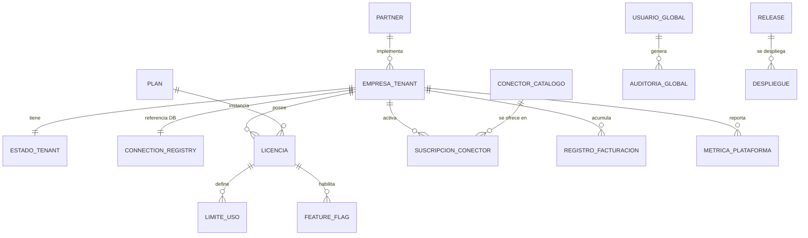
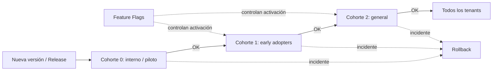
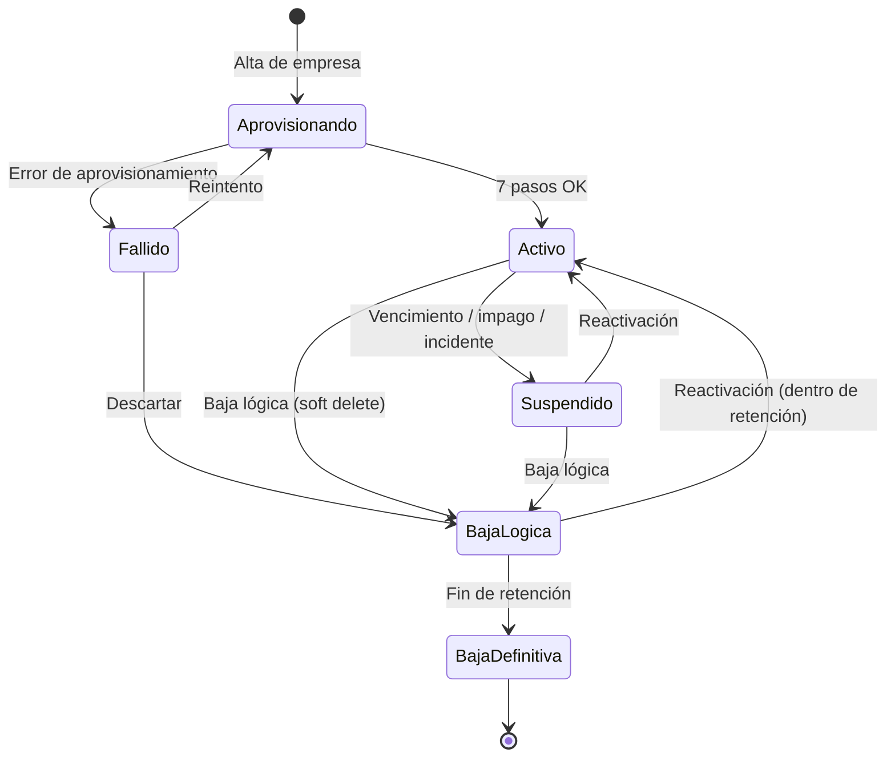

# Control Plane — Plataforma global de administración del proveedor

> **Documento:** `specs/specs/control-plane.md` · **Estado:** Borrador v0.1 · **Actualizado:** 2026-07-11
> **Roles:** Product Manager · Software Architect · UX Designer
> **Relacionados:** [multi-tenancy.md](./multi-tenancy.md) · [integrations.md](./integrations.md) · [architecture.md](./architecture.md) · [security.md](./security.md) · [scalability.md](./scalability.md) · [glossary.md](./glossary.md)

## Resumen ejecutivo

El **Control Plane** es la plataforma global de administración de **Nexo**, usada **exclusivamente por el proveedor** (nunca por las empresas cliente). Es el "puesto de mando" desde donde se gobierna todo el ecosistema multi-tenant: alta y ciclo de vida de empresas, licencias y planes, usuarios globales del proveedor, observabilidad de toda la plataforma, versionado y despliegues, el marketplace de conectores y la facturación. Se apoya en la **Base Global (Control Plane DB)**, la única base de datos compartida de la plataforma, que contiene **solo metadatos del proveedor** y **nunca** datos operativos de producción de los clientes (ver [multi-tenancy.md](./multi-tenancy.md)).

El Control Plane es la contracara administrativa del modelo **DB-per-tenant**: mientras cada empresa opera aislada en su propia base, el proveedor necesita un plano central para orquestar el aprovisionamiento, medir el estado de salud del conjunto, aplicar límites de licencia, desplegar versiones de forma progresiva y ofrecer soporte. Funcionalmente agrupa varios microservicios "global/CP" de la lista canónica: **Tenant Provisioning, Administration & Licensing, Marketplace, Observability** e **Identity & Access** (en su porción global), más la **Auditoría global**. La lista completa está en [architecture.md](./architecture.md).

Este documento describe las **entidades** del Control Plane, las capacidades funcionales de **gestión de empresas**, **gestión de licencias**, **usuarios globales**, **observabilidad**, **administración de versiones**, **marketplace de conectores** y **facturación y métricas**, y formaliza el **ciclo de vida del tenant** mediante un diagrama de estados. El objetivo es que el proveedor pueda operar miles de empresas con control, trazabilidad y seguridad, respetando el aislamiento total definido en [multi-tenancy.md](./multi-tenancy.md) y [security.md](./security.md).

---

## 1. Alcance y principios

- **Uso exclusivo del proveedor.** El Control Plane no es accesible por los tenants. Sus usuarios son roles globales (sección 4).
- **Solo metadatos del proveedor.** La Base Global nunca contiene dato operativo del cliente. La frontera está definida en [multi-tenancy.md](./multi-tenancy.md), sección 4.
- **Orquestador, no operador del negocio del cliente.** El Control Plane crea, mide, limita y da soporte a los tenants; no ejecuta su producción.
- **Fuente de verdad del ecosistema.** El estado del tenant, sus licencias, su ubicación de DB (Tenant Connection Registry) y su versión viven aquí.
- **Seguridad reforzada.** Al concentrar poder sobre todos los tenants, el Control Plane exige MFA obligatorio, mínimo privilegio, break-glass auditado y trazabilidad total (ver [security.md](./security.md)).

---

## 2. Entidades de la Base Global (Control Plane DB)

Modelo conceptual (nombres de negocio, no tablas SQL). Todas las entidades pertenecen al proveedor.

| Entidad (concepto) | Descripción | Servicio responsable |
|---|---|---|
| **Empresa / Tenant** | Cada cliente de la plataforma. Datos comerciales, estado del ciclo de vida, referencia a su DB. | Tenant Provisioning · Administration & Licensing |
| **Estado del tenant** | Situación en el ciclo de vida (aprovisionando, activo, suspendido, baja lógica, etc.). Ver sección 8. | Tenant Provisioning · Observability |
| **Tenant Connection Registry** | Ubicación de la DB del tenant + referencia al secreto de conexión. Núcleo de la resolución de tenant. | Tenant Provisioning |
| **Plan** | Definición comercial (módulos, límites, features enterprise) que se asigna a los tenants. | Administration & Licensing |
| **Licencia** | Instancia de un plan asignada a un tenant: vigencia, vencimiento, límites concretos, módulos habilitados. | Administration & Licensing |
| **Límite de uso (Quota)** | Topes de usuarios, dispositivos, plantas, eventos, storage, etc., derivados de la licencia. | Administration & Licensing |
| **Feature Flag** | Bandera que habilita/inhabilita funcionalidad por plan, tenant, cohorte o entorno. | Administration & Licensing |
| **Usuario global** | Personal del proveedor: Super Administrador, Soporte, Implementador, Partner. | Identity & Access |
| **Partner** | Integrador/implementador y su relación comercial con uno o varios tenants. | Administration & Licensing |
| **Versión / Release** | Versión de un servicio/plataforma, su estado de despliegue y compatibilidad. | Observability · Administration & Licensing |
| **Despliegue (Rollout)** | Ejecución de un despliegue progresivo por cohortes, con posibilidad de rollback. | Observability |
| **Conector (catálogo)** | Entrada del Marketplace: conector oficial/tercero, tipo, versión, compatibilidad. | Marketplace |
| **Suscripción a conector** | Habilitación de un conector del marketplace para un tenant (según su licencia). | Marketplace · Administration & Licensing |
| **Registro de facturación** | Consumo, cargos, ciclos de facturación y su relación con planes/licencias. | Administration & Licensing |
| **Métrica de plataforma** | Indicadores agregados del ecosistema (salud, uso, sincronizaciones, eventos). | Observability |
| **Evento de observabilidad / Log central** | Logs, trazas y eventos centralizados (segmentados por tenant). | Observability |
| **Registro de auditoría global** | Acciones del proveedor sobre tenants (alta, baja, suspensión, cambios de licencia…). | Audit (global) |
| **Configuración global** | Parámetros de plataforma no específicos de un tenant. | Administration & Licensing |

### 2.1 Diagrama conceptual (nivel negocio)

---

## 3. Gestión de empresas (tenants)

El proveedor administra el ciclo comercial y operativo de cada empresa desde el Control Plane. Las operaciones funcionales:

| Operación | Descripción funcional | Efecto sobre el tenant |
|---|---|---|
| **Alta** | Registrar la empresa y disparar el aprovisionamiento (los 7 pasos de [multi-tenancy.md](./multi-tenancy.md), sección 6). | Se crea su DB, migraciones, seed, admin inicial y registro de conexión. |
| **Baja lógica** | Desactivar la empresa sin destruir sus datos (soft delete). | El tenant deja de operar; sus datos se conservan según retención (ver [security.md](./security.md)). |
| **Suspensión** | Bloquear temporalmente el acceso (por impago, incidente o solicitud). | El acceso operativo se corta; la DB se preserva. |
| **Reactivación** | Restaurar una empresa suspendida o dada de baja lógica. | El tenant vuelve a "activo". |
| **Consulta de estado** | Ver el estado del ciclo de vida y la salud del tenant. | Solo lectura. |
| **Info comercial** | Mantener datos comerciales (razón social, contacto, partner asociado, plan). | Metadato del proveedor. |

> Toda operación sobre una empresa queda registrada en la **auditoría global** (ver sección 9 y [security.md](./security.md)).

---

## 4. Usuarios globales del proveedor

El Control Plane es operado por **roles globales** (canónicos). No deben confundirse con los roles operativos del tenant (Operario, Supervisor, etc.), que viven por tenant y se detallan en [users-permissions.md](./users-permissions.md).

| Rol global | Responsabilidad | Alcance típico |
|---|---|---|
| **Super Administrador** | Gobierno total de la plataforma: tenants, licencias, versiones, configuración global. | Máximo privilegio. Acciones sensibles con MFA y auditoría. |
| **Soporte** | Atención y diagnóstico de incidentes de tenants; acceso acotado y auditado (break-glass). | Lectura de estado; acceso temporal a un tenant bajo control. Ver [security.md](./security.md). |
| **Implementador** | Onboarding y configuración inicial de empresas; ejecución de altas y setup. | Alta de tenants, seed, ayuda de puesta en marcha. |
| **Partner** | Integrador externo que implementa/gestiona tenants asignados. | Acceso limitado a las empresas que le corresponden. |

> El modelo de permisos global es **RBAC** con mínimo privilegio; las acciones sobre tenants se rigen por el rol y quedan auditadas. La matriz operativa por tenant está en [users-permissions.md](./users-permissions.md).

---

## 5. Gestión de licencias

La gestión de licencias es la palanca comercial y de control de uso del proveedor. Está a cargo de **Administration & Licensing** y determina qué puede hacer cada tenant.

### 5.1 Elementos de una licencia

| Elemento | Descripción |
|---|---|
| **Plan** | Paquete comercial base (por ejemplo, Starter / Pro / Enterprise) que agrupa módulos y límites. |
| **Alta y vigencia** | Fecha de inicio, período de vigencia y **fecha de vencimiento** de la licencia. |
| **Cantidad de usuarios** | Máximo de usuarios operativos del tenant. |
| **Cantidad de dispositivos** | Máximo de dispositivos (PLCs, dataloggers, gateways, sensores…) registrables. |
| **Cantidad de plantas** | Máximo de plantas (Sites) habilitadas. |
| **Límites de uso** | Topes de eventos/día, storage, jobs de sincronización, retención, etc. |
| **Módulos habilitados** | Qué dominios funcionales se activan (Producción, Calidad, Scrap, Paradas, Trazabilidad, Reglas, Reportes…). |
| **Features enterprise** | Capacidades premium (residencia de datos por región, SSO, IA/visión, SLAs, alta disponibilidad…). |

### 5.2 Aplicación de límites (enforcement)

- Los límites de licencia se traducen en **quotas** que los servicios respetan (por ejemplo, al registrar un dispositivo o crear un usuario en un tenant).
- Los **feature flags** derivados de la licencia habilitan/inhabilitan funcionalidad por tenant/plan/cohorte sin necesidad de desplegar código.
- El **vencimiento** dispara el flujo de suspensión (ver ciclo de vida, sección 8) según la política comercial.
- El estado de consumo vs. límite es **observable** (sección 6) y alimenta **facturación** (sección 7).

---

## 6. Observabilidad de la plataforma

El servicio **Observability** ofrece la visión de salud de **todo** el ecosistema. Es la observabilidad transversal descrita en [architecture.md](./architecture.md), consolidada en el Control Plane. Cubre:

| Área observada | Qué se monitorea | Ejemplos |
|---|---|---|
| **Estado de tenants** | Ciclo de vida y salud por empresa | Activo/suspendido, versión de esquema, último backup, incidentes |
| **Microservicios** | Salud y rendimiento de los servicios de la plataforma | Disponibilidad, latencia, errores, saturación |
| **Conectores** | Estado de los conectores del marketplace en uso | Habilitados, con error, desactualizados |
| **Sincronización con ERPs** | Salud de los Sync Jobs con Odoo y otros ERPs | Éxitos/fallos, reintentos, backlog. Ver [integrations.md](./integrations.md) |
| **Dispositivos** | Salud agregada de dispositivos por tenant | En línea/offline, store-and-forward activo. Ver [devices.md](./devices.md) |
| **Eventos** | Volumen y flujo de eventos canónicos | Eventos/día, picos, backpressure. Ver [scalability.md](./scalability.md) |
| **Logs centralizados** | Logs y trazas segmentados por tenant | Búsqueda, correlación por evento/tenant |
| **Métricas** | Indicadores agregados de plataforma y por tenant | Uso, consumo vs. quota, tendencias |

> Regla de aislamiento: los logs y métricas se **segmentan por tenant**; la observabilidad global agrega sin exponer dato operativo entre clientes (ver [multi-tenancy.md](./multi-tenancy.md) y [security.md](./security.md)).

---

## 7. Administración de versiones

El Control Plane gobierna la evolución técnica de la plataforma, alineado con el principio de despliegue independiente por servicio (ver [architecture.md](./architecture.md)).

| Capacidad | Descripción funcional |
|---|---|
| **Versionado** | Cada servicio y el esquema de tenant tienen versión conocida; se sabe en qué versión está cada tenant. |
| **Despliegues progresivos** | Liberación por **cohortes** (piloto → grupos → total), reduciendo riesgo. Se coordina con las migraciones por tenant de [multi-tenancy.md](./multi-tenancy.md). |
| **Feature flags** | Activación gradual de funcionalidad sin redeploy; por plan, tenant, cohorte o entorno. |
| **Rollbacks** | Reversión controlada de un despliegue o feature ante incidentes. |
| **Compatibilidad** | Gestión de compatibilidad entre versiones de servicios, esquema de tenant y conectores del marketplace. |

### 7.1 Diagrama — despliegue progresivo por cohortes

---

## 8. Ciclo de vida del tenant

El estado del tenant es una entidad de primera clase del Control Plane. Modela toda la vida comercial y operativa de una empresa, desde el aprovisionamiento hasta la baja definitiva.

| Estado | Significado | Transiciones salientes típicas |
|---|---|---|
| **Aprovisionando** | Se está ejecutando el alta (7 pasos). | → Activo (éxito) · → Fallido (error) |
| **Fallido** | El aprovisionamiento no se completó. | → Aprovisionando (reintento) · → Baja lógica |
| **Activo** | La empresa opera normalmente. | → Suspendido · → Baja lógica |
| **Suspendido** | Acceso bloqueado (impago, incidente, solicitud); datos preservados. | → Activo (reactivación) · → Baja lógica |
| **Baja lógica** | Desactivado sin destruir datos (retención vigente). | → Activo (reactivación) · → Baja definitiva |
| **Baja definitiva** | Fin del período de retención; datos y recursos se eliminan de forma segura. | (estado terminal) |

### 8.1 Diagrama de estados del tenant

> Cada transición queda registrada en la **auditoría global** y puede disparar notificaciones (ver [architecture.md](./architecture.md) y [security.md](./security.md)).

---

## 9. Marketplace de conectores

El **Marketplace** es el catálogo global de conectores oficiales y de terceros que las empresas pueden habilitar según su licencia. Es un servicio global/CP: el catálogo es común, pero la **configuración y los datos** de cada conector viven por tenant (ver [integrations.md](./integrations.md) y [multi-tenancy.md](./multi-tenancy.md)).

### 9.1 Categorías del catálogo

| Categoría | Ejemplos (canónicos) |
|---|---|
| **ERPs** | Odoo (primer ERP soportado), y a futuro SAP / Dynamics / Oracle |
| **PLCs** | Siemens S7, PLCs de otros fabricantes |
| **Protocolos** | OPC UA, Modbus, MQTT |
| **Dataloggers** | Dataloggers industriales, ESP32, Arduino, Raspberry Pi |
| **Sensores** | Balanzas, sensores de proceso, cámaras IP/USB |
| **IA** | Visión artificial, OCR, ML (fase futura) |
| **Reportes** | Exportadores y destinos de reportes |

### 9.2 Funciones del Marketplace

- **Catálogo y versionado** de conectores, con compatibilidad respecto a versiones de plataforma y esquema.
- **Certificación** de conectores oficiales vs. de terceros.
- **Suscripción/habilitación** por tenant, sujeta a su licencia y feature flags.
- **Observabilidad** del estado de cada conector en uso (sección 6).

---

## 10. Facturación y métricas

- **Facturación:** el Control Plane consolida el consumo de cada tenant (usuarios, dispositivos, plantas, eventos, storage, conectores) y lo cruza con su plan/licencia para generar los ciclos de facturación. Responsable: **Administration & Licensing**.
- **Métricas de negocio del proveedor:** indicadores agregados del ecosistema (tenants activos, adopción de módulos, uso de conectores, tendencias de consumo) para decisiones comerciales y de producto.
- **Relación con observabilidad:** las métricas de uso provienen de **Observability** (segmentadas por tenant) y se agregan sin violar el aislamiento (ver sección 6 y [multi-tenancy.md](./multi-tenancy.md)).
- **Enforcement comercial:** el consumo vs. límite alimenta alertas de sobreuso y las transiciones de ciclo de vida (por ejemplo, vencimiento → suspensión).

---

## 11. Relación con otros documentos

- **[multi-tenancy.md](./multi-tenancy.md):** modelo DB-per-tenant, Base Global, resolución de tenant, flujo de alta, aislamiento.
- **[integrations.md](./integrations.md):** conectores, ACL, sincronización con ERPs (Odoo y otros).
- **[architecture.md](./architecture.md):** lista canónica de microservicios y **observabilidad transversal**.
- **[security.md](./security.md):** MFA, break-glass, cifrado, retención, auditoría, cumplimiento.
- **[scalability.md](./scalability.md):** metas de escala del ecosistema.
- **[users-permissions.md](./users-permissions.md):** roles operativos por tenant (vs. roles globales de este documento).

---

## Preguntas abiertas

1. **Estructura de planes:** ¿cuáles son los planes comerciales concretos del MVP/V1 (Starter/Pro/Enterprise u otro) y qué módulos/límites incluye cada uno?
2. **Política de vencimiento:** ¿qué período de gracia hay entre vencimiento y suspensión, y entre baja lógica y baja definitiva (retención)?
3. **Break-glass de Soporte:** ¿qué controles, aprobaciones y auditoría gobiernan el acceso temporal de Soporte a la DB de un tenant? (coordinar con [security.md](./security.md)).
4. **Alcance de Partners:** ¿qué puede y qué no puede hacer un Partner sobre los tenants que gestiona? ¿Modelo de comisiones/facturación asociado?
5. **Certificación del Marketplace:** ¿qué proceso valida y certifica conectores de terceros antes de publicarlos?
6. **Facturación:** ¿se factura por consumo (usage-based), por plan fijo, o híbrido? ¿Integración con qué sistema de billing?
7. **Métricas cross-tenant:** ¿qué indicadores agregados necesita el proveedor y cómo se garantizan sin exponer dato operativo entre clientes?
8. **UX del Control Plane:** ¿el Control Plane es una consola web unificada para todos los roles globales o hay experiencias diferenciadas por rol (Soporte vs. Super Admin vs. Partner)?
