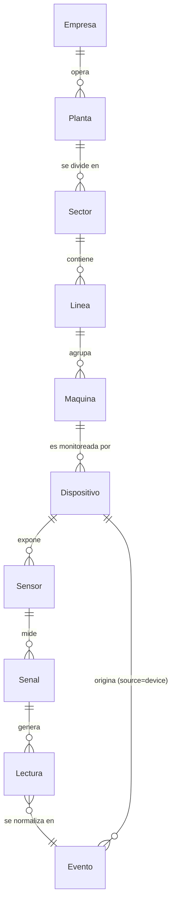
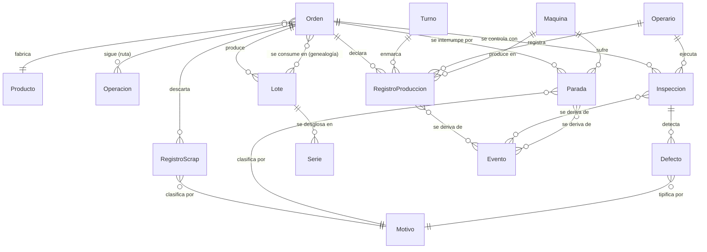
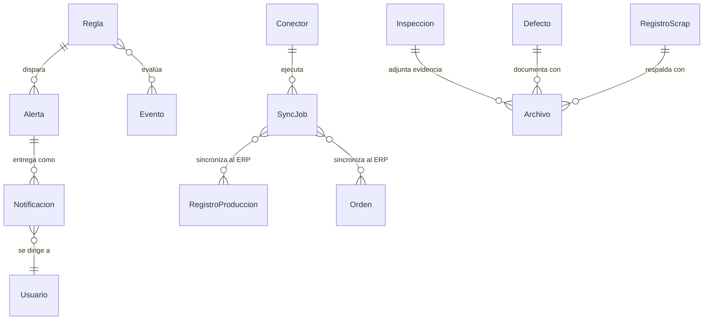
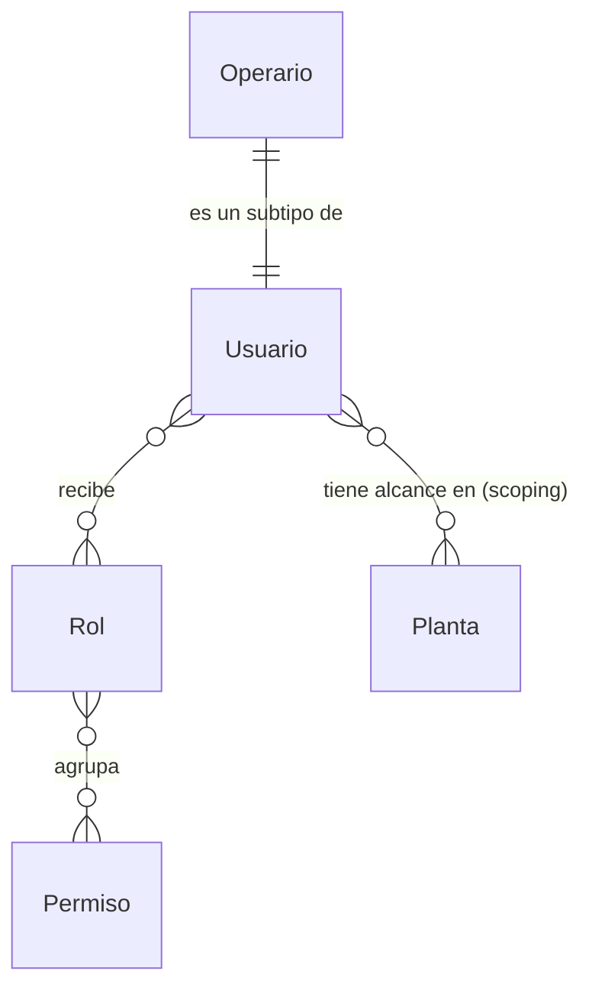
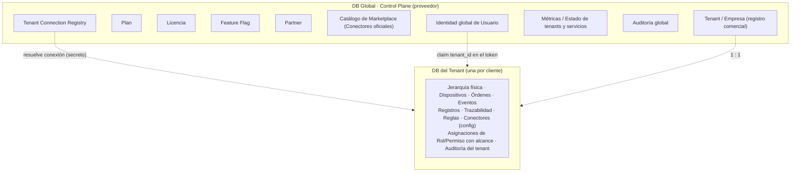

# Modelo de Datos Conceptual (Negocio)

> **Documento:** `specs/specs/data-model.md` · **Estado:** Borrador v0.1 · **Actualizado:** 2026-07-11
> **Roles:** Product Manager · Software Architect · UX Designer
> **Relacionados:** [architecture.md](./architecture.md) · [multi-tenancy.md](./multi-tenancy.md) · [control-plane.md](./control-plane.md) · [production.md](./production.md) · [quality.md](./quality.md) · [scrap.md](./scrap.md) · [downtime.md](./downtime.md) · [devices.md](./devices.md) · [traceability.md](./traceability.md) · [integrations.md](./integrations.md) · [rules-engine.md](./rules-engine.md) · [users-permissions.md](./users-permissions.md) · [data-ingestion.md](./data-ingestion.md) · [glossary.md](./glossary.md)

## Resumen ejecutivo

Este documento define el **modelo de datos conceptual** de Nexo: el vocabulario común de negocio con el que hablan todos los dominios de la plataforma. **No es un diseño físico de base de datos.** Aquí no hay tablas SQL, tipos de columnas ni DDL: se describen **conceptos de negocio** —qué significa cada entidad, qué atributos conceptuales la caracterizan y cómo se relaciona con las demás—. El objetivo es que "Orden de producción", "Lote", "Evento" o "Parada" signifiquen exactamente lo mismo en Producción, Calidad, Trazabilidad, Integraciones y en la conversación con el cliente. El diseño físico (motores, índices, particionamiento, almacenamiento time-series) es responsabilidad de cada microservicio y se aborda en sus documentos y en [scalability.md](./scalability.md).

El modelo se organiza alrededor de una idea central: **todo dato de planta se convierte en un `Evento` canónico normalizado**, y a partir de esos eventos se derivan los **registros de negocio** (producción, scrap, calidad, paradas) y la **genealogía** de materiales (lotes y series). Sobre esa base se apoyan la automatización (reglas y alertas), la integración con el ERP (conectores y jobs de sincronización) y el control de acceso (usuarios, roles y permisos). Las entidades descritas son exactamente las **entidades canónicas** del brief de fundamentos (sección 8); este documento es su definición extendida y la fuente para el resto de las especificaciones.

Un principio arquitectónico atraviesa todo el modelo: la separación entre la **DB Global (Control Plane)** —exclusiva del proveedor, con datos compartidos como empresas/tenants, planes, licencias, feature flags y catálogo de marketplace— y la **DB del tenant** —una por cliente, con todo su dato operativo (plantas, dispositivos, órdenes, eventos, trazabilidad)—. Ninguna entidad operativa de un cliente vive en una base compartida. Por eso, además de describir cada entidad, este documento indica **en qué microservicio (bounded context) vive** y **en qué base de datos reside** (Control Plane vs. tenant), cumpliendo el requisito no negociable de aislamiento por tenant descrito en [multi-tenancy.md](./multi-tenancy.md).

---

## 1. Principios del modelo conceptual

1. **Conceptos, no tablas.** Cada entidad es una noción de negocio con atributos conceptuales y significado. La materialización física (una o varias tablas, un stream, un documento, un read model) es decisión del servicio dueño.
2. **Lenguaje ubicuo (DDD).** Los nombres provienen del glosario y de las entidades canónicas; no se inventan sinónimos. Ver [glossary.md](./glossary.md).
3. **El evento es el átomo.** El `Evento` es la unidad normalizada de la que se derivan los registros de negocio y la trazabilidad. Ver [data-ingestion.md](./data-ingestion.md) y [traceability.md](./traceability.md).
4. **Master data vs. dato transaccional.** Se distingue el dato de configuración relativamente estable (planta, línea, producto, dispositivo, motivos) del dato de flujo de alta cadencia (lecturas, eventos, registros).
5. **Cada entidad tiene un dueño.** Una entidad "vive" en un único bounded context que la gobierna; los demás la referencian, no la duplican como fuente de verdad (bajo acoplamiento, alta cohesión).
6. **Aislamiento por tenant.** El dato operativo reside siempre en la DB del tenant; el Control Plane solo guarda datos compartidos del proveedor. Ver [multi-tenancy.md](./multi-tenancy.md) y [control-plane.md](./control-plane.md).
7. **Referencias, no acoplamiento fuerte.** Las relaciones entre contextos se expresan por referencia lógica (identificadores de negocio), permitiendo que cada servicio evolucione y escale de forma independiente.

---

## 2. Panorama de entidades por dominio

Las entidades canónicas se agrupan en clústeres conceptuales. Cada clúster corresponde aproximadamente a uno o más bounded contexts (ver sección 6).

| Clúster conceptual | Entidades canónicas | Naturaleza |
|---|---|---|
| **Organización y jerarquía física** | Tenant/Empresa, Planta, Sector/Área, Línea, Máquina/Centro de trabajo | Master data del tenant |
| **Captura de datos** | Dispositivo, Sensor, Señal/Tag, Lectura, Evento | Config + dato de alta cadencia |
| **Producto y trabajo** | Producto/SKU, Orden de producción, Operación/Ruta, Turno | Master data + transaccional |
| **Personas y acceso** | Operario, Usuario/Rol/Permiso | Identidad + master data |
| **Registros operativos** | Registro de producción, Registro de scrap, Inspección de calidad, Defecto, Parada, Motivo | Dato transaccional |
| **Trazabilidad** | Lote/Serie (+ Evento como sustrato) | Genealogía |
| **Automatización y notificación** | Regla, Alerta/Alarma, Notificación | Config + eventos derivados |
| **Integración** | Conector, Job de sincronización | Config + transaccional |
| **Evidencia** | Archivo/Media | Adjuntos |
| **Control Plane (proveedor)** | Tenant (registro), Plan, Licencia, Feature Flag, Partner, Catálogo de Marketplace, Registry de conexión, Métricas/Estado, Auditoría global | Datos compartidos del proveedor |

---

## 3. Diagramas conceptuales (Mermaid `erDiagram`)

> Los diagramas son **conceptuales**: muestran entidades y relaciones de negocio con su cardinalidad, no columnas ni tipos. Los nombres se escriben en token único por compatibilidad de render; entre paréntesis va la denominación canónica cuando difiere.

### 3.1 Jerarquía física y captura de datos (DB del tenant)

### 3.2 Trabajo, personas, registros operativos y trazabilidad (DB del tenant)

### 3.3 Automatización, integración y evidencia (DB del tenant)

### 3.4 Acceso y frontera Control Plane ↔ Tenant

---

## 4. Entidades canónicas — definición conceptual

Para cada entidad: **significado**, **atributos conceptuales** (nociones de negocio, sin tipos SQL), **relaciones** principales y **ubicación** (servicio dueño + base de datos). Ver el mapeo consolidado en la sección 6 y 7.

### 4.1 Organización y jerarquía física

#### Tenant / Empresa
- **Significado:** cliente de la plataforma. Es la unidad de aislamiento: **una DB por tenant**. Tiene una doble cara: un **registro comercial** en el Control Plane y una **configuración operativa** dentro de su propia DB.
- **Atributos conceptuales:** identidad del tenant; denominación/razón social; identificador comercial; estado (en alta, activo, suspendido, dado de baja); plan contratado; datos de contacto; zona horaria y localización por defecto; referencia a la conexión de su DB (en el Registry, dato del Control Plane).
- **Relaciones:** opera una o más `Planta`; agrupa a sus `Usuarios`; posee `Conectores` y toda su operación.
- **Ubicación:** registro comercial y estado → **Control Plane** (servicios Tenant Provisioning + Administration & Licensing). Configuración operativa → **DB del tenant**.

#### Planta (Site)
- **Significado:** instalación física de la empresa donde ocurre la producción.
- **Atributos conceptuales:** identidad; denominación; ubicación geográfica/dirección; zona horaria; estado (activa/inactiva); referencia a la `Empresa`.
- **Relaciones:** pertenece a una `Empresa`; se divide en `Sectores`; es unidad de **scoping** de acceso (un usuario puede tener alcance a una planta).
- **Ubicación:** master data de la **DB del tenant**.

#### Sector / Área
- **Significado:** subdivisión funcional de una planta (p. ej. mecanizado, envasado, pintura).
- **Atributos conceptuales:** identidad; denominación; referencia a la `Planta`; estado.
- **Relaciones:** pertenece a una `Planta`; contiene `Líneas`.
- **Ubicación:** master data de la **DB del tenant**.

#### Línea (Line)
- **Significado:** línea de producción dentro de un sector; agrupa recursos productivos que trabajan coordinadamente.
- **Atributos conceptuales:** identidad; denominación; referencia al `Sector`; capacidad/velocidad nominal (referencial); estado.
- **Relaciones:** pertenece a un `Sector`; agrupa `Máquinas`; es unidad de **scoping** de acceso.
- **Ubicación:** master data de la **DB del tenant**.

#### Máquina / Centro de trabajo (Work Center / Asset)
- **Significado:** recurso productivo concreto (una máquina, una estación de trabajo, un centro). Es donde se declara producción y donde ocurren las paradas.
- **Atributos conceptuales:** identidad; denominación; tipo/categoría de activo; referencia a la `Línea`; parámetros de referencia (tiempo de ciclo ideal, unidad de medida productiva); estado operativo (en marcha, detenida, en mantenimiento); datos de identificación del activo (para MTBF/MTTR).
- **Relaciones:** pertenece a una `Línea`; es monitoreada por uno o más `Dispositivos`; produce `Registros de producción`; sufre `Paradas`.
- **Ubicación:** master data de la **DB del tenant** (consumida por Production, Devices, Downtime).

### 4.2 Captura de datos

#### Dispositivo (Device)
- **Significado:** hardware de captura que conecta el mundo físico con Nexo (PLC Siemens S7, otros PLC, datalogger, ESP32, Arduino, Raspberry Pi, gateway, cámara).
- **Atributos conceptuales:** identidad; denominación; tipo de dispositivo; protocolo(s) soportado(s) (OPC UA, Modbus, MQTT, S7…); versión de firmware; estado de salud (en línea, degradado, fuera de línea); última vez visto; referencia a la `Máquina`/`Línea` que monitorea; datos de aprovisionamiento/OTA.
- **Relaciones:** monitorea una `Máquina`; expone `Sensores`; origina `Eventos` con `source=device`.
- **Ubicación:** servicio **Devices**, **DB del tenant**.

#### Sensor
- **Significado:** punto de medición asociado a un dispositivo/máquina (termocupla, celda de carga, encoder, fin de carrera).
- **Atributos conceptuales:** identidad; denominación; magnitud física medida; unidad de medida; rango válido/tolerancias; referencia al `Dispositivo`; estado/calibración.
- **Relaciones:** pertenece a un `Dispositivo`; mide una o más `Señales`.
- **Ubicación:** servicio **Devices**, **DB del tenant**.

#### Señal / Tag
- **Significado:** variable concreta que se lee (temperatura, contador de piezas, estado de máquina, presión). Es el "punto de datos" configurado.
- **Atributos conceptuales:** identidad; nombre de la señal/tag; tipo de dato lógico (numérico, booleano, estado); unidad; frecuencia/modo de muestreo (por sondeo, por cambio, por evento); dirección de mapeo (dirección lógica en el dispositivo); umbrales de referencia; referencia al `Sensor`/`Dispositivo`.
- **Relaciones:** pertenece a un `Sensor`; genera `Lecturas`.
- **Ubicación:** servicio **Devices**, **DB del tenant**.

#### Lectura (Reading)
- **Significado:** muestra puntual del valor de una señal en un instante. Es el dato de **más alta cadencia** del sistema.
- **Atributos conceptuales:** referencia a la `Señal`; valor medido; marca temporal de la muestra; **calidad del dato** (buena, sospechosa, sustituida, interpolada); referencia al `Dispositivo` de origen.
- **Relaciones:** pertenece a una `Señal`; se normaliza en un `Evento` (típicamente `type=reading`).
- **Ubicación:** servicio **Devices / Ingestion**; se persiste como serie temporal en la **DB del tenant** (almacenamiento time-series). Ver [data-ingestion.md](./data-ingestion.md) y [scalability.md](./scalability.md).

#### Evento (Event)
- **Significado:** **unidad normalizada canónica del sistema.** Todo hecho relevante (producción, scrap, calidad, parada, lectura, evento de máquina, personalizado) se expresa como un evento inmutable. Es el sustrato de la trazabilidad.
- **Atributos conceptuales (esquema canónico, ver 8.1 del brief):** `event_id`; `tenant_id`; marca de tiempo (ocurrencia e ingesta); `source` (device/manual/api/file); `device_id?`; ubicación (`site`/`line`/`asset`); `type` (production | scrap | quality | downtime | reading | machine_event | custom); `payload` normalizado; `operator_id?`; `shift?`; `origin_metadata` (protocolo, firmware, calidad del dato); `dedup_key`. **Inmutable una vez ingerido.**
- **Relaciones:** originado por `Dispositivo`/`Operario`/`Sistema externo`/`Archivo`; se deriva en `Registros` de negocio; es evaluado por `Reglas`; enlaza `Lote`/`Serie` para la genealogía.
- **Ubicación:** normalizado por **Ingestion / Edge Gateway**; persistido por **Traceability / Event Store** en el event store append-only de la **DB del tenant**. Ver [traceability.md](./traceability.md).

### 4.3 Producto y trabajo

#### Producto / SKU
- **Significado:** ítem que se fabrica; se sincroniza típicamente desde el ERP.
- **Atributos conceptuales:** identidad; código/SKU; denominación; unidad de medida; familia/categoría; especificaciones de calidad de referencia; tiempo de ciclo ideal; referencia externa al ERP.
- **Relaciones:** es fabricado por `Órdenes`; asociado a `Inspecciones` (especificaciones); asociado a `Lotes`/`Series`.
- **Ubicación:** servicio **Production**, **DB del tenant** (origen frecuente: ERP vía **Connectors**).

#### Orden de producción (Work Order / MO)
- **Significado:** orden a ejecutar en planta; unidad de trabajo que se sincroniza con el ERP. Contextualiza casi todo el dato operativo.
- **Atributos conceptuales:** identidad; número/código de orden; referencia al `Producto`; cantidad planificada; fechas (planificada, inicio real, fin real); estado (planificada, liberada, en curso, pausada, cerrada); referencia a `Máquina`/`Línea`; referencia externa al ERP; prioridad.
- **Relaciones:** fabrica un `Producto`; sigue una `Operación/Ruta`; declara `Registros de producción`/`scrap`; se controla con `Inspecciones`; se interrumpe por `Paradas`; produce `Lotes`/`Series`; se sincroniza vía `Sync Job`.
- **Ubicación:** servicio **Production**, **DB del tenant**.

#### Operación / Ruta
- **Significado:** paso o secuencia de pasos del proceso productivo (la "hoja de ruta"), cada uno realizado en un centro de trabajo.
- **Atributos conceptuales:** identidad; denominación del paso; secuencia/orden; referencia al `Centro de trabajo` sugerido; tiempo estándar; parámetros/instrucciones.
- **Relaciones:** pertenece a una `Orden`/`Producto`; se ejecuta en una `Máquina`.
- **Ubicación:** servicio **Production**, **DB del tenant**.

#### Turno (Shift)
- **Significado:** franja horaria de trabajo; enmarca temporalmente la producción y habilita KPIs por turno.
- **Atributos conceptuales:** identidad; denominación (mañana/tarde/noche…); hora de inicio/fin; días de vigencia; referencia a `Planta`/`Línea`; calendario asociado.
- **Relaciones:** enmarca `Registros de producción`, `Paradas` e `Inspecciones`; asociado a `Operarios`.
- **Ubicación:** servicio **Production**, **DB del tenant**.

### 4.4 Personas y acceso

#### Operario (Operator)
- **Significado:** usuario que opera en planta; **subtipo de Usuario** con perfil orientado a captura desde tablet/terminal.
- **Atributos conceptuales:** identidad (heredada de `Usuario`); legajo/identificador de planta; método de identificación rápida en terminal (PIN/credencial); referencia a `Planta`/`Línea` de trabajo; turno habitual.
- **Relaciones:** es un `Usuario`; registra `Registros de producción`/`scrap`; ejecuta `Inspecciones`; declara `Paradas`.
- **Ubicación:** identidad en **Identity & Access** (Control Plane); perfil operativo y **alcance por planta/línea** en la **DB del tenant**.

#### Usuario / Rol / Permiso
- **Significado:** modelo de acceso. **Usuario** es la identidad; **Rol** agrupa capacidades; **Permiso** es la capacidad atómica sobre un recurso/acción. Modelo **RBAC** con **scoping** por planta/línea y extensiones **ABAC**. Ver [users-permissions.md](./users-permissions.md).
- **Atributos conceptuales:**
  - *Usuario:* identidad; nombre; correo; estado; método(s) de autenticación; referencia al tenant (claim); roles asignados; alcance (plantas/líneas).
  - *Rol:* identidad; denominación (Operario, Supervisor, Calidad, Producción, Mantenimiento, Gerencia, Administrador, Integraciones…); conjunto de permisos; si es de sistema o personalizado.
  - *Permiso:* identidad; recurso; acción (ver/crear/editar/aprobar/exportar…); condiciones ABAC opcionales.
- **Relaciones:** `Usuario` recibe `Roles`; `Rol` agrupa `Permisos`; `Usuario` tiene alcance en `Plantas`/`Líneas`.
- **Ubicación:** **Identity & Access**. Identidad global de usuario y credenciales → **Control Plane**; **asignaciones de rol/permiso y scoping por tenant** → **DB del tenant**. (Frontera exacta a confirmar; ver Preguntas abiertas.)

### 4.5 Registros operativos

#### Registro de producción (Production Record)
- **Significado:** cantidad producida en un contexto (orden/máquina/turno). Se **deriva de eventos** de conteo/declaración.
- **Atributos conceptuales:** identidad; referencia a `Orden`/`Máquina`/`Turno`/`Operario`; cantidad producida (buena); unidad de medida; marca temporal/ventana; referencia a los `Eventos` origen; referencia a `Lote`/`Serie` producido; estado de sincronización con el ERP.
- **Relaciones:** pertenece a una `Orden`; producido en una `Máquina`; enmarcado por `Turno`; registrado por `Operario`; sincronizado vía `Sync Job`.
- **Ubicación:** servicio **Production**, **DB del tenant**.

#### Registro de scrap (Scrap Record)
- **Significado:** cantidad descartada, con motivo y costo asociado. Ver [scrap.md](./scrap.md).
- **Atributos conceptuales:** identidad; referencia a `Orden`/`Máquina`/`Turno`/`Operario`; cantidad descartada; unidad; **referencia al `Motivo`**; costo asociado (material/proceso); clasificación (retrabajable/desecho); marca temporal; referencia a `Eventos` origen y a `Lote`/`Serie`; evidencia (`Archivo`).
- **Relaciones:** pertenece a una `Orden`; clasificado por `Motivo`; respaldado por `Archivos`.
- **Ubicación:** servicio **Scrap**, **DB del tenant**.

#### Inspección de calidad (Quality Inspection)
- **Significado:** control de calidad con variables/checklist y resultado. Ver [quality.md](./quality.md).
- **Atributos conceptuales:** identidad; referencia a `Orden`/`Producto`/`Máquina`/`Operario`/`Turno`; tipo de control (por variables, por atributos/checklist); valores medidos y tolerancias; resultado (aprobado/rechazado/condicional); disposición (aceptar/retrabajar/desechar/cuarentena); marca temporal; referencia a `Eventos` origen; evidencia (`Archivo`).
- **Relaciones:** controla una `Orden`/`Producto`; detecta `Defectos`; adjunta `Archivos`; asociada a `Lote`/`Serie`.
- **Ubicación:** servicio **Quality**, **DB del tenant**.

#### Defecto (Defect)
- **Significado:** no conformidad concreta detectada en una inspección.
- **Atributos conceptuales:** identidad; referencia a la `Inspección`; **tipo/`Motivo`** (código de defecto); severidad; cantidad afectada; ubicación/descripción; referencia a `Lote`/`Serie`; evidencia (`Archivo`).
- **Relaciones:** detectado en una `Inspección`; tipificado por `Motivo`; documentado con `Archivos`.
- **Ubicación:** servicio **Quality**, **DB del tenant**.

#### Parada (Downtime Event)
- **Significado:** detención de una máquina (programada o no programada), con su motivo. Insumo de MTBF/MTTR y de la Disponibilidad del OEE. Ver [downtime.md](./downtime.md).
- **Atributos conceptuales:** identidad; referencia a `Máquina`/`Línea`/`Turno`; marca de inicio y fin; duración; clasificación (programada/no programada, planificada/falla); **referencia al `Motivo`**; referencia a `Eventos` origen (automáticos o declarados); comentario/operario que la clasificó.
- **Relaciones:** afecta a una `Máquina`; clasificada por `Motivo`; enmarcada por `Turno`; derivada de `Eventos`.
- **Ubicación:** servicio **Downtime (Paradas)**, **DB del tenant**.

#### Motivo (Reason Code)
- **Significado:** código catalogado que clasifica una parada, un scrap o un defecto. Catálogo semilla del tenant (paso 4 del alta), extensible por el cliente.
- **Atributos conceptuales:** identidad; código; denominación; categoría (parada/scrap/defecto); agrupador/jerarquía (p. ej. familia de causas); estado (activo/inactivo); indicadores (planificado, imputable, etc.).
- **Relaciones:** clasifica `Paradas`, `Registros de scrap` y `Defectos`.
- **Ubicación:** catálogo de la **DB del tenant** (referenciado por Downtime, Scrap y Quality). Ver Preguntas abiertas sobre propiedad del catálogo.

### 4.6 Trazabilidad

#### Lote (Batch/Lot)
- **Significado:** agrupación de producto fabricado bajo condiciones homogéneas; unidad de trazabilidad típica de procesos por lote/continuos. Ver [traceability.md](./traceability.md).
- **Atributos conceptuales:** identidad; código de lote; referencia al `Producto`; referencia a la `Orden` que lo produjo; cantidad; fecha/ventana de fabricación; estado (liberado, en cuarentena, bloqueado); referencias de genealogía (lotes de insumo consumidos).
- **Relaciones:** producido por una `Orden`; se desglosa en `Series`; se consume como insumo en otras `Órdenes` (genealogía); asociado a `Inspecciones`.
- **Ubicación:** servicio **Traceability / Event Store**, **DB del tenant** (referenciado por Production y Quality).

#### Serie (Serial)
- **Significado:** identificador único de una pieza individual; unidad de trazabilidad en producción discreta.
- **Atributos conceptuales:** identidad; número de serie; referencia al `Lote` (si aplica) y al `Producto`; referencia a la `Orden`; estado; historia asociada (eventos e inspecciones de esa pieza).
- **Relaciones:** pertenece a un `Lote`; producida por una `Orden`; asociada a `Inspecciones`/`Defectos`; participa de la genealogía forward/backward.
- **Ubicación:** servicio **Traceability / Event Store**, **DB del tenant**.

### 4.7 Automatización y notificación

#### Regla (Rule)
- **Significado:** automatización **trigger–condición–acción** que se evalúa en tiempo real sobre eventos/lecturas. Ver [rules-engine.md](./rules-engine.md).
- **Atributos conceptuales:** identidad; denominación; trigger (tipo de evento/umbral/ventana temporal); condición(es) lógicas; acción(es) (generar alerta, notificar, bloquear disposición, crear tarea); estado (activa/inactiva); alcance (planta/línea/máquina); prioridad.
- **Relaciones:** evalúa `Eventos`; dispara `Alertas`.
- **Ubicación:** servicio **Rules Engine**, **DB del tenant**.

#### Alerta / Alarma (Alert)
- **Significado:** condición notificable disparada por una regla o umbral.
- **Atributos conceptuales:** identidad; referencia a la `Regla` origen; severidad; estado (abierta, reconocida, resuelta); marca temporal; contexto (máquina/línea/orden); evento(s) que la dispararon.
- **Relaciones:** disparada por una `Regla`; se entrega como `Notificaciones`.
- **Ubicación:** servicio **Rules Engine**, **DB del tenant**.

#### Notificación (Notification)
- **Significado:** mensaje entregado por un canal (email, push, SMS, webhook…) a partir de una alerta o proceso.
- **Atributos conceptuales:** identidad; referencia a la `Alerta`/origen; canal; destinatario(s) (`Usuario`/rol); plantilla; estado de entrega (pendiente, enviada, fallida, escalada); marcas temporales; reintentos.
- **Relaciones:** deriva de una `Alerta`; dirigida a `Usuarios`.
- **Ubicación:** servicio **Notifications** (compartido, **config por tenant**); el registro de entrega se segmenta por tenant. Ver [notifications.md](./notifications.md).

### 4.8 Integración

#### Conector (Connector)
- **Significado:** integración con un sistema externo/ERP (primer ERP: Odoo). Encapsula el **Anti-Corruption Layer** y los mapeos. Ver [integrations.md](./integrations.md).
- **Atributos conceptuales:** identidad; tipo/proveedor (Odoo, SAP…); referencia al ítem del **Catálogo de Marketplace**; configuración de conexión (credenciales gestionadas como secreto); mapeos de entidades (Producto↔producto ERP, Orden↔MO…); estado (activo, con error, deshabilitado); dirección (entrada/salida/bidireccional).
- **Relaciones:** ejecuta `Sync Jobs`; referencia un ítem del catálogo (Marketplace, CP).
- **Ubicación:** **config del tenant** en la **DB del tenant** (servicio **Connectors / Integrations**); el **catálogo** de conectores disponibles vive en **Marketplace** (Control Plane).

#### Job de sincronización (Sync Job)
- **Significado:** ejecución concreta de una sincronización con el ERP (envío o recepción de datos). Cierra la cadena de trazabilidad hacia el ERP.
- **Atributos conceptuales:** identidad; referencia al `Conector`; entidad/registro sincronizado (`Registro de producción`, `Orden`…); dirección; estado (pendiente, en curso, completado, fallido, reintentando); intentos y política de backoff; **referencia externa devuelta por el ERP**; marcas temporales; detalle de error.
- **Relaciones:** ejecutado por un `Conector`; sincroniza `Registros`/`Órdenes`; correlaciona con `Eventos`/`Registros` origen (trazabilidad).
- **Ubicación:** servicio **Connectors / Integrations**, **DB del tenant** (con estado/métricas espejadas en **Observability** del Control Plane).

### 4.9 Evidencia

#### Archivo / Media (File / Media)
- **Significado:** evidencia adjunta: foto de un defecto, imagen de una cámara, CSV importado, documento de respaldo.
- **Atributos conceptuales:** identidad; tipo (imagen, documento, dataset); referencia a la entidad que lo adjunta (`Inspección`, `Defecto`, `Scrap`, `Evento`); metadatos (autor, marca temporal, origen); referencia al objeto en el storage aislado del tenant.
- **Relaciones:** adjunto a `Inspecciones`, `Defectos`, `Registros de scrap`, `Eventos`.
- **Ubicación:** servicio **Files / Media** (**storage aislado por tenant**); los **metadatos** se referencian desde la **DB del tenant**.

### 4.10 Entidades del Control Plane (proveedor)

> Estas entidades pertenecen exclusivamente a la **DB Global (Control Plane)** y **nunca** contienen dato operativo de producción del cliente. Ver [control-plane.md](./control-plane.md).

| Entidad | Significado | Atributos conceptuales | Servicio dueño |
|---|---|---|---|
| **Tenant (registro)** | Ficha comercial y de estado de cada empresa cliente. | Identidad; razón social; plan; estado del ciclo de vida; datos comerciales; referencia a su conexión. | Tenant Provisioning / Administration & Licensing |
| **Plan** | Paquete comercial contratable. | Identidad; denominación; límites/cuotas; features incluidos; precio de referencia. | Administration & Licensing |
| **Licencia** | Derecho de uso vigente de un tenant. | Identidad; tenant; plan; vigencia; estado; límites efectivos. | Administration & Licensing |
| **Feature Flag** | Interruptor de funcionalidad por plan/tenant. | Identidad; clave; alcance; estado; reglas de exposición. | Administration & Licensing |
| **Partner** | Socio/implementador asociado a tenants. | Identidad; denominación; tipo; tenants asociados. | Administration & Licensing |
| **Catálogo de Marketplace** | Conectores oficiales/terceros disponibles. | Identidad; nombre; proveedor; versión; compatibilidad; estado de publicación. | Marketplace |
| **Tenant Connection Registry** | Mapa tenant → cadena de conexión de su DB (secreto). | Identidad de tenant; referencia al secreto de conexión; ubicación/clúster. | Tenant Provisioning |
| **Métricas / Estado** | Salud de tenants, servicios y conectores. | Estado por tenant/servicio/conector; métricas agregadas; logs/trazas. | Observability |
| **Auditoría global** | Acciones administrativas de nivel proveedor. | Actor global; acción; objeto; marca temporal. | Audit (espejo global) |
| **Identidad global de Usuario** | Cuenta y credenciales de acceso. | Identidad; credenciales; método(s) de auth; claim de tenant. | Identity & Access |

---

## 5. Relaciones clave (resumen)

| Relación | Cardinalidad | Significado de negocio |
|---|---|---|
| Empresa → Planta → Sector → Línea → Máquina | 1:N encadenado | Jerarquía física/organizacional del tenant. |
| Máquina → Dispositivo → Sensor → Señal → Lectura | 1:N encadenado | Cadena de captura del dato físico. |
| Lectura → Evento | N:1 (normalización) | Toda lectura relevante se expresa como evento canónico. |
| Evento → Registro (producción/scrap/inspección/parada) | 1:N / N:M | Los registros de negocio se derivan de eventos (proyección). |
| Orden → Producto | N:1 | La orden fabrica un producto/SKU. |
| Orden → Registros / Inspecciones / Paradas / Lotes | 1:N | La orden contextualiza toda la operación. |
| Lote → Serie | 1:N | Un lote se desglosa en piezas serializadas. |
| Lote ↔ Orden (consume) | N:M | Genealogía: lotes de insumo consumidos por órdenes. |
| Motivo → Parada/Scrap/Defecto | 1:N | Catálogo de causas que clasifica los registros. |
| Regla → Alerta → Notificación | 1:N encadenado | De la automatización a la entrega del aviso. |
| Conector → Sync Job → (ERP) | 1:N | Ejecución de sincronizaciones y correlación con el ERP. |
| Usuario ↔ Rol ↔ Permiso | N:M / N:M | Modelo RBAC con scoping por planta/línea. |
| Operario → Usuario | subtipo | El operario es un usuario con perfil de planta. |

---

## 6. Mapeo entidad → bounded context / microservicio

Cada entidad "vive" (es gobernada) en un bounded context de la lista canónica (brief 5.1). Los demás servicios la **referencian**.

| Entidad canónica | Bounded context dueño | Notas |
|---|---|---|
| Tenant/Empresa (registro) | Tenant Provisioning + Administration & Licensing | Cara comercial en CP. |
| Tenant/Empresa (config operativa) | Administración del tenant (config) | En DB del tenant. |
| Planta, Sector, Línea | Master data del tenant (config) | Consumida por Production/Devices/Quality/Downtime. Ver Preguntas abiertas. |
| Máquina / Centro de trabajo | Production (uso productivo) + Devices (vínculo hardware) | Recurso productivo; monitoreada por dispositivos. |
| Dispositivo, Sensor, Señal, Lectura | Devices (+ Ingestion para el flujo) | Config y salud en Devices; lecturas como time-series. |
| Evento | Traceability / Event Store (persistencia) + Ingestion (normalización) | Sustrato canónico. |
| Producto/SKU | Production | Origen frecuente: ERP vía Connectors. |
| Orden de producción | Production | Sincronizada con ERP. |
| Operación/Ruta | Production | Hoja de ruta. |
| Turno | Production | Marco temporal de KPIs. |
| Operario | Identity & Access (identidad) + tenant (perfil) | Subtipo de Usuario. |
| Usuario/Rol/Permiso | Identity & Access | Identidad en CP; asignaciones/scoping en tenant. |
| Registro de producción | Production | Derivado de eventos. |
| Registro de scrap | Scrap | Motivo + costo. |
| Inspección de calidad | Quality | Checklist/variables + disposición. |
| Defecto | Quality | No conformidad. |
| Parada (Downtime) | Downtime (Paradas) | MTBF/MTTR, Disponibilidad. |
| Motivo (Reason Code) | Catálogo del tenant (usado por Scrap/Downtime/Quality) | Semilla del alta. |
| Lote / Serie | Traceability / Event Store | Genealogía; referenciada por Production/Quality. |
| Regla | Rules Engine | Trigger-condición-acción. |
| Alerta/Alarma | Rules Engine | Deriva en notificación. |
| Notificación | Notifications | Compartido, config por tenant. |
| Conector | Connectors / Integrations (config) + Marketplace (catálogo) | ACL + mapeos. |
| Sync Job | Connectors / Integrations | Correlación con ERP; estado espejado en Observability. |
| Archivo/Media | Files / Media | Storage aislado por tenant; metadatos en tenant. |
| Auditoría (acciones) | Audit | Por tenant (+ espejo CP). |
| Plan, Licencia, Feature Flag, Partner | Administration & Licensing | Solo CP. |
| Catálogo de Marketplace | Marketplace | Solo CP. |
| Tenant Connection Registry, Estado/Métricas | Tenant Provisioning / Observability | Solo CP. |

---

## 7. Ubicación del dato: Control Plane vs. DB del tenant

El principio no negociable: **el dato operativo del cliente vive en su DB de tenant; el Control Plane solo guarda datos compartidos del proveedor.** Ver [multi-tenancy.md](./multi-tenancy.md) y [control-plane.md](./control-plane.md).

### 7.1 DB Global (Control Plane) — solo datos compartidos del proveedor

- **Tenant/Empresa** (registro comercial y estado), **Plan**, **Licencia**, **Feature Flag**, **Partner**.
- **Identidad global de Usuario** (cuenta/credenciales) y claim de tenant.
- **Catálogo de Marketplace** (conectores disponibles).
- **Tenant Connection Registry** (mapa tenant → conexión, gestionado como secreto).
- **Métricas/Estado** de tenants, servicios y conectores (**Observability**).
- **Auditoría global** (acciones de nivel proveedor).
- **Nunca:** producción, scrap, calidad, paradas, dispositivos, eventos, lotes/series, archivos ni configuración operativa de clientes.

### 7.2 DB del Tenant — todo el dato operativo (una por cliente)

- **Jerarquía física:** Planta, Sector, Línea, Máquina.
- **Captura:** Dispositivo, Sensor, Señal, Lectura (time-series), **Evento** (event store inmutable).
- **Trabajo:** Producto/SKU, Orden, Operación/Ruta, Turno.
- **Registros operativos:** Registro de producción, Registro de scrap, Inspección, Defecto, Parada, Motivo (catálogo).
- **Trazabilidad:** Lote, Serie, genealogía.
- **Automatización:** Regla, Alerta.
- **Integración:** Conector (config), Sync Job.
- **Acceso operativo:** asignaciones de Rol/Permiso y **scoping** por planta/línea; perfil de Operario.
- **Evidencia:** metadatos de Archivo/Media (los objetos, en storage aislado del tenant).
- **Auditoría del tenant.**

### 7.3 Entidades con doble residencia (aclaración)

Algunas entidades tienen una parte en cada lado; esto **no** viola el aislamiento porque la porción en el Control Plane es metadato/config, no dato operativo:

| Entidad | Parte en Control Plane | Parte en DB del tenant |
|---|---|---|
| **Tenant/Empresa** | Registro comercial, plan, estado, conexión. | Configuración operativa (plantas, catálogos, etc.). |
| **Usuario** | Identidad global, credenciales, claim de tenant. | Asignaciones de rol/permiso y scoping. |
| **Conector** | Ítem del catálogo (Marketplace). | Configuración, mapeos y credenciales del tenant. |
| **Sync Job / Conector (estado)** | Métricas/estado agregado (Observability). | Ejecuciones y detalle por tenant. |
| **Notificación** | Config/plantillas compartidas. | Registro de entrega segmentado por tenant. |
| **Auditoría** | Acciones globales del proveedor. | Acciones dentro del tenant. |

---

## Preguntas abiertas

1. **Propiedad de la jerarquía física.** Planta/Sector/Línea/Máquina son master data usada por varios contextos, pero no hay un microservicio canónico "Sites/Assets". ¿Se crea un contexto de configuración/administración del tenant que la gobierne, o se reparte entre Production y Devices?
2. **Frontera exacta de acceso (Identity & Access).** ¿Qué parte de Usuario/Rol/Permiso vive en el Control Plane (identidad) y qué parte en la DB del tenant (asignaciones y scoping)? Definir con [users-permissions.md](./users-permissions.md) y [security.md](./security.md).
3. **Propiedad del catálogo de Motivos.** ¿Es un único catálogo transversal del tenant o cada dominio (Scrap/Downtime/Quality) mantiene su propio subconjunto de reason codes?
4. **Producto/SKU y Orden: fuente de verdad.** Cuando existen en el ERP, ¿Nexo los replica como referencia (read-only) o puede crearlos/editarlos y empujarlos al ERP? Impacta la dirección de los `Sync Jobs` (ver [integrations.md](./integrations.md)).
5. **Modelo de Lectura vs. Evento.** ¿Toda lectura se materializa como evento, o solo las relevantes/agregadas, conservando el detalle de alta cadencia solo en el almacén time-series? Impacta volumen y costo (ver [scalability.md](./scalability.md) y [data-ingestion.md](./data-ingestion.md)).
6. **Genealogía de mezclas.** ¿Cómo se modela conceptualmente la relación Lote↔Orden cuando hay mezcla continua (silos/tanques) y no una relación discreta insumo→salida?
7. **Nombre del producto.** "Nexo" es un working name provisional; confirmar antes de fijar terminología de marca en el modelo y la UI.
8. **Extensibilidad del modelo por tenant.** ¿Se permiten atributos personalizados por cliente (campos definidos por el tenant) sobre entidades como Orden, Producto o Inspección, y cómo se concilian con el modelo canónico compartido?
