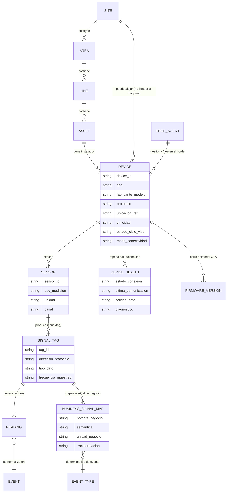
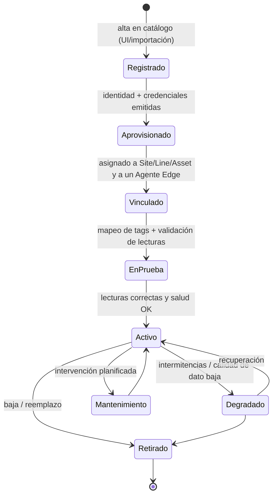
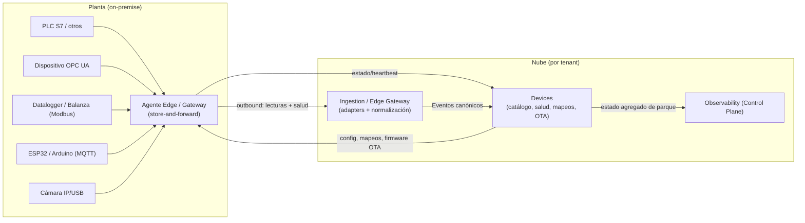
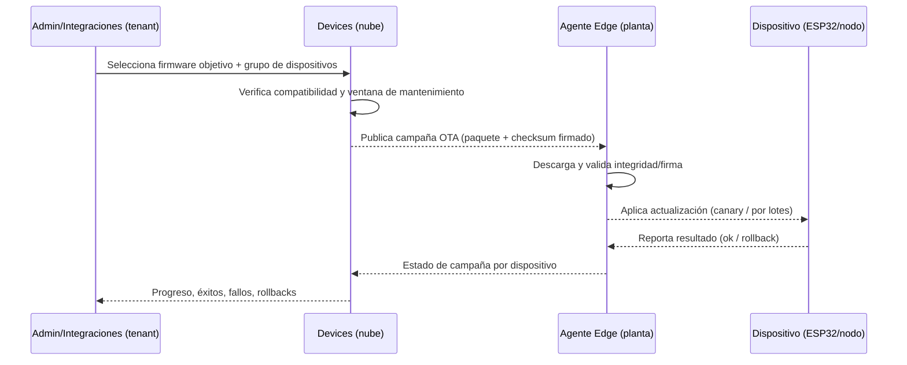

# Dispositivos (Devices)

> **Documento:** `specs/specs/devices.md` · **Estado:** Borrador v0.1 · **Actualizado:** 2026-07-11
> **Roles:** Product Manager · Software Architect · UX Designer
> **Relacionados:** [data-ingestion.md](./data-ingestion.md) · [integrations.md](./integrations.md) · [security.md](./security.md) · [architecture.md](./architecture.md) · [data-model.md](./data-model.md) · [scalability.md](./scalability.md) · [glossary.md](./glossary.md)

## Resumen ejecutivo

El dominio **Devices** es el catálogo vivo del hardware de captura que Nexo administra dentro de cada planta: PLCs Siemens S7 y de otros fabricantes, sensores, gateways, microcontroladores (ESP32/Arduino) y microcomputadores (Raspberry Pi), cámaras IP/USB, dataloggers y balanzas. Su misión es responder, en cualquier momento, tres preguntas de negocio: **qué dispositivos existen** en una empresa, **qué están midiendo** (sus sensores y señales/tags) y **en qué estado de salud y conexión** se encuentran. Es un **servicio por tenant** (opera siempre contra la base de datos del tenant resuelto, ver [architecture.md](./architecture.md) y sección 6 del brief de fundamentos) y constituye la fuente autoritativa del **contexto físico** que luego enriquece cada Evento canónico durante la ingesta.

Devices NO transporta las lecturas de alta frecuencia ni ejecuta el pipeline de eventos —eso es responsabilidad de **Ingestion / Edge Gateway** (ver [data-ingestion.md](./data-ingestion.md))— sino que **modela, aprovisiona, versiona y monitorea** el parque de dispositivos y, sobre todo, define el **mapeo de tags a señales de negocio** que convierte una variable cruda (por ejemplo `DB10.DBW4`) en un concepto comprensible (por ejemplo "Contador de piezas de la Línea 3"). Esta separación de responsabilidades es la que permite escalar a **cientos de miles de dispositivos** y **millones de eventos diarios** sin acoplar el modelo de negocio a los detalles de cada protocolo industrial.

Este documento define la taxonomía de dispositivos, el modelo conceptual **Dispositivo ↔ Sensor ↔ Señal/Tag**, los protocolos soportados (S7, OPC UA, Modbus, MQTT, HTTP), el ciclo de aprovisionamiento/onboarding, el diagnóstico de salud y estado de conexión, la gestión de firmware/OTA, el mapeo semántico de tags y la relación con el **Agente Edge / Gateway** on-premise. Todo se describe a nivel de **conceptos de negocio y arquitectura**, sin implementación concreta.

---

## 1. Alcance y ubicación en la arquitectura

| Aspecto | Definición |
|---|---|
| **Bounded Context** | **Devices** (lista canónica 5.1 del brief) |
| **Ámbito de datos** | **Por tenant** — persiste en la DB del tenant resuelto |
| **Qué posee (owns)** | Dispositivos, Sensores, Señales/Tags, mapeos de tag→señal, estado de salud/conexión, inventario de firmware, historial de aprovisionamiento |
| **Qué NO posee** | El transporte de lecturas en tiempo real y la normalización a Evento canónico (→ [data-ingestion.md](./data-ingestion.md)); la sincronización con ERPs (→ [integrations.md](./integrations.md)); las credenciales/secretos (→ [security.md](./security.md)) |
| **Consumidores principales** | Ingestion (resuelve contexto de un Evento), Dashboards/Analytics (inventario y salud), Rules Engine (alertas por dispositivo caído), Observability del Control Plane (estado agregado de conectividad) |
| **Interfaz de entrada** | UI de administración de planta + API interna (sync) + eventos de estado emitidos por el Agente Edge (async) |

**Principio rector (edge-first, brief §5.4):** los PLC/OPC UA/Modbus viven **on-premise**. El **Agente Edge / Gateway** en planta es quien conversa con el hardware y publica hacia la nube en modo *outbound* con *store-and-forward*. El servicio **Devices** en la nube es el **registro y plano de control** de ese parque; el Agente Edge es el **plano de datos** en el borde. Ambos se sincronizan mediante eventos.

---

## 2. Taxonomía de dispositivos soportados

Nexo cubre un espectro heterogéneo de hardware. Para modelarlo de forma uniforme, cada elemento físico se representa como una instancia de la entidad canónica **Dispositivo (Device)** con un **tipo** y una **capacidad de comunicación** (protocolo). La siguiente tabla es la referencia de clasificación.

| Categoría | Ejemplos concretos | Rol típico | Cómo se conecta a Nexo | Naturaleza de datos |
|---|---|---|---|---|
| **PLC — Siemens** | S7-1200, S7-1500, S7-300/400 | Control de máquina/línea; expone contadores, estados, alarmas | Agente Edge vía **S7** (o OPC UA si hay servidor embebido) | Tags de memoria (DB, M, I, Q), alta frecuencia |
| **PLC — otros fabricantes** | Allen-Bradley, Schneider, Omron, Delta, WEG | Control de máquina/línea | Agente Edge vía **OPC UA** o **Modbus** (según fabricante) | Tags / registros |
| **Sensor** | Temperatura, presión, vibración, caudal, proximidad, célula de carga | Punto de medición discreto | Directo por **MQTT/HTTP** (si es inteligente) o vía PLC/datalogger/gateway | Lecturas analógicas/digitales |
| **Gateway (industrial)** | Gateways de protocolo, edge boxes | Concentra y traduce buses de campo hacia IP | Agente Edge o publica por **MQTT** | Multi-tag agregado |
| **ESP32 / Arduino** | Nodos DIY, contadores ópticos, botoneras de parada | Captura de bajo costo en máquinas sin PLC | **MQTT** o **HTTP** hacia el Agente Edge o el broker de ingesta | Señales simples, telemetría propia (RSSI, batería) |
| **Raspberry Pi** | Mini-PC de planta | Puede **hospedar el Agente Edge** o actuar como concentrador local | Ejecuta el Agente Edge; expone HTTP/MQTT | Variable; frecuentemente hace de gateway |
| **Cámara IP** | Cámaras de red (RTSP/ONVIF) | Evidencia visual, futura visión artificial | Registro de stream/endpoint; captura de snapshot vía HTTP; media a **Files/Media** | Imágenes/streams (no time-series) |
| **Cámara USB** | Webcams en puestos de inspección | Evidencia en carga manual / futura IA | Conectada a un host edge (Raspberry/PC) que publica snapshots | Imágenes |
| **Datalogger** | Registradores de temperatura/energía | Captura autónoma con buffer propio | **Modbus/OPC UA/HTTP** vía Agente Edge; algunos exportan **CSV** | Series temporales, a veces por lote |
| **Balanza** | Balanzas industriales, celdas de pesaje | Peso de producto/scrap/materia prima | **Modbus/serie→Edge** o **HTTP**; también entrada manual asistida | Valor puntual (peso) por evento |

> **Regla de modelado:** cámaras y dataloggers, aunque tengan naturalezas de dato distintas (media vs. time-series), se registran igualmente como **Dispositivo**. Lo que cambia es el **tipo de sensor/señal** y el **destino del dato** (Files/Media para imágenes; pipeline de eventos para lecturas). Ver §4 (mapeo) y §9 (Agente Edge).

### 2.1 Atributos de clasificación de un Dispositivo

- **Tipo de dispositivo:** PLC | Sensor | Gateway | Microcontrolador | Microcomputador | Cámara | Datalogger | Balanza | Otro.
- **Fabricante / Modelo / Versión de hardware.**
- **Modo de conectividad:** *directo a la nube* (MQTT/HTTP) o *mediado por Agente Edge* (S7/OPC UA/Modbus). Ver §3 y §9.
- **Ubicación jerárquica:** referencia a **Planta (Site) → Sector/Área → Línea → Centro de trabajo/Máquina (Asset)** (entidades canónicas 8). Un dispositivo puede estar asignado a una máquina, a una línea o a la planta.
- **Criticidad:** baja | media | alta — gobierna umbrales de alerta y prioridad de soporte.
- **Estado de ciclo de vida:** ver §5 (aprovisionamiento).

---

## 3. Protocolos soportados

Los protocolos definen **cómo se lee la señal** en el borde. Nexo los soporta a través de **adapters de protocolo** del Agente Edge y de Ingestion (ver [data-ingestion.md](./data-ingestion.md)); el dominio Devices solo necesita saber **qué protocolo habla cada dispositivo** y los **parámetros de direccionamiento** de cada tag.

| Protocolo | Uso típico en Nexo | Dispositivos habituales | Modelo de comunicación | Direccionamiento del tag | Notas |
|---|---|---|---|---|---|
| **S7** | Comunicación nativa con PLCs Siemens | S7-1200/1500/300/400 | Pull (polling) por el Agente Edge | Área + DB + offset + tipo (p. ej. `DB10.DBW4`) | Requiere habilitar PUT/GET o bloque de comunicación; on-premise |
| **OPC UA** | Estándar industrial interoperable | PLCs modernos, gateways, SCADA | Pull (read) y **subscription** (push por cambio) | `NodeId` (namespace + identificador) | Preferido cuando existe; soporta seguridad y modelo de información |
| **Modbus** | Buses simples TCP/RTU | PLCs varios, dataloggers, balanzas, VFDs | Pull (polling) | Función + dirección de registro (coils/holding/input) | Sin semántica; el mapeo humano es crítico |
| **MQTT** | Telemetría IIoT liviana, pub/sub | ESP32/Arduino, sensores inteligentes, gateways | **Push** (el dispositivo publica) | Jerarquía de *topics* + esquema de payload | Ideal para dispositivos directos a la nube; QoS y *last will* para presencia |
| **HTTP(S)** | Ingesta por request, snapshots, dispositivos con REST | Sensores REST, cámaras (snapshot), balanzas con API | **Push** (POST) o pull puntual | Endpoint + esquema de payload | Útil para integraciones simples y pruebas; ver también REST en [integrations.md](./integrations.md) |

**Distinción clave (protocolo de dispositivo ≠ conector de ERP):** los protocolos de esta tabla capturan **datos de planta**. Los **conectores** de [integrations.md](./integrations.md) sincronizan con **sistemas de gestión (ERP)**. Aunque MQTT/OPC UA/Modbus/HTTP aparecen en ambos documentos, aquí se usan para **leer hardware**; allí, para **integrar sistemas externos**. Nexo mantiene ambos planos desacoplados.

> **Roadmap de protocolos (brief §11):** el MVP prioriza **S7 y datalogger**; V1 completa **OPC UA/Modbus/MQTT**. El modelo de datos de Devices soporta todos desde el día 1 para no requerir migraciones al habilitar cada uno.

---

## 4. Modelo conceptual: Dispositivo ↔ Sensor ↔ Señal/Tag

El corazón del dominio es una jerarquía de tres niveles que separa el **objeto físico** (Dispositivo), el **punto de medición** (Sensor) y la **variable concreta** (Señal/Tag), y que finalmente produce **Lecturas** que se normalizan en **Eventos**.

- **Dispositivo (Device):** el hardware físico de captura. Tiene identidad, tipo, protocolo, ubicación y estado de salud.
- **Sensor:** un punto de medición asociado a un dispositivo (y, por contexto, a una máquina). Un dispositivo puede exponer **muchos sensores** (p. ej. un datalogger con 8 canales; un PLC que representa varias variables físicas de la máquina).
- **Señal / Tag:** la variable leída concreta y su **direccionamiento por protocolo** (el `NodeId`, el `DBx.DByy`, el registro Modbus, el *topic* MQTT). Es el **puente técnico** entre el mundo del protocolo y el mundo del negocio.
- **Lectura (Reading):** una muestra puntual (valor + timestamp + calidad) de una señal. Alto volumen; su transporte lo maneja Ingestion.
- **Evento (Event):** la unidad normalizada canónica (brief §8.1). Una o varias lecturas, combinadas con el **contexto** que aporta Devices (site/line/asset, device_id), se convierten en Eventos de tipo `reading`, `production`, `machine_event`, etc.

### 4.1 Señal técnica vs. Señal de negocio

Se distingue explícitamente entre dos capas para lograr **desacoplamiento semántico**:

| Capa | Qué representa | Ejemplo | Quién la entiende |
|---|---|---|---|
| **Señal/Tag técnica** | Direccionamiento crudo en el protocolo | `DB10.DBW4`, `ns=2;i=1007`, `HoldingRegister 40001`, topic `planta/l3/contador` | El Agente Edge / el integrador técnico |
| **Señal de negocio** | Concepto de planta con unidad y semántica | "Contador de piezas OK — Línea 3", unidad *piezas*, tipo *contador acumulativo* | Operarios, supervisores, dashboards, Rules Engine |

El **mapeo de tag→señal de negocio** (§8) es lo que traduce entre ambas capas. Este mapeo vive en Devices y es consumido por Ingestion en el momento de normalizar.

### 4.2 Diagrama del modelo de dispositivos (Mermaid)

> El diagrama es **conceptual** (entidades de negocio, no tablas SQL). Las entidades `SITE/AREA/LINE/ASSET`, `SENSOR`, `SIGNAL_TAG`, `READING` y `EVENT` corresponden 1:1 a las **entidades canónicas** del brief §8. Ver [data-model.md](./data-model.md) para el modelo completo.

---

## 5. Aprovisionamiento y onboarding de dispositivos (ciclo de vida)

El aprovisionamiento es el proceso funcional que lleva un dispositivo desde "no existe en Nexo" hasta "operando y confiable". Se diseña para ser **seguro por defecto** (ningún dispositivo emite datos sin ser reconocido) y **operable por perfiles no expertos** (un implementador o un integrador, no necesariamente un programador).

### 5.1 Estados del ciclo de vida

### 5.2 Flujo funcional de onboarding

| Paso | Descripción | Responsable | Referencia |
|---|---|---|---|
| 1. **Registro** | Alta del dispositivo en el catálogo del tenant (manual en UI, importación masiva CSV/Excel o descubrimiento). Se declara tipo, fabricante/modelo y protocolo. | Implementador / Integraciones | Devices |
| 2. **Emisión de identidad y credenciales** | Se genera una identidad única del dispositivo y sus credenciales (certificado/clave/token según protocolo). Los secretos se custodian fuera del dominio. | Devices + [security.md](./security.md) | Aislamiento por tenant |
| 3. **Vinculación física** | Se asigna a **Planta → Sector → Línea → Máquina** y al **Agente Edge** que lo va a leer (o se marca como *directo a la nube*). | Implementador | §1, §9 |
| 4. **Definición de sensores y tags** | Se declaran los sensores y sus señales/tags técnicas con su direccionamiento por protocolo. | Integraciones | §4 |
| 5. **Mapeo a señales de negocio** | Cada tag se mapea a una señal de negocio con unidad, semántica y transformación. | Integraciones + Producción/Calidad | §8 |
| 6. **Validación / EnPrueba** | El Agente Edge lee, se comparan lecturas contra valores esperados, se verifica calidad y frecuencia. | Integraciones | §7 |
| 7. **Activación** | El dispositivo pasa a **Activo**; sus Eventos entran al pipeline productivo y a dashboards/reglas. | Devices | §6, [data-ingestion.md](./data-ingestion.md) |

### 5.3 Estrategias de onboarding

- **Manual (UI):** ideal para máquinas individuales; guía paso a paso con validación en vivo.
- **Importación masiva (CSV/Excel):** para plantas con muchos puntos; se cargan dispositivos, sensores y tags en lote y luego se validan.
- **Descubrimiento asistido:** el Agente Edge puede **explorar** el bus (p. ej. *browse* del espacio de nombres OPC UA, escaneo Modbus, descubrimiento de tópicos MQTT) y **proponer** dispositivos/tags candidatos que un humano confirma y mapea. Reduce el error de tipeo de direcciones.
- **Zero-touch / plantillas:** para hardware estandarizado (p. ej. un modelo de balanza o un firmware ESP32 propio), se usan **plantillas de dispositivo** que preconfiguran sensores, tags y mapeos, de modo que dar de alta una unidad nueva sea casi automático.

---

## 6. Estado de conexión (online/offline)

El estado de conexión responde a "¿este dispositivo está comunicándose ahora?". Se determina en el **borde** y se refleja en la **nube**.

- **Fuente de verdad de presencia:** el **Agente Edge** conoce en tiempo real si logra hablar con cada dispositivo (respuesta al polling S7/Modbus/OPC UA, o recepción de mensajes/heartbeat MQTT). Publica cambios de estado como eventos hacia Devices/Observability.
- **Mecanismos según protocolo:**
  - **Pull (S7/Modbus/OPC UA polling):** *online* si responde dentro del timeout; *offline* tras N ciclos sin respuesta.
  - **Push (MQTT):** presencia por *heartbeat* periódico y por **Last Will & Testament** (el broker anuncia la caída); *offline* si vence el intervalo esperado.
  - **HTTP:** *online* si hubo request dentro de la ventana esperada.
- **Estados expuestos:** `Online`, `Offline`, `Intermitente/Degradado`, `Desconocido` (nunca comunicó), `En mantenimiento` (silenciado a propósito).
- **Resiliencia y store-and-forward:** si el **enlace planta↔nube** cae pero el Agente Edge sigue leyendo, el dispositivo se considera **online a nivel de captura** aunque la nube esté temporalmente sin datos; al reconectar, el Agente hace *forward* del buffer. Esta distinción (dispositivo caído vs. enlace caído) es clave para no generar falsas alarmas. Ver [data-ingestion.md](./data-ingestion.md) y [scalability.md](./scalability.md).
- **Consumo del estado:** Dashboards muestra un semáforo por dispositivo/línea/planta; Rules Engine dispara **alertas de dispositivo offline**; Observability agrega conectividad por tenant en el Control Plane (sin ver el dato operativo).

---

## 7. Diagnóstico y salud del dispositivo

Más allá del binario online/offline, Devices mantiene indicadores de **salud** que permiten anticipar fallas y confiar (o no) en el dato.

| Indicador de salud | Qué mide | Aplica a | Uso |
|---|---|---|---|
| **Última comunicación** | Timestamp del último dato/heartbeat | Todos | Detección de caídas y latencia |
| **Calidad del dato** | Bandera de calidad (buena/incierta/mala) por lectura | OPC UA (nativo), otros derivado | Descartar o marcar lecturas dudosas (`origin_metadata.calidad` del Evento) |
| **Frecuencia real vs. esperada** | Muestras/seg observadas vs. configuradas | Señales periódicas | Detectar *tags* congelados o saturación |
| **Valor congelado / fuera de rango** | Lectura estancada o fuera de límites físicos | Sensores, tags analógicos | Sospecha de sensor roto o mal cableado |
| **Salud del hardware** | RSSI/señal, batería, temperatura del propio nodo, uso de CPU/memoria | ESP32/Arduino/Raspberry/gateways | Mantenimiento preventivo del nodo |
| **Latencia de extremo a extremo** | Tiempo dispositivo→nube | Todos | SLA de datos, diagnóstico de red |
| **Backlog de store-and-forward** | Tamaño del buffer pendiente en el Edge | Vía Agente Edge | Salud del enlace y riesgo de pérdida |

- **Autodiagnóstico y pruebas:** desde la UI se puede lanzar una **lectura de prueba** de un tag, un **ping** de conectividad y una **recalibración de mapeo** sin afectar producción.
- **Registro de salud:** los indicadores se historizan para tendencias (p. ej. degradación progresiva de RSSI) y alimentan reglas y reportes.
- **Relación con calidad del Evento:** la salud del dispositivo se propaga al campo `origin_metadata` del **Evento canónico** (protocolo, firmware, calidad del dato), de modo que la trazabilidad conserve el contexto de confiabilidad. Ver [data-ingestion.md](./data-ingestion.md) y `traceability.md`.

---

## 8. Mapeo de tags a señales de negocio

Es la función más **diferencial** del dominio y el punto donde Nexo agrega valor semántico. Un tag crudo no significa nada para el negocio; el mapeo lo convierte en una señal comprensible, con unidad, tipo y reglas de transformación, lista para producir Eventos.

### 8.1 Anatomía de un mapeo

| Elemento del mapeo | Descripción | Ejemplo |
|---|---|---|
| **Tag técnico origen** | Direccionamiento por protocolo | `DB10.DBW4` (S7) |
| **Señal de negocio destino** | Nombre y semántica de negocio | "Piezas producidas OK — L3" |
| **Tipo de señal** | Contador acumulativo, estado discreto, medida analógica, evento discreto, texto | Contador acumulativo |
| **Unidad** | Unidad de negocio | piezas |
| **Transformación** | Escala/offset, cambio de unidad, decodificación de bits, deducción de estado, debounce | ninguna / ×factor |
| **Regla de generación de Evento** | Qué **tipo** de Evento canónico produce y bajo qué condición | flanco ascendente ⇒ `production` (+1 pieza) |
| **Contexto** | Site/Line/Asset y (si aplica) turno/operario que se anexa | Línea 3, turno vigente |
| **Deduplicación** | Cómo se compone el `dedup_key` para idempotencia | device+tag+timestamp+valor |

### 8.2 Patrones de mapeo frecuentes

- **Contador → conteo de producción:** un tag contador (flanco/incremento) genera Eventos `production`. Se maneja el *rollover* del contador y los reinicios de máquina.
- **Bit/estado → evento de máquina/parada:** un bit de "máquina en marcha/paro" genera Eventos `machine_event` o `downtime` (con su Motivo/Reason Code) al cambiar de estado, con **debounce** para evitar rebotes.
- **Analógica → lectura/calidad:** una temperatura o peso genera Eventos `reading` (o alimenta una **Inspección de Calidad** cuando se compara contra tolerancias).
- **Peso de balanza → scrap/producción:** una lectura de balanza asociada a un contexto produce un **Registro de producción** o **de scrap** según el flujo del operario.
- **Snapshot de cámara → evidencia:** un disparo de cámara adjunta un **Archivo (File/Media)** a un Evento/registro (no es time-series).

### 8.3 Gobierno del catálogo de señales

- Las **señales de negocio** forman un catálogo por tenant reutilizable entre dispositivos y plantas (una misma "señal de piezas OK" tiene semántica consistente en toda la empresa).
- Los mapeos se **versionan**: cambiar una escala o una regla queda auditado (ver `audit`), porque impacta la interpretación histórica del dato.
- El mapeo es **declarativo** y editable sin redeploy: es configuración del tenant, no código. Esto sostiene el principio de "sin escribir código para conectar una máquina".

---

## 9. Relación con el Agente Edge / Gateway

El **Agente Edge / Gateway** es el componente on-premise que materializa el principio *edge-first*. Su relación con Devices define el reparto plano de control (nube) vs. plano de datos (borde).

| Responsabilidad | Agente Edge (borde, on-premise) | Servicio Devices (nube, por tenant) |
|---|---|---|
| Conversar con el hardware (S7/OPC UA/Modbus/MQTT/HTTP) | ✅ | ❌ |
| Ejecutar el polling / suscripciones | ✅ | ❌ |
| Aplicar transformación local básica y bufferizar | ✅ (store-and-forward) | ❌ |
| Reportar presencia y salud de dispositivos | ✅ (origen) | ✅ (registro y visualización) |
| Guardar el catálogo de dispositivos/sensores/tags | Cache local de su config | ✅ (fuente de verdad) |
| Definir mapeo tag→señal de negocio | Recibe y aplica | ✅ (autoría) |
| Recibir configuración y actualizaciones | ✅ (consume) | ✅ (publica) |
| Normalizar a Evento canónico | Puede pre-normalizar | Definido junto a [data-ingestion.md](./data-ingestion.md) |

- **Sentido de la comunicación:** siempre **outbound** desde la planta hacia la nube (el Agente inicia la conexión), evitando abrir puertos entrantes en la planta. Ver [security.md](./security.md).
- **Configuración empujada:** cuando en Devices se agrega un dispositivo, se cambia un mapeo o se ajusta una frecuencia, la nueva **configuración desciende** al Agente Edge correspondiente, que la aplica sin intervención manual en planta.
- **Un Agente ↔ muchos dispositivos:** un Agente Edge gestiona el parque de una planta o sector; un dispositivo se vincula a exactamente un Agente (salvo redundancia). Los dispositivos *directos a la nube* (MQTT/HTTP) pueden no requerir Agente, publicando al endpoint de ingesta.
- **Salud del propio Agente:** el Agente es, a su vez, un elemento monitoreado (versión, backlog, conectividad), reportado a Observability del Control Plane.

### 9.1 Diagrama de contexto edge↔nube (Mermaid)

---

## 10. Gestión de firmware y OTA

Nexo administra el **firmware** de los dispositivos que lo permiten (especialmente ESP32/Arduino, Raspberry, gateways y el propio Agente Edge), habilitando actualizaciones **OTA** (Over-The-Air) controladas y auditables.

### 10.1 Alcance

- **Inventario de firmware:** por dispositivo se conoce la **versión corriente**, la **versión objetivo** y el **historial** de actualizaciones.
- **Compatibilidad:** cada versión de firmware declara con qué **modelos/plantillas** es compatible, evitando *bricking* por incompatibilidad.
- **Aplicabilidad por tipo:** PLCs no se actualizan por Nexo (queda en el fabricante/automatista); Nexo **registra** su versión de firmware para trazabilidad. La OTA activa aplica a nodos propios (ESP32/Arduino/Raspberry/Agente Edge) y a hardware que exponga esa capacidad.

### 10.2 Flujo de despliegue OTA (funcional)

### 10.3 Principios de OTA

- **Despliegue progresivo:** *canary* en pocos dispositivos, luego por lotes; nunca "big bang" a toda la planta.
- **Rollback automático:** ante fallo de arranque/validación, se revierte a la versión previa.
- **Integridad y firma:** los paquetes se validan por checksum y firma; la distribución respeta el aislamiento por tenant y la custodia de secretos (ver [security.md](./security.md)).
- **Ventanas de mantenimiento:** las campañas respetan turnos/paradas planificadas para no interrumpir producción.
- **Auditoría:** cada actualización queda registrada (quién, cuándo, de qué versión a cuál, resultado) en `audit`.

---

## 11. Consideraciones de seguridad (resumen; detalle en security.md)

Devices es una superficie sensible: administra identidades de hardware que emiten datos productivos. Los principios se detallan en [security.md](./security.md), pero se anclan aquí:

- **Identidad por dispositivo:** cada dispositivo tiene identidad y credenciales propias; nada emite datos sin ser reconocido y autorizado.
- **Custodia de secretos:** claves/certificados/tokens **no** se guardan en el dominio Devices en claro; se referencian desde un gestor de secretos, con aislamiento por tenant.
- **Aislamiento multi-tenant (brief §6):** un tenant nunca ve dispositivos, señales, salud ni firmware de otro. Todo el catálogo vive en la **DB del tenant**.
- **Comunicación outbound y cifrada:** el Agente Edge inicia conexiones salientes cifradas; no se exponen puertos entrantes en planta.
- **Principio de mínimo privilegio:** perfiles (Integraciones, Implementador, Administrador) con permisos acotados por planta/línea (RBAC/ABAC, brief §9), y auditoría de toda alta/baja/cambio de mapeo.

---

## 12. Relación con otros dominios

| Dominio | Interacción | Documento |
|---|---|---|
| **Ingestion / Edge Gateway** | Consume el catálogo y los mapeos para normalizar lecturas a Eventos; comparte el Agente Edge | [data-ingestion.md](./data-ingestion.md) |
| **Connectors / Integrations** | El contexto físico (device/asset) enriquece Eventos que luego se sincronizan al ERP; ambos planos desacoplados | [integrations.md](./integrations.md) |
| **Security** | Identidad de dispositivo, secretos, aislamiento, OTA firmada | [security.md](./security.md) |
| **Dashboards / Analytics** | Inventario, semáforo de conectividad, salud del parque | `dashboards.md` |
| **Rules Engine** | Alertas por dispositivo offline, valor fuera de rango, batería baja | `rules-engine.md` |
| **Traceability / Event Store** | `origin_metadata` (protocolo/firmware/calidad) preserva contexto del dato | `traceability.md` |
| **Observability (Control Plane)** | Estado agregado de conectividad de dispositivos y Agentes por tenant | [control-plane.md](./control-plane.md) |
| **Files / Media** | Destino de snapshots/streams de cámaras | `notifications.md` / `data-model.md` |

---

## Preguntas abiertas

1. **Límite de responsabilidad Edge vs. Ingestion:** ¿dónde se traza exactamente la frontera de la normalización a Evento canónico —en el Agente Edge (pre-normalización) o en Ingestion en la nube—? ¿Es configurable por tenant/planta según capacidad del hardware edge? (Coordinar con [data-ingestion.md](./data-ingestion.md).)
2. **Estrategia de OTA para el Agente Edge:** ¿autoactualización supervisada del propio Agente, o siempre con aprobación humana? ¿Cómo se maneja una campaña que deja sin Agente a una planta crítica?
3. **Descubrimiento automático:** ¿qué nivel de *auto-discovery* (OPC UA browse, escaneo Modbus, sniffing de tópicos MQTT) se ofrece en MVP vs. V1, y qué salvaguardas contra descubrir/tocar dispositivos ajenos al alcance?
4. **Almacenamiento de lecturas de alta frecuencia:** ¿la retención de `Reading` crudo vive en un almacén time-series propio del tenant o solo se conservan Eventos derivados? Impacta costo y trazabilidad (coordinar con [scalability.md](./scalability.md) y `traceability.md`).
5. **Cámaras y visión:** ¿cómo se modela el dispositivo cámara respecto a la fase futura de **AI / Computer Vision** (brief 5.1)? ¿Streams gestionados por Nexo o solo referencias a NVR externos?
6. **Plantillas de dispositivo compartidas:** ¿las plantillas (zero-touch) se comparten vía **Marketplace** entre tenants/partners, o son estrictamente privadas por tenant? (Coordinar con [integrations.md](./integrations.md) y [control-plane.md](./control-plane.md).)
7. **Versionado de mapeos e histórico:** al cambiar un mapeo tag→señal, ¿se reinterpretan Eventos históricos o se preserva la interpretación vigente al momento de la captura? Definir política de inmutabilidad frente a corrección.
8. **Redundancia de Agente Edge:** ¿se soporta más de un Agente por planta (alta disponibilidad) y cómo se evita el doble conteo cuando dos Agentes leen el mismo dispositivo?
