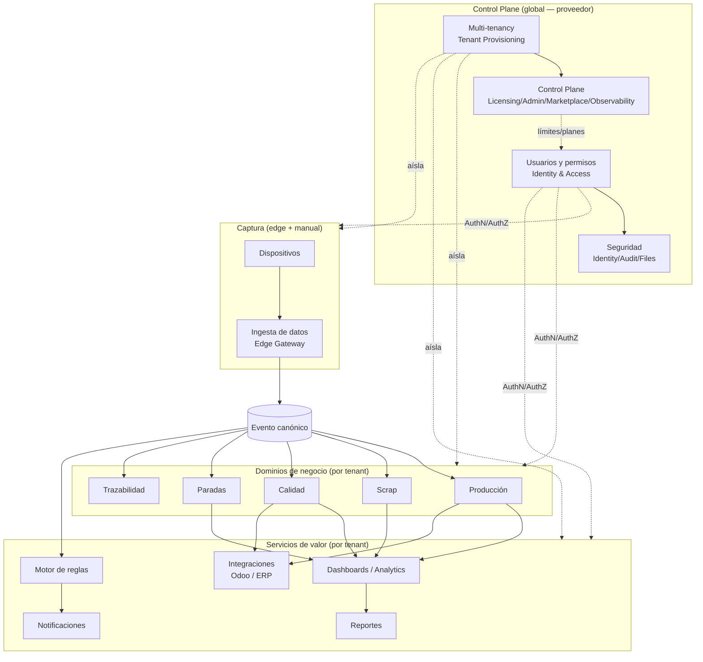

# Módulos — Catálogo del sistema Nexo

> **Documento:** `specs/specs/modules.md` · **Estado:** Borrador v0.1 · **Actualizado:** 2026-07-11
> **Roles:** Product Manager · Software Architect · UX Designer
> **Relacionados:** [product.md](./product.md) · [architecture.md](./architecture.md) · [idea.md](../idea.md) · [roadmap.md](../roadmap/roadmap.md)

## Resumen ejecutivo

Este documento es el **catálogo completo de módulos** de Nexo: la vista de producto de cada capacidad, su mapeo al **microservicio / bounded context (BC)** que la implementa, la **fase de roadmap** en que entra, sus **dependencias** y su **persona principal**. Es el índice navegable que conecta la estrategia de producto ([product.md](./product.md)) con las especificaciones de detalle de cada dominio.

Cada módulo se corresponde con uno de los **bounded contexts canónicos** definidos en la arquitectura (ver [architecture.md](./architecture.md), sección de microservicios). Algunos módulos de producto agrupan varios BCs de plataforma (por ejemplo, "Control Plane" agrupa Tenant Provisioning, Administration & Licensing, Marketplace y Observability). La plataforma respeta los principios canónicos: **cloud native + microservicios (DDD)**, **event-driven**, **multi-tenant con base de datos por tenant**, **edge-first** para la captura y **core desacoplado del ERP** vía Conectores + ACL.

El documento presenta primero la **tabla maestra**, luego una tabla de **servicios de plataforma/soporte** (BCs que respaldan o extienden a futuro), un **apartado breve por módulo** con enlace a su documento detallado, y finalmente un **diagrama de relación entre módulos**. Cierra con preguntas abiertas.

---

## 1. Tabla maestra de módulos

Módulos de producto con documento de detalle propio. La fase indica cuándo el módulo **entra** en el producto (● principal); la evolución posterior se detalla en la matriz por fase de [product.md](./product.md) y en [roadmap.md](../roadmap/roadmap.md).

| # | Módulo | Propósito | Microservicio / BC asociado | Fase | Dependencias | Persona principal |
|---|---|---|---|---|---|---|
| 1 | **Ingesta de datos** | Recepción multi-fuente (manual + datalogger/CSV en MVP; protocolos industriales en V1) y normalización al Evento canónico | Ingestion / Edge Gateway | **MVP** | Dispositivos, Multi-tenancy, Seguridad | Integraciones / Operario |
| 2 | **Dispositivos** | Dispositivos, sensores, tags/señales, salud, firmware/OTA | Devices | **MVP** | Ingesta de datos, Multi-tenancy | Mantenimiento / Integraciones |
| 3 | **Producción** | Órdenes, registros de producción, turnos, productividad | Production | **MVP** | Ingesta de datos, Integraciones | Producción |
| 4 | **Scrap** | Registros de scrap, motivos, costos, clasificación | Scrap | **MVP** | Producción, Ingesta de datos | Supervisor / Producción |
| 5 | **Calidad** | Inspecciones, checklists, defectos, tolerancias, disposición | Quality | **MVP** | Producción, Ingesta de datos | Calidad |
| 6 | **Paradas** | Eventos de parada, motivos, MTBF/MTTR | Downtime (Paradas) | **MVP** | Ingesta de datos, Dispositivos | Mantenimiento / Supervisor |
| 7 | **Dashboards / Analytics** | KPIs y tableros en tiempo real (CQRS) | Dashboards / Analytics | **MVP** | Producción, Scrap, Calidad, Paradas | Gerencia / Supervisor |
| 8 | **Integraciones** | Sincronización con ERPs (Odoo…), ACL, mapeos, reintentos | Connectors / Integrations | **MVP** | Producción, Multi-tenancy | Integraciones |
| 9 | **Multi-tenancy** | DB por tenant, aislamiento, resolución de tenant | Tenant Provisioning (+ resolución de tenant) | **MVP** | Control Plane, Seguridad | Administrador / Super Administrador |
| 10 | **Control Plane** | Tenants, planes, licencias, feature flags, provisioning, observabilidad | Tenant Provisioning · Administration & Licensing · Marketplace · Observability | **MVP** (mínimo) | Multi-tenancy, Seguridad | Super Administrador |
| 11 | **Usuarios y permisos** | AuthN/AuthZ, usuarios, roles, RBAC/ABAC, scoping por planta/línea | Identity & Access | **MVP** (básico) | Control Plane, Seguridad | Administrador |
| 12 | **Seguridad** | Autenticación, aislamiento, secretos, auditoría de acciones | Identity & Access · Audit · Files/Media (aislamiento) | **MVP** (transversal) | Multi-tenancy, Control Plane | Super Administrador / Administrador |
| 13 | **Trazabilidad** | Genealogía lote/serie, historial inmutable | Traceability / Event Store | **V1** | Ingesta de datos | Calidad / Producción |
| 14 | **Motor de reglas** | Reglas trigger-condición-acción en tiempo real | Rules Engine | **V1** | Ingesta de datos, Notificaciones | Supervisor / Mantenimiento |
| 15 | **Notificaciones** | Envío multicanal, plantillas, escalado | Notifications | **V1** | Motor de reglas | Supervisor |
| 16 | **Reportes** | Reportes on-demand/programados, exportables | Reports | **V1** | Dashboards / Analytics | Gerencia |

---

## 2. Servicios de plataforma y soporte (BCs)

Bounded contexts canónicos que **respaldan** a los módulos anteriores o entran en fases posteriores; se documentarán en detalle a medida que su fase se aproxime. Se listan para completar el catálogo.

| Servicio / BC | Ámbito | Rol en la plataforma | Fase | Documento / referencia |
|---|---|---|---|---|
| **Files / Media** | Compartido (storage aislado por tenant) | Fotos, adjuntos y evidencias asociadas a eventos/inspecciones | MVP (soporte) | Cubierto en [quality.md](./quality.md), [security.md](./security.md) |
| **Audit** | Por tenant (+ global CP) | Auditoría de acciones y cambios | MVP (soporte) | Cubierto en [security.md](./security.md) |
| **Observability** | Global / CP | Estado de tenants, servicios, conectores, métricas y logs | V1 | Cubierto en [control-plane.md](./control-plane.md) |
| **Marketplace** | Global / CP | Catálogo de conectores oficiales/terceros | V2 | Cubierto en [control-plane.md](./control-plane.md) · [integrations.md](./integrations.md) |
| **AI / Computer Vision** | Compartido (modelos + storage por tenant) | Visión artificial, OCR, ML | Enterprise | future-features (ver [roadmap.md](../roadmap/roadmap.md)) |

---

## 3. Apartados por módulo

### 3.1 Ingesta de datos — `Ingestion / Edge Gateway`
Punto de entrada de todo dato a la plataforma. Recibe desde el **Agente Edge / Gateway** (edge-first, outbound-only, con store-and-forward), aplica adapters de protocolo (**datalogger y carga de archivo/CSV/Excel** en el MVP; **captura automática por protocolos industriales —Siemens S7, OPC UA, Modbus, MQTT— en V1**) y **normaliza al Evento canónico** (inmutable, deduplicado por `dedup_key`). También ingesta desde APIs y archivos CSV/Excel. El modelo de Devices/ingesta contempla los protocolos industriales desde el día uno, aunque se activan en V1. Es el pilar 1 y 2 de producto. **Detalle:** [data-ingestion.md](./data-ingestion.md).

### 3.2 Dispositivos — `Devices`
Gestiona el inventario de **dispositivos** (PLC, ESP32, datalogger, gateway, cámara), sus **sensores** y **señales/tags**, su **salud** y el **firmware/OTA**. Provee el contexto (site/line/asset) que la ingesta usa para enriquecer eventos. **Detalle:** [devices.md](./devices.md).

### 3.3 Producción — `Production`
Registra **órdenes de producción (Work Order/MO)**, **registros de producción** por orden/máquina/turno, **turnos** y **productividad**. Consume eventos de tipo `production` y alimenta el cálculo de OEE (Rendimiento y Calidad) y la sincronización con el ERP. Es el **caso estrella del MVP** (demo end-to-end: **producción manual → dashboard → Odoo**). **Detalle:** [production.md](./production.md).

### 3.4 Scrap — `Scrap`
Captura **registros de scrap** con **motivo (Reason Code)**, **costo** y clasificación. Alimenta el **Scrap Rate** (por piezas o por costo) y el factor Calidad del OEE. **Detalle:** [scrap.md](./scrap.md).

### 3.5 Calidad — `Quality`
Gestiona **inspecciones de calidad**, checklists, tolerancias, **defectos (Defect)** y disposición de material. Base del **FPY (First Pass Yield)** y del SPC (V1+). En Enterprise se integra con IA/visión. **Detalle:** [quality.md](./quality.md).

### 3.6 Paradas — `Downtime (Paradas)`
Registra **paradas (Downtime Event)**, programadas y no programadas, con **motivo**, y calcula **MTBF/MTTR**. Aporta el factor Disponibilidad del OEE. **Detalle:** [downtime.md](./downtime.md).

### 3.7 Dashboards / Analytics — `Dashboards / Analytics`
Construye **read models (CQRS)** para **KPIs y tableros en tiempo real**: OEE (Disponibilidad × Rendimiento × Calidad), Scrap Rate, FPY, MTBF/MTTR, productividad. Consume eventos de todos los dominios de captura. **Detalle:** [dashboards.md](./dashboards.md).

### 3.8 Integraciones — `Connectors / Integrations`
Sincroniza con el ERP (**Odoo primero**) mediante **conectores desacoplados + Anti-Corruption Layer (ACL)**, con **mapeos**, **jobs de sincronización (Sync Job)** y reintentos. Mantiene el core agnóstico de ERP; base del multi-ERP en V2. **Detalle:** [integrations.md](./integrations.md).

### 3.9 Multi-tenancy — `Tenant Provisioning`
Materializa el requisito NO negociable de **base de datos por tenant**: alta de tenant (flujo de 7 pasos), creación de DB, migraciones, seed y **resolución de tenant** (subdominio/host o claim `tenant_id` → Tenant Connection Registry). Garantiza **aislamiento total** entre empresas. **Detalle:** [multi-tenancy.md](./multi-tenancy.md).

### 3.10 Control Plane — `Tenant Provisioning · Administration & Licensing · Marketplace · Observability`
Base **global** del proveedor. Gestiona **empresas/tenants, planes, licencias, feature flags, límites, facturación**, estado de tenants y observabilidad. Nunca almacena dato operativo de clientes. Gobierna los **límites por usuarios/dispositivos/plantas** de los planes (coherente con [product.md](./product.md)). **Detalle:** [control-plane.md](./control-plane.md).

### 3.11 Usuarios y permisos — `Identity & Access`
**AuthN/AuthZ** centralizada, usuarios, SSO, tokens con **claim de tenant**, y modelo **RBAC** con scoping por planta/línea + extensiones **ABAC**. Define las 8 personas del tenant y los 4 roles globales. **Detalle:** [users-permissions.md](./users-permissions.md).

### 3.12 Seguridad — `Identity & Access · Audit · Files/Media`
Concern **transversal**: aislamiento multi-tenant (datos, storage, cómputo, credenciales), gestión de secretos (cadenas de conexión), **auditoría (Audit)** de acciones y cambios, y seguridad del almacenamiento de evidencias. **Detalle:** [security.md](./security.md).

### 3.13 Trazabilidad — `Traceability / Event Store`
Mantiene el **historial inmutable** de eventos y la **genealogía de lote/serie (Batch/Lot / Serial)**, habilitando auditorías y recalls. Se apoya en el Evento canónico ingerido. **Detalle:** [traceability.md](./traceability.md).

### 3.14 Motor de reglas — `Rules Engine`
Evalúa **reglas trigger-condición-acción** en tiempo real sobre eventos (p. ej. umbrales, paradas prolongadas) y dispara **alertas/acciones**. Alimenta notificaciones. **Detalle:** [rules-engine.md](./rules-engine.md).

### 3.15 Notificaciones — `Notifications`
Entrega **multicanal** con plantillas y escalado, disparada por el motor de reglas o umbrales. Config por tenant, servicio compartido. **Detalle:** [notifications.md](./notifications.md).

### 3.16 Reportes — `Reports`
**Reportes on-demand y programados**, exportables, sobre los read models. Complementa los dashboards con entregables periódicos para gerencia. **Detalle:** [reports.md](./reports.md).

---

## 4. Diagrama de relación entre módulos

**Lectura del diagrama:** el **Control Plane** gobierna y aísla; la **captura** (Dispositivos → Ingesta) produce el **Evento canónico**, única fuente que alimenta los **dominios de negocio** y, desde ellos, los **servicios de valor** (dashboards, reportes, reglas, notificaciones e integración con el ERP). Detalle de flujos y contratos en [architecture.md](./architecture.md).

---

## Preguntas abiertas

1. **Granularidad Files/Media y Audit:** ¿ameritan documento propio o se mantienen dentro de [quality.md](./quality.md) y [security.md](./security.md)?
2. **Ubicación de Observability:** ¿se documenta como parte de [control-plane.md](./control-plane.md) o como módulo independiente en V1?
3. **Frontera Ingesta vs. Dispositivos:** ¿dónde vive exactamente la definición de tags/señales y su binding con adapters de protocolo?
4. **Alcance MVP de Usuarios y permisos:** ¿qué subconjunto de RBAC (roles fijos vs. configurables) entra en el MVP antes del RBAC avanzado de V1?
5. **Reglas y Notificaciones en MVP:** confirmadas para V1; ¿se adelanta alguna alerta mínima (p. ej. parada prolongada) al MVP?
6. **Trazabilidad parcial en MVP:** aunque el módulo completo es V1, ¿el Event Store inmutable ya debe existir en el MVP como base de la ingesta?
7. **Mapeo módulo↔BC compuesto:** validar que agrupar 4 BCs bajo "Control Plane" no genere ambigüedad con [architecture.md](./architecture.md).
