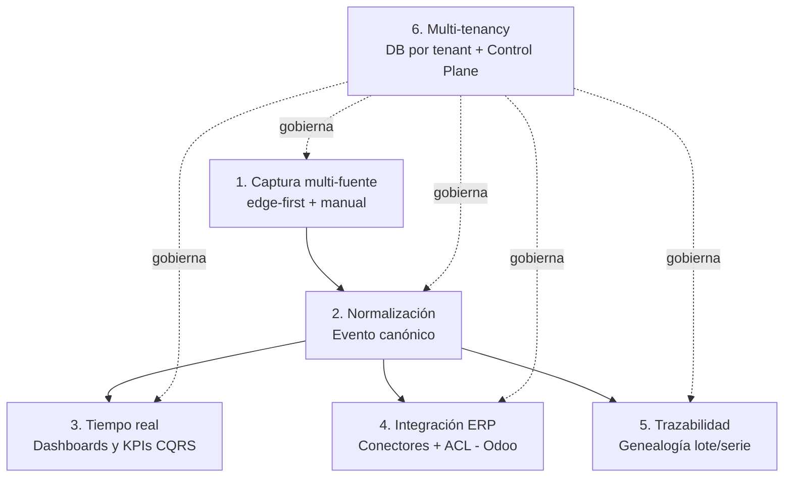

# Producto — Nexo

> **Documento:** `specs/specs/product.md` · **Estado:** Borrador v0.1 · **Actualizado:** 2026-07-11
> **Roles:** Product Manager · Software Architect · UX Designer
> **Relacionados:** [idea.md](../idea.md) · [modules.md](./modules.md) · [architecture.md](./architecture.md) · [control-plane.md](./control-plane.md) · [users-permissions.md](./users-permissions.md) · [roadmap.md](../roadmap/roadmap.md)

## Resumen ejecutivo

Este documento define la **estrategia de producto de Nexo**: qué construimos, para quién, cómo nos posicionamos y cómo medimos el éxito. Nexo es la **capa única de captura de datos industriales entre la planta y el ERP**: elimina la carga manual de información de producción convirtiendo datos heterogéneos de planta en **eventos normalizados**, trazables y sincronizables (ver [idea.md](../idea.md)).

El producto se organiza alrededor de **pilares funcionales** (captura multi-fuente, normalización a evento canónico, tiempo real, integración con ERP, trazabilidad y multi-tenancy) que se materializan en un catálogo de **módulos** (ver [modules.md](./modules.md)), cada uno alineado a un microservicio/bounded context. Sirve a **ocho personas del tenant** (Operario, Supervisor, Calidad, Producción, Mantenimiento, Gerencia, Administrador e Integraciones) y a **cuatro roles globales** del proveedor (Super Administrador, Soporte, Implementador, Partner).

Aquí se especifican la visión de producto, el posicionamiento competitivo, las personas con sus dolores y objetivos, la propuesta de valor por persona, los pilares funcionales, el **alcance del MVP y lo explícitamente fuera de MVP**, el mapa de módulos, las **métricas de éxito** (activación, adopción, reducción de carga manual, time-to-value), el **modelo de licenciamiento/monetización** a alto nivel (planes y límites por usuarios/dispositivos/plantas, coherente con [control-plane.md](./control-plane.md)) y la **matriz de módulos por fase**.

---

## 1. Visión de producto

> Ser **el estándar de captura de datos industriales**: que toda industria manufacturera pueda capturar en su origen lo que ocurre en la planta —producción, scrap, calidad, paradas, eventos de máquina—, normalizarlo a un dato confiable y trazable, verlo en tiempo real y sincronizarlo con su ERP, sin cargar nada dos veces.

Nexo persigue una experiencia donde el **operario dedica segundos, no minutos**, a registrar; donde el **supervisor ve el turno en vivo**, no al día siguiente; donde la **gerencia decide con KPIs confiables**; y donde el **ERP recibe el dato automáticamente**. Todo sobre una plataforma cloud native, event-driven y multi-tenant con **base de datos por tenant** que escala de una línea a miles de plantas (ver [architecture.md](./architecture.md)).

---

## 2. Posicionamiento

**Para** industrias manufactureras que hoy cargan a mano sus datos de planta, **que** necesitan datos confiables en tiempo real integrados a su ERP, **Nexo es** la capa de captura de datos industriales (MES ligero) **que** elimina la carga manual y normaliza todo a un evento canónico trazable, **a diferencia de** los MES tradicionales (caros y pesados), los SCADA (control, no gestión) o la carga manual en el ERP (tardía y con errores), **porque** es agnóstica de ERP y de hardware, se adopta en días y escala como SaaS multi-tenant.

### 2.1 Mapa competitivo

| Alternativa | Qué resuelve | Dónde queda corta | Cómo se diferencia Nexo |
|---|---|---|---|
| **Carga manual en ERP / Excel** | Registro básico | Tardío, con errores, doble carga, sin tiempo real | Automatiza la captura y elimina el retipeo |
| **SCADA / historiador** | Control y almacenamiento de señales | No contextualiza en eventos de negocio ni integra al ERP | Normaliza a evento de negocio y sincroniza con ERP |
| **MES tradicional (on-premise pesado)** | Gestión de piso completa | Costoso, largo de implementar, atado a proveedor/hardware | Ligero, agnóstico, SaaS multi-tenant, time-to-value rápido |
| **Desarrollos a medida / integraciones ad hoc** | Casos puntuales | Frágiles, no escalan, mantenimiento caro | Plataforma con conectores y ACL, escalable por diseño |
| **Módulo MES del propio ERP** | Cierta captura dentro del ERP | No habla protocolos industriales ni tolera el edge | Edge-first, multi-protocolo, agnóstico de ERP |

### 2.2 Qué NO es (recordatorio de encuadre)

Nexo **no reemplaza al ERP**, **no es un SCADA** y **no es un historiador puro** (ver [idea.md](../idea.md)). Se posiciona como **complemento** que llena la brecha planta↔ERP.

---

## 3. Personas

Personas del **tenant** (clientes) y roles **globales** del proveedor. El modelo de acceso es **RBAC** con alcance por planta/línea (scoping) y extensiones **ABAC** donde aplique; la matriz de permisos detallada vive en [users-permissions.md](./users-permissions.md).

### 3.1 Personas del tenant

| Persona | Rol en planta | Dolores principales | Objetivos con Nexo |
|---|---|---|---|
| **Operario** | Opera máquinas/línea; registra en piso | Registrar quita tiempo; papel/Excel es engorroso; guantes y ambiente hostil | Registrar producción/scrap/parada en segundos desde una tablet, sin fricción |
| **Supervisor** | Coordina turno/línea | No sabe qué pasa hasta el final del turno; apagar incendios tarde | Ver el turno en vivo, detectar desvíos y actuar en el momento |
| **Calidad** | Controles e inspecciones | Checklists en papel; defectos sin trazar; SPC manual | Inspecciones digitales, defectos trazados, calidad medida con FPY |
| **Producción** | Planifica y cumple órdenes | Avance real desconocido; órdenes desincronizadas con el ERP | Avance en tiempo real por orden/máquina/turno, sincronizado con ERP |
| **Mantenimiento** | Disponibilidad de máquinas | Paradas mal registradas; sin MTBF/MTTR confiable | Paradas capturadas con motivo, MTBF/MTTR reales, alertas |
| **Gerencia** | Decisión y resultados | KPIs poco confiables y tardíos; sin visión consolidada | OEE, scrap rate y productividad confiables y en vivo, multi-planta |
| **Administrador (del tenant)** | Administra la cuenta de la empresa | Alta de usuarios, plantas, dispositivos; gobierno interno | Configurar la organización, usuarios/roles, plantas y límites del plan |
| **Integraciones** | Conecta Nexo con sistemas | Mapeos frágiles; sincronizaciones que fallan en silencio | Configurar conectores, mapeos y jobs de sincronización con visibilidad |

### 3.2 Roles globales (Control Plane, proveedor)

| Rol global | Responsabilidad | Referencia |
|---|---|---|
| **Super Administrador** | Gobierno de la plataforma, tenants, planes | [control-plane.md](./control-plane.md) |
| **Soporte** | Atención y diagnóstico de tenants | [control-plane.md](./control-plane.md) · [observability](./architecture.md) |
| **Implementador** | Onboarding y puesta en marcha de tenants | [control-plane.md](./control-plane.md) |
| **Partner** | Canal / reventa / conectores de terceros | [control-plane.md](./control-plane.md) · marketplace |

---

## 4. Propuesta de valor por persona

| Persona | Propuesta de valor concreta |
|---|---|
| **Operario** | "Registrás en segundos, no en planillas." UX de tablet ultra simple, tolerante a errores y al ambiente de planta. |
| **Supervisor** | "Ves tu turno en vivo y actuás a tiempo." Estado de líneas, alertas de desvío y paradas en curso. |
| **Calidad** | "Calidad medible y trazable." Inspecciones digitales, defectos catalogados, FPY y disposición de material. |
| **Producción** | "Sabés el avance real y el ERP se entera solo." Producción por orden/máquina/turno sincronizada con Odoo. |
| **Mantenimiento** | "Disponibilidad con números reales." Paradas con motivo, MTBF/MTTR y alertas de reglas. |
| **Gerencia** | "Decidís con datos confiables, no con supuestos." OEE, scrap rate y productividad consolidados multi-planta. |
| **Administrador** | "Gobernás tu empresa en la plataforma." Usuarios, roles, plantas, dispositivos y límites del plan. |
| **Integraciones** | "Integrás sin dolor y con visibilidad." Conectores, mapeos y jobs de sync observables y con reintentos. |

Las fórmulas de KPI (OEE, Disponibilidad, Rendimiento, Calidad, Scrap Rate, FPY, MTBF, MTTR) son **canónicas y consistentes** en toda la plataforma (ver [dashboards.md](./dashboards.md), [production.md](./production.md), [downtime.md](./downtime.md), [quality.md](./quality.md)).

---

## 5. Pilares funcionales

| Pilar | Descripción | Módulos que lo materializan |
|---|---|---|
| **1. Captura multi-fuente (edge-first + manual)** | Capturar desde PLCs, dataloggers, sensores, cámaras, APIs, archivos y carga manual en tablet, con store-and-forward. | [data-ingestion.md](./data-ingestion.md), [devices.md](./devices.md) |
| **2. Normalización a evento canónico** | Convertir todo origen en un Evento normalizado, inmutable y deduplicado. | [data-ingestion.md](./data-ingestion.md), [traceability.md](./traceability.md) |
| **3. Tiempo real (CQRS)** | KPIs y tableros vivos con fórmulas canónicas y reportes. | [dashboards.md](./dashboards.md), [reports.md](./reports.md) |
| **4. Integración con ERP** | Sincronizar con Odoo (y futuros ERPs) vía conectores desacoplados + ACL. | [integrations.md](./integrations.md) |
| **5. Trazabilidad** | Historial inmutable y genealogía de lote/serie. | [traceability.md](./traceability.md) |
| **6. Automatización y gobierno** | Reglas, notificaciones, seguridad, multi-tenancy y Control Plane. | [rules-engine.md](./rules-engine.md), [notifications.md](./notifications.md), [security.md](./security.md), [multi-tenancy.md](./multi-tenancy.md), [control-plane.md](./control-plane.md) |

Los dominios de negocio capturados sobre estos pilares son **Producción, Scrap, Calidad, Paradas y Eventos de máquina** (ver [production.md](./production.md), [scrap.md](./scrap.md), [quality.md](./quality.md), [downtime.md](./downtime.md)).

---

## 6. Alcance del MVP y fuera de MVP

### 6.1 Dentro del MVP (canónico)

- **Registrar:** Producción, Scrap, Controles de Calidad, Paradas y Eventos de máquina.
- **Capturar desde:** carga manual (tablet) + datalogger vía carga de archivo/CSV/Excel.
- **Carga manual desde tablets** (UX de operario) — **caso estrella: Producción + dashboard**.
- **Dashboard en tiempo real.**
- **Integración con Odoo.**
- **Multi-tenant con base de datos por tenant.**
- **Control Plane mínimo:** alta de tenant y licencias.
- **Modo híbrido configurable (por planta):** en el MVP el híbrido se limita a **manual + datalogger/CSV**; el híbrido con **protocolos industriales** se vuelve real en V1.

### 6.2 Explícitamente fuera del MVP

- IA / visión artificial y OCR.
- Mantenimiento predictivo.
- Marketplace público de conectores.
- Multi-ERP simultáneo avanzado (SAP/Dynamics/Oracle).
- Gemelo digital.
- (Diferidos a V1/V2: **captura automática por protocolos industriales (Siemens S7, OPC UA, Modbus, MQTT)**, motor de reglas completo, notificaciones multicanal, reportes avanzados, trazabilidad lote/serie completa, RBAC avanzado, observabilidad avanzada — ver §10 y [roadmap.md](../roadmap/roadmap.md)).

> **Principio de MVP:** el operario puede **cargar manual desde el día uno** (time-to-value inmediato) y sumar el **datalogger vía carga de archivo/CSV/Excel**; la **captura automática por protocolos industriales** llega en V1. El dato fluye al dashboard y a Odoo. **Demo end-to-end del MVP: producción manual → dashboard → Odoo.**

---

## 7. Mapa de módulos

Catálogo resumido; el detalle y la tabla maestra completa están en [modules.md](./modules.md).

| Módulo | Propósito | Documento |
|---|---|---|
| **Producción** | Órdenes, registros de producción, turnos, productividad | [production.md](./production.md) |
| **Calidad** | Inspecciones, checklists, defectos, disposición | [quality.md](./quality.md) |
| **Scrap** | Registros de scrap, motivos, costos | [scrap.md](./scrap.md) |
| **Paradas** | Eventos de parada, motivos, MTBF/MTTR | [downtime.md](./downtime.md) |
| **Trazabilidad** | Genealogía lote/serie, historial inmutable | [traceability.md](./traceability.md) |
| **Dispositivos** | Dispositivos, sensores, tags, salud, OTA | [devices.md](./devices.md) |
| **Integraciones** | Conectores ERP (Odoo), ACL, mapeos, sync | [integrations.md](./integrations.md) |
| **Dashboards** | KPIs y tableros en tiempo real (CQRS) | [dashboards.md](./dashboards.md) |
| **Motor de reglas** | Reglas trigger-condición-acción | [rules-engine.md](./rules-engine.md) |
| **Usuarios y permisos** | RBAC/ABAC, roles, scoping | [users-permissions.md](./users-permissions.md) |
| **Notificaciones** | Envío multicanal, plantillas, escalado | [notifications.md](./notifications.md) |
| **Reportes** | Reportes on-demand/programados, exportables | [reports.md](./reports.md) |
| **Ingesta de datos** | Recepción, adapters, normalización a evento | [data-ingestion.md](./data-ingestion.md) |
| **Multi-tenancy** | DB por tenant, aislamiento, resolución de tenant | [multi-tenancy.md](./multi-tenancy.md) |
| **Control Plane** | Tenants, planes, licencias, provisioning, observabilidad | [control-plane.md](./control-plane.md) |
| **Seguridad** | AuthN/AuthZ, aislamiento, auditoría, secretos | [security.md](./security.md) |

---

## 8. Métricas de éxito

Métricas de producto organizadas por etapa del ciclo de vida del cliente. Los umbrales son objetivos iniciales a validar.

### 8.1 Activación

| Métrica | Definición | Objetivo inicial |
|---|---|---|
| **Time-to-first-event** | Tiempo desde alta del tenant hasta el primer Evento capturado | < 1 día |
| **Tenants activados** | % de tenants dados de alta que registran ≥ N eventos en la 1.ª semana | ≥ 70% |
| **Onboarding completo** | % que configuró al menos 1 planta, 1 usuario operario y 1 fuente de captura | ≥ 80% |
| **Primer dashboard visto** | % de tenants cuyo supervisor/gerencia abre el dashboard en tiempo real la 1.ª semana | ≥ 75% |

### 8.2 Adopción

| Métrica | Definición | Objetivo inicial |
|---|---|---|
| **Operarios activos / plan** | Operarios que registran al menos 1 vez por turno vs. licenciados | ≥ 60% |
| **Eventos/día por planta** | Volumen de eventos normalizados por planta | Creciente mes a mes |
| **Cobertura de dominios** | Cuántos de los 5 dominios (prod/scrap/calidad/paradas/eventos) usa el tenant | ≥ 3 |
| **Uso de integración Odoo** | % de tenants con sync activo hacia Odoo | ≥ 50% |
| **Retención (logo/NRR)** | Retención de tenants y expansión de ingresos | NRR ≥ 110% |

### 8.3 Reducción de carga manual (métrica estrella)

| Métrica | Definición | Objetivo inicial |
|---|---|---|
| **% de eventos automáticos** | Eventos con `source = device` sobre total de eventos | Creciente; ≥ 50% en tenants con hardware |
| **Reducción de doble carga en ERP** | Reducción de registros retipeados en el ERP tras adoptar Nexo | ≥ 70% |
| **Tiempo de registro por operario** | Segundos promedio por registro manual en tablet | ≤ 15 s por registro |
| **Latencia dato→dashboard** | Tiempo desde el evento en planta hasta verlo en el dashboard | Segundos (near real-time) |

### 8.4 Time-to-value

| Métrica | Definición | Objetivo inicial |
|---|---|---|
| **Time-to-value** | Tiempo desde alta hasta el primer KPI confiable en el dashboard | ≤ 1 semana |
| **Time-to-integration (Odoo)** | Tiempo hasta el primer sync exitoso con Odoo | ≤ 2 semanas |
| **Time-to-automation** | Tiempo hasta la primera captura automática por protocolo industrial (V1) | ≤ 4 semanas |

> La definición operativa de "reducción de carga manual" es una **pregunta abierta** (ver [idea.md](../idea.md) y §Preguntas abiertas).

---

## 9. Modelo de licenciamiento y monetización (alto nivel)

Modelo **SaaS por suscripción** con dos ejes principales: una **suscripción base por planta** —que cubre captura manual, usuarios, integración Odoo y dashboard en tiempo real— y un **precio por dispositivo conectado**, eje central de escalado cuando entra la **captura automática** (protocolos industriales, V1). Sobre esa base, los **módulos se empaquetan por capa** vía **feature flags** (Captura base → MES ligero (V1) → IA Enterprise). El escenario **100% manual paga la base por planta**; los **add-ons por consumo** son posibles. La gestión de la base por planta, el precio por dispositivo, feature flags, límites y facturación reside en el **Control Plane** (servicio *Administration & Licensing*), coherente con [control-plane.md](./control-plane.md). Los límites se **hacen cumplir** y se reflejan en el alta y operación del tenant.

### 9.1 Ejes de precio

| Eje | Qué cubre | Cómo escala |
|---|---|---|
| **Suscripción base por planta** | Captura manual, usuarios, integración Odoo y dashboard en tiempo real | Por cada planta activa; el escenario 100% manual paga solo esta base |
| **Precio por dispositivo conectado** | Captura automática por dispositivo/fuente industrial | Eje principal de escalado al activar los protocolos industriales (V1) |
| **Módulos por capa (feature flags)** | Habilitación de capas de producto | Captura base (MVP) → MES ligero (V1) → IA (Enterprise) |
| **Add-ons por consumo** | Retención extendida, conectores premium (marketplace), plantas/usuarios adicionales | Cobro por consumo/uso sobre la base |

> Los precios concretos (base por planta, por dispositivo) y los límites son **referenciales** y sujetos a validación comercial; la fuente de verdad vigente es el Control Plane.

### 9.2 Capas empaquetadas por feature flag

| Capa | Contenido | Fase |
|---|---|---|
| **Captura base** | Captura manual + datalogger/CSV, Odoo, dashboard en tiempo real, multi-tenant | MVP |
| **MES ligero** | Protocolos industriales (S7/OPC UA/Modbus/MQTT) + híbrido real, reglas, notificaciones, trazabilidad, reportes | V1 |
| **IA Enterprise** | IA/visión, mantenimiento predictivo, gemelo digital | Enterprise |

> Las capas se habilitan por **feature flags** en el Control Plane; el **modo híbrido configurable** (manual + automático por planta) se cobra sumando la **base por planta** y los **dispositivos conectados**. Palancas complementarias: **Marketplace de conectores** (fase V2, revenue share a partners) y **servicios de implementación** (rol Implementador/Partner).

### 9.3 Coherencia con Control Plane

- **Base por planta, precio por dispositivo, feature flags de capa, límites y facturación** los administra *Administration & Licensing* en la Control Plane DB.
- El **alta de tenant** (7 pasos) fija plan y estado inicial; los límites por usuarios/dispositivos/plantas se aplican desde el provisioning (ver [control-plane.md](./control-plane.md) y [multi-tenancy.md](./multi-tenancy.md)).
- El **Marketplace** (fase V2) gobierna el catálogo de conectores y su monetización.

---

## 10. Matriz de módulos por fase

Alineada al roadmap canónico (MVP, V1, V2, Enterprise). Detalle, prioridades MoSCoW, dependencias y riesgos en [roadmap.md](../roadmap/roadmap.md) y [modules.md](./modules.md).

| Módulo | MVP | V1 | V2 | Enterprise |
|---|:---:|:---:|:---:|:---:|
| Ingesta de datos (manual + datalogger/CSV) | ● núcleo | ◐ + protocolos (S7/OPC UA/Modbus/MQTT) | ◐ | ◐ |
| Dispositivos | ● básico | ◐ salud/OTA | ◐ | ◐ |
| Producción | ● | ◐ | ◐ | ◐ |
| Scrap | ● | ◐ | ◐ | ◐ |
| Calidad | ● | ◐ SPC/checklists | ◐ | ● IA/visión |
| Paradas | ● | ◐ MTBF/MTTR | ◐ | ● predictivo |
| Dashboards / Analytics | ● tiempo real | ◐ | ● analytics avanzado | ◐ |
| Integraciones (Odoo) | ● Odoo | ◐ | ● multi-ERP (SAP/Dynamics/Oracle) | ◐ |
| Multi-tenancy (DB-per-tenant) | ● | ◐ | ● distribución geográfica | ● alta disponibilidad multi-región |
| Control Plane (alta tenant + licencias) | ● mínimo | ◐ | ◐ feature flags/despliegues | ● SLAs enterprise |
| Trazabilidad | ○ | ● lote/serie | ◐ | ◐ |
| Motor de reglas | ○ | ● | ◐ | ◐ |
| Notificaciones | ○ | ● multicanal | ◐ | ◐ |
| Reportes | ○ | ● | ◐ | ◐ |
| Usuarios y permisos | ● básico | ● RBAC avanzado | ◐ ABAC | ◐ |
| Observabilidad | ◐ mínima | ● | ◐ | ● SLA |
| Marketplace de conectores | ○ | ○ | ● | ◐ |
| IA / Visión artificial | ○ | ○ | ○ | ● |

**Leyenda:** ● principal/entra en la fase · ◐ evoluciona/se profundiza · ○ fuera de la fase.

---

## Preguntas abiertas

1. **Definición y medición de "reducción de carga manual":** ¿qué línea base tomamos por tenant y cómo la instrumentamos para probar la métrica estrella?
2. **Precios y límites concretos:** los valores de la base por planta, el precio por dispositivo y los límites por usuarios/plantas son referenciales; falta validación comercial y su fijación en Control Plane.
3. ✅ **Resuelto (2026-07-11):** los módulos se empaquetan **por capa vía feature flags** (Captura base → MES ligero V1 → IA Enterprise); los avanzados se habilitan como capa/add-on sobre la base por planta — ver [tablero de decisiones](../open-questions-board.md).
4. ✅ **Resuelto (2026-07-11):** el pricing distingue manual vs. automático: la **base por planta** cubre el 100% manual y el **precio por dispositivo conectado** escala con la captura automática — ver [tablero de decisiones](../open-questions-board.md).
5. **Persona "Integraciones" en pymes chicas:** ¿existe ese rol en el segmento Starter o lo cubre el Administrador/Implementador?
6. **Métrica de NRR/retención:** objetivos de retención y expansión aún sin validar con datos reales.
7. **Frontera de personas Mantenimiento vs. Producción:** ¿cómo se reparten paradas/MTBF entre ambas personas en el MVP vs. V1?
8. **Marca del producto:** "Nexo" es provisional (ver [idea.md](../idea.md)); impacta naming de planes y comunicación.
