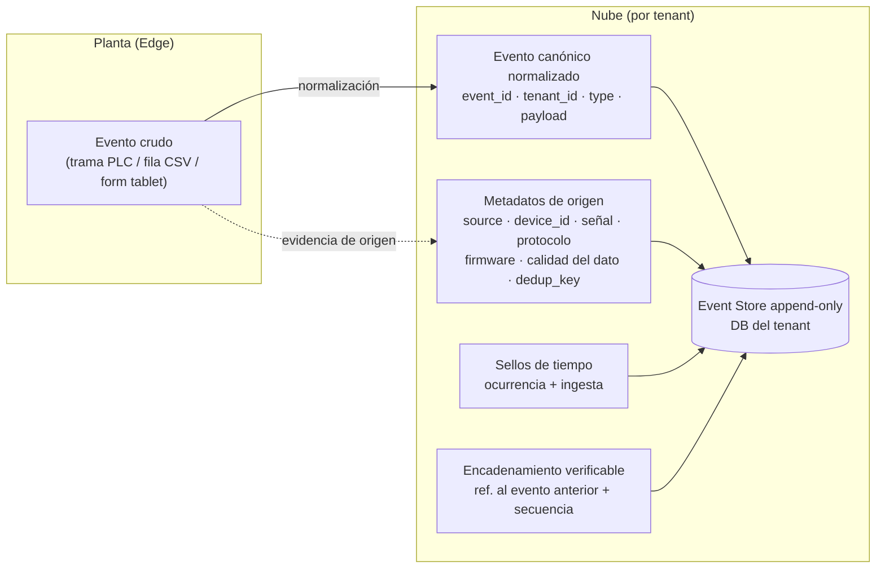
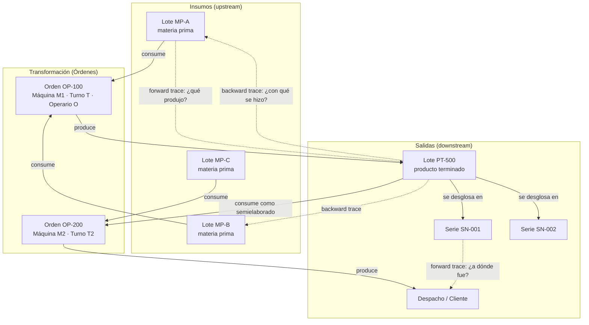
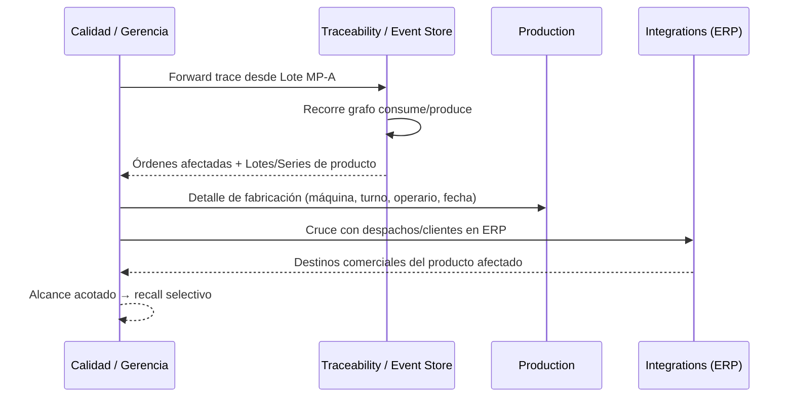
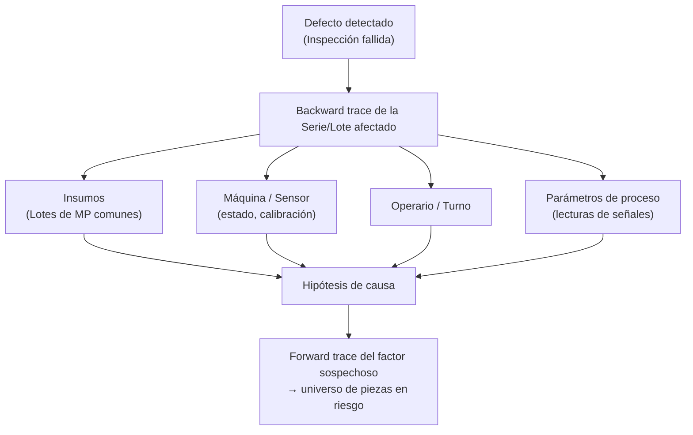

# Trazabilidad y Event Store

> **Documento:** `specs/specs/traceability.md` · **Estado:** Borrador v0.1 · **Actualizado:** 2026-07-11
> **Roles:** Product Manager · Software Architect · UX Designer
> **Relacionados:** [data-ingestion.md](./data-ingestion.md) · [data-model.md](./data-model.md) · [production.md](./production.md) · [quality.md](./quality.md) · [security.md](./security.md) · [scrap.md](./scrap.md) · [downtime.md](./downtime.md) · [integrations.md](./integrations.md) · [glossary.md](./glossary.md)

## Resumen ejecutivo

La **trazabilidad** es la capacidad de reconstruir, de forma completa y verificable, el recorrido de un dato desde el instante físico en que se originó en la planta (una lectura de sensor, una pulsación de un operario en la tablet, un archivo importado) hasta el registro de negocio que lo representa y su eventual sincronización con el ERP. En Nexo esta capacidad no es un módulo accesorio: es una consecuencia estructural del diseño **event-driven**. Todo lo que ocurre en la plataforma nace como un **Evento** canónico normalizado y ese evento, una vez ingerido, es **inmutable**. El servicio **Traceability / Event Store** (por tenant, sobre la DB del tenant) es el custodio de esa verdad histórica.

Este documento describe cómo se construye la cadena de trazabilidad de punta a punta: el **event store append-only** con sello de tiempo confiable y encadenamiento verificable, el registro de las dimensiones de contexto (quién, qué, cuándo, dónde, con qué dispositivo y de qué origen), la **genealogía hacia adelante y hacia atrás** (forward/backward trace) sobre lotes y series, y la relación entre el evento crudo, el registro de negocio derivado y el `Sync Job` que lo empuja al ERP. La trazabilidad de Nexo responde a dos preguntas de negocio críticas y de alto costo cuando no pueden contestarse: *"¿a dónde fue a parar todo lo que se fabricó con este lote de materia prima?"* (recall) y *"¿por qué apareció este defecto y qué otras piezas comparten esa causa?"* (análisis de causa raíz).

La propuesta de valor central de Nexo —eliminar la carga manual y convertir datos heterogéneos en eventos normalizados y **trazables**— se materializa aquí. La trazabilidad es también la base de la **auditoría** (qué se registró, quién lo registró, si algo fue corregido y cómo) y del **historial** de cada entidad de negocio. Por eso este documento se cruza estrechamente con [data-ingestion.md](./data-ingestion.md) (cómo entra el dato), [data-model.md](./data-model.md) (qué representan las entidades), [production.md](./production.md) / [quality.md](./quality.md) (qué registros de negocio se generan) y [security.md](./security.md) (integridad, no repudio y control de acceso a la evidencia histórica).

---

## 1. Objetivos y alcance

### 1.1 Objetivos

- **Reconstrucción íntegra:** poder rearmar, para cualquier registro de negocio, la secuencia completa de eventos que lo originaron y modificaron, con su contexto (operario, dispositivo, señal, turno, orden).
- **Inmutabilidad y no repudio:** garantizar que un evento ya ingerido no se altera ni se borra; las correcciones se expresan como *nuevos* eventos que referencian al anterior.
- **Genealogía bidireccional:** dado un lote o una serie, resolver tanto sus **insumos y antecedentes** (backward) como sus **productos y destinos** (forward).
- **Cadena verificable de extremo a extremo:** vincular evento crudo → evento canónico → registro de negocio → `Sync Job` → confirmación del ERP, sin eslabones perdidos.
- **Soporte a operaciones de alto impacto:** recall selectivo, análisis de causa raíz (RCA), auditorías regulatorias y de cliente, defensa ante reclamos.
- **Aislamiento por tenant:** la evidencia histórica de una empresa vive exclusivamente en su DB y su storage; nunca es visible ni consultable por otro tenant.

### 1.2 Dentro del alcance

- Modelo conceptual del **Event Store inmutable** por tenant.
- Dimensiones de trazabilidad: temporal, de identidad (operario/usuario), de origen (dispositivo/señal/protocolo), de calidad del dato y de contexto productivo.
- Genealogía forward/backward de **Lote (Batch/Lot)** y **Serie (Serial)**.
- Auditoría e historial de entidades de negocio derivado.
- Relación con la sincronización al ERP (correlación de ida y vuelta).
- Casos de uso de recall y RCA.

### 1.3 Fuera del alcance (referencias)

- La **captura y normalización** del dato crudo se detalla en [data-ingestion.md](./data-ingestion.md); aquí se asume que el `Evento` canónico ya llega normalizado.
- Las **fórmulas de KPI** (OEE, MTBF/MTTR, FPY) se calculan en los dominios respectivos ([production.md](./production.md), [downtime.md](./downtime.md), [quality.md](./quality.md)); la trazabilidad provee el sustrato de eventos, no los tableros.
- El **modelo de datos conceptual** completo vive en [data-model.md](./data-model.md); aquí se referencian las entidades, no se redefinen.
- Los **controles criptográficos, gestión de secretos y RBAC/ABAC** se especifican en [security.md](./security.md).

---

## 2. Conceptos fundamentales

| Concepto | Definición operativa en Nexo |
|---|---|
| **Evento (Event)** | Unidad normalizada canónica del sistema (ver esquema en [data-ingestion.md](./data-ingestion.md) y [data-model.md](./data-model.md)). Es el "átomo" de la trazabilidad. Inmutable tras la ingesta. |
| **Evento crudo (raw)** | La forma original tal como llegó del origen (trama del PLC, fila de CSV, payload del formulario de la tablet) antes o durante la normalización. Se conserva como evidencia de origen. |
| **Registro de negocio** | Entidad derivada y contextualizada: `Registro de producción`, `Registro de scrap`, `Inspección de calidad`, `Parada`. Es una **proyección** construida a partir de uno o varios eventos. |
| **Event Store** | Repositorio **append-only** por tenant donde los eventos se persisten en orden y no se modifican. Fuente de verdad histórica. |
| **Genealogía / Trazabilidad** | Grafo de relaciones "consume/produce" entre lotes, series, órdenes y registros que permite recorrer la cadena de valor hacia adelante y hacia atrás. |
| **Lote (Batch/Lot)** | Agrupación de producto fabricado bajo condiciones homogéneas; unidad típica de trazabilidad en procesos continuos/por lotes (alimentos, químicos, plásticos). |
| **Serie (Serial)** | Identificador único por pieza individual; unidad de trazabilidad en procesos discretos (automotriz, electrónica, metalúrgica). |
| **Sello de tiempo (timestamp)** | Marca temporal confiable asociada al evento; distingue *tiempo de ocurrencia* (en planta) de *tiempo de ingesta* (en la nube). |
| **Cadena de trazabilidad** | Secuencia verificable evento crudo → evento canónico → registro de negocio → `Sync Job` → confirmación ERP. |
| **Auditoría** | Registro de *quién hizo qué y cuándo* sobre las entidades y sobre el propio sistema; se apoya en el event store y en el servicio **Audit**. |

### 2.1 Principio rector: "todo es un evento, y el evento no miente"

En una arquitectura event-driven el evento es anterior a cualquier registro. El `Registro de producción` no es un dato que "se edita": es la lectura consolidada de una corriente de eventos. Esto tiene una consecuencia directa sobre la trazabilidad: **nunca hay que confiar en el estado final para saber qué pasó**, porque el estado final es reconstruible a partir de su historia. Si un supervisor corrige una cantidad producida, no se pisa el número anterior; se emite un evento de corrección que referencia al original, y el registro de negocio se recalcula. La trazabilidad, así, es "gratis" por diseño: es el subproducto natural de no destruir información.

---

## 3. Dimensiones de la trazabilidad

Todo evento y todo registro derivado se contextualizan en seis dimensiones. Cada dimensión responde a una pregunta y se apoya en entidades canónicas definidas en [data-model.md](./data-model.md).

| Dimensión | Pregunta | Se apoya en (entidades canónicas) |
|---|---|---|
| **Temporal** | ¿Cuándo ocurrió y cuándo se registró? | Sello de tiempo de ocurrencia y de ingesta; `Turno`. |
| **Identidad / autoría** | ¿Quién lo hizo o lo validó? | `Operario`, `Usuario / Rol / Permiso`. |
| **Origen del dato** | ¿De dónde salió y por qué medio? | `source` (device/manual/api/file), `Dispositivo`, `Sensor`, `Señal / Tag`, `origin_metadata` (protocolo, firmware, calidad del dato). |
| **Ubicación / contexto físico** | ¿Dónde ocurrió? | `Planta` → `Sector` → `Línea` → `Máquina`. |
| **Contexto productivo** | ¿A qué trabajo pertenece? | `Orden de producción`, `Producto / SKU`, `Operación / Ruta`. |
| **Trazabilidad de material** | ¿Sobre qué material/pieza? | `Lote (Batch/Lot)`, `Serie (Serial)`. |

### 3.1 Origen del dato (procedencia / provenance)

El **origen del dato** es la dimensión más delicada de la trazabilidad industrial, porque de ella depende la *confianza* que se le puede dar a un número. Nexo distingue explícitamente cuatro orígenes (`source`):

- **`device`** — capturado automáticamente de un `Dispositivo` (PLC, datalogger, ESP32, gateway). Se acompaña de `device_id`, la `Señal / Tag` leída, el protocolo (OPC UA / Modbus / MQTT / S7), la versión de firmware y un indicador de **calidad del dato** (por ejemplo: lectura buena, sospechosa, sustituida, interpolada).
- **`manual`** — cargado por un `Operario` desde tablet/PC/celular. Se acompaña de `operator_id` y del dispositivo de captura de la interfaz.
- **`api`** — recibido de un `Sistema externo` vía API. Se acompaña del `Conector` o cliente de origen.
- **`file`** — importado de un `Archivo` CSV/Excel. Se acompaña de la referencia al `Archivo (File / Media)` original y a la fila/lote de importación.

> La distinción de origen permite políticas de negocio como "una lectura automática de balanza pesa más que una estimación manual" o "un valor sustituido no puede cerrar una `Orden` sin doble validación". Esas políticas se ejecutan en el [Rules Engine](./rules-engine.md), pero la **evidencia de origen** la garantiza la trazabilidad.

### 3.2 Sello de tiempo: ocurrencia vs. ingesta

En el edge industrial los cortes de conectividad son la norma, no la excepción; el **Agente Edge / Gateway** hace *store-and-forward*. Por eso Nexo conserva dos marcas temporales por evento:

- **Tiempo de ocurrencia** — cuándo pasó en la planta (idealmente sellado en el edge, cercano a la fuente).
- **Tiempo de ingesta** — cuándo el evento fue efectivamente persistido en el event store en la nube.

La diferencia entre ambos (*latencia de ingesta*) es en sí misma un dato trazable: permite detectar eventos "atrasados" que llegan tras un corte, ordenar correctamente la línea de tiempo real y evitar que un lote parezca producido fuera de su ventana. Ver el tratamiento de reloj, deriva y buffering en [data-ingestion.md](./data-ingestion.md).

---

## 4. Event Store inmutable

### 4.1 Propiedades

El Event Store es el corazón del servicio **Traceability / Event Store** y presenta las siguientes propiedades conceptuales:

1. **Append-only (solo anexar):** nunca se actualiza ni se borra un evento existente. Las únicas operaciones son *anexar* y *leer*.
2. **Ordenado y secuenciado:** dentro de cada tenant, cada evento recibe una posición monótona (número de secuencia lógico) que fija su orden de ingesta, complementaria a los sellos de tiempo.
3. **Inmutable y sellado:** el contenido del evento (payload normalizado + metadatos de origen) es fijo una vez ingerido, tal como establece el esquema del `Evento` canónico.
4. **Idempotente en la escritura:** cada evento porta un `dedup_key`; si el mismo evento se reintenta (típico tras un store-and-forward), se reconoce como duplicado y no se persiste dos veces.
5. **Encadenado y verificable:** cada evento referencia de forma resumida al anterior de su partición, formando una cadena que permite detectar cualquier alteración o hueco (evidencia de integridad, no repudio). El detalle criptográfico se trata en [security.md](./security.md).
6. **Particionado por tenant:** vive en la **DB del tenant**; el aislamiento es físico, no lógico.

> **Correcciones sin mutación:** para reflejar un error humano o de máquina no se edita el evento equivocado. Se emiten eventos de tipo *corrección/anulación* que apuntan al `event_id` original. El registro de negocio se recalcula, pero el historial completo (el valor errado, quién lo corrigió, cuándo y por qué) permanece disponible para auditoría. Esto es lo que hace que el event store sea a la vez inmutable y "corregible" a nivel de negocio.

### 4.2 De evento crudo a evento canónico

El evento entra crudo y se normaliza al esquema canónico (ver 8.1 del brief y [data-ingestion.md](./data-ingestion.md)). La trazabilidad exige conservar **ambas caras**:

- El **evento canónico** (normalizado) es lo que consume el resto de la plataforma.
- La **evidencia de origen** (metadatos del crudo: trama, fila del CSV, payload del formulario) se conserva asociada, de modo que ante una disputa se pueda mostrar exactamente qué se recibió y cómo se interpretó. Los adjuntos y archivos originales se referencian en **Files / Media** (storage aislado por tenant).

### 4.3 Diagrama — anatomía de un evento en el store

---

## 5. Cadena de trazabilidad de extremo a extremo

La cadena de trazabilidad conecta el mundo físico con el ERP en cinco eslabones. Cada flecha es una relación explícita y navegable en ambos sentidos.

```mermaid
flowchart LR
    A["1 · Origen físico<br/>Operario / Dispositivo / Sensor / Archivo"]
    B["2 · Evento canónico<br/>(Event Store inmutable)"]
    C["3 · Registro de negocio<br/>Producción / Scrap / Inspección / Parada"]
    D["4 · Sync Job<br/>Connectors / ACL"]
    E["5 · ERP (Odoo…)<br/>confirmación / referencia externa"]

    A -->|ingesta + normalización| B
    B -->|proyección / consolidación| C
    C -->|mapeo ACL + encolado| D
    D -->|push + confirmación| E
    E -.correlación devuelta.-> D
    D -.estado sincronizado.-> C
    C -.referencia al evento origen.-> B
    B -.evidencia de origen.-> A
```

### 5.1 Eslabón por eslabón

1. **Origen físico → Evento canónico.** El dato se captura y normaliza (ver [data-ingestion.md](./data-ingestion.md)). Al persistirse queda el vínculo a su origen (dispositivo/operario/archivo) y su calidad.
2. **Evento canónico → Registro de negocio.** Los dominios **Production**, **Scrap**, **Quality** y **Downtime** proyectan los eventos en registros contextualizados. Un `Registro de producción` puede consolidar N eventos de conteo; una `Inspección` agrupa eventos de medición; una `Parada` se arma con eventos de inicio/fin y su `Motivo`. **La relación registro→evento(s) siempre se conserva.**
3. **Registro de negocio → Sync Job.** El servicio **Connectors / Integrations** toma el registro, lo traduce al modelo del ERP mediante el **Anti-Corruption Layer (ACL)** y crea un `Sync Job` (ver [integrations.md](./integrations.md)).
4. **Sync Job → ERP.** Se ejecuta el push (p. ej. a Odoo) con reintentos y backoff. El ERP devuelve una **referencia externa** (ID del documento creado) y un estado.
5. **Correlación de vuelta.** La referencia externa y el resultado se guardan asociados al `Sync Job` y al `Registro`, cerrando el círculo: desde un asiento del ERP se puede volver, salto a salto, hasta la trama de PLC o la pulsación en la tablet que lo originó.

### 5.2 Correlación e identificadores

La navegabilidad se sostiene sobre identificadores de correlación que se propagan por toda la cadena:

| Identificador | Rol en la cadena |
|---|---|
| `event_id` | Identidad única e inmutable del evento en el store. |
| `dedup_key` | Evita duplicados en reingestas (store-and-forward). |
| **Referencia registro→evento(s)** | Cada registro de negocio apunta a los eventos que lo originaron. |
| **ID de correlación de proceso** | Hilo que une eventos de una misma operación/orden a lo largo del tiempo. |
| **Referencia externa (ERP)** | ID del documento creado en el ERP, devuelto por el `Sync Job`. |
| `Lote` / `Serie` | Claves de material que enlazan la genealogía (sección 6). |

---

## 6. Genealogía: forward y backward trace

La **genealogía** es el grafo que conecta materiales, órdenes y productos mediante relaciones **consume** (una orden consume lotes/series de insumo) y **produce** (una orden produce lotes/series de salida). Sobre ese grafo se definen las dos consultas maestras de la trazabilidad:

- **Backward trace (hacia atrás / "as-built" / árbol de insumos):** partiendo de un producto terminado (lote o serie), obtener **todo lo que entró** en él —materias primas, semielaborados, la `Orden` que lo fabricó, la `Máquina`, el `Operario`, el `Turno` y las `Inspecciones` asociadas. Responde: *"¿con qué se hizo esto?"*.
- **Forward trace (hacia adelante / "where-used" / árbol de destinos):** partiendo de un insumo (lote de materia prima), obtener **todo lo que se fabricó** con él y a dónde fue (qué órdenes lo consumieron, qué lotes/series de producto resultaron, qué despachos). Responde: *"¿a dónde fue a parar esto?"*. Es la consulta clave del **recall**.

### 6.1 Diagrama de genealogía (forward / backward)

**Lectura del diagrama:**
- *Backward* desde `PT-500`: se llega a `MP-A`, `MP-B`, a la `Orden OP-100`, y por ella a máquina, turno, operario e inspecciones.
- *Forward* desde `MP-A`: se llega a `PT-500`, a las series `SN-001`/`SN-002`, y —siguiendo la cadena— a `OP-200` y al despacho final.

### 6.2 Relación lote ↔ serie

- Un **`Lote`** puede desglosarse en múltiples **`Series`** (p. ej., un lote de fabricación numerado pieza por pieza).
- Una **`Serie`** pertenece a lo sumo a un `Lote` de fabricación.
- La genealogía admite **profundidad multinivel**: el producto terminado de una orden puede ser insumo (semielaborado) de otra, encadenando órdenes. La trazabilidad recorre esa cadena de forma recursiva.

### 6.3 Cómo se construye el grafo

El grafo genealógico no se "captura": se **deriva de eventos**. Cada consumo de material y cada declaración de producción emiten eventos que llevan las claves `Lote`/`Serie`, `Orden`, `Máquina`, `Operario` y `Turno`. El servicio **Traceability / Event Store** los proyecta en las relaciones consume/produce. Esto garantiza que la genealogía siempre sea coherente con la evidencia y reconstruible ante cualquier duda.

---

## 7. Auditoría e historial

La trazabilidad de **datos de planta** (eventos) se complementa con la trazabilidad de **acciones de usuario** (auditoría), responsabilidad del servicio **Audit** (por tenant, con espejo en el Control Plane para acciones globales).

| Aspecto | Trazabilidad de datos (Event Store) | Auditoría de acciones (Audit) |
|---|---|---|
| **Qué registra** | Hechos de planta: producción, scrap, calidad, paradas, lecturas, eventos de máquina. | Acciones humanas/administrativas: quién creó/corrigió/cerró/exportó, cambios de configuración, logins, cambios de permisos. |
| **Fuente** | `Dispositivo`, `Operario`, `Sistema externo`, `Archivo`. | `Usuario` autenticado (ver [security.md](./security.md)). |
| **Mutabilidad** | Inmutable (append-only). | Inmutable (append-only). |
| **Uso típico** | Genealogía, RCA, recall, cálculo de KPI. | Cumplimiento, defensa ante disputas, control interno, no repudio. |

### 7.1 Historial de una entidad de negocio

Como los registros de negocio se derivan de eventos, el **historial** de cualquier entidad (una `Orden`, un `Registro de producción`, una `Inspección`) se obtiene reproduciendo su secuencia de eventos en orden. Esto habilita:

- **Línea de tiempo** ("timeline") de cada entidad para la UI (ver [ui-ux.md](./ui-ux.md)).
- **Reproducción a una fecha** ("¿cómo estaba esta orden el martes a las 14:00?").
- **Comparación antes/después** de una corrección, mostrando el valor previo, el nuevo, el autor y el motivo.

---

## 8. Casos de uso

### 8.1 Recall selectivo (retiro de producto)

**Situación:** un proveedor informa que el lote de materia prima `MP-A` está contaminado / fuera de especificación.

**Objetivo:** identificar y retirar **solo** el producto afectado, minimizando el impacto (evitar un recall masivo por no saber el alcance).

**Pasos funcionales:**
1. **Forward trace** desde `MP-A`: la trazabilidad devuelve todas las `Órdenes` que lo consumieron y los `Lotes`/`Series` de producto resultantes.
2. **Contexto de fabricación:** para cada salida, el dominio **Production** aporta máquina, turno, operario y ventana temporal.
3. **Destino comercial:** vía **Connectors / Integrations**, se cruzan las series/lotes con los despachos y clientes registrados en el ERP.
4. **Acotamiento:** el resultado es la lista mínima de producto a retirar y a qué clientes contactar, con la evidencia completa para el organismo regulador.

**Por qué Nexo lo resuelve bien:** porque la genealogía es un subproducto de los eventos ya capturados; no depende de que alguien haya llenado a mano una planilla de trazabilidad.

### 8.2 Análisis de causa raíz (RCA)

**Situación:** se detecta un `Defecto` recurrente en el producto (p. ej., una `Inspección` falla por dimensión fuera de tolerancia).

**Objetivo:** encontrar la causa común y delimitar qué otras piezas la comparten.

**Pasos funcionales:**
1. **Backward trace** de la pieza/lote defectuoso: insumos, máquina, sensores, operario, turno y **lecturas de señales** (parámetros de proceso: temperatura, presión, velocidad) en la ventana de fabricación.
2. **Correlación:** se buscan factores comunes entre todas las piezas defectuosas (¿mismo lote de MP? ¿misma máquina tras un cambio de firmware? ¿turno nocturno? ¿un sensor con lecturas de calidad "sospechosa"?). Aquí la dimensión **origen del dato** es decisiva.
3. **Hipótesis de causa** y, una vez identificada, **forward trace** de ese factor para delimitar **todas** las piezas potencialmente afectadas (aunque aún no hayan fallado).
4. **Acción:** disparo de reglas/alertas (ver [rules-engine.md](./rules-engine.md)), bloqueo de disposición en **Quality**, y documentación para mejora continua.

### 8.3 Otros casos de uso soportados

- **Auditoría regulatoria / de cliente:** entregar el expediente completo de un lote (as-built + inspecciones + eventos de proceso) con evidencia inmutable.
- **Defensa ante reclamo:** demostrar, con no repudio, que un producto cumplió los controles al momento de fabricarse y quién los realizó.
- **Conciliación con el ERP:** ante una discrepancia de stock o de producción declarada, rastrear el `Sync Job` y el evento origen para explicar la diferencia.
- **Investigación de datos "raros":** un valor imposible se explica siguiendo la cadena hasta el `Dispositivo`/`Señal` y su calidad de dato (p. ej. sensor descalibrado, valor sustituido).

---

## 9. Interacción con otros servicios

El servicio **Traceability / Event Store** es transversal pero mantiene bajo acoplamiento: consume eventos del backbone y expone consultas de genealogía/historial.

| Servicio | Relación con Trazabilidad |
|---|---|
| **Ingestion / Edge Gateway** | Provee el `Evento` canónico normalizado; ver [data-ingestion.md](./data-ingestion.md). Es la puerta de entrada de todo lo trazable. |
| **Devices** | Aporta identidad y salud del `Dispositivo`/`Sensor`/`Señal` que da origen a los eventos automáticos. |
| **Production / Scrap / Quality / Downtime** | Consumen eventos y generan los **registros de negocio**; conservan la referencia a los eventos origen. Ver [production.md](./production.md), [scrap.md](./scrap.md), [quality.md](./quality.md), [downtime.md](./downtime.md). |
| **Connectors / Integrations** | Ejecuta los `Sync Jobs` y devuelve la **referencia externa** del ERP para cerrar la cadena. Ver [integrations.md](./integrations.md). |
| **Rules Engine** | Consume eventos/patrones para disparar alertas (p. ej., "lecturas fuera de rango en el mismo lote"). Ver [rules-engine.md](./rules-engine.md). |
| **Audit** | Complementa con la trazabilidad de acciones de usuario. |
| **Dashboards / Reports** | Consumen proyecciones (read models) para timelines, expedientes de lote y tableros; ver [dashboards.md](./dashboards.md) y [reports.md](./reports.md). |
| **Files / Media** | Custodia adjuntos y evidencia original (fotos de defecto, CSV importado). |
| **Identity & Access / Security** | Controlan quién puede consultar la evidencia histórica y garantizan integridad/no repudio; ver [security.md](./security.md). |

---

## 10. Multi-tenancy, seguridad e integridad

- **Aislamiento por tenant (no negociable):** el Event Store y toda la genealogía viven en la **DB del tenant**. Ningún tenant puede consultar la trazabilidad de otro. El almacenamiento de evidencia (Files/Media) está segmentado por tenant. Ver [multi-tenancy.md](./multi-tenancy.md).
- **Integridad y no repudio:** el encadenamiento verificable de eventos permite detectar alteraciones o huecos; combinado con la auditoría, sostiene el valor probatorio de la evidencia. El detalle de controles (firmas, hashing, gestión de claves) está en [security.md](./security.md).
- **Retención y volumen:** el diseño asume **millones de eventos diarios** (ver [scalability.md](./scalability.md)); las políticas de retención, archivado en frío y particionamiento temporal deben preservar la trazabilidad a largo plazo sin degradar el costo (ver Preguntas abiertas).
- **Acceso segmentado:** la consulta de trazabilidad respeta el scoping RBAC/ABAC por planta/línea (ver [users-permissions.md](./users-permissions.md)); un supervisor de una planta no ve el expediente de otra planta si su alcance no lo permite.

---

## Preguntas abiertas

1. **Granularidad de la evidencia de origen:** ¿se conserva el 100% del evento crudo (todas las tramas de PLC) o solo una muestra/resumen para lecturas de alta frecuencia, equilibrando trazabilidad vs. costo de almacenamiento?
2. **Política de retención y archivado:** ¿cuánto tiempo permanece el event store "caliente" (consultable en línea) antes de pasar a almacenamiento frío, y cómo se garantiza que la genealogía siga siendo reconstruible desde el frío?
3. **Nivel de encadenamiento criptográfico:** ¿basta con hash-chain por partición, o ciertos tenants/industrias requieren sellado de tiempo confiable externo (RFC-3161) o anclaje periódico para valor legal? (definir con [security.md](./security.md)).
4. **Trazabilidad de mezclas y flujos continuos:** ¿cómo se modela la genealogía cuando los lotes se mezclan continuamente (silos, tanques) y no hay una relación 1:N limpia entre insumo y salida?
5. **Reconciliación bidireccional con el ERP:** ¿la referencia externa del ERP se limita a "confirmación de creación" o se sincronizan también cambios posteriores hechos en el ERP para mantener la cadena coherente en ambos sentidos?
6. **Corrección de eventos vs. cumplimiento:** ¿qué industrias/regímenes exigen que ninguna corrección altere el registro de negocio "oficial" ya sincronizado, y cómo se refleja eso en la relación registro↔evento?
7. **Profundidad máxima de genealogía multinivel:** ¿existe un límite práctico de niveles de encadenamiento de órdenes (semielaborados) para acotar el costo de las consultas forward/backward en tiempo razonable?
8. **Trazabilidad de datos importados por archivo:** para orígenes `file`, ¿qué nivel de detalle de la fila/columna original se conserva para poder auditar una discrepancia de importación?
