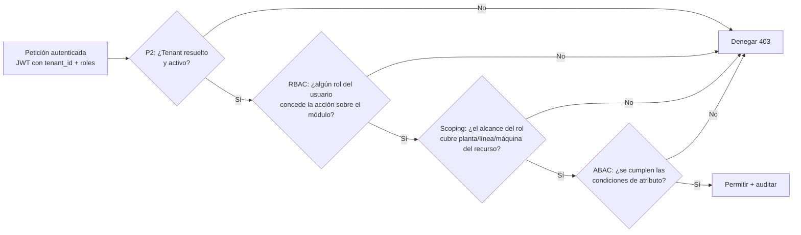
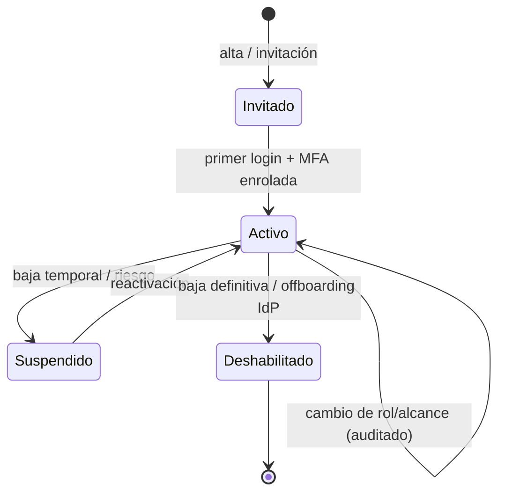

# Usuarios y Permisos

> **Documento:** `specs/specs/users-permissions.md` · **Estado:** Borrador v0.1 · **Actualizado:** 2026-07-11
> **Roles:** Product Manager · Software Architect · UX Designer
> **Relacionados:** [security.md](./security.md) · [control-plane.md](./control-plane.md) · [multi-tenancy.md](./multi-tenancy.md) · [ui-ux.md](./ui-ux.md) · [mockups.md](./mockups.md) · [architecture.md](./architecture.md) · [glossary.md](./glossary.md) · [audit](./modules.md)

## Resumen ejecutivo

Este documento define el **modelo de identidad, roles, permisos y alcance (scoping)** de la plataforma **Nexo**. Nexo es una plataforma industrial multi-tenant con **base de datos por tenant**, por lo que la autorización opera en **dos planos claramente separados**: el **plano del tenant** (la empresa cliente y sus plantas, líneas, operarios y datos operativos) y el **plano global o Control Plane** (el proveedor del SaaS, que administra empresas, licencias, marketplace y soporte). Nunca se mezclan: un usuario global jamás ve dato operativo de un cliente sin un consentimiento y una traza explícitos, y un usuario de un tenant jamás ve información de otro tenant ni del Control Plane.

El modelo base es **RBAC (Role-Based Access Control)** con **alcance por planta y por línea (scoping jerárquico)**, extendido con **reglas ABAC (Attribute-Based Access Control)** para las decisiones que dependen del contexto (turno activo, propiedad del registro, ventana temporal, criticidad del activo, estado del dato). Se eligió RBAC como columna vertebral porque el dominio industrial se organiza naturalmente por funciones de planta (operario, supervisor, calidad, mantenimiento…) y porque un modelo de roles es **auditable, explicable y gobernable** por un Administrador de tenant sin conocimientos técnicos; se añade ABAC porque el "quién puede qué" real en una planta casi nunca es puramente funcional: depende de *dónde*, *cuándo* y *sobre qué* se actúa.

El corazón operativo del documento es la **Matriz de permisos (módulo × rol × CRUD)**, que traduce las ocho personas del tenant y los cuatro roles globales del Control Plane en permisos concretos sobre cada módulo de la plataforma. Se complementa con las políticas de **SSO/MFA**, el ciclo de vida de usuarios, la diferencia entre **gestión de usuarios por tenant vs. gestión global**, las cuentas de servicio para integraciones, y los principios de gobierno (mínimo privilegio, separación de funciones, acceso de emergencia y trazabilidad total). La autenticación y emisión de tokens con claim de tenant las provee el microservicio **Identity & Access**; ver [security.md](./security.md) para el detalle criptográfico y de amenazas, y [control-plane.md](./control-plane.md) para el gobierno global.

---

## 1. Principios de autorización (el porqué del modelo)

Antes de enumerar roles y permisos, se fijan los principios que gobiernan **todas** las decisiones de acceso. Cada regla concreta de la matriz debe poder justificarse contra uno de estos principios.

| # | Principio | Qué significa en Nexo | Por qué |
|---|-----------|------------------------|---------|
| P1 | **Mínimo privilegio** | Cada rol recibe el conjunto de permisos más pequeño que le permite hacer su trabajo, y nada más. | Reduce la superficie de error humano y de abuso; un operario que solo puede registrar producción no puede borrar catálogos de otra planta por accidente. |
| P2 | **Aislamiento de tenant absoluto** | La resolución de tenant (subdominio/host o claim `tenant_id` en el JWT) precede a toda decisión de permiso. Sin tenant resuelto no hay autorización posible. | Es el requisito NO negociable del modelo DB-per-tenant (ver [multi-tenancy.md](./multi-tenancy.md)); ningún rol, ni siquiera Administrador, puede "saltar" a otro tenant. |
| P3 | **Scoping jerárquico** | Los permisos se acotan a un ámbito: Tenant → Planta (Site) → Sector/Área → Línea (Line) → Centro de trabajo/Máquina. | Una empresa con 5 plantas necesita que el supervisor de la planta Norte no toque la planta Sur; el rol es el mismo, el alcance cambia. |
| P4 | **Separación de funciones (SoD)** | Quien produce no dispone (aprueba) sobre su propia calidad; quien define reglas no necesariamente las ejecuta sobre datos que le benefician. | Control interno y auditabilidad: evita que una sola persona pueda registrar, aprobar y ocultar un desvío. |
| P5 | **Contexto sobre identidad (ABAC)** | Sobre el rol se aplican condiciones de atributo: turno activo, propiedad del registro, ventana de edición, criticidad del activo, estado del dato (borrador/confirmado/sincronizado). | El permiso "editar registro de producción" solo tiene sentido *mientras el registro está en borrador y dentro del turno del operario que lo creó*. |
| P6 | **Inmutabilidad de la evidencia** | El Evento canónico y la Auditoría son **inmutables** una vez ingeridos: ningún rol tiene permiso de `Update`/`Delete` real sobre ellos; se corrige con eventos compensatorios. | La trazabilidad y la auditoría pierden todo valor legal/operativo si se pueden reescribir. Ver [traceability](./traceability.md) y sección de Auditoría. |
| P7 | **Deny-by-default** | Todo lo no concedido explícitamente está denegado. | Nuevos módulos o acciones no quedan accidentalmente abiertos; el permiso es un acto positivo. |
| P8 | **Trazabilidad de toda decisión** | Cada acción sensible (login, cambio de rol, sincronización, edición fuera de ventana, break-glass) se audita con actor, tenant, alcance, resultado y razón. | Permite responder "quién hizo qué, cuándo y en nombre de quién", condición para clientes enterprise. |

---

## 2. Modelo conceptual de identidad

### 2.1 Componentes

- **Usuario (User):** identidad de una persona. Puede ser **usuario de tenant** (pertenece a una empresa cliente) o **usuario global** (personal del proveedor, vive en el Control Plane). Nunca ambas cosas con la misma cuenta.
- **Cuenta de servicio (Service Account):** identidad no humana usada por conectores, agentes edge y automatizaciones. Autentica con credenciales/claves gestionadas, no con MFA interactiva. Ver §7.
- **Rol (Role):** conjunto nombrado de permisos. Nexo entrega **roles predefinidos** (los de este documento) y permite **roles personalizados** por tenant en fases avanzadas (ver Preguntas abiertas).
- **Permiso (Permission):** capacidad atómica sobre un recurso, expresada como acción CRUD (Crear/Leer/Actualizar/Eliminar) más acciones específicas de dominio (p. ej. *Confirmar*, *Aprobar disposición*, *Reintentar sync*, *Reconocer alerta*, *Ejecutar OTA*).
- **Alcance (Scope):** ámbito jerárquico donde el rol aplica (Tenant / Planta / Sector / Línea / Máquina).
- **Asignación (Role Binding):** vínculo Usuario ↔ Rol ↔ Alcance. Un mismo usuario puede tener **varias asignaciones** (p. ej. Supervisor en Planta Norte y Calidad en Línea 3 de Planta Sur).
- **Atributo (Attribute):** propiedad usada por ABAC (turno, propiedad, criticidad, estado, hora, canal de origen).

### 2.2 RBAC + scoping + ABAC (cómo se combinan)

La decisión de acceso se resuelve como una **cadena de tres filtros**, en orden estricto. Se justifica el orden: primero lo barato e infalible (tenant), luego lo estructural (rol y alcance), y por último lo contextual y costoso (atributos).

**Por qué esta arquitectura y no solo RBAC:** un modelo puramente de roles obligaría a crear roles artificiales como "Supervisor-Norte-turno-mañana-solo-borradores", que explotan combinatoriamente y son ingobernables. Separar **rol** (qué función), **alcance** (dónde) y **atributo** (bajo qué condición) mantiene pocos roles legibles y delega la variabilidad a datos, no a nuevos roles.

**Por qué ABAC va al final:** evaluar atributos puede requerir leer estado del recurso (¿está confirmado?, ¿es del turno actual?). Poner RBAC y scoping antes evita esa lectura para el 90 % de las peticiones que ya se deniegan por rol o ámbito, protegiendo rendimiento a escala de millones de eventos/día.

### 2.3 Ejemplos de reglas ABAC (extensiones sobre RBAC)

| Regla ABAC | Roles afectados | Condición | Justificación |
|------------|-----------------|-----------|----------------|
| **Ventana de edición** | Operario | Puede `Update` un registro de producción/scrap/parada solo si está en estado *borrador* y dentro de N minutos de su creación (parametrizable por tenant). | Permite corregir un tipeo sin habilitar reescritura de historia confirmada. |
| **Propiedad del registro** | Operario | Solo edita/anula registros creados por él mismo dentro de su turno. | Un operario no debe alterar lo cargado por su compañero. |
| **Turno activo** | Operario, Supervisor | La carga de producción se habilita solo si el usuario tiene un turno abierto en esa línea. | Evita registros fuera de contexto y facilita el cálculo de OEE por turno. |
| **Criticidad del activo** | Mantenimiento | Ejecutar OTA/firmware sobre dispositivos marcados *críticos* requiere doble confirmación o rol supervisor de mantenimiento. | Un OTA fallido en un PLC crítico detiene la línea. |
| **Estado sincronizado** | Todos | Ningún rol edita un registro ya sincronizado con el ERP; se genera un ajuste. | Preserva consistencia con Odoo/ERP y trazabilidad del [Job de sincronización](./integrations.md). |
| **Disposición de calidad** | Calidad | Solo Calidad puede cambiar la *disposición* (aceptar/rechazar/reprocesar) de un lote; Producción no. | Separación de funciones (P4). |
| **Break-glass** | Administrador, Soporte (global) | Acceso extraordinario con justificación obligatoria, tiempo limitado y notificación al tenant. | Soporte crítico sin romper el aislamiento por defecto. |

---

## 3. Roles del tenant (8 personas canónicas)

Cada rol se describe con: **misión**, **superficie principal** (dónde trabaja, ver [ui-ux.md](./ui-ux.md)), **puede/no puede** y **alcance típico**. Los permisos formales están en la Matriz (§5).

### 3.1 Operario
- **Misión:** capturar el dato de planta en tiempo real: producción, scrap, paradas y las inspecciones de calidad que se le asignen.
- **Superficie principal:** **tablet industrial** en modo kiosco a pie de línea (ver [mockups.md](./mockups.md)); consumo puntual en mobile.
- **Puede:** iniciar/cerrar turno; registrar producción, scrap y paradas de *su* línea; ejecutar checklists de calidad asignados; adjuntar fotos como evidencia; reconocer alertas dirigidas a él; ver su propio tablero de línea.
- **No puede:** configurar catálogos, ver otras plantas/líneas, administrar usuarios, tocar integraciones o reglas, editar registros confirmados o de otros operarios (ABAC).
- **Alcance típico:** una o varias **líneas** de una **planta**.

### 3.2 Supervisor
- **Misión:** garantizar que su turno/línea produce según plan y que el dato capturado es correcto.
- **Superficie principal:** tablet (a pie de línea) + desktop (fin de turno, revisión).
- **Puede:** todo lo del operario ampliado a su alcance; **corregir y confirmar** registros de su equipo; abrir/cerrar paradas; asignar operarios a líneas/turnos; reconocer y escalar alertas; generar reportes de turno; ver dashboards completos de su alcance.
- **No puede:** administrar usuarios del tenant, configurar integraciones, definir reglas globales, cambiar catálogos maestros (salvo delegación puntual).
- **Alcance típico:** una **planta** o un conjunto de **líneas**/sectores.

### 3.3 Calidad
- **Misión:** definir y ejecutar el control de calidad, decidir disposiciones y gobernar los catálogos de defectos y tolerancias.
- **Superficie principal:** tablet (inspecciones en piso) + desktop (planes de calidad, SPC, reportes).
- **Puede:** crear/editar planes e inspecciones, checklists, tolerancias y motivos de defecto; registrar defectos; **decidir disposición** (aceptar/rechazar/reprocesar) de lotes/series; clasificar scrap por causa de calidad; generar reportes de calidad (FPY, SPC).
- **No puede:** editar registros de producción ajenos, administrar usuarios, tocar integraciones/reglas fuera de su dominio.
- **Alcance típico:** **planta** (a veces transversal a varias líneas).

### 3.4 Producción
- **Misión:** planificar y gobernar la producción: órdenes, turnos, productos, productividad y OEE.
- **Superficie principal:** desktop (planificación, análisis) + tablet (recorridas).
- **Puede:** gestionar órdenes de producción y su vínculo con el ERP; definir turnos, líneas y productos; editar/anular registros de producción con traza; configurar catálogos de producción y motivos; generar y programar reportes; ver todos los dashboards de su alcance.
- **No puede:** decidir disposición de calidad (P4), administrar usuarios del tenant, configurar conectores.
- **Alcance típico:** una o varias **plantas**.

### 3.5 Mantenimiento
- **Misión:** minimizar y explicar las paradas; cuidar la salud de dispositivos y activos (MTBF/MTTR).
- **Superficie principal:** tablet (intervención en piso) + desktop (planificación, análisis de fallas).
- **Puede:** gestionar paradas y eventos de máquina; clasificar motivos; administrar **dispositivos y su salud** (alta, calibración, diagnóstico); ejecutar **firmware/OTA** (con ABAC de criticidad); definir reglas de mantenimiento; reportes de MTBF/MTTR.
- **No puede:** editar producción/scrap salvo lectura para contexto, administrar usuarios, tocar integraciones ERP.
- **Alcance típico:** **planta**/sector; a veces transversal a activos.

### 3.6 Gerencia
- **Misión:** decidir con datos: rendimiento, costos de scrap, OEE, disponibilidad, entre plantas.
- **Superficie principal:** desktop (dashboards ejecutivos) + mobile (KPIs y alertas críticas en movimiento).
- **Puede:** **leer todo** el dato operativo de su empresa (multi-planta); generar y programar reportes ejecutivos; suscribirse a alertas críticas.
- **No puede:** realizar cargas operativas ni cambios de configuración; es un rol **de solo lectura estratégica** por diseño.
- **Alcance típico:** **tenant completo** (todas las plantas).
- **Por qué solo lectura:** separar decisión de operación (P4) y evitar que un cambio ejecutivo accidental altere datos de piso.

### 3.7 Administrador (del tenant)
- **Misión:** gobernar la instancia de la empresa: usuarios, roles, alcances, catálogos maestros y configuración.
- **Superficie principal:** desktop (consola de administración).
- **Puede:** gestionar **usuarios y asignaciones de rol/alcance** dentro del tenant; configurar plantas, sectores, líneas, turnos y catálogos; habilitar/ordenar integraciones y reglas; ver auditoría; en general, CRUD sobre todos los módulos **de su tenant**.
- **No puede:** acceder a otros tenants ni al Control Plane; **eliminar** registros inmutables (auditoría, eventos, historia sincronizada); superar límites de licencia (los impone Administration & Licensing).
- **Alcance típico:** **tenant completo**.

### 3.8 Integraciones
- **Misión:** configurar y operar la sincronización con sistemas externos/ERP (Odoo primero) y los mapeos ACL.
- **Superficie principal:** desktop (consola de integraciones). Puede coexistir con **cuentas de servicio** (§7).
- **Puede:** administrar conectores, credenciales de integración (referenciadas, no expuestas), mapeos de campos/ACL, colas y reintentos de **Sync Jobs**; leer los módulos de datos para configurar el mapeo.
- **No puede:** cargar/editar dato operativo de piso, administrar usuarios humanos, decidir disposiciones de calidad.
- **Alcance típico:** **tenant completo** (la integración suele ser por empresa), acotable por planta.

---

## 4. Roles globales del Control Plane (4)

Estos roles pertenecen al **proveedor de Nexo**, viven en la **Base Global (Control Plane)** y **no** tienen, por defecto, acceso al dato operativo de ningún tenant. Ver [control-plane.md](./control-plane.md) y [multi-tenancy.md](./multi-tenancy.md). El principio rector es: **gobernar la plataforma sin ver el dato del cliente**, salvo break-glass auditado y consentido.

### 4.1 Super Administrador
- **Misión:** máxima autoridad de la plataforma. Gobierna tenants, planes, feature flags globales, marketplace y configuración global.
- **Puede:** aprovisionar/suspender/dar de baja tenants (dispara el flujo de alta de 7 pasos, ver [multi-tenancy.md](./multi-tenancy.md)); gestionar planes/licencias y flags; administrar usuarios globales y partners; ver observabilidad global.
- **No puede (por defecto):** leer dato operativo de un tenant sin **break-glass** justificado, temporal y notificado.

### 4.2 Soporte
- **Misión:** resolver incidentes de clientes.
- **Puede:** ver estado, salud, métricas y logs técnicos (Observability) de los tenants; reproducir problemas de configuración; abrir sesiones **break-glass** con consentimiento y traza para inspeccionar dato operativo cuando sea imprescindible.
- **No puede:** cambiar configuración operativa del cliente salvo asistencia explícita registrada; ver dato sin break-glass.

### 4.3 Implementador
- **Misión:** poner en marcha (onboarding) un tenant nuevo.
- **Puede:** ejecutar/parametrizar el flujo de alta, cargar seed inicial (catálogos, plantas, líneas, primeros usuarios), configurar el primer conector, y **actuar sobre el tenant durante la ventana de implementación** con permisos elevados y acotados en el tiempo.
- **No puede:** mantener acceso al dato una vez cerrada la implementación (el acceso caduca); administrar facturación.

### 4.4 Partner
- **Misión:** revendedor/integrador externo que gestiona una **cartera** de tenants propios.
- **Puede:** ver y administrar (según contrato) los tenants **de su cartera**: estado, licencias asignadas a él, marketplace de sus conectores, onboarding.
- **No puede:** ver tenants fuera de su cartera; acceder a dato operativo salvo que el tenant lo autorice explícitamente (delegación).
- **Por qué existe:** el modelo de negocio contempla canales; el Partner necesita gobierno multi-tenant **acotado a su cartera**, sin ser Super Administrador.

### 4.5 Tabla de separación tenant ↔ global

| Dimensión | Roles de tenant | Roles globales (Control Plane) |
|-----------|-----------------|--------------------------------|
| Dónde vive la identidad | Directorio del tenant (o IdP federado del cliente) | Directorio global del proveedor |
| Dato que ven | Solo su tenant | Metadatos/estado; dato operativo **solo con break-glass** |
| Base de datos | DB del tenant | Control Plane DB |
| Emisión de token | JWT con `tenant_id` del cliente | Token global sin `tenant_id`, o con tenant destino explícito en break-glass |
| Gobierno de usuarios | Administrador del tenant | Super Administrador / Partner |

---

## 5. MATRIZ DE PERMISOS (módulo × rol × CRUD)

Esta es la traducción operativa del modelo. Filas = **módulos** de la plataforma (mapeados a los microservicios canónicos de la sección 5.1 del brief). Columnas = **roles del tenant**. Los roles globales **no** aparecen aquí porque operan sobre el Control Plane, no sobre módulos de datos del tenant (su matriz está en §5.4).

### 5.1 Leyenda

| Símbolo | Significado |
|---------|-------------|
| **C** | Crear |
| **R** | Leer |
| **U** | Actualizar |
| **D** | Eliminar (baja lógica; nunca borra evidencia inmutable) |
| **—** | Sin acceso |
| **A** | Acción de dominio especial (ver notas por módulo) |
| **★** | Sujeto a **scoping** (planta/línea) — el rol solo actúa en su alcance |
| **†** | Sujeto a condición **ABAC** (ventana, propiedad, turno, estado, criticidad) |

> Convención: salvo indicación contraria, **toda** fila está sujeta a scoping (★): un permiso jamás cruza el alcance asignado. Se marca ★ explícitamente donde el matiz importa.

### 5.2 Matriz principal (módulos operativos por tenant)

| Módulo (microservicio) | Operario | Supervisor | Calidad | Producción | Mantenimiento | Gerencia | Administrador | Integraciones |
|---|---|---|---|---|---|---|---|---|
| **Producción** (Production) | C R★† | C R U★ +A(confirmar) | R | C R U D +A | R | R | C R U D | R |
| **Calidad** (Quality) | R +A(ejecutar checklist asignado)† | R U★ | C R U D +A(disposición) | R | R | R | C R U D | R |
| **Scrap** (Scrap) | C R★† | C R U★ | C R U +A(clasificar por calidad) | R U | R | R | C R U D | R |
| **Paradas** (Downtime) | C R★† | C R U★ +A(abrir/cerrar) | R | R U | C R U D +A | R | C R U D | R |
| **Trazabilidad** (Traceability / Event Store) | R★† | R★ | R | R | R | R | R | R |
| **Dispositivos** (Devices) | R★ +A(reconocer)† | R U★ +A(reset) | R | R | C R U D +A(firmware/OTA)† | R | C R U D | R |
| **Integraciones** (Connectors) | — | R | R | R | R | R | C R U D | C R U D +A(reintentar sync) |
| **Reglas** (Rules Engine) | — | R | R U★(dominio calidad n/a) | R U | R U | R | C R U D | R |
| **Notificaciones** (Notifications) | R +A(recibir/ack) | R U★ +A(escalar) | R U | R U | R U | R +A(suscribir) | C R U D | R |
| **Dashboards / Analytics** | R★ (línea propia) | R★ | R | R | R | R (multi-planta) | C R U D | R |
| **Reportes** (Reports) | — | R +A(generar turno) | C R | C R +A(programar) | C R | C R +A(programar) | C R U D | R |
| **Archivos / Media** (Files) | C R★† | C R U★ | C R U | R | C R U★ | R | C R U D | R |
| **Auditoría** (Audit) | — | R★ | R | R | R | R | R (nunca U/D — P6) | R |
| **Usuarios y permisos** (Identity, ámbito tenant) | A(perfil propio: R U limitado) | R★ (su equipo) | R | R | R | R | C R U D | R (limitado) |
| **Configuración** (Sites/Líneas/Turnos/Catálogos) | — | R★ (+U delegado) | R U★ (catálogos de calidad) | C R U★ (catálogos de producción) | R U★ (catálogos de paradas/activos) | R | C R U D | R U (mapeos/integración) |

### 5.3 Notas por módulo (el porqué de las celdas no obvias)

- **Producción — Operario `C R★†`:** crea registros solo en su línea (★), y su edición está limitada por ABAC (†): estado borrador, propiedad y ventana. No puede `D` porque un registro confirmado es evidencia (P6). El Supervisor añade **confirmar** (A) porque cerrar el dato del turno es su responsabilidad (P4: quien confirma ≠ necesariamente quien capturó).
- **Calidad — disposición como acción exclusiva:** solo Calidad tiene `+A(disposición)`. Producción y Supervisor **no** deciden aceptar/rechazar/reprocesar; es la separación de funciones (P4) que hace creíble el control.
- **Scrap — Calidad puede clasificar por causa:** el scrap lo genera producción, pero su **causa raíz de calidad** la clasifica Calidad; por eso Calidad tiene `C R U` acotado a la clasificación, no a la cantidad física.
- **Paradas — Mantenimiento es dueño, Supervisor abre/cierra:** el Supervisor detecta y abre la parada en piso (A), Mantenimiento la gestiona y cierra con causa técnica; ambos colaboran, con alcances distintos.
- **Dispositivos — OTA con ABAC de criticidad (†):** ejecutar firmware sobre un activo crítico exige doble control; ver [devices.md](./devices.md).
- **Integraciones — Operario `—`:** el operario nunca ve credenciales ni mapeos ERP (P1). El rol **Integraciones** y el **Administrador** son los únicos con CRUD; Integraciones añade **reintentar sync** (A).
- **Auditoría — nadie edita (P6):** incluso el Administrador es `R`. La auditoría es inmutable; corregir es imposible por diseño, se agrega evidencia.
- **Usuarios (ámbito tenant) — solo Administrador CRUD:** el gobierno de identidad del tenant se concentra para evitar escaladas de privilegio (P1/P4). El resto ve su equipo (Supervisor ★) o solo su perfil (Operario A).
- **Configuración — delegación:** Producción/Calidad/Mantenimiento pueden `U` **su** familia de catálogos (motivos de scrap, tolerancias, motivos de parada) porque son los dueños del dominio; el resto de la configuración estructural (plantas/líneas/turnos) es del Administrador.
- **Gerencia — lectura multi-planta:** única fila donde el alcance por defecto es *tenant completo*; el valor de Gerencia es comparar plantas, no operar.

### 5.4 Matriz de roles globales (Control Plane × capacidades)

| Capacidad (Control Plane) | Super Administrador | Soporte | Implementador | Partner |
|---|---|---|---|---|
| **Empresas/Tenants** (alta/suspensión/baja) | C R U D | R | C R U★(en implementación) | C R U★ (su cartera) |
| **Planes y Licencias** (Administration & Licensing) | C R U D | R | R | R U★ (asignar a su cartera) |
| **Feature Flags globales** | C R U D | R | R U★ | R★ |
| **Marketplace de conectores** | C R U D | R | R | C R U★ (sus conectores) |
| **Observability** (estado/métricas/logs de tenants) | R | C R (diagnóstico) | R | R★ (su cartera) |
| **Usuarios globales / Partners** | C R U D | R | — | R U★ (sus usuarios) |
| **Facturación** | C R U D | R | — | R★ |
| **Auditoría global** | R | R | R | R★ |
| **Dato operativo de un tenant** | A(break-glass†) | A(break-glass†) | A(durante implementación†) | A(solo con autorización del tenant†) |

> `†` en la última fila: todo acceso al dato del cliente es **excepcional, temporal, justificado, consentido y auditado**. No hay acceso permanente al dato operativo desde el Control Plane. Ver [security.md](./security.md).

---

## 6. Autenticación: SSO y MFA

La autenticación la centraliza el microservicio **Identity & Access** (compartido; emite tokens con claim de tenant). Ver [security.md](./security.md) para amenazas, criptografía y sesión.

### 6.1 SSO (Single Sign-On)
- **Federación por tenant:** cada empresa puede conectar su **IdP corporativo** (OIDC / SAML 2.0) para que sus usuarios entren con su identidad corporativa. **Por qué:** las empresas industriales enterprise exigen que el alta/baja de personal se gobierne desde su directorio (un operario dado de baja en RRHH debe perder acceso a Nexo automáticamente).
- **Resolución de tenant en el login:** por **subdominio/host** (`empresa.nexo…`) o selección explícita, que determina qué IdP se usa y qué `tenant_id` se sella en el token. **Por qué:** el tenant debe quedar fijado *antes* de cualquier decisión de permiso (P2).
- **Just-in-time provisioning (opcional):** al primer login federado, se crea el usuario con un rol por defecto mínimo y sin alcance, que el Administrador debe elevar. **Por qué:** mínimo privilegio (P1) y evita cuentas huérfanas con permisos amplios.
- **Control Plane:** los usuarios globales usan el SSO del **proveedor**, separado del de los tenants. Nunca comparten realm.
- **Cuentas locales:** para tenants sin IdP, Nexo ofrece autenticación local con política de contraseñas robusta; ver [security.md](./security.md).

### 6.2 MFA (Multi-Factor Authentication)
- **Obligatoriedad por riesgo:** MFA **obligatoria** para todos los roles con capacidad de escritura sensible o administración: Administrador, Integraciones, Producción, Calidad, Mantenimiento, Supervisor, y **todos los roles globales**. **Por qué:** son las identidades cuyo compromiso causa mayor daño (cambio de configuración, integración ERP, gestión de usuarios).
- **MFA para Operario en kiosco:** el operario en tablet compartida usa un **factor adaptado a piso** (PIN corto + credencial de dispositivo confiable, o badge/NFC), no un segundo factor de teléfono. **Por qué:** exigir una app TOTP en un teléfono personal a pie de línea, con guantes y a ritmo de producción, rompería el flujo; el riesgo se mitiga confiando en el dispositivo enrolado y limitando el alcance del operario (P1).
- **Step-up authentication:** acciones críticas (ejecutar OTA en activo crítico, cambiar mapeo ERP en producción, break-glass, cambio masivo de roles) exigen **reautenticación/segundo factor en el momento**, aunque la sesión esté activa. **Por qué:** el daño de estas acciones justifica fricción puntual.
- **Recuperación y factores de respaldo:** códigos de recuperación de un solo uso; el reseteo de MFA lo hace el Administrador del tenant (para usuarios de tenant) o Soporte global (para usuarios globales), siempre auditado.
- **Dispositivos confiables:** enrolamiento de tablets como *trusted devices* con posibilidad de revocación remota. **Por qué:** un dispositivo perdido debe poder desconectarse sin cambiar credenciales de todo el turno.

---

## 7. Cuentas de servicio, tokens y claves

Las integraciones y agentes edge autentican como **identidades no humanas**:

- **Cuentas de servicio:** para conectores ERP y automatizaciones. Tienen rol **Integraciones** acotado, credenciales rotables y **sin** MFA interactiva (la seguridad la dan claves y red). Se auditan igual que un humano.
- **Claves de API / tokens de agente edge:** el Agente Edge/Gateway en planta autentica hacia la nube con credenciales por dispositivo/planta; el token porta el `tenant_id`. **Por qué por-dispositivo:** permite revocar una planta comprometida sin afectar al resto y atribuir cada evento a su origen (ver Evento canónico, `origin_metadata`).
- **Principio:** las cuentas de servicio siguen mínimo privilegio (P1) igual que las humanas; nunca reutilizan credenciales de un administrador humano.
- **Rotación y secretos:** las credenciales viven como **secretos gestionados** (nunca en claro en configuración); el rol Integraciones/Administrador ve referencias, no valores.

---

## 8. Gestión de usuarios: por tenant vs. global

La diferencia es estructural por el modelo DB-per-tenant y define **quién** administra **a quién**.

### 8.1 Por tenant (lo gobierna el **Administrador** del tenant)
- Alta/baja/suspensión de usuarios **de su empresa**.
- Asignación de **rol + alcance** (una o varias asignaciones por usuario).
- Configuración de política de acceso del tenant (¿IdP propio?, ¿MFA para qué roles?, ventanas de edición ABAC).
- Reseteo de MFA y desbloqueo de sus usuarios.
- **Límite:** no puede exceder el número de asientos/licencias del plan (lo controla **Administration & Licensing** en el Control Plane); intentarlo se bloquea y notifica.
- **Aislamiento:** el Administrador **jamás** ve ni administra usuarios de otro tenant (P2).

### 8.2 Global (lo gobierna el **Super Administrador**, y el **Partner** para su cartera)
- Alta/baja de **usuarios globales** (Soporte, Implementador, otros Super Admin) y **Partners**.
- Creación del **usuario Administrador inicial** de cada tenant durante el flujo de alta (paso 5 del alta, ver [multi-tenancy.md](./multi-tenancy.md)); a partir de ahí, ese Administrador se autogobierna.
- Suspensión de un tenant completo (que desactiva a todos sus usuarios) por impago o incidente, vía **Administration & Licensing**.

### 8.3 Ciclo de vida de un usuario (aplica en ambos planos)

- **Onboarding:** invitación → primer login (SSO o local) → enrolamiento MFA → asignación de rol/alcance por el Administrador. Nunca se activa un usuario con permisos amplios "por las dudas" (P1).
- **Cambios:** todo cambio de rol/alcance se **audita** con actor, antes/después y motivo.
- **Offboarding:** si el tenant usa IdP, la baja en el directorio corporativo deshabilita el acceso automáticamente; si es local, lo deshabilita el Administrador. Las cuentas de servicio se revocan por rotación de credenciales.
- **Cuentas huérfanas:** revisión periódica de usuarios sin actividad/alcance; se sugiere su deshabilitación. **Por qué:** las cuentas olvidadas son el vector de ataque más común.

---

## 9. Gobierno, auditoría y acceso de emergencia

- **Auditoría de identidad:** login/logout, fallos de MFA, cambios de rol/alcance, creación/baja de usuarios, activaciones de break-glass, y toda acción marcada †/A sensible se registran en **Audit** (inmutable, P6). Ver [security.md](./security.md).
- **Separación de funciones (SoD):** la plataforma señala combinaciones de rol conflictivas (p. ej. mismo usuario con Producción **y** disposición de Calidad sobre la misma línea) para revisión del Administrador. **Por qué:** el sistema debe ayudar a gobernar, no solo obedecer.
- **Break-glass (acceso de emergencia):** procedimiento excepcional para que Soporte/Super Admin accedan al dato de un tenant. Requiere **justificación escrita**, **consentimiento/registro del tenant**, **duración limitada** y **caducidad automática**, con **notificación** al Administrador del tenant. **Por qué:** hay incidentes que solo se resuelven mirando el dato, pero el default debe ser "no ver"; el break-glass hace la excepción visible y acotada.
- **Revisión periódica de accesos (access review):** el Administrador (tenant) y el Super Admin (global) revisan asignaciones de rol/alcance en cadencia definida. **Por qué:** los permisos correctos hoy se vuelven privilegio excesivo con el tiempo (rotación de personal, cambio de funciones).

---

## 10. Preguntas abiertas

1. **Roles personalizados por tenant:** ¿se habilitan roles a medida (composición de permisos) además de los 8 predefinidos, o se mantiene un catálogo cerrado para gobernabilidad? ¿A partir de qué plan/licencia?
2. **Granularidad ABAC configurable:** ¿qué condiciones ABAC (ventana de edición, criticidad, propiedad) son parametrizables por el Administrador vs. fijas por la plataforma? ¿Dónde está el límite entre flexibilidad y complejidad ingobernable?
3. **Delegación temporal de permisos:** ¿cómo se modela que un operario "cubra" a un supervisor por un turno? ¿Asignación con vencimiento automático? ¿Requiere aprobación?
4. **Alcance del Partner sobre el dato:** ¿qué exactamente puede ver/hacer un Partner sobre los tenants de su cartera sin romper el aislamiento? ¿El tenant puede vetar a su Partner?
5. **MFA del operario en kiosco:** ¿badge/NFC, PIN + dispositivo confiable, biometría de tablet? ¿Cómo se equilibra seguridad con velocidad a pie de línea y uso con guantes? (Coordinar con [ui-ux.md](./ui-ux.md).)
6. **Reconciliación con IdP del cliente:** ¿frecuencia de sincronización de altas/bajas?, ¿qué pasa con permisos locales de Nexo cuando el IdP no expresa roles industriales? ¿Mapeo de grupos IdP → roles Nexo?
7. **Break-glass y residencia de datos:** en tenants con requisitos de residencia/soberanía de datos, ¿el acceso de Soporte global está permitido o debe existir un Soporte regionalizado?
8. **Ventana de edición vs. sincronización ERP:** ¿la ventana de edición del operario debe cerrarse siempre antes de que el registro se sincronice con Odoo, o se admite ajuste post-sync con evento compensatorio? Coordinar con [integrations.md](./integrations.md).
